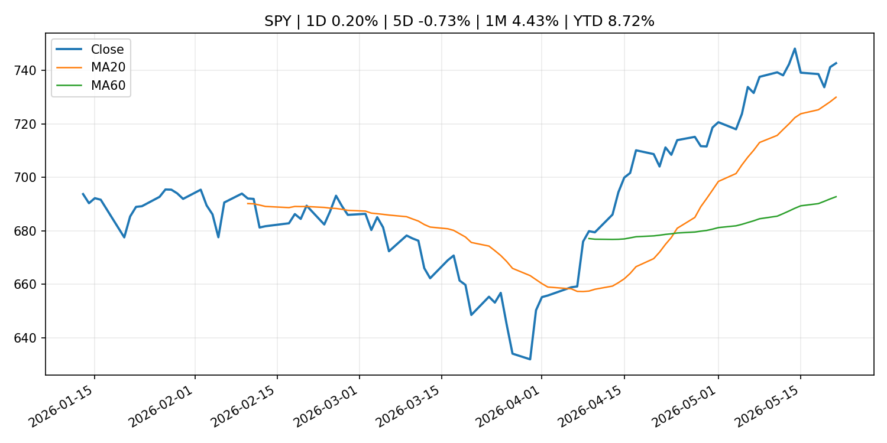
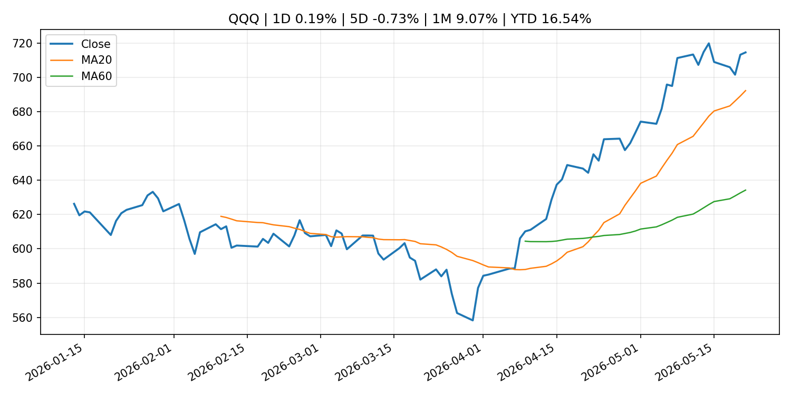
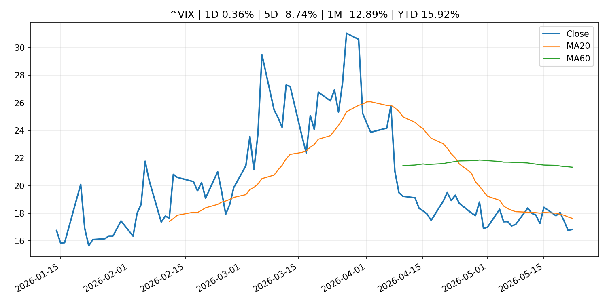
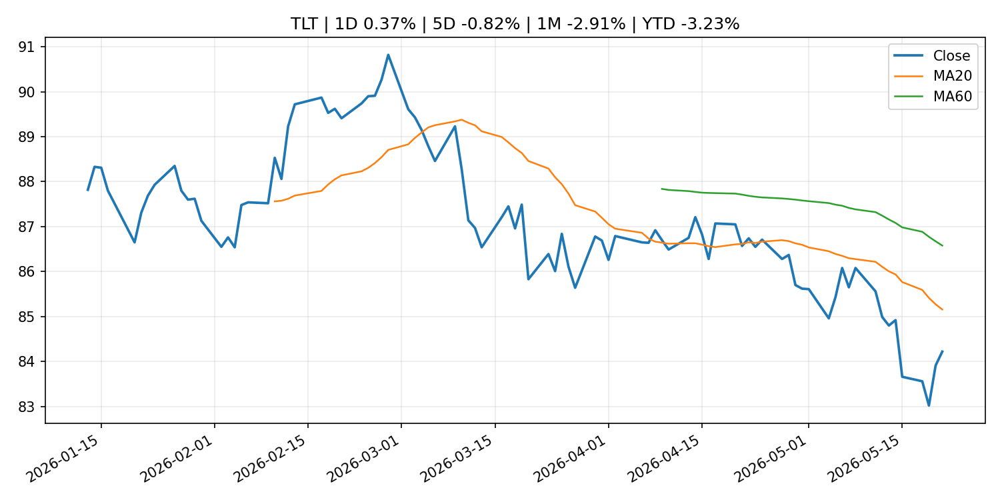
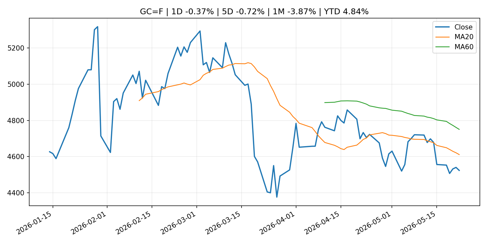
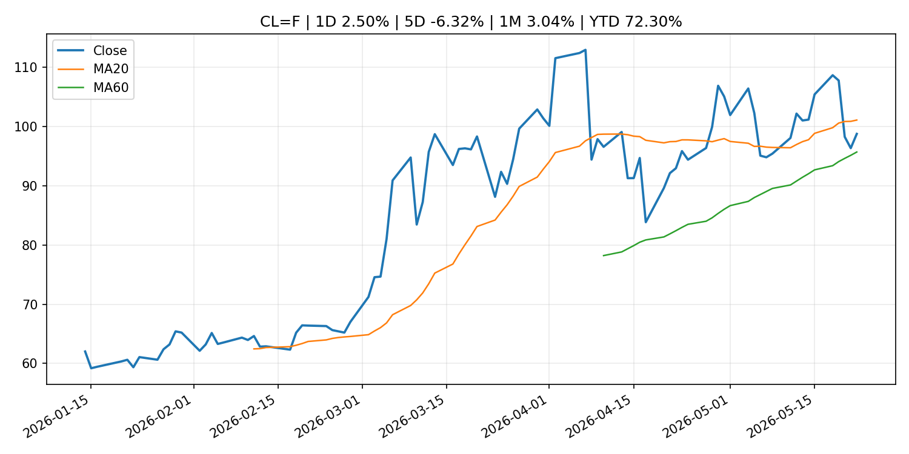
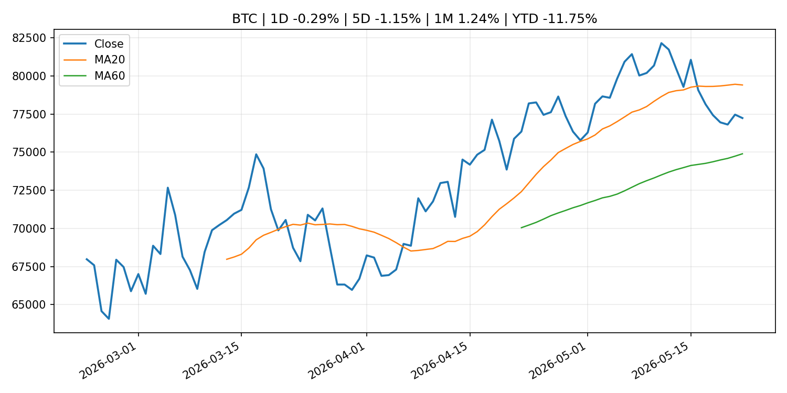
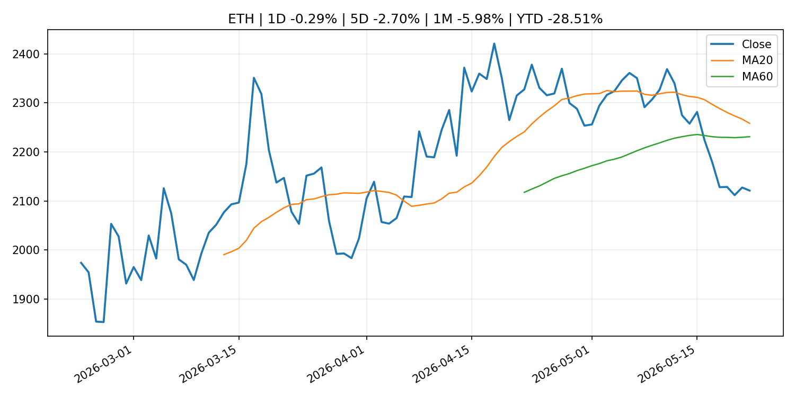
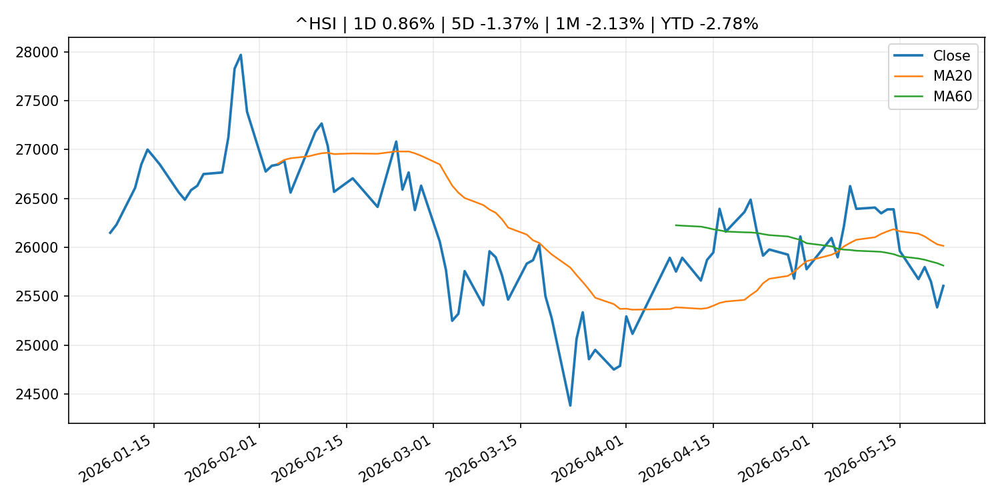

# Global Macro Morning Briefing - 2026-05-22

> 非投资建议，仅供学习、研究与信息整理。Not financial advice.

## 0. 一句话总览
今日晨报重点关注：(Research Paper) Households' Wage Growth Expectations Formation: The Linkage with Price Inflation Expectations；SEC and NFA Announce Memorandum of Understanding to Further Harmonize Regulatory Coordination；Federal Reserve Board issues enforcement action with former employee of Commerce Bank。跨资产方面，SPY 1D 0.20%；QQQ 1D 0.19%；^VIX 1D 0.36%；TLT 1D 0.37%；GC=F 1D -0.37%；CL=F 1D 2.50%；BTC 1D -0.29%；ETH 1D -0.29%。政策、通胀、利率、美元、美债、能源和加密监管仍是主要观察线索。所有结论仅基于公开数据与短摘要整理，不构成投资建议。

## 1. 隔夜跨资产市场
### US_EQUITY

| symbol | latest close | 1D | 5D | 1M | YTD | trend |
|---|---:|---:|---:|---:|---:|---|
| SPY | 742.72 | 0.20% | -0.73% | 4.43% | 8.72% | strong_uptrend |
| QQQ | 714.51 | 0.19% | -0.73% | 9.07% | 16.54% | strong_uptrend |
| DIA | 503.11 | 0.57% | 0.46% | 1.69% | 4.03% | uptrend |
| IWM | 282.49 | 0.94% | -0.69% | 2.17% | 13.55% | uptrend |
| VTI | 365.09 | 0.25% | -0.63% | 3.95% | 8.56% | strong_uptrend |

### US_MACRO_MARKET

| symbol | latest close | 1D | 5D | 1M | YTD | trend |
|---|---:|---:|---:|---:|---:|---|
| ^VIX | 16.82 | 0.36% | -8.74% | -12.89% | 15.92% | strong_downtrend |
| DX-Y.NYB | 99.27 | 0.08% | -0.00% | 0.47% | 0.86% | range_bound |
| TLT | 84.22 | 0.37% | -0.82% | -2.91% | -3.23% | downtrend |
| IEF | 93.80 | 0.06% | -0.49% | -1.80% | -2.37% | downtrend |

### COMMODITIES

| symbol | latest close | 1D | 5D | 1M | YTD | trend |
|---|---:|---:|---:|---:|---:|---|
| GC=F | 4,523.10 | -0.37% | -0.72% | -3.87% | 4.84% | downtrend |
| SI=F | 76.28 | -0.18% | -1.15% | 1.07% | 8.11% | range_bound |
| CL=F | 98.76 | 2.50% | -6.32% | 3.04% | 72.30% | range_bound |
| BZ=F | 105.72 | 3.06% | -3.24% | 0.62% | 74.02% | range_bound |
| NG=F | 3.14 | 4.14% | 6.18% | 20.24% | -13.13% | range_bound |
| HG=F | 6.37 | 1.84% | 1.93% | 4.88% | 12.98% | strong_uptrend |

### HK_MARKET

| symbol | latest close | 1D | 5D | 1M | YTD | trend |
|---|---:|---:|---:|---:|---:|---|
| ^HSI | 25,606.03 | 0.86% | -1.37% | -2.13% | -2.78% | range_bound |
| 0700.HK | 441.40 | 0.55% | -3.29% | -12.42% | -29.15% | strong_downtrend |
| 9988.HK | 127.00 | 0.79% | -4.01% | -3.42% | -14.77% | range_bound |
| 3690.HK | 81.35 | -0.91% | -1.63% | -3.44% | -22.23% | range_bound |
| 1810.HK | 30.00 | 1.15% | -2.28% | -5.66% | -25.52% | strong_downtrend |
| 1211.HK | 91.60 | 1.16% | -5.03% | -14.39% | -7.24% | strong_downtrend |

### CRYPTO

| symbol | latest close | 1D | 5D | 1M | YTD | trend |
|---|---:|---:|---:|---:|---:|---|
| BTC | 77,234.13 | -0.29% | -1.15% | 1.24% | -11.75% | range_bound |
| ETH | 2,121.08 | -0.29% | -2.70% | -5.98% | -28.51% | range_bound |
| SOLANA | 87.02 | 1.18% | 0.59% | 4.83% | -30.11% | range_bound |
| BINANCECOIN | 659.00 | 1.57% | 0.46% | 7.12% | -23.65% | strong_uptrend |
| RIPPLE | 1.36 | -0.23% | -3.64% | -0.39% | -25.96% | range_bound |

## 2. 今日最重要的 10 条新闻
### 1. (Research Paper) Households' Wage Growth Expectations Formation: The Linkage with Price Inflation Expectations
- 来源：Bank of Japan Announcements
- 时间：2026-05-22T16:00:00+09:00
- 链接：[http://www.boj.or.jp/en/research/wps_rev/wps_2026/wp26e09.htm](http://www.boj.or.jp/en/research/wps_rev/wps_2026/wp26e09.htm)
- 一句话摘要：(Research Paper) Households' Wage Growth Expectations Formation: The Linkage with Price Inflation Expectations
- 为什么重要：相关性评分 3.97，类别 central_banks，地区 Japan。
- 相关资产：BTC, DXY, GC=F, IEF, QQQ, SPY, TLT
- 影响方向与强度：mixed / high

### 2. SEC and NFA Announce Memorandum of Understanding to Further Harmonize Regulatory Coordination
- 来源：SEC Press Releases
- 时间：2026-05-21T08:51:10-04:00
- 链接：[https://www.sec.gov/newsroom/press-releases/2026-47](https://www.sec.gov/newsroom/press-releases/2026-47)
- 一句话摘要：The Securities and Exchange Commission (SEC) and National Futures Association (NFA) today announced that they have entered into a Memorandum of Understanding (MOU) to enhance their cooperation, coordination, and information sharing in areas of common…
- 为什么重要：相关性评分 3.54，类别 crypto_policy，地区 US。
- 相关资产：BTC, COIN, ETH, crypto market
- 影响方向与强度：mixed / medium

### 3. Federal Reserve Board issues enforcement action with former employee of Commerce Bank
- 来源：Federal Reserve Press Releases
- 时间：2026-05-21T15:00:00+00:00
- 链接：[https://www.federalreserve.gov/newsevents/pressreleases/enforcement20260521a.htm](https://www.federalreserve.gov/newsevents/pressreleases/enforcement20260521a.htm)
- 一句话摘要：Federal Reserve Board issues enforcement action with former employee of Commerce Bank
- 为什么重要：相关性评分 3.35，类别 central_banks，地区 US。
- 相关资产：未知
- 影响方向与强度：unknown / low

### 4. Japanese Government Bonds Held by the Bank of Japan
- 来源：Bank of Japan Announcements
- 时间：2026-05-22T17:00:00+09:00
- 链接：[http://www.boj.or.jp/en/statistics/boj/other/mei/release/2026/mei260520.xlsx](http://www.boj.or.jp/en/statistics/boj/other/mei/release/2026/mei260520.xlsx)
- 一句话摘要：Japanese Government Bonds Held by the Bank of Japan
- 为什么重要：相关性评分 3.24，类别 central_banks，地区 Japan。
- 相关资产：未知
- 影响方向与强度：unknown / low

### 5. Developments in Real Exports and Real Imports
- 来源：Bank of Japan Announcements
- 时间：2026-05-22T16:00:00+09:00
- 链接：[http://www.boj.or.jp/en/research/research_data/reri/index.htm](http://www.boj.or.jp/en/research/research_data/reri/index.htm)
- 一句话摘要：Developments in Real Exports and Real Imports
- 为什么重要：相关性评分 3.22，类别 central_banks，地区 Japan。
- 相关资产：未知
- 影响方向与强度：unknown / low

### 6. (BOJ Review) Developments in and Characteristics of Japan's FX Market: An Analysis Based on the 2025 BIS Triennial Central Bank Survey
- 来源：Bank of Japan Announcements
- 时间：2026-05-22T10:30:00+09:00
- 链接：[http://www.boj.or.jp/en/research/wps_rev/rev_2026/rev26e08.htm](http://www.boj.or.jp/en/research/wps_rev/rev_2026/rev26e08.htm)
- 一句话摘要：(BOJ Review) Developments in and Characteristics of Japan's FX Market: An Analysis Based on the 2025 BIS Triennial Central Bank Survey
- 为什么重要：相关性评分 3.15，类别 central_banks，地区 Japan。
- 相关资产：未知
- 影响方向与强度：unknown / low

### 7. Philip R. Lane: Europe and the world economy
- 来源：ECB Press Releases
- 时间：2026-05-22T03:15:00+02:00
- 链接：[https://www.ecb.europa.eu//press/key/date/2026/html/ecb.sp260522~f0f11a5f05.en.html](https://www.ecb.europa.eu//press/key/date/2026/html/ecb.sp260522~f0f11a5f05.en.html)
- 一句话摘要：Philip R. Lane: Europe and the world economy
- 为什么重要：相关性评分 3.14，类别 central_banks，地区 EU。
- 相关资产：未知
- 影响方向与强度：unknown / low

### 8. Bank of Japan Accounts (May 20)
- 来源：Bank of Japan Announcements
- 时间：2026-05-22T10:00:00+09:00
- 链接：[http://www.boj.or.jp/en/statistics/boj/other/acmai/release/2026/ac260520.htm](http://www.boj.or.jp/en/statistics/boj/other/acmai/release/2026/ac260520.htm)
- 一句话摘要：Bank of Japan Accounts (May 20)
- 为什么重要：相关性评分 3.14，类别 central_banks，地区 Japan。
- 相关资产：未知
- 影响方向与强度：unknown / low

### 9. (Research Paper) How Do Floods Affect Banks' Financial Conditions? Evidence from Japan
- 来源：Bank of Japan Announcements
- 时间：2026-05-22T10:00:00+09:00
- 链接：[http://www.boj.or.jp/en/research/wps_rev/wps_2026/wp26e08.htm](http://www.boj.or.jp/en/research/wps_rev/wps_2026/wp26e08.htm)
- 一句话摘要：(Research Paper) How Do Floods Affect Banks' Financial Conditions? Evidence from Japan
- 为什么重要：相关性评分 3.14，类别 central_banks，地区 Japan。
- 相关资产：未知
- 影响方向与强度：unknown / low

### 10. (Research Paper) Beyond the Floodplain: Uncovering the Spatial Spillovers of Land Price Declines after Typhoon Hagibis
- 来源：Bank of Japan Announcements
- 时间：2026-05-22T10:00:00+09:00
- 链接：[http://www.boj.or.jp/en/research/wps_rev/wps_2026/wp26e07.htm](http://www.boj.or.jp/en/research/wps_rev/wps_2026/wp26e07.htm)
- 一句话摘要：(Research Paper) Beyond the Floodplain: Uncovering the Spatial Spillovers of Land Price Declines after Typhoon Hagibis
- 为什么重要：相关性评分 3.14，类别 central_banks，地区 Japan。
- 相关资产：未知
- 影响方向与强度：unknown / low

## 3. 政策与央行观察
### 1. (Research Paper) Households' Wage Growth Expectations Formation: The Linkage with Price Inflation Expectations
- 来源：Bank of Japan Announcements
- 时间：2026-05-22T16:00:00+09:00
- 链接：[http://www.boj.or.jp/en/research/wps_rev/wps_2026/wp26e09.htm](http://www.boj.or.jp/en/research/wps_rev/wps_2026/wp26e09.htm)
- 一句话摘要：(Research Paper) Households' Wage Growth Expectations Formation: The Linkage with Price Inflation Expectations
- 为什么重要：相关性评分 3.97，类别 central_banks，地区 Japan。
- 相关资产：BTC, DXY, GC=F, IEF, QQQ, SPY, TLT
- 影响方向与强度：mixed / high

### 2. SEC and NFA Announce Memorandum of Understanding to Further Harmonize Regulatory Coordination
- 来源：SEC Press Releases
- 时间：2026-05-21T08:51:10-04:00
- 链接：[https://www.sec.gov/newsroom/press-releases/2026-47](https://www.sec.gov/newsroom/press-releases/2026-47)
- 一句话摘要：The Securities and Exchange Commission (SEC) and National Futures Association (NFA) today announced that they have entered into a Memorandum of Understanding (MOU) to enhance their cooperation, coordination, and information sharing in areas of common…
- 为什么重要：相关性评分 3.54，类别 crypto_policy，地区 US。
- 相关资产：BTC, COIN, ETH, crypto market
- 影响方向与强度：mixed / medium

### 3. Federal Reserve Board issues enforcement action with former employee of Commerce Bank
- 来源：Federal Reserve Press Releases
- 时间：2026-05-21T15:00:00+00:00
- 链接：[https://www.federalreserve.gov/newsevents/pressreleases/enforcement20260521a.htm](https://www.federalreserve.gov/newsevents/pressreleases/enforcement20260521a.htm)
- 一句话摘要：Federal Reserve Board issues enforcement action with former employee of Commerce Bank
- 为什么重要：相关性评分 3.35，类别 central_banks，地区 US。
- 相关资产：未知
- 影响方向与强度：unknown / low

### 4. Japanese Government Bonds Held by the Bank of Japan
- 来源：Bank of Japan Announcements
- 时间：2026-05-22T17:00:00+09:00
- 链接：[http://www.boj.or.jp/en/statistics/boj/other/mei/release/2026/mei260520.xlsx](http://www.boj.or.jp/en/statistics/boj/other/mei/release/2026/mei260520.xlsx)
- 一句话摘要：Japanese Government Bonds Held by the Bank of Japan
- 为什么重要：相关性评分 3.24，类别 central_banks，地区 Japan。
- 相关资产：未知
- 影响方向与强度：unknown / low

### 5. Developments in Real Exports and Real Imports
- 来源：Bank of Japan Announcements
- 时间：2026-05-22T16:00:00+09:00
- 链接：[http://www.boj.or.jp/en/research/research_data/reri/index.htm](http://www.boj.or.jp/en/research/research_data/reri/index.htm)
- 一句话摘要：Developments in Real Exports and Real Imports
- 为什么重要：相关性评分 3.22，类别 central_banks，地区 Japan。
- 相关资产：未知
- 影响方向与强度：unknown / low

### 6. (BOJ Review) Developments in and Characteristics of Japan's FX Market: An Analysis Based on the 2025 BIS Triennial Central Bank Survey
- 来源：Bank of Japan Announcements
- 时间：2026-05-22T10:30:00+09:00
- 链接：[http://www.boj.or.jp/en/research/wps_rev/rev_2026/rev26e08.htm](http://www.boj.or.jp/en/research/wps_rev/rev_2026/rev26e08.htm)
- 一句话摘要：(BOJ Review) Developments in and Characteristics of Japan's FX Market: An Analysis Based on the 2025 BIS Triennial Central Bank Survey
- 为什么重要：相关性评分 3.15，类别 central_banks，地区 Japan。
- 相关资产：未知
- 影响方向与强度：unknown / low

### 7. Philip R. Lane: Europe and the world economy
- 来源：ECB Press Releases
- 时间：2026-05-22T03:15:00+02:00
- 链接：[https://www.ecb.europa.eu//press/key/date/2026/html/ecb.sp260522~f0f11a5f05.en.html](https://www.ecb.europa.eu//press/key/date/2026/html/ecb.sp260522~f0f11a5f05.en.html)
- 一句话摘要：Philip R. Lane: Europe and the world economy
- 为什么重要：相关性评分 3.14，类别 central_banks，地区 EU。
- 相关资产：未知
- 影响方向与强度：unknown / low

### 8. Bank of Japan Accounts (May 20)
- 来源：Bank of Japan Announcements
- 时间：2026-05-22T10:00:00+09:00
- 链接：[http://www.boj.or.jp/en/statistics/boj/other/acmai/release/2026/ac260520.htm](http://www.boj.or.jp/en/statistics/boj/other/acmai/release/2026/ac260520.htm)
- 一句话摘要：Bank of Japan Accounts (May 20)
- 为什么重要：相关性评分 3.14，类别 central_banks，地区 Japan。
- 相关资产：未知
- 影响方向与强度：unknown / low

### 9. (Research Paper) How Do Floods Affect Banks' Financial Conditions? Evidence from Japan
- 来源：Bank of Japan Announcements
- 时间：2026-05-22T10:00:00+09:00
- 链接：[http://www.boj.or.jp/en/research/wps_rev/wps_2026/wp26e08.htm](http://www.boj.or.jp/en/research/wps_rev/wps_2026/wp26e08.htm)
- 一句话摘要：(Research Paper) How Do Floods Affect Banks' Financial Conditions? Evidence from Japan
- 为什么重要：相关性评分 3.14，类别 central_banks，地区 Japan。
- 相关资产：未知
- 影响方向与强度：unknown / low

### 10. (Research Paper) Beyond the Floodplain: Uncovering the Spatial Spillovers of Land Price Declines after Typhoon Hagibis
- 来源：Bank of Japan Announcements
- 时间：2026-05-22T10:00:00+09:00
- 链接：[http://www.boj.or.jp/en/research/wps_rev/wps_2026/wp26e07.htm](http://www.boj.or.jp/en/research/wps_rev/wps_2026/wp26e07.htm)
- 一句话摘要：(Research Paper) Beyond the Floodplain: Uncovering the Spatial Spillovers of Land Price Declines after Typhoon Hagibis
- 为什么重要：相关性评分 3.14，类别 central_banks，地区 Japan。
- 相关资产：未知
- 影响方向与强度：unknown / low

## 4. 核心图表
### SPY

### QQQ

### ^VIX

### TLT

### GC=F

### CL=F

### BTC

### ETH

### ^HSI

## 5. 华尔街与机构公开观点
- 暂无可靠公开机构观点；不会绕过付费墙。

## 6. 今日重点关注
- 暂无可靠数据。

## 7. 英文金融表达与宏观概念
- **soft landing**：软着陆，指经济在通胀回落时避免明显衰退。 例句：Investors are pricing in a soft landing as inflation cools.
- **yield curve steepening**：收益率曲线变陡，通常指长端利率相对短端上升。 例句：A steepening yield curve can reflect stronger growth expectations.
- **risk-off**：避险模式，资金偏向债券、美元、黄金等防御资产。 例句：Markets turned risk-off after weaker payroll data.
- **real yield**：实际收益率，名义利率扣除通胀预期后的收益率。 例句：Gold often reacts to moves in real yields.
- **liquidity**：流动性，既可指市场交易深度，也可指宏观资金环境。 例句：Tighter liquidity can weigh on high-duration assets.
- **credit spread**：信用利差，企业债收益率相对国债的额外补偿。 例句：Widening credit spreads may signal rising default concerns.

## 8. 数据源与免责声明
- 采集时间：2026-05-22T08:52:48
- 数据源：公开 RSS、Yahoo Finance、CoinGecko、AKShare、FRED、SEC data.sec.gov，以及用户自有 inputs/reports 文件。
- 合规说明：不绕过 WSJ、Bloomberg、FT、Reuters 等付费墙；对付费媒体只使用公开 RSS 标题、摘要、链接和发布时间。
- 免责声明：Not financial advice / 非投资建议。本项目仅供个人学习、研究和信息整理，不构成投资建议、交易建议或任何收益承诺。
- 失败或跳过的数据源：
  - crypto data failed coin=dogecoin
  - China market data failed symbol=上证指数: empty dataframe
  - China market data failed symbol=深证成指: empty dataframe
  - China market data failed symbol=创业板指: empty dataframe
  - China market data failed symbol=沪深300: empty dataframe
  - China market data failed symbol=中证500: empty dataframe
  - China market data failed symbol=科创50: empty dataframe
  - FRED_API_KEY not set; skipping FRED macro series
  - SEC failed cik=0000320193
  - SEC failed cik=0000789019
  - SEC failed cik=0001045810
  - SEC failed cik=0001318605
  - SEC failed cik=0001577552
