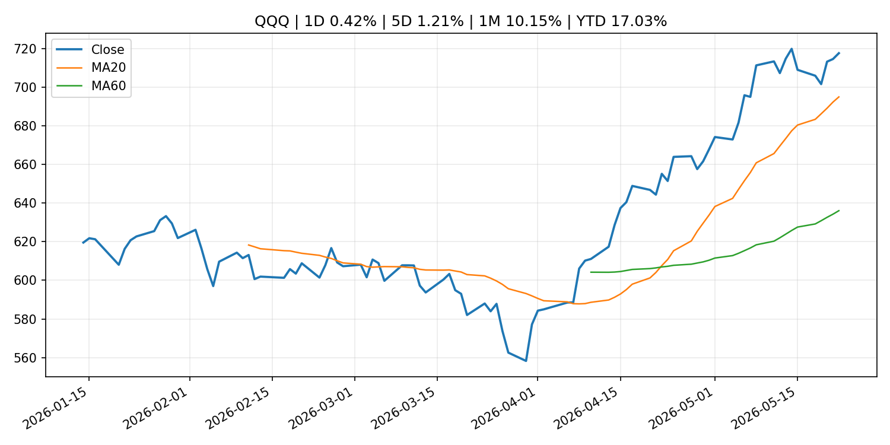
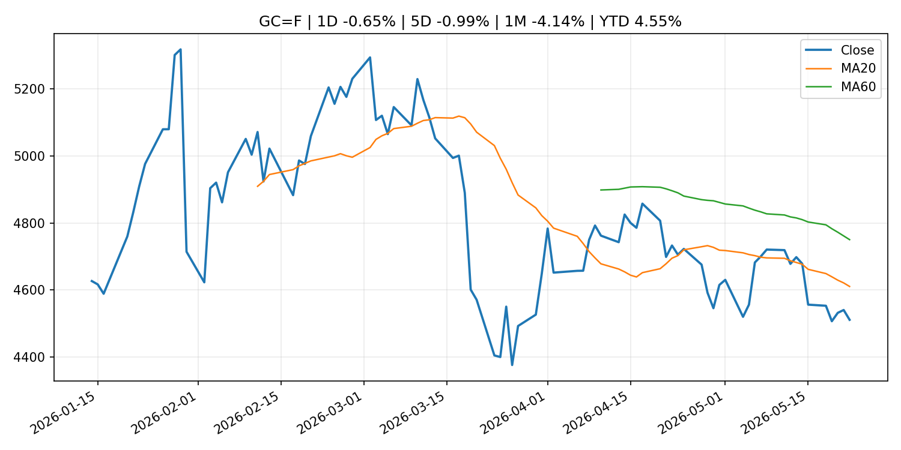
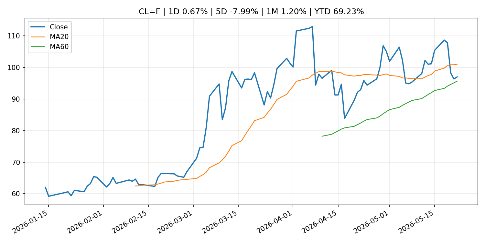
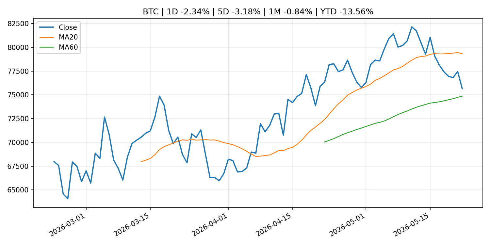
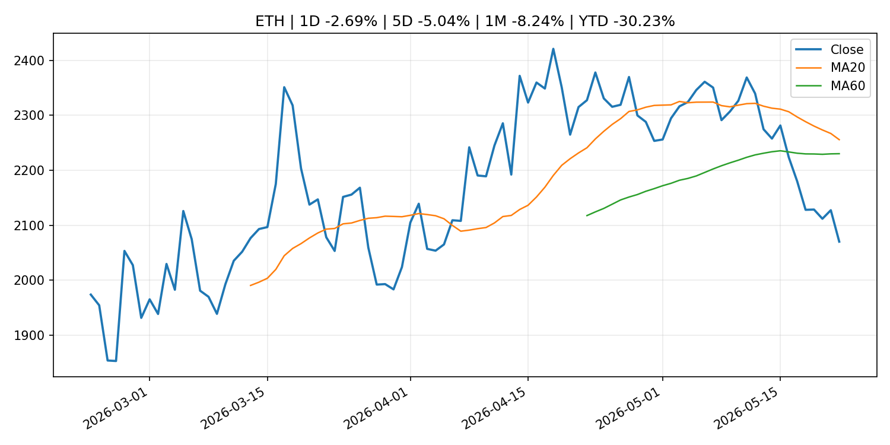
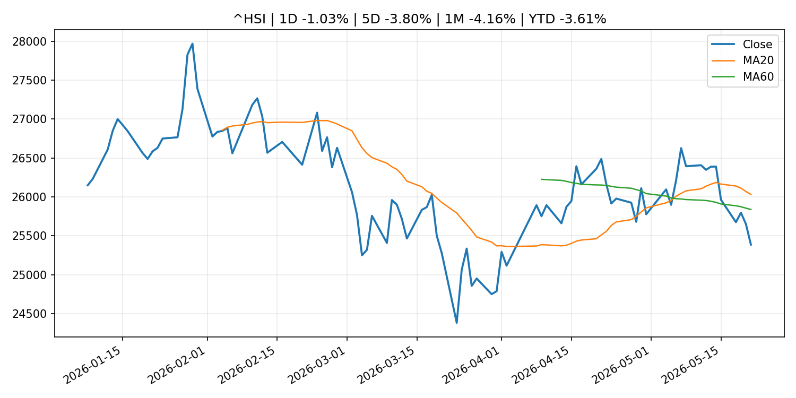

# Global Macro Morning Briefing - 2026-05-23

> Not financial advice / 非投资建议。

## 0. 今日总览
- 市场状态：risk_on。股指上涨、波动率或美元回落，市场更接近风险偏好改善。
- 今日三大主线：
  1. geopolitical_risk: Satoshi’s 1.1 million bitcoin and millions more can be saved from quantum attack, says expert
  2. financial_stability: (BOJ Review) International Comparison of Life Insurers: Evolving Business Models and Financial Stability Issues
  3. research_publication: (Research Paper) Households' Wage Growth Expectations Formation: The Linkage with Price Inflation Expectations
- 一句话结论：今日晨报重点关注：地缘风险可能推升避险需求、能源价格和市场波动率。；金融稳定信号可能放大跨资产波动，并影响央行反应函数。。跨资产方面，SPY 1D 0.39%；QQQ 1D 0.42%；^VIX 1D -0.36%；TLT 1D 0.55%；GC=F 1D -0.65%；CL=F 1D 0.67%；BTC 1D -2.34%；ETH 1D -2.69%；股指上涨、波动率或美元回落，市场更接近风险偏好改善。政策、通胀、利率、美元、美债、能源和加密监管仍是主要观察线索。所有结论仅基于公开数据与短摘要整理，不构成投资建议。

## 1. 隔夜跨资产市场
- 美股：SPY 1D 0.39%，QQQ 1D 0.42%，整体趋势需结合 VIX 和利率确认。
- 美债/美元：TLT 1D 0.55%，美元指数 1D 0.13%，是判断折现率压力的核心线索。
- 黄金/原油：黄金 1D -0.65%，原油 1D 0.67%，用于观察避险、通胀和地缘风险。
- 加密：BTC 1D -2.34%，ETH 1D -2.69%，关注是否独立于纳指走出加密自身行情。
- 港股/A股：恒生 1D -1.03%，沪深300/上证 1D n/a，重点看中国政策预期与人民币线索。
- 风险观察：确认风险偏好是否扩散到小盘股、信用利差和周期品。

### US_EQUITY

| symbol | latest close | 1D | 5D | 1M | YTD | trend |
|---|---:|---:|---:|---:|---:|---|
| SPY | 745.64 | 0.39% | 0.88% | 5.25% | 9.14% | strong_uptrend |
| QQQ | 717.54 | 0.42% | 1.21% | 10.15% | 17.03% | strong_uptrend |
| DIA | 506.12 | 0.60% | 2.17% | 2.66% | 4.65% | uptrend |
| IWM | 285.12 | 0.93% | 2.71% | 3.48% | 14.61% | strong_uptrend |
| VTI | 366.79 | 0.47% | 1.12% | 4.86% | 9.06% | strong_uptrend |

### US_MACRO_MARKET

| symbol | latest close | 1D | 5D | 1M | YTD | trend |
|---|---:|---:|---:|---:|---:|---|
| ^VIX | 16.70 | -0.36% | -9.39% | -13.52% | 15.09% | strong_downtrend |
| DX-Y.NYB | 99.32 | 0.13% | 0.05% | 0.53% | 0.91% | range_bound |
| TLT | 84.68 | 0.55% | 1.22% | -2.16% | -2.70% | downtrend |
| IEF | 93.88 | 0.09% | 0.40% | -1.56% | -2.29% | downtrend |

### COMMODITIES

| symbol | latest close | 1D | 5D | 1M | YTD | trend |
|---|---:|---:|---:|---:|---:|---|
| GC=F | 4,510.50 | -0.65% | -0.99% | -4.14% | 4.55% | downtrend |
| SI=F | 75.92 | -0.65% | -1.61% | 0.60% | 7.60% | range_bound |
| CL=F | 97.00 | 0.67% | -7.99% | 1.20% | 69.23% | range_bound |
| BZ=F | 103.94 | 1.33% | -4.87% | -1.08% | 71.09% | range_bound |
| NG=F | 3.03 | 0.53% | 2.50% | 16.07% | -16.14% | range_bound |
| HG=F | 6.38 | 1.97% | 2.06% | 5.02% | 13.13% | strong_uptrend |

### HK_MARKET

| symbol | latest close | 1D | 5D | 1M | YTD | trend |
|---|---:|---:|---:|---:|---:|---|
| ^HSI | 25,386.52 | -1.03% | -3.80% | -4.16% | -3.61% | range_bound |
| 0700.HK | 441.40 | 0.55% | -3.29% | -12.42% | -29.15% | strong_downtrend |
| 9988.HK | 127.00 | 0.79% | -4.01% | -3.42% | -14.77% | range_bound |
| 3690.HK | 81.35 | -0.91% | -1.63% | -3.44% | -22.23% | range_bound |
| 1810.HK | 30.00 | 1.15% | -2.28% | -5.66% | -25.52% | strong_downtrend |
| 1211.HK | 91.60 | 1.16% | -5.03% | -14.39% | -7.24% | strong_downtrend |

### CRYPTO

| symbol | latest close | 1D | 5D | 1M | YTD | trend |
|---|---:|---:|---:|---:|---:|---|
| BTC | 75,649.18 | -2.34% | -3.18% | -0.84% | -13.56% | range_bound |
| ETH | 2,070.05 | -2.69% | -5.04% | -8.24% | -30.23% | range_bound |
| SOLANA | 84.86 | -1.33% | -1.91% | 2.23% | -31.85% | range_bound |
| BINANCECOIN | 651.36 | 0.39% | -0.70% | 5.88% | -24.54% | strong_uptrend |
| RIPPLE | 1.34 | -1.96% | -5.31% | -2.11% | -27.24% | range_bound |

## 2. 今日最重要的 10 条新闻
### 1. Satoshi’s 1.1 million bitcoin and millions more can be saved from quantum attack, says expert
- 来源：CoinDesk
- 时间：2026-05-21T19:10:03+00:00
- 地区：global
- 事件类型：geopolitical_risk
- 重要性层级：Tier 1
- 一句话摘要：Satoshi’s 1.1 million bitcoin and millions more can be saved from quantum attack, says expert
- 为什么重要：地缘风险可能推升避险需求、能源价格和市场波动率。
- 可能影响：可能影响利率、汇率、风险资产或大宗商品预期，但当前公开信息不足以判断明确方向。
  - 资产：暂无明确资产映射
  - 方向：unknown
  - 强度：low
  - 原因：公开信息不足以判断方向。
- 原文链接：[https://www.coindesk.com/tech/2026/05/21/satoshi-s-1-1m-bitcoin-stash-can-be-saved-from-quantum-attack-says-americanfortress](https://www.coindesk.com/tech/2026/05/21/satoshi-s-1-1m-bitcoin-stash-can-be-saved-from-quantum-attack-says-americanfortress)

### 2. (BOJ Review) International Comparison of Life Insurers: Evolving Business Models and Financial Stability Issues
- 来源：Bank of Japan Announcements
- 时间：2026-05-21T14:00:00+09:00
- 地区：Japan
- 事件类型：financial_stability
- 重要性层级：Tier 1
- 一句话摘要：(BOJ Review) International Comparison of Life Insurers: Evolving Business Models and Financial Stability Issues
- 为什么重要：金融稳定信号可能放大跨资产波动，并影响央行反应函数。
- 可能影响：可能影响利率、汇率、风险资产或大宗商品预期，但当前公开信息不足以判断明确方向。
  - 资产：暂无明确资产映射
  - 方向：unknown
  - 强度：low
  - 原因：公开信息不足以判断方向。
- 原文链接：[http://www.boj.or.jp/en/research/wps_rev/rev_2026/rev26e07.htm](http://www.boj.or.jp/en/research/wps_rev/rev_2026/rev26e07.htm)

### 3. (Research Paper) Households' Wage Growth Expectations Formation: The Linkage with Price Inflation Expectations
- 来源：Bank of Japan Announcements
- 时间：2026-05-22T16:00:00+09:00
- 地区：Japan
- 事件类型：research_publication
- 重要性层级：Tier 2
- 一句话摘要：(Research Paper) Households' Wage Growth Expectations Formation: The Linkage with Price Inflation Expectations
- 为什么重要：研究论文通常是背景材料，本身不一定代表即时政策变化。 但标题或摘要同时涉及重大市场主题，因此提升为重要跟踪项。
- 可能影响：主要影响 DXY，方向为 positive，强度 high；通胀压力可能推高政策利率预期并支撑美元。
  - 资产：DXY
    方向：positive
    强度：high
    原因：通胀压力可能推高政策利率预期并支撑美元。
  - 资产：TLT
    方向：negative
    强度：high
    原因：通胀上行通常推升收益率、压低长债价格。
  - 资产：QQQ
    方向：negative
    强度：high
    原因：更高利率对成长股估值折现率不利。
  - 资产：SPY
    方向：mixed
    强度：medium
    原因：名义增长可能支撑收入，但更高利率压制估值。
  - 资产：GC=F
    方向：mixed
    强度：medium
    原因：通胀对黄金是支撑，但实际利率上行会形成压力。
  - 资产：BTC
    方向：mixed
    强度：medium
    原因：抗通胀叙事和流动性收紧可能相互抵消。
- 原文链接：[http://www.boj.or.jp/en/research/wps_rev/wps_2026/wp26e09.htm](http://www.boj.or.jp/en/research/wps_rev/wps_2026/wp26e09.htm)

### 4. SEC Commissioner Peirce counters views that crypto rule will foster synthetic tokens
- 来源：CoinDesk
- 时间：2026-05-22T18:20:32+00:00
- 地区：global
- 事件类型：regulation
- 重要性层级：Tier 2
- 一句话摘要：SEC Commissioner Peirce counters views that crypto rule will foster synthetic tokens
- 为什么重要：监管变化会改变行业盈利预期和资产风险溢价。
- 可能影响：主要影响 BTC，方向为 mixed，强度 high；加密监管或 ETF 进展会改变 BTC 的资金流和风险溢价。
  - 资产：BTC
    方向：mixed
    强度：high
    原因：加密监管或 ETF 进展会改变 BTC 的资金流和风险溢价。
  - 资产：ETH
    方向：mixed
    强度：high
    原因：监管框架会影响 ETH 产品化和机构参与度。
  - 资产：COIN
    方向：mixed
    强度：medium
    原因：监管清晰度和执法风险会影响交易平台估值。
  - 资产：crypto market
    方向：mixed
    强度：high
    原因：信息影响整个加密市场结构，但方向取决于细节。
- 原文链接：[https://www.coindesk.com/news-analysis/2026/05/22/sec-commissioner-peirce-counters-views-that-crypto-rule-will-foster-synthetic-tokens](https://www.coindesk.com/news-analysis/2026/05/22/sec-commissioner-peirce-counters-views-that-crypto-rule-will-foster-synthetic-tokens)

### 5. SEC and NFA Announce Memorandum of Understanding to Further Harmonize Regulatory Coordination
- 来源：SEC Press Releases
- 时间：2026-05-21T08:51:10-04:00
- 地区：US
- 事件类型：regulation
- 重要性层级：Tier 2
- 一句话摘要：The Securities and Exchange Commission (SEC) and National Futures Association (NFA) today announced that they have entered into a Memorandum of Understanding (MOU) to enhance their cooperation, coordination, and information sharing in areas of common…
- 为什么重要：监管变化会改变行业盈利预期和资产风险溢价。
- 可能影响：主要影响 BTC，方向为 mixed，强度 high；加密监管或 ETF 进展会改变 BTC 的资金流和风险溢价。
  - 资产：BTC
    方向：mixed
    强度：high
    原因：加密监管或 ETF 进展会改变 BTC 的资金流和风险溢价。
  - 资产：ETH
    方向：mixed
    强度：high
    原因：监管框架会影响 ETH 产品化和机构参与度。
  - 资产：COIN
    方向：mixed
    强度：medium
    原因：监管清晰度和执法风险会影响交易平台估值。
  - 资产：crypto market
    方向：mixed
    强度：high
    原因：信息影响整个加密市场结构，但方向取决于细节。
- 原文链接：[https://www.sec.gov/newsroom/press-releases/2026-47](https://www.sec.gov/newsroom/press-releases/2026-47)

### 6. Kevin Warsh walks into a trap where the Fed can’t cut rates even if it wants to
- 来源：MarketWatch Top Stories
- 时间：2026-05-22T20:01:00+00:00
- 地区：US
- 事件类型：central_bank_speech
- 重要性层级：Tier 2
- 一句话摘要：Kevin Warsh is becoming Federal Reserve chair at a pivotal moment for the U.S. economy — forcing him to be something other than the disruptor he hoped to be.
- 为什么重要：央行官员表态可能影响市场对下一次会议的定价。
- 可能影响：可能影响利率、汇率、风险资产或大宗商品预期，但当前公开信息不足以判断明确方向。
  - 资产：暂无明确资产映射
  - 方向：unknown
  - 强度：low
  - 原因：公开信息不足以判断方向。
- 原文链接：[https://www.marketwatch.com/story/kevin-warsh-walks-into-a-trap-where-the-fed-cant-cut-rates-even-if-it-wants-to-8475e97c?mod=mw_rss_topstories](https://www.marketwatch.com/story/kevin-warsh-walks-into-a-trap-where-the-fed-cant-cut-rates-even-if-it-wants-to-8475e97c?mod=mw_rss_topstories)

### 7. Despite murky legal landscape, companies are undeterred in their prediction market investments
- 来源：CNBC Economy
- 时间：2026-05-22T15:14:52+00:00
- 地区：US
- 事件类型：earnings
- 重要性层级：Tier 2
- 一句话摘要：Companies reiterated plans to growing their prediction markets businesses in recent earnings calls even as a regulatory debate continues.
- 为什么重要：大型科技股盈利和资本开支会影响纳指、半导体和 AI 交易主线。
- 可能影响：可能影响利率、汇率、风险资产或大宗商品预期，但当前公开信息不足以判断明确方向。
  - 资产：暂无明确资产映射
  - 方向：unknown
  - 强度：low
  - 原因：公开信息不足以判断方向。
- 原文链接：[https://www.cnbc.com/2026/05/22/companies-keep-investing-in-prediction-markets-despite-legal-battle.html](https://www.cnbc.com/2026/05/22/companies-keep-investing-in-prediction-markets-despite-legal-battle.html)

### 8. Federal Reserve Board issues enforcement action with former employee of Commerce Bank
- 来源：Federal Reserve Press Releases
- 时间：2026-05-21T15:00:00+00:00
- 地区：US
- 事件类型：regulation
- 重要性层级：Tier 2
- 一句话摘要：Federal Reserve Board issues enforcement action with former employee of Commerce Bank
- 为什么重要：监管变化会改变行业盈利预期和资产风险溢价。
- 可能影响：可能影响利率、汇率、风险资产或大宗商品预期，但当前公开信息不足以判断明确方向。
  - 资产：暂无明确资产映射
  - 方向：unknown
  - 强度：low
  - 原因：公开信息不足以判断方向。
- 原文链接：[https://www.federalreserve.gov/newsevents/pressreleases/enforcement20260521a.htm](https://www.federalreserve.gov/newsevents/pressreleases/enforcement20260521a.htm)

### 9. Speech by Board Member KOEDA in Fukuoka (Economic Activity, Prices, and Monetary Policy in Japan)
- 来源：Bank of Japan Announcements
- 时间：2026-05-21T10:30:00+09:00
- 地区：Japan
- 事件类型：central_bank_speech
- 重要性层级：Tier 2
- 一句话摘要：Speech by Board Member KOEDA in Fukuoka (Economic Activity, Prices, and Monetary Policy in Japan)
- 为什么重要：央行官员表态可能影响市场对下一次会议的定价。
- 可能影响：可能影响利率、汇率、风险资产或大宗商品预期，但当前公开信息不足以判断明确方向。
  - 资产：暂无明确资产映射
  - 方向：unknown
  - 强度：low
  - 原因：公开信息不足以判断方向。
- 原文链接：[http://www.boj.or.jp/en/about/press/koen_2026/ko260521a.htm](http://www.boj.or.jp/en/about/press/koen_2026/ko260521a.htm)

### 10. Kevin Warsh takes oath of office as chairman and a member of the Board of Governors of the Federal Reserve System, and the Federal Open Market Committee unanimously selects Warsh as its chairman
- 来源：Federal Reserve Press Releases
- 时间：2026-05-22T20:15:00+00:00
- 地区：US
- 事件类型：other
- 重要性层级：Tier 3
- 一句话摘要：Kevin Warsh takes oath of office as chairman and a member of the Board of Governors of the Federal Reserve System, and the Federal Open Market Committee unanimously selects Warsh as its chairman
- 为什么重要：这条信息暂未匹配到重大宏观、政策或市场事件，更适合作为背景跟踪。
- 可能影响：更偏背景信息，短期市场影响可能有限。
  - 资产：暂无明确资产映射
  - 方向：unknown
  - 强度：low
  - 原因：公开信息不足以判断方向。
- 原文链接：[https://www.federalreserve.gov/newsevents/pressreleases/other20260522a.htm](https://www.federalreserve.gov/newsevents/pressreleases/other20260522a.htm)

## 3. 政策与央行观察
### 1. (BOJ Review) International Comparison of Life Insurers: Evolving Business Models and Financial Stability Issues
- 来源：Bank of Japan Announcements
- 时间：2026-05-21T14:00:00+09:00
- 地区：Japan
- 事件类型：financial_stability
- 重要性层级：Tier 1
- 一句话摘要：(BOJ Review) International Comparison of Life Insurers: Evolving Business Models and Financial Stability Issues
- 为什么重要：金融稳定信号可能放大跨资产波动，并影响央行反应函数。
- 可能影响：可能影响利率、汇率、风险资产或大宗商品预期，但当前公开信息不足以判断明确方向。
  - 资产：暂无明确资产映射
  - 方向：unknown
  - 强度：low
  - 原因：公开信息不足以判断方向。
- 原文链接：[http://www.boj.or.jp/en/research/wps_rev/rev_2026/rev26e07.htm](http://www.boj.or.jp/en/research/wps_rev/rev_2026/rev26e07.htm)

### 2. SEC Commissioner Peirce counters views that crypto rule will foster synthetic tokens
- 来源：CoinDesk
- 时间：2026-05-22T18:20:32+00:00
- 地区：global
- 事件类型：regulation
- 重要性层级：Tier 2
- 一句话摘要：SEC Commissioner Peirce counters views that crypto rule will foster synthetic tokens
- 为什么重要：监管变化会改变行业盈利预期和资产风险溢价。
- 可能影响：主要影响 BTC，方向为 mixed，强度 high；加密监管或 ETF 进展会改变 BTC 的资金流和风险溢价。
  - 资产：BTC
    方向：mixed
    强度：high
    原因：加密监管或 ETF 进展会改变 BTC 的资金流和风险溢价。
  - 资产：ETH
    方向：mixed
    强度：high
    原因：监管框架会影响 ETH 产品化和机构参与度。
  - 资产：COIN
    方向：mixed
    强度：medium
    原因：监管清晰度和执法风险会影响交易平台估值。
  - 资产：crypto market
    方向：mixed
    强度：high
    原因：信息影响整个加密市场结构，但方向取决于细节。
- 原文链接：[https://www.coindesk.com/news-analysis/2026/05/22/sec-commissioner-peirce-counters-views-that-crypto-rule-will-foster-synthetic-tokens](https://www.coindesk.com/news-analysis/2026/05/22/sec-commissioner-peirce-counters-views-that-crypto-rule-will-foster-synthetic-tokens)

### 3. SEC and NFA Announce Memorandum of Understanding to Further Harmonize Regulatory Coordination
- 来源：SEC Press Releases
- 时间：2026-05-21T08:51:10-04:00
- 地区：US
- 事件类型：regulation
- 重要性层级：Tier 2
- 一句话摘要：The Securities and Exchange Commission (SEC) and National Futures Association (NFA) today announced that they have entered into a Memorandum of Understanding (MOU) to enhance their cooperation, coordination, and information sharing in areas of common…
- 为什么重要：监管变化会改变行业盈利预期和资产风险溢价。
- 可能影响：主要影响 BTC，方向为 mixed，强度 high；加密监管或 ETF 进展会改变 BTC 的资金流和风险溢价。
  - 资产：BTC
    方向：mixed
    强度：high
    原因：加密监管或 ETF 进展会改变 BTC 的资金流和风险溢价。
  - 资产：ETH
    方向：mixed
    强度：high
    原因：监管框架会影响 ETH 产品化和机构参与度。
  - 资产：COIN
    方向：mixed
    强度：medium
    原因：监管清晰度和执法风险会影响交易平台估值。
  - 资产：crypto market
    方向：mixed
    强度：high
    原因：信息影响整个加密市场结构，但方向取决于细节。
- 原文链接：[https://www.sec.gov/newsroom/press-releases/2026-47](https://www.sec.gov/newsroom/press-releases/2026-47)

### 4. Kevin Warsh walks into a trap where the Fed can’t cut rates even if it wants to
- 来源：MarketWatch Top Stories
- 时间：2026-05-22T20:01:00+00:00
- 地区：US
- 事件类型：central_bank_speech
- 重要性层级：Tier 2
- 一句话摘要：Kevin Warsh is becoming Federal Reserve chair at a pivotal moment for the U.S. economy — forcing him to be something other than the disruptor he hoped to be.
- 为什么重要：央行官员表态可能影响市场对下一次会议的定价。
- 可能影响：可能影响利率、汇率、风险资产或大宗商品预期，但当前公开信息不足以判断明确方向。
  - 资产：暂无明确资产映射
  - 方向：unknown
  - 强度：low
  - 原因：公开信息不足以判断方向。
- 原文链接：[https://www.marketwatch.com/story/kevin-warsh-walks-into-a-trap-where-the-fed-cant-cut-rates-even-if-it-wants-to-8475e97c?mod=mw_rss_topstories](https://www.marketwatch.com/story/kevin-warsh-walks-into-a-trap-where-the-fed-cant-cut-rates-even-if-it-wants-to-8475e97c?mod=mw_rss_topstories)

### 5. Federal Reserve Board issues enforcement action with former employee of Commerce Bank
- 来源：Federal Reserve Press Releases
- 时间：2026-05-21T15:00:00+00:00
- 地区：US
- 事件类型：regulation
- 重要性层级：Tier 2
- 一句话摘要：Federal Reserve Board issues enforcement action with former employee of Commerce Bank
- 为什么重要：监管变化会改变行业盈利预期和资产风险溢价。
- 可能影响：可能影响利率、汇率、风险资产或大宗商品预期，但当前公开信息不足以判断明确方向。
  - 资产：暂无明确资产映射
  - 方向：unknown
  - 强度：low
  - 原因：公开信息不足以判断方向。
- 原文链接：[https://www.federalreserve.gov/newsevents/pressreleases/enforcement20260521a.htm](https://www.federalreserve.gov/newsevents/pressreleases/enforcement20260521a.htm)

### 6. Speech by Board Member KOEDA in Fukuoka (Economic Activity, Prices, and Monetary Policy in Japan)
- 来源：Bank of Japan Announcements
- 时间：2026-05-21T10:30:00+09:00
- 地区：Japan
- 事件类型：central_bank_speech
- 重要性层级：Tier 2
- 一句话摘要：Speech by Board Member KOEDA in Fukuoka (Economic Activity, Prices, and Monetary Policy in Japan)
- 为什么重要：央行官员表态可能影响市场对下一次会议的定价。
- 可能影响：可能影响利率、汇率、风险资产或大宗商品预期，但当前公开信息不足以判断明确方向。
  - 资产：暂无明确资产映射
  - 方向：unknown
  - 强度：low
  - 原因：公开信息不足以判断方向。
- 原文链接：[http://www.boj.or.jp/en/about/press/koen_2026/ko260521a.htm](http://www.boj.or.jp/en/about/press/koen_2026/ko260521a.htm)

## 4. 市场异动与图表
- QQQ 上涨 0.42%
- TLT 上涨 0.55%
- Gold 下跌 -0.65%
- BTC 下跌 -2.34%
- ETH 下跌 -2.69%

### SPY

### QQQ

### ^VIX

### TLT

### GC=F

### CL=F

### BTC

### ETH

### ^HSI

## 5. 华尔街与机构公开观点
- 暂无可靠公开观点。

## 6. 今日重点关注
- 经济数据：经济数据：暂无可靠公开日历数据；如配置经济日历源后可自动填充。
- 央行讲话：央行讲话：暂无可靠公开日历数据；重点跟踪 Fed、ECB、BoJ、PBOC 官网 RSS。
- 财报：财报：暂无可靠数据。
- 政策事件：政策事件：暂无可靠数据。
- 风险提醒：风险提醒：关注数据源失败项、突发地缘风险、利率和美元的二阶反应。

## 7. 英文金融表达与宏观概念
- **inflation expectations**：通胀预期，指家庭、企业或市场对未来通胀的预估。 例句：Inflation expectations can shape wage bargaining and bond yields.
- **real yield**：实际收益率，名义利率扣除通胀预期后的收益率。 例句：Gold often reacts more to real yields than nominal yields.
- **risk-off**：避险模式，资金偏向美元、国债、黄金等防御资产。 例句：A geopolitical shock can push markets into risk-off mode.
- **market structure**：市场结构，指交易、托管、清算、ETF、监管等制度安排。 例句：Crypto market structure rules can affect institutional participation.
- **terminal rate**：终端利率，市场预期本轮加息周期的最高政策利率。 例句：A higher terminal rate can pressure growth stocks.
- **soft landing**：软着陆，指通胀回落而经济避免明显衰退。 例句：Markets often rally when data support a soft landing.

## 8. 背景材料
- [Kevin Warsh takes oath of office as chairman and a member of the Board of Governors of the Federal Reserve System, and the Federal Open Market Committee unanimously selects Warsh as its chairman](https://www.federalreserve.gov/newsevents/pressreleases/other20260522a.htm)（Federal Reserve Press Releases，other）：Kevin Warsh takes oath of office as chairman and a member of the Board of Governors of the Federal Reserve System, and the Federal Open Market Committee unanimously selects Warsh as its chairman
- [Agencies publish resolution plan feedback letters for certain domestic and foreign banking organizations](https://www.federalreserve.gov/newsevents/pressreleases/bcreg20260522a.htm)（Federal Reserve Press Releases，other）：Agencies publish resolution plan feedback letters for certain domestic and foreign banking organizations
- [F2Pool founder who controls 11% of bitcoin's hashrate to lead first SpaceX mission to Mars](https://www.coindesk.com/business/2026/05/22/f2pool-founder-who-controls-11-of-bitcoin-s-hashrate-to-lead-first-spacex-mission-to-mars)（CoinDesk，other）：F2Pool founder who controls 11% of bitcoin's hashrate to lead first SpaceX mission to Mars
- [More 20-somethings are moving in with their parents. Here’s how they can build savings — without bankrupting mom and dad](https://www.marketwatch.com/story/is-your-college-grad-moving-back-home-how-to-help-them-build-savings-and-protect-your-retirement-4a5fc109?mod=mw_rss_topstories)（MarketWatch Top Stories，other）：As the class of 2026 looks toward the future after securing their diplomas, some are preparing to move from their dorm room back to their childhood bedroom.
- [Surge in 'risk-free' treasury yields sends bond investors in search of better opportunities](https://www.cnbc.com/2026/05/22/treasury-yields-bonds-investing-fed-rate-hikes.html)（CNBC Economy，other）：Treasury yield surge shows bond market is not 'risk free' after all, but there's opportunity for fixed-income investors in intermediates, BBBs and high yield.
- [Live markets: Bitcoin heads lower late Friday as Warsh takes over at Fed](https://www.coindesk.com/tech/2026/05/22/live-markets-bitcoin-continues-holding-pattern-near-usd77-000-ahead-of-holiday-weekend)（CoinDesk，other）：Live markets: Bitcoin heads lower late Friday as Warsh takes over at Fed
- [Trump Media moved but 'did not sell' $205 million in bitcoin amid rising losses on crypto bets](https://www.coindesk.com/markets/2026/05/22/trump-media-moves-another-usd205m-in-bitcoin-as-losses-on-crypto-bet-swell-to-usd455m)（CoinDesk，other）：Trump Media moved but 'did not sell' $205 million in bitcoin amid rising losses on crypto bets
- [Decisions taken by the Governing Council of the ECB (in addition to decisions setting interest rates)](https://www.ecb.europa.eu//press/govcdec/otherdec/2026/html/ecb.gc260522~a4812a8f23.en.html)（ECB Press Releases，other）：Decisions taken by the Governing Council of the ECB (in addition to decisions setting interest rates)
- [Bitcoin left behind in the geopolitical melee](https://www.coindesk.com/daybook-us/2026/05/22/bitcoin-left-behind-in-the-geopolitical-melee)（CoinDesk，other）：Bitcoin left behind in the geopolitical melee
- [Bitcoin implied volatility drops to 7 month low despite macro risks](https://www.coindesk.com/markets/2026/05/22/bitcoin-implied-volatility-drops-to-7-month-low-despite-macro-risks)（CoinDesk，other）：Bitcoin implied volatility drops to 7 month low despite macro risks
- [Japanese Government Bonds Held by the Bank of Japan](http://www.boj.or.jp/en/statistics/boj/other/mei/release/2026/mei260520.xlsx)（Bank of Japan Announcements，other）：Japanese Government Bonds Held by the Bank of Japan
- [(Research Paper) Households' Wage Growth Expectations Formation: The Linkage with Price Inflation Expectations](http://www.boj.or.jp/en/research/wps_rev/wps_2026/wp26e09.htm)（Bank of Japan Announcements，research_publication）：(Research Paper) Households' Wage Growth Expectations Formation: The Linkage with Price Inflation Expectations
- [Developments in Real Exports and Real Imports](http://www.boj.or.jp/en/research/research_data/reri/index.htm)（Bank of Japan Announcements，other）：Developments in Real Exports and Real Imports
- [XRP ETFs attract inflows amid wallet surge. bitcoin, ether funds struggle.](https://www.coindesk.com/markets/2026/05/22/xrp-funds-sees-fresh-inflows-and-wallet-spike-as-bitcoin-ether-funds-bleed)（CoinDesk，other）：XRP ETFs attract inflows amid wallet surge. bitcoin, ether funds struggle.
- [Bitcoin trades near $77,700 as analysts eye $75,000 support after liquidation wave](https://www.coindesk.com/markets/2026/05/22/bitcoin-trades-near-usd77-700-as-analysts-eye-usd75-000-support-after-liquidation-wave)（CoinDesk，other）：Bitcoin trades near $77,700 as analysts eye $75,000 support after liquidation wave
- [(BOJ Review) Developments in and Characteristics of Japan's FX Market: An Analysis Based on the 2025 BIS Triennial Central Bank Survey](http://www.boj.or.jp/en/research/wps_rev/rev_2026/rev26e08.htm)（Bank of Japan Announcements，other）：(BOJ Review) Developments in and Characteristics of Japan's FX Market: An Analysis Based on the 2025 BIS Triennial Central Bank Survey
- [Philip R. Lane: Europe and the world economy](https://www.ecb.europa.eu//press/key/date/2026/html/ecb.sp260522~f0f11a5f05.en.html)（ECB Press Releases，other）：Philip R. Lane: Europe and the world economy
- [Bank of Japan Accounts (May 20)](http://www.boj.or.jp/en/statistics/boj/other/acmai/release/2026/ac260520.htm)（Bank of Japan Announcements，routine_announcement）：Bank of Japan Accounts (May 20)
- [(Research Paper) How Do Floods Affect Banks' Financial Conditions? Evidence from Japan](http://www.boj.or.jp/en/research/wps_rev/wps_2026/wp26e08.htm)（Bank of Japan Announcements，research_publication）：(Research Paper) How Do Floods Affect Banks' Financial Conditions? Evidence from Japan
- [(Research Paper) Beyond the Floodplain: Uncovering the Spatial Spillovers of Land Price Declines after Typhoon Hagibis](http://www.boj.or.jp/en/research/wps_rev/wps_2026/wp26e07.htm)（Bank of Japan Announcements，research_publication）：(Research Paper) Beyond the Floodplain: Uncovering the Spatial Spillovers of Land Price Declines after Typhoon Hagibis

## 9. 数据源、失败项与免责声明
- 采集时间：2026-05-22T22:57:56
- 数据源：公开 RSS、Yahoo Finance、CoinGecko、AKShare、FRED、SEC data.sec.gov，以及用户自有 inputs/reports 文件。
- 合规说明：不绕过 WSJ、Bloomberg、FT、Reuters 等付费墙；对付费媒体只使用公开 RSS 标题、摘要、链接和发布时间。
- 免责声明：Not financial advice / 非投资建议。本项目仅供个人学习、研究和信息整理，不构成投资建议、交易建议或任何收益承诺。
- 失败或跳过的数据源：
  - crypto data failed coin=dogecoin
  - China market data failed symbol=上证指数: empty dataframe
  - China market data failed symbol=深证成指: empty dataframe
  - China market data failed symbol=创业板指: empty dataframe
  - China market data failed symbol=沪深300: empty dataframe
  - China market data failed symbol=中证500: empty dataframe
  - China market data failed symbol=科创50: empty dataframe
  - FRED_API_KEY not set; skipping FRED macro series
  - SEC failed cik=0000320193
  - SEC failed cik=0000789019
  - SEC failed cik=0001045810
  - SEC failed cik=0001318605
  - SEC failed cik=0001577552
