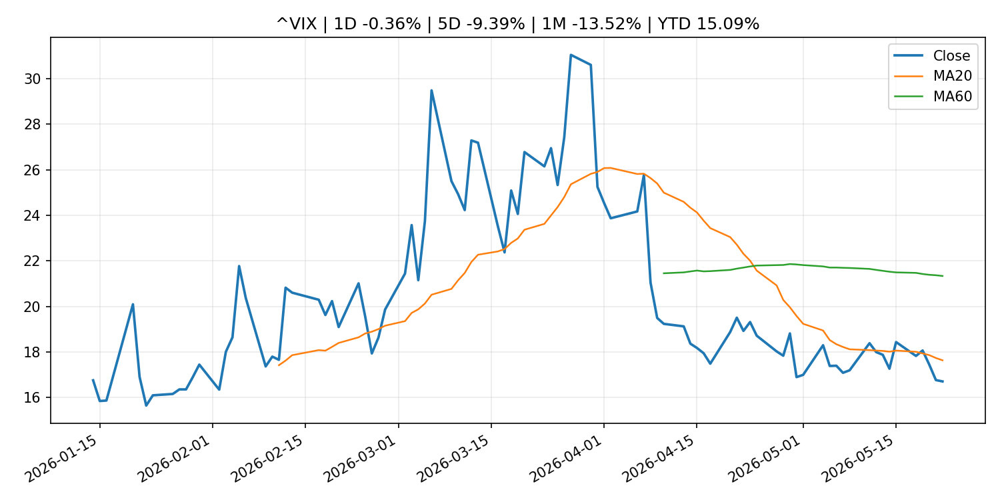
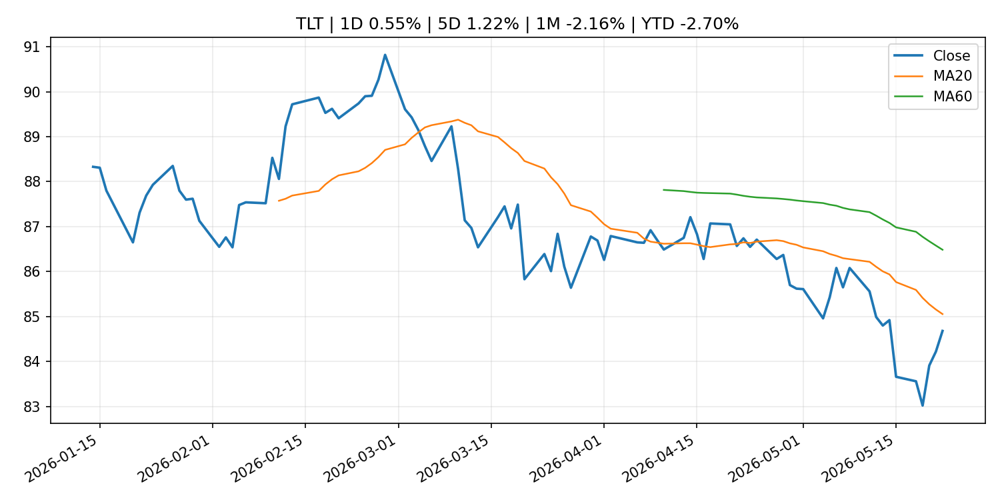
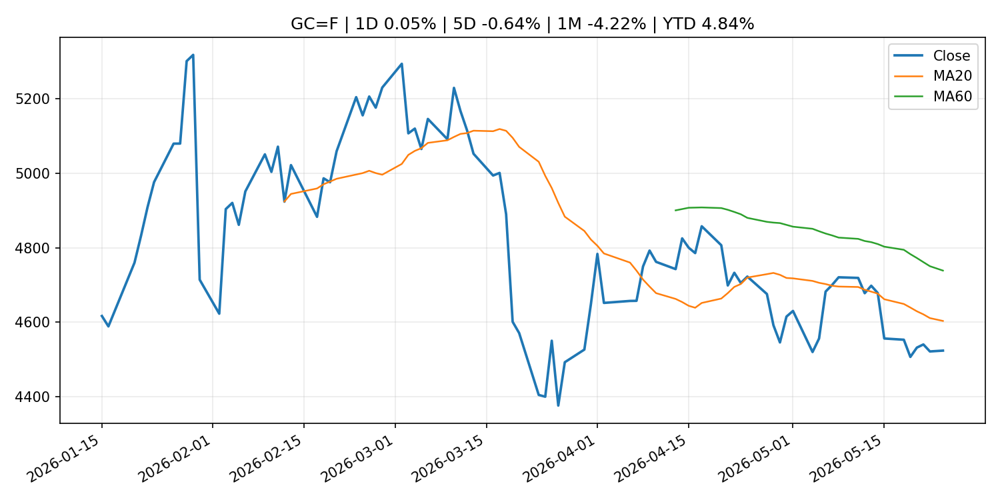
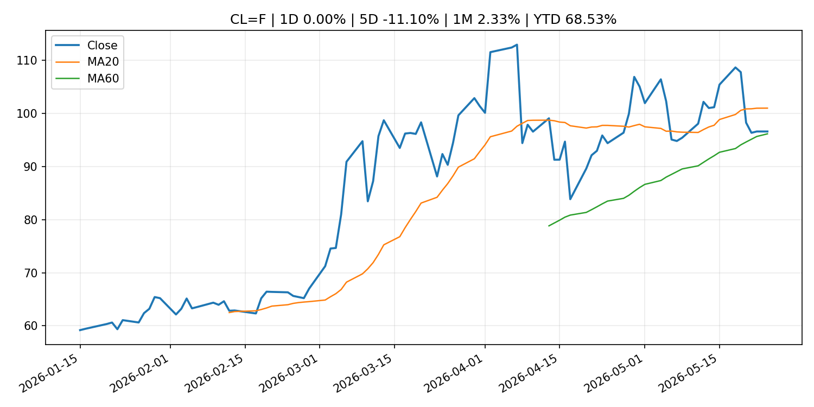
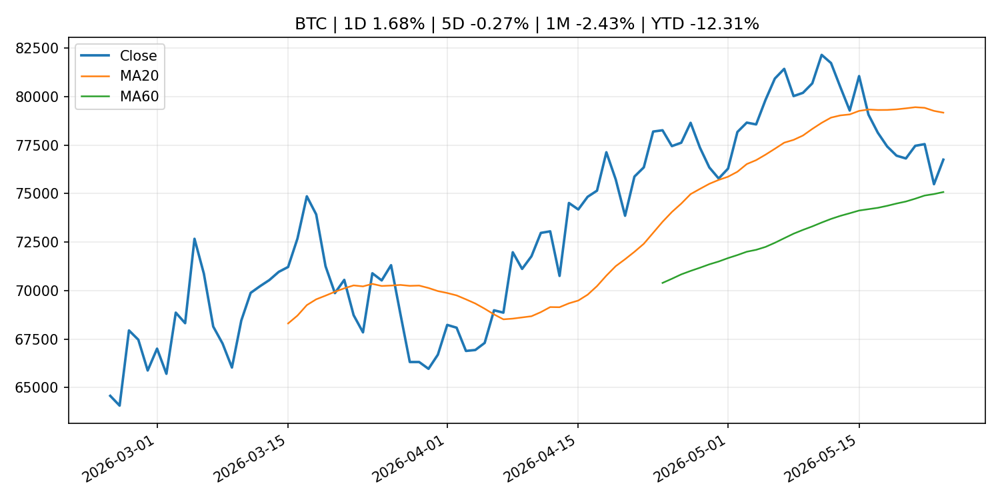
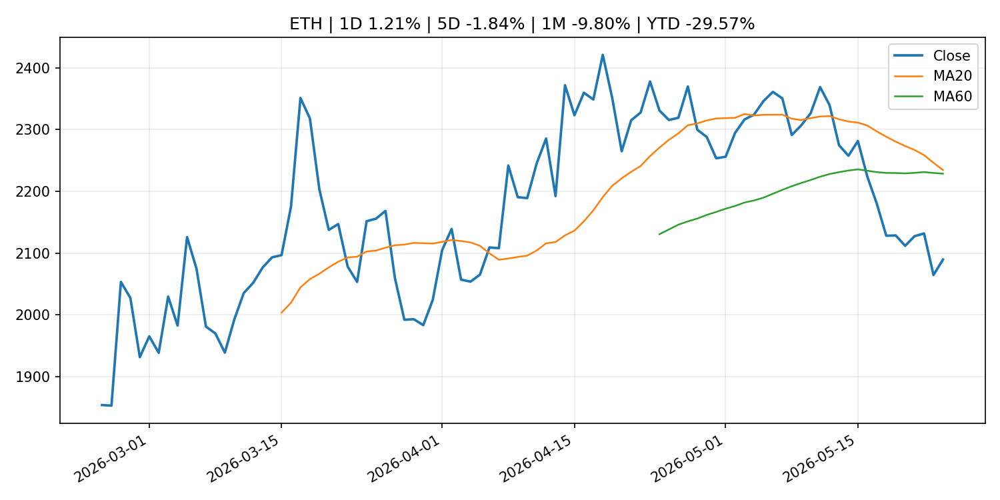

# Global Macro Morning Briefing - 2026-05-25

> Not financial advice / 非投资建议。

## 0. 今日总览
- 市场状态：risk_on。股指上涨、波动率或美元回落，市场更接近风险偏好改善。
- 今日三大主线：
  1. earnings: Stocks are riding an earnings hot streak — but investors are facing a summer that’s rife with risks
  2. central_bank_speech: Bitcoin heads higher as President Trump announces Iran peace agreement
  3. central_bank_speech: Kevin Warsh walks into a trap where the Fed can’t cut rates even if it wants to
- 一句话结论：今日晨报重点关注：大型科技股盈利和资本开支会影响纳指、半导体和 AI 交易主线。；央行官员表态可能影响市场对下一次会议的定价。。跨资产方面，SPY 1D 0.39%；QQQ 1D 0.42%；^VIX 1D -0.36%；TLT 1D 0.55%；GC=F 1D 0.05%；CL=F 1D 0.00%；BTC 1D 1.68%；ETH 1D 1.21%；股指上涨、波动率或美元回落，市场更接近风险偏好改善。政策、通胀、利率、美元、美债、能源和加密监管仍是主要观察线索。所有结论仅基于公开数据与短摘要整理，不构成投资建议。

## 1. 隔夜跨资产市场
- 美股：SPY 1D 0.39%，QQQ 1D 0.42%，整体趋势需结合 VIX 和利率确认。
- 美债/美元：TLT 1D 0.55%，美元指数 1D -0.32%，是判断折现率压力的核心线索。
- 黄金/原油：黄金 1D 0.05%，原油 1D 0.00%，用于观察避险、通胀和地缘风险。
- 加密：BTC 1D 1.68%，ETH 1D 1.21%，关注是否独立于纳指走出加密自身行情。
- 港股/A股：恒生 1D 0.86%，沪深300/上证 1D n/a，重点看中国政策预期与人民币线索。
- 风险观察：确认风险偏好是否扩散到小盘股、信用利差和周期品。

### US_EQUITY

| symbol | latest close | 1D | 5D | 1M | YTD | trend |
|---|---:|---:|---:|---:|---:|---|
| SPY | 745.64 | 0.39% | 0.88% | 5.25% | 9.14% | strong_uptrend |
| QQQ | 717.54 | 0.42% | 1.21% | 10.15% | 17.03% | strong_uptrend |
| DIA | 506.12 | 0.60% | 2.17% | 2.66% | 4.65% | uptrend |
| IWM | 285.12 | 0.93% | 2.71% | 3.48% | 14.61% | strong_uptrend |
| VTI | 366.79 | 0.47% | 1.12% | 4.86% | 9.06% | strong_uptrend |

### US_MACRO_MARKET

| symbol | latest close | 1D | 5D | 1M | YTD | trend |
|---|---:|---:|---:|---:|---:|---|
| ^VIX | 16.70 | -0.36% | -9.39% | -13.52% | 15.09% | strong_downtrend |
| DX-Y.NYB | 99.00 | -0.32% | 0.03% | 0.50% | 0.59% | range_bound |
| TLT | 84.68 | 0.55% | 1.22% | -2.16% | -2.70% | downtrend |
| IEF | 93.88 | 0.09% | 0.40% | -1.56% | -2.29% | downtrend |

### COMMODITIES

| symbol | latest close | 1D | 5D | 1M | YTD | trend |
|---|---:|---:|---:|---:|---:|---|
| GC=F | 4,523.20 | 0.05% | -0.64% | -4.22% | 4.84% | downtrend |
| SI=F | 76.20 | 0.40% | -1.13% | -0.24% | 8.00% | range_bound |
| CL=F | 96.60 | 0.00% | -11.10% | 2.33% | 68.53% | range_bound |
| BZ=F | 100.21 | -3.22% | -10.61% | -4.86% | 64.95% | range_bound |
| NG=F | 3.02 | 3.92% | -0.10% | 19.74% | -16.50% | range_bound |
| HG=F | 6.38 | 0.58% | 1.71% | 5.90% | 13.10% | strong_uptrend |

### HK_MARKET

| symbol | latest close | 1D | 5D | 1M | YTD | trend |
|---|---:|---:|---:|---:|---:|---|
| ^HSI | 25,606.03 | 0.86% | -1.37% | -2.13% | -2.78% | range_bound |
| 0700.HK | 441.40 | 0.55% | -3.29% | -12.42% | -29.15% | strong_downtrend |
| 9988.HK | 127.00 | 0.79% | -4.01% | -3.42% | -14.77% | range_bound |
| 3690.HK | 81.35 | -0.91% | -1.63% | -3.44% | -22.23% | range_bound |
| 1810.HK | 30.00 | 1.15% | -2.28% | -5.66% | -25.52% | strong_downtrend |
| 1211.HK | 91.60 | 1.16% | -5.03% | -14.39% | -7.24% | strong_downtrend |

### CRYPTO

| symbol | latest close | 1D | 5D | 1M | YTD | trend |
|---|---:|---:|---:|---:|---:|---|
| BTC | 76,746.95 | 1.68% | -0.27% | -2.43% | -12.31% | range_bound |
| ETH | 2,089.39 | 1.21% | -1.84% | -9.80% | -29.57% | range_bound |
| SOLANA | 85.19 | 1.02% | -0.08% | 1.00% | -31.59% | range_bound |
| BINANCECOIN | 655.51 | 0.87% | 1.96% | 6.09% | -24.06% | uptrend |
| RIPPLE | 1.35 | 1.10% | -2.90% | -3.22% | -26.70% | range_bound |

## 2. 今日最重要的 10 条新闻
### 1. Stocks are riding an earnings hot streak — but investors are facing a summer that’s rife with risks
- 来源：MarketWatch Top Stories
- 时间：2026-05-24T22:23:00+00:00
- 地区：US
- 事件类型：earnings
- 重要性层级：Tier 2
- 一句话摘要：The U.S. stock market has arrived at the unofficial start to summer with major benchmarks sitting at record highs. But a few factors could make for a bumpy ride in the months ahead.
- 为什么重要：大型科技股盈利和资本开支会影响纳指、半导体和 AI 交易主线。
- 可能影响：可能影响利率、汇率、风险资产或大宗商品预期，但当前公开信息不足以判断明确方向。
  - 资产：暂无明确资产映射
  - 方向：unknown
  - 强度：low
  - 原因：公开信息不足以判断方向。
- 原文链接：[https://www.marketwatch.com/story/stocks-are-riding-an-earnings-hot-streak-but-investors-are-facing-a-summer-thats-rife-with-risks-67a700e4?mod=mw_rss_topstories](https://www.marketwatch.com/story/stocks-are-riding-an-earnings-hot-streak-but-investors-are-facing-a-summer-thats-rife-with-risks-67a700e4?mod=mw_rss_topstories)

### 2. Bitcoin heads higher as President Trump announces Iran peace agreement
- 来源：CoinDesk
- 时间：2026-05-23T20:52:21+00:00
- 地区：global
- 事件类型：central_bank_speech
- 重要性层级：Tier 2
- 一句话摘要：Bitcoin heads higher as President Trump announces Iran peace agreement
- 为什么重要：央行官员表态可能影响市场对下一次会议的定价。
- 可能影响：可能影响利率、汇率、风险资产或大宗商品预期，但当前公开信息不足以判断明确方向。
  - 资产：暂无明确资产映射
  - 方向：unknown
  - 强度：low
  - 原因：公开信息不足以判断方向。
- 原文链接：[https://www.coindesk.com/markets/2026/05/23/bitcoin-heads-higher-as-president-trump-announces-iran-peace-agreement](https://www.coindesk.com/markets/2026/05/23/bitcoin-heads-higher-as-president-trump-announces-iran-peace-agreement)

### 3. Kevin Warsh walks into a trap where the Fed can’t cut rates even if it wants to
- 来源：MarketWatch Top Stories
- 时间：2026-05-23T18:13:00+00:00
- 地区：US
- 事件类型：central_bank_speech
- 重要性层级：Tier 2
- 一句话摘要：Kevin Warsh is becoming Federal Reserve chair at a pivotal moment for the U.S. economy — forcing him to be something other than the disruptor he hoped to be.
- 为什么重要：央行官员表态可能影响市场对下一次会议的定价。
- 可能影响：可能影响利率、汇率、风险资产或大宗商品预期，但当前公开信息不足以判断明确方向。
  - 资产：暂无明确资产映射
  - 方向：unknown
  - 强度：low
  - 原因：公开信息不足以判断方向。
- 原文链接：[https://www.marketwatch.com/story/kevin-warsh-walks-into-a-trap-where-the-fed-cant-cut-rates-even-if-it-wants-to-8475e97c?mod=mw_rss_topstories](https://www.marketwatch.com/story/kevin-warsh-walks-into-a-trap-where-the-fed-cant-cut-rates-even-if-it-wants-to-8475e97c?mod=mw_rss_topstories)

### 4. ‘We have longevity in the family’: My sister is turning 67. Should she wait until 70 to claim Social Security?
- 来源：MarketWatch Top Stories
- 时间：2026-05-24T18:16:00+00:00
- 地区：US
- 事件类型：other
- 重要性层级：Tier 3
- 一句话摘要：“Others say she should start at full retirement age.”
- 为什么重要：这条信息暂未匹配到重大宏观、政策或市场事件，更适合作为背景跟踪。
- 可能影响：更偏背景信息，短期市场影响可能有限。
  - 资产：暂无明确资产映射
  - 方向：unknown
  - 强度：low
  - 原因：公开信息不足以判断方向。
- 原文链接：[https://www.marketwatch.com/story/we-have-longevity-in-the-family-my-sister-is-turning-67-should-she-wait-until-70-to-claim-social-security-812087a4?mod=mw_rss_topstories](https://www.marketwatch.com/story/we-have-longevity-in-the-family-my-sister-is-turning-67-should-she-wait-until-70-to-claim-social-security-812087a4?mod=mw_rss_topstories)

### 5. A massive $1 trillion hidden market is waiting to be unlocked in bitcoin, says new report
- 来源：CoinDesk
- 时间：2026-05-24T15:00:00+00:00
- 地区：global
- 事件类型：other
- 重要性层级：Tier 3
- 一句话摘要：A massive $1 trillion hidden market is waiting to be unlocked in bitcoin, says new report
- 为什么重要：这条信息暂未匹配到重大宏观、政策或市场事件，更适合作为背景跟踪。
- 可能影响：更偏背景信息，短期市场影响可能有限。
  - 资产：暂无明确资产映射
  - 方向：unknown
  - 强度：low
  - 原因：公开信息不足以判断方向。
- 原文链接：[https://www.coindesk.com/business/2026/05/22/ledn](https://www.coindesk.com/business/2026/05/22/ledn)

## 3. 政策与央行观察
### 1. Bitcoin heads higher as President Trump announces Iran peace agreement
- 来源：CoinDesk
- 时间：2026-05-23T20:52:21+00:00
- 地区：global
- 事件类型：central_bank_speech
- 重要性层级：Tier 2
- 一句话摘要：Bitcoin heads higher as President Trump announces Iran peace agreement
- 为什么重要：央行官员表态可能影响市场对下一次会议的定价。
- 可能影响：可能影响利率、汇率、风险资产或大宗商品预期，但当前公开信息不足以判断明确方向。
  - 资产：暂无明确资产映射
  - 方向：unknown
  - 强度：low
  - 原因：公开信息不足以判断方向。
- 原文链接：[https://www.coindesk.com/markets/2026/05/23/bitcoin-heads-higher-as-president-trump-announces-iran-peace-agreement](https://www.coindesk.com/markets/2026/05/23/bitcoin-heads-higher-as-president-trump-announces-iran-peace-agreement)

### 2. Kevin Warsh walks into a trap where the Fed can’t cut rates even if it wants to
- 来源：MarketWatch Top Stories
- 时间：2026-05-23T18:13:00+00:00
- 地区：US
- 事件类型：central_bank_speech
- 重要性层级：Tier 2
- 一句话摘要：Kevin Warsh is becoming Federal Reserve chair at a pivotal moment for the U.S. economy — forcing him to be something other than the disruptor he hoped to be.
- 为什么重要：央行官员表态可能影响市场对下一次会议的定价。
- 可能影响：可能影响利率、汇率、风险资产或大宗商品预期，但当前公开信息不足以判断明确方向。
  - 资产：暂无明确资产映射
  - 方向：unknown
  - 强度：low
  - 原因：公开信息不足以判断方向。
- 原文链接：[https://www.marketwatch.com/story/kevin-warsh-walks-into-a-trap-where-the-fed-cant-cut-rates-even-if-it-wants-to-8475e97c?mod=mw_rss_topstories](https://www.marketwatch.com/story/kevin-warsh-walks-into-a-trap-where-the-fed-cant-cut-rates-even-if-it-wants-to-8475e97c?mod=mw_rss_topstories)

## 4. 市场异动与图表
- QQQ 上涨 0.42%
- TLT 上涨 0.55%
- DXY 下跌 -0.32%
- Oil 下跌 -3.22%

### SPY

### QQQ

### ^VIX

### TLT

### GC=F

### CL=F

### BTC

### ETH

### ^HSI

## 5. 华尔街与机构公开观点
- 暂无可靠公开观点。

## 6. 今日重点关注
- 经济数据：经济数据：暂无可靠公开日历数据；如配置经济日历源后可自动填充。
- 央行讲话：央行讲话：暂无可靠公开日历数据；重点跟踪 Fed、ECB、BoJ、PBOC 官网 RSS。
- 财报：财报：暂无可靠数据。
- 政策事件：政策事件：暂无可靠数据。
- 风险提醒：风险提醒：关注数据源失败项、突发地缘风险、利率和美元的二阶反应。

## 7. 英文金融表达与宏观概念
- **risk-off**：避险模式，资金偏向美元、国债、黄金等防御资产。 例句：A geopolitical shock can push markets into risk-off mode.
- **market structure**：市场结构，指交易、托管、清算、ETF、监管等制度安排。 例句：Crypto market structure rules can affect institutional participation.
- **inflation expectations**：通胀预期，指家庭、企业或市场对未来通胀的预估。 例句：Inflation expectations can shape wage bargaining and bond yields.
- **real yield**：实际收益率，名义利率扣除通胀预期后的收益率。 例句：Gold often reacts more to real yields than nominal yields.
- **terminal rate**：终端利率，市场预期本轮加息周期的最高政策利率。 例句：A higher terminal rate can pressure growth stocks.
- **soft landing**：软着陆，指通胀回落而经济避免明显衰退。 例句：Markets often rally when data support a soft landing.

## 8. 背景材料
- [‘We have longevity in the family’: My sister is turning 67. Should she wait until 70 to claim Social Security?](https://www.marketwatch.com/story/we-have-longevity-in-the-family-my-sister-is-turning-67-should-she-wait-until-70-to-claim-social-security-812087a4?mod=mw_rss_topstories)（MarketWatch Top Stories，other）：“Others say she should start at full retirement age.”
- [A massive $1 trillion hidden market is waiting to be unlocked in bitcoin, says new report](https://www.coindesk.com/business/2026/05/22/ledn)（CoinDesk，other）：A massive $1 trillion hidden market is waiting to be unlocked in bitcoin, says new report
- [AI is speeding up the quantum threat to crypto, security experts warn](https://www.coindesk.com/tech/2026/05/24/ai-is-speeding-up-the-quantum-threat-to-crypto-security-experts-warn)（CoinDesk，other）：AI is speeding up the quantum threat to crypto, security experts warn
- [Bitcoin is ready to beat stocks and bonds again after underperformance against Wall Street](https://www.coindesk.com/markets/2026/05/23/bitcoin-is-ready-to-beat-stocks-and-bonds-again-after-underperformance-against-wall-street)（CoinDesk，other）：Bitcoin is ready to beat stocks and bonds again after underperformance against Wall Street
- [This bond strategy can protect your portfolio even if interest rates go up](https://www.marketwatch.com/story/this-bond-strategy-can-protect-your-portfolio-even-if-interest-rates-go-up-9e9418cb?mod=mw_rss_topstories)（MarketWatch Top Stories，other）：A little-known investing formula shows exactly how long to hold bonds to neutralize interest-rate hikes.
- [Bitcoin tanks to $74,300 as spot ETFs bleed $2.26 billion in two weeks](https://www.coindesk.com/markets/2026/05/23/bitcoin-tanks-to-usd74-300-as-spot-etfs-bleed-usd2-26-billion-in-two-weeks)（CoinDesk，other）：Bitcoin tanks to $74,300 as spot ETFs bleed $2.26 billion in two weeks

## 9. 数据源、失败项与免责声明
- 采集时间：2026-05-24T22:57:18
- 数据源：公开 RSS、Yahoo Finance、CoinGecko、AKShare、FRED、SEC data.sec.gov，以及用户自有 inputs/reports 文件。
- 合规说明：不绕过 WSJ、Bloomberg、FT、Reuters 等付费墙；对付费媒体只使用公开 RSS 标题、摘要、链接和发布时间。
- 免责声明：Not financial advice / 非投资建议。本项目仅供个人学习、研究和信息整理，不构成投资建议、交易建议或任何收益承诺。
- 失败或跳过的数据源：
  - crypto data failed coin=dogecoin
  - China market data failed symbol=上证指数: empty dataframe
  - China market data failed symbol=深证成指: empty dataframe
  - China market data failed symbol=创业板指: empty dataframe
  - China market data failed symbol=沪深300: empty dataframe
  - China market data failed symbol=中证500: empty dataframe
  - China market data failed symbol=科创50: empty dataframe
  - FRED_API_KEY not set; skipping FRED macro series
  - SEC failed cik=0000320193
  - SEC failed cik=0000789019
  - SEC failed cik=0001045810
  - SEC failed cik=0001318605
  - SEC failed cik=0001577552
