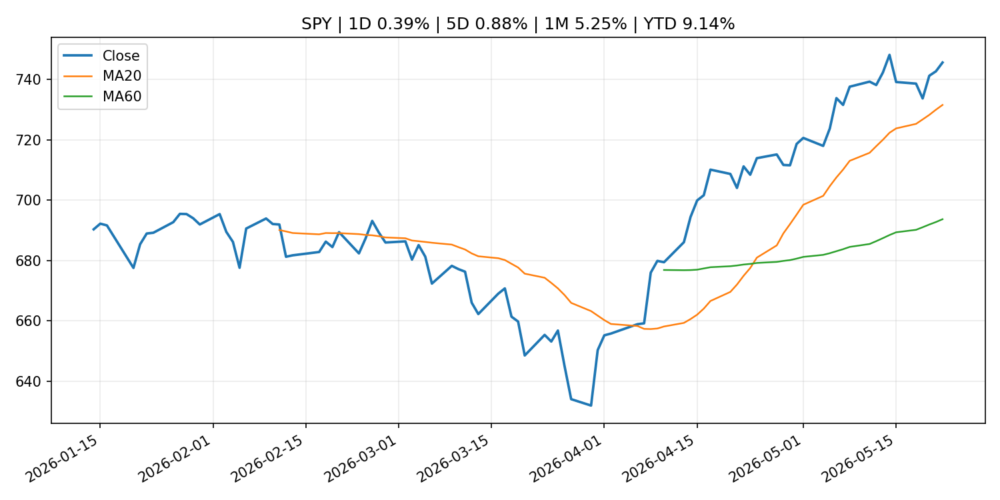
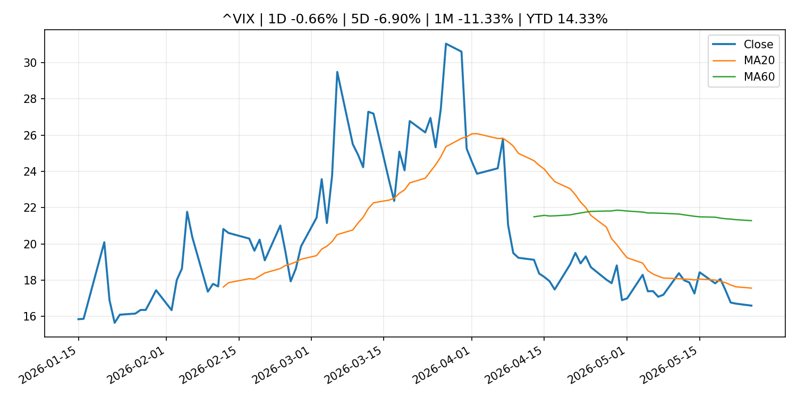
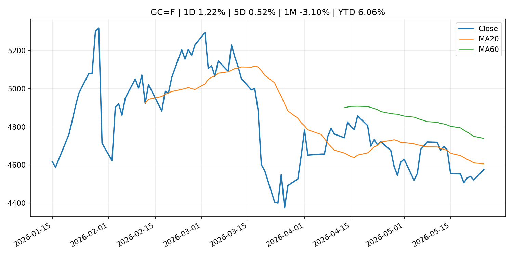
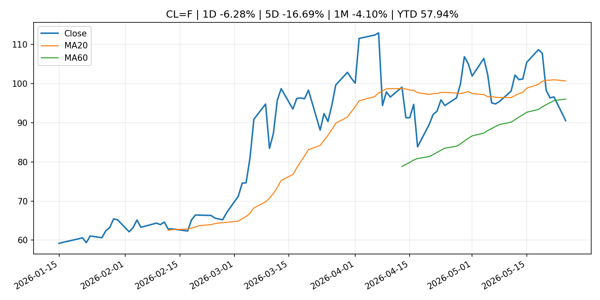
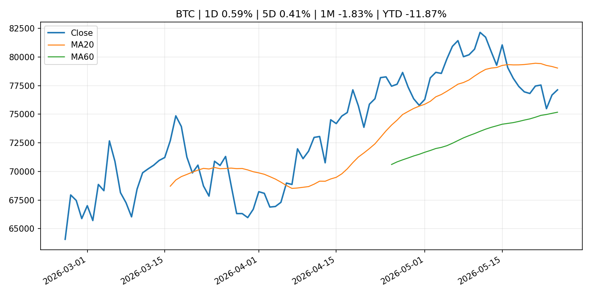
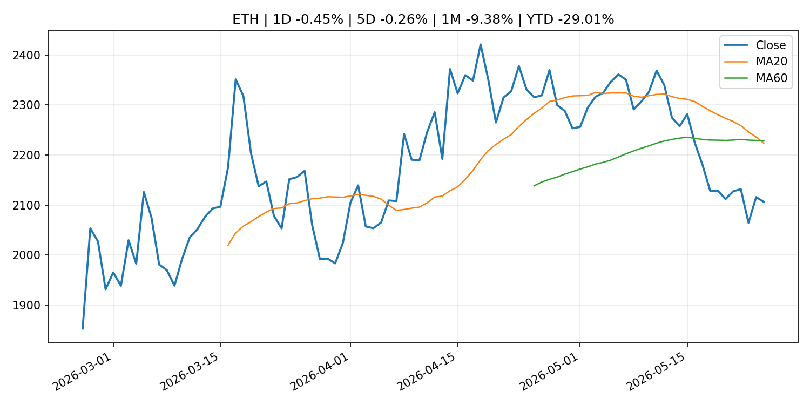
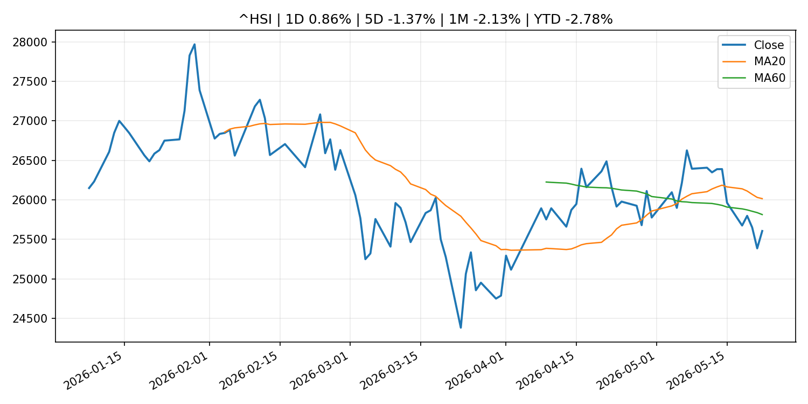

# Global Macro Morning Briefing - 2026-05-26

> Not financial advice / 非投资建议。

## 0. 今日总览
- 市场状态：risk_on。股指上涨、波动率或美元回落，市场更接近风险偏好改善。
- 今日三大主线：
  1. macro_data: PCE, jobless claims and housing data test Fed cut hopes: Crypto Week Ahead
  2. earnings: These underdogs are a big reason why S&P 500 profit growth is the fastest in nearly 5 years
  3. earnings: Stocks are riding an earnings hot streak — but investors are facing a summer that’s rife with risks
- 一句话结论：今日晨报重点关注：这类宏观数据会直接改变市场对通胀、增长和政策路径的预期。；大型科技股盈利和资本开支会影响纳指、半导体和 AI 交易主线。。跨资产方面，SPY 1D 0.39%；QQQ 1D 0.42%；^VIX 1D -0.66%；TLT 1D 0.55%；GC=F 1D 1.22%；CL=F 1D -6.28%；BTC 1D 0.59%；ETH 1D -0.45%；股指上涨、波动率或美元回落，市场更接近风险偏好改善。政策、通胀、利率、美元、美债、能源和加密监管仍是主要观察线索。所有结论仅基于公开数据与短摘要整理，不构成投资建议。

## 1. 隔夜跨资产市场
- 美股：SPY 1D 0.39%，QQQ 1D 0.42%，整体趋势需结合 VIX 和利率确认。
- 美债/美元：TLT 1D 0.55%，美元指数 1D -0.08%，是判断折现率压力的核心线索。
- 黄金/原油：黄金 1D 1.22%，原油 1D -6.28%，用于观察避险、通胀和地缘风险。
- 加密：BTC 1D 0.59%，ETH 1D -0.45%，关注是否独立于纳指走出加密自身行情。
- 港股/A股：恒生 1D 0.86%，沪深300/上证 1D n/a，重点看中国政策预期与人民币线索。
- 风险观察：确认风险偏好是否扩散到小盘股、信用利差和周期品。

### US_EQUITY

| symbol | latest close | 1D | 5D | 1M | YTD | trend |
|---|---:|---:|---:|---:|---:|---|
| SPY | 745.64 | 0.39% | 0.88% | 5.25% | 9.14% | strong_uptrend |
| QQQ | 717.54 | 0.42% | 1.21% | 10.15% | 17.03% | strong_uptrend |
| DIA | 506.12 | 0.60% | 2.17% | 2.66% | 4.65% | uptrend |
| IWM | 285.12 | 0.93% | 2.71% | 3.48% | 14.61% | strong_uptrend |
| VTI | 366.79 | 0.47% | 1.12% | 4.86% | 9.06% | strong_uptrend |

### US_MACRO_MARKET

| symbol | latest close | 1D | 5D | 1M | YTD | trend |
|---|---:|---:|---:|---:|---:|---|
| ^VIX | 16.59 | -0.66% | -6.90% | -11.33% | 14.33% | strong_downtrend |
| DX-Y.NYB | 99.24 | -0.08% | 0.27% | 0.74% | 0.83% | range_bound |
| TLT | 84.68 | 0.55% | 1.22% | -2.16% | -2.70% | downtrend |
| IEF | 93.88 | 0.09% | 0.40% | -1.56% | -2.29% | downtrend |

### COMMODITIES

| symbol | latest close | 1D | 5D | 1M | YTD | trend |
|---|---:|---:|---:|---:|---:|---|
| GC=F | 4,576.00 | 1.22% | 0.52% | -3.10% | 6.06% | downtrend |
| SI=F | 78.44 | 3.36% | 1.78% | 2.70% | 11.18% | uptrend |
| CL=F | 90.53 | -6.28% | -16.69% | -4.10% | 57.94% | range_bound |
| BZ=F | 94.06 | -9.16% | -16.09% | -10.70% | 54.83% | range_bound |
| NG=F | 3.04 | 4.40% | 0.36% | 20.29% | -16.11% | range_bound |
| HG=F | 6.46 | 1.84% | 2.97% | 7.22% | 14.51% | strong_uptrend |

### HK_MARKET

| symbol | latest close | 1D | 5D | 1M | YTD | trend |
|---|---:|---:|---:|---:|---:|---|
| ^HSI | 25,606.03 | 0.86% | -1.37% | -2.13% | -2.78% | range_bound |
| 0700.HK | 441.40 | 0.55% | -3.29% | -12.42% | -29.15% | strong_downtrend |
| 9988.HK | 127.00 | 0.79% | -4.01% | -3.42% | -14.77% | range_bound |
| 3690.HK | 81.35 | -0.91% | -1.63% | -3.44% | -22.23% | range_bound |
| 1810.HK | 30.00 | 1.15% | -2.28% | -5.66% | -25.52% | strong_downtrend |
| 1211.HK | 91.60 | 1.16% | -5.03% | -14.39% | -7.24% | strong_downtrend |

### CRYPTO

| symbol | latest close | 1D | 5D | 1M | YTD | trend |
|---|---:|---:|---:|---:|---:|---|
| BTC | 77,127.30 | 0.59% | 0.41% | -1.83% | -11.87% | range_bound |
| ETH | 2,106.17 | -0.45% | -0.26% | -9.38% | -29.01% | strong_downtrend |
| SOLANA | 84.84 | -0.93% | 0.68% | 1.14% | -31.86% | range_bound |
| BINANCECOIN | 660.80 | 0.78% | 3.34% | 6.98% | -23.44% | uptrend |
| RIPPLE | 1.35 | -0.57% | -0.87% | -2.78% | -26.65% | range_bound |

## 2. 今日最重要的 10 条新闻
### 1. PCE, jobless claims and housing data test Fed cut hopes: Crypto Week Ahead
- 来源：CoinDesk
- 时间：2026-05-25T12:53:49+00:00
- 地区：global
- 事件类型：macro_data
- 重要性层级：Tier 1
- 一句话摘要：PCE, jobless claims and housing data test Fed cut hopes: Crypto Week Ahead
- 为什么重要：这类宏观数据会直接改变市场对通胀、增长和政策路径的预期。
- 可能影响：主要影响 DXY，方向为 positive，强度 high；通胀压力可能推高政策利率预期并支撑美元。
  - 资产：DXY
    方向：positive
    强度：high
    原因：通胀压力可能推高政策利率预期并支撑美元。
  - 资产：TLT
    方向：negative
    强度：high
    原因：通胀上行通常推升收益率、压低长债价格。
  - 资产：QQQ
    方向：negative
    强度：high
    原因：更高利率对成长股估值折现率不利。
  - 资产：SPY
    方向：mixed
    强度：medium
    原因：名义增长可能支撑收入，但更高利率压制估值。
  - 资产：GC=F
    方向：mixed
    强度：medium
    原因：通胀对黄金是支撑，但实际利率上行会形成压力。
  - 资产：BTC
    方向：mixed
    强度：medium
    原因：抗通胀叙事和流动性收紧可能相互抵消。
- 原文链接：[https://www.coindesk.com/markets/2026/05/25/pce-jobless-claims-and-housing-data-test-fed-cut-hopes-crypto-week-ahead](https://www.coindesk.com/markets/2026/05/25/pce-jobless-claims-and-housing-data-test-fed-cut-hopes-crypto-week-ahead)

### 2. These underdogs are a big reason why S&P 500 profit growth is the fastest in nearly 5 years
- 来源：MarketWatch Top Stories
- 时间：2026-05-25T19:50:00+00:00
- 地区：US
- 事件类型：earnings
- 重要性层级：Tier 2
- 一句话摘要：Ever since Big Tech went all in on artificial intelligence more than three years ago, seven companies have done the heavy lifting for overall S&P 500 earnings growth. But more recently, the other 493 names in the index have started to pull their weight.
- 为什么重要：大型科技股盈利和资本开支会影响纳指、半导体和 AI 交易主线。
- 可能影响：可能影响利率、汇率、风险资产或大宗商品预期，但当前公开信息不足以判断明确方向。
  - 资产：暂无明确资产映射
  - 方向：unknown
  - 强度：low
  - 原因：公开信息不足以判断方向。
- 原文链接：[https://www.marketwatch.com/story/these-underdogs-are-a-big-reason-s-p-500-profit-growth-is-the-fastest-in-nearly-5-years-4a43f142?mod=mw_rss_topstories](https://www.marketwatch.com/story/these-underdogs-are-a-big-reason-s-p-500-profit-growth-is-the-fastest-in-nearly-5-years-4a43f142?mod=mw_rss_topstories)

### 3. Stocks are riding an earnings hot streak — but investors are facing a summer that’s rife with risks
- 来源：MarketWatch Top Stories
- 时间：2026-05-24T22:23:00+00:00
- 地区：US
- 事件类型：earnings
- 重要性层级：Tier 2
- 一句话摘要：The U.S. stock market has arrived at the unofficial start to summer with major benchmarks sitting at record highs. But a few factors could make for a bumpy ride in the months ahead.
- 为什么重要：大型科技股盈利和资本开支会影响纳指、半导体和 AI 交易主线。
- 可能影响：可能影响利率、汇率、风险资产或大宗商品预期，但当前公开信息不足以判断明确方向。
  - 资产：暂无明确资产映射
  - 方向：unknown
  - 强度：low
  - 原因：公开信息不足以判断方向。
- 原文链接：[https://www.marketwatch.com/story/stocks-are-riding-an-earnings-hot-streak-but-investors-are-facing-a-summer-thats-rife-with-risks-67a700e4?mod=mw_rss_topstories](https://www.marketwatch.com/story/stocks-are-riding-an-earnings-hot-streak-but-investors-are-facing-a-summer-thats-rife-with-risks-67a700e4?mod=mw_rss_topstories)

### 4. Bitcoin trades above $77,000 as oil's 5% slide pushes Asian equities higher
- 来源：CoinDesk
- 时间：2026-05-25T07:11:57+00:00
- 地区：global
- 事件类型：other
- 重要性层级：Tier 3
- 一句话摘要：Bitcoin trades above $77,000 as oil's 5% slide pushes Asian equities higher
- 为什么重要：这条信息暂未匹配到重大宏观、政策或市场事件，更适合作为背景跟踪。
- 可能影响：主要影响 CL=F，方向为 positive，强度 high；供给扰动或 OPEC 减产通常推升 WTI 原油。
  - 资产：CL=F
    方向：positive
    强度：high
    原因：供给扰动或 OPEC 减产通常推升 WTI 原油。
  - 资产：BZ=F
    方向：positive
    强度：high
    原因：全球供给风险通常直接影响 Brent 原油。
  - 资产：SPY
    方向：mixed
    强度：medium
    原因：能源股可能受益，但通胀和成本压力不利于宽基风险资产。
- 原文链接：[https://www.coindesk.com/markets/2026/05/25/bitcoin-trades-above-usd77-000-as-oil-s-5-slide-pushes-asian-equities-higher](https://www.coindesk.com/markets/2026/05/25/bitcoin-trades-above-usd77-000-as-oil-s-5-slide-pushes-asian-equities-higher)

### 5. Bitcoin, crypto prices tick up as US-Iran peace deal odds climb
- 来源：CoinDesk
- 时间：2026-05-25T16:46:45+00:00
- 地区：global
- 事件类型：other
- 重要性层级：Tier 3
- 一句话摘要：Bitcoin, crypto prices tick up as US-Iran peace deal odds climb
- 为什么重要：这条信息暂未匹配到重大宏观、政策或市场事件，更适合作为背景跟踪。
- 可能影响：更偏背景信息，短期市场影响可能有限。
  - 资产：暂无明确资产映射
  - 方向：unknown
  - 强度：low
  - 原因：公开信息不足以判断方向。
- 原文链接：[https://www.coindesk.com/markets/2026/05/25/bitcoin-crypto-prices-tick-up-as-us-iran-peace-deal-odds-climb](https://www.coindesk.com/markets/2026/05/25/bitcoin-crypto-prices-tick-up-as-us-iran-peace-deal-odds-climb)

## 3. 政策与央行观察
暂无可靠数据。

- 为什么重要：没有可靠新闻时，不应为了填充版面编造市场解释。

## 4. 市场异动与图表
- QQQ 上涨 0.42%
- TLT 上涨 0.55%
- Gold 上涨 1.22%
- Oil 下跌 -6.28%

### SPY

### QQQ

### ^VIX

### TLT

### GC=F

### CL=F

### BTC

### ETH

### ^HSI

## 5. 华尔街与机构公开观点
- 暂无可靠公开观点。

## 6. 今日重点关注
- 经济数据：经济数据：暂无可靠公开日历数据；如配置经济日历源后可自动填充。
- 央行讲话：央行讲话：暂无可靠公开日历数据；重点跟踪 Fed、ECB、BoJ、PBOC 官网 RSS。
- 财报：财报：暂无可靠数据。
- 政策事件：政策事件：暂无可靠数据。
- 风险提醒：风险提醒：关注数据源失败项、突发地缘风险、利率和美元的二阶反应。

## 7. 英文金融表达与宏观概念
- **inflation expectations**：通胀预期，指家庭、企业或市场对未来通胀的预估。 例句：Inflation expectations can shape wage bargaining and bond yields.
- **supply disruption**：供给扰动，通常指能源或商品供应受冲突、减产或天气影响。 例句：Supply disruption can lift oil prices and inflation expectations.
- **real yield**：实际收益率，名义利率扣除通胀预期后的收益率。 例句：Gold often reacts more to real yields than nominal yields.
- **terminal rate**：终端利率，市场预期本轮加息周期的最高政策利率。 例句：A higher terminal rate can pressure growth stocks.
- **soft landing**：软着陆，指通胀回落而经济避免明显衰退。 例句：Markets often rally when data support a soft landing.
- **risk-off**：避险模式，资金偏向美元、国债、黄金等防御资产。 例句：A geopolitical shock can push markets into risk-off mode.

## 8. 背景材料
- [Bitcoin, crypto prices tick up as US-Iran peace deal odds climb](https://www.coindesk.com/markets/2026/05/25/bitcoin-crypto-prices-tick-up-as-us-iran-peace-deal-odds-climb)（CoinDesk，other）：Bitcoin, crypto prices tick up as US-Iran peace deal odds climb
- [Prometheum bets Wall Street distribution is the missing link for tokenized securities](https://www.coindesk.com/business/2026/05/25/prometheum-bets-wall-street-distribution-is-the-missing-link-for-tokenized-securities)（CoinDesk，other）：Prometheum bets Wall Street distribution is the missing link for tokenized securities
- [‘We have longevity in the family’: My sister is turning 67. Should she wait until 70 to claim Social Security?](https://www.marketwatch.com/story/we-have-longevity-in-the-family-my-sister-is-turning-67-should-she-wait-until-70-to-claim-social-security-812087a4?mod=mw_rss_topstories)（MarketWatch Top Stories，other）：“Others say she should start at full retirement age.”
- [HYPE funds attract millions as investors dump bitcoin and ether ETFs](https://www.coindesk.com/markets/2026/05/25/hype-funds-attract-millions-as-investors-dump-bitcoin-and-ether-etfs)（CoinDesk，other）：HYPE funds attract millions as investors dump bitcoin and ether ETFs
- [Bitcoin trades above $77,000 as oil's 5% slide pushes Asian equities higher](https://www.coindesk.com/markets/2026/05/25/bitcoin-trades-above-usd77-000-as-oil-s-5-slide-pushes-asian-equities-higher)（CoinDesk，other）：Bitcoin trades above $77,000 as oil's 5% slide pushes Asian equities higher
- [Bitcoin options are coming to Nasdaq. Here's what it means for you](https://www.coindesk.com/markets/2026/05/25/bitcoin-options-are-coming-to-nadaq-here-s-what-it-means-for-you)（CoinDesk，other）：Bitcoin options are coming to Nasdaq. Here's what it means for you
- [Planned Retroactive Revision to the Flow of Funds Accounts](http://www.boj.or.jp/en/statistics/outline/notice_2026/not260525a.pdf)（Bank of Japan Announcements，routine_announcement）：Planned Retroactive Revision to the Flow of Funds Accounts
- [A massive $1 trillion hidden market is waiting to be unlocked in bitcoin, says new report](https://www.coindesk.com/business/2026/05/22/ledn)（CoinDesk，other）：A massive $1 trillion hidden market is waiting to be unlocked in bitcoin, says new report
- [AI is speeding up the quantum threat to crypto, security experts warn](https://www.coindesk.com/tech/2026/05/24/ai-is-speeding-up-the-quantum-threat-to-crypto-security-experts-warn)（CoinDesk，other）：AI is speeding up the quantum threat to crypto, security experts warn

## 9. 数据源、失败项与免责声明
- 采集时间：2026-05-25T23:00:14
- 数据源：公开 RSS、Yahoo Finance、CoinGecko、AKShare、FRED、SEC data.sec.gov，以及用户自有 inputs/reports 文件。
- 合规说明：不绕过 WSJ、Bloomberg、FT、Reuters 等付费墙；对付费媒体只使用公开 RSS 标题、摘要、链接和发布时间。
- 免责声明：Not financial advice / 非投资建议。本项目仅供个人学习、研究和信息整理，不构成投资建议、交易建议或任何收益承诺。
- 失败或跳过的数据源：
  - crypto data failed coin=dogecoin
  - China market data failed symbol=上证指数: empty dataframe
  - China market data failed symbol=深证成指: empty dataframe
  - China market data failed symbol=创业板指: empty dataframe
  - China market data failed symbol=沪深300: empty dataframe
  - China market data failed symbol=中证500: empty dataframe
  - China market data failed symbol=科创50: empty dataframe
  - FRED_API_KEY not set; skipping FRED macro series
  - SEC failed cik=0000320193
  - SEC failed cik=0000789019
  - SEC failed cik=0001045810
  - SEC failed cik=0001318605
  - SEC failed cik=0001577552
