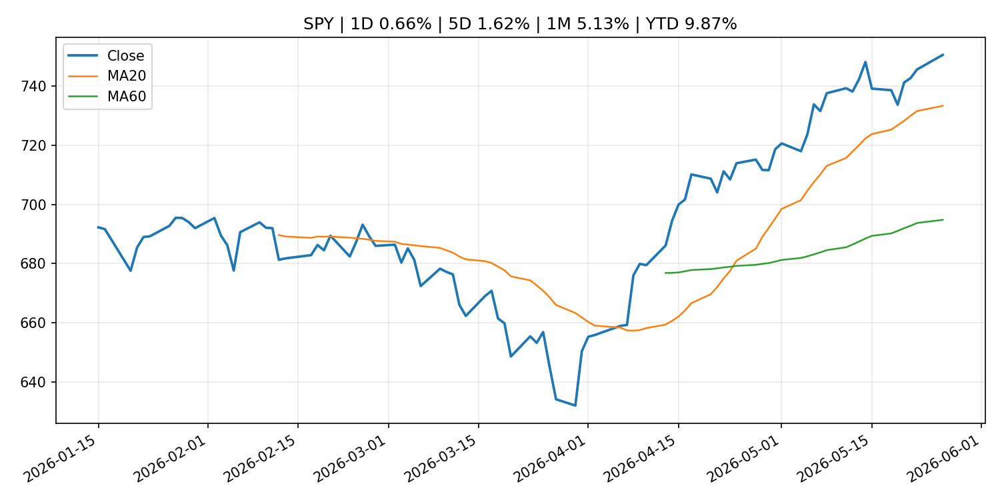
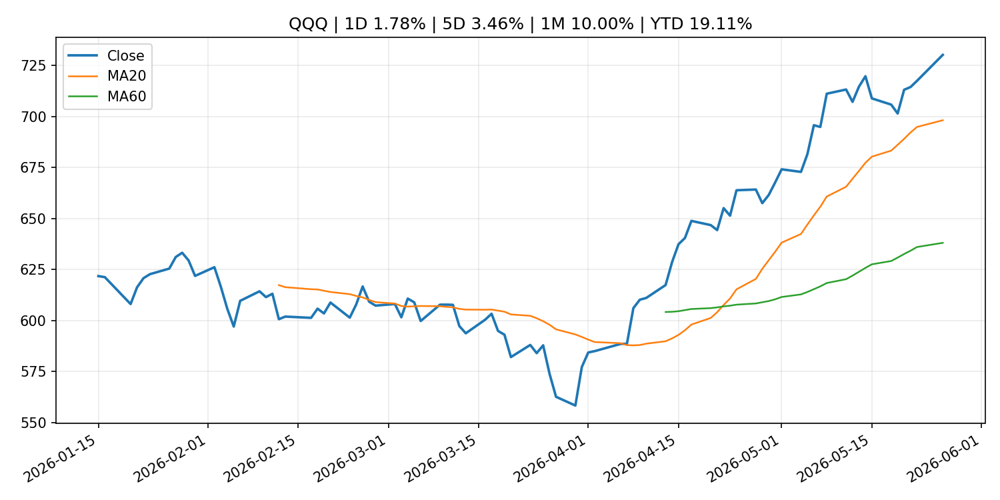
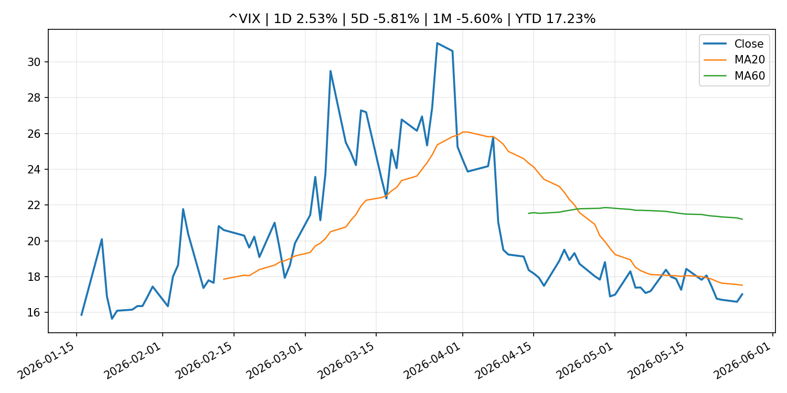
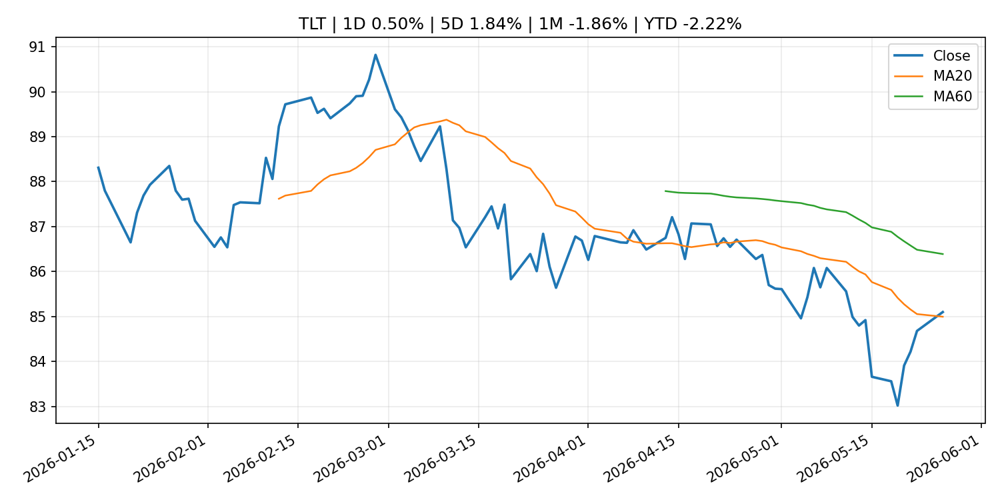
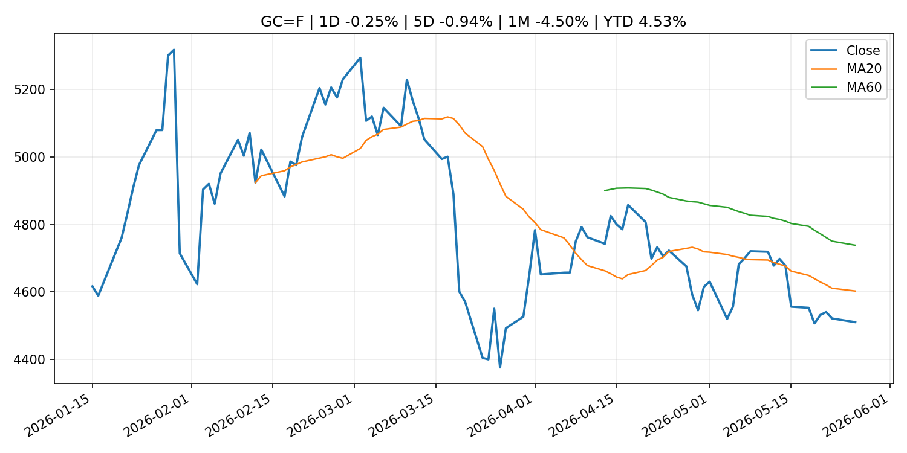
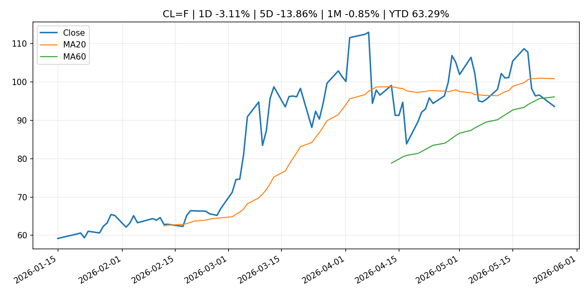
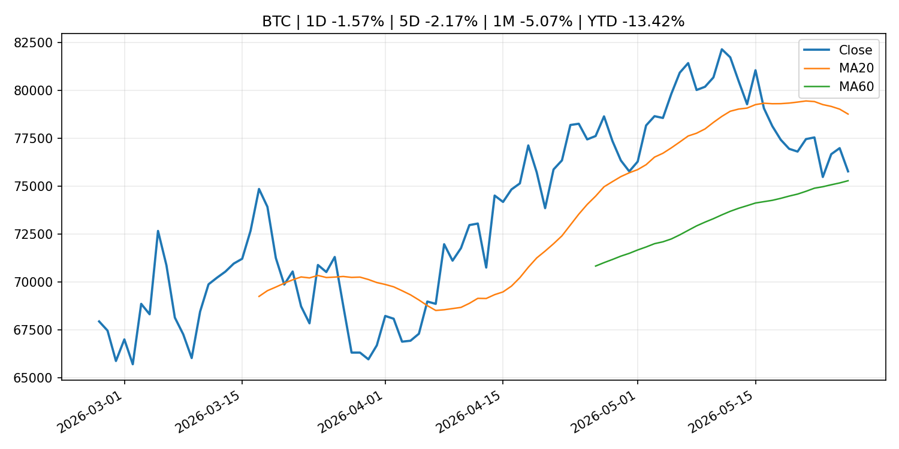
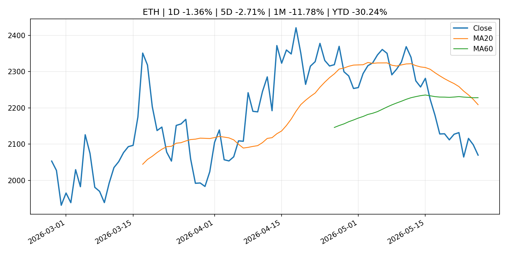
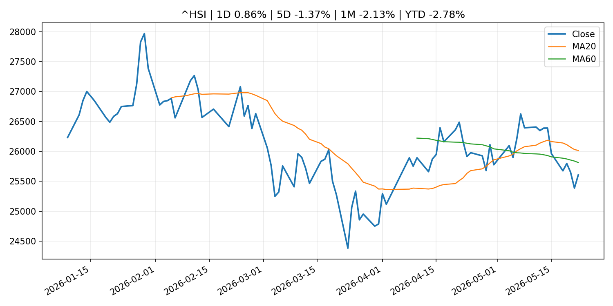

# Global Macro Morning Briefing - 2026-05-27

> Not financial advice / 非投资建议。

## 0. 今日总览
- 市场状态：mixed。股指上涨、波动率或美元回落，市场更接近风险偏好改善。 但存在信号冲突，需要降低单一叙事置信度。
- 今日三大主线：
  1. macro_data: Indicators for Core CPI
  2. central_bank_decision: Bitcoin ETFs crushed by billions in outflows as Treasuries stifle interest-rate cut hopes
  3. fiscal_policy: UK sanctions Huobi and ruble stablecoin issuer in crackdown on Russia crypto networks
- 一句话结论：今日晨报重点关注：这类宏观数据会直接改变市场对通胀、增长和政策路径的预期。；央行决策会重定价利率、汇率、久期资产和风险资产。。跨资产方面，SPY 1D 0.66%；QQQ 1D 1.78%；^VIX 1D 2.53%；TLT 1D 0.50%；GC=F 1D -0.25%；CL=F 1D -3.11%；BTC 1D -1.57%；ETH 1D -1.36%；股指上涨、波动率或美元回落，市场更接近风险偏好改善。 但存在信号冲突，需要降低单一叙事置信度。政策、通胀、利率、美元、美债、能源和加密监管仍是主要观察线索。所有结论仅基于公开数据与短摘要整理，不构成投资建议。

## 1. 隔夜跨资产市场
- 美股：SPY 1D 0.66%，QQQ 1D 1.78%，整体趋势需结合 VIX 和利率确认。
- 美债/美元：TLT 1D 0.50%，美元指数 1D -0.18%，是判断折现率压力的核心线索。
- 黄金/原油：黄金 1D -0.25%，原油 1D -3.11%，用于观察避险、通胀和地缘风险。
- 加密：BTC 1D -1.57%，ETH 1D -1.36%，关注是否独立于纳指走出加密自身行情。
- 港股/A股：恒生 1D 0.86%，沪深300/上证 1D n/a，重点看中国政策预期与人民币线索。
- 风险观察：确认风险偏好是否扩散到小盘股、信用利差和周期品。

### US_EQUITY

| symbol | latest close | 1D | 5D | 1M | YTD | trend |
|---|---:|---:|---:|---:|---:|---|
| SPY | 750.59 | 0.66% | 1.62% | 5.13% | 9.87% | strong_uptrend |
| QQQ | 730.28 | 1.78% | 3.46% | 10.00% | 19.11% | strong_uptrend |
| DIA | 505.25 | -0.17% | 1.66% | 2.65% | 4.47% | uptrend |
| IWM | 290.51 | 1.89% | 5.27% | 5.01% | 16.77% | strong_uptrend |
| VTI | 369.46 | 0.73% | 1.96% | 4.95% | 9.86% | strong_uptrend |

### US_MACRO_MARKET

| symbol | latest close | 1D | 5D | 1M | YTD | trend |
|---|---:|---:|---:|---:|---:|---|
| ^VIX | 17.01 | 2.53% | -5.81% | -5.60% | 17.23% | downtrend |
| DX-Y.NYB | 99.14 | -0.18% | 0.17% | 0.64% | 0.73% | range_bound |
| TLT | 85.10 | 0.50% | 1.84% | -1.86% | -2.22% | range_bound |
| IEF | 94.28 | 0.43% | 0.87% | -1.34% | -1.87% | downtrend |

### COMMODITIES

| symbol | latest close | 1D | 5D | 1M | YTD | trend |
|---|---:|---:|---:|---:|---:|---|
| GC=F | 4,509.90 | -0.25% | -0.94% | -4.50% | 4.53% | downtrend |
| SI=F | 77.54 | 2.18% | 0.61% | 1.52% | 9.91% | range_bound |
| CL=F | 93.60 | -3.11% | -13.86% | -0.85% | 63.29% | range_bound |
| BZ=F | 96.59 | -6.71% | -13.84% | -8.30% | 59.00% | range_bound |
| NG=F | 3.01 | 3.65% | -0.36% | 19.42% | -16.72% | range_bound |
| HG=F | 6.43 | 1.34% | 2.47% | 6.70% | 13.95% | strong_uptrend |

### HK_MARKET

| symbol | latest close | 1D | 5D | 1M | YTD | trend |
|---|---:|---:|---:|---:|---:|---|
| ^HSI | 25,606.03 | 0.86% | -1.37% | -2.13% | -2.78% | range_bound |
| 0700.HK | 439.00 | -0.54% | -2.27% | -11.35% | -29.53% | strong_downtrend |
| 9988.HK | 127.60 | 0.47% | -3.11% | -2.15% | -14.36% | range_bound |
| 3690.HK | 78.80 | -3.13% | -4.08% | -5.17% | -24.67% | range_bound |
| 1810.HK | 29.76 | -0.80% | -2.94% | -4.55% | -26.12% | strong_downtrend |
| 1211.HK | 93.65 | 2.24% | -0.16% | -9.52% | -5.16% | strong_downtrend |

### CRYPTO

| symbol | latest close | 1D | 5D | 1M | YTD | trend |
|---|---:|---:|---:|---:|---:|---|
| BTC | 75,776.12 | -1.57% | -2.17% | -5.07% | -13.42% | range_bound |
| ETH | 2,069.57 | -1.36% | -2.71% | -11.78% | -30.24% | strong_downtrend |
| SOLANA | 83.69 | -1.91% | -2.69% | -0.46% | -32.79% | range_bound |
| BINANCECOIN | 655.75 | -0.05% | 1.07% | 5.30% | -24.03% | uptrend |
| RIPPLE | 1.33 | -1.58% | -2.61% | -4.44% | -27.73% | range_bound |

## 2. 今日最重要的 10 条新闻
### 1. Indicators for Core CPI
- 来源：Bank of Japan Announcements
- 时间：2026-05-26T14:00:00+09:00
- 地区：Japan
- 事件类型：macro_data
- 重要性层级：Tier 1
- 一句话摘要：Indicators for Core CPI
- 为什么重要：这类宏观数据会直接改变市场对通胀、增长和政策路径的预期。
- 可能影响：主要影响 DXY，方向为 positive，强度 high；通胀压力可能推高政策利率预期并支撑美元。
  - 资产：DXY
    方向：positive
    强度：high
    原因：通胀压力可能推高政策利率预期并支撑美元。
  - 资产：TLT
    方向：negative
    强度：high
    原因：通胀上行通常推升收益率、压低长债价格。
  - 资产：QQQ
    方向：negative
    强度：high
    原因：更高利率对成长股估值折现率不利。
  - 资产：SPY
    方向：mixed
    强度：medium
    原因：名义增长可能支撑收入，但更高利率压制估值。
  - 资产：GC=F
    方向：mixed
    强度：medium
    原因：通胀对黄金是支撑，但实际利率上行会形成压力。
  - 资产：BTC
    方向：mixed
    强度：medium
    原因：抗通胀叙事和流动性收紧可能相互抵消。
- 原文链接：[http://www.boj.or.jp/en/research/research_data/cpi/index.htm](http://www.boj.or.jp/en/research/research_data/cpi/index.htm)

### 2. Bitcoin ETFs crushed by billions in outflows as Treasuries stifle interest-rate cut hopes
- 来源：CoinDesk
- 时间：2026-05-26T11:20:16+00:00
- 地区：global
- 事件类型：central_bank_decision
- 重要性层级：Tier 1
- 一句话摘要：Bitcoin ETFs crushed by billions in outflows as Treasuries stifle interest-rate cut hopes
- 为什么重要：央行决策会重定价利率、汇率、久期资产和风险资产。
- 可能影响：主要影响 QQQ，方向为 positive，强度 high；宽松预期降低折现率，有利于成长股。
  - 资产：QQQ
    方向：positive
    强度：high
    原因：宽松预期降低折现率，有利于成长股。
  - 资产：SPY
    方向：positive
    强度：high
    原因：宽松政策通常改善风险偏好。
  - 资产：TLT
    方向：positive
    强度：high
    原因：降息预期通常推升长债价格。
  - 资产：DXY
    方向：negative
    强度：medium
    原因：利差预期回落通常压制美元。
  - 资产：GC=F
    方向：positive
    强度：medium
    原因：实际利率下降通常利好黄金。
  - 资产：BTC
    方向：positive
    强度：high
    原因：流动性改善通常支持加密资产。
- 原文链接：[https://www.coindesk.com/daybook-us/2026/05/26/bitcoin-etfs-crushed-by-billions-in-outflows-as-treasuries-stifle-interest-rate-cut-hopes](https://www.coindesk.com/daybook-us/2026/05/26/bitcoin-etfs-crushed-by-billions-in-outflows-as-treasuries-stifle-interest-rate-cut-hopes)

### 3. UK sanctions Huobi and ruble stablecoin issuer in crackdown on Russia crypto networks
- 来源：CoinDesk
- 时间：2026-05-26T17:33:35+00:00
- 地区：global
- 事件类型：fiscal_policy
- 重要性层级：Tier 1
- 一句话摘要：UK sanctions Huobi and ruble stablecoin issuer in crackdown on Russia crypto networks
- 为什么重要：财政和贸易政策会影响增长、通胀、企业利润和跨境资本流。
- 可能影响：主要影响 BTC，方向为 mixed，强度 high；加密监管或 ETF 进展会改变 BTC 的资金流和风险溢价。
  - 资产：BTC
    方向：mixed
    强度：high
    原因：加密监管或 ETF 进展会改变 BTC 的资金流和风险溢价。
  - 资产：ETH
    方向：mixed
    强度：high
    原因：监管框架会影响 ETH 产品化和机构参与度。
  - 资产：COIN
    方向：mixed
    强度：medium
    原因：监管清晰度和执法风险会影响交易平台估值。
  - 资产：crypto market
    方向：mixed
    强度：high
    原因：信息影响整个加密市场结构，但方向取决于细节。
- 原文链接：[https://www.coindesk.com/business/2026/05/26/uk-sanctions-huobi-and-ruble-stablecoin-issuer-in-crackdown-on-russia-crypto-networks](https://www.coindesk.com/business/2026/05/26/uk-sanctions-huobi-and-ruble-stablecoin-issuer-in-crackdown-on-russia-crypto-networks)

### 4. Pope Leo is concerned about AI replacing human work. Traders share his concern long term
- 来源：CNBC Economy
- 时间：2026-05-26T19:31:51+00:00
- 地区：US
- 事件类型：macro_data
- 重要性层级：Tier 1
- 一句话摘要：The leader of the Catholic Church warned about artificial intelligence upending the labor market. Traders on Kalshi see unemployment jumping before 2030.
- 为什么重要：这类宏观数据会直接改变市场对通胀、增长和政策路径的预期。
- 可能影响：可能影响利率、汇率、风险资产或大宗商品预期，但当前公开信息不足以判断明确方向。
  - 资产：暂无明确资产映射
  - 方向：unknown
  - 强度：low
  - 原因：公开信息不足以判断方向。
- 原文链接：[https://www.cnbc.com/2026/05/26/traders-share-pope-leos-worries-on-ais-job-market-impact.html](https://www.cnbc.com/2026/05/26/traders-share-pope-leos-worries-on-ais-job-market-impact.html)

### 5. The bond market has been rocked by a violent selloff. Here’s how to play it.
- 来源：MarketWatch Top Stories
- 时间：2026-05-26T21:04:00+00:00
- 地区：US
- 事件类型：central_bank_speech
- 重要性层级：Tier 2
- 一句话摘要：The bond market is tied up in knots about the Iran war and inflation, as well as what the Federal Reserve under new chair Kevin Warsh might do about it.
- 为什么重要：央行官员表态可能影响市场对下一次会议的定价。
- 可能影响：主要影响 DXY，方向为 positive，强度 high；通胀压力可能推高政策利率预期并支撑美元。
  - 资产：DXY
    方向：positive
    强度：high
    原因：通胀压力可能推高政策利率预期并支撑美元。
  - 资产：TLT
    方向：negative
    强度：high
    原因：通胀上行通常推升收益率、压低长债价格。
  - 资产：QQQ
    方向：negative
    强度：high
    原因：更高利率对成长股估值折现率不利。
  - 资产：SPY
    方向：mixed
    强度：medium
    原因：名义增长可能支撑收入，但更高利率压制估值。
  - 资产：GC=F
    方向：mixed
    强度：medium
    原因：通胀对黄金是支撑，但实际利率上行会形成压力。
  - 资产：BTC
    方向：mixed
    强度：medium
    原因：抗通胀叙事和流动性收紧可能相互抵消。
- 原文链接：[https://www.marketwatch.com/story/where-to-invest-in-bonds-right-now-after-the-markets-violent-selloff-ccad2a26?mod=mw_rss_topstories](https://www.marketwatch.com/story/where-to-invest-in-bonds-right-now-after-the-markets-violent-selloff-ccad2a26?mod=mw_rss_topstories)

### 6. At $322 billion, the stablecoin market value exceeds the FX reserves of 95 nations
- 来源：CoinDesk
- 时间：2026-05-26T06:16:35+00:00
- 地区：global
- 事件类型：crypto_market_structure
- 重要性层级：Tier 2
- 一句话摘要：At $322 billion, the stablecoin market value exceeds the FX reserves of 95 nations
- 为什么重要：加密市场结构和监管变化会影响 BTC、ETH 及相关股票的风险溢价。
- 可能影响：主要影响 BTC，方向为 mixed，强度 high；加密监管或 ETF 进展会改变 BTC 的资金流和风险溢价。
  - 资产：BTC
    方向：mixed
    强度：high
    原因：加密监管或 ETF 进展会改变 BTC 的资金流和风险溢价。
  - 资产：ETH
    方向：mixed
    强度：high
    原因：监管框架会影响 ETH 产品化和机构参与度。
  - 资产：COIN
    方向：mixed
    强度：medium
    原因：监管清晰度和执法风险会影响交易平台估值。
  - 资产：crypto market
    方向：mixed
    强度：high
    原因：信息影响整个加密市场结构，但方向取决于细节。
- 原文链接：[https://www.coindesk.com/markets/2026/05/26/at-usd318-billion-the-stablecoin-market-value-exceeds-the-fx-reserves-of-95-nations](https://www.coindesk.com/markets/2026/05/26/at-usd318-billion-the-stablecoin-market-value-exceeds-the-fx-reserves-of-95-nations)

### 7. Why double-digit earnings growth won’t stop the next bear market
- 来源：MarketWatch Top Stories
- 时间：2026-05-26T21:01:00+00:00
- 地区：US
- 事件类型：earnings
- 重要性层级：Tier 2
- 一句话摘要：Spiking S&P 500 profits often signal the final innings of a bull market. History says stocks are on thin ice.
- 为什么重要：大型科技股盈利和资本开支会影响纳指、半导体和 AI 交易主线。
- 可能影响：可能影响利率、汇率、风险资产或大宗商品预期，但当前公开信息不足以判断明确方向。
  - 资产：暂无明确资产映射
  - 方向：unknown
  - 强度：low
  - 原因：公开信息不足以判断方向。
- 原文链接：[https://www.marketwatch.com/story/why-double-digit-earnings-growth-wont-stop-the-next-bear-market-791ae3ef?mod=mw_rss_topstories](https://www.marketwatch.com/story/why-double-digit-earnings-growth-wont-stop-the-next-bear-market-791ae3ef?mod=mw_rss_topstories)

### 8. Micron’s stock reaches a major milestone as UBS slaps on an out-of-sight price target
- 来源：MarketWatch Top Stories
- 时间：2026-05-26T20:46:00+00:00
- 地区：US
- 事件类型：earnings
- 重要性层级：Tier 2
- 一句话摘要：Strong memory chip demand is leading to “enhanced” long term agreements that should benefit Micron’s stock and earnings power, UBS says.
- 为什么重要：大型科技股盈利和资本开支会影响纳指、半导体和 AI 交易主线。
- 可能影响：可能影响利率、汇率、风险资产或大宗商品预期，但当前公开信息不足以判断明确方向。
  - 资产：暂无明确资产映射
  - 方向：unknown
  - 强度：low
  - 原因：公开信息不足以判断方向。
- 原文链接：[https://www.marketwatch.com/story/microns-stock-soars-as-ubs-slaps-on-an-out-of-sight-price-target-77e75b8e?mod=mw_rss_topstories](https://www.marketwatch.com/story/microns-stock-soars-as-ubs-slaps-on-an-out-of-sight-price-target-77e75b8e?mod=mw_rss_topstories)

### 9. My student loans are paused until 2028. Should I pay them now anyway?
- 来源：MarketWatch Top Stories
- 时间：2026-05-26T19:52:00+00:00
- 地区：US
- 事件类型：other
- 重要性层级：Tier 3
- 一句话摘要：Plus: What’s going on with ‘grade inflation’?
- 为什么重要：这条信息暂未匹配到重大宏观、政策或市场事件，更适合作为背景跟踪。
- 可能影响：主要影响 DXY，方向为 positive，强度 high；通胀压力可能推高政策利率预期并支撑美元。
  - 资产：DXY
    方向：positive
    强度：high
    原因：通胀压力可能推高政策利率预期并支撑美元。
  - 资产：TLT
    方向：negative
    强度：high
    原因：通胀上行通常推升收益率、压低长债价格。
  - 资产：QQQ
    方向：negative
    强度：high
    原因：更高利率对成长股估值折现率不利。
  - 资产：SPY
    方向：mixed
    强度：medium
    原因：名义增长可能支撑收入，但更高利率压制估值。
  - 资产：GC=F
    方向：mixed
    强度：medium
    原因：通胀对黄金是支撑，但实际利率上行会形成压力。
  - 资产：BTC
    方向：mixed
    强度：medium
    原因：抗通胀叙事和流动性收紧可能相互抵消。
- 原文链接：[https://www.marketwatch.com/story/my-student-loans-are-paused-until-2028-should-i-pay-them-now-anyway-136fe97e?mod=mw_rss_topstories](https://www.marketwatch.com/story/my-student-loans-are-paused-until-2028-should-i-pay-them-now-anyway-136fe97e?mod=mw_rss_topstories)

### 10. Minutes of the Board's discount rate meeting on April 20 and 29, 2026
- 来源：Federal Reserve Press Releases
- 时间：2026-05-26T18:00:00+00:00
- 地区：US
- 事件类型：other
- 重要性层级：Tier 3
- 一句话摘要：Minutes of the Board's discount rate meeting on April 20 and 29, 2026
- 为什么重要：这条信息暂未匹配到重大宏观、政策或市场事件，更适合作为背景跟踪。
- 可能影响：更偏背景信息，短期市场影响可能有限。
  - 资产：暂无明确资产映射
  - 方向：unknown
  - 强度：low
  - 原因：公开信息不足以判断方向。
- 原文链接：[https://www.federalreserve.gov/newsevents/pressreleases/monetary20260526a.htm](https://www.federalreserve.gov/newsevents/pressreleases/monetary20260526a.htm)

## 3. 政策与央行观察
### 1. Bitcoin ETFs crushed by billions in outflows as Treasuries stifle interest-rate cut hopes
- 来源：CoinDesk
- 时间：2026-05-26T11:20:16+00:00
- 地区：global
- 事件类型：central_bank_decision
- 重要性层级：Tier 1
- 一句话摘要：Bitcoin ETFs crushed by billions in outflows as Treasuries stifle interest-rate cut hopes
- 为什么重要：央行决策会重定价利率、汇率、久期资产和风险资产。
- 可能影响：主要影响 QQQ，方向为 positive，强度 high；宽松预期降低折现率，有利于成长股。
  - 资产：QQQ
    方向：positive
    强度：high
    原因：宽松预期降低折现率，有利于成长股。
  - 资产：SPY
    方向：positive
    强度：high
    原因：宽松政策通常改善风险偏好。
  - 资产：TLT
    方向：positive
    强度：high
    原因：降息预期通常推升长债价格。
  - 资产：DXY
    方向：negative
    强度：medium
    原因：利差预期回落通常压制美元。
  - 资产：GC=F
    方向：positive
    强度：medium
    原因：实际利率下降通常利好黄金。
  - 资产：BTC
    方向：positive
    强度：high
    原因：流动性改善通常支持加密资产。
- 原文链接：[https://www.coindesk.com/daybook-us/2026/05/26/bitcoin-etfs-crushed-by-billions-in-outflows-as-treasuries-stifle-interest-rate-cut-hopes](https://www.coindesk.com/daybook-us/2026/05/26/bitcoin-etfs-crushed-by-billions-in-outflows-as-treasuries-stifle-interest-rate-cut-hopes)

### 2. UK sanctions Huobi and ruble stablecoin issuer in crackdown on Russia crypto networks
- 来源：CoinDesk
- 时间：2026-05-26T17:33:35+00:00
- 地区：global
- 事件类型：fiscal_policy
- 重要性层级：Tier 1
- 一句话摘要：UK sanctions Huobi and ruble stablecoin issuer in crackdown on Russia crypto networks
- 为什么重要：财政和贸易政策会影响增长、通胀、企业利润和跨境资本流。
- 可能影响：主要影响 BTC，方向为 mixed，强度 high；加密监管或 ETF 进展会改变 BTC 的资金流和风险溢价。
  - 资产：BTC
    方向：mixed
    强度：high
    原因：加密监管或 ETF 进展会改变 BTC 的资金流和风险溢价。
  - 资产：ETH
    方向：mixed
    强度：high
    原因：监管框架会影响 ETH 产品化和机构参与度。
  - 资产：COIN
    方向：mixed
    强度：medium
    原因：监管清晰度和执法风险会影响交易平台估值。
  - 资产：crypto market
    方向：mixed
    强度：high
    原因：信息影响整个加密市场结构，但方向取决于细节。
- 原文链接：[https://www.coindesk.com/business/2026/05/26/uk-sanctions-huobi-and-ruble-stablecoin-issuer-in-crackdown-on-russia-crypto-networks](https://www.coindesk.com/business/2026/05/26/uk-sanctions-huobi-and-ruble-stablecoin-issuer-in-crackdown-on-russia-crypto-networks)

### 3. The bond market has been rocked by a violent selloff. Here’s how to play it.
- 来源：MarketWatch Top Stories
- 时间：2026-05-26T21:04:00+00:00
- 地区：US
- 事件类型：central_bank_speech
- 重要性层级：Tier 2
- 一句话摘要：The bond market is tied up in knots about the Iran war and inflation, as well as what the Federal Reserve under new chair Kevin Warsh might do about it.
- 为什么重要：央行官员表态可能影响市场对下一次会议的定价。
- 可能影响：主要影响 DXY，方向为 positive，强度 high；通胀压力可能推高政策利率预期并支撑美元。
  - 资产：DXY
    方向：positive
    强度：high
    原因：通胀压力可能推高政策利率预期并支撑美元。
  - 资产：TLT
    方向：negative
    强度：high
    原因：通胀上行通常推升收益率、压低长债价格。
  - 资产：QQQ
    方向：negative
    强度：high
    原因：更高利率对成长股估值折现率不利。
  - 资产：SPY
    方向：mixed
    强度：medium
    原因：名义增长可能支撑收入，但更高利率压制估值。
  - 资产：GC=F
    方向：mixed
    强度：medium
    原因：通胀对黄金是支撑，但实际利率上行会形成压力。
  - 资产：BTC
    方向：mixed
    强度：medium
    原因：抗通胀叙事和流动性收紧可能相互抵消。
- 原文链接：[https://www.marketwatch.com/story/where-to-invest-in-bonds-right-now-after-the-markets-violent-selloff-ccad2a26?mod=mw_rss_topstories](https://www.marketwatch.com/story/where-to-invest-in-bonds-right-now-after-the-markets-violent-selloff-ccad2a26?mod=mw_rss_topstories)

### 4. At $322 billion, the stablecoin market value exceeds the FX reserves of 95 nations
- 来源：CoinDesk
- 时间：2026-05-26T06:16:35+00:00
- 地区：global
- 事件类型：crypto_market_structure
- 重要性层级：Tier 2
- 一句话摘要：At $322 billion, the stablecoin market value exceeds the FX reserves of 95 nations
- 为什么重要：加密市场结构和监管变化会影响 BTC、ETH 及相关股票的风险溢价。
- 可能影响：主要影响 BTC，方向为 mixed，强度 high；加密监管或 ETF 进展会改变 BTC 的资金流和风险溢价。
  - 资产：BTC
    方向：mixed
    强度：high
    原因：加密监管或 ETF 进展会改变 BTC 的资金流和风险溢价。
  - 资产：ETH
    方向：mixed
    强度：high
    原因：监管框架会影响 ETH 产品化和机构参与度。
  - 资产：COIN
    方向：mixed
    强度：medium
    原因：监管清晰度和执法风险会影响交易平台估值。
  - 资产：crypto market
    方向：mixed
    强度：high
    原因：信息影响整个加密市场结构，但方向取决于细节。
- 原文链接：[https://www.coindesk.com/markets/2026/05/26/at-usd318-billion-the-stablecoin-market-value-exceeds-the-fx-reserves-of-95-nations](https://www.coindesk.com/markets/2026/05/26/at-usd318-billion-the-stablecoin-market-value-exceeds-the-fx-reserves-of-95-nations)

## 4. 市场异动与图表
- SPY 上涨 0.66%
- QQQ 上涨 1.78%
- TLT 上涨 0.50%
- Oil 下跌 -3.11%

### 信号矛盾
- 股指上涨但 VIX 同时走高，风险偏好信号不一致。

### SPY

### QQQ

### ^VIX

### TLT

### GC=F

### CL=F

### BTC

### ETH

### ^HSI

## 5. 华尔街与机构公开观点
- 暂无可靠公开观点。

## 6. 今日重点关注
- 经济数据：经济数据：暂无可靠公开日历数据；如配置经济日历源后可自动填充。
- 央行讲话：央行讲话：暂无可靠公开日历数据；重点跟踪 Fed、ECB、BoJ、PBOC 官网 RSS。
- 财报：财报：暂无可靠数据。
- 政策事件：政策事件：暂无可靠数据。
- 风险提醒：风险提醒：关注数据源失败项、突发地缘风险、利率和美元的二阶反应。

## 7. 英文金融表达与宏观概念
- **inflation expectations**：通胀预期，指家庭、企业或市场对未来通胀的预估。 例句：Inflation expectations can shape wage bargaining and bond yields.
- **real yield**：实际收益率，名义利率扣除通胀预期后的收益率。 例句：Gold often reacts more to real yields than nominal yields.
- **soft landing**：软着陆，指通胀回落而经济避免明显衰退。 例句：Markets often rally when data support a soft landing.
- **risk-off**：避险模式，资金偏向美元、国债、黄金等防御资产。 例句：A geopolitical shock can push markets into risk-off mode.
- **market structure**：市场结构，指交易、托管、清算、ETF、监管等制度安排。 例句：Crypto market structure rules can affect institutional participation.
- **terminal rate**：终端利率，市场预期本轮加息周期的最高政策利率。 例句：A higher terminal rate can pressure growth stocks.

## 8. 背景材料
- [My student loans are paused until 2028. Should I pay them now anyway?](https://www.marketwatch.com/story/my-student-loans-are-paused-until-2028-should-i-pay-them-now-anyway-136fe97e?mod=mw_rss_topstories)（MarketWatch Top Stories，other）：Plus: What’s going on with ‘grade inflation’?
- [Joe Lubin-backed Ethereum treasury firm SharpLink to join the Russel  indexes](https://www.coindesk.com/business/2026/05/26/joe-lubin-backed-ethereum-treasury-firm-sharplink-to-join-the-russel-indexes)（CoinDesk，other）：Joe Lubin-backed Ethereum treasury firm SharpLink to join the Russel  indexes
- [Minutes of the Board's discount rate meeting on April 20 and 29, 2026](https://www.federalreserve.gov/newsevents/pressreleases/monetary20260526a.htm)（Federal Reserve Press Releases，other）：Minutes of the Board's discount rate meeting on April 20 and 29, 2026
- [Live markets: bitcoin leads crypto slide even as tech sector closes sharply higher](https://www.coindesk.com/markets/2026/05/26/live-markets-bitcoin-on-sidelines-as-markets-surge-on-iran-peace-hopes)（CoinDesk，other）：Live markets: bitcoin leads crypto slide even as tech sector closes sharply higher
- [Strive acquires 1,109 bitcoin, raising total holdings to 16,500 coins](https://www.coindesk.com/markets/2026/05/26/strive-acquires-1-109-bitcoin-raising-total-holdings-to-16-500-coins)（CoinDesk，other）：Strive acquires 1,109 bitcoin, raising total holdings to 16,500 coins
- [Bitcoin demand gauge sinks to worst level since December as spot buying weakens](https://www.coindesk.com/markets/2026/05/26/bitcoin-demand-gauge-sinks-to-worst-level-since-december-as-rally-loses-spot-support)（CoinDesk，other）：Bitcoin demand gauge sinks to worst level since December as spot buying weakens
- [Bitcoin risks another lower high as stocks rally, AI tokens outperform](https://www.coindesk.com/markets/2026/05/26/bitcoin-risks-another-lower-high-as-stocks-rally-ai-tokens-outperform)（CoinDesk，other）：Bitcoin risks another lower high as stocks rally, AI tokens outperform
- [Philip R. Lane: Interview with Nikkei](https://www.ecb.europa.eu//press/inter/date/2026/html/ecb.in260526_1~71caa51b14.en.html)（ECB Press Releases，other）：Philip R. Lane: Interview with Nikkei
- [Bitcoin caught between critical onchain support and an options showdown](https://www.coindesk.com/markets/2026/05/26/bitcoin-caught-between-critical-onchain-support-and-an-options-showdown)（CoinDesk，other）：Bitcoin caught between critical onchain support and an options showdown
- [Isabel Schnabel: Interview with Reuters](https://www.ecb.europa.eu//press/inter/date/2026/html/ecb.in260526~6736a05aaa.en.html)（ECB Press Releases，other）：Isabel Schnabel: Interview with Reuters
- [Average Contract Interest Rates on Loans and Discounts (Mar.)](http://www.boj.or.jp/en/statistics/dl/loan/yaku/yaku2603.pdf)（Bank of Japan Announcements，other）：Average Contract Interest Rates on Loans and Discounts (Mar.)
- [Statistics on Securities Financing Transactions in Japan](http://www.boj.or.jp/en/statistics/bis/repo/index.htm)（Bank of Japan Announcements，other）：Statistics on Securities Financing Transactions in Japan
- [Planned Retroactive Revision to the Flow of Funds Accounts](http://www.boj.or.jp/en/statistics/outline/notice_2026/not260525a.pdf)（Bank of Japan Announcements，routine_announcement）：Planned Retroactive Revision to the Flow of Funds Accounts

## 9. 数据源、失败项与免责声明
- 采集时间：2026-05-26T23:08:48
- 数据源：公开 RSS、Yahoo Finance、CoinGecko、AKShare、FRED、SEC data.sec.gov，以及用户自有 inputs/reports 文件。
- 合规说明：不绕过 WSJ、Bloomberg、FT、Reuters 等付费墙；对付费媒体只使用公开 RSS 标题、摘要、链接和发布时间。
- 免责声明：Not financial advice / 非投资建议。本项目仅供个人学习、研究和信息整理，不构成投资建议、交易建议或任何收益承诺。
- 失败或跳过的数据源：
  - crypto data failed coin=dogecoin
  - China market data failed symbol=上证指数: empty dataframe
  - China market data failed symbol=深证成指: empty dataframe
  - China market data failed symbol=创业板指: empty dataframe
  - China market data failed symbol=沪深300: empty dataframe
  - China market data failed symbol=中证500: empty dataframe
  - China market data failed symbol=科创50: empty dataframe
  - FRED_API_KEY not set; skipping FRED macro series
  - SEC failed cik=0000320193
  - SEC failed cik=0000789019
  - SEC failed cik=0001045810
  - SEC failed cik=0001318605
  - SEC failed cik=0001577552
