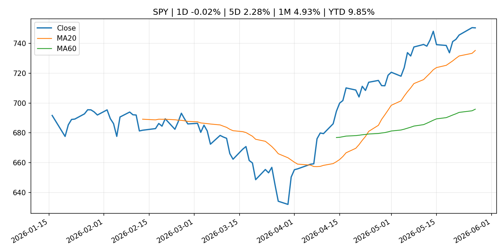
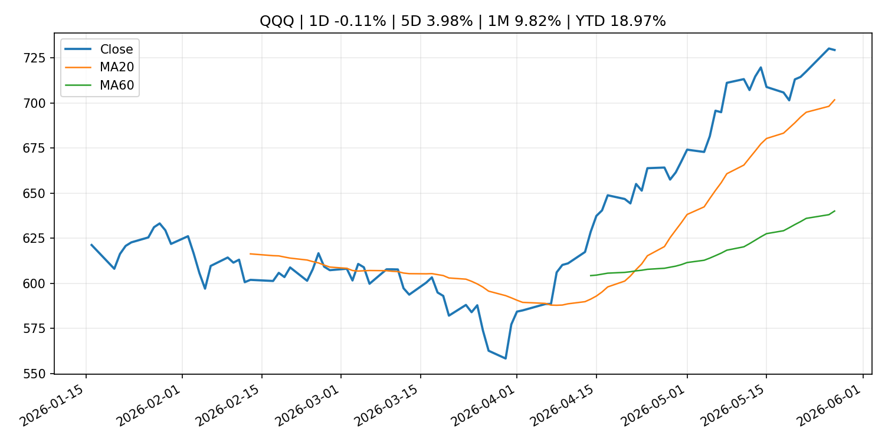
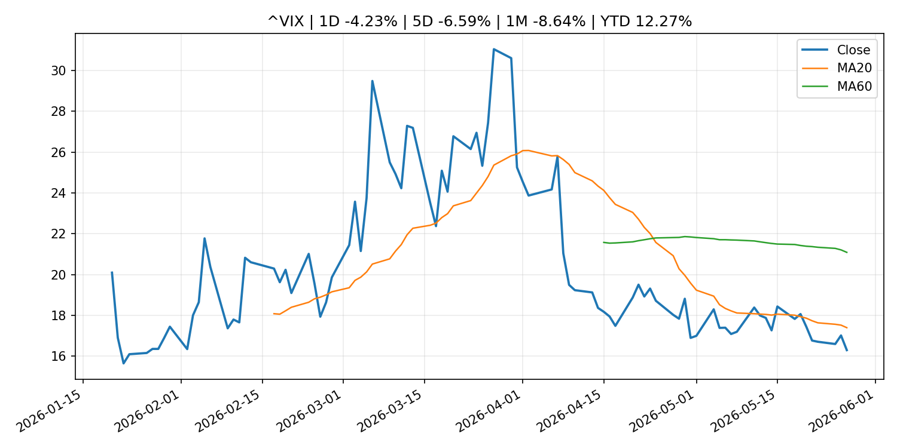
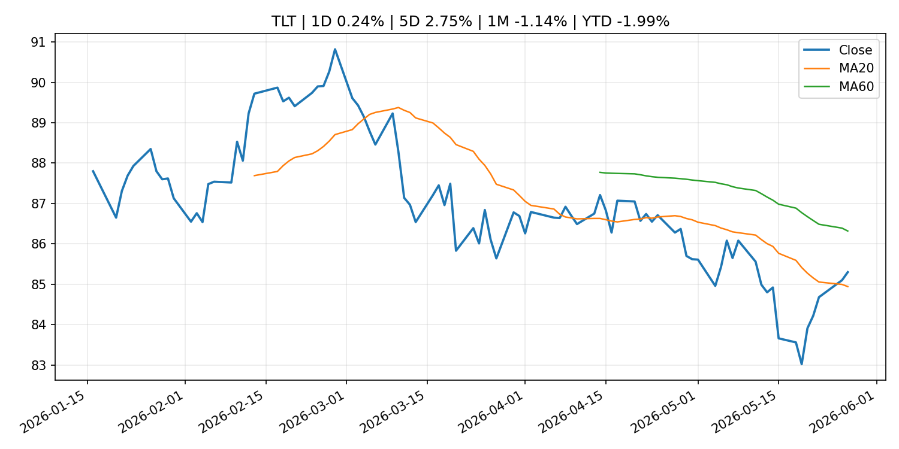
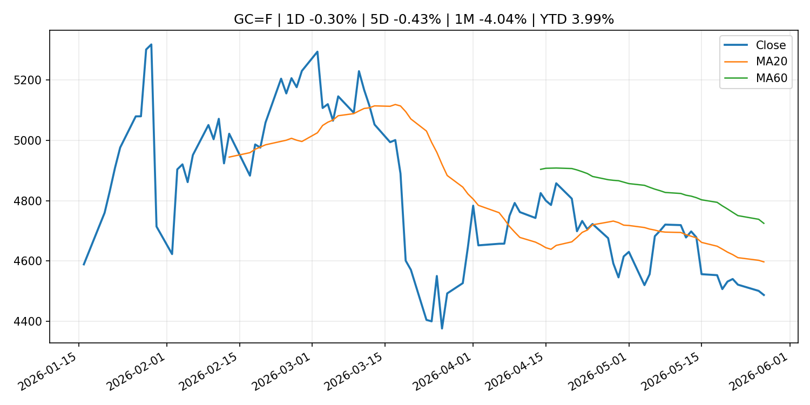
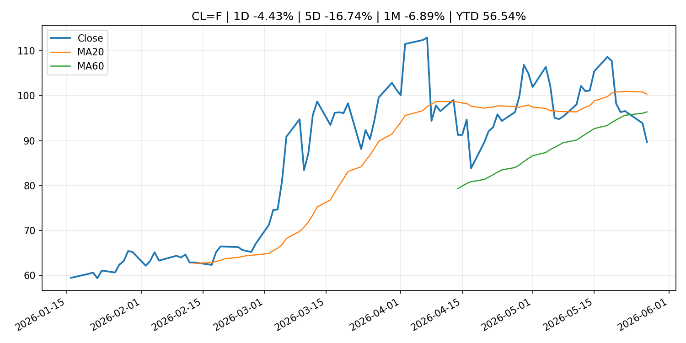
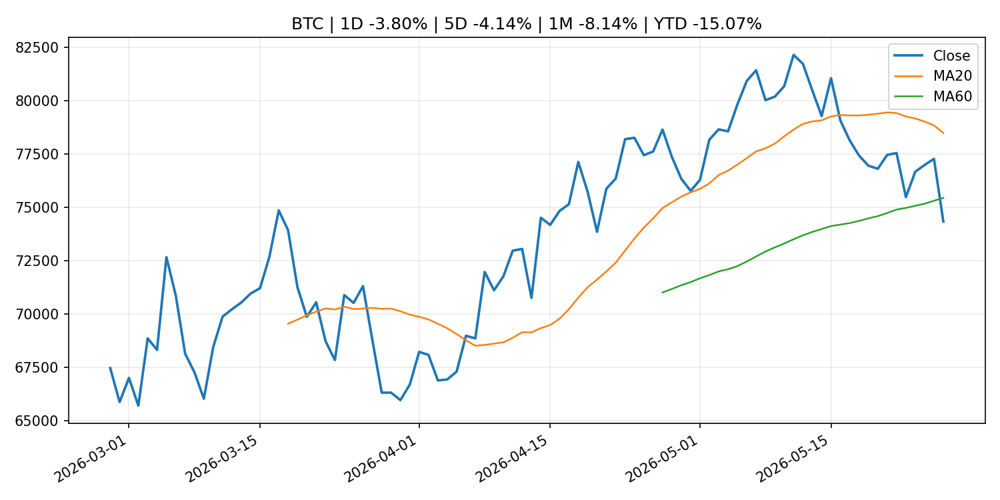
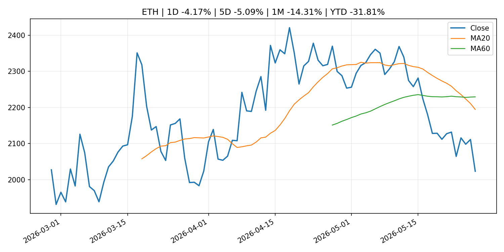
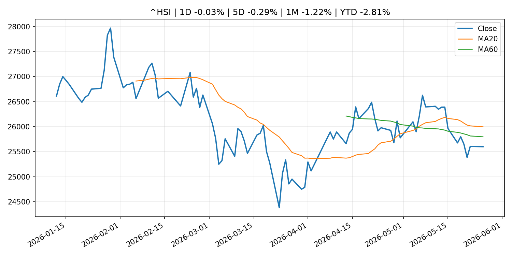

# Global Macro Morning Briefing - 2026-05-28

> Not financial advice / 非投资建议。

## 0. 今日总览
- 市场状态：unknown。市场信号不足，暂不判断明确状态。
- 今日三大主线：
  1. macro_data: Indicators for Core CPI
  2. financial_stability: Luis de Guindos: Financial Stability Review - May 2026
  3. financial_stability: Financial stability vulnerabilities remain elevated as geoeconomic shock unfolds
- 一句话结论：今日晨报重点关注：这类宏观数据会直接改变市场对通胀、增长和政策路径的预期。；金融稳定信号可能放大跨资产波动，并影响央行反应函数。。跨资产方面，SPY 1D -0.02%；QQQ 1D -0.11%；^VIX 1D -4.23%；TLT 1D 0.24%；GC=F 1D -0.30%；CL=F 1D -4.43%；BTC 1D -3.80%；ETH 1D -4.17%；市场信号不足，暂不判断明确状态。政策、通胀、利率、美元、美债、能源和加密监管仍是主要观察线索。所有结论仅基于公开数据与短摘要整理，不构成投资建议。

## 1. 隔夜跨资产市场
- 美股：SPY 1D -0.02%，QQQ 1D -0.11%，整体趋势需结合 VIX 和利率确认。
- 美债/美元：TLT 1D 0.24%，美元指数 1D -0.15%，是判断折现率压力的核心线索。
- 黄金/原油：黄金 1D -0.30%，原油 1D -4.43%，用于观察避险、通胀和地缘风险。
- 加密：BTC 1D -3.80%，ETH 1D -4.17%，关注是否独立于纳指走出加密自身行情。
- 港股/A股：恒生 1D -0.03%，沪深300/上证 1D n/a，重点看中国政策预期与人民币线索。
- 风险观察：关注后续数据是否确认当前跨资产信号。

### US_EQUITY

| symbol | latest close | 1D | 5D | 1M | YTD | trend |
|---|---:|---:|---:|---:|---:|---|
| SPY | 750.46 | -0.02% | 2.28% | 4.93% | 9.85% | strong_uptrend |
| QQQ | 729.45 | -0.11% | 3.98% | 9.82% | 18.97% | strong_uptrend |
| DIA | 506.88 | 0.32% | 2.61% | 3.06% | 4.81% | strong_uptrend |
| IWM | 290.37 | -0.05% | 6.36% | 4.77% | 16.72% | uptrend |
| VTI | 369.36 | -0.03% | 2.58% | 4.77% | 9.83% | strong_uptrend |

### US_MACRO_MARKET

| symbol | latest close | 1D | 5D | 1M | YTD | trend |
|---|---:|---:|---:|---:|---:|---|
| ^VIX | 16.29 | -4.23% | -6.59% | -8.64% | 12.27% | strong_downtrend |
| DX-Y.NYB | 99.17 | -0.15% | 0.20% | 0.67% | 0.76% | range_bound |
| TLT | 85.30 | 0.24% | 2.75% | -1.14% | -1.99% | range_bound |
| IEF | 94.32 | 0.04% | 1.30% | -1.07% | -1.83% | range_bound |

### COMMODITIES

| symbol | latest close | 1D | 5D | 1M | YTD | trend |
|---|---:|---:|---:|---:|---:|---|
| GC=F | 4,486.70 | -0.30% | -0.43% | -4.04% | 3.99% | strong_downtrend |
| SI=F | 74.91 | -1.83% | 0.11% | -0.12% | 6.17% | range_bound |
| CL=F | 89.73 | -4.43% | -16.74% | -6.89% | 56.54% | range_bound |
| BZ=F | 93.39 | -6.22% | -16.08% | -13.71% | 53.73% | range_bound |
| NG=F | 3.08 | 6.43% | -1.09% | 20.78% | -14.87% | strong_uptrend |
| HG=F | 6.33 | -0.42% | 2.75% | 5.26% | 12.31% | strong_uptrend |

### HK_MARKET

| symbol | latest close | 1D | 5D | 1M | YTD | trend |
|---|---:|---:|---:|---:|---:|---|
| ^HSI | 25,599.45 | -0.03% | -0.29% | -1.22% | -2.81% | range_bound |
| 0700.HK | 434.40 | -1.05% | -5.57% | -11.96% | -30.27% | strong_downtrend |
| 9988.HK | 124.30 | -2.59% | -6.75% | -5.69% | -16.58% | range_bound |
| 3690.HK | 77.70 | -1.40% | -6.44% | -5.76% | -25.72% | range_bound |
| 1810.HK | 28.40 | -4.57% | -7.31% | -8.97% | -29.49% | strong_downtrend |
| 1211.HK | 90.70 | -3.15% | -3.41% | -10.38% | -8.15% | strong_downtrend |

### CRYPTO

| symbol | latest close | 1D | 5D | 1M | YTD | trend |
|---|---:|---:|---:|---:|---:|---|
| BTC | 74,335.18 | -3.80% | -4.14% | -8.14% | -15.07% | range_bound |
| ETH | 2,023.12 | -4.17% | -5.09% | -14.31% | -31.81% | strong_downtrend |
| SOLANA | 82.44 | -2.98% | -5.41% | -4.51% | -33.79% | range_bound |
| BINANCECOIN | 647.53 | -2.26% | -1.49% | 2.67% | -24.98% | range_bound |
| RIPPLE | 1.31 | -3.15% | -4.74% | -7.54% | -28.96% | range_bound |
| DOGECOIN | 0.10 | -1.57% | -4.88% | -12.51% | -14.40% | range_bound |

## 2. 今日最重要的 10 条新闻
### 1. Indicators for Core CPI
- 来源：Bank of Japan Announcements
- 时间：2026-05-26T14:00:00+09:00
- 地区：Japan
- 事件类型：macro_data
- 重要性层级：Tier 1
- 一句话摘要：Indicators for Core CPI
- 为什么重要：这类宏观数据会直接改变市场对通胀、增长和政策路径的预期。
- 可能影响：主要影响 DXY，方向为 positive，强度 high；通胀压力可能推高政策利率预期并支撑美元。
  - 资产：DXY
    方向：positive
    强度：high
    原因：通胀压力可能推高政策利率预期并支撑美元。
  - 资产：TLT
    方向：negative
    强度：high
    原因：通胀上行通常推升收益率、压低长债价格。
  - 资产：QQQ
    方向：negative
    强度：high
    原因：更高利率对成长股估值折现率不利。
  - 资产：SPY
    方向：mixed
    强度：medium
    原因：名义增长可能支撑收入，但更高利率压制估值。
  - 资产：GC=F
    方向：mixed
    强度：medium
    原因：通胀对黄金是支撑，但实际利率上行会形成压力。
  - 资产：BTC
    方向：mixed
    强度：medium
    原因：抗通胀叙事和流动性收紧可能相互抵消。
- 原文链接：[http://www.boj.or.jp/en/research/research_data/cpi/index.htm](http://www.boj.or.jp/en/research/research_data/cpi/index.htm)

### 2. Luis de Guindos: Financial Stability Review - May 2026
- 来源：ECB Press Releases
- 时间：2026-05-27T10:00:00+02:00
- 地区：EU
- 事件类型：financial_stability
- 重要性层级：Tier 1
- 一句话摘要：Luis de Guindos: Financial Stability Review - May 2026
- 为什么重要：金融稳定信号可能放大跨资产波动，并影响央行反应函数。
- 可能影响：可能影响利率、汇率、风险资产或大宗商品预期，但当前公开信息不足以判断明确方向。
  - 资产：暂无明确资产映射
  - 方向：unknown
  - 强度：low
  - 原因：公开信息不足以判断方向。
- 原文链接：[https://www.ecb.europa.eu//press/key/date/2026/html/ecb.sp260527~bc724e42c1.en.pdf](https://www.ecb.europa.eu//press/key/date/2026/html/ecb.sp260527~bc724e42c1.en.pdf)

### 3. Financial stability vulnerabilities remain elevated as geoeconomic shock unfolds
- 来源：ECB Press Releases
- 时间：2026-05-27T10:00:00+02:00
- 地区：EU
- 事件类型：financial_stability
- 重要性层级：Tier 1
- 一句话摘要：Financial stability vulnerabilities remain elevated as geoeconomic shock unfolds
- 为什么重要：金融稳定信号可能放大跨资产波动，并影响央行反应函数。
- 可能影响：可能影响利率、汇率、风险资产或大宗商品预期，但当前公开信息不足以判断明确方向。
  - 资产：暂无明确资产映射
  - 方向：unknown
  - 强度：low
  - 原因：公开信息不足以判断方向。
- 原文链接：[https://www.ecb.europa.eu//press/pr/date/2026/html/ecb.pr260527~92140c5054.en.html](https://www.ecb.europa.eu//press/pr/date/2026/html/ecb.pr260527~92140c5054.en.html)

### 4. Major crypto exchanges increase transfer scrutiny with HTX over UK sanctions
- 来源：CoinDesk
- 时间：2026-05-27T13:37:42+00:00
- 地区：global
- 事件类型：fiscal_policy
- 重要性层级：Tier 1
- 一句话摘要：Major crypto exchanges increase transfer scrutiny with HTX over UK sanctions
- 为什么重要：财政和贸易政策会影响增长、通胀、企业利润和跨境资本流。
- 可能影响：可能影响利率、汇率、风险资产或大宗商品预期，但当前公开信息不足以判断明确方向。
  - 资产：暂无明确资产映射
  - 方向：unknown
  - 强度：low
  - 原因：公开信息不足以判断方向。
- 原文链接：[https://www.coindesk.com/business/2026/05/27/major-crypto-exchanges-increase-transfer-scrutiny-with-htx-over-uk-sanctions](https://www.coindesk.com/business/2026/05/27/major-crypto-exchanges-increase-transfer-scrutiny-with-htx-over-uk-sanctions)

### 5. Pope Leo is concerned about AI replacing human work. Traders share his concern long term
- 来源：CNBC Economy
- 时间：2026-05-26T19:31:51+00:00
- 地区：US
- 事件类型：macro_data
- 重要性层级：Tier 1
- 一句话摘要：The leader of the Catholic Church warned about artificial intelligence upending the labor market. Traders on Kalshi see unemployment jumping before 2030.
- 为什么重要：这类宏观数据会直接改变市场对通胀、增长和政策路径的预期。
- 可能影响：可能影响利率、汇率、风险资产或大宗商品预期，但当前公开信息不足以判断明确方向。
  - 资产：暂无明确资产映射
  - 方向：unknown
  - 强度：low
  - 原因：公开信息不足以判断方向。
- 原文链接：[https://www.cnbc.com/2026/05/26/traders-share-pope-leos-worries-on-ais-job-market-impact.html](https://www.cnbc.com/2026/05/26/traders-share-pope-leos-worries-on-ais-job-market-impact.html)

### 6. SEC Investor Advisory Committee to Host June 4 Meeting
- 来源：SEC Press Releases
- 时间：2026-05-27T10:59:13-04:00
- 地区：US
- 事件类型：regulation
- 重要性层级：Tier 2
- 一句话摘要：The Securities and Exchange Commission’s Investor Advisory Committee will hold a public meeting at the SEC Headquarters in Washington D.C. on June 4 at 10 a.m. ET to discuss private markets, passive index funds, and recommendations regarding fund…
- 为什么重要：监管变化会改变行业盈利预期和资产风险溢价。
- 可能影响：主要影响 BTC，方向为 mixed，强度 high；加密监管或 ETF 进展会改变 BTC 的资金流和风险溢价。
  - 资产：BTC
    方向：mixed
    强度：high
    原因：加密监管或 ETF 进展会改变 BTC 的资金流和风险溢价。
  - 资产：ETH
    方向：mixed
    强度：high
    原因：监管框架会影响 ETH 产品化和机构参与度。
  - 资产：COIN
    方向：mixed
    强度：medium
    原因：监管清晰度和执法风险会影响交易平台估值。
  - 资产：crypto market
    方向：mixed
    强度：high
    原因：信息影响整个加密市场结构，但方向取决于细节。
- 原文链接：[https://www.sec.gov/newsroom/press-releases/2026-48-sec-investor-advisory-committee-host-june-4-meeting](https://www.sec.gov/newsroom/press-releases/2026-48-sec-investor-advisory-committee-host-june-4-meeting)

### 7. Block kicks off Cash App’s phased stablecoin roll out to its nearly 60 million users
- 来源：CoinDesk
- 时间：2026-05-27T14:26:20+00:00
- 地区：global
- 事件类型：crypto_market_structure
- 重要性层级：Tier 2
- 一句话摘要：Block kicks off Cash App’s phased stablecoin roll out to its nearly 60 million users
- 为什么重要：加密市场结构和监管变化会影响 BTC、ETH 及相关股票的风险溢价。
- 可能影响：主要影响 BTC，方向为 mixed，强度 high；加密监管或 ETF 进展会改变 BTC 的资金流和风险溢价。
  - 资产：BTC
    方向：mixed
    强度：high
    原因：加密监管或 ETF 进展会改变 BTC 的资金流和风险溢价。
  - 资产：ETH
    方向：mixed
    强度：high
    原因：监管框架会影响 ETH 产品化和机构参与度。
  - 资产：COIN
    方向：mixed
    强度：medium
    原因：监管清晰度和执法风险会影响交易平台估值。
  - 资产：crypto market
    方向：mixed
    强度：high
    原因：信息影响整个加密市场结构，但方向取决于细节。
- 原文链接：[https://www.coindesk.com/business/2026/05/27/block-kicks-off-cash-app-s-phased-stablecoin-roll-out-to-its-nearly-60-million-users](https://www.coindesk.com/business/2026/05/27/block-kicks-off-cash-app-s-phased-stablecoin-roll-out-to-its-nearly-60-million-users)

### 8. Mastercard secures New York BitLicense to support stablecoin and digital payment infrastructure
- 来源：CoinDesk
- 时间：2026-05-27T13:15:00+00:00
- 地区：global
- 事件类型：crypto_market_structure
- 重要性层级：Tier 2
- 一句话摘要：Mastercard secures New York BitLicense to support stablecoin and digital payment infrastructure
- 为什么重要：加密市场结构和监管变化会影响 BTC、ETH 及相关股票的风险溢价。
- 可能影响：主要影响 BTC，方向为 mixed，强度 high；加密监管或 ETF 进展会改变 BTC 的资金流和风险溢价。
  - 资产：BTC
    方向：mixed
    强度：high
    原因：加密监管或 ETF 进展会改变 BTC 的资金流和风险溢价。
  - 资产：ETH
    方向：mixed
    强度：high
    原因：监管框架会影响 ETH 产品化和机构参与度。
  - 资产：COIN
    方向：mixed
    强度：medium
    原因：监管清晰度和执法风险会影响交易平台估值。
  - 资产：crypto market
    方向：mixed
    强度：high
    原因：信息影响整个加密市场结构，但方向取决于细节。
- 原文链接：[https://www.coindesk.com/business/2026/05/27/mastercard-secures-new-york-bitlicense-to-support-stablecoin-and-digital-payment-infrastructure](https://www.coindesk.com/business/2026/05/27/mastercard-secures-new-york-bitlicense-to-support-stablecoin-and-digital-payment-infrastructure)

### 9. SoFi brings bank-issued stablecoin to 15 million users in crypto push
- 来源：CoinDesk
- 时间：2026-05-27T11:00:00+00:00
- 地区：global
- 事件类型：crypto_market_structure
- 重要性层级：Tier 2
- 一句话摘要：SoFi brings bank-issued stablecoin to 15 million users in crypto push
- 为什么重要：加密市场结构和监管变化会影响 BTC、ETH 及相关股票的风险溢价。
- 可能影响：主要影响 BTC，方向为 mixed，强度 high；加密监管或 ETF 进展会改变 BTC 的资金流和风险溢价。
  - 资产：BTC
    方向：mixed
    强度：high
    原因：加密监管或 ETF 进展会改变 BTC 的资金流和风险溢价。
  - 资产：ETH
    方向：mixed
    强度：high
    原因：监管框架会影响 ETH 产品化和机构参与度。
  - 资产：COIN
    方向：mixed
    强度：medium
    原因：监管清晰度和执法风险会影响交易平台估值。
  - 资产：crypto market
    方向：mixed
    强度：high
    原因：信息影响整个加密市场结构，但方向取决于细节。
- 原文链接：[https://www.coindesk.com/business/2026/05/27/sofi-brings-bank-issued-stablecoin-to-15-million-users-in-crypto-push](https://www.coindesk.com/business/2026/05/27/sofi-brings-bank-issued-stablecoin-to-15-million-users-in-crypto-push)

### 10. Crypto exchange HTX rejects U.K. sanction allegations, says it refused ruble stablecoin listing
- 来源：CoinDesk
- 时间：2026-05-27T09:58:06+00:00
- 地区：global
- 事件类型：crypto_market_structure
- 重要性层级：Tier 2
- 一句话摘要：Crypto exchange HTX rejects U.K. sanction allegations, says it refused ruble stablecoin listing
- 为什么重要：加密市场结构和监管变化会影响 BTC、ETH 及相关股票的风险溢价。
- 可能影响：主要影响 BTC，方向为 mixed，强度 high；加密监管或 ETF 进展会改变 BTC 的资金流和风险溢价。
  - 资产：BTC
    方向：mixed
    强度：high
    原因：加密监管或 ETF 进展会改变 BTC 的资金流和风险溢价。
  - 资产：ETH
    方向：mixed
    强度：high
    原因：监管框架会影响 ETH 产品化和机构参与度。
  - 资产：COIN
    方向：mixed
    强度：medium
    原因：监管清晰度和执法风险会影响交易平台估值。
  - 资产：crypto market
    方向：mixed
    强度：high
    原因：信息影响整个加密市场结构，但方向取决于细节。
- 原文链接：[https://www.coindesk.com/markets/2026/05/27/crypto-exchange-htx-rejects-u-k-sanction-allegations-says-it-refused-ruble-stablecoin-listing](https://www.coindesk.com/markets/2026/05/27/crypto-exchange-htx-rejects-u-k-sanction-allegations-says-it-refused-ruble-stablecoin-listing)

## 3. 政策与央行观察
### 1. Luis de Guindos: Financial Stability Review - May 2026
- 来源：ECB Press Releases
- 时间：2026-05-27T10:00:00+02:00
- 地区：EU
- 事件类型：financial_stability
- 重要性层级：Tier 1
- 一句话摘要：Luis de Guindos: Financial Stability Review - May 2026
- 为什么重要：金融稳定信号可能放大跨资产波动，并影响央行反应函数。
- 可能影响：可能影响利率、汇率、风险资产或大宗商品预期，但当前公开信息不足以判断明确方向。
  - 资产：暂无明确资产映射
  - 方向：unknown
  - 强度：low
  - 原因：公开信息不足以判断方向。
- 原文链接：[https://www.ecb.europa.eu//press/key/date/2026/html/ecb.sp260527~bc724e42c1.en.pdf](https://www.ecb.europa.eu//press/key/date/2026/html/ecb.sp260527~bc724e42c1.en.pdf)

### 2. Financial stability vulnerabilities remain elevated as geoeconomic shock unfolds
- 来源：ECB Press Releases
- 时间：2026-05-27T10:00:00+02:00
- 地区：EU
- 事件类型：financial_stability
- 重要性层级：Tier 1
- 一句话摘要：Financial stability vulnerabilities remain elevated as geoeconomic shock unfolds
- 为什么重要：金融稳定信号可能放大跨资产波动，并影响央行反应函数。
- 可能影响：可能影响利率、汇率、风险资产或大宗商品预期，但当前公开信息不足以判断明确方向。
  - 资产：暂无明确资产映射
  - 方向：unknown
  - 强度：low
  - 原因：公开信息不足以判断方向。
- 原文链接：[https://www.ecb.europa.eu//press/pr/date/2026/html/ecb.pr260527~92140c5054.en.html](https://www.ecb.europa.eu//press/pr/date/2026/html/ecb.pr260527~92140c5054.en.html)

### 3. Major crypto exchanges increase transfer scrutiny with HTX over UK sanctions
- 来源：CoinDesk
- 时间：2026-05-27T13:37:42+00:00
- 地区：global
- 事件类型：fiscal_policy
- 重要性层级：Tier 1
- 一句话摘要：Major crypto exchanges increase transfer scrutiny with HTX over UK sanctions
- 为什么重要：财政和贸易政策会影响增长、通胀、企业利润和跨境资本流。
- 可能影响：可能影响利率、汇率、风险资产或大宗商品预期，但当前公开信息不足以判断明确方向。
  - 资产：暂无明确资产映射
  - 方向：unknown
  - 强度：low
  - 原因：公开信息不足以判断方向。
- 原文链接：[https://www.coindesk.com/business/2026/05/27/major-crypto-exchanges-increase-transfer-scrutiny-with-htx-over-uk-sanctions](https://www.coindesk.com/business/2026/05/27/major-crypto-exchanges-increase-transfer-scrutiny-with-htx-over-uk-sanctions)

### 4. SEC Investor Advisory Committee to Host June 4 Meeting
- 来源：SEC Press Releases
- 时间：2026-05-27T10:59:13-04:00
- 地区：US
- 事件类型：regulation
- 重要性层级：Tier 2
- 一句话摘要：The Securities and Exchange Commission’s Investor Advisory Committee will hold a public meeting at the SEC Headquarters in Washington D.C. on June 4 at 10 a.m. ET to discuss private markets, passive index funds, and recommendations regarding fund…
- 为什么重要：监管变化会改变行业盈利预期和资产风险溢价。
- 可能影响：主要影响 BTC，方向为 mixed，强度 high；加密监管或 ETF 进展会改变 BTC 的资金流和风险溢价。
  - 资产：BTC
    方向：mixed
    强度：high
    原因：加密监管或 ETF 进展会改变 BTC 的资金流和风险溢价。
  - 资产：ETH
    方向：mixed
    强度：high
    原因：监管框架会影响 ETH 产品化和机构参与度。
  - 资产：COIN
    方向：mixed
    强度：medium
    原因：监管清晰度和执法风险会影响交易平台估值。
  - 资产：crypto market
    方向：mixed
    强度：high
    原因：信息影响整个加密市场结构，但方向取决于细节。
- 原文链接：[https://www.sec.gov/newsroom/press-releases/2026-48-sec-investor-advisory-committee-host-june-4-meeting](https://www.sec.gov/newsroom/press-releases/2026-48-sec-investor-advisory-committee-host-june-4-meeting)

### 5. Block kicks off Cash App’s phased stablecoin roll out to its nearly 60 million users
- 来源：CoinDesk
- 时间：2026-05-27T14:26:20+00:00
- 地区：global
- 事件类型：crypto_market_structure
- 重要性层级：Tier 2
- 一句话摘要：Block kicks off Cash App’s phased stablecoin roll out to its nearly 60 million users
- 为什么重要：加密市场结构和监管变化会影响 BTC、ETH 及相关股票的风险溢价。
- 可能影响：主要影响 BTC，方向为 mixed，强度 high；加密监管或 ETF 进展会改变 BTC 的资金流和风险溢价。
  - 资产：BTC
    方向：mixed
    强度：high
    原因：加密监管或 ETF 进展会改变 BTC 的资金流和风险溢价。
  - 资产：ETH
    方向：mixed
    强度：high
    原因：监管框架会影响 ETH 产品化和机构参与度。
  - 资产：COIN
    方向：mixed
    强度：medium
    原因：监管清晰度和执法风险会影响交易平台估值。
  - 资产：crypto market
    方向：mixed
    强度：high
    原因：信息影响整个加密市场结构，但方向取决于细节。
- 原文链接：[https://www.coindesk.com/business/2026/05/27/block-kicks-off-cash-app-s-phased-stablecoin-roll-out-to-its-nearly-60-million-users](https://www.coindesk.com/business/2026/05/27/block-kicks-off-cash-app-s-phased-stablecoin-roll-out-to-its-nearly-60-million-users)

### 6. Mastercard secures New York BitLicense to support stablecoin and digital payment infrastructure
- 来源：CoinDesk
- 时间：2026-05-27T13:15:00+00:00
- 地区：global
- 事件类型：crypto_market_structure
- 重要性层级：Tier 2
- 一句话摘要：Mastercard secures New York BitLicense to support stablecoin and digital payment infrastructure
- 为什么重要：加密市场结构和监管变化会影响 BTC、ETH 及相关股票的风险溢价。
- 可能影响：主要影响 BTC，方向为 mixed，强度 high；加密监管或 ETF 进展会改变 BTC 的资金流和风险溢价。
  - 资产：BTC
    方向：mixed
    强度：high
    原因：加密监管或 ETF 进展会改变 BTC 的资金流和风险溢价。
  - 资产：ETH
    方向：mixed
    强度：high
    原因：监管框架会影响 ETH 产品化和机构参与度。
  - 资产：COIN
    方向：mixed
    强度：medium
    原因：监管清晰度和执法风险会影响交易平台估值。
  - 资产：crypto market
    方向：mixed
    强度：high
    原因：信息影响整个加密市场结构，但方向取决于细节。
- 原文链接：[https://www.coindesk.com/business/2026/05/27/mastercard-secures-new-york-bitlicense-to-support-stablecoin-and-digital-payment-infrastructure](https://www.coindesk.com/business/2026/05/27/mastercard-secures-new-york-bitlicense-to-support-stablecoin-and-digital-payment-infrastructure)

### 7. SoFi brings bank-issued stablecoin to 15 million users in crypto push
- 来源：CoinDesk
- 时间：2026-05-27T11:00:00+00:00
- 地区：global
- 事件类型：crypto_market_structure
- 重要性层级：Tier 2
- 一句话摘要：SoFi brings bank-issued stablecoin to 15 million users in crypto push
- 为什么重要：加密市场结构和监管变化会影响 BTC、ETH 及相关股票的风险溢价。
- 可能影响：主要影响 BTC，方向为 mixed，强度 high；加密监管或 ETF 进展会改变 BTC 的资金流和风险溢价。
  - 资产：BTC
    方向：mixed
    强度：high
    原因：加密监管或 ETF 进展会改变 BTC 的资金流和风险溢价。
  - 资产：ETH
    方向：mixed
    强度：high
    原因：监管框架会影响 ETH 产品化和机构参与度。
  - 资产：COIN
    方向：mixed
    强度：medium
    原因：监管清晰度和执法风险会影响交易平台估值。
  - 资产：crypto market
    方向：mixed
    强度：high
    原因：信息影响整个加密市场结构，但方向取决于细节。
- 原文链接：[https://www.coindesk.com/business/2026/05/27/sofi-brings-bank-issued-stablecoin-to-15-million-users-in-crypto-push](https://www.coindesk.com/business/2026/05/27/sofi-brings-bank-issued-stablecoin-to-15-million-users-in-crypto-push)

### 8. Crypto exchange HTX rejects U.K. sanction allegations, says it refused ruble stablecoin listing
- 来源：CoinDesk
- 时间：2026-05-27T09:58:06+00:00
- 地区：global
- 事件类型：crypto_market_structure
- 重要性层级：Tier 2
- 一句话摘要：Crypto exchange HTX rejects U.K. sanction allegations, says it refused ruble stablecoin listing
- 为什么重要：加密市场结构和监管变化会影响 BTC、ETH 及相关股票的风险溢价。
- 可能影响：主要影响 BTC，方向为 mixed，强度 high；加密监管或 ETF 进展会改变 BTC 的资金流和风险溢价。
  - 资产：BTC
    方向：mixed
    强度：high
    原因：加密监管或 ETF 进展会改变 BTC 的资金流和风险溢价。
  - 资产：ETH
    方向：mixed
    强度：high
    原因：监管框架会影响 ETH 产品化和机构参与度。
  - 资产：COIN
    方向：mixed
    强度：medium
    原因：监管清晰度和执法风险会影响交易平台估值。
  - 资产：crypto market
    方向：mixed
    强度：high
    原因：信息影响整个加密市场结构，但方向取决于细节。
- 原文链接：[https://www.coindesk.com/markets/2026/05/27/crypto-exchange-htx-rejects-u-k-sanction-allegations-says-it-refused-ruble-stablecoin-listing](https://www.coindesk.com/markets/2026/05/27/crypto-exchange-htx-rejects-u-k-sanction-allegations-says-it-refused-ruble-stablecoin-listing)

### 9. Opening Remarks by Governor UEDA at the 2026 BOJ-IMES Conference
- 来源：Bank of Japan Announcements
- 时间：2026-05-27T09:05:00+09:00
- 地区：Japan
- 事件类型：central_bank_speech
- 重要性层级：Tier 2
- 一句话摘要：Opening Remarks by Governor UEDA at the 2026 BOJ-IMES Conference
- 为什么重要：央行官员表态可能影响市场对下一次会议的定价。
- 可能影响：可能影响利率、汇率、风险资产或大宗商品预期，但当前公开信息不足以判断明确方向。
  - 资产：暂无明确资产映射
  - 方向：unknown
  - 强度：low
  - 原因：公开信息不足以判断方向。
- 原文链接：[http://www.boj.or.jp/en/about/press/koen_2026/ko260527a.htm](http://www.boj.or.jp/en/about/press/koen_2026/ko260527a.htm)

## 4. 市场异动与图表
- VIX 下跌 -4.23%
- Oil 下跌 -4.43%
- BTC 下跌 -3.80%
- ETH 下跌 -4.17%

### SPY

### QQQ

### ^VIX

### TLT

### GC=F

### CL=F

### BTC

### ETH

### ^HSI

## 5. 华尔街与机构公开观点
- 暂无可靠公开观点。

## 6. 今日重点关注
- 经济数据：经济数据：暂无可靠公开日历数据；如配置经济日历源后可自动填充。
- 央行讲话：央行讲话：暂无可靠公开日历数据；重点跟踪 Fed、ECB、BoJ、PBOC 官网 RSS。
- 财报：财报：暂无可靠数据。
- 政策事件：政策事件：暂无可靠数据。
- 风险提醒：风险提醒：关注数据源失败项、突发地缘风险、利率和美元的二阶反应。

## 7. 英文金融表达与宏观概念
- **inflation expectations**：通胀预期，指家庭、企业或市场对未来通胀的预估。 例句：Inflation expectations can shape wage bargaining and bond yields.
- **soft landing**：软着陆，指通胀回落而经济避免明显衰退。 例句：Markets often rally when data support a soft landing.
- **risk-off**：避险模式，资金偏向美元、国债、黄金等防御资产。 例句：A geopolitical shock can push markets into risk-off mode.
- **market structure**：市场结构，指交易、托管、清算、ETF、监管等制度安排。 例句：Crypto market structure rules can affect institutional participation.
- **real yield**：实际收益率，名义利率扣除通胀预期后的收益率。 例句：Gold often reacts more to real yields than nominal yields.
- **terminal rate**：终端利率，市场预期本轮加息周期的最高政策利率。 例句：A higher terminal rate can pressure growth stocks.

## 8. 背景材料
- [Momentus’s stock nearly triples in 2 days as the space company raises more cash from investors](https://www.marketwatch.com/story/momentuss-stock-nearly-triples-in-2-days-as-the-space-company-raises-more-cash-from-investors-b2c9a088?mod=mw_rss_topstories)（MarketWatch Top Stories，other）：Momentus investors continue to cheer as the space firm secures more cash through a private placement of stock.
- [Zscaler’s stock sees record drop after investors are blindsided by a disappointing outlook](https://www.marketwatch.com/story/zscalers-stock-seeing-record-drop-after-investors-are-blindsided-by-a-disappointing-outlook-b010fa72?mod=mw_rss_topstories)（MarketWatch Top Stories，other）：Shares of Zscaler were headed for a record one-day decline of more than 31% after the cybersecurity company shocked investors with a downbeat revenue outlook.
- [Elon Musk could become a top 5 corporate bitcoin holder if Tesla and SpaceX merge](https://www.coindesk.com/markets/2026/05/27/elon-musk-could-become-a-top-5-corporate-bitcoin-holder-if-tesla-and-spacex-merge)（CoinDesk，other）：Elon Musk could become a top 5 corporate bitcoin holder if Tesla and SpaceX merge
- [Crypto Long & Short: How the GENIUS Act repriced bitcoin's monetary premium](https://www.coindesk.com/coindesk-indices/2026/05/27/crypto-long-and-short-how-the-genius-act-repriced-bitcoin-s-monetary-premium)（CoinDesk，other）：Crypto Long & Short: How the GENIUS Act repriced bitcoin's monetary premium
- [Live markets: bitcoin sentiment in 'absolute gutter' as price slips below $75,000](https://www.coindesk.com/markets/2026/05/27/live-markets-bitcoin-remains-under-pressure-as-korea-s-sk-hynix-joins-micron-in-usd1-trillion-club)（CoinDesk，other）：Live markets: bitcoin sentiment in 'absolute gutter' as price slips below $75,000
- [Bitcoin gauge tracking selling pressure moves into 'high-risk' zone as ETF demand slumps](https://www.coindesk.com/markets/2026/05/27/bitcoin-etf-accumulation-flattens-to-just-4-500-btc-year-to-date-as-may-flips-to-outflows)（CoinDesk，other）：Bitcoin gauge tracking selling pressure moves into 'high-risk' zone as ETF demand slumps
- [Kraken unveils Bitcoin Vault, expanding yield push for BTC holders](https://www.coindesk.com/tech/2026/05/26/kraken-unveils-bitcoin-vault-expanding-yield-push-for-btc-holders)（CoinDesk，other）：Kraken unveils Bitcoin Vault, expanding yield push for BTC holders
- [Crypto participants once again prefer dollars over bitcoin. USDT, USDC dominance rises.](https://www.coindesk.com/daybook-us/2026/05/27/traders-once-again-prefer-dollars-over-bitcoin-usdt-usdc-dominance-rises)（CoinDesk，other）：Crypto participants once again prefer dollars over bitcoin. USDT, USDC dominance rises.
- [Bitcoin clings to $75,000 support as bear market signals resurface](https://www.coindesk.com/markets/2026/05/27/bitcoin-clings-to-usd75-000-support-as-bear-market-signals-resurface)（CoinDesk，other）：Bitcoin clings to $75,000 support as bear market signals resurface
- [Climate Change Initiatives: Disclosure Based on TCFD Recommendations](http://www.boj.or.jp/en/about/climate/tcfd26.pdf)（Bank of Japan Announcements，other）：Climate Change Initiatives: Disclosure Based on TCFD Recommendations
- [Services Producer Price Index (Apr.)](http://www.boj.or.jp/en/statistics/pi/cspi_release/sppi2604.pdf)（Bank of Japan Announcements，other）：Services Producer Price Index (Apr.)
- [Minutes of the Board's discount rate meeting on April 20 and 29, 2026](https://www.federalreserve.gov/newsevents/pressreleases/monetary20260526a.htm)（Federal Reserve Press Releases，other）：Minutes of the Board's discount rate meeting on April 20 and 29, 2026
- [Philip R. Lane: Interview with Nikkei](https://www.ecb.europa.eu//press/inter/date/2026/html/ecb.in260526_1~71caa51b14.en.html)（ECB Press Releases，other）：Philip R. Lane: Interview with Nikkei
- [Isabel Schnabel: Interview with Reuters](https://www.ecb.europa.eu//press/inter/date/2026/html/ecb.in260526~6736a05aaa.en.html)（ECB Press Releases，other）：Isabel Schnabel: Interview with Reuters
- [Average Contract Interest Rates on Loans and Discounts (Mar.)](http://www.boj.or.jp/en/statistics/dl/loan/yaku/yaku2603.pdf)（Bank of Japan Announcements，other）：Average Contract Interest Rates on Loans and Discounts (Mar.)
- [Statistics on Securities Financing Transactions in Japan](http://www.boj.or.jp/en/statistics/bis/repo/index.htm)（Bank of Japan Announcements，other）：Statistics on Securities Financing Transactions in Japan

## 9. 数据源、失败项与免责声明
- 采集时间：2026-05-27T23:16:38
- 数据源：公开 RSS、Yahoo Finance、CoinGecko、AKShare、FRED、SEC data.sec.gov，以及用户自有 inputs/reports 文件。
- 合规说明：不绕过 WSJ、Bloomberg、FT、Reuters 等付费墙；对付费媒体只使用公开 RSS 标题、摘要、链接和发布时间。
- 免责声明：Not financial advice / 非投资建议。本项目仅供个人学习、研究和信息整理，不构成投资建议、交易建议或任何收益承诺。
- 失败或跳过的数据源：
  - China market data failed symbol=上证指数: empty dataframe
  - China market data failed symbol=深证成指: empty dataframe
  - China market data failed symbol=创业板指: empty dataframe
  - China market data failed symbol=沪深300: empty dataframe
  - China market data failed symbol=中证500: empty dataframe
  - China market data failed symbol=科创50: empty dataframe
  - FRED_API_KEY not set; skipping FRED macro series
  - SEC failed cik=0000320193
  - SEC failed cik=0000789019
  - SEC failed cik=0001045810
  - SEC failed cik=0001318605
  - SEC failed cik=0001577552
