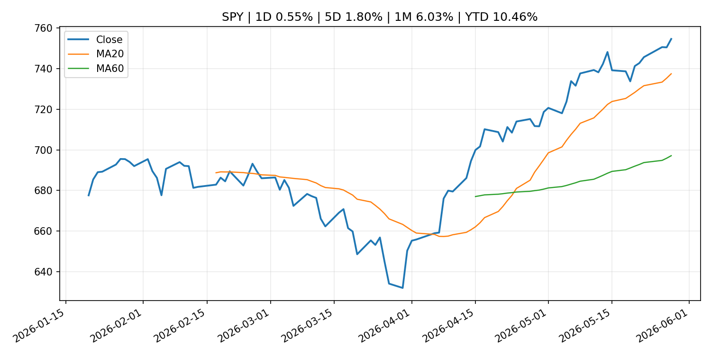
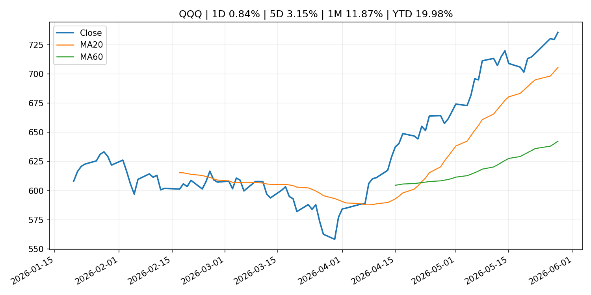
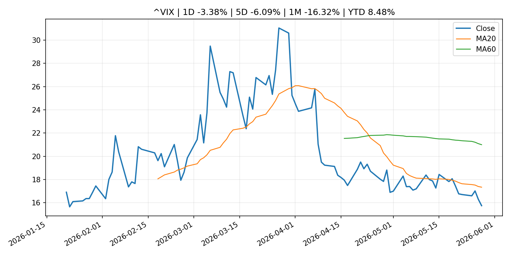
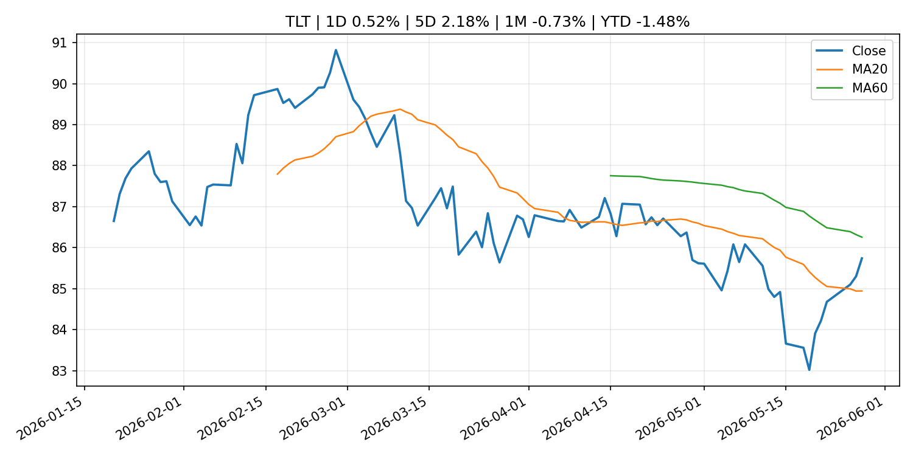
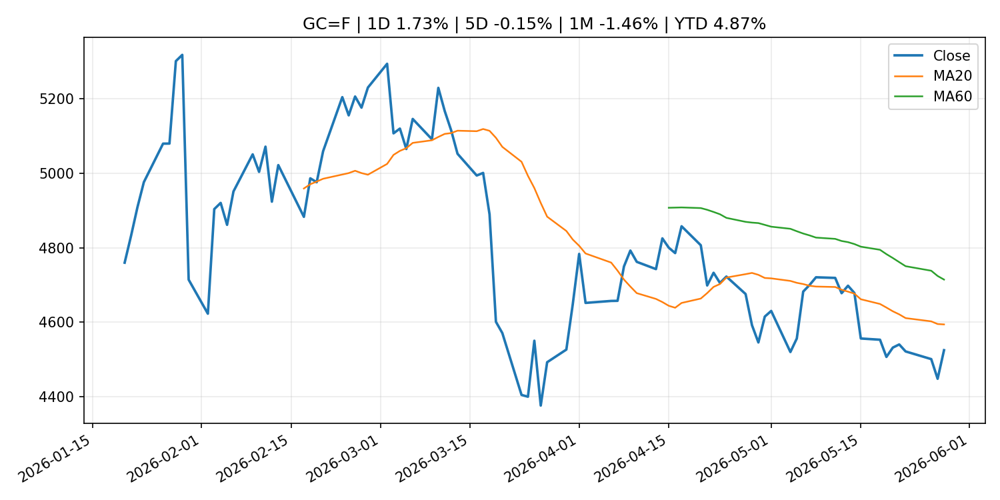
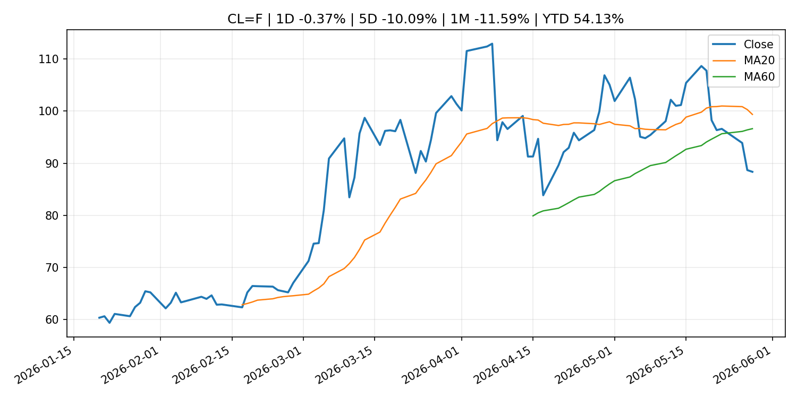
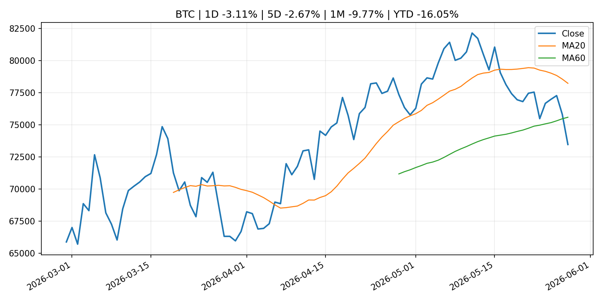
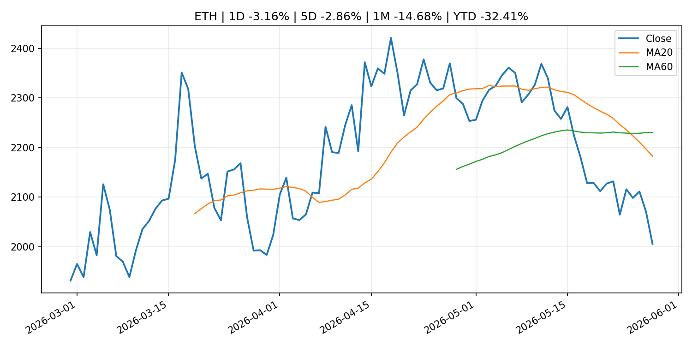
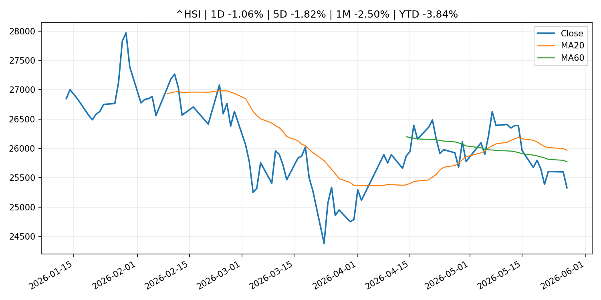

# Global Macro Morning Briefing - 2026-05-29

> Not financial advice / 非投资建议。

## 0. 今日总览
- 市场状态：risk_on。股指上涨、波动率或美元回落，市场更接近风险偏好改善。
- 今日三大主线：
  1. geopolitical_risk: The Iran war costs more than you think — it boosts inflation and threatens stocks
  2. financial_stability: Luis de Guindos: Financial Stability Review - May 2026
  3. financial_stability: Financial stability vulnerabilities remain elevated as geoeconomic shock unfolds
- 一句话结论：今日晨报重点关注：地缘风险可能推升避险需求、能源价格和市场波动率。；金融稳定信号可能放大跨资产波动，并影响央行反应函数。。跨资产方面，SPY 1D 0.55%；QQQ 1D 0.84%；^VIX 1D -3.38%；TLT 1D 0.52%；GC=F 1D 1.73%；CL=F 1D -0.37%；BTC 1D -3.11%；ETH 1D -3.16%；股指上涨、波动率或美元回落，市场更接近风险偏好改善。政策、通胀、利率、美元、美债、能源和加密监管仍是主要观察线索。所有结论仅基于公开数据与短摘要整理，不构成投资建议。

## 1. 隔夜跨资产市场
- 美股：SPY 1D 0.55%，QQQ 1D 0.84%，整体趋势需结合 VIX 和利率确认。
- 美债/美元：TLT 1D 0.52%，美元指数 1D -0.22%，是判断折现率压力的核心线索。
- 黄金/原油：黄金 1D 1.73%，原油 1D -0.37%，用于观察避险、通胀和地缘风险。
- 加密：BTC 1D -3.11%，ETH 1D -3.16%，关注是否独立于纳指走出加密自身行情。
- 港股/A股：恒生 1D -1.06%，沪深300/上证 1D n/a，重点看中国政策预期与人民币线索。
- 风险观察：确认风险偏好是否扩散到小盘股、信用利差和周期品。

### US_EQUITY

| symbol | latest close | 1D | 5D | 1M | YTD | trend |
|---|---:|---:|---:|---:|---:|---|
| SPY | 754.60 | 0.55% | 1.80% | 6.03% | 10.46% | strong_uptrend |
| QQQ | 735.60 | 0.84% | 3.15% | 11.87% | 19.98% | strong_uptrend |
| DIA | 507.05 | 0.03% | 1.36% | 3.18% | 4.84% | strong_uptrend |
| IWM | 292.03 | 0.57% | 4.34% | 6.62% | 17.38% | strong_uptrend |
| VTI | 371.66 | 0.62% | 2.05% | 6.00% | 10.51% | strong_uptrend |

### US_MACRO_MARKET

| symbol | latest close | 1D | 5D | 1M | YTD | trend |
|---|---:|---:|---:|---:|---:|---|
| ^VIX | 15.74 | -3.38% | -6.09% | -16.32% | 8.48% | strong_downtrend |
| DX-Y.NYB | 98.99 | -0.22% | -0.12% | 0.38% | 0.58% | range_bound |
| TLT | 85.74 | 0.52% | 2.18% | -0.73% | -1.48% | range_bound |
| IEF | 94.54 | 0.23% | 0.85% | -0.75% | -1.60% | range_bound |

### COMMODITIES

| symbol | latest close | 1D | 5D | 1M | YTD | trend |
|---|---:|---:|---:|---:|---:|---|
| GC=F | 4,524.40 | 1.73% | -0.15% | -1.46% | 4.87% | downtrend |
| SI=F | 75.95 | 1.81% | 0.13% | 3.75% | 7.64% | range_bound |
| CL=F | 88.35 | -0.37% | -10.09% | -11.59% | 54.13% | range_bound |
| BZ=F | 92.27 | -2.14% | -12.14% | -17.07% | 51.88% | range_bound |
| NG=F | 3.30 | 8.49% | 9.79% | 28.88% | -8.84% | strong_uptrend |
| HG=F | 6.42 | 1.82% | 2.06% | 8.55% | 13.83% | strong_uptrend |

### HK_MARKET

| symbol | latest close | 1D | 5D | 1M | YTD | trend |
|---|---:|---:|---:|---:|---:|---|
| ^HSI | 25,328.23 | -1.06% | -1.82% | -2.50% | -3.84% | range_bound |
| 0700.HK | 425.00 | -2.16% | -6.63% | -11.20% | -31.78% | strong_downtrend |
| 9988.HK | 121.80 | -2.01% | -7.66% | -6.45% | -18.26% | range_bound |
| 3690.HK | 73.30 | -5.66% | -11.53% | -10.45% | -29.92% | range_bound |
| 1810.HK | 28.56 | 0.56% | -5.24% | -8.17% | -29.10% | strong_downtrend |
| 1211.HK | 90.30 | -0.44% | 0.11% | -14.81% | -8.56% | strong_downtrend |

### CRYPTO

| symbol | latest close | 1D | 5D | 1M | YTD | trend |
|---|---:|---:|---:|---:|---:|---|
| BTC | 73,469.53 | -3.11% | -2.67% | -9.77% | -16.05% | range_bound |
| ETH | 2,005.38 | -3.16% | -2.86% | -14.68% | -32.41% | strong_downtrend |
| SOLANA | 81.99 | -1.94% | -2.77% | -7.93% | -34.15% | range_bound |
| BINANCECOIN | 638.32 | -2.66% | -1.78% | -1.45% | -26.05% | range_bound |
| RIPPLE | 1.31 | -1.03% | -1.44% | -7.73% | -28.55% | range_bound |

## 2. 今日最重要的 10 条新闻
### 1. The Iran war costs more than you think — it boosts inflation and threatens stocks
- 来源：MarketWatch Top Stories
- 时间：2026-05-28T21:58:00+00:00
- 地区：US
- 事件类型：geopolitical_risk
- 重要性层级：Tier 1
- 一句话摘要：Pentagon’s ‘fuzzy math’ impacts prices and your portfolio.
- 为什么重要：地缘风险可能推升避险需求、能源价格和市场波动率。
- 可能影响：主要影响 DXY，方向为 positive，强度 high；通胀压力可能推高政策利率预期并支撑美元。
  - 资产：DXY
    方向：positive
    强度：high
    原因：通胀压力可能推高政策利率预期并支撑美元。
  - 资产：TLT
    方向：negative
    强度：high
    原因：通胀上行通常推升收益率、压低长债价格。
  - 资产：QQQ
    方向：negative
    强度：high
    原因：更高利率对成长股估值折现率不利。
  - 资产：SPY
    方向：mixed
    强度：medium
    原因：名义增长可能支撑收入，但更高利率压制估值。
  - 资产：GC=F
    方向：mixed
    强度：medium
    原因：通胀对黄金是支撑，但实际利率上行会形成压力。
  - 资产：BTC
    方向：mixed
    强度：medium
    原因：抗通胀叙事和流动性收紧可能相互抵消。
- 原文链接：[https://www.marketwatch.com/story/the-true-cost-of-the-iran-war-is-billions-more-than-the-pentagon-says-and-were-paying-for-it-7bf90988?mod=mw_rss_topstories](https://www.marketwatch.com/story/the-true-cost-of-the-iran-war-is-billions-more-than-the-pentagon-says-and-were-paying-for-it-7bf90988?mod=mw_rss_topstories)

### 2. Luis de Guindos: Financial Stability Review - May 2026
- 来源：ECB Press Releases
- 时间：2026-05-27T10:00:00+02:00
- 地区：EU
- 事件类型：financial_stability
- 重要性层级：Tier 1
- 一句话摘要：Luis de Guindos: Financial Stability Review - May 2026
- 为什么重要：金融稳定信号可能放大跨资产波动，并影响央行反应函数。
- 可能影响：可能影响利率、汇率、风险资产或大宗商品预期，但当前公开信息不足以判断明确方向。
  - 资产：暂无明确资产映射
  - 方向：unknown
  - 强度：low
  - 原因：公开信息不足以判断方向。
- 原文链接：[https://www.ecb.europa.eu//press/key/date/2026/html/ecb.sp260527~bc724e42c1.en.pdf](https://www.ecb.europa.eu//press/key/date/2026/html/ecb.sp260527~bc724e42c1.en.pdf)

### 3. Financial stability vulnerabilities remain elevated as geoeconomic shock unfolds
- 来源：ECB Press Releases
- 时间：2026-05-27T10:00:00+02:00
- 地区：EU
- 事件类型：financial_stability
- 重要性层级：Tier 1
- 一句话摘要：Financial stability vulnerabilities remain elevated as geoeconomic shock unfolds
- 为什么重要：金融稳定信号可能放大跨资产波动，并影响央行反应函数。
- 可能影响：可能影响利率、汇率、风险资产或大宗商品预期，但当前公开信息不足以判断明确方向。
  - 资产：暂无明确资产映射
  - 方向：unknown
  - 强度：low
  - 原因：公开信息不足以判断方向。
- 原文链接：[https://www.ecb.europa.eu//press/pr/date/2026/html/ecb.pr260527~92140c5054.en.html](https://www.ecb.europa.eu//press/pr/date/2026/html/ecb.pr260527~92140c5054.en.html)

### 4. Crypto trading firm FalconX confidentially files with SEC for IPO, hires bankers
- 来源：CoinDesk
- 时间：2026-05-28T19:53:38+00:00
- 地区：global
- 事件类型：regulation
- 重要性层级：Tier 2
- 一句话摘要：Crypto trading firm FalconX confidentially files with SEC for IPO, hires bankers
- 为什么重要：监管变化会改变行业盈利预期和资产风险溢价。
- 可能影响：主要影响 BTC，方向为 mixed，强度 high；加密监管或 ETF 进展会改变 BTC 的资金流和风险溢价。
  - 资产：BTC
    方向：mixed
    强度：high
    原因：加密监管或 ETF 进展会改变 BTC 的资金流和风险溢价。
  - 资产：ETH
    方向：mixed
    强度：high
    原因：监管框架会影响 ETH 产品化和机构参与度。
  - 资产：COIN
    方向：mixed
    强度：medium
    原因：监管清晰度和执法风险会影响交易平台估值。
  - 资产：crypto market
    方向：mixed
    强度：high
    原因：信息影响整个加密市场结构，但方向取决于细节。
- 原文链接：[https://www.coindesk.com/business/2026/05/28/crypto-trading-firm-falconx-confidentially-files-with-sec-for-ipo-hires-bankers](https://www.coindesk.com/business/2026/05/28/crypto-trading-firm-falconx-confidentially-files-with-sec-for-ipo-hires-bankers)

### 5. Tether's U.S.-focused stablecoin grows over 500% in a month, but still lags main rivals
- 来源：CoinDesk
- 时间：2026-05-28T18:53:40+00:00
- 地区：global
- 事件类型：crypto_market_structure
- 重要性层级：Tier 2
- 一句话摘要：Tether's U.S.-focused stablecoin grows over 500% in a month, but still lags main rivals
- 为什么重要：加密市场结构和监管变化会影响 BTC、ETH 及相关股票的风险溢价。
- 可能影响：主要影响 BTC，方向为 mixed，强度 high；加密监管或 ETF 进展会改变 BTC 的资金流和风险溢价。
  - 资产：BTC
    方向：mixed
    强度：high
    原因：加密监管或 ETF 进展会改变 BTC 的资金流和风险溢价。
  - 资产：ETH
    方向：mixed
    强度：high
    原因：监管框架会影响 ETH 产品化和机构参与度。
  - 资产：COIN
    方向：mixed
    强度：medium
    原因：监管清晰度和执法风险会影响交易平台估值。
  - 资产：crypto market
    方向：mixed
    强度：high
    原因：信息影响整个加密市场结构，但方向取决于细节。
- 原文链接：[https://www.coindesk.com/business/2026/05/28/tether-s-u-s-focused-stablecoin-grows-over-500-in-a-month-but-still-lags-main-rivals](https://www.coindesk.com/business/2026/05/28/tether-s-u-s-focused-stablecoin-grows-over-500-in-a-month-but-still-lags-main-rivals)

### 6. SEC Investor Advisory Committee to Host June 4 Meeting
- 来源：SEC Press Releases
- 时间：2026-05-27T10:59:13-04:00
- 地区：US
- 事件类型：regulation
- 重要性层级：Tier 2
- 一句话摘要：The Securities and Exchange Commission’s Investor Advisory Committee will hold a public meeting at the SEC Headquarters in Washington D.C. on June 4 at 10 a.m. ET to discuss private markets, passive index funds, and recommendations regarding fund…
- 为什么重要：监管变化会改变行业盈利预期和资产风险溢价。
- 可能影响：主要影响 BTC，方向为 mixed，强度 high；加密监管或 ETF 进展会改变 BTC 的资金流和风险溢价。
  - 资产：BTC
    方向：mixed
    强度：high
    原因：加密监管或 ETF 进展会改变 BTC 的资金流和风险溢价。
  - 资产：ETH
    方向：mixed
    强度：high
    原因：监管框架会影响 ETH 产品化和机构参与度。
  - 资产：COIN
    方向：mixed
    强度：medium
    原因：监管清晰度和执法风险会影响交易平台估值。
  - 资产：crypto market
    方向：mixed
    强度：high
    原因：信息影响整个加密市场结构，但方向取决于细节。
- 原文链接：[https://www.sec.gov/newsroom/press-releases/2026-48-sec-investor-advisory-committee-host-june-4-meeting](https://www.sec.gov/newsroom/press-releases/2026-48-sec-investor-advisory-committee-host-june-4-meeting)

### 7. Federal Reserve Board issues enforcement actions with former employee of Atlantic Union Bank and former employee of Frost Bank
- 来源：Federal Reserve Press Releases
- 时间：2026-05-28T15:00:00+00:00
- 地区：US
- 事件类型：regulation
- 重要性层级：Tier 2
- 一句话摘要：Federal Reserve Board issues enforcement actions with former employee of Atlantic Union Bank and former employee of Frost Bank
- 为什么重要：监管变化会改变行业盈利预期和资产风险溢价。
- 可能影响：可能影响利率、汇率、风险资产或大宗商品预期，但当前公开信息不足以判断明确方向。
  - 资产：暂无明确资产映射
  - 方向：unknown
  - 强度：low
  - 原因：公开信息不足以判断方向。
- 原文链接：[https://www.federalreserve.gov/newsevents/pressreleases/enforcement20260528a.htm](https://www.federalreserve.gov/newsevents/pressreleases/enforcement20260528a.htm)

### 8. Okta shares rise on earnings beat and AI-agent opportunity
- 来源：MarketWatch Top Stories
- 时间：2026-05-28T20:54:00+00:00
- 地区：US
- 事件类型：earnings
- 重要性层级：Tier 2
- 一句话摘要：Okta’s first-qarter earnings cleared Wall Street’s expectations, and the company believes a massive market for AI-agent identity management is brewing on the horizon.
- 为什么重要：大型科技股盈利和资本开支会影响纳指、半导体和 AI 交易主线。
- 可能影响：可能影响利率、汇率、风险资产或大宗商品预期，但当前公开信息不足以判断明确方向。
  - 资产：暂无明确资产映射
  - 方向：unknown
  - 强度：low
  - 原因：公开信息不足以判断方向。
- 原文链接：[https://www.marketwatch.com/story/okta-shares-rise-on-earnings-beat-and-ai-agent-opportunity-60a48690?mod=mw_rss_topstories](https://www.marketwatch.com/story/okta-shares-rise-on-earnings-beat-and-ai-agent-opportunity-60a48690?mod=mw_rss_topstories)

### 9. Dell stock soars toward another record high as the AI boom drives a big earnings beat
- 来源：MarketWatch Top Stories
- 时间：2026-05-28T20:39:00+00:00
- 地区：US
- 事件类型：earnings
- 重要性层级：Tier 2
- 一句话摘要：The company’s AI-server revenue was up 757% in the first quarter, while profit beat expectations by the widest margin in at least five years.
- 为什么重要：大型科技股盈利和资本开支会影响纳指、半导体和 AI 交易主线。
- 可能影响：可能影响利率、汇率、风险资产或大宗商品预期，但当前公开信息不足以判断明确方向。
  - 资产：暂无明确资产映射
  - 方向：unknown
  - 强度：low
  - 原因：公开信息不足以判断方向。
- 原文链接：[https://www.marketwatch.com/story/dell-stock-soars-toward-another-record-high-as-the-ai-boom-drives-a-big-earnings-beat-b7c0c203?mod=mw_rss_topstories](https://www.marketwatch.com/story/dell-stock-soars-toward-another-record-high-as-the-ai-boom-drives-a-big-earnings-beat-b7c0c203?mod=mw_rss_topstories)

### 10. Opening Remarks by Governor UEDA at the 2026 BOJ-IMES Conference
- 来源：Bank of Japan Announcements
- 时间：2026-05-27T09:05:00+09:00
- 地区：Japan
- 事件类型：central_bank_speech
- 重要性层级：Tier 2
- 一句话摘要：Opening Remarks by Governor UEDA at the 2026 BOJ-IMES Conference
- 为什么重要：央行官员表态可能影响市场对下一次会议的定价。
- 可能影响：可能影响利率、汇率、风险资产或大宗商品预期，但当前公开信息不足以判断明确方向。
  - 资产：暂无明确资产映射
  - 方向：unknown
  - 强度：low
  - 原因：公开信息不足以判断方向。
- 原文链接：[http://www.boj.or.jp/en/about/press/koen_2026/ko260527a.htm](http://www.boj.or.jp/en/about/press/koen_2026/ko260527a.htm)

## 3. 政策与央行观察
### 1. Luis de Guindos: Financial Stability Review - May 2026
- 来源：ECB Press Releases
- 时间：2026-05-27T10:00:00+02:00
- 地区：EU
- 事件类型：financial_stability
- 重要性层级：Tier 1
- 一句话摘要：Luis de Guindos: Financial Stability Review - May 2026
- 为什么重要：金融稳定信号可能放大跨资产波动，并影响央行反应函数。
- 可能影响：可能影响利率、汇率、风险资产或大宗商品预期，但当前公开信息不足以判断明确方向。
  - 资产：暂无明确资产映射
  - 方向：unknown
  - 强度：low
  - 原因：公开信息不足以判断方向。
- 原文链接：[https://www.ecb.europa.eu//press/key/date/2026/html/ecb.sp260527~bc724e42c1.en.pdf](https://www.ecb.europa.eu//press/key/date/2026/html/ecb.sp260527~bc724e42c1.en.pdf)

### 2. Financial stability vulnerabilities remain elevated as geoeconomic shock unfolds
- 来源：ECB Press Releases
- 时间：2026-05-27T10:00:00+02:00
- 地区：EU
- 事件类型：financial_stability
- 重要性层级：Tier 1
- 一句话摘要：Financial stability vulnerabilities remain elevated as geoeconomic shock unfolds
- 为什么重要：金融稳定信号可能放大跨资产波动，并影响央行反应函数。
- 可能影响：可能影响利率、汇率、风险资产或大宗商品预期，但当前公开信息不足以判断明确方向。
  - 资产：暂无明确资产映射
  - 方向：unknown
  - 强度：low
  - 原因：公开信息不足以判断方向。
- 原文链接：[https://www.ecb.europa.eu//press/pr/date/2026/html/ecb.pr260527~92140c5054.en.html](https://www.ecb.europa.eu//press/pr/date/2026/html/ecb.pr260527~92140c5054.en.html)

### 3. Crypto trading firm FalconX confidentially files with SEC for IPO, hires bankers
- 来源：CoinDesk
- 时间：2026-05-28T19:53:38+00:00
- 地区：global
- 事件类型：regulation
- 重要性层级：Tier 2
- 一句话摘要：Crypto trading firm FalconX confidentially files with SEC for IPO, hires bankers
- 为什么重要：监管变化会改变行业盈利预期和资产风险溢价。
- 可能影响：主要影响 BTC，方向为 mixed，强度 high；加密监管或 ETF 进展会改变 BTC 的资金流和风险溢价。
  - 资产：BTC
    方向：mixed
    强度：high
    原因：加密监管或 ETF 进展会改变 BTC 的资金流和风险溢价。
  - 资产：ETH
    方向：mixed
    强度：high
    原因：监管框架会影响 ETH 产品化和机构参与度。
  - 资产：COIN
    方向：mixed
    强度：medium
    原因：监管清晰度和执法风险会影响交易平台估值。
  - 资产：crypto market
    方向：mixed
    强度：high
    原因：信息影响整个加密市场结构，但方向取决于细节。
- 原文链接：[https://www.coindesk.com/business/2026/05/28/crypto-trading-firm-falconx-confidentially-files-with-sec-for-ipo-hires-bankers](https://www.coindesk.com/business/2026/05/28/crypto-trading-firm-falconx-confidentially-files-with-sec-for-ipo-hires-bankers)

### 4. Tether's U.S.-focused stablecoin grows over 500% in a month, but still lags main rivals
- 来源：CoinDesk
- 时间：2026-05-28T18:53:40+00:00
- 地区：global
- 事件类型：crypto_market_structure
- 重要性层级：Tier 2
- 一句话摘要：Tether's U.S.-focused stablecoin grows over 500% in a month, but still lags main rivals
- 为什么重要：加密市场结构和监管变化会影响 BTC、ETH 及相关股票的风险溢价。
- 可能影响：主要影响 BTC，方向为 mixed，强度 high；加密监管或 ETF 进展会改变 BTC 的资金流和风险溢价。
  - 资产：BTC
    方向：mixed
    强度：high
    原因：加密监管或 ETF 进展会改变 BTC 的资金流和风险溢价。
  - 资产：ETH
    方向：mixed
    强度：high
    原因：监管框架会影响 ETH 产品化和机构参与度。
  - 资产：COIN
    方向：mixed
    强度：medium
    原因：监管清晰度和执法风险会影响交易平台估值。
  - 资产：crypto market
    方向：mixed
    强度：high
    原因：信息影响整个加密市场结构，但方向取决于细节。
- 原文链接：[https://www.coindesk.com/business/2026/05/28/tether-s-u-s-focused-stablecoin-grows-over-500-in-a-month-but-still-lags-main-rivals](https://www.coindesk.com/business/2026/05/28/tether-s-u-s-focused-stablecoin-grows-over-500-in-a-month-but-still-lags-main-rivals)

### 5. SEC Investor Advisory Committee to Host June 4 Meeting
- 来源：SEC Press Releases
- 时间：2026-05-27T10:59:13-04:00
- 地区：US
- 事件类型：regulation
- 重要性层级：Tier 2
- 一句话摘要：The Securities and Exchange Commission’s Investor Advisory Committee will hold a public meeting at the SEC Headquarters in Washington D.C. on June 4 at 10 a.m. ET to discuss private markets, passive index funds, and recommendations regarding fund…
- 为什么重要：监管变化会改变行业盈利预期和资产风险溢价。
- 可能影响：主要影响 BTC，方向为 mixed，强度 high；加密监管或 ETF 进展会改变 BTC 的资金流和风险溢价。
  - 资产：BTC
    方向：mixed
    强度：high
    原因：加密监管或 ETF 进展会改变 BTC 的资金流和风险溢价。
  - 资产：ETH
    方向：mixed
    强度：high
    原因：监管框架会影响 ETH 产品化和机构参与度。
  - 资产：COIN
    方向：mixed
    强度：medium
    原因：监管清晰度和执法风险会影响交易平台估值。
  - 资产：crypto market
    方向：mixed
    强度：high
    原因：信息影响整个加密市场结构，但方向取决于细节。
- 原文链接：[https://www.sec.gov/newsroom/press-releases/2026-48-sec-investor-advisory-committee-host-june-4-meeting](https://www.sec.gov/newsroom/press-releases/2026-48-sec-investor-advisory-committee-host-june-4-meeting)

### 6. Federal Reserve Board issues enforcement actions with former employee of Atlantic Union Bank and former employee of Frost Bank
- 来源：Federal Reserve Press Releases
- 时间：2026-05-28T15:00:00+00:00
- 地区：US
- 事件类型：regulation
- 重要性层级：Tier 2
- 一句话摘要：Federal Reserve Board issues enforcement actions with former employee of Atlantic Union Bank and former employee of Frost Bank
- 为什么重要：监管变化会改变行业盈利预期和资产风险溢价。
- 可能影响：可能影响利率、汇率、风险资产或大宗商品预期，但当前公开信息不足以判断明确方向。
  - 资产：暂无明确资产映射
  - 方向：unknown
  - 强度：low
  - 原因：公开信息不足以判断方向。
- 原文链接：[https://www.federalreserve.gov/newsevents/pressreleases/enforcement20260528a.htm](https://www.federalreserve.gov/newsevents/pressreleases/enforcement20260528a.htm)

### 7. Opening Remarks by Governor UEDA at the 2026 BOJ-IMES Conference
- 来源：Bank of Japan Announcements
- 时间：2026-05-27T09:05:00+09:00
- 地区：Japan
- 事件类型：central_bank_speech
- 重要性层级：Tier 2
- 一句话摘要：Opening Remarks by Governor UEDA at the 2026 BOJ-IMES Conference
- 为什么重要：央行官员表态可能影响市场对下一次会议的定价。
- 可能影响：可能影响利率、汇率、风险资产或大宗商品预期，但当前公开信息不足以判断明确方向。
  - 资产：暂无明确资产映射
  - 方向：unknown
  - 强度：low
  - 原因：公开信息不足以判断方向。
- 原文链接：[http://www.boj.or.jp/en/about/press/koen_2026/ko260527a.htm](http://www.boj.or.jp/en/about/press/koen_2026/ko260527a.htm)

## 4. 市场异动与图表
- SPY 上涨 0.55%
- QQQ 上涨 0.84%
- VIX 下跌 -3.38%
- TLT 上涨 0.52%
- Gold 上涨 1.73%
- BTC 下跌 -3.11%
- ETH 下跌 -3.16%

### SPY

### QQQ

### ^VIX

### TLT

### GC=F

### CL=F

### BTC

### ETH

### ^HSI

## 5. 华尔街与机构公开观点
- 暂无可靠公开观点。

## 6. 今日重点关注
- 经济数据：经济数据：暂无可靠公开日历数据；如配置经济日历源后可自动填充。
- 央行讲话：央行讲话：暂无可靠公开日历数据；重点跟踪 Fed、ECB、BoJ、PBOC 官网 RSS。
- 财报：财报：暂无可靠数据。
- 政策事件：政策事件：暂无可靠数据。
- 风险提醒：风险提醒：关注数据源失败项、突发地缘风险、利率和美元的二阶反应。

## 7. 英文金融表达与宏观概念
- **inflation expectations**：通胀预期，指家庭、企业或市场对未来通胀的预估。 例句：Inflation expectations can shape wage bargaining and bond yields.
- **real yield**：实际收益率，名义利率扣除通胀预期后的收益率。 例句：Gold often reacts more to real yields than nominal yields.
- **risk-off**：避险模式，资金偏向美元、国债、黄金等防御资产。 例句：A geopolitical shock can push markets into risk-off mode.
- **market structure**：市场结构，指交易、托管、清算、ETF、监管等制度安排。 例句：Crypto market structure rules can affect institutional participation.
- **terminal rate**：终端利率，市场预期本轮加息周期的最高政策利率。 例句：A higher terminal rate can pressure growth stocks.
- **soft landing**：软着陆，指通胀回落而经济避免明显衰退。 例句：Markets often rally when data support a soft landing.

## 8. 背景材料
- [Calamos bets protected Bitcoin ETFs can outlast crypto market swings](https://www.coindesk.com/coindesk-news/2026/05/28/calamos-bets-protected-bitcoin-etfs-can-outlast-crypto-market-swings)（CoinDesk，other）：Calamos bets protected Bitcoin ETFs can outlast crypto market swings
- [Want an alternative to chip stocks? This sector with an AI angle is breaking out.](https://www.marketwatch.com/story/want-an-alternative-to-chip-stocks-this-sector-with-an-ai-angle-is-breaking-out-8a34b2a7?mod=mw_rss_topstories)（MarketWatch Top Stories，other）：The transportation sector has benefited from hopes of a Iran peace deal, but also from the build out of data centers needed to power AI.
- [Bitwise bets Hyperliquid could power future finance as HYPE ETFs gain traction](https://www.coindesk.com/coindesk-news/2026/05/28/bitwise-bets-hyperliquid-could-power-future-finance-as-hype-etfs-gain-traction)（CoinDesk，other）：Bitwise bets Hyperliquid could power future finance as HYPE ETFs gain traction
- [Bitcoin pinned below $73,000 despite potential U.S.-Iran deal news](https://www.coindesk.com/markets/2026/05/28/bitcoin-pinned-below-usd73-000-despite-potential-u-s-iran-deal-news)（CoinDesk，other）：Bitcoin pinned below $73,000 despite potential U.S.-Iran deal news
- ['Debasement trade’ falls out of favor as inflation fears cool, JPMorgan says](https://www.coindesk.com/markets/2026/05/28/investors-are-throwing-in-the-towel-on-the-debasement-trade-as-inflation-fears-start-to-cool-jpmorgan-says)（CoinDesk，other）：'Debasement trade’ falls out of favor as inflation fears cool, JPMorgan says
- [VanEck launches first U.S. spot BNB ETF on Nasdaq](https://www.coindesk.com/business/2026/05/28/vaneck-launches-first-u-s-spot-bnb-etf-on-nasdaq)（CoinDesk，other）：VanEck launches first U.S. spot BNB ETF on Nasdaq
- [What's next as hot money cycle has gone from crypto to gold to AI to memory](https://www.coindesk.com/markets/2026/05/28/what-s-next-as-hot-money-cycle-has-gone-from-crypto-to-gold-to-ai-to-memory)（CoinDesk，other）：What's next as hot money cycle has gone from crypto to gold to AI to memory
- [Meeting of 29-30 April 2026](https://www.ecb.europa.eu//press/accounts/2026/html/ecb.mg260528~a93230dc4b.en.html)（ECB Press Releases，other）：Meeting of 29-30 April 2026
- [U.S.-Iran strikes rattle global markets, send bitcoin to 6-week low](https://www.coindesk.com/daybook-us/2026/05/28/u-s-iran-strikes-rattle-global-markets-send-bitcoin-to-6-week-low)（CoinDesk，other）：U.S.-Iran strikes rattle global markets, send bitcoin to 6-week low
- [Bitcoin’s famous CME gaps are about to disappear, though three remain unresolved](https://www.coindesk.com/markets/2026/05/28/bitcoin-s-famous-cme-gaps-are-about-to-disappear-though-three-remain-unresolved)（CoinDesk，other）：Bitcoin’s famous CME gaps are about to disappear, though three remain unresolved
- [Piero Cipollone: Money in the digital age](https://www.ecb.europa.eu//press/key/date/2026/html/ecb.sp260528_1~7bb2eecfe5.en.html)（ECB Press Releases，other）：Piero Cipollone: Money in the digital age
- [Christine Lagarde: When It Matters Most: Upholding Independence in Challenging Times](https://www.ecb.europa.eu//press/key/date/2026/html/ecb.sp260528~0cb263f599.en.html)（ECB Press Releases，other）：Christine Lagarde: When It Matters Most: Upholding Independence in Challenging Times
- [Climate Change Initiatives: Disclosure Based on TCFD Recommendations](http://www.boj.or.jp/en/about/climate/tcfd26.pdf)（Bank of Japan Announcements，other）：Climate Change Initiatives: Disclosure Based on TCFD Recommendations
- [Services Producer Price Index (Apr.)](http://www.boj.or.jp/en/statistics/pi/cspi_release/sppi2604.pdf)（Bank of Japan Announcements，other）：Services Producer Price Index (Apr.)

## 9. 数据源、失败项与免责声明
- 采集时间：2026-05-28T23:15:20
- 数据源：公开 RSS、Yahoo Finance、CoinGecko、AKShare、FRED、SEC data.sec.gov，以及用户自有 inputs/reports 文件。
- 合规说明：不绕过 WSJ、Bloomberg、FT、Reuters 等付费墙；对付费媒体只使用公开 RSS 标题、摘要、链接和发布时间。
- 免责声明：Not financial advice / 非投资建议。本项目仅供个人学习、研究和信息整理，不构成投资建议、交易建议或任何收益承诺。
- 失败或跳过的数据源：
  - crypto data failed coin=dogecoin
  - China market data failed symbol=上证指数: empty dataframe
  - China market data failed symbol=深证成指: empty dataframe
  - China market data failed symbol=创业板指: empty dataframe
  - China market data failed symbol=沪深300: empty dataframe
  - China market data failed symbol=中证500: empty dataframe
  - China market data failed symbol=科创50: empty dataframe
  - FRED_API_KEY not set; skipping FRED macro series
  - SEC failed cik=0000320193
  - SEC failed cik=0000789019
  - SEC failed cik=0001045810
  - SEC failed cik=0001318605
  - SEC failed cik=0001577552
