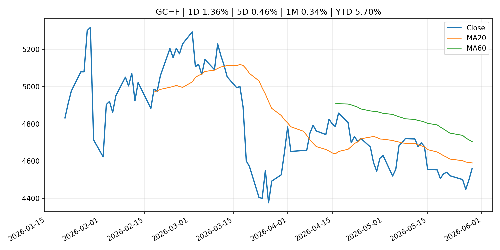
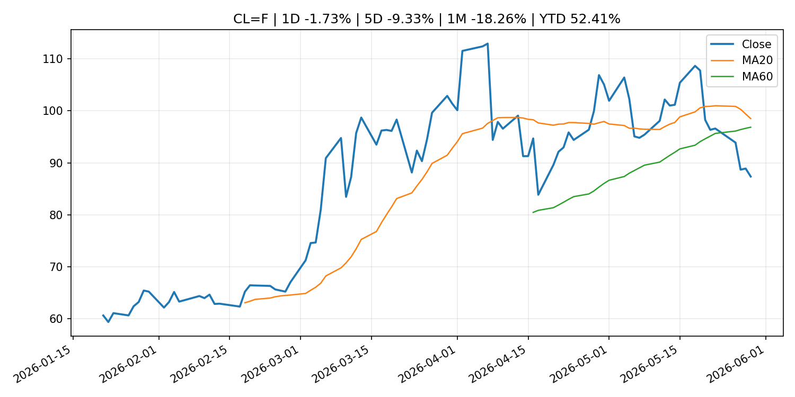
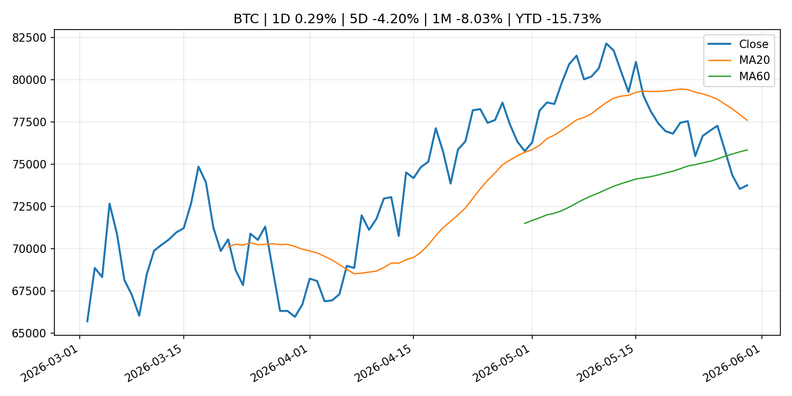
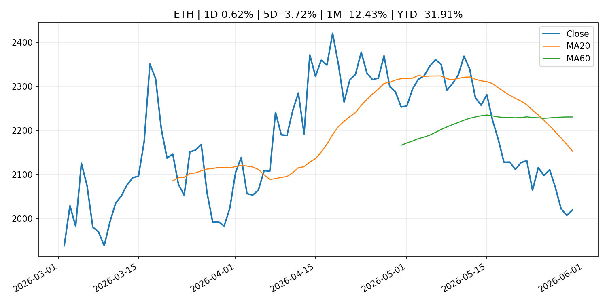

# Global Macro Morning Briefing - 2026-05-31

> Not financial advice / 非投资建议。

## 0. 今日总览
- 市场状态：unknown。市场信号不足，暂不判断明确状态。
- 今日三大主线：
  1. geopolitical_risk: Your portfolio can’t afford the real bill for the Iran war
  2. central_bank_speech: Fed Governor Michelle Bowman warns against hiking interest rates because of inflation spike
  3. regulation: SEC sues Texas man over $12.3 million alleged crypto scheme built on fake AI trading bots
- 一句话结论：今日晨报重点关注：地缘风险可能推升避险需求、能源价格和市场波动率。；央行官员表态可能影响市场对下一次会议的定价。。跨资产方面，SPY 1D 0.25%；QQQ 1D 0.37%；^VIX 1D -2.67%；TLT 1D 0.02%；GC=F 1D 1.36%；CL=F 1D -1.73%；BTC 1D 0.29%；ETH 1D 0.62%；市场信号不足，暂不判断明确状态。政策、通胀、利率、美元、美债、能源和加密监管仍是主要观察线索。所有结论仅基于公开数据与短摘要整理，不构成投资建议。

## 1. 隔夜跨资产市场
- 美股：SPY 1D 0.25%，QQQ 1D 0.37%，整体趋势需结合 VIX 和利率确认。
- 美债/美元：TLT 1D 0.02%，美元指数 1D -0.11%，是判断折现率压力的核心线索。
- 黄金/原油：黄金 1D 1.36%，原油 1D -1.73%，用于观察避险、通胀和地缘风险。
- 加密：BTC 1D 0.29%，ETH 1D 0.62%，关注是否独立于纳指走出加密自身行情。
- 港股/A股：恒生 1D 0.70%，沪深300/上证 1D n/a，重点看中国政策预期与人民币线索。
- 风险观察：关注后续数据是否确认当前跨资产信号。

### US_EQUITY

| symbol | latest close | 1D | 5D | 1M | YTD | trend |
|---|---:|---:|---:|---:|---:|---|
| SPY | 756.48 | 0.25% | 1.85% | 6.31% | 10.73% | strong_uptrend |
| QQQ | 738.31 | 0.37% | 3.33% | 11.60% | 20.42% | strong_uptrend |
| DIA | 510.78 | 0.74% | 1.52% | 4.52% | 5.61% | strong_uptrend |
| IWM | 290.43 | -0.55% | 2.81% | 6.74% | 16.74% | strong_uptrend |
| VTI | 372.54 | 0.24% | 2.04% | 6.38% | 10.77% | strong_uptrend |

### US_MACRO_MARKET

| symbol | latest close | 1D | 5D | 1M | YTD | trend |
|---|---:|---:|---:|---:|---:|---|
| ^VIX | 15.32 | -2.67% | -8.26% | -9.30% | 5.58% | strong_downtrend |
| DX-Y.NYB | 98.91 | -0.11% | -0.28% | -0.01% | 0.50% | range_bound |
| TLT | 85.76 | 0.02% | 1.83% | 0.07% | -1.46% | range_bound |
| IEF | 94.65 | 0.12% | 0.91% | -0.16% | -1.49% | range_bound |

### COMMODITIES

| symbol | latest close | 1D | 5D | 1M | YTD | trend |
|---|---:|---:|---:|---:|---:|---|
| GC=F | 4,560.50 | 1.36% | 0.46% | 0.34% | 5.70% | downtrend |
| SI=F | 75.62 | -0.04% | -1.04% | 5.65% | 7.17% | range_bound |
| CL=F | 87.36 | -1.73% | -9.33% | -18.26% | 52.41% | range_bound |
| BZ=F | 92.05 | -1.77% | -10.27% | -22.01% | 51.52% | range_bound |
| NG=F | 3.29 | 0.15% | 9.01% | 24.29% | -9.07% | strong_uptrend |
| HG=F | 6.36 | -0.57% | 1.64% | 8.18% | 12.76% | uptrend |

### HK_MARKET

| symbol | latest close | 1D | 5D | 1M | YTD | trend |
|---|---:|---:|---:|---:|---:|---|
| ^HSI | 25,182.39 | 0.70% | -0.80% | -1.94% | -4.39% | range_bound |
| 0700.HK | 427.20 | 0.52% | -2.69% | -9.84% | -31.43% | strong_downtrend |
| 9988.HK | 120.90 | -0.74% | -4.05% | -4.43% | -18.86% | range_bound |
| 3690.HK | 73.45 | 0.20% | -10.54% | -8.53% | -29.78% | range_bound |
| 1810.HK | 28.04 | -1.82% | -5.46% | -6.28% | -30.39% | strong_downtrend |
| 1211.HK | 91.30 | 1.11% | 0.83% | -11.96% | -7.54% | strong_downtrend |

### CRYPTO

| symbol | latest close | 1D | 5D | 1M | YTD | trend |
|---|---:|---:|---:|---:|---:|---|
| BTC | 73,752.56 | 0.29% | -4.20% | -8.03% | -15.73% | range_bound |
| ETH | 2,020.02 | 0.62% | -3.72% | -12.43% | -31.91% | strong_downtrend |
| SOLANA | 82.48 | 0.67% | -3.33% | -10.26% | -33.76% | range_bound |
| BINANCECOIN | 714.92 | 12.11% | 8.97% | 10.16% | -17.17% | strong_uptrend |
| RIPPLE | 1.34 | 2.03% | -0.83% | -5.53% | -27.17% | strong_downtrend |

## 2. 今日最重要的 10 条新闻
### 1. Your portfolio can’t afford the real bill for the Iran war
- 来源：MarketWatch Top Stories
- 时间：2026-05-30T18:18:00+00:00
- 地区：US
- 事件类型：geopolitical_risk
- 重要性层级：Tier 1
- 一句话摘要：The Pentagon claims the conflict has cost $29 billion — but the true cost is much higher and it’s fueling inflation.
- 为什么重要：地缘风险可能推升避险需求、能源价格和市场波动率。
- 可能影响：主要影响 DXY，方向为 positive，强度 high；通胀压力可能推高政策利率预期并支撑美元。
  - 资产：DXY
    方向：positive
    强度：high
    原因：通胀压力可能推高政策利率预期并支撑美元。
  - 资产：TLT
    方向：negative
    强度：high
    原因：通胀上行通常推升收益率、压低长债价格。
  - 资产：QQQ
    方向：negative
    强度：high
    原因：更高利率对成长股估值折现率不利。
  - 资产：SPY
    方向：mixed
    强度：medium
    原因：名义增长可能支撑收入，但更高利率压制估值。
  - 资产：GC=F
    方向：mixed
    强度：medium
    原因：通胀对黄金是支撑，但实际利率上行会形成压力。
  - 资产：BTC
    方向：mixed
    强度：medium
    原因：抗通胀叙事和流动性收紧可能相互抵消。
- 原文链接：[https://www.marketwatch.com/story/the-true-cost-of-the-iran-war-is-billions-more-than-the-pentagon-says-and-were-paying-for-it-7bf90988?mod=mw_rss_topstories](https://www.marketwatch.com/story/the-true-cost-of-the-iran-war-is-billions-more-than-the-pentagon-says-and-were-paying-for-it-7bf90988?mod=mw_rss_topstories)

### 2. Fed Governor Michelle Bowman warns against hiking interest rates because of inflation spike
- 来源：CNBC Economy
- 时间：2026-05-29T16:39:46+00:00
- 地区：US
- 事件类型：central_bank_speech
- 重要性层级：Tier 2
- 一句话摘要：Bowman said reacting to the inflation surge, driven primarily by energy prices and tariffs, has proven ineffective.
- 为什么重要：央行官员表态可能影响市场对下一次会议的定价。
- 可能影响：主要影响 DXY，方向为 positive，强度 high；通胀压力可能推高政策利率预期并支撑美元。
  - 资产：DXY
    方向：positive
    强度：high
    原因：通胀压力可能推高政策利率预期并支撑美元。
  - 资产：TLT
    方向：negative
    强度：high
    原因：通胀上行通常推升收益率、压低长债价格。
  - 资产：QQQ
    方向：negative
    强度：high
    原因：更高利率对成长股估值折现率不利。
  - 资产：SPY
    方向：mixed
    强度：medium
    原因：名义增长可能支撑收入，但更高利率压制估值。
  - 资产：GC=F
    方向：mixed
    强度：medium
    原因：通胀对黄金是支撑，但实际利率上行会形成压力。
  - 资产：BTC
    方向：mixed
    强度：medium
    原因：抗通胀叙事和流动性收紧可能相互抵消。
- 原文链接：[https://www.cnbc.com/2026/05/29/feds-bowman-warns-against-hiking-interest-rates-due-to-inflation-spike.html](https://www.cnbc.com/2026/05/29/feds-bowman-warns-against-hiking-interest-rates-due-to-inflation-spike.html)

### 3. SEC sues Texas man over $12.3 million alleged crypto scheme built on fake AI trading bots
- 来源：CoinDesk
- 时间：2026-05-30T17:27:34+00:00
- 地区：global
- 事件类型：regulation
- 重要性层级：Tier 2
- 一句话摘要：SEC sues Texas man over $12.3 million alleged crypto scheme built on fake AI trading bots
- 为什么重要：监管变化会改变行业盈利预期和资产风险溢价。
- 可能影响：主要影响 BTC，方向为 mixed，强度 high；加密监管或 ETF 进展会改变 BTC 的资金流和风险溢价。
  - 资产：BTC
    方向：mixed
    强度：high
    原因：加密监管或 ETF 进展会改变 BTC 的资金流和风险溢价。
  - 资产：ETH
    方向：mixed
    强度：high
    原因：监管框架会影响 ETH 产品化和机构参与度。
  - 资产：COIN
    方向：mixed
    强度：medium
    原因：监管清晰度和执法风险会影响交易平台估值。
  - 资产：crypto market
    方向：mixed
    强度：high
    原因：信息影响整个加密市场结构，但方向取决于细节。
- 原文链接：[https://www.coindesk.com/business/2026/05/30/sec-sues-texas-man-over-usd12-3-million-alleged-crypto-scheme-built-on-fake-ai-trading-bots](https://www.coindesk.com/business/2026/05/30/sec-sues-texas-man-over-usd12-3-million-alleged-crypto-scheme-built-on-fake-ai-trading-bots)

### 4. SEC Proposes Rescission of Climate-Related Disclosure Rules
- 来源：SEC Press Releases
- 时间：2026-05-29T10:50:00-04:00
- 地区：US
- 事件类型：regulation
- 重要性层级：Tier 2
- 一句话摘要：The Securities and Exchange Commission today proposed the rescission of overly burdensome and costly rules that require companies to provide certain climate-related information in their registration statements and annual reports. The Commission’s…
- 为什么重要：监管变化会改变行业盈利预期和资产风险溢价。
- 可能影响：主要影响 BTC，方向为 mixed，强度 high；加密监管或 ETF 进展会改变 BTC 的资金流和风险溢价。
  - 资产：BTC
    方向：mixed
    强度：high
    原因：加密监管或 ETF 进展会改变 BTC 的资金流和风险溢价。
  - 资产：ETH
    方向：mixed
    强度：high
    原因：监管框架会影响 ETH 产品化和机构参与度。
  - 资产：COIN
    方向：mixed
    强度：medium
    原因：监管清晰度和执法风险会影响交易平台估值。
  - 资产：crypto market
    方向：mixed
    强度：high
    原因：信息影响整个加密市场结构，但方向取决于细节。
- 原文链接：[https://www.sec.gov/newsroom/press-releases/2026-49-sec-proposes-rescission-climate-related-disclosure-rules](https://www.sec.gov/newsroom/press-releases/2026-49-sec-proposes-rescission-climate-related-disclosure-rules)

### 5. ‘The banks will not accept it’: Dimon escalates battle over stablecoin rewards in CLARITY Act debate
- 来源：CoinDesk
- 时间：2026-05-29T20:03:52+00:00
- 地区：global
- 事件类型：crypto_market_structure
- 重要性层级：Tier 2
- 一句话摘要：‘The banks will not accept it’: Dimon escalates battle over stablecoin rewards in CLARITY Act debate
- 为什么重要：加密市场结构和监管变化会影响 BTC、ETH 及相关股票的风险溢价。
- 可能影响：主要影响 BTC，方向为 mixed，强度 high；加密监管或 ETF 进展会改变 BTC 的资金流和风险溢价。
  - 资产：BTC
    方向：mixed
    强度：high
    原因：加密监管或 ETF 进展会改变 BTC 的资金流和风险溢价。
  - 资产：ETH
    方向：mixed
    强度：high
    原因：监管框架会影响 ETH 产品化和机构参与度。
  - 资产：COIN
    方向：mixed
    强度：medium
    原因：监管清晰度和执法风险会影响交易平台估值。
  - 资产：crypto market
    方向：mixed
    强度：high
    原因：信息影响整个加密市场结构，但方向取决于细节。
- 原文链接：[https://www.coindesk.com/policy/2026/05/29/the-banks-will-not-accept-it-dimon-escalates-battle-over-stablecoin-rewards-in-clarity-act-debate](https://www.coindesk.com/policy/2026/05/29/the-banks-will-not-accept-it-dimon-escalates-battle-over-stablecoin-rewards-in-clarity-act-debate)

### 6. Paxos wins SEC approval to clear U.S. stocks on blockchain
- 来源：CoinDesk
- 时间：2026-05-29T12:28:24+00:00
- 地区：global
- 事件类型：regulation
- 重要性层级：Tier 2
- 一句话摘要：Paxos wins SEC approval to clear U.S. stocks on blockchain
- 为什么重要：监管变化会改变行业盈利预期和资产风险溢价。
- 可能影响：主要影响 BTC，方向为 mixed，强度 high；加密监管或 ETF 进展会改变 BTC 的资金流和风险溢价。
  - 资产：BTC
    方向：mixed
    强度：high
    原因：加密监管或 ETF 进展会改变 BTC 的资金流和风险溢价。
  - 资产：ETH
    方向：mixed
    强度：high
    原因：监管框架会影响 ETH 产品化和机构参与度。
  - 资产：COIN
    方向：mixed
    强度：medium
    原因：监管清晰度和执法风险会影响交易平台估值。
  - 资产：crypto market
    方向：mixed
    强度：high
    原因：信息影响整个加密市场结构，但方向取决于细节。
- 原文链接：[https://www.coindesk.com/policy/2026/05/29/paxos-is-first-blockchain-firm-to-provide-settlement-and-clearing-services-following-sec-approval](https://www.coindesk.com/policy/2026/05/29/paxos-is-first-blockchain-firm-to-provide-settlement-and-clearing-services-following-sec-approval)

### 7. Why double-digit earnings growth won’t stop the next bear market
- 来源：MarketWatch Top Stories
- 时间：2026-05-30T18:46:00+00:00
- 地区：US
- 事件类型：earnings
- 重要性层级：Tier 2
- 一句话摘要：Spiking S&P 500 profits often signal the final innings of a bull market. History says stocks are on thin ice.
- 为什么重要：大型科技股盈利和资本开支会影响纳指、半导体和 AI 交易主线。
- 可能影响：可能影响利率、汇率、风险资产或大宗商品预期，但当前公开信息不足以判断明确方向。
  - 资产：暂无明确资产映射
  - 方向：unknown
  - 强度：low
  - 原因：公开信息不足以判断方向。
- 原文链接：[https://www.marketwatch.com/story/why-double-digit-earnings-growth-wont-stop-the-next-bear-market-791ae3ef?mod=mw_rss_topstories](https://www.marketwatch.com/story/why-double-digit-earnings-growth-wont-stop-the-next-bear-market-791ae3ef?mod=mw_rss_topstories)

### 8. Bitcoin, ether, XRP, dogecoin lag a nine-week stocks rally as ETF demand cools
- 来源：CoinDesk
- 时间：2026-05-30T05:41:30+00:00
- 地区：global
- 事件类型：other
- 重要性层级：Tier 3
- 一句话摘要：Bitcoin, ether, XRP, dogecoin lag a nine-week stocks rally as ETF demand cools
- 为什么重要：这条信息暂未匹配到重大宏观、政策或市场事件，更适合作为背景跟踪。
- 可能影响：主要影响 QQQ，方向为 positive，强度 high；通胀低于预期通常压低利率预期，有利于久期较长的成长股。
  - 资产：QQQ
    方向：positive
    强度：high
    原因：通胀低于预期通常压低利率预期，有利于久期较长的成长股。
  - 资产：SPY
    方向：positive
    强度：medium
    原因：通胀降温改善软着陆预期，对宽基股指偏正面。
  - 资产：TLT
    方向：positive
    强度：high
    原因：降息预期升温时长债价格通常受益。
  - 资产：DXY
    方向：negative
    强度：medium
    原因：美元可能随美债收益率和政策利率预期回落。
  - 资产：GC=F
    方向：positive
    强度：medium
    原因：实际利率压力下降时黄金通常受益。
  - 资产：BTC
    方向：mixed
    强度：high
    原因：加密监管或 ETF 进展会改变 BTC 的资金流和风险溢价。
- 原文链接：[https://www.coindesk.com/markets/2026/05/30/bitcoin-ether-xrp-dogecoin-lag-a-nine-week-stocks-rally-as-etf-demand-cools](https://www.coindesk.com/markets/2026/05/30/bitcoin-ether-xrp-dogecoin-lag-a-nine-week-stocks-rally-as-etf-demand-cools)

### 9. Two months, $2.6 billion: How NASA ETF turned SpaceX IPO access into a hot retail trade
- 来源：CNBC Economy
- 时间：2026-05-30T15:33:42+00:00
- 地区：US
- 事件类型：other
- 重要性层级：Tier 3
- 一句话摘要：With Elon Musk's SpaceX IPO ahead, retail investors are rushing into space-themed ETFs including NASA which offers direct access to the rocket company.
- 为什么重要：这条信息暂未匹配到重大宏观、政策或市场事件，更适合作为背景跟踪。
- 可能影响：主要影响 BTC，方向为 mixed，强度 high；加密监管或 ETF 进展会改变 BTC 的资金流和风险溢价。
  - 资产：BTC
    方向：mixed
    强度：high
    原因：加密监管或 ETF 进展会改变 BTC 的资金流和风险溢价。
  - 资产：ETH
    方向：mixed
    强度：high
    原因：监管框架会影响 ETH 产品化和机构参与度。
  - 资产：COIN
    方向：mixed
    强度：medium
    原因：监管清晰度和执法风险会影响交易平台估值。
  - 资产：crypto market
    方向：mixed
    强度：high
    原因：信息影响整个加密市场结构，但方向取决于细节。
- 原文链接：[https://www.cnbc.com/2026/05/30/spacex-ipo-invest.html](https://www.cnbc.com/2026/05/30/spacex-ipo-invest.html)

## 3. 政策与央行观察
### 1. Fed Governor Michelle Bowman warns against hiking interest rates because of inflation spike
- 来源：CNBC Economy
- 时间：2026-05-29T16:39:46+00:00
- 地区：US
- 事件类型：central_bank_speech
- 重要性层级：Tier 2
- 一句话摘要：Bowman said reacting to the inflation surge, driven primarily by energy prices and tariffs, has proven ineffective.
- 为什么重要：央行官员表态可能影响市场对下一次会议的定价。
- 可能影响：主要影响 DXY，方向为 positive，强度 high；通胀压力可能推高政策利率预期并支撑美元。
  - 资产：DXY
    方向：positive
    强度：high
    原因：通胀压力可能推高政策利率预期并支撑美元。
  - 资产：TLT
    方向：negative
    强度：high
    原因：通胀上行通常推升收益率、压低长债价格。
  - 资产：QQQ
    方向：negative
    强度：high
    原因：更高利率对成长股估值折现率不利。
  - 资产：SPY
    方向：mixed
    强度：medium
    原因：名义增长可能支撑收入，但更高利率压制估值。
  - 资产：GC=F
    方向：mixed
    强度：medium
    原因：通胀对黄金是支撑，但实际利率上行会形成压力。
  - 资产：BTC
    方向：mixed
    强度：medium
    原因：抗通胀叙事和流动性收紧可能相互抵消。
- 原文链接：[https://www.cnbc.com/2026/05/29/feds-bowman-warns-against-hiking-interest-rates-due-to-inflation-spike.html](https://www.cnbc.com/2026/05/29/feds-bowman-warns-against-hiking-interest-rates-due-to-inflation-spike.html)

### 2. SEC sues Texas man over $12.3 million alleged crypto scheme built on fake AI trading bots
- 来源：CoinDesk
- 时间：2026-05-30T17:27:34+00:00
- 地区：global
- 事件类型：regulation
- 重要性层级：Tier 2
- 一句话摘要：SEC sues Texas man over $12.3 million alleged crypto scheme built on fake AI trading bots
- 为什么重要：监管变化会改变行业盈利预期和资产风险溢价。
- 可能影响：主要影响 BTC，方向为 mixed，强度 high；加密监管或 ETF 进展会改变 BTC 的资金流和风险溢价。
  - 资产：BTC
    方向：mixed
    强度：high
    原因：加密监管或 ETF 进展会改变 BTC 的资金流和风险溢价。
  - 资产：ETH
    方向：mixed
    强度：high
    原因：监管框架会影响 ETH 产品化和机构参与度。
  - 资产：COIN
    方向：mixed
    强度：medium
    原因：监管清晰度和执法风险会影响交易平台估值。
  - 资产：crypto market
    方向：mixed
    强度：high
    原因：信息影响整个加密市场结构，但方向取决于细节。
- 原文链接：[https://www.coindesk.com/business/2026/05/30/sec-sues-texas-man-over-usd12-3-million-alleged-crypto-scheme-built-on-fake-ai-trading-bots](https://www.coindesk.com/business/2026/05/30/sec-sues-texas-man-over-usd12-3-million-alleged-crypto-scheme-built-on-fake-ai-trading-bots)

### 3. SEC Proposes Rescission of Climate-Related Disclosure Rules
- 来源：SEC Press Releases
- 时间：2026-05-29T10:50:00-04:00
- 地区：US
- 事件类型：regulation
- 重要性层级：Tier 2
- 一句话摘要：The Securities and Exchange Commission today proposed the rescission of overly burdensome and costly rules that require companies to provide certain climate-related information in their registration statements and annual reports. The Commission’s…
- 为什么重要：监管变化会改变行业盈利预期和资产风险溢价。
- 可能影响：主要影响 BTC，方向为 mixed，强度 high；加密监管或 ETF 进展会改变 BTC 的资金流和风险溢价。
  - 资产：BTC
    方向：mixed
    强度：high
    原因：加密监管或 ETF 进展会改变 BTC 的资金流和风险溢价。
  - 资产：ETH
    方向：mixed
    强度：high
    原因：监管框架会影响 ETH 产品化和机构参与度。
  - 资产：COIN
    方向：mixed
    强度：medium
    原因：监管清晰度和执法风险会影响交易平台估值。
  - 资产：crypto market
    方向：mixed
    强度：high
    原因：信息影响整个加密市场结构，但方向取决于细节。
- 原文链接：[https://www.sec.gov/newsroom/press-releases/2026-49-sec-proposes-rescission-climate-related-disclosure-rules](https://www.sec.gov/newsroom/press-releases/2026-49-sec-proposes-rescission-climate-related-disclosure-rules)

### 4. ‘The banks will not accept it’: Dimon escalates battle over stablecoin rewards in CLARITY Act debate
- 来源：CoinDesk
- 时间：2026-05-29T20:03:52+00:00
- 地区：global
- 事件类型：crypto_market_structure
- 重要性层级：Tier 2
- 一句话摘要：‘The banks will not accept it’: Dimon escalates battle over stablecoin rewards in CLARITY Act debate
- 为什么重要：加密市场结构和监管变化会影响 BTC、ETH 及相关股票的风险溢价。
- 可能影响：主要影响 BTC，方向为 mixed，强度 high；加密监管或 ETF 进展会改变 BTC 的资金流和风险溢价。
  - 资产：BTC
    方向：mixed
    强度：high
    原因：加密监管或 ETF 进展会改变 BTC 的资金流和风险溢价。
  - 资产：ETH
    方向：mixed
    强度：high
    原因：监管框架会影响 ETH 产品化和机构参与度。
  - 资产：COIN
    方向：mixed
    强度：medium
    原因：监管清晰度和执法风险会影响交易平台估值。
  - 资产：crypto market
    方向：mixed
    强度：high
    原因：信息影响整个加密市场结构，但方向取决于细节。
- 原文链接：[https://www.coindesk.com/policy/2026/05/29/the-banks-will-not-accept-it-dimon-escalates-battle-over-stablecoin-rewards-in-clarity-act-debate](https://www.coindesk.com/policy/2026/05/29/the-banks-will-not-accept-it-dimon-escalates-battle-over-stablecoin-rewards-in-clarity-act-debate)

### 5. Paxos wins SEC approval to clear U.S. stocks on blockchain
- 来源：CoinDesk
- 时间：2026-05-29T12:28:24+00:00
- 地区：global
- 事件类型：regulation
- 重要性层级：Tier 2
- 一句话摘要：Paxos wins SEC approval to clear U.S. stocks on blockchain
- 为什么重要：监管变化会改变行业盈利预期和资产风险溢价。
- 可能影响：主要影响 BTC，方向为 mixed，强度 high；加密监管或 ETF 进展会改变 BTC 的资金流和风险溢价。
  - 资产：BTC
    方向：mixed
    强度：high
    原因：加密监管或 ETF 进展会改变 BTC 的资金流和风险溢价。
  - 资产：ETH
    方向：mixed
    强度：high
    原因：监管框架会影响 ETH 产品化和机构参与度。
  - 资产：COIN
    方向：mixed
    强度：medium
    原因：监管清晰度和执法风险会影响交易平台估值。
  - 资产：crypto market
    方向：mixed
    强度：high
    原因：信息影响整个加密市场结构，但方向取决于细节。
- 原文链接：[https://www.coindesk.com/policy/2026/05/29/paxos-is-first-blockchain-firm-to-provide-settlement-and-clearing-services-following-sec-approval](https://www.coindesk.com/policy/2026/05/29/paxos-is-first-blockchain-firm-to-provide-settlement-and-clearing-services-following-sec-approval)

## 4. 市场异动与图表
- Gold 上涨 1.36%
- Oil 下跌 -1.73%

### SPY

### QQQ

### ^VIX

### TLT

### GC=F

### CL=F

### BTC

### ETH

### ^HSI

## 5. 华尔街与机构公开观点
- 暂无可靠公开观点。

## 6. 今日重点关注
- 经济数据：经济数据：暂无可靠公开日历数据；如配置经济日历源后可自动填充。
- 央行讲话：央行讲话：暂无可靠公开日历数据；重点跟踪 Fed、ECB、BoJ、PBOC 官网 RSS。
- 财报：财报：暂无可靠数据。
- 政策事件：政策事件：暂无可靠数据。
- 风险提醒：风险提醒：关注数据源失败项、突发地缘风险、利率和美元的二阶反应。

## 7. 英文金融表达与宏观概念
- **inflation expectations**：通胀预期，指家庭、企业或市场对未来通胀的预估。 例句：Inflation expectations can shape wage bargaining and bond yields.
- **real yield**：实际收益率，名义利率扣除通胀预期后的收益率。 例句：Gold often reacts more to real yields than nominal yields.
- **risk-off**：避险模式，资金偏向美元、国债、黄金等防御资产。 例句：A geopolitical shock can push markets into risk-off mode.
- **market structure**：市场结构，指交易、托管、清算、ETF、监管等制度安排。 例句：Crypto market structure rules can affect institutional participation.
- **terminal rate**：终端利率，市场预期本轮加息周期的最高政策利率。 例句：A higher terminal rate can pressure growth stocks.
- **soft landing**：软着陆，指通胀回落而经济避免明显衰退。 例句：Markets often rally when data support a soft landing.

## 8. 背景材料
- [Two months, $2.6 billion: How NASA ETF turned SpaceX IPO access into a hot retail trade](https://www.cnbc.com/2026/05/30/spacex-ipo-invest.html)（CNBC Economy，other）：With Elon Musk's SpaceX IPO ahead, retail investors are rushing into space-themed ETFs including NASA which offers direct access to the rocket company.
- [My friend, 62, earns $20,000 a year. Should she take Social Security now — and claim survivor’s benefit at 67?](https://www.marketwatch.com/story/my-friend-62-earns-20-000-a-year-should-she-take-social-security-now-or-claim-survivors-benefit-at-67-c661bdca?mod=mw_rss_topstories)（MarketWatch Top Stories，other）：“I calculated her break-even point to be around age 78.”
- [XRP ETFs add $35 million as bitcoin and ether funds lost $2 billion in late May](https://www.coindesk.com/markets/2026/05/30/ripple-said-to-lead-usd1-billion-xrp-treasury-raise-report)（CoinDesk，other）：XRP ETFs add $35 million as bitcoin and ether funds lost $2 billion in late May
- [Bitcoin, ether, XRP, dogecoin lag a nine-week stocks rally as ETF demand cools](https://www.coindesk.com/markets/2026/05/30/bitcoin-ether-xrp-dogecoin-lag-a-nine-week-stocks-rally-as-etf-demand-cools)（CoinDesk，other）：Bitcoin, ether, XRP, dogecoin lag a nine-week stocks rally as ETF demand cools
- [Bitcoin’s biggest quantum risk may not be wallet keys. An early investor fears something bigger](https://www.coindesk.com/tech/2026/05/30/bitcoin-s-biggest-quantum-risk-may-not-be-wallet-keys-an-early-investor-fears-something-bigger)（CoinDesk，other）：Bitcoin’s biggest quantum risk may not be wallet keys. An early investor fears something bigger
- [U.S. regulator says 24/7 trading is great for crypto, may not be fit for other sectors](https://www.coindesk.com/policy/2026/05/29/u-s-regulator-says-24-7-trading-is-great-for-crypto-may-not-be-fit-for-other-sectors)（CoinDesk，other）：U.S. regulator says 24/7 trading is great for crypto, may not be fit for other sectors
- [Live markets: Bitcoin shrugs off early decline, but two-month winning streak is in jeopardy](https://www.coindesk.com/markets/2026/05/29/live-markets-bitcoin-slides-further-putting-two-month-winning-streak-in-jeopardy)（CoinDesk，other）：Live markets: Bitcoin shrugs off early decline, but two-month winning streak is in jeopardy
- [Bitcoin underperforms risk assets as record 9th day of ETF outflows signal waning demand](https://www.coindesk.com/daybook-us/2026/05/29/bitcoin-underperforms-risk-assets-as-record-9th-day-of-etf-outflows-signal-waning-demand)（CoinDesk，other）：Bitcoin underperforms risk assets as record 9th day of ETF outflows signal waning demand
- [Bitcoin ETF outflows reach record 9-day streak as investors pull $2.8 billion](https://www.coindesk.com/markets/2026/05/29/bitcoin-etf-outflows-reach-record-nine-day-streak-as-investors-pull-usd2-8-billion)（CoinDesk，other）：Bitcoin ETF outflows reach record 9-day streak as investors pull $2.8 billion
- [Bitcoin slides to April lows as crypto diverges from record-chasing U.S. equities](https://www.coindesk.com/markets/2026/05/29/bitcoin-slides-to-april-lows-as-crypto-diverges-from-record-chasing-u-s-equities)（CoinDesk，other）：Bitcoin slides to April lows as crypto diverges from record-chasing U.S. equities
- [Quarterly Schedule of Outright Purchases of Japanese Government Bonds (Competitive Auction Method) (April-June 2026) (Schedule Updates)](http://www.boj.or.jp/en/mopo/mpmdeci/mpr_2026/mpr260529a.pdf)（Bank of Japan Announcements，other）：Quarterly Schedule of Outright Purchases of Japanese Government Bonds (Competitive Auction Method) (April-June 2026) (Schedule Updates)
- [Payment and Settlement Statistics (Apr.)](http://www.boj.or.jp/en/statistics/set/kess/release/2026/kess2604.pdf)（Bank of Japan Announcements，other）：Payment and Settlement Statistics (Apr.)
- [ECB appoints three Directors General](https://www.ecb.europa.eu//press/pr/date/2026/html/ecb.pr260529~2699fd8390.en.html)（ECB Press Releases，other）：ECB appoints three Directors General

## 9. 数据源、失败项与免责声明
- 采集时间：2026-05-30T22:57:51
- 数据源：公开 RSS、Yahoo Finance、CoinGecko、AKShare、FRED、SEC data.sec.gov，以及用户自有 inputs/reports 文件。
- 合规说明：不绕过 WSJ、Bloomberg、FT、Reuters 等付费墙；对付费媒体只使用公开 RSS 标题、摘要、链接和发布时间。
- 免责声明：Not financial advice / 非投资建议。本项目仅供个人学习、研究和信息整理，不构成投资建议、交易建议或任何收益承诺。
- 失败或跳过的数据源：
  - crypto data failed coin=dogecoin
  - China market data failed symbol=上证指数: empty dataframe
  - China market data failed symbol=深证成指: empty dataframe
  - China market data failed symbol=创业板指: empty dataframe
  - China market data failed symbol=沪深300: empty dataframe
  - China market data failed symbol=中证500: empty dataframe
  - China market data failed symbol=科创50: empty dataframe
  - FRED_API_KEY not set; skipping FRED macro series
  - SEC failed cik=0000320193
  - SEC failed cik=0000789019
  - SEC failed cik=0001045810
  - SEC failed cik=0001318605
  - SEC failed cik=0001577552
