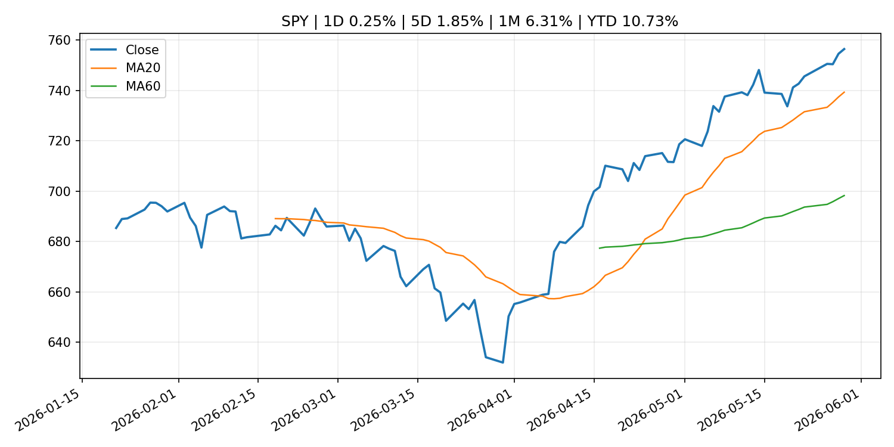
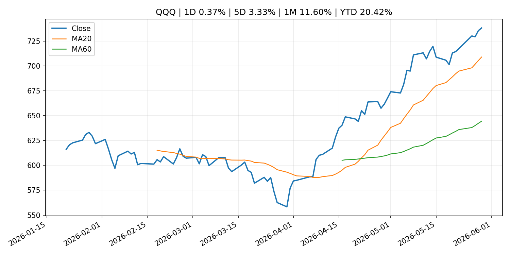
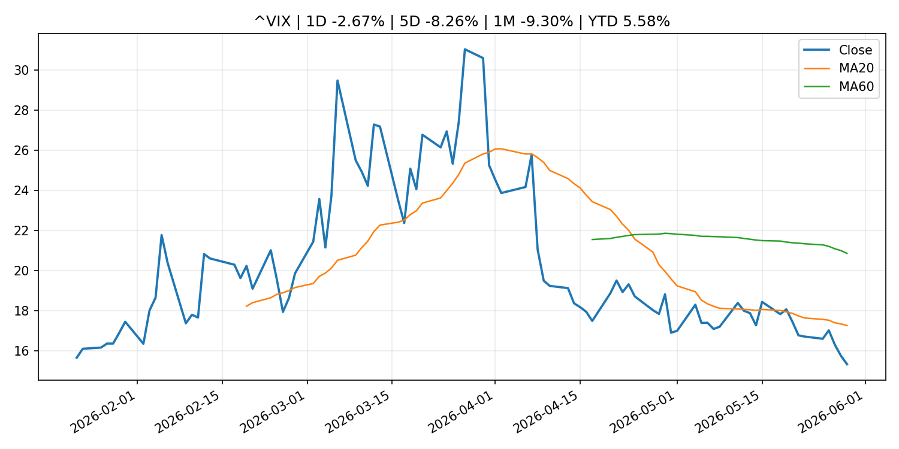
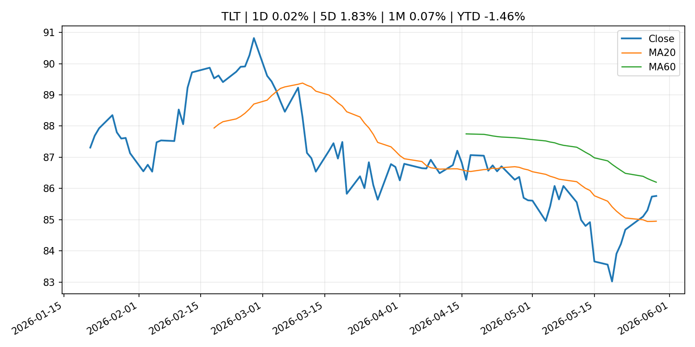
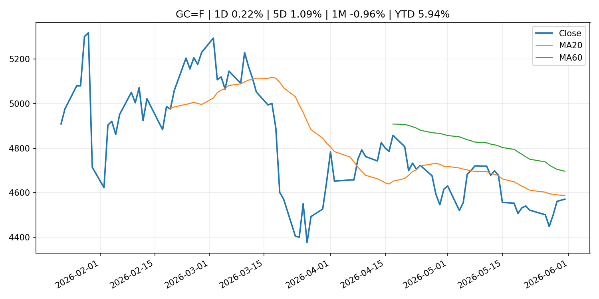
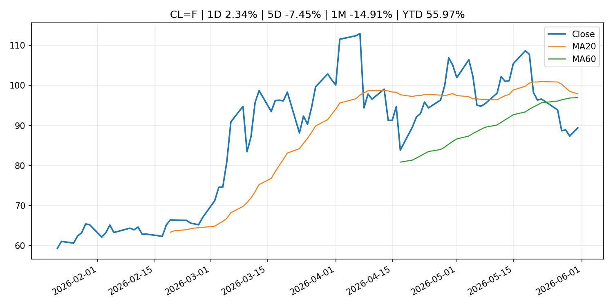
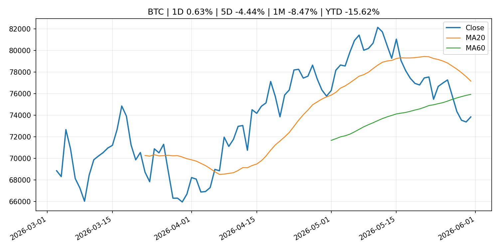
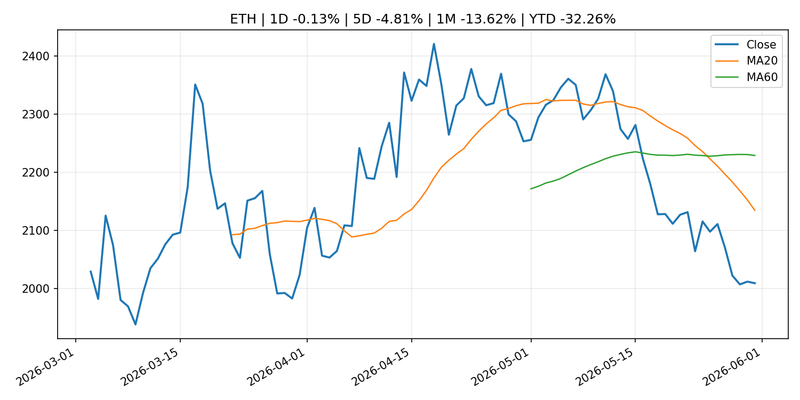
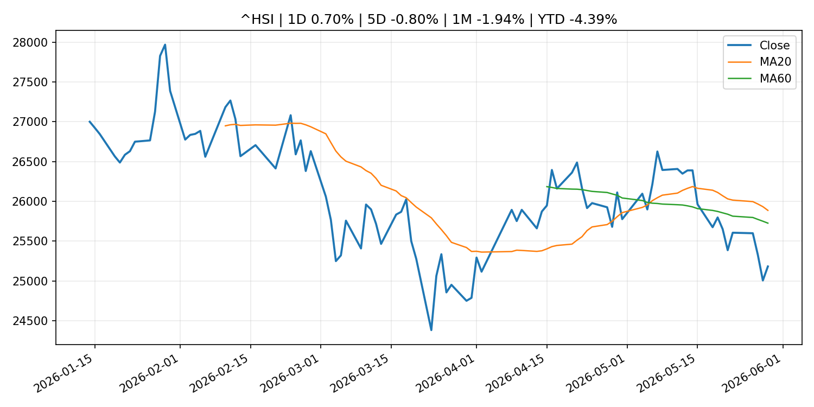

# Global Macro Morning Briefing - 2026-06-01

> Not financial advice / 非投资建议。

## 0. 今日总览
- 市场状态：unknown。市场信号不足，暂不判断明确状态。
- 今日三大主线：
  1. regulation: SEC sues Texas man over $12.3 million alleged crypto scheme built on fake AI trading bots
- 一句话结论：今日晨报重点关注：监管变化会改变行业盈利预期和资产风险溢价。；这条信息暂未匹配到重大宏观、政策或市场事件，更适合作为背景跟踪。。跨资产方面，SPY 1D 0.25%；QQQ 1D 0.37%；^VIX 1D -2.67%；TLT 1D 0.02%；GC=F 1D 0.22%；CL=F 1D 2.34%；BTC 1D 0.63%；ETH 1D -0.13%；市场信号不足，暂不判断明确状态。政策、通胀、利率、美元、美债、能源和加密监管仍是主要观察线索。所有结论仅基于公开数据与短摘要整理，不构成投资建议。

## 1. 隔夜跨资产市场
- 美股：SPY 1D 0.25%，QQQ 1D 0.37%，整体趋势需结合 VIX 和利率确认。
- 美债/美元：TLT 1D 0.02%，美元指数 1D 0.09%，是判断折现率压力的核心线索。
- 黄金/原油：黄金 1D 0.22%，原油 1D 2.34%，用于观察避险、通胀和地缘风险。
- 加密：BTC 1D 0.63%，ETH 1D -0.13%，关注是否独立于纳指走出加密自身行情。
- 港股/A股：恒生 1D 0.70%，沪深300/上证 1D n/a，重点看中国政策预期与人民币线索。
- 风险观察：关注后续数据是否确认当前跨资产信号。

### US_EQUITY

| symbol | latest close | 1D | 5D | 1M | YTD | trend |
|---|---:|---:|---:|---:|---:|---|
| SPY | 756.48 | 0.25% | 1.85% | 6.31% | 10.73% | strong_uptrend |
| QQQ | 738.31 | 0.37% | 3.33% | 11.60% | 20.42% | strong_uptrend |
| DIA | 510.78 | 0.74% | 1.52% | 4.52% | 5.61% | strong_uptrend |
| IWM | 290.43 | -0.55% | 2.81% | 6.74% | 16.74% | strong_uptrend |
| VTI | 372.54 | 0.24% | 2.04% | 6.38% | 10.77% | strong_uptrend |

### US_MACRO_MARKET

| symbol | latest close | 1D | 5D | 1M | YTD | trend |
|---|---:|---:|---:|---:|---:|---|
| ^VIX | 15.32 | -2.67% | -8.26% | -9.30% | 5.58% | strong_downtrend |
| DX-Y.NYB | 99.00 | 0.09% | -0.32% | 0.94% | 0.59% | range_bound |
| TLT | 85.76 | 0.02% | 1.83% | 0.07% | -1.46% | range_bound |
| IEF | 94.65 | 0.12% | 0.91% | -0.16% | -1.49% | range_bound |

### COMMODITIES

| symbol | latest close | 1D | 5D | 1M | YTD | trend |
|---|---:|---:|---:|---:|---:|---|
| GC=F | 4,570.50 | 0.22% | 1.09% | -0.96% | 5.94% | downtrend |
| SI=F | 75.44 | -0.23% | -0.59% | 2.60% | 6.93% | range_bound |
| CL=F | 89.40 | 2.34% | -7.45% | -14.91% | 55.97% | range_bound |
| BZ=F | 92.92 | 0.95% | -10.26% | -18.50% | 52.95% | range_bound |
| NG=F | 3.33 | 1.34% | 14.69% | 20.49% | -7.85% | strong_uptrend |
| HG=F | 6.40 | 0.68% | 0.96% | 8.05% | 13.53% | uptrend |

### HK_MARKET

| symbol | latest close | 1D | 5D | 1M | YTD | trend |
|---|---:|---:|---:|---:|---:|---|
| ^HSI | 25,182.39 | 0.70% | -0.80% | -1.94% | -4.39% | range_bound |
| 0700.HK | 427.20 | 0.52% | -2.69% | -9.84% | -31.43% | strong_downtrend |
| 9988.HK | 120.90 | -0.74% | -4.05% | -4.43% | -18.86% | range_bound |
| 3690.HK | 73.45 | 0.20% | -10.54% | -8.53% | -29.78% | range_bound |
| 1810.HK | 28.04 | -1.82% | -5.46% | -6.28% | -30.39% | strong_downtrend |
| 1211.HK | 91.30 | 1.11% | 0.83% | -11.96% | -7.54% | strong_downtrend |

### CRYPTO

| symbol | latest close | 1D | 5D | 1M | YTD | trend |
|---|---:|---:|---:|---:|---:|---|
| BTC | 73,846.99 | 0.63% | -4.44% | -8.47% | -15.62% | range_bound |
| ETH | 2,009.56 | -0.13% | -4.81% | -13.62% | -32.26% | strong_downtrend |
| SOLANA | 82.39 | 0.56% | -3.03% | -11.55% | -33.83% | range_bound |
| BINANCECOIN | 711.33 | 10.72% | 7.37% | 9.47% | -17.59% | strong_uptrend |
| RIPPLE | 1.34 | 0.54% | -1.02% | -5.97% | -27.40% | strong_downtrend |

## 2. 今日最重要的 10 条新闻
### 1. SEC sues Texas man over $12.3 million alleged crypto scheme built on fake AI trading bots
- 来源：CoinDesk
- 时间：2026-05-30T17:27:34+00:00
- 地区：global
- 事件类型：regulation
- 重要性层级：Tier 2
- 一句话摘要：SEC sues Texas man over $12.3 million alleged crypto scheme built on fake AI trading bots
- 为什么重要：监管变化会改变行业盈利预期和资产风险溢价。
- 可能影响：主要影响 BTC，方向为 mixed，强度 high；加密监管或 ETF 进展会改变 BTC 的资金流和风险溢价。
  - 资产：BTC
    方向：mixed
    强度：high
    原因：加密监管或 ETF 进展会改变 BTC 的资金流和风险溢价。
  - 资产：ETH
    方向：mixed
    强度：high
    原因：监管框架会影响 ETH 产品化和机构参与度。
  - 资产：COIN
    方向：mixed
    强度：medium
    原因：监管清晰度和执法风险会影响交易平台估值。
  - 资产：crypto market
    方向：mixed
    强度：high
    原因：信息影响整个加密市场结构，但方向取决于细节。
- 原文链接：[https://www.coindesk.com/business/2026/05/30/sec-sues-texas-man-over-usd12-3-million-alleged-crypto-scheme-built-on-fake-ai-trading-bots](https://www.coindesk.com/business/2026/05/30/sec-sues-texas-man-over-usd12-3-million-alleged-crypto-scheme-built-on-fake-ai-trading-bots)

### 2. Bitcoin, ether, XRP, dogecoin lag a nine-week stocks rally as ETF demand cools
- 来源：CoinDesk
- 时间：2026-05-30T05:41:30+00:00
- 地区：global
- 事件类型：other
- 重要性层级：Tier 3
- 一句话摘要：Bitcoin, ether, XRP, dogecoin lag a nine-week stocks rally as ETF demand cools
- 为什么重要：这条信息暂未匹配到重大宏观、政策或市场事件，更适合作为背景跟踪。
- 可能影响：主要影响 QQQ，方向为 positive，强度 high；通胀低于预期通常压低利率预期，有利于久期较长的成长股。
  - 资产：QQQ
    方向：positive
    强度：high
    原因：通胀低于预期通常压低利率预期，有利于久期较长的成长股。
  - 资产：SPY
    方向：positive
    强度：medium
    原因：通胀降温改善软着陆预期，对宽基股指偏正面。
  - 资产：TLT
    方向：positive
    强度：high
    原因：降息预期升温时长债价格通常受益。
  - 资产：DXY
    方向：negative
    强度：medium
    原因：美元可能随美债收益率和政策利率预期回落。
  - 资产：GC=F
    方向：positive
    强度：medium
    原因：实际利率压力下降时黄金通常受益。
  - 资产：BTC
    方向：mixed
    强度：high
    原因：加密监管或 ETF 进展会改变 BTC 的资金流和风险溢价。
- 原文链接：[https://www.coindesk.com/markets/2026/05/30/bitcoin-ether-xrp-dogecoin-lag-a-nine-week-stocks-rally-as-etf-demand-cools](https://www.coindesk.com/markets/2026/05/30/bitcoin-ether-xrp-dogecoin-lag-a-nine-week-stocks-rally-as-etf-demand-cools)

### 3. Two months, $2.6 billion: How NASA ETF turned SpaceX IPO access into a hot retail trade
- 来源：CNBC Economy
- 时间：2026-05-30T15:33:42+00:00
- 地区：US
- 事件类型：other
- 重要性层级：Tier 3
- 一句话摘要：With Elon Musk's SpaceX IPO ahead, retail investors are rushing into space-themed ETFs including NASA which offers direct access to the rocket company.
- 为什么重要：这条信息暂未匹配到重大宏观、政策或市场事件，更适合作为背景跟踪。
- 可能影响：主要影响 BTC，方向为 mixed，强度 high；加密监管或 ETF 进展会改变 BTC 的资金流和风险溢价。
  - 资产：BTC
    方向：mixed
    强度：high
    原因：加密监管或 ETF 进展会改变 BTC 的资金流和风险溢价。
  - 资产：ETH
    方向：mixed
    强度：high
    原因：监管框架会影响 ETH 产品化和机构参与度。
  - 资产：COIN
    方向：mixed
    强度：medium
    原因：监管清晰度和执法风险会影响交易平台估值。
  - 资产：crypto market
    方向：mixed
    强度：high
    原因：信息影响整个加密市场结构，但方向取决于细节。
- 原文链接：[https://www.cnbc.com/2026/05/30/spacex-ipo-invest.html](https://www.cnbc.com/2026/05/30/spacex-ipo-invest.html)

## 3. 政策与央行观察
### 1. SEC sues Texas man over $12.3 million alleged crypto scheme built on fake AI trading bots
- 来源：CoinDesk
- 时间：2026-05-30T17:27:34+00:00
- 地区：global
- 事件类型：regulation
- 重要性层级：Tier 2
- 一句话摘要：SEC sues Texas man over $12.3 million alleged crypto scheme built on fake AI trading bots
- 为什么重要：监管变化会改变行业盈利预期和资产风险溢价。
- 可能影响：主要影响 BTC，方向为 mixed，强度 high；加密监管或 ETF 进展会改变 BTC 的资金流和风险溢价。
  - 资产：BTC
    方向：mixed
    强度：high
    原因：加密监管或 ETF 进展会改变 BTC 的资金流和风险溢价。
  - 资产：ETH
    方向：mixed
    强度：high
    原因：监管框架会影响 ETH 产品化和机构参与度。
  - 资产：COIN
    方向：mixed
    强度：medium
    原因：监管清晰度和执法风险会影响交易平台估值。
  - 资产：crypto market
    方向：mixed
    强度：high
    原因：信息影响整个加密市场结构，但方向取决于细节。
- 原文链接：[https://www.coindesk.com/business/2026/05/30/sec-sues-texas-man-over-usd12-3-million-alleged-crypto-scheme-built-on-fake-ai-trading-bots](https://www.coindesk.com/business/2026/05/30/sec-sues-texas-man-over-usd12-3-million-alleged-crypto-scheme-built-on-fake-ai-trading-bots)

## 4. 市场异动与图表
- Oil 上涨 2.34%

### SPY

### QQQ

### ^VIX

### TLT

### GC=F

### CL=F

### BTC

### ETH

### ^HSI

## 5. 华尔街与机构公开观点
- 暂无可靠公开观点。

## 6. 今日重点关注
- 经济数据：经济数据：暂无可靠公开日历数据；如配置经济日历源后可自动填充。
- 央行讲话：央行讲话：暂无可靠公开日历数据；重点跟踪 Fed、ECB、BoJ、PBOC 官网 RSS。
- 财报：财报：暂无可靠数据。
- 政策事件：政策事件：暂无可靠数据。
- 风险提醒：风险提醒：关注数据源失败项、突发地缘风险、利率和美元的二阶反应。

## 7. 英文金融表达与宏观概念
- **market structure**：市场结构，指交易、托管、清算、ETF、监管等制度安排。 例句：Crypto market structure rules can affect institutional participation.
- **inflation expectations**：通胀预期，指家庭、企业或市场对未来通胀的预估。 例句：Inflation expectations can shape wage bargaining and bond yields.
- **real yield**：实际收益率，名义利率扣除通胀预期后的收益率。 例句：Gold often reacts more to real yields than nominal yields.
- **terminal rate**：终端利率，市场预期本轮加息周期的最高政策利率。 例句：A higher terminal rate can pressure growth stocks.
- **soft landing**：软着陆，指通胀回落而经济避免明显衰退。 例句：Markets often rally when data support a soft landing.
- **risk-off**：避险模式，资金偏向美元、国债、黄金等防御资产。 例句：A geopolitical shock can push markets into risk-off mode.

## 8. 背景材料
- [How Stellar became part of DTCC's tokenization push for Wall Street securities onchain](https://www.coindesk.com/business/2026/05/31/how-stellar-became-part-of-dtcc-s-tokenization-push-for-wall-street-securities-onchain)（CoinDesk，other）：How Stellar became part of DTCC's tokenization push for Wall Street securities onchain
- [Here’s what’s worth streaming in June 2026 on Netflix, Hulu, HBO Max and more](https://www.marketwatch.com/story/heres-whats-worth-streaming-in-june-2026-on-netflix-hulu-hbo-max-and-more-7c73c539?mod=mw_rss_topstories)（MarketWatch Top Stories，other）：HBO’s ‘House of the Dragon,’ Hulu’s ‘The Bear’ and Apple’s ‘Cape Fear’ will try to compete with the World Cup
- [Luis de Guindos: Interview with Expansión](https://www.ecb.europa.eu//press/inter/date/2026/html/ecb.in260531~f648dbde70.en.html)（ECB Press Releases，other）：Luis de Guindos: Interview with Expansión
- [Bitcoin's wild days are over — and Trace Mayer says that's a good thing](https://www.coindesk.com/markets/2026/05/28/dnp-trace-mayer-bitcoin-s-volatility-compression-is-a-sign-of-maturity-not-weakness)（CoinDesk，other）：Bitcoin's wild days are over — and Trace Mayer says that's a good thing
- [My friend, 62, earns $20,000 a year. Should she take Social Security now — and claim survivor’s benefit at 67?](https://www.marketwatch.com/story/my-friend-62-earns-20-000-a-year-should-she-take-social-security-now-or-claim-survivors-benefit-at-67-c661bdca?mod=mw_rss_topstories)（MarketWatch Top Stories，other）：“I calculated her break-even point to be around age 78.”
- [Two months, $2.6 billion: How NASA ETF turned SpaceX IPO access into a hot retail trade](https://www.cnbc.com/2026/05/30/spacex-ipo-invest.html)（CNBC Economy，other）：With Elon Musk's SpaceX IPO ahead, retail investors are rushing into space-themed ETFs including NASA which offers direct access to the rocket company.
- [XRP ETFs add $35 million as bitcoin and ether funds lost $2 billion in late May](https://www.coindesk.com/markets/2026/05/30/ripple-said-to-lead-usd1-billion-xrp-treasury-raise-report)（CoinDesk，other）：XRP ETFs add $35 million as bitcoin and ether funds lost $2 billion in late May
- [Bitcoin, ether, XRP, dogecoin lag a nine-week stocks rally as ETF demand cools](https://www.coindesk.com/markets/2026/05/30/bitcoin-ether-xrp-dogecoin-lag-a-nine-week-stocks-rally-as-etf-demand-cools)（CoinDesk，other）：Bitcoin, ether, XRP, dogecoin lag a nine-week stocks rally as ETF demand cools
- [Bitcoin’s biggest quantum risk may not be wallet keys. An early investor fears something bigger](https://www.coindesk.com/tech/2026/05/30/bitcoin-s-biggest-quantum-risk-may-not-be-wallet-keys-an-early-investor-fears-something-bigger)（CoinDesk，other）：Bitcoin’s biggest quantum risk may not be wallet keys. An early investor fears something bigger

## 9. 数据源、失败项与免责声明
- 采集时间：2026-05-31T22:59:46
- 数据源：公开 RSS、Yahoo Finance、CoinGecko、AKShare、FRED、SEC data.sec.gov，以及用户自有 inputs/reports 文件。
- 合规说明：不绕过 WSJ、Bloomberg、FT、Reuters 等付费墙；对付费媒体只使用公开 RSS 标题、摘要、链接和发布时间。
- 免责声明：Not financial advice / 非投资建议。本项目仅供个人学习、研究和信息整理，不构成投资建议、交易建议或任何收益承诺。
- 失败或跳过的数据源：
  - crypto data failed coin=dogecoin
  - China market data failed symbol=上证指数: empty dataframe
  - China market data failed symbol=深证成指: empty dataframe
  - China market data failed symbol=创业板指: empty dataframe
  - China market data failed symbol=沪深300: empty dataframe
  - China market data failed symbol=中证500: empty dataframe
  - China market data failed symbol=科创50: empty dataframe
  - FRED_API_KEY not set; skipping FRED macro series
  - SEC failed cik=0000320193
  - SEC failed cik=0000789019
  - SEC failed cik=0001045810
  - SEC failed cik=0001318605
  - SEC failed cik=0001577552
