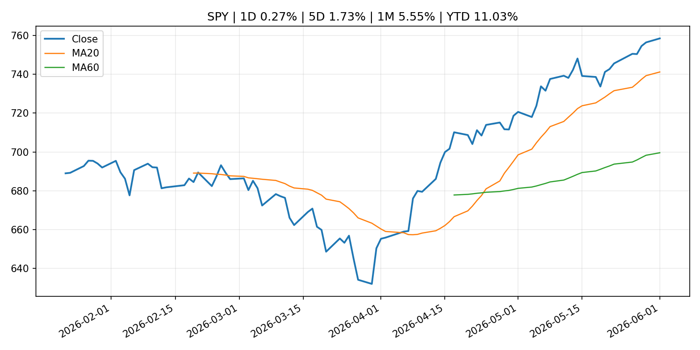
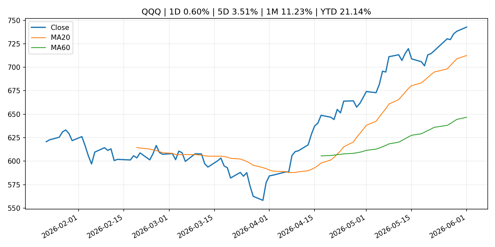
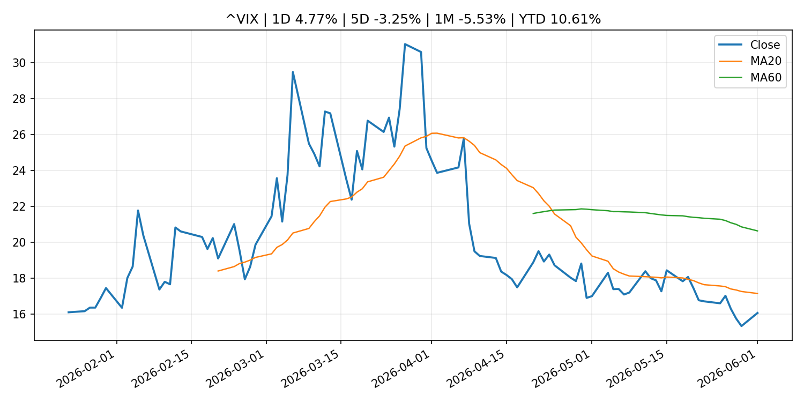
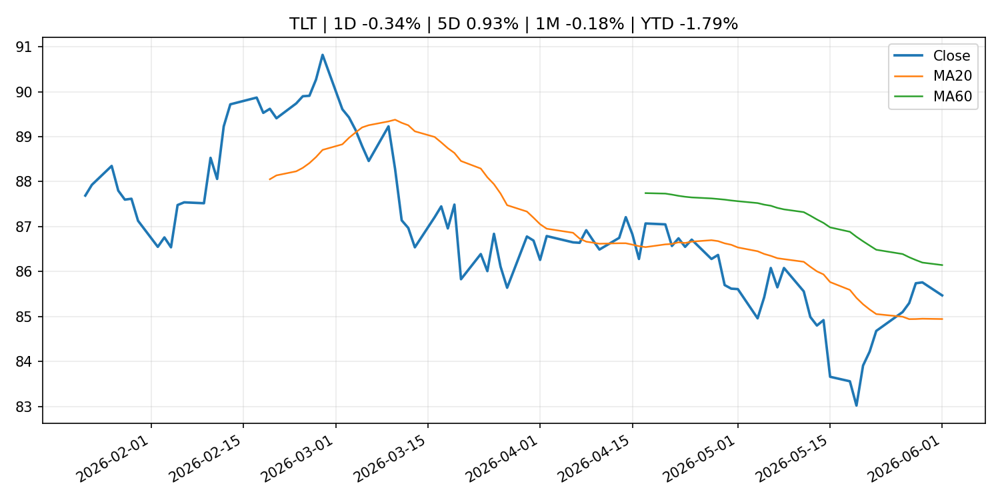
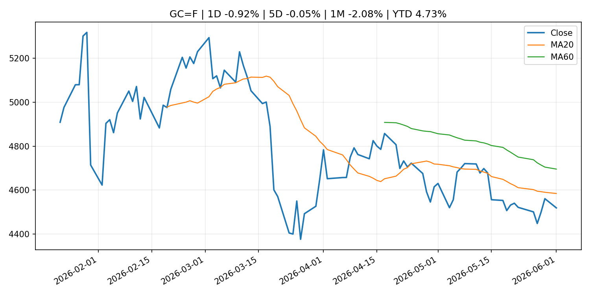
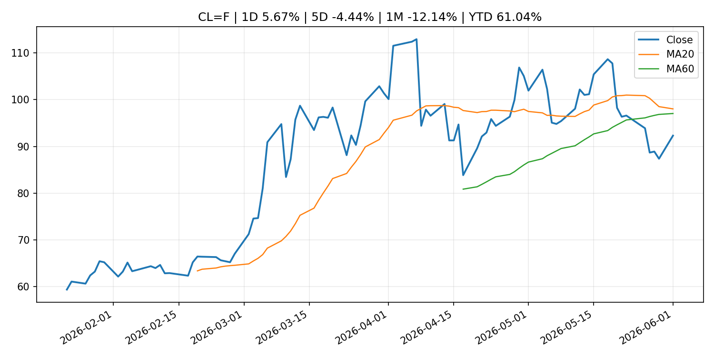
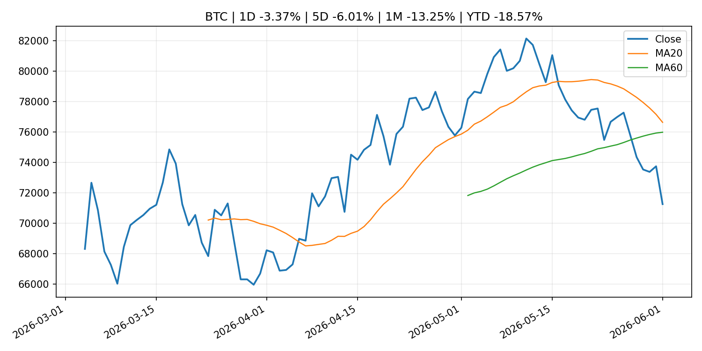
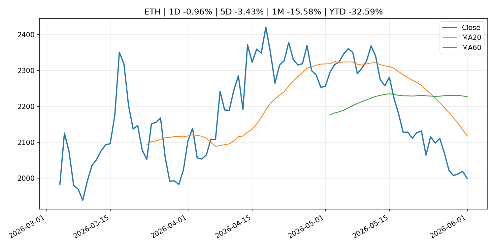
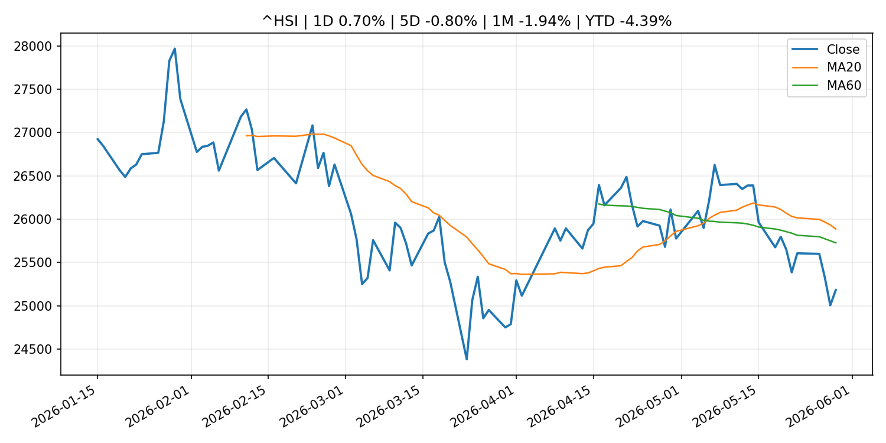

# Global Macro Morning Briefing - 2026-06-02

> Not financial advice / 非投资建议。

## 0. 今日总览
- 市场状态：unknown。市场信号不足，暂不判断明确状态。
- 今日三大主线：
  1. regulation: SEC Announces Four New Members of Investor Advisory Committee
  2. crypto_market_structure: Bitcoin extends slide as spot ETF outflows hit a record while Wall Street rips on AI
  3. central_bank_speech: Rubio odds for GOP 2028 nominee close to overtaking Vance on Kalshi
- 一句话结论：今日晨报重点关注：监管变化会改变行业盈利预期和资产风险溢价。；加密市场结构和监管变化会影响 BTC、ETH 及相关股票的风险溢价。。跨资产方面，SPY 1D 0.27%；QQQ 1D 0.60%；^VIX 1D 4.77%；TLT 1D -0.34%；GC=F 1D -0.92%；CL=F 1D 5.67%；BTC 1D -3.37%；ETH 1D -0.96%；市场信号不足，暂不判断明确状态。政策、通胀、利率、美元、美债、能源和加密监管仍是主要观察线索。所有结论仅基于公开数据与短摘要整理，不构成投资建议。

## 1. 隔夜跨资产市场
- 美股：SPY 1D 0.27%，QQQ 1D 0.60%，整体趋势需结合 VIX 和利率确认。
- 美债/美元：TLT 1D -0.34%，美元指数 1D 0.27%，是判断折现率压力的核心线索。
- 黄金/原油：黄金 1D -0.92%，原油 1D 5.67%，用于观察避险、通胀和地缘风险。
- 加密：BTC 1D -3.37%，ETH 1D -0.96%，关注是否独立于纳指走出加密自身行情。
- 港股/A股：恒生 1D 0.70%，沪深300/上证 1D n/a，重点看中国政策预期与人民币线索。
- 风险观察：关注后续数据是否确认当前跨资产信号。

### US_EQUITY

| symbol | latest close | 1D | 5D | 1M | YTD | trend |
|---|---:|---:|---:|---:|---:|---|
| SPY | 758.54 | 0.27% | 1.73% | 5.55% | 11.03% | strong_uptrend |
| QQQ | 742.74 | 0.60% | 3.51% | 11.23% | 21.14% | strong_uptrend |
| DIA | 511.44 | 0.13% | 1.05% | 2.98% | 5.75% | uptrend |
| IWM | 288.98 | -0.50% | 1.35% | 3.96% | 16.16% | uptrend |
| VTI | 373.40 | 0.23% | 1.80% | 5.43% | 11.03% | strong_uptrend |

### US_MACRO_MARKET

| symbol | latest close | 1D | 5D | 1M | YTD | trend |
|---|---:|---:|---:|---:|---:|---|
| ^VIX | 16.05 | 4.77% | -3.25% | -5.53% | 10.61% | strong_downtrend |
| DX-Y.NYB | 99.18 | 0.27% | -0.14% | 1.12% | 0.77% | range_bound |
| TLT | 85.47 | -0.34% | 0.93% | -0.18% | -1.79% | range_bound |
| IEF | 94.17 | -0.51% | 0.31% | -0.85% | -1.99% | downtrend |

### COMMODITIES

| symbol | latest close | 1D | 5D | 1M | YTD | trend |
|---|---:|---:|---:|---:|---:|---|
| GC=F | 4,518.60 | -0.92% | -0.05% | -2.08% | 4.73% | downtrend |
| SI=F | 75.31 | -0.40% | -0.77% | 2.42% | 6.74% | range_bound |
| CL=F | 92.31 | 5.67% | -4.44% | -12.14% | 61.04% | range_bound |
| BZ=F | 95.16 | 3.38% | -8.09% | -16.53% | 56.64% | range_bound |
| NG=F | 3.18 | -3.22% | 9.53% | 15.07% | -12.00% | strong_uptrend |
| HG=F | 6.57 | 3.26% | 3.55% | 10.82% | 16.44% | strong_uptrend |

### HK_MARKET

| symbol | latest close | 1D | 5D | 1M | YTD | trend |
|---|---:|---:|---:|---:|---:|---|
| ^HSI | 25,182.39 | 0.70% | -0.80% | -1.94% | -4.39% | range_bound |
| 0700.HK | 436.00 | 2.06% | -1.22% | -9.02% | -30.02% | strong_downtrend |
| 9988.HK | 122.80 | 1.57% | -3.31% | -5.97% | -17.58% | range_bound |
| 3690.HK | 78.25 | 6.54% | -3.81% | -5.89% | -25.19% | strong_downtrend |
| 1810.HK | 28.72 | 2.43% | -4.27% | -4.71% | -28.70% | strong_downtrend |
| 1211.HK | 90.75 | -0.60% | -0.93% | -16.20% | -8.10% | strong_downtrend |

### CRYPTO

| symbol | latest close | 1D | 5D | 1M | YTD | trend |
|---|---:|---:|---:|---:|---:|---|
| BTC | 71,265.42 | -3.37% | -6.01% | -13.25% | -18.57% | range_bound |
| ETH | 1,999.76 | -0.96% | -3.43% | -15.58% | -32.59% | strong_downtrend |
| SOLANA | 81.37 | -1.41% | -2.68% | -15.67% | -34.65% | range_bound |
| BINANCECOIN | 693.78 | -3.40% | 5.80% | 4.45% | -19.62% | strong_uptrend |
| RIPPLE | 1.30 | -3.07% | -2.33% | -11.96% | -29.49% | strong_downtrend |

## 2. 今日最重要的 10 条新闻
### 1. SEC Announces Four New Members of Investor Advisory Committee
- 来源：SEC Press Releases
- 时间：2026-06-01T12:39:44-04:00
- 地区：US
- 事件类型：regulation
- 重要性层级：Tier 2
- 一句话摘要：The Securities and Exchange Commission today announced four new members to fill vacancies on its Investor Advisory Committee. Three of the four new members will serve four-year terms, while the fourth new member will serve as the…
- 为什么重要：监管变化会改变行业盈利预期和资产风险溢价。
- 可能影响：主要影响 BTC，方向为 mixed，强度 high；加密监管或 ETF 进展会改变 BTC 的资金流和风险溢价。
  - 资产：BTC
    方向：mixed
    强度：high
    原因：加密监管或 ETF 进展会改变 BTC 的资金流和风险溢价。
  - 资产：ETH
    方向：mixed
    强度：high
    原因：监管框架会影响 ETH 产品化和机构参与度。
  - 资产：COIN
    方向：mixed
    强度：medium
    原因：监管清晰度和执法风险会影响交易平台估值。
  - 资产：crypto market
    方向：mixed
    强度：high
    原因：信息影响整个加密市场结构，但方向取决于细节。
- 原文链接：[https://www.sec.gov/newsroom/press-releases/2026-50-sec-announces-four-new-members-investor-advisory-committee](https://www.sec.gov/newsroom/press-releases/2026-50-sec-announces-four-new-members-investor-advisory-committee)

### 2. Bitcoin extends slide as spot ETF outflows hit a record while Wall Street rips on AI
- 来源：CoinDesk
- 时间：2026-06-01T05:11:40+00:00
- 地区：global
- 事件类型：crypto_market_structure
- 重要性层级：Tier 2
- 一句话摘要：Bitcoin extends slide as spot ETF outflows hit a record while Wall Street rips on AI
- 为什么重要：加密市场结构和监管变化会影响 BTC、ETH 及相关股票的风险溢价。
- 可能影响：主要影响 BTC，方向为 mixed，强度 high；加密监管或 ETF 进展会改变 BTC 的资金流和风险溢价。
  - 资产：BTC
    方向：mixed
    强度：high
    原因：加密监管或 ETF 进展会改变 BTC 的资金流和风险溢价。
  - 资产：ETH
    方向：mixed
    强度：high
    原因：监管框架会影响 ETH 产品化和机构参与度。
  - 资产：COIN
    方向：mixed
    强度：medium
    原因：监管清晰度和执法风险会影响交易平台估值。
  - 资产：crypto market
    方向：mixed
    强度：high
    原因：信息影响整个加密市场结构，但方向取决于细节。
- 原文链接：[https://www.coindesk.com/markets/2026/06/01/bitcoin-extends-slide-as-spot-etf-outflows-hit-a-record-while-wall-street-rips-on-ai](https://www.coindesk.com/markets/2026/06/01/bitcoin-extends-slide-as-spot-etf-outflows-hit-a-record-while-wall-street-rips-on-ai)

### 3. Rubio odds for GOP 2028 nominee close to overtaking Vance on Kalshi
- 来源：CNBC Economy
- 时间：2026-06-01T15:03:17+00:00
- 地区：US
- 事件类型：central_bank_speech
- 重要性层级：Tier 2
- 一句话摘要：Vice President Vance has seen his odds slip since the start of the year, as the secretary of State's chances have been buoyed by international conflicts.
- 为什么重要：央行官员表态可能影响市场对下一次会议的定价。
- 可能影响：可能影响利率、汇率、风险资产或大宗商品预期，但当前公开信息不足以判断明确方向。
  - 资产：暂无明确资产映射
  - 方向：unknown
  - 强度：low
  - 原因：公开信息不足以判断方向。
- 原文链接：[https://www.cnbc.com/2026/06/01/rubio-odds-for-gop-2028-nominee-close-to-overtaking-vance-on-kalshi.html](https://www.cnbc.com/2026/06/01/rubio-odds-for-gop-2028-nominee-close-to-overtaking-vance-on-kalshi.html)

### 4. Bitcoin remains under pressure as ETF outflows, higher oil prices weigh on crypto markets
- 来源：CoinDesk
- 时间：2026-06-01T11:15:00+00:00
- 地区：global
- 事件类型：other
- 重要性层级：Tier 3
- 一句话摘要：Bitcoin remains under pressure as ETF outflows, higher oil prices weigh on crypto markets
- 为什么重要：这条信息暂未匹配到重大宏观、政策或市场事件，更适合作为背景跟踪。
- 可能影响：主要影响 CL=F，方向为 positive，强度 high；供给扰动或 OPEC 减产通常推升 WTI 原油。
  - 资产：CL=F
    方向：positive
    强度：high
    原因：供给扰动或 OPEC 减产通常推升 WTI 原油。
  - 资产：BZ=F
    方向：positive
    强度：high
    原因：全球供给风险通常直接影响 Brent 原油。
  - 资产：SPY
    方向：mixed
    强度：medium
    原因：能源股可能受益，但通胀和成本压力不利于宽基风险资产。
  - 资产：BTC
    方向：mixed
    强度：high
    原因：加密监管或 ETF 进展会改变 BTC 的资金流和风险溢价。
  - 资产：ETH
    方向：mixed
    强度：high
    原因：监管框架会影响 ETH 产品化和机构参与度。
  - 资产：COIN
    方向：mixed
    强度：medium
    原因：监管清晰度和执法风险会影响交易平台估值。
- 原文链接：[https://www.coindesk.com/daybook-us/2026/06/01/bitcoin-remains-under-pressure-as-etf-outflows-higher-oil-prices-weigh-on-crypto-markets](https://www.coindesk.com/daybook-us/2026/06/01/bitcoin-remains-under-pressure-as-etf-outflows-higher-oil-prices-weigh-on-crypto-markets)

### 5. Japan's ruling party supports crypto ETF trading, yen-based stablecoins
- 来源：CoinDesk
- 时间：2026-06-01T13:38:04+00:00
- 地区：global
- 事件类型：other
- 重要性层级：Tier 3
- 一句话摘要：Japan's ruling party supports crypto ETF trading, yen-based stablecoins
- 为什么重要：这条信息暂未匹配到重大宏观、政策或市场事件，更适合作为背景跟踪。
- 可能影响：主要影响 BTC，方向为 mixed，强度 high；加密监管或 ETF 进展会改变 BTC 的资金流和风险溢价。
  - 资产：BTC
    方向：mixed
    强度：high
    原因：加密监管或 ETF 进展会改变 BTC 的资金流和风险溢价。
  - 资产：ETH
    方向：mixed
    强度：high
    原因：监管框架会影响 ETH 产品化和机构参与度。
  - 资产：COIN
    方向：mixed
    强度：medium
    原因：监管清晰度和执法风险会影响交易平台估值。
  - 资产：crypto market
    方向：mixed
    强度：high
    原因：信息影响整个加密市场结构，但方向取决于细节。
- 原文链接：[https://www.coindesk.com/policy/2026/06/01/japan-s-ruling-party-supports-crypto-etf-trading-yen-based-stablecoins](https://www.coindesk.com/policy/2026/06/01/japan-s-ruling-party-supports-crypto-etf-trading-yen-based-stablecoins)

## 3. 政策与央行观察
### 1. SEC Announces Four New Members of Investor Advisory Committee
- 来源：SEC Press Releases
- 时间：2026-06-01T12:39:44-04:00
- 地区：US
- 事件类型：regulation
- 重要性层级：Tier 2
- 一句话摘要：The Securities and Exchange Commission today announced four new members to fill vacancies on its Investor Advisory Committee. Three of the four new members will serve four-year terms, while the fourth new member will serve as the…
- 为什么重要：监管变化会改变行业盈利预期和资产风险溢价。
- 可能影响：主要影响 BTC，方向为 mixed，强度 high；加密监管或 ETF 进展会改变 BTC 的资金流和风险溢价。
  - 资产：BTC
    方向：mixed
    强度：high
    原因：加密监管或 ETF 进展会改变 BTC 的资金流和风险溢价。
  - 资产：ETH
    方向：mixed
    强度：high
    原因：监管框架会影响 ETH 产品化和机构参与度。
  - 资产：COIN
    方向：mixed
    强度：medium
    原因：监管清晰度和执法风险会影响交易平台估值。
  - 资产：crypto market
    方向：mixed
    强度：high
    原因：信息影响整个加密市场结构，但方向取决于细节。
- 原文链接：[https://www.sec.gov/newsroom/press-releases/2026-50-sec-announces-four-new-members-investor-advisory-committee](https://www.sec.gov/newsroom/press-releases/2026-50-sec-announces-four-new-members-investor-advisory-committee)

### 2. Bitcoin extends slide as spot ETF outflows hit a record while Wall Street rips on AI
- 来源：CoinDesk
- 时间：2026-06-01T05:11:40+00:00
- 地区：global
- 事件类型：crypto_market_structure
- 重要性层级：Tier 2
- 一句话摘要：Bitcoin extends slide as spot ETF outflows hit a record while Wall Street rips on AI
- 为什么重要：加密市场结构和监管变化会影响 BTC、ETH 及相关股票的风险溢价。
- 可能影响：主要影响 BTC，方向为 mixed，强度 high；加密监管或 ETF 进展会改变 BTC 的资金流和风险溢价。
  - 资产：BTC
    方向：mixed
    强度：high
    原因：加密监管或 ETF 进展会改变 BTC 的资金流和风险溢价。
  - 资产：ETH
    方向：mixed
    强度：high
    原因：监管框架会影响 ETH 产品化和机构参与度。
  - 资产：COIN
    方向：mixed
    强度：medium
    原因：监管清晰度和执法风险会影响交易平台估值。
  - 资产：crypto market
    方向：mixed
    强度：high
    原因：信息影响整个加密市场结构，但方向取决于细节。
- 原文链接：[https://www.coindesk.com/markets/2026/06/01/bitcoin-extends-slide-as-spot-etf-outflows-hit-a-record-while-wall-street-rips-on-ai](https://www.coindesk.com/markets/2026/06/01/bitcoin-extends-slide-as-spot-etf-outflows-hit-a-record-while-wall-street-rips-on-ai)

### 3. Rubio odds for GOP 2028 nominee close to overtaking Vance on Kalshi
- 来源：CNBC Economy
- 时间：2026-06-01T15:03:17+00:00
- 地区：US
- 事件类型：central_bank_speech
- 重要性层级：Tier 2
- 一句话摘要：Vice President Vance has seen his odds slip since the start of the year, as the secretary of State's chances have been buoyed by international conflicts.
- 为什么重要：央行官员表态可能影响市场对下一次会议的定价。
- 可能影响：可能影响利率、汇率、风险资产或大宗商品预期，但当前公开信息不足以判断明确方向。
  - 资产：暂无明确资产映射
  - 方向：unknown
  - 强度：low
  - 原因：公开信息不足以判断方向。
- 原文链接：[https://www.cnbc.com/2026/06/01/rubio-odds-for-gop-2028-nominee-close-to-overtaking-vance-on-kalshi.html](https://www.cnbc.com/2026/06/01/rubio-odds-for-gop-2028-nominee-close-to-overtaking-vance-on-kalshi.html)

## 4. 市场异动与图表
- QQQ 上涨 0.60%
- VIX 上涨 4.77%
- Gold 下跌 -0.92%
- Oil 上涨 5.67%
- BTC 下跌 -3.37%

### SPY

### QQQ

### ^VIX

### TLT

### GC=F

### CL=F

### BTC

### ETH

### ^HSI

## 5. 华尔街与机构公开观点
- 暂无可靠公开观点。

## 6. 今日重点关注
- 经济数据：经济数据：暂无可靠公开日历数据；如配置经济日历源后可自动填充。
- 央行讲话：央行讲话：暂无可靠公开日历数据；重点跟踪 Fed、ECB、BoJ、PBOC 官网 RSS。
- 财报：财报：暂无可靠数据。
- 政策事件：政策事件：暂无可靠数据。
- 风险提醒：风险提醒：关注数据源失败项、突发地缘风险、利率和美元的二阶反应。

## 7. 英文金融表达与宏观概念
- **supply disruption**：供给扰动，通常指能源或商品供应受冲突、减产或天气影响。 例句：Supply disruption can lift oil prices and inflation expectations.
- **market structure**：市场结构，指交易、托管、清算、ETF、监管等制度安排。 例句：Crypto market structure rules can affect institutional participation.
- **inflation expectations**：通胀预期，指家庭、企业或市场对未来通胀的预估。 例句：Inflation expectations can shape wage bargaining and bond yields.
- **real yield**：实际收益率，名义利率扣除通胀预期后的收益率。 例句：Gold often reacts more to real yields than nominal yields.
- **terminal rate**：终端利率，市场预期本轮加息周期的最高政策利率。 例句：A higher terminal rate can pressure growth stocks.
- **soft landing**：软着陆，指通胀回落而经济避免明显衰退。 例句：Markets often rally when data support a soft landing.

## 8. 背景材料
- [Here’s what’s worth streaming in June 2026 on Netflix, Hulu, HBO Max and more](https://www.marketwatch.com/story/heres-whats-worth-streaming-in-june-2026-on-netflix-hulu-hbo-max-and-more-7c73c539?mod=mw_rss_topstories)（MarketWatch Top Stories，other）：HBO’s ‘House of the Dragon,’ Hulu’s ‘The Bear’ and Apple’s ‘Cape Fear’ will try to compete with the World Cup
- [I am 71. Would it be foolish to sell $10,000 in shares to visit my grandchildren in Thailand?](https://www.marketwatch.com/story/i-am-71-and-comfortable-should-i-sell-10-000-in-stock-to-visit-my-grandkids-in-thailand-or-dip-into-my-50-000-savings-16230c6a?mod=mw_rss_topstories)（MarketWatch Top Stories，other）：“I am comfortable living on my Social Security and pension income.”
- [Crypto funds suffer second-largest outflows of 2026 while XRP and HYPE attract inflows](https://www.coindesk.com/markets/2026/06/01/crypto-funds-suffer-second-largest-outflows-of-2026-while-xrp-and-hype-attract-inflows)（CoinDesk，other）：Crypto funds suffer second-largest outflows of 2026 while XRP and HYPE attract inflows
- [Saylor's Strategy sold bitcoin for the first time since 2022. These firms are still buying](https://www.coindesk.com/business/2026/06/01/saylor-s-strategy-sold-bitcoin-for-the-first-time-since-2022-these-firms-are-still-buying)（CoinDesk，other）：Saylor's Strategy sold bitcoin for the first time since 2022. These firms are still buying
- [It's not 2022 anymore: What Strategy's first bitcoin sale can (and can't) tell us about this one](https://www.coindesk.com/markets/2026/06/01/strategy-s-second-bitcoin-sale-revives-memories-of-2022)（CoinDesk，other）：It's not 2022 anymore: What Strategy's first bitcoin sale can (and can't) tell us about this one
- [Michael Saylor breaks silence after Strategy sells $2.5 million in bitcoin](https://www.coindesk.com/markets/2026/06/01/michael-saylor-breaks-silence-after-strategy-sells-usd2-5-million-in-bitcoin)（CoinDesk，other）：Michael Saylor breaks silence after Strategy sells $2.5 million in bitcoin
- [Strategy sparks panic with bitcoin sale, but analysts say it was 'immaterial'](https://www.coindesk.com/markets/2026/06/01/analysts-agree-strategy-s-bitcoin-sale-was-immaterial-differ-on-future-signals)（CoinDesk，other）：Strategy sparks panic with bitcoin sale, but analysts say it was 'immaterial'
- [Strategy’s bitcoin sale sparks a $14 million betting chaos on Polymarket](https://www.coindesk.com/markets/2026/06/01/strategy-s-bitcoin-sale-sparks-a-usd14-million-crypto-betting-chaos-on-a-major-prediction-market)（CoinDesk，other）：Strategy’s bitcoin sale sparks a $14 million betting chaos on Polymarket
- [Japan's ruling party supports crypto ETF trading, yen-based stablecoins](https://www.coindesk.com/policy/2026/06/01/japan-s-ruling-party-supports-crypto-etf-trading-yen-based-stablecoins)（CoinDesk，other）：Japan's ruling party supports crypto ETF trading, yen-based stablecoins
- [Live markets: Bitcoin retreats under $72,000 as Strategy unloads BTC for first time in four years](https://www.coindesk.com/markets/2026/06/01/live-markets-bitcoin-retreats-under-usd72-000-as-strategy-unloads-btc-for-first-time-in-four-years)（CoinDesk，other）：Live markets: Bitcoin retreats under $72,000 as Strategy unloads BTC for first time in four years
- [Michael Saylor's Strategy sold 32 bitcoin for $2.5 million to fund dividend payments](https://www.coindesk.com/markets/2026/06/01/strategy-sold-32-btc-for-usd2-5-million-in-late-may-filing-shows)（CoinDesk，other）：Michael Saylor's Strategy sold 32 bitcoin for $2.5 million to fund dividend payments
- [Bitcoin remains under pressure as ETF outflows, higher oil prices weigh on crypto markets](https://www.coindesk.com/daybook-us/2026/06/01/bitcoin-remains-under-pressure-as-etf-outflows-higher-oil-prices-weigh-on-crypto-markets)（CoinDesk，other）：Bitcoin remains under pressure as ETF outflows, higher oil prices weigh on crypto markets
- [Bitcoin, ether start June in the red while futures show taste for risk. XLM, HYPE gain](https://www.coindesk.com/markets/2026/06/01/bitcoin-ether-start-june-in-the-red-while-futures-show-taste-for-risk-xlm-hype-gain)（CoinDesk，other）：Bitcoin, ether start June in the red while futures show taste for risk. XLM, HYPE gain
- [Bitcoin and software stocks are breaking up — and history says a major crypto move is coming](https://www.coindesk.com/markets/2026/06/01/software-stocks-break-from-bitcoin-as-igv-stages-powerful-recovery)（CoinDesk，other）：Bitcoin and software stocks are breaking up — and history says a major crypto move is coming
- [ECB Consumer Expectations Survey results – April 2026](https://www.ecb.europa.eu//press/pr/date/2026/html/ecb.pr260601~bf8026bfc2.en.html)（ECB Press Releases，other）：ECB Consumer Expectations Survey results – April 2026
- [Citi predicts the tokenized securities market will grow to $5.5 trillion by 2030](https://www.coindesk.com/markets/2026/06/01/citi-predicts-the-tokenized-securities-market-will-grow-to-usd5-5-trillion-by-2030)（CoinDesk，other）：Citi predicts the tokenized securities market will grow to $5.5 trillion by 2030
- [Sources of Changes in Current Account Balances and Market Operations (May)](http://www.boj.or.jp/en/statistics/boj/fm/juqf/juqf05.xlsx)（Bank of Japan Announcements，other）：Sources of Changes in Current Account Balances and Market Operations (May)
- [Isabel Schnabel: From money market funds to stablecoins: lessons for central banks](https://www.ecb.europa.eu//press/key/date/2026/html/ecb.sp260601~38dffe5ec5.en.html)（ECB Press Releases，other）：Isabel Schnabel: From money market funds to stablecoins: lessons for central banks
- [Luis de Guindos: Interview with Expansión](https://www.ecb.europa.eu//press/inter/date/2026/html/ecb.in260531~f648dbde70.en.html)（ECB Press Releases，other）：Luis de Guindos: Interview with Expansión

## 9. 数据源、失败项与免责声明
- 采集时间：2026-06-01T23:27:27
- 数据源：公开 RSS、Yahoo Finance、CoinGecko、AKShare、FRED、SEC data.sec.gov，以及用户自有 inputs/reports 文件。
- 合规说明：不绕过 WSJ、Bloomberg、FT、Reuters 等付费墙；对付费媒体只使用公开 RSS 标题、摘要、链接和发布时间。
- 免责声明：Not financial advice / 非投资建议。本项目仅供个人学习、研究和信息整理，不构成投资建议、交易建议或任何收益承诺。
- 失败或跳过的数据源：
  - crypto data failed coin=dogecoin
  - China market data failed symbol=上证指数: empty dataframe
  - China market data failed symbol=深证成指: empty dataframe
  - China market data failed symbol=创业板指: empty dataframe
  - China market data failed symbol=沪深300: empty dataframe
  - China market data failed symbol=中证500: empty dataframe
  - China market data failed symbol=科创50: empty dataframe
  - FRED_API_KEY not set; skipping FRED macro series
  - SEC failed cik=0000320193
  - SEC failed cik=0000789019
  - SEC failed cik=0001045810
  - SEC failed cik=0001318605
  - SEC failed cik=0001577552
