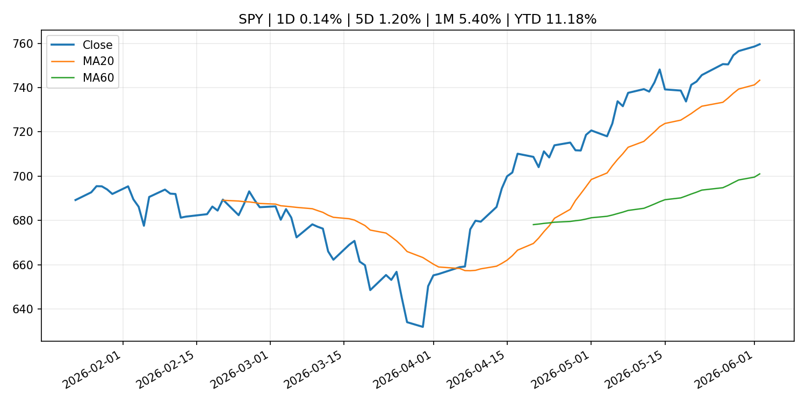
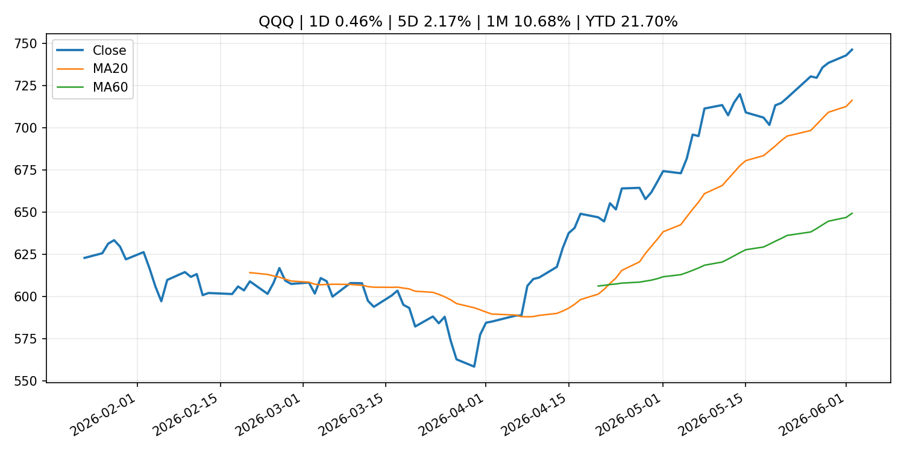
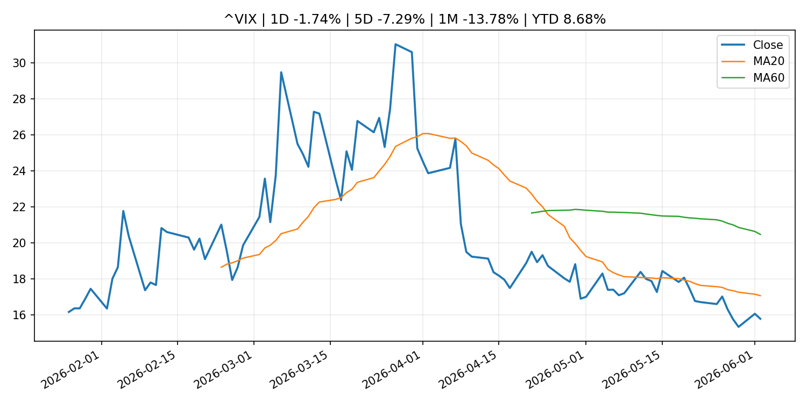
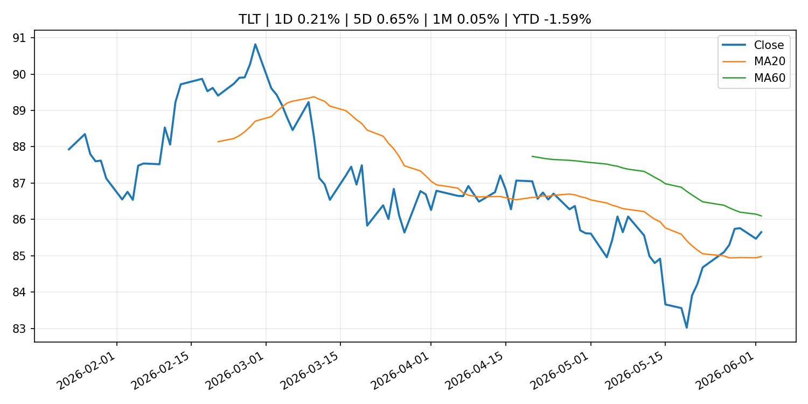
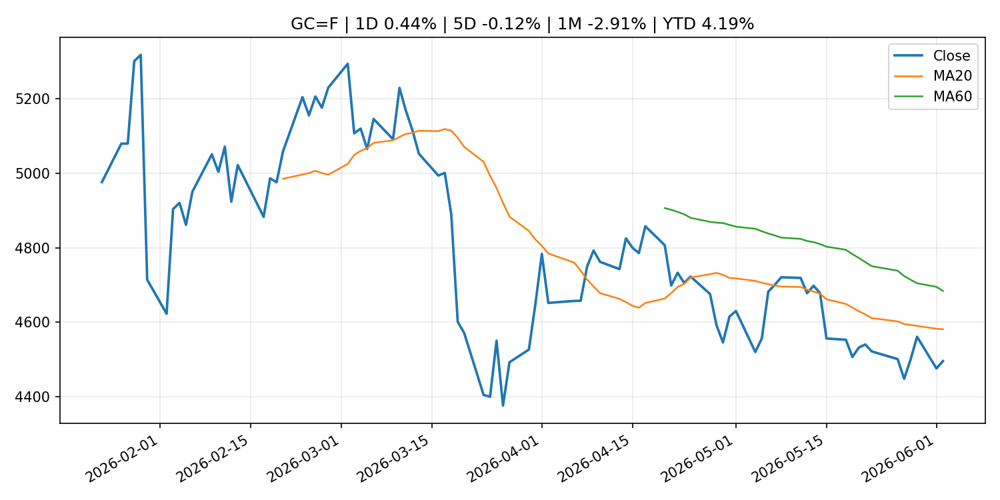
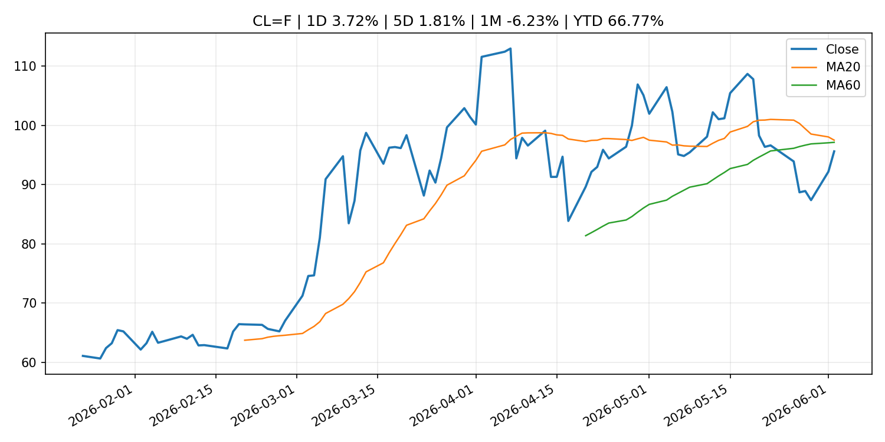
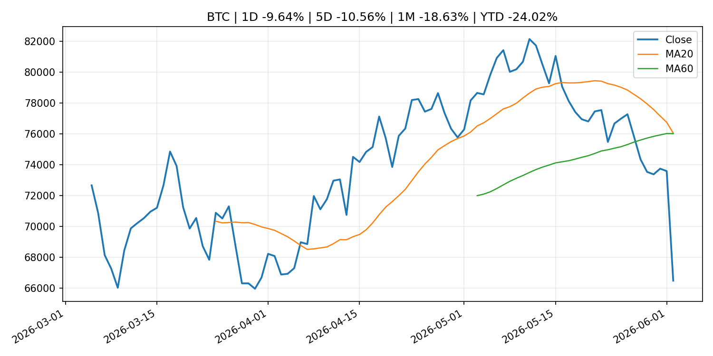
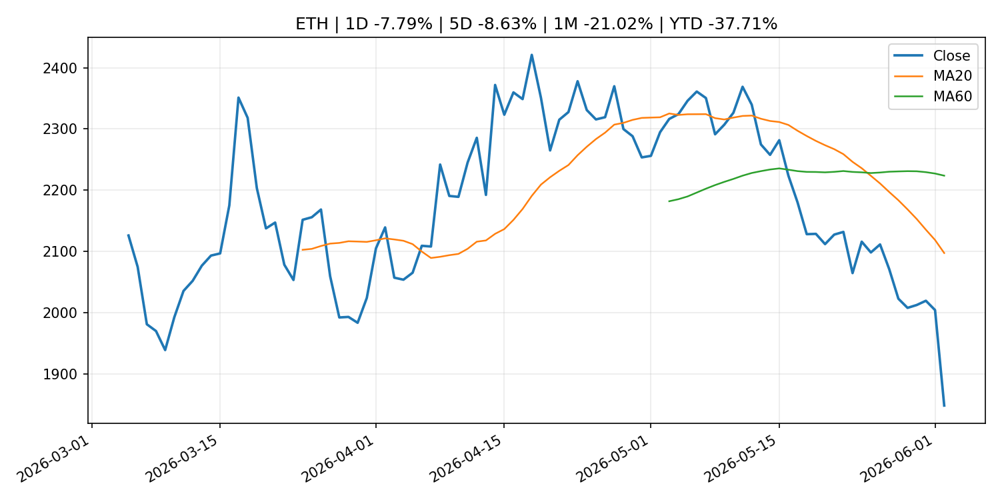
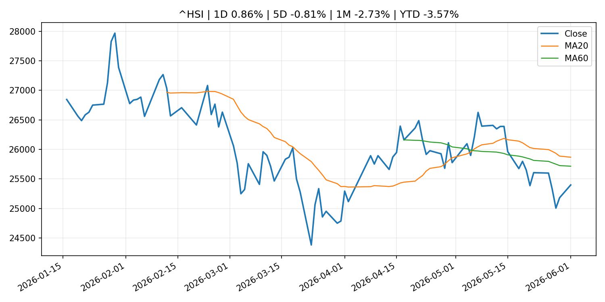

# Global Macro Morning Briefing - 2026-06-03

> Not financial advice / 非投资建议。

## 0. 今日总览
- 市场状态：unknown。市场信号不足，暂不判断明确状态。
- 今日三大主线：
  1. fiscal_policy: U.S. sanctions Iranian crypto exchanges in ongoing war against the country
  2. financial_stability: Symbiotic aims to make tokenized assets easier to cash out with new liquidity network
  3. crypto_market_structure: UK House of Lords committee calls on Bank of England to reconsider proposed stablecoin restrictions
- 一句话结论：今日晨报重点关注：财政和贸易政策会影响增长、通胀、企业利润和跨境资本流。；金融稳定信号可能放大跨资产波动，并影响央行反应函数。。跨资产方面，SPY 1D 0.14%；QQQ 1D 0.46%；^VIX 1D -1.74%；TLT 1D 0.21%；GC=F 1D 0.44%；CL=F 1D 3.72%；BTC 1D -9.64%；ETH 1D -7.79%；市场信号不足，暂不判断明确状态。政策、通胀、利率、美元、美债、能源和加密监管仍是主要观察线索。所有结论仅基于公开数据与短摘要整理，不构成投资建议。

## 1. 隔夜跨资产市场
- 美股：SPY 1D 0.14%，QQQ 1D 0.46%，整体趋势需结合 VIX 和利率确认。
- 美债/美元：TLT 1D 0.21%，美元指数 1D 0.02%，是判断折现率压力的核心线索。
- 黄金/原油：黄金 1D 0.44%，原油 1D 3.72%，用于观察避险、通胀和地缘风险。
- 加密：BTC 1D -9.64%，ETH 1D -7.79%，关注是否独立于纳指走出加密自身行情。
- 港股/A股：恒生 1D 0.86%，沪深300/上证 1D n/a，重点看中国政策预期与人民币线索。
- 风险观察：关注后续数据是否确认当前跨资产信号。

### US_EQUITY

| symbol | latest close | 1D | 5D | 1M | YTD | trend |
|---|---:|---:|---:|---:|---:|---|
| SPY | 759.57 | 0.14% | 1.20% | 5.40% | 11.18% | strong_uptrend |
| QQQ | 746.16 | 0.46% | 2.17% | 10.68% | 21.70% | strong_uptrend |
| DIA | 514.05 | 0.51% | 1.74% | 3.84% | 6.29% | strong_uptrend |
| IWM | 291.66 | 0.93% | 0.40% | 4.43% | 17.24% | strong_uptrend |
| VTI | 374.36 | 0.26% | 1.33% | 5.37% | 11.31% | strong_uptrend |

### US_MACRO_MARKET

| symbol | latest close | 1D | 5D | 1M | YTD | trend |
|---|---:|---:|---:|---:|---:|---|
| ^VIX | 15.77 | -1.74% | -7.29% | -13.78% | 8.68% | strong_downtrend |
| DX-Y.NYB | 99.22 | 0.02% | 0.05% | 1.03% | 0.82% | range_bound |
| TLT | 85.65 | 0.21% | 0.65% | 0.05% | -1.59% | range_bound |
| IEF | 94.24 | 0.07% | -0.04% | -0.53% | -1.92% | range_bound |

### COMMODITIES

| symbol | latest close | 1D | 5D | 1M | YTD | trend |
|---|---:|---:|---:|---:|---:|---|
| GC=F | 4,495.10 | 0.44% | -0.12% | -2.91% | 4.19% | downtrend |
| SI=F | 74.61 | -0.52% | -2.21% | -1.76% | 5.75% | range_bound |
| CL=F | 95.59 | 3.72% | 1.81% | -6.23% | 66.77% | range_bound |
| BZ=F | 97.67 | 2.83% | -1.92% | -9.71% | 60.77% | strong_downtrend |
| NG=F | 3.17 | -0.22% | 9.61% | 14.10% | -12.33% | strong_uptrend |
| HG=F | 6.65 | 1.93% | 4.54% | 12.10% | 17.91% | strong_uptrend |

### HK_MARKET

| symbol | latest close | 1D | 5D | 1M | YTD | trend |
|---|---:|---:|---:|---:|---:|---|
| ^HSI | 25,398.18 | 0.86% | -0.81% | -2.73% | -3.57% | range_bound |
| 0700.HK | 481.60 | 10.46% | 9.70% | 2.95% | -22.70% | range_bound |
| 9988.HK | 130.90 | 6.60% | 2.59% | 3.89% | -12.15% | uptrend |
| 3690.HK | 85.50 | 9.27% | 8.50% | 2.70% | -18.26% | range_bound |
| 1810.HK | 29.62 | 3.13% | -0.47% | 2.07% | -26.46% | downtrend |
| 1211.HK | 96.75 | 6.61% | 3.31% | -5.61% | -2.03% | range_bound |

### CRYPTO

| symbol | latest close | 1D | 5D | 1M | YTD | trend |
|---|---:|---:|---:|---:|---:|---|
| BTC | 66,497.91 | -9.64% | -10.56% | -18.63% | -24.02% | range_bound |
| ETH | 1,847.92 | -7.79% | -8.63% | -21.02% | -37.71% | strong_downtrend |
| SOLANA | 73.55 | -10.56% | -10.63% | -24.43% | -40.93% | strong_downtrend |
| BINANCECOIN | 647.99 | -8.54% | -0.03% | -3.29% | -24.93% | range_bound |
| RIPPLE | 1.20 | -9.53% | -7.76% | -18.46% | -34.54% | strong_downtrend |

## 2. 今日最重要的 10 条新闻
### 1. U.S. sanctions Iranian crypto exchanges in ongoing war against the country
- 来源：CoinDesk
- 时间：2026-06-02T21:49:30+00:00
- 地区：global
- 事件类型：fiscal_policy
- 重要性层级：Tier 1
- 一句话摘要：U.S. sanctions Iranian crypto exchanges in ongoing war against the country
- 为什么重要：财政和贸易政策会影响增长、通胀、企业利润和跨境资本流。
- 可能影响：可能影响利率、汇率、风险资产或大宗商品预期，但当前公开信息不足以判断明确方向。
  - 资产：暂无明确资产映射
  - 方向：unknown
  - 强度：low
  - 原因：公开信息不足以判断方向。
- 原文链接：[https://www.coindesk.com/policy/2026/06/02/u-s-sanctions-iranian-crypto-exchanges-in-ongoing-war-against-country](https://www.coindesk.com/policy/2026/06/02/u-s-sanctions-iranian-crypto-exchanges-in-ongoing-war-against-country)

### 2. Symbiotic aims to make tokenized assets easier to cash out with new liquidity network
- 来源：CoinDesk
- 时间：2026-06-02T12:00:00+00:00
- 地区：global
- 事件类型：financial_stability
- 重要性层级：Tier 1
- 一句话摘要：Symbiotic aims to make tokenized assets easier to cash out with new liquidity network
- 为什么重要：金融稳定信号可能放大跨资产波动，并影响央行反应函数。
- 可能影响：可能影响利率、汇率、风险资产或大宗商品预期，但当前公开信息不足以判断明确方向。
  - 资产：暂无明确资产映射
  - 方向：unknown
  - 强度：low
  - 原因：公开信息不足以判断方向。
- 原文链接：[https://www.coindesk.com/business/2026/06/02/symbiotic-aims-to-make-tokenized-assets-easier-to-cash-out-with-new-liquidity-network](https://www.coindesk.com/business/2026/06/02/symbiotic-aims-to-make-tokenized-assets-easier-to-cash-out-with-new-liquidity-network)

### 3. UK House of Lords committee calls on Bank of England to reconsider proposed stablecoin restrictions
- 来源：CoinDesk
- 时间：2026-06-02T23:01:00+00:00
- 地区：global
- 事件类型：crypto_market_structure
- 重要性层级：Tier 2
- 一句话摘要：UK House of Lords committee calls on Bank of England to reconsider proposed stablecoin restrictions
- 为什么重要：加密市场结构和监管变化会影响 BTC、ETH 及相关股票的风险溢价。
- 可能影响：主要影响 BTC，方向为 mixed，强度 high；加密监管或 ETF 进展会改变 BTC 的资金流和风险溢价。
  - 资产：BTC
    方向：mixed
    强度：high
    原因：加密监管或 ETF 进展会改变 BTC 的资金流和风险溢价。
  - 资产：ETH
    方向：mixed
    强度：high
    原因：监管框架会影响 ETH 产品化和机构参与度。
  - 资产：COIN
    方向：mixed
    强度：medium
    原因：监管清晰度和执法风险会影响交易平台估值。
  - 资产：crypto market
    方向：mixed
    强度：high
    原因：信息影响整个加密市场结构，但方向取决于细节。
- 原文链接：[https://www.coindesk.com/policy/2026/06/02/uk-house-of-lords-committee-calls-on-bank-of-england-to-reconsider-proposed-stablecoin-restrictions](https://www.coindesk.com/policy/2026/06/02/uk-house-of-lords-committee-calls-on-bank-of-england-to-reconsider-proposed-stablecoin-restrictions)

### 4. SEC Publishes Draft Strategic Plan for Public Comment
- 来源：SEC Press Releases
- 时间：2026-06-02T10:30:00-04:00
- 地区：US
- 事件类型：regulation
- 重要性层级：Tier 2
- 一句话摘要：The Securities and Exchange Commission today published a Draft Strategic Plan that focuses on returning the agency to the core mission set by Congress more than 90 years ago: protecting investors; maintaining fair, orderly, and efficient…
- 为什么重要：监管变化会改变行业盈利预期和资产风险溢价。
- 可能影响：主要影响 BTC，方向为 mixed，强度 high；加密监管或 ETF 进展会改变 BTC 的资金流和风险溢价。
  - 资产：BTC
    方向：mixed
    强度：high
    原因：加密监管或 ETF 进展会改变 BTC 的资金流和风险溢价。
  - 资产：ETH
    方向：mixed
    强度：high
    原因：监管框架会影响 ETH 产品化和机构参与度。
  - 资产：COIN
    方向：mixed
    强度：medium
    原因：监管清晰度和执法风险会影响交易平台估值。
  - 资产：crypto market
    方向：mixed
    强度：high
    原因：信息影响整个加密市场结构，但方向取决于细节。
- 原文链接：[https://www.sec.gov/newsroom/press-releases/2026-51-sec-publishes-draft-strategic-plan-public-comment](https://www.sec.gov/newsroom/press-releases/2026-51-sec-publishes-draft-strategic-plan-public-comment)

### 5. Movement pivots to stablecoin payments as the layer-2 boom loses momentum
- 来源：CoinDesk
- 时间：2026-06-02T13:00:00+00:00
- 地区：global
- 事件类型：crypto_market_structure
- 重要性层级：Tier 2
- 一句话摘要：Movement pivots to stablecoin payments as the layer-2 boom loses momentum
- 为什么重要：加密市场结构和监管变化会影响 BTC、ETH 及相关股票的风险溢价。
- 可能影响：主要影响 BTC，方向为 mixed，强度 high；加密监管或 ETF 进展会改变 BTC 的资金流和风险溢价。
  - 资产：BTC
    方向：mixed
    强度：high
    原因：加密监管或 ETF 进展会改变 BTC 的资金流和风险溢价。
  - 资产：ETH
    方向：mixed
    强度：high
    原因：监管框架会影响 ETH 产品化和机构参与度。
  - 资产：COIN
    方向：mixed
    强度：medium
    原因：监管清晰度和执法风险会影响交易平台估值。
  - 资产：crypto market
    方向：mixed
    强度：high
    原因：信息影响整个加密市场结构，但方向取决于细节。
- 原文链接：[https://www.coindesk.com/tech/2026/06/02/movement-pivots-to-stablecoin-payments-as-the-layer-2-boom-loses-momentum](https://www.coindesk.com/tech/2026/06/02/movement-pivots-to-stablecoin-payments-as-the-layer-2-boom-loses-momentum)

### 6. Ripple’s dollar stablecoin expands to Turkey through three local platforms
- 来源：CoinDesk
- 时间：2026-06-02T11:50:35+00:00
- 地区：global
- 事件类型：crypto_market_structure
- 重要性层级：Tier 2
- 一句话摘要：Ripple’s dollar stablecoin expands to Turkey through three local platforms
- 为什么重要：加密市场结构和监管变化会影响 BTC、ETH 及相关股票的风险溢价。
- 可能影响：主要影响 BTC，方向为 mixed，强度 high；加密监管或 ETF 进展会改变 BTC 的资金流和风险溢价。
  - 资产：BTC
    方向：mixed
    强度：high
    原因：加密监管或 ETF 进展会改变 BTC 的资金流和风险溢价。
  - 资产：ETH
    方向：mixed
    强度：high
    原因：监管框架会影响 ETH 产品化和机构参与度。
  - 资产：COIN
    方向：mixed
    强度：medium
    原因：监管清晰度和执法风险会影响交易平台估值。
  - 资产：crypto market
    方向：mixed
    强度：high
    原因：信息影响整个加密市场结构，但方向取决于细节。
- 原文链接：[https://www.coindesk.com/markets/2026/06/02/ripple-s-dollar-stablecoin-expands-to-turkey-through-three-local-platforms](https://www.coindesk.com/markets/2026/06/02/ripple-s-dollar-stablecoin-expands-to-turkey-through-three-local-platforms)

### 7. SEC Announces Four New Members of Investor Advisory Committee
- 来源：SEC Press Releases
- 时间：2026-06-01T12:39:44-04:00
- 地区：US
- 事件类型：regulation
- 重要性层级：Tier 2
- 一句话摘要：The Securities and Exchange Commission today announced four new members to fill vacancies on its Investor Advisory Committee. Three of the four new members will serve four-year terms, while the fourth new member will serve as the…
- 为什么重要：监管变化会改变行业盈利预期和资产风险溢价。
- 可能影响：主要影响 BTC，方向为 mixed，强度 high；加密监管或 ETF 进展会改变 BTC 的资金流和风险溢价。
  - 资产：BTC
    方向：mixed
    强度：high
    原因：加密监管或 ETF 进展会改变 BTC 的资金流和风险溢价。
  - 资产：ETH
    方向：mixed
    强度：high
    原因：监管框架会影响 ETH 产品化和机构参与度。
  - 资产：COIN
    方向：mixed
    强度：medium
    原因：监管清晰度和执法风险会影响交易平台估值。
  - 资产：crypto market
    方向：mixed
    强度：high
    原因：信息影响整个加密市场结构，但方向取决于细节。
- 原文链接：[https://www.sec.gov/newsroom/press-releases/2026-50-sec-announces-four-new-members-investor-advisory-committee](https://www.sec.gov/newsroom/press-releases/2026-50-sec-announces-four-new-members-investor-advisory-committee)

### 8. Palo Alto Networks’ stock is rising as earnings show AI is a friend, not a foe
- 来源：MarketWatch Top Stories
- 时间：2026-06-02T21:21:00+00:00
- 地区：US
- 事件类型：earnings
- 重要性层级：Tier 2
- 一句话摘要：The “latest advancements at the AI frontier have increased the level of urgency around cybersecurity,” Palo Alto Networks’ CEO said.
- 为什么重要：大型科技股盈利和资本开支会影响纳指、半导体和 AI 交易主线。
- 可能影响：可能影响利率、汇率、风险资产或大宗商品预期，但当前公开信息不足以判断明确方向。
  - 资产：暂无明确资产映射
  - 方向：unknown
  - 强度：low
  - 原因：公开信息不足以判断方向。
- 原文链接：[https://www.marketwatch.com/story/palo-alto-networks-stock-is-rising-as-earnings-show-ai-is-a-friend-not-a-foe-0f6b289a?mod=mw_rss_topstories](https://www.marketwatch.com/story/palo-alto-networks-stock-is-rising-as-earnings-show-ai-is-a-friend-not-a-foe-0f6b289a?mod=mw_rss_topstories)

### 9. Rubio odds for GOP 2028 nominee close to overtaking Vance on Kalshi
- 来源：CNBC Economy
- 时间：2026-06-01T15:03:17+00:00
- 地区：US
- 事件类型：central_bank_speech
- 重要性层级：Tier 2
- 一句话摘要：Vice President Vance has seen his odds slip since the start of the year, as the secretary of State's chances have been buoyed by international conflicts.
- 为什么重要：央行官员表态可能影响市场对下一次会议的定价。
- 可能影响：可能影响利率、汇率、风险资产或大宗商品预期，但当前公开信息不足以判断明确方向。
  - 资产：暂无明确资产映射
  - 方向：unknown
  - 强度：low
  - 原因：公开信息不足以判断方向。
- 原文链接：[https://www.cnbc.com/2026/06/01/rubio-odds-for-gop-2028-nominee-close-to-overtaking-vance-on-kalshi.html](https://www.cnbc.com/2026/06/01/rubio-odds-for-gop-2028-nominee-close-to-overtaking-vance-on-kalshi.html)

### 10. Bitcoin ETF outflows are noise as Wall Street doubles down on crypto, says analyst
- 来源：CoinDesk
- 时间：2026-06-02T12:14:58+00:00
- 地区：global
- 事件类型：other
- 重要性层级：Tier 3
- 一句话摘要：Bitcoin ETF outflows are noise as Wall Street doubles down on crypto, says analyst
- 为什么重要：这条信息暂未匹配到重大宏观、政策或市场事件，更适合作为背景跟踪。
- 可能影响：主要影响 BTC，方向为 mixed，强度 high；加密监管或 ETF 进展会改变 BTC 的资金流和风险溢价。
  - 资产：BTC
    方向：mixed
    强度：high
    原因：加密监管或 ETF 进展会改变 BTC 的资金流和风险溢价。
  - 资产：ETH
    方向：mixed
    强度：high
    原因：监管框架会影响 ETH 产品化和机构参与度。
  - 资产：COIN
    方向：mixed
    强度：medium
    原因：监管清晰度和执法风险会影响交易平台估值。
  - 资产：crypto market
    方向：mixed
    强度：high
    原因：信息影响整个加密市场结构，但方向取决于细节。
- 原文链接：[https://www.coindesk.com/coindesk-news/2026/06/02/bitcoin-etf-outflows-are-noise-as-wall-street-doubles-down-on-crypto-says-analyst](https://www.coindesk.com/coindesk-news/2026/06/02/bitcoin-etf-outflows-are-noise-as-wall-street-doubles-down-on-crypto-says-analyst)

## 3. 政策与央行观察
### 1. U.S. sanctions Iranian crypto exchanges in ongoing war against the country
- 来源：CoinDesk
- 时间：2026-06-02T21:49:30+00:00
- 地区：global
- 事件类型：fiscal_policy
- 重要性层级：Tier 1
- 一句话摘要：U.S. sanctions Iranian crypto exchanges in ongoing war against the country
- 为什么重要：财政和贸易政策会影响增长、通胀、企业利润和跨境资本流。
- 可能影响：可能影响利率、汇率、风险资产或大宗商品预期，但当前公开信息不足以判断明确方向。
  - 资产：暂无明确资产映射
  - 方向：unknown
  - 强度：low
  - 原因：公开信息不足以判断方向。
- 原文链接：[https://www.coindesk.com/policy/2026/06/02/u-s-sanctions-iranian-crypto-exchanges-in-ongoing-war-against-country](https://www.coindesk.com/policy/2026/06/02/u-s-sanctions-iranian-crypto-exchanges-in-ongoing-war-against-country)

### 2. Symbiotic aims to make tokenized assets easier to cash out with new liquidity network
- 来源：CoinDesk
- 时间：2026-06-02T12:00:00+00:00
- 地区：global
- 事件类型：financial_stability
- 重要性层级：Tier 1
- 一句话摘要：Symbiotic aims to make tokenized assets easier to cash out with new liquidity network
- 为什么重要：金融稳定信号可能放大跨资产波动，并影响央行反应函数。
- 可能影响：可能影响利率、汇率、风险资产或大宗商品预期，但当前公开信息不足以判断明确方向。
  - 资产：暂无明确资产映射
  - 方向：unknown
  - 强度：low
  - 原因：公开信息不足以判断方向。
- 原文链接：[https://www.coindesk.com/business/2026/06/02/symbiotic-aims-to-make-tokenized-assets-easier-to-cash-out-with-new-liquidity-network](https://www.coindesk.com/business/2026/06/02/symbiotic-aims-to-make-tokenized-assets-easier-to-cash-out-with-new-liquidity-network)

### 3. UK House of Lords committee calls on Bank of England to reconsider proposed stablecoin restrictions
- 来源：CoinDesk
- 时间：2026-06-02T23:01:00+00:00
- 地区：global
- 事件类型：crypto_market_structure
- 重要性层级：Tier 2
- 一句话摘要：UK House of Lords committee calls on Bank of England to reconsider proposed stablecoin restrictions
- 为什么重要：加密市场结构和监管变化会影响 BTC、ETH 及相关股票的风险溢价。
- 可能影响：主要影响 BTC，方向为 mixed，强度 high；加密监管或 ETF 进展会改变 BTC 的资金流和风险溢价。
  - 资产：BTC
    方向：mixed
    强度：high
    原因：加密监管或 ETF 进展会改变 BTC 的资金流和风险溢价。
  - 资产：ETH
    方向：mixed
    强度：high
    原因：监管框架会影响 ETH 产品化和机构参与度。
  - 资产：COIN
    方向：mixed
    强度：medium
    原因：监管清晰度和执法风险会影响交易平台估值。
  - 资产：crypto market
    方向：mixed
    强度：high
    原因：信息影响整个加密市场结构，但方向取决于细节。
- 原文链接：[https://www.coindesk.com/policy/2026/06/02/uk-house-of-lords-committee-calls-on-bank-of-england-to-reconsider-proposed-stablecoin-restrictions](https://www.coindesk.com/policy/2026/06/02/uk-house-of-lords-committee-calls-on-bank-of-england-to-reconsider-proposed-stablecoin-restrictions)

### 4. SEC Publishes Draft Strategic Plan for Public Comment
- 来源：SEC Press Releases
- 时间：2026-06-02T10:30:00-04:00
- 地区：US
- 事件类型：regulation
- 重要性层级：Tier 2
- 一句话摘要：The Securities and Exchange Commission today published a Draft Strategic Plan that focuses on returning the agency to the core mission set by Congress more than 90 years ago: protecting investors; maintaining fair, orderly, and efficient…
- 为什么重要：监管变化会改变行业盈利预期和资产风险溢价。
- 可能影响：主要影响 BTC，方向为 mixed，强度 high；加密监管或 ETF 进展会改变 BTC 的资金流和风险溢价。
  - 资产：BTC
    方向：mixed
    强度：high
    原因：加密监管或 ETF 进展会改变 BTC 的资金流和风险溢价。
  - 资产：ETH
    方向：mixed
    强度：high
    原因：监管框架会影响 ETH 产品化和机构参与度。
  - 资产：COIN
    方向：mixed
    强度：medium
    原因：监管清晰度和执法风险会影响交易平台估值。
  - 资产：crypto market
    方向：mixed
    强度：high
    原因：信息影响整个加密市场结构，但方向取决于细节。
- 原文链接：[https://www.sec.gov/newsroom/press-releases/2026-51-sec-publishes-draft-strategic-plan-public-comment](https://www.sec.gov/newsroom/press-releases/2026-51-sec-publishes-draft-strategic-plan-public-comment)

### 5. Movement pivots to stablecoin payments as the layer-2 boom loses momentum
- 来源：CoinDesk
- 时间：2026-06-02T13:00:00+00:00
- 地区：global
- 事件类型：crypto_market_structure
- 重要性层级：Tier 2
- 一句话摘要：Movement pivots to stablecoin payments as the layer-2 boom loses momentum
- 为什么重要：加密市场结构和监管变化会影响 BTC、ETH 及相关股票的风险溢价。
- 可能影响：主要影响 BTC，方向为 mixed，强度 high；加密监管或 ETF 进展会改变 BTC 的资金流和风险溢价。
  - 资产：BTC
    方向：mixed
    强度：high
    原因：加密监管或 ETF 进展会改变 BTC 的资金流和风险溢价。
  - 资产：ETH
    方向：mixed
    强度：high
    原因：监管框架会影响 ETH 产品化和机构参与度。
  - 资产：COIN
    方向：mixed
    强度：medium
    原因：监管清晰度和执法风险会影响交易平台估值。
  - 资产：crypto market
    方向：mixed
    强度：high
    原因：信息影响整个加密市场结构，但方向取决于细节。
- 原文链接：[https://www.coindesk.com/tech/2026/06/02/movement-pivots-to-stablecoin-payments-as-the-layer-2-boom-loses-momentum](https://www.coindesk.com/tech/2026/06/02/movement-pivots-to-stablecoin-payments-as-the-layer-2-boom-loses-momentum)

### 6. Ripple’s dollar stablecoin expands to Turkey through three local platforms
- 来源：CoinDesk
- 时间：2026-06-02T11:50:35+00:00
- 地区：global
- 事件类型：crypto_market_structure
- 重要性层级：Tier 2
- 一句话摘要：Ripple’s dollar stablecoin expands to Turkey through three local platforms
- 为什么重要：加密市场结构和监管变化会影响 BTC、ETH 及相关股票的风险溢价。
- 可能影响：主要影响 BTC，方向为 mixed，强度 high；加密监管或 ETF 进展会改变 BTC 的资金流和风险溢价。
  - 资产：BTC
    方向：mixed
    强度：high
    原因：加密监管或 ETF 进展会改变 BTC 的资金流和风险溢价。
  - 资产：ETH
    方向：mixed
    强度：high
    原因：监管框架会影响 ETH 产品化和机构参与度。
  - 资产：COIN
    方向：mixed
    强度：medium
    原因：监管清晰度和执法风险会影响交易平台估值。
  - 资产：crypto market
    方向：mixed
    强度：high
    原因：信息影响整个加密市场结构，但方向取决于细节。
- 原文链接：[https://www.coindesk.com/markets/2026/06/02/ripple-s-dollar-stablecoin-expands-to-turkey-through-three-local-platforms](https://www.coindesk.com/markets/2026/06/02/ripple-s-dollar-stablecoin-expands-to-turkey-through-three-local-platforms)

### 7. SEC Announces Four New Members of Investor Advisory Committee
- 来源：SEC Press Releases
- 时间：2026-06-01T12:39:44-04:00
- 地区：US
- 事件类型：regulation
- 重要性层级：Tier 2
- 一句话摘要：The Securities and Exchange Commission today announced four new members to fill vacancies on its Investor Advisory Committee. Three of the four new members will serve four-year terms, while the fourth new member will serve as the…
- 为什么重要：监管变化会改变行业盈利预期和资产风险溢价。
- 可能影响：主要影响 BTC，方向为 mixed，强度 high；加密监管或 ETF 进展会改变 BTC 的资金流和风险溢价。
  - 资产：BTC
    方向：mixed
    强度：high
    原因：加密监管或 ETF 进展会改变 BTC 的资金流和风险溢价。
  - 资产：ETH
    方向：mixed
    强度：high
    原因：监管框架会影响 ETH 产品化和机构参与度。
  - 资产：COIN
    方向：mixed
    强度：medium
    原因：监管清晰度和执法风险会影响交易平台估值。
  - 资产：crypto market
    方向：mixed
    强度：high
    原因：信息影响整个加密市场结构，但方向取决于细节。
- 原文链接：[https://www.sec.gov/newsroom/press-releases/2026-50-sec-announces-four-new-members-investor-advisory-committee](https://www.sec.gov/newsroom/press-releases/2026-50-sec-announces-four-new-members-investor-advisory-committee)

### 8. Rubio odds for GOP 2028 nominee close to overtaking Vance on Kalshi
- 来源：CNBC Economy
- 时间：2026-06-01T15:03:17+00:00
- 地区：US
- 事件类型：central_bank_speech
- 重要性层级：Tier 2
- 一句话摘要：Vice President Vance has seen his odds slip since the start of the year, as the secretary of State's chances have been buoyed by international conflicts.
- 为什么重要：央行官员表态可能影响市场对下一次会议的定价。
- 可能影响：可能影响利率、汇率、风险资产或大宗商品预期，但当前公开信息不足以判断明确方向。
  - 资产：暂无明确资产映射
  - 方向：unknown
  - 强度：low
  - 原因：公开信息不足以判断方向。
- 原文链接：[https://www.cnbc.com/2026/06/01/rubio-odds-for-gop-2028-nominee-close-to-overtaking-vance-on-kalshi.html](https://www.cnbc.com/2026/06/01/rubio-odds-for-gop-2028-nominee-close-to-overtaking-vance-on-kalshi.html)

## 4. 市场异动与图表
- QQQ 上涨 0.46%
- Oil 上涨 3.72%
- BTC 下跌 -9.64%
- ETH 下跌 -7.79%

### SPY

### QQQ

### ^VIX

### TLT

### GC=F

### CL=F

### BTC

### ETH

### ^HSI

## 5. 华尔街与机构公开观点
- 暂无可靠公开观点。

## 6. 今日重点关注
- 经济数据：经济数据：暂无可靠公开日历数据；如配置经济日历源后可自动填充。
- 央行讲话：央行讲话：暂无可靠公开日历数据；重点跟踪 Fed、ECB、BoJ、PBOC 官网 RSS。
- 财报：财报：暂无可靠数据。
- 政策事件：政策事件：暂无可靠数据。
- 风险提醒：风险提醒：关注数据源失败项、突发地缘风险、利率和美元的二阶反应。

## 7. 英文金融表达与宏观概念
- **risk-off**：避险模式，资金偏向美元、国债、黄金等防御资产。 例句：A geopolitical shock can push markets into risk-off mode.
- **market structure**：市场结构，指交易、托管、清算、ETF、监管等制度安排。 例句：Crypto market structure rules can affect institutional participation.
- **inflation expectations**：通胀预期，指家庭、企业或市场对未来通胀的预估。 例句：Inflation expectations can shape wage bargaining and bond yields.
- **real yield**：实际收益率，名义利率扣除通胀预期后的收益率。 例句：Gold often reacts more to real yields than nominal yields.
- **terminal rate**：终端利率，市场预期本轮加息周期的最高政策利率。 例句：A higher terminal rate can pressure growth stocks.
- **soft landing**：软着陆，指通胀回落而经济避免明显衰退。 例句：Markets often rally when data support a soft landing.

## 8. 背景材料
- [Bitcoin’s compute power dwarfs top 100 supercomputers by 600k times, says Bittensor co-founder](https://www.coindesk.com/tech/2026/06/02/bitcoin-s-compute-power-dwarfs-top-100-supercomputers-by-600-000x-says-bittensor-co-founder)（CoinDesk，other）：Bitcoin’s compute power dwarfs top 100 supercomputers by 600k times, says Bittensor co-founder
- [Victoria’s Secret’s stock just had its best day ever. It came down to better bras.](https://www.marketwatch.com/story/victorias-secrets-stock-is-on-track-for-its-best-day-ever-it-came-down-to-better-bras-fb82f017?mod=mw_rss_topstories)（MarketWatch Top Stories，other）：Lingerie retailer’s shares were up 47% on Tuesday.
- [Goldman Sachs CEO David Solomon says markets are in 'greed' mode as AI companies seek billions](https://www.cnbc.com/2026/06/02/goldman-ceo-david-solomon-greed-mode-ai-firms-ipos.html)（CNBC Economy，other）：Goldman Sachs CEO David Solomon's comments come as investors prepare for what will be one of the busiest periods for equity issuance in years.
- [Bitcoin set for 'choppy summer' as capital chases high-flying AI stocks, K33 says](https://www.coindesk.com/markets/2026/06/02/bitcoin-set-for-choppy-summer-as-capital-chases-high-flying-ai-stocks-k33-says)（CoinDesk，other）：Bitcoin set for 'choppy summer' as capital chases high-flying AI stocks, K33 says
- [Bitcoin faces an 'identity crisis' and DeFi devs need to stop acting like tech bros](https://www.coindesk.com/business/2026/06/02/bitcoin-faces-identity-crisis-as-defi-quietly-builds-its-breakthrough-point)（CoinDesk，other）：Bitcoin faces an 'identity crisis' and DeFi devs need to stop acting like tech bros
- [Agencies remove additional references to reputation risk](https://www.federalreserve.gov/newsevents/pressreleases/bcreg20260602a.htm)（Federal Reserve Press Releases，other）：Agencies remove additional references to reputation risk
- [Boris Vujčić: A European perspective on currency and convergence](https://www.ecb.europa.eu//press/key/date/2026/html/ecb.sp260602~101b71c594.en.html)（ECB Press Releases，other）：Boris Vujčić: A European perspective on currency and convergence
- [How to better understand bitcoin’s perpetual identity crisis](https://www.coindesk.com/opinion/2026/06/02/how-to-better-understand-bitcoin-s-perpetual-identity-crisis)（CoinDesk，other）：How to better understand bitcoin’s perpetual identity crisis
- [Franklin Templeton teams up with MoonPay to let big investors swap stablecoins for yields 24/7](https://www.coindesk.com/business/2026/06/02/franklin-templeton-teams-up-with-moonpay-to-let-big-investors-swap-stablecoins-for-yields-24-7)（CoinDesk，other）：Franklin Templeton teams up with MoonPay to let big investors swap stablecoins for yields 24/7
- [Strategy's bitcoin sale may mark start of ether outperformance, StanChart's Kendrick says](https://www.coindesk.com/markets/2026/06/02/strategy-s-bitcoin-sale-may-mark-start-of-ether-outperformance-stanchart-s-kendrick-says)（CoinDesk，other）：Strategy's bitcoin sale may mark start of ether outperformance, StanChart's Kendrick says
- [Live markets: bitcoin loses $67,000 level in Tuesday plunge, putting February's lows back in play](https://www.coindesk.com/markets/2026/06/02/live-markets-bitcoin-s-plunge-continues-putting-february-usd60-000-low-back-in-play)（CoinDesk，other）：Live markets: bitcoin loses $67,000 level in Tuesday plunge, putting February's lows back in play
- [Strive added 2,500 bitcoin last week to reach 19,000 BTC as Strategy sold](https://www.coindesk.com/markets/2026/06/02/strive-adds-2-500-bitcoin-to-hit-19-000-btc-just-a-day-after-strategy-turns-seller)（CoinDesk，other）：Strive added 2,500 bitcoin last week to reach 19,000 BTC as Strategy sold
- [Bitcoin ETF outflows are noise as Wall Street doubles down on crypto, says analyst](https://www.coindesk.com/coindesk-news/2026/06/02/bitcoin-etf-outflows-are-noise-as-wall-street-doubles-down-on-crypto-says-analyst)（CoinDesk，other）：Bitcoin ETF outflows are noise as Wall Street doubles down on crypto, says analyst
- [Bitcoin derivatives markets flashing warning signs as price plunges below $70,000](https://www.coindesk.com/markets/2026/06/02/bitcoin-derivatives-markets-flashing-warning-signs-as-price-plunges-below-usd70-000)（CoinDesk，other）：Bitcoin derivatives markets flashing warning signs as price plunges below $70,000
- [Tom Lee calls Strategy's bitcoin sale classic 'bottom behavior'](https://www.coindesk.com/markets/2026/06/02/tom-lee-dismisses-bitcoin-fears-over-michael-saylor-first-bitcoin-sale-and-etf-outflows)（CoinDesk，other）：Tom Lee calls Strategy's bitcoin sale classic 'bottom behavior'
- [International role of the euro increased moderately in 2025](https://www.ecb.europa.eu//press/pr/date/2026/html/ecb.pr260602~f941e87516.en.html)（ECB Press Releases，other）：International role of the euro increased moderately in 2025
- [Japanese Government Bonds Held by the Bank of Japan](http://www.boj.or.jp/en/statistics/boj/other/mei/release/2026/mei260529.xlsx)（Bank of Japan Announcements，other）：Japanese Government Bonds Held by the Bank of Japan
- [Collateral Accepted by the Bank of Japan (End of May)](http://www.boj.or.jp/en/statistics/boj/other/col/col2605.xlsx)（Bank of Japan Announcements，other）：Collateral Accepted by the Bank of Japan (End of May)
- [Minutes of the Twenty-fourth Round of the "Bond Market Group" Meetings (May 21-22, 2026)](http://www.boj.or.jp/en/paym/bond/mbond_list/mbond260602.pdf)（Bank of Japan Announcements，other）：Minutes of the Twenty-fourth Round of the "Bond Market Group" Meetings (May 21-22, 2026)
- [(Research Paper) Planned Revisions of the Tankan -- Introduction of a Wage Survey --](http://www.boj.or.jp/en/research/brp/ron_2026/ron260602a.htm)（Bank of Japan Announcements，research_publication）：(Research Paper) Planned Revisions of the Tankan -- Introduction of a Wage Survey --

## 9. 数据源、失败项与免责声明
- 采集时间：2026-06-02T23:45:15
- 数据源：公开 RSS、Yahoo Finance、CoinGecko、AKShare、FRED、SEC data.sec.gov，以及用户自有 inputs/reports 文件。
- 合规说明：不绕过 WSJ、Bloomberg、FT、Reuters 等付费墙；对付费媒体只使用公开 RSS 标题、摘要、链接和发布时间。
- 免责声明：Not financial advice / 非投资建议。本项目仅供个人学习、研究和信息整理，不构成投资建议、交易建议或任何收益承诺。
- 失败或跳过的数据源：
  - crypto data failed coin=dogecoin
  - China market data failed symbol=上证指数: empty dataframe
  - China market data failed symbol=深证成指: empty dataframe
  - China market data failed symbol=创业板指: empty dataframe
  - China market data failed symbol=沪深300: empty dataframe
  - China market data failed symbol=中证500: empty dataframe
  - China market data failed symbol=科创50: empty dataframe
  - FRED_API_KEY not set; skipping FRED macro series
  - SEC failed cik=0000320193
  - SEC failed cik=0000789019
  - SEC failed cik=0001045810
  - SEC failed cik=0001318605
  - SEC failed cik=0001577552
