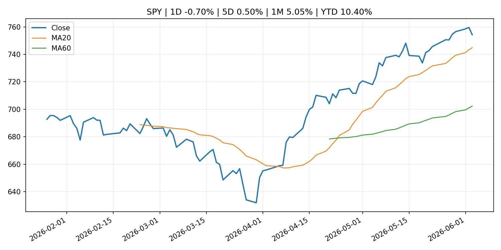
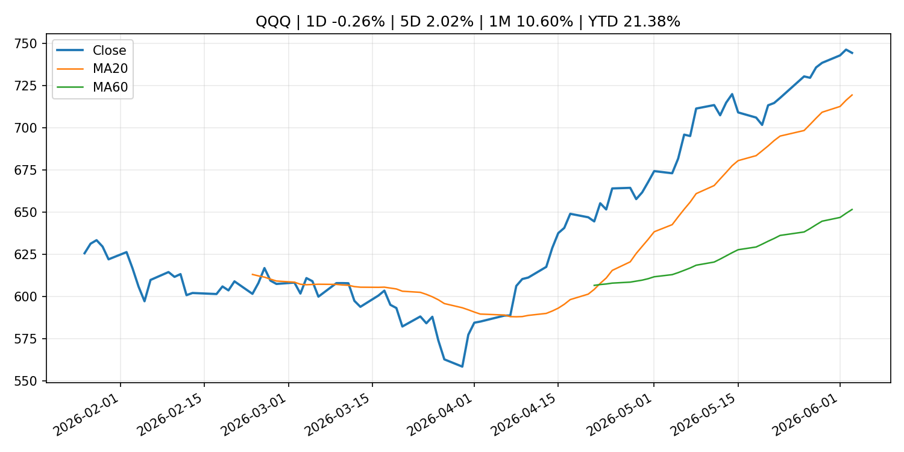
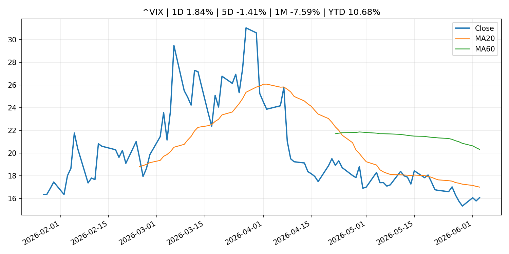
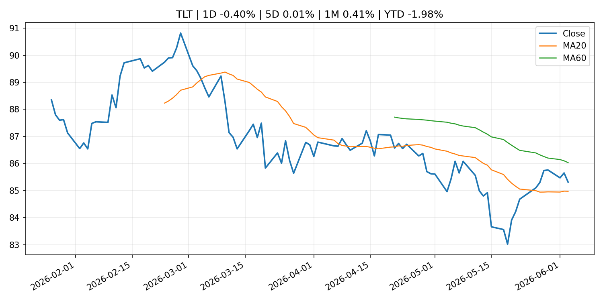
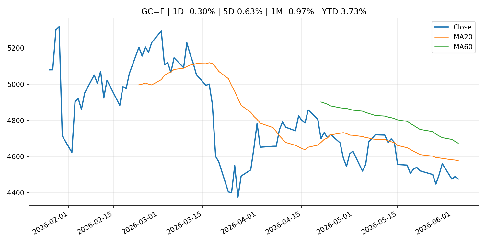
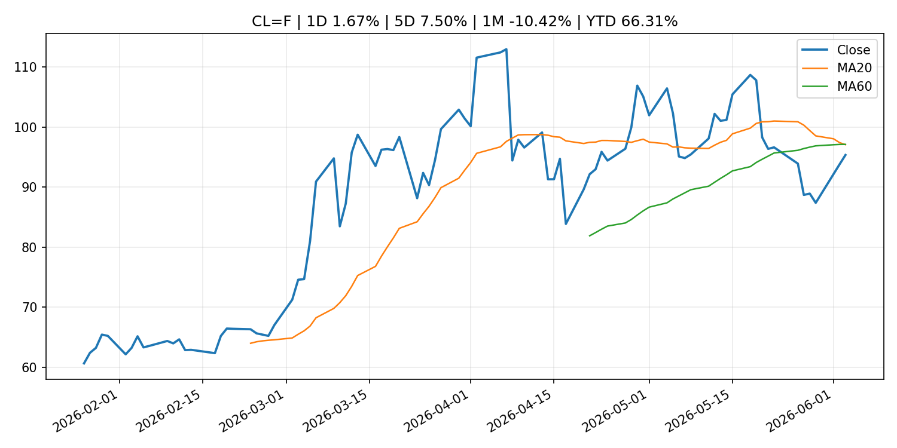
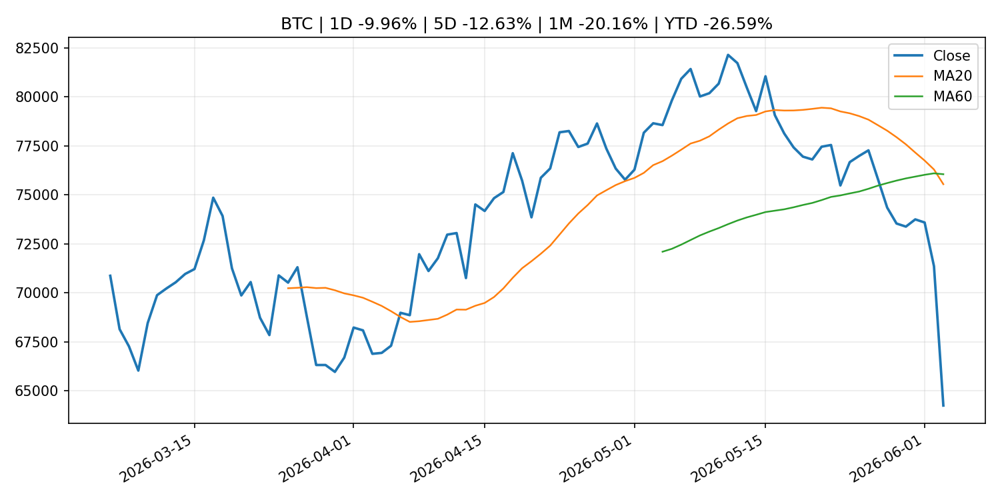
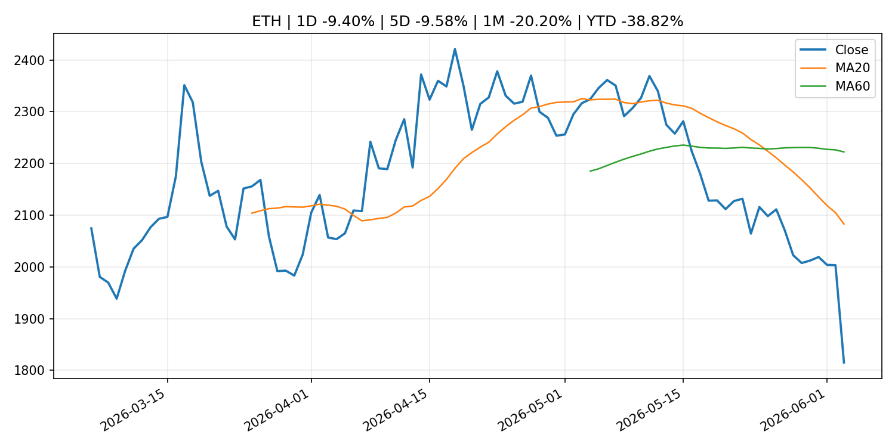
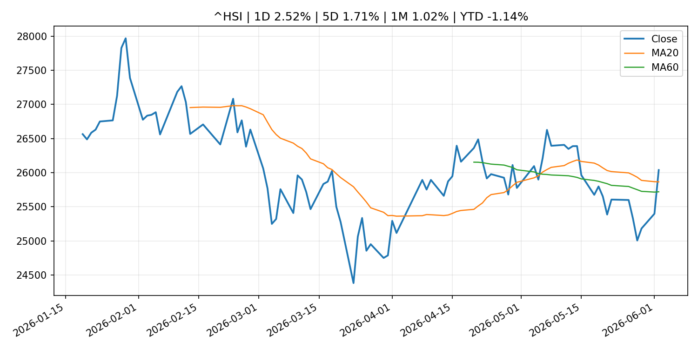

# Global Macro Morning Briefing - 2026-06-04

> Not financial advice / 非投资建议。

## 0. 今日总览
- 市场状态：unknown。市场信号不足，暂不判断明确状态。
- 今日三大主线：
  1. financial_stability: SpaceX targets record $75 billion IPO as bitcoin treasury and liquidity risks draw focus
  2. financial_stability: Bitwise model puts bitcoin fair value at $224,000 as sovereign-default hedge
  3. crypto_market_structure: Payment giants Stripe, Visa, Mastercard said to be among backers of soon-to-debut stablecoin platform
- 一句话结论：今日晨报重点关注：金融稳定信号可能放大跨资产波动，并影响央行反应函数。；金融稳定信号可能放大跨资产波动，并影响央行反应函数。。跨资产方面，SPY 1D -0.70%；QQQ 1D -0.26%；^VIX 1D 1.84%；TLT 1D -0.40%；GC=F 1D -0.30%；CL=F 1D 1.67%；BTC 1D -9.96%；ETH 1D -9.40%；市场信号不足，暂不判断明确状态。政策、通胀、利率、美元、美债、能源和加密监管仍是主要观察线索。所有结论仅基于公开数据与短摘要整理，不构成投资建议。

## 1. 隔夜跨资产市场
- 美股：SPY 1D -0.70%，QQQ 1D -0.26%，整体趋势需结合 VIX 和利率确认。
- 美债/美元：TLT 1D -0.40%，美元指数 1D 0.33%，是判断折现率压力的核心线索。
- 黄金/原油：黄金 1D -0.30%，原油 1D 1.67%，用于观察避险、通胀和地缘风险。
- 加密：BTC 1D -9.96%，ETH 1D -9.40%，关注是否独立于纳指走出加密自身行情。
- 港股/A股：恒生 1D 2.52%，沪深300/上证 1D n/a，重点看中国政策预期与人民币线索。
- 风险观察：关注后续数据是否确认当前跨资产信号。

### US_EQUITY

| symbol | latest close | 1D | 5D | 1M | YTD | trend |
|---|---:|---:|---:|---:|---:|---|
| SPY | 754.24 | -0.70% | 0.50% | 5.05% | 10.40% | strong_uptrend |
| QQQ | 744.21 | -0.26% | 2.02% | 10.60% | 21.38% | strong_uptrend |
| DIA | 508.26 | -1.13% | 0.27% | 3.82% | 5.09% | strong_uptrend |
| IWM | 287.67 | -1.37% | -0.93% | 3.52% | 15.63% | strong_uptrend |
| VTI | 371.65 | -0.72% | 0.62% | 4.99% | 10.51% | strong_uptrend |

### US_MACRO_MARKET

| symbol | latest close | 1D | 5D | 1M | YTD | trend |
|---|---:|---:|---:|---:|---:|---|
| ^VIX | 16.06 | 1.84% | -1.41% | -7.59% | 10.68% | strong_downtrend |
| DX-Y.NYB | 99.55 | 0.33% | 0.34% | 1.10% | 1.15% | range_bound |
| TLT | 85.31 | -0.40% | 0.01% | 0.41% | -1.98% | range_bound |
| IEF | 94.00 | -0.25% | -0.34% | -0.41% | -2.16% | downtrend |

### COMMODITIES

| symbol | latest close | 1D | 5D | 1M | YTD | trend |
|---|---:|---:|---:|---:|---:|---|
| GC=F | 4,475.50 | -0.30% | 0.63% | -0.97% | 3.73% | downtrend |
| SI=F | 73.34 | -2.62% | -1.69% | 0.37% | 3.95% | range_bound |
| CL=F | 95.33 | 1.67% | 7.50% | -10.42% | 66.31% | strong_downtrend |
| BZ=F | 97.19 | 1.24% | 3.08% | -15.07% | 59.98% | strong_downtrend |
| NG=F | 3.24 | 2.21% | 6.48% | 12.91% | -10.53% | strong_uptrend |
| HG=F | 6.49 | -2.39% | 2.94% | 12.00% | 15.08% | uptrend |

### HK_MARKET

| symbol | latest close | 1D | 5D | 1M | YTD | trend |
|---|---:|---:|---:|---:|---:|---|
| ^HSI | 26,038.32 | 2.52% | 1.71% | 1.02% | -1.14% | uptrend |
| 0700.HK | 466.40 | -3.16% | 7.37% | -1.40% | -25.14% | range_bound |
| 9988.HK | 126.60 | -3.28% | 1.85% | -3.87% | -15.03% | range_bound |
| 3690.HK | 80.40 | -5.96% | 3.47% | -4.80% | -23.14% | strong_downtrend |
| 1810.HK | 28.58 | -3.51% | 0.63% | -7.75% | -29.05% | strong_downtrend |
| 1211.HK | 93.25 | -3.62% | 2.81% | -9.47% | -5.57% | strong_downtrend |

### CRYPTO

| symbol | latest close | 1D | 5D | 1M | YTD | trend |
|---|---:|---:|---:|---:|---:|---|
| BTC | 64,252.18 | -9.96% | -12.63% | -20.16% | -26.59% | strong_downtrend |
| ETH | 1,815.14 | -9.40% | -9.58% | -20.20% | -38.82% | strong_downtrend |
| SOLANA | 71.59 | -11.76% | -12.62% | -24.09% | -42.51% | strong_downtrend |
| BINANCECOIN | 621.62 | -10.23% | -2.52% | -6.49% | -27.98% | range_bound |
| RIPPLE | 1.20 | -7.20% | -8.49% | -16.34% | -34.68% | strong_downtrend |

## 2. 今日最重要的 10 条新闻
### 1. SpaceX targets record $75 billion IPO as bitcoin treasury and liquidity risks draw focus
- 来源：CoinDesk
- 时间：2026-06-03T22:31:12+00:00
- 地区：global
- 事件类型：financial_stability
- 重要性层级：Tier 1
- 一句话摘要：SpaceX targets record $75 billion IPO as bitcoin treasury and liquidity risks draw focus
- 为什么重要：金融稳定信号可能放大跨资产波动，并影响央行反应函数。
- 可能影响：可能影响利率、汇率、风险资产或大宗商品预期，但当前公开信息不足以判断明确方向。
  - 资产：暂无明确资产映射
  - 方向：unknown
  - 强度：low
  - 原因：公开信息不足以判断方向。
- 原文链接：[https://www.coindesk.com/markets/2026/06/03/spacex-targets-record-usd75-billion-ipo-as-bitcoin-treasury-and-liquidity-risks-draw-focus](https://www.coindesk.com/markets/2026/06/03/spacex-targets-record-usd75-billion-ipo-as-bitcoin-treasury-and-liquidity-risks-draw-focus)

### 2. Bitwise model puts bitcoin fair value at $224,000 as sovereign-default hedge
- 来源：CoinDesk
- 时间：2026-06-03T13:26:02+00:00
- 地区：global
- 事件类型：financial_stability
- 重要性层级：Tier 1
- 一句话摘要：Bitwise model puts bitcoin fair value at $224,000 as sovereign-default hedge
- 为什么重要：金融稳定信号可能放大跨资产波动，并影响央行反应函数。
- 可能影响：可能影响利率、汇率、风险资产或大宗商品预期，但当前公开信息不足以判断明确方向。
  - 资产：暂无明确资产映射
  - 方向：unknown
  - 强度：low
  - 原因：公开信息不足以判断方向。
- 原文链接：[https://www.coindesk.com/markets/2026/06/03/bitwise-model-puts-bitcoin-fair-value-at-usd224-000-as-sovereign-default-hedge](https://www.coindesk.com/markets/2026/06/03/bitwise-model-puts-bitcoin-fair-value-at-usd224-000-as-sovereign-default-hedge)

### 3. Payment giants Stripe, Visa, Mastercard said to be among backers of soon-to-debut stablecoin platform
- 来源：CoinDesk
- 时间：2026-06-03T11:47:36+00:00
- 地区：global
- 事件类型：crypto_market_structure
- 重要性层级：Tier 2
- 一句话摘要：Payment giants Stripe, Visa, Mastercard said to be among backers of soon-to-debut stablecoin platform
- 为什么重要：加密市场结构和监管变化会影响 BTC、ETH 及相关股票的风险溢价。
- 可能影响：主要影响 BTC，方向为 mixed，强度 high；加密监管或 ETF 进展会改变 BTC 的资金流和风险溢价。
  - 资产：BTC
    方向：mixed
    强度：high
    原因：加密监管或 ETF 进展会改变 BTC 的资金流和风险溢价。
  - 资产：ETH
    方向：mixed
    强度：high
    原因：监管框架会影响 ETH 产品化和机构参与度。
  - 资产：COIN
    方向：mixed
    强度：medium
    原因：监管清晰度和执法风险会影响交易平台估值。
  - 资产：crypto market
    方向：mixed
    强度：high
    原因：信息影响整个加密市场结构，但方向取决于细节。
- 原文链接：[https://www.coindesk.com/business/2026/06/03/payment-giants-stripe-visa-mastercard-said-to-be-among-backers-of-soon-to-debut-stablecoin-platform](https://www.coindesk.com/business/2026/06/03/payment-giants-stripe-visa-mastercard-said-to-be-among-backers-of-soon-to-debut-stablecoin-platform)

### 4. SEC Publishes Draft Strategic Plan for Public Comment
- 来源：SEC Press Releases
- 时间：2026-06-02T10:30:00-04:00
- 地区：US
- 事件类型：regulation
- 重要性层级：Tier 2
- 一句话摘要：The Securities and Exchange Commission today published a Draft Strategic Plan that focuses on returning the agency to the core mission set by Congress more than 90 years ago: protecting investors; maintaining fair, orderly, and efficient…
- 为什么重要：监管变化会改变行业盈利预期和资产风险溢价。
- 可能影响：主要影响 BTC，方向为 mixed，强度 high；加密监管或 ETF 进展会改变 BTC 的资金流和风险溢价。
  - 资产：BTC
    方向：mixed
    强度：high
    原因：加密监管或 ETF 进展会改变 BTC 的资金流和风险溢价。
  - 资产：ETH
    方向：mixed
    强度：high
    原因：监管框架会影响 ETH 产品化和机构参与度。
  - 资产：COIN
    方向：mixed
    强度：medium
    原因：监管清晰度和执法风险会影响交易平台估值。
  - 资产：crypto market
    方向：mixed
    强度：high
    原因：信息影响整个加密市场结构，但方向取决于细节。
- 原文链接：[https://www.sec.gov/newsroom/press-releases/2026-51-sec-publishes-draft-strategic-plan-public-comment](https://www.sec.gov/newsroom/press-releases/2026-51-sec-publishes-draft-strategic-plan-public-comment)

### 5. CrowdStrike’s stock falls as investors find more reason to pan cybersecurity earnings
- 来源：MarketWatch Top Stories
- 时间：2026-06-03T23:16:00+00:00
- 地区：US
- 事件类型：earnings
- 重要性层级：Tier 2
- 一句话摘要：Like Palo Alto Networks before it, CrowdStrike beats financial expectations but sees its stock get punished
- 为什么重要：大型科技股盈利和资本开支会影响纳指、半导体和 AI 交易主线。
- 可能影响：可能影响利率、汇率、风险资产或大宗商品预期，但当前公开信息不足以判断明确方向。
  - 资产：暂无明确资产映射
  - 方向：unknown
  - 强度：low
  - 原因：公开信息不足以判断方向。
- 原文链接：[https://www.marketwatch.com/story/crowdstrikes-stock-falls-as-investors-find-more-reason-to-pan-cybersecurity-earnings-d1b5f619?mod=mw_rss_topstories](https://www.marketwatch.com/story/crowdstrikes-stock-falls-as-investors-find-more-reason-to-pan-cybersecurity-earnings-d1b5f619?mod=mw_rss_topstories)

### 6. Speech by Governor UEDA at the Kisaragi-kai Meeting in Tokyo
- 来源：Bank of Japan Announcements
- 时间：2026-06-03T17:30:00+09:00
- 地区：Japan
- 事件类型：central_bank_speech
- 重要性层级：Tier 2
- 一句话摘要：Speech by Governor UEDA at the Kisaragi-kai Meeting in Tokyo
- 为什么重要：央行官员表态可能影响市场对下一次会议的定价。
- 可能影响：可能影响利率、汇率、风险资产或大宗商品预期，但当前公开信息不足以判断明确方向。
  - 资产：暂无明确资产映射
  - 方向：unknown
  - 强度：low
  - 原因：公开信息不足以判断方向。
- 原文链接：[http://www.boj.or.jp/en/about/press/koen_2026/ko260603a.htm](http://www.boj.or.jp/en/about/press/koen_2026/ko260603a.htm)

### 7. ‘Squeezing more life out of every dollar’: How inflation is forcing a new reality on American families and amplifying the economy’s ‘K shape’
- 来源：MarketWatch Top Stories
- 时间：2026-06-03T21:03:00+00:00
- 地区：US
- 事件类型：other
- 重要性层级：Tier 3
- 一句话摘要：Higher prices are crimping spending among lower- and middle-income consumers, the Fed’s beige book reports.
- 为什么重要：这条信息暂未匹配到重大宏观、政策或市场事件，更适合作为背景跟踪。
- 可能影响：主要影响 DXY，方向为 positive，强度 high；通胀压力可能推高政策利率预期并支撑美元。
  - 资产：DXY
    方向：positive
    强度：high
    原因：通胀压力可能推高政策利率预期并支撑美元。
  - 资产：TLT
    方向：negative
    强度：high
    原因：通胀上行通常推升收益率、压低长债价格。
  - 资产：QQQ
    方向：negative
    强度：high
    原因：更高利率对成长股估值折现率不利。
  - 资产：SPY
    方向：mixed
    强度：medium
    原因：名义增长可能支撑收入，但更高利率压制估值。
  - 资产：GC=F
    方向：mixed
    强度：medium
    原因：通胀对黄金是支撑，但实际利率上行会形成压力。
  - 资产：BTC
    方向：mixed
    强度：medium
    原因：抗通胀叙事和流动性收紧可能相互抵消。
- 原文链接：[https://www.marketwatch.com/story/squeezing-more-life-out-of-every-dollar-how-inflation-is-forcing-a-new-reality-on-american-families-and-amplifying-the-economys-k-shape-c3ba42de?mod=mw_rss_topstories](https://www.marketwatch.com/story/squeezing-more-life-out-of-every-dollar-how-inflation-is-forcing-a-new-reality-on-american-families-and-amplifying-the-economys-k-shape-c3ba42de?mod=mw_rss_topstories)

### 8. Grayscale launches lowest-fee U.S. Hyperliquid ETF as competition heats up around HYPE
- 来源：CoinDesk
- 时间：2026-06-03T12:00:00+00:00
- 地区：global
- 事件类型：other
- 重要性层级：Tier 3
- 一句话摘要：Grayscale launches lowest-fee U.S. Hyperliquid ETF as competition heats up around HYPE
- 为什么重要：这条信息暂未匹配到重大宏观、政策或市场事件，更适合作为背景跟踪。
- 可能影响：主要影响 BTC，方向为 mixed，强度 high；加密监管或 ETF 进展会改变 BTC 的资金流和风险溢价。
  - 资产：BTC
    方向：mixed
    强度：high
    原因：加密监管或 ETF 进展会改变 BTC 的资金流和风险溢价。
  - 资产：ETH
    方向：mixed
    强度：high
    原因：监管框架会影响 ETH 产品化和机构参与度。
  - 资产：COIN
    方向：mixed
    强度：medium
    原因：监管清晰度和执法风险会影响交易平台估值。
  - 资产：crypto market
    方向：mixed
    强度：high
    原因：信息影响整个加密市场结构，但方向取决于细节。
- 原文链接：[https://www.coindesk.com/markets/2026/06/03/grayscale-launches-lowest-fee-u-s-hyperliquid-etf-as-competition-heats-up-around-hype](https://www.coindesk.com/markets/2026/06/03/grayscale-launches-lowest-fee-u-s-hyperliquid-etf-as-competition-heats-up-around-hype)

## 3. 政策与央行观察
### 1. SpaceX targets record $75 billion IPO as bitcoin treasury and liquidity risks draw focus
- 来源：CoinDesk
- 时间：2026-06-03T22:31:12+00:00
- 地区：global
- 事件类型：financial_stability
- 重要性层级：Tier 1
- 一句话摘要：SpaceX targets record $75 billion IPO as bitcoin treasury and liquidity risks draw focus
- 为什么重要：金融稳定信号可能放大跨资产波动，并影响央行反应函数。
- 可能影响：可能影响利率、汇率、风险资产或大宗商品预期，但当前公开信息不足以判断明确方向。
  - 资产：暂无明确资产映射
  - 方向：unknown
  - 强度：low
  - 原因：公开信息不足以判断方向。
- 原文链接：[https://www.coindesk.com/markets/2026/06/03/spacex-targets-record-usd75-billion-ipo-as-bitcoin-treasury-and-liquidity-risks-draw-focus](https://www.coindesk.com/markets/2026/06/03/spacex-targets-record-usd75-billion-ipo-as-bitcoin-treasury-and-liquidity-risks-draw-focus)

### 2. Bitwise model puts bitcoin fair value at $224,000 as sovereign-default hedge
- 来源：CoinDesk
- 时间：2026-06-03T13:26:02+00:00
- 地区：global
- 事件类型：financial_stability
- 重要性层级：Tier 1
- 一句话摘要：Bitwise model puts bitcoin fair value at $224,000 as sovereign-default hedge
- 为什么重要：金融稳定信号可能放大跨资产波动，并影响央行反应函数。
- 可能影响：可能影响利率、汇率、风险资产或大宗商品预期，但当前公开信息不足以判断明确方向。
  - 资产：暂无明确资产映射
  - 方向：unknown
  - 强度：low
  - 原因：公开信息不足以判断方向。
- 原文链接：[https://www.coindesk.com/markets/2026/06/03/bitwise-model-puts-bitcoin-fair-value-at-usd224-000-as-sovereign-default-hedge](https://www.coindesk.com/markets/2026/06/03/bitwise-model-puts-bitcoin-fair-value-at-usd224-000-as-sovereign-default-hedge)

### 3. Payment giants Stripe, Visa, Mastercard said to be among backers of soon-to-debut stablecoin platform
- 来源：CoinDesk
- 时间：2026-06-03T11:47:36+00:00
- 地区：global
- 事件类型：crypto_market_structure
- 重要性层级：Tier 2
- 一句话摘要：Payment giants Stripe, Visa, Mastercard said to be among backers of soon-to-debut stablecoin platform
- 为什么重要：加密市场结构和监管变化会影响 BTC、ETH 及相关股票的风险溢价。
- 可能影响：主要影响 BTC，方向为 mixed，强度 high；加密监管或 ETF 进展会改变 BTC 的资金流和风险溢价。
  - 资产：BTC
    方向：mixed
    强度：high
    原因：加密监管或 ETF 进展会改变 BTC 的资金流和风险溢价。
  - 资产：ETH
    方向：mixed
    强度：high
    原因：监管框架会影响 ETH 产品化和机构参与度。
  - 资产：COIN
    方向：mixed
    强度：medium
    原因：监管清晰度和执法风险会影响交易平台估值。
  - 资产：crypto market
    方向：mixed
    强度：high
    原因：信息影响整个加密市场结构，但方向取决于细节。
- 原文链接：[https://www.coindesk.com/business/2026/06/03/payment-giants-stripe-visa-mastercard-said-to-be-among-backers-of-soon-to-debut-stablecoin-platform](https://www.coindesk.com/business/2026/06/03/payment-giants-stripe-visa-mastercard-said-to-be-among-backers-of-soon-to-debut-stablecoin-platform)

### 4. SEC Publishes Draft Strategic Plan for Public Comment
- 来源：SEC Press Releases
- 时间：2026-06-02T10:30:00-04:00
- 地区：US
- 事件类型：regulation
- 重要性层级：Tier 2
- 一句话摘要：The Securities and Exchange Commission today published a Draft Strategic Plan that focuses on returning the agency to the core mission set by Congress more than 90 years ago: protecting investors; maintaining fair, orderly, and efficient…
- 为什么重要：监管变化会改变行业盈利预期和资产风险溢价。
- 可能影响：主要影响 BTC，方向为 mixed，强度 high；加密监管或 ETF 进展会改变 BTC 的资金流和风险溢价。
  - 资产：BTC
    方向：mixed
    强度：high
    原因：加密监管或 ETF 进展会改变 BTC 的资金流和风险溢价。
  - 资产：ETH
    方向：mixed
    强度：high
    原因：监管框架会影响 ETH 产品化和机构参与度。
  - 资产：COIN
    方向：mixed
    强度：medium
    原因：监管清晰度和执法风险会影响交易平台估值。
  - 资产：crypto market
    方向：mixed
    强度：high
    原因：信息影响整个加密市场结构，但方向取决于细节。
- 原文链接：[https://www.sec.gov/newsroom/press-releases/2026-51-sec-publishes-draft-strategic-plan-public-comment](https://www.sec.gov/newsroom/press-releases/2026-51-sec-publishes-draft-strategic-plan-public-comment)

### 5. Speech by Governor UEDA at the Kisaragi-kai Meeting in Tokyo
- 来源：Bank of Japan Announcements
- 时间：2026-06-03T17:30:00+09:00
- 地区：Japan
- 事件类型：central_bank_speech
- 重要性层级：Tier 2
- 一句话摘要：Speech by Governor UEDA at the Kisaragi-kai Meeting in Tokyo
- 为什么重要：央行官员表态可能影响市场对下一次会议的定价。
- 可能影响：可能影响利率、汇率、风险资产或大宗商品预期，但当前公开信息不足以判断明确方向。
  - 资产：暂无明确资产映射
  - 方向：unknown
  - 强度：low
  - 原因：公开信息不足以判断方向。
- 原文链接：[http://www.boj.or.jp/en/about/press/koen_2026/ko260603a.htm](http://www.boj.or.jp/en/about/press/koen_2026/ko260603a.htm)

## 4. 市场异动与图表
- SPY 下跌 -0.70%
- DXY 上涨 0.33%
- Oil 上涨 1.67%
- BTC 下跌 -9.96%
- ETH 下跌 -9.40%

### SPY

### QQQ

### ^VIX

### TLT

### GC=F

### CL=F

### BTC

### ETH

### ^HSI

## 5. 华尔街与机构公开观点
- 暂无可靠公开观点。

## 6. 今日重点关注
- 经济数据：经济数据：暂无可靠公开日历数据；如配置经济日历源后可自动填充。
- 央行讲话：央行讲话：暂无可靠公开日历数据；重点跟踪 Fed、ECB、BoJ、PBOC 官网 RSS。
- 财报：财报：暂无可靠数据。
- 政策事件：政策事件：暂无可靠数据。
- 风险提醒：风险提醒：关注数据源失败项、突发地缘风险、利率和美元的二阶反应。

## 7. 英文金融表达与宏观概念
- **inflation expectations**：通胀预期，指家庭、企业或市场对未来通胀的预估。 例句：Inflation expectations can shape wage bargaining and bond yields.
- **real yield**：实际收益率，名义利率扣除通胀预期后的收益率。 例句：Gold often reacts more to real yields than nominal yields.
- **market structure**：市场结构，指交易、托管、清算、ETF、监管等制度安排。 例句：Crypto market structure rules can affect institutional participation.
- **terminal rate**：终端利率，市场预期本轮加息周期的最高政策利率。 例句：A higher terminal rate can pressure growth stocks.
- **soft landing**：软着陆，指通胀回落而经济避免明显衰退。 例句：Markets often rally when data support a soft landing.
- **risk-off**：避险模式，资金偏向美元、国债、黄金等防御资产。 例句：A geopolitical shock can push markets into risk-off mode.

## 8. 背景材料
- [I am 71. Would it be foolish to sell $10,000 in stock to visit my grandchildren in Thailand?](https://www.marketwatch.com/story/i-am-71-and-comfortable-should-i-sell-10-000-in-stock-to-visit-my-grandkids-in-thailand-or-dip-into-my-50-000-savings-16230c6a?mod=mw_rss_topstories)（MarketWatch Top Stories，other）：“I am comfortable living on my Social Security and pension income.”
- [‘Squeezing more life out of every dollar’: How inflation is forcing a new reality on American families and amplifying the economy’s ‘K shape’](https://www.marketwatch.com/story/squeezing-more-life-out-of-every-dollar-how-inflation-is-forcing-a-new-reality-on-american-families-and-amplifying-the-economys-k-shape-c3ba42de?mod=mw_rss_topstories)（MarketWatch Top Stories，other）：Higher prices are crimping spending among lower- and middle-income consumers, the Fed’s beige book reports.
- [Bitcoin set to slump to new lows for 2026 after recent sell-off, traders forecast](https://www.cnbc.com/2026/06/03/bitcoin-to-slump-to-new-lows-after-recent-sell-off-traders-predict.html)（CNBC Economy，other）：The cryptocurrency is likely to break below its lows hit in early February, traders on prediction market Kalshi believe.
- [Bitcoin isn't crashing because of Saylor, it's losing the momentum trade](https://www.coindesk.com/markets/2026/06/03/bitcoin-isn-t-crashing-because-of-saylor-it-s-losing-the-momentum-trade)（CoinDesk，other）：Bitcoin isn't crashing because of Saylor, it's losing the momentum trade
- [Rare physical bitcoin worth $1.78 million gets cashed in after 12 years](https://www.coindesk.com/markets/2026/06/03/rare-physical-bitcoin-worth-usd1-78-million-gets-cashed-in-after-12-years)（CoinDesk，other）：Rare physical bitcoin worth $1.78 million gets cashed in after 12 years
- [Piero Cipollone: Europe’s money evolves so people’s freedom to pay remains](https://www.ecb.europa.eu//press/key/date/2026/html/ecb.sp260603_1~2801335beb.en.html)（ECB Press Releases，other）：Piero Cipollone: Europe’s money evolves so people’s freedom to pay remains
- [Bitcoin's dearth of fresh investors matters more than Strategy's sale, Citi says](https://www.coindesk.com/markets/2026/06/03/bitcoin-s-lack-of-fresh-investors-matters-more-than-strategy-s-sale-citi-says)（CoinDesk，other）：Bitcoin's dearth of fresh investors matters more than Strategy's sale, Citi says
- [CoinDesk 20 performance update: Bitcoin Cash (BCH) falls 10.7%, leading index lower](https://www.coindesk.com/coindesk-indices/2026/06/03/coindesk-20-performance-update-bitcoin-cash-bch-falls-10-7-leading-index-lower)（CoinDesk，other）：CoinDesk 20 performance update: Bitcoin Cash (BCH) falls 10.7%, leading index lower
- [Live markets: bitcoin hits weakest level since late March as selling continues](https://www.coindesk.com/markets/2026/06/03/live-markets-what-s-next-as-bitcoin-re-tests-february-low-for-third-time)（CoinDesk，other）：Live markets: bitcoin hits weakest level since late March as selling continues
- [Bitcoin hits Power Law level low that historically precedes a rebound](https://www.coindesk.com/markets/2026/06/03/bitcoin-hits-power-law-level-low-that-historically-precedes-a-rebound)（CoinDesk，other）：Bitcoin hits Power Law level low that historically precedes a rebound
- [Grayscale launches lowest-fee U.S. Hyperliquid ETF as competition heats up around HYPE](https://www.coindesk.com/markets/2026/06/03/grayscale-launches-lowest-fee-u-s-hyperliquid-etf-as-competition-heats-up-around-hype)（CoinDesk，other）：Grayscale launches lowest-fee U.S. Hyperliquid ETF as competition heats up around HYPE
- [Bitcoin momentum gauge hints at recovery. Experts remain cautious.](https://www.coindesk.com/daybook-us/2026/06/03/bitcoin-momentum-gauge-hints-at-recovery-experts-remain-cautious)（CoinDesk，other）：Bitcoin momentum gauge hints at recovery. Experts remain cautious.
- [Bitcoin steadies at $67,000, faces critical juncture after sliding 9.5% in seven days](https://www.coindesk.com/markets/2026/06/03/bitcoin-steadies-at-usd67-000-faces-critical-juncture-after-sliding-9-5-in-seven-days)（CoinDesk，other）：Bitcoin steadies at $67,000, faces critical juncture after sliding 9.5% in seven days
- [Frank Elderson: Strengthening operational resilience for the age of AI](https://www.ecb.europa.eu//press/key/date/2026/html/ecb.sp260603~5b8e67f237.en.html)（ECB Press Releases，other）：Frank Elderson: Strengthening operational resilience for the age of AI
- [Sources of Changes in Current Account Balances (Projections for June)](http://www.boj.or.jp/en/statistics/boj/fm/juqp/juqp2606.xlsx)（Bank of Japan Announcements，other）：Sources of Changes in Current Account Balances (Projections for June)
- [Goldman Sachs CEO David Solomon says markets are in 'greed' mode as AI companies seek billions](https://www.cnbc.com/2026/06/02/goldman-ceo-david-solomon-greed-mode-ai-firms-ipos.html)（CNBC Economy，other）：Goldman Sachs CEO David Solomon's comments come as investors prepare for what will be one of the busiest periods for equity issuance in years.
- [Agencies remove additional references to reputation risk](https://www.federalreserve.gov/newsevents/pressreleases/bcreg20260602a.htm)（Federal Reserve Press Releases，other）：Agencies remove additional references to reputation risk
- [Boris Vujčić: A European perspective on currency and convergence](https://www.ecb.europa.eu//press/key/date/2026/html/ecb.sp260602~101b71c594.en.html)（ECB Press Releases，other）：Boris Vujčić: A European perspective on currency and convergence
- [International role of the euro increased moderately in 2025](https://www.ecb.europa.eu//press/pr/date/2026/html/ecb.pr260602~f941e87516.en.html)（ECB Press Releases，other）：International role of the euro increased moderately in 2025
- [Japanese Government Bonds Held by the Bank of Japan](http://www.boj.or.jp/en/statistics/boj/other/mei/release/2026/mei260529.xlsx)（Bank of Japan Announcements，other）：Japanese Government Bonds Held by the Bank of Japan

## 9. 数据源、失败项与免责声明
- 采集时间：2026-06-03T23:42:47
- 数据源：公开 RSS、Yahoo Finance、CoinGecko、AKShare、FRED、SEC data.sec.gov，以及用户自有 inputs/reports 文件。
- 合规说明：不绕过 WSJ、Bloomberg、FT、Reuters 等付费墙；对付费媒体只使用公开 RSS 标题、摘要、链接和发布时间。
- 免责声明：Not financial advice / 非投资建议。本项目仅供个人学习、研究和信息整理，不构成投资建议、交易建议或任何收益承诺。
- 失败或跳过的数据源：
  - crypto data failed coin=dogecoin
  - China market data failed symbol=上证指数: empty dataframe
  - China market data failed symbol=深证成指: empty dataframe
  - China market data failed symbol=创业板指: empty dataframe
  - China market data failed symbol=沪深300: empty dataframe
  - China market data failed symbol=中证500: empty dataframe
  - China market data failed symbol=科创50: empty dataframe
  - FRED_API_KEY not set; skipping FRED macro series
  - SEC failed cik=0000320193
  - SEC failed cik=0000789019
  - SEC failed cik=0001045810
  - SEC failed cik=0001318605
  - SEC failed cik=0001577552
