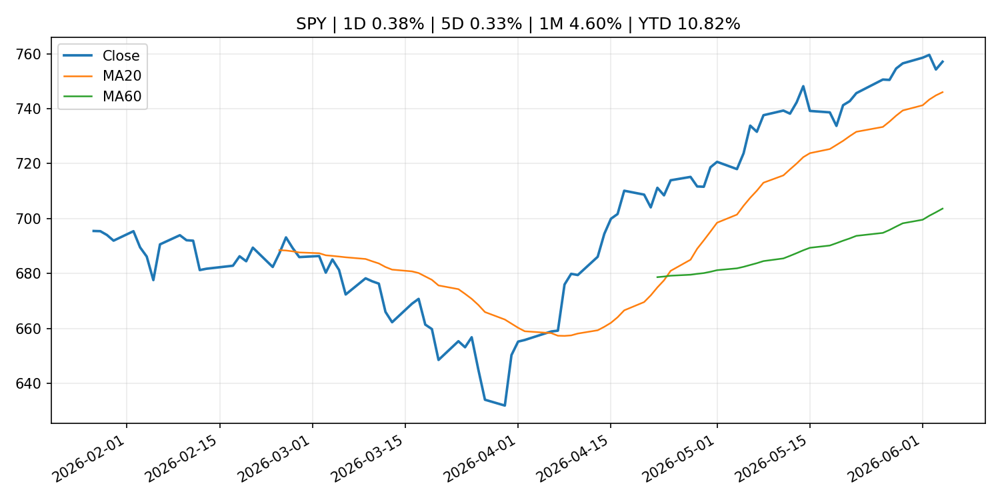
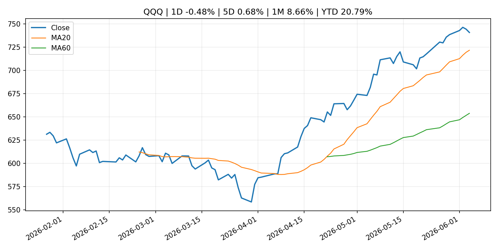
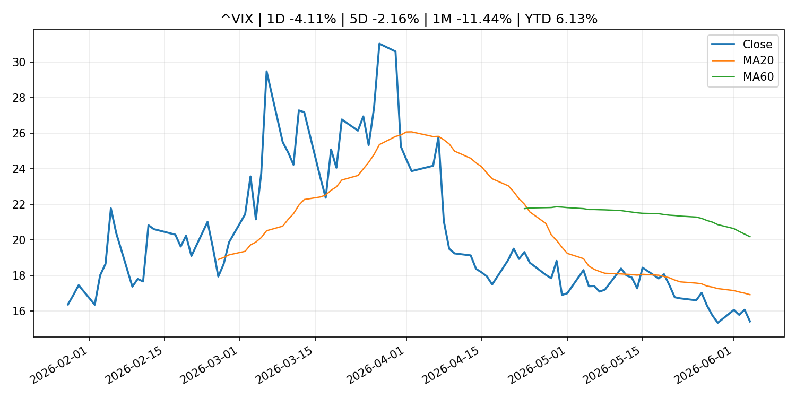
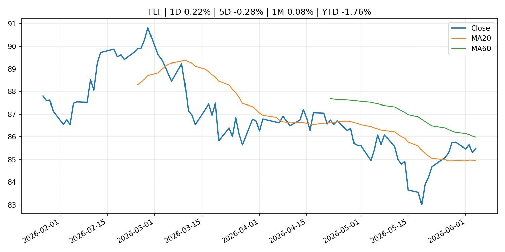
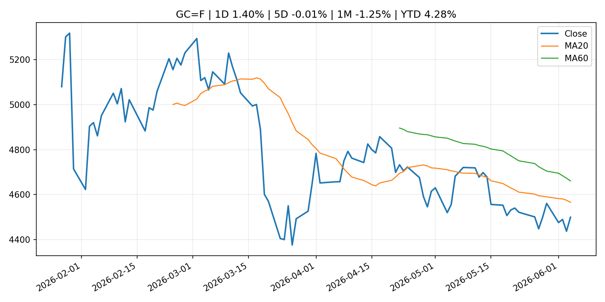
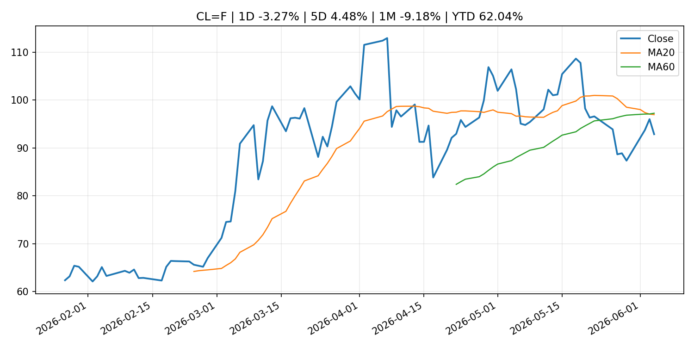
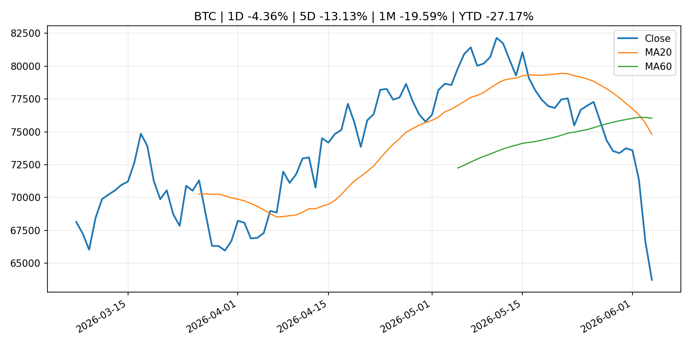
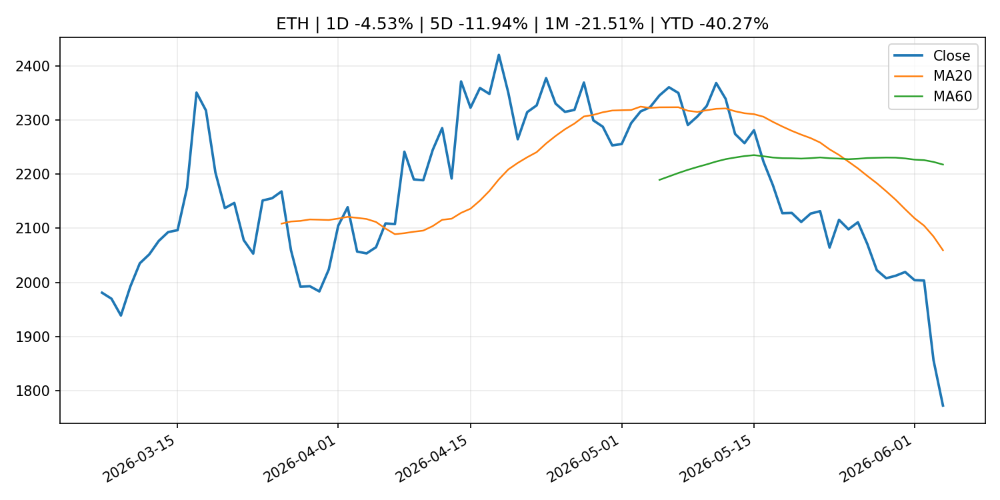
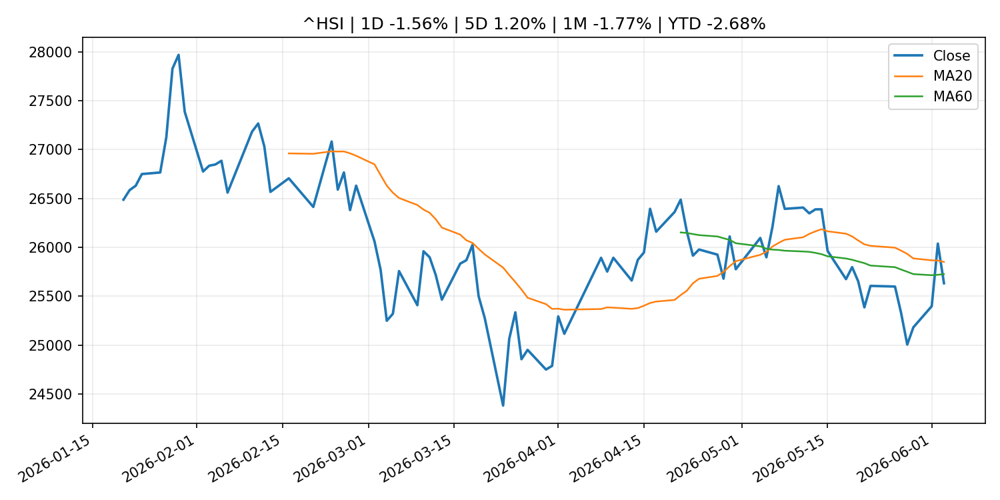

# Global Macro Morning Briefing - 2026-06-05

> Not financial advice / 非投资建议。

## 0. 今日总览
- 市场状态：unknown。市场信号不足，暂不判断明确状态。
- 今日三大主线：
  1. central_bank_decision: South Korea is the ultimate backdoor tech play — but stock investors now face a looming threat
  2. fiscal_policy: Russia sanctions British teenager for alleging A7A5 use in funding Ukraine war
  3. regulation: SEC Announces New Members of Small Business Capital Formation Advisory Committee
- 一句话结论：今日晨报重点关注：央行决策会重定价利率、汇率、久期资产和风险资产。；财政和贸易政策会影响增长、通胀、企业利润和跨境资本流。。跨资产方面，SPY 1D 0.38%；QQQ 1D -0.48%；^VIX 1D -4.11%；TLT 1D 0.22%；GC=F 1D 1.40%；CL=F 1D -3.27%；BTC 1D -4.36%；ETH 1D -4.53%；市场信号不足，暂不判断明确状态。政策、通胀、利率、美元、美债、能源和加密监管仍是主要观察线索。所有结论仅基于公开数据与短摘要整理，不构成投资建议。

## 1. 隔夜跨资产市场
- 美股：SPY 1D 0.38%，QQQ 1D -0.48%，整体趋势需结合 VIX 和利率确认。
- 美债/美元：TLT 1D 0.22%，美元指数 1D -0.10%，是判断折现率压力的核心线索。
- 黄金/原油：黄金 1D 1.40%，原油 1D -3.27%，用于观察避险、通胀和地缘风险。
- 加密：BTC 1D -4.36%，ETH 1D -4.53%，关注是否独立于纳指走出加密自身行情。
- 港股/A股：恒生 1D -1.56%，沪深300/上证 1D n/a，重点看中国政策预期与人民币线索。
- 风险观察：关注后续数据是否确认当前跨资产信号。

### US_EQUITY

| symbol | latest close | 1D | 5D | 1M | YTD | trend |
|---|---:|---:|---:|---:|---:|---|
| SPY | 757.09 | 0.38% | 0.33% | 4.60% | 10.82% | strong_uptrend |
| QQQ | 740.61 | -0.48% | 0.68% | 8.66% | 20.79% | strong_uptrend |
| DIA | 516.70 | 1.66% | 1.90% | 4.82% | 6.84% | strong_uptrend |
| IWM | 292.01 | 1.51% | -0.01% | 3.34% | 17.38% | strong_uptrend |
| VTI | 373.38 | 0.47% | 0.46% | 4.59% | 11.02% | strong_uptrend |

### US_MACRO_MARKET

| symbol | latest close | 1D | 5D | 1M | YTD | trend |
|---|---:|---:|---:|---:|---:|---|
| ^VIX | 15.40 | -4.11% | -2.16% | -11.44% | 6.13% | strong_downtrend |
| DX-Y.NYB | 99.43 | -0.10% | 0.42% | 0.97% | 1.03% | range_bound |
| TLT | 85.50 | 0.22% | -0.28% | 0.08% | -1.76% | range_bound |
| IEF | 94.12 | 0.13% | -0.44% | -0.43% | -2.04% | downtrend |

### COMMODITIES

| symbol | latest close | 1D | 5D | 1M | YTD | trend |
|---|---:|---:|---:|---:|---:|---|
| GC=F | 4,498.90 | 1.40% | -0.01% | -1.25% | 4.28% | downtrend |
| SI=F | 74.19 | 0.98% | -1.92% | 1.49% | 5.16% | range_bound |
| CL=F | 92.88 | -3.27% | 4.48% | -9.18% | 62.04% | strong_downtrend |
| BZ=F | 95.21 | -2.66% | 1.60% | -13.34% | 56.72% | strong_downtrend |
| NG=F | 3.36 | 4.39% | 2.13% | 20.34% | -7.27% | strong_uptrend |
| HG=F | 6.53 | 0.68% | 2.02% | 9.79% | 15.69% | uptrend |

### HK_MARKET

| symbol | latest close | 1D | 5D | 1M | YTD | trend |
|---|---:|---:|---:|---:|---:|---|
| ^HSI | 25,633.21 | -1.56% | 1.20% | -1.77% | -2.68% | range_bound |
| 0700.HK | 459.00 | -1.59% | 8.00% | -2.80% | -26.32% | range_bound |
| 9988.HK | 123.50 | -2.45% | 1.40% | -5.87% | -17.11% | range_bound |
| 3690.HK | 78.60 | -2.24% | 7.23% | -5.92% | -24.86% | strong_downtrend |
| 1810.HK | 28.38 | -0.70% | -0.63% | -6.83% | -29.54% | strong_downtrend |
| 1211.HK | 91.80 | -1.55% | 1.66% | -9.11% | -7.04% | strong_downtrend |

### CRYPTO

| symbol | latest close | 1D | 5D | 1M | YTD | trend |
|---|---:|---:|---:|---:|---:|---|
| BTC | 63,743.92 | -4.36% | -13.13% | -19.59% | -27.17% | strong_downtrend |
| ETH | 1,771.93 | -4.53% | -11.94% | -21.51% | -40.27% | strong_downtrend |
| SOLANA | 68.58 | -7.29% | -16.31% | -24.70% | -44.93% | strong_downtrend |
| BINANCECOIN | 604.34 | -7.04% | -5.94% | -9.98% | -29.99% | range_bound |
| RIPPLE | 1.17 | -2.98% | -11.72% | -17.75% | -36.25% | strong_downtrend |

## 2. 今日最重要的 10 条新闻
### 1. South Korea is the ultimate backdoor tech play — but stock investors now face a looming threat
- 来源：MarketWatch Top Stories
- 时间：2026-06-04T22:40:00+00:00
- 地区：US
- 事件类型：central_bank_decision
- 重要性层级：Tier 1
- 一句话摘要：Samsung and SK Hynix are key to soaring South Korean stock market, but a rate hike could trigger a 15% market correction.
- 为什么重要：央行决策会重定价利率、汇率、久期资产和风险资产。
- 可能影响：主要影响 QQQ，方向为 negative，强度 high；鹰派政策提高折现率，压制成长股估值。
  - 资产：QQQ
    方向：negative
    强度：high
    原因：鹰派政策提高折现率，压制成长股估值。
  - 资产：SPY
    方向：negative
    强度：medium
    原因：更紧政策通常削弱风险偏好。
  - 资产：TLT
    方向：negative
    强度：high
    原因：利率上行通常压低长债价格。
  - 资产：DXY
    方向：positive
    强度：high
    原因：更高利率预期通常支撑美元。
  - 资产：BTC
    方向：negative
    强度：high
    原因：流动性收紧通常压制高 beta 加密资产。
- 原文链接：[https://www.marketwatch.com/story/south-korea-is-the-ultimate-backdoor-tech-play-but-stock-investors-now-face-a-looming-threat-25065699?mod=mw_rss_topstories](https://www.marketwatch.com/story/south-korea-is-the-ultimate-backdoor-tech-play-but-stock-investors-now-face-a-looming-threat-25065699?mod=mw_rss_topstories)

### 2. Russia sanctions British teenager for alleging A7A5 use in funding Ukraine war
- 来源：CoinDesk
- 时间：2026-06-04T11:51:53+00:00
- 地区：global
- 事件类型：fiscal_policy
- 重要性层级：Tier 1
- 一句话摘要：Russia sanctions British teenager for alleging A7A5 use in funding Ukraine war
- 为什么重要：财政和贸易政策会影响增长、通胀、企业利润和跨境资本流。
- 可能影响：可能影响利率、汇率、风险资产或大宗商品预期，但当前公开信息不足以判断明确方向。
  - 资产：暂无明确资产映射
  - 方向：unknown
  - 强度：low
  - 原因：公开信息不足以判断方向。
- 原文链接：[https://www.coindesk.com/policy/2026/06/04/russia-sanctions-british-teenager-for-alleging-a7a5-use-in-funding-ukraine-war](https://www.coindesk.com/policy/2026/06/04/russia-sanctions-british-teenager-for-alleging-a7a5-use-in-funding-ukraine-war)

### 3. SEC Announces New Members of Small Business Capital Formation Advisory Committee
- 来源：SEC Press Releases
- 时间：2026-06-04T14:39:49-04:00
- 地区：US
- 事件类型：regulation
- 重要性层级：Tier 2
- 一句话摘要：The Securities and Exchange Commission today announced five new members of the Small Business Capital Formation Advisory Committee. The new members were appointed to four-year terms and will join the 15 current …
- 为什么重要：监管变化会改变行业盈利预期和资产风险溢价。
- 可能影响：主要影响 BTC，方向为 mixed，强度 high；加密监管或 ETF 进展会改变 BTC 的资金流和风险溢价。
  - 资产：BTC
    方向：mixed
    强度：high
    原因：加密监管或 ETF 进展会改变 BTC 的资金流和风险溢价。
  - 资产：ETH
    方向：mixed
    强度：high
    原因：监管框架会影响 ETH 产品化和机构参与度。
  - 资产：COIN
    方向：mixed
    强度：medium
    原因：监管清晰度和执法风险会影响交易平台估值。
  - 资产：crypto market
    方向：mixed
    强度：high
    原因：信息影响整个加密市场结构，但方向取决于细节。
- 原文链接：[https://www.sec.gov/newsroom/press-releases/2026-52-sec-announces-new-members-small-business-capital-formation-advisory-committee](https://www.sec.gov/newsroom/press-releases/2026-52-sec-announces-new-members-small-business-capital-formation-advisory-committee)

### 4. Apyx's STRC collateralized stablecoin suffers a brief depeg. Protocol says its a feature, not bug
- 来源：CoinDesk
- 时间：2026-06-04T06:35:17+00:00
- 地区：global
- 事件类型：crypto_market_structure
- 重要性层级：Tier 2
- 一句话摘要：Apyx's STRC collateralized stablecoin suffers a brief depeg. Protocol says its a feature, not bug
- 为什么重要：加密市场结构和监管变化会影响 BTC、ETH 及相关股票的风险溢价。
- 可能影响：主要影响 BTC，方向为 mixed，强度 high；加密监管或 ETF 进展会改变 BTC 的资金流和风险溢价。
  - 资产：BTC
    方向：mixed
    强度：high
    原因：加密监管或 ETF 进展会改变 BTC 的资金流和风险溢价。
  - 资产：ETH
    方向：mixed
    强度：high
    原因：监管框架会影响 ETH 产品化和机构参与度。
  - 资产：COIN
    方向：mixed
    强度：medium
    原因：监管清晰度和执法风险会影响交易平台估值。
  - 资产：crypto market
    方向：mixed
    强度：high
    原因：信息影响整个加密市场结构，但方向取决于细节。
- 原文链接：[https://www.coindesk.com/markets/2026/06/04/apyx-s-stablecoin-suffers-a-brief-depeg-protocol-says-its-a-feature-not-bug](https://www.coindesk.com/markets/2026/06/04/apyx-s-stablecoin-suffers-a-brief-depeg-protocol-says-its-a-feature-not-bug)

### 5. Speech by Governor UEDA at the Kisaragi-kai Meeting in Tokyo
- 来源：Bank of Japan Announcements
- 时间：2026-06-03T17:30:00+09:00
- 地区：Japan
- 事件类型：central_bank_speech
- 重要性层级：Tier 2
- 一句话摘要：Speech by Governor UEDA at the Kisaragi-kai Meeting in Tokyo
- 为什么重要：央行官员表态可能影响市场对下一次会议的定价。
- 可能影响：可能影响利率、汇率、风险资产或大宗商品预期，但当前公开信息不足以判断明确方向。
  - 资产：暂无明确资产映射
  - 方向：unknown
  - 强度：low
  - 原因：公开信息不足以判断方向。
- 原文链接：[http://www.boj.or.jp/en/about/press/koen_2026/ko260603a.htm](http://www.boj.or.jp/en/about/press/koen_2026/ko260603a.htm)

### 6. Why tokenization is an ETF-style market structure revolution
- 来源：CoinDesk
- 时间：2026-06-04T14:44:07+00:00
- 地区：global
- 事件类型：other
- 重要性层级：Tier 3
- 一句话摘要：Why tokenization is an ETF-style market structure revolution
- 为什么重要：这条信息暂未匹配到重大宏观、政策或市场事件，更适合作为背景跟踪。
- 可能影响：主要影响 BTC，方向为 mixed，强度 high；加密监管或 ETF 进展会改变 BTC 的资金流和风险溢价。
  - 资产：BTC
    方向：mixed
    强度：high
    原因：加密监管或 ETF 进展会改变 BTC 的资金流和风险溢价。
  - 资产：ETH
    方向：mixed
    强度：high
    原因：监管框架会影响 ETH 产品化和机构参与度。
  - 资产：COIN
    方向：mixed
    强度：medium
    原因：监管清晰度和执法风险会影响交易平台估值。
  - 资产：crypto market
    方向：mixed
    强度：high
    原因：信息影响整个加密市场结构，但方向取决于细节。
- 原文链接：[https://www.coindesk.com/opinion/2026/06/04/why-tokenization-is-an-etf-style-market-structure-revolution](https://www.coindesk.com/opinion/2026/06/04/why-tokenization-is-an-etf-style-market-structure-revolution)

### 7. Bitcoin’s sagging price has crypto bears taking a victory lap. Why it’s too soon to count it out.
- 来源：MarketWatch Top Stories
- 时间：2026-06-04T22:29:00+00:00
- 地区：US
- 事件类型：other
- 重要性层级：Tier 3
- 一句话摘要：While U.S. stocks have kept notching record highs, bitcoin is sliding to its weakest level in months.
- 为什么重要：这条信息暂未匹配到重大宏观、政策或市场事件，更适合作为背景跟踪。
- 可能影响：更偏背景信息，短期市场影响可能有限。
  - 资产：暂无明确资产映射
  - 方向：unknown
  - 强度：low
  - 原因：公开信息不足以判断方向。
- 原文链接：[https://www.marketwatch.com/story/bitcoins-sagging-price-has-crypto-bears-taking-a-victory-lap-why-its-too-soon-to-count-it-out-edf1d8d8?mod=mw_rss_topstories](https://www.marketwatch.com/story/bitcoins-sagging-price-has-crypto-bears-taking-a-victory-lap-why-its-too-soon-to-count-it-out-edf1d8d8?mod=mw_rss_topstories)

## 3. 政策与央行观察
### 1. South Korea is the ultimate backdoor tech play — but stock investors now face a looming threat
- 来源：MarketWatch Top Stories
- 时间：2026-06-04T22:40:00+00:00
- 地区：US
- 事件类型：central_bank_decision
- 重要性层级：Tier 1
- 一句话摘要：Samsung and SK Hynix are key to soaring South Korean stock market, but a rate hike could trigger a 15% market correction.
- 为什么重要：央行决策会重定价利率、汇率、久期资产和风险资产。
- 可能影响：主要影响 QQQ，方向为 negative，强度 high；鹰派政策提高折现率，压制成长股估值。
  - 资产：QQQ
    方向：negative
    强度：high
    原因：鹰派政策提高折现率，压制成长股估值。
  - 资产：SPY
    方向：negative
    强度：medium
    原因：更紧政策通常削弱风险偏好。
  - 资产：TLT
    方向：negative
    强度：high
    原因：利率上行通常压低长债价格。
  - 资产：DXY
    方向：positive
    强度：high
    原因：更高利率预期通常支撑美元。
  - 资产：BTC
    方向：negative
    强度：high
    原因：流动性收紧通常压制高 beta 加密资产。
- 原文链接：[https://www.marketwatch.com/story/south-korea-is-the-ultimate-backdoor-tech-play-but-stock-investors-now-face-a-looming-threat-25065699?mod=mw_rss_topstories](https://www.marketwatch.com/story/south-korea-is-the-ultimate-backdoor-tech-play-but-stock-investors-now-face-a-looming-threat-25065699?mod=mw_rss_topstories)

### 2. Russia sanctions British teenager for alleging A7A5 use in funding Ukraine war
- 来源：CoinDesk
- 时间：2026-06-04T11:51:53+00:00
- 地区：global
- 事件类型：fiscal_policy
- 重要性层级：Tier 1
- 一句话摘要：Russia sanctions British teenager for alleging A7A5 use in funding Ukraine war
- 为什么重要：财政和贸易政策会影响增长、通胀、企业利润和跨境资本流。
- 可能影响：可能影响利率、汇率、风险资产或大宗商品预期，但当前公开信息不足以判断明确方向。
  - 资产：暂无明确资产映射
  - 方向：unknown
  - 强度：low
  - 原因：公开信息不足以判断方向。
- 原文链接：[https://www.coindesk.com/policy/2026/06/04/russia-sanctions-british-teenager-for-alleging-a7a5-use-in-funding-ukraine-war](https://www.coindesk.com/policy/2026/06/04/russia-sanctions-british-teenager-for-alleging-a7a5-use-in-funding-ukraine-war)

### 3. SEC Announces New Members of Small Business Capital Formation Advisory Committee
- 来源：SEC Press Releases
- 时间：2026-06-04T14:39:49-04:00
- 地区：US
- 事件类型：regulation
- 重要性层级：Tier 2
- 一句话摘要：The Securities and Exchange Commission today announced five new members of the Small Business Capital Formation Advisory Committee. The new members were appointed to four-year terms and will join the 15 current …
- 为什么重要：监管变化会改变行业盈利预期和资产风险溢价。
- 可能影响：主要影响 BTC，方向为 mixed，强度 high；加密监管或 ETF 进展会改变 BTC 的资金流和风险溢价。
  - 资产：BTC
    方向：mixed
    强度：high
    原因：加密监管或 ETF 进展会改变 BTC 的资金流和风险溢价。
  - 资产：ETH
    方向：mixed
    强度：high
    原因：监管框架会影响 ETH 产品化和机构参与度。
  - 资产：COIN
    方向：mixed
    强度：medium
    原因：监管清晰度和执法风险会影响交易平台估值。
  - 资产：crypto market
    方向：mixed
    强度：high
    原因：信息影响整个加密市场结构，但方向取决于细节。
- 原文链接：[https://www.sec.gov/newsroom/press-releases/2026-52-sec-announces-new-members-small-business-capital-formation-advisory-committee](https://www.sec.gov/newsroom/press-releases/2026-52-sec-announces-new-members-small-business-capital-formation-advisory-committee)

### 4. Apyx's STRC collateralized stablecoin suffers a brief depeg. Protocol says its a feature, not bug
- 来源：CoinDesk
- 时间：2026-06-04T06:35:17+00:00
- 地区：global
- 事件类型：crypto_market_structure
- 重要性层级：Tier 2
- 一句话摘要：Apyx's STRC collateralized stablecoin suffers a brief depeg. Protocol says its a feature, not bug
- 为什么重要：加密市场结构和监管变化会影响 BTC、ETH 及相关股票的风险溢价。
- 可能影响：主要影响 BTC，方向为 mixed，强度 high；加密监管或 ETF 进展会改变 BTC 的资金流和风险溢价。
  - 资产：BTC
    方向：mixed
    强度：high
    原因：加密监管或 ETF 进展会改变 BTC 的资金流和风险溢价。
  - 资产：ETH
    方向：mixed
    强度：high
    原因：监管框架会影响 ETH 产品化和机构参与度。
  - 资产：COIN
    方向：mixed
    强度：medium
    原因：监管清晰度和执法风险会影响交易平台估值。
  - 资产：crypto market
    方向：mixed
    强度：high
    原因：信息影响整个加密市场结构，但方向取决于细节。
- 原文链接：[https://www.coindesk.com/markets/2026/06/04/apyx-s-stablecoin-suffers-a-brief-depeg-protocol-says-its-a-feature-not-bug](https://www.coindesk.com/markets/2026/06/04/apyx-s-stablecoin-suffers-a-brief-depeg-protocol-says-its-a-feature-not-bug)

### 5. Speech by Governor UEDA at the Kisaragi-kai Meeting in Tokyo
- 来源：Bank of Japan Announcements
- 时间：2026-06-03T17:30:00+09:00
- 地区：Japan
- 事件类型：central_bank_speech
- 重要性层级：Tier 2
- 一句话摘要：Speech by Governor UEDA at the Kisaragi-kai Meeting in Tokyo
- 为什么重要：央行官员表态可能影响市场对下一次会议的定价。
- 可能影响：可能影响利率、汇率、风险资产或大宗商品预期，但当前公开信息不足以判断明确方向。
  - 资产：暂无明确资产映射
  - 方向：unknown
  - 强度：low
  - 原因：公开信息不足以判断方向。
- 原文链接：[http://www.boj.or.jp/en/about/press/koen_2026/ko260603a.htm](http://www.boj.or.jp/en/about/press/koen_2026/ko260603a.htm)

## 4. 市场异动与图表
- QQQ 下跌 -0.48%
- VIX 下跌 -4.11%
- Gold 上涨 1.40%
- Oil 下跌 -3.27%
- BTC 下跌 -4.36%
- ETH 下跌 -4.53%

### SPY

### QQQ

### ^VIX

### TLT

### GC=F

### CL=F

### BTC

### ETH

### ^HSI

## 5. 华尔街与机构公开观点
- 暂无可靠公开观点。

## 6. 今日重点关注
- 经济数据：经济数据：暂无可靠公开日历数据；如配置经济日历源后可自动填充。
- 央行讲话：央行讲话：暂无可靠公开日历数据；重点跟踪 Fed、ECB、BoJ、PBOC 官网 RSS。
- 财报：财报：暂无可靠数据。
- 政策事件：政策事件：暂无可靠数据。
- 风险提醒：风险提醒：关注数据源失败项、突发地缘风险、利率和美元的二阶反应。

## 7. 英文金融表达与宏观概念
- **terminal rate**：终端利率，市场预期本轮加息周期的最高政策利率。 例句：A higher terminal rate can pressure growth stocks.
- **risk-off**：避险模式，资金偏向美元、国债、黄金等防御资产。 例句：A geopolitical shock can push markets into risk-off mode.
- **market structure**：市场结构，指交易、托管、清算、ETF、监管等制度安排。 例句：Crypto market structure rules can affect institutional participation.
- **inflation expectations**：通胀预期，指家庭、企业或市场对未来通胀的预估。 例句：Inflation expectations can shape wage bargaining and bond yields.
- **real yield**：实际收益率，名义利率扣除通胀预期后的收益率。 例句：Gold often reacts more to real yields than nominal yields.
- **soft landing**：软着陆，指通胀回落而经济避免明显衰退。 例句：Markets often rally when data support a soft landing.

## 8. 背景材料
- [Bitcoin’s sagging price has crypto bears taking a victory lap. Why it’s too soon to count it out.](https://www.marketwatch.com/story/bitcoins-sagging-price-has-crypto-bears-taking-a-victory-lap-why-its-too-soon-to-count-it-out-edf1d8d8?mod=mw_rss_topstories)（MarketWatch Top Stories，other）：While U.S. stocks have kept notching record highs, bitcoin is sliding to its weakest level in months.
- ['Dr. Doom'-backed Atlas Capital CEO says bitcoin could crash 70% before reaching $500,000](https://www.coindesk.com/markets/2026/06/04/dr-doom-backed-atlas-capital-ceo-says-bitcoin-could-crash-70-before-reaching-usd500-000)（CoinDesk，other）：'Dr. Doom'-backed Atlas Capital CEO says bitcoin could crash 70% before reaching $500,000
- [Why tokenization is an ETF-style market structure revolution](https://www.coindesk.com/opinion/2026/06/04/why-tokenization-is-an-etf-style-market-structure-revolution)（CoinDesk，other）：Why tokenization is an ETF-style market structure revolution
- [CoinDesk 20 performance update: Bitcoin Cash (BCH), up 1.5%, is only gainer](https://www.coindesk.com/coindesk-indices/2026/06/04/coindesk-20-performance-update-bitcoin-cash-bch-up-1-5-is-only-gainer)（CoinDesk，other）：CoinDesk 20 performance update: Bitcoin Cash (BCH), up 1.5%, is only gainer
- [Strategy's Saylor's explanation for bitcoin's slide isn't what bears think](https://www.coindesk.com/markets/2026/06/04/strategy-s-saylor-s-explanation-for-bitcoin-s-slide-isn-t-what-bears-think)（CoinDesk，other）：Strategy's Saylor's explanation for bitcoin's slide isn't what bears think
- [Bitcoin bounces, HYPE falls, NEAR gets demolished as crypto deals with a wipe out](https://www.coindesk.com/markets/2026/06/04/live-markets-saylor-speaks-as-bitcoin-plunges-to-usd62-000)（CoinDesk，other）：Bitcoin bounces, HYPE falls, NEAR gets demolished as crypto deals with a wipe out
- [Standard Chartered's three 'Ifs' that stand between bitcoin and a market low](https://www.coindesk.com/daybook-us/2026/06/04/standard-chartered-s-three-ifs-that-stand-between-bitcoin-and-a-market-low)（CoinDesk，other）：Standard Chartered's three 'Ifs' that stand between bitcoin and a market low
- [Bitcoin steadies above $60,000 while derivatives send an unambiguous warning](https://www.coindesk.com/markets/2026/06/04/bitcoin-steadies-above-usd60-000-while-derivatives-send-an-unambiguous-warning)（CoinDesk，other）：Bitcoin steadies above $60,000 while derivatives send an unambiguous warning
- [This bitcoin metric has marked every bear market bottom, and it's just flashed again](https://www.coindesk.com/markets/2026/06/04/this-bitcoin-metric-has-marked-every-bear-market-bottom-and-it-s-just-flashed-again)（CoinDesk，other）：This bitcoin metric has marked every bear market bottom, and it's just flashed again
- [Christine Lagarde: Women and leadership: widening the pipeline](https://www.ecb.europa.eu//press/key/date/2026/html/ecb.sp260604~f5d373b29f.en.html)（ECB Press Releases，other）：Christine Lagarde: Women and leadership: widening the pipeline
- [Goldman Sachs teams with Apex, Archax for tokenized real estate fund](https://www.coindesk.com/business/2026/06/04/goldman-sachs-teams-with-apex-archax-for-tokenized-real-estate-fund)（CoinDesk，other）：Goldman Sachs teams with Apex, Archax for tokenized real estate fund
- [Polymarket says No for May, Yes for June after Strategy's recent bitcoin sale](https://www.coindesk.com/markets/2026/06/04/polymarket-says-no-for-may-yes-for-june-after-strategy-s-recent-bitcoin-sale)（CoinDesk，other）：Polymarket says No for May, Yes for June after Strategy's recent bitcoin sale
- [BTC, ETH, SOL and XRP ETFs bleed $4.4 billion over 13 sessions, only HYPE in green](https://www.coindesk.com/markets/2026/06/04/btc-eth-sol-and-xrp-etfs-bleed-usd4-4-billion-over-13-sessions-only-hype-in-green)（CoinDesk，other）：BTC, ETH, SOL and XRP ETFs bleed $4.4 billion over 13 sessions, only HYPE in green
- [(Research Paper) Aging-Related Depreciation of Office Rents and Renovation Effects](http://www.boj.or.jp/en/research/wps_rev/wps_2026/wp26e11.htm)（Bank of Japan Announcements，research_publication）：(Research Paper) Aging-Related Depreciation of Office Rents and Renovation Effects
- [Bitcoin briefly drops below $62,000 as $1.5 billion in crypto longs get wiped out](https://www.coindesk.com/markets/2026/06/04/bitcoin-drops-below-usd62-000-as-usd1-5-billion-in-crypto-longs-get-wiped-out)（CoinDesk，other）：Bitcoin briefly drops below $62,000 as $1.5 billion in crypto longs get wiped out
- [Live markets: Bitcoin selloff stalls as key indicator signals oversold conditions](https://www.coindesk.com/tech/2026/06/03/live-markets-bitcoin-crashes-to-usd62-000-as-billions-of-longs-get-liquidated)（CoinDesk，other）：Live markets: Bitcoin selloff stalls as key indicator signals oversold conditions
- [Bitcoin set to slump to new lows for 2026 after recent sell-off, traders forecast](https://www.cnbc.com/2026/06/03/bitcoin-to-slump-to-new-lows-after-recent-sell-off-traders-predict.html)（CNBC Economy，other）：The cryptocurrency is likely to break below its lows hit in early February, traders on prediction market Kalshi believe.
- [Piero Cipollone: Europe’s money evolves so people’s freedom to pay remains](https://www.ecb.europa.eu//press/key/date/2026/html/ecb.sp260603_1~2801335beb.en.html)（ECB Press Releases，other）：Piero Cipollone: Europe’s money evolves so people’s freedom to pay remains
- [Frank Elderson: Strengthening operational resilience for the age of AI](https://www.ecb.europa.eu//press/key/date/2026/html/ecb.sp260603~5b8e67f237.en.html)（ECB Press Releases，other）：Frank Elderson: Strengthening operational resilience for the age of AI
- [Sources of Changes in Current Account Balances (Projections for June)](http://www.boj.or.jp/en/statistics/boj/fm/juqp/juqp2606.xlsx)（Bank of Japan Announcements，other）：Sources of Changes in Current Account Balances (Projections for June)

## 9. 数据源、失败项与免责声明
- 采集时间：2026-06-04T23:09:00
- 数据源：公开 RSS、Yahoo Finance、CoinGecko、AKShare、FRED、SEC data.sec.gov，以及用户自有 inputs/reports 文件。
- 合规说明：不绕过 WSJ、Bloomberg、FT、Reuters 等付费墙；对付费媒体只使用公开 RSS 标题、摘要、链接和发布时间。
- 免责声明：Not financial advice / 非投资建议。本项目仅供个人学习、研究和信息整理，不构成投资建议、交易建议或任何收益承诺。
- 失败或跳过的数据源：
  - crypto data failed coin=dogecoin
  - China market data failed symbol=上证指数: empty dataframe
  - China market data failed symbol=深证成指: empty dataframe
  - China market data failed symbol=创业板指: empty dataframe
  - China market data failed symbol=沪深300: empty dataframe
  - China market data failed symbol=中证500: empty dataframe
  - China market data failed symbol=科创50: empty dataframe
  - FRED_API_KEY not set; skipping FRED macro series
  - SEC failed cik=0000320193
  - SEC failed cik=0000789019
  - SEC failed cik=0001045810
  - SEC failed cik=0001318605
  - SEC failed cik=0001577552
