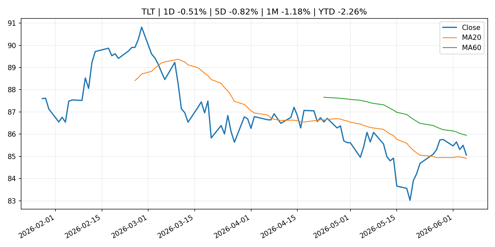
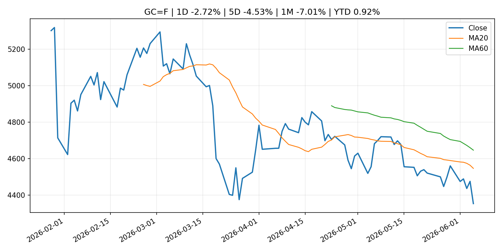
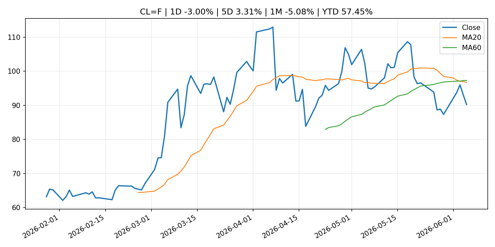
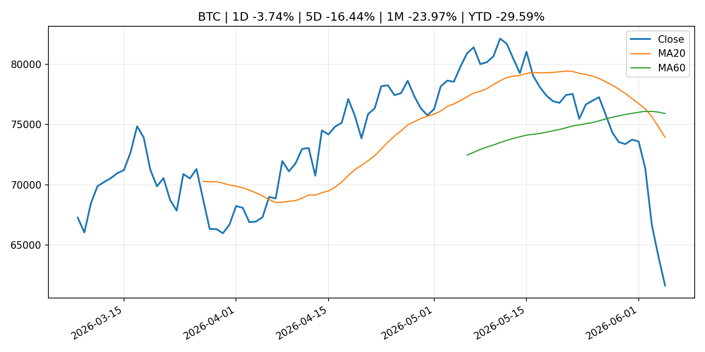
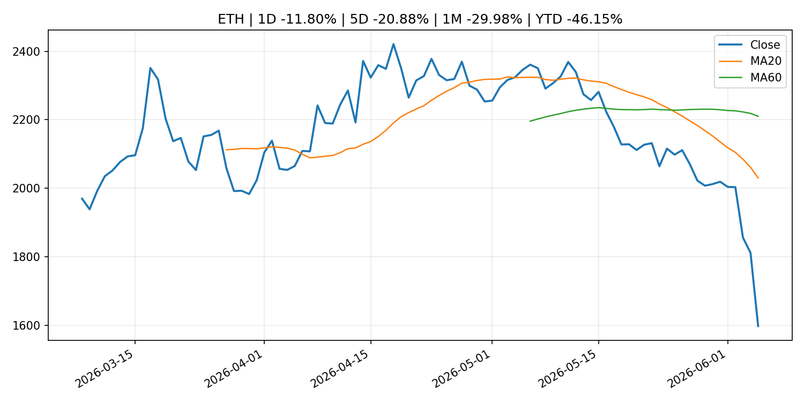
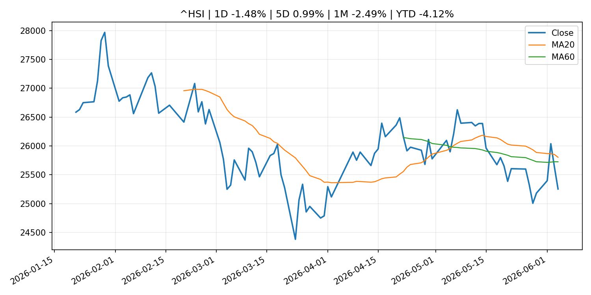

# Global Macro Morning Briefing - 2026-06-06

> Not financial advice / 非投资建议。

## 0. 今日总览
- 市场状态：mixed。长债下跌、美元走强且成长股承压，市场像是在交易利率冲击。 但存在信号冲突，需要降低单一叙事置信度。
- 今日三大主线：
  1. regulation: SEC Announces New Members of Small Business Capital Formation Advisory Committee
  2. central_bank_speech: Hot jobs report puts Fed cuts further out of reach as Chair Warsh faces policy tests
- 一句话结论：今日晨报重点关注：监管变化会改变行业盈利预期和资产风险溢价。；央行官员表态可能影响市场对下一次会议的定价。。跨资产方面，SPY 1D -2.58%；QQQ 1D -4.80%；^VIX 1D 39.68%；TLT 1D -0.51%；GC=F 1D -2.72%；CL=F 1D -3.00%；BTC 1D -3.74%；ETH 1D -11.80%；长债下跌、美元走强且成长股承压，市场像是在交易利率冲击。 但存在信号冲突，需要降低单一叙事置信度。政策、通胀、利率、美元、美债、能源和加密监管仍是主要观察线索。所有结论仅基于公开数据与短摘要整理，不构成投资建议。

## 1. 隔夜跨资产市场
- 美股：SPY 1D -2.58%，QQQ 1D -4.80%，整体趋势需结合 VIX 和利率确认。
- 美债/美元：TLT 1D -0.51%，美元指数 1D 0.66%，是判断折现率压力的核心线索。
- 黄金/原油：黄金 1D -2.72%，原油 1D -3.00%，用于观察避险、通胀和地缘风险。
- 加密：BTC 1D -3.74%，ETH 1D -11.80%，关注是否独立于纳指走出加密自身行情。
- 港股/A股：恒生 1D -1.48%，沪深300/上证 1D n/a，重点看中国政策预期与人民币线索。
- 风险观察：关注美债收益率、实际利率和成长股估值压力。

### US_EQUITY

| symbol | latest close | 1D | 5D | 1M | YTD | trend |
|---|---:|---:|---:|---:|---:|---|
| SPY | 737.55 | -2.58% | -2.50% | 0.51% | 7.96% | range_bound |
| QQQ | 705.06 | -4.80% | -4.50% | 1.34% | 15.00% | range_bound |
| DIA | 509.70 | -1.35% | -0.21% | 2.13% | 5.39% | uptrend |
| IWM | 281.65 | -3.55% | -3.02% | -1.80% | 13.21% | range_bound |
| VTI | 363.38 | -2.68% | -2.46% | 0.42% | 8.05% | range_bound |

### US_MACRO_MARKET

| symbol | latest close | 1D | 5D | 1M | YTD | trend |
|---|---:|---:|---:|---:|---:|---|
| ^VIX | 21.51 | 39.68% | 40.40% | 25.94% | 48.24% | range_bound |
| DX-Y.NYB | 100.07 | 0.66% | 1.17% | 2.09% | 1.68% | range_bound |
| TLT | 85.06 | -0.51% | -0.82% | -1.18% | -2.26% | range_bound |
| IEF | 93.62 | -0.53% | -1.09% | -1.45% | -2.56% | downtrend |

### COMMODITIES

| symbol | latest close | 1D | 5D | 1M | YTD | trend |
|---|---:|---:|---:|---:|---:|---|
| GC=F | 4,353.90 | -2.72% | -4.53% | -7.01% | 0.92% | strong_downtrend |
| SI=F | 68.00 | -7.84% | -10.08% | -11.48% | -3.63% | range_bound |
| CL=F | 90.25 | -3.00% | 3.31% | -5.08% | 57.45% | strong_downtrend |
| BZ=F | 92.87 | -2.27% | 0.89% | -8.29% | 52.87% | strong_downtrend |
| NG=F | 3.22 | -3.48% | -2.13% | 17.95% | -11.00% | strong_uptrend |
| HG=F | 6.28 | -3.62% | -1.32% | 2.27% | 11.27% | range_bound |

### HK_MARKET

| symbol | latest close | 1D | 5D | 1M | YTD | trend |
|---|---:|---:|---:|---:|---:|---|
| ^HSI | 25,253.40 | -1.48% | 0.99% | -2.49% | -4.12% | range_bound |
| 0700.HK | 453.20 | -1.26% | 6.09% | -2.12% | -27.26% | range_bound |
| 9988.HK | 122.40 | -0.89% | 1.24% | -8.79% | -17.85% | strong_downtrend |
| 3690.HK | 79.95 | 1.72% | 8.85% | -3.09% | -23.57% | downtrend |
| 1810.HK | 27.80 | -2.04% | -0.86% | -9.80% | -30.98% | strong_downtrend |
| 1211.HK | 89.70 | -2.29% | -1.75% | -9.30% | -9.16% | strong_downtrend |

### CRYPTO

| symbol | latest close | 1D | 5D | 1M | YTD | trend |
|---|---:|---:|---:|---:|---:|---|
| BTC | 61,626.48 | -3.74% | -16.44% | -23.97% | -29.59% | strong_downtrend |
| ETH | 1,597.59 | -11.80% | -20.88% | -29.98% | -46.15% | strong_downtrend |
| SOLANA | 64.54 | -9.96% | -21.80% | -29.94% | -48.17% | strong_downtrend |
| BINANCECOIN | 577.13 | -6.91% | -19.64% | -14.87% | -33.14% | range_bound |
| RIPPLE | 1.11 | -7.48% | -16.97% | -25.16% | -39.60% | strong_downtrend |
| DOGECOIN | 0.08 | -9.40% | -17.48% | -28.13% | -29.38% | strong_downtrend |

## 2. 今日最重要的 10 条新闻
### 1. SEC Announces New Members of Small Business Capital Formation Advisory Committee
- 来源：SEC Press Releases
- 时间：2026-06-04T14:39:49-04:00
- 地区：US
- 事件类型：regulation
- 重要性层级：Tier 2
- 一句话摘要：The Securities and Exchange Commission today announced five new members of the Small Business Capital Formation Advisory Committee. The new members were appointed to four-year terms and will join the 15 current …
- 为什么重要：监管变化会改变行业盈利预期和资产风险溢价。
- 可能影响：主要影响 BTC，方向为 mixed，强度 high；加密监管或 ETF 进展会改变 BTC 的资金流和风险溢价。
  - 资产：BTC
    方向：mixed
    强度：high
    原因：加密监管或 ETF 进展会改变 BTC 的资金流和风险溢价。
  - 资产：ETH
    方向：mixed
    强度：high
    原因：监管框架会影响 ETH 产品化和机构参与度。
  - 资产：COIN
    方向：mixed
    强度：medium
    原因：监管清晰度和执法风险会影响交易平台估值。
  - 资产：crypto market
    方向：mixed
    强度：high
    原因：信息影响整个加密市场结构，但方向取决于细节。
- 原文链接：[https://www.sec.gov/newsroom/press-releases/2026-52-sec-announces-new-members-small-business-capital-formation-advisory-committee](https://www.sec.gov/newsroom/press-releases/2026-52-sec-announces-new-members-small-business-capital-formation-advisory-committee)

### 2. Hot jobs report puts Fed cuts further out of reach as Chair Warsh faces policy tests
- 来源：CNBC Economy
- 时间：2026-06-05T19:09:09+00:00
- 地区：US
- 事件类型：central_bank_speech
- 重要性层级：Tier 2
- 一句话摘要：Another big jobs report in May has swept aside the possibility of interest rate cuts anytime soon.
- 为什么重要：央行官员表态可能影响市场对下一次会议的定价。
- 可能影响：可能影响利率、汇率、风险资产或大宗商品预期，但当前公开信息不足以判断明确方向。
  - 资产：暂无明确资产映射
  - 方向：unknown
  - 强度：low
  - 原因：公开信息不足以判断方向。
- 原文链接：[https://www.cnbc.com/2026/06/05/hot-jobs-report-puts-fed-cuts-further-out-of-reach-as-chair-warsh-faces-policy-tests.html](https://www.cnbc.com/2026/06/05/hot-jobs-report-puts-fed-cuts-further-out-of-reach-as-chair-warsh-faces-policy-tests.html)

### 3. Here’s what’s worth streaming in June 2026 on Netflix, Hulu, HBO Max and more
- 来源：MarketWatch Top Stories
- 时间：2026-06-05T23:00:00+00:00
- 地区：US
- 事件类型：other
- 重要性层级：Tier 3
- 一句话摘要：HBO’s ‘House of the Dragon,’ Hulu’s ‘The Bear’ and Apple’s ‘Cape Fear’ will try to compete with the World Cup
- 为什么重要：这条信息暂未匹配到重大宏观、政策或市场事件，更适合作为背景跟踪。
- 可能影响：更偏背景信息，短期市场影响可能有限。
  - 资产：暂无明确资产映射
  - 方向：unknown
  - 强度：low
  - 原因：公开信息不足以判断方向。
- 原文链接：[https://www.marketwatch.com/story/heres-whats-worth-streaming-in-june-2026-on-netflix-hulu-hbo-max-and-more-7c73c539?mod=mw_rss_topstories](https://www.marketwatch.com/story/heres-whats-worth-streaming-in-june-2026-on-netflix-hulu-hbo-max-and-more-7c73c539?mod=mw_rss_topstories)

### 4. Bitcoin is suffering from an ‘attention’ deficit, as momentum traders have moved on
- 来源：MarketWatch Top Stories
- 时间：2026-06-05T21:58:00+00:00
- 地区：US
- 事件类型：other
- 重要性层级：Tier 3
- 一句话摘要：“The AI trade is sucking the blood out of crypto,” one analyst notes.
- 为什么重要：这条信息暂未匹配到重大宏观、政策或市场事件，更适合作为背景跟踪。
- 可能影响：更偏背景信息，短期市场影响可能有限。
  - 资产：暂无明确资产映射
  - 方向：unknown
  - 强度：low
  - 原因：公开信息不足以判断方向。
- 原文链接：[https://www.marketwatch.com/story/bitcoin-is-suffering-from-an-attention-deficit-as-momentum-traders-have-moved-on-17d2c140?mod=mw_rss_topstories](https://www.marketwatch.com/story/bitcoin-is-suffering-from-an-attention-deficit-as-momentum-traders-have-moved-on-17d2c140?mod=mw_rss_topstories)

## 3. 政策与央行观察
### 1. SEC Announces New Members of Small Business Capital Formation Advisory Committee
- 来源：SEC Press Releases
- 时间：2026-06-04T14:39:49-04:00
- 地区：US
- 事件类型：regulation
- 重要性层级：Tier 2
- 一句话摘要：The Securities and Exchange Commission today announced five new members of the Small Business Capital Formation Advisory Committee. The new members were appointed to four-year terms and will join the 15 current …
- 为什么重要：监管变化会改变行业盈利预期和资产风险溢价。
- 可能影响：主要影响 BTC，方向为 mixed，强度 high；加密监管或 ETF 进展会改变 BTC 的资金流和风险溢价。
  - 资产：BTC
    方向：mixed
    强度：high
    原因：加密监管或 ETF 进展会改变 BTC 的资金流和风险溢价。
  - 资产：ETH
    方向：mixed
    强度：high
    原因：监管框架会影响 ETH 产品化和机构参与度。
  - 资产：COIN
    方向：mixed
    强度：medium
    原因：监管清晰度和执法风险会影响交易平台估值。
  - 资产：crypto market
    方向：mixed
    强度：high
    原因：信息影响整个加密市场结构，但方向取决于细节。
- 原文链接：[https://www.sec.gov/newsroom/press-releases/2026-52-sec-announces-new-members-small-business-capital-formation-advisory-committee](https://www.sec.gov/newsroom/press-releases/2026-52-sec-announces-new-members-small-business-capital-formation-advisory-committee)

### 2. Hot jobs report puts Fed cuts further out of reach as Chair Warsh faces policy tests
- 来源：CNBC Economy
- 时间：2026-06-05T19:09:09+00:00
- 地区：US
- 事件类型：central_bank_speech
- 重要性层级：Tier 2
- 一句话摘要：Another big jobs report in May has swept aside the possibility of interest rate cuts anytime soon.
- 为什么重要：央行官员表态可能影响市场对下一次会议的定价。
- 可能影响：可能影响利率、汇率、风险资产或大宗商品预期，但当前公开信息不足以判断明确方向。
  - 资产：暂无明确资产映射
  - 方向：unknown
  - 强度：low
  - 原因：公开信息不足以判断方向。
- 原文链接：[https://www.cnbc.com/2026/06/05/hot-jobs-report-puts-fed-cuts-further-out-of-reach-as-chair-warsh-faces-policy-tests.html](https://www.cnbc.com/2026/06/05/hot-jobs-report-puts-fed-cuts-further-out-of-reach-as-chair-warsh-faces-policy-tests.html)

## 4. 市场异动与图表
- SPY 下跌 -2.58%
- QQQ 下跌 -4.80%
- VIX 上涨 39.68%
- TLT 下跌 -0.51%
- DXY 上涨 0.66%
- Gold 下跌 -2.72%
- Oil 下跌 -3.00%
- BTC 下跌 -3.74%
- ETH 下跌 -11.80%

### 信号矛盾
- 股债同时承压，可能是利率或流动性冲击而非传统避险。

### SPY

### QQQ

### ^VIX

### TLT

### GC=F

### CL=F

### BTC

### ETH

### ^HSI

## 5. 华尔街与机构公开观点
- 暂无可靠公开观点。

## 6. 今日重点关注
- 经济数据：经济数据：暂无可靠公开日历数据；如配置经济日历源后可自动填充。
- 央行讲话：央行讲话：暂无可靠公开日历数据；重点跟踪 Fed、ECB、BoJ、PBOC 官网 RSS。
- 财报：财报：暂无可靠数据。
- 政策事件：政策事件：暂无可靠数据。
- 风险提醒：风险提醒：关注数据源失败项、突发地缘风险、利率和美元的二阶反应。

## 7. 英文金融表达与宏观概念
- **risk-off**：避险模式，资金偏向美元、国债、黄金等防御资产。 例句：A geopolitical shock can push markets into risk-off mode.
- **market structure**：市场结构，指交易、托管、清算、ETF、监管等制度安排。 例句：Crypto market structure rules can affect institutional participation.
- **inflation expectations**：通胀预期，指家庭、企业或市场对未来通胀的预估。 例句：Inflation expectations can shape wage bargaining and bond yields.
- **real yield**：实际收益率，名义利率扣除通胀预期后的收益率。 例句：Gold often reacts more to real yields than nominal yields.
- **terminal rate**：终端利率，市场预期本轮加息周期的最高政策利率。 例句：A higher terminal rate can pressure growth stocks.
- **soft landing**：软着陆，指通胀回落而经济避免明显衰退。 例句：Markets often rally when data support a soft landing.

## 8. 背景材料
- [Here’s what’s worth streaming in June 2026 on Netflix, Hulu, HBO Max and more](https://www.marketwatch.com/story/heres-whats-worth-streaming-in-june-2026-on-netflix-hulu-hbo-max-and-more-7c73c539?mod=mw_rss_topstories)（MarketWatch Top Stories，other）：HBO’s ‘House of the Dragon,’ Hulu’s ‘The Bear’ and Apple’s ‘Cape Fear’ will try to compete with the World Cup
- [Bitcoin is suffering from an ‘attention’ deficit, as momentum traders have moved on](https://www.marketwatch.com/story/bitcoin-is-suffering-from-an-attention-deficit-as-momentum-traders-have-moved-on-17d2c140?mod=mw_rss_topstories)（MarketWatch Top Stories，other）：“The AI trade is sucking the blood out of crypto,” one analyst notes.
- [Marvell gets a spot in the S&P 500 — along with this data-center play](https://www.marketwatch.com/story/an-s-p-500-shakeup-is-hours-away-these-stocks-could-soon-earn-spots-in-the-index-a9b64d67?mod=mw_rss_topstories)（MarketWatch Top Stories，other）：The new additions beef up the IT sector’s presence within the benchmark index.
- [Marvell, Micron shares tumble as the chip sector suffers its worst day in 6 years](https://www.marketwatch.com/story/marvell-micron-shares-tumble-as-the-chip-sector-suffers-its-worst-day-in-6-years-a7c1701a?mod=mw_rss_topstories)（MarketWatch Top Stories，other）：Investors are cooling on momentum stocks and considering the implications of a strong jobs report.
- [Why diehard bitcoin purists aren’t sweating the massive price crash that wiped out $200 billion](https://www.coindesk.com/markets/2026/06/05/why-diehard-bitcoin-purists-aren-t-sweating-the-massive-price-crash-that-wiped-out-usd200-billion)（CoinDesk，other）：Why diehard bitcoin purists aren’t sweating the massive price crash that wiped out $200 billion
- [BlackRock-backed tokenization firm Securitize clears key hurdle to go public on NYSE](https://www.coindesk.com/business/2026/06/05/blackrock-backed-tokenization-firm-securitize-clears-key-hurdle-to-go-public-on-nyse)（CoinDesk，other）：BlackRock-backed tokenization firm Securitize clears key hurdle to go public on NYSE
- [Memecoins dogecoin, shiba inu dive 9% as bitcoin nears $60,000](https://www.coindesk.com/markets/2026/06/05/memecoins-dogecoin-shiba-inu-dive-9-as-bitcoin-nears-usd60-000)（CoinDesk，other）：Memecoins dogecoin, shiba inu dive 9% as bitcoin nears $60,000
- [Bitcoin loses $60,000, falls to weakest price since October 2024](https://www.coindesk.com/markets/2026/06/05/bitcoin-loses-usd60-000-falls-to-weakest-price-since-october-2024)（CoinDesk，other）：Bitcoin loses $60,000, falls to weakest price since October 2024
- [CoinDesk 20 performance update: Bitcoin (BTC) price drops 2.8% as index declines](https://www.coindesk.com/coindesk-indices/2026/06/05/coindesk-20-performance-update-bitcoin-btc-price-drops-2-8-as-index-declines)（CoinDesk，other）：CoinDesk 20 performance update: Bitcoin (BTC) price drops 2.8% as index declines
- [U.S. job growth blows past forecasts, setting stage for Fed rate hikes](https://www.coindesk.com/markets/2026/06/05/u-s-job-growth-blows-past-forecasts-setting-stage-for-fed-rate-hikes)（CoinDesk，other）：U.S. job growth blows past forecasts, setting stage for Fed rate hikes
- [Where investors may find the next 'big wave' for AI trade](https://www.cnbc.com/2026/06/05/where-investors-may-find-the-next-big-wave-for-ai-trade.html)（CNBC Economy，other）：Tim Urbanowicz, chief investment strategist at Innovator from Goldman Sachs Asset Management, tackles the AI boom.
- [Live updates: bitcoin tumbles to $60,000 as blowout jobs data, Zcash bug keeps pressure on crypto](https://www.coindesk.com/tech/2026/06/05/live-updates-bitcoin-below-usd62-000-ahead-of-jobs-data-as-zcash-bug-rocks-crypto)（CoinDesk，other）：Live updates: bitcoin tumbles to $60,000 as blowout jobs data, Zcash bug keeps pressure on crypto
- [Bitcoin sentiment hit peak bearishness at recent lows, peak bullishness near tops](https://www.coindesk.com/daybook-us/2026/06/04/bitcoin-sentiment-hit-peak-bearishness-at-recent-lows-peak-bullishness-near-tops)（CoinDesk，other）：Bitcoin sentiment hit peak bearishness at recent lows, peak bullishness near tops
- [Crypto's worst week since July 2024 deepens as bitcoin, ether near critical price levels](https://www.coindesk.com/markets/2026/06/05/crypto-s-worst-week-since-july-2024-deepens-as-bitcoin-ether-near-critical-price-levels)（CoinDesk，other）：Crypto's worst week since July 2024 deepens as bitcoin, ether near critical price levels
- [U.S. bitcoin, ether ETFs end record multibillion outflow streak](https://www.coindesk.com/markets/2026/06/05/bitcoin-and-ether-etfs-end-record-multi-billion-outflow-streak)（CoinDesk，other）：U.S. bitcoin, ether ETFs end record multibillion outflow streak
- [Here's what could happen if bitcoin breaks below $60,000](https://www.coindesk.com/markets/2026/06/05/here-s-what-could-happen-if-bitcoin-breaks-below-usd60-000)（CoinDesk，other）：Here's what could happen if bitcoin breaks below $60,000
- [Bitcoin in danger of dropping to $60,000, with Zcash bulls turning their backs on ZEC](https://www.coindesk.com/tech/2026/06/05/bitcoin-in-danger-of-dropping-to-usd60-000-with-zcash-bulls-turning-their-backs-on-zec)（CoinDesk，other）：Bitcoin in danger of dropping to $60,000, with Zcash bulls turning their backs on ZEC
- [Bitcoin plunges to near $62,000 as the AI trade unwinds, HYPE falls 14%](https://www.coindesk.com/markets/2026/06/05/bitcoin-plunges-to-near-usd62-000-as-the-ai-trade-unwinds-hype-falls-14)（CoinDesk，other）：Bitcoin plunges to near $62,000 as the AI trade unwinds, HYPE falls 14%
- [Amounts Outstanding in the Call Money Market (May)](http://www.boj.or.jp/en/statistics/market/short/call/call.xlsx)（Bank of Japan Announcements，other）：Amounts Outstanding in the Call Money Market (May)
- [Consumption Activity Index](http://www.boj.or.jp/en/research/research_data/cai/index.htm)（Bank of Japan Announcements，other）：Consumption Activity Index

## 9. 数据源、失败项与免责声明
- 采集时间：2026-06-05T23:07:24
- 数据源：公开 RSS、Yahoo Finance、CoinGecko、AKShare、FRED、SEC data.sec.gov，以及用户自有 inputs/reports 文件。
- 合规说明：不绕过 WSJ、Bloomberg、FT、Reuters 等付费墙；对付费媒体只使用公开 RSS 标题、摘要、链接和发布时间。
- 免责声明：Not financial advice / 非投资建议。本项目仅供个人学习、研究和信息整理，不构成投资建议、交易建议或任何收益承诺。
- 失败或跳过的数据源：
  - China market data failed symbol=上证指数: empty dataframe
  - China market data failed symbol=深证成指: empty dataframe
  - China market data failed symbol=创业板指: empty dataframe
  - China market data failed symbol=沪深300: empty dataframe
  - China market data failed symbol=中证500: empty dataframe
  - China market data failed symbol=科创50: empty dataframe
  - FRED_API_KEY not set; skipping FRED macro series
  - SEC failed cik=0000320193
  - SEC failed cik=0000789019
  - SEC failed cik=0001045810
  - SEC failed cik=0001318605
  - SEC failed cik=0001577552
