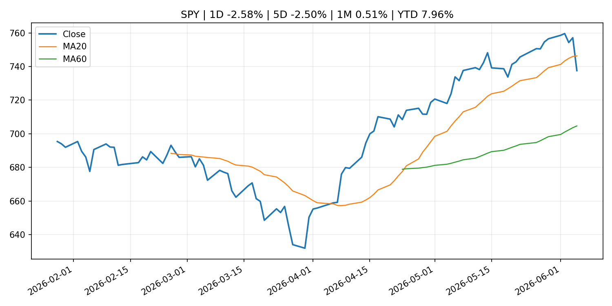
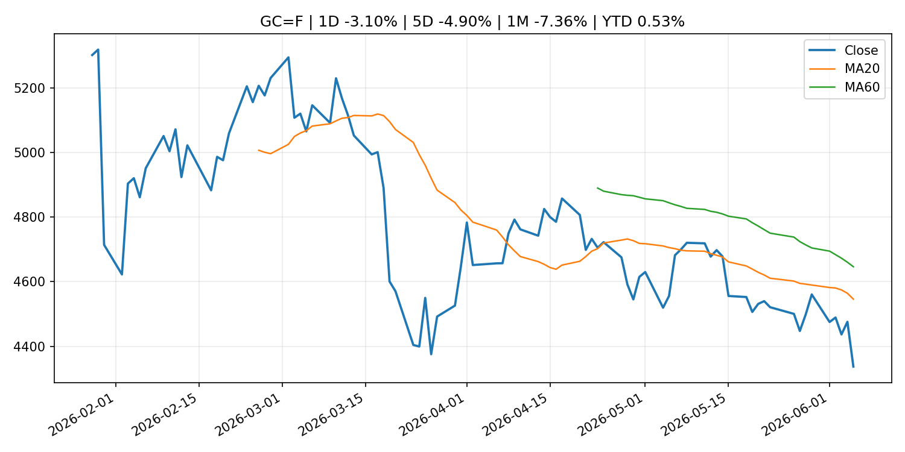
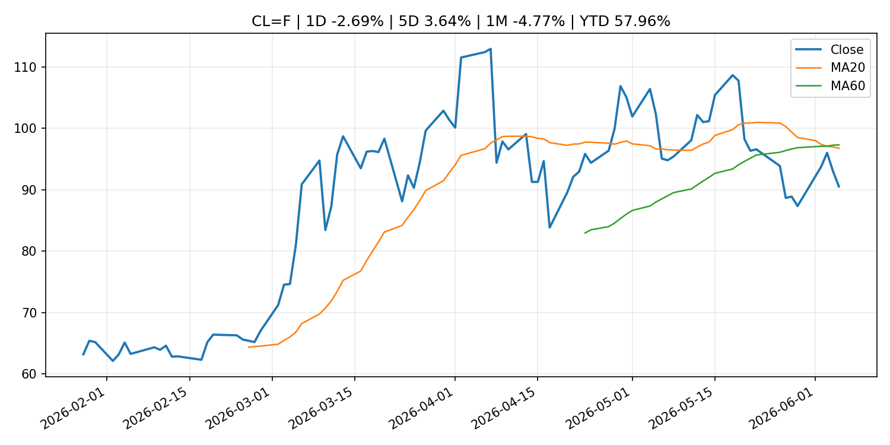
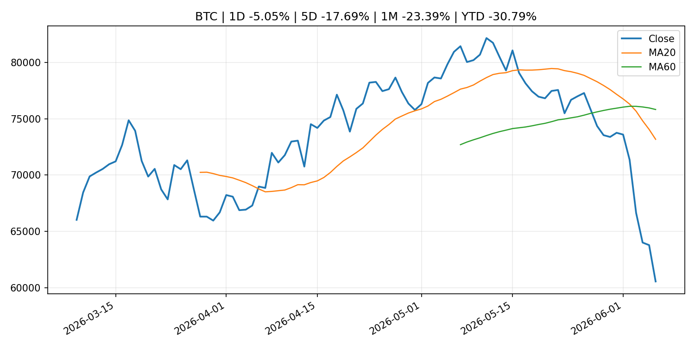
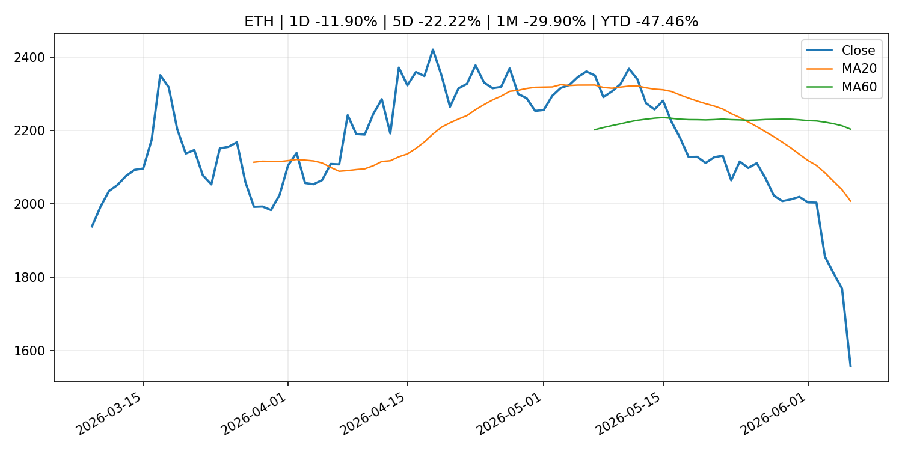
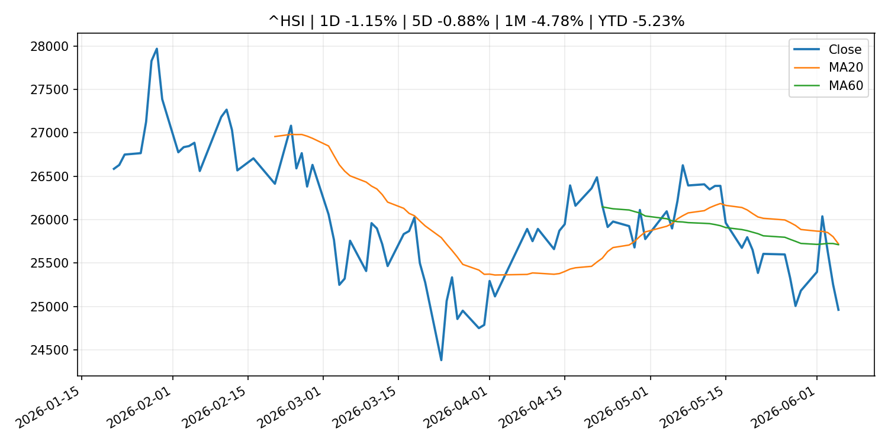

# Global Macro Morning Briefing - 2026-06-07

> Not financial advice / 非投资建议。

## 0. 今日总览
- 市场状态：mixed。长债下跌、美元走强且成长股承压，市场像是在交易利率冲击。 但存在信号冲突，需要降低单一叙事置信度。
- 今日三大主线：
  1. central_bank_decision: South Korea is the ultimate backdoor tech play — but stock investors now face a looming threat
  2. earnings: Meta is paying creators in Stablecoins. Spending them is someone else's problem
  3. earnings: Wall Street hated these 15 stocks. Then their earnings proved the analysts wrong.
- 一句话结论：今日晨报重点关注：央行决策会重定价利率、汇率、久期资产和风险资产。；大型科技股盈利和资本开支会影响纳指、半导体和 AI 交易主线。。跨资产方面，SPY 1D -2.58%；QQQ 1D -4.80%；^VIX 1D 39.68%；TLT 1D -0.51%；GC=F 1D -3.10%；CL=F 1D -2.69%；BTC 1D -5.05%；ETH 1D -11.90%；长债下跌、美元走强且成长股承压，市场像是在交易利率冲击。 但存在信号冲突，需要降低单一叙事置信度。政策、通胀、利率、美元、美债、能源和加密监管仍是主要观察线索。所有结论仅基于公开数据与短摘要整理，不构成投资建议。

## 1. 隔夜跨资产市场
- 美股：SPY 1D -2.58%，QQQ 1D -4.80%，整体趋势需结合 VIX 和利率确认。
- 美债/美元：TLT 1D -0.51%，美元指数 1D 0.66%，是判断折现率压力的核心线索。
- 黄金/原油：黄金 1D -3.10%，原油 1D -2.69%，用于观察避险、通胀和地缘风险。
- 加密：BTC 1D -5.05%，ETH 1D -11.90%，关注是否独立于纳指走出加密自身行情。
- 港股/A股：恒生 1D -1.15%，沪深300/上证 1D n/a，重点看中国政策预期与人民币线索。
- 风险观察：关注美债收益率、实际利率和成长股估值压力。

### US_EQUITY

| symbol | latest close | 1D | 5D | 1M | YTD | trend |
|---|---:|---:|---:|---:|---:|---|
| SPY | 737.55 | -2.58% | -2.50% | 0.51% | 7.96% | range_bound |
| QQQ | 705.06 | -4.80% | -4.50% | 1.34% | 15.00% | range_bound |
| DIA | 509.70 | -1.35% | -0.21% | 2.13% | 5.39% | uptrend |
| IWM | 281.65 | -3.55% | -3.02% | -1.80% | 13.21% | range_bound |
| VTI | 363.38 | -2.68% | -2.46% | 0.42% | 8.05% | range_bound |

### US_MACRO_MARKET

| symbol | latest close | 1D | 5D | 1M | YTD | trend |
|---|---:|---:|---:|---:|---:|---|
| ^VIX | 21.51 | 39.68% | 40.40% | 25.94% | 48.24% | range_bound |
| DX-Y.NYB | 100.07 | 0.66% | 1.17% | 2.09% | 1.68% | range_bound |
| TLT | 85.06 | -0.51% | -0.82% | -1.18% | -2.26% | range_bound |
| IEF | 93.62 | -0.53% | -1.09% | -1.45% | -2.56% | downtrend |

### COMMODITIES

| symbol | latest close | 1D | 5D | 1M | YTD | trend |
|---|---:|---:|---:|---:|---:|---|
| GC=F | 4,337.10 | -3.10% | -4.90% | -7.36% | 0.53% | strong_downtrend |
| SI=F | 68.94 | -6.55% | -8.82% | -10.24% | -2.29% | range_bound |
| CL=F | 90.54 | -2.69% | 3.64% | -4.77% | 57.96% | strong_downtrend |
| BZ=F | 93.09 | -2.04% | 1.13% | -8.08% | 53.23% | strong_downtrend |
| NG=F | 3.23 | -3.21% | -1.85% | 18.28% | -10.75% | strong_uptrend |
| HG=F | 6.26 | -3.80% | -1.51% | 2.07% | 11.05% | range_bound |

### HK_MARKET

| symbol | latest close | 1D | 5D | 1M | YTD | trend |
|---|---:|---:|---:|---:|---:|---|
| ^HSI | 24,961.95 | -1.15% | -0.88% | -4.78% | -5.23% | range_bound |
| 0700.HK | 453.20 | -1.26% | 6.09% | -2.12% | -27.26% | range_bound |
| 9988.HK | 122.40 | -0.89% | 1.24% | -8.79% | -17.85% | strong_downtrend |
| 3690.HK | 79.95 | 1.72% | 8.85% | -3.09% | -23.57% | downtrend |
| 1810.HK | 27.80 | -2.04% | -0.86% | -9.80% | -30.98% | strong_downtrend |
| 1211.HK | 89.70 | -2.29% | -1.75% | -9.30% | -9.16% | strong_downtrend |

### CRYPTO

| symbol | latest close | 1D | 5D | 1M | YTD | trend |
|---|---:|---:|---:|---:|---:|---|
| BTC | 60,574.87 | -5.05% | -17.69% | -23.39% | -30.79% | strong_downtrend |
| ETH | 1,558.65 | -11.90% | -22.22% | -29.90% | -47.46% | strong_downtrend |
| SOLANA | 61.79 | -10.16% | -24.86% | -30.73% | -50.38% | strong_downtrend |
| BINANCECOIN | 572.80 | -5.19% | -19.15% | -14.78% | -33.64% | range_bound |
| RIPPLE | 1.09 | -6.81% | -18.26% | -24.14% | -40.86% | strong_downtrend |

## 2. 今日最重要的 10 条新闻
### 1. South Korea is the ultimate backdoor tech play — but stock investors now face a looming threat
- 来源：MarketWatch Top Stories
- 时间：2026-06-06T17:33:00+00:00
- 地区：US
- 事件类型：central_bank_decision
- 重要性层级：Tier 1
- 一句话摘要：Samsung and SK Hynix are key to soaring South Korean stock market, but a rate hike could trigger a 15% market correction.
- 为什么重要：央行决策会重定价利率、汇率、久期资产和风险资产。
- 可能影响：主要影响 QQQ，方向为 negative，强度 high；鹰派政策提高折现率，压制成长股估值。
  - 资产：QQQ
    方向：negative
    强度：high
    原因：鹰派政策提高折现率，压制成长股估值。
  - 资产：SPY
    方向：negative
    强度：medium
    原因：更紧政策通常削弱风险偏好。
  - 资产：TLT
    方向：negative
    强度：high
    原因：利率上行通常压低长债价格。
  - 资产：DXY
    方向：positive
    强度：high
    原因：更高利率预期通常支撑美元。
  - 资产：BTC
    方向：negative
    强度：high
    原因：流动性收紧通常压制高 beta 加密资产。
- 原文链接：[https://www.marketwatch.com/story/south-korea-is-the-ultimate-backdoor-tech-play-but-stock-investors-now-face-a-looming-threat-25065699?mod=mw_rss_topstories](https://www.marketwatch.com/story/south-korea-is-the-ultimate-backdoor-tech-play-but-stock-investors-now-face-a-looming-threat-25065699?mod=mw_rss_topstories)

### 2. Meta is paying creators in Stablecoins. Spending them is someone else's problem
- 来源：CoinDesk
- 时间：2026-06-06T16:30:00+00:00
- 地区：global
- 事件类型：earnings
- 重要性层级：Tier 2
- 一句话摘要：Meta is paying creators in Stablecoins. Spending them is someone else's problem
- 为什么重要：大型科技股盈利和资本开支会影响纳指、半导体和 AI 交易主线。
- 可能影响：主要影响 QQQ，方向为 mixed，强度 high；AI 资本开支会影响大型科技股盈利和估值预期。
  - 资产：QQQ
    方向：mixed
    强度：high
    原因：AI 资本开支会影响大型科技股盈利和估值预期。
  - 资产：SMH
    方向：mixed
    强度：high
    原因：AI 投资周期直接影响半导体需求。
  - 资产：NVDA
    方向：mixed
    强度：high
    原因：AI 训练和推理需求是英伟达收入预期核心变量。
  - 资产：MSFT
    方向：mixed
    强度：medium
    原因：云和 AI 资本开支影响利润率与增长叙事。
  - 资产：GOOGL
    方向：mixed
    强度：medium
    原因：AI 投资和搜索商业化影响估值。
  - 资产：META
    方向：mixed
    强度：medium
    原因：AI 基建支出与广告效率共同影响市场预期。
- 原文链接：[https://www.coindesk.com/opinion/2026/06/06/meta-is-paying-creators-in-stablecoins-spending-them-is-someone-else-s-problem](https://www.coindesk.com/opinion/2026/06/06/meta-is-paying-creators-in-stablecoins-spending-them-is-someone-else-s-problem)

### 3. Wall Street hated these 15 stocks. Then their earnings proved the analysts wrong.
- 来源：MarketWatch Top Stories
- 时间：2026-06-06T17:20:00+00:00
- 地区：US
- 事件类型：earnings
- 重要性层级：Tier 2
- 一句话摘要：Earnings beats mean a lot more when it happens to stocks the market gave up on.
- 为什么重要：大型科技股盈利和资本开支会影响纳指、半导体和 AI 交易主线。
- 可能影响：可能影响利率、汇率、风险资产或大宗商品预期，但当前公开信息不足以判断明确方向。
  - 资产：暂无明确资产映射
  - 方向：unknown
  - 强度：low
  - 原因：公开信息不足以判断方向。
- 原文链接：[https://www.marketwatch.com/story/wall-street-hated-these-15-stocks-then-their-earnings-proved-the-analysts-wrong-fceb1c96?mod=mw_rss_topstories](https://www.marketwatch.com/story/wall-street-hated-these-15-stocks-then-their-earnings-proved-the-analysts-wrong-fceb1c96?mod=mw_rss_topstories)

### 4. Don’t rule out a ‘June swoon’ — the S&P 500 is pushing its limits
- 来源：MarketWatch Top Stories
- 时间：2026-06-06T16:53:00+00:00
- 地区：US
- 事件类型：earnings
- 重要性层级：Tier 2
- 一句话摘要：Even upbeat Oracle earnings next week might not be enough to rally the market.
- 为什么重要：大型科技股盈利和资本开支会影响纳指、半导体和 AI 交易主线。
- 可能影响：可能影响利率、汇率、风险资产或大宗商品预期，但当前公开信息不足以判断明确方向。
  - 资产：暂无明确资产映射
  - 方向：unknown
  - 强度：low
  - 原因：公开信息不足以判断方向。
- 原文链接：[https://www.marketwatch.com/story/dont-rule-out-a-june-swoon-the-s-p-500-is-pushing-its-limits-3c067a6b?mod=mw_rss_topstories](https://www.marketwatch.com/story/dont-rule-out-a-june-swoon-the-s-p-500-is-pushing-its-limits-3c067a6b?mod=mw_rss_topstories)

### 5. Hot jobs report puts Fed cuts further out of reach as Chair Warsh faces policy tests
- 来源：CNBC Economy
- 时间：2026-06-05T19:09:09+00:00
- 地区：US
- 事件类型：central_bank_speech
- 重要性层级：Tier 2
- 一句话摘要：Another big jobs report in May has swept aside the possibility of interest rate cuts anytime soon.
- 为什么重要：央行官员表态可能影响市场对下一次会议的定价。
- 可能影响：可能影响利率、汇率、风险资产或大宗商品预期，但当前公开信息不足以判断明确方向。
  - 资产：暂无明确资产映射
  - 方向：unknown
  - 强度：low
  - 原因：公开信息不足以判断方向。
- 原文链接：[https://www.cnbc.com/2026/06/05/hot-jobs-report-puts-fed-cuts-further-out-of-reach-as-chair-warsh-faces-policy-tests.html](https://www.cnbc.com/2026/06/05/hot-jobs-report-puts-fed-cuts-further-out-of-reach-as-chair-warsh-faces-policy-tests.html)

### 6. Bitcoin, ether eye worst weekly rout since FTX collapse as cryptos shed $390 billion
- 来源：CoinDesk
- 时间：2026-06-06T19:58:54+00:00
- 地区：global
- 事件类型：other
- 重要性层级：Tier 3
- 一句话摘要：Bitcoin, ether eye worst weekly rout since FTX collapse as cryptos shed $390 billion
- 为什么重要：这条信息暂未匹配到重大宏观、政策或市场事件，更适合作为背景跟踪。
- 可能影响：更偏背景信息，短期市场影响可能有限。
  - 资产：暂无明确资产映射
  - 方向：unknown
  - 强度：low
  - 原因：公开信息不足以判断方向。
- 原文链接：[https://www.coindesk.com/markets/2026/06/06/bitcoin-ether-eye-worst-weekly-rout-since-ftx-collapse-as-cryptos-shed-usd390-billion](https://www.coindesk.com/markets/2026/06/06/bitcoin-ether-eye-worst-weekly-rout-since-ftx-collapse-as-cryptos-shed-usd390-billion)

### 7. A crypto pioneer who turned a $20 million family stake into a billion-dollar fund doubles down on bitcoin
- 来源：CoinDesk
- 时间：2026-06-06T15:00:00+00:00
- 地区：global
- 事件类型：other
- 重要性层级：Tier 3
- 一句话摘要：A crypto pioneer who turned a $20 million family stake into a billion-dollar fund doubles down on bitcoin
- 为什么重要：这条信息暂未匹配到重大宏观、政策或市场事件，更适合作为背景跟踪。
- 可能影响：更偏背景信息，短期市场影响可能有限。
  - 资产：暂无明确资产映射
  - 方向：unknown
  - 强度：low
  - 原因：公开信息不足以判断方向。
- 原文链接：[https://www.coindesk.com/business/2026/06/06/a-crypto-pioneer-who-turned-a-usd20-million-family-stake-into-a-billion-dollar-fund-doubles-down-on-bitcoin](https://www.coindesk.com/business/2026/06/06/a-crypto-pioneer-who-turned-a-usd20-million-family-stake-into-a-billion-dollar-fund-doubles-down-on-bitcoin)

## 3. 政策与央行观察
### 1. South Korea is the ultimate backdoor tech play — but stock investors now face a looming threat
- 来源：MarketWatch Top Stories
- 时间：2026-06-06T17:33:00+00:00
- 地区：US
- 事件类型：central_bank_decision
- 重要性层级：Tier 1
- 一句话摘要：Samsung and SK Hynix are key to soaring South Korean stock market, but a rate hike could trigger a 15% market correction.
- 为什么重要：央行决策会重定价利率、汇率、久期资产和风险资产。
- 可能影响：主要影响 QQQ，方向为 negative，强度 high；鹰派政策提高折现率，压制成长股估值。
  - 资产：QQQ
    方向：negative
    强度：high
    原因：鹰派政策提高折现率，压制成长股估值。
  - 资产：SPY
    方向：negative
    强度：medium
    原因：更紧政策通常削弱风险偏好。
  - 资产：TLT
    方向：negative
    强度：high
    原因：利率上行通常压低长债价格。
  - 资产：DXY
    方向：positive
    强度：high
    原因：更高利率预期通常支撑美元。
  - 资产：BTC
    方向：negative
    强度：high
    原因：流动性收紧通常压制高 beta 加密资产。
- 原文链接：[https://www.marketwatch.com/story/south-korea-is-the-ultimate-backdoor-tech-play-but-stock-investors-now-face-a-looming-threat-25065699?mod=mw_rss_topstories](https://www.marketwatch.com/story/south-korea-is-the-ultimate-backdoor-tech-play-but-stock-investors-now-face-a-looming-threat-25065699?mod=mw_rss_topstories)

### 2. Hot jobs report puts Fed cuts further out of reach as Chair Warsh faces policy tests
- 来源：CNBC Economy
- 时间：2026-06-05T19:09:09+00:00
- 地区：US
- 事件类型：central_bank_speech
- 重要性层级：Tier 2
- 一句话摘要：Another big jobs report in May has swept aside the possibility of interest rate cuts anytime soon.
- 为什么重要：央行官员表态可能影响市场对下一次会议的定价。
- 可能影响：可能影响利率、汇率、风险资产或大宗商品预期，但当前公开信息不足以判断明确方向。
  - 资产：暂无明确资产映射
  - 方向：unknown
  - 强度：low
  - 原因：公开信息不足以判断方向。
- 原文链接：[https://www.cnbc.com/2026/06/05/hot-jobs-report-puts-fed-cuts-further-out-of-reach-as-chair-warsh-faces-policy-tests.html](https://www.cnbc.com/2026/06/05/hot-jobs-report-puts-fed-cuts-further-out-of-reach-as-chair-warsh-faces-policy-tests.html)

## 4. 市场异动与图表
- SPY 下跌 -2.58%
- QQQ 下跌 -4.80%
- VIX 上涨 39.68%
- TLT 下跌 -0.51%
- DXY 上涨 0.66%
- Gold 下跌 -3.10%
- Oil 下跌 -2.69%
- BTC 下跌 -5.05%
- ETH 下跌 -11.90%

### 信号矛盾
- 股债同时承压，可能是利率或流动性冲击而非传统避险。

### SPY

### QQQ

### ^VIX

### TLT

### GC=F

### CL=F

### BTC

### ETH

### ^HSI

## 5. 华尔街与机构公开观点
- 暂无可靠公开观点。

## 6. 今日重点关注
- 经济数据：经济数据：暂无可靠公开日历数据；如配置经济日历源后可自动填充。
- 央行讲话：央行讲话：暂无可靠公开日历数据；重点跟踪 Fed、ECB、BoJ、PBOC 官网 RSS。
- 财报：财报：暂无可靠数据。
- 政策事件：政策事件：暂无可靠数据。
- 风险提醒：风险提醒：关注数据源失败项、突发地缘风险、利率和美元的二阶反应。

## 7. 英文金融表达与宏观概念
- **terminal rate**：终端利率，市场预期本轮加息周期的最高政策利率。 例句：A higher terminal rate can pressure growth stocks.
- **risk-off**：避险模式，资金偏向美元、国债、黄金等防御资产。 例句：A geopolitical shock can push markets into risk-off mode.
- **market structure**：市场结构，指交易、托管、清算、ETF、监管等制度安排。 例句：Crypto market structure rules can affect institutional participation.
- **inflation expectations**：通胀预期，指家庭、企业或市场对未来通胀的预估。 例句：Inflation expectations can shape wage bargaining and bond yields.
- **real yield**：实际收益率，名义利率扣除通胀预期后的收益率。 例句：Gold often reacts more to real yields than nominal yields.
- **soft landing**：软着陆，指通胀回落而经济避免明显衰退。 例句：Markets often rally when data support a soft landing.

## 8. 背景材料
- [Bitcoin, ether eye worst weekly rout since FTX collapse as cryptos shed $390 billion](https://www.coindesk.com/markets/2026/06/06/bitcoin-ether-eye-worst-weekly-rout-since-ftx-collapse-as-cryptos-shed-usd390-billion)（CoinDesk，other）：Bitcoin, ether eye worst weekly rout since FTX collapse as cryptos shed $390 billion
- [A crypto pioneer who turned a $20 million family stake into a billion-dollar fund doubles down on bitcoin](https://www.coindesk.com/business/2026/06/06/a-crypto-pioneer-who-turned-a-usd20-million-family-stake-into-a-billion-dollar-fund-doubles-down-on-bitcoin)（CoinDesk，other）：A crypto pioneer who turned a $20 million family stake into a billion-dollar fund doubles down on bitcoin
- [Satoshi-era bitcoin at center of $285 billion lawsuit moves after 14 years](https://www.coindesk.com/markets/2026/06/06/satoshi-era-bitcoin-at-center-of-usd285-billion-lawsuit-moves-after-14-years)（CoinDesk，other）：Satoshi-era bitcoin at center of $285 billion lawsuit moves after 14 years
- [Bitcoin is cratering, but a new Wall Street crypto hype is on the rise](https://www.cnbc.com/2026/06/06/bitcoin-price-crash-crypto-hype-hyperliquid-etfs.html)（CNBC Economy，other）：As bitcoin dropped to its lowest price since 2024, investors flock to a new type of crypto investment linked to the hyperliquid platforms, HYPE ETFs.
- [Michael Saylor’s rallying cry: Bitcoin needs four forces to win](https://www.coindesk.com/markets/2026/06/06/michael-saylor-s-rallying-cry-bitcoin-needs-four-forces-to-win)（CoinDesk，other）：Michael Saylor’s rallying cry: Bitcoin needs four forces to win
- [Are retail traders selling their bitcoin to buy the SpaceX IPO?](https://www.coindesk.com/markets/2026/06/06/are-retail-traders-selling-their-bitcoin-to-buy-the-spacex-ipo)（CoinDesk，other）：Are retail traders selling their bitcoin to buy the SpaceX IPO?
- [Bitcoin back above $61,000 after rout leads to $1.6 billion liquidations](https://www.coindesk.com/markets/2026/06/06/bitcoin-back-above-usd61-000-after-rout-leads-to-usd1-6-billion-liquidations)（CoinDesk，other）：Bitcoin back above $61,000 after rout leads to $1.6 billion liquidations
- [Why diehard bitcoin purists aren’t sweating the massive price crash that wiped out $200 billion](https://www.coindesk.com/markets/2026/06/05/why-diehard-bitcoin-purists-aren-t-sweating-the-massive-price-crash-that-wiped-out-usd200-billion)（CoinDesk，other）：Why diehard bitcoin purists aren’t sweating the massive price crash that wiped out $200 billion
- [BlackRock-backed tokenization firm Securitize clears key hurdle to go public on NYSE](https://www.coindesk.com/business/2026/06/05/blackrock-backed-tokenization-firm-securitize-clears-key-hurdle-to-go-public-on-nyse)（CoinDesk，other）：BlackRock-backed tokenization firm Securitize clears key hurdle to go public on NYSE
- [Memecoins dogecoin, shiba inu dive 9% as bitcoin nears $60,000](https://www.coindesk.com/markets/2026/06/05/memecoins-dogecoin-shiba-inu-dive-9-as-bitcoin-nears-usd60-000)（CoinDesk，other）：Memecoins dogecoin, shiba inu dive 9% as bitcoin nears $60,000
- [Bitcoin loses $60,000, falls to weakest price since October 2024](https://www.coindesk.com/markets/2026/06/05/bitcoin-loses-usd60-000-falls-to-weakest-price-since-october-2024)（CoinDesk，other）：Bitcoin loses $60,000, falls to weakest price since October 2024
- [CoinDesk 20 performance update: Bitcoin (BTC) price drops 2.8% as index declines](https://www.coindesk.com/coindesk-indices/2026/06/05/coindesk-20-performance-update-bitcoin-btc-price-drops-2-8-as-index-declines)（CoinDesk，other）：CoinDesk 20 performance update: Bitcoin (BTC) price drops 2.8% as index declines
- [U.S. job growth blows past forecasts, setting stage for Fed rate hikes](https://www.coindesk.com/markets/2026/06/05/u-s-job-growth-blows-past-forecasts-setting-stage-for-fed-rate-hikes)（CoinDesk，other）：U.S. job growth blows past forecasts, setting stage for Fed rate hikes
- [Where investors may find the next 'big wave' for AI trade](https://www.cnbc.com/2026/06/05/where-investors-may-find-the-next-big-wave-for-ai-trade.html)（CNBC Economy，other）：Tim Urbanowicz, chief investment strategist at Innovator from Goldman Sachs Asset Management, tackles the AI boom.
- [Live updates: bitcoin tumbles to $60,000 as blowout jobs data, Zcash bug keeps pressure on crypto](https://www.coindesk.com/tech/2026/06/05/live-updates-bitcoin-below-usd62-000-ahead-of-jobs-data-as-zcash-bug-rocks-crypto)（CoinDesk，other）：Live updates: bitcoin tumbles to $60,000 as blowout jobs data, Zcash bug keeps pressure on crypto
- [Amounts Outstanding in the Call Money Market (May)](http://www.boj.or.jp/en/statistics/market/short/call/call.xlsx)（Bank of Japan Announcements，other）：Amounts Outstanding in the Call Money Market (May)
- [Consumption Activity Index](http://www.boj.or.jp/en/research/research_data/cai/index.htm)（Bank of Japan Announcements，other）：Consumption Activity Index
- [Monetary Base and the Bank of Japan's Transactions (May)](http://www.boj.or.jp/en/statistics/boj/other/mbt/mbt2605.pdf)（Bank of Japan Announcements，other）：Monetary Base and the Bank of Japan's Transactions (May)
- [Bank of Japan's Transactions with the Government (May)](http://www.boj.or.jp/en/statistics/boj/other/tseifu/release/2026/seifu2605.pdf)（Bank of Japan Announcements，other）：Bank of Japan's Transactions with the Government (May)
- [Market Operations by the Bank of Japan (May)](http://www.boj.or.jp/en/statistics/boj/fm/ope/m_release/2026/ope2605.xlsx)（Bank of Japan Announcements，other）：Market Operations by the Bank of Japan (May)

## 9. 数据源、失败项与免责声明
- 采集时间：2026-06-06T23:02:03
- 数据源：公开 RSS、Yahoo Finance、CoinGecko、AKShare、FRED、SEC data.sec.gov，以及用户自有 inputs/reports 文件。
- 合规说明：不绕过 WSJ、Bloomberg、FT、Reuters 等付费墙；对付费媒体只使用公开 RSS 标题、摘要、链接和发布时间。
- 免责声明：Not financial advice / 非投资建议。本项目仅供个人学习、研究和信息整理，不构成投资建议、交易建议或任何收益承诺。
- 失败或跳过的数据源：
  - crypto data failed coin=dogecoin
  - China market data failed symbol=上证指数: empty dataframe
  - China market data failed symbol=深证成指: empty dataframe
  - China market data failed symbol=创业板指: empty dataframe
  - China market data failed symbol=沪深300: empty dataframe
  - China market data failed symbol=中证500: empty dataframe
  - China market data failed symbol=科创50: empty dataframe
  - FRED_API_KEY not set; skipping FRED macro series
  - SEC failed cik=0000320193
  - SEC failed cik=0000789019
  - SEC failed cik=0001045810
  - SEC failed cik=0001318605
  - SEC failed cik=0001577552
