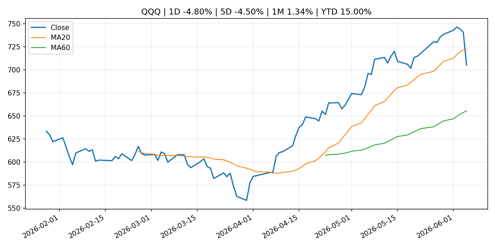
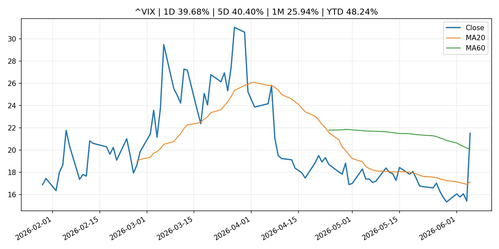
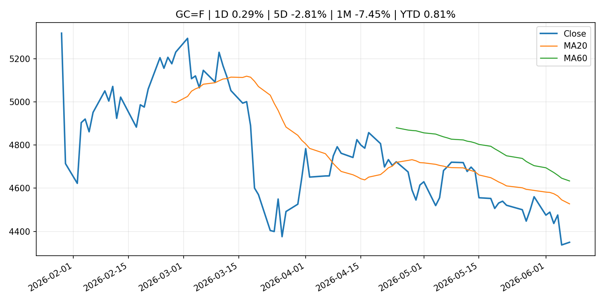
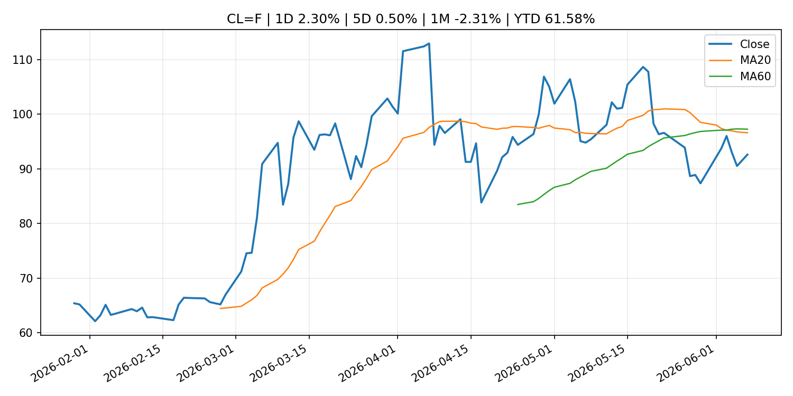
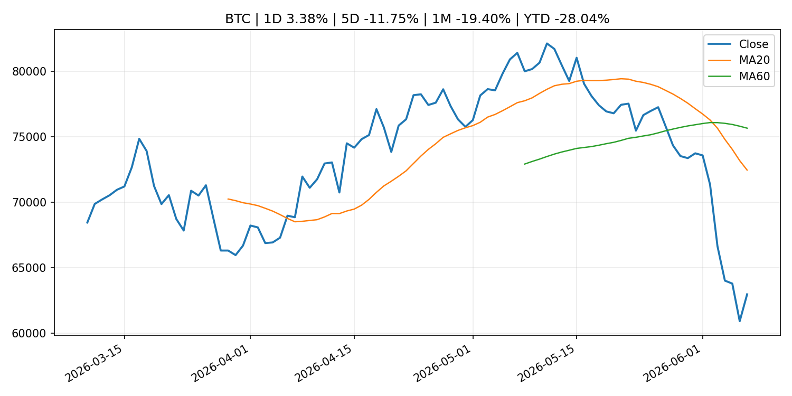
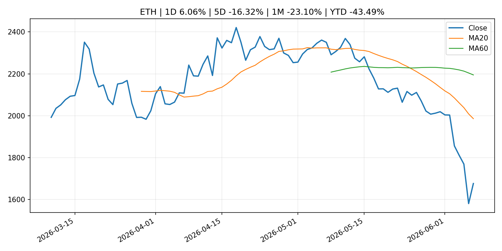

# Global Macro Morning Briefing - 2026-06-08

> Not financial advice / 非投资建议。

## 0. 今日总览
- 市场状态：mixed。市场信号不足，暂不判断明确状态。 但存在信号冲突，需要降低单一叙事置信度。
- 今日三大主线：
  1. earnings: Meta is paying creators in Stablecoins. Spending them is someone else's problem
- 一句话结论：今日晨报重点关注：大型科技股盈利和资本开支会影响纳指、半导体和 AI 交易主线。；这条信息暂未匹配到重大宏观、政策或市场事件，更适合作为背景跟踪。。跨资产方面，SPY 1D -2.58%；QQQ 1D -4.80%；^VIX 1D 39.68%；TLT 1D -0.51%；GC=F 1D 0.29%；CL=F 1D 2.30%；BTC 1D 3.38%；ETH 1D 6.06%；市场信号不足，暂不判断明确状态。 但存在信号冲突，需要降低单一叙事置信度。政策、通胀、利率、美元、美债、能源和加密监管仍是主要观察线索。所有结论仅基于公开数据与短摘要整理，不构成投资建议。

## 1. 隔夜跨资产市场
- 美股：SPY 1D -2.58%，QQQ 1D -4.80%，整体趋势需结合 VIX 和利率确认。
- 美债/美元：TLT 1D -0.51%，美元指数 1D 0.07%，是判断折现率压力的核心线索。
- 黄金/原油：黄金 1D 0.29%，原油 1D 2.30%，用于观察避险、通胀和地缘风险。
- 加密：BTC 1D 3.38%，ETH 1D 6.06%，关注是否独立于纳指走出加密自身行情。
- 港股/A股：恒生 1D -1.15%，沪深300/上证 1D n/a，重点看中国政策预期与人民币线索。
- 风险观察：关注后续数据是否确认当前跨资产信号。

### US_EQUITY

| symbol | latest close | 1D | 5D | 1M | YTD | trend |
|---|---:|---:|---:|---:|---:|---|
| SPY | 737.55 | -2.58% | -2.50% | 0.51% | 7.96% | range_bound |
| QQQ | 705.06 | -4.80% | -4.50% | 1.34% | 15.00% | range_bound |
| DIA | 509.70 | -1.35% | -0.21% | 2.13% | 5.39% | uptrend |
| IWM | 281.65 | -3.55% | -3.02% | -1.80% | 13.21% | range_bound |
| VTI | 363.38 | -2.68% | -2.46% | 0.42% | 8.05% | range_bound |

### US_MACRO_MARKET

| symbol | latest close | 1D | 5D | 1M | YTD | trend |
|---|---:|---:|---:|---:|---:|---|
| ^VIX | 21.51 | 39.68% | 40.40% | 25.94% | 48.24% | range_bound |
| DX-Y.NYB | 100.14 | 0.07% | 0.95% | 1.93% | 1.75% | uptrend |
| TLT | 85.06 | -0.51% | -0.82% | -1.18% | -2.26% | range_bound |
| IEF | 93.62 | -0.53% | -1.09% | -1.45% | -2.56% | downtrend |

### COMMODITIES

| symbol | latest close | 1D | 5D | 1M | YTD | trend |
|---|---:|---:|---:|---:|---:|---|
| GC=F | 4,349.50 | 0.29% | -2.81% | -7.45% | 0.81% | strong_downtrend |
| SI=F | 67.79 | -1.67% | -9.62% | -14.94% | -3.91% | range_bound |
| CL=F | 92.62 | 2.30% | 0.50% | -2.31% | 61.58% | downtrend |
| BZ=F | 95.38 | 2.46% | 0.42% | -4.68% | 57.00% | strong_downtrend |
| NG=F | 3.19 | -1.33% | 0.22% | 15.06% | -11.94% | strong_uptrend |
| HG=F | 6.26 | -0.10% | -4.09% | 2.11% | 10.94% | range_bound |

### HK_MARKET

| symbol | latest close | 1D | 5D | 1M | YTD | trend |
|---|---:|---:|---:|---:|---:|---|
| ^HSI | 24,961.95 | -1.15% | -0.88% | -4.78% | -5.23% | range_bound |
| 0700.HK | 453.20 | -1.26% | 6.09% | -2.12% | -27.26% | range_bound |
| 9988.HK | 122.40 | -0.89% | 1.24% | -8.79% | -17.85% | strong_downtrend |
| 3690.HK | 79.95 | 1.72% | 8.85% | -3.09% | -23.57% | downtrend |
| 1810.HK | 27.80 | -2.04% | -0.86% | -9.80% | -30.98% | strong_downtrend |
| 1211.HK | 89.70 | -2.29% | -1.75% | -9.30% | -9.16% | strong_downtrend |

### CRYPTO

| symbol | latest close | 1D | 5D | 1M | YTD | trend |
|---|---:|---:|---:|---:|---:|---|
| BTC | 62,978.38 | 3.38% | -11.75% | -19.40% | -28.04% | strong_downtrend |
| ETH | 1,676.41 | 6.06% | -16.32% | -23.10% | -43.49% | strong_downtrend |
| SOLANA | 65.97 | 3.99% | -18.69% | -23.75% | -47.02% | strong_downtrend |
| BINANCECOIN | 604.44 | 5.69% | -12.71% | -7.86% | -29.97% | range_bound |
| RIPPLE | 1.16 | 5.37% | -10.79% | -18.28% | -37.20% | strong_downtrend |

## 2. 今日最重要的 10 条新闻
### 1. Meta is paying creators in Stablecoins. Spending them is someone else's problem
- 来源：CoinDesk
- 时间：2026-06-06T16:30:00+00:00
- 地区：global
- 事件类型：earnings
- 重要性层级：Tier 2
- 一句话摘要：Meta is paying creators in Stablecoins. Spending them is someone else's problem
- 为什么重要：大型科技股盈利和资本开支会影响纳指、半导体和 AI 交易主线。
- 可能影响：主要影响 QQQ，方向为 mixed，强度 high；AI 资本开支会影响大型科技股盈利和估值预期。
  - 资产：QQQ
    方向：mixed
    强度：high
    原因：AI 资本开支会影响大型科技股盈利和估值预期。
  - 资产：SMH
    方向：mixed
    强度：high
    原因：AI 投资周期直接影响半导体需求。
  - 资产：NVDA
    方向：mixed
    强度：high
    原因：AI 训练和推理需求是英伟达收入预期核心变量。
  - 资产：MSFT
    方向：mixed
    强度：medium
    原因：云和 AI 资本开支影响利润率与增长叙事。
  - 资产：GOOGL
    方向：mixed
    强度：medium
    原因：AI 投资和搜索商业化影响估值。
  - 资产：META
    方向：mixed
    强度：medium
    原因：AI 基建支出与广告效率共同影响市场预期。
- 原文链接：[https://www.coindesk.com/opinion/2026/06/06/meta-is-paying-creators-in-stablecoins-spending-them-is-someone-else-s-problem](https://www.coindesk.com/opinion/2026/06/06/meta-is-paying-creators-in-stablecoins-spending-them-is-someone-else-s-problem)

### 2. Bitcoin is cratering, but a new Wall Street crypto hype is on the rise
- 来源：CNBC Economy
- 时间：2026-06-07T18:56:25+00:00
- 地区：US
- 事件类型：other
- 重要性层级：Tier 3
- 一句话摘要：As bitcoin dropped to its lowest price since 2024, investors flock to a new type of crypto investment linked to the hyperliquid platforms, HYPE ETFs.
- 为什么重要：这条信息暂未匹配到重大宏观、政策或市场事件，更适合作为背景跟踪。
- 可能影响：更偏背景信息，短期市场影响可能有限。
  - 资产：暂无明确资产映射
  - 方向：unknown
  - 强度：low
  - 原因：公开信息不足以判断方向。
- 原文链接：[https://www.cnbc.com/2026/06/06/bitcoin-price-crash-crypto-hype-hyperliquid-etfs.html](https://www.cnbc.com/2026/06/06/bitcoin-price-crash-crypto-hype-hyperliquid-etfs.html)

### 3. Michael Saylor revives bitcoin-buy speculation as scrutiny over Strategy grows
- 来源：CoinDesk
- 时间：2026-06-07T17:41:57+00:00
- 地区：global
- 事件类型：other
- 重要性层级：Tier 3
- 一句话摘要：Michael Saylor revives bitcoin-buy speculation as scrutiny over Strategy grows
- 为什么重要：这条信息暂未匹配到重大宏观、政策或市场事件，更适合作为背景跟踪。
- 可能影响：更偏背景信息，短期市场影响可能有限。
  - 资产：暂无明确资产映射
  - 方向：unknown
  - 强度：low
  - 原因：公开信息不足以判断方向。
- 原文链接：[https://www.coindesk.com/business/2026/06/06/michael-saylor-revives-bitcoin-buy-speculation-as-scrutiny-over-strategy-grows](https://www.coindesk.com/business/2026/06/06/michael-saylor-revives-bitcoin-buy-speculation-as-scrutiny-over-strategy-grows)

## 3. 政策与央行观察
暂无可靠数据。

- 为什么重要：没有可靠新闻时，不应为了填充版面编造市场解释。

## 4. 市场异动与图表
- SPY 下跌 -2.58%
- QQQ 下跌 -4.80%
- VIX 上涨 39.68%
- TLT 下跌 -0.51%
- Oil 上涨 2.30%
- BTC 上涨 3.38%
- ETH 上涨 6.06%

### 信号矛盾
- 股债同时承压，可能是利率或流动性冲击而非传统避险。
- 加密资产走强但美股走弱，可能是加密市场自身事件驱动。

### SPY

### QQQ

### ^VIX

### TLT

### GC=F

### CL=F

### BTC

### ETH

### ^HSI

## 5. 华尔街与机构公开观点
- 暂无可靠公开观点。

## 6. 今日重点关注
- 经济数据：经济数据：暂无可靠公开日历数据；如配置经济日历源后可自动填充。
- 央行讲话：央行讲话：暂无可靠公开日历数据；重点跟踪 Fed、ECB、BoJ、PBOC 官网 RSS。
- 财报：财报：暂无可靠数据。
- 政策事件：政策事件：暂无可靠数据。
- 风险提醒：风险提醒：关注数据源失败项、突发地缘风险、利率和美元的二阶反应。

## 7. 英文金融表达与宏观概念
- **market structure**：市场结构，指交易、托管、清算、ETF、监管等制度安排。 例句：Crypto market structure rules can affect institutional participation.
- **inflation expectations**：通胀预期，指家庭、企业或市场对未来通胀的预估。 例句：Inflation expectations can shape wage bargaining and bond yields.
- **real yield**：实际收益率，名义利率扣除通胀预期后的收益率。 例句：Gold often reacts more to real yields than nominal yields.
- **terminal rate**：终端利率，市场预期本轮加息周期的最高政策利率。 例句：A higher terminal rate can pressure growth stocks.
- **soft landing**：软着陆，指通胀回落而经济避免明显衰退。 例句：Markets often rally when data support a soft landing.
- **risk-off**：避险模式，资金偏向美元、国债、黄金等防御资产。 例句：A geopolitical shock can push markets into risk-off mode.

## 8. 背景材料
- [Bitcoin is cratering, but a new Wall Street crypto hype is on the rise](https://www.cnbc.com/2026/06/06/bitcoin-price-crash-crypto-hype-hyperliquid-etfs.html)（CNBC Economy，other）：As bitcoin dropped to its lowest price since 2024, investors flock to a new type of crypto investment linked to the hyperliquid platforms, HYPE ETFs.
- [Michael Saylor revives bitcoin-buy speculation as scrutiny over Strategy grows](https://www.coindesk.com/business/2026/06/06/michael-saylor-revives-bitcoin-buy-speculation-as-scrutiny-over-strategy-grows)（CoinDesk，other）：Michael Saylor revives bitcoin-buy speculation as scrutiny over Strategy grows
- [Bitcoin near $60,000 today vs February: Institutional sentiment has flipped](https://www.coindesk.com/markets/2026/06/07/bitcoin-near-usd60-000-today-vs-february-institutional-mood-is-starkly-different)（CoinDesk，other）：Bitcoin near $60,000 today vs February: Institutional sentiment has flipped
- [Bitcoin's slide has no single cause. AI, tech IPOs, quantum, Strategy sale all play a role, NYDIG says](https://www.coindesk.com/markets/2026/06/07/bitcoin-s-slide-has-no-single-cause-ai-tech-ipos-quantum-strategy-sale-all-play-a-role-nydig-says)（CoinDesk，other）：Bitcoin's slide has no single cause. AI, tech IPOs, quantum, Strategy sale all play a role, NYDIG says
- [Bitcoin, ether eye worst weekly rout since FTX collapse as cryptos shed $390 billion](https://www.coindesk.com/markets/2026/06/06/bitcoin-ether-eye-worst-weekly-rout-since-ftx-collapse-as-cryptos-shed-usd390-billion)（CoinDesk，other）：Bitcoin, ether eye worst weekly rout since FTX collapse as cryptos shed $390 billion
- [A crypto pioneer who turned a $20 million family stake into a billion-dollar fund doubles down on bitcoin](https://www.coindesk.com/business/2026/06/06/a-crypto-pioneer-who-turned-a-usd20-million-family-stake-into-a-billion-dollar-fund-doubles-down-on-bitcoin)（CoinDesk，other）：A crypto pioneer who turned a $20 million family stake into a billion-dollar fund doubles down on bitcoin
- [Satoshi-era bitcoin at center of $285 billion lawsuit moves after 14 years](https://www.coindesk.com/markets/2026/06/06/satoshi-era-bitcoin-at-center-of-usd285-billion-lawsuit-moves-after-14-years)（CoinDesk，other）：Satoshi-era bitcoin at center of $285 billion lawsuit moves after 14 years
- [Michael Saylor’s rallying cry: Bitcoin needs four forces to win](https://www.coindesk.com/markets/2026/06/06/michael-saylor-s-rallying-cry-bitcoin-needs-four-forces-to-win)（CoinDesk，other）：Michael Saylor’s rallying cry: Bitcoin needs four forces to win
- [Are retail traders selling their bitcoin to buy the SpaceX IPO?](https://www.coindesk.com/markets/2026/06/06/are-retail-traders-selling-their-bitcoin-to-buy-the-spacex-ipo)（CoinDesk，other）：Are retail traders selling their bitcoin to buy the SpaceX IPO?
- [Bitcoin back above $61,000 after rout leads to $1.6 billion liquidations](https://www.coindesk.com/markets/2026/06/06/bitcoin-back-above-usd61-000-after-rout-leads-to-usd1-6-billion-liquidations)（CoinDesk，other）：Bitcoin back above $61,000 after rout leads to $1.6 billion liquidations

## 9. 数据源、失败项与免责声明
- 采集时间：2026-06-07T23:04:15
- 数据源：公开 RSS、Yahoo Finance、CoinGecko、AKShare、FRED、SEC data.sec.gov，以及用户自有 inputs/reports 文件。
- 合规说明：不绕过 WSJ、Bloomberg、FT、Reuters 等付费墙；对付费媒体只使用公开 RSS 标题、摘要、链接和发布时间。
- 免责声明：Not financial advice / 非投资建议。本项目仅供个人学习、研究和信息整理，不构成投资建议、交易建议或任何收益承诺。
- 失败或跳过的数据源：
  - crypto data failed coin=dogecoin
  - China market data failed symbol=上证指数: empty dataframe
  - China market data failed symbol=深证成指: empty dataframe
  - China market data failed symbol=创业板指: empty dataframe
  - China market data failed symbol=沪深300: empty dataframe
  - China market data failed symbol=中证500: empty dataframe
  - China market data failed symbol=科创50: empty dataframe
  - FRED_API_KEY not set; skipping FRED macro series
  - SEC failed cik=0000320193
  - SEC failed cik=0000789019
  - SEC failed cik=0001045810
  - SEC failed cik=0001318605
  - SEC failed cik=0001577552
