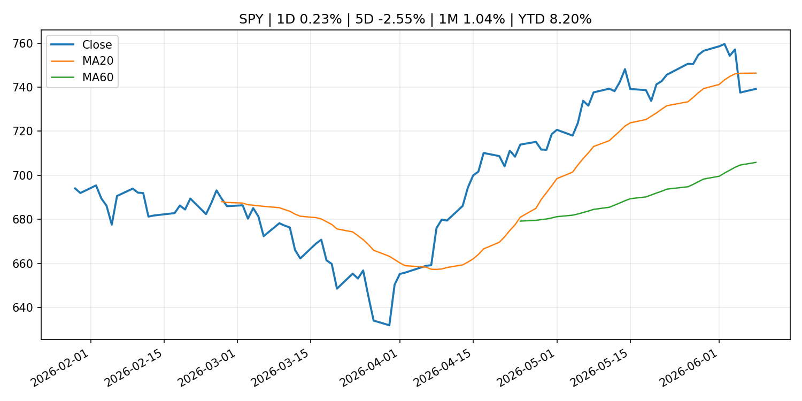
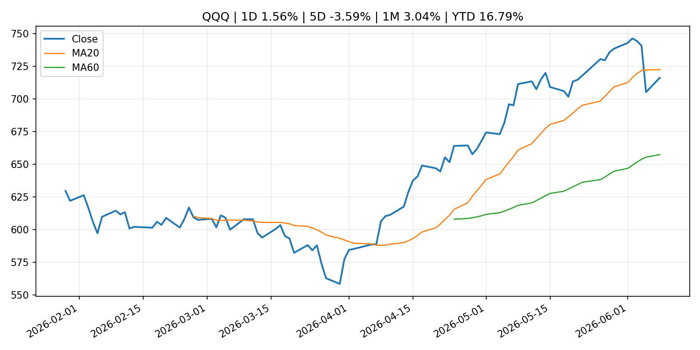
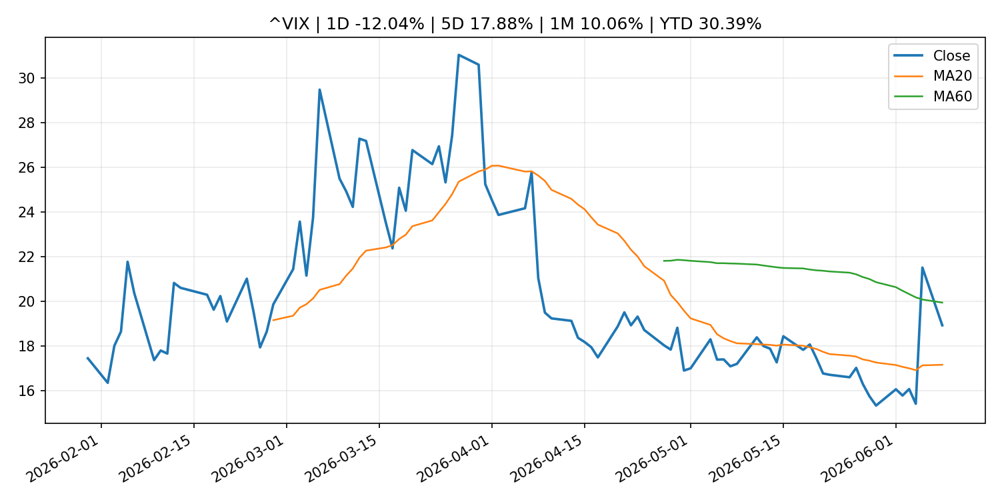
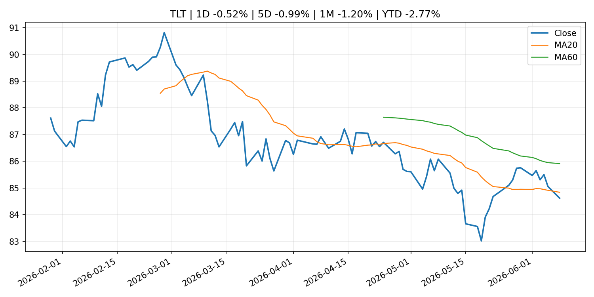
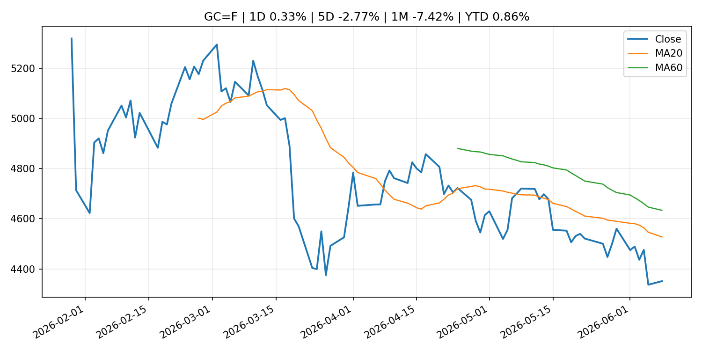
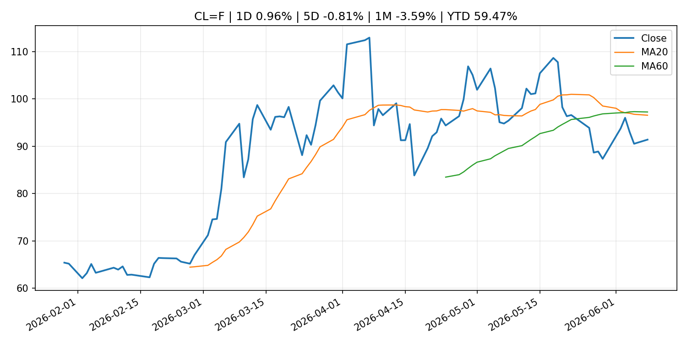
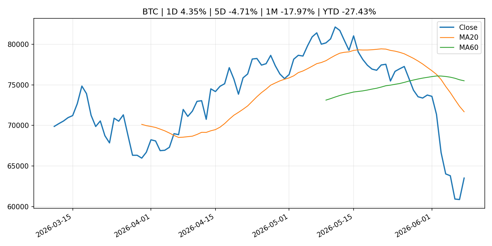
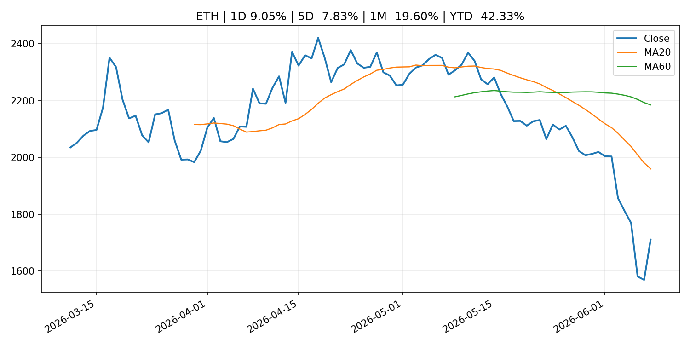
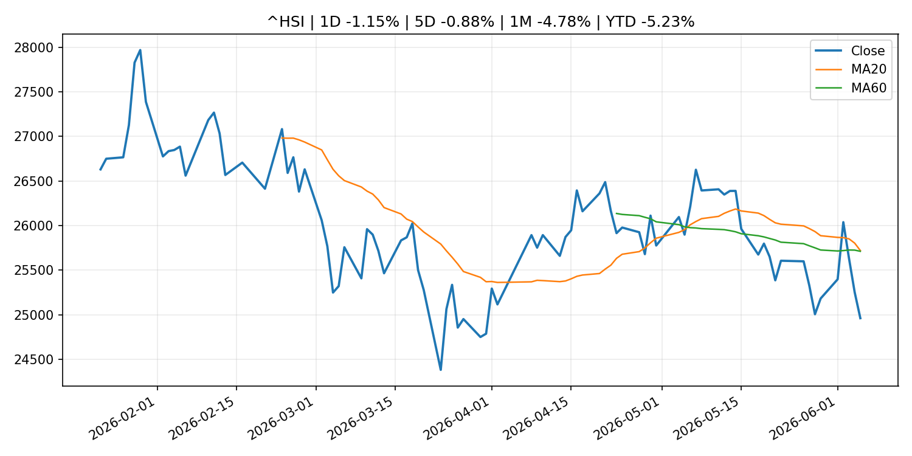

# Global Macro Morning Briefing - 2026-06-09

> Not financial advice / 非投资建议。

## 0. 今日总览
- 市场状态：unknown。市场信号不足，暂不判断明确状态。
- 今日三大主线：
  1. central_bank_decision: U.S. inflation, European Central Bank rate decision: Crypto Week Ahead
  2. central_bank_speech: Inflation could top 4% this week. The bond market wants Fed Chair Warsh to prove he’ll fight it.
  3. regulation: SEC Establishes Joint Data Standards as Required Under the Financial Data Transparency Act of 2022
- 一句话结论：今日晨报重点关注：央行决策会重定价利率、汇率、久期资产和风险资产。；央行官员表态可能影响市场对下一次会议的定价。。跨资产方面，SPY 1D 0.23%；QQQ 1D 1.56%；^VIX 1D -12.04%；TLT 1D -0.52%；GC=F 1D 0.33%；CL=F 1D 0.96%；BTC 1D 4.35%；ETH 1D 9.05%；市场信号不足，暂不判断明确状态。政策、通胀、利率、美元、美债、能源和加密监管仍是主要观察线索。所有结论仅基于公开数据与短摘要整理，不构成投资建议。

## 1. 隔夜跨资产市场
- 美股：SPY 1D 0.23%，QQQ 1D 1.56%，整体趋势需结合 VIX 和利率确认。
- 美债/美元：TLT 1D -0.52%，美元指数 1D -0.07%，是判断折现率压力的核心线索。
- 黄金/原油：黄金 1D 0.33%，原油 1D 0.96%，用于观察避险、通胀和地缘风险。
- 加密：BTC 1D 4.35%，ETH 1D 9.05%，关注是否独立于纳指走出加密自身行情。
- 港股/A股：恒生 1D -1.15%，沪深300/上证 1D n/a，重点看中国政策预期与人民币线索。
- 风险观察：关注后续数据是否确认当前跨资产信号。

### US_EQUITY

| symbol | latest close | 1D | 5D | 1M | YTD | trend |
|---|---:|---:|---:|---:|---:|---|
| SPY | 739.22 | 0.23% | -2.55% | 1.04% | 8.20% | range_bound |
| QQQ | 716.07 | 1.56% | -3.59% | 3.04% | 16.79% | range_bound |
| DIA | 508.91 | -0.15% | -0.49% | 2.62% | 5.23% | uptrend |
| IWM | 284.11 | 0.87% | -1.69% | 0.66% | 14.20% | range_bound |
| VTI | 364.47 | 0.30% | -2.39% | 1.19% | 8.37% | range_bound |

### US_MACRO_MARKET

| symbol | latest close | 1D | 5D | 1M | YTD | trend |
|---|---:|---:|---:|---:|---:|---|
| ^VIX | 18.92 | -12.04% | 17.88% | 10.06% | 30.39% | range_bound |
| DX-Y.NYB | 100.00 | -0.07% | 0.81% | 1.78% | 1.61% | uptrend |
| TLT | 84.62 | -0.52% | -0.99% | -1.20% | -2.77% | downtrend |
| IEF | 93.52 | -0.11% | -0.69% | -1.26% | -2.66% | downtrend |

### COMMODITIES

| symbol | latest close | 1D | 5D | 1M | YTD | trend |
|---|---:|---:|---:|---:|---:|---|
| GC=F | 4,351.30 | 0.33% | -2.77% | -7.42% | 0.86% | strong_downtrend |
| SI=F | 68.27 | -0.98% | -8.98% | -14.34% | -3.24% | range_bound |
| CL=F | 91.41 | 0.96% | -0.81% | -3.59% | 59.47% | strong_downtrend |
| BZ=F | 94.35 | 1.35% | -0.66% | -5.71% | 55.31% | strong_downtrend |
| NG=F | 3.14 | -2.85% | -1.32% | 13.29% | -13.29% | uptrend |
| HG=F | 6.34 | 1.17% | -2.87% | 3.41% | 12.35% | range_bound |

### HK_MARKET

| symbol | latest close | 1D | 5D | 1M | YTD | trend |
|---|---:|---:|---:|---:|---:|---|
| ^HSI | 24,961.95 | -1.15% | -0.88% | -4.78% | -5.23% | range_bound |
| 0700.HK | 446.40 | -1.50% | 2.39% | -6.49% | -28.35% | downtrend |
| 9988.HK | 118.80 | -2.94% | -3.26% | -15.68% | -20.27% | strong_downtrend |
| 3690.HK | 76.25 | -4.63% | -2.56% | -9.50% | -27.10% | strong_downtrend |
| 1810.HK | 27.38 | -1.51% | -4.67% | -12.02% | -32.03% | strong_downtrend |
| 1211.HK | 88.05 | -1.84% | -2.98% | -12.56% | -10.84% | strong_downtrend |

### CRYPTO

| symbol | latest close | 1D | 5D | 1M | YTD | trend |
|---|---:|---:|---:|---:|---:|---|
| BTC | 63,511.00 | 4.35% | -4.71% | -17.97% | -27.43% | strong_downtrend |
| ETH | 1,710.81 | 9.05% | -7.83% | -19.60% | -42.33% | strong_downtrend |
| SOLANA | 67.25 | 8.19% | -9.09% | -21.03% | -45.99% | strong_downtrend |
| BINANCECOIN | 606.54 | 5.59% | -6.70% | -6.34% | -29.73% | range_bound |
| RIPPLE | 1.18 | 7.68% | -2.60% | -15.98% | -36.00% | strong_downtrend |

## 2. 今日最重要的 10 条新闻
### 1. U.S. inflation, European Central Bank rate decision: Crypto Week Ahead
- 来源：CoinDesk
- 时间：2026-06-08T09:46:21+00:00
- 地区：global
- 事件类型：central_bank_decision
- 重要性层级：Tier 1
- 一句话摘要：U.S. inflation, European Central Bank rate decision: Crypto Week Ahead
- 为什么重要：央行决策会重定价利率、汇率、久期资产和风险资产。
- 可能影响：主要影响 DXY，方向为 positive，强度 high；通胀压力可能推高政策利率预期并支撑美元。
  - 资产：DXY
    方向：positive
    强度：high
    原因：通胀压力可能推高政策利率预期并支撑美元。
  - 资产：TLT
    方向：negative
    强度：high
    原因：通胀上行通常推升收益率、压低长债价格。
  - 资产：QQQ
    方向：negative
    强度：high
    原因：更高利率对成长股估值折现率不利。
  - 资产：SPY
    方向：mixed
    强度：medium
    原因：名义增长可能支撑收入，但更高利率压制估值。
  - 资产：GC=F
    方向：mixed
    强度：medium
    原因：通胀对黄金是支撑，但实际利率上行会形成压力。
  - 资产：BTC
    方向：mixed
    强度：medium
    原因：抗通胀叙事和流动性收紧可能相互抵消。
- 原文链接：[https://www.coindesk.com/markets/2026/06/08/u-s-inflation-european-central-bank-rate-decision-crypto-week-ahead](https://www.coindesk.com/markets/2026/06/08/u-s-inflation-european-central-bank-rate-decision-crypto-week-ahead)

### 2. Inflation could top 4% this week. The bond market wants Fed Chair Warsh to prove he’ll fight it.
- 来源：MarketWatch Top Stories
- 时间：2026-06-08T20:52:00+00:00
- 地区：US
- 事件类型：central_bank_speech
- 重要性层级：Tier 2
- 一句话摘要：Investors are growing impatient with inflation that looks unlikely to be tamed on its own.
- 为什么重要：央行官员表态可能影响市场对下一次会议的定价。
- 可能影响：主要影响 DXY，方向为 positive，强度 high；通胀压力可能推高政策利率预期并支撑美元。
  - 资产：DXY
    方向：positive
    强度：high
    原因：通胀压力可能推高政策利率预期并支撑美元。
  - 资产：TLT
    方向：negative
    强度：high
    原因：通胀上行通常推升收益率、压低长债价格。
  - 资产：QQQ
    方向：negative
    强度：high
    原因：更高利率对成长股估值折现率不利。
  - 资产：SPY
    方向：mixed
    强度：medium
    原因：名义增长可能支撑收入，但更高利率压制估值。
  - 资产：GC=F
    方向：mixed
    强度：medium
    原因：通胀对黄金是支撑，但实际利率上行会形成压力。
  - 资产：BTC
    方向：mixed
    强度：medium
    原因：抗通胀叙事和流动性收紧可能相互抵消。
- 原文链接：[https://www.marketwatch.com/story/inflation-could-top-4-this-week-the-bond-market-wants-fed-chair-warsh-to-prove-hell-fight-it-fbb6b04b?mod=mw_rss_topstories](https://www.marketwatch.com/story/inflation-could-top-4-this-week-the-bond-market-wants-fed-chair-warsh-to-prove-hell-fight-it-fbb6b04b?mod=mw_rss_topstories)

### 3. SEC Establishes Joint Data Standards as Required Under the Financial Data Transparency Act of 2022
- 来源：SEC Press Releases
- 时间：2026-06-08T10:36:00-04:00
- 地区：US
- 事件类型：regulation
- 重要性层级：Tier 2
- 一句话摘要：The U.S. Securities and Exchange Commission established joint data standards under the Financial Data Transparency Act of 2022. The final rule establishes technical standards for data submitted to certain financial regulatory agencies. Eight additional…
- 为什么重要：监管变化会改变行业盈利预期和资产风险溢价。
- 可能影响：主要影响 BTC，方向为 mixed，强度 high；加密监管或 ETF 进展会改变 BTC 的资金流和风险溢价。
  - 资产：BTC
    方向：mixed
    强度：high
    原因：加密监管或 ETF 进展会改变 BTC 的资金流和风险溢价。
  - 资产：ETH
    方向：mixed
    强度：high
    原因：监管框架会影响 ETH 产品化和机构参与度。
  - 资产：COIN
    方向：mixed
    强度：medium
    原因：监管清晰度和执法风险会影响交易平台估值。
  - 资产：crypto market
    方向：mixed
    强度：high
    原因：信息影响整个加密市场结构，但方向取决于细节。
- 原文链接：[https://www.sec.gov/newsroom/press-releases/2026-53-sec-establishes-joint-data-standards-required-under-financial-data-transparency-act-2022](https://www.sec.gov/newsroom/press-releases/2026-53-sec-establishes-joint-data-standards-required-under-financial-data-transparency-act-2022)

### 4. Micron’s stock bounces back in a big way: ‘The memory trade is alive and well’
- 来源：MarketWatch Top Stories
- 时间：2026-06-08T20:55:00+00:00
- 地区：US
- 事件类型：earnings
- 重要性层级：Tier 2
- 一句话摘要：Long-term supply agreements are altering memory companies’ long-term earnings potential for the better, an analyst said.
- 为什么重要：大型科技股盈利和资本开支会影响纳指、半导体和 AI 交易主线。
- 可能影响：可能影响利率、汇率、风险资产或大宗商品预期，但当前公开信息不足以判断明确方向。
  - 资产：暂无明确资产映射
  - 方向：unknown
  - 强度：low
  - 原因：公开信息不足以判断方向。
- 原文链接：[https://www.marketwatch.com/story/microns-stock-bounces-back-in-a-big-way-the-memory-trade-is-alive-and-well-3466929f?mod=mw_rss_topstories](https://www.marketwatch.com/story/microns-stock-bounces-back-in-a-big-way-the-memory-trade-is-alive-and-well-3466929f?mod=mw_rss_topstories)

### 5. An inflation storm is brewing in the Pacific Ocean — and your portfolio isn’t ready
- 来源：MarketWatch Top Stories
- 时间：2026-06-08T21:37:00+00:00
- 地区：US
- 事件类型：other
- 重要性层级：Tier 3
- 一句话摘要：A looming climate shock threatens to drive up global commodity prices. These investments can help protect your purchasing power.
- 为什么重要：这条信息暂未匹配到重大宏观、政策或市场事件，更适合作为背景跟踪。
- 可能影响：主要影响 DXY，方向为 positive，强度 high；通胀压力可能推高政策利率预期并支撑美元。
  - 资产：DXY
    方向：positive
    强度：high
    原因：通胀压力可能推高政策利率预期并支撑美元。
  - 资产：TLT
    方向：negative
    强度：high
    原因：通胀上行通常推升收益率、压低长债价格。
  - 资产：QQQ
    方向：negative
    强度：high
    原因：更高利率对成长股估值折现率不利。
  - 资产：SPY
    方向：mixed
    强度：medium
    原因：名义增长可能支撑收入，但更高利率压制估值。
  - 资产：GC=F
    方向：mixed
    强度：medium
    原因：通胀对黄金是支撑，但实际利率上行会形成压力。
  - 资产：BTC
    方向：mixed
    强度：medium
    原因：抗通胀叙事和流动性收紧可能相互抵消。
- 原文链接：[https://www.marketwatch.com/story/an-inflation-storm-is-brewing-in-the-pacific-ocean-and-your-portfolio-isnt-ready-f200fc60?mod=mw_rss_topstories](https://www.marketwatch.com/story/an-inflation-storm-is-brewing-in-the-pacific-ocean-and-your-portfolio-isnt-ready-f200fc60?mod=mw_rss_topstories)

### 6. Blame bitcoin's tumble on rising inflation, not Strategy, 10xResearch argues
- 来源：CoinDesk
- 时间：2026-06-08T14:37:27+00:00
- 地区：global
- 事件类型：other
- 重要性层级：Tier 3
- 一句话摘要：Blame bitcoin's tumble on rising inflation, not Strategy, 10xResearch argues
- 为什么重要：这条信息暂未匹配到重大宏观、政策或市场事件，更适合作为背景跟踪。
- 可能影响：主要影响 DXY，方向为 positive，强度 high；通胀压力可能推高政策利率预期并支撑美元。
  - 资产：DXY
    方向：positive
    强度：high
    原因：通胀压力可能推高政策利率预期并支撑美元。
  - 资产：TLT
    方向：negative
    强度：high
    原因：通胀上行通常推升收益率、压低长债价格。
  - 资产：QQQ
    方向：negative
    强度：high
    原因：更高利率对成长股估值折现率不利。
  - 资产：SPY
    方向：mixed
    强度：medium
    原因：名义增长可能支撑收入，但更高利率压制估值。
  - 资产：GC=F
    方向：mixed
    强度：medium
    原因：通胀对黄金是支撑，但实际利率上行会形成压力。
  - 资产：BTC
    方向：mixed
    强度：medium
    原因：抗通胀叙事和流动性收紧可能相互抵消。
- 原文链接：[https://www.coindesk.com/markets/2026/06/08/blame-bitcoin-s-tumble-on-rising-inflation-not-strategy-10xresearch-argues](https://www.coindesk.com/markets/2026/06/08/blame-bitcoin-s-tumble-on-rising-inflation-not-strategy-10xresearch-argues)

## 3. 政策与央行观察
### 1. U.S. inflation, European Central Bank rate decision: Crypto Week Ahead
- 来源：CoinDesk
- 时间：2026-06-08T09:46:21+00:00
- 地区：global
- 事件类型：central_bank_decision
- 重要性层级：Tier 1
- 一句话摘要：U.S. inflation, European Central Bank rate decision: Crypto Week Ahead
- 为什么重要：央行决策会重定价利率、汇率、久期资产和风险资产。
- 可能影响：主要影响 DXY，方向为 positive，强度 high；通胀压力可能推高政策利率预期并支撑美元。
  - 资产：DXY
    方向：positive
    强度：high
    原因：通胀压力可能推高政策利率预期并支撑美元。
  - 资产：TLT
    方向：negative
    强度：high
    原因：通胀上行通常推升收益率、压低长债价格。
  - 资产：QQQ
    方向：negative
    强度：high
    原因：更高利率对成长股估值折现率不利。
  - 资产：SPY
    方向：mixed
    强度：medium
    原因：名义增长可能支撑收入，但更高利率压制估值。
  - 资产：GC=F
    方向：mixed
    强度：medium
    原因：通胀对黄金是支撑，但实际利率上行会形成压力。
  - 资产：BTC
    方向：mixed
    强度：medium
    原因：抗通胀叙事和流动性收紧可能相互抵消。
- 原文链接：[https://www.coindesk.com/markets/2026/06/08/u-s-inflation-european-central-bank-rate-decision-crypto-week-ahead](https://www.coindesk.com/markets/2026/06/08/u-s-inflation-european-central-bank-rate-decision-crypto-week-ahead)

### 2. Inflation could top 4% this week. The bond market wants Fed Chair Warsh to prove he’ll fight it.
- 来源：MarketWatch Top Stories
- 时间：2026-06-08T20:52:00+00:00
- 地区：US
- 事件类型：central_bank_speech
- 重要性层级：Tier 2
- 一句话摘要：Investors are growing impatient with inflation that looks unlikely to be tamed on its own.
- 为什么重要：央行官员表态可能影响市场对下一次会议的定价。
- 可能影响：主要影响 DXY，方向为 positive，强度 high；通胀压力可能推高政策利率预期并支撑美元。
  - 资产：DXY
    方向：positive
    强度：high
    原因：通胀压力可能推高政策利率预期并支撑美元。
  - 资产：TLT
    方向：negative
    强度：high
    原因：通胀上行通常推升收益率、压低长债价格。
  - 资产：QQQ
    方向：negative
    强度：high
    原因：更高利率对成长股估值折现率不利。
  - 资产：SPY
    方向：mixed
    强度：medium
    原因：名义增长可能支撑收入，但更高利率压制估值。
  - 资产：GC=F
    方向：mixed
    强度：medium
    原因：通胀对黄金是支撑，但实际利率上行会形成压力。
  - 资产：BTC
    方向：mixed
    强度：medium
    原因：抗通胀叙事和流动性收紧可能相互抵消。
- 原文链接：[https://www.marketwatch.com/story/inflation-could-top-4-this-week-the-bond-market-wants-fed-chair-warsh-to-prove-hell-fight-it-fbb6b04b?mod=mw_rss_topstories](https://www.marketwatch.com/story/inflation-could-top-4-this-week-the-bond-market-wants-fed-chair-warsh-to-prove-hell-fight-it-fbb6b04b?mod=mw_rss_topstories)

### 3. SEC Establishes Joint Data Standards as Required Under the Financial Data Transparency Act of 2022
- 来源：SEC Press Releases
- 时间：2026-06-08T10:36:00-04:00
- 地区：US
- 事件类型：regulation
- 重要性层级：Tier 2
- 一句话摘要：The U.S. Securities and Exchange Commission established joint data standards under the Financial Data Transparency Act of 2022. The final rule establishes technical standards for data submitted to certain financial regulatory agencies. Eight additional…
- 为什么重要：监管变化会改变行业盈利预期和资产风险溢价。
- 可能影响：主要影响 BTC，方向为 mixed，强度 high；加密监管或 ETF 进展会改变 BTC 的资金流和风险溢价。
  - 资产：BTC
    方向：mixed
    强度：high
    原因：加密监管或 ETF 进展会改变 BTC 的资金流和风险溢价。
  - 资产：ETH
    方向：mixed
    强度：high
    原因：监管框架会影响 ETH 产品化和机构参与度。
  - 资产：COIN
    方向：mixed
    强度：medium
    原因：监管清晰度和执法风险会影响交易平台估值。
  - 资产：crypto market
    方向：mixed
    强度：high
    原因：信息影响整个加密市场结构，但方向取决于细节。
- 原文链接：[https://www.sec.gov/newsroom/press-releases/2026-53-sec-establishes-joint-data-standards-required-under-financial-data-transparency-act-2022](https://www.sec.gov/newsroom/press-releases/2026-53-sec-establishes-joint-data-standards-required-under-financial-data-transparency-act-2022)

## 4. 市场异动与图表
- QQQ 上涨 1.56%
- VIX 下跌 -12.04%
- TLT 下跌 -0.52%
- BTC 上涨 4.35%
- ETH 上涨 9.05%

### SPY

### QQQ

### ^VIX

### TLT

### GC=F

### CL=F

### BTC

### ETH

### ^HSI

## 5. 华尔街与机构公开观点
- 暂无可靠公开观点。

## 6. 今日重点关注
- 经济数据：经济数据：暂无可靠公开日历数据；如配置经济日历源后可自动填充。
- 央行讲话：央行讲话：暂无可靠公开日历数据；重点跟踪 Fed、ECB、BoJ、PBOC 官网 RSS。
- 财报：财报：暂无可靠数据。
- 政策事件：政策事件：暂无可靠数据。
- 风险提醒：风险提醒：关注数据源失败项、突发地缘风险、利率和美元的二阶反应。

## 7. 英文金融表达与宏观概念
- **inflation expectations**：通胀预期，指家庭、企业或市场对未来通胀的预估。 例句：Inflation expectations can shape wage bargaining and bond yields.
- **real yield**：实际收益率，名义利率扣除通胀预期后的收益率。 例句：Gold often reacts more to real yields than nominal yields.
- **risk-off**：避险模式，资金偏向美元、国债、黄金等防御资产。 例句：A geopolitical shock can push markets into risk-off mode.
- **market structure**：市场结构，指交易、托管、清算、ETF、监管等制度安排。 例句：Crypto market structure rules can affect institutional participation.
- **terminal rate**：终端利率，市场预期本轮加息周期的最高政策利率。 例句：A higher terminal rate can pressure growth stocks.
- **soft landing**：软着陆，指通胀回落而经济避免明显衰退。 例句：Markets often rally when data support a soft landing.

## 8. 背景材料
- [An inflation storm is brewing in the Pacific Ocean — and your portfolio isn’t ready](https://www.marketwatch.com/story/an-inflation-storm-is-brewing-in-the-pacific-ocean-and-your-portfolio-isnt-ready-f200fc60?mod=mw_rss_topstories)（MarketWatch Top Stories，other）：A looming climate shock threatens to drive up global commodity prices. These investments can help protect your purchasing power.
- [Live updates: Bitcoin tops $63,000 as Strategy adds $100 million BTC in latest purchase](https://www.coindesk.com/business/2026/06/08/live-updates-bitcoin-above-usd63-400-as-strategy-adds-usd100-million-btc-in-latest-purchase)（CoinDesk，other）：Live updates: Bitcoin tops $63,000 as Strategy adds $100 million BTC in latest purchase
- [Bitcoin is cratering, but a new Wall Street crypto hype is on the rise](https://www.cnbc.com/2026/06/06/bitcoin-price-crash-crypto-hype-hyperliquid-etfs.html)（CNBC Economy，other）：As bitcoin dropped to its lowest price since 2024, investors flock to a new type of crypto investment linked to the hyperliquid platforms, HYPE ETFs.
- [Blame bitcoin's tumble on rising inflation, not Strategy, 10xResearch argues](https://www.coindesk.com/markets/2026/06/08/blame-bitcoin-s-tumble-on-rising-inflation-not-strategy-10xresearch-argues)（CoinDesk，other）：Blame bitcoin's tumble on rising inflation, not Strategy, 10xResearch argues
- [MetaMask launches AI agent wallet with built-in security for crypto trades](https://www.coindesk.com/tech/2026/06/08/metamask-launches-ai-agent-wallet-with-built-in-security-for-crypto-trades)（CoinDesk，other）：MetaMask launches AI agent wallet with built-in security for crypto trades
- [Strategy buys 1,550 bitcoin one week after selling $2.5 million of coins](https://www.coindesk.com/markets/2026/06/08/strategy-buys-1-550-bitcoin-boosts-cash-reserves-to-usd1-billion)（CoinDesk，other）：Strategy buys 1,550 bitcoin one week after selling $2.5 million of coins
- [A crucial bitcoin market indicator is signaling that the worst of the crypto crash might be over](https://www.coindesk.com/markets/2026/06/08/a-crucial-bitcoin-market-indicator-is-signaling-that-the-worst-of-the-crypto-crash-might-be-over)（CoinDesk，other）：A crucial bitcoin market indicator is signaling that the worst of the crypto crash might be over
- [Bitcoin holds steady after Sunday's rally, though full-fledged reversal may take longer](https://www.coindesk.com/markets/2026/06/08/bitcoin-holds-steady-after-sunday-s-rally-though-full-fledged-reversal-may-take-longer)（CoinDesk，other）：Bitcoin holds steady after Sunday's rally, though full-fledged reversal may take longer
- [Gold slips below 200-day moving average offering glimmer of hope for bitcoin bulls](https://www.coindesk.com/markets/2026/06/08/gold-slips-below-200-day-moving-average-offering-glimmer-of-hope-for-bitcoin-bulls)（CoinDesk，other）：Gold slips below 200-day moving average offering glimmer of hope for bitcoin bulls
- [CME is letting traders bet on bitcoin volatility, not price, and two firms have already placed bets](https://www.coindesk.com/markets/2026/06/08/cme-has-a-new-bitcoin-product-monarq-and-dv-chain-made-their-first-bet)（CoinDesk，other）：CME is letting traders bet on bitcoin volatility, not price, and two firms have already placed bets
- [ECB announces main milestones for roll-out of Integrated Reporting Framework](https://www.ecb.europa.eu//press/pr/date/2026/html/ecb.pr260608~6766ec7154.en.html)（ECB Press Releases，other）：ECB announces main milestones for roll-out of Integrated Reporting Framework
- [Bitcoin's rally to $63,700 triggers $504 million losses for short sellers, most since late April](https://www.coindesk.com/markets/2026/06/08/bitcoin-pump-to-usd63-700-triggers-the-most-short-liquidations-since-late-april)（CoinDesk，other）：Bitcoin's rally to $63,700 triggers $504 million losses for short sellers, most since late April
- [Bitcoin spikes, then dumps, from $63,700 as analysts assess Strategy's next BTC moves](https://www.coindesk.com/tech/2026/06/08/major-cryptocurrencies-under-pressure-as-oil-jumps-3)（CoinDesk，other）：Bitcoin spikes, then dumps, from $63,700 as analysts assess Strategy's next BTC moves
- [Bitcoin falls back below $63,000 as Iran-Israel trade strikes and Korean stocks crash](https://www.coindesk.com/markets/2026/06/08/bitcoin-recedes-to-usd63-000-as-iran-israel-trade-strikes-and-korean-stocks-crash)（CoinDesk，other）：Bitcoin falls back below $63,000 as Iran-Israel trade strikes and Korean stocks crash
- [Hong Kong's IPO boom is developing a performance problem](https://www.cnbc.com/2026/06/08/hong-kongs-ipo-boom-is-developing-a-performance-problem.html)（CNBC Economy，other）：As Hong Kong vies with Wall Street to be the top IPO market, a growing number of pre-debut runups turn sour after their listing.
- [Principal Figures of Financial Institutions (May)](http://www.boj.or.jp/en/statistics/dl/depo/kashi/kasi2605.pdf)（Bank of Japan Announcements，other）：Principal Figures of Financial Institutions (May)
- [Michael Saylor revives bitcoin-buy speculation as scrutiny over Strategy grows](https://www.coindesk.com/business/2026/06/06/michael-saylor-revives-bitcoin-buy-speculation-as-scrutiny-over-strategy-grows)（CoinDesk，other）：Michael Saylor revives bitcoin-buy speculation as scrutiny over Strategy grows

## 9. 数据源、失败项与免责声明
- 采集时间：2026-06-08T23:12:23
- 数据源：公开 RSS、Yahoo Finance、CoinGecko、AKShare、FRED、SEC data.sec.gov，以及用户自有 inputs/reports 文件。
- 合规说明：不绕过 WSJ、Bloomberg、FT、Reuters 等付费墙；对付费媒体只使用公开 RSS 标题、摘要、链接和发布时间。
- 免责声明：Not financial advice / 非投资建议。本项目仅供个人学习、研究和信息整理，不构成投资建议、交易建议或任何收益承诺。
- 失败或跳过的数据源：
  - crypto data failed coin=dogecoin
  - China market data failed symbol=上证指数: empty dataframe
  - China market data failed symbol=深证成指: empty dataframe
  - China market data failed symbol=创业板指: empty dataframe
  - China market data failed symbol=沪深300: empty dataframe
  - China market data failed symbol=中证500: empty dataframe
  - China market data failed symbol=科创50: empty dataframe
  - FRED_API_KEY not set; skipping FRED macro series
  - SEC failed cik=0000320193
  - SEC failed cik=0000789019
  - SEC failed cik=0001045810
  - SEC failed cik=0001318605
  - SEC failed cik=0001577552
