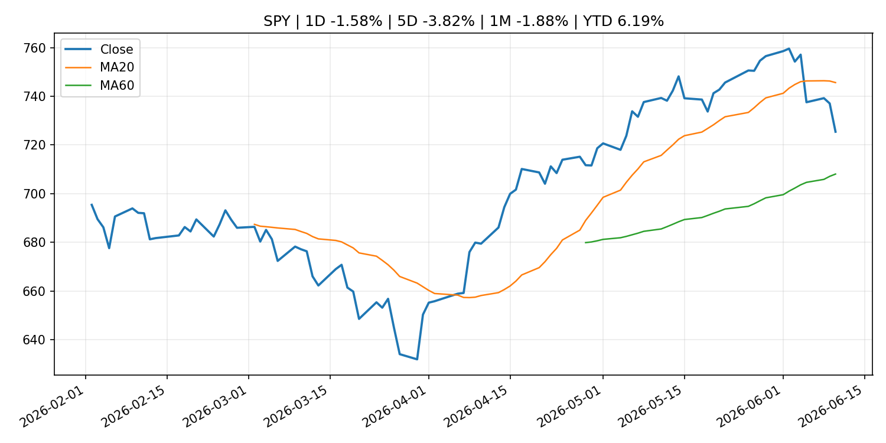
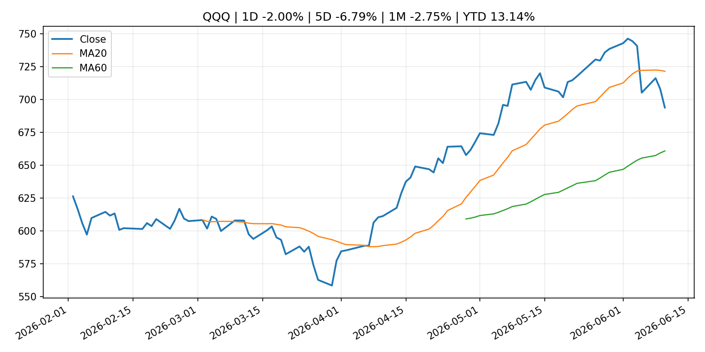
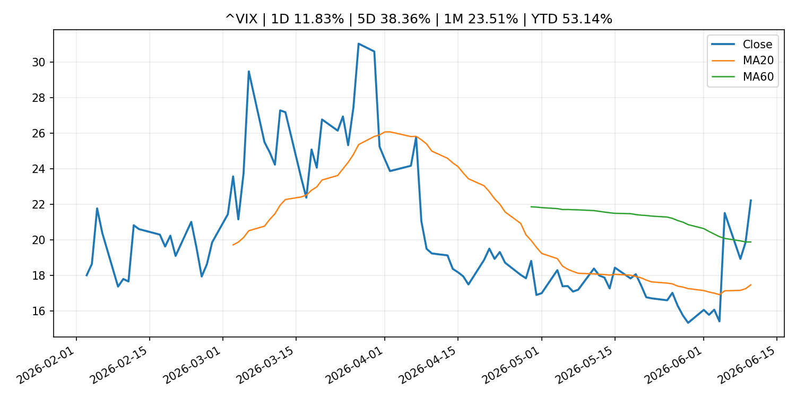
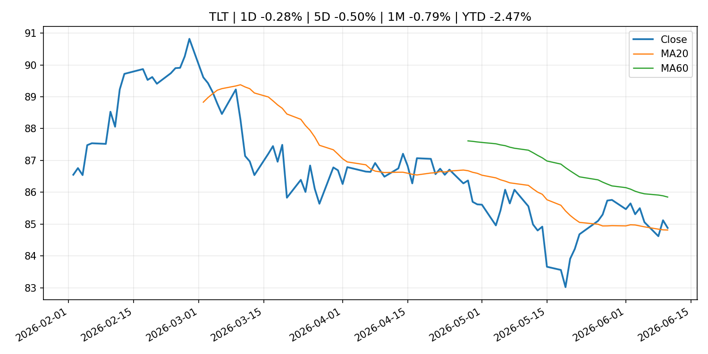
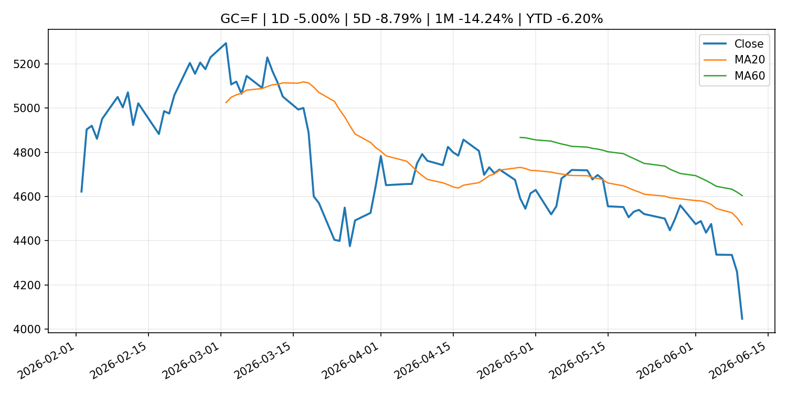
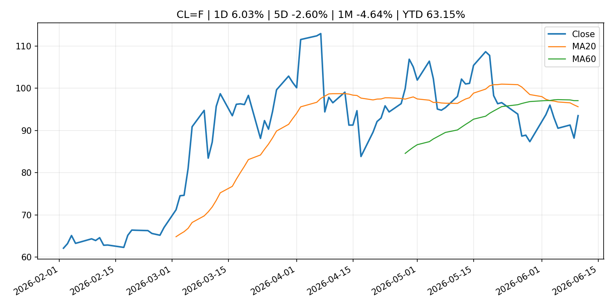
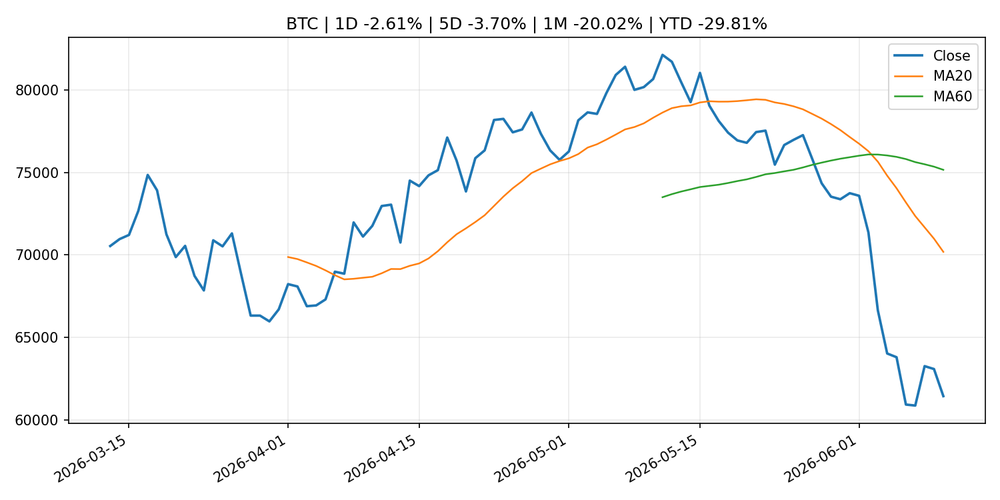
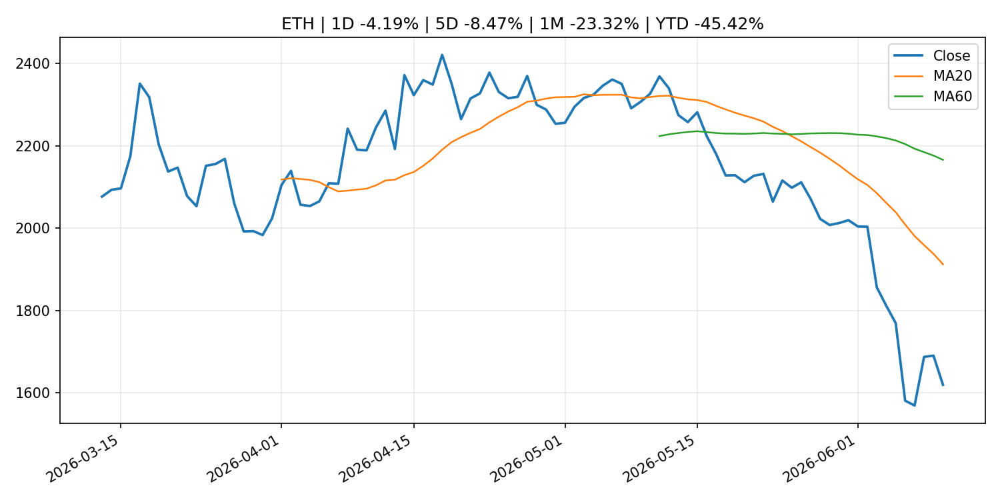
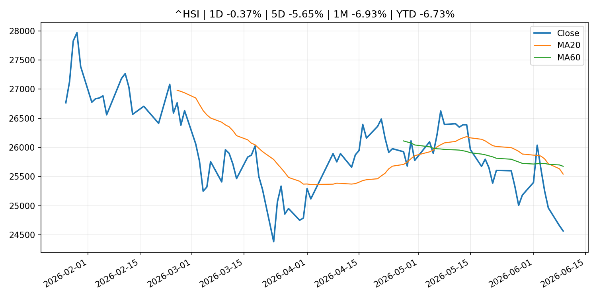

# Global Macro Morning Briefing - 2026-06-11

> Not financial advice / 非投资建议。

## 0. 今日总览
- 市场状态：unknown。市场信号不足，暂不判断明确状态。
- 今日三大主线：
  1. macro_data: Bitcoin trims losses after core CPI rises less than feared 0.2% in May
  2. financial_stability: Federal Reserve Board announces that results from its annual bank stress test will be released on Wednesday, June 24, at 4 p.m. EDT.
  3. crypto_market_structure: Netomi CEO says $5 trillion AI customer experience market could boost stablecoin demand
- 一句话结论：今日晨报重点关注：这类宏观数据会直接改变市场对通胀、增长和政策路径的预期。；金融稳定信号可能放大跨资产波动，并影响央行反应函数。。跨资产方面，SPY 1D -1.58%；QQQ 1D -2.00%；^VIX 1D 11.83%；TLT 1D -0.28%；GC=F 1D -5.00%；CL=F 1D 6.03%；BTC 1D -2.61%；ETH 1D -4.19%；市场信号不足，暂不判断明确状态。政策、通胀、利率、美元、美债、能源和加密监管仍是主要观察线索。所有结论仅基于公开数据与短摘要整理，不构成投资建议。

## 1. 隔夜跨资产市场
- 美股：SPY 1D -1.58%，QQQ 1D -2.00%，整体趋势需结合 VIX 和利率确认。
- 美债/美元：TLT 1D -0.28%，美元指数 1D -0.14%，是判断折现率压力的核心线索。
- 黄金/原油：黄金 1D -5.00%，原油 1D 6.03%，用于观察避险、通胀和地缘风险。
- 加密：BTC 1D -2.61%，ETH 1D -4.19%，关注是否独立于纳指走出加密自身行情。
- 港股/A股：恒生 1D -0.37%，沪深300/上证 1D n/a，重点看中国政策预期与人民币线索。
- 风险观察：关注后续数据是否确认当前跨资产信号。

### US_EQUITY

| symbol | latest close | 1D | 5D | 1M | YTD | trend |
|---|---:|---:|---:|---:|---:|---|
| SPY | 725.43 | -1.58% | -3.82% | -1.88% | 6.19% | range_bound |
| QQQ | 693.69 | -2.00% | -6.79% | -2.75% | 13.14% | range_bound |
| DIA | 500.25 | -1.80% | -1.58% | 0.63% | 3.44% | range_bound |
| IWM | 282.05 | -1.04% | -1.95% | -1.15% | 13.37% | range_bound |
| VTI | 358.04 | -1.55% | -3.66% | -1.54% | 6.46% | range_bound |

### US_MACRO_MARKET

| symbol | latest close | 1D | 5D | 1M | YTD | trend |
|---|---:|---:|---:|---:|---:|---|
| ^VIX | 22.22 | 11.83% | 38.36% | 23.51% | 53.14% | range_bound |
| DX-Y.NYB | 99.91 | -0.14% | 0.70% | 2.12% | 1.51% | uptrend |
| TLT | 84.88 | -0.28% | -0.50% | -0.79% | -2.47% | range_bound |
| IEF | 93.69 | -0.10% | -0.33% | -1.00% | -2.49% | downtrend |

### COMMODITIES

| symbol | latest close | 1D | 5D | 1M | YTD | trend |
|---|---:|---:|---:|---:|---:|---|
| GC=F | 4,046.90 | -5.00% | -8.79% | -14.24% | -6.20% | strong_downtrend |
| SI=F | 61.90 | -4.90% | -15.75% | -27.58% | -12.26% | strong_downtrend |
| CL=F | 93.52 | 6.03% | -2.60% | -4.64% | 63.15% | strong_downtrend |
| BZ=F | 96.35 | 5.36% | -1.49% | -7.54% | 58.60% | strong_downtrend |
| NG=F | 3.19 | 1.59% | -0.75% | 9.62% | -11.83% | strong_uptrend |
| HG=F | 6.17 | -2.05% | -4.74% | -3.74% | 9.46% | range_bound |

### HK_MARKET

| symbol | latest close | 1D | 5D | 1M | YTD | trend |
|---|---:|---:|---:|---:|---:|---|
| ^HSI | 24,565.90 | -0.37% | -5.65% | -6.93% | -6.73% | strong_downtrend |
| 0700.HK | 465.60 | 2.74% | -0.17% | 0.26% | -25.26% | range_bound |
| 9988.HK | 113.50 | -3.07% | -10.35% | -15.24% | -23.83% | strong_downtrend |
| 3690.HK | 79.00 | 2.33% | -1.74% | -6.34% | -24.47% | strong_downtrend |
| 1810.HK | 26.32 | -3.24% | -7.91% | -16.97% | -34.66% | strong_downtrend |
| 1211.HK | 86.60 | -2.04% | -7.13% | -14.85% | -12.30% | strong_downtrend |

### CRYPTO

| symbol | latest close | 1D | 5D | 1M | YTD | trend |
|---|---:|---:|---:|---:|---:|---|
| BTC | 61,433.19 | -2.61% | -3.70% | -20.02% | -29.81% | strong_downtrend |
| ETH | 1,619.24 | -4.19% | -8.47% | -23.32% | -45.42% | strong_downtrend |
| SOLANA | 62.91 | -5.70% | -8.53% | -25.34% | -49.48% | strong_downtrend |
| BINANCECOIN | 585.48 | -2.68% | -3.09% | -8.44% | -32.17% | range_bound |
| RIPPLE | 1.10 | -6.13% | -6.12% | -19.48% | -40.42% | strong_downtrend |

## 2. 今日最重要的 10 条新闻
### 1. Bitcoin trims losses after core CPI rises less than feared 0.2% in May
- 来源：CoinDesk
- 时间：2026-06-10T12:42:24+00:00
- 地区：global
- 事件类型：macro_data
- 重要性层级：Tier 1
- 一句话摘要：Bitcoin trims losses after core CPI rises less than feared 0.2% in May
- 为什么重要：这类宏观数据会直接改变市场对通胀、增长和政策路径的预期。
- 可能影响：主要影响 DXY，方向为 positive，强度 high；通胀压力可能推高政策利率预期并支撑美元。
  - 资产：DXY
    方向：positive
    强度：high
    原因：通胀压力可能推高政策利率预期并支撑美元。
  - 资产：TLT
    方向：negative
    强度：high
    原因：通胀上行通常推升收益率、压低长债价格。
  - 资产：QQQ
    方向：negative
    强度：high
    原因：更高利率对成长股估值折现率不利。
  - 资产：SPY
    方向：mixed
    强度：medium
    原因：名义增长可能支撑收入，但更高利率压制估值。
  - 资产：GC=F
    方向：mixed
    强度：medium
    原因：通胀对黄金是支撑，但实际利率上行会形成压力。
  - 资产：BTC
    方向：mixed
    强度：medium
    原因：抗通胀叙事和流动性收紧可能相互抵消。
- 原文链接：[https://www.coindesk.com/markets/2026/06/10/u-s-inflation-meets-expectations-reinforcing-fed-s-higher-for-longer-stance](https://www.coindesk.com/markets/2026/06/10/u-s-inflation-meets-expectations-reinforcing-fed-s-higher-for-longer-stance)

### 2. Federal Reserve Board announces that results from its annual bank stress test will be released on Wednesday, June 24, at 4 p.m. EDT.
- 来源：Federal Reserve Press Releases
- 时间：2026-06-09T20:00:00+00:00
- 地区：US
- 事件类型：financial_stability
- 重要性层级：Tier 1
- 一句话摘要：Federal Reserve Board announces that results from its annual bank stress test will be released on Wednesday, June 24, at 4 p.m. EDT.
- 为什么重要：金融稳定信号可能放大跨资产波动，并影响央行反应函数。
- 可能影响：可能影响利率、汇率、风险资产或大宗商品预期，但当前公开信息不足以判断明确方向。
  - 资产：暂无明确资产映射
  - 方向：unknown
  - 强度：low
  - 原因：公开信息不足以判断方向。
- 原文链接：[https://www.federalreserve.gov/newsevents/pressreleases/bcreg20260609a.htm](https://www.federalreserve.gov/newsevents/pressreleases/bcreg20260609a.htm)

### 3. Netomi CEO says $5 trillion AI customer experience market could boost stablecoin demand
- 来源：CoinDesk
- 时间：2026-06-10T16:17:18+00:00
- 地区：global
- 事件类型：crypto_market_structure
- 重要性层级：Tier 2
- 一句话摘要：Netomi CEO says $5 trillion AI customer experience market could boost stablecoin demand
- 为什么重要：加密市场结构和监管变化会影响 BTC、ETH 及相关股票的风险溢价。
- 可能影响：主要影响 BTC，方向为 mixed，强度 high；加密监管或 ETF 进展会改变 BTC 的资金流和风险溢价。
  - 资产：BTC
    方向：mixed
    强度：high
    原因：加密监管或 ETF 进展会改变 BTC 的资金流和风险溢价。
  - 资产：ETH
    方向：mixed
    强度：high
    原因：监管框架会影响 ETH 产品化和机构参与度。
  - 资产：COIN
    方向：mixed
    强度：medium
    原因：监管清晰度和执法风险会影响交易平台估值。
  - 资产：crypto market
    方向：mixed
    强度：high
    原因：信息影响整个加密市场结构，但方向取决于细节。
- 原文链接：[https://www.coindesk.com/business/2026/06/10/netomi-ceo-says-usd5-trillion-ai-customer-experience-market-could-boost-stablecoin-demand](https://www.coindesk.com/business/2026/06/10/netomi-ceo-says-usd5-trillion-ai-customer-experience-market-could-boost-stablecoin-demand)

### 4. Japan's three largest banks aim for joint stablecoin issue by March
- 来源：CoinDesk
- 时间：2026-06-10T09:01:14+00:00
- 地区：global
- 事件类型：crypto_market_structure
- 重要性层级：Tier 2
- 一句话摘要：Japan's three largest banks aim for joint stablecoin issue by March
- 为什么重要：加密市场结构和监管变化会影响 BTC、ETH 及相关股票的风险溢价。
- 可能影响：主要影响 BTC，方向为 mixed，强度 high；加密监管或 ETF 进展会改变 BTC 的资金流和风险溢价。
  - 资产：BTC
    方向：mixed
    强度：high
    原因：加密监管或 ETF 进展会改变 BTC 的资金流和风险溢价。
  - 资产：ETH
    方向：mixed
    强度：high
    原因：监管框架会影响 ETH 产品化和机构参与度。
  - 资产：COIN
    方向：mixed
    强度：medium
    原因：监管清晰度和执法风险会影响交易平台估值。
  - 资产：crypto market
    方向：mixed
    强度：high
    原因：信息影响整个加密市场结构，但方向取决于细节。
- 原文链接：[https://www.coindesk.com/business/2026/06/10/japan-s-three-largest-banks-aim-for-joint-stablecoin-issue-by-march](https://www.coindesk.com/business/2026/06/10/japan-s-three-largest-banks-aim-for-joint-stablecoin-issue-by-march)

### 5. Oracle’s stock slides after earnings, as the steep price of AI spooks investors
- 来源：MarketWatch Top Stories
- 时间：2026-06-10T23:17:00+00:00
- 地区：US
- 事件类型：earnings
- 重要性层级：Tier 2
- 一句话摘要：Oracle blew past earnings expectations and grew its contract pipeline to $638 billion, but Wall Street is concerned about its rising AI costs.
- 为什么重要：大型科技股盈利和资本开支会影响纳指、半导体和 AI 交易主线。
- 可能影响：可能影响利率、汇率、风险资产或大宗商品预期，但当前公开信息不足以判断明确方向。
  - 资产：暂无明确资产映射
  - 方向：unknown
  - 强度：low
  - 原因：公开信息不足以判断方向。
- 原文链接：[https://www.marketwatch.com/story/oracles-stock-slides-after-earnings-as-the-steep-price-of-ai-spooks-investors-0653b309?mod=mw_rss_topstories](https://www.marketwatch.com/story/oracles-stock-slides-after-earnings-as-the-steep-price-of-ai-spooks-investors-0653b309?mod=mw_rss_topstories)

### 6. Bitcoin bulls are still around. These charts show they just moved on to hotter markets.
- 来源：MarketWatch Top Stories
- 时间：2026-06-10T21:54:00+00:00
- 地区：US
- 事件类型：other
- 重要性层级：Tier 3
- 一句话摘要：Traders who once bet on crypto have not stopped gambling on the next big market story — they just are not finding that story in crypto itself.
- 为什么重要：这条信息暂未匹配到重大宏观、政策或市场事件，更适合作为背景跟踪。
- 可能影响：主要影响 DXY，方向为 positive，强度 high；通胀压力可能推高政策利率预期并支撑美元。
  - 资产：DXY
    方向：positive
    强度：high
    原因：通胀压力可能推高政策利率预期并支撑美元。
  - 资产：TLT
    方向：negative
    强度：high
    原因：通胀上行通常推升收益率、压低长债价格。
  - 资产：QQQ
    方向：negative
    强度：high
    原因：更高利率对成长股估值折现率不利。
  - 资产：SPY
    方向：mixed
    强度：medium
    原因：名义增长可能支撑收入，但更高利率压制估值。
  - 资产：GC=F
    方向：mixed
    强度：medium
    原因：通胀对黄金是支撑，但实际利率上行会形成压力。
  - 资产：BTC
    方向：mixed
    强度：medium
    原因：抗通胀叙事和流动性收紧可能相互抵消。
- 原文链接：[https://www.marketwatch.com/story/bitcoin-bulls-are-still-around-these-charts-show-they-just-moved-on-to-hotter-markets-8e04c48c?mod=mw_rss_topstories](https://www.marketwatch.com/story/bitcoin-bulls-are-still-around-these-charts-show-they-just-moved-on-to-hotter-markets-8e04c48c?mod=mw_rss_topstories)

### 7. The inflation scenario that could send bitcoin tumbling below $60,000
- 来源：CoinDesk
- 时间：2026-06-10T11:20:23+00:00
- 地区：global
- 事件类型：other
- 重要性层级：Tier 3
- 一句话摘要：The inflation scenario that could send bitcoin tumbling below $60,000
- 为什么重要：这条信息暂未匹配到重大宏观、政策或市场事件，更适合作为背景跟踪。
- 可能影响：主要影响 DXY，方向为 positive，强度 high；通胀压力可能推高政策利率预期并支撑美元。
  - 资产：DXY
    方向：positive
    强度：high
    原因：通胀压力可能推高政策利率预期并支撑美元。
  - 资产：TLT
    方向：negative
    强度：high
    原因：通胀上行通常推升收益率、压低长债价格。
  - 资产：QQQ
    方向：negative
    强度：high
    原因：更高利率对成长股估值折现率不利。
  - 资产：SPY
    方向：mixed
    强度：medium
    原因：名义增长可能支撑收入，但更高利率压制估值。
  - 资产：GC=F
    方向：mixed
    强度：medium
    原因：通胀对黄金是支撑，但实际利率上行会形成压力。
  - 资产：BTC
    方向：mixed
    强度：medium
    原因：抗通胀叙事和流动性收紧可能相互抵消。
- 原文链接：[https://www.coindesk.com/daybook-us/2026/06/10/the-inflation-scenario-that-could-send-bitcoin-tumbling-below-usd60-000](https://www.coindesk.com/daybook-us/2026/06/10/the-inflation-scenario-that-could-send-bitcoin-tumbling-below-usd60-000)

## 3. 政策与央行观察
### 1. Federal Reserve Board announces that results from its annual bank stress test will be released on Wednesday, June 24, at 4 p.m. EDT.
- 来源：Federal Reserve Press Releases
- 时间：2026-06-09T20:00:00+00:00
- 地区：US
- 事件类型：financial_stability
- 重要性层级：Tier 1
- 一句话摘要：Federal Reserve Board announces that results from its annual bank stress test will be released on Wednesday, June 24, at 4 p.m. EDT.
- 为什么重要：金融稳定信号可能放大跨资产波动，并影响央行反应函数。
- 可能影响：可能影响利率、汇率、风险资产或大宗商品预期，但当前公开信息不足以判断明确方向。
  - 资产：暂无明确资产映射
  - 方向：unknown
  - 强度：low
  - 原因：公开信息不足以判断方向。
- 原文链接：[https://www.federalreserve.gov/newsevents/pressreleases/bcreg20260609a.htm](https://www.federalreserve.gov/newsevents/pressreleases/bcreg20260609a.htm)

### 2. Netomi CEO says $5 trillion AI customer experience market could boost stablecoin demand
- 来源：CoinDesk
- 时间：2026-06-10T16:17:18+00:00
- 地区：global
- 事件类型：crypto_market_structure
- 重要性层级：Tier 2
- 一句话摘要：Netomi CEO says $5 trillion AI customer experience market could boost stablecoin demand
- 为什么重要：加密市场结构和监管变化会影响 BTC、ETH 及相关股票的风险溢价。
- 可能影响：主要影响 BTC，方向为 mixed，强度 high；加密监管或 ETF 进展会改变 BTC 的资金流和风险溢价。
  - 资产：BTC
    方向：mixed
    强度：high
    原因：加密监管或 ETF 进展会改变 BTC 的资金流和风险溢价。
  - 资产：ETH
    方向：mixed
    强度：high
    原因：监管框架会影响 ETH 产品化和机构参与度。
  - 资产：COIN
    方向：mixed
    强度：medium
    原因：监管清晰度和执法风险会影响交易平台估值。
  - 资产：crypto market
    方向：mixed
    强度：high
    原因：信息影响整个加密市场结构，但方向取决于细节。
- 原文链接：[https://www.coindesk.com/business/2026/06/10/netomi-ceo-says-usd5-trillion-ai-customer-experience-market-could-boost-stablecoin-demand](https://www.coindesk.com/business/2026/06/10/netomi-ceo-says-usd5-trillion-ai-customer-experience-market-could-boost-stablecoin-demand)

### 3. Japan's three largest banks aim for joint stablecoin issue by March
- 来源：CoinDesk
- 时间：2026-06-10T09:01:14+00:00
- 地区：global
- 事件类型：crypto_market_structure
- 重要性层级：Tier 2
- 一句话摘要：Japan's three largest banks aim for joint stablecoin issue by March
- 为什么重要：加密市场结构和监管变化会影响 BTC、ETH 及相关股票的风险溢价。
- 可能影响：主要影响 BTC，方向为 mixed，强度 high；加密监管或 ETF 进展会改变 BTC 的资金流和风险溢价。
  - 资产：BTC
    方向：mixed
    强度：high
    原因：加密监管或 ETF 进展会改变 BTC 的资金流和风险溢价。
  - 资产：ETH
    方向：mixed
    强度：high
    原因：监管框架会影响 ETH 产品化和机构参与度。
  - 资产：COIN
    方向：mixed
    强度：medium
    原因：监管清晰度和执法风险会影响交易平台估值。
  - 资产：crypto market
    方向：mixed
    强度：high
    原因：信息影响整个加密市场结构，但方向取决于细节。
- 原文链接：[https://www.coindesk.com/business/2026/06/10/japan-s-three-largest-banks-aim-for-joint-stablecoin-issue-by-march](https://www.coindesk.com/business/2026/06/10/japan-s-three-largest-banks-aim-for-joint-stablecoin-issue-by-march)

## 4. 市场异动与图表
- SPY 下跌 -1.58%
- QQQ 下跌 -2.00%
- VIX 上涨 11.83%
- Gold 下跌 -5.00%
- Oil 上涨 6.03%
- BTC 下跌 -2.61%
- ETH 下跌 -4.19%

### SPY

### QQQ

### ^VIX

### TLT

### GC=F

### CL=F

### BTC

### ETH

### ^HSI

## 5. 华尔街与机构公开观点
- 暂无可靠公开观点。

## 6. 今日重点关注
- 经济数据：经济数据：暂无可靠公开日历数据；如配置经济日历源后可自动填充。
- 央行讲话：央行讲话：暂无可靠公开日历数据；重点跟踪 Fed、ECB、BoJ、PBOC 官网 RSS。
- 财报：财报：暂无可靠数据。
- 政策事件：政策事件：暂无可靠数据。
- 风险提醒：风险提醒：关注数据源失败项、突发地缘风险、利率和美元的二阶反应。

## 7. 英文金融表达与宏观概念
- **inflation expectations**：通胀预期，指家庭、企业或市场对未来通胀的预估。 例句：Inflation expectations can shape wage bargaining and bond yields.
- **real yield**：实际收益率，名义利率扣除通胀预期后的收益率。 例句：Gold often reacts more to real yields than nominal yields.
- **market structure**：市场结构，指交易、托管、清算、ETF、监管等制度安排。 例句：Crypto market structure rules can affect institutional participation.
- **terminal rate**：终端利率，市场预期本轮加息周期的最高政策利率。 例句：A higher terminal rate can pressure growth stocks.
- **soft landing**：软着陆，指通胀回落而经济避免明显衰退。 例句：Markets often rally when data support a soft landing.
- **risk-off**：避险模式，资金偏向美元、国债、黄金等防御资产。 例句：A geopolitical shock can push markets into risk-off mode.

## 8. 背景材料
- [Micron, Intel drag the tech sector into a new bearish phase. Will the correction last this time?](https://www.marketwatch.com/story/micron-intel-drag-the-tech-sector-into-a-new-bearish-phase-will-the-correction-last-this-time-9ba4f3f5?mod=mw_rss_topstories)（MarketWatch Top Stories，other）：The selloff in the tech sector that has heightened investor anxiety over the past week graduated to a new phase on Wednesday: The pullback is over, and it’s now officially a correction.
- [Bitcoin bulls are still around. These charts show they just moved on to hotter markets.](https://www.marketwatch.com/story/bitcoin-bulls-are-still-around-these-charts-show-they-just-moved-on-to-hotter-markets-8e04c48c?mod=mw_rss_topstories)（MarketWatch Top Stories，other）：Traders who once bet on crypto have not stopped gambling on the next big market story — they just are not finding that story in crypto itself.
- [Social Security is facing a 22% cliff — 4 ways to build an income stream Washington can’t touch](https://www.marketwatch.com/story/social-security-could-face-an-automatic-22-cut-in-2032-these-4-moves-will-protect-your-retirement-a00f9463?mod=mw_rss_topstories)（MarketWatch Top Stories，other）：The countdown to insolvency is accelerating — and the rules of retirement planning just broke.
- [BlackRock and Fidelity are quietly turning bitcoin ETFs into a two-firm market](https://www.coindesk.com/markets/2026/06/10/blackrock-and-fidelity-are-quietly-turning-bitcoin-etfs-into-a-two-firm-market)（CoinDesk，other）：BlackRock and Fidelity are quietly turning bitcoin ETFs into a two-firm market
- [The quantum clock is ticking: it's Bitcoin's problem, not Ethereum's](https://www.coindesk.com/opinion/2026/06/10/the-quantum-clock-is-ticking-it-s-bitcoin-s-problem-not-ethereum-s)（CoinDesk，other）：The quantum clock is ticking: it's Bitcoin's problem, not Ethereum's
- [Frank Elderson: Interview with Het Financieele Dagblad](https://www.ecb.europa.eu//press/inter/date/2026/html/ecb.in260610~439aa97519.en.html)（ECB Press Releases，other）：Frank Elderson: Interview with Het Financieele Dagblad
- [A 'Bitcoin DeFi' project just shut down with a brutal post-mortem: Users just didn't care](https://www.coindesk.com/tech/2026/06/10/a-bitcoin-defi-project-just-shut-down-with-a-brutal-post-mortem-users-just-didn-t-care)（CoinDesk，other）：A 'Bitcoin DeFi' project just shut down with a brutal post-mortem: Users just didn't care
- [The inflation scenario that could send bitcoin tumbling below $60,000](https://www.coindesk.com/daybook-us/2026/06/10/the-inflation-scenario-that-could-send-bitcoin-tumbling-below-usd60-000)（CoinDesk，other）：The inflation scenario that could send bitcoin tumbling below $60,000
- [Zcash, Hyperliquid tokens lead losses as traders bet against a bitcoin bounce](https://www.coindesk.com/markets/2026/06/10/zcash-hyperliquid-tokens-lead-losses-as-traders-bet-against-a-bitcoin-bounce)（CoinDesk，other）：Zcash, Hyperliquid tokens lead losses as traders bet against a bitcoin bounce
- [Basic Figures on Fails (May)](http://www.boj.or.jp/en/statistics/set/bffail/sjgb2605.pdf)（Bank of Japan Announcements，other）：Basic Figures on Fails (May)
- [Live updates: bitcoin holding below $62,000 as nervous Nasdaq falls further ahead of SpaceX IPO](https://www.coindesk.com/markets/2026/06/10/live-updates-what-next-for-bitcoin-as-it-faces-headwinds-from-fed-rates-to-claude-s-mythos)（CoinDesk，other）：Live updates: bitcoin holding below $62,000 as nervous Nasdaq falls further ahead of SpaceX IPO
- [Bitcoin and gold fall together as a rate-hike bet hits every hedge](https://www.coindesk.com/markets/2026/06/10/bitcoin-and-gold-fall-together-as-a-rate-hike-bet-hits-every-hedge)（CoinDesk，other）：Bitcoin and gold fall together as a rate-hike bet hits every hedge
- [Bitcoin ETFs are no bigger today than when Trump won the election](https://www.coindesk.com/markets/2026/06/10/bitcoin-etfs-are-no-bigger-today-than-when-trump-won-the-election)（CoinDesk，other）：Bitcoin ETFs are no bigger today than when Trump won the election
- [Beijing escalating AI espionage to catch up with the U.S. on tech, cybersecurity firm says](https://www.cnbc.com/2026/06/10/crowdstrike-warns-of-increasing-chinese-ai-cyberattacks-on-us-tech.html)（CNBC Economy，other）：U.S. cybersecurity giant CrowdStrike said China-based entities made over half of state-sponsored cyberattacks on tech firms for artificial intelligence assets.
- [Corporate Goods Price Index (May)](http://www.boj.or.jp/en/statistics/pi/cgpi_release/cgpi2605.pdf)（Bank of Japan Announcements，other）：Corporate Goods Price Index (May)
- [Average Contract Interest Rates on Loans and Discounts (Apr.)](http://www.boj.or.jp/en/statistics/dl/loan/yaku/yaku2604.pdf)（Bank of Japan Announcements，other）：Average Contract Interest Rates on Loans and Discounts (Apr.)
- [Securitize CEO says tokenized stocks could unlock a $5 trillion crypto market](https://www.coindesk.com/business/2026/06/09/securitize-ceo-says-tokenized-stocks-could-unlock-a-usd5-trillion-crypto-market)（CoinDesk，other）：Securitize CEO says tokenized stocks could unlock a $5 trillion crypto market
- [JPMorgan Chase plans to deploy more powerful AI agents this year](https://www.cnbc.com/2026/06/09/jpmorgan-chase-ai-agents.html)（CNBC Economy，other）：JPMorgan Chase's move suggests long-running AI agents are close to clearing the security and governance hurdles that have slowed adoption inside big companies.
- [Money Stock (May)](http://www.boj.or.jp/en/statistics/money/ms/ms2605.pdf)（Bank of Japan Announcements，other）：Money Stock (May)

## 9. 数据源、失败项与免责声明
- 采集时间：2026-06-10T23:25:37
- 数据源：公开 RSS、Yahoo Finance、CoinGecko、AKShare、FRED、SEC data.sec.gov，以及用户自有 inputs/reports 文件。
- 合规说明：不绕过 WSJ、Bloomberg、FT、Reuters 等付费墙；对付费媒体只使用公开 RSS 标题、摘要、链接和发布时间。
- 免责声明：Not financial advice / 非投资建议。本项目仅供个人学习、研究和信息整理，不构成投资建议、交易建议或任何收益承诺。
- 失败或跳过的数据源：
  - crypto data failed coin=dogecoin
  - China market data failed symbol=上证指数: empty dataframe
  - China market data failed symbol=深证成指: empty dataframe
  - China market data failed symbol=创业板指: empty dataframe
  - China market data failed symbol=沪深300: empty dataframe
  - China market data failed symbol=中证500: empty dataframe
  - China market data failed symbol=科创50: empty dataframe
  - FRED_API_KEY not set; skipping FRED macro series
  - SEC failed cik=0000320193
  - SEC failed cik=0000789019
  - SEC failed cik=0001045810
  - SEC failed cik=0001318605
  - SEC failed cik=0001577552
