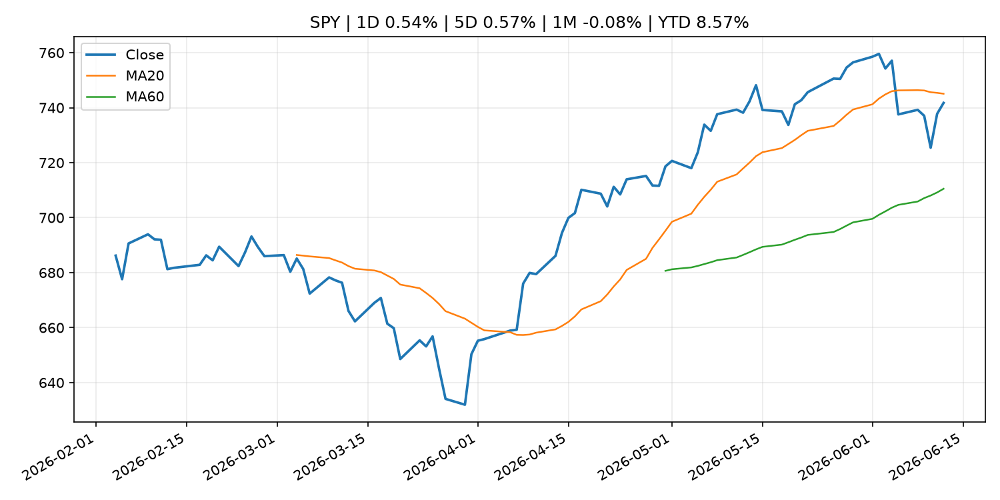
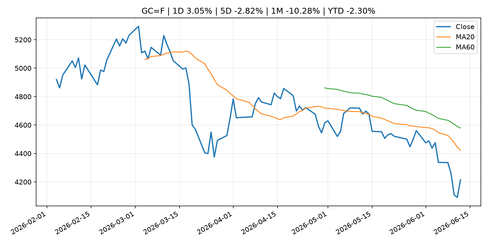
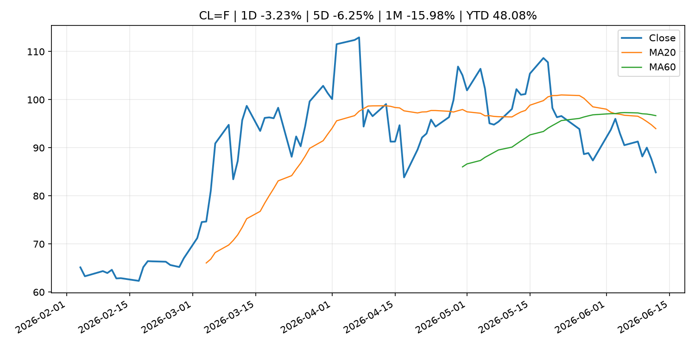
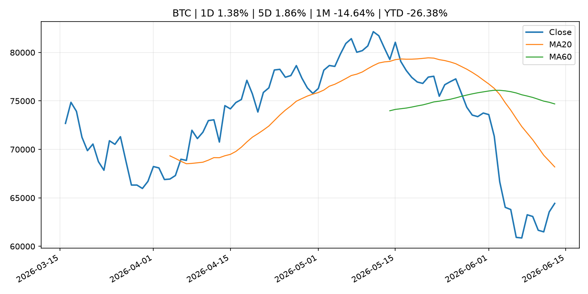
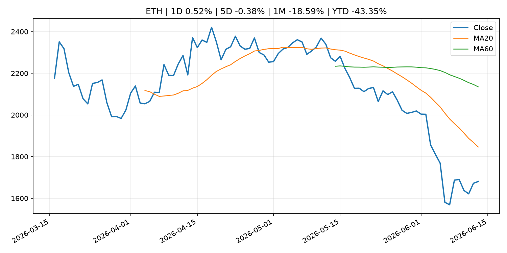
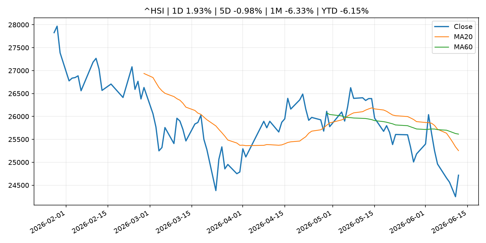

# Global Macro Morning Briefing - 2026-06-14

> Not financial advice / 非投资建议。

## 0. 今日总览
- 市场状态：risk_on。股指上涨、波动率或美元回落，市场更接近风险偏好改善。
- 今日三大主线：
  1. regulation: SEC Appoints John Moses as Director of the Office of Investor Education and Assistance
- 一句话结论：今日晨报重点关注：监管变化会改变行业盈利预期和资产风险溢价。；这条信息暂未匹配到重大宏观、政策或市场事件，更适合作为背景跟踪。。跨资产方面，SPY 1D 0.54%；QQQ 1D 0.59%；^VIX 1D -9.05%；TLT 1D -0.24%；GC=F 1D 3.05%；CL=F 1D -3.23%；BTC 1D 1.38%；ETH 1D 0.52%；股指上涨、波动率或美元回落，市场更接近风险偏好改善。政策、通胀、利率、美元、美债、能源和加密监管仍是主要观察线索。所有结论仅基于公开数据与短摘要整理，不构成投资建议。

## 1. 隔夜跨资产市场
- 美股：SPY 1D 0.54%，QQQ 1D 0.59%，整体趋势需结合 VIX 和利率确认。
- 美债/美元：TLT 1D -0.24%，美元指数 1D -0.11%，是判断折现率压力的核心线索。
- 黄金/原油：黄金 1D 3.05%，原油 1D -3.23%，用于观察避险、通胀和地缘风险。
- 加密：BTC 1D 1.38%，ETH 1D 0.52%，关注是否独立于纳指走出加密自身行情。
- 港股/A股：恒生 1D 1.93%，沪深300/上证 1D n/a，重点看中国政策预期与人民币线索。
- 风险观察：确认风险偏好是否扩散到小盘股、信用利差和周期品。

### US_EQUITY

| symbol | latest close | 1D | 5D | 1M | YTD | trend |
|---|---:|---:|---:|---:|---:|---|
| SPY | 741.75 | 0.54% | 0.57% | -0.08% | 8.57% | range_bound |
| QQQ | 721.34 | 0.59% | 2.31% | 0.93% | 17.65% | range_bound |
| DIA | 513.06 | 0.73% | 0.66% | 3.20% | 6.09% | strong_uptrend |
| IWM | 292.95 | 0.87% | 4.01% | 3.64% | 17.75% | strong_uptrend |
| VTI | 366.36 | 0.57% | 0.82% | 0.45% | 8.94% | range_bound |

### US_MACRO_MARKET

| symbol | latest close | 1D | 5D | 1M | YTD | trend |
|---|---:|---:|---:|---:|---:|---|
| ^VIX | 17.68 | -9.05% | -17.81% | 2.43% | 21.85% | range_bound |
| DX-Y.NYB | 99.75 | -0.11% | -0.32% | 1.29% | 1.35% | uptrend |
| TLT | 85.77 | -0.24% | 0.83% | 1.14% | -1.45% | range_bound |
| IEF | 94.18 | -0.17% | 0.60% | -0.15% | -1.98% | range_bound |

### COMMODITIES

| symbol | latest close | 1D | 5D | 1M | YTD | trend |
|---|---:|---:|---:|---:|---:|---|
| GC=F | 4,215.00 | 3.05% | -2.82% | -10.28% | -2.30% | strong_downtrend |
| SI=F | 67.86 | 6.22% | -1.57% | -23.66% | -3.82% | strong_downtrend |
| CL=F | 84.88 | -3.23% | -6.25% | -15.98% | 48.08% | strong_downtrend |
| BZ=F | 87.33 | -3.37% | -6.19% | -17.32% | 43.75% | strong_downtrend |
| NG=F | 3.12 | 1.07% | -3.38% | 8.94% | -13.76% | strong_uptrend |
| HG=F | 6.43 | 2.74% | 2.67% | -3.09% | 14.02% | uptrend |

### HK_MARKET

| symbol | latest close | 1D | 5D | 1M | YTD | trend |
|---|---:|---:|---:|---:|---:|---|
| ^HSI | 24,718.10 | 1.93% | -0.98% | -6.33% | -6.15% | strong_downtrend |
| 0700.HK | 463.60 | 1.40% | 2.29% | 0.22% | -25.59% | range_bound |
| 9988.HK | 110.20 | 2.61% | -9.97% | -17.02% | -26.04% | strong_downtrend |
| 3690.HK | 77.90 | -0.26% | -2.56% | -11.07% | -25.53% | downtrend |
| 1810.HK | 26.20 | 1.39% | -5.76% | -17.61% | -34.96% | strong_downtrend |
| 1211.HK | 86.55 | 1.88% | -3.51% | -11.82% | -12.35% | strong_downtrend |

### CRYPTO

| symbol | latest close | 1D | 5D | 1M | YTD | trend |
|---|---:|---:|---:|---:|---:|---|
| BTC | 64,429.14 | 1.38% | 1.86% | -14.64% | -26.38% | strong_downtrend |
| ETH | 1,680.62 | 0.52% | -0.38% | -18.59% | -43.35% | strong_downtrend |
| SOLANA | 68.89 | 3.22% | 4.01% | -18.30% | -44.67% | strong_downtrend |
| BINANCECOIN | 608.78 | 0.61% | 0.80% | -6.32% | -29.47% | strong_downtrend |
| RIPPLE | 1.15 | 0.76% | -0.46% | -13.80% | -37.50% | strong_downtrend |

## 2. 今日最重要的 10 条新闻
### 1. SEC Appoints John Moses as Director of the Office of Investor Education and Assistance
- 来源：SEC Press Releases
- 时间：2026-06-12T12:30:00-04:00
- 地区：US
- 事件类型：regulation
- 重要性层级：Tier 2
- 一句话摘要：The Securities and Exchange Commission has appointed John Moses as Director of the agency’s Office of Investor Education and Assistance, which provides services and resources to help investors build their financial futures and protect against investment…
- 为什么重要：监管变化会改变行业盈利预期和资产风险溢价。
- 可能影响：主要影响 BTC，方向为 mixed，强度 high；加密监管或 ETF 进展会改变 BTC 的资金流和风险溢价。
  - 资产：BTC
    方向：mixed
    强度：high
    原因：加密监管或 ETF 进展会改变 BTC 的资金流和风险溢价。
  - 资产：ETH
    方向：mixed
    强度：high
    原因：监管框架会影响 ETH 产品化和机构参与度。
  - 资产：COIN
    方向：mixed
    强度：medium
    原因：监管清晰度和执法风险会影响交易平台估值。
  - 资产：crypto market
    方向：mixed
    强度：high
    原因：信息影响整个加密市场结构，但方向取决于细节。
- 原文链接：[https://www.sec.gov/newsroom/press-releases/2026-55-sec-appoints-john-moses-director-office-investor-education-assistance](https://www.sec.gov/newsroom/press-releases/2026-55-sec-appoints-john-moses-director-office-investor-education-assistance)

### 2. Social Security’s COLA could be 4.7% in 2027 as inflation hits the highest level in 3 years
- 来源：MarketWatch Top Stories
- 时间：2026-06-13T19:00:00+00:00
- 地区：US
- 事件类型：other
- 重要性层级：Tier 3
- 一句话摘要：A total of 44% of older Americans depend on Social Security for all of their income, according to the Senior Citizens League.
- 为什么重要：这条信息暂未匹配到重大宏观、政策或市场事件，更适合作为背景跟踪。
- 可能影响：主要影响 DXY，方向为 positive，强度 high；通胀压力可能推高政策利率预期并支撑美元。
  - 资产：DXY
    方向：positive
    强度：high
    原因：通胀压力可能推高政策利率预期并支撑美元。
  - 资产：TLT
    方向：negative
    强度：high
    原因：通胀上行通常推升收益率、压低长债价格。
  - 资产：QQQ
    方向：negative
    强度：high
    原因：更高利率对成长股估值折现率不利。
  - 资产：SPY
    方向：mixed
    强度：medium
    原因：名义增长可能支撑收入，但更高利率压制估值。
  - 资产：GC=F
    方向：mixed
    强度：medium
    原因：通胀对黄金是支撑，但实际利率上行会形成压力。
  - 资产：BTC
    方向：mixed
    强度：medium
    原因：抗通胀叙事和流动性收紧可能相互抵消。
- 原文链接：[https://www.marketwatch.com/story/social-securitys-cola-could-be-4-7-in-2027-as-inflation-hits-the-highest-level-in-3-years-e5a87320?mod=mw_rss_topstories](https://www.marketwatch.com/story/social-securitys-cola-could-be-4-7-in-2027-as-inflation-hits-the-highest-level-in-3-years-e5a87320?mod=mw_rss_topstories)

### 3. Tokenization mirrors the $20 trillion ETF boom as blockchain and AI converge, Ondo exec says
- 来源：CoinDesk
- 时间：2026-06-13T15:29:00+00:00
- 地区：global
- 事件类型：other
- 重要性层级：Tier 3
- 一句话摘要：Tokenization mirrors the $20 trillion ETF boom as blockchain and AI converge, Ondo exec says
- 为什么重要：这条信息暂未匹配到重大宏观、政策或市场事件，更适合作为背景跟踪。
- 可能影响：主要影响 BTC，方向为 mixed，强度 high；加密监管或 ETF 进展会改变 BTC 的资金流和风险溢价。
  - 资产：BTC
    方向：mixed
    强度：high
    原因：加密监管或 ETF 进展会改变 BTC 的资金流和风险溢价。
  - 资产：ETH
    方向：mixed
    强度：high
    原因：监管框架会影响 ETH 产品化和机构参与度。
  - 资产：COIN
    方向：mixed
    强度：medium
    原因：监管清晰度和执法风险会影响交易平台估值。
  - 资产：crypto market
    方向：mixed
    强度：high
    原因：信息影响整个加密市场结构，但方向取决于细节。
- 原文链接：[https://www.coindesk.com/business/2026/06/13/tokenization-mirrors-the-usd20-trillion-etf-boom-as-blockchain-and-ai-converge-ondo-exec-says](https://www.coindesk.com/business/2026/06/13/tokenization-mirrors-the-usd20-trillion-etf-boom-as-blockchain-and-ai-converge-ondo-exec-says)

## 3. 政策与央行观察
### 1. SEC Appoints John Moses as Director of the Office of Investor Education and Assistance
- 来源：SEC Press Releases
- 时间：2026-06-12T12:30:00-04:00
- 地区：US
- 事件类型：regulation
- 重要性层级：Tier 2
- 一句话摘要：The Securities and Exchange Commission has appointed John Moses as Director of the agency’s Office of Investor Education and Assistance, which provides services and resources to help investors build their financial futures and protect against investment…
- 为什么重要：监管变化会改变行业盈利预期和资产风险溢价。
- 可能影响：主要影响 BTC，方向为 mixed，强度 high；加密监管或 ETF 进展会改变 BTC 的资金流和风险溢价。
  - 资产：BTC
    方向：mixed
    强度：high
    原因：加密监管或 ETF 进展会改变 BTC 的资金流和风险溢价。
  - 资产：ETH
    方向：mixed
    强度：high
    原因：监管框架会影响 ETH 产品化和机构参与度。
  - 资产：COIN
    方向：mixed
    强度：medium
    原因：监管清晰度和执法风险会影响交易平台估值。
  - 资产：crypto market
    方向：mixed
    强度：high
    原因：信息影响整个加密市场结构，但方向取决于细节。
- 原文链接：[https://www.sec.gov/newsroom/press-releases/2026-55-sec-appoints-john-moses-director-office-investor-education-assistance](https://www.sec.gov/newsroom/press-releases/2026-55-sec-appoints-john-moses-director-office-investor-education-assistance)

## 4. 市场异动与图表
- SPY 上涨 0.54%
- QQQ 上涨 0.59%
- VIX 下跌 -9.05%
- Gold 上涨 3.05%
- Oil 下跌 -3.23%

### SPY

### QQQ

### ^VIX

### TLT

### GC=F

### CL=F

### BTC

### ETH

### ^HSI

## 5. 华尔街与机构公开观点
- 暂无可靠公开观点。

## 6. 今日重点关注
- 经济数据：经济数据：暂无可靠公开日历数据；如配置经济日历源后可自动填充。
- 央行讲话：央行讲话：暂无可靠公开日历数据；重点跟踪 Fed、ECB、BoJ、PBOC 官网 RSS。
- 财报：财报：暂无可靠数据。
- 政策事件：政策事件：暂无可靠数据。
- 风险提醒：风险提醒：关注数据源失败项、突发地缘风险、利率和美元的二阶反应。

## 7. 英文金融表达与宏观概念
- **inflation expectations**：通胀预期，指家庭、企业或市场对未来通胀的预估。 例句：Inflation expectations can shape wage bargaining and bond yields.
- **real yield**：实际收益率，名义利率扣除通胀预期后的收益率。 例句：Gold often reacts more to real yields than nominal yields.
- **market structure**：市场结构，指交易、托管、清算、ETF、监管等制度安排。 例句：Crypto market structure rules can affect institutional participation.
- **terminal rate**：终端利率，市场预期本轮加息周期的最高政策利率。 例句：A higher terminal rate can pressure growth stocks.
- **soft landing**：软着陆，指通胀回落而经济避免明显衰退。 例句：Markets often rally when data support a soft landing.
- **risk-off**：避险模式，资金偏向美元、国债、黄金等防御资产。 例句：A geopolitical shock can push markets into risk-off mode.

## 8. 背景材料
- [Social Security is facing a 22% cliff — 4 ways to build an income stream Washington can’t touch](https://www.marketwatch.com/story/social-security-could-face-an-automatic-22-cut-in-2032-these-4-moves-will-protect-your-retirement-a00f9463?mod=mw_rss_topstories)（MarketWatch Top Stories，other）：The countdown to insolvency is accelerating — and the rules of retirement planning just broke.
- [Worried about a lower Social Security benefit? How to calculate the exact impact it will have on your retirement.](https://www.marketwatch.com/story/you-can-calculate-the-exact-impact-a-reduced-social-security-check-will-have-on-your-retirement-success-f0f58429?mod=mw_rss_topstories)（MarketWatch Top Stories，other）：If benefits go down 22% in 2032 as predicted by the latest Trustees report, you need to know what that means for you.
- [Social Security’s COLA could be 4.7% in 2027 as inflation hits the highest level in 3 years](https://www.marketwatch.com/story/social-securitys-cola-could-be-4-7-in-2027-as-inflation-hits-the-highest-level-in-3-years-e5a87320?mod=mw_rss_topstories)（MarketWatch Top Stories，other）：A total of 44% of older Americans depend on Social Security for all of their income, according to the Senior Citizens League.
- [Social Security benefits and costs are perfectly reasonable — no case exists for massive cuts](https://www.marketwatch.com/story/social-security-benefits-and-costs-are-perfectly-reasonable-no-case-exists-for-massive-cuts-fb41f21f?mod=mw_rss_topstories)（MarketWatch Top Stories，other）：It might be nice to reduce the large share of benefits going to high earners who retire later and live long lives.
- [My wife and I are 61. We have $2.2 million and expect $5,000 in Social Security benefits. Do we claim early?](https://www.marketwatch.com/story/my-wife-and-i-are-61-we-have-2-2-million-and-5-000-in-social-security-benefits-do-we-claim-early-1585baf3?mod=mw_rss_topstories)（MarketWatch Top Stories，other）：“We need our assets and income to support us for the next 25 years.”
- [Social Security insolvency is ‘entirely solvable,’ says commissioner under Biden](https://www.marketwatch.com/story/social-security-insolvency-is-entirely-solvable-says-commissioner-under-biden-9a37ecfd?mod=mw_rss_topstories)（MarketWatch Top Stories，other）：The solution is simple — but it won’t be easy.
- [Here's what SpaceX's IPO means for its $1.3 billion bitcoin reserve](https://www.coindesk.com/business/2026/06/13/here-s-what-spacex-s-ipo-means-for-its-usd1-3-billion-bitcoin-reserve)（CoinDesk，other）：Here's what SpaceX's IPO means for its $1.3 billion bitcoin reserve
- [Stablecoins Were Meant to Disrupt Finance. Instead, They Became Idle Cash.](https://www.coindesk.com/opinion/2026/06/13/stablecoins-were-meant-to-disrupt-finance-instead-they-became-idle-cash)（CoinDesk，other）：Stablecoins Were Meant to Disrupt Finance. Instead, They Became Idle Cash.
- [Bitcoin rises above $64,000 after Pakistan prime minister says Iran peace deal is near](https://www.coindesk.com/markets/2026/06/13/bitcoin-rises-above-usd64-000-after-pakistan-prime-minister-says-iran-peace-deal-is-near)（CoinDesk，other）：Bitcoin rises above $64,000 after Pakistan prime minister says Iran peace deal is near
- [Tokenization mirrors the $20 trillion ETF boom as blockchain and AI converge, Ondo exec says](https://www.coindesk.com/business/2026/06/13/tokenization-mirrors-the-usd20-trillion-etf-boom-as-blockchain-and-ai-converge-ondo-exec-says)（CoinDesk，other）：Tokenization mirrors the $20 trillion ETF boom as blockchain and AI converge, Ondo exec says
- [Why TD Securities anticipates even bigger days ahead for SpaceX](https://www.cnbc.com/2026/06/13/spacex-surges-but-bigger-days-are-ahead-td-securities-.html)（CNBC Economy，other）：Peter Haynes, TD Securities' head of index and market structure, suggests SpaceX's public debut is only a small part of the larger SpaceX timeline.
- [Perpetual futures could become crypto's next ETF moment](https://www.coindesk.com/business/2026/06/13/perpetual-futures-could-become-crypto-s-next-etf-moment)（CoinDesk，other）：Perpetual futures could become crypto's next ETF moment
- [Saylor to Musk: Thanks to you, 25% of 'Mag8' firms now hold bitcoin](https://www.coindesk.com/markets/2026/06/13/saylor-to-musk-thanks-to-you-25-of-mag8-firms-now-hold-bitcoin)（CoinDesk，other）：Saylor to Musk: Thanks to you, 25% of 'Mag8' firms now hold bitcoin
- [Top cryptographers can't agree on Bitcoin's biggest quantum question](https://www.coindesk.com/tech/2026/06/13/top-cryptographers-can-t-agree-on-bitcoin-s-biggest-quantum-question)（CoinDesk，other）：Top cryptographers can't agree on Bitcoin's biggest quantum question
- [Bitcoin steadies above $63,000 as its worst week in months got a late macro rescue](https://www.coindesk.com/markets/2026/06/13/bitcoin-steady-above-usd63-000-as-its-worst-week-in-months-got-a-late-macro-rescue)（CoinDesk，other）：Bitcoin steadies above $63,000 as its worst week in months got a late macro rescue
- [Bitcoin hit bottom at $59,000 marking end to the crypto winter, says Standard Chartered analyst](https://www.coindesk.com/markets/2026/06/12/bitcoin-hit-bottom-at-usd59-000-marking-end-to-the-crypto-winter-says-standard-chartered-analyst)（CoinDesk，other）：Bitcoin hit bottom at $59,000 marking end to the crypto winter, says Standard Chartered analyst
- [VanEck bets BNB’s real-world usage can stand out in a crowded crypto ETF market](https://www.coindesk.com/markets/2026/06/12/vaneck-bets-bnb-s-real-world-usage-can-stand-out-in-a-crowded-crypto-etf-market)（CoinDesk，other）：VanEck bets BNB’s real-world usage can stand out in a crowded crypto ETF market
- [Bloomberg Analyst: Most Bitcoin ETF Investors Have Stayed Put Despite Outflows](https://www.coindesk.com/markets/2026/06/08/bloomberg-analyst-most-bitcoin-etf-investors-have-stayed-put-despite-outflows)（CoinDesk，other）：Bloomberg Analyst: Most Bitcoin ETF Investors Have Stayed Put Despite Outflows
- [Decisions taken by the Governing Council of the ECB (in addition to decisions setting interest rates)](https://www.ecb.europa.eu//press/govcdec/otherdec/2026/html/ecb.gc260612~12de4776f6.en.html)（ECB Press Releases，other）：Decisions taken by the Governing Council of the ECB (in addition to decisions setting interest rates)
- [EU structural financial indicators: end of 2025](https://www.ecb.europa.eu//press/pr/date/2026/html/ecb.pr260612~ab34769159.en.html)（ECB Press Releases，other）：EU structural financial indicators: end of 2025

## 9. 数据源、失败项与免责声明
- 采集时间：2026-06-13T23:03:34
- 数据源：公开 RSS、Yahoo Finance、CoinGecko、AKShare、FRED、SEC data.sec.gov，以及用户自有 inputs/reports 文件。
- 合规说明：不绕过 WSJ、Bloomberg、FT、Reuters 等付费墙；对付费媒体只使用公开 RSS 标题、摘要、链接和发布时间。
- 免责声明：Not financial advice / 非投资建议。本项目仅供个人学习、研究和信息整理，不构成投资建议、交易建议或任何收益承诺。
- 失败或跳过的数据源：
  - crypto data failed coin=dogecoin
  - China market data failed symbol=上证指数: empty dataframe
  - China market data failed symbol=深证成指: empty dataframe
  - China market data failed symbol=创业板指: empty dataframe
  - China market data failed symbol=沪深300: empty dataframe
  - China market data failed symbol=中证500: empty dataframe
  - China market data failed symbol=科创50: empty dataframe
  - FRED_API_KEY not set; skipping FRED macro series
  - SEC failed cik=0000320193
  - SEC failed cik=0000789019
  - SEC failed cik=0001045810
  - SEC failed cik=0001318605
  - SEC failed cik=0001577552
