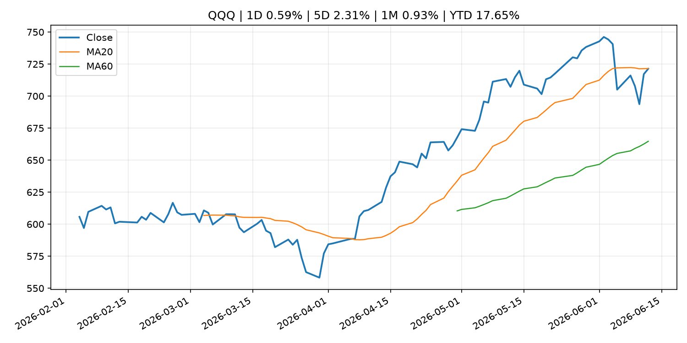
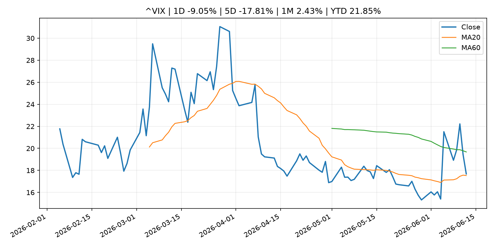
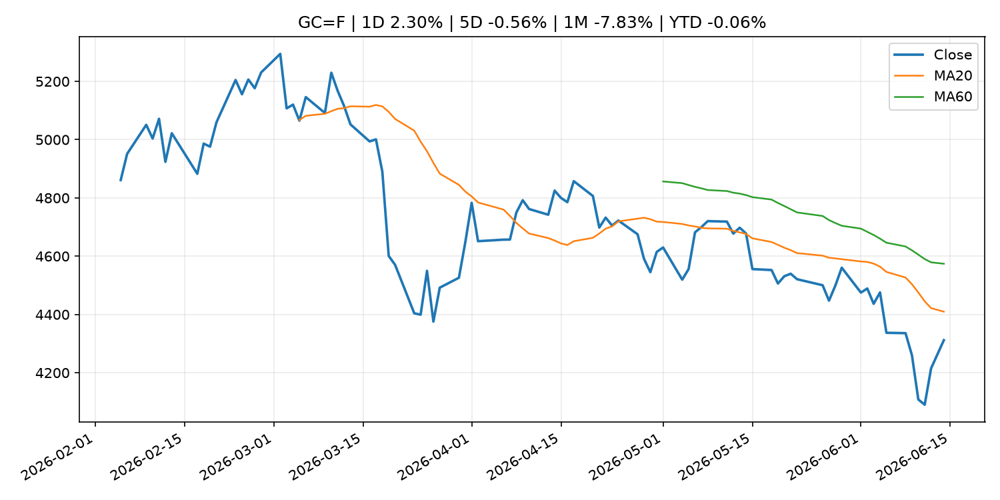
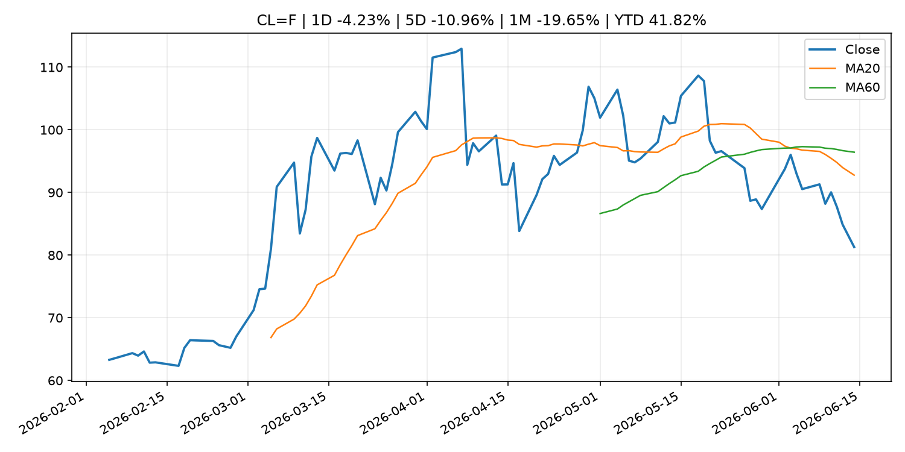
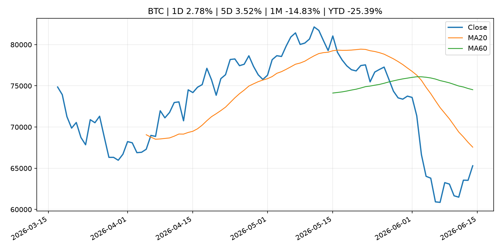
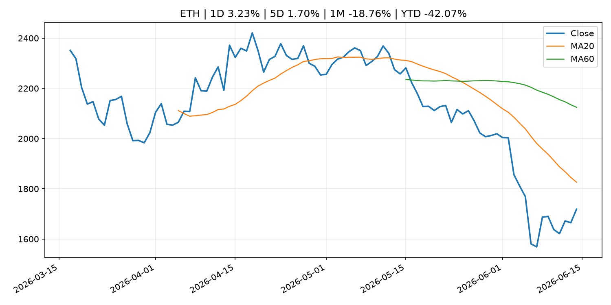

# Global Macro Morning Briefing - 2026-06-15

> Not financial advice / 非投资建议。

## 0. 今日总览
- 市场状态：risk_on。股指上涨、波动率或美元回落，市场更接近风险偏好改善。
- 今日三大主线：
  1. central_bank_decision: Will the real Kevin Warsh please stand up? Ahead of his first Fed meeting, economists honestly don’t know what to expect.
  2. financial_stability: Aerodrome is turning liquidity into a prediction market with its biggest upgrade yet
  3. regulation: SEC's big swing to clear tokenization path isn't likely to get resilience of full rule
- 一句话结论：今日晨报重点关注：央行决策会重定价利率、汇率、久期资产和风险资产。；金融稳定信号可能放大跨资产波动，并影响央行反应函数。。跨资产方面，SPY 1D 0.54%；QQQ 1D 0.59%；^VIX 1D -9.05%；TLT 1D -0.24%；GC=F 1D 2.30%；CL=F 1D -4.23%；BTC 1D 2.78%；ETH 1D 3.23%；股指上涨、波动率或美元回落，市场更接近风险偏好改善。政策、通胀、利率、美元、美债、能源和加密监管仍是主要观察线索。所有结论仅基于公开数据与短摘要整理，不构成投资建议。

## 1. 隔夜跨资产市场
- 美股：SPY 1D 0.54%，QQQ 1D 0.59%，整体趋势需结合 VIX 和利率确认。
- 美债/美元：TLT 1D -0.24%，美元指数 1D -0.29%，是判断折现率压力的核心线索。
- 黄金/原油：黄金 1D 2.30%，原油 1D -4.23%，用于观察避险、通胀和地缘风险。
- 加密：BTC 1D 2.78%，ETH 1D 3.23%，关注是否独立于纳指走出加密自身行情。
- 港股/A股：恒生 1D 1.93%，沪深300/上证 1D n/a，重点看中国政策预期与人民币线索。
- 风险观察：确认风险偏好是否扩散到小盘股、信用利差和周期品。

### US_EQUITY

| symbol | latest close | 1D | 5D | 1M | YTD | trend |
|---|---:|---:|---:|---:|---:|---|
| SPY | 741.75 | 0.54% | 0.57% | -0.08% | 8.57% | range_bound |
| QQQ | 721.34 | 0.59% | 2.31% | 0.93% | 17.65% | range_bound |
| DIA | 513.06 | 0.73% | 0.66% | 3.20% | 6.09% | strong_uptrend |
| IWM | 292.95 | 0.87% | 4.01% | 3.64% | 17.75% | strong_uptrend |
| VTI | 366.36 | 0.57% | 0.82% | 0.45% | 8.94% | range_bound |

### US_MACRO_MARKET

| symbol | latest close | 1D | 5D | 1M | YTD | trend |
|---|---:|---:|---:|---:|---:|---|
| ^VIX | 17.68 | -9.05% | -17.81% | 2.43% | 21.85% | range_bound |
| DX-Y.NYB | 99.46 | -0.29% | -0.59% | 0.59% | 1.06% | uptrend |
| TLT | 85.77 | -0.24% | 0.83% | 1.14% | -1.45% | range_bound |
| IEF | 94.18 | -0.17% | 0.60% | -0.15% | -1.98% | range_bound |

### COMMODITIES

| symbol | latest close | 1D | 5D | 1M | YTD | trend |
|---|---:|---:|---:|---:|---:|---|
| GC=F | 4,311.80 | 2.30% | -0.56% | -7.83% | -0.06% | strong_downtrend |
| SI=F | 70.29 | 3.59% | 2.73% | -17.21% | -0.37% | strong_downtrend |
| CL=F | 81.29 | -4.23% | -10.96% | -19.65% | 41.82% | strong_downtrend |
| BZ=F | 84.14 | -3.65% | -10.73% | -20.41% | 38.50% | strong_downtrend |
| NG=F | 3.09 | -1.09% | -1.94% | 6.63% | -14.70% | range_bound |
| HG=F | 6.52 | 1.39% | 3.01% | -0.72% | 15.60% | uptrend |

### HK_MARKET

| symbol | latest close | 1D | 5D | 1M | YTD | trend |
|---|---:|---:|---:|---:|---:|---|
| ^HSI | 24,718.10 | 1.93% | -0.98% | -6.33% | -6.15% | strong_downtrend |
| 0700.HK | 463.60 | 1.40% | 2.29% | 0.22% | -25.59% | range_bound |
| 9988.HK | 110.20 | 2.61% | -9.97% | -17.02% | -26.04% | strong_downtrend |
| 3690.HK | 77.90 | -0.26% | -2.56% | -11.07% | -25.53% | downtrend |
| 1810.HK | 26.20 | 1.39% | -5.76% | -17.61% | -34.96% | strong_downtrend |
| 1211.HK | 86.55 | 1.88% | -3.51% | -11.82% | -12.35% | strong_downtrend |

### CRYPTO

| symbol | latest close | 1D | 5D | 1M | YTD | trend |
|---|---:|---:|---:|---:|---:|---|
| BTC | 65,300.95 | 2.78% | 3.52% | -14.83% | -25.39% | strong_downtrend |
| ETH | 1,718.78 | 3.23% | 1.70% | -18.76% | -42.07% | strong_downtrend |
| SOLANA | 70.19 | 5.23% | 5.22% | -18.03% | -43.63% | strong_downtrend |
| BINANCECOIN | 613.13 | 1.60% | 1.92% | -6.49% | -28.97% | strong_downtrend |
| RIPPLE | 1.17 | 3.34% | 0.16% | -13.83% | -36.43% | strong_downtrend |

## 2. 今日最重要的 10 条新闻
### 1. Will the real Kevin Warsh please stand up? Ahead of his first Fed meeting, economists honestly don’t know what to expect.
- 来源：MarketWatch Top Stories
- 时间：2026-06-14T21:00:00+00:00
- 地区：US
- 事件类型：central_bank_decision
- 重要性层级：Tier 1
- 一句话摘要：Perhaps the only thing that can be said with certainty about Kevin Warsh’s press conference following his first meeting as Federal Reserve chair this week is that he will have a captive audience.
- 为什么重要：央行决策会重定价利率、汇率、久期资产和风险资产。
- 可能影响：可能影响利率、汇率、风险资产或大宗商品预期，但当前公开信息不足以判断明确方向。
  - 资产：暂无明确资产映射
  - 方向：unknown
  - 强度：low
  - 原因：公开信息不足以判断方向。
- 原文链接：[https://www.marketwatch.com/story/will-the-real-kevin-warsh-please-stand-up-ahead-of-his-first-fed-meeting-economists-honestly-dont-know-what-to-expect-6fa95c8c?mod=mw_rss_topstories](https://www.marketwatch.com/story/will-the-real-kevin-warsh-please-stand-up-ahead-of-his-first-fed-meeting-economists-honestly-dont-know-what-to-expect-6fa95c8c?mod=mw_rss_topstories)

### 2. Aerodrome is turning liquidity into a prediction market with its biggest upgrade yet
- 来源：CoinDesk
- 时间：2026-06-14T15:00:00+00:00
- 地区：global
- 事件类型：financial_stability
- 重要性层级：Tier 1
- 一句话摘要：Aerodrome is turning liquidity into a prediction market with its biggest upgrade yet
- 为什么重要：金融稳定信号可能放大跨资产波动，并影响央行反应函数。
- 可能影响：可能影响利率、汇率、风险资产或大宗商品预期，但当前公开信息不足以判断明确方向。
  - 资产：暂无明确资产映射
  - 方向：unknown
  - 强度：low
  - 原因：公开信息不足以判断方向。
- 原文链接：[https://www.coindesk.com/tech/2026/06/12/aerodrome-is-turning-liquidity-into-a-prediction-market-with-its-biggest-upgrade-yet](https://www.coindesk.com/tech/2026/06/12/aerodrome-is-turning-liquidity-into-a-prediction-market-with-its-biggest-upgrade-yet)

### 3. SEC's big swing to clear tokenization path isn't likely to get resilience of full rule
- 来源：CoinDesk
- 时间：2026-06-14T14:00:00+00:00
- 地区：global
- 事件类型：regulation
- 重要性层级：Tier 2
- 一句话摘要：SEC's big swing to clear tokenization path isn't likely to get resilience of full rule
- 为什么重要：监管变化会改变行业盈利预期和资产风险溢价。
- 可能影响：主要影响 BTC，方向为 mixed，强度 high；加密监管或 ETF 进展会改变 BTC 的资金流和风险溢价。
  - 资产：BTC
    方向：mixed
    强度：high
    原因：加密监管或 ETF 进展会改变 BTC 的资金流和风险溢价。
  - 资产：ETH
    方向：mixed
    强度：high
    原因：监管框架会影响 ETH 产品化和机构参与度。
  - 资产：COIN
    方向：mixed
    强度：medium
    原因：监管清晰度和执法风险会影响交易平台估值。
  - 资产：crypto market
    方向：mixed
    强度：high
    原因：信息影响整个加密市场结构，但方向取决于细节。
- 原文链接：[https://www.coindesk.com/news-analysis/2026/06/12/sec-s-big-swing-to-clear-tokenization-path-isn-t-likely-to-get-resilience-of-full-rule](https://www.coindesk.com/news-analysis/2026/06/12/sec-s-big-swing-to-clear-tokenization-path-isn-t-likely-to-get-resilience-of-full-rule)

### 4. Tokenization mirrors the $20 trillion ETF boom as blockchain and AI converge, Ondo exec says
- 来源：CoinDesk
- 时间：2026-06-13T15:29:00+00:00
- 地区：global
- 事件类型：other
- 重要性层级：Tier 3
- 一句话摘要：Tokenization mirrors the $20 trillion ETF boom as blockchain and AI converge, Ondo exec says
- 为什么重要：这条信息暂未匹配到重大宏观、政策或市场事件，更适合作为背景跟踪。
- 可能影响：主要影响 BTC，方向为 mixed，强度 high；加密监管或 ETF 进展会改变 BTC 的资金流和风险溢价。
  - 资产：BTC
    方向：mixed
    强度：high
    原因：加密监管或 ETF 进展会改变 BTC 的资金流和风险溢价。
  - 资产：ETH
    方向：mixed
    强度：high
    原因：监管框架会影响 ETH 产品化和机构参与度。
  - 资产：COIN
    方向：mixed
    强度：medium
    原因：监管清晰度和执法风险会影响交易平台估值。
  - 资产：crypto market
    方向：mixed
    强度：high
    原因：信息影响整个加密市场结构，但方向取决于细节。
- 原文链接：[https://www.coindesk.com/business/2026/06/13/tokenization-mirrors-the-usd20-trillion-etf-boom-as-blockchain-and-ai-converge-ondo-exec-says](https://www.coindesk.com/business/2026/06/13/tokenization-mirrors-the-usd20-trillion-etf-boom-as-blockchain-and-ai-converge-ondo-exec-says)

### 5. Perpetual futures could become crypto's next ETF moment
- 来源：CoinDesk
- 时间：2026-06-13T14:00:00+00:00
- 地区：global
- 事件类型：other
- 重要性层级：Tier 3
- 一句话摘要：Perpetual futures could become crypto's next ETF moment
- 为什么重要：这条信息暂未匹配到重大宏观、政策或市场事件，更适合作为背景跟踪。
- 可能影响：主要影响 BTC，方向为 mixed，强度 high；加密监管或 ETF 进展会改变 BTC 的资金流和风险溢价。
  - 资产：BTC
    方向：mixed
    强度：high
    原因：加密监管或 ETF 进展会改变 BTC 的资金流和风险溢价。
  - 资产：ETH
    方向：mixed
    强度：high
    原因：监管框架会影响 ETH 产品化和机构参与度。
  - 资产：COIN
    方向：mixed
    强度：medium
    原因：监管清晰度和执法风险会影响交易平台估值。
  - 资产：crypto market
    方向：mixed
    强度：high
    原因：信息影响整个加密市场结构，但方向取决于细节。
- 原文链接：[https://www.coindesk.com/business/2026/06/13/perpetual-futures-could-become-crypto-s-next-etf-moment](https://www.coindesk.com/business/2026/06/13/perpetual-futures-could-become-crypto-s-next-etf-moment)

## 3. 政策与央行观察
### 1. Will the real Kevin Warsh please stand up? Ahead of his first Fed meeting, economists honestly don’t know what to expect.
- 来源：MarketWatch Top Stories
- 时间：2026-06-14T21:00:00+00:00
- 地区：US
- 事件类型：central_bank_decision
- 重要性层级：Tier 1
- 一句话摘要：Perhaps the only thing that can be said with certainty about Kevin Warsh’s press conference following his first meeting as Federal Reserve chair this week is that he will have a captive audience.
- 为什么重要：央行决策会重定价利率、汇率、久期资产和风险资产。
- 可能影响：可能影响利率、汇率、风险资产或大宗商品预期，但当前公开信息不足以判断明确方向。
  - 资产：暂无明确资产映射
  - 方向：unknown
  - 强度：low
  - 原因：公开信息不足以判断方向。
- 原文链接：[https://www.marketwatch.com/story/will-the-real-kevin-warsh-please-stand-up-ahead-of-his-first-fed-meeting-economists-honestly-dont-know-what-to-expect-6fa95c8c?mod=mw_rss_topstories](https://www.marketwatch.com/story/will-the-real-kevin-warsh-please-stand-up-ahead-of-his-first-fed-meeting-economists-honestly-dont-know-what-to-expect-6fa95c8c?mod=mw_rss_topstories)

### 2. Aerodrome is turning liquidity into a prediction market with its biggest upgrade yet
- 来源：CoinDesk
- 时间：2026-06-14T15:00:00+00:00
- 地区：global
- 事件类型：financial_stability
- 重要性层级：Tier 1
- 一句话摘要：Aerodrome is turning liquidity into a prediction market with its biggest upgrade yet
- 为什么重要：金融稳定信号可能放大跨资产波动，并影响央行反应函数。
- 可能影响：可能影响利率、汇率、风险资产或大宗商品预期，但当前公开信息不足以判断明确方向。
  - 资产：暂无明确资产映射
  - 方向：unknown
  - 强度：low
  - 原因：公开信息不足以判断方向。
- 原文链接：[https://www.coindesk.com/tech/2026/06/12/aerodrome-is-turning-liquidity-into-a-prediction-market-with-its-biggest-upgrade-yet](https://www.coindesk.com/tech/2026/06/12/aerodrome-is-turning-liquidity-into-a-prediction-market-with-its-biggest-upgrade-yet)

### 3. SEC's big swing to clear tokenization path isn't likely to get resilience of full rule
- 来源：CoinDesk
- 时间：2026-06-14T14:00:00+00:00
- 地区：global
- 事件类型：regulation
- 重要性层级：Tier 2
- 一句话摘要：SEC's big swing to clear tokenization path isn't likely to get resilience of full rule
- 为什么重要：监管变化会改变行业盈利预期和资产风险溢价。
- 可能影响：主要影响 BTC，方向为 mixed，强度 high；加密监管或 ETF 进展会改变 BTC 的资金流和风险溢价。
  - 资产：BTC
    方向：mixed
    强度：high
    原因：加密监管或 ETF 进展会改变 BTC 的资金流和风险溢价。
  - 资产：ETH
    方向：mixed
    强度：high
    原因：监管框架会影响 ETH 产品化和机构参与度。
  - 资产：COIN
    方向：mixed
    强度：medium
    原因：监管清晰度和执法风险会影响交易平台估值。
  - 资产：crypto market
    方向：mixed
    强度：high
    原因：信息影响整个加密市场结构，但方向取决于细节。
- 原文链接：[https://www.coindesk.com/news-analysis/2026/06/12/sec-s-big-swing-to-clear-tokenization-path-isn-t-likely-to-get-resilience-of-full-rule](https://www.coindesk.com/news-analysis/2026/06/12/sec-s-big-swing-to-clear-tokenization-path-isn-t-likely-to-get-resilience-of-full-rule)

## 4. 市场异动与图表
- SPY 上涨 0.54%
- QQQ 上涨 0.59%
- VIX 下跌 -9.05%
- Gold 上涨 2.30%
- Oil 下跌 -4.23%
- BTC 上涨 2.78%
- ETH 上涨 3.23%

### SPY

### QQQ

### ^VIX

### TLT

### GC=F

### CL=F

### BTC

### ETH

### ^HSI

## 5. 华尔街与机构公开观点
- 暂无可靠公开观点。

## 6. 今日重点关注
- 经济数据：经济数据：暂无可靠公开日历数据；如配置经济日历源后可自动填充。
- 央行讲话：央行讲话：暂无可靠公开日历数据；重点跟踪 Fed、ECB、BoJ、PBOC 官网 RSS。
- 财报：财报：暂无可靠数据。
- 政策事件：政策事件：暂无可靠数据。
- 风险提醒：风险提醒：关注数据源失败项、突发地缘风险、利率和美元的二阶反应。

## 7. 英文金融表达与宏观概念
- **risk-off**：避险模式，资金偏向美元、国债、黄金等防御资产。 例句：A geopolitical shock can push markets into risk-off mode.
- **market structure**：市场结构，指交易、托管、清算、ETF、监管等制度安排。 例句：Crypto market structure rules can affect institutional participation.
- **inflation expectations**：通胀预期，指家庭、企业或市场对未来通胀的预估。 例句：Inflation expectations can shape wage bargaining and bond yields.
- **real yield**：实际收益率，名义利率扣除通胀预期后的收益率。 例句：Gold often reacts more to real yields than nominal yields.
- **terminal rate**：终端利率，市场预期本轮加息周期的最高政策利率。 例句：A higher terminal rate can pressure growth stocks.
- **soft landing**：软着陆，指通胀回落而经济避免明显衰退。 例句：Markets often rally when data support a soft landing.

## 8. 背景材料
- [Bitcoin could crash to $48,000, if this historical pattern is triggered](https://www.coindesk.com/markets/2026/06/14/bitcoin-could-crash-to-usd48-000-if-this-historical-pattern-is-triggered)（CoinDesk，other）：Bitcoin could crash to $48,000, if this historical pattern is triggered
- [Wall Street and crypto are crashing into each other as tokenized treasury markets hit $14.6 billion](https://www.coindesk.com/markets/2026/06/11/wall-street-and-crypto-are-crashing-into-each-other-as-tokenized-treasury-markets-hit-usd14-6-billion)（CoinDesk，other）：Wall Street and crypto are crashing into each other as tokenized treasury markets hit $14.6 billion
- [Here's what SpaceX's IPO means for its $1.3 billion bitcoin reserve](https://www.coindesk.com/business/2026/06/13/here-s-what-spacex-s-ipo-means-for-its-usd1-3-billion-bitcoin-reserve)（CoinDesk，other）：Here's what SpaceX's IPO means for its $1.3 billion bitcoin reserve
- [Stablecoins Were Meant to Disrupt Finance. Instead, They Became Idle Cash.](https://www.coindesk.com/opinion/2026/06/13/stablecoins-were-meant-to-disrupt-finance-instead-they-became-idle-cash)（CoinDesk，other）：Stablecoins Were Meant to Disrupt Finance. Instead, They Became Idle Cash.
- [Bitcoin rises above $64,000 after Pakistan prime minister says Iran peace deal is near](https://www.coindesk.com/markets/2026/06/13/bitcoin-rises-above-usd64-000-after-pakistan-prime-minister-says-iran-peace-deal-is-near)（CoinDesk，other）：Bitcoin rises above $64,000 after Pakistan prime minister says Iran peace deal is near
- [Tokenization mirrors the $20 trillion ETF boom as blockchain and AI converge, Ondo exec says](https://www.coindesk.com/business/2026/06/13/tokenization-mirrors-the-usd20-trillion-etf-boom-as-blockchain-and-ai-converge-ondo-exec-says)（CoinDesk，other）：Tokenization mirrors the $20 trillion ETF boom as blockchain and AI converge, Ondo exec says
- [Why TD Securities anticipates even bigger days ahead for SpaceX](https://www.cnbc.com/2026/06/13/spacex-surges-but-bigger-days-are-ahead-td-securities-.html)（CNBC Economy，other）：Peter Haynes, TD Securities' head of index and market structure, suggests SpaceX's public debut is only a small part of the larger SpaceX timeline.
- [Perpetual futures could become crypto's next ETF moment](https://www.coindesk.com/business/2026/06/13/perpetual-futures-could-become-crypto-s-next-etf-moment)（CoinDesk，other）：Perpetual futures could become crypto's next ETF moment
- [Saylor to Musk: Thanks to you, 25% of 'Mag8' firms now hold bitcoin](https://www.coindesk.com/markets/2026/06/13/saylor-to-musk-thanks-to-you-25-of-mag8-firms-now-hold-bitcoin)（CoinDesk，other）：Saylor to Musk: Thanks to you, 25% of 'Mag8' firms now hold bitcoin
- [Top cryptographers can't agree on Bitcoin's biggest quantum question](https://www.coindesk.com/tech/2026/06/13/top-cryptographers-can-t-agree-on-bitcoin-s-biggest-quantum-question)（CoinDesk，other）：Top cryptographers can't agree on Bitcoin's biggest quantum question
- [Bitcoin steadies above $63,000 as its worst week in months got a late macro rescue](https://www.coindesk.com/markets/2026/06/13/bitcoin-steady-above-usd63-000-as-its-worst-week-in-months-got-a-late-macro-rescue)（CoinDesk，other）：Bitcoin steadies above $63,000 as its worst week in months got a late macro rescue

## 9. 数据源、失败项与免责声明
- 采集时间：2026-06-14T23:07:37
- 数据源：公开 RSS、Yahoo Finance、CoinGecko、AKShare、FRED、SEC data.sec.gov，以及用户自有 inputs/reports 文件。
- 合规说明：不绕过 WSJ、Bloomberg、FT、Reuters 等付费墙；对付费媒体只使用公开 RSS 标题、摘要、链接和发布时间。
- 免责声明：Not financial advice / 非投资建议。本项目仅供个人学习、研究和信息整理，不构成投资建议、交易建议或任何收益承诺。
- 失败或跳过的数据源：
  - crypto data failed coin=dogecoin
  - China market data failed symbol=上证指数: empty dataframe
  - China market data failed symbol=深证成指: empty dataframe
  - China market data failed symbol=创业板指: empty dataframe
  - China market data failed symbol=沪深300: empty dataframe
  - China market data failed symbol=中证500: empty dataframe
  - China market data failed symbol=科创50: empty dataframe
  - FRED_API_KEY not set; skipping FRED macro series
  - SEC failed cik=0000320193
  - SEC failed cik=0000789019
  - SEC failed cik=0001045810
  - SEC failed cik=0001318605
  - SEC failed cik=0001577552
