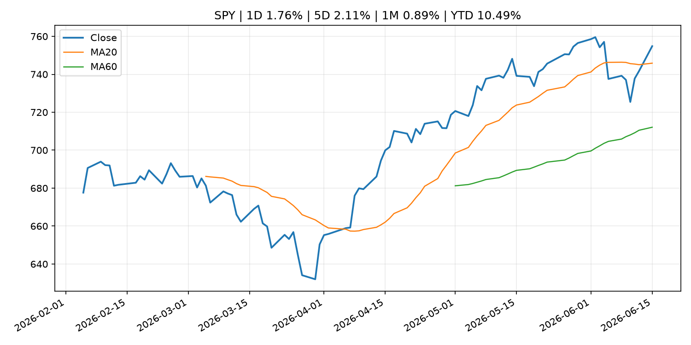
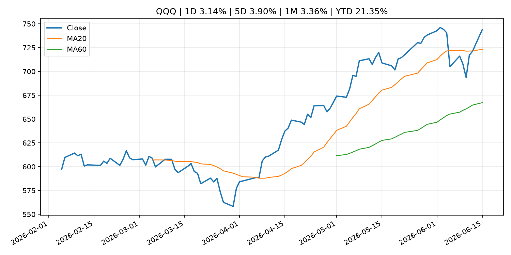
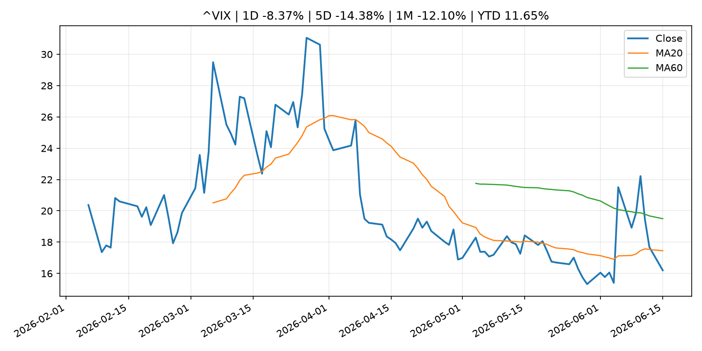
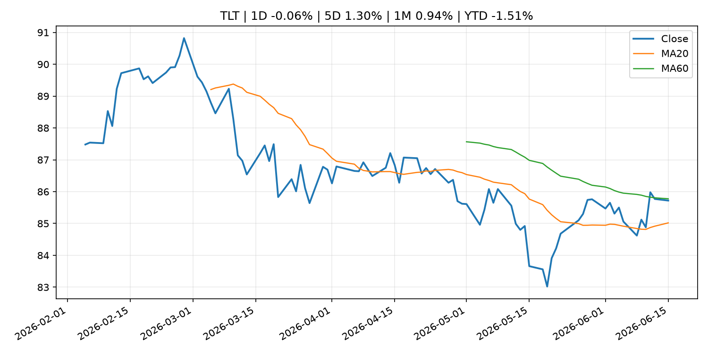
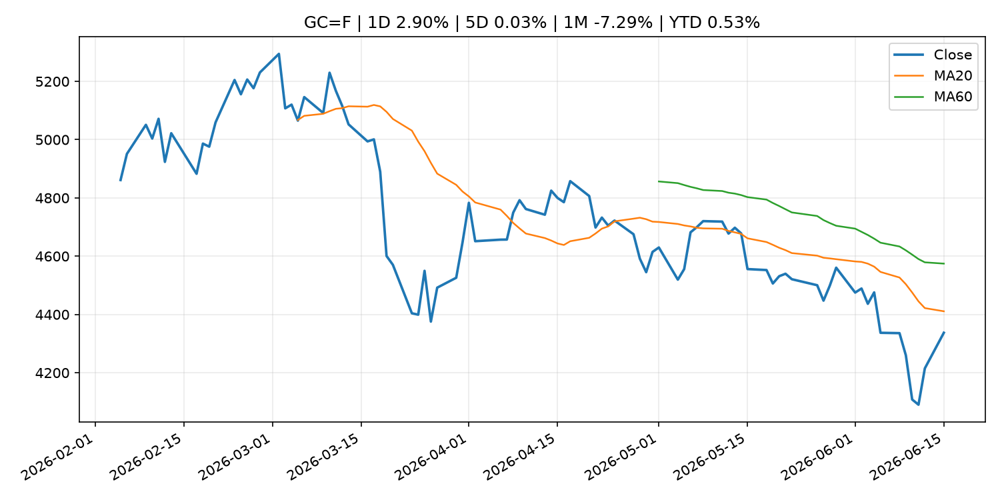
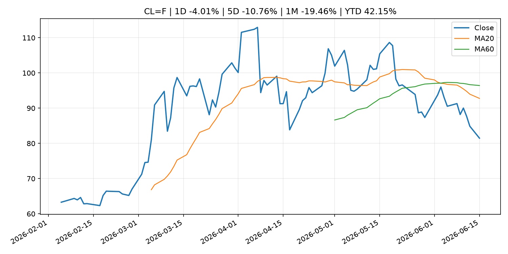
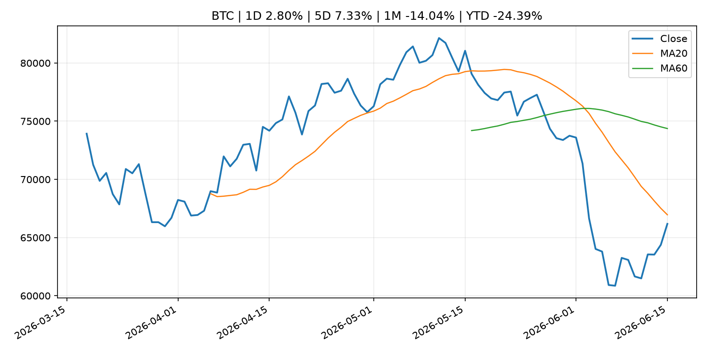
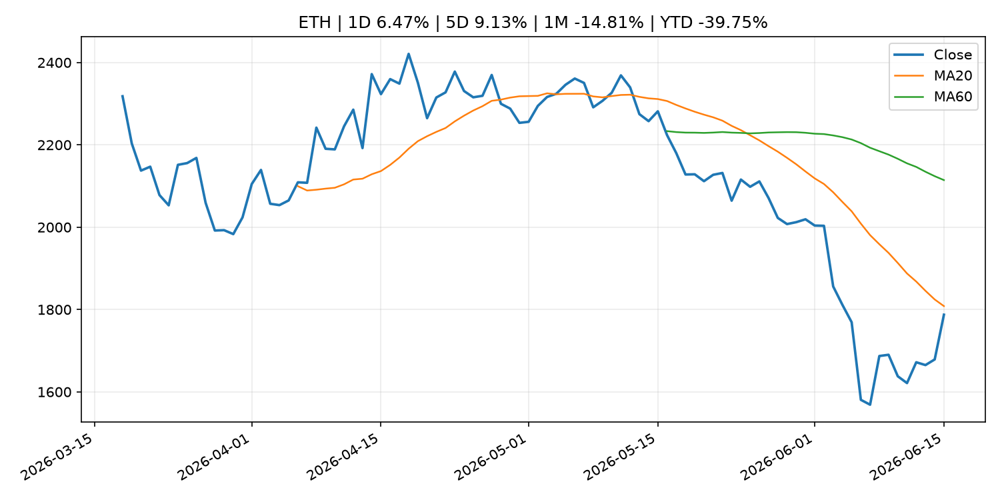
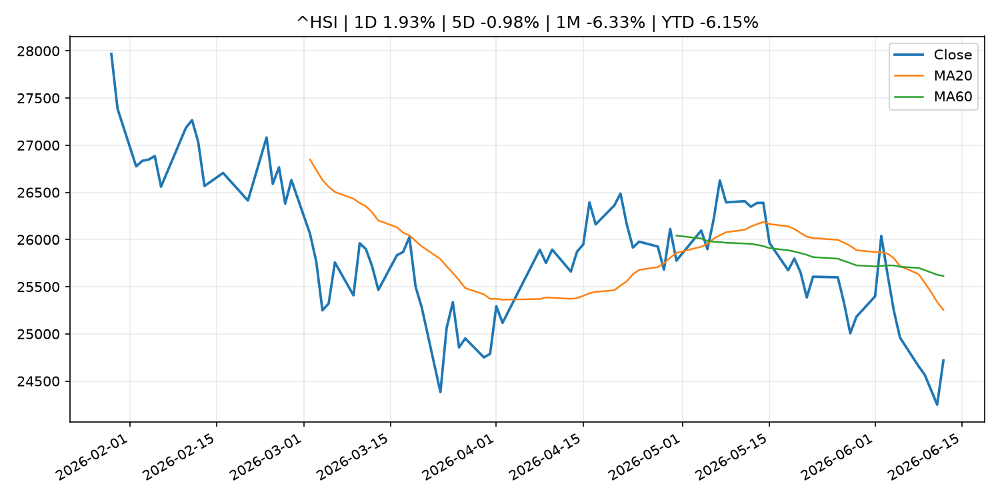

# Global Macro Morning Briefing - 2026-06-16

> Not financial advice / 非投资建议。

## 0. 今日总览
- 市场状态：risk_on。股指上涨、波动率或美元回落，市场更接近风险偏好改善。
- 今日三大主线：
  1. central_bank_decision: Bitcoin traders have a reason to watch Tuesday's BOJ rate decision. Yen shorts are at a nine-year high
  2. financial_stability: Aerodrome is turning liquidity into a prediction market with its biggest upgrade yet
  3. crypto_market_structure: Trump-linked stablecoin used for bonus payouts at White House UFC contest
- 一句话结论：今日晨报重点关注：央行决策会重定价利率、汇率、久期资产和风险资产。；金融稳定信号可能放大跨资产波动，并影响央行反应函数。。跨资产方面，SPY 1D 1.76%；QQQ 1D 3.14%；^VIX 1D -8.37%；TLT 1D -0.06%；GC=F 1D 2.90%；CL=F 1D -4.01%；BTC 1D 2.80%；ETH 1D 6.47%；股指上涨、波动率或美元回落，市场更接近风险偏好改善。政策、通胀、利率、美元、美债、能源和加密监管仍是主要观察线索。所有结论仅基于公开数据与短摘要整理，不构成投资建议。

## 1. 隔夜跨资产市场
- 美股：SPY 1D 1.76%，QQQ 1D 3.14%，整体趋势需结合 VIX 和利率确认。
- 美债/美元：TLT 1D -0.06%，美元指数 1D -0.09%，是判断折现率压力的核心线索。
- 黄金/原油：黄金 1D 2.90%，原油 1D -4.01%，用于观察避险、通胀和地缘风险。
- 加密：BTC 1D 2.80%，ETH 1D 6.47%，关注是否独立于纳指走出加密自身行情。
- 港股/A股：恒生 1D 1.93%，沪深300/上证 1D n/a，重点看中国政策预期与人民币线索。
- 风险观察：确认风险偏好是否扩散到小盘股、信用利差和周期品。

### US_EQUITY

| symbol | latest close | 1D | 5D | 1M | YTD | trend |
|---|---:|---:|---:|---:|---:|---|
| SPY | 754.83 | 1.76% | 2.11% | 0.89% | 10.49% | uptrend |
| QQQ | 744.00 | 3.14% | 3.90% | 3.36% | 21.35% | uptrend |
| DIA | 518.44 | 1.05% | 1.87% | 3.52% | 7.20% | strong_uptrend |
| IWM | 294.64 | 0.58% | 3.71% | 3.58% | 18.43% | uptrend |
| VTI | 372.53 | 1.68% | 2.21% | 1.40% | 10.77% | uptrend |

### US_MACRO_MARKET

| symbol | latest close | 1D | 5D | 1M | YTD | trend |
|---|---:|---:|---:|---:|---:|---|
| ^VIX | 16.20 | -8.37% | -14.38% | -12.10% | 11.65% | downtrend |
| DX-Y.NYB | 99.66 | -0.09% | -0.39% | 0.79% | 1.26% | uptrend |
| TLT | 85.72 | -0.06% | 1.30% | 0.94% | -1.51% | range_bound |
| IEF | 94.28 | 0.11% | 0.81% | 0.02% | -1.87% | range_bound |

### COMMODITIES

| symbol | latest close | 1D | 5D | 1M | YTD | trend |
|---|---:|---:|---:|---:|---:|---|
| GC=F | 4,337.30 | 2.90% | 0.03% | -7.29% | 0.53% | strong_downtrend |
| SI=F | 70.02 | 3.18% | 2.33% | -17.54% | -0.76% | strong_downtrend |
| CL=F | 81.48 | -4.01% | -10.76% | -19.46% | 42.15% | strong_downtrend |
| BZ=F | 83.75 | -4.10% | -11.14% | -20.78% | 37.86% | strong_downtrend |
| NG=F | 3.15 | 1.12% | 0.25% | 9.02% | -12.80% | strong_uptrend |
| HG=F | 6.48 | 0.82% | 2.43% | -1.29% | 14.95% | uptrend |

### HK_MARKET

| symbol | latest close | 1D | 5D | 1M | YTD | trend |
|---|---:|---:|---:|---:|---:|---|
| ^HSI | 24,718.10 | 1.93% | -0.98% | -6.33% | -6.15% | strong_downtrend |
| 0700.HK | 459.60 | -0.86% | 2.96% | -0.13% | -26.23% | range_bound |
| 9988.HK | 109.30 | -0.82% | -8.00% | -20.74% | -26.64% | strong_downtrend |
| 3690.HK | 78.25 | 0.45% | 2.62% | -8.69% | -25.19% | downtrend |
| 1810.HK | 26.26 | 0.23% | -4.09% | -17.21% | -34.81% | strong_downtrend |
| 1211.HK | 85.60 | -1.10% | -2.78% | -12.79% | -13.32% | strong_downtrend |

### CRYPTO

| symbol | latest close | 1D | 5D | 1M | YTD | trend |
|---|---:|---:|---:|---:|---:|---|
| BTC | 66,177.08 | 2.80% | 7.33% | -14.04% | -24.39% | strong_downtrend |
| ETH | 1,787.41 | 6.47% | 9.13% | -14.81% | -39.75% | strong_downtrend |
| SOLANA | 73.78 | 7.22% | 13.58% | -13.52% | -40.75% | range_bound |
| BINANCECOIN | 616.36 | 1.14% | 3.94% | -6.05% | -28.59% | strong_downtrend |
| RIPPLE | 1.24 | 7.50% | 8.61% | -8.56% | -32.85% | range_bound |

## 2. 今日最重要的 10 条新闻
### 1. Bitcoin traders have a reason to watch Tuesday's BOJ rate decision. Yen shorts are at a nine-year high
- 来源：CoinDesk
- 时间：2026-06-15T06:41:36+00:00
- 地区：global
- 事件类型：central_bank_decision
- 重要性层级：Tier 1
- 一句话摘要：Bitcoin traders have a reason to watch Tuesday's BOJ rate decision. Yen shorts are at a nine-year high
- 为什么重要：央行决策会重定价利率、汇率、久期资产和风险资产。
- 可能影响：可能影响利率、汇率、风险资产或大宗商品预期，但当前公开信息不足以判断明确方向。
  - 资产：暂无明确资产映射
  - 方向：unknown
  - 强度：low
  - 原因：公开信息不足以判断方向。
- 原文链接：[https://www.coindesk.com/markets/2026/06/15/bitcoin-traders-have-a-reason-to-watch-tuesday-s-boj-rate-decision-yen-shorts-are-at-a-nine-year-high](https://www.coindesk.com/markets/2026/06/15/bitcoin-traders-have-a-reason-to-watch-tuesday-s-boj-rate-decision-yen-shorts-are-at-a-nine-year-high)

### 2. Aerodrome is turning liquidity into a prediction market with its biggest upgrade yet
- 来源：CoinDesk
- 时间：2026-06-14T15:00:00+00:00
- 地区：global
- 事件类型：financial_stability
- 重要性层级：Tier 1
- 一句话摘要：Aerodrome is turning liquidity into a prediction market with its biggest upgrade yet
- 为什么重要：金融稳定信号可能放大跨资产波动，并影响央行反应函数。
- 可能影响：可能影响利率、汇率、风险资产或大宗商品预期，但当前公开信息不足以判断明确方向。
  - 资产：暂无明确资产映射
  - 方向：unknown
  - 强度：low
  - 原因：公开信息不足以判断方向。
- 原文链接：[https://www.coindesk.com/tech/2026/06/12/aerodrome-is-turning-liquidity-into-a-prediction-market-with-its-biggest-upgrade-yet](https://www.coindesk.com/tech/2026/06/12/aerodrome-is-turning-liquidity-into-a-prediction-market-with-its-biggest-upgrade-yet)

### 3. Trump-linked stablecoin used for bonus payouts at White House UFC contest
- 来源：CoinDesk
- 时间：2026-06-15T08:09:53+00:00
- 地区：global
- 事件类型：crypto_market_structure
- 重要性层级：Tier 2
- 一句话摘要：Trump-linked stablecoin used for bonus payouts at White House UFC contest
- 为什么重要：加密市场结构和监管变化会影响 BTC、ETH 及相关股票的风险溢价。
- 可能影响：主要影响 BTC，方向为 mixed，强度 high；加密监管或 ETF 进展会改变 BTC 的资金流和风险溢价。
  - 资产：BTC
    方向：mixed
    强度：high
    原因：加密监管或 ETF 进展会改变 BTC 的资金流和风险溢价。
  - 资产：ETH
    方向：mixed
    强度：high
    原因：监管框架会影响 ETH 产品化和机构参与度。
  - 资产：COIN
    方向：mixed
    强度：medium
    原因：监管清晰度和执法风险会影响交易平台估值。
  - 资产：crypto market
    方向：mixed
    强度：high
    原因：信息影响整个加密市场结构，但方向取决于细节。
- 原文链接：[https://www.coindesk.com/markets/2026/06/15/trump-linked-stablecoin-used-for-bonus-payouts-at-white-house-ufc-contest](https://www.coindesk.com/markets/2026/06/15/trump-linked-stablecoin-used-for-bonus-payouts-at-white-house-ufc-contest)

### 4. SEC's big swing to clear tokenization path isn't likely to get resilience of full rule
- 来源：CoinDesk
- 时间：2026-06-14T14:00:00+00:00
- 地区：global
- 事件类型：regulation
- 重要性层级：Tier 2
- 一句话摘要：SEC's big swing to clear tokenization path isn't likely to get resilience of full rule
- 为什么重要：监管变化会改变行业盈利预期和资产风险溢价。
- 可能影响：主要影响 BTC，方向为 mixed，强度 high；加密监管或 ETF 进展会改变 BTC 的资金流和风险溢价。
  - 资产：BTC
    方向：mixed
    强度：high
    原因：加密监管或 ETF 进展会改变 BTC 的资金流和风险溢价。
  - 资产：ETH
    方向：mixed
    强度：high
    原因：监管框架会影响 ETH 产品化和机构参与度。
  - 资产：COIN
    方向：mixed
    强度：medium
    原因：监管清晰度和执法风险会影响交易平台估值。
  - 资产：crypto market
    方向：mixed
    强度：high
    原因：信息影响整个加密市场结构，但方向取决于细节。
- 原文链接：[https://www.coindesk.com/news-analysis/2026/06/12/sec-s-big-swing-to-clear-tokenization-path-isn-t-likely-to-get-resilience-of-full-rule](https://www.coindesk.com/news-analysis/2026/06/12/sec-s-big-swing-to-clear-tokenization-path-isn-t-likely-to-get-resilience-of-full-rule)

### 5. Bitcoin hits a two-week high above $65,500 as the US-Iran deal sends oil sliding
- 来源：CoinDesk
- 时间：2026-06-15T03:56:27+00:00
- 地区：global
- 事件类型：other
- 重要性层级：Tier 3
- 一句话摘要：Bitcoin hits a two-week high above $65,500 as the US-Iran deal sends oil sliding
- 为什么重要：这条信息暂未匹配到重大宏观、政策或市场事件，更适合作为背景跟踪。
- 可能影响：主要影响 CL=F，方向为 positive，强度 high；供给扰动或 OPEC 减产通常推升 WTI 原油。
  - 资产：CL=F
    方向：positive
    强度：high
    原因：供给扰动或 OPEC 减产通常推升 WTI 原油。
  - 资产：BZ=F
    方向：positive
    强度：high
    原因：全球供给风险通常直接影响 Brent 原油。
  - 资产：SPY
    方向：mixed
    强度：medium
    原因：能源股可能受益，但通胀和成本压力不利于宽基风险资产。
- 原文链接：[https://www.coindesk.com/markets/2026/06/15/bitcoin-hits-a-two-week-high-above-usd65-500-as-the-us-iran-deal-sends-oil-sliding](https://www.coindesk.com/markets/2026/06/15/bitcoin-hits-a-two-week-high-above-usd65-500-as-the-us-iran-deal-sends-oil-sliding)

### 6. ‘We own our home outright’: I am 67 and earn $100,000. Do I take my $30,000 Social Security now or wait?
- 来源：MarketWatch Top Stories
- 时间：2026-06-15T22:15:00+00:00
- 地区：US
- 事件类型：other
- 重要性层级：Tier 3
- 一句话摘要：“We have combined savings of $950,000 in retirement plans, Roth IRAs and Treasuries.”
- 为什么重要：这条信息暂未匹配到重大宏观、政策或市场事件，更适合作为背景跟踪。
- 可能影响：更偏背景信息，短期市场影响可能有限。
  - 资产：暂无明确资产映射
  - 方向：unknown
  - 强度：low
  - 原因：公开信息不足以判断方向。
- 原文链接：[https://www.marketwatch.com/story/we-own-our-home-outright-i-am-67-and-earn-100-000-do-i-take-my-30-000-social-security-now-or-wait-bbe1e123?mod=mw_rss_topstories](https://www.marketwatch.com/story/we-own-our-home-outright-i-am-67-and-earn-100-000-do-i-take-my-30-000-social-security-now-or-wait-bbe1e123?mod=mw_rss_topstories)

## 3. 政策与央行观察
### 1. Bitcoin traders have a reason to watch Tuesday's BOJ rate decision. Yen shorts are at a nine-year high
- 来源：CoinDesk
- 时间：2026-06-15T06:41:36+00:00
- 地区：global
- 事件类型：central_bank_decision
- 重要性层级：Tier 1
- 一句话摘要：Bitcoin traders have a reason to watch Tuesday's BOJ rate decision. Yen shorts are at a nine-year high
- 为什么重要：央行决策会重定价利率、汇率、久期资产和风险资产。
- 可能影响：可能影响利率、汇率、风险资产或大宗商品预期，但当前公开信息不足以判断明确方向。
  - 资产：暂无明确资产映射
  - 方向：unknown
  - 强度：low
  - 原因：公开信息不足以判断方向。
- 原文链接：[https://www.coindesk.com/markets/2026/06/15/bitcoin-traders-have-a-reason-to-watch-tuesday-s-boj-rate-decision-yen-shorts-are-at-a-nine-year-high](https://www.coindesk.com/markets/2026/06/15/bitcoin-traders-have-a-reason-to-watch-tuesday-s-boj-rate-decision-yen-shorts-are-at-a-nine-year-high)

### 2. Aerodrome is turning liquidity into a prediction market with its biggest upgrade yet
- 来源：CoinDesk
- 时间：2026-06-14T15:00:00+00:00
- 地区：global
- 事件类型：financial_stability
- 重要性层级：Tier 1
- 一句话摘要：Aerodrome is turning liquidity into a prediction market with its biggest upgrade yet
- 为什么重要：金融稳定信号可能放大跨资产波动，并影响央行反应函数。
- 可能影响：可能影响利率、汇率、风险资产或大宗商品预期，但当前公开信息不足以判断明确方向。
  - 资产：暂无明确资产映射
  - 方向：unknown
  - 强度：low
  - 原因：公开信息不足以判断方向。
- 原文链接：[https://www.coindesk.com/tech/2026/06/12/aerodrome-is-turning-liquidity-into-a-prediction-market-with-its-biggest-upgrade-yet](https://www.coindesk.com/tech/2026/06/12/aerodrome-is-turning-liquidity-into-a-prediction-market-with-its-biggest-upgrade-yet)

### 3. Trump-linked stablecoin used for bonus payouts at White House UFC contest
- 来源：CoinDesk
- 时间：2026-06-15T08:09:53+00:00
- 地区：global
- 事件类型：crypto_market_structure
- 重要性层级：Tier 2
- 一句话摘要：Trump-linked stablecoin used for bonus payouts at White House UFC contest
- 为什么重要：加密市场结构和监管变化会影响 BTC、ETH 及相关股票的风险溢价。
- 可能影响：主要影响 BTC，方向为 mixed，强度 high；加密监管或 ETF 进展会改变 BTC 的资金流和风险溢价。
  - 资产：BTC
    方向：mixed
    强度：high
    原因：加密监管或 ETF 进展会改变 BTC 的资金流和风险溢价。
  - 资产：ETH
    方向：mixed
    强度：high
    原因：监管框架会影响 ETH 产品化和机构参与度。
  - 资产：COIN
    方向：mixed
    强度：medium
    原因：监管清晰度和执法风险会影响交易平台估值。
  - 资产：crypto market
    方向：mixed
    强度：high
    原因：信息影响整个加密市场结构，但方向取决于细节。
- 原文链接：[https://www.coindesk.com/markets/2026/06/15/trump-linked-stablecoin-used-for-bonus-payouts-at-white-house-ufc-contest](https://www.coindesk.com/markets/2026/06/15/trump-linked-stablecoin-used-for-bonus-payouts-at-white-house-ufc-contest)

### 4. SEC's big swing to clear tokenization path isn't likely to get resilience of full rule
- 来源：CoinDesk
- 时间：2026-06-14T14:00:00+00:00
- 地区：global
- 事件类型：regulation
- 重要性层级：Tier 2
- 一句话摘要：SEC's big swing to clear tokenization path isn't likely to get resilience of full rule
- 为什么重要：监管变化会改变行业盈利预期和资产风险溢价。
- 可能影响：主要影响 BTC，方向为 mixed，强度 high；加密监管或 ETF 进展会改变 BTC 的资金流和风险溢价。
  - 资产：BTC
    方向：mixed
    强度：high
    原因：加密监管或 ETF 进展会改变 BTC 的资金流和风险溢价。
  - 资产：ETH
    方向：mixed
    强度：high
    原因：监管框架会影响 ETH 产品化和机构参与度。
  - 资产：COIN
    方向：mixed
    强度：medium
    原因：监管清晰度和执法风险会影响交易平台估值。
  - 资产：crypto market
    方向：mixed
    强度：high
    原因：信息影响整个加密市场结构，但方向取决于细节。
- 原文链接：[https://www.coindesk.com/news-analysis/2026/06/12/sec-s-big-swing-to-clear-tokenization-path-isn-t-likely-to-get-resilience-of-full-rule](https://www.coindesk.com/news-analysis/2026/06/12/sec-s-big-swing-to-clear-tokenization-path-isn-t-likely-to-get-resilience-of-full-rule)

## 4. 市场异动与图表
- SPY 上涨 1.76%
- QQQ 上涨 3.14%
- VIX 下跌 -8.37%
- Gold 上涨 2.90%
- Oil 下跌 -4.01%
- BTC 上涨 2.80%
- ETH 上涨 6.47%

### SPY

### QQQ

### ^VIX

### TLT

### GC=F

### CL=F

### BTC

### ETH

### ^HSI

## 5. 华尔街与机构公开观点
- 暂无可靠公开观点。

## 6. 今日重点关注
- 经济数据：经济数据：暂无可靠公开日历数据；如配置经济日历源后可自动填充。
- 央行讲话：央行讲话：暂无可靠公开日历数据；重点跟踪 Fed、ECB、BoJ、PBOC 官网 RSS。
- 财报：财报：暂无可靠数据。
- 政策事件：政策事件：暂无可靠数据。
- 风险提醒：风险提醒：关注数据源失败项、突发地缘风险、利率和美元的二阶反应。

## 7. 英文金融表达与宏观概念
- **supply disruption**：供给扰动，通常指能源或商品供应受冲突、减产或天气影响。 例句：Supply disruption can lift oil prices and inflation expectations.
- **market structure**：市场结构，指交易、托管、清算、ETF、监管等制度安排。 例句：Crypto market structure rules can affect institutional participation.
- **inflation expectations**：通胀预期，指家庭、企业或市场对未来通胀的预估。 例句：Inflation expectations can shape wage bargaining and bond yields.
- **real yield**：实际收益率，名义利率扣除通胀预期后的收益率。 例句：Gold often reacts more to real yields than nominal yields.
- **terminal rate**：终端利率，市场预期本轮加息周期的最高政策利率。 例句：A higher terminal rate can pressure growth stocks.
- **soft landing**：软着陆，指通胀回落而经济避免明显衰退。 例句：Markets often rally when data support a soft landing.

## 8. 背景材料
- [‘We own our home outright’: I am 67 and earn $100,000. Do I take my $30,000 Social Security now or wait?](https://www.marketwatch.com/story/we-own-our-home-outright-i-am-67-and-earn-100-000-do-i-take-my-30-000-social-security-now-or-wait-bbe1e123?mod=mw_rss_topstories)（MarketWatch Top Stories，other）：“We have combined savings of $950,000 in retirement plans, Roth IRAs and Treasuries.”
- [The biggest risk to your retirement isn’t a market crash — it’s a crisis you probably haven’t planned for](https://www.marketwatch.com/story/the-biggest-risk-to-your-retirement-isnt-a-market-crash-its-a-crisis-you-probably-havent-planned-for-eff75a99?mod=mw_rss_topstories)（MarketWatch Top Stories，other）：Health-related financial risks are the No. 1 threat to retirement security.
- [‘Crypto spring’ is here, says one analyst after bitcoin's key signals turn bullish](https://www.coindesk.com/markets/2026/06/15/crypto-spring-is-here-says-one-analyst-after-bitcoin-s-key-signals-turn-bullish)（CoinDesk，other）：‘Crypto spring’ is here, says one analyst after bitcoin's key signals turn bullish
- [Coinbase's Brian Armstrong says bitcoin may have bottomed at $60,000](https://www.coindesk.com/markets/2026/06/15/coinbase-s-brian-armstrong-says-bitcoin-may-have-bottomed-at-usd60-000)（CoinDesk，other）：Coinbase's Brian Armstrong says bitcoin may have bottomed at $60,000
- [Michael Saylor's Strategy acquires another 1,587 bitcoin for $100 million](https://www.coindesk.com/markets/2026/06/15/strategy-deploys-usd100-million-from-usd-reserves-to-acquire-1-587-btc)（CoinDesk，other）：Michael Saylor's Strategy acquires another 1,587 bitcoin for $100 million
- [Carbon emissions of ECB and Eurosystem portfolios continue to decline](https://www.ecb.europa.eu//press/pr/date/2026/html/ecb.pr260615~92388776dd.en.html)（ECB Press Releases，other）：Carbon emissions of ECB and Eurosystem portfolios continue to decline
- [Christine Lagarde: Money in transition](https://www.ecb.europa.eu//press/key/date/2026/html/ecb.sp260615~35e6c6c4de.en.html)（ECB Press Releases，other）：Christine Lagarde: Money in transition
- [Live markets: Bitcoin gives back some gains as SpaceX's post-IPO rally extends to 40%](https://www.coindesk.com/tech/2026/06/15/live-markets-bitcoin-not-fully-out-of-danger-as-trump-warns-of-further-iran-strikes)（CoinDesk，other）：Live markets: Bitcoin gives back some gains as SpaceX's post-IPO rally extends to 40%
- [Bitcoin hits a two-week high above $65,500 as the US-Iran deal sends oil sliding](https://www.coindesk.com/markets/2026/06/15/bitcoin-hits-a-two-week-high-above-usd65-500-as-the-us-iran-deal-sends-oil-sliding)（CoinDesk，other）：Bitcoin hits a two-week high above $65,500 as the US-Iran deal sends oil sliding
- [Bitcoin shoots higher on Iran peace deal, with Strait of Hormuz set to open](https://www.coindesk.com/markets/2026/06/14/bitcoin-shoots-higher-on-iran-deal-with-strait-of-hormuz-set-to-open)（CoinDesk，other）：Bitcoin shoots higher on Iran peace deal, with Strait of Hormuz set to open
- [Bitcoin could crash to $48,000, if this historical pattern is triggered](https://www.coindesk.com/markets/2026/06/14/bitcoin-could-crash-to-usd48-000-if-this-historical-pattern-is-triggered)（CoinDesk，other）：Bitcoin could crash to $48,000, if this historical pattern is triggered
- [Wall Street and crypto are crashing into each other as tokenized treasury markets hit $14.6 billion](https://www.coindesk.com/markets/2026/06/11/wall-street-and-crypto-are-crashing-into-each-other-as-tokenized-treasury-markets-hit-usd14-6-billion)（CoinDesk，other）：Wall Street and crypto are crashing into each other as tokenized treasury markets hit $14.6 billion

## 9. 数据源、失败项与免责声明
- 采集时间：2026-06-15T23:45:50
- 数据源：公开 RSS、Yahoo Finance、CoinGecko、AKShare、FRED、SEC data.sec.gov，以及用户自有 inputs/reports 文件。
- 合规说明：不绕过 WSJ、Bloomberg、FT、Reuters 等付费墙；对付费媒体只使用公开 RSS 标题、摘要、链接和发布时间。
- 免责声明：Not financial advice / 非投资建议。本项目仅供个人学习、研究和信息整理，不构成投资建议、交易建议或任何收益承诺。
- 失败或跳过的数据源：
  - crypto data failed coin=dogecoin
  - China market data failed symbol=上证指数: empty dataframe
  - China market data failed symbol=深证成指: empty dataframe
  - China market data failed symbol=创业板指: empty dataframe
  - China market data failed symbol=沪深300: empty dataframe
  - China market data failed symbol=中证500: empty dataframe
  - China market data failed symbol=科创50: empty dataframe
  - FRED_API_KEY not set; skipping FRED macro series
  - SEC failed cik=0000320193
  - SEC failed cik=0000789019
  - SEC failed cik=0001045810
  - SEC failed cik=0001318605
  - SEC failed cik=0001577552
