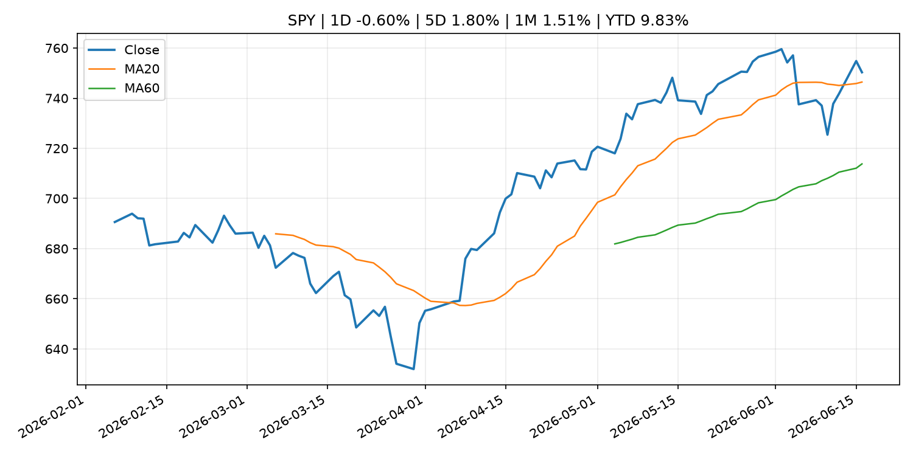
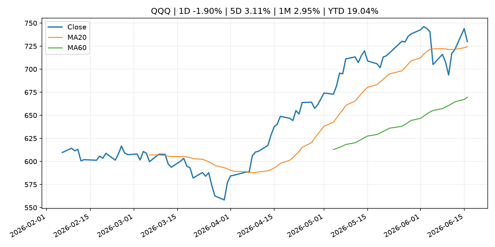
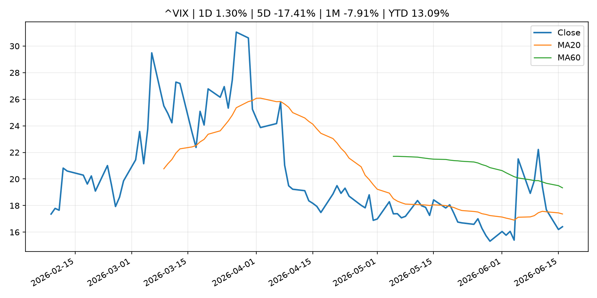
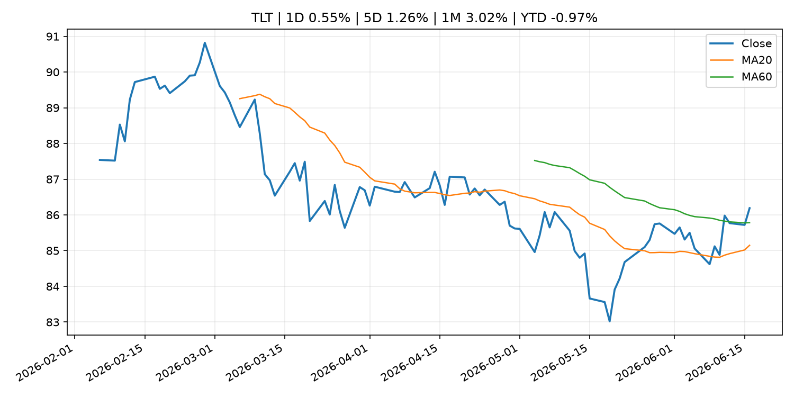
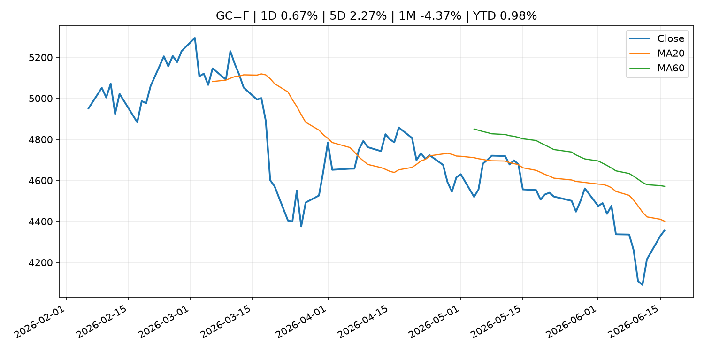
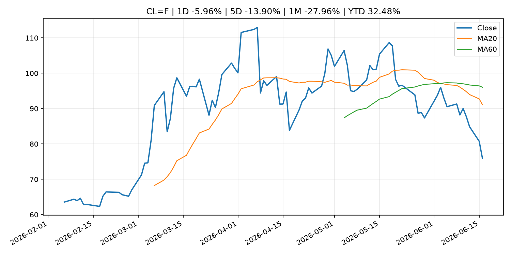
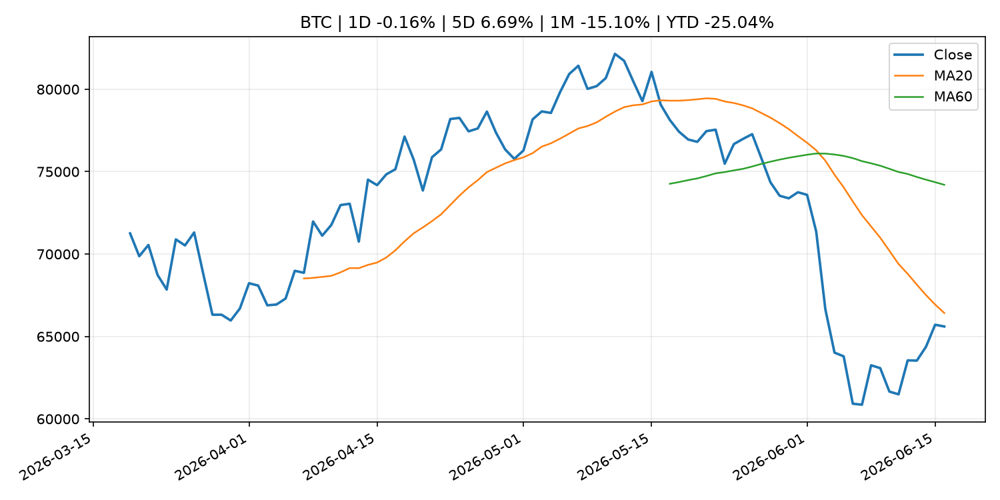
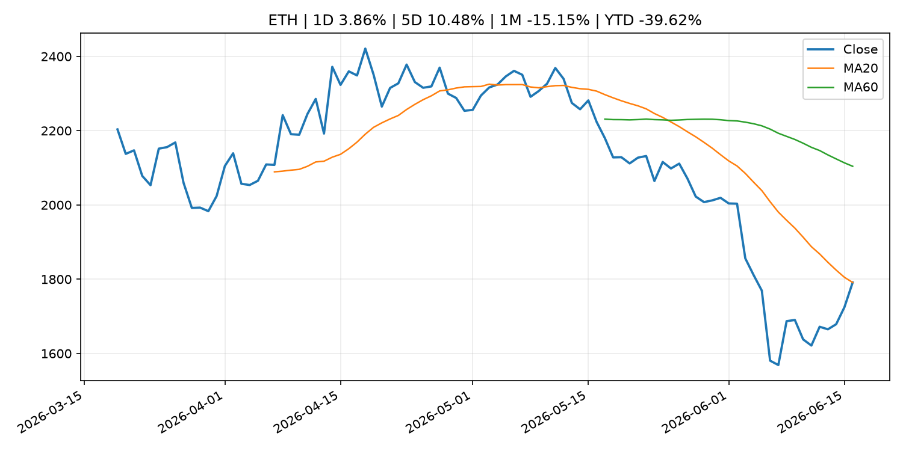
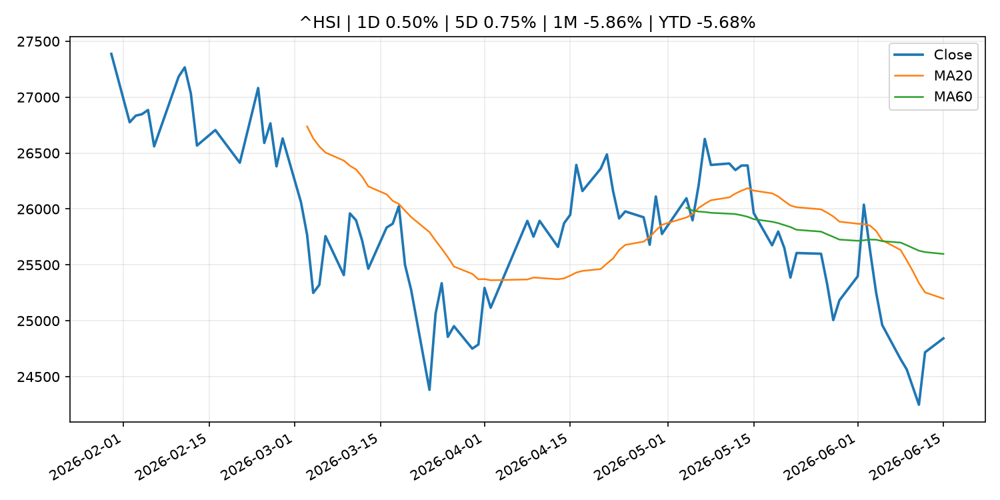

# Global Macro Morning Briefing - 2026-06-17

> Not financial advice / 非投资建议。

## 0. 今日总览
- 市场状态：mixed。市场信号不足，暂不判断明确状态。 但存在信号冲突，需要降低单一叙事置信度。
- 今日三大主线：
  1. crypto_market_structure: U.S. senators urge Treasury not to leave states out of GENIUS Act stablecoin process
  2. crypto_market_structure: Ripple invests in Flutterwave, pushing its stablecoin and XRP Ledger into payments across Africa
  3. crypto_market_structure: State Street targets stablecoin reserve boom with new money market fund
- 一句话结论：今日晨报重点关注：加密市场结构和监管变化会影响 BTC、ETH 及相关股票的风险溢价。；加密市场结构和监管变化会影响 BTC、ETH 及相关股票的风险溢价。。跨资产方面，SPY 1D -0.60%；QQQ 1D -1.90%；^VIX 1D 1.30%；TLT 1D 0.55%；GC=F 1D 0.67%；CL=F 1D -5.96%；BTC 1D -0.16%；ETH 1D 3.86%；市场信号不足，暂不判断明确状态。 但存在信号冲突，需要降低单一叙事置信度。政策、通胀、利率、美元、美债、能源和加密监管仍是主要观察线索。所有结论仅基于公开数据与短摘要整理，不构成投资建议。

## 1. 隔夜跨资产市场
- 美股：SPY 1D -0.60%，QQQ 1D -1.90%，整体趋势需结合 VIX 和利率确认。
- 美债/美元：TLT 1D 0.55%，美元指数 1D -0.09%，是判断折现率压力的核心线索。
- 黄金/原油：黄金 1D 0.67%，原油 1D -5.96%，用于观察避险、通胀和地缘风险。
- 加密：BTC 1D -0.16%，ETH 1D 3.86%，关注是否独立于纳指走出加密自身行情。
- 港股/A股：恒生 1D 0.50%，沪深300/上证 1D n/a，重点看中国政策预期与人民币线索。
- 风险观察：关注后续数据是否确认当前跨资产信号。

### US_EQUITY

| symbol | latest close | 1D | 5D | 1M | YTD | trend |
|---|---:|---:|---:|---:|---:|---|
| SPY | 750.33 | -0.60% | 1.80% | 1.51% | 9.83% | uptrend |
| QQQ | 729.86 | -1.90% | 3.11% | 2.95% | 19.04% | uptrend |
| DIA | 521.44 | 0.58% | 2.36% | 5.26% | 7.82% | strong_uptrend |
| IWM | 292.08 | -0.87% | 2.48% | 5.22% | 17.40% | uptrend |
| VTI | 370.37 | -0.58% | 1.84% | 2.10% | 10.13% | uptrend |

### US_MACRO_MARKET

| symbol | latest close | 1D | 5D | 1M | YTD | trend |
|---|---:|---:|---:|---:|---:|---|
| ^VIX | 16.41 | 1.30% | -17.41% | -7.91% | 13.09% | downtrend |
| DX-Y.NYB | 99.54 | -0.09% | -0.37% | 0.27% | 1.14% | uptrend |
| TLT | 86.19 | 0.55% | 1.26% | 3.02% | -0.97% | range_bound |
| IEF | 94.52 | 0.25% | 0.79% | 1.08% | -1.62% | range_bound |

### COMMODITIES

| symbol | latest close | 1D | 5D | 1M | YTD | trend |
|---|---:|---:|---:|---:|---:|---|
| GC=F | 4,356.80 | 0.67% | 2.27% | -4.37% | 0.98% | downtrend |
| SI=F | 70.24 | 0.25% | 7.91% | -8.97% | -0.45% | strong_downtrend |
| CL=F | 75.94 | -5.96% | -13.90% | -27.96% | 32.48% | strong_downtrend |
| BZ=F | 79.51 | -4.40% | -13.06% | -27.23% | 30.88% | strong_downtrend |
| NG=F | 3.26 | 3.46% | 3.69% | 10.00% | -10.01% | strong_uptrend |
| HG=F | 6.49 | 0.15% | 3.01% | 3.85% | 15.11% | strong_uptrend |

### HK_MARKET

| symbol | latest close | 1D | 5D | 1M | YTD | trend |
|---|---:|---:|---:|---:|---:|---|
| ^HSI | 24,842.67 | 0.50% | 0.75% | -5.86% | -5.68% | strong_downtrend |
| 0700.HK | 447.40 | -2.65% | -1.28% | -1.97% | -28.19% | downtrend |
| 9988.HK | 107.00 | -2.10% | -8.63% | -19.12% | -28.19% | strong_downtrend |
| 3690.HK | 75.30 | -3.77% | -2.46% | -8.95% | -28.01% | downtrend |
| 1810.HK | 25.66 | -2.28% | -5.66% | -16.42% | -36.30% | strong_downtrend |
| 1211.HK | 84.05 | -1.81% | -4.92% | -12.86% | -14.89% | strong_downtrend |

### CRYPTO

| symbol | latest close | 1D | 5D | 1M | YTD | trend |
|---|---:|---:|---:|---:|---:|---|
| BTC | 65,607.37 | -0.16% | 6.69% | -15.10% | -25.04% | strong_downtrend |
| ETH | 1,791.27 | 3.86% | 10.48% | -15.15% | -39.62% | range_bound |
| SOLANA | 73.57 | 3.48% | 16.45% | -13.42% | -40.92% | range_bound |
| BINANCECOIN | 604.51 | -1.91% | 3.09% | -8.75% | -29.97% | strong_downtrend |
| RIPPLE | 1.22 | 2.64% | 10.92% | -9.83% | -33.86% | range_bound |

## 2. 今日最重要的 10 条新闻
### 1. U.S. senators urge Treasury not to leave states out of GENIUS Act stablecoin process
- 来源：CoinDesk
- 时间：2026-06-16T20:36:09+00:00
- 地区：global
- 事件类型：crypto_market_structure
- 重要性层级：Tier 2
- 一句话摘要：U.S. senators urge Treasury not to leave states out of GENIUS Act stablecoin process
- 为什么重要：加密市场结构和监管变化会影响 BTC、ETH 及相关股票的风险溢价。
- 可能影响：主要影响 BTC，方向为 mixed，强度 high；加密监管或 ETF 进展会改变 BTC 的资金流和风险溢价。
  - 资产：BTC
    方向：mixed
    强度：high
    原因：加密监管或 ETF 进展会改变 BTC 的资金流和风险溢价。
  - 资产：ETH
    方向：mixed
    强度：high
    原因：监管框架会影响 ETH 产品化和机构参与度。
  - 资产：COIN
    方向：mixed
    强度：medium
    原因：监管清晰度和执法风险会影响交易平台估值。
  - 资产：crypto market
    方向：mixed
    强度：high
    原因：信息影响整个加密市场结构，但方向取决于细节。
- 原文链接：[https://www.coindesk.com/policy/2026/06/16/u-s-senators-urge-treasury-not-to-leave-states-out-of-genius-act-stablecoin-process](https://www.coindesk.com/policy/2026/06/16/u-s-senators-urge-treasury-not-to-leave-states-out-of-genius-act-stablecoin-process)

### 2. Ripple invests in Flutterwave, pushing its stablecoin and XRP Ledger into payments across Africa
- 来源：CoinDesk
- 时间：2026-06-16T15:35:40+00:00
- 地区：global
- 事件类型：crypto_market_structure
- 重要性层级：Tier 2
- 一句话摘要：Ripple invests in Flutterwave, pushing its stablecoin and XRP Ledger into payments across Africa
- 为什么重要：加密市场结构和监管变化会影响 BTC、ETH 及相关股票的风险溢价。
- 可能影响：主要影响 BTC，方向为 mixed，强度 high；加密监管或 ETF 进展会改变 BTC 的资金流和风险溢价。
  - 资产：BTC
    方向：mixed
    强度：high
    原因：加密监管或 ETF 进展会改变 BTC 的资金流和风险溢价。
  - 资产：ETH
    方向：mixed
    强度：high
    原因：监管框架会影响 ETH 产品化和机构参与度。
  - 资产：COIN
    方向：mixed
    强度：medium
    原因：监管清晰度和执法风险会影响交易平台估值。
  - 资产：crypto market
    方向：mixed
    强度：high
    原因：信息影响整个加密市场结构，但方向取决于细节。
- 原文链接：[https://www.coindesk.com/business/2026/06/16/ripple-invests-in-flutterwave-pushing-its-stablecoin-and-xrp-ledger-into-payments-across-africa](https://www.coindesk.com/business/2026/06/16/ripple-invests-in-flutterwave-pushing-its-stablecoin-and-xrp-ledger-into-payments-across-africa)

### 3. State Street targets stablecoin reserve boom with new money market fund
- 来源：CoinDesk
- 时间：2026-06-16T14:27:26+00:00
- 地区：global
- 事件类型：crypto_market_structure
- 重要性层级：Tier 2
- 一句话摘要：State Street targets stablecoin reserve boom with new money market fund
- 为什么重要：加密市场结构和监管变化会影响 BTC、ETH 及相关股票的风险溢价。
- 可能影响：主要影响 BTC，方向为 mixed，强度 high；加密监管或 ETF 进展会改变 BTC 的资金流和风险溢价。
  - 资产：BTC
    方向：mixed
    强度：high
    原因：加密监管或 ETF 进展会改变 BTC 的资金流和风险溢价。
  - 资产：ETH
    方向：mixed
    强度：high
    原因：监管框架会影响 ETH 产品化和机构参与度。
  - 资产：COIN
    方向：mixed
    强度：medium
    原因：监管清晰度和执法风险会影响交易平台估值。
  - 资产：crypto market
    方向：mixed
    强度：high
    原因：信息影响整个加密市场结构，但方向取决于细节。
- 原文链接：[https://www.coindesk.com/business/2026/06/16/state-street-targets-stablecoin-reserve-boom-with-new-money-market-fund](https://www.coindesk.com/business/2026/06/16/state-street-targets-stablecoin-reserve-boom-with-new-money-market-fund)

### 4. BlackRock's new bitcoin ETF lets institutions earn from volatility. There's a catch.
- 来源：CoinDesk
- 时间：2026-06-16T11:21:02+00:00
- 地区：global
- 事件类型：other
- 重要性层级：Tier 3
- 一句话摘要：BlackRock's new bitcoin ETF lets institutions earn from volatility. There's a catch.
- 为什么重要：这条信息暂未匹配到重大宏观、政策或市场事件，更适合作为背景跟踪。
- 可能影响：主要影响 BTC，方向为 mixed，强度 high；加密监管或 ETF 进展会改变 BTC 的资金流和风险溢价。
  - 资产：BTC
    方向：mixed
    强度：high
    原因：加密监管或 ETF 进展会改变 BTC 的资金流和风险溢价。
  - 资产：ETH
    方向：mixed
    强度：high
    原因：监管框架会影响 ETH 产品化和机构参与度。
  - 资产：COIN
    方向：mixed
    强度：medium
    原因：监管清晰度和执法风险会影响交易平台估值。
  - 资产：crypto market
    方向：mixed
    强度：high
    原因：信息影响整个加密市场结构，但方向取决于细节。
- 原文链接：[https://www.coindesk.com/daybook-us/2026/06/16/blackrock-s-new-bitcoin-etf-lets-institutions-earn-from-volatility-there-s-a-catch](https://www.coindesk.com/daybook-us/2026/06/16/blackrock-s-new-bitcoin-etf-lets-institutions-earn-from-volatility-there-s-a-catch)

### 5. ‘We own our home outright’: I am 67 and earn $100,000. Do I take my $30,000-a-year Social Security now or wait?
- 来源：MarketWatch Top Stories
- 时间：2026-06-16T21:45:00+00:00
- 地区：US
- 事件类型：other
- 重要性层级：Tier 3
- 一句话摘要：“We have combined savings of $950,000 in retirement plans, Roth IRAs and Treasuries.”
- 为什么重要：这条信息暂未匹配到重大宏观、政策或市场事件，更适合作为背景跟踪。
- 可能影响：更偏背景信息，短期市场影响可能有限。
  - 资产：暂无明确资产映射
  - 方向：unknown
  - 强度：low
  - 原因：公开信息不足以判断方向。
- 原文链接：[https://www.marketwatch.com/story/we-own-our-home-outright-i-am-67-and-earn-100-000-do-i-take-my-30-000-social-security-now-or-wait-bbe1e123?mod=mw_rss_topstories](https://www.marketwatch.com/story/we-own-our-home-outright-i-am-67-and-earn-100-000-do-i-take-my-30-000-social-security-now-or-wait-bbe1e123?mod=mw_rss_topstories)

## 3. 政策与央行观察
### 1. U.S. senators urge Treasury not to leave states out of GENIUS Act stablecoin process
- 来源：CoinDesk
- 时间：2026-06-16T20:36:09+00:00
- 地区：global
- 事件类型：crypto_market_structure
- 重要性层级：Tier 2
- 一句话摘要：U.S. senators urge Treasury not to leave states out of GENIUS Act stablecoin process
- 为什么重要：加密市场结构和监管变化会影响 BTC、ETH 及相关股票的风险溢价。
- 可能影响：主要影响 BTC，方向为 mixed，强度 high；加密监管或 ETF 进展会改变 BTC 的资金流和风险溢价。
  - 资产：BTC
    方向：mixed
    强度：high
    原因：加密监管或 ETF 进展会改变 BTC 的资金流和风险溢价。
  - 资产：ETH
    方向：mixed
    强度：high
    原因：监管框架会影响 ETH 产品化和机构参与度。
  - 资产：COIN
    方向：mixed
    强度：medium
    原因：监管清晰度和执法风险会影响交易平台估值。
  - 资产：crypto market
    方向：mixed
    强度：high
    原因：信息影响整个加密市场结构，但方向取决于细节。
- 原文链接：[https://www.coindesk.com/policy/2026/06/16/u-s-senators-urge-treasury-not-to-leave-states-out-of-genius-act-stablecoin-process](https://www.coindesk.com/policy/2026/06/16/u-s-senators-urge-treasury-not-to-leave-states-out-of-genius-act-stablecoin-process)

### 2. Ripple invests in Flutterwave, pushing its stablecoin and XRP Ledger into payments across Africa
- 来源：CoinDesk
- 时间：2026-06-16T15:35:40+00:00
- 地区：global
- 事件类型：crypto_market_structure
- 重要性层级：Tier 2
- 一句话摘要：Ripple invests in Flutterwave, pushing its stablecoin and XRP Ledger into payments across Africa
- 为什么重要：加密市场结构和监管变化会影响 BTC、ETH 及相关股票的风险溢价。
- 可能影响：主要影响 BTC，方向为 mixed，强度 high；加密监管或 ETF 进展会改变 BTC 的资金流和风险溢价。
  - 资产：BTC
    方向：mixed
    强度：high
    原因：加密监管或 ETF 进展会改变 BTC 的资金流和风险溢价。
  - 资产：ETH
    方向：mixed
    强度：high
    原因：监管框架会影响 ETH 产品化和机构参与度。
  - 资产：COIN
    方向：mixed
    强度：medium
    原因：监管清晰度和执法风险会影响交易平台估值。
  - 资产：crypto market
    方向：mixed
    强度：high
    原因：信息影响整个加密市场结构，但方向取决于细节。
- 原文链接：[https://www.coindesk.com/business/2026/06/16/ripple-invests-in-flutterwave-pushing-its-stablecoin-and-xrp-ledger-into-payments-across-africa](https://www.coindesk.com/business/2026/06/16/ripple-invests-in-flutterwave-pushing-its-stablecoin-and-xrp-ledger-into-payments-across-africa)

### 3. State Street targets stablecoin reserve boom with new money market fund
- 来源：CoinDesk
- 时间：2026-06-16T14:27:26+00:00
- 地区：global
- 事件类型：crypto_market_structure
- 重要性层级：Tier 2
- 一句话摘要：State Street targets stablecoin reserve boom with new money market fund
- 为什么重要：加密市场结构和监管变化会影响 BTC、ETH 及相关股票的风险溢价。
- 可能影响：主要影响 BTC，方向为 mixed，强度 high；加密监管或 ETF 进展会改变 BTC 的资金流和风险溢价。
  - 资产：BTC
    方向：mixed
    强度：high
    原因：加密监管或 ETF 进展会改变 BTC 的资金流和风险溢价。
  - 资产：ETH
    方向：mixed
    强度：high
    原因：监管框架会影响 ETH 产品化和机构参与度。
  - 资产：COIN
    方向：mixed
    强度：medium
    原因：监管清晰度和执法风险会影响交易平台估值。
  - 资产：crypto market
    方向：mixed
    强度：high
    原因：信息影响整个加密市场结构，但方向取决于细节。
- 原文链接：[https://www.coindesk.com/business/2026/06/16/state-street-targets-stablecoin-reserve-boom-with-new-money-market-fund](https://www.coindesk.com/business/2026/06/16/state-street-targets-stablecoin-reserve-boom-with-new-money-market-fund)

## 4. 市场异动与图表
- SPY 下跌 -0.60%
- QQQ 下跌 -1.90%
- TLT 上涨 0.55%
- Gold 上涨 0.67%
- Oil 下跌 -5.96%
- ETH 上涨 3.86%

### 信号矛盾
- 加密资产走强但美股走弱，可能是加密市场自身事件驱动。

### SPY

### QQQ

### ^VIX

### TLT

### GC=F

### CL=F

### BTC

### ETH

### ^HSI

## 5. 华尔街与机构公开观点
- 暂无可靠公开观点。

## 6. 今日重点关注
- 经济数据：经济数据：暂无可靠公开日历数据；如配置经济日历源后可自动填充。
- 央行讲话：央行讲话：暂无可靠公开日历数据；重点跟踪 Fed、ECB、BoJ、PBOC 官网 RSS。
- 财报：财报：暂无可靠数据。
- 政策事件：政策事件：暂无可靠数据。
- 风险提醒：风险提醒：关注数据源失败项、突发地缘风险、利率和美元的二阶反应。

## 7. 英文金融表达与宏观概念
- **real yield**：实际收益率，名义利率扣除通胀预期后的收益率。 例句：Gold often reacts more to real yields than nominal yields.
- **market structure**：市场结构，指交易、托管、清算、ETF、监管等制度安排。 例句：Crypto market structure rules can affect institutional participation.
- **inflation expectations**：通胀预期，指家庭、企业或市场对未来通胀的预估。 例句：Inflation expectations can shape wage bargaining and bond yields.
- **terminal rate**：终端利率，市场预期本轮加息周期的最高政策利率。 例句：A higher terminal rate can pressure growth stocks.
- **soft landing**：软着陆，指通胀回落而经济避免明显衰退。 例句：Markets often rally when data support a soft landing.
- **risk-off**：避险模式，资金偏向美元、国债、黄金等防御资产。 例句：A geopolitical shock can push markets into risk-off mode.

## 8. 背景材料
- [‘We own our home outright’: I am 67 and earn $100,000. Do I take my $30,000-a-year Social Security now or wait?](https://www.marketwatch.com/story/we-own-our-home-outright-i-am-67-and-earn-100-000-do-i-take-my-30-000-social-security-now-or-wait-bbe1e123?mod=mw_rss_topstories)（MarketWatch Top Stories，other）：“We have combined savings of $950,000 in retirement plans, Roth IRAs and Treasuries.”
- [SpaceX trading hits ‘bonkers’ levels as new ETFs see a massive cash influx](https://www.marketwatch.com/story/spacex-trading-hits-bonkers-levels-as-a-wave-of-new-etfs-see-a-massive-cash-influx-8f5364b0?mod=mw_rss_topstories)（MarketWatch Top Stories，other）：Newly launched leveraged ETFs are seeing heavy inflows as investors look for fresh ways to play the SpaceX hype.
- [Bitcoin miners' AI pivot faces $50 billion reality check, says VanEck](https://www.coindesk.com/markets/2026/06/16/bitcoin-miners-ai-pivot-faces-usd50-billion-reality-check-says-vaneck)（CoinDesk，other）：Bitcoin miners' AI pivot faces $50 billion reality check, says VanEck
- [Bitcoin is cratering, but a new Wall Street crypto hype is on the rise](https://www.cnbc.com/2026/06/06/bitcoin-price-crash-crypto-hype-hyperliquid-etfs.html)（CNBC Economy，other）：As bitcoin dropped to its lowest price since 2024, investors flock to a new type of crypto investment linked to the hyperliquid platforms, HYPE ETFs.
- [Philip R. Lane: Outlook for the euro area economy](https://www.ecb.europa.eu//press/key/date/2026/html/ecb.sp260616~8076dabd2c.en.pdf)（ECB Press Releases，other）：Philip R. Lane: Outlook for the euro area economy
- [BlackRock's new bitcoin income fund offers cash flow alongside BTC exposure](https://www.coindesk.com/markets/2026/06/16/blackrock-s-new-bitcoin-income-fund-offers-cash-flow-alongside-btc-exposure)（CoinDesk，other）：BlackRock's new bitcoin income fund offers cash flow alongside BTC exposure
- [BlackRock's new bitcoin ETF lets institutions earn from volatility. There's a catch.](https://www.coindesk.com/daybook-us/2026/06/16/blackrock-s-new-bitcoin-etf-lets-institutions-earn-from-volatility-there-s-a-catch)（CoinDesk，other）：BlackRock's new bitcoin ETF lets institutions earn from volatility. There's a catch.
- [Bitcoin buyers add over 250,000 BTC between $59,000 and $67,000 as accumulation returns](https://www.coindesk.com/markets/2026/06/16/bitcoin-buyers-add-over-250-000-btc-between-usd59-000-and-usd67-000-as-accumulation-returns)（CoinDesk，other）：Bitcoin buyers add over 250,000 BTC between $59,000 and $67,000 as accumulation returns
- [Bitcoin rallies after Japan rate increase with XLM, INJ, UNI advancing](https://www.coindesk.com/markets/2026/06/16/bitcoin-rallies-after-japan-rate-increase-with-xlm-inj-uni-advancing)（CoinDesk，other）：Bitcoin rallies after Japan rate increase with XLM, INJ, UNI advancing
- [Treatment of the Relaxation of the Terms and Conditions for the Securities Lending Facility](http://www.boj.or.jp/en/mopo/mpmdeci/mpr_2026/mpr260616d.pdf)（Bank of Japan Announcements，other）：Treatment of the Relaxation of the Terms and Conditions for the Securities Lending Facility
- [BOJ Current Account Balances by Sector (May)](http://www.boj.or.jp/en/statistics/boj/other/cabs/cabs.xlsx)（Bank of Japan Announcements，other）：BOJ Current Account Balances by Sector (May)
- [Outline of Outright Purchases of Japanese Government Securities](http://www.boj.or.jp/en/mopo/mpmdeci/mpr_2026/mpr260616b.pdf)（Bank of Japan Announcements，other）：Outline of Outright Purchases of Japanese Government Securities
- [Quarterly Schedule of Outright Purchases of Japanese Government Bonds (Competitive Auction Method) (July-September 2026)](http://www.boj.or.jp/en/mopo/mpmdeci/mpr_2026/mpr260616a.pdf)（Bank of Japan Announcements，other）：Quarterly Schedule of Outright Purchases of Japanese Government Bonds (Competitive Auction Method) (July-September 2026)
- [Tether Gold now has a dedicated options market on Bybit](https://www.coindesk.com/markets/2026/06/16/tether-gold-now-has-a-dedicated-options-market-on-bybit)（CoinDesk，other）：Tether Gold now has a dedicated options market on Bybit
- [Live markets: Bitcoin falls below $66,000 as SpaceX rallies on Cursor agreement](https://www.coindesk.com/tech/2026/06/16/live-markets-bitcoin-etfs-bled-cash-monday-while-every-other-crypto-etf-gained)（CoinDesk，other）：Live markets: Bitcoin falls below $66,000 as SpaceX rallies on Cursor agreement
- [Profit-taking across bitcoin, ether, solana as traders wait on the Iran signing](https://www.coindesk.com/markets/2026/06/16/profit-taking-across-bitcoin-ether-solana-as-traders-wait-on-the-iran-signing)（CoinDesk，other）：Profit-taking across bitcoin, ether, solana as traders wait on the Iran signing
- [Bitcoin rises after Bank of Japan hikes interest rates to a 31-year high](https://www.coindesk.com/markets/2026/06/16/bitcoin-rises-after-bank-of-japan-hikes-interest-rates-to-a-31-year-high)（CoinDesk，other）：Bitcoin rises after Bank of Japan hikes interest rates to a 31-year high
- [Plan for the Outright Purchases of Japanese Government Bonds](http://www.boj.or.jp/en/mopo/mpmdeci/mpr_2026/k260616b.pdf)（Bank of Japan Announcements，other）：Plan for the Outright Purchases of Japanese Government Bonds
- [Change in the Guideline for Money Market Operations](http://www.boj.or.jp/en/mopo/mpmdeci/mpr_2026/k260616a.pdf)（Bank of Japan Announcements，other）：Change in the Guideline for Money Market Operations
- [Amendment to "Principal Terms and Conditions of Complementary Deposit Facility"](http://www.boj.or.jp/en/mopo/mpmdeci/mpr_2026/mpr260616c.pdf)（Bank of Japan Announcements，other）：Amendment to "Principal Terms and Conditions of Complementary Deposit Facility"

## 9. 数据源、失败项与免责声明
- 采集时间：2026-06-16T23:24:18
- 数据源：公开 RSS、Yahoo Finance、CoinGecko、AKShare、FRED、SEC data.sec.gov，以及用户自有 inputs/reports 文件。
- 合规说明：不绕过 WSJ、Bloomberg、FT、Reuters 等付费墙；对付费媒体只使用公开 RSS 标题、摘要、链接和发布时间。
- 免责声明：Not financial advice / 非投资建议。本项目仅供个人学习、研究和信息整理，不构成投资建议、交易建议或任何收益承诺。
- 失败或跳过的数据源：
  - crypto data failed coin=dogecoin
  - China market data failed symbol=上证指数: empty dataframe
  - China market data failed symbol=深证成指: empty dataframe
  - China market data failed symbol=创业板指: empty dataframe
  - China market data failed symbol=沪深300: empty dataframe
  - China market data failed symbol=中证500: empty dataframe
  - China market data failed symbol=科创50: empty dataframe
  - FRED_API_KEY not set; skipping FRED macro series
  - SEC failed cik=0000320193
  - SEC failed cik=0000789019
  - SEC failed cik=0001045810
  - SEC failed cik=0001318605
  - SEC failed cik=0001577552
