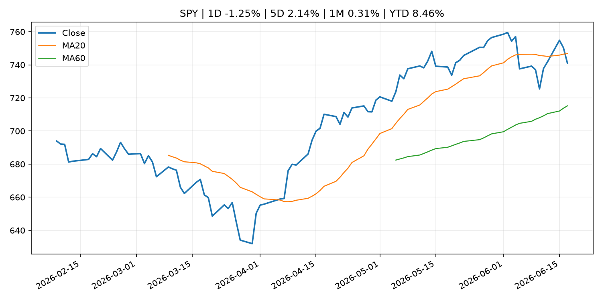
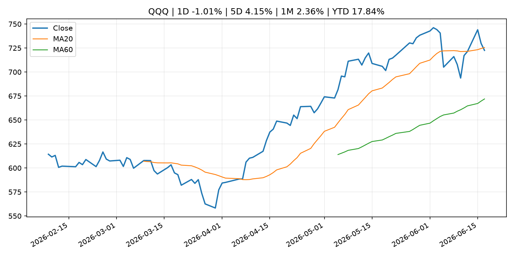
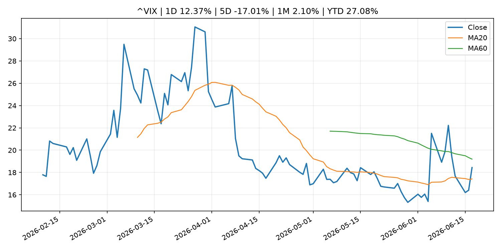
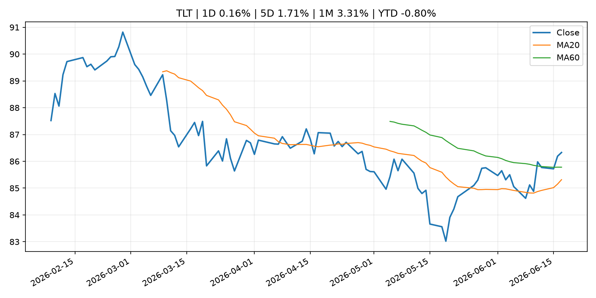
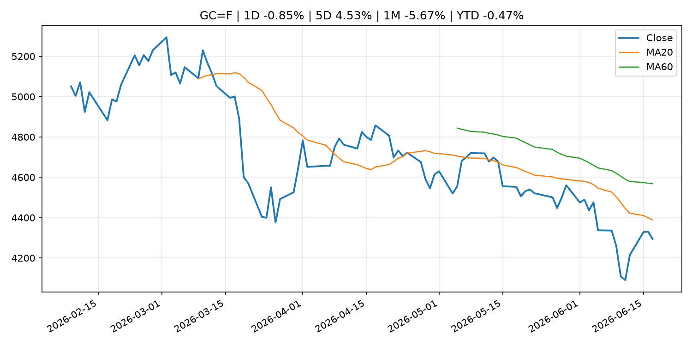
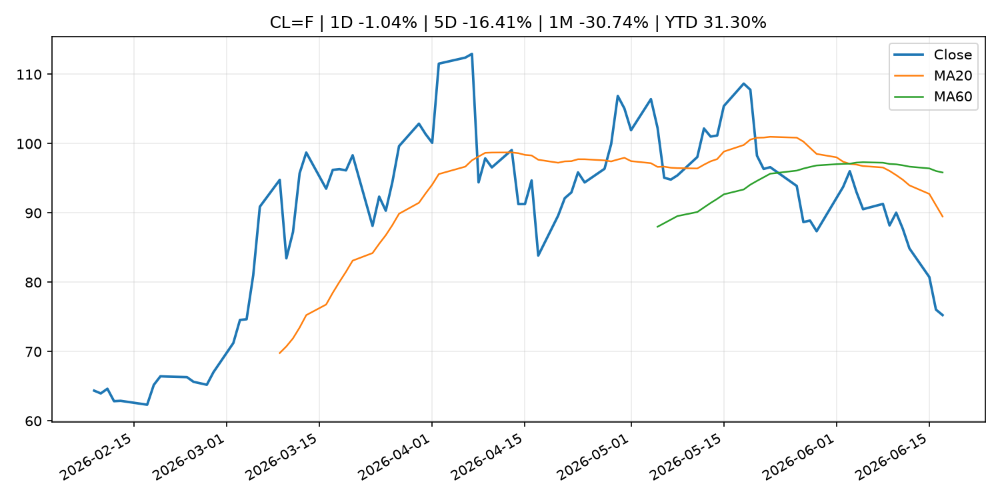
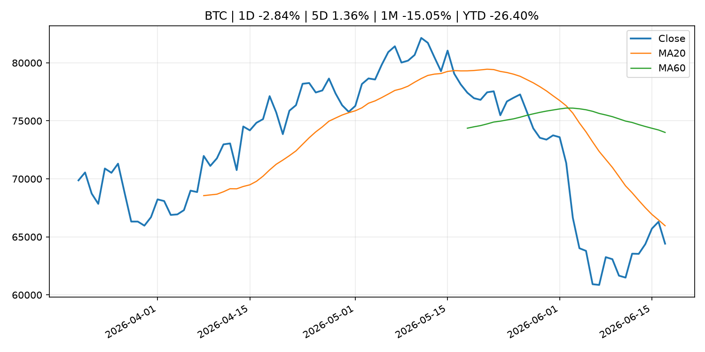
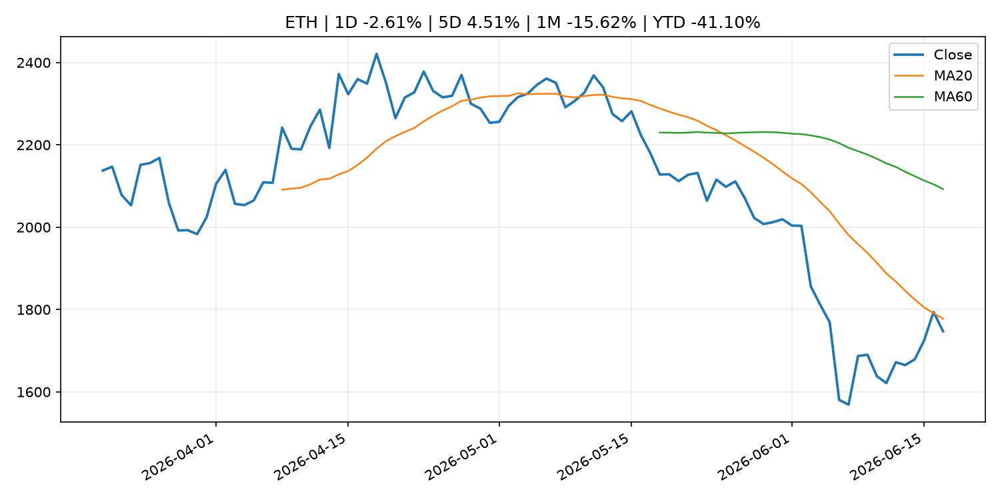
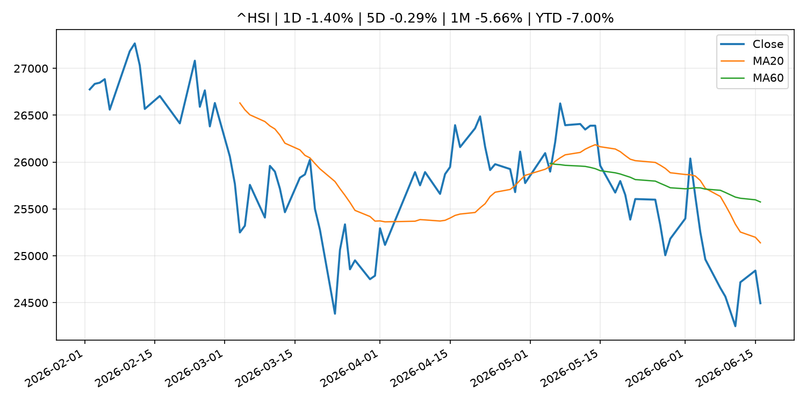

# Global Macro Morning Briefing - 2026-06-18

> Not financial advice / 非投资建议。

## 0. 今日总览
- 市场状态：dollar_liquidity_tightening。美元走强并压制风险资产，市场可能在交易美元流动性收紧。
- 今日三大主线：
  1. central_bank_decision: The Fed just threw investors a curveball. Here’s how stocks, bonds, gold and the dollar reacted.
  2. central_bank_decision: Federal Reserve issues FOMC statement
  3. central_bank_decision: Federal Reserve Board and Federal Open Market Committee release economic projections from the June 16-17 FOMC meeting
- 一句话结论：今日晨报重点关注：央行决策会重定价利率、汇率、久期资产和风险资产。；央行决策会重定价利率、汇率、久期资产和风险资产。。跨资产方面，SPY 1D -1.25%；QQQ 1D -1.01%；^VIX 1D 12.37%；TLT 1D 0.16%；GC=F 1D -0.85%；CL=F 1D -1.04%；BTC 1D -2.84%；ETH 1D -2.61%；美元走强并压制风险资产，市场可能在交易美元流动性收紧。政策、通胀、利率、美元、美债、能源和加密监管仍是主要观察线索。所有结论仅基于公开数据与短摘要整理，不构成投资建议。

## 1. 隔夜跨资产市场
- 美股：SPY 1D -1.25%，QQQ 1D -1.01%，整体趋势需结合 VIX 和利率确认。
- 美债/美元：TLT 1D 0.16%，美元指数 1D 0.85%，是判断折现率压力的核心线索。
- 黄金/原油：黄金 1D -0.85%，原油 1D -1.04%，用于观察避险、通胀和地缘风险。
- 加密：BTC 1D -2.84%，ETH 1D -2.61%，关注是否独立于纳指走出加密自身行情。
- 港股/A股：恒生 1D -1.40%，沪深300/上证 1D n/a，重点看中国政策预期与人民币线索。
- 风险观察：关注离岸美元、亚洲货币和新兴市场资产反应。

### US_EQUITY

| symbol | latest close | 1D | 5D | 1M | YTD | trend |
|---|---:|---:|---:|---:|---:|---|
| SPY | 740.96 | -1.25% | 2.14% | 0.31% | 8.46% | range_bound |
| QQQ | 722.51 | -1.01% | 4.15% | 2.36% | 17.84% | range_bound |
| DIA | 516.30 | -0.99% | 3.21% | 3.88% | 6.76% | strong_uptrend |
| IWM | 289.88 | -0.75% | 2.78% | 5.04% | 16.52% | uptrend |
| VTI | 365.76 | -1.24% | 2.16% | 0.94% | 8.76% | range_bound |

### US_MACRO_MARKET

| symbol | latest close | 1D | 5D | 1M | YTD | trend |
|---|---:|---:|---:|---:|---:|---|
| ^VIX | 18.44 | 12.37% | -17.01% | 2.10% | 27.08% | range_bound |
| DX-Y.NYB | 100.39 | 0.85% | 0.44% | 1.43% | 2.00% | uptrend |
| TLT | 86.33 | 0.16% | 1.71% | 3.31% | -0.80% | range_bound |
| IEF | 94.02 | -0.53% | 0.35% | 0.59% | -2.14% | downtrend |

### COMMODITIES

| symbol | latest close | 1D | 5D | 1M | YTD | trend |
|---|---:|---:|---:|---:|---:|---|
| GC=F | 4,294.30 | -0.85% | 4.53% | -5.67% | -0.47% | strong_downtrend |
| SI=F | 68.29 | -2.30% | 5.71% | -11.40% | -3.21% | strong_downtrend |
| CL=F | 75.26 | -1.04% | -16.41% | -30.74% | 31.30% | strong_downtrend |
| BZ=F | 78.93 | -0.04% | -15.22% | -29.59% | 29.93% | strong_downtrend |
| NG=F | 3.16 | -2.41% | -0.75% | 4.53% | -12.63% | uptrend |
| HG=F | 6.39 | -1.59% | 2.19% | 1.82% | 13.23% | uptrend |

### HK_MARKET

| symbol | latest close | 1D | 5D | 1M | YTD | trend |
|---|---:|---:|---:|---:|---:|---|
| ^HSI | 24,493.95 | -1.40% | -0.29% | -5.66% | -7.00% | strong_downtrend |
| 0700.HK | 445.40 | -0.45% | -4.34% | -0.85% | -28.51% | downtrend |
| 9988.HK | 106.90 | -0.09% | -5.81% | -18.83% | -28.26% | strong_downtrend |
| 3690.HK | 74.40 | -1.20% | -5.82% | -9.43% | -28.87% | downtrend |
| 1810.HK | 25.42 | -0.94% | -3.42% | -17.09% | -36.89% | strong_downtrend |
| 1211.HK | 81.90 | -2.56% | -5.43% | -12.69% | -17.06% | strong_downtrend |

### CRYPTO

| symbol | latest close | 1D | 5D | 1M | YTD | trend |
|---|---:|---:|---:|---:|---:|---|
| BTC | 64,415.97 | -2.84% | 1.36% | -15.05% | -26.40% | strong_downtrend |
| ETH | 1,747.31 | -2.61% | 4.51% | -15.62% | -41.10% | strong_downtrend |
| SOLANA | 72.01 | -2.64% | 7.90% | -13.87% | -42.17% | range_bound |
| BINANCECOIN | 600.80 | -2.66% | -0.71% | -8.38% | -30.39% | strong_downtrend |
| RIPPLE | 1.19 | -4.12% | 4.01% | -10.64% | -35.49% | downtrend |

## 2. 今日最重要的 10 条新闻
### 1. The Fed just threw investors a curveball. Here’s how stocks, bonds, gold and the dollar reacted.
- 来源：MarketWatch Top Stories
- 时间：2026-06-17T21:38:00+00:00
- 地区：US
- 事件类型：central_bank_decision
- 重要性层级：Tier 1
- 一句话摘要：In his first press conference as Fed chair, Kevin Warsh took a surprisingly aggressive stance on interest rates and inflation.
- 为什么重要：央行决策会重定价利率、汇率、久期资产和风险资产。
- 可能影响：主要影响 DXY，方向为 positive，强度 high；通胀压力可能推高政策利率预期并支撑美元。
  - 资产：DXY
    方向：positive
    强度：high
    原因：通胀压力可能推高政策利率预期并支撑美元。
  - 资产：TLT
    方向：negative
    强度：high
    原因：通胀上行通常推升收益率、压低长债价格。
  - 资产：QQQ
    方向：negative
    强度：high
    原因：更高利率对成长股估值折现率不利。
  - 资产：SPY
    方向：mixed
    强度：medium
    原因：名义增长可能支撑收入，但更高利率压制估值。
  - 资产：GC=F
    方向：mixed
    强度：medium
    原因：通胀对黄金是支撑，但实际利率上行会形成压力。
  - 资产：BTC
    方向：mixed
    强度：medium
    原因：抗通胀叙事和流动性收紧可能相互抵消。
- 原文链接：[https://www.marketwatch.com/story/the-fed-threw-investors-a-curve-ball-on-wednesday-heres-how-stocks-bonds-gold-and-the-dollar-reacted-d0e1e3c0?mod=mw_rss_topstories](https://www.marketwatch.com/story/the-fed-threw-investors-a-curve-ball-on-wednesday-heres-how-stocks-bonds-gold-and-the-dollar-reacted-d0e1e3c0?mod=mw_rss_topstories)

### 2. Federal Reserve issues FOMC statement
- 来源：Federal Reserve Press Releases
- 时间：2026-06-17T18:00:00+00:00
- 地区：US
- 事件类型：central_bank_decision
- 重要性层级：Tier 1
- 一句话摘要：Federal Reserve issues FOMC statement
- 为什么重要：央行决策会重定价利率、汇率、久期资产和风险资产。
- 可能影响：可能影响利率、汇率、风险资产或大宗商品预期，但当前公开信息不足以判断明确方向。
  - 资产：暂无明确资产映射
  - 方向：unknown
  - 强度：low
  - 原因：公开信息不足以判断方向。
- 原文链接：[https://www.federalreserve.gov/newsevents/pressreleases/monetary20260617a.htm](https://www.federalreserve.gov/newsevents/pressreleases/monetary20260617a.htm)

### 3. Federal Reserve Board and Federal Open Market Committee release economic projections from the June 16-17 FOMC meeting
- 来源：Federal Reserve Press Releases
- 时间：2026-06-17T18:00:00+00:00
- 地区：US
- 事件类型：central_bank_decision
- 重要性层级：Tier 1
- 一句话摘要：Federal Reserve Board and Federal Open Market Committee release economic projections from the June 16-17 FOMC meeting
- 为什么重要：央行决策会重定价利率、汇率、久期资产和风险资产。
- 可能影响：可能影响利率、汇率、风险资产或大宗商品预期，但当前公开信息不足以判断明确方向。
  - 资产：暂无明确资产映射
  - 方向：unknown
  - 强度：low
  - 原因：公开信息不足以判断方向。
- 原文链接：[https://www.federalreserve.gov/newsevents/pressreleases/monetary20260617b.htm](https://www.federalreserve.gov/newsevents/pressreleases/monetary20260617b.htm)

### 4. Fed holds rates steady, pares down statement to remove cutting bias
- 来源：CNBC Economy
- 时间：2026-06-17T21:42:28+00:00
- 地区：US
- 事件类型：central_bank_decision
- 重要性层级：Tier 1
- 一句话摘要：The Federal Reserve on Wednesday released its interest rate decision.
- 为什么重要：央行决策会重定价利率、汇率、久期资产和风险资产。
- 可能影响：可能影响利率、汇率、风险资产或大宗商品预期，但当前公开信息不足以判断明确方向。
  - 资产：暂无明确资产映射
  - 方向：unknown
  - 强度：low
  - 原因：公开信息不足以判断方向。
- 原文链接：[https://www.cnbc.com/2026/06/17/fed-interest-rate-decision-june-2026.html](https://www.cnbc.com/2026/06/17/fed-interest-rate-decision-june-2026.html)

### 5. More united Fed board seen at Warsh's first meeting, according to Kalshi traders
- 来源：CNBC Economy
- 时间：2026-06-17T16:54:08+00:00
- 地区：US
- 事件类型：central_bank_decision
- 重要性层级：Tier 1
- 一句话摘要：Traders on prediction market platform Kalshi largely forecast a unanimous decision among FOMC members at Wednesday's meeting, after April's divided vote.
- 为什么重要：央行决策会重定价利率、汇率、久期资产和风险资产。
- 可能影响：可能影响利率、汇率、风险资产或大宗商品预期，但当前公开信息不足以判断明确方向。
  - 资产：暂无明确资产映射
  - 方向：unknown
  - 强度：low
  - 原因：公开信息不足以判断方向。
- 原文链接：[https://www.cnbc.com/2026/06/17/more-united-fed-board-seen-at-warshs-first-meeting-according-to-kalshi-traders.html](https://www.cnbc.com/2026/06/17/more-united-fed-board-seen-at-warshs-first-meeting-according-to-kalshi-traders.html)

### 6. Kevin Warsh launches his push to change how the Fed operates
- 来源：MarketWatch Top Stories
- 时间：2026-06-17T22:44:00+00:00
- 地区：US
- 事件类型：central_bank_speech
- 重要性层级：Tier 2
- 一句话摘要：The new Federal Reserve chair rolls out five task forces that will focus on the central bank’s communications, inflation frameworks and more
- 为什么重要：央行官员表态可能影响市场对下一次会议的定价。
- 可能影响：主要影响 DXY，方向为 positive，强度 high；通胀压力可能推高政策利率预期并支撑美元。
  - 资产：DXY
    方向：positive
    强度：high
    原因：通胀压力可能推高政策利率预期并支撑美元。
  - 资产：TLT
    方向：negative
    强度：high
    原因：通胀上行通常推升收益率、压低长债价格。
  - 资产：QQQ
    方向：negative
    强度：high
    原因：更高利率对成长股估值折现率不利。
  - 资产：SPY
    方向：mixed
    强度：medium
    原因：名义增长可能支撑收入，但更高利率压制估值。
  - 资产：GC=F
    方向：mixed
    强度：medium
    原因：通胀对黄金是支撑，但实际利率上行会形成压力。
  - 资产：BTC
    方向：mixed
    强度：medium
    原因：抗通胀叙事和流动性收紧可能相互抵消。
- 原文链接：[https://www.marketwatch.com/story/warsh-launches-his-push-to-change-how-the-fed-operates-3ddd9b90?mod=mw_rss_topstories](https://www.marketwatch.com/story/warsh-launches-his-push-to-change-how-the-fed-operates-3ddd9b90?mod=mw_rss_topstories)

### 7. Inside the push to weaken Washington’s toughest financial watchdog
- 来源：MarketWatch Top Stories
- 时间：2026-06-17T20:43:00+00:00
- 地区：US
- 事件类型：regulation
- 重要性层级：Tier 2
- 一句话摘要：The SEC used to intimidate corporate wrongdoers. Now its own commissioners are gutting its leverage.
- 为什么重要：监管变化会改变行业盈利预期和资产风险溢价。
- 可能影响：主要影响 BTC，方向为 mixed，强度 high；加密监管或 ETF 进展会改变 BTC 的资金流和风险溢价。
  - 资产：BTC
    方向：mixed
    强度：high
    原因：加密监管或 ETF 进展会改变 BTC 的资金流和风险溢价。
  - 资产：ETH
    方向：mixed
    强度：high
    原因：监管框架会影响 ETH 产品化和机构参与度。
  - 资产：COIN
    方向：mixed
    强度：medium
    原因：监管清晰度和执法风险会影响交易平台估值。
  - 资产：crypto market
    方向：mixed
    强度：high
    原因：信息影响整个加密市场结构，但方向取决于细节。
- 原文链接：[https://www.marketwatch.com/story/fewer-dollars-and-fuzzier-standards-inside-the-push-to-weaken-washingtons-toughest-financial-watchdog-2601a0ee?mod=mw_rss_topstories](https://www.marketwatch.com/story/fewer-dollars-and-fuzzier-standards-inside-the-push-to-weaken-washingtons-toughest-financial-watchdog-2601a0ee?mod=mw_rss_topstories)

### 8. Fidelity joins Wall Street's race to manage stablecoin reserves
- 来源：CoinDesk
- 时间：2026-06-17T20:30:48+00:00
- 地区：global
- 事件类型：crypto_market_structure
- 重要性层级：Tier 2
- 一句话摘要：Fidelity joins Wall Street's race to manage stablecoin reserves
- 为什么重要：加密市场结构和监管变化会影响 BTC、ETH 及相关股票的风险溢价。
- 可能影响：主要影响 BTC，方向为 mixed，强度 high；加密监管或 ETF 进展会改变 BTC 的资金流和风险溢价。
  - 资产：BTC
    方向：mixed
    强度：high
    原因：加密监管或 ETF 进展会改变 BTC 的资金流和风险溢价。
  - 资产：ETH
    方向：mixed
    强度：high
    原因：监管框架会影响 ETH 产品化和机构参与度。
  - 资产：COIN
    方向：mixed
    强度：medium
    原因：监管清晰度和执法风险会影响交易平台估值。
  - 资产：crypto market
    方向：mixed
    强度：high
    原因：信息影响整个加密市场结构，但方向取决于细节。
- 原文链接：[https://www.coindesk.com/markets/2026/06/17/fidelity-joins-wall-street-s-race-to-manage-stablecoin-reserves](https://www.coindesk.com/markets/2026/06/17/fidelity-joins-wall-street-s-race-to-manage-stablecoin-reserves)

### 9. UNI token surges while rest of crypto market looks to Fed's Warsh for guidance
- 来源：CoinDesk
- 时间：2026-06-17T10:36:39+00:00
- 地区：global
- 事件类型：earnings
- 重要性层级：Tier 2
- 一句话摘要：UNI token surges while rest of crypto market looks to Fed's Warsh for guidance
- 为什么重要：大型科技股盈利和资本开支会影响纳指、半导体和 AI 交易主线。
- 可能影响：可能影响利率、汇率、风险资产或大宗商品预期，但当前公开信息不足以判断明确方向。
  - 资产：暂无明确资产映射
  - 方向：unknown
  - 强度：low
  - 原因：公开信息不足以判断方向。
- 原文链接：[https://www.coindesk.com/markets/2026/06/17/uni-token-surges-while-rest-of-crypto-market-looks-to-fed-s-warsh-for-guidance](https://www.coindesk.com/markets/2026/06/17/uni-token-surges-while-rest-of-crypto-market-looks-to-fed-s-warsh-for-guidance)

### 10. Did Warsh and Vance just open the door to higher inflation?
- 来源：MarketWatch Top Stories
- 时间：2026-06-17T23:00:00+00:00
- 地区：US
- 事件类型：other
- 重要性层级：Tier 3
- 一句话摘要：The U.S. government’s official 2% annual inflation target has suddenly been thrown into doubt by Kevin Warsh and J.D. Vance.
- 为什么重要：这条信息暂未匹配到重大宏观、政策或市场事件，更适合作为背景跟踪。
- 可能影响：主要影响 DXY，方向为 positive，强度 high；通胀压力可能推高政策利率预期并支撑美元。
  - 资产：DXY
    方向：positive
    强度：high
    原因：通胀压力可能推高政策利率预期并支撑美元。
  - 资产：TLT
    方向：negative
    强度：high
    原因：通胀上行通常推升收益率、压低长债价格。
  - 资产：QQQ
    方向：negative
    强度：high
    原因：更高利率对成长股估值折现率不利。
  - 资产：SPY
    方向：mixed
    强度：medium
    原因：名义增长可能支撑收入，但更高利率压制估值。
  - 资产：GC=F
    方向：mixed
    强度：medium
    原因：通胀对黄金是支撑，但实际利率上行会形成压力。
  - 资产：BTC
    方向：mixed
    强度：medium
    原因：抗通胀叙事和流动性收紧可能相互抵消。
- 原文链接：[https://www.marketwatch.com/story/did-warsh-and-vance-just-open-the-door-to-higher-inflation-d81396fb?mod=mw_rss_topstories](https://www.marketwatch.com/story/did-warsh-and-vance-just-open-the-door-to-higher-inflation-d81396fb?mod=mw_rss_topstories)

## 3. 政策与央行观察
### 1. The Fed just threw investors a curveball. Here’s how stocks, bonds, gold and the dollar reacted.
- 来源：MarketWatch Top Stories
- 时间：2026-06-17T21:38:00+00:00
- 地区：US
- 事件类型：central_bank_decision
- 重要性层级：Tier 1
- 一句话摘要：In his first press conference as Fed chair, Kevin Warsh took a surprisingly aggressive stance on interest rates and inflation.
- 为什么重要：央行决策会重定价利率、汇率、久期资产和风险资产。
- 可能影响：主要影响 DXY，方向为 positive，强度 high；通胀压力可能推高政策利率预期并支撑美元。
  - 资产：DXY
    方向：positive
    强度：high
    原因：通胀压力可能推高政策利率预期并支撑美元。
  - 资产：TLT
    方向：negative
    强度：high
    原因：通胀上行通常推升收益率、压低长债价格。
  - 资产：QQQ
    方向：negative
    强度：high
    原因：更高利率对成长股估值折现率不利。
  - 资产：SPY
    方向：mixed
    强度：medium
    原因：名义增长可能支撑收入，但更高利率压制估值。
  - 资产：GC=F
    方向：mixed
    强度：medium
    原因：通胀对黄金是支撑，但实际利率上行会形成压力。
  - 资产：BTC
    方向：mixed
    强度：medium
    原因：抗通胀叙事和流动性收紧可能相互抵消。
- 原文链接：[https://www.marketwatch.com/story/the-fed-threw-investors-a-curve-ball-on-wednesday-heres-how-stocks-bonds-gold-and-the-dollar-reacted-d0e1e3c0?mod=mw_rss_topstories](https://www.marketwatch.com/story/the-fed-threw-investors-a-curve-ball-on-wednesday-heres-how-stocks-bonds-gold-and-the-dollar-reacted-d0e1e3c0?mod=mw_rss_topstories)

### 2. Federal Reserve issues FOMC statement
- 来源：Federal Reserve Press Releases
- 时间：2026-06-17T18:00:00+00:00
- 地区：US
- 事件类型：central_bank_decision
- 重要性层级：Tier 1
- 一句话摘要：Federal Reserve issues FOMC statement
- 为什么重要：央行决策会重定价利率、汇率、久期资产和风险资产。
- 可能影响：可能影响利率、汇率、风险资产或大宗商品预期，但当前公开信息不足以判断明确方向。
  - 资产：暂无明确资产映射
  - 方向：unknown
  - 强度：low
  - 原因：公开信息不足以判断方向。
- 原文链接：[https://www.federalreserve.gov/newsevents/pressreleases/monetary20260617a.htm](https://www.federalreserve.gov/newsevents/pressreleases/monetary20260617a.htm)

### 3. Federal Reserve Board and Federal Open Market Committee release economic projections from the June 16-17 FOMC meeting
- 来源：Federal Reserve Press Releases
- 时间：2026-06-17T18:00:00+00:00
- 地区：US
- 事件类型：central_bank_decision
- 重要性层级：Tier 1
- 一句话摘要：Federal Reserve Board and Federal Open Market Committee release economic projections from the June 16-17 FOMC meeting
- 为什么重要：央行决策会重定价利率、汇率、久期资产和风险资产。
- 可能影响：可能影响利率、汇率、风险资产或大宗商品预期，但当前公开信息不足以判断明确方向。
  - 资产：暂无明确资产映射
  - 方向：unknown
  - 强度：low
  - 原因：公开信息不足以判断方向。
- 原文链接：[https://www.federalreserve.gov/newsevents/pressreleases/monetary20260617b.htm](https://www.federalreserve.gov/newsevents/pressreleases/monetary20260617b.htm)

### 4. Fed holds rates steady, pares down statement to remove cutting bias
- 来源：CNBC Economy
- 时间：2026-06-17T21:42:28+00:00
- 地区：US
- 事件类型：central_bank_decision
- 重要性层级：Tier 1
- 一句话摘要：The Federal Reserve on Wednesday released its interest rate decision.
- 为什么重要：央行决策会重定价利率、汇率、久期资产和风险资产。
- 可能影响：可能影响利率、汇率、风险资产或大宗商品预期，但当前公开信息不足以判断明确方向。
  - 资产：暂无明确资产映射
  - 方向：unknown
  - 强度：low
  - 原因：公开信息不足以判断方向。
- 原文链接：[https://www.cnbc.com/2026/06/17/fed-interest-rate-decision-june-2026.html](https://www.cnbc.com/2026/06/17/fed-interest-rate-decision-june-2026.html)

### 5. More united Fed board seen at Warsh's first meeting, according to Kalshi traders
- 来源：CNBC Economy
- 时间：2026-06-17T16:54:08+00:00
- 地区：US
- 事件类型：central_bank_decision
- 重要性层级：Tier 1
- 一句话摘要：Traders on prediction market platform Kalshi largely forecast a unanimous decision among FOMC members at Wednesday's meeting, after April's divided vote.
- 为什么重要：央行决策会重定价利率、汇率、久期资产和风险资产。
- 可能影响：可能影响利率、汇率、风险资产或大宗商品预期，但当前公开信息不足以判断明确方向。
  - 资产：暂无明确资产映射
  - 方向：unknown
  - 强度：low
  - 原因：公开信息不足以判断方向。
- 原文链接：[https://www.cnbc.com/2026/06/17/more-united-fed-board-seen-at-warshs-first-meeting-according-to-kalshi-traders.html](https://www.cnbc.com/2026/06/17/more-united-fed-board-seen-at-warshs-first-meeting-according-to-kalshi-traders.html)

### 6. Kevin Warsh launches his push to change how the Fed operates
- 来源：MarketWatch Top Stories
- 时间：2026-06-17T22:44:00+00:00
- 地区：US
- 事件类型：central_bank_speech
- 重要性层级：Tier 2
- 一句话摘要：The new Federal Reserve chair rolls out five task forces that will focus on the central bank’s communications, inflation frameworks and more
- 为什么重要：央行官员表态可能影响市场对下一次会议的定价。
- 可能影响：主要影响 DXY，方向为 positive，强度 high；通胀压力可能推高政策利率预期并支撑美元。
  - 资产：DXY
    方向：positive
    强度：high
    原因：通胀压力可能推高政策利率预期并支撑美元。
  - 资产：TLT
    方向：negative
    强度：high
    原因：通胀上行通常推升收益率、压低长债价格。
  - 资产：QQQ
    方向：negative
    强度：high
    原因：更高利率对成长股估值折现率不利。
  - 资产：SPY
    方向：mixed
    强度：medium
    原因：名义增长可能支撑收入，但更高利率压制估值。
  - 资产：GC=F
    方向：mixed
    强度：medium
    原因：通胀对黄金是支撑，但实际利率上行会形成压力。
  - 资产：BTC
    方向：mixed
    强度：medium
    原因：抗通胀叙事和流动性收紧可能相互抵消。
- 原文链接：[https://www.marketwatch.com/story/warsh-launches-his-push-to-change-how-the-fed-operates-3ddd9b90?mod=mw_rss_topstories](https://www.marketwatch.com/story/warsh-launches-his-push-to-change-how-the-fed-operates-3ddd9b90?mod=mw_rss_topstories)

### 7. Inside the push to weaken Washington’s toughest financial watchdog
- 来源：MarketWatch Top Stories
- 时间：2026-06-17T20:43:00+00:00
- 地区：US
- 事件类型：regulation
- 重要性层级：Tier 2
- 一句话摘要：The SEC used to intimidate corporate wrongdoers. Now its own commissioners are gutting its leverage.
- 为什么重要：监管变化会改变行业盈利预期和资产风险溢价。
- 可能影响：主要影响 BTC，方向为 mixed，强度 high；加密监管或 ETF 进展会改变 BTC 的资金流和风险溢价。
  - 资产：BTC
    方向：mixed
    强度：high
    原因：加密监管或 ETF 进展会改变 BTC 的资金流和风险溢价。
  - 资产：ETH
    方向：mixed
    强度：high
    原因：监管框架会影响 ETH 产品化和机构参与度。
  - 资产：COIN
    方向：mixed
    强度：medium
    原因：监管清晰度和执法风险会影响交易平台估值。
  - 资产：crypto market
    方向：mixed
    强度：high
    原因：信息影响整个加密市场结构，但方向取决于细节。
- 原文链接：[https://www.marketwatch.com/story/fewer-dollars-and-fuzzier-standards-inside-the-push-to-weaken-washingtons-toughest-financial-watchdog-2601a0ee?mod=mw_rss_topstories](https://www.marketwatch.com/story/fewer-dollars-and-fuzzier-standards-inside-the-push-to-weaken-washingtons-toughest-financial-watchdog-2601a0ee?mod=mw_rss_topstories)

### 8. Fidelity joins Wall Street's race to manage stablecoin reserves
- 来源：CoinDesk
- 时间：2026-06-17T20:30:48+00:00
- 地区：global
- 事件类型：crypto_market_structure
- 重要性层级：Tier 2
- 一句话摘要：Fidelity joins Wall Street's race to manage stablecoin reserves
- 为什么重要：加密市场结构和监管变化会影响 BTC、ETH 及相关股票的风险溢价。
- 可能影响：主要影响 BTC，方向为 mixed，强度 high；加密监管或 ETF 进展会改变 BTC 的资金流和风险溢价。
  - 资产：BTC
    方向：mixed
    强度：high
    原因：加密监管或 ETF 进展会改变 BTC 的资金流和风险溢价。
  - 资产：ETH
    方向：mixed
    强度：high
    原因：监管框架会影响 ETH 产品化和机构参与度。
  - 资产：COIN
    方向：mixed
    强度：medium
    原因：监管清晰度和执法风险会影响交易平台估值。
  - 资产：crypto market
    方向：mixed
    强度：high
    原因：信息影响整个加密市场结构，但方向取决于细节。
- 原文链接：[https://www.coindesk.com/markets/2026/06/17/fidelity-joins-wall-street-s-race-to-manage-stablecoin-reserves](https://www.coindesk.com/markets/2026/06/17/fidelity-joins-wall-street-s-race-to-manage-stablecoin-reserves)

## 4. 市场异动与图表
- SPY 下跌 -1.25%
- QQQ 下跌 -1.01%
- VIX 上涨 12.37%
- DXY 上涨 0.85%
- Gold 下跌 -0.85%
- Oil 下跌 -1.04%
- BTC 下跌 -2.84%
- ETH 下跌 -2.61%

### SPY

### QQQ

### ^VIX

### TLT

### GC=F

### CL=F

### BTC

### ETH

### ^HSI

## 5. 华尔街与机构公开观点
- 暂无可靠公开观点。

## 6. 今日重点关注
- 经济数据：经济数据：暂无可靠公开日历数据；如配置经济日历源后可自动填充。
- 央行讲话：央行讲话：暂无可靠公开日历数据；重点跟踪 Fed、ECB、BoJ、PBOC 官网 RSS。
- 财报：财报：暂无可靠数据。
- 政策事件：政策事件：暂无可靠数据。
- 风险提醒：风险提醒：关注数据源失败项、突发地缘风险、利率和美元的二阶反应。

## 7. 英文金融表达与宏观概念
- **inflation expectations**：通胀预期，指家庭、企业或市场对未来通胀的预估。 例句：Inflation expectations can shape wage bargaining and bond yields.
- **real yield**：实际收益率，名义利率扣除通胀预期后的收益率。 例句：Gold often reacts more to real yields than nominal yields.
- **terminal rate**：终端利率，市场预期本轮加息周期的最高政策利率。 例句：A higher terminal rate can pressure growth stocks.
- **risk-off**：避险模式，资金偏向美元、国债、黄金等防御资产。 例句：A geopolitical shock can push markets into risk-off mode.
- **market structure**：市场结构，指交易、托管、清算、ETF、监管等制度安排。 例句：Crypto market structure rules can affect institutional participation.
- **soft landing**：软着陆，指通胀回落而经济避免明显衰退。 例句：Markets often rally when data support a soft landing.

## 8. 背景材料
- [Did Warsh and Vance just open the door to higher inflation?](https://www.marketwatch.com/story/did-warsh-and-vance-just-open-the-door-to-higher-inflation-d81396fb?mod=mw_rss_topstories)（MarketWatch Top Stories，other）：The U.S. government’s official 2% annual inflation target has suddenly been thrown into doubt by Kevin Warsh and J.D. Vance.
- [Jeffrey Gundlach says Fed's Warsh is not going to be the 'easy money' chairman many hoped for](https://www.cnbc.com/2026/06/17/jeffrey-gundlach-says-feds-warsh-is-not-going-to-be-the-easy-money-chairman-many-hoped-for.html)（CNBC Economy，other）：Gundlach said Warsh's stance reduces the risk of overly accommodative monetary policy that could reignite inflation and push longer-term borrowing costs higher.
- [Bitcoin layer-2s face a bear-market reality check](https://www.coindesk.com/tech/2026/06/17/bitcoin-layer-2s-face-a-bear-market-reality-check)（CoinDesk，other）：Bitcoin layer-2s face a bear-market reality check
- [Crypto’s security nightmare won’t be solved by ordinary audits](https://www.coindesk.com/opinion/2026/06/17/crypto-s-security-nightmare-won-t-be-solved-by-ordinary-audits)（CoinDesk，other）：Crypto’s security nightmare won’t be solved by ordinary audits
- [Mexican billionaire with 70% of his investment portfolio in bitcoin says it's better than real estate](https://www.coindesk.com/business/2026/06/17/mexican-billionaire-with-70-of-his-investment-portfolio-in-bitcoin-says-it-s-better-than-real-estate)（CoinDesk，other）：Mexican billionaire with 70% of his investment portfolio in bitcoin says it's better than real estate
- [CoinDesk 20 performance update: Bitcoin Cash (BCH) drops 3.1%, leading index lower](https://www.coindesk.com/coindesk-indices/2026/06/17/coindesk-20-performance-update-bitcoin-cash-bch-drops-3-1-leading-index-lower)（CoinDesk，other）：CoinDesk 20 performance update: Bitcoin Cash (BCH) drops 3.1%, leading index lower
- [SpaceX's $2.6 trillion market cap nearly double that of bitcoin](https://www.coindesk.com/markets/2026/06/17/spacex-s-usd2-6-trillion-valuation-is-now-worth-nearly-twice-all-of-bitcoin)（CoinDesk，other）：SpaceX's $2.6 trillion market cap nearly double that of bitcoin
- [Bitcoin's June downturn leaves $8.6 billion in options out of the money](https://www.coindesk.com/markets/2026/06/17/bitcoin-s-june-downturn-leaves-usd8-6-billion-in-options-out-of-the-money)（CoinDesk，other）：Bitcoin's June downturn leaves $8.6 billion in options out of the money
- [Three Fed signals that could make bitcoin pop](https://www.coindesk.com/daybook-us/2026/06/17/three-fed-signals-that-could-make-bitcoin-pop)（CoinDesk，other）：Three Fed signals that could make bitcoin pop
- [New data release: ECB wage tracker points to stable negotiated wage pressures in 2026](https://www.ecb.europa.eu//press/pr/date/2026/html/ecb.pr260617~79dfc49802.en.html)（ECB Press Releases，other）：New data release: ECB wage tracker points to stable negotiated wage pressures in 2026
- [Forget the price charts. Here's how bitcoin and S&P 500 look like when adjusted for the money printer](https://www.coindesk.com/markets/2026/06/17/forget-the-price-charts-here-s-how-bitcoin-and-s-and-p-500-look-like-when-adjusted-for-the-money-printer)（CoinDesk，other）：Forget the price charts. Here's how bitcoin and S&P 500 look like when adjusted for the money printer
- [Philip R. Lane: Outlook for the euro area economy](https://www.ecb.europa.eu//press/key/date/2026/html/ecb.sp260616~8076dabd2c.en.pdf)（ECB Press Releases，other）：Philip R. Lane: Outlook for the euro area economy
- [Treatment of the Relaxation of the Terms and Conditions for the Securities Lending Facility](http://www.boj.or.jp/en/mopo/mpmdeci/mpr_2026/mpr260616d.pdf)（Bank of Japan Announcements，other）：Treatment of the Relaxation of the Terms and Conditions for the Securities Lending Facility
- [BOJ Current Account Balances by Sector (May)](http://www.boj.or.jp/en/statistics/boj/other/cabs/cabs.xlsx)（Bank of Japan Announcements，other）：BOJ Current Account Balances by Sector (May)
- [Outline of Outright Purchases of Japanese Government Securities](http://www.boj.or.jp/en/mopo/mpmdeci/mpr_2026/mpr260616b.pdf)（Bank of Japan Announcements，other）：Outline of Outright Purchases of Japanese Government Securities
- [Quarterly Schedule of Outright Purchases of Japanese Government Bonds (Competitive Auction Method) (July-September 2026)](http://www.boj.or.jp/en/mopo/mpmdeci/mpr_2026/mpr260616a.pdf)（Bank of Japan Announcements，other）：Quarterly Schedule of Outright Purchases of Japanese Government Bonds (Competitive Auction Method) (July-September 2026)
- [Plan for the Outright Purchases of Japanese Government Bonds](http://www.boj.or.jp/en/mopo/mpmdeci/mpr_2026/k260616b.pdf)（Bank of Japan Announcements，other）：Plan for the Outright Purchases of Japanese Government Bonds
- [Amendment to "Principal Terms and Conditions of Complementary Deposit Facility"](http://www.boj.or.jp/en/mopo/mpmdeci/mpr_2026/mpr260616c.pdf)（Bank of Japan Announcements，other）：Amendment to "Principal Terms and Conditions of Complementary Deposit Facility"
- [(Reference) Plan for the Outright Purchases of JGBs (June 2026 MPM)](http://www.boj.or.jp/en/mopo/mpmdeci/mpr_2026/k260616d.pdf)（Bank of Japan Announcements，other）：(Reference) Plan for the Outright Purchases of JGBs (June 2026 MPM)
- [(Reference) Change in the Guideline for Money Market Operations (June 2026 MPM)](http://www.boj.or.jp/en/mopo/mpmdeci/mpr_2026/k260616c.pdf)（Bank of Japan Announcements，other）：(Reference) Change in the Guideline for Money Market Operations (June 2026 MPM)

## 9. 数据源、失败项与免责声明
- 采集时间：2026-06-17T23:22:48
- 数据源：公开 RSS、Yahoo Finance、CoinGecko、AKShare、FRED、SEC data.sec.gov，以及用户自有 inputs/reports 文件。
- 合规说明：不绕过 WSJ、Bloomberg、FT、Reuters 等付费墙；对付费媒体只使用公开 RSS 标题、摘要、链接和发布时间。
- 免责声明：Not financial advice / 非投资建议。本项目仅供个人学习、研究和信息整理，不构成投资建议、交易建议或任何收益承诺。
- 失败或跳过的数据源：
  - crypto data failed coin=dogecoin
  - China market data failed symbol=上证指数: empty dataframe
  - China market data failed symbol=深证成指: empty dataframe
  - China market data failed symbol=创业板指: empty dataframe
  - China market data failed symbol=沪深300: empty dataframe
  - China market data failed symbol=中证500: empty dataframe
  - China market data failed symbol=科创50: empty dataframe
  - FRED_API_KEY not set; skipping FRED macro series
  - SEC failed cik=0000320193
  - SEC failed cik=0000789019
  - SEC failed cik=0001045810
  - SEC failed cik=0001318605
  - SEC failed cik=0001577552
