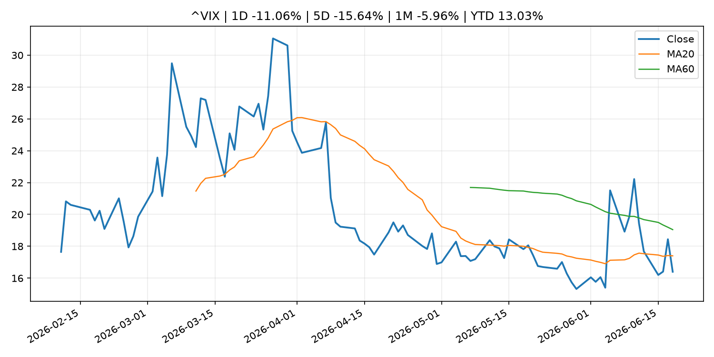
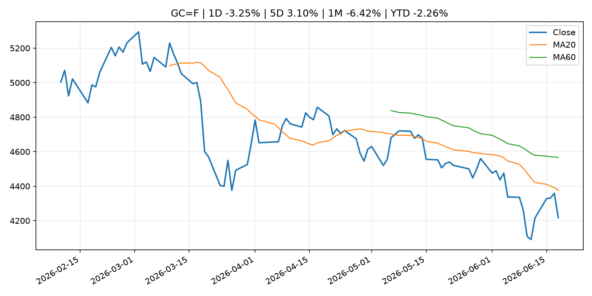
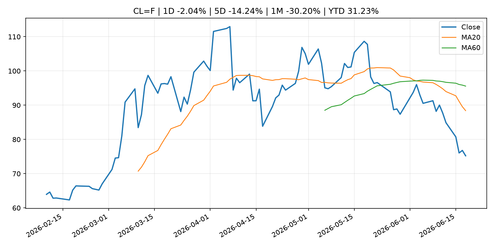
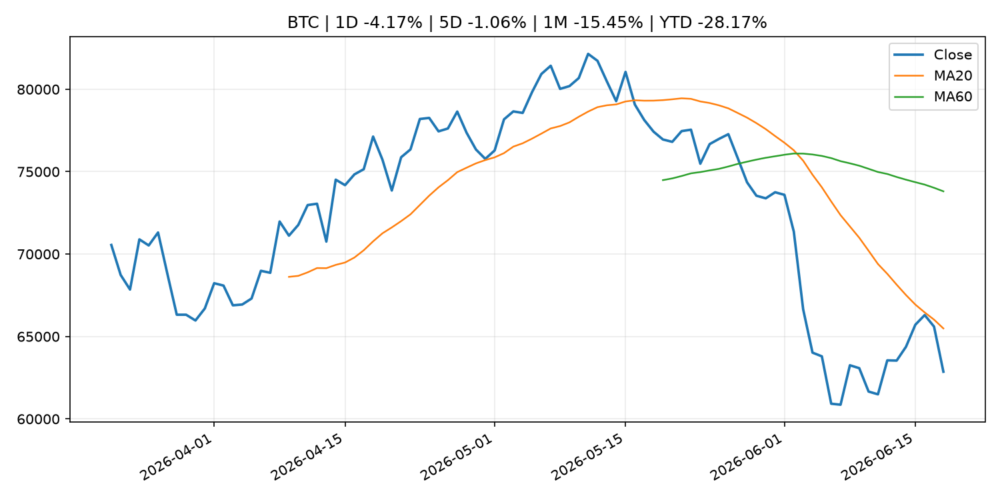
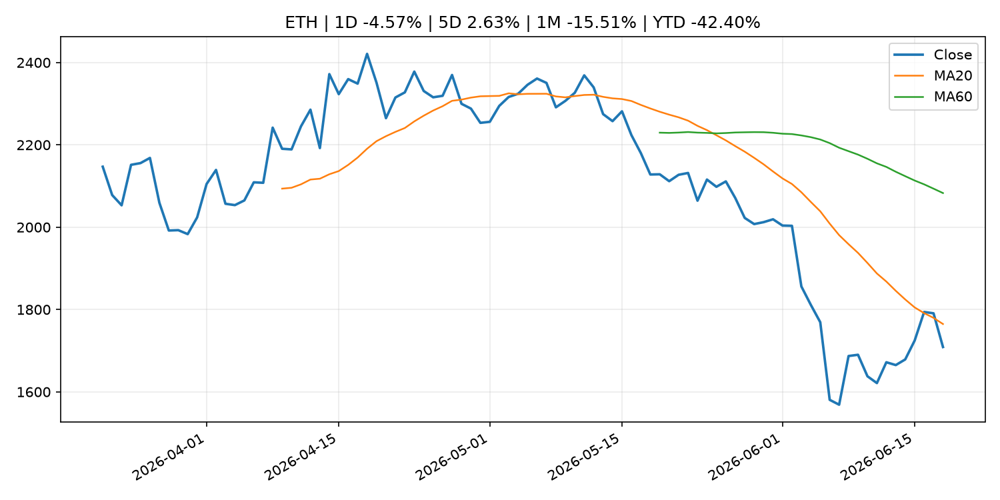

# Global Macro Morning Briefing - 2026-06-19

> Not financial advice / 非投资建议。

## 0. 今日总览
- 市场状态：risk_on。股指上涨、波动率或美元回落，市场更接近风险偏好改善。
- 今日三大主线：
  1. central_bank_decision: Federal Reserve issues FOMC statement
  2. central_bank_decision: Federal Reserve Board and Federal Open Market Committee release economic projections from the June 16-17 FOMC meeting
  3. central_bank_decision: Fed holds rates steady, pares down statement to remove cutting bias
- 一句话结论：今日晨报重点关注：央行决策会重定价利率、汇率、久期资产和风险资产。；央行决策会重定价利率、汇率、久期资产和风险资产。。跨资产方面，SPY 1D 0.78%；QQQ 1D 2.51%；^VIX 1D -11.06%；TLT 1D 0.49%；GC=F 1D -3.25%；CL=F 1D -2.04%；BTC 1D -4.17%；ETH 1D -4.57%；股指上涨、波动率或美元回落，市场更接近风险偏好改善。政策、通胀、利率、美元、美债、能源和加密监管仍是主要观察线索。所有结论仅基于公开数据与短摘要整理，不构成投资建议。

## 1. 隔夜跨资产市场
- 美股：SPY 1D 0.78%，QQQ 1D 2.51%，整体趋势需结合 VIX 和利率确认。
- 美债/美元：TLT 1D 0.49%，美元指数 1D 0.72%，是判断折现率压力的核心线索。
- 黄金/原油：黄金 1D -3.25%，原油 1D -2.04%，用于观察避险、通胀和地缘风险。
- 加密：BTC 1D -4.17%，ETH 1D -4.57%，关注是否独立于纳指走出加密自身行情。
- 港股/A股：恒生 1D -0.74%，沪深300/上证 1D n/a，重点看中国政策预期与人民币线索。
- 风险观察：确认风险偏好是否扩散到小盘股、信用利差和周期品。

### US_EQUITY

| symbol | latest close | 1D | 5D | 1M | YTD | trend |
|---|---:|---:|---:|---:|---:|---|
| SPY | 746.74 | 0.78% | 1.22% | 1.77% | 9.31% | range_bound |
| QQQ | 740.62 | 2.51% | 3.28% | 5.57% | 20.80% | uptrend |
| DIA | 515.52 | -0.15% | 1.21% | 4.36% | 6.59% | uptrend |
| IWM | 295.59 | 1.97% | 1.78% | 8.27% | 18.82% | uptrend |
| VTI | 369.99 | 1.16% | 1.56% | 2.76% | 10.01% | uptrend |

### US_MACRO_MARKET

| symbol | latest close | 1D | 5D | 1M | YTD | trend |
|---|---:|---:|---:|---:|---:|---|
| ^VIX | 16.40 | -11.06% | -15.64% | -5.96% | 13.03% | downtrend |
| DX-Y.NYB | 100.81 | 0.72% | 0.96% | 1.52% | 2.43% | uptrend |
| TLT | 86.75 | 0.49% | 0.90% | 4.49% | -0.32% | range_bound |
| IEF | 94.36 | 0.36% | 0.02% | 1.34% | -1.79% | range_bound |

### COMMODITIES

| symbol | latest close | 1D | 5D | 1M | YTD | trend |
|---|---:|---:|---:|---:|---:|---|
| GC=F | 4,217.10 | -3.25% | 3.10% | -6.42% | -2.26% | strong_downtrend |
| SI=F | 65.64 | -7.14% | 2.75% | -12.27% | -6.96% | strong_downtrend |
| CL=F | 75.22 | -2.04% | -14.24% | -30.20% | 31.23% | strong_downtrend |
| BZ=F | 78.97 | -0.73% | -12.62% | -29.03% | 29.99% | strong_downtrend |
| NG=F | 3.21 | 2.16% | 4.08% | 3.18% | -11.19% | uptrend |
| HG=F | 6.37 | -1.70% | 1.80% | 3.35% | 12.97% | range_bound |

### HK_MARKET

| symbol | latest close | 1D | 5D | 1M | YTD | trend |
|---|---:|---:|---:|---:|---:|---|
| ^HSI | 24,312.16 | -0.74% | -0.39% | -5.31% | -7.69% | strong_downtrend |
| 0700.HK | 440.20 | -1.17% | -3.72% | -4.30% | -29.34% | downtrend |
| 9988.HK | 104.90 | -1.87% | -2.33% | -21.31% | -29.60% | strong_downtrend |
| 3690.HK | 71.80 | -3.49% | -8.07% | -13.55% | -31.36% | downtrend |
| 1810.HK | 24.58 | -3.30% | -4.88% | -19.78% | -38.98% | strong_downtrend |
| 1211.HK | 80.85 | -1.28% | -4.83% | -13.90% | -18.13% | strong_downtrend |

### CRYPTO

| symbol | latest close | 1D | 5D | 1M | YTD | trend |
|---|---:|---:|---:|---:|---:|---|
| BTC | 62,862.64 | -4.17% | -1.06% | -15.45% | -28.17% | downtrend |
| ETH | 1,708.89 | -4.57% | 2.63% | -15.51% | -42.40% | strong_downtrend |
| SOLANA | 69.58 | -5.28% | 4.32% | -15.45% | -44.12% | downtrend |
| BINANCECOIN | 578.14 | -4.36% | -4.20% | -10.81% | -33.02% | strong_downtrend |
| RIPPLE | 1.14 | -5.94% | 1.12% | -12.35% | -37.80% | strong_downtrend |
| DOGECOIN | 0.08 | -4.35% | -2.89% | -16.90% | -28.89% | strong_downtrend |

## 2. 今日最重要的 10 条新闻
### 1. Federal Reserve issues FOMC statement
- 来源：Federal Reserve Press Releases
- 时间：2026-06-17T18:00:00+00:00
- 地区：US
- 事件类型：central_bank_decision
- 重要性层级：Tier 1
- 一句话摘要：Federal Reserve issues FOMC statement
- 为什么重要：央行决策会重定价利率、汇率、久期资产和风险资产。
- 可能影响：可能影响利率、汇率、风险资产或大宗商品预期，但当前公开信息不足以判断明确方向。
  - 资产：暂无明确资产映射
  - 方向：unknown
  - 强度：low
  - 原因：公开信息不足以判断方向。
- 原文链接：[https://www.federalreserve.gov/newsevents/pressreleases/monetary20260617a.htm](https://www.federalreserve.gov/newsevents/pressreleases/monetary20260617a.htm)

### 2. Federal Reserve Board and Federal Open Market Committee release economic projections from the June 16-17 FOMC meeting
- 来源：Federal Reserve Press Releases
- 时间：2026-06-17T18:00:00+00:00
- 地区：US
- 事件类型：central_bank_decision
- 重要性层级：Tier 1
- 一句话摘要：Federal Reserve Board and Federal Open Market Committee release economic projections from the June 16-17 FOMC meeting
- 为什么重要：央行决策会重定价利率、汇率、久期资产和风险资产。
- 可能影响：可能影响利率、汇率、风险资产或大宗商品预期，但当前公开信息不足以判断明确方向。
  - 资产：暂无明确资产映射
  - 方向：unknown
  - 强度：low
  - 原因：公开信息不足以判断方向。
- 原文链接：[https://www.federalreserve.gov/newsevents/pressreleases/monetary20260617b.htm](https://www.federalreserve.gov/newsevents/pressreleases/monetary20260617b.htm)

### 3. Fed holds rates steady, pares down statement to remove cutting bias
- 来源：CNBC Economy
- 时间：2026-06-17T21:42:28+00:00
- 地区：US
- 事件类型：central_bank_decision
- 重要性层级：Tier 1
- 一句话摘要：The Federal Reserve on Wednesday released its interest rate decision.
- 为什么重要：央行决策会重定价利率、汇率、久期资产和风险资产。
- 可能影响：可能影响利率、汇率、风险资产或大宗商品预期，但当前公开信息不足以判断明确方向。
  - 资产：暂无明确资产映射
  - 方向：unknown
  - 强度：low
  - 原因：公开信息不足以判断方向。
- 原文链接：[https://www.cnbc.com/2026/06/17/fed-interest-rate-decision-june-2026.html](https://www.cnbc.com/2026/06/17/fed-interest-rate-decision-june-2026.html)

### 4. More united Fed board seen at Warsh's first meeting, according to Kalshi traders
- 来源：CNBC Economy
- 时间：2026-06-17T16:54:08+00:00
- 地区：US
- 事件类型：central_bank_decision
- 重要性层级：Tier 1
- 一句话摘要：Traders on prediction market platform Kalshi largely forecast a unanimous decision among FOMC members at Wednesday's meeting, after April's divided vote.
- 为什么重要：央行决策会重定价利率、汇率、久期资产和风险资产。
- 可能影响：可能影响利率、汇率、风险资产或大宗商品预期，但当前公开信息不足以判断明确方向。
  - 资产：暂无明确资产映射
  - 方向：unknown
  - 强度：low
  - 原因：公开信息不足以判断方向。
- 原文链接：[https://www.cnbc.com/2026/06/17/more-united-fed-board-seen-at-warshs-first-meeting-according-to-kalshi-traders.html](https://www.cnbc.com/2026/06/17/more-united-fed-board-seen-at-warshs-first-meeting-according-to-kalshi-traders.html)

### 5. Markets are set for a much more hawkish Warsh Fed than expected
- 来源：CNBC Economy
- 时间：2026-06-18T18:04:41+00:00
- 地区：US
- 事件类型：central_bank_speech
- 重要性层级：Tier 2
- 一句话摘要：Fed Chairman Kevin Warsh's tough talk on inflation Wednesday reverberated through financial markets.
- 为什么重要：央行官员表态可能影响市场对下一次会议的定价。
- 可能影响：主要影响 DXY，方向为 positive，强度 high；通胀压力可能推高政策利率预期并支撑美元。
  - 资产：DXY
    方向：positive
    强度：high
    原因：通胀压力可能推高政策利率预期并支撑美元。
  - 资产：TLT
    方向：negative
    强度：high
    原因：通胀上行通常推升收益率、压低长债价格。
  - 资产：QQQ
    方向：negative
    强度：high
    原因：更高利率对成长股估值折现率不利。
  - 资产：SPY
    方向：mixed
    强度：medium
    原因：名义增长可能支撑收入，但更高利率压制估值。
  - 资产：GC=F
    方向：mixed
    强度：medium
    原因：通胀对黄金是支撑，但实际利率上行会形成压力。
  - 资产：BTC
    方向：negative
    强度：high
    原因：流动性收紧通常压制高 beta 加密资产。
- 原文链接：[https://www.cnbc.com/2026/06/18/markets-are-set-for-a-much-more-hawkish-warsh-fed-than-expected.html](https://www.cnbc.com/2026/06/18/markets-are-set-for-a-much-more-hawkish-warsh-fed-than-expected.html)

### 6. SEC, CFTC Seek Public Comment to Further Clarify and Harmonize Derivatives Product Definitions
- 来源：SEC Press Releases
- 时间：2026-06-18T14:42:47-04:00
- 地区：US
- 事件类型：regulation
- 重要性层级：Tier 2
- 一句话摘要：The Securities and Exchange Commission and the Commodity Futures Trading Commission today issued a joint request for public comment on potential opportunities to further update, clarify, and harmonize certain derivatives product definitions and…
- 为什么重要：监管变化会改变行业盈利预期和资产风险溢价。
- 可能影响：主要影响 BTC，方向为 mixed，强度 high；加密监管或 ETF 进展会改变 BTC 的资金流和风险溢价。
  - 资产：BTC
    方向：mixed
    强度：high
    原因：加密监管或 ETF 进展会改变 BTC 的资金流和风险溢价。
  - 资产：ETH
    方向：mixed
    强度：high
    原因：监管框架会影响 ETH 产品化和机构参与度。
  - 资产：COIN
    方向：mixed
    强度：medium
    原因：监管清晰度和执法风险会影响交易平台估值。
  - 资产：crypto market
    方向：mixed
    强度：high
    原因：信息影响整个加密市场结构，但方向取决于细节。
- 原文链接：[https://www.sec.gov/newsroom/press-releases/2026-57-sec-cftc-seek-public-comment-further-clarify-harmonize-derivatives-product-definitions](https://www.sec.gov/newsroom/press-releases/2026-57-sec-cftc-seek-public-comment-further-clarify-harmonize-derivatives-product-definitions)

### 7. SEC, CFTC Seek Public Input on Data Reporting Frameworks for Security-Based Swap and Swap Markets
- 来源：SEC Press Releases
- 时间：2026-06-18T14:17:55-04:00
- 地区：US
- 事件类型：regulation
- 重要性层级：Tier 2
- 一句话摘要：The Securities and Exchange Commission and Commodity Futures Trading Commission today issued a joint request for public comment on potential opportunities to harmonize, modernize, and streamline data reporting requirements in their regulation of the…
- 为什么重要：监管变化会改变行业盈利预期和资产风险溢价。
- 可能影响：主要影响 BTC，方向为 mixed，强度 high；加密监管或 ETF 进展会改变 BTC 的资金流和风险溢价。
  - 资产：BTC
    方向：mixed
    强度：high
    原因：加密监管或 ETF 进展会改变 BTC 的资金流和风险溢价。
  - 资产：ETH
    方向：mixed
    强度：high
    原因：监管框架会影响 ETH 产品化和机构参与度。
  - 资产：COIN
    方向：mixed
    强度：medium
    原因：监管清晰度和执法风险会影响交易平台估值。
  - 资产：crypto market
    方向：mixed
    强度：high
    原因：信息影响整个加密市场结构，但方向取决于细节。
- 原文链接：[https://www.sec.gov/newsroom/press-releases/2026-56-sec-cftc-seek-public-input-data-reporting-frameworks-security-based-swap-swap-markets](https://www.sec.gov/newsroom/press-releases/2026-56-sec-cftc-seek-public-input-data-reporting-frameworks-security-based-swap-swap-markets)

### 8. Bitcoin, ether slide after a hawkish Fed, even as Trump's signed Iran deal lifts stocks
- 来源：CoinDesk
- 时间：2026-06-18T04:52:46+00:00
- 地区：global
- 事件类型：central_bank_speech
- 重要性层级：Tier 2
- 一句话摘要：Bitcoin, ether slide after a hawkish Fed, even as Trump's signed Iran deal lifts stocks
- 为什么重要：央行官员表态可能影响市场对下一次会议的定价。
- 可能影响：主要影响 QQQ，方向为 negative，强度 high；鹰派政策提高折现率，压制成长股估值。
  - 资产：QQQ
    方向：negative
    强度：high
    原因：鹰派政策提高折现率，压制成长股估值。
  - 资产：SPY
    方向：negative
    强度：medium
    原因：更紧政策通常削弱风险偏好。
  - 资产：TLT
    方向：negative
    强度：high
    原因：利率上行通常压低长债价格。
  - 资产：DXY
    方向：positive
    强度：high
    原因：更高利率预期通常支撑美元。
  - 资产：BTC
    方向：negative
    强度：high
    原因：流动性收紧通常压制高 beta 加密资产。
- 原文链接：[https://www.coindesk.com/markets/2026/06/18/bitcoin-ether-slide-after-a-hawkish-fed-even-as-trump-s-signed-iran-deal-lifts-stocks](https://www.coindesk.com/markets/2026/06/18/bitcoin-ether-slide-after-a-hawkish-fed-even-as-trump-s-signed-iran-deal-lifts-stocks)

### 9. Federal Reserve Board requests comment on proposal to require certain payment stablecoin issuers to maintain an effective customer identification program
- 来源：Federal Reserve Press Releases
- 时间：2026-06-18T13:00:00+00:00
- 地区：US
- 事件类型：crypto_market_structure
- 重要性层级：Tier 2
- 一句话摘要：Federal Reserve Board requests comment on proposal to require certain payment stablecoin issuers to maintain an effective customer identification program
- 为什么重要：加密市场结构和监管变化会影响 BTC、ETH 及相关股票的风险溢价。
- 可能影响：主要影响 BTC，方向为 mixed，强度 high；加密监管或 ETF 进展会改变 BTC 的资金流和风险溢价。
  - 资产：BTC
    方向：mixed
    强度：high
    原因：加密监管或 ETF 进展会改变 BTC 的资金流和风险溢价。
  - 资产：ETH
    方向：mixed
    强度：high
    原因：监管框架会影响 ETH 产品化和机构参与度。
  - 资产：COIN
    方向：mixed
    强度：medium
    原因：监管清晰度和执法风险会影响交易平台估值。
  - 资产：crypto market
    方向：mixed
    强度：high
    原因：信息影响整个加密市场结构，但方向取决于细节。
- 原文链接：[https://www.federalreserve.gov/newsevents/pressreleases/bcreg20260618a.htm](https://www.federalreserve.gov/newsevents/pressreleases/bcreg20260618a.htm)

### 10. U.S. agencies seek stablecoin customer-ID rules akin to banks in new GENIUS Act pitch
- 来源：CoinDesk
- 时间：2026-06-18T17:17:22+00:00
- 地区：global
- 事件类型：crypto_market_structure
- 重要性层级：Tier 2
- 一句话摘要：U.S. agencies seek stablecoin customer-ID rules akin to banks in new GENIUS Act pitch
- 为什么重要：加密市场结构和监管变化会影响 BTC、ETH 及相关股票的风险溢价。
- 可能影响：主要影响 BTC，方向为 mixed，强度 high；加密监管或 ETF 进展会改变 BTC 的资金流和风险溢价。
  - 资产：BTC
    方向：mixed
    强度：high
    原因：加密监管或 ETF 进展会改变 BTC 的资金流和风险溢价。
  - 资产：ETH
    方向：mixed
    强度：high
    原因：监管框架会影响 ETH 产品化和机构参与度。
  - 资产：COIN
    方向：mixed
    强度：medium
    原因：监管清晰度和执法风险会影响交易平台估值。
  - 资产：crypto market
    方向：mixed
    强度：high
    原因：信息影响整个加密市场结构，但方向取决于细节。
- 原文链接：[https://www.coindesk.com/policy/2026/06/18/u-s-agencies-seek-stablecoin-customer-id-rules-akin-to-banks-in-new-genius-act-rule](https://www.coindesk.com/policy/2026/06/18/u-s-agencies-seek-stablecoin-customer-id-rules-akin-to-banks-in-new-genius-act-rule)

## 3. 政策与央行观察
### 1. Federal Reserve issues FOMC statement
- 来源：Federal Reserve Press Releases
- 时间：2026-06-17T18:00:00+00:00
- 地区：US
- 事件类型：central_bank_decision
- 重要性层级：Tier 1
- 一句话摘要：Federal Reserve issues FOMC statement
- 为什么重要：央行决策会重定价利率、汇率、久期资产和风险资产。
- 可能影响：可能影响利率、汇率、风险资产或大宗商品预期，但当前公开信息不足以判断明确方向。
  - 资产：暂无明确资产映射
  - 方向：unknown
  - 强度：low
  - 原因：公开信息不足以判断方向。
- 原文链接：[https://www.federalreserve.gov/newsevents/pressreleases/monetary20260617a.htm](https://www.federalreserve.gov/newsevents/pressreleases/monetary20260617a.htm)

### 2. Federal Reserve Board and Federal Open Market Committee release economic projections from the June 16-17 FOMC meeting
- 来源：Federal Reserve Press Releases
- 时间：2026-06-17T18:00:00+00:00
- 地区：US
- 事件类型：central_bank_decision
- 重要性层级：Tier 1
- 一句话摘要：Federal Reserve Board and Federal Open Market Committee release economic projections from the June 16-17 FOMC meeting
- 为什么重要：央行决策会重定价利率、汇率、久期资产和风险资产。
- 可能影响：可能影响利率、汇率、风险资产或大宗商品预期，但当前公开信息不足以判断明确方向。
  - 资产：暂无明确资产映射
  - 方向：unknown
  - 强度：low
  - 原因：公开信息不足以判断方向。
- 原文链接：[https://www.federalreserve.gov/newsevents/pressreleases/monetary20260617b.htm](https://www.federalreserve.gov/newsevents/pressreleases/monetary20260617b.htm)

### 3. Fed holds rates steady, pares down statement to remove cutting bias
- 来源：CNBC Economy
- 时间：2026-06-17T21:42:28+00:00
- 地区：US
- 事件类型：central_bank_decision
- 重要性层级：Tier 1
- 一句话摘要：The Federal Reserve on Wednesday released its interest rate decision.
- 为什么重要：央行决策会重定价利率、汇率、久期资产和风险资产。
- 可能影响：可能影响利率、汇率、风险资产或大宗商品预期，但当前公开信息不足以判断明确方向。
  - 资产：暂无明确资产映射
  - 方向：unknown
  - 强度：low
  - 原因：公开信息不足以判断方向。
- 原文链接：[https://www.cnbc.com/2026/06/17/fed-interest-rate-decision-june-2026.html](https://www.cnbc.com/2026/06/17/fed-interest-rate-decision-june-2026.html)

### 4. More united Fed board seen at Warsh's first meeting, according to Kalshi traders
- 来源：CNBC Economy
- 时间：2026-06-17T16:54:08+00:00
- 地区：US
- 事件类型：central_bank_decision
- 重要性层级：Tier 1
- 一句话摘要：Traders on prediction market platform Kalshi largely forecast a unanimous decision among FOMC members at Wednesday's meeting, after April's divided vote.
- 为什么重要：央行决策会重定价利率、汇率、久期资产和风险资产。
- 可能影响：可能影响利率、汇率、风险资产或大宗商品预期，但当前公开信息不足以判断明确方向。
  - 资产：暂无明确资产映射
  - 方向：unknown
  - 强度：low
  - 原因：公开信息不足以判断方向。
- 原文链接：[https://www.cnbc.com/2026/06/17/more-united-fed-board-seen-at-warshs-first-meeting-according-to-kalshi-traders.html](https://www.cnbc.com/2026/06/17/more-united-fed-board-seen-at-warshs-first-meeting-according-to-kalshi-traders.html)

### 5. Markets are set for a much more hawkish Warsh Fed than expected
- 来源：CNBC Economy
- 时间：2026-06-18T18:04:41+00:00
- 地区：US
- 事件类型：central_bank_speech
- 重要性层级：Tier 2
- 一句话摘要：Fed Chairman Kevin Warsh's tough talk on inflation Wednesday reverberated through financial markets.
- 为什么重要：央行官员表态可能影响市场对下一次会议的定价。
- 可能影响：主要影响 DXY，方向为 positive，强度 high；通胀压力可能推高政策利率预期并支撑美元。
  - 资产：DXY
    方向：positive
    强度：high
    原因：通胀压力可能推高政策利率预期并支撑美元。
  - 资产：TLT
    方向：negative
    强度：high
    原因：通胀上行通常推升收益率、压低长债价格。
  - 资产：QQQ
    方向：negative
    强度：high
    原因：更高利率对成长股估值折现率不利。
  - 资产：SPY
    方向：mixed
    强度：medium
    原因：名义增长可能支撑收入，但更高利率压制估值。
  - 资产：GC=F
    方向：mixed
    强度：medium
    原因：通胀对黄金是支撑，但实际利率上行会形成压力。
  - 资产：BTC
    方向：negative
    强度：high
    原因：流动性收紧通常压制高 beta 加密资产。
- 原文链接：[https://www.cnbc.com/2026/06/18/markets-are-set-for-a-much-more-hawkish-warsh-fed-than-expected.html](https://www.cnbc.com/2026/06/18/markets-are-set-for-a-much-more-hawkish-warsh-fed-than-expected.html)

### 6. SEC, CFTC Seek Public Comment to Further Clarify and Harmonize Derivatives Product Definitions
- 来源：SEC Press Releases
- 时间：2026-06-18T14:42:47-04:00
- 地区：US
- 事件类型：regulation
- 重要性层级：Tier 2
- 一句话摘要：The Securities and Exchange Commission and the Commodity Futures Trading Commission today issued a joint request for public comment on potential opportunities to further update, clarify, and harmonize certain derivatives product definitions and…
- 为什么重要：监管变化会改变行业盈利预期和资产风险溢价。
- 可能影响：主要影响 BTC，方向为 mixed，强度 high；加密监管或 ETF 进展会改变 BTC 的资金流和风险溢价。
  - 资产：BTC
    方向：mixed
    强度：high
    原因：加密监管或 ETF 进展会改变 BTC 的资金流和风险溢价。
  - 资产：ETH
    方向：mixed
    强度：high
    原因：监管框架会影响 ETH 产品化和机构参与度。
  - 资产：COIN
    方向：mixed
    强度：medium
    原因：监管清晰度和执法风险会影响交易平台估值。
  - 资产：crypto market
    方向：mixed
    强度：high
    原因：信息影响整个加密市场结构，但方向取决于细节。
- 原文链接：[https://www.sec.gov/newsroom/press-releases/2026-57-sec-cftc-seek-public-comment-further-clarify-harmonize-derivatives-product-definitions](https://www.sec.gov/newsroom/press-releases/2026-57-sec-cftc-seek-public-comment-further-clarify-harmonize-derivatives-product-definitions)

### 7. SEC, CFTC Seek Public Input on Data Reporting Frameworks for Security-Based Swap and Swap Markets
- 来源：SEC Press Releases
- 时间：2026-06-18T14:17:55-04:00
- 地区：US
- 事件类型：regulation
- 重要性层级：Tier 2
- 一句话摘要：The Securities and Exchange Commission and Commodity Futures Trading Commission today issued a joint request for public comment on potential opportunities to harmonize, modernize, and streamline data reporting requirements in their regulation of the…
- 为什么重要：监管变化会改变行业盈利预期和资产风险溢价。
- 可能影响：主要影响 BTC，方向为 mixed，强度 high；加密监管或 ETF 进展会改变 BTC 的资金流和风险溢价。
  - 资产：BTC
    方向：mixed
    强度：high
    原因：加密监管或 ETF 进展会改变 BTC 的资金流和风险溢价。
  - 资产：ETH
    方向：mixed
    强度：high
    原因：监管框架会影响 ETH 产品化和机构参与度。
  - 资产：COIN
    方向：mixed
    强度：medium
    原因：监管清晰度和执法风险会影响交易平台估值。
  - 资产：crypto market
    方向：mixed
    强度：high
    原因：信息影响整个加密市场结构，但方向取决于细节。
- 原文链接：[https://www.sec.gov/newsroom/press-releases/2026-56-sec-cftc-seek-public-input-data-reporting-frameworks-security-based-swap-swap-markets](https://www.sec.gov/newsroom/press-releases/2026-56-sec-cftc-seek-public-input-data-reporting-frameworks-security-based-swap-swap-markets)

### 8. Bitcoin, ether slide after a hawkish Fed, even as Trump's signed Iran deal lifts stocks
- 来源：CoinDesk
- 时间：2026-06-18T04:52:46+00:00
- 地区：global
- 事件类型：central_bank_speech
- 重要性层级：Tier 2
- 一句话摘要：Bitcoin, ether slide after a hawkish Fed, even as Trump's signed Iran deal lifts stocks
- 为什么重要：央行官员表态可能影响市场对下一次会议的定价。
- 可能影响：主要影响 QQQ，方向为 negative，强度 high；鹰派政策提高折现率，压制成长股估值。
  - 资产：QQQ
    方向：negative
    强度：high
    原因：鹰派政策提高折现率，压制成长股估值。
  - 资产：SPY
    方向：negative
    强度：medium
    原因：更紧政策通常削弱风险偏好。
  - 资产：TLT
    方向：negative
    强度：high
    原因：利率上行通常压低长债价格。
  - 资产：DXY
    方向：positive
    强度：high
    原因：更高利率预期通常支撑美元。
  - 资产：BTC
    方向：negative
    强度：high
    原因：流动性收紧通常压制高 beta 加密资产。
- 原文链接：[https://www.coindesk.com/markets/2026/06/18/bitcoin-ether-slide-after-a-hawkish-fed-even-as-trump-s-signed-iran-deal-lifts-stocks](https://www.coindesk.com/markets/2026/06/18/bitcoin-ether-slide-after-a-hawkish-fed-even-as-trump-s-signed-iran-deal-lifts-stocks)

### 9. Federal Reserve Board requests comment on proposal to require certain payment stablecoin issuers to maintain an effective customer identification program
- 来源：Federal Reserve Press Releases
- 时间：2026-06-18T13:00:00+00:00
- 地区：US
- 事件类型：crypto_market_structure
- 重要性层级：Tier 2
- 一句话摘要：Federal Reserve Board requests comment on proposal to require certain payment stablecoin issuers to maintain an effective customer identification program
- 为什么重要：加密市场结构和监管变化会影响 BTC、ETH 及相关股票的风险溢价。
- 可能影响：主要影响 BTC，方向为 mixed，强度 high；加密监管或 ETF 进展会改变 BTC 的资金流和风险溢价。
  - 资产：BTC
    方向：mixed
    强度：high
    原因：加密监管或 ETF 进展会改变 BTC 的资金流和风险溢价。
  - 资产：ETH
    方向：mixed
    强度：high
    原因：监管框架会影响 ETH 产品化和机构参与度。
  - 资产：COIN
    方向：mixed
    强度：medium
    原因：监管清晰度和执法风险会影响交易平台估值。
  - 资产：crypto market
    方向：mixed
    强度：high
    原因：信息影响整个加密市场结构，但方向取决于细节。
- 原文链接：[https://www.federalreserve.gov/newsevents/pressreleases/bcreg20260618a.htm](https://www.federalreserve.gov/newsevents/pressreleases/bcreg20260618a.htm)

### 10. U.S. agencies seek stablecoin customer-ID rules akin to banks in new GENIUS Act pitch
- 来源：CoinDesk
- 时间：2026-06-18T17:17:22+00:00
- 地区：global
- 事件类型：crypto_market_structure
- 重要性层级：Tier 2
- 一句话摘要：U.S. agencies seek stablecoin customer-ID rules akin to banks in new GENIUS Act pitch
- 为什么重要：加密市场结构和监管变化会影响 BTC、ETH 及相关股票的风险溢价。
- 可能影响：主要影响 BTC，方向为 mixed，强度 high；加密监管或 ETF 进展会改变 BTC 的资金流和风险溢价。
  - 资产：BTC
    方向：mixed
    强度：high
    原因：加密监管或 ETF 进展会改变 BTC 的资金流和风险溢价。
  - 资产：ETH
    方向：mixed
    强度：high
    原因：监管框架会影响 ETH 产品化和机构参与度。
  - 资产：COIN
    方向：mixed
    强度：medium
    原因：监管清晰度和执法风险会影响交易平台估值。
  - 资产：crypto market
    方向：mixed
    强度：high
    原因：信息影响整个加密市场结构，但方向取决于细节。
- 原文链接：[https://www.coindesk.com/policy/2026/06/18/u-s-agencies-seek-stablecoin-customer-id-rules-akin-to-banks-in-new-genius-act-rule](https://www.coindesk.com/policy/2026/06/18/u-s-agencies-seek-stablecoin-customer-id-rules-akin-to-banks-in-new-genius-act-rule)

## 4. 市场异动与图表
- SPY 上涨 0.78%
- QQQ 上涨 2.51%
- VIX 下跌 -11.06%
- TLT 上涨 0.49%
- DXY 上涨 0.72%
- Gold 下跌 -3.25%
- Oil 下跌 -2.04%
- BTC 下跌 -4.17%
- ETH 下跌 -4.57%

### SPY

### QQQ

### ^VIX

### TLT

### GC=F

### CL=F

### BTC

### ETH

### ^HSI

## 5. 华尔街与机构公开观点
- 暂无可靠公开观点。

## 6. 今日重点关注
- 经济数据：经济数据：暂无可靠公开日历数据；如配置经济日历源后可自动填充。
- 央行讲话：央行讲话：暂无可靠公开日历数据；重点跟踪 Fed、ECB、BoJ、PBOC 官网 RSS。
- 财报：财报：暂无可靠数据。
- 政策事件：政策事件：暂无可靠数据。
- 风险提醒：风险提醒：关注数据源失败项、突发地缘风险、利率和美元的二阶反应。

## 7. 英文金融表达与宏观概念
- **inflation expectations**：通胀预期，指家庭、企业或市场对未来通胀的预估。 例句：Inflation expectations can shape wage bargaining and bond yields.
- **real yield**：实际收益率，名义利率扣除通胀预期后的收益率。 例句：Gold often reacts more to real yields than nominal yields.
- **terminal rate**：终端利率，市场预期本轮加息周期的最高政策利率。 例句：A higher terminal rate can pressure growth stocks.
- **risk-off**：避险模式，资金偏向美元、国债、黄金等防御资产。 例句：A geopolitical shock can push markets into risk-off mode.
- **market structure**：市场结构，指交易、托管、清算、ETF、监管等制度安排。 例句：Crypto market structure rules can affect institutional participation.
- **soft landing**：软着陆，指通胀回落而经济避免明显衰退。 例句：Markets often rally when data support a soft landing.

## 8. 背景材料
- [This AI company wants to replace MRIs with a 60-second dip in the spa. Can that really work?](https://www.marketwatch.com/story/this-ai-company-wants-to-replace-mris-with-a-60-second-dip-in-the-spa-can-that-really-work-3bce6681?mod=mw_rss_topstories)（MarketWatch Top Stories，other）：Midjourney is making a foray into healthcare with its latest body-scanner product, aiming to make medical imaging more accessible.
- [SpaceX is vastly more expensive than any stock in the S&P 500, fueled by ‘FOMO’ mentality](https://www.marketwatch.com/story/spacex-is-vastly-more-expensive-than-any-stock-in-the-s-p-500-fueled-by-fomo-mentality-eb61cd69?mod=mw_rss_topstories)（MarketWatch Top Stories，other）：Billions of dollars have flowed into SpaceX ETFs as retail investors look past conventional valuations.
- [Crypto for Advisors: Trading the bitcoin cycle](https://www.coindesk.com/coindesk-indices/2026/06/17/crypto-for-advisors-trading-the-bitcoin-cycle)（CoinDesk，other）：Crypto for Advisors: Trading the bitcoin cycle
- [Piero Cipollone: Digital euro: the future of money](https://www.ecb.europa.eu//press/key/date/2026/html/ecb.sp260618~da08e71469.en.pdf)（ECB Press Releases，other）：Piero Cipollone: Digital euro: the future of money
- [Bitcoin's nemesis, the Dollar Index, is on the verge of a major breakout](https://www.coindesk.com/daybook-us/2026/06/18/bitcoin-s-nemesis-the-dollar-index-is-on-the-verge-of-a-major-breakout)（CoinDesk，other）：Bitcoin's nemesis, the Dollar Index, is on the verge of a major breakout
- [The bond market is flashing a clear signal on interest rates. Bitcoin bulls should take note](https://www.coindesk.com/markets/2026/06/18/the-bond-market-is-flashing-a-clear-signal-on-interest-rates-bitcoin-bulls-should-take-note)（CoinDesk，other）：The bond market is flashing a clear signal on interest rates. Bitcoin bulls should take note
- [Developments in Real Exports and Real Imports](http://www.boj.or.jp/en/research/research_data/reri/index.htm)（Bank of Japan Announcements，other）：Developments in Real Exports and Real Imports
- [Live markets: price action turns panicky in Saylor's STRC as bitcoin drops below $63,000](https://www.coindesk.com/tech/2026/06/18/live-markets-bitcoin-and-ether-etfs-lost-usd111-million-combined-as-rate-cut-hopes-died)（CoinDesk，other）：Live markets: price action turns panicky in Saylor's STRC as bitcoin drops below $63,000
- [Buying bitcoin below its 200-week average has historically delivered over 100% in median returns, Kraken says](https://www.coindesk.com/markets/2026/06/18/buying-bitcoin-below-its-200-week-average-has-historically-delivered-over-100-in-median-returns-kraken-says)（CoinDesk，other）：Buying bitcoin below its 200-week average has historically delivered over 100% in median returns, Kraken says
- [Results of BIS International Locational Banking Statistics and International Consolidated Banking Statistics in Japan](http://www.boj.or.jp/en/statistics/bis/ibs/index.htm)（Bank of Japan Announcements，other）：Results of BIS International Locational Banking Statistics and International Consolidated Banking Statistics in Japan
- [Jeffrey Gundlach says Fed's Warsh is not going to be the 'easy money' chairman many hoped for](https://www.cnbc.com/2026/06/17/jeffrey-gundlach-says-feds-warsh-is-not-going-to-be-the-easy-money-chairman-many-hoped-for.html)（CNBC Economy，other）：Gundlach said Warsh's stance reduces the risk of overly accommodative monetary policy that could reignite inflation and push longer-term borrowing costs higher.
- [Bitcoin layer-2s face a bear-market reality check](https://www.coindesk.com/tech/2026/06/17/bitcoin-layer-2s-face-a-bear-market-reality-check)（CoinDesk，other）：Bitcoin layer-2s face a bear-market reality check
- [New data release: ECB wage tracker points to stable negotiated wage pressures in 2026](https://www.ecb.europa.eu//press/pr/date/2026/html/ecb.pr260617~79dfc49802.en.html)（ECB Press Releases，other）：New data release: ECB wage tracker points to stable negotiated wage pressures in 2026

## 9. 数据源、失败项与免责声明
- 采集时间：2026-06-18T23:44:40
- 数据源：公开 RSS、Yahoo Finance、CoinGecko、AKShare、FRED、SEC data.sec.gov，以及用户自有 inputs/reports 文件。
- 合规说明：不绕过 WSJ、Bloomberg、FT、Reuters 等付费墙；对付费媒体只使用公开 RSS 标题、摘要、链接和发布时间。
- 免责声明：Not financial advice / 非投资建议。本项目仅供个人学习、研究和信息整理，不构成投资建议、交易建议或任何收益承诺。
- 失败或跳过的数据源：
  - China market data failed symbol=上证指数: empty dataframe
  - China market data failed symbol=深证成指: empty dataframe
  - China market data failed symbol=创业板指: empty dataframe
  - China market data failed symbol=沪深300: empty dataframe
  - China market data failed symbol=中证500: empty dataframe
  - China market data failed symbol=科创50: empty dataframe
  - FRED_API_KEY not set; skipping FRED macro series
  - SEC failed cik=0000320193
  - SEC failed cik=0000789019
  - SEC failed cik=0001045810
  - SEC failed cik=0001318605
  - SEC failed cik=0001577552
