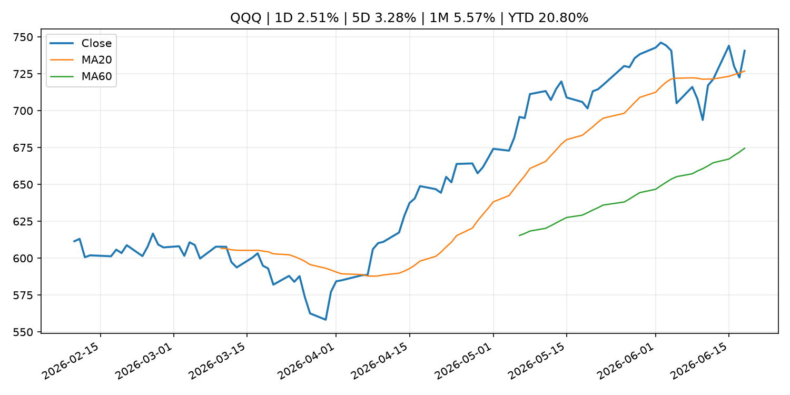
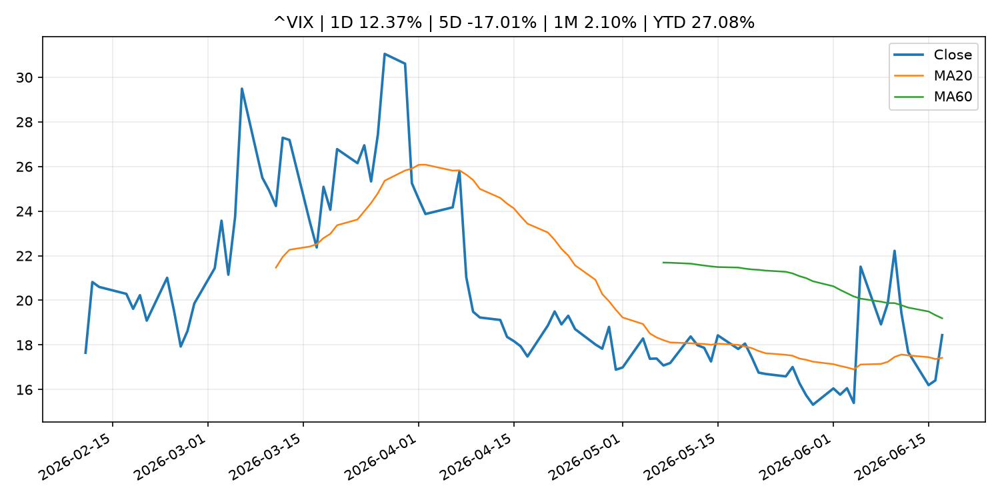
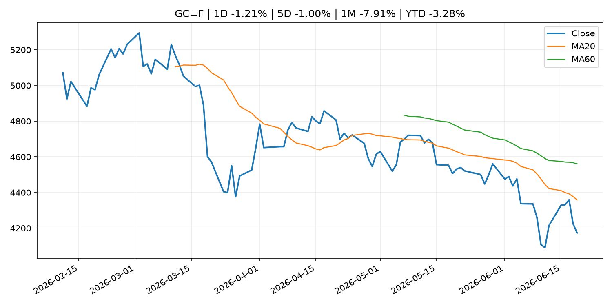
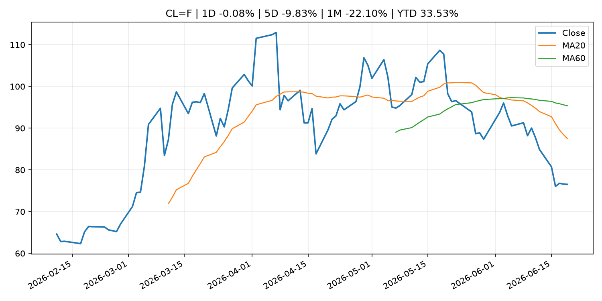
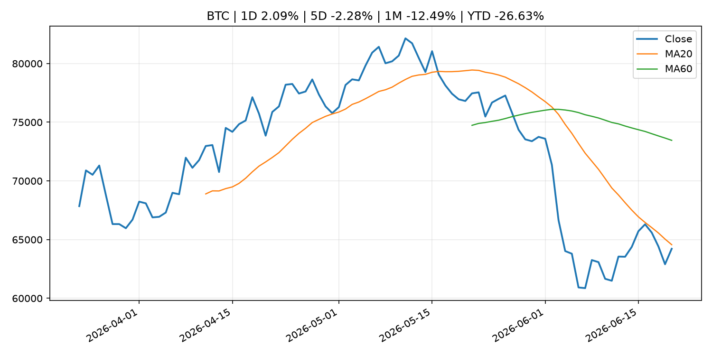
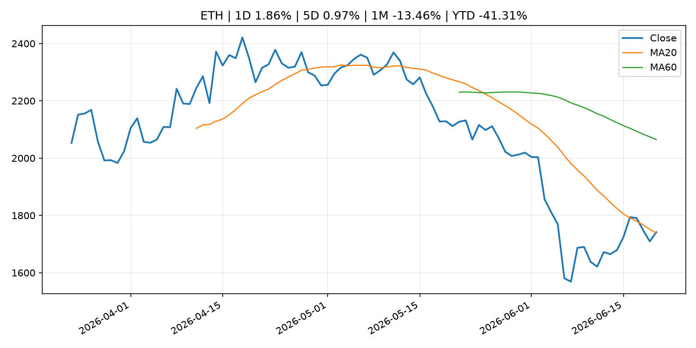
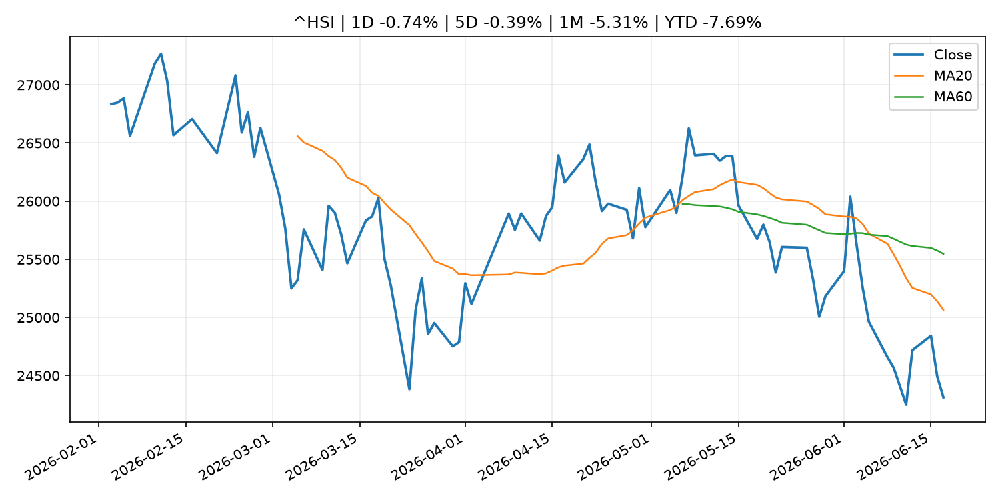

# Global Macro Morning Briefing - 2026-06-21

> Not financial advice / 非投资建议。

## 0. 今日总览
- 市场状态：mixed。股指上涨、波动率或美元回落，市场更接近风险偏好改善。 但存在信号冲突，需要降低单一叙事置信度。
- 今日三大主线：
  1. fiscal_policy: We read the Social Security and Medicare trustees reports. If you’re not worried, you should be.
  2. regulation: Inside the push to weaken Washington’s toughest financial watchdog
  3. central_bank_speech: Bitcoin's future as revolutionary as the smartphone, according to CoinDesk
- 一句话结论：今日晨报重点关注：财政和贸易政策会影响增长、通胀、企业利润和跨境资本流。；监管变化会改变行业盈利预期和资产风险溢价。。跨资产方面，SPY 1D 0.78%；QQQ 1D 2.51%；^VIX 1D 12.37%；TLT 1D 0.49%；GC=F 1D -1.21%；CL=F 1D -0.08%；BTC 1D 2.09%；ETH 1D 1.86%；股指上涨、波动率或美元回落，市场更接近风险偏好改善。 但存在信号冲突，需要降低单一叙事置信度。政策、通胀、利率、美元、美债、能源和加密监管仍是主要观察线索。所有结论仅基于公开数据与短摘要整理，不构成投资建议。

## 1. 隔夜跨资产市场
- 美股：SPY 1D 0.78%，QQQ 1D 2.51%，整体趋势需结合 VIX 和利率确认。
- 美债/美元：TLT 1D 0.49%，美元指数 1D 0.76%，是判断折现率压力的核心线索。
- 黄金/原油：黄金 1D -1.21%，原油 1D -0.08%，用于观察避险、通胀和地缘风险。
- 加密：BTC 1D 2.09%，ETH 1D 1.86%，关注是否独立于纳指走出加密自身行情。
- 港股/A股：恒生 1D -0.74%，沪深300/上证 1D n/a，重点看中国政策预期与人民币线索。
- 风险观察：确认风险偏好是否扩散到小盘股、信用利差和周期品。

### US_EQUITY

| symbol | latest close | 1D | 5D | 1M | YTD | trend |
|---|---:|---:|---:|---:|---:|---|
| SPY | 746.74 | 0.78% | 1.22% | 1.77% | 9.31% | range_bound |
| QQQ | 740.62 | 2.51% | 3.28% | 5.57% | 20.80% | uptrend |
| DIA | 515.52 | -0.15% | 1.21% | 4.36% | 6.59% | uptrend |
| IWM | 295.59 | 1.97% | 1.78% | 8.27% | 18.82% | uptrend |
| VTI | 369.99 | 1.16% | 1.56% | 2.76% | 10.01% | uptrend |

### US_MACRO_MARKET

| symbol | latest close | 1D | 5D | 1M | YTD | trend |
|---|---:|---:|---:|---:|---:|---|
| ^VIX | 18.44 | 12.37% | -17.01% | 2.10% | 27.08% | range_bound |
| DX-Y.NYB | 100.85 | 0.76% | 0.99% | 1.56% | 2.47% | uptrend |
| TLT | 86.75 | 0.49% | 0.90% | 4.49% | -0.32% | range_bound |
| IEF | 94.36 | 0.36% | 0.02% | 1.34% | -1.79% | range_bound |

### COMMODITIES

| symbol | latest close | 1D | 5D | 1M | YTD | trend |
|---|---:|---:|---:|---:|---:|---|
| GC=F | 4,172.90 | -1.21% | -1.00% | -7.91% | -3.28% | strong_downtrend |
| SI=F | 64.91 | -2.03% | -4.35% | -14.42% | -8.00% | strong_downtrend |
| CL=F | 76.54 | -0.08% | -9.83% | -22.10% | 33.53% | strong_downtrend |
| BZ=F | 80.59 | 0.93% | -7.72% | -23.26% | 32.66% | strong_downtrend |
| NG=F | 3.20 | -1.08% | 2.50% | 6.46% | -11.61% | uptrend |
| HG=F | 6.34 | -0.59% | -1.45% | 0.74% | 12.36% | range_bound |

### HK_MARKET

| symbol | latest close | 1D | 5D | 1M | YTD | trend |
|---|---:|---:|---:|---:|---:|---|
| ^HSI | 24,312.16 | -0.74% | -0.39% | -5.31% | -7.69% | strong_downtrend |
| 0700.HK | 440.20 | -1.17% | -3.72% | -4.30% | -29.34% | downtrend |
| 9988.HK | 104.90 | -1.87% | -2.33% | -21.31% | -29.60% | strong_downtrend |
| 3690.HK | 71.80 | -3.49% | -8.07% | -13.55% | -31.36% | downtrend |
| 1810.HK | 24.58 | -3.30% | -4.88% | -19.78% | -38.98% | strong_downtrend |
| 1211.HK | 80.85 | -1.28% | -4.83% | -13.90% | -18.13% | strong_downtrend |

### CRYPTO

| symbol | latest close | 1D | 5D | 1M | YTD | trend |
|---|---:|---:|---:|---:|---:|---|
| BTC | 64,217.78 | 2.09% | -2.28% | -12.49% | -26.63% | downtrend |
| ETH | 1,741.33 | 1.86% | 0.97% | -13.46% | -41.31% | range_bound |
| SOLANA | 73.50 | 5.53% | 3.38% | -10.30% | -40.98% | range_bound |
| BINANCECOIN | 587.47 | 1.62% | -4.68% | -8.56% | -31.94% | downtrend |
| RIPPLE | 1.15 | 0.55% | -2.85% | -13.30% | -37.39% | downtrend |

## 2. 今日最重要的 10 条新闻
### 1. We read the Social Security and Medicare trustees reports. If you’re not worried, you should be.
- 来源：MarketWatch Top Stories
- 时间：2026-06-20T18:20:00+00:00
- 地区：US
- 事件类型：fiscal_policy
- 重要性层级：Tier 1
- 一句话摘要：The truth about “DOGE” savings, no tax on Social Security, immigration — and more.
- 为什么重要：财政和贸易政策会影响增长、通胀、企业利润和跨境资本流。
- 可能影响：可能影响利率、汇率、风险资产或大宗商品预期，但当前公开信息不足以判断明确方向。
  - 资产：暂无明确资产映射
  - 方向：unknown
  - 强度：low
  - 原因：公开信息不足以判断方向。
- 原文链接：[https://www.marketwatch.com/story/we-read-the-social-security-and-medicare-trustees-reports-if-youre-not-worried-you-should-be-ee1293e2?mod=mw_rss_topstories](https://www.marketwatch.com/story/we-read-the-social-security-and-medicare-trustees-reports-if-youre-not-worried-you-should-be-ee1293e2?mod=mw_rss_topstories)

### 2. Inside the push to weaken Washington’s toughest financial watchdog
- 来源：MarketWatch Top Stories
- 时间：2026-06-20T18:28:00+00:00
- 地区：US
- 事件类型：regulation
- 重要性层级：Tier 2
- 一句话摘要：The SEC used to intimidate corporate wrongdoers. Now its own commissioners are gutting its leverage.
- 为什么重要：监管变化会改变行业盈利预期和资产风险溢价。
- 可能影响：主要影响 BTC，方向为 mixed，强度 high；加密监管或 ETF 进展会改变 BTC 的资金流和风险溢价。
  - 资产：BTC
    方向：mixed
    强度：high
    原因：加密监管或 ETF 进展会改变 BTC 的资金流和风险溢价。
  - 资产：ETH
    方向：mixed
    强度：high
    原因：监管框架会影响 ETH 产品化和机构参与度。
  - 资产：COIN
    方向：mixed
    强度：medium
    原因：监管清晰度和执法风险会影响交易平台估值。
  - 资产：crypto market
    方向：mixed
    强度：high
    原因：信息影响整个加密市场结构，但方向取决于细节。
- 原文链接：[https://www.marketwatch.com/story/fewer-dollars-and-fuzzier-standards-inside-the-push-to-weaken-washingtons-toughest-financial-watchdog-2601a0ee?mod=mw_rss_topstories](https://www.marketwatch.com/story/fewer-dollars-and-fuzzier-standards-inside-the-push-to-weaken-washingtons-toughest-financial-watchdog-2601a0ee?mod=mw_rss_topstories)

### 3. Bitcoin's future as revolutionary as the smartphone, according to CoinDesk
- 来源：CNBC Economy
- 时间：2026-06-20T15:00:01+00:00
- 地区：US
- 事件类型：central_bank_speech
- 重要性层级：Tier 2
- 一句话摘要：CoinDesk’s president of indices and data has a message for investors: Don’t count out bitcoin.
- 为什么重要：央行官员表态可能影响市场对下一次会议的定价。
- 可能影响：可能影响利率、汇率、风险资产或大宗商品预期，但当前公开信息不足以判断明确方向。
  - 资产：暂无明确资产映射
  - 方向：unknown
  - 强度：low
  - 原因：公开信息不足以判断方向。
- 原文链接：[https://www.cnbc.com/2026/06/20/bitcoin-as-revolutionary-as-smartphone-according-to-coindesk.html](https://www.cnbc.com/2026/06/20/bitcoin-as-revolutionary-as-smartphone-according-to-coindesk.html)

### 4. Statement by Deputy Governor HIMINO concerning the Bank's Semiannual Report on Currency and Monetary Control (Committee on Financial Affairs, House of Representatives)
- 来源：Bank of Japan Announcements
- 时间：2026-06-19T09:15:00+09:00
- 地区：Japan
- 事件类型：central_bank_speech
- 重要性层级：Tier 2
- 一句话摘要：Statement by Deputy Governor HIMINO concerning the Bank's Semiannual Report on Currency and Monetary Control (Committee on Financial Affairs, House of Representatives)
- 为什么重要：央行官员表态可能影响市场对下一次会议的定价。
- 可能影响：可能影响利率、汇率、风险资产或大宗商品预期，但当前公开信息不足以判断明确方向。
  - 资产：暂无明确资产映射
  - 方向：unknown
  - 强度：low
  - 原因：公开信息不足以判断方向。
- 原文链接：[http://www.boj.or.jp/en/mopo/diet/d_state/dst260619a.htm](http://www.boj.or.jp/en/mopo/diet/d_state/dst260619a.htm)

### 5. Social Security is looking at a $500-a-month cut. Could a new bipartisan commission make a difference?
- 来源：MarketWatch Top Stories
- 时间：2026-06-20T18:36:00+00:00
- 地区：US
- 事件类型：other
- 重要性层级：Tier 3
- 一句话摘要：A new legislative proposal would create a bipartisan commission to strengthen the finances of Social Security and Medicare at a time when the programs are under pressure.
- 为什么重要：这条信息暂未匹配到重大宏观、政策或市场事件，更适合作为背景跟踪。
- 可能影响：更偏背景信息，短期市场影响可能有限。
  - 资产：暂无明确资产映射
  - 方向：unknown
  - 强度：low
  - 原因：公开信息不足以判断方向。
- 原文链接：[https://www.marketwatch.com/story/social-security-is-looking-at-a-500-a-month-cut-could-a-new-bipartisan-commission-make-a-difference-5e9d358a?mod=mw_rss_topstories](https://www.marketwatch.com/story/social-security-is-looking-at-a-500-a-month-cut-could-a-new-bipartisan-commission-make-a-difference-5e9d358a?mod=mw_rss_topstories)

### 6. AI is making crypto security cheaper, faster and harder to ignore
- 来源：CoinDesk
- 时间：2026-06-20T15:00:00+00:00
- 地区：global
- 事件类型：other
- 重要性层级：Tier 3
- 一句话摘要：AI is making crypto security cheaper, faster and harder to ignore
- 为什么重要：这条信息暂未匹配到重大宏观、政策或市场事件，更适合作为背景跟踪。
- 可能影响：更偏背景信息，短期市场影响可能有限。
  - 资产：暂无明确资产映射
  - 方向：unknown
  - 强度：low
  - 原因：公开信息不足以判断方向。
- 原文链接：[https://www.coindesk.com/tech/2026/06/20/ai-is-making-crypto-security-cheaper-faster-and-harder-to-ignore](https://www.coindesk.com/tech/2026/06/20/ai-is-making-crypto-security-cheaper-faster-and-harder-to-ignore)

## 3. 政策与央行观察
### 1. We read the Social Security and Medicare trustees reports. If you’re not worried, you should be.
- 来源：MarketWatch Top Stories
- 时间：2026-06-20T18:20:00+00:00
- 地区：US
- 事件类型：fiscal_policy
- 重要性层级：Tier 1
- 一句话摘要：The truth about “DOGE” savings, no tax on Social Security, immigration — and more.
- 为什么重要：财政和贸易政策会影响增长、通胀、企业利润和跨境资本流。
- 可能影响：可能影响利率、汇率、风险资产或大宗商品预期，但当前公开信息不足以判断明确方向。
  - 资产：暂无明确资产映射
  - 方向：unknown
  - 强度：low
  - 原因：公开信息不足以判断方向。
- 原文链接：[https://www.marketwatch.com/story/we-read-the-social-security-and-medicare-trustees-reports-if-youre-not-worried-you-should-be-ee1293e2?mod=mw_rss_topstories](https://www.marketwatch.com/story/we-read-the-social-security-and-medicare-trustees-reports-if-youre-not-worried-you-should-be-ee1293e2?mod=mw_rss_topstories)

### 2. Inside the push to weaken Washington’s toughest financial watchdog
- 来源：MarketWatch Top Stories
- 时间：2026-06-20T18:28:00+00:00
- 地区：US
- 事件类型：regulation
- 重要性层级：Tier 2
- 一句话摘要：The SEC used to intimidate corporate wrongdoers. Now its own commissioners are gutting its leverage.
- 为什么重要：监管变化会改变行业盈利预期和资产风险溢价。
- 可能影响：主要影响 BTC，方向为 mixed，强度 high；加密监管或 ETF 进展会改变 BTC 的资金流和风险溢价。
  - 资产：BTC
    方向：mixed
    强度：high
    原因：加密监管或 ETF 进展会改变 BTC 的资金流和风险溢价。
  - 资产：ETH
    方向：mixed
    强度：high
    原因：监管框架会影响 ETH 产品化和机构参与度。
  - 资产：COIN
    方向：mixed
    强度：medium
    原因：监管清晰度和执法风险会影响交易平台估值。
  - 资产：crypto market
    方向：mixed
    强度：high
    原因：信息影响整个加密市场结构，但方向取决于细节。
- 原文链接：[https://www.marketwatch.com/story/fewer-dollars-and-fuzzier-standards-inside-the-push-to-weaken-washingtons-toughest-financial-watchdog-2601a0ee?mod=mw_rss_topstories](https://www.marketwatch.com/story/fewer-dollars-and-fuzzier-standards-inside-the-push-to-weaken-washingtons-toughest-financial-watchdog-2601a0ee?mod=mw_rss_topstories)

### 3. Bitcoin's future as revolutionary as the smartphone, according to CoinDesk
- 来源：CNBC Economy
- 时间：2026-06-20T15:00:01+00:00
- 地区：US
- 事件类型：central_bank_speech
- 重要性层级：Tier 2
- 一句话摘要：CoinDesk’s president of indices and data has a message for investors: Don’t count out bitcoin.
- 为什么重要：央行官员表态可能影响市场对下一次会议的定价。
- 可能影响：可能影响利率、汇率、风险资产或大宗商品预期，但当前公开信息不足以判断明确方向。
  - 资产：暂无明确资产映射
  - 方向：unknown
  - 强度：low
  - 原因：公开信息不足以判断方向。
- 原文链接：[https://www.cnbc.com/2026/06/20/bitcoin-as-revolutionary-as-smartphone-according-to-coindesk.html](https://www.cnbc.com/2026/06/20/bitcoin-as-revolutionary-as-smartphone-according-to-coindesk.html)

### 4. Statement by Deputy Governor HIMINO concerning the Bank's Semiannual Report on Currency and Monetary Control (Committee on Financial Affairs, House of Representatives)
- 来源：Bank of Japan Announcements
- 时间：2026-06-19T09:15:00+09:00
- 地区：Japan
- 事件类型：central_bank_speech
- 重要性层级：Tier 2
- 一句话摘要：Statement by Deputy Governor HIMINO concerning the Bank's Semiannual Report on Currency and Monetary Control (Committee on Financial Affairs, House of Representatives)
- 为什么重要：央行官员表态可能影响市场对下一次会议的定价。
- 可能影响：可能影响利率、汇率、风险资产或大宗商品预期，但当前公开信息不足以判断明确方向。
  - 资产：暂无明确资产映射
  - 方向：unknown
  - 强度：low
  - 原因：公开信息不足以判断方向。
- 原文链接：[http://www.boj.or.jp/en/mopo/diet/d_state/dst260619a.htm](http://www.boj.or.jp/en/mopo/diet/d_state/dst260619a.htm)

## 4. 市场异动与图表
- SPY 上涨 0.78%
- QQQ 上涨 2.51%
- VIX 上涨 12.37%
- TLT 上涨 0.49%
- DXY 上涨 0.76%
- Gold 下跌 -1.21%
- BTC 上涨 2.09%

### 信号矛盾
- 股指上涨但 VIX 同时走高，风险偏好信号不一致。

### SPY

### QQQ

### ^VIX

### TLT

### GC=F

### CL=F

### BTC

### ETH

### ^HSI

## 5. 华尔街与机构公开观点
- 暂无可靠公开观点。

## 6. 今日重点关注
- 经济数据：经济数据：暂无可靠公开日历数据；如配置经济日历源后可自动填充。
- 央行讲话：央行讲话：暂无可靠公开日历数据；重点跟踪 Fed、ECB、BoJ、PBOC 官网 RSS。
- 财报：财报：暂无可靠数据。
- 政策事件：政策事件：暂无可靠数据。
- 风险提醒：风险提醒：关注数据源失败项、突发地缘风险、利率和美元的二阶反应。

## 7. 英文金融表达与宏观概念
- **market structure**：市场结构，指交易、托管、清算、ETF、监管等制度安排。 例句：Crypto market structure rules can affect institutional participation.
- **inflation expectations**：通胀预期，指家庭、企业或市场对未来通胀的预估。 例句：Inflation expectations can shape wage bargaining and bond yields.
- **real yield**：实际收益率，名义利率扣除通胀预期后的收益率。 例句：Gold often reacts more to real yields than nominal yields.
- **terminal rate**：终端利率，市场预期本轮加息周期的最高政策利率。 例句：A higher terminal rate can pressure growth stocks.
- **soft landing**：软着陆，指通胀回落而经济避免明显衰退。 例句：Markets often rally when data support a soft landing.
- **risk-off**：避险模式，资金偏向美元、国债、黄金等防御资产。 例句：A geopolitical shock can push markets into risk-off mode.

## 8. 背景材料
- [Social Security is looking at a $500-a-month cut. Could a new bipartisan commission make a difference?](https://www.marketwatch.com/story/social-security-is-looking-at-a-500-a-month-cut-could-a-new-bipartisan-commission-make-a-difference-5e9d358a?mod=mw_rss_topstories)（MarketWatch Top Stories，other）：A new legislative proposal would create a bipartisan commission to strengthen the finances of Social Security and Medicare at a time when the programs are under pressure.
- [AI is making crypto security cheaper, faster and harder to ignore](https://www.coindesk.com/tech/2026/06/20/ai-is-making-crypto-security-cheaper-faster-and-harder-to-ignore)（CoinDesk，other）：AI is making crypto security cheaper, faster and harder to ignore
- [The riskiest SpaceX stock trade of all had a big first week](https://www.cnbc.com/2026/06/19/spacex-stock-risk-buy-sell.html)（CNBC Economy，other）：SpaceX's IPO did not just mint the biggest debut in market history and a trillionaire, but it also triggered a historic land grab in risky leveraged ETFs.
- [GoMining challenges Jack Dorsey's Square with payments system designed around bitcoin](https://www.coindesk.com/business/2026/06/19/gomining-challenges-jack-dorsey-s-square-with-payments-system-designed-around-bitcoin)（CoinDesk，other）：GoMining challenges Jack Dorsey's Square with payments system designed around bitcoin
- [Franklin Templeton proposes new ETFs that turn corporate dividends into bitcoin](https://www.coindesk.com/daybook-us/2026/06/19/franklin-templeton-proposes-new-funds-that-turn-corporate-dividends-into-bitcoin)（CoinDesk，other）：Franklin Templeton proposes new ETFs that turn corporate dividends into bitcoin
- [Smart-contract and DeFi coins lead losses as bitcoin wilts for 4th straight day](https://www.coindesk.com/markets/2026/06/19/smart-contract-and-defi-coins-lead-losses-as-bitcoin-wilts-for-4th-straight-day)（CoinDesk，other）：Smart-contract and DeFi coins lead losses as bitcoin wilts for 4th straight day
- [Frank Elderson: Fireside chat](https://www.ecb.europa.eu//press/key/date/2026/html/ecb.sp260619_1~09441a4cbe.en.html)（ECB Press Releases，other）：Frank Elderson: Fireside chat
- [Piero Cipollone: The foundations of national sovereignty: the role of central bank money](https://www.ecb.europa.eu//press/key/date/2026/html/ecb.sp260619~53145e5a0b.en.html)（ECB Press Releases，other）：Piero Cipollone: The foundations of national sovereignty: the role of central bank money
- [ECB publishes consolidated banking data for end-December 2025](https://www.ecb.europa.eu//press/pr/date/2026/html/ecb.pr260619~f097597c01.en.html)（ECB Press Releases，other）：ECB publishes consolidated banking data for end-December 2025
- [Live markets: Bitcoin under pressure as Saylor comments on STRC selloff](https://www.coindesk.com/markets/2026/06/19/live-markets-bitcoin-has-traded-below-its-mining-cost-for-five-months-squeezing-miners)（CoinDesk，other）：Live markets: Bitcoin under pressure as Saylor comments on STRC selloff
- [Bitcoin traders load up on bearish bets all the way down to $52,000](https://www.coindesk.com/markets/2026/06/19/bitcoin-traders-load-up-on-bearish-bets-all-the-way-down-to-usd52-000)（CoinDesk，other）：Bitcoin traders load up on bearish bets all the way down to $52,000
- [Bitcoin falls below $63,000 as risk assets sell off and the week's bounce fades](https://www.coindesk.com/markets/2026/06/19/bitcoin-falls-below-usd63-000-as-risk-assets-sell-off-and-the-week-s-bounce-fades)（CoinDesk，other）：Bitcoin falls below $63,000 as risk assets sell off and the week's bounce fades
- [Minutes of the Monetary Policy Meeting on April 27 and 28, 2026](http://www.boj.or.jp/en/mopo/mpmsche_minu/minu_2026/g260428.pdf)（Bank of Japan Announcements，other）：Minutes of the Monetary Policy Meeting on April 27 and 28, 2026
- [Statistics on Securities Financing Transactions in Japan](http://www.boj.or.jp/en/statistics/bis/repo/index.htm)（Bank of Japan Announcements，other）：Statistics on Securities Financing Transactions in Japan

## 9. 数据源、失败项与免责声明
- 采集时间：2026-06-20T23:06:51
- 数据源：公开 RSS、Yahoo Finance、CoinGecko、AKShare、FRED、SEC data.sec.gov，以及用户自有 inputs/reports 文件。
- 合规说明：不绕过 WSJ、Bloomberg、FT、Reuters 等付费墙；对付费媒体只使用公开 RSS 标题、摘要、链接和发布时间。
- 免责声明：Not financial advice / 非投资建议。本项目仅供个人学习、研究和信息整理，不构成投资建议、交易建议或任何收益承诺。
- 失败或跳过的数据源：
  - crypto data failed coin=dogecoin
  - China market data failed symbol=上证指数: empty dataframe
  - China market data failed symbol=深证成指: empty dataframe
  - China market data failed symbol=创业板指: empty dataframe
  - China market data failed symbol=沪深300: empty dataframe
  - China market data failed symbol=中证500: empty dataframe
  - China market data failed symbol=科创50: empty dataframe
  - FRED_API_KEY not set; skipping FRED macro series
  - SEC failed cik=0000320193
  - SEC failed cik=0000789019
  - SEC failed cik=0001045810
  - SEC failed cik=0001318605
  - SEC failed cik=0001577552
