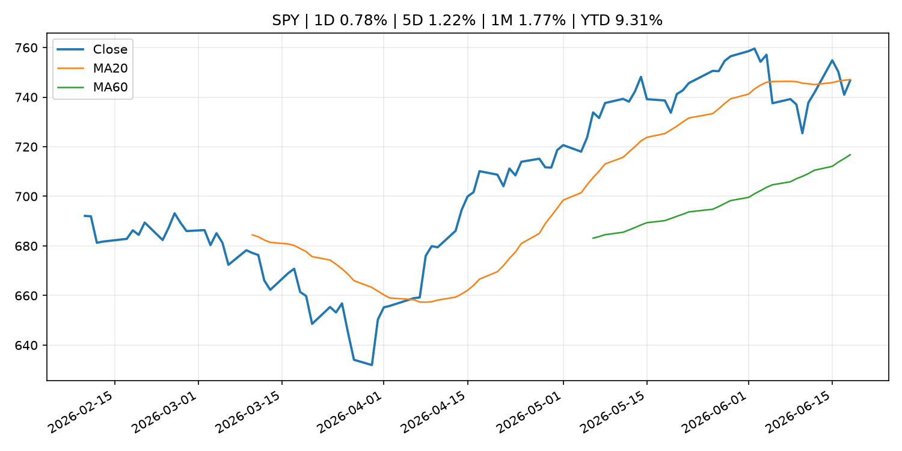
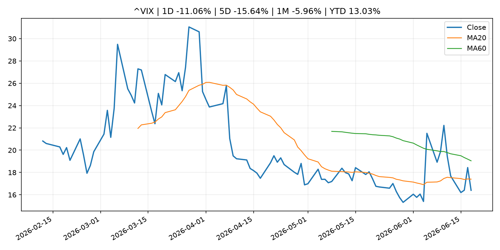
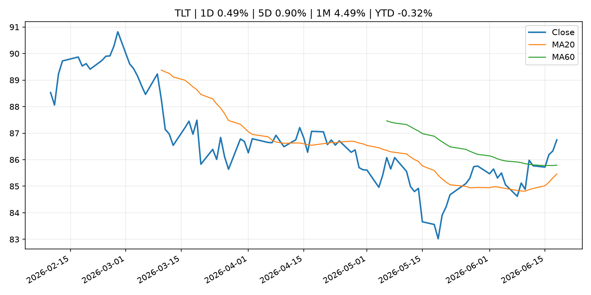
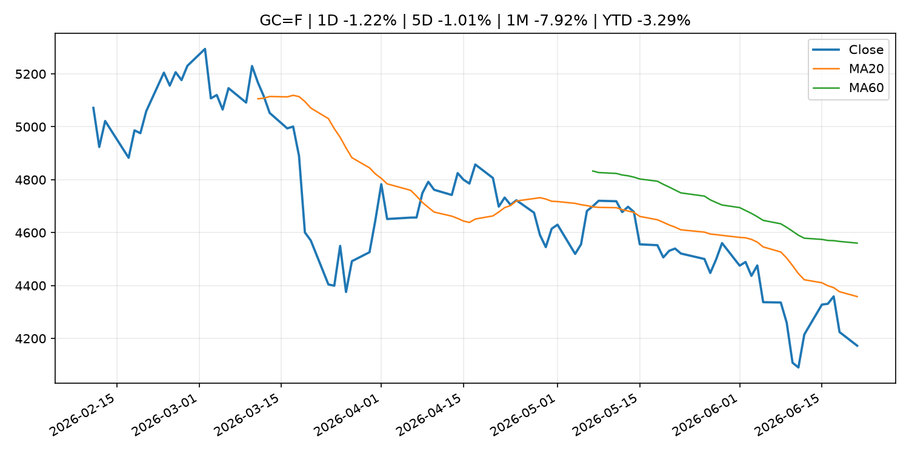
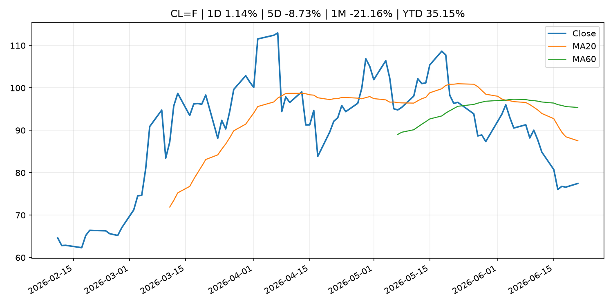
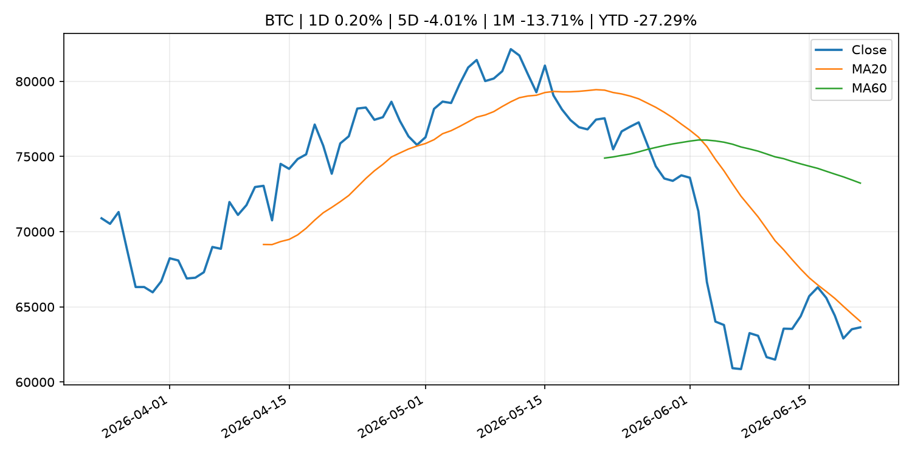
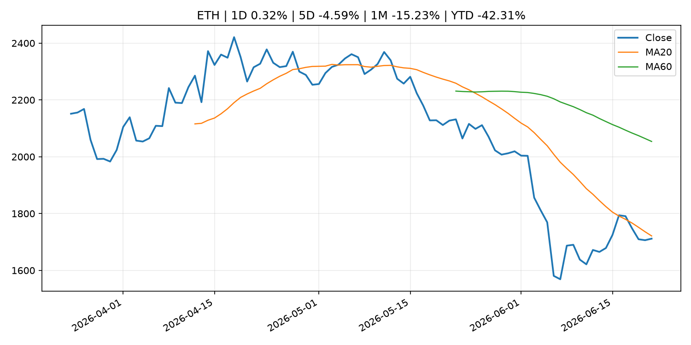
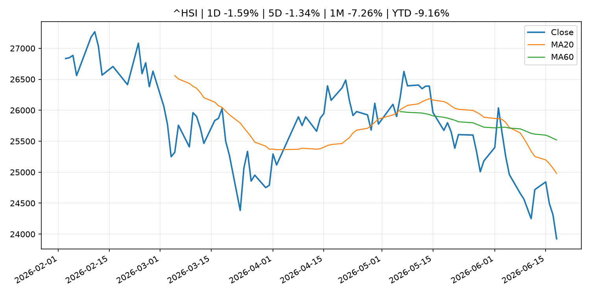

# Global Macro Morning Briefing - 2026-06-22

> Not financial advice / 非投资建议。

## 0. 今日总览
- 市场状态：risk_on。股指上涨、波动率或美元回落，市场更接近风险偏好改善。
- 今日三大主线：
  1. central_bank_speech: This bull market isn’t going to end because of Fed rate hikes under Warsh
  2. earnings: Micron’s earnings are a must-watch market event — with profit growth approaching 1,000%
  3. central_bank_speech: Bitcoin's future as revolutionary as the smartphone, according to CoinDesk
- 一句话结论：今日晨报重点关注：央行官员表态可能影响市场对下一次会议的定价。；大型科技股盈利和资本开支会影响纳指、半导体和 AI 交易主线。。跨资产方面，SPY 1D 0.78%；QQQ 1D 2.51%；^VIX 1D -11.06%；TLT 1D 0.49%；GC=F 1D -1.22%；CL=F 1D 1.14%；BTC 1D 0.20%；ETH 1D 0.32%；股指上涨、波动率或美元回落，市场更接近风险偏好改善。政策、通胀、利率、美元、美债、能源和加密监管仍是主要观察线索。所有结论仅基于公开数据与短摘要整理，不构成投资建议。

## 1. 隔夜跨资产市场
- 美股：SPY 1D 0.78%，QQQ 1D 2.51%，整体趋势需结合 VIX 和利率确认。
- 美债/美元：TLT 1D 0.49%，美元指数 1D 0.00%，是判断折现率压力的核心线索。
- 黄金/原油：黄金 1D -1.22%，原油 1D 1.14%，用于观察避险、通胀和地缘风险。
- 加密：BTC 1D 0.20%，ETH 1D 0.32%，关注是否独立于纳指走出加密自身行情。
- 港股/A股：恒生 1D -1.59%，沪深300/上证 1D n/a，重点看中国政策预期与人民币线索。
- 风险观察：确认风险偏好是否扩散到小盘股、信用利差和周期品。

### US_EQUITY

| symbol | latest close | 1D | 5D | 1M | YTD | trend |
|---|---:|---:|---:|---:|---:|---|
| SPY | 746.74 | 0.78% | 1.22% | 1.77% | 9.31% | range_bound |
| QQQ | 740.62 | 2.51% | 3.28% | 5.57% | 20.80% | uptrend |
| DIA | 515.52 | -0.15% | 1.21% | 4.36% | 6.59% | uptrend |
| IWM | 295.59 | 1.97% | 1.78% | 8.27% | 18.82% | uptrend |
| VTI | 369.99 | 1.16% | 1.56% | 2.76% | 10.01% | uptrend |

### US_MACRO_MARKET

| symbol | latest close | 1D | 5D | 1M | YTD | trend |
|---|---:|---:|---:|---:|---:|---|
| ^VIX | 16.40 | -11.06% | -15.64% | -5.96% | 13.03% | downtrend |
| DX-Y.NYB | 100.85 | 0.00% | 1.10% | 1.76% | 2.47% | uptrend |
| TLT | 86.75 | 0.49% | 0.90% | 4.49% | -0.32% | range_bound |
| IEF | 94.36 | 0.36% | 0.02% | 1.34% | -1.79% | range_bound |

### COMMODITIES

| symbol | latest close | 1D | 5D | 1M | YTD | trend |
|---|---:|---:|---:|---:|---:|---|
| GC=F | 4,172.60 | -1.22% | -1.01% | -7.92% | -3.29% | strong_downtrend |
| SI=F | 64.86 | -2.10% | -4.41% | -14.48% | -8.07% | strong_downtrend |
| CL=F | 77.47 | 1.14% | -8.73% | -21.16% | 35.15% | strong_downtrend |
| BZ=F | 80.59 | 0.93% | -7.72% | -23.26% | 32.66% | strong_downtrend |
| NG=F | 3.27 | 1.27% | 4.94% | 8.99% | -9.51% | strong_uptrend |
| HG=F | 6.35 | -0.44% | -1.31% | 0.89% | 12.53% | range_bound |

### HK_MARKET

| symbol | latest close | 1D | 5D | 1M | YTD | trend |
|---|---:|---:|---:|---:|---:|---|
| ^HSI | 23,924.81 | -1.59% | -1.34% | -7.26% | -9.16% | strong_downtrend |
| 0700.HK | 440.20 | -1.17% | -3.72% | -4.30% | -29.34% | downtrend |
| 9988.HK | 104.90 | -1.87% | -2.33% | -21.31% | -29.60% | strong_downtrend |
| 3690.HK | 71.80 | -3.49% | -8.07% | -13.55% | -31.36% | downtrend |
| 1810.HK | 24.58 | -3.30% | -4.88% | -19.78% | -38.98% | strong_downtrend |
| 1211.HK | 80.85 | -1.28% | -4.83% | -13.90% | -18.13% | strong_downtrend |

### CRYPTO

| symbol | latest close | 1D | 5D | 1M | YTD | trend |
|---|---:|---:|---:|---:|---:|---|
| BTC | 63,639.15 | 0.20% | -4.01% | -13.71% | -27.29% | downtrend |
| ETH | 1,711.68 | 0.32% | -4.59% | -15.23% | -42.31% | downtrend |
| SOLANA | 72.83 | 4.93% | -1.53% | -11.76% | -41.51% | range_bound |
| BINANCECOIN | 585.79 | 0.97% | -5.09% | -18.44% | -32.13% | downtrend |
| RIPPLE | 1.13 | -0.44% | -8.89% | -15.72% | -38.69% | downtrend |

## 2. 今日最重要的 10 条新闻
### 1. This bull market isn’t going to end because of Fed rate hikes under Warsh
- 来源：MarketWatch Top Stories
- 时间：2026-06-21T22:41:00+00:00
- 地区：US
- 事件类型：central_bank_speech
- 重要性层级：Tier 2
- 一句话摘要：Trump-selected Fed chair Kevin Warsh may hope the threat of rate hikes is enough. But stocks might gain ground if he does. Past rate-hike cycles can be a guide.
- 为什么重要：央行官员表态可能影响市场对下一次会议的定价。
- 可能影响：可能影响利率、汇率、风险资产或大宗商品预期，但当前公开信息不足以判断明确方向。
  - 资产：暂无明确资产映射
  - 方向：unknown
  - 强度：low
  - 原因：公开信息不足以判断方向。
- 原文链接：[https://www.marketwatch.com/story/this-bull-market-isnt-going-to-end-because-of-fed-rate-hikes-under-warsh-8f63fa85?mod=mw_rss_topstories](https://www.marketwatch.com/story/this-bull-market-isnt-going-to-end-because-of-fed-rate-hikes-under-warsh-8f63fa85?mod=mw_rss_topstories)

### 2. Micron’s earnings are a must-watch market event — with profit growth approaching 1,000%
- 来源：MarketWatch Top Stories
- 时间：2026-06-21T14:00:00+00:00
- 地区：US
- 事件类型：earnings
- 重要性层级：Tier 2
- 一句话摘要：Micron’s massive growth is “coming at nearly pure profit,” and that’s starting to have real implications for the S&P 500.
- 为什么重要：大型科技股盈利和资本开支会影响纳指、半导体和 AI 交易主线。
- 可能影响：可能影响利率、汇率、风险资产或大宗商品预期，但当前公开信息不足以判断明确方向。
  - 资产：暂无明确资产映射
  - 方向：unknown
  - 强度：low
  - 原因：公开信息不足以判断方向。
- 原文链接：[https://www.marketwatch.com/story/microns-earnings-are-a-must-watch-market-event-with-profit-growth-approaching-1-000-78ec4549?mod=mw_rss_topstories](https://www.marketwatch.com/story/microns-earnings-are-a-must-watch-market-event-with-profit-growth-approaching-1-000-78ec4549?mod=mw_rss_topstories)

### 3. Bitcoin's future as revolutionary as the smartphone, according to CoinDesk
- 来源：CNBC Economy
- 时间：2026-06-20T15:00:01+00:00
- 地区：US
- 事件类型：central_bank_speech
- 重要性层级：Tier 2
- 一句话摘要：CoinDesk’s president of indices and data has a message for investors: Don’t count out bitcoin.
- 为什么重要：央行官员表态可能影响市场对下一次会议的定价。
- 可能影响：可能影响利率、汇率、风险资产或大宗商品预期，但当前公开信息不足以判断明确方向。
  - 资产：暂无明确资产映射
  - 方向：unknown
  - 强度：low
  - 原因：公开信息不足以判断方向。
- 原文链接：[https://www.cnbc.com/2026/06/20/bitcoin-as-revolutionary-as-smartphone-according-to-coindesk.html](https://www.cnbc.com/2026/06/20/bitcoin-as-revolutionary-as-smartphone-according-to-coindesk.html)

### 4. ‘We own our home outright’: I am 67 and earn $100,000. Do I take my $30,000-a-year Social Security now or wait?
- 来源：MarketWatch Top Stories
- 时间：2026-06-21T15:01:00+00:00
- 地区：US
- 事件类型：other
- 重要性层级：Tier 3
- 一句话摘要：“We have combined savings of $950,000 in retirement plans, Roth IRAs and Treasuries.”
- 为什么重要：这条信息暂未匹配到重大宏观、政策或市场事件，更适合作为背景跟踪。
- 可能影响：更偏背景信息，短期市场影响可能有限。
  - 资产：暂无明确资产映射
  - 方向：unknown
  - 强度：low
  - 原因：公开信息不足以判断方向。
- 原文链接：[https://www.marketwatch.com/story/we-own-our-home-outright-i-am-67-and-earn-100-000-do-i-take-my-30-000-social-security-now-or-wait-bbe1e123?mod=mw_rss_topstories](https://www.marketwatch.com/story/we-own-our-home-outright-i-am-67-and-earn-100-000-do-i-take-my-30-000-social-security-now-or-wait-bbe1e123?mod=mw_rss_topstories)

### 5. Bitcoin holds near $64,000 as a renewed Hormuz threat clouds US-Iran ceasefire talks
- 来源：CoinDesk
- 时间：2026-06-21T06:46:28+00:00
- 地区：global
- 事件类型：other
- 重要性层级：Tier 3
- 一句话摘要：Bitcoin holds near $64,000 as a renewed Hormuz threat clouds US-Iran ceasefire talks
- 为什么重要：这条信息暂未匹配到重大宏观、政策或市场事件，更适合作为背景跟踪。
- 可能影响：更偏背景信息，短期市场影响可能有限。
  - 资产：暂无明确资产映射
  - 方向：unknown
  - 强度：low
  - 原因：公开信息不足以判断方向。
- 原文链接：[https://www.coindesk.com/markets/2026/06/21/bitcoin-holds-near-usd64-000-as-a-renewed-hormuz-threat-clouds-us-iran-ceasefire-talks](https://www.coindesk.com/markets/2026/06/21/bitcoin-holds-near-usd64-000-as-a-renewed-hormuz-threat-clouds-us-iran-ceasefire-talks)

## 3. 政策与央行观察
### 1. This bull market isn’t going to end because of Fed rate hikes under Warsh
- 来源：MarketWatch Top Stories
- 时间：2026-06-21T22:41:00+00:00
- 地区：US
- 事件类型：central_bank_speech
- 重要性层级：Tier 2
- 一句话摘要：Trump-selected Fed chair Kevin Warsh may hope the threat of rate hikes is enough. But stocks might gain ground if he does. Past rate-hike cycles can be a guide.
- 为什么重要：央行官员表态可能影响市场对下一次会议的定价。
- 可能影响：可能影响利率、汇率、风险资产或大宗商品预期，但当前公开信息不足以判断明确方向。
  - 资产：暂无明确资产映射
  - 方向：unknown
  - 强度：low
  - 原因：公开信息不足以判断方向。
- 原文链接：[https://www.marketwatch.com/story/this-bull-market-isnt-going-to-end-because-of-fed-rate-hikes-under-warsh-8f63fa85?mod=mw_rss_topstories](https://www.marketwatch.com/story/this-bull-market-isnt-going-to-end-because-of-fed-rate-hikes-under-warsh-8f63fa85?mod=mw_rss_topstories)

### 2. Bitcoin's future as revolutionary as the smartphone, according to CoinDesk
- 来源：CNBC Economy
- 时间：2026-06-20T15:00:01+00:00
- 地区：US
- 事件类型：central_bank_speech
- 重要性层级：Tier 2
- 一句话摘要：CoinDesk’s president of indices and data has a message for investors: Don’t count out bitcoin.
- 为什么重要：央行官员表态可能影响市场对下一次会议的定价。
- 可能影响：可能影响利率、汇率、风险资产或大宗商品预期，但当前公开信息不足以判断明确方向。
  - 资产：暂无明确资产映射
  - 方向：unknown
  - 强度：low
  - 原因：公开信息不足以判断方向。
- 原文链接：[https://www.cnbc.com/2026/06/20/bitcoin-as-revolutionary-as-smartphone-according-to-coindesk.html](https://www.cnbc.com/2026/06/20/bitcoin-as-revolutionary-as-smartphone-according-to-coindesk.html)

## 4. 市场异动与图表
- SPY 上涨 0.78%
- QQQ 上涨 2.51%
- VIX 下跌 -11.06%
- TLT 上涨 0.49%
- Gold 下跌 -1.22%
- Oil 上涨 1.14%

### SPY

### QQQ

### ^VIX

### TLT

### GC=F

### CL=F

### BTC

### ETH

### ^HSI

## 5. 华尔街与机构公开观点
- 暂无可靠公开观点。

## 6. 今日重点关注
- 经济数据：经济数据：暂无可靠公开日历数据；如配置经济日历源后可自动填充。
- 央行讲话：央行讲话：暂无可靠公开日历数据；重点跟踪 Fed、ECB、BoJ、PBOC 官网 RSS。
- 财报：财报：暂无可靠数据。
- 政策事件：政策事件：暂无可靠数据。
- 风险提醒：风险提醒：关注数据源失败项、突发地缘风险、利率和美元的二阶反应。

## 7. 英文金融表达与宏观概念
- **terminal rate**：终端利率，市场预期本轮加息周期的最高政策利率。 例句：A higher terminal rate can pressure growth stocks.
- **risk-off**：避险模式，资金偏向美元、国债、黄金等防御资产。 例句：A geopolitical shock can push markets into risk-off mode.
- **market structure**：市场结构，指交易、托管、清算、ETF、监管等制度安排。 例句：Crypto market structure rules can affect institutional participation.
- **inflation expectations**：通胀预期，指家庭、企业或市场对未来通胀的预估。 例句：Inflation expectations can shape wage bargaining and bond yields.
- **real yield**：实际收益率，名义利率扣除通胀预期后的收益率。 例句：Gold often reacts more to real yields than nominal yields.
- **soft landing**：软着陆，指通胀回落而经济避免明显衰退。 例句：Markets often rally when data support a soft landing.

## 8. 背景材料
- [‘We own our home outright’: I am 67 and earn $100,000. Do I take my $30,000-a-year Social Security now or wait?](https://www.marketwatch.com/story/we-own-our-home-outright-i-am-67-and-earn-100-000-do-i-take-my-30-000-social-security-now-or-wait-bbe1e123?mod=mw_rss_topstories)（MarketWatch Top Stories，other）：“We have combined savings of $950,000 in retirement plans, Roth IRAs and Treasuries.”
- [Bitcoin holds near $64,000 as a renewed Hormuz threat clouds US-Iran ceasefire talks](https://www.coindesk.com/markets/2026/06/21/bitcoin-holds-near-usd64-000-as-a-renewed-hormuz-threat-clouds-us-iran-ceasefire-talks)（CoinDesk，other）：Bitcoin holds near $64,000 as a renewed Hormuz threat clouds US-Iran ceasefire talks
- [AI is making crypto security cheaper, faster and harder to ignore](https://www.coindesk.com/tech/2026/06/20/ai-is-making-crypto-security-cheaper-faster-and-harder-to-ignore)（CoinDesk，other）：AI is making crypto security cheaper, faster and harder to ignore

## 9. 数据源、失败项与免责声明
- 采集时间：2026-06-21T23:11:11
- 数据源：公开 RSS、Yahoo Finance、CoinGecko、AKShare、FRED、SEC data.sec.gov，以及用户自有 inputs/reports 文件。
- 合规说明：不绕过 WSJ、Bloomberg、FT、Reuters 等付费墙；对付费媒体只使用公开 RSS 标题、摘要、链接和发布时间。
- 免责声明：Not financial advice / 非投资建议。本项目仅供个人学习、研究和信息整理，不构成投资建议、交易建议或任何收益承诺。
- 失败或跳过的数据源：
  - crypto data failed coin=dogecoin
  - China market data failed symbol=上证指数: empty dataframe
  - China market data failed symbol=深证成指: empty dataframe
  - China market data failed symbol=创业板指: empty dataframe
  - China market data failed symbol=沪深300: empty dataframe
  - China market data failed symbol=中证500: empty dataframe
  - China market data failed symbol=科创50: empty dataframe
  - FRED_API_KEY not set; skipping FRED macro series
  - SEC failed cik=0000320193
  - SEC failed cik=0000789019
  - SEC failed cik=0001045810
  - SEC failed cik=0001318605
  - SEC failed cik=0001577552
