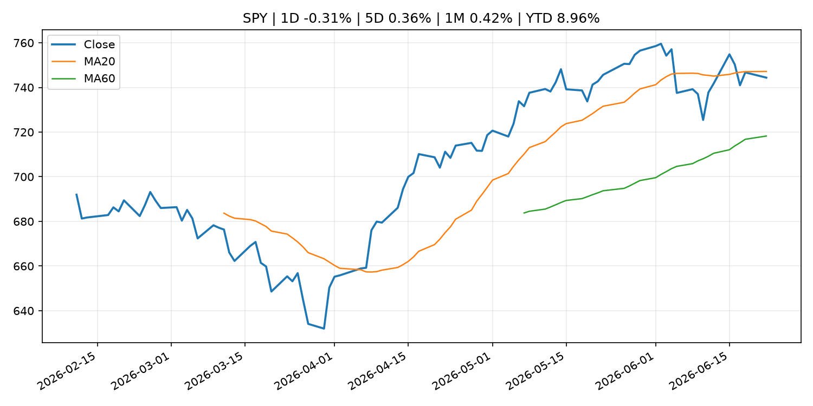
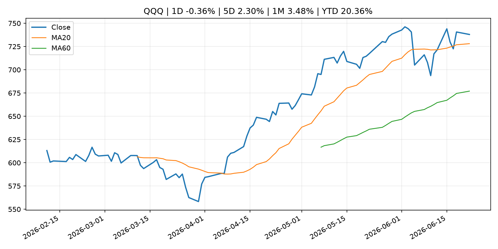
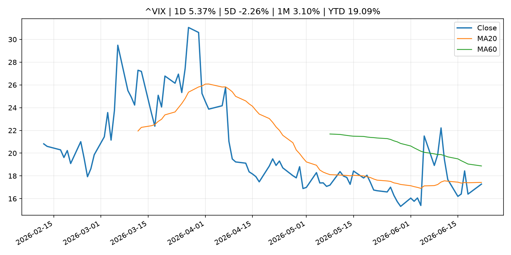
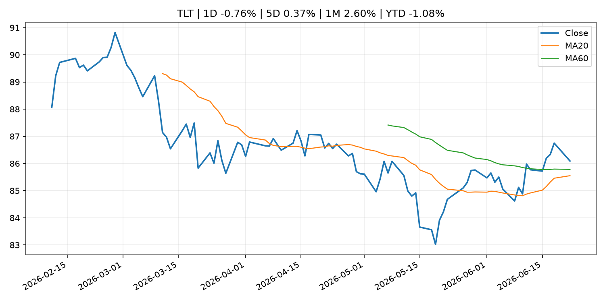
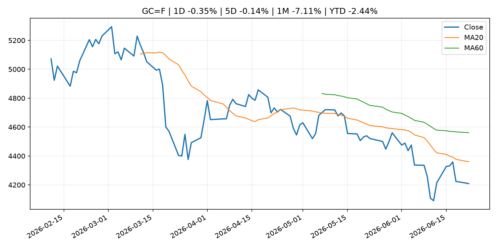
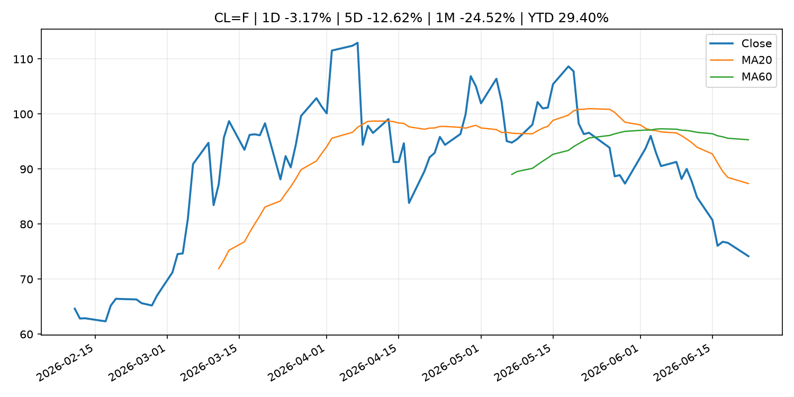
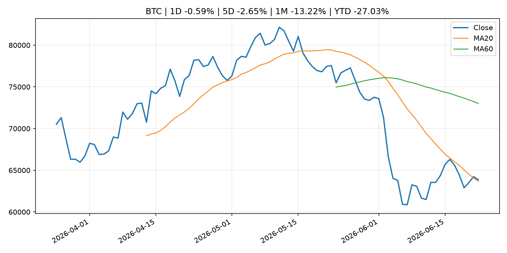
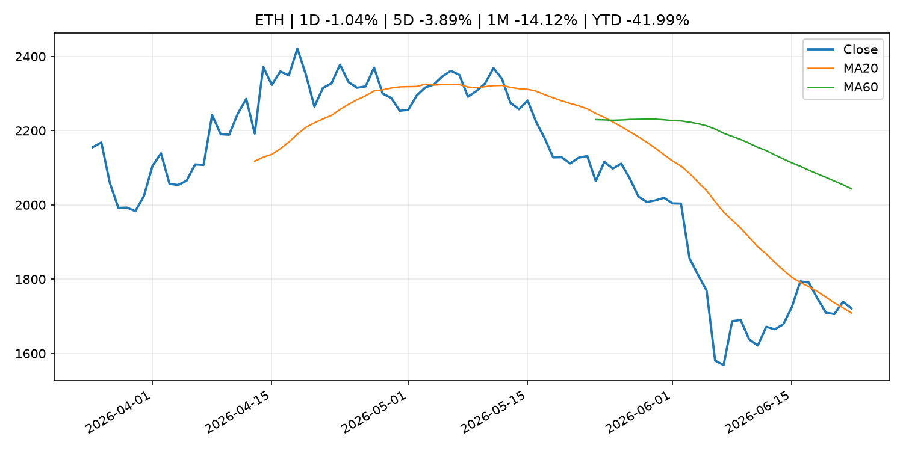
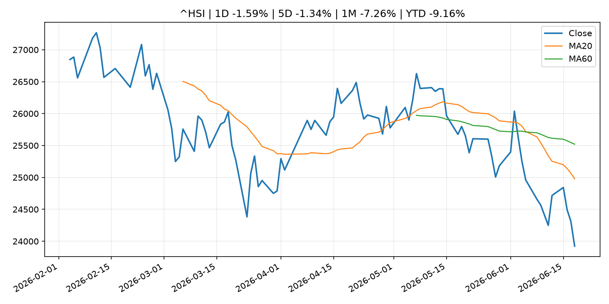

# Global Macro Morning Briefing - 2026-06-23

> Not financial advice / 非投资建议。

## 0. 今日总览
- 市场状态：mixed。市场信号不足，暂不判断明确状态。 但存在信号冲突，需要降低单一叙事置信度。
- 今日三大主线：
  1. fiscal_policy: Crypto's second U.S. lobbying front — tax policy — sees industry push on mining, staking
  2. earnings: Can anyone join Musk in the trillionaire club? Zuckerberg has best shot, according to prediction markets
  3. crypto_market_structure: MoneyGram joins Solana as validator amid stablecoin payment push
- 一句话结论：今日晨报重点关注：财政和贸易政策会影响增长、通胀、企业利润和跨境资本流。；大型科技股盈利和资本开支会影响纳指、半导体和 AI 交易主线。。跨资产方面，SPY 1D -0.31%；QQQ 1D -0.36%；^VIX 1D 5.37%；TLT 1D -0.76%；GC=F 1D -0.35%；CL=F 1D -3.17%；BTC 1D -0.59%；ETH 1D -1.04%；市场信号不足，暂不判断明确状态。 但存在信号冲突，需要降低单一叙事置信度。政策、通胀、利率、美元、美债、能源和加密监管仍是主要观察线索。所有结论仅基于公开数据与短摘要整理，不构成投资建议。

## 1. 隔夜跨资产市场
- 美股：SPY 1D -0.31%，QQQ 1D -0.36%，整体趋势需结合 VIX 和利率确认。
- 美债/美元：TLT 1D -0.76%，美元指数 1D 0.14%，是判断折现率压力的核心线索。
- 黄金/原油：黄金 1D -0.35%，原油 1D -3.17%，用于观察避险、通胀和地缘风险。
- 加密：BTC 1D -0.59%，ETH 1D -1.04%，关注是否独立于纳指走出加密自身行情。
- 港股/A股：恒生 1D -1.59%，沪深300/上证 1D n/a，重点看中国政策预期与人民币线索。
- 风险观察：关注后续数据是否确认当前跨资产信号。

### US_EQUITY

| symbol | latest close | 1D | 5D | 1M | YTD | trend |
|---|---:|---:|---:|---:|---:|---|
| SPY | 744.39 | -0.31% | 0.36% | 0.42% | 8.96% | range_bound |
| QQQ | 737.95 | -0.36% | 2.30% | 3.48% | 20.36% | uptrend |
| DIA | 517.08 | 0.30% | 0.78% | 3.37% | 6.92% | uptrend |
| IWM | 298.18 | 0.88% | 1.79% | 6.54% | 19.86% | strong_uptrend |
| VTI | 368.81 | -0.32% | 0.67% | 1.27% | 9.66% | uptrend |

### US_MACRO_MARKET

| symbol | latest close | 1D | 5D | 1M | YTD | trend |
|---|---:|---:|---:|---:|---:|---|
| ^VIX | 17.28 | 5.37% | -2.26% | 3.10% | 19.09% | downtrend |
| DX-Y.NYB | 101.00 | 0.14% | 1.25% | 1.90% | 2.62% | uptrend |
| TLT | 86.09 | -0.76% | 0.37% | 2.60% | -1.08% | range_bound |
| IEF | 94.00 | -0.38% | -0.19% | 0.28% | -2.16% | downtrend |

### COMMODITIES

| symbol | latest close | 1D | 5D | 1M | YTD | trend |
|---|---:|---:|---:|---:|---:|---|
| GC=F | 4,209.30 | -0.35% | -0.14% | -7.11% | -2.44% | strong_downtrend |
| SI=F | 65.14 | -1.69% | -4.01% | -14.13% | -7.68% | strong_downtrend |
| CL=F | 74.17 | -3.17% | -12.62% | -24.52% | 29.40% | strong_downtrend |
| BZ=F | 78.15 | -2.13% | -10.51% | -25.59% | 28.64% | strong_downtrend |
| NG=F | 3.26 | 0.96% | 4.62% | 8.66% | -9.78% | uptrend |
| HG=F | 6.35 | -0.38% | -1.25% | 0.95% | 12.59% | range_bound |

### HK_MARKET

| symbol | latest close | 1D | 5D | 1M | YTD | trend |
|---|---:|---:|---:|---:|---:|---|
| ^HSI | 23,924.81 | -1.59% | -1.34% | -7.26% | -9.16% | strong_downtrend |
| 0700.HK | 433.00 | -1.64% | -6.60% | -4.88% | -30.50% | downtrend |
| 9988.HK | 102.90 | -1.91% | -6.62% | -21.99% | -30.94% | strong_downtrend |
| 3690.HK | 72.00 | 0.28% | -7.57% | -13.10% | -31.17% | strong_downtrend |
| 1810.HK | 23.72 | -3.50% | -9.47% | -21.30% | -41.11% | strong_downtrend |
| 1211.HK | 78.35 | -3.09% | -9.47% | -13.14% | -20.66% | strong_downtrend |

### CRYPTO

| symbol | latest close | 1D | 5D | 1M | YTD | trend |
|---|---:|---:|---:|---:|---:|---|
| BTC | 63,860.91 | -0.59% | -2.65% | -13.22% | -27.03% | range_bound |
| ETH | 1,721.07 | -1.04% | -3.89% | -14.12% | -41.99% | range_bound |
| SOLANA | 71.92 | -1.75% | -2.10% | -12.54% | -42.24% | range_bound |
| BINANCECOIN | 588.68 | 0.18% | -2.62% | -16.91% | -31.80% | strong_downtrend |
| RIPPLE | 1.13 | -2.02% | -7.44% | -15.39% | -38.79% | downtrend |
| DOGECOIN | 0.08 | -1.72% | -5.76% | -17.95% | -29.94% | strong_downtrend |

## 2. 今日最重要的 10 条新闻
### 1. Crypto's second U.S. lobbying front — tax policy — sees industry push on mining, staking
- 来源：CoinDesk
- 时间：2026-06-22T15:56:13+00:00
- 地区：global
- 事件类型：fiscal_policy
- 重要性层级：Tier 1
- 一句话摘要：Crypto's second U.S. lobbying front — tax policy — sees industry push on mining, staking
- 为什么重要：财政和贸易政策会影响增长、通胀、企业利润和跨境资本流。
- 可能影响：可能影响利率、汇率、风险资产或大宗商品预期，但当前公开信息不足以判断明确方向。
  - 资产：暂无明确资产映射
  - 方向：unknown
  - 强度：low
  - 原因：公开信息不足以判断方向。
- 原文链接：[https://www.coindesk.com/policy/2026/06/22/crypto-s-second-u-s-lobbying-front-tax-policy-sees-industry-push-on-mining-staking](https://www.coindesk.com/policy/2026/06/22/crypto-s-second-u-s-lobbying-front-tax-policy-sees-industry-push-on-mining-staking)

### 2. Can anyone join Musk in the trillionaire club? Zuckerberg has best shot, according to prediction markets
- 来源：CNBC Economy
- 时间：2026-06-22T16:45:37+00:00
- 地区：US
- 事件类型：earnings
- 重要性层级：Tier 2
- 一句话摘要：The Meta CEO is seen as next to join the Tesla and SpaceX CEO. Nvidia CEO Jensen Huang is seen as the second-most-likely.
- 为什么重要：大型科技股盈利和资本开支会影响纳指、半导体和 AI 交易主线。
- 可能影响：主要影响 QQQ，方向为 mixed，强度 high；AI 资本开支会影响大型科技股盈利和估值预期。
  - 资产：QQQ
    方向：mixed
    强度：high
    原因：AI 资本开支会影响大型科技股盈利和估值预期。
  - 资产：SMH
    方向：mixed
    强度：high
    原因：AI 投资周期直接影响半导体需求。
  - 资产：NVDA
    方向：mixed
    强度：high
    原因：AI 训练和推理需求是英伟达收入预期核心变量。
  - 资产：MSFT
    方向：mixed
    强度：medium
    原因：云和 AI 资本开支影响利润率与增长叙事。
  - 资产：GOOGL
    方向：mixed
    强度：medium
    原因：AI 投资和搜索商业化影响估值。
  - 资产：META
    方向：mixed
    强度：medium
    原因：AI 基建支出与广告效率共同影响市场预期。
- 原文链接：[https://www.cnbc.com/2026/06/22/zuckerberg-seen-as-next-to-join-trillionaire-club-say-kalshi-traders.html](https://www.cnbc.com/2026/06/22/zuckerberg-seen-as-next-to-join-trillionaire-club-say-kalshi-traders.html)

### 3. MoneyGram joins Solana as validator amid stablecoin payment push
- 来源：CoinDesk
- 时间：2026-06-22T13:53:16+00:00
- 地区：global
- 事件类型：crypto_market_structure
- 重要性层级：Tier 2
- 一句话摘要：MoneyGram joins Solana as validator amid stablecoin payment push
- 为什么重要：加密市场结构和监管变化会影响 BTC、ETH 及相关股票的风险溢价。
- 可能影响：主要影响 BTC，方向为 mixed，强度 high；加密监管或 ETF 进展会改变 BTC 的资金流和风险溢价。
  - 资产：BTC
    方向：mixed
    强度：high
    原因：加密监管或 ETF 进展会改变 BTC 的资金流和风险溢价。
  - 资产：ETH
    方向：mixed
    强度：high
    原因：监管框架会影响 ETH 产品化和机构参与度。
  - 资产：COIN
    方向：mixed
    强度：medium
    原因：监管清晰度和执法风险会影响交易平台估值。
  - 资产：crypto market
    方向：mixed
    强度：high
    原因：信息影响整个加密市场结构，但方向取决于细节。
- 原文链接：[https://www.coindesk.com/business/2026/06/22/moneygram-joins-solana-as-validator-amid-stablecoin-payment-push](https://www.coindesk.com/business/2026/06/22/moneygram-joins-solana-as-validator-amid-stablecoin-payment-push)

### 4. Bank of England backs down on strict stablecoin holding limits, sets $50 billion issuance cap
- 来源：CoinDesk
- 时间：2026-06-22T10:48:14+00:00
- 地区：global
- 事件类型：crypto_market_structure
- 重要性层级：Tier 2
- 一句话摘要：Bank of England backs down on strict stablecoin holding limits, sets $50 billion issuance cap
- 为什么重要：加密市场结构和监管变化会影响 BTC、ETH 及相关股票的风险溢价。
- 可能影响：主要影响 BTC，方向为 mixed，强度 high；加密监管或 ETF 进展会改变 BTC 的资金流和风险溢价。
  - 资产：BTC
    方向：mixed
    强度：high
    原因：加密监管或 ETF 进展会改变 BTC 的资金流和风险溢价。
  - 资产：ETH
    方向：mixed
    强度：high
    原因：监管框架会影响 ETH 产品化和机构参与度。
  - 资产：COIN
    方向：mixed
    强度：medium
    原因：监管清晰度和执法风险会影响交易平台估值。
  - 资产：crypto market
    方向：mixed
    强度：high
    原因：信息影响整个加密市场结构，但方向取决于细节。
- 原文链接：[https://www.coindesk.com/policy/2026/06/22/bank-of-england-backs-down-on-strict-stablecoin-holding-limits-sets-usd50-billion-issuance-cap](https://www.coindesk.com/policy/2026/06/22/bank-of-england-backs-down-on-strict-stablecoin-holding-limits-sets-usd50-billion-issuance-cap)

### 5. Bitcoin ETF outflow pain eases just as another headwind gathers strength
- 来源：CoinDesk
- 时间：2026-06-22T11:30:13+00:00
- 地区：global
- 事件类型：other
- 重要性层级：Tier 3
- 一句话摘要：Bitcoin ETF outflow pain eases just as another headwind gathers strength
- 为什么重要：这条信息暂未匹配到重大宏观、政策或市场事件，更适合作为背景跟踪。
- 可能影响：主要影响 BTC，方向为 mixed，强度 high；加密监管或 ETF 进展会改变 BTC 的资金流和风险溢价。
  - 资产：BTC
    方向：mixed
    强度：high
    原因：加密监管或 ETF 进展会改变 BTC 的资金流和风险溢价。
  - 资产：ETH
    方向：mixed
    强度：high
    原因：监管框架会影响 ETH 产品化和机构参与度。
  - 资产：COIN
    方向：mixed
    强度：medium
    原因：监管清晰度和执法风险会影响交易平台估值。
  - 资产：crypto market
    方向：mixed
    强度：high
    原因：信息影响整个加密市场结构，但方向取决于细节。
- 原文链接：[https://www.coindesk.com/daybook-us/2026/06/22/bitcoin-etf-outflow-pain-eases-just-as-another-headwind-strengthens](https://www.coindesk.com/daybook-us/2026/06/22/bitcoin-etf-outflow-pain-eases-just-as-another-headwind-strengthens)

### 6. Securitize and tZERO clash over patents as race to bring Wall Street onchain heats up
- 来源：CoinDesk
- 时间：2026-06-22T21:08:50+00:00
- 地区：global
- 事件类型：other
- 重要性层级：Tier 3
- 一句话摘要：Securitize and tZERO clash over patents as race to bring Wall Street onchain heats up
- 为什么重要：这条信息暂未匹配到重大宏观、政策或市场事件，更适合作为背景跟踪。
- 可能影响：更偏背景信息，短期市场影响可能有限。
  - 资产：暂无明确资产映射
  - 方向：unknown
  - 强度：low
  - 原因：公开信息不足以判断方向。
- 原文链接：[https://www.coindesk.com/business/2026/06/22/securitize-and-tzero-clash-over-patents-as-race-to-bring-wall-street-onchain-heats-up](https://www.coindesk.com/business/2026/06/22/securitize-and-tzero-clash-over-patents-as-race-to-bring-wall-street-onchain-heats-up)

## 3. 政策与央行观察
### 1. Crypto's second U.S. lobbying front — tax policy — sees industry push on mining, staking
- 来源：CoinDesk
- 时间：2026-06-22T15:56:13+00:00
- 地区：global
- 事件类型：fiscal_policy
- 重要性层级：Tier 1
- 一句话摘要：Crypto's second U.S. lobbying front — tax policy — sees industry push on mining, staking
- 为什么重要：财政和贸易政策会影响增长、通胀、企业利润和跨境资本流。
- 可能影响：可能影响利率、汇率、风险资产或大宗商品预期，但当前公开信息不足以判断明确方向。
  - 资产：暂无明确资产映射
  - 方向：unknown
  - 强度：low
  - 原因：公开信息不足以判断方向。
- 原文链接：[https://www.coindesk.com/policy/2026/06/22/crypto-s-second-u-s-lobbying-front-tax-policy-sees-industry-push-on-mining-staking](https://www.coindesk.com/policy/2026/06/22/crypto-s-second-u-s-lobbying-front-tax-policy-sees-industry-push-on-mining-staking)

### 2. MoneyGram joins Solana as validator amid stablecoin payment push
- 来源：CoinDesk
- 时间：2026-06-22T13:53:16+00:00
- 地区：global
- 事件类型：crypto_market_structure
- 重要性层级：Tier 2
- 一句话摘要：MoneyGram joins Solana as validator amid stablecoin payment push
- 为什么重要：加密市场结构和监管变化会影响 BTC、ETH 及相关股票的风险溢价。
- 可能影响：主要影响 BTC，方向为 mixed，强度 high；加密监管或 ETF 进展会改变 BTC 的资金流和风险溢价。
  - 资产：BTC
    方向：mixed
    强度：high
    原因：加密监管或 ETF 进展会改变 BTC 的资金流和风险溢价。
  - 资产：ETH
    方向：mixed
    强度：high
    原因：监管框架会影响 ETH 产品化和机构参与度。
  - 资产：COIN
    方向：mixed
    强度：medium
    原因：监管清晰度和执法风险会影响交易平台估值。
  - 资产：crypto market
    方向：mixed
    强度：high
    原因：信息影响整个加密市场结构，但方向取决于细节。
- 原文链接：[https://www.coindesk.com/business/2026/06/22/moneygram-joins-solana-as-validator-amid-stablecoin-payment-push](https://www.coindesk.com/business/2026/06/22/moneygram-joins-solana-as-validator-amid-stablecoin-payment-push)

### 3. Bank of England backs down on strict stablecoin holding limits, sets $50 billion issuance cap
- 来源：CoinDesk
- 时间：2026-06-22T10:48:14+00:00
- 地区：global
- 事件类型：crypto_market_structure
- 重要性层级：Tier 2
- 一句话摘要：Bank of England backs down on strict stablecoin holding limits, sets $50 billion issuance cap
- 为什么重要：加密市场结构和监管变化会影响 BTC、ETH 及相关股票的风险溢价。
- 可能影响：主要影响 BTC，方向为 mixed，强度 high；加密监管或 ETF 进展会改变 BTC 的资金流和风险溢价。
  - 资产：BTC
    方向：mixed
    强度：high
    原因：加密监管或 ETF 进展会改变 BTC 的资金流和风险溢价。
  - 资产：ETH
    方向：mixed
    强度：high
    原因：监管框架会影响 ETH 产品化和机构参与度。
  - 资产：COIN
    方向：mixed
    强度：medium
    原因：监管清晰度和执法风险会影响交易平台估值。
  - 资产：crypto market
    方向：mixed
    强度：high
    原因：信息影响整个加密市场结构，但方向取决于细节。
- 原文链接：[https://www.coindesk.com/policy/2026/06/22/bank-of-england-backs-down-on-strict-stablecoin-holding-limits-sets-usd50-billion-issuance-cap](https://www.coindesk.com/policy/2026/06/22/bank-of-england-backs-down-on-strict-stablecoin-holding-limits-sets-usd50-billion-issuance-cap)

## 4. 市场异动与图表
- VIX 上涨 5.37%
- TLT 下跌 -0.76%
- Oil 下跌 -3.17%

### 信号矛盾
- 股债同时承压，可能是利率或流动性冲击而非传统避险。

### SPY

### QQQ

### ^VIX

### TLT

### GC=F

### CL=F

### BTC

### ETH

### ^HSI

## 5. 华尔街与机构公开观点
- 暂无可靠公开观点。

## 6. 今日重点关注
- 经济数据：经济数据：暂无可靠公开日历数据；如配置经济日历源后可自动填充。
- 央行讲话：央行讲话：暂无可靠公开日历数据；重点跟踪 Fed、ECB、BoJ、PBOC 官网 RSS。
- 财报：财报：暂无可靠数据。
- 政策事件：政策事件：暂无可靠数据。
- 风险提醒：风险提醒：关注数据源失败项、突发地缘风险、利率和美元的二阶反应。

## 7. 英文金融表达与宏观概念
- **market structure**：市场结构，指交易、托管、清算、ETF、监管等制度安排。 例句：Crypto market structure rules can affect institutional participation.
- **AI capex**：AI 资本开支，指云厂商和科技公司投入 AI 基建的支出。 例句：AI capex guidance can move semiconductor stocks.
- **inflation expectations**：通胀预期，指家庭、企业或市场对未来通胀的预估。 例句：Inflation expectations can shape wage bargaining and bond yields.
- **real yield**：实际收益率，名义利率扣除通胀预期后的收益率。 例句：Gold often reacts more to real yields than nominal yields.
- **terminal rate**：终端利率，市场预期本轮加息周期的最高政策利率。 例句：A higher terminal rate can pressure growth stocks.
- **soft landing**：软着陆，指通胀回落而经济避免明显衰退。 例句：Markets often rally when data support a soft landing.

## 8. 背景材料
- [Securitize and tZERO clash over patents as race to bring Wall Street onchain heats up](https://www.coindesk.com/business/2026/06/22/securitize-and-tzero-clash-over-patents-as-race-to-bring-wall-street-onchain-heats-up)（CoinDesk，other）：Securitize and tZERO clash over patents as race to bring Wall Street onchain heats up
- [Salesforce’s stock extends record losing streak. Can the company disrupt itself?](https://www.marketwatch.com/story/salesforces-stock-extends-record-losing-streak-can-the-company-disrupt-itself-8402d62c?mod=mw_rss_topstories)（MarketWatch Top Stories，other）：Shares of Salesforce posted their 14th consecutive day of losses as investors remain unconvinced of the company’s AI momentum.
- [Alan Greenspan, former chairman of the Fed, dies at age 100](https://www.cnbc.com/2026/06/22/alan-greenspan-former-chairman-of-the-fed-dies-at-age-100.html)（CNBC Economy，other）：Alan Greenspan presided over the Federal Reserve for 19 years under four presidents and mastered the art of obfuscation known as Fedspeak.
- [Christine Lagarde: Hearing of the Committee on Economic and Monetary Affairs of the European Parliament](https://www.ecb.europa.eu//press/key/date/2026/html/ecb.sp260622~b060a27b78.en.html)（ECB Press Releases，other）：Christine Lagarde: Hearing of the Committee on Economic and Monetary Affairs of the European Parliament
- [Bitcoin mining network becoming more sensitive to price swings, JPMorgan says](https://www.coindesk.com/markets/2026/06/22/bitcoin-mining-network-becoming-more-sensitive-to-price-swings-jpmorgan-says)（CoinDesk，other）：Bitcoin mining network becoming more sensitive to price swings, JPMorgan says
- [Federal Reserve notes with deep sadness the passing of Alan Greenspan](https://www.federalreserve.gov/newsevents/pressreleases/other20260622a.htm)（Federal Reserve Press Releases，other）：Federal Reserve notes with deep sadness the passing of Alan Greenspan
- [Strategy added $35 million in bitcoin, $300 million in cash reserves last week](https://www.coindesk.com/markets/2026/06/22/strategy-added-usd35-million-in-bitcoin-usd300-million-in-cash-reserves-last-week)（CoinDesk，other）：Strategy added $35 million in bitcoin, $300 million in cash reserves last week
- [Bitcoin ETF outflow pain eases just as another headwind gathers strength](https://www.coindesk.com/daybook-us/2026/06/22/bitcoin-etf-outflow-pain-eases-just-as-another-headwind-strengthens)（CoinDesk，other）：Bitcoin ETF outflow pain eases just as another headwind gathers strength
- [As bitcoin, altcoin prices gain, derivatives signal skepticism over a sustained rally](https://www.coindesk.com/markets/2026/06/22/as-bitcoin-altcoin-prices-gain-derivatives-signal-skepticism-over-a-sustained-rally)（CoinDesk，other）：As bitcoin, altcoin prices gain, derivatives signal skepticism over a sustained rally
- [Bitcoin price may be headed to $54,000, says analyst who forecast October's all-time high](https://www.coindesk.com/markets/2026/06/22/bitcoin-price-may-be-headed-to-usd54-000-says-analyst-who-forecast-october-s-all-time-high)（CoinDesk，other）：Bitcoin price may be headed to $54,000, says analyst who forecast October's all-time high
- [Live markets: Bitcoin gives up morning gains as Nasdaq sheds more than 1%](https://www.coindesk.com/tech/2026/06/22/live-markets-bitcoin-is-stuck-near-usd64-000-as-etf-outflows-reach-a-sixth-week)（CoinDesk，other）：Live markets: Bitcoin gives up morning gains as Nasdaq sheds more than 1%
- [Bitcoin developers want to fix the 'replace this transaction with a higher fee' button. Here's why](https://www.coindesk.com/tech/2026/06/22/bitcoin-developers-want-to-fix-the-replace-this-transaction-with-a-higher-fee-button-here-s-why)（CoinDesk，other）：Bitcoin developers want to fix the 'replace this transaction with a higher fee' button. Here's why
- [Semiannual Report on Currency and Monetary Control (Summary)](http://www.boj.or.jp/en/mopo/diet/d_report/hanki26a.htm)（Bank of Japan Announcements，other）：Semiannual Report on Currency and Monetary Control (Summary)

## 9. 数据源、失败项与免责声明
- 采集时间：2026-06-22T23:18:32
- 数据源：公开 RSS、Yahoo Finance、CoinGecko、AKShare、FRED、SEC data.sec.gov，以及用户自有 inputs/reports 文件。
- 合规说明：不绕过 WSJ、Bloomberg、FT、Reuters 等付费墙；对付费媒体只使用公开 RSS 标题、摘要、链接和发布时间。
- 免责声明：Not financial advice / 非投资建议。本项目仅供个人学习、研究和信息整理，不构成投资建议、交易建议或任何收益承诺。
- 失败或跳过的数据源：
  - China market data failed symbol=上证指数: empty dataframe
  - China market data failed symbol=深证成指: empty dataframe
  - China market data failed symbol=创业板指: empty dataframe
  - China market data failed symbol=沪深300: empty dataframe
  - China market data failed symbol=中证500: empty dataframe
  - China market data failed symbol=科创50: empty dataframe
  - FRED_API_KEY not set; skipping FRED macro series
  - SEC failed cik=0000320193
  - SEC failed cik=0000789019
  - SEC failed cik=0001045810
  - SEC failed cik=0001318605
  - SEC failed cik=0001577552
