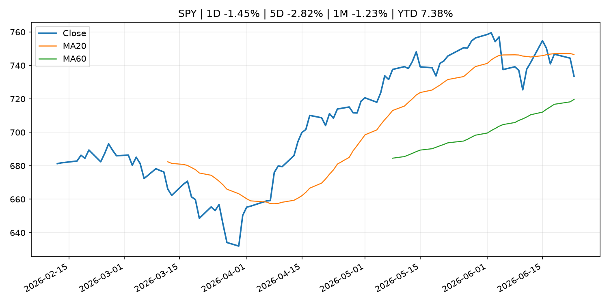
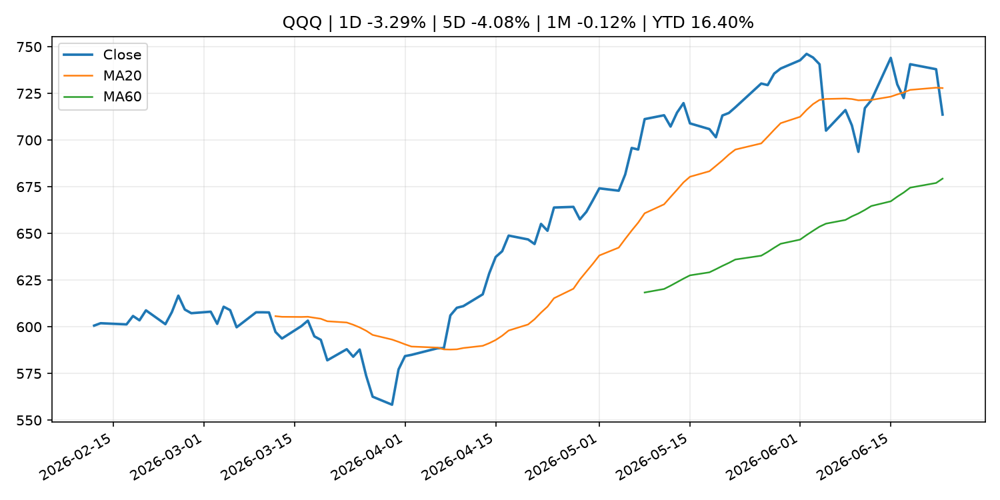
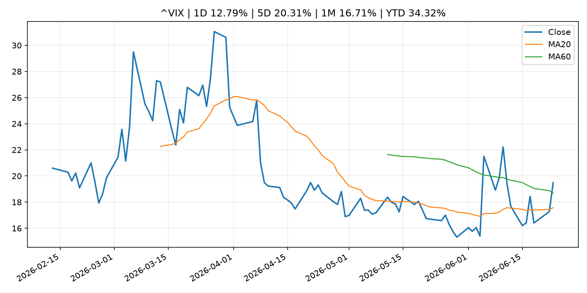
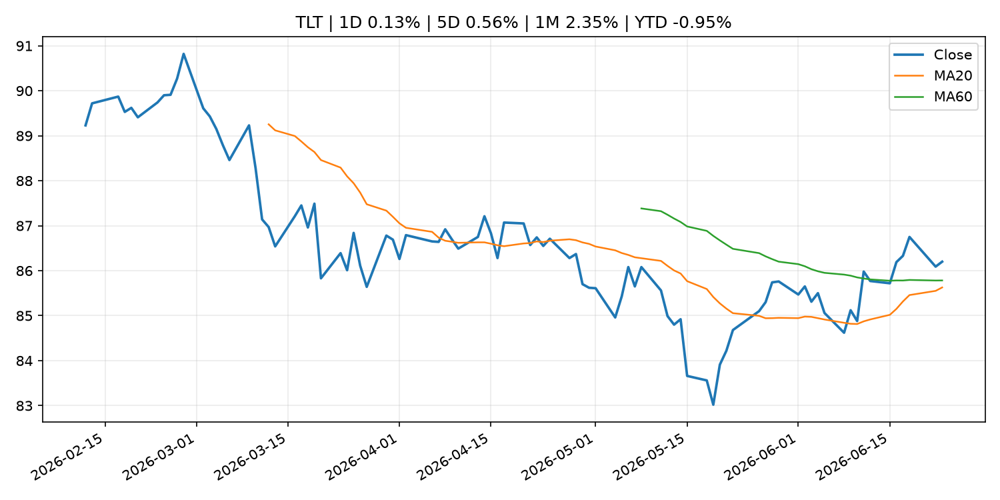
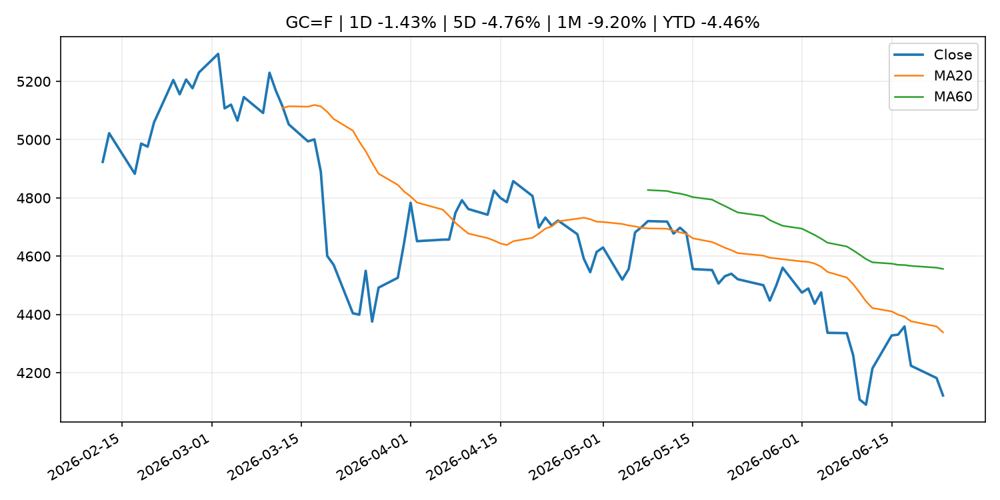
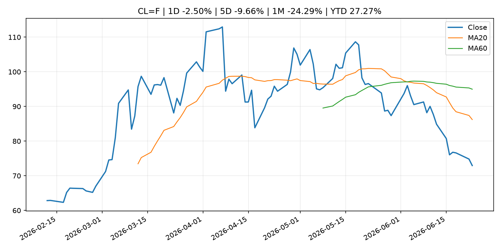
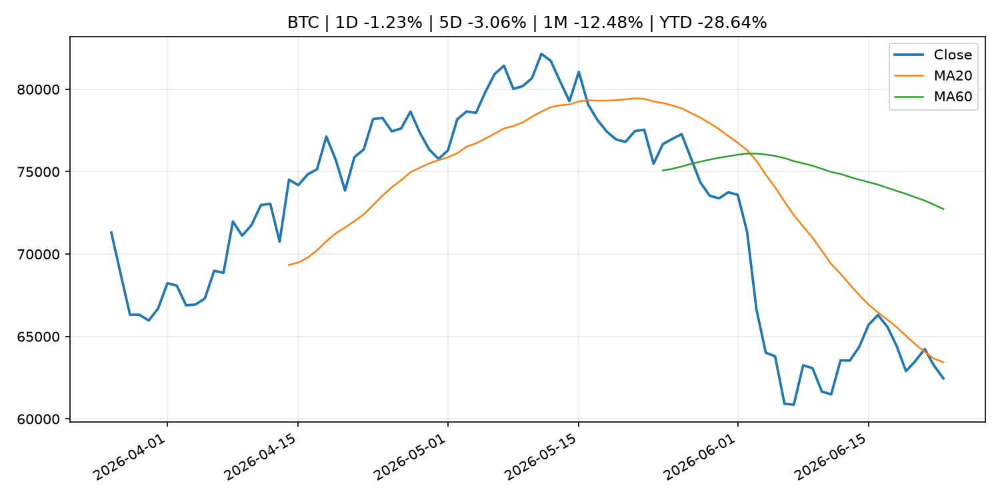
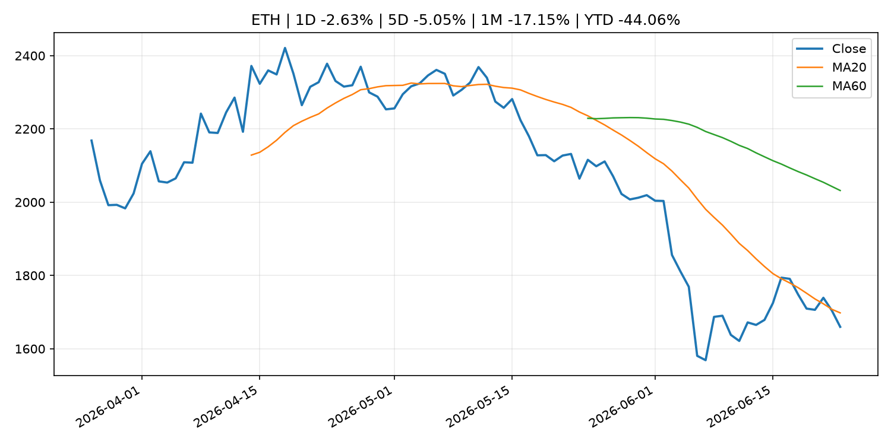
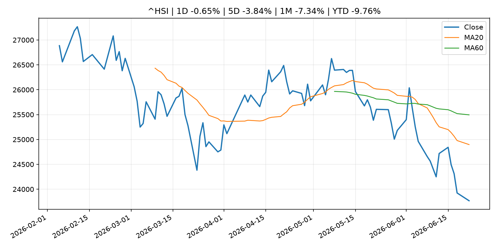

# Global Macro Morning Briefing - 2026-06-24

> Not financial advice / 非投资建议。

## 0. 今日总览
- 市场状态：dollar_liquidity_tightening。美元走强并压制风险资产，市场可能在交易美元流动性收紧。
- 今日三大主线：
  1. macro_data: Indicators for Core CPI
  2. earnings: Meta is developing a prediction market app called ‘Arena’ as sector booms: NYT
  3. earnings: Can anyone join Musk in the trillionaire club? Zuckerberg has best shot, according to prediction markets
- 一句话结论：今日晨报重点关注：这类宏观数据会直接改变市场对通胀、增长和政策路径的预期。；大型科技股盈利和资本开支会影响纳指、半导体和 AI 交易主线。。跨资产方面，SPY 1D -1.45%；QQQ 1D -3.29%；^VIX 1D 12.79%；TLT 1D 0.13%；GC=F 1D -1.43%；CL=F 1D -2.50%；BTC 1D -1.23%；ETH 1D -2.63%；美元走强并压制风险资产，市场可能在交易美元流动性收紧。政策、通胀、利率、美元、美债、能源和加密监管仍是主要观察线索。所有结论仅基于公开数据与短摘要整理，不构成投资建议。

## 1. 隔夜跨资产市场
- 美股：SPY 1D -1.45%，QQQ 1D -3.29%，整体趋势需结合 VIX 和利率确认。
- 美债/美元：TLT 1D 0.13%，美元指数 1D 0.37%，是判断折现率压力的核心线索。
- 黄金/原油：黄金 1D -1.43%，原油 1D -2.50%，用于观察避险、通胀和地缘风险。
- 加密：BTC 1D -1.23%，ETH 1D -2.63%，关注是否独立于纳指走出加密自身行情。
- 港股/A股：恒生 1D -0.65%，沪深300/上证 1D n/a，重点看中国政策预期与人民币线索。
- 风险观察：关注离岸美元、亚洲货币和新兴市场资产反应。

### US_EQUITY

| symbol | latest close | 1D | 5D | 1M | YTD | trend |
|---|---:|---:|---:|---:|---:|---|
| SPY | 733.58 | -1.45% | -2.82% | -1.23% | 7.38% | range_bound |
| QQQ | 713.65 | -3.29% | -4.08% | -0.12% | 16.40% | range_bound |
| DIA | 516.62 | -0.09% | -0.35% | 2.69% | 6.82% | uptrend |
| IWM | 295.32 | -0.96% | 0.23% | 4.54% | 18.71% | uptrend |
| VTI | 363.70 | -1.39% | -2.37% | -0.38% | 8.14% | range_bound |

### US_MACRO_MARKET

| symbol | latest close | 1D | 5D | 1M | YTD | trend |
|---|---:|---:|---:|---:|---:|---|
| ^VIX | 19.49 | 12.79% | 20.31% | 16.71% | 34.32% | range_bound |
| DX-Y.NYB | 101.39 | 0.37% | 1.77% | 2.22% | 3.02% | uptrend |
| TLT | 86.20 | 0.13% | 0.56% | 2.35% | -0.95% | range_bound |
| IEF | 94.12 | 0.13% | -0.17% | 0.34% | -2.04% | downtrend |

### COMMODITIES

| symbol | latest close | 1D | 5D | 1M | YTD | trend |
|---|---:|---:|---:|---:|---:|---|
| GC=F | 4,122.10 | -1.43% | -4.76% | -9.20% | -4.46% | strong_downtrend |
| SI=F | 61.57 | -6.04% | -12.13% | -19.43% | -12.74% | strong_downtrend |
| CL=F | 72.95 | -2.50% | -9.66% | -24.29% | 27.27% | strong_downtrend |
| BZ=F | 76.78 | -1.44% | -7.68% | -25.15% | 26.39% | strong_downtrend |
| NG=F | 3.19 | -1.78% | 1.53% | 5.86% | -11.69% | uptrend |
| HG=F | 6.13 | -3.60% | -5.48% | -2.07% | 8.64% | range_bound |

### HK_MARKET

| symbol | latest close | 1D | 5D | 1M | YTD | trend |
|---|---:|---:|---:|---:|---:|---|
| ^HSI | 23,768.52 | -0.65% | -3.84% | -7.34% | -9.76% | strong_downtrend |
| 0700.HK | 414.80 | -4.20% | -9.75% | -5.51% | -33.42% | strong_downtrend |
| 9988.HK | 98.95 | -3.84% | -9.47% | -21.47% | -33.59% | strong_downtrend |
| 3690.HK | 69.60 | -3.33% | -11.05% | -15.23% | -33.46% | strong_downtrend |
| 1810.HK | 22.62 | -4.64% | -13.86% | -23.74% | -43.84% | strong_downtrend |
| 1211.HK | 75.85 | -3.19% | -11.39% | -16.23% | -23.19% | strong_downtrend |

### CRYPTO

| symbol | latest close | 1D | 5D | 1M | YTD | trend |
|---|---:|---:|---:|---:|---:|---|
| BTC | 62,454.27 | -1.23% | -3.06% | -12.48% | -28.64% | downtrend |
| ETH | 1,659.76 | -2.63% | -5.05% | -17.15% | -44.06% | downtrend |
| SOLANA | 69.38 | -4.24% | -3.61% | -14.49% | -44.28% | range_bound |
| BINANCECOIN | 576.26 | -1.27% | -4.11% | -16.78% | -33.24% | strong_downtrend |
| RIPPLE | 1.11 | -1.66% | -6.73% | -14.59% | -39.88% | strong_downtrend |

## 2. 今日最重要的 10 条新闻
### 1. Indicators for Core CPI
- 来源：Bank of Japan Announcements
- 时间：2026-06-23T14:00:00+09:00
- 地区：Japan
- 事件类型：macro_data
- 重要性层级：Tier 1
- 一句话摘要：Indicators for Core CPI
- 为什么重要：这类宏观数据会直接改变市场对通胀、增长和政策路径的预期。
- 可能影响：主要影响 DXY，方向为 positive，强度 high；通胀压力可能推高政策利率预期并支撑美元。
  - 资产：DXY
    方向：positive
    强度：high
    原因：通胀压力可能推高政策利率预期并支撑美元。
  - 资产：TLT
    方向：negative
    强度：high
    原因：通胀上行通常推升收益率、压低长债价格。
  - 资产：QQQ
    方向：negative
    强度：high
    原因：更高利率对成长股估值折现率不利。
  - 资产：SPY
    方向：mixed
    强度：medium
    原因：名义增长可能支撑收入，但更高利率压制估值。
  - 资产：GC=F
    方向：mixed
    强度：medium
    原因：通胀对黄金是支撑，但实际利率上行会形成压力。
  - 资产：BTC
    方向：mixed
    强度：medium
    原因：抗通胀叙事和流动性收紧可能相互抵消。
- 原文链接：[http://www.boj.or.jp/en/research/research_data/cpi/index.htm](http://www.boj.or.jp/en/research/research_data/cpi/index.htm)

### 2. Meta is developing a prediction market app called ‘Arena’ as sector booms: NYT
- 来源：CoinDesk
- 时间：2026-06-23T17:54:32+00:00
- 地区：global
- 事件类型：earnings
- 重要性层级：Tier 2
- 一句话摘要：Meta is developing a prediction market app called ‘Arena’ as sector booms: NYT
- 为什么重要：大型科技股盈利和资本开支会影响纳指、半导体和 AI 交易主线。
- 可能影响：主要影响 QQQ，方向为 mixed，强度 high；AI 资本开支会影响大型科技股盈利和估值预期。
  - 资产：QQQ
    方向：mixed
    强度：high
    原因：AI 资本开支会影响大型科技股盈利和估值预期。
  - 资产：SMH
    方向：mixed
    强度：high
    原因：AI 投资周期直接影响半导体需求。
  - 资产：NVDA
    方向：mixed
    强度：high
    原因：AI 训练和推理需求是英伟达收入预期核心变量。
  - 资产：MSFT
    方向：mixed
    强度：medium
    原因：云和 AI 资本开支影响利润率与增长叙事。
  - 资产：GOOGL
    方向：mixed
    强度：medium
    原因：AI 投资和搜索商业化影响估值。
  - 资产：META
    方向：mixed
    强度：medium
    原因：AI 基建支出与广告效率共同影响市场预期。
- 原文链接：[https://www.coindesk.com/markets/2026/06/23/meta-is-developing-a-prediction-market-app-called-arena-as-sector-booms-nyt](https://www.coindesk.com/markets/2026/06/23/meta-is-developing-a-prediction-market-app-called-arena-as-sector-booms-nyt)

### 3. Can anyone join Musk in the trillionaire club? Zuckerberg has best shot, according to prediction markets
- 来源：CNBC Economy
- 时间：2026-06-22T16:45:37+00:00
- 地区：US
- 事件类型：earnings
- 重要性层级：Tier 2
- 一句话摘要：The Meta CEO is seen as next to join the Tesla and SpaceX CEO. Nvidia CEO Jensen Huang is seen as the second-most-likely.
- 为什么重要：大型科技股盈利和资本开支会影响纳指、半导体和 AI 交易主线。
- 可能影响：主要影响 QQQ，方向为 mixed，强度 high；AI 资本开支会影响大型科技股盈利和估值预期。
  - 资产：QQQ
    方向：mixed
    强度：high
    原因：AI 资本开支会影响大型科技股盈利和估值预期。
  - 资产：SMH
    方向：mixed
    强度：high
    原因：AI 投资周期直接影响半导体需求。
  - 资产：NVDA
    方向：mixed
    强度：high
    原因：AI 训练和推理需求是英伟达收入预期核心变量。
  - 资产：MSFT
    方向：mixed
    强度：medium
    原因：云和 AI 资本开支影响利润率与增长叙事。
  - 资产：GOOGL
    方向：mixed
    强度：medium
    原因：AI 投资和搜索商业化影响估值。
  - 资产：META
    方向：mixed
    强度：medium
    原因：AI 基建支出与广告效率共同影响市场预期。
- 原文链接：[https://www.cnbc.com/2026/06/22/zuckerberg-seen-as-next-to-join-trillionaire-club-say-kalshi-traders.html](https://www.cnbc.com/2026/06/22/zuckerberg-seen-as-next-to-join-trillionaire-club-say-kalshi-traders.html)

### 4. The SEC delayed tokenizing stocks, and here’s why that’s a relief
- 来源：CoinDesk
- 时间：2026-06-23T14:01:44+00:00
- 地区：global
- 事件类型：regulation
- 重要性层级：Tier 2
- 一句话摘要：The SEC delayed tokenizing stocks, and here’s why that’s a relief
- 为什么重要：监管变化会改变行业盈利预期和资产风险溢价。
- 可能影响：主要影响 BTC，方向为 mixed，强度 high；加密监管或 ETF 进展会改变 BTC 的资金流和风险溢价。
  - 资产：BTC
    方向：mixed
    强度：high
    原因：加密监管或 ETF 进展会改变 BTC 的资金流和风险溢价。
  - 资产：ETH
    方向：mixed
    强度：high
    原因：监管框架会影响 ETH 产品化和机构参与度。
  - 资产：COIN
    方向：mixed
    强度：medium
    原因：监管清晰度和执法风险会影响交易平台估值。
  - 资产：crypto market
    方向：mixed
    强度：high
    原因：信息影响整个加密市场结构，但方向取决于细节。
- 原文链接：[https://www.coindesk.com/opinion/2026/06/23/the-sec-delayed-tokenizing-stocks-and-here-s-why-that-s-a-relief](https://www.coindesk.com/opinion/2026/06/23/the-sec-delayed-tokenizing-stocks-and-here-s-why-that-s-a-relief)

### 5. Former Robinhood Crypto COO Tanya Denisova joins stablecoin issuer Agora as head of operations
- 来源：CoinDesk
- 时间：2026-06-23T13:00:00+00:00
- 地区：global
- 事件类型：crypto_market_structure
- 重要性层级：Tier 2
- 一句话摘要：Former Robinhood Crypto COO Tanya Denisova joins stablecoin issuer Agora as head of operations
- 为什么重要：加密市场结构和监管变化会影响 BTC、ETH 及相关股票的风险溢价。
- 可能影响：主要影响 BTC，方向为 mixed，强度 high；加密监管或 ETF 进展会改变 BTC 的资金流和风险溢价。
  - 资产：BTC
    方向：mixed
    强度：high
    原因：加密监管或 ETF 进展会改变 BTC 的资金流和风险溢价。
  - 资产：ETH
    方向：mixed
    强度：high
    原因：监管框架会影响 ETH 产品化和机构参与度。
  - 资产：COIN
    方向：mixed
    强度：medium
    原因：监管清晰度和执法风险会影响交易平台估值。
  - 资产：crypto market
    方向：mixed
    强度：high
    原因：信息影响整个加密市场结构，但方向取决于细节。
- 原文链接：[https://www.coindesk.com/business/2026/06/23/former-robinhood-crypto-coo-tanya-denisova-joins-stablecoin-issuer-agora-as-head-of-operations](https://www.coindesk.com/business/2026/06/23/former-robinhood-crypto-coo-tanya-denisova-joins-stablecoin-issuer-agora-as-head-of-operations)

### 6. AI chipmaker Cerebras down 11% after first public earnings report
- 来源：CoinDesk
- 时间：2026-06-23T22:58:44+00:00
- 地区：global
- 事件类型：earnings
- 重要性层级：Tier 2
- 一句话摘要：AI chipmaker Cerebras down 11% after first public earnings report
- 为什么重要：大型科技股盈利和资本开支会影响纳指、半导体和 AI 交易主线。
- 可能影响：可能影响利率、汇率、风险资产或大宗商品预期，但当前公开信息不足以判断明确方向。
  - 资产：暂无明确资产映射
  - 方向：unknown
  - 强度：low
  - 原因：公开信息不足以判断方向。
- 原文链接：[https://www.coindesk.com/markets/2026/06/23/ai-chipmaker-cerebras-down-11-after-first-public-earnings-report](https://www.coindesk.com/markets/2026/06/23/ai-chipmaker-cerebras-down-11-after-first-public-earnings-report)

### 7. Cerebras delivers its first earnings report — but it’s not enough to lift the stock
- 来源：MarketWatch Top Stories
- 时间：2026-06-23T21:43:00+00:00
- 地区：US
- 事件类型：earnings
- 重要性层级：Tier 2
- 一句话摘要：Despite upbeat revenue figures, Cerebras’s stock was falling in after-hours trading.
- 为什么重要：大型科技股盈利和资本开支会影响纳指、半导体和 AI 交易主线。
- 可能影响：可能影响利率、汇率、风险资产或大宗商品预期，但当前公开信息不足以判断明确方向。
  - 资产：暂无明确资产映射
  - 方向：unknown
  - 强度：low
  - 原因：公开信息不足以判断方向。
- 原文链接：[https://www.marketwatch.com/story/cerebras-delivers-its-first-earnings-report-but-its-not-enough-to-lift-the-stock-8e80cb6d?mod=mw_rss_topstories](https://www.marketwatch.com/story/cerebras-delivers-its-first-earnings-report-but-its-not-enough-to-lift-the-stock-8e80cb6d?mod=mw_rss_topstories)

### 8. Philip R. Lane: Introductory remarks
- 来源：ECB Press Releases
- 时间：2026-06-23T02:00:00+02:00
- 地区：EU
- 事件类型：central_bank_speech
- 重要性层级：Tier 2
- 一句话摘要：Philip R. Lane: Introductory remarks
- 为什么重要：央行官员表态可能影响市场对下一次会议的定价。
- 可能影响：可能影响利率、汇率、风险资产或大宗商品预期，但当前公开信息不足以判断明确方向。
  - 资产：暂无明确资产映射
  - 方向：unknown
  - 强度：low
  - 原因：公开信息不足以判断方向。
- 原文链接：[https://www.ecb.europa.eu//press/key/date/2026/html/ecb.sp260623~c112a749e2.en.html](https://www.ecb.europa.eu//press/key/date/2026/html/ecb.sp260623~c112a749e2.en.html)

### 9. Bitcoin's recent drop below $60,000 signals Fed, ETF and AI pressures: Deutsche Bank
- 来源：CoinDesk
- 时间：2026-06-23T14:54:17+00:00
- 地区：global
- 事件类型：other
- 重要性层级：Tier 3
- 一句话摘要：Bitcoin's recent drop below $60,000 signals Fed, ETF and AI pressures: Deutsche Bank
- 为什么重要：这条信息暂未匹配到重大宏观、政策或市场事件，更适合作为背景跟踪。
- 可能影响：主要影响 BTC，方向为 mixed，强度 high；加密监管或 ETF 进展会改变 BTC 的资金流和风险溢价。
  - 资产：BTC
    方向：mixed
    强度：high
    原因：加密监管或 ETF 进展会改变 BTC 的资金流和风险溢价。
  - 资产：ETH
    方向：mixed
    强度：high
    原因：监管框架会影响 ETH 产品化和机构参与度。
  - 资产：COIN
    方向：mixed
    强度：medium
    原因：监管清晰度和执法风险会影响交易平台估值。
  - 资产：crypto market
    方向：mixed
    强度：high
    原因：信息影响整个加密市场结构，但方向取决于细节。
- 原文链接：[https://www.coindesk.com/markets/2026/06/23/bitcoin-s-recent-drop-below-usd60-000-signals-fed-etf-and-ai-pressures-deutsche-bank](https://www.coindesk.com/markets/2026/06/23/bitcoin-s-recent-drop-below-usd60-000-signals-fed-etf-and-ai-pressures-deutsche-bank)

### 10. ‘We own our home outright’: I am 67 and earn $100,000. Do I take my $30,000-a-year Social Security now or wait?
- 来源：MarketWatch Top Stories
- 时间：2026-06-23T22:10:00+00:00
- 地区：US
- 事件类型：other
- 重要性层级：Tier 3
- 一句话摘要：“We have combined savings of $950,000 in retirement plans, Roth IRAs and Treasuries.”
- 为什么重要：这条信息暂未匹配到重大宏观、政策或市场事件，更适合作为背景跟踪。
- 可能影响：更偏背景信息，短期市场影响可能有限。
  - 资产：暂无明确资产映射
  - 方向：unknown
  - 强度：low
  - 原因：公开信息不足以判断方向。
- 原文链接：[https://www.marketwatch.com/story/we-own-our-home-outright-i-am-67-and-earn-100-000-do-i-take-my-30-000-social-security-now-or-wait-bbe1e123?mod=mw_rss_topstories](https://www.marketwatch.com/story/we-own-our-home-outright-i-am-67-and-earn-100-000-do-i-take-my-30-000-social-security-now-or-wait-bbe1e123?mod=mw_rss_topstories)

## 3. 政策与央行观察
### 1. The SEC delayed tokenizing stocks, and here’s why that’s a relief
- 来源：CoinDesk
- 时间：2026-06-23T14:01:44+00:00
- 地区：global
- 事件类型：regulation
- 重要性层级：Tier 2
- 一句话摘要：The SEC delayed tokenizing stocks, and here’s why that’s a relief
- 为什么重要：监管变化会改变行业盈利预期和资产风险溢价。
- 可能影响：主要影响 BTC，方向为 mixed，强度 high；加密监管或 ETF 进展会改变 BTC 的资金流和风险溢价。
  - 资产：BTC
    方向：mixed
    强度：high
    原因：加密监管或 ETF 进展会改变 BTC 的资金流和风险溢价。
  - 资产：ETH
    方向：mixed
    强度：high
    原因：监管框架会影响 ETH 产品化和机构参与度。
  - 资产：COIN
    方向：mixed
    强度：medium
    原因：监管清晰度和执法风险会影响交易平台估值。
  - 资产：crypto market
    方向：mixed
    强度：high
    原因：信息影响整个加密市场结构，但方向取决于细节。
- 原文链接：[https://www.coindesk.com/opinion/2026/06/23/the-sec-delayed-tokenizing-stocks-and-here-s-why-that-s-a-relief](https://www.coindesk.com/opinion/2026/06/23/the-sec-delayed-tokenizing-stocks-and-here-s-why-that-s-a-relief)

### 2. Former Robinhood Crypto COO Tanya Denisova joins stablecoin issuer Agora as head of operations
- 来源：CoinDesk
- 时间：2026-06-23T13:00:00+00:00
- 地区：global
- 事件类型：crypto_market_structure
- 重要性层级：Tier 2
- 一句话摘要：Former Robinhood Crypto COO Tanya Denisova joins stablecoin issuer Agora as head of operations
- 为什么重要：加密市场结构和监管变化会影响 BTC、ETH 及相关股票的风险溢价。
- 可能影响：主要影响 BTC，方向为 mixed，强度 high；加密监管或 ETF 进展会改变 BTC 的资金流和风险溢价。
  - 资产：BTC
    方向：mixed
    强度：high
    原因：加密监管或 ETF 进展会改变 BTC 的资金流和风险溢价。
  - 资产：ETH
    方向：mixed
    强度：high
    原因：监管框架会影响 ETH 产品化和机构参与度。
  - 资产：COIN
    方向：mixed
    强度：medium
    原因：监管清晰度和执法风险会影响交易平台估值。
  - 资产：crypto market
    方向：mixed
    强度：high
    原因：信息影响整个加密市场结构，但方向取决于细节。
- 原文链接：[https://www.coindesk.com/business/2026/06/23/former-robinhood-crypto-coo-tanya-denisova-joins-stablecoin-issuer-agora-as-head-of-operations](https://www.coindesk.com/business/2026/06/23/former-robinhood-crypto-coo-tanya-denisova-joins-stablecoin-issuer-agora-as-head-of-operations)

### 3. Philip R. Lane: Introductory remarks
- 来源：ECB Press Releases
- 时间：2026-06-23T02:00:00+02:00
- 地区：EU
- 事件类型：central_bank_speech
- 重要性层级：Tier 2
- 一句话摘要：Philip R. Lane: Introductory remarks
- 为什么重要：央行官员表态可能影响市场对下一次会议的定价。
- 可能影响：可能影响利率、汇率、风险资产或大宗商品预期，但当前公开信息不足以判断明确方向。
  - 资产：暂无明确资产映射
  - 方向：unknown
  - 强度：low
  - 原因：公开信息不足以判断方向。
- 原文链接：[https://www.ecb.europa.eu//press/key/date/2026/html/ecb.sp260623~c112a749e2.en.html](https://www.ecb.europa.eu//press/key/date/2026/html/ecb.sp260623~c112a749e2.en.html)

## 4. 市场异动与图表
- SPY 下跌 -1.45%
- QQQ 下跌 -3.29%
- VIX 上涨 12.79%
- DXY 上涨 0.37%
- Gold 下跌 -1.43%
- Oil 下跌 -2.50%
- ETH 下跌 -2.63%

### SPY

### QQQ

### ^VIX

### TLT

### GC=F

### CL=F

### BTC

### ETH

### ^HSI

## 5. 华尔街与机构公开观点
- 暂无可靠公开观点。

## 6. 今日重点关注
- 经济数据：经济数据：暂无可靠公开日历数据；如配置经济日历源后可自动填充。
- 央行讲话：央行讲话：暂无可靠公开日历数据；重点跟踪 Fed、ECB、BoJ、PBOC 官网 RSS。
- 财报：财报：暂无可靠数据。
- 政策事件：政策事件：暂无可靠数据。
- 风险提醒：风险提醒：关注数据源失败项、突发地缘风险、利率和美元的二阶反应。

## 7. 英文金融表达与宏观概念
- **inflation expectations**：通胀预期，指家庭、企业或市场对未来通胀的预估。 例句：Inflation expectations can shape wage bargaining and bond yields.
- **market structure**：市场结构，指交易、托管、清算、ETF、监管等制度安排。 例句：Crypto market structure rules can affect institutional participation.
- **AI capex**：AI 资本开支，指云厂商和科技公司投入 AI 基建的支出。 例句：AI capex guidance can move semiconductor stocks.
- **real yield**：实际收益率，名义利率扣除通胀预期后的收益率。 例句：Gold often reacts more to real yields than nominal yields.
- **terminal rate**：终端利率，市场预期本轮加息周期的最高政策利率。 例句：A higher terminal rate can pressure growth stocks.
- **soft landing**：软着陆，指通胀回落而经济避免明显衰退。 例句：Markets often rally when data support a soft landing.

## 8. 背景材料
- [‘We own our home outright’: I am 67 and earn $100,000. Do I take my $30,000-a-year Social Security now or wait?](https://www.marketwatch.com/story/we-own-our-home-outright-i-am-67-and-earn-100-000-do-i-take-my-30-000-social-security-now-or-wait-bbe1e123?mod=mw_rss_topstories)（MarketWatch Top Stories，other）：“We have combined savings of $950,000 in retirement plans, Roth IRAs and Treasuries.”
- [Alphabet’s stock is set to join the Dow. Here’s which company is getting the boot.](https://www.marketwatch.com/story/alphabets-stock-is-set-to-join-the-dow-heres-which-company-is-getting-the-boot-73453ca7?mod=mw_rss_topstories)（MarketWatch Top Stories，other）：Dow Industrial’s index provider hails Alphabet as ‘more representative’ of communications sector.
- [SpaceX stock’s wild price swings since its IPO show how risky leveraged ETFs can be](https://www.marketwatch.com/story/spacex-stocks-wild-price-swings-since-its-ipo-show-how-risky-leveraged-etfs-can-be-17edf612?mod=mw_rss_topstories)（MarketWatch Top Stories，other）：The excitement around SpaceX shares has quickly faded after they soared in their market debut this month — providing a crushing reminder of just how risky it is to make leveraged bets on single stocks via the exchange-traded-fund market.
- [Bitcoin's recent drop below $60,000 signals Fed, ETF and AI pressures: Deutsche Bank](https://www.coindesk.com/markets/2026/06/23/bitcoin-s-recent-drop-below-usd60-000-signals-fed-etf-and-ai-pressures-deutsche-bank)（CoinDesk，other）：Bitcoin's recent drop below $60,000 signals Fed, ETF and AI pressures: Deutsche Bank
- [Boris Vujčić: Outlook for the euro area economy and monetary policy](https://www.ecb.europa.eu//press/key/date/2026/html/ecb.sp260623_1~e421434341.en.pdf)（ECB Press Releases，other）：Boris Vujčić: Outlook for the euro area economy and monetary policy
- [Bitcoin may need to plunge 15% or more to mark bottom, according to this long-time indicator](https://www.coindesk.com/markets/2026/06/23/bitcoin-may-need-to-plunge-15-or-more-to-mark-bottom-according-to-this-long-time-indicator)（CoinDesk，other）：Bitcoin may need to plunge 15% or more to mark bottom, according to this long-time indicator
- [Bitcoin volatility looks cheap as $10 billion options settlement nears](https://www.coindesk.com/daybook-us/2026/06/23/bitcoin-volatility-looks-cheap-as-usd10-billion-options-settlement-nears)（CoinDesk，other）：Bitcoin volatility looks cheap as $10 billion options settlement nears
- [Hut 8 to pay $2.35 million to settle investor suit over U.S. Bitcoin merger](https://www.coindesk.com/markets/2026/06/23/hut-8-to-pay-usd2-35-million-to-settle-investor-suit-over-u-s-bitcoin-merger)（CoinDesk，other）：Hut 8 to pay $2.35 million to settle investor suit over U.S. Bitcoin merger
- [Bitcoin price has limited downside, likely near bottom, contrarian indicator suggests](https://www.coindesk.com/markets/2026/06/23/bitcoin-price-has-limited-downside-likely-near-bottom-contrarian-indicator-suggests)（CoinDesk，other）：Bitcoin price has limited downside, likely near bottom, contrarian indicator suggests
- [Japanese Government Bonds Held by the Bank of Japan](http://www.boj.or.jp/en/statistics/boj/other/mei/release/2026/mei260619.xlsx)（Bank of Japan Announcements，other）：Japanese Government Bonds Held by the Bank of Japan
- [Live updates: Saylor's Strategy sinks to new 52-week low as bitcoin drops to $62,000](https://www.coindesk.com/markets/2026/06/23/live-updates-an-altcoin-season-signal-flashed-but-bitcoin-s-slide-is-what-set-it-off)（CoinDesk，other）：Live updates: Saylor's Strategy sinks to new 52-week low as bitcoin drops to $62,000
- [SpaceX’s $600 billion plunge erased equivalent of nearly half of bitcoin’s market cap in 3 days](https://www.coindesk.com/markets/2026/06/23/spacex-s-usd600-billion-dive-erased-nearly-half-a-bitcoin-market-cap-in-three-days)（CoinDesk，other）：SpaceX’s $600 billion plunge erased equivalent of nearly half of bitcoin’s market cap in 3 days
- [Bitcoin falls under $63,000 as a tech selloff drags risk assets lower](https://www.coindesk.com/markets/2026/06/23/bitcoin-slips-toward-usd63-000-as-a-tech-selloff-drags-risk-assets-lower)（CoinDesk，other）：Bitcoin falls under $63,000 as a tech selloff drags risk assets lower
- [Quantum computing is often seen as a risk to bitcoin. Now Trump wants to develop it.](https://www.coindesk.com/tech/2026/06/23/trump-signs-orders-to-build-a-quantum-computer-and-protect-against-the-one-that-could-break-encryption)（CoinDesk，other）：Quantum computing is often seen as a risk to bitcoin. Now Trump wants to develop it.
- [Bank of Japan Accounts (June 20)](http://www.boj.or.jp/en/statistics/boj/other/acmai/release/2026/ac260620.htm)（Bank of Japan Announcements，routine_announcement）：Bank of Japan Accounts (June 20)
- [Alan Greenspan, former chairman of the Fed, dies at age 100](https://www.cnbc.com/2026/06/22/alan-greenspan-former-chairman-of-the-fed-dies-at-age-100.html)（CNBC Economy，other）：Alan Greenspan presided over the Federal Reserve for 19 years under four presidents and mastered the art of obfuscation known as Fedspeak.
- [Christine Lagarde: Hearing of the Committee on Economic and Monetary Affairs of the European Parliament](https://www.ecb.europa.eu//press/key/date/2026/html/ecb.sp260622~b060a27b78.en.html)（ECB Press Releases，other）：Christine Lagarde: Hearing of the Committee on Economic and Monetary Affairs of the European Parliament
- [Federal Reserve notes with deep sadness the passing of Alan Greenspan](https://www.federalreserve.gov/newsevents/pressreleases/other20260622a.htm)（Federal Reserve Press Releases，other）：Federal Reserve notes with deep sadness the passing of Alan Greenspan
- [Semiannual Report on Currency and Monetary Control (Summary)](http://www.boj.or.jp/en/mopo/diet/d_report/hanki26a.htm)（Bank of Japan Announcements，other）：Semiannual Report on Currency and Monetary Control (Summary)

## 9. 数据源、失败项与免责声明
- 采集时间：2026-06-23T23:08:32
- 数据源：公开 RSS、Yahoo Finance、CoinGecko、AKShare、FRED、SEC data.sec.gov，以及用户自有 inputs/reports 文件。
- 合规说明：不绕过 WSJ、Bloomberg、FT、Reuters 等付费墙；对付费媒体只使用公开 RSS 标题、摘要、链接和发布时间。
- 免责声明：Not financial advice / 非投资建议。本项目仅供个人学习、研究和信息整理，不构成投资建议、交易建议或任何收益承诺。
- 失败或跳过的数据源：
  - crypto data failed coin=dogecoin
  - China market data failed symbol=上证指数: empty dataframe
  - China market data failed symbol=深证成指: empty dataframe
  - China market data failed symbol=创业板指: empty dataframe
  - China market data failed symbol=沪深300: empty dataframe
  - China market data failed symbol=中证500: empty dataframe
  - China market data failed symbol=科创50: empty dataframe
  - FRED_API_KEY not set; skipping FRED macro series
  - SEC failed cik=0000320193
  - SEC failed cik=0000789019
  - SEC failed cik=0001045810
  - SEC failed cik=0001318605
  - SEC failed cik=0001577552
