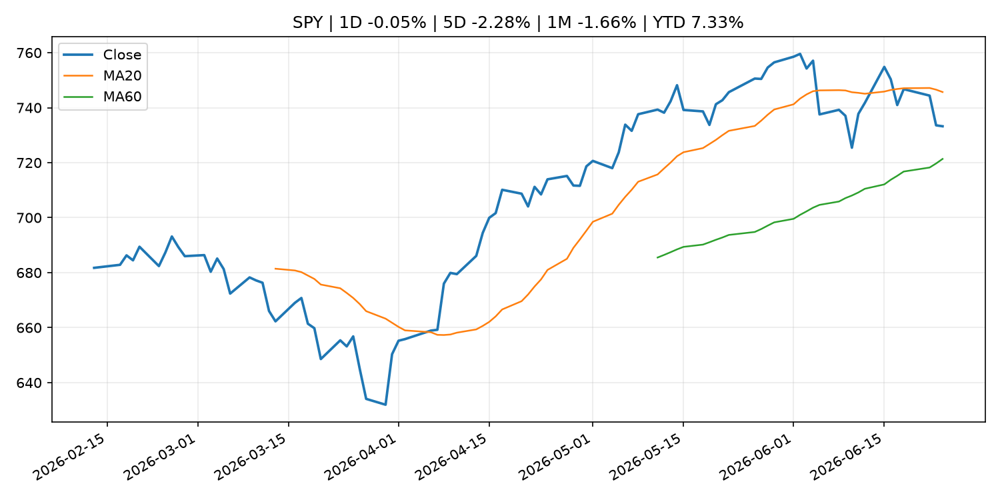
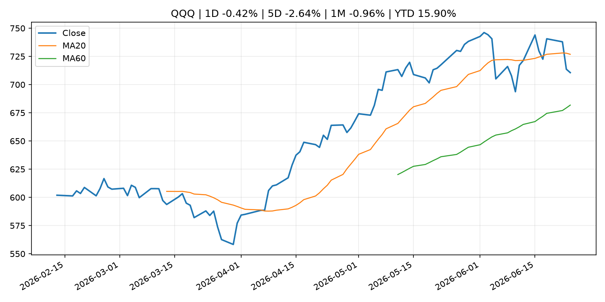
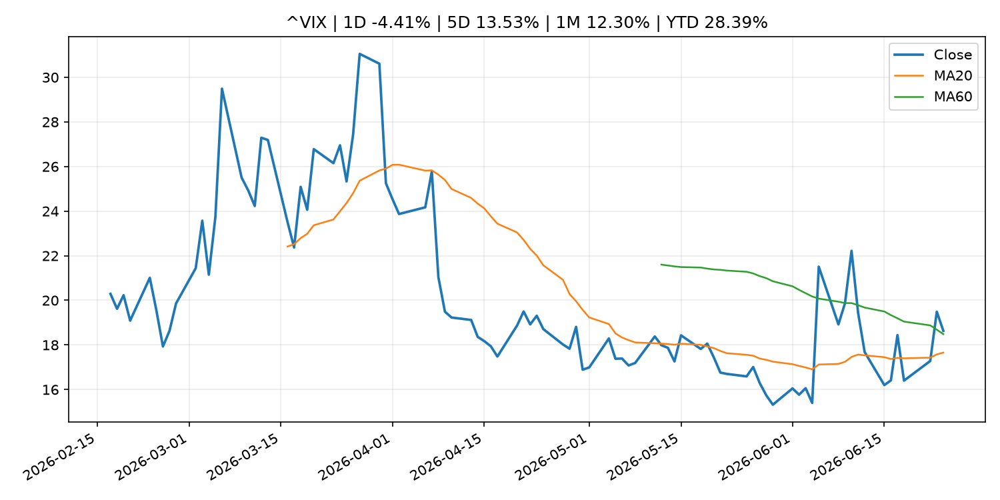
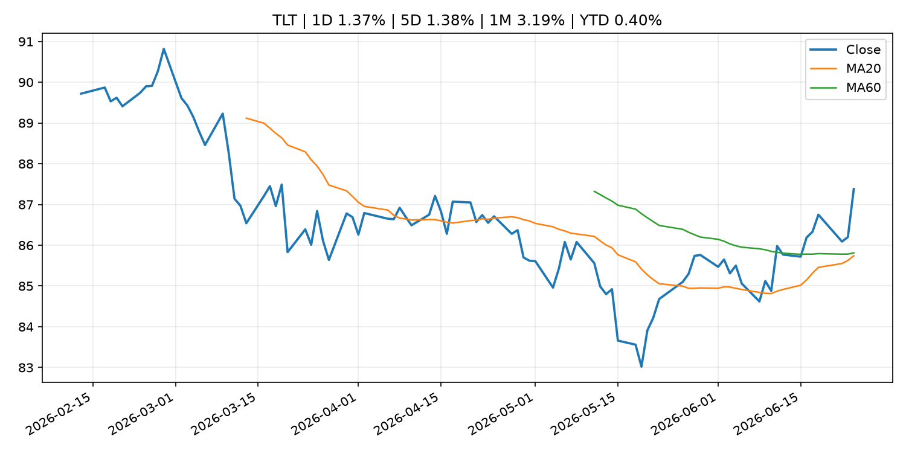
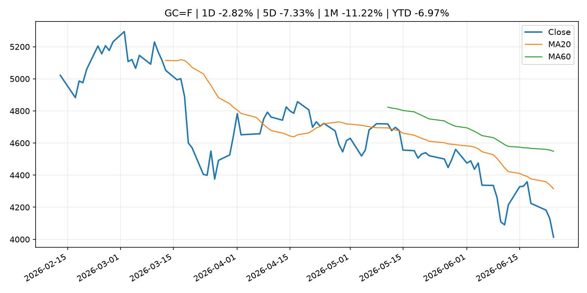
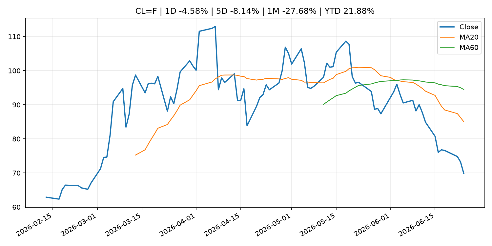
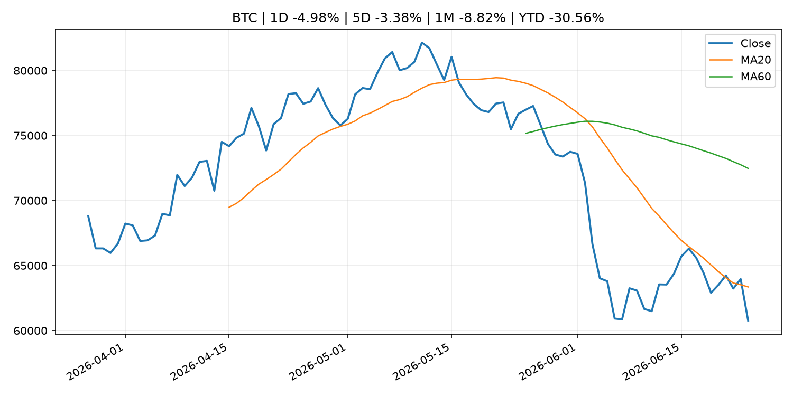
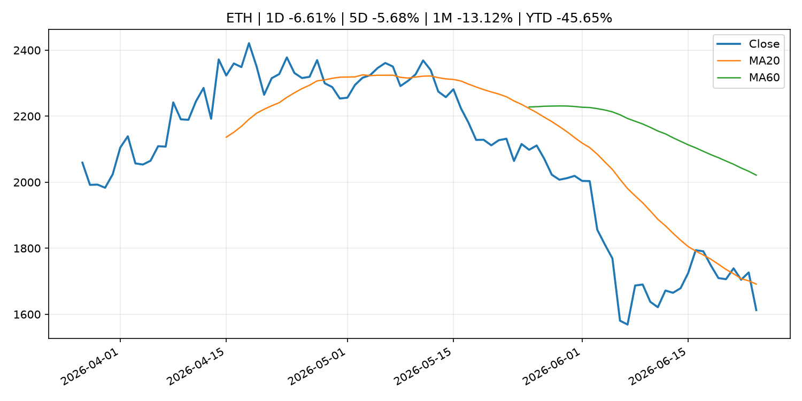
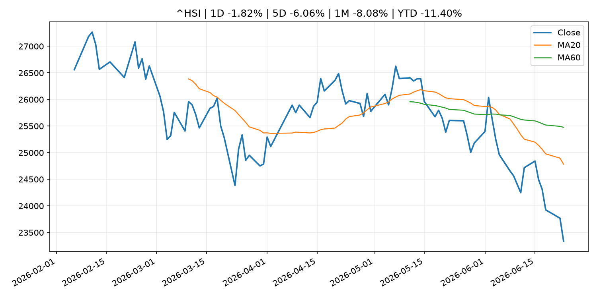

# Global Macro Morning Briefing - 2026-06-25

> Not financial advice / 非投资建议。

## 0. 今日总览
- 市场状态：unknown。市场信号不足，暂不判断明确状态。
- 今日三大主线：
  1. central_bank_decision: Did the Trump White House just give Warsh the green light to hike interest rates? This analyst thinks so.
  2. macro_data: Indicators for Core CPI
  3. financial_stability: Federal Reserve Board's annual bank stress test confirms that large banks are well positioned to weather a severe recession and able to continue to lend to households and businesses
- 一句话结论：今日晨报重点关注：央行决策会重定价利率、汇率、久期资产和风险资产。；这类宏观数据会直接改变市场对通胀、增长和政策路径的预期。。跨资产方面，SPY 1D -0.05%；QQQ 1D -0.42%；^VIX 1D -4.41%；TLT 1D 1.37%；GC=F 1D -2.82%；CL=F 1D -4.58%；BTC 1D -4.98%；ETH 1D -6.61%；市场信号不足，暂不判断明确状态。政策、通胀、利率、美元、美债、能源和加密监管仍是主要观察线索。所有结论仅基于公开数据与短摘要整理，不构成投资建议。

## 1. 隔夜跨资产市场
- 美股：SPY 1D -0.05%，QQQ 1D -0.42%，整体趋势需结合 VIX 和利率确认。
- 美债/美元：TLT 1D 1.37%，美元指数 1D 0.17%，是判断折现率压力的核心线索。
- 黄金/原油：黄金 1D -2.82%，原油 1D -4.58%，用于观察避险、通胀和地缘风险。
- 加密：BTC 1D -4.98%，ETH 1D -6.61%，关注是否独立于纳指走出加密自身行情。
- 港股/A股：恒生 1D -1.82%，沪深300/上证 1D n/a，重点看中国政策预期与人民币线索。
- 风险观察：关注后续数据是否确认当前跨资产信号。

### US_EQUITY

| symbol | latest close | 1D | 5D | 1M | YTD | trend |
|---|---:|---:|---:|---:|---:|---|
| SPY | 733.24 | -0.05% | -2.28% | -1.66% | 7.33% | range_bound |
| QQQ | 710.62 | -0.42% | -2.64% | -0.96% | 15.90% | range_bound |
| DIA | 518.52 | 0.37% | -0.56% | 2.45% | 7.21% | uptrend |
| IWM | 296.69 | 0.46% | 1.58% | 4.06% | 19.26% | strong_uptrend |
| VTI | 363.65 | -0.01% | -1.81% | -0.86% | 8.13% | range_bound |

### US_MACRO_MARKET

| symbol | latest close | 1D | 5D | 1M | YTD | trend |
|---|---:|---:|---:|---:|---:|---|
| ^VIX | 18.63 | -4.41% | 13.53% | 12.30% | 28.39% | range_bound |
| DX-Y.NYB | 101.58 | 0.17% | 2.05% | 2.28% | 3.21% | uptrend |
| TLT | 87.38 | 1.37% | 1.38% | 3.19% | 0.40% | range_bound |
| IEF | 94.73 | 0.65% | 0.22% | 0.91% | -1.41% | range_bound |

### COMMODITIES

| symbol | latest close | 1D | 5D | 1M | YTD | trend |
|---|---:|---:|---:|---:|---:|---|
| GC=F | 4,013.60 | -2.82% | -7.33% | -11.22% | -6.97% | strong_downtrend |
| SI=F | 57.66 | -7.03% | -17.51% | -24.02% | -18.28% | strong_downtrend |
| CL=F | 69.86 | -4.58% | -8.14% | -27.68% | 21.88% | strong_downtrend |
| BZ=F | 73.11 | -5.15% | -7.41% | -29.39% | 20.35% | strong_downtrend |
| NG=F | 3.26 | 3.69% | 0.74% | 12.25% | -9.81% | uptrend |
| HG=F | 5.98 | -2.64% | -7.86% | -5.72% | 6.01% | range_bound |

### HK_MARKET

| symbol | latest close | 1D | 5D | 1M | YTD | trend |
|---|---:|---:|---:|---:|---:|---|
| ^HSI | 23,336.28 | -1.82% | -6.06% | -8.08% | -11.40% | strong_downtrend |
| 0700.HK | 428.80 | 3.38% | -4.16% | -2.85% | -31.17% | downtrend |
| 9988.HK | 99.40 | 0.45% | -7.10% | -21.73% | -33.29% | strong_downtrend |
| 3690.HK | 67.75 | -2.66% | -10.03% | -16.72% | -35.23% | strong_downtrend |
| 1810.HK | 22.96 | 1.50% | -10.52% | -23.47% | -43.00% | strong_downtrend |
| 1211.HK | 75.95 | 0.13% | -9.64% | -17.09% | -23.09% | strong_downtrend |

### CRYPTO

| symbol | latest close | 1D | 5D | 1M | YTD | trend |
|---|---:|---:|---:|---:|---:|---|
| BTC | 60,771.30 | -4.98% | -3.38% | -8.82% | -30.56% | downtrend |
| ETH | 1,612.58 | -6.61% | -5.68% | -13.12% | -45.65% | downtrend |
| SOLANA | 67.73 | -5.71% | -2.74% | -8.43% | -45.60% | downtrend |
| BINANCECOIN | 562.48 | -4.59% | -2.71% | -13.48% | -34.83% | strong_downtrend |
| RIPPLE | 1.07 | -5.21% | -6.59% | -11.48% | -41.84% | strong_downtrend |

## 2. 今日最重要的 10 条新闻
### 1. Did the Trump White House just give Warsh the green light to hike interest rates? This analyst thinks so.
- 来源：MarketWatch Top Stories
- 时间：2026-06-24T21:28:00+00:00
- 地区：US
- 事件类型：central_bank_decision
- 重要性层级：Tier 1
- 一句话摘要：Treasury Secretary Scott Bessent has floated the idea of a single “tap the brakes” rate hike.
- 为什么重要：央行决策会重定价利率、汇率、久期资产和风险资产。
- 可能影响：主要影响 QQQ，方向为 negative，强度 high；鹰派政策提高折现率，压制成长股估值。
  - 资产：QQQ
    方向：negative
    强度：high
    原因：鹰派政策提高折现率，压制成长股估值。
  - 资产：SPY
    方向：negative
    强度：medium
    原因：更紧政策通常削弱风险偏好。
  - 资产：TLT
    方向：negative
    强度：high
    原因：利率上行通常压低长债价格。
  - 资产：DXY
    方向：positive
    强度：high
    原因：更高利率预期通常支撑美元。
  - 资产：BTC
    方向：negative
    强度：high
    原因：流动性收紧通常压制高 beta 加密资产。
- 原文链接：[https://www.marketwatch.com/story/did-the-trump-white-house-just-give-warsh-the-green-light-to-hike-interest-rates-this-analyst-thinks-so-f03b29fd?mod=mw_rss_topstories](https://www.marketwatch.com/story/did-the-trump-white-house-just-give-warsh-the-green-light-to-hike-interest-rates-this-analyst-thinks-so-f03b29fd?mod=mw_rss_topstories)

### 2. Indicators for Core CPI
- 来源：Bank of Japan Announcements
- 时间：2026-06-23T14:00:00+09:00
- 地区：Japan
- 事件类型：macro_data
- 重要性层级：Tier 1
- 一句话摘要：Indicators for Core CPI
- 为什么重要：这类宏观数据会直接改变市场对通胀、增长和政策路径的预期。
- 可能影响：主要影响 DXY，方向为 positive，强度 high；通胀压力可能推高政策利率预期并支撑美元。
  - 资产：DXY
    方向：positive
    强度：high
    原因：通胀压力可能推高政策利率预期并支撑美元。
  - 资产：TLT
    方向：negative
    强度：high
    原因：通胀上行通常推升收益率、压低长债价格。
  - 资产：QQQ
    方向：negative
    强度：high
    原因：更高利率对成长股估值折现率不利。
  - 资产：SPY
    方向：mixed
    强度：medium
    原因：名义增长可能支撑收入，但更高利率压制估值。
  - 资产：GC=F
    方向：mixed
    强度：medium
    原因：通胀对黄金是支撑，但实际利率上行会形成压力。
  - 资产：BTC
    方向：mixed
    强度：medium
    原因：抗通胀叙事和流动性收紧可能相互抵消。
- 原文链接：[http://www.boj.or.jp/en/research/research_data/cpi/index.htm](http://www.boj.or.jp/en/research/research_data/cpi/index.htm)

### 3. Federal Reserve Board's annual bank stress test confirms that large banks are well positioned to weather a severe recession and able to continue to lend to households and businesses
- 来源：Federal Reserve Press Releases
- 时间：2026-06-24T20:00:00+00:00
- 地区：US
- 事件类型：financial_stability
- 重要性层级：Tier 1
- 一句话摘要：Federal Reserve Board's annual bank stress test confirms that large banks are well positioned to weather a severe recession and able to continue to lend to households and businesses
- 为什么重要：金融稳定信号可能放大跨资产波动，并影响央行反应函数。
- 可能影响：可能影响利率、汇率、风险资产或大宗商品预期，但当前公开信息不足以判断明确方向。
  - 资产：暂无明确资产映射
  - 方向：unknown
  - 强度：low
  - 原因：公开信息不足以判断方向。
- 原文链接：[https://www.federalreserve.gov/newsevents/pressreleases/bcreg20260624a.htm](https://www.federalreserve.gov/newsevents/pressreleases/bcreg20260624a.htm)

### 4. YZi Labs ends proxy war with BNB treasury company CEA Industries
- 来源：CoinDesk
- 时间：2026-06-24T10:47:12+00:00
- 地区：global
- 事件类型：geopolitical_risk
- 重要性层级：Tier 1
- 一句话摘要：YZi Labs ends proxy war with BNB treasury company CEA Industries
- 为什么重要：地缘风险可能推升避险需求、能源价格和市场波动率。
- 可能影响：可能影响利率、汇率、风险资产或大宗商品预期，但当前公开信息不足以判断明确方向。
  - 资产：暂无明确资产映射
  - 方向：unknown
  - 强度：low
  - 原因：公开信息不足以判断方向。
- 原文链接：[https://www.coindesk.com/business/2026/06/22/yzi-labs-nears-settlement-in-activist-campaign-at-bnb-treasury-firm-cea-industries](https://www.coindesk.com/business/2026/06/22/yzi-labs-nears-settlement-in-activist-campaign-at-bnb-treasury-firm-cea-industries)

### 5. SEC Appoints Kathleen Hutchinson as Director of Office of International Affairs
- 来源：SEC Press Releases
- 时间：2026-06-24T14:32:00-04:00
- 地区：US
- 事件类型：regulation
- 重要性层级：Tier 2
- 一句话摘要：The Securities and Exchange Commission has appointed Kathleen M. Hutchinson as Director of the agency’s Office of International Affairs (OIA). OIA advises the Commission on international policy matters, coordinates with foreign authorities across the…
- 为什么重要：监管变化会改变行业盈利预期和资产风险溢价。
- 可能影响：主要影响 BTC，方向为 mixed，强度 high；加密监管或 ETF 进展会改变 BTC 的资金流和风险溢价。
  - 资产：BTC
    方向：mixed
    强度：high
    原因：加密监管或 ETF 进展会改变 BTC 的资金流和风险溢价。
  - 资产：ETH
    方向：mixed
    强度：high
    原因：监管框架会影响 ETH 产品化和机构参与度。
  - 资产：COIN
    方向：mixed
    强度：medium
    原因：监管清晰度和执法风险会影响交易平台估值。
  - 资产：crypto market
    方向：mixed
    强度：high
    原因：信息影响整个加密市场结构，但方向取决于细节。
- 原文链接：[https://www.sec.gov/newsroom/press-releases/2026-58-sec-appoints-kathleen-hutchinson-director-office-international-affairs](https://www.sec.gov/newsroom/press-releases/2026-58-sec-appoints-kathleen-hutchinson-director-office-international-affairs)

### 6. Federal Reserve says U.S. banks can withstand $708 billion in losses amid overhaul of capital rules
- 来源：CNBC Economy
- 时间：2026-06-24T21:19:27+00:00
- 地区：US
- 事件类型：regulation
- 重要性层级：Tier 2
- 一句话摘要：The Fed's annual exercise comes at a pivotal moment for bank regulation because, unlike previous years, the results will not affect capital requirements.
- 为什么重要：监管变化会改变行业盈利预期和资产风险溢价。
- 可能影响：可能影响利率、汇率、风险资产或大宗商品预期，但当前公开信息不足以判断明确方向。
  - 资产：暂无明确资产映射
  - 方向：unknown
  - 强度：low
  - 原因：公开信息不足以判断方向。
- 原文链接：[https://www.cnbc.com/2026/06/24/federal-reserve-stress-test-us-banks.html](https://www.cnbc.com/2026/06/24/federal-reserve-stress-test-us-banks.html)

### 7. Live markets: Bitcoin claws back some of the losses after Micron beats earnings
- 来源：CoinDesk
- 时间：2026-06-24T05:13:27+00:00
- 地区：global
- 事件类型：earnings
- 重要性层级：Tier 2
- 一句话摘要：Live markets: Bitcoin claws back some of the losses after Micron beats earnings
- 为什么重要：大型科技股盈利和资本开支会影响纳指、半导体和 AI 交易主线。
- 可能影响：可能影响利率、汇率、风险资产或大宗商品预期，但当前公开信息不足以判断明确方向。
  - 资产：暂无明确资产映射
  - 方向：unknown
  - 强度：low
  - 原因：公开信息不足以判断方向。
- 原文链接：[https://www.coindesk.com/tech/2026/06/24/live-markets-bitcoin-could-drop-to-usd59-000-in-the-short-term-as-liquidaity-dries-up](https://www.coindesk.com/tech/2026/06/24/live-markets-bitcoin-could-drop-to-usd59-000-in-the-short-term-as-liquidaity-dries-up)

### 8. Philip R. Lane: Introductory remarks
- 来源：ECB Press Releases
- 时间：2026-06-23T02:00:00+02:00
- 地区：EU
- 事件类型：central_bank_speech
- 重要性层级：Tier 2
- 一句话摘要：Philip R. Lane: Introductory remarks
- 为什么重要：央行官员表态可能影响市场对下一次会议的定价。
- 可能影响：可能影响利率、汇率、风险资产或大宗商品预期，但当前公开信息不足以判断明确方向。
  - 资产：暂无明确资产映射
  - 方向：unknown
  - 强度：low
  - 原因：公开信息不足以判断方向。
- 原文链接：[https://www.ecb.europa.eu//press/key/date/2026/html/ecb.sp260623~c112a749e2.en.html](https://www.ecb.europa.eu//press/key/date/2026/html/ecb.sp260623~c112a749e2.en.html)

### 9. JPMorgan Chase unveils $50 billion buyback, Goldman Sachs raises dividend after Fed stress test
- 来源：CNBC Economy
- 时间：2026-06-24T21:42:05+00:00
- 地区：US
- 事件类型：other
- 重要性层级：Tier 3
- 一句话摘要：The announcements followed the release of the Federal Reserve's annual stress test, which found that all 32 large banks weathered a hypothetical recession.
- 为什么重要：这条信息暂未匹配到重大宏观、政策或市场事件，更适合作为背景跟踪。
- 可能影响：更偏背景信息，短期市场影响可能有限。
  - 资产：暂无明确资产映射
  - 方向：unknown
  - 强度：low
  - 原因：公开信息不足以判断方向。
- 原文链接：[https://www.cnbc.com/2026/06/24/jpmorgan-goldman-sachs-fed-stress-test.html](https://www.cnbc.com/2026/06/24/jpmorgan-goldman-sachs-fed-stress-test.html)

### 10. A relative offered me a $25,000 home loan secured by a lien that must be repaid within a year. Is that fair?
- 来源：MarketWatch Top Stories
- 时间：2026-06-24T23:01:00+00:00
- 地区：US
- 事件类型：other
- 重要性层级：Tier 3
- 一句话摘要：“He also wants me to downsize and move.”
- 为什么重要：这条信息暂未匹配到重大宏观、政策或市场事件，更适合作为背景跟踪。
- 可能影响：更偏背景信息，短期市场影响可能有限。
  - 资产：暂无明确资产映射
  - 方向：unknown
  - 强度：low
  - 原因：公开信息不足以判断方向。
- 原文链接：[https://www.marketwatch.com/story/im-70-a-relative-offered-me-a-25-000-home-loan-secured-by-a-lien-that-must-be-repaid-within-a-year-should-i-agree-27d44725?mod=mw_rss_topstories](https://www.marketwatch.com/story/im-70-a-relative-offered-me-a-25-000-home-loan-secured-by-a-lien-that-must-be-repaid-within-a-year-should-i-agree-27d44725?mod=mw_rss_topstories)

## 3. 政策与央行观察
### 1. Did the Trump White House just give Warsh the green light to hike interest rates? This analyst thinks so.
- 来源：MarketWatch Top Stories
- 时间：2026-06-24T21:28:00+00:00
- 地区：US
- 事件类型：central_bank_decision
- 重要性层级：Tier 1
- 一句话摘要：Treasury Secretary Scott Bessent has floated the idea of a single “tap the brakes” rate hike.
- 为什么重要：央行决策会重定价利率、汇率、久期资产和风险资产。
- 可能影响：主要影响 QQQ，方向为 negative，强度 high；鹰派政策提高折现率，压制成长股估值。
  - 资产：QQQ
    方向：negative
    强度：high
    原因：鹰派政策提高折现率，压制成长股估值。
  - 资产：SPY
    方向：negative
    强度：medium
    原因：更紧政策通常削弱风险偏好。
  - 资产：TLT
    方向：negative
    强度：high
    原因：利率上行通常压低长债价格。
  - 资产：DXY
    方向：positive
    强度：high
    原因：更高利率预期通常支撑美元。
  - 资产：BTC
    方向：negative
    强度：high
    原因：流动性收紧通常压制高 beta 加密资产。
- 原文链接：[https://www.marketwatch.com/story/did-the-trump-white-house-just-give-warsh-the-green-light-to-hike-interest-rates-this-analyst-thinks-so-f03b29fd?mod=mw_rss_topstories](https://www.marketwatch.com/story/did-the-trump-white-house-just-give-warsh-the-green-light-to-hike-interest-rates-this-analyst-thinks-so-f03b29fd?mod=mw_rss_topstories)

### 2. Federal Reserve Board's annual bank stress test confirms that large banks are well positioned to weather a severe recession and able to continue to lend to households and businesses
- 来源：Federal Reserve Press Releases
- 时间：2026-06-24T20:00:00+00:00
- 地区：US
- 事件类型：financial_stability
- 重要性层级：Tier 1
- 一句话摘要：Federal Reserve Board's annual bank stress test confirms that large banks are well positioned to weather a severe recession and able to continue to lend to households and businesses
- 为什么重要：金融稳定信号可能放大跨资产波动，并影响央行反应函数。
- 可能影响：可能影响利率、汇率、风险资产或大宗商品预期，但当前公开信息不足以判断明确方向。
  - 资产：暂无明确资产映射
  - 方向：unknown
  - 强度：low
  - 原因：公开信息不足以判断方向。
- 原文链接：[https://www.federalreserve.gov/newsevents/pressreleases/bcreg20260624a.htm](https://www.federalreserve.gov/newsevents/pressreleases/bcreg20260624a.htm)

### 3. SEC Appoints Kathleen Hutchinson as Director of Office of International Affairs
- 来源：SEC Press Releases
- 时间：2026-06-24T14:32:00-04:00
- 地区：US
- 事件类型：regulation
- 重要性层级：Tier 2
- 一句话摘要：The Securities and Exchange Commission has appointed Kathleen M. Hutchinson as Director of the agency’s Office of International Affairs (OIA). OIA advises the Commission on international policy matters, coordinates with foreign authorities across the…
- 为什么重要：监管变化会改变行业盈利预期和资产风险溢价。
- 可能影响：主要影响 BTC，方向为 mixed，强度 high；加密监管或 ETF 进展会改变 BTC 的资金流和风险溢价。
  - 资产：BTC
    方向：mixed
    强度：high
    原因：加密监管或 ETF 进展会改变 BTC 的资金流和风险溢价。
  - 资产：ETH
    方向：mixed
    强度：high
    原因：监管框架会影响 ETH 产品化和机构参与度。
  - 资产：COIN
    方向：mixed
    强度：medium
    原因：监管清晰度和执法风险会影响交易平台估值。
  - 资产：crypto market
    方向：mixed
    强度：high
    原因：信息影响整个加密市场结构，但方向取决于细节。
- 原文链接：[https://www.sec.gov/newsroom/press-releases/2026-58-sec-appoints-kathleen-hutchinson-director-office-international-affairs](https://www.sec.gov/newsroom/press-releases/2026-58-sec-appoints-kathleen-hutchinson-director-office-international-affairs)

### 4. Federal Reserve says U.S. banks can withstand $708 billion in losses amid overhaul of capital rules
- 来源：CNBC Economy
- 时间：2026-06-24T21:19:27+00:00
- 地区：US
- 事件类型：regulation
- 重要性层级：Tier 2
- 一句话摘要：The Fed's annual exercise comes at a pivotal moment for bank regulation because, unlike previous years, the results will not affect capital requirements.
- 为什么重要：监管变化会改变行业盈利预期和资产风险溢价。
- 可能影响：可能影响利率、汇率、风险资产或大宗商品预期，但当前公开信息不足以判断明确方向。
  - 资产：暂无明确资产映射
  - 方向：unknown
  - 强度：low
  - 原因：公开信息不足以判断方向。
- 原文链接：[https://www.cnbc.com/2026/06/24/federal-reserve-stress-test-us-banks.html](https://www.cnbc.com/2026/06/24/federal-reserve-stress-test-us-banks.html)

### 5. Philip R. Lane: Introductory remarks
- 来源：ECB Press Releases
- 时间：2026-06-23T02:00:00+02:00
- 地区：EU
- 事件类型：central_bank_speech
- 重要性层级：Tier 2
- 一句话摘要：Philip R. Lane: Introductory remarks
- 为什么重要：央行官员表态可能影响市场对下一次会议的定价。
- 可能影响：可能影响利率、汇率、风险资产或大宗商品预期，但当前公开信息不足以判断明确方向。
  - 资产：暂无明确资产映射
  - 方向：unknown
  - 强度：low
  - 原因：公开信息不足以判断方向。
- 原文链接：[https://www.ecb.europa.eu//press/key/date/2026/html/ecb.sp260623~c112a749e2.en.html](https://www.ecb.europa.eu//press/key/date/2026/html/ecb.sp260623~c112a749e2.en.html)

## 4. 市场异动与图表
- QQQ 下跌 -0.42%
- VIX 下跌 -4.41%
- TLT 上涨 1.37%
- Gold 下跌 -2.82%
- Oil 下跌 -4.58%
- BTC 下跌 -4.98%
- ETH 下跌 -6.61%

### SPY

### QQQ

### ^VIX

### TLT

### GC=F

### CL=F

### BTC

### ETH

### ^HSI

## 5. 华尔街与机构公开观点
- 暂无可靠公开观点。

## 6. 今日重点关注
- 经济数据：经济数据：暂无可靠公开日历数据；如配置经济日历源后可自动填充。
- 央行讲话：央行讲话：暂无可靠公开日历数据；重点跟踪 Fed、ECB、BoJ、PBOC 官网 RSS。
- 财报：财报：暂无可靠数据。
- 政策事件：政策事件：暂无可靠数据。
- 风险提醒：风险提醒：关注数据源失败项、突发地缘风险、利率和美元的二阶反应。

## 7. 英文金融表达与宏观概念
- **inflation expectations**：通胀预期，指家庭、企业或市场对未来通胀的预估。 例句：Inflation expectations can shape wage bargaining and bond yields.
- **real yield**：实际收益率，名义利率扣除通胀预期后的收益率。 例句：Gold often reacts more to real yields than nominal yields.
- **terminal rate**：终端利率，市场预期本轮加息周期的最高政策利率。 例句：A higher terminal rate can pressure growth stocks.
- **risk-off**：避险模式，资金偏向美元、国债、黄金等防御资产。 例句：A geopolitical shock can push markets into risk-off mode.
- **market structure**：市场结构，指交易、托管、清算、ETF、监管等制度安排。 例句：Crypto market structure rules can affect institutional participation.
- **soft landing**：软着陆，指通胀回落而经济避免明显衰退。 例句：Markets often rally when data support a soft landing.

## 8. 背景材料
- [A relative offered me a $25,000 home loan secured by a lien that must be repaid within a year. Is that fair?](https://www.marketwatch.com/story/im-70-a-relative-offered-me-a-25-000-home-loan-secured-by-a-lien-that-must-be-repaid-within-a-year-should-i-agree-27d44725?mod=mw_rss_topstories)（MarketWatch Top Stories，other）：“He also wants me to downsize and move.”
- [JPMorgan Chase unveils $50 billion buyback, Goldman Sachs raises dividend after Fed stress test](https://www.cnbc.com/2026/06/24/jpmorgan-goldman-sachs-fed-stress-test.html)（CNBC Economy，other）：The announcements followed the release of the Federal Reserve's annual stress test, which found that all 32 large banks weathered a hypothetical recession.
- [Bitcoin falls below $60,000 as AI trade continues to draw investor interest and capital](https://www.coindesk.com/markets/2026/06/24/bitcoin-falls-to-usd60-000-as-ai-trade-continues-to-draw-investor-interest-and-capital)（CoinDesk，other）：Bitcoin falls below $60,000 as AI trade continues to draw investor interest and capital
- [SecondFi loses $2.4 million in Cardano wallet exploit](https://www.coindesk.com/business/2026/06/24/secondfi-loses-usd2-4-million-in-cardano-wallet-exploit-with-up-to-usd20-million-at-risk)（CoinDesk，other）：SecondFi loses $2.4 million in Cardano wallet exploit
- [Bitcoin just broke below the floor of its famous Rainbow Chart into the ‘BTC is dead’ zone](https://www.coindesk.com/markets/2026/06/24/bitcoin-just-broke-below-the-floor-of-its-famous-rainbow-chart-into-the-btc-is-dead-zone)（CoinDesk，other）：Bitcoin just broke below the floor of its famous Rainbow Chart into the ‘BTC is dead’ zone
- [The banking lobby is wrong about stablecoins and community banks](https://www.coindesk.com/opinion/2026/06/24/the-banking-lobby-is-wrong-about-stablecoins-and-community-banks)（CoinDesk，other）：The banking lobby is wrong about stablecoins and community banks
- [Gold, silver and bitcoin tumble as 'debasement' trade unwinds](https://www.coindesk.com/markets/2026/06/24/gold-silver-and-bitcoin-tumble-as-debasement-trade-unwinds)（CoinDesk，other）：Gold, silver and bitcoin tumble as 'debasement' trade unwinds
- [Bitcoin could fall to $55,000 before finding a bottom, 10x Research says](https://www.coindesk.com/markets/2026/06/24/bitcoin-could-fall-to-usd55-000-before-finding-a-bottom-10x-research-says)（CoinDesk，other）：Bitcoin could fall to $55,000 before finding a bottom, 10x Research says
- [Bitcoin clings to $62,500 as bears tighten grip on crypto market](https://www.coindesk.com/markets/2026/06/24/bitcoin-clings-to-usd62-500-as-bears-tighten-grip-on-crypto-market)（CoinDesk，other）：Bitcoin clings to $62,500 as bears tighten grip on crypto market
- [ECB reports on progress towards euro adoption](https://www.ecb.europa.eu//press/pr/date/2026/html/ecb.pr260624~ec1dcac037.en.html)（ECB Press Releases，other）：ECB reports on progress towards euro adoption
- [The Runes revival: Bitcoin traffic hits a two-year high as transactions blast past 820,000](https://www.coindesk.com/markets/2026/06/24/the-runes-revival-bitcoin-traffic-hits-a-two-year-high-as-transactions-blast-past-820-000)（CoinDesk，other）：The Runes revival: Bitcoin traffic hits a two-year high as transactions blast past 820,000
- [Michael Saylor should halt Strategy's bitcoin buys, says CryptoQuant](https://www.coindesk.com/markets/2026/06/24/strategy-should-pause-its-bitcoin-buying-and-rebuild-cash-cryptoquant-says)（CoinDesk，other）：Michael Saylor should halt Strategy's bitcoin buys, says CryptoQuant
- [Iceland joins TIPS for instant payments](https://www.ecb.europa.eu//press/pr/date/2026/html/ecb.pr260624_1~ce8e85127f.en.html)（ECB Press Releases，other）：Iceland joins TIPS for instant payments
- [Bitcoin OGs aren't selling as aggressively as they did above $100,000](https://www.coindesk.com/markets/2026/06/24/bitcoin-s-og-investors-have-slowed-selling-in-a-bullish-sign-for-the-market)（CoinDesk，other）：Bitcoin OGs aren't selling as aggressively as they did above $100,000
- [Bitcoin drops toward $62,000 as the chip selloff deepens for a second day](https://www.coindesk.com/markets/2026/06/24/bitcoin-drops-toward-usd62-000-as-the-chip-selloff-deepens-for-a-second-day)（CoinDesk，other）：Bitcoin drops toward $62,000 as the chip selloff deepens for a second day
- [Services Producer Price Index (May)](http://www.boj.or.jp/en/statistics/pi/cspi_release/sppi2605.pdf)（Bank of Japan Announcements，other）：Services Producer Price Index (May)
- [Summary of Opinions at the Monetary Policy Meeting on June 15 and 16, 2026](http://www.boj.or.jp/en/mopo/mpmsche_minu/opinion_2026/opi260616.pdf)（Bank of Japan Announcements，other）：Summary of Opinions at the Monetary Policy Meeting on June 15 and 16, 2026
- [Boris Vujčić: Outlook for the euro area economy and monetary policy](https://www.ecb.europa.eu//press/key/date/2026/html/ecb.sp260623_1~e421434341.en.pdf)（ECB Press Releases，other）：Boris Vujčić: Outlook for the euro area economy and monetary policy
- [Japanese Government Bonds Held by the Bank of Japan](http://www.boj.or.jp/en/statistics/boj/other/mei/release/2026/mei260619.xlsx)（Bank of Japan Announcements，other）：Japanese Government Bonds Held by the Bank of Japan
- [Bank of Japan Accounts (June 20)](http://www.boj.or.jp/en/statistics/boj/other/acmai/release/2026/ac260620.htm)（Bank of Japan Announcements，routine_announcement）：Bank of Japan Accounts (June 20)

## 9. 数据源、失败项与免责声明
- 采集时间：2026-06-24T23:03:41
- 数据源：公开 RSS、Yahoo Finance、CoinGecko、AKShare、FRED、SEC data.sec.gov，以及用户自有 inputs/reports 文件。
- 合规说明：不绕过 WSJ、Bloomberg、FT、Reuters 等付费墙；对付费媒体只使用公开 RSS 标题、摘要、链接和发布时间。
- 免责声明：Not financial advice / 非投资建议。本项目仅供个人学习、研究和信息整理，不构成投资建议、交易建议或任何收益承诺。
- 失败或跳过的数据源：
  - crypto data failed coin=dogecoin
  - China market data failed symbol=上证指数: empty dataframe
  - China market data failed symbol=深证成指: empty dataframe
  - China market data failed symbol=创业板指: empty dataframe
  - China market data failed symbol=沪深300: empty dataframe
  - China market data failed symbol=中证500: empty dataframe
  - China market data failed symbol=科创50: empty dataframe
  - FRED_API_KEY not set; skipping FRED macro series
  - SEC failed cik=0000320193
  - SEC failed cik=0000789019
  - SEC failed cik=0001045810
  - SEC failed cik=0001318605
  - SEC failed cik=0001577552
