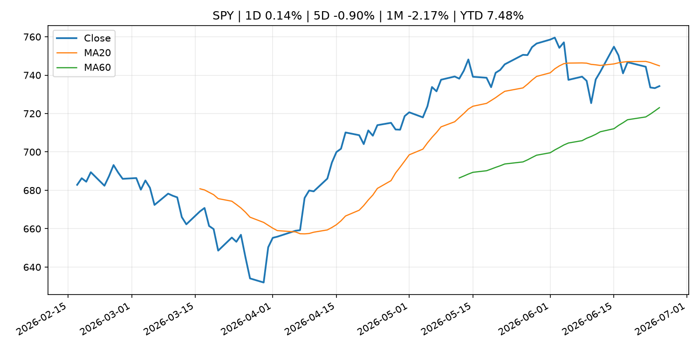
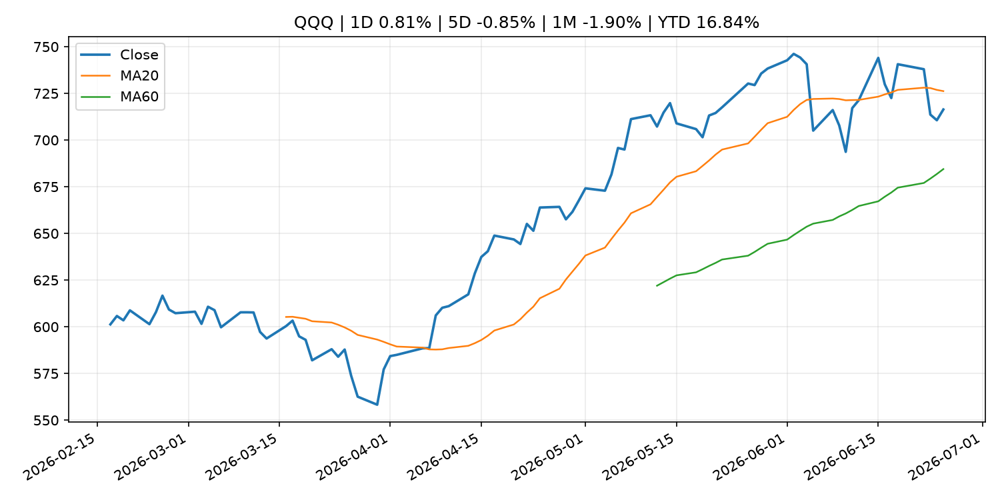
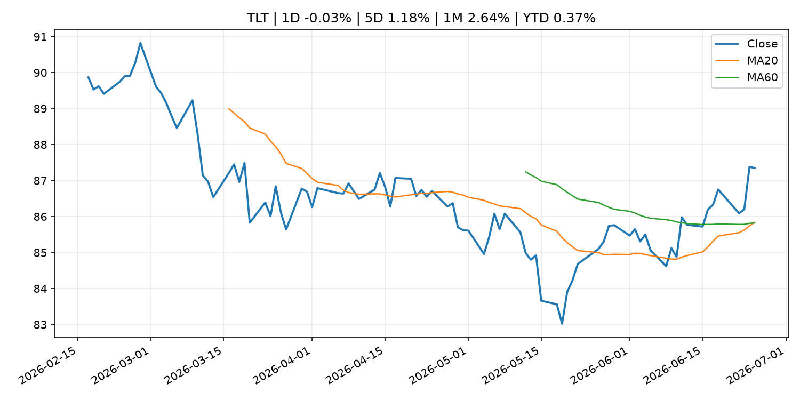
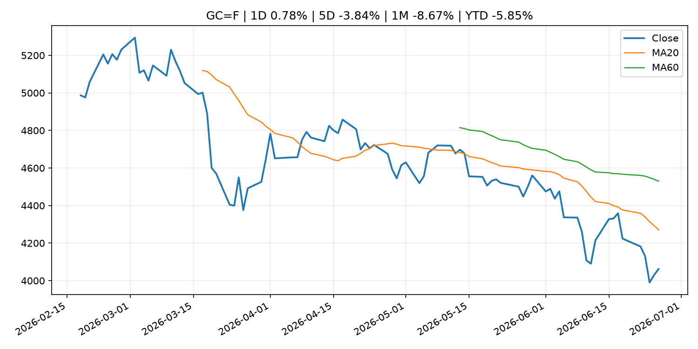
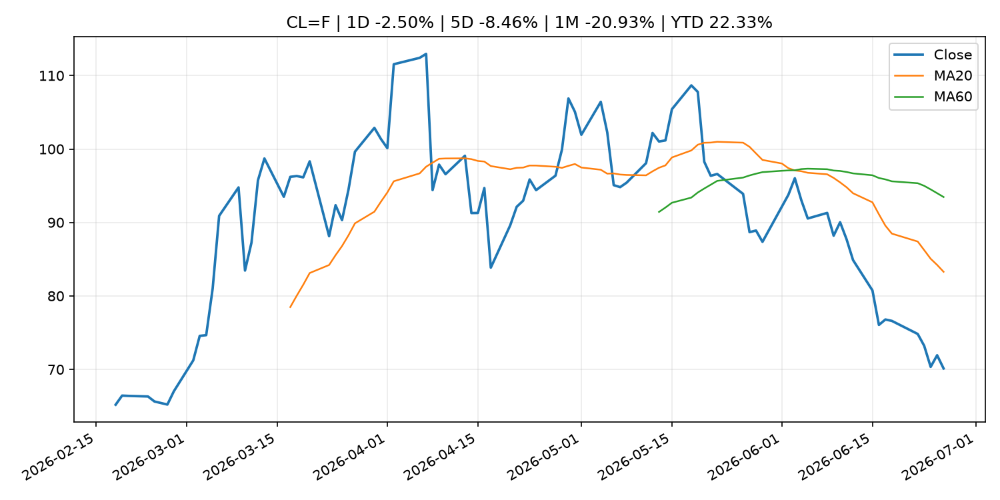
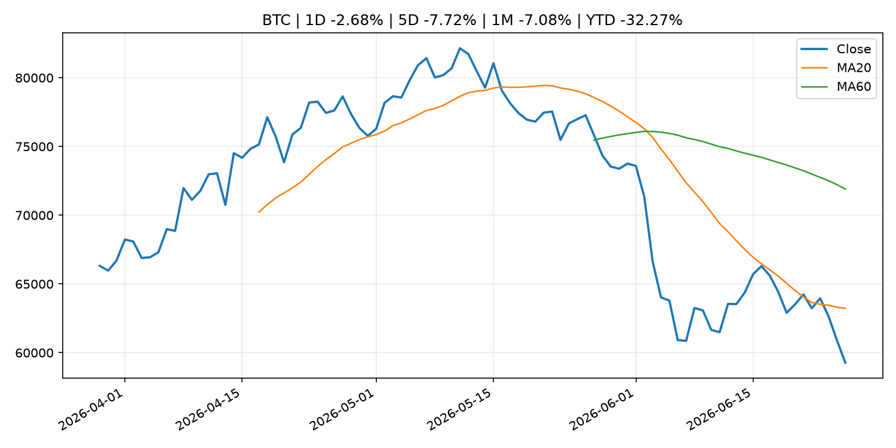
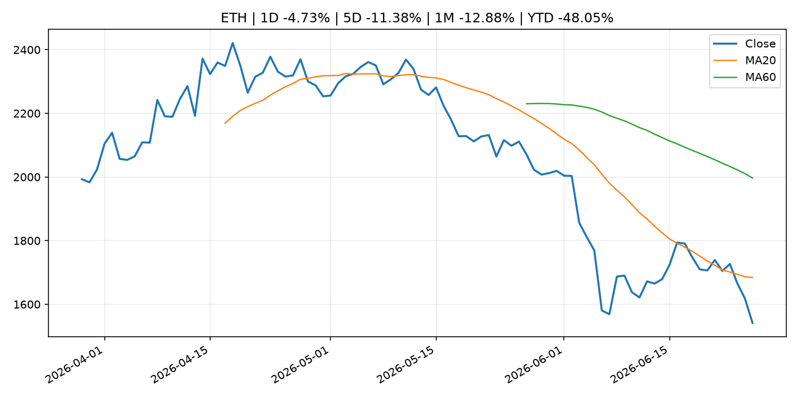

# Global Macro Morning Briefing - 2026-06-26

> Not financial advice / 非投资建议。

## 0. 今日总览
- 市场状态：unknown。市场信号不足，暂不判断明确状态。
- 今日三大主线：
  1. financial_stability: Federal Reserve Board's annual bank stress test confirms that large banks are well positioned to weather a severe recession and able to continue to lend to households and businesses
  2. central_bank_speech: Chicago Fed President Goolsbee says inflation is too high; Williams sees price pressures easing
  3. crypto_market_structure: Asset management giant Invesco files for tokenized fund targeting stablecoin reserve market
- 一句话结论：今日晨报重点关注：金融稳定信号可能放大跨资产波动，并影响央行反应函数。；央行官员表态可能影响市场对下一次会议的定价。。跨资产方面，SPY 1D 0.14%；QQQ 1D 0.81%；^VIX 1D 6.03%；TLT 1D -0.03%；GC=F 1D 0.78%；CL=F 1D -2.50%；BTC 1D -2.68%；ETH 1D -4.73%；市场信号不足，暂不判断明确状态。政策、通胀、利率、美元、美债、能源和加密监管仍是主要观察线索。所有结论仅基于公开数据与短摘要整理，不构成投资建议。

## 1. 隔夜跨资产市场
- 美股：SPY 1D 0.14%，QQQ 1D 0.81%，整体趋势需结合 VIX 和利率确认。
- 美债/美元：TLT 1D -0.03%，美元指数 1D -0.18%，是判断折现率压力的核心线索。
- 黄金/原油：黄金 1D 0.78%，原油 1D -2.50%，用于观察避险、通胀和地缘风险。
- 加密：BTC 1D -2.68%，ETH 1D -4.73%，关注是否独立于纳指走出加密自身行情。
- 港股/A股：恒生 1D -1.76%，沪深300/上证 1D n/a，重点看中国政策预期与人民币线索。
- 风险观察：关注后续数据是否确认当前跨资产信号。

### US_EQUITY

| symbol | latest close | 1D | 5D | 1M | YTD | trend |
|---|---:|---:|---:|---:|---:|---|
| SPY | 734.30 | 0.14% | -0.90% | -2.17% | 7.48% | range_bound |
| QQQ | 716.38 | 0.81% | -0.85% | -1.90% | 16.84% | range_bound |
| DIA | 519.26 | 0.14% | 0.57% | 2.77% | 7.37% | uptrend |
| IWM | 298.91 | 0.75% | 3.12% | 2.89% | 20.15% | uptrend |
| VTI | 363.98 | 0.09% | -0.49% | -1.48% | 8.23% | range_bound |

### US_MACRO_MARKET

| symbol | latest close | 1D | 5D | 1M | YTD | trend |
|---|---:|---:|---:|---:|---:|---|
| ^VIX | 20.03 | 6.03% | 22.13% | 22.96% | 38.04% | range_bound |
| DX-Y.NYB | 101.24 | -0.18% | 0.39% | 2.05% | 2.87% | uptrend |
| TLT | 87.35 | -0.03% | 1.18% | 2.64% | 0.37% | uptrend |
| IEF | 94.79 | 0.06% | 0.82% | 0.54% | -1.34% | range_bound |

### COMMODITIES

| symbol | latest close | 1D | 5D | 1M | YTD | trend |
|---|---:|---:|---:|---:|---:|---|
| GC=F | 4,062.00 | 0.78% | -3.84% | -8.67% | -5.85% | strong_downtrend |
| SI=F | 58.65 | 0.51% | -11.49% | -21.39% | -16.88% | strong_downtrend |
| CL=F | 70.12 | -2.50% | -8.46% | -20.93% | 22.33% | strong_downtrend |
| BZ=F | 73.53 | -2.30% | -7.91% | -22.02% | 21.04% | strong_downtrend |
| NG=F | 3.35 | 0.06% | 3.46% | 10.03% | -7.55% | strong_uptrend |
| HG=F | 6.17 | 1.63% | -3.22% | -2.15% | 9.39% | range_bound |

### HK_MARKET

| symbol | latest close | 1D | 5D | 1M | YTD | trend |
|---|---:|---:|---:|---:|---:|---|
| ^HSI | 22,671.86 | -1.76% | -5.24% | -10.49% | -13.92% | strong_downtrend |
| 0700.HK | 411.80 | -2.28% | -6.45% | -5.20% | -33.90% | strong_downtrend |
| 9988.HK | 89.50 | -5.79% | -14.68% | -28.00% | -39.93% | strong_downtrend |
| 3690.HK | 64.25 | -2.80% | -10.52% | -17.31% | -38.58% | strong_downtrend |
| 1810.HK | 21.42 | -3.95% | -12.86% | -24.58% | -46.82% | strong_downtrend |
| 1211.HK | 72.65 | -4.47% | -10.14% | -19.90% | -26.43% | strong_downtrend |

### CRYPTO

| symbol | latest close | 1D | 5D | 1M | YTD | trend |
|---|---:|---:|---:|---:|---:|---|
| BTC | 59,278.53 | -2.68% | -7.72% | -7.08% | -32.27% | strong_downtrend |
| ETH | 1,541.27 | -4.73% | -11.38% | -12.88% | -48.05% | strong_downtrend |
| SOLANA | 68.44 | 0.81% | -6.51% | -0.49% | -45.04% | downtrend |
| BINANCECOIN | 558.57 | -0.86% | -4.94% | -7.54% | -35.29% | strong_downtrend |
| RIPPLE | 1.02 | -4.75% | -11.17% | -12.55% | -44.50% | strong_downtrend |

## 2. 今日最重要的 10 条新闻
### 1. Federal Reserve Board's annual bank stress test confirms that large banks are well positioned to weather a severe recession and able to continue to lend to households and businesses
- 来源：Federal Reserve Press Releases
- 时间：2026-06-24T20:00:00+00:00
- 地区：US
- 事件类型：financial_stability
- 重要性层级：Tier 1
- 一句话摘要：Federal Reserve Board's annual bank stress test confirms that large banks are well positioned to weather a severe recession and able to continue to lend to households and businesses
- 为什么重要：金融稳定信号可能放大跨资产波动，并影响央行反应函数。
- 可能影响：可能影响利率、汇率、风险资产或大宗商品预期，但当前公开信息不足以判断明确方向。
  - 资产：暂无明确资产映射
  - 方向：unknown
  - 强度：low
  - 原因：公开信息不足以判断方向。
- 原文链接：[https://www.federalreserve.gov/newsevents/pressreleases/bcreg20260624a.htm](https://www.federalreserve.gov/newsevents/pressreleases/bcreg20260624a.htm)

### 2. Chicago Fed President Goolsbee says inflation is too high; Williams sees price pressures easing
- 来源：CNBC Economy
- 时间：2026-06-25T21:03:16+00:00
- 地区：US
- 事件类型：central_bank_speech
- 重要性层级：Tier 2
- 一句话摘要：In a live CNBC interview from his home district, Goolsbee declined to speculate on where he thinks interest rates are headed.
- 为什么重要：央行官员表态可能影响市场对下一次会议的定价。
- 可能影响：主要影响 DXY，方向为 positive，强度 high；通胀压力可能推高政策利率预期并支撑美元。
  - 资产：DXY
    方向：positive
    强度：high
    原因：通胀压力可能推高政策利率预期并支撑美元。
  - 资产：TLT
    方向：negative
    强度：high
    原因：通胀上行通常推升收益率、压低长债价格。
  - 资产：QQQ
    方向：negative
    强度：high
    原因：更高利率对成长股估值折现率不利。
  - 资产：SPY
    方向：positive
    强度：high
    原因：宽松政策通常改善风险偏好。
  - 资产：GC=F
    方向：mixed
    强度：medium
    原因：通胀对黄金是支撑，但实际利率上行会形成压力。
  - 资产：BTC
    方向：positive
    强度：high
    原因：流动性改善通常支持加密资产。
- 原文链接：[https://www.cnbc.com/2026/06/25/chicago-fed-president-goolsbee-says-inflation-is-too-high-calls-warsh-a-serious-guy.html](https://www.cnbc.com/2026/06/25/chicago-fed-president-goolsbee-says-inflation-is-too-high-calls-warsh-a-serious-guy.html)

### 3. Asset management giant Invesco files for tokenized fund targeting stablecoin reserve market
- 来源：CoinDesk
- 时间：2026-06-25T20:47:24+00:00
- 地区：global
- 事件类型：crypto_market_structure
- 重要性层级：Tier 2
- 一句话摘要：Asset management giant Invesco files for tokenized fund targeting stablecoin reserve market
- 为什么重要：加密市场结构和监管变化会影响 BTC、ETH 及相关股票的风险溢价。
- 可能影响：主要影响 BTC，方向为 mixed，强度 high；加密监管或 ETF 进展会改变 BTC 的资金流和风险溢价。
  - 资产：BTC
    方向：mixed
    强度：high
    原因：加密监管或 ETF 进展会改变 BTC 的资金流和风险溢价。
  - 资产：ETH
    方向：mixed
    强度：high
    原因：监管框架会影响 ETH 产品化和机构参与度。
  - 资产：COIN
    方向：mixed
    强度：medium
    原因：监管清晰度和执法风险会影响交易平台估值。
  - 资产：crypto market
    方向：mixed
    强度：high
    原因：信息影响整个加密市场结构，但方向取决于细节。
- 原文链接：[https://www.coindesk.com/business/2026/06/25/asset-management-giant-invesco-files-for-tokenized-fund-targeting-stablecoin-reserve-market](https://www.coindesk.com/business/2026/06/25/asset-management-giant-invesco-files-for-tokenized-fund-targeting-stablecoin-reserve-market)

### 4. Uniswap, Spark aim to build stablecoin FX market as banks, fintechs enter the industry
- 来源：CoinDesk
- 时间：2026-06-25T13:00:00+00:00
- 地区：global
- 事件类型：crypto_market_structure
- 重要性层级：Tier 2
- 一句话摘要：Uniswap, Spark aim to build stablecoin FX market as banks, fintechs enter the industry
- 为什么重要：加密市场结构和监管变化会影响 BTC、ETH 及相关股票的风险溢价。
- 可能影响：主要影响 BTC，方向为 mixed，强度 high；加密监管或 ETF 进展会改变 BTC 的资金流和风险溢价。
  - 资产：BTC
    方向：mixed
    强度：high
    原因：加密监管或 ETF 进展会改变 BTC 的资金流和风险溢价。
  - 资产：ETH
    方向：mixed
    强度：high
    原因：监管框架会影响 ETH 产品化和机构参与度。
  - 资产：COIN
    方向：mixed
    强度：medium
    原因：监管清晰度和执法风险会影响交易平台估值。
  - 资产：crypto market
    方向：mixed
    强度：high
    原因：信息影响整个加密市场结构，但方向取决于细节。
- 原文链接：[https://www.coindesk.com/business/2026/06/25/uniswap-spark-aim-to-build-stablecoin-fx-market-as-banks-fintechs-enter-the-industry](https://www.coindesk.com/business/2026/06/25/uniswap-spark-aim-to-build-stablecoin-fx-market-as-banks-fintechs-enter-the-industry)

### 5. A world rejecting OPEC controls could usher in oil below $50 a barrel
- 来源：MarketWatch Top Stories
- 时间：2026-06-25T22:29:00+00:00
- 地区：US
- 事件类型：commodity_supply
- 重要性层级：Tier 2
- 一句话摘要：Iraq’s hint that it could exit OPEC is yet another source of potential tumult for the global oil market in 2026.
- 为什么重要：大宗商品供给变化会影响能源价格、通胀预期和资源股。
- 可能影响：主要影响 CL=F，方向为 positive，强度 high；供给扰动或 OPEC 减产通常推升 WTI 原油。
  - 资产：CL=F
    方向：positive
    强度：high
    原因：供给扰动或 OPEC 减产通常推升 WTI 原油。
  - 资产：BZ=F
    方向：positive
    强度：high
    原因：全球供给风险通常直接影响 Brent 原油。
  - 资产：SPY
    方向：mixed
    强度：medium
    原因：能源股可能受益，但通胀和成本压力不利于宽基风险资产。
- 原文链接：[https://www.marketwatch.com/story/a-world-rejecting-opec-controls-could-usher-in-oil-below-50-a-barrel-3d7eda1b?mod=mw_rss_topstories](https://www.marketwatch.com/story/a-world-rejecting-opec-controls-could-usher-in-oil-below-50-a-barrel-3d7eda1b?mod=mw_rss_topstories)

### 6. SEC Appoints Kathleen Hutchinson as Director of Office of International Affairs
- 来源：SEC Press Releases
- 时间：2026-06-24T14:32:00-04:00
- 地区：US
- 事件类型：regulation
- 重要性层级：Tier 2
- 一句话摘要：The Securities and Exchange Commission has appointed Kathleen M. Hutchinson as Director of the agency’s Office of International Affairs (OIA). OIA advises the Commission on international policy matters, coordinates with foreign authorities across the…
- 为什么重要：监管变化会改变行业盈利预期和资产风险溢价。
- 可能影响：主要影响 BTC，方向为 mixed，强度 high；加密监管或 ETF 进展会改变 BTC 的资金流和风险溢价。
  - 资产：BTC
    方向：mixed
    强度：high
    原因：加密监管或 ETF 进展会改变 BTC 的资金流和风险溢价。
  - 资产：ETH
    方向：mixed
    强度：high
    原因：监管框架会影响 ETH 产品化和机构参与度。
  - 资产：COIN
    方向：mixed
    强度：medium
    原因：监管清晰度和执法风险会影响交易平台估值。
  - 资产：crypto market
    方向：mixed
    强度：high
    原因：信息影响整个加密市场结构，但方向取决于细节。
- 原文链接：[https://www.sec.gov/newsroom/press-releases/2026-58-sec-appoints-kathleen-hutchinson-director-office-international-affairs](https://www.sec.gov/newsroom/press-releases/2026-58-sec-appoints-kathleen-hutchinson-director-office-international-affairs)

### 7. Exuberance over earnings is becoming a problem for the stock market, according to this Wall Street veteran
- 来源：MarketWatch Top Stories
- 时间：2026-06-26T10:47:00+00:00
- 地区：US
- 事件类型：earnings
- 重要性层级：Tier 2
- 一句话摘要：Optimism about corporate profits often comes before a fall, says Jim Paulsen
- 为什么重要：大型科技股盈利和资本开支会影响纳指、半导体和 AI 交易主线。
- 可能影响：可能影响利率、汇率、风险资产或大宗商品预期，但当前公开信息不足以判断明确方向。
  - 资产：暂无明确资产映射
  - 方向：unknown
  - 强度：low
  - 原因：公开信息不足以判断方向。
- 原文链接：[https://www.marketwatch.com/story/why-this-earnings-exuberance-may-be-a-problem-for-the-stock-market-according-to-this-wall-street-veteran-20431488?mod=mw_rss_topstories](https://www.marketwatch.com/story/why-this-earnings-exuberance-may-be-a-problem-for-the-stock-market-according-to-this-wall-street-veteran-20431488?mod=mw_rss_topstories)

### 8. Federal Reserve Board issues enforcement action with employee of Bank of Eufaula and S N B Bancshares, Inc.
- 来源：Federal Reserve Press Releases
- 时间：2026-06-25T15:00:00+00:00
- 地区：US
- 事件类型：regulation
- 重要性层级：Tier 2
- 一句话摘要：Federal Reserve Board issues enforcement action with employee of Bank of Eufaula and S N B Bancshares, Inc.
- 为什么重要：监管变化会改变行业盈利预期和资产风险溢价。
- 可能影响：可能影响利率、汇率、风险资产或大宗商品预期，但当前公开信息不足以判断明确方向。
  - 资产：暂无明确资产映射
  - 方向：unknown
  - 强度：low
  - 原因：公开信息不足以判断方向。
- 原文链接：[https://www.federalreserve.gov/newsevents/pressreleases/enforcement20260625b.htm](https://www.federalreserve.gov/newsevents/pressreleases/enforcement20260625b.htm)

### 9. Federal Reserve Board announces termination of enforcement action with Jiko Group, Inc.
- 来源：Federal Reserve Press Releases
- 时间：2026-06-25T15:00:00+00:00
- 地区：US
- 事件类型：regulation
- 重要性层级：Tier 2
- 一句话摘要：Federal Reserve Board announces termination of enforcement action with Jiko Group, Inc.
- 为什么重要：监管变化会改变行业盈利预期和资产风险溢价。
- 可能影响：可能影响利率、汇率、风险资产或大宗商品预期，但当前公开信息不足以判断明确方向。
  - 资产：暂无明确资产映射
  - 方向：unknown
  - 强度：low
  - 原因：公开信息不足以判断方向。
- 原文链接：[https://www.federalreserve.gov/newsevents/pressreleases/enforcement20260625a.htm](https://www.federalreserve.gov/newsevents/pressreleases/enforcement20260625a.htm)

### 10. Speech by Board Member TAMURA in Hyogo (Economic Activity, Prices, and Monetary Policy in Japan)
- 来源：Bank of Japan Announcements
- 时间：2026-06-25T10:00:00+09:00
- 地区：Japan
- 事件类型：central_bank_speech
- 重要性层级：Tier 2
- 一句话摘要：Speech by Board Member TAMURA in Hyogo (Economic Activity, Prices, and Monetary Policy in Japan)
- 为什么重要：央行官员表态可能影响市场对下一次会议的定价。
- 可能影响：可能影响利率、汇率、风险资产或大宗商品预期，但当前公开信息不足以判断明确方向。
  - 资产：暂无明确资产映射
  - 方向：unknown
  - 强度：low
  - 原因：公开信息不足以判断方向。
- 原文链接：[http://www.boj.or.jp/en/about/press/koen_2026/ko260625a.htm](http://www.boj.or.jp/en/about/press/koen_2026/ko260625a.htm)

## 3. 政策与央行观察
### 1. Federal Reserve Board's annual bank stress test confirms that large banks are well positioned to weather a severe recession and able to continue to lend to households and businesses
- 来源：Federal Reserve Press Releases
- 时间：2026-06-24T20:00:00+00:00
- 地区：US
- 事件类型：financial_stability
- 重要性层级：Tier 1
- 一句话摘要：Federal Reserve Board's annual bank stress test confirms that large banks are well positioned to weather a severe recession and able to continue to lend to households and businesses
- 为什么重要：金融稳定信号可能放大跨资产波动，并影响央行反应函数。
- 可能影响：可能影响利率、汇率、风险资产或大宗商品预期，但当前公开信息不足以判断明确方向。
  - 资产：暂无明确资产映射
  - 方向：unknown
  - 强度：low
  - 原因：公开信息不足以判断方向。
- 原文链接：[https://www.federalreserve.gov/newsevents/pressreleases/bcreg20260624a.htm](https://www.federalreserve.gov/newsevents/pressreleases/bcreg20260624a.htm)

### 2. Chicago Fed President Goolsbee says inflation is too high; Williams sees price pressures easing
- 来源：CNBC Economy
- 时间：2026-06-25T21:03:16+00:00
- 地区：US
- 事件类型：central_bank_speech
- 重要性层级：Tier 2
- 一句话摘要：In a live CNBC interview from his home district, Goolsbee declined to speculate on where he thinks interest rates are headed.
- 为什么重要：央行官员表态可能影响市场对下一次会议的定价。
- 可能影响：主要影响 DXY，方向为 positive，强度 high；通胀压力可能推高政策利率预期并支撑美元。
  - 资产：DXY
    方向：positive
    强度：high
    原因：通胀压力可能推高政策利率预期并支撑美元。
  - 资产：TLT
    方向：negative
    强度：high
    原因：通胀上行通常推升收益率、压低长债价格。
  - 资产：QQQ
    方向：negative
    强度：high
    原因：更高利率对成长股估值折现率不利。
  - 资产：SPY
    方向：positive
    强度：high
    原因：宽松政策通常改善风险偏好。
  - 资产：GC=F
    方向：mixed
    强度：medium
    原因：通胀对黄金是支撑，但实际利率上行会形成压力。
  - 资产：BTC
    方向：positive
    强度：high
    原因：流动性改善通常支持加密资产。
- 原文链接：[https://www.cnbc.com/2026/06/25/chicago-fed-president-goolsbee-says-inflation-is-too-high-calls-warsh-a-serious-guy.html](https://www.cnbc.com/2026/06/25/chicago-fed-president-goolsbee-says-inflation-is-too-high-calls-warsh-a-serious-guy.html)

### 3. Asset management giant Invesco files for tokenized fund targeting stablecoin reserve market
- 来源：CoinDesk
- 时间：2026-06-25T20:47:24+00:00
- 地区：global
- 事件类型：crypto_market_structure
- 重要性层级：Tier 2
- 一句话摘要：Asset management giant Invesco files for tokenized fund targeting stablecoin reserve market
- 为什么重要：加密市场结构和监管变化会影响 BTC、ETH 及相关股票的风险溢价。
- 可能影响：主要影响 BTC，方向为 mixed，强度 high；加密监管或 ETF 进展会改变 BTC 的资金流和风险溢价。
  - 资产：BTC
    方向：mixed
    强度：high
    原因：加密监管或 ETF 进展会改变 BTC 的资金流和风险溢价。
  - 资产：ETH
    方向：mixed
    强度：high
    原因：监管框架会影响 ETH 产品化和机构参与度。
  - 资产：COIN
    方向：mixed
    强度：medium
    原因：监管清晰度和执法风险会影响交易平台估值。
  - 资产：crypto market
    方向：mixed
    强度：high
    原因：信息影响整个加密市场结构，但方向取决于细节。
- 原文链接：[https://www.coindesk.com/business/2026/06/25/asset-management-giant-invesco-files-for-tokenized-fund-targeting-stablecoin-reserve-market](https://www.coindesk.com/business/2026/06/25/asset-management-giant-invesco-files-for-tokenized-fund-targeting-stablecoin-reserve-market)

### 4. Uniswap, Spark aim to build stablecoin FX market as banks, fintechs enter the industry
- 来源：CoinDesk
- 时间：2026-06-25T13:00:00+00:00
- 地区：global
- 事件类型：crypto_market_structure
- 重要性层级：Tier 2
- 一句话摘要：Uniswap, Spark aim to build stablecoin FX market as banks, fintechs enter the industry
- 为什么重要：加密市场结构和监管变化会影响 BTC、ETH 及相关股票的风险溢价。
- 可能影响：主要影响 BTC，方向为 mixed，强度 high；加密监管或 ETF 进展会改变 BTC 的资金流和风险溢价。
  - 资产：BTC
    方向：mixed
    强度：high
    原因：加密监管或 ETF 进展会改变 BTC 的资金流和风险溢价。
  - 资产：ETH
    方向：mixed
    强度：high
    原因：监管框架会影响 ETH 产品化和机构参与度。
  - 资产：COIN
    方向：mixed
    强度：medium
    原因：监管清晰度和执法风险会影响交易平台估值。
  - 资产：crypto market
    方向：mixed
    强度：high
    原因：信息影响整个加密市场结构，但方向取决于细节。
- 原文链接：[https://www.coindesk.com/business/2026/06/25/uniswap-spark-aim-to-build-stablecoin-fx-market-as-banks-fintechs-enter-the-industry](https://www.coindesk.com/business/2026/06/25/uniswap-spark-aim-to-build-stablecoin-fx-market-as-banks-fintechs-enter-the-industry)

### 5. SEC Appoints Kathleen Hutchinson as Director of Office of International Affairs
- 来源：SEC Press Releases
- 时间：2026-06-24T14:32:00-04:00
- 地区：US
- 事件类型：regulation
- 重要性层级：Tier 2
- 一句话摘要：The Securities and Exchange Commission has appointed Kathleen M. Hutchinson as Director of the agency’s Office of International Affairs (OIA). OIA advises the Commission on international policy matters, coordinates with foreign authorities across the…
- 为什么重要：监管变化会改变行业盈利预期和资产风险溢价。
- 可能影响：主要影响 BTC，方向为 mixed，强度 high；加密监管或 ETF 进展会改变 BTC 的资金流和风险溢价。
  - 资产：BTC
    方向：mixed
    强度：high
    原因：加密监管或 ETF 进展会改变 BTC 的资金流和风险溢价。
  - 资产：ETH
    方向：mixed
    强度：high
    原因：监管框架会影响 ETH 产品化和机构参与度。
  - 资产：COIN
    方向：mixed
    强度：medium
    原因：监管清晰度和执法风险会影响交易平台估值。
  - 资产：crypto market
    方向：mixed
    强度：high
    原因：信息影响整个加密市场结构，但方向取决于细节。
- 原文链接：[https://www.sec.gov/newsroom/press-releases/2026-58-sec-appoints-kathleen-hutchinson-director-office-international-affairs](https://www.sec.gov/newsroom/press-releases/2026-58-sec-appoints-kathleen-hutchinson-director-office-international-affairs)

### 6. Federal Reserve Board issues enforcement action with employee of Bank of Eufaula and S N B Bancshares, Inc.
- 来源：Federal Reserve Press Releases
- 时间：2026-06-25T15:00:00+00:00
- 地区：US
- 事件类型：regulation
- 重要性层级：Tier 2
- 一句话摘要：Federal Reserve Board issues enforcement action with employee of Bank of Eufaula and S N B Bancshares, Inc.
- 为什么重要：监管变化会改变行业盈利预期和资产风险溢价。
- 可能影响：可能影响利率、汇率、风险资产或大宗商品预期，但当前公开信息不足以判断明确方向。
  - 资产：暂无明确资产映射
  - 方向：unknown
  - 强度：low
  - 原因：公开信息不足以判断方向。
- 原文链接：[https://www.federalreserve.gov/newsevents/pressreleases/enforcement20260625b.htm](https://www.federalreserve.gov/newsevents/pressreleases/enforcement20260625b.htm)

### 7. Federal Reserve Board announces termination of enforcement action with Jiko Group, Inc.
- 来源：Federal Reserve Press Releases
- 时间：2026-06-25T15:00:00+00:00
- 地区：US
- 事件类型：regulation
- 重要性层级：Tier 2
- 一句话摘要：Federal Reserve Board announces termination of enforcement action with Jiko Group, Inc.
- 为什么重要：监管变化会改变行业盈利预期和资产风险溢价。
- 可能影响：可能影响利率、汇率、风险资产或大宗商品预期，但当前公开信息不足以判断明确方向。
  - 资产：暂无明确资产映射
  - 方向：unknown
  - 强度：low
  - 原因：公开信息不足以判断方向。
- 原文链接：[https://www.federalreserve.gov/newsevents/pressreleases/enforcement20260625a.htm](https://www.federalreserve.gov/newsevents/pressreleases/enforcement20260625a.htm)

### 8. Speech by Board Member TAMURA in Hyogo (Economic Activity, Prices, and Monetary Policy in Japan)
- 来源：Bank of Japan Announcements
- 时间：2026-06-25T10:00:00+09:00
- 地区：Japan
- 事件类型：central_bank_speech
- 重要性层级：Tier 2
- 一句话摘要：Speech by Board Member TAMURA in Hyogo (Economic Activity, Prices, and Monetary Policy in Japan)
- 为什么重要：央行官员表态可能影响市场对下一次会议的定价。
- 可能影响：可能影响利率、汇率、风险资产或大宗商品预期，但当前公开信息不足以判断明确方向。
  - 资产：暂无明确资产映射
  - 方向：unknown
  - 强度：low
  - 原因：公开信息不足以判断方向。
- 原文链接：[http://www.boj.or.jp/en/about/press/koen_2026/ko260625a.htm](http://www.boj.or.jp/en/about/press/koen_2026/ko260625a.htm)

### 9. Federal Reserve says U.S. banks can withstand $708 billion in losses amid overhaul of capital rules
- 来源：CNBC Economy
- 时间：2026-06-24T21:19:27+00:00
- 地区：US
- 事件类型：regulation
- 重要性层级：Tier 2
- 一句话摘要：The Fed's annual exercise comes at a pivotal moment for bank regulation because, unlike previous years, the results will not affect capital requirements.
- 为什么重要：监管变化会改变行业盈利预期和资产风险溢价。
- 可能影响：可能影响利率、汇率、风险资产或大宗商品预期，但当前公开信息不足以判断明确方向。
  - 资产：暂无明确资产映射
  - 方向：unknown
  - 强度：low
  - 原因：公开信息不足以判断方向。
- 原文链接：[https://www.cnbc.com/2026/06/24/federal-reserve-stress-test-us-banks.html](https://www.cnbc.com/2026/06/24/federal-reserve-stress-test-us-banks.html)

## 4. 市场异动与图表
- QQQ 上涨 0.81%
- VIX 上涨 6.03%
- Gold 上涨 0.78%
- Oil 下跌 -2.50%
- BTC 下跌 -2.68%
- ETH 下跌 -4.73%

### SPY

### QQQ

### ^VIX

### TLT

### GC=F

### CL=F

### BTC

### ETH

### ^HSI

## 5. 华尔街与机构公开观点
- 暂无可靠公开观点。

## 6. 今日重点关注
- 经济数据：经济数据：暂无可靠公开日历数据；如配置经济日历源后可自动填充。
- 央行讲话：央行讲话：暂无可靠公开日历数据；重点跟踪 Fed、ECB、BoJ、PBOC 官网 RSS。
- 财报：财报：暂无可靠数据。
- 政策事件：政策事件：暂无可靠数据。
- 风险提醒：风险提醒：关注数据源失败项、突发地缘风险、利率和美元的二阶反应。

## 7. 英文金融表达与宏观概念
- **inflation expectations**：通胀预期，指家庭、企业或市场对未来通胀的预估。 例句：Inflation expectations can shape wage bargaining and bond yields.
- **real yield**：实际收益率，名义利率扣除通胀预期后的收益率。 例句：Gold often reacts more to real yields than nominal yields.
- **supply disruption**：供给扰动，通常指能源或商品供应受冲突、减产或天气影响。 例句：Supply disruption can lift oil prices and inflation expectations.
- **market structure**：市场结构，指交易、托管、清算、ETF、监管等制度安排。 例句：Crypto market structure rules can affect institutional participation.
- **terminal rate**：终端利率，市场预期本轮加息周期的最高政策利率。 例句：A higher terminal rate can pressure growth stocks.
- **soft landing**：软着陆，指通胀回落而经济避免明显衰退。 例句：Markets often rally when data support a soft landing.

## 8. 背景材料
- [With crypto ending the first half in the red, bitcoin's solace is it beat Strategy](https://www.coindesk.com/daybook-us/2026/06/26/with-crypto-ending-the-first-half-in-the-red-bitcoin-s-solace-is-it-beat-strategy)（CoinDesk，other）：With crypto ending the first half in the red, bitcoin's solace is it beat Strategy
- [Bitcoin bounces from $58,000 as derivatives signal more pain in the pipeline](https://www.coindesk.com/markets/2026/06/26/bitcoin-bounces-from-usd58-000-as-derivatives-signal-more-pain-in-the-pipeline)（CoinDesk，other）：Bitcoin bounces from $58,000 as derivatives signal more pain in the pipeline
- [Binance tells EU users it will no longer provide services after failing to secure MiCA license](https://www.coindesk.com/policy/2026/06/26/binance-tells-eu-users-it-will-no-longer-provide-services-after-failing-to-secure-mica-license)（CoinDesk，other）：Binance tells EU users it will no longer provide services after failing to secure MiCA license
- [Ethereum treasury firm Sharplink buys ether for the first time in eight months](https://www.coindesk.com/markets/2026/06/26/ethereum-treasury-firm-sharplink-takes-in-ether-for-the-first-time-in-eight-months)（CoinDesk，other）：Ethereum treasury firm Sharplink buys ether for the first time in eight months
- [Grant Cardone says he will keep buying bitcoin using real estate cash flows](https://www.coindesk.com/business/2026/06/26/grant-cardone-says-he-will-keep-buying-bitcoin-using-real-estate-cash-flows)（CoinDesk，other）：Grant Cardone says he will keep buying bitcoin using real estate cash flows
- [ECB Consumer Expectations Survey results – May 2026](https://www.ecb.europa.eu//press/pr/date/2026/html/ecb.pr260626_1~60a21704a8.en.html)（ECB Press Releases，other）：ECB Consumer Expectations Survey results – May 2026
- [Too big to fail: Strategy’s $13 billion bitcoin paper loss alone dwarfs hundreds of prominent tokens](https://www.coindesk.com/markets/2026/06/26/too-big-to-fail-strategy-s-usd13-billion-bitcoin-paper-loss-alone-dwarfs-hundreds-of-prominent-tokens)（CoinDesk，other）：Too big to fail: Strategy’s $13 billion bitcoin paper loss alone dwarfs hundreds of prominent tokens
- [Live markets: Bitcoin falls below $60,000. Kospi, Nikkei sink](https://www.coindesk.com/tech/2026/06/26/live-markets-bitcoin-rebounds-to-nearly-usd60-000-kospi-nikkei-sink)（CoinDesk，other）：Live markets: Bitcoin falls below $60,000. Kospi, Nikkei sink
- [SpaceX FOMO is officially over. Space stocks across the board are getting punished.](https://www.marketwatch.com/story/spacex-fomo-is-officially-over-space-stocks-across-the-board-are-getting-punished-77234fe8?mod=mw_rss_topstories)（MarketWatch Top Stories，other）：Investors seem to be having second thoughts about the lofty valuations in the sector, an analyst said.
- [Wendy's turns lower as meme rally fails to extend to a second day](https://www.cnbc.com/2026/06/25/wendys-shares-soar-for-a-second-day-as-retail-investors-pile-into-their-new-meme-darling.html)（CNBC Economy，other）：The stock's volatile run appeared largely disconnected from company fundamentals and instead reflected a burst of social media enthusiasm.
- [Bond ETF flows surge in hunt for yield: 'Market sniffing out something here,' says BlackRock exec](https://www.cnbc.com/2026/06/25/inflation-fed-bond-etf-flows-surge-blackrock.html)（CNBC Economy，other）：Bond investors are abandoning aggregate benchmarks in favor of a broad mix of fixed-income investments to maximize yield with the stock market on edge.
- [Quant fund says bitcoin is near a major inflection point as rare onchain signals align](https://www.coindesk.com/markets/2026/06/25/quant-fund-says-bitcoin-is-near-a-major-inflection-point-as-rare-onchain-signals-align)（CoinDesk，other）：Quant fund says bitcoin is near a major inflection point as rare onchain signals align
- [Bitcoin tumbles to new multi-year low of $58,000, but a short-squeeze setup emerges](https://www.coindesk.com/markets/2026/06/25/bitcoin-plunges-to-new-multi-year-low-of-usd58-000-but-a-short-squeeze-setup-emerges)（CoinDesk，other）：Bitcoin tumbles to new multi-year low of $58,000, but a short-squeeze setup emerges
- [Crypto for Advisors: Bitcoin: planning for inheritance](https://www.coindesk.com/coindesk-indices/2026/06/24/crypto-for-advisors-bitcoin-planning-for-inheritance)（CoinDesk，other）：Crypto for Advisors: Bitcoin: planning for inheritance
- [Bitcoin likely to fall another 30% to $44,000 by year-end, prominent BTC miner says](https://www.coindesk.com/markets/2026/06/25/bitcoin-can-fall-another-30-to-usd44-000-prominent-btc-miner-says)（CoinDesk，other）：Bitcoin likely to fall another 30% to $44,000 by year-end, prominent BTC miner says
- [Piero Cipollone: Central bank money for the digital era](https://www.ecb.europa.eu//press/key/date/2026/html/ecb.sp260625~db26a75179.en.pdf)（ECB Press Releases，other）：Piero Cipollone: Central bank money for the digital era
- [ECB to integrate non-financial credit claim portfolios into general collateral framework, phasing out temporary measures](https://www.ecb.europa.eu//press/pr/date/2026/html/ecb.pr260625~edee181785.en.html)（ECB Press Releases，other）：ECB to integrate non-financial credit claim portfolios into general collateral framework, phasing out temporary measures
- [Isabel Schnabel: Interview with Die Zeit](https://www.ecb.europa.eu//press/inter/date/2026/html/ecb.in260626~c18c7252f3.en.html)（ECB Press Releases，other）：Isabel Schnabel: Interview with Die Zeit
- [Flow of Funds Accounts (Retroactive Revision and 1st Quarter 2026, Preliminary Figures)](http://www.boj.or.jp/en/statistics/sj/sj.htm)（Bank of Japan Announcements，routine_announcement）：Flow of Funds Accounts (Retroactive Revision and 1st Quarter 2026, Preliminary Figures)
- [JPMorgan Chase unveils $50 billion buyback, Goldman Sachs raises dividend after Fed stress test](https://www.cnbc.com/2026/06/24/jpmorgan-goldman-sachs-fed-stress-test.html)（CNBC Economy，other）：The announcements followed the release of the Federal Reserve's annual stress test, which found that all 32 large banks weathered a hypothetical recession.

## 9. 数据源、失败项与免责声明
- 采集时间：2026-06-26T11:57:51
- 数据源：公开 RSS、Yahoo Finance、CoinGecko、AKShare、FRED、SEC data.sec.gov，以及用户自有 inputs/reports 文件。
- 合规说明：不绕过 WSJ、Bloomberg、FT、Reuters 等付费墙；对付费媒体只使用公开 RSS 标题、摘要、链接和发布时间。
- 免责声明：Not financial advice / 非投资建议。本项目仅供个人学习、研究和信息整理，不构成投资建议、交易建议或任何收益承诺。
- 失败或跳过的数据源：
  - crypto data failed coin=dogecoin
  - China market data failed symbol=上证指数: empty dataframe
  - China market data failed symbol=深证成指: empty dataframe
  - China market data failed symbol=创业板指: empty dataframe
  - China market data failed symbol=沪深300: empty dataframe
  - China market data failed symbol=中证500: empty dataframe
  - China market data failed symbol=科创50: empty dataframe
  - FRED_API_KEY not set; skipping FRED macro series
  - SEC failed cik=0000320193
  - SEC failed cik=0000789019
  - SEC failed cik=0001045810
  - SEC failed cik=0001318605
  - SEC failed cik=0001577552
