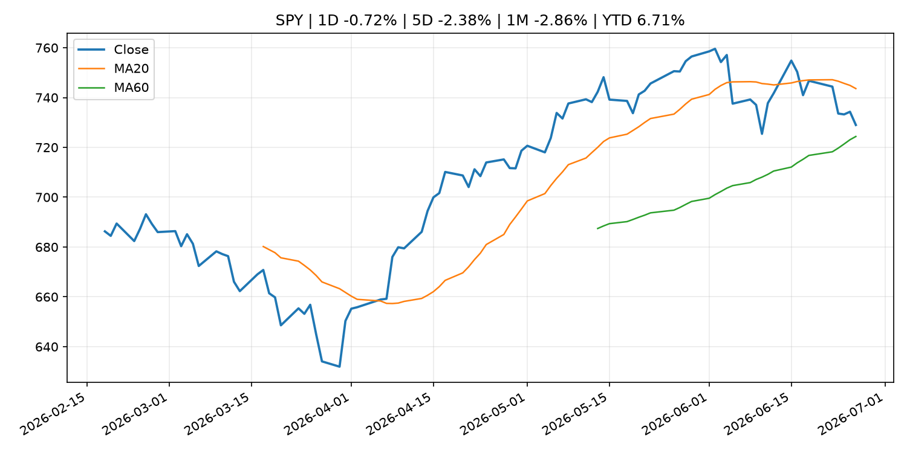
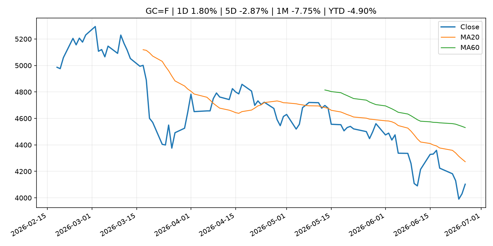
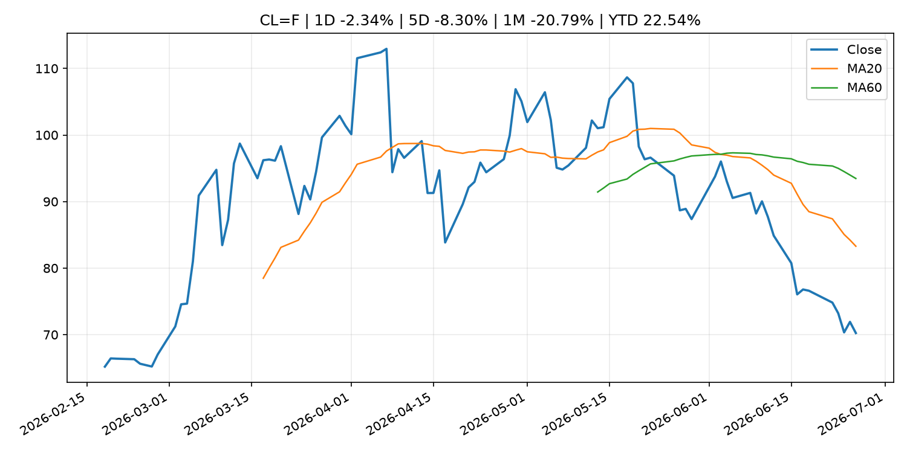
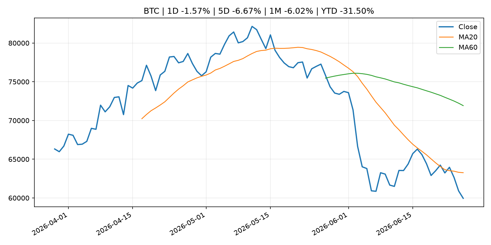
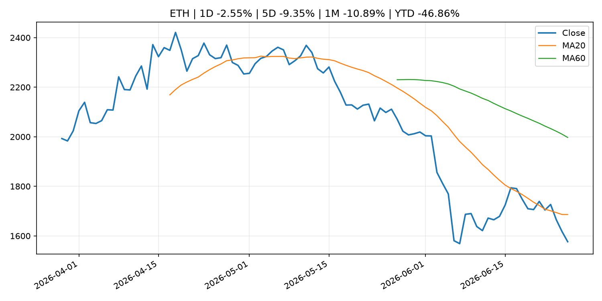
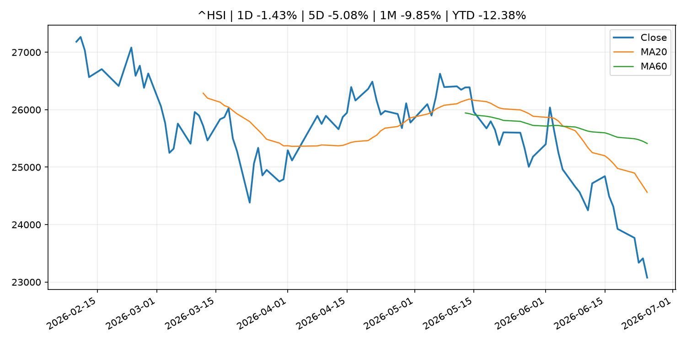

# Global Macro Morning Briefing - 2026-06-27

> Not financial advice / 非投资建议。

## 0. 今日总览
- 市场状态：unknown。市场信号不足，暂不判断明确状态。
- 今日三大主线：
  1. central_bank_decision: Minneapolis Fed President Neel Kashkari says he expects a rate hike this year
  2. central_bank_decision: Fed’s Kashkari now projects one interest-rate hike this year. Here’s what changed his mind.
  3. central_bank_speech: Bond yields are falling as inflation pops. The Fed’s tough talk under Warsh is helping.
- 一句话结论：今日晨报重点关注：央行决策会重定价利率、汇率、久期资产和风险资产。；央行决策会重定价利率、汇率、久期资产和风险资产。。跨资产方面，SPY 1D -0.72%；QQQ 1D -1.38%；^VIX 1D -2.54%；TLT 1D 0.01%；GC=F 1D 1.80%；CL=F 1D -2.34%；BTC 1D -1.57%；ETH 1D -2.55%；市场信号不足，暂不判断明确状态。政策、通胀、利率、美元、美债、能源和加密监管仍是主要观察线索。所有结论仅基于公开数据与短摘要整理，不构成投资建议。

## 1. 隔夜跨资产市场
- 美股：SPY 1D -0.72%，QQQ 1D -1.38%，整体趋势需结合 VIX 和利率确认。
- 美债/美元：TLT 1D 0.01%，美元指数 1D -0.06%，是判断折现率压力的核心线索。
- 黄金/原油：黄金 1D 1.80%，原油 1D -2.34%，用于观察避险、通胀和地缘风险。
- 加密：BTC 1D -1.57%，ETH 1D -2.55%，关注是否独立于纳指走出加密自身行情。
- 港股/A股：恒生 1D -1.43%，沪深300/上证 1D n/a，重点看中国政策预期与人民币线索。
- 风险观察：关注后续数据是否确认当前跨资产信号。

### US_EQUITY

| symbol | latest close | 1D | 5D | 1M | YTD | trend |
|---|---:|---:|---:|---:|---:|---|
| SPY | 728.99 | -0.72% | -2.38% | -2.86% | 6.71% | range_bound |
| QQQ | 706.52 | -1.38% | -4.60% | -3.14% | 15.23% | range_bound |
| DIA | 517.75 | -0.29% | 0.43% | 2.14% | 7.05% | uptrend |
| IWM | 299.83 | 0.31% | 1.43% | 3.26% | 20.52% | strong_uptrend |
| VTI | 362.22 | -0.48% | -2.10% | -1.93% | 7.70% | range_bound |

### US_MACRO_MARKET

| symbol | latest close | 1D | 5D | 1M | YTD | trend |
|---|---:|---:|---:|---:|---:|---|
| ^VIX | 18.41 | -2.54% | 12.26% | 13.01% | 26.88% | range_bound |
| DX-Y.NYB | 101.37 | -0.06% | 0.51% | 2.17% | 2.99% | uptrend |
| TLT | 87.36 | 0.01% | 0.70% | 2.42% | 0.38% | uptrend |
| IEF | 95.03 | 0.25% | 0.71% | 0.75% | -1.09% | range_bound |

### COMMODITIES

| symbol | latest close | 1D | 5D | 1M | YTD | trend |
|---|---:|---:|---:|---:|---:|---|
| GC=F | 4,103.00 | 1.80% | -2.87% | -7.75% | -4.90% | strong_downtrend |
| SI=F | 59.60 | 2.15% | -10.04% | -20.10% | -15.52% | strong_downtrend |
| CL=F | 70.24 | -2.34% | -8.30% | -20.79% | 22.54% | strong_downtrend |
| BZ=F | 73.57 | -2.25% | -7.86% | -21.97% | 21.10% | strong_downtrend |
| NG=F | 3.29 | -1.68% | 1.67% | 8.12% | -9.15% | uptrend |
| HG=F | 6.20 | 2.09% | -2.78% | -1.70% | 9.88% | range_bound |

### HK_MARKET

| symbol | latest close | 1D | 5D | 1M | YTD | trend |
|---|---:|---:|---:|---:|---:|---|
| ^HSI | 23,076.91 | -1.43% | -5.08% | -9.85% | -12.38% | strong_downtrend |
| 0700.HK | 411.80 | -2.28% | -6.45% | -5.20% | -33.90% | strong_downtrend |
| 9988.HK | 89.50 | -5.79% | -14.68% | -28.00% | -39.93% | strong_downtrend |
| 3690.HK | 64.25 | -2.80% | -10.52% | -17.31% | -38.58% | strong_downtrend |
| 1810.HK | 21.42 | -3.95% | -12.86% | -24.58% | -46.82% | strong_downtrend |
| 1211.HK | 72.65 | -4.47% | -10.14% | -19.90% | -26.43% | strong_downtrend |

### CRYPTO

| symbol | latest close | 1D | 5D | 1M | YTD | trend |
|---|---:|---:|---:|---:|---:|---|
| BTC | 59,953.68 | -1.57% | -6.67% | -6.02% | -31.50% | strong_downtrend |
| ETH | 1,576.57 | -2.55% | -9.35% | -10.89% | -46.86% | strong_downtrend |
| SOLANA | 71.75 | 5.69% | -1.98% | 4.33% | -42.37% | range_bound |
| BINANCECOIN | 567.59 | 0.74% | -3.41% | -6.05% | -34.24% | strong_downtrend |
| RIPPLE | 1.05 | -2.30% | -8.89% | -10.30% | -43.08% | strong_downtrend |

## 2. 今日最重要的 10 条新闻
### 1. Minneapolis Fed President Neel Kashkari says he expects a rate hike this year
- 来源：CNBC Economy
- 时间：2026-06-26T16:04:42+00:00
- 地区：US
- 事件类型：central_bank_decision
- 重要性层级：Tier 1
- 一句话摘要：Kashkari said he sees a hike likely this year as the economy continues to feel the hit from spiking inflation.
- 为什么重要：央行决策会重定价利率、汇率、久期资产和风险资产。
- 可能影响：主要影响 DXY，方向为 positive，强度 high；通胀压力可能推高政策利率预期并支撑美元。
  - 资产：DXY
    方向：positive
    强度：high
    原因：通胀压力可能推高政策利率预期并支撑美元。
  - 资产：TLT
    方向：negative
    强度：high
    原因：通胀上行通常推升收益率、压低长债价格。
  - 资产：QQQ
    方向：negative
    强度：high
    原因：更高利率对成长股估值折现率不利。
  - 资产：SPY
    方向：mixed
    强度：medium
    原因：名义增长可能支撑收入，但更高利率压制估值。
  - 资产：GC=F
    方向：mixed
    强度：medium
    原因：通胀对黄金是支撑，但实际利率上行会形成压力。
  - 资产：BTC
    方向：negative
    强度：high
    原因：流动性收紧通常压制高 beta 加密资产。
- 原文链接：[https://www.cnbc.com/2026/06/26/minneapolis-fed-president-neel-kashkari-says-he-expects-a-rate-hike-this-year.html](https://www.cnbc.com/2026/06/26/minneapolis-fed-president-neel-kashkari-says-he-expects-a-rate-hike-this-year.html)

### 2. Fed’s Kashkari now projects one interest-rate hike this year. Here’s what changed his mind.
- 来源：MarketWatch Top Stories
- 时间：2026-06-26T20:27:00+00:00
- 地区：US
- 事件类型：central_bank_decision
- 重要性层级：Tier 1
- 一句话摘要：Doubts over the U.S.-Iran peace deal and the AI buildup mean a rate hike is possible, the Minneapolis Fed president says.
- 为什么重要：央行决策会重定价利率、汇率、久期资产和风险资产。
- 可能影响：主要影响 QQQ，方向为 negative，强度 high；鹰派政策提高折现率，压制成长股估值。
  - 资产：QQQ
    方向：negative
    强度：high
    原因：鹰派政策提高折现率，压制成长股估值。
  - 资产：SPY
    方向：negative
    强度：medium
    原因：更紧政策通常削弱风险偏好。
  - 资产：TLT
    方向：negative
    强度：high
    原因：利率上行通常压低长债价格。
  - 资产：DXY
    方向：positive
    强度：high
    原因：更高利率预期通常支撑美元。
  - 资产：BTC
    方向：negative
    强度：high
    原因：流动性收紧通常压制高 beta 加密资产。
- 原文链接：[https://www.marketwatch.com/story/feds-kashkari-projects-one-interest-rate-hike-this-year-heres-what-changed-his-mind-3a6b428c?mod=mw_rss_topstories](https://www.marketwatch.com/story/feds-kashkari-projects-one-interest-rate-hike-this-year-heres-what-changed-his-mind-3a6b428c?mod=mw_rss_topstories)

### 3. Bond yields are falling as inflation pops. The Fed’s tough talk under Warsh is helping.
- 来源：MarketWatch Top Stories
- 时间：2026-06-26T20:38:00+00:00
- 地区：US
- 事件类型：central_bank_speech
- 重要性层级：Tier 2
- 一句话摘要：Kevin Warsh, the new Federal Reserve chair, is helping coax Treasury yields lower by talking tough on inflation.
- 为什么重要：央行官员表态可能影响市场对下一次会议的定价。
- 可能影响：主要影响 DXY，方向为 positive，强度 high；通胀压力可能推高政策利率预期并支撑美元。
  - 资产：DXY
    方向：positive
    强度：high
    原因：通胀压力可能推高政策利率预期并支撑美元。
  - 资产：TLT
    方向：negative
    强度：high
    原因：通胀上行通常推升收益率、压低长债价格。
  - 资产：QQQ
    方向：negative
    强度：high
    原因：更高利率对成长股估值折现率不利。
  - 资产：SPY
    方向：mixed
    强度：medium
    原因：名义增长可能支撑收入，但更高利率压制估值。
  - 资产：GC=F
    方向：mixed
    强度：medium
    原因：通胀对黄金是支撑，但实际利率上行会形成压力。
  - 资产：BTC
    方向：mixed
    强度：medium
    原因：抗通胀叙事和流动性收紧可能相互抵消。
- 原文链接：[https://www.marketwatch.com/story/bond-yields-are-falling-as-inflation-pops-the-feds-tough-talk-under-warsh-is-helping-7d538b3b?mod=mw_rss_topstories](https://www.marketwatch.com/story/bond-yields-are-falling-as-inflation-pops-the-feds-tough-talk-under-warsh-is-helping-7d538b3b?mod=mw_rss_topstories)

### 4. Chicago Fed President Goolsbee says inflation is too high; Williams sees price pressures easing
- 来源：CNBC Economy
- 时间：2026-06-25T21:03:16+00:00
- 地区：US
- 事件类型：central_bank_speech
- 重要性层级：Tier 2
- 一句话摘要：In a live CNBC interview from his home district, Goolsbee declined to speculate on where he thinks interest rates are headed.
- 为什么重要：央行官员表态可能影响市场对下一次会议的定价。
- 可能影响：主要影响 DXY，方向为 positive，强度 high；通胀压力可能推高政策利率预期并支撑美元。
  - 资产：DXY
    方向：positive
    强度：high
    原因：通胀压力可能推高政策利率预期并支撑美元。
  - 资产：TLT
    方向：negative
    强度：high
    原因：通胀上行通常推升收益率、压低长债价格。
  - 资产：QQQ
    方向：negative
    强度：high
    原因：更高利率对成长股估值折现率不利。
  - 资产：SPY
    方向：positive
    强度：high
    原因：宽松政策通常改善风险偏好。
  - 资产：GC=F
    方向：mixed
    强度：medium
    原因：通胀对黄金是支撑，但实际利率上行会形成压力。
  - 资产：BTC
    方向：positive
    强度：high
    原因：流动性改善通常支持加密资产。
- 原文链接：[https://www.cnbc.com/2026/06/25/chicago-fed-president-goolsbee-says-inflation-is-too-high-calls-warsh-a-serious-guy.html](https://www.cnbc.com/2026/06/25/chicago-fed-president-goolsbee-says-inflation-is-too-high-calls-warsh-a-serious-guy.html)

### 5. SEC, CFTC Seek Public Comment on the Harmonization of Portfolio Margining Frameworks
- 来源：SEC Press Releases
- 时间：2026-06-26T08:58:32-04:00
- 地区：US
- 事件类型：regulation
- 重要性层级：Tier 2
- 一句话摘要：The Securities and Exchange Commission and the Commodity Futures Trading Commission today issued a joint request for public comment on potential approaches to further harmonize regulatory frameworks applicable to portfolio margining across securities,…
- 为什么重要：监管变化会改变行业盈利预期和资产风险溢价。
- 可能影响：主要影响 BTC，方向为 mixed，强度 high；加密监管或 ETF 进展会改变 BTC 的资金流和风险溢价。
  - 资产：BTC
    方向：mixed
    强度：high
    原因：加密监管或 ETF 进展会改变 BTC 的资金流和风险溢价。
  - 资产：ETH
    方向：mixed
    强度：high
    原因：监管框架会影响 ETH 产品化和机构参与度。
  - 资产：COIN
    方向：mixed
    强度：medium
    原因：监管清晰度和执法风险会影响交易平台估值。
  - 资产：crypto market
    方向：mixed
    强度：high
    原因：信息影响整个加密市场结构，但方向取决于细节。
- 原文链接：[https://www.sec.gov/newsroom/press-releases/2026-59-sec-cftc-seek-public-comment-harmonization-portfolio-margining-frameworks](https://www.sec.gov/newsroom/press-releases/2026-59-sec-cftc-seek-public-comment-harmonization-portfolio-margining-frameworks)

### 6. Asset management giant Invesco files for tokenized fund targeting stablecoin reserve market
- 来源：CoinDesk
- 时间：2026-06-25T20:47:24+00:00
- 地区：global
- 事件类型：crypto_market_structure
- 重要性层级：Tier 2
- 一句话摘要：Asset management giant Invesco files for tokenized fund targeting stablecoin reserve market
- 为什么重要：加密市场结构和监管变化会影响 BTC、ETH 及相关股票的风险溢价。
- 可能影响：主要影响 BTC，方向为 mixed，强度 high；加密监管或 ETF 进展会改变 BTC 的资金流和风险溢价。
  - 资产：BTC
    方向：mixed
    强度：high
    原因：加密监管或 ETF 进展会改变 BTC 的资金流和风险溢价。
  - 资产：ETH
    方向：mixed
    强度：high
    原因：监管框架会影响 ETH 产品化和机构参与度。
  - 资产：COIN
    方向：mixed
    强度：medium
    原因：监管清晰度和执法风险会影响交易平台估值。
  - 资产：crypto market
    方向：mixed
    强度：high
    原因：信息影响整个加密市场结构，但方向取决于细节。
- 原文链接：[https://www.coindesk.com/business/2026/06/25/asset-management-giant-invesco-files-for-tokenized-fund-targeting-stablecoin-reserve-market](https://www.coindesk.com/business/2026/06/25/asset-management-giant-invesco-files-for-tokenized-fund-targeting-stablecoin-reserve-market)

### 7. Federal Reserve Board issues enforcement action with employee of Bank of Eufaula and S N B Bancshares, Inc.
- 来源：Federal Reserve Press Releases
- 时间：2026-06-25T15:00:00+00:00
- 地区：US
- 事件类型：regulation
- 重要性层级：Tier 2
- 一句话摘要：Federal Reserve Board issues enforcement action with employee of Bank of Eufaula and S N B Bancshares, Inc.
- 为什么重要：监管变化会改变行业盈利预期和资产风险溢价。
- 可能影响：可能影响利率、汇率、风险资产或大宗商品预期，但当前公开信息不足以判断明确方向。
  - 资产：暂无明确资产映射
  - 方向：unknown
  - 强度：low
  - 原因：公开信息不足以判断方向。
- 原文链接：[https://www.federalreserve.gov/newsevents/pressreleases/enforcement20260625b.htm](https://www.federalreserve.gov/newsevents/pressreleases/enforcement20260625b.htm)

### 8. Federal Reserve Board announces termination of enforcement action with Jiko Group, Inc.
- 来源：Federal Reserve Press Releases
- 时间：2026-06-25T15:00:00+00:00
- 地区：US
- 事件类型：regulation
- 重要性层级：Tier 2
- 一句话摘要：Federal Reserve Board announces termination of enforcement action with Jiko Group, Inc.
- 为什么重要：监管变化会改变行业盈利预期和资产风险溢价。
- 可能影响：可能影响利率、汇率、风险资产或大宗商品预期，但当前公开信息不足以判断明确方向。
  - 资产：暂无明确资产映射
  - 方向：unknown
  - 强度：low
  - 原因：公开信息不足以判断方向。
- 原文链接：[https://www.federalreserve.gov/newsevents/pressreleases/enforcement20260625a.htm](https://www.federalreserve.gov/newsevents/pressreleases/enforcement20260625a.htm)

### 9. Speech by Board Member TAMURA in Hyogo (Economic Activity, Prices, and Monetary Policy in Japan)
- 来源：Bank of Japan Announcements
- 时间：2026-06-25T10:00:00+09:00
- 地区：Japan
- 事件类型：central_bank_speech
- 重要性层级：Tier 2
- 一句话摘要：Speech by Board Member TAMURA in Hyogo (Economic Activity, Prices, and Monetary Policy in Japan)
- 为什么重要：央行官员表态可能影响市场对下一次会议的定价。
- 可能影响：可能影响利率、汇率、风险资产或大宗商品预期，但当前公开信息不足以判断明确方向。
  - 资产：暂无明确资产映射
  - 方向：unknown
  - 强度：low
  - 原因：公开信息不足以判断方向。
- 原文链接：[http://www.boj.or.jp/en/about/press/koen_2026/ko260625a.htm](http://www.boj.or.jp/en/about/press/koen_2026/ko260625a.htm)

### 10. Bond ETF flows surge in hunt for yield: 'Market sniffing out something here,' says BlackRock exec
- 来源：CNBC Economy
- 时间：2026-06-25T17:29:00+00:00
- 地区：US
- 事件类型：other
- 重要性层级：Tier 3
- 一句话摘要：Bond investors are abandoning aggregate benchmarks in favor of a broad mix of fixed-income investments to maximize yield with the stock market on edge.
- 为什么重要：这条信息暂未匹配到重大宏观、政策或市场事件，更适合作为背景跟踪。
- 可能影响：主要影响 BTC，方向为 mixed，强度 high；加密监管或 ETF 进展会改变 BTC 的资金流和风险溢价。
  - 资产：BTC
    方向：mixed
    强度：high
    原因：加密监管或 ETF 进展会改变 BTC 的资金流和风险溢价。
  - 资产：ETH
    方向：mixed
    强度：high
    原因：监管框架会影响 ETH 产品化和机构参与度。
  - 资产：COIN
    方向：mixed
    强度：medium
    原因：监管清晰度和执法风险会影响交易平台估值。
  - 资产：crypto market
    方向：mixed
    强度：high
    原因：信息影响整个加密市场结构，但方向取决于细节。
- 原文链接：[https://www.cnbc.com/2026/06/25/inflation-fed-bond-etf-flows-surge-blackrock.html](https://www.cnbc.com/2026/06/25/inflation-fed-bond-etf-flows-surge-blackrock.html)

## 3. 政策与央行观察
### 1. Minneapolis Fed President Neel Kashkari says he expects a rate hike this year
- 来源：CNBC Economy
- 时间：2026-06-26T16:04:42+00:00
- 地区：US
- 事件类型：central_bank_decision
- 重要性层级：Tier 1
- 一句话摘要：Kashkari said he sees a hike likely this year as the economy continues to feel the hit from spiking inflation.
- 为什么重要：央行决策会重定价利率、汇率、久期资产和风险资产。
- 可能影响：主要影响 DXY，方向为 positive，强度 high；通胀压力可能推高政策利率预期并支撑美元。
  - 资产：DXY
    方向：positive
    强度：high
    原因：通胀压力可能推高政策利率预期并支撑美元。
  - 资产：TLT
    方向：negative
    强度：high
    原因：通胀上行通常推升收益率、压低长债价格。
  - 资产：QQQ
    方向：negative
    强度：high
    原因：更高利率对成长股估值折现率不利。
  - 资产：SPY
    方向：mixed
    强度：medium
    原因：名义增长可能支撑收入，但更高利率压制估值。
  - 资产：GC=F
    方向：mixed
    强度：medium
    原因：通胀对黄金是支撑，但实际利率上行会形成压力。
  - 资产：BTC
    方向：negative
    强度：high
    原因：流动性收紧通常压制高 beta 加密资产。
- 原文链接：[https://www.cnbc.com/2026/06/26/minneapolis-fed-president-neel-kashkari-says-he-expects-a-rate-hike-this-year.html](https://www.cnbc.com/2026/06/26/minneapolis-fed-president-neel-kashkari-says-he-expects-a-rate-hike-this-year.html)

### 2. Fed’s Kashkari now projects one interest-rate hike this year. Here’s what changed his mind.
- 来源：MarketWatch Top Stories
- 时间：2026-06-26T20:27:00+00:00
- 地区：US
- 事件类型：central_bank_decision
- 重要性层级：Tier 1
- 一句话摘要：Doubts over the U.S.-Iran peace deal and the AI buildup mean a rate hike is possible, the Minneapolis Fed president says.
- 为什么重要：央行决策会重定价利率、汇率、久期资产和风险资产。
- 可能影响：主要影响 QQQ，方向为 negative，强度 high；鹰派政策提高折现率，压制成长股估值。
  - 资产：QQQ
    方向：negative
    强度：high
    原因：鹰派政策提高折现率，压制成长股估值。
  - 资产：SPY
    方向：negative
    强度：medium
    原因：更紧政策通常削弱风险偏好。
  - 资产：TLT
    方向：negative
    强度：high
    原因：利率上行通常压低长债价格。
  - 资产：DXY
    方向：positive
    强度：high
    原因：更高利率预期通常支撑美元。
  - 资产：BTC
    方向：negative
    强度：high
    原因：流动性收紧通常压制高 beta 加密资产。
- 原文链接：[https://www.marketwatch.com/story/feds-kashkari-projects-one-interest-rate-hike-this-year-heres-what-changed-his-mind-3a6b428c?mod=mw_rss_topstories](https://www.marketwatch.com/story/feds-kashkari-projects-one-interest-rate-hike-this-year-heres-what-changed-his-mind-3a6b428c?mod=mw_rss_topstories)

### 3. Bond yields are falling as inflation pops. The Fed’s tough talk under Warsh is helping.
- 来源：MarketWatch Top Stories
- 时间：2026-06-26T20:38:00+00:00
- 地区：US
- 事件类型：central_bank_speech
- 重要性层级：Tier 2
- 一句话摘要：Kevin Warsh, the new Federal Reserve chair, is helping coax Treasury yields lower by talking tough on inflation.
- 为什么重要：央行官员表态可能影响市场对下一次会议的定价。
- 可能影响：主要影响 DXY，方向为 positive，强度 high；通胀压力可能推高政策利率预期并支撑美元。
  - 资产：DXY
    方向：positive
    强度：high
    原因：通胀压力可能推高政策利率预期并支撑美元。
  - 资产：TLT
    方向：negative
    强度：high
    原因：通胀上行通常推升收益率、压低长债价格。
  - 资产：QQQ
    方向：negative
    强度：high
    原因：更高利率对成长股估值折现率不利。
  - 资产：SPY
    方向：mixed
    强度：medium
    原因：名义增长可能支撑收入，但更高利率压制估值。
  - 资产：GC=F
    方向：mixed
    强度：medium
    原因：通胀对黄金是支撑，但实际利率上行会形成压力。
  - 资产：BTC
    方向：mixed
    强度：medium
    原因：抗通胀叙事和流动性收紧可能相互抵消。
- 原文链接：[https://www.marketwatch.com/story/bond-yields-are-falling-as-inflation-pops-the-feds-tough-talk-under-warsh-is-helping-7d538b3b?mod=mw_rss_topstories](https://www.marketwatch.com/story/bond-yields-are-falling-as-inflation-pops-the-feds-tough-talk-under-warsh-is-helping-7d538b3b?mod=mw_rss_topstories)

### 4. Chicago Fed President Goolsbee says inflation is too high; Williams sees price pressures easing
- 来源：CNBC Economy
- 时间：2026-06-25T21:03:16+00:00
- 地区：US
- 事件类型：central_bank_speech
- 重要性层级：Tier 2
- 一句话摘要：In a live CNBC interview from his home district, Goolsbee declined to speculate on where he thinks interest rates are headed.
- 为什么重要：央行官员表态可能影响市场对下一次会议的定价。
- 可能影响：主要影响 DXY，方向为 positive，强度 high；通胀压力可能推高政策利率预期并支撑美元。
  - 资产：DXY
    方向：positive
    强度：high
    原因：通胀压力可能推高政策利率预期并支撑美元。
  - 资产：TLT
    方向：negative
    强度：high
    原因：通胀上行通常推升收益率、压低长债价格。
  - 资产：QQQ
    方向：negative
    强度：high
    原因：更高利率对成长股估值折现率不利。
  - 资产：SPY
    方向：positive
    强度：high
    原因：宽松政策通常改善风险偏好。
  - 资产：GC=F
    方向：mixed
    强度：medium
    原因：通胀对黄金是支撑，但实际利率上行会形成压力。
  - 资产：BTC
    方向：positive
    强度：high
    原因：流动性改善通常支持加密资产。
- 原文链接：[https://www.cnbc.com/2026/06/25/chicago-fed-president-goolsbee-says-inflation-is-too-high-calls-warsh-a-serious-guy.html](https://www.cnbc.com/2026/06/25/chicago-fed-president-goolsbee-says-inflation-is-too-high-calls-warsh-a-serious-guy.html)

### 5. SEC, CFTC Seek Public Comment on the Harmonization of Portfolio Margining Frameworks
- 来源：SEC Press Releases
- 时间：2026-06-26T08:58:32-04:00
- 地区：US
- 事件类型：regulation
- 重要性层级：Tier 2
- 一句话摘要：The Securities and Exchange Commission and the Commodity Futures Trading Commission today issued a joint request for public comment on potential approaches to further harmonize regulatory frameworks applicable to portfolio margining across securities,…
- 为什么重要：监管变化会改变行业盈利预期和资产风险溢价。
- 可能影响：主要影响 BTC，方向为 mixed，强度 high；加密监管或 ETF 进展会改变 BTC 的资金流和风险溢价。
  - 资产：BTC
    方向：mixed
    强度：high
    原因：加密监管或 ETF 进展会改变 BTC 的资金流和风险溢价。
  - 资产：ETH
    方向：mixed
    强度：high
    原因：监管框架会影响 ETH 产品化和机构参与度。
  - 资产：COIN
    方向：mixed
    强度：medium
    原因：监管清晰度和执法风险会影响交易平台估值。
  - 资产：crypto market
    方向：mixed
    强度：high
    原因：信息影响整个加密市场结构，但方向取决于细节。
- 原文链接：[https://www.sec.gov/newsroom/press-releases/2026-59-sec-cftc-seek-public-comment-harmonization-portfolio-margining-frameworks](https://www.sec.gov/newsroom/press-releases/2026-59-sec-cftc-seek-public-comment-harmonization-portfolio-margining-frameworks)

### 6. Asset management giant Invesco files for tokenized fund targeting stablecoin reserve market
- 来源：CoinDesk
- 时间：2026-06-25T20:47:24+00:00
- 地区：global
- 事件类型：crypto_market_structure
- 重要性层级：Tier 2
- 一句话摘要：Asset management giant Invesco files for tokenized fund targeting stablecoin reserve market
- 为什么重要：加密市场结构和监管变化会影响 BTC、ETH 及相关股票的风险溢价。
- 可能影响：主要影响 BTC，方向为 mixed，强度 high；加密监管或 ETF 进展会改变 BTC 的资金流和风险溢价。
  - 资产：BTC
    方向：mixed
    强度：high
    原因：加密监管或 ETF 进展会改变 BTC 的资金流和风险溢价。
  - 资产：ETH
    方向：mixed
    强度：high
    原因：监管框架会影响 ETH 产品化和机构参与度。
  - 资产：COIN
    方向：mixed
    强度：medium
    原因：监管清晰度和执法风险会影响交易平台估值。
  - 资产：crypto market
    方向：mixed
    强度：high
    原因：信息影响整个加密市场结构，但方向取决于细节。
- 原文链接：[https://www.coindesk.com/business/2026/06/25/asset-management-giant-invesco-files-for-tokenized-fund-targeting-stablecoin-reserve-market](https://www.coindesk.com/business/2026/06/25/asset-management-giant-invesco-files-for-tokenized-fund-targeting-stablecoin-reserve-market)

### 7. Federal Reserve Board issues enforcement action with employee of Bank of Eufaula and S N B Bancshares, Inc.
- 来源：Federal Reserve Press Releases
- 时间：2026-06-25T15:00:00+00:00
- 地区：US
- 事件类型：regulation
- 重要性层级：Tier 2
- 一句话摘要：Federal Reserve Board issues enforcement action with employee of Bank of Eufaula and S N B Bancshares, Inc.
- 为什么重要：监管变化会改变行业盈利预期和资产风险溢价。
- 可能影响：可能影响利率、汇率、风险资产或大宗商品预期，但当前公开信息不足以判断明确方向。
  - 资产：暂无明确资产映射
  - 方向：unknown
  - 强度：low
  - 原因：公开信息不足以判断方向。
- 原文链接：[https://www.federalreserve.gov/newsevents/pressreleases/enforcement20260625b.htm](https://www.federalreserve.gov/newsevents/pressreleases/enforcement20260625b.htm)

### 8. Federal Reserve Board announces termination of enforcement action with Jiko Group, Inc.
- 来源：Federal Reserve Press Releases
- 时间：2026-06-25T15:00:00+00:00
- 地区：US
- 事件类型：regulation
- 重要性层级：Tier 2
- 一句话摘要：Federal Reserve Board announces termination of enforcement action with Jiko Group, Inc.
- 为什么重要：监管变化会改变行业盈利预期和资产风险溢价。
- 可能影响：可能影响利率、汇率、风险资产或大宗商品预期，但当前公开信息不足以判断明确方向。
  - 资产：暂无明确资产映射
  - 方向：unknown
  - 强度：low
  - 原因：公开信息不足以判断方向。
- 原文链接：[https://www.federalreserve.gov/newsevents/pressreleases/enforcement20260625a.htm](https://www.federalreserve.gov/newsevents/pressreleases/enforcement20260625a.htm)

### 9. Speech by Board Member TAMURA in Hyogo (Economic Activity, Prices, and Monetary Policy in Japan)
- 来源：Bank of Japan Announcements
- 时间：2026-06-25T10:00:00+09:00
- 地区：Japan
- 事件类型：central_bank_speech
- 重要性层级：Tier 2
- 一句话摘要：Speech by Board Member TAMURA in Hyogo (Economic Activity, Prices, and Monetary Policy in Japan)
- 为什么重要：央行官员表态可能影响市场对下一次会议的定价。
- 可能影响：可能影响利率、汇率、风险资产或大宗商品预期，但当前公开信息不足以判断明确方向。
  - 资产：暂无明确资产映射
  - 方向：unknown
  - 强度：low
  - 原因：公开信息不足以判断方向。
- 原文链接：[http://www.boj.or.jp/en/about/press/koen_2026/ko260625a.htm](http://www.boj.or.jp/en/about/press/koen_2026/ko260625a.htm)

## 4. 市场异动与图表
- SPY 下跌 -0.72%
- QQQ 下跌 -1.38%
- Gold 上涨 1.80%
- Oil 下跌 -2.34%
- ETH 下跌 -2.55%

### SPY

### QQQ

### ^VIX

### TLT

### GC=F

### CL=F

### BTC

### ETH

### ^HSI

## 5. 华尔街与机构公开观点
- 暂无可靠公开观点。

## 6. 今日重点关注
- 经济数据：经济数据：暂无可靠公开日历数据；如配置经济日历源后可自动填充。
- 央行讲话：央行讲话：暂无可靠公开日历数据；重点跟踪 Fed、ECB、BoJ、PBOC 官网 RSS。
- 财报：财报：暂无可靠数据。
- 政策事件：政策事件：暂无可靠数据。
- 风险提醒：风险提醒：关注数据源失败项、突发地缘风险、利率和美元的二阶反应。

## 7. 英文金融表达与宏观概念
- **inflation expectations**：通胀预期，指家庭、企业或市场对未来通胀的预估。 例句：Inflation expectations can shape wage bargaining and bond yields.
- **real yield**：实际收益率，名义利率扣除通胀预期后的收益率。 例句：Gold often reacts more to real yields than nominal yields.
- **terminal rate**：终端利率，市场预期本轮加息周期的最高政策利率。 例句：A higher terminal rate can pressure growth stocks.
- **risk-off**：避险模式，资金偏向美元、国债、黄金等防御资产。 例句：A geopolitical shock can push markets into risk-off mode.
- **market structure**：市场结构，指交易、托管、清算、ETF、监管等制度安排。 例句：Crypto market structure rules can affect institutional participation.
- **soft landing**：软着陆，指通胀回落而经济避免明显衰退。 例句：Markets often rally when data support a soft landing.

## 8. 背景材料
- [Healthcare stocks have become a haven for investors ditching tech](https://www.marketwatch.com/story/healthcare-stocks-have-become-a-haven-for-investors-ditching-tech-81c544d0?mod=mw_rss_topstories)（MarketWatch Top Stories，other）：Shares of AbbVie, Eli Lilly and Johnson & Johnson were on track to hit all-time highs Friday, in the latest signal that investor appetite for the biopharmaceutical sector is back.
- [Aave, Solana ecosystem tokens lead crypto rebound as bitcoin steadies near $60,000](https://www.coindesk.com/markets/2026/06/26/aave-solana-ecosystem-tokens-lead-crypto-rebound-as-bitcoin-steadies-near-usd60-000)（CoinDesk，other）：Aave, Solana ecosystem tokens lead crypto rebound as bitcoin steadies near $60,000
- [Anti-trafficking group says Clarity Act's Section 604 could weaken accountability](https://www.coindesk.com/policy/2026/06/26/anti-trafficking-group-warns-clarity-act-s-section-604-could-weaken-accountability)（CoinDesk，other）：Anti-trafficking group says Clarity Act's Section 604 could weaken accountability
- [Securitize expects to raise $400 million as tokenization firm nears public debut](https://www.coindesk.com/business/2026/06/26/securitize-expects-to-raise-usd400-million-as-tokenization-firm-nears-public-debut)（CoinDesk，other）：Securitize expects to raise $400 million as tokenization firm nears public debut
- [Wall Street's IPO revival hasn't reached dot-com euphoria levels, Goldman Sachs says](https://www.coindesk.com/business/2026/06/26/wall-street-s-ipo-revival-hasn-t-reached-dot-com-euphoria-levels-goldman-sachs-says)（CoinDesk，other）：Wall Street's IPO revival hasn't reached dot-com euphoria levels, Goldman Sachs says
- [With crypto ending the first half in the red, bitcoin's solace is it beat Strategy](https://www.coindesk.com/daybook-us/2026/06/26/with-crypto-ending-the-first-half-in-the-red-bitcoin-s-solace-is-it-beat-strategy)（CoinDesk，other）：With crypto ending the first half in the red, bitcoin's solace is it beat Strategy
- [Bitcoin bounces from $58,000 as derivatives signal more pain in the pipeline](https://www.coindesk.com/markets/2026/06/26/bitcoin-bounces-from-usd58-000-as-derivatives-signal-more-pain-in-the-pipeline)（CoinDesk，other）：Bitcoin bounces from $58,000 as derivatives signal more pain in the pipeline
- [Binance tells EU users it will no longer provide services after failing to secure MiCA license](https://www.coindesk.com/policy/2026/06/26/binance-tells-eu-users-it-will-no-longer-provide-services-after-failing-to-secure-mica-license)（CoinDesk，other）：Binance tells EU users it will no longer provide services after failing to secure MiCA license
- [Ethereum treasury firm Sharplink buys ether for the first time in eight months](https://www.coindesk.com/markets/2026/06/26/ethereum-treasury-firm-sharplink-takes-in-ether-for-the-first-time-in-eight-months)（CoinDesk，other）：Ethereum treasury firm Sharplink buys ether for the first time in eight months
- [Grant Cardone says he will keep buying bitcoin using real estate cash flows](https://www.coindesk.com/business/2026/06/26/grant-cardone-says-he-will-keep-buying-bitcoin-using-real-estate-cash-flows)（CoinDesk，other）：Grant Cardone says he will keep buying bitcoin using real estate cash flows
- [ECB Consumer Expectations Survey results – May 2026](https://www.ecb.europa.eu//press/pr/date/2026/html/ecb.pr260626_1~60a21704a8.en.html)（ECB Press Releases，other）：ECB Consumer Expectations Survey results – May 2026
- [Too big to fail: Strategy’s $13 billion bitcoin paper loss alone dwarfs hundreds of prominent tokens](https://www.coindesk.com/markets/2026/06/26/too-big-to-fail-strategy-s-usd13-billion-bitcoin-paper-loss-alone-dwarfs-hundreds-of-prominent-tokens)（CoinDesk，other）：Too big to fail: Strategy’s $13 billion bitcoin paper loss alone dwarfs hundreds of prominent tokens
- [Live markets: Bitcoin edges higher as U.S. stocks recover from big early losses](https://www.coindesk.com/tech/2026/06/26/live-markets-bitcoin-rebounds-to-nearly-usd60-000-kospi-nikkei-sink)（CoinDesk，other）：Live markets: Bitcoin edges higher as U.S. stocks recover from big early losses
- [Wendy's turns lower as meme rally fails to extend to a second day](https://www.cnbc.com/2026/06/25/wendys-shares-soar-for-a-second-day-as-retail-investors-pile-into-their-new-meme-darling.html)（CNBC Economy，other）：The stock's volatile run appeared largely disconnected from company fundamentals and instead reflected a burst of social media enthusiasm.
- [Bond ETF flows surge in hunt for yield: 'Market sniffing out something here,' says BlackRock exec](https://www.cnbc.com/2026/06/25/inflation-fed-bond-etf-flows-surge-blackrock.html)（CNBC Economy，other）：Bond investors are abandoning aggregate benchmarks in favor of a broad mix of fixed-income investments to maximize yield with the stock market on edge.
- [Piero Cipollone: Central bank money for the digital era](https://www.ecb.europa.eu//press/key/date/2026/html/ecb.sp260625~db26a75179.en.pdf)（ECB Press Releases，other）：Piero Cipollone: Central bank money for the digital era
- [ECB to integrate non-financial credit claim portfolios into general collateral framework, phasing out temporary measures](https://www.ecb.europa.eu//press/pr/date/2026/html/ecb.pr260625~edee181785.en.html)（ECB Press Releases，other）：ECB to integrate non-financial credit claim portfolios into general collateral framework, phasing out temporary measures
- [Isabel Schnabel: Interview with Die Zeit](https://www.ecb.europa.eu//press/inter/date/2026/html/ecb.in260626~c18c7252f3.en.html)（ECB Press Releases，other）：Isabel Schnabel: Interview with Die Zeit
- [Flow of Funds Accounts (Retroactive Revision and 1st Quarter 2026, Preliminary Figures)](http://www.boj.or.jp/en/statistics/sj/sj.htm)（Bank of Japan Announcements，routine_announcement）：Flow of Funds Accounts (Retroactive Revision and 1st Quarter 2026, Preliminary Figures)

## 9. 数据源、失败项与免责声明
- 采集时间：2026-06-26T23:05:19
- 数据源：公开 RSS、Yahoo Finance、CoinGecko、AKShare、FRED、SEC data.sec.gov，以及用户自有 inputs/reports 文件。
- 合规说明：不绕过 WSJ、Bloomberg、FT、Reuters 等付费墙；对付费媒体只使用公开 RSS 标题、摘要、链接和发布时间。
- 免责声明：Not financial advice / 非投资建议。本项目仅供个人学习、研究和信息整理，不构成投资建议、交易建议或任何收益承诺。
- 失败或跳过的数据源：
  - crypto data failed coin=dogecoin
  - China market data failed symbol=上证指数: empty dataframe
  - China market data failed symbol=深证成指: empty dataframe
  - China market data failed symbol=创业板指: empty dataframe
  - China market data failed symbol=沪深300: empty dataframe
  - China market data failed symbol=中证500: empty dataframe
  - China market data failed symbol=科创50: empty dataframe
  - FRED_API_KEY not set; skipping FRED macro series
  - SEC failed cik=0000320193
  - SEC failed cik=0000789019
  - SEC failed cik=0001045810
  - SEC failed cik=0001318605
  - SEC failed cik=0001577552
