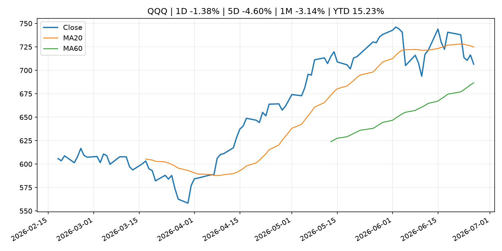
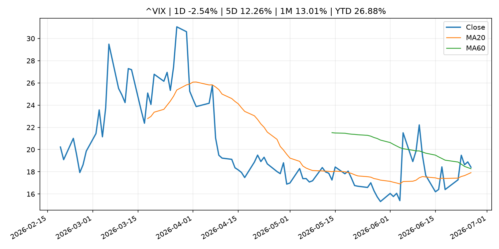
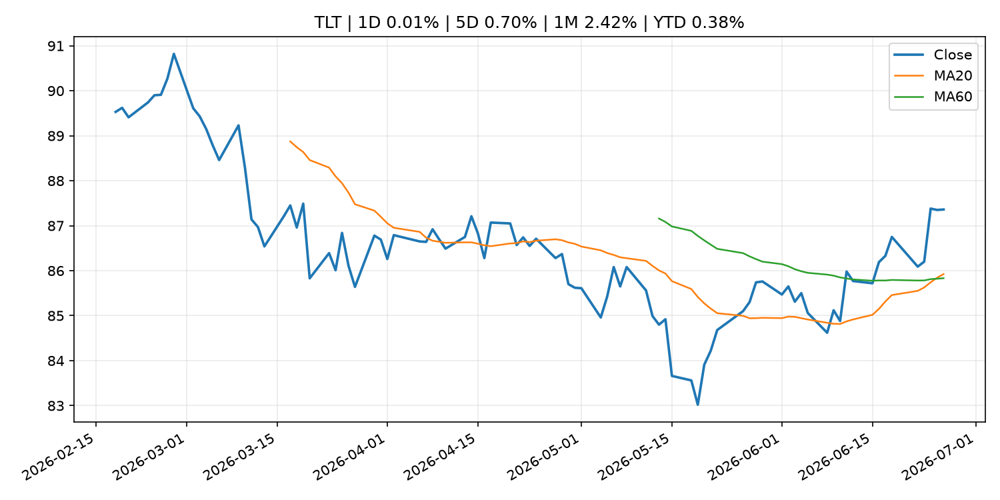
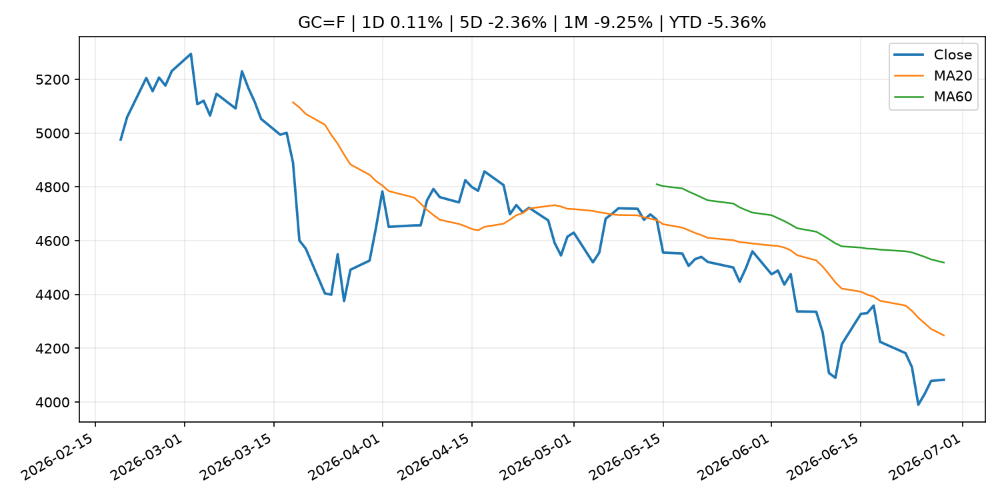
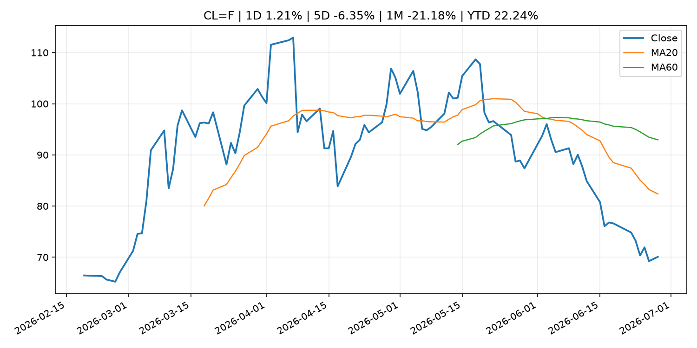
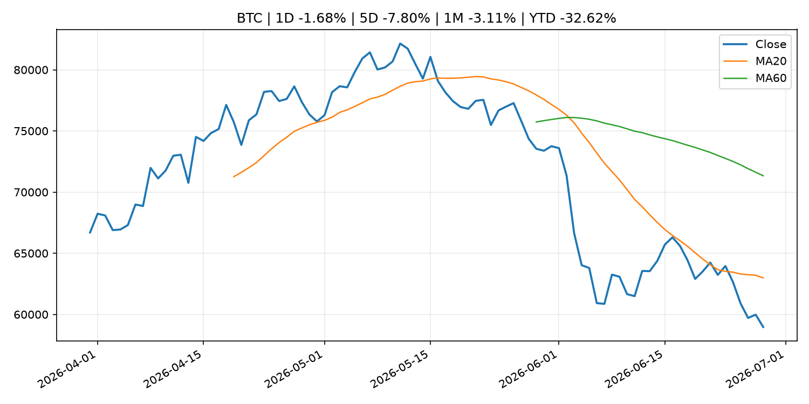
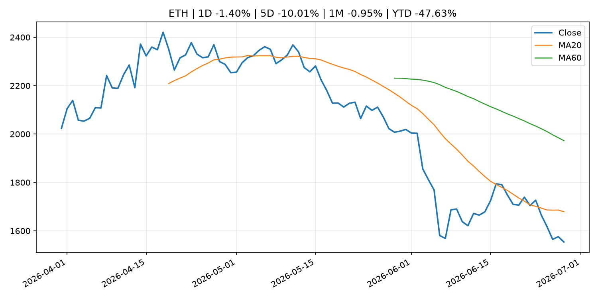
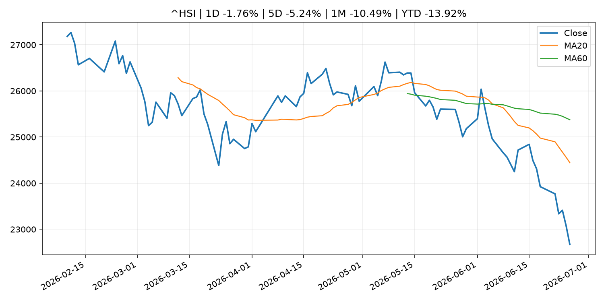

# Global Macro Morning Briefing - 2026-06-29

> Not financial advice / 非投资建议。

## 0. 今日总览
- 市场状态：unknown。市场信号不足，暂不判断明确状态。
- 今日三大主线：
  1. fiscal_policy: ‘I’ll happily wait’: Does delaying Social Security make sense for high earners like me?
- 一句话结论：今日晨报重点关注：财政和贸易政策会影响增长、通胀、企业利润和跨境资本流。；这条信息暂未匹配到重大宏观、政策或市场事件，更适合作为背景跟踪。。跨资产方面，SPY 1D -0.72%；QQQ 1D -1.38%；^VIX 1D -2.54%；TLT 1D 0.01%；GC=F 1D 0.11%；CL=F 1D 1.21%；BTC 1D -1.68%；ETH 1D -1.40%；市场信号不足，暂不判断明确状态。政策、通胀、利率、美元、美债、能源和加密监管仍是主要观察线索。所有结论仅基于公开数据与短摘要整理，不构成投资建议。

## 1. 隔夜跨资产市场
- 美股：SPY 1D -0.72%，QQQ 1D -1.38%，整体趋势需结合 VIX 和利率确认。
- 美债/美元：TLT 1D 0.01%，美元指数 1D 0.00%，是判断折现率压力的核心线索。
- 黄金/原油：黄金 1D 0.11%，原油 1D 1.21%，用于观察避险、通胀和地缘风险。
- 加密：BTC 1D -1.68%，ETH 1D -1.40%，关注是否独立于纳指走出加密自身行情。
- 港股/A股：恒生 1D -1.76%，沪深300/上证 1D n/a，重点看中国政策预期与人民币线索。
- 风险观察：关注后续数据是否确认当前跨资产信号。

### US_EQUITY

| symbol | latest close | 1D | 5D | 1M | YTD | trend |
|---|---:|---:|---:|---:|---:|---|
| SPY | 728.99 | -0.72% | -2.38% | -2.86% | 6.71% | range_bound |
| QQQ | 706.52 | -1.38% | -4.60% | -3.14% | 15.23% | range_bound |
| DIA | 517.75 | -0.29% | 0.43% | 2.14% | 7.05% | uptrend |
| IWM | 299.83 | 0.31% | 1.43% | 3.26% | 20.52% | strong_uptrend |
| VTI | 362.22 | -0.48% | -2.10% | -1.93% | 7.70% | range_bound |

### US_MACRO_MARKET

| symbol | latest close | 1D | 5D | 1M | YTD | trend |
|---|---:|---:|---:|---:|---:|---|
| ^VIX | 18.41 | -2.54% | 12.26% | 13.01% | 26.88% | range_bound |
| DX-Y.NYB | 101.36 | 0.00% | 0.34% | 2.36% | 2.99% | uptrend |
| TLT | 87.36 | 0.01% | 0.70% | 2.42% | 0.38% | uptrend |
| IEF | 95.03 | 0.25% | 0.71% | 0.75% | -1.09% | range_bound |

### COMMODITIES

| symbol | latest close | 1D | 5D | 1M | YTD | trend |
|---|---:|---:|---:|---:|---:|---|
| GC=F | 4,083.00 | 0.11% | -2.36% | -9.25% | -5.36% | strong_downtrend |
| SI=F | 59.25 | 0.06% | -9.58% | -21.67% | -16.02% | strong_downtrend |
| CL=F | 70.07 | 1.21% | -6.35% | -21.18% | 22.24% | strong_downtrend |
| BZ=F | 73.31 | 1.83% | -5.89% | -21.77% | 20.67% | strong_downtrend |
| NG=F | 3.31 | 2.29% | 1.60% | 0.61% | -8.65% | uptrend |
| HG=F | 6.20 | 0.89% | -2.52% | -3.13% | 9.86% | range_bound |

### HK_MARKET

| symbol | latest close | 1D | 5D | 1M | YTD | trend |
|---|---:|---:|---:|---:|---:|---|
| ^HSI | 22,671.86 | -1.76% | -5.24% | -10.49% | -13.92% | strong_downtrend |
| 0700.HK | 411.80 | -2.28% | -6.45% | -5.20% | -33.90% | strong_downtrend |
| 9988.HK | 89.50 | -5.79% | -14.68% | -28.00% | -39.93% | strong_downtrend |
| 3690.HK | 64.25 | -2.80% | -10.52% | -17.31% | -38.58% | strong_downtrend |
| 1810.HK | 21.42 | -3.95% | -12.86% | -24.58% | -46.82% | strong_downtrend |
| 1211.HK | 72.65 | -4.47% | -10.14% | -19.90% | -26.43% | strong_downtrend |

### CRYPTO

| symbol | latest close | 1D | 5D | 1M | YTD | trend |
|---|---:|---:|---:|---:|---:|---|
| BTC | 58,971.24 | -1.68% | -7.80% | -3.11% | -32.62% | strong_downtrend |
| ETH | 1,553.81 | -1.40% | -10.01% | -0.95% | -47.63% | downtrend |
| SOLANA | 70.06 | -2.47% | -2.48% | 12.71% | -43.74% | range_bound |
| BINANCECOIN | 546.12 | -3.66% | -7.36% | -4.93% | -36.73% | strong_downtrend |
| RIPPLE | 1.04 | -1.07% | -8.24% | -5.27% | -43.70% | strong_downtrend |

## 2. 今日最重要的 10 条新闻
### 1. ‘I’ll happily wait’: Does delaying Social Security make sense for high earners like me?
- 来源：MarketWatch Top Stories
- 时间：2026-06-28T11:00:00+00:00
- 地区：US
- 事件类型：fiscal_policy
- 重要性层级：Tier 1
- 一句话摘要：“In many states, Social Security benefits are exempt from state income tax.”
- 为什么重要：财政和贸易政策会影响增长、通胀、企业利润和跨境资本流。
- 可能影响：可能影响利率、汇率、风险资产或大宗商品预期，但当前公开信息不足以判断明确方向。
  - 资产：暂无明确资产映射
  - 方向：unknown
  - 强度：low
  - 原因：公开信息不足以判断方向。
- 原文链接：[https://www.marketwatch.com/story/ill-happily-wait-does-delaying-social-security-make-sense-for-high-earners-like-me-17dca69b?mod=mw_rss_topstories](https://www.marketwatch.com/story/ill-happily-wait-does-delaying-social-security-make-sense-for-high-earners-like-me-17dca69b?mod=mw_rss_topstories)

### 2. Isabel Schnabel: Is inflation back?
- 来源：ECB Press Releases
- 时间：2026-06-27T15:45:00+02:00
- 地区：EU
- 事件类型：other
- 重要性层级：Tier 3
- 一句话摘要：Isabel Schnabel: Is inflation back?
- 为什么重要：这条信息暂未匹配到重大宏观、政策或市场事件，更适合作为背景跟踪。
- 可能影响：主要影响 DXY，方向为 positive，强度 high；通胀压力可能推高政策利率预期并支撑美元。
  - 资产：DXY
    方向：positive
    强度：high
    原因：通胀压力可能推高政策利率预期并支撑美元。
  - 资产：TLT
    方向：negative
    强度：high
    原因：通胀上行通常推升收益率、压低长债价格。
  - 资产：QQQ
    方向：negative
    强度：high
    原因：更高利率对成长股估值折现率不利。
  - 资产：SPY
    方向：mixed
    强度：medium
    原因：名义增长可能支撑收入，但更高利率压制估值。
  - 资产：GC=F
    方向：mixed
    强度：medium
    原因：通胀对黄金是支撑，但实际利率上行会形成压力。
  - 资产：BTC
    方向：mixed
    强度：medium
    原因：抗通胀叙事和流动性收紧可能相互抵消。
- 原文链接：[https://www.ecb.europa.eu//press/key/date/2026/html/ecb.sp260627~3807c2766e.en.pdf](https://www.ecb.europa.eu//press/key/date/2026/html/ecb.sp260627~3807c2766e.en.pdf)

### 3. Why investors may want to prioritize bond markets outside the U.S.
- 来源：CNBC Economy
- 时间：2026-06-27T15:00:01+00:00
- 地区：US
- 事件类型：other
- 重要性层级：Tier 3
- 一句话摘要：Allspring Global Investments is pushing clients toward countries with central banks that are raising interest rates or have different inflation dynamics.
- 为什么重要：这条信息暂未匹配到重大宏观、政策或市场事件，更适合作为背景跟踪。
- 可能影响：主要影响 DXY，方向为 positive，强度 high；通胀压力可能推高政策利率预期并支撑美元。
  - 资产：DXY
    方向：positive
    强度：high
    原因：通胀压力可能推高政策利率预期并支撑美元。
  - 资产：TLT
    方向：negative
    强度：high
    原因：通胀上行通常推升收益率、压低长债价格。
  - 资产：QQQ
    方向：negative
    强度：high
    原因：更高利率对成长股估值折现率不利。
  - 资产：SPY
    方向：mixed
    强度：medium
    原因：名义增长可能支撑收入，但更高利率压制估值。
  - 资产：GC=F
    方向：mixed
    强度：medium
    原因：通胀对黄金是支撑，但实际利率上行会形成压力。
  - 资产：BTC
    方向：mixed
    强度：medium
    原因：抗通胀叙事和流动性收紧可能相互抵消。
- 原文链接：[https://www.cnbc.com/2026/06/27/inflation-as-major-reason-to-invest-in-global-bond-markets.html](https://www.cnbc.com/2026/06/27/inflation-as-major-reason-to-invest-in-global-bond-markets.html)

## 3. 政策与央行观察
### 1. ‘I’ll happily wait’: Does delaying Social Security make sense for high earners like me?
- 来源：MarketWatch Top Stories
- 时间：2026-06-28T11:00:00+00:00
- 地区：US
- 事件类型：fiscal_policy
- 重要性层级：Tier 1
- 一句话摘要：“In many states, Social Security benefits are exempt from state income tax.”
- 为什么重要：财政和贸易政策会影响增长、通胀、企业利润和跨境资本流。
- 可能影响：可能影响利率、汇率、风险资产或大宗商品预期，但当前公开信息不足以判断明确方向。
  - 资产：暂无明确资产映射
  - 方向：unknown
  - 强度：low
  - 原因：公开信息不足以判断方向。
- 原文链接：[https://www.marketwatch.com/story/ill-happily-wait-does-delaying-social-security-make-sense-for-high-earners-like-me-17dca69b?mod=mw_rss_topstories](https://www.marketwatch.com/story/ill-happily-wait-does-delaying-social-security-make-sense-for-high-earners-like-me-17dca69b?mod=mw_rss_topstories)

## 4. 市场异动与图表
- SPY 下跌 -0.72%
- QQQ 下跌 -1.38%
- Oil 上涨 1.21%

### SPY

### QQQ

### ^VIX

### TLT

### GC=F

### CL=F

### BTC

### ETH

### ^HSI

## 5. 华尔街与机构公开观点
- 暂无可靠公开观点。

## 6. 今日重点关注
- 经济数据：经济数据：暂无可靠公开日历数据；如配置经济日历源后可自动填充。
- 央行讲话：央行讲话：暂无可靠公开日历数据；重点跟踪 Fed、ECB、BoJ、PBOC 官网 RSS。
- 财报：财报：暂无可靠数据。
- 政策事件：政策事件：暂无可靠数据。
- 风险提醒：风险提醒：关注数据源失败项、突发地缘风险、利率和美元的二阶反应。

## 7. 英文金融表达与宏观概念
- **inflation expectations**：通胀预期，指家庭、企业或市场对未来通胀的预估。 例句：Inflation expectations can shape wage bargaining and bond yields.
- **real yield**：实际收益率，名义利率扣除通胀预期后的收益率。 例句：Gold often reacts more to real yields than nominal yields.
- **risk-off**：避险模式，资金偏向美元、国债、黄金等防御资产。 例句：A geopolitical shock can push markets into risk-off mode.
- **market structure**：市场结构，指交易、托管、清算、ETF、监管等制度安排。 例句：Crypto market structure rules can affect institutional participation.
- **terminal rate**：终端利率，市场预期本轮加息周期的最高政策利率。 例句：A higher terminal rate can pressure growth stocks.
- **soft landing**：软着陆，指通胀回落而经济避免明显衰退。 例句：Markets often rally when data support a soft landing.

## 8. 背景材料
- [Samson Mow says bitcoin bottom is in despite skepticism from analysts](https://www.coindesk.com/markets/2026/06/28/samson-mow-says-bitcoin-bottom-is-in-but-analysts-remain-divided)（CoinDesk，other）：Samson Mow says bitcoin bottom is in despite skepticism from analysts
- [Michael Saylor teases more bitcoin buying even as Strategy stock continues to fall](https://www.coindesk.com/markets/2026/06/28/michael-saylor-teases-more-bitcoin-buying-even-as-strategy-stock-continues-to-fall)（CoinDesk，other）：Michael Saylor teases more bitcoin buying even as Strategy stock continues to fall
- [‘She is retired’: Do I dip into my 401(k) to pay my mother’s $30,000 credit-card debt?](https://www.marketwatch.com/story/she-is-retired-do-i-dip-into-my-401-k-to-pay-my-mothers-30-000-credit-card-debt-dc97569b?mod=mw_rss_topstories)（MarketWatch Top Stories，other）：“I want her to live on her Social Security instead of using it to pay off her credit-card debt.”
- [Bitcoin falls below $60,000, on track for a rare back-to-back quarterly loss](https://www.coindesk.com/markets/2026/06/28/bitcoin-falls-below-usd60-000-on-track-for-a-rare-back-to-back-quarterly-loss)（CoinDesk，other）：Bitcoin falls below $60,000, on track for a rare back-to-back quarterly loss
- [SpaceX to join the Nasdaq-100 in a fast-tracked process that will drive huge ETF buying demand](https://www.cnbc.com/2026/06/26/spacex-added-to-nasdaq-100.html)（CNBC Economy，other）：Adding SpaceX this quickly would make the Elon Musk company one of the first beneficiaries of Nasdaq's recently adopted fast-track inclusion framework.
- [How to work in retirement without seeing your Social Security checks slashed](https://www.marketwatch.com/story/how-to-work-in-retirement-without-seeing-your-social-security-checks-slashed-05d6c830?mod=mw_rss_topstories)（MarketWatch Top Stories，other）：Claiming benefits before full retirement age while keeping a job can trigger unexpected withholdings — but the money isn’t lost forever.
- [Why a selloff in gold and silver is dragging bitcoin down](https://www.coindesk.com/markets/2026/06/27/why-a-selloff-in-gold-and-silver-is-dragging-bitcoin-down)（CoinDesk，other）：Why a selloff in gold and silver is dragging bitcoin down
- [Why investors may want to prioritize bond markets outside the U.S.](https://www.cnbc.com/2026/06/27/inflation-as-major-reason-to-invest-in-global-bond-markets.html)（CNBC Economy，other）：Allspring Global Investments is pushing clients toward countries with central banks that are raising interest rates or have different inflation dynamics.
- [Tether putting $23 billion gold stockpile to work with bullion-backed loans](https://www.coindesk.com/business/2026/06/27/tether-putting-usd23-billion-gold-stockpile-to-work-with-bullion-backed-loans)（CoinDesk，other）：Tether putting $23 billion gold stockpile to work with bullion-backed loans
- [Coinbase and OKX try to lure in Binance’s EU users after it failed to secure a MiCA license](https://www.coindesk.com/business/2026/06/27/coinbase-and-okx-try-to-lure-in-binance-s-450m-eu-users-after-failing-to-secure-a-mica-license)（CoinDesk，other）：Coinbase and OKX try to lure in Binance’s EU users after it failed to secure a MiCA license
- [Isabel Schnabel: Is inflation back?](https://www.ecb.europa.eu//press/key/date/2026/html/ecb.sp260627~3807c2766e.en.pdf)（ECB Press Releases，other）：Isabel Schnabel: Is inflation back?
- [Strategy's valuation has fallen below the value of its bitcoin holdings](https://www.coindesk.com/markets/2026/06/27/strategy-s-valuation-has-fallen-below-the-value-of-its-bitcoin-holdings)（CoinDesk，other）：Strategy's valuation has fallen below the value of its bitcoin holdings
- [Ripple CEO stays bullish on bitcoin but says Saylor's strategy has hurt crypto](https://www.coindesk.com/markets/2026/06/27/ripple-ceo-stays-bullish-on-bitcoin-but-says-saylor-s-strategy-has-hurt-crypto)（CoinDesk，other）：Ripple CEO stays bullish on bitcoin but says Saylor's strategy has hurt crypto

## 9. 数据源、失败项与免责声明
- 采集时间：2026-06-28T23:01:41
- 数据源：公开 RSS、Yahoo Finance、CoinGecko、AKShare、FRED、SEC data.sec.gov，以及用户自有 inputs/reports 文件。
- 合规说明：不绕过 WSJ、Bloomberg、FT、Reuters 等付费墙；对付费媒体只使用公开 RSS 标题、摘要、链接和发布时间。
- 免责声明：Not financial advice / 非投资建议。本项目仅供个人学习、研究和信息整理，不构成投资建议、交易建议或任何收益承诺。
- 失败或跳过的数据源：
  - crypto data failed coin=dogecoin
  - China market data failed symbol=上证指数: empty dataframe
  - China market data failed symbol=深证成指: empty dataframe
  - China market data failed symbol=创业板指: empty dataframe
  - China market data failed symbol=沪深300: empty dataframe
  - China market data failed symbol=中证500: empty dataframe
  - China market data failed symbol=科创50: empty dataframe
  - FRED_API_KEY not set; skipping FRED macro series
  - SEC failed cik=0000320193
  - SEC failed cik=0000789019
  - SEC failed cik=0001045810
  - SEC failed cik=0001318605
  - SEC failed cik=0001577552
