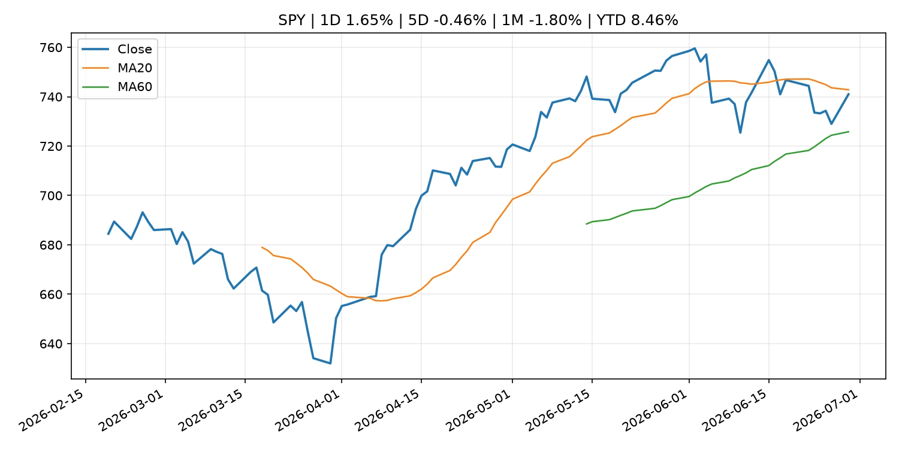
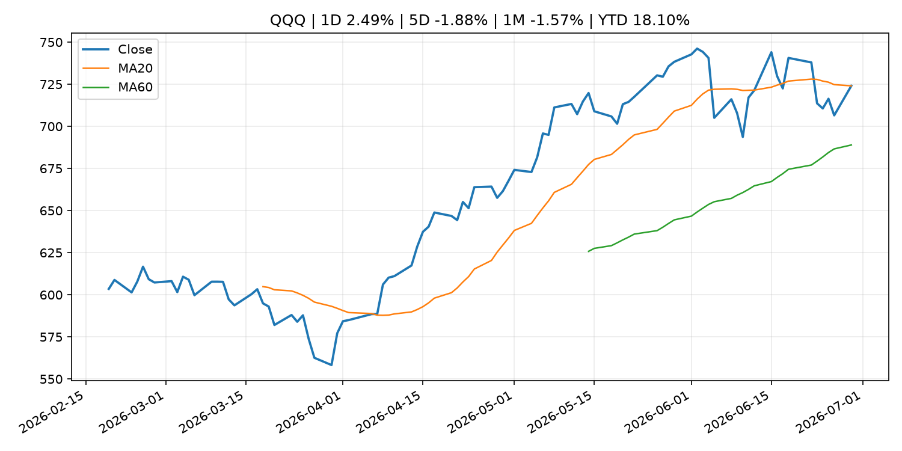
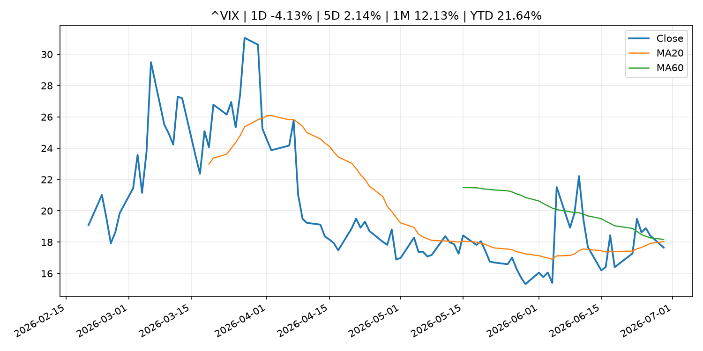
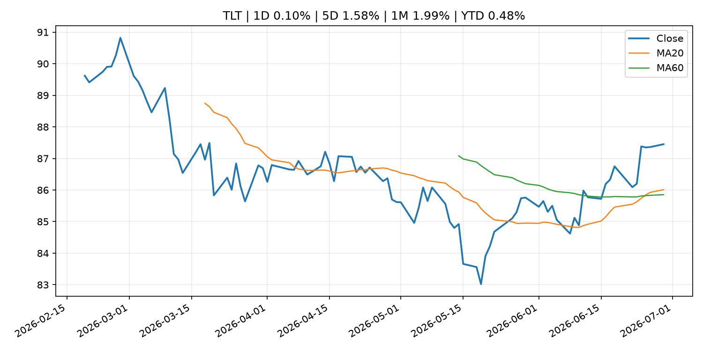
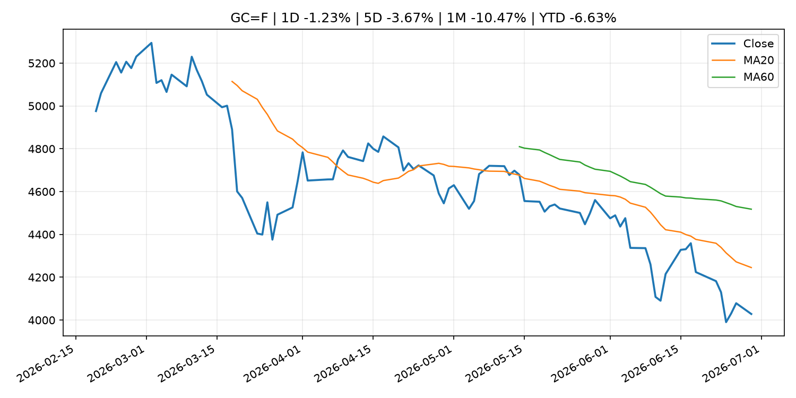
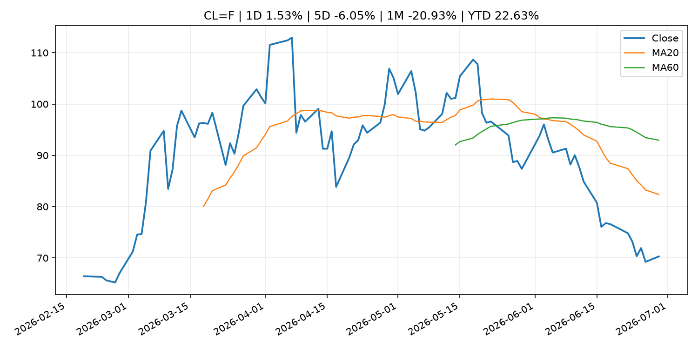
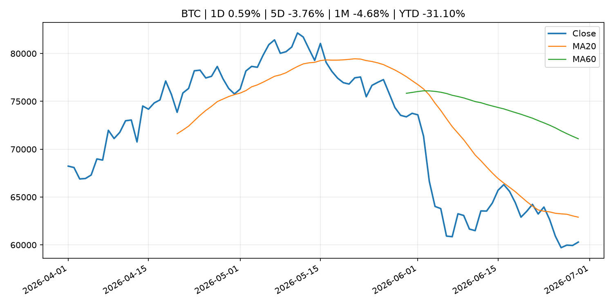
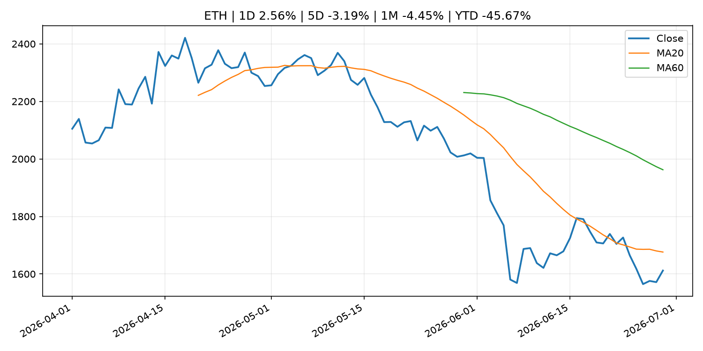
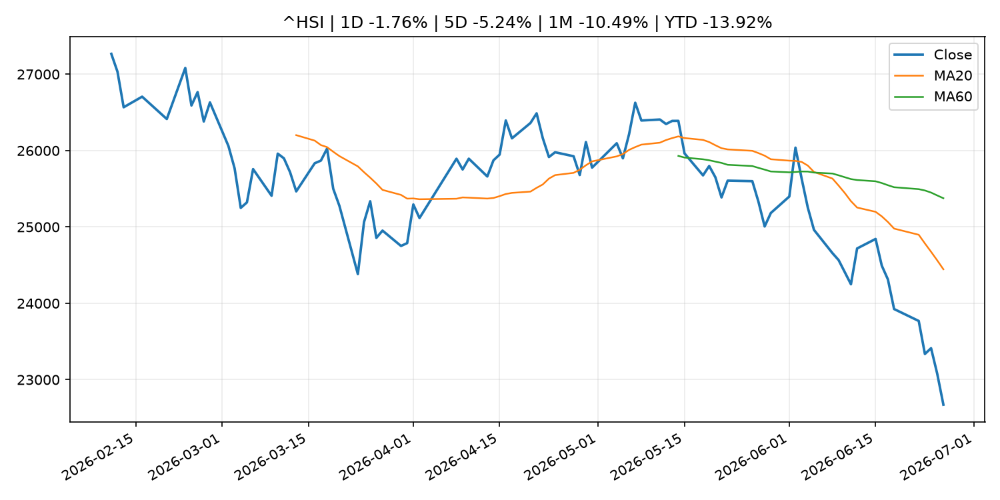

# Global Macro Morning Briefing - 2026-06-30

> Not financial advice / 非投资建议。

## 0. 今日总览
- 市场状态：risk_on。股指上涨、波动率或美元回落，市场更接近风险偏好改善。
- 今日三大主线：
  1. financial_stability: Liquidity Indicators in the JGB Markets (May)
  2. crypto_market_structure: Wall Street's BNY expands stablecoin services for institutions, starting with Circle's USDC
- 一句话结论：今日晨报重点关注：金融稳定信号可能放大跨资产波动，并影响央行反应函数。；加密市场结构和监管变化会影响 BTC、ETH 及相关股票的风险溢价。。跨资产方面，SPY 1D 1.65%；QQQ 1D 2.49%；^VIX 1D -4.13%；TLT 1D 0.10%；GC=F 1D -1.23%；CL=F 1D 1.53%；BTC 1D 0.59%；ETH 1D 2.56%；股指上涨、波动率或美元回落，市场更接近风险偏好改善。政策、通胀、利率、美元、美债、能源和加密监管仍是主要观察线索。所有结论仅基于公开数据与短摘要整理，不构成投资建议。

## 1. 隔夜跨资产市场
- 美股：SPY 1D 1.65%，QQQ 1D 2.49%，整体趋势需结合 VIX 和利率确认。
- 美债/美元：TLT 1D 0.10%，美元指数 1D -0.25%，是判断折现率压力的核心线索。
- 黄金/原油：黄金 1D -1.23%，原油 1D 1.53%，用于观察避险、通胀和地缘风险。
- 加密：BTC 1D 0.59%，ETH 1D 2.56%，关注是否独立于纳指走出加密自身行情。
- 港股/A股：恒生 1D -1.76%，沪深300/上证 1D n/a，重点看中国政策预期与人民币线索。
- 风险观察：确认风险偏好是否扩散到小盘股、信用利差和周期品。

### US_EQUITY

| symbol | latest close | 1D | 5D | 1M | YTD | trend |
|---|---:|---:|---:|---:|---:|---|
| SPY | 741.00 | 1.65% | -0.46% | -1.80% | 8.46% | range_bound |
| QQQ | 724.08 | 2.49% | -1.88% | -1.57% | 18.10% | uptrend |
| DIA | 521.68 | 0.76% | 0.89% | 2.89% | 7.87% | uptrend |
| IWM | 298.97 | -0.29% | 0.26% | 2.38% | 20.17% | uptrend |
| VTI | 367.12 | 1.35% | -0.46% | -1.22% | 9.16% | uptrend |

### US_MACRO_MARKET

| symbol | latest close | 1D | 5D | 1M | YTD | trend |
|---|---:|---:|---:|---:|---:|---|
| ^VIX | 17.65 | -4.13% | 2.14% | 12.13% | 21.64% | downtrend |
| DX-Y.NYB | 101.11 | -0.25% | 0.09% | 2.11% | 2.73% | uptrend |
| TLT | 87.45 | 0.10% | 1.58% | 1.99% | 0.48% | uptrend |
| IEF | 95.06 | 0.03% | 1.13% | 0.55% | -1.06% | range_bound |

### COMMODITIES

| symbol | latest close | 1D | 5D | 1M | YTD | trend |
|---|---:|---:|---:|---:|---:|---|
| GC=F | 4,028.40 | -1.23% | -3.67% | -10.47% | -6.63% | strong_downtrend |
| SI=F | 58.71 | -0.86% | -10.41% | -22.39% | -16.80% | strong_downtrend |
| CL=F | 70.29 | 1.53% | -6.05% | -20.93% | 22.63% | strong_downtrend |
| BZ=F | 73.56 | 2.18% | -5.57% | -21.50% | 21.09% | strong_downtrend |
| NG=F | 3.17 | -1.86% | -2.52% | -3.47% | -12.35% | range_bound |
| HG=F | 6.18 | 0.55% | -2.85% | -3.45% | 9.49% | range_bound |

### HK_MARKET

| symbol | latest close | 1D | 5D | 1M | YTD | trend |
|---|---:|---:|---:|---:|---:|---|
| ^HSI | 22,671.86 | -1.76% | -5.24% | -10.49% | -13.92% | strong_downtrend |
| 0700.HK | 420.20 | 2.04% | -2.96% | -1.13% | -32.55% | downtrend |
| 9988.HK | 93.00 | 3.91% | -9.62% | -23.65% | -37.58% | strong_downtrend |
| 3690.HK | 67.65 | 5.29% | -6.04% | -7.71% | -35.33% | strong_downtrend |
| 1810.HK | 21.86 | 2.05% | -7.84% | -23.46% | -45.73% | strong_downtrend |
| 1211.HK | 72.90 | 0.34% | -6.96% | -19.27% | -26.18% | strong_downtrend |

### CRYPTO

| symbol | latest close | 1D | 5D | 1M | YTD | trend |
|---|---:|---:|---:|---:|---:|---|
| BTC | 60,297.12 | 0.59% | -3.76% | -4.68% | -31.10% | strong_downtrend |
| ETH | 1,611.96 | 2.56% | -3.19% | -4.45% | -45.67% | strong_downtrend |
| SOLANA | 75.12 | 6.61% | 7.92% | 13.42% | -39.67% | range_bound |
| BINANCECOIN | 559.78 | 0.60% | -3.07% | -7.31% | -35.15% | strong_downtrend |
| RIPPLE | 1.06 | 1.16% | -4.48% | -8.27% | -42.41% | strong_downtrend |

## 2. 今日最重要的 10 条新闻
### 1. Liquidity Indicators in the JGB Markets (May)
- 来源：Bank of Japan Announcements
- 时间：2026-06-29T16:00:00+09:00
- 地区：Japan
- 事件类型：financial_stability
- 重要性层级：Tier 1
- 一句话摘要：Liquidity Indicators in the JGB Markets (May)
- 为什么重要：金融稳定信号可能放大跨资产波动，并影响央行反应函数。
- 可能影响：可能影响利率、汇率、风险资产或大宗商品预期，但当前公开信息不足以判断明确方向。
  - 资产：暂无明确资产映射
  - 方向：unknown
  - 强度：low
  - 原因：公开信息不足以判断方向。
- 原文链接：[http://www.boj.or.jp/en/paym/bond/ryudo.pdf](http://www.boj.or.jp/en/paym/bond/ryudo.pdf)

### 2. Wall Street's BNY expands stablecoin services for institutions, starting with Circle's USDC
- 来源：CoinDesk
- 时间：2026-06-29T14:46:33+00:00
- 地区：global
- 事件类型：crypto_market_structure
- 重要性层级：Tier 2
- 一句话摘要：Wall Street's BNY expands stablecoin services for institutions, starting with Circle's USDC
- 为什么重要：加密市场结构和监管变化会影响 BTC、ETH 及相关股票的风险溢价。
- 可能影响：主要影响 BTC，方向为 mixed，强度 high；加密监管或 ETF 进展会改变 BTC 的资金流和风险溢价。
  - 资产：BTC
    方向：mixed
    强度：high
    原因：加密监管或 ETF 进展会改变 BTC 的资金流和风险溢价。
  - 资产：ETH
    方向：mixed
    强度：high
    原因：监管框架会影响 ETH 产品化和机构参与度。
  - 资产：COIN
    方向：mixed
    强度：medium
    原因：监管清晰度和执法风险会影响交易平台估值。
  - 资产：crypto market
    方向：mixed
    强度：high
    原因：信息影响整个加密市场结构，但方向取决于细节。
- 原文链接：[https://www.coindesk.com/business/2026/06/29/wall-street-s-bny-expands-stablecoin-services-for-institutions-starting-with-circle-s-usdc](https://www.coindesk.com/business/2026/06/29/wall-street-s-bny-expands-stablecoin-services-for-institutions-starting-with-circle-s-usdc)

### 3. Value stocks beat growth when inflation is high. Here are 13 stocks top newsletters are betting on now.
- 来源：MarketWatch Top Stories
- 时间：2026-06-29T20:43:00+00:00
- 地区：US
- 事件类型：other
- 重要性层级：Tier 3
- 一句话摘要：Many portfolio experts are wrong about what drives value outperformance. This single metric explains why.
- 为什么重要：这条信息暂未匹配到重大宏观、政策或市场事件，更适合作为背景跟踪。
- 可能影响：主要影响 DXY，方向为 positive，强度 high；通胀压力可能推高政策利率预期并支撑美元。
  - 资产：DXY
    方向：positive
    强度：high
    原因：通胀压力可能推高政策利率预期并支撑美元。
  - 资产：TLT
    方向：negative
    强度：high
    原因：通胀上行通常推升收益率、压低长债价格。
  - 资产：QQQ
    方向：negative
    强度：high
    原因：更高利率对成长股估值折现率不利。
  - 资产：SPY
    方向：mixed
    强度：medium
    原因：名义增长可能支撑收入，但更高利率压制估值。
  - 资产：GC=F
    方向：mixed
    强度：medium
    原因：通胀对黄金是支撑，但实际利率上行会形成压力。
  - 资产：BTC
    方向：mixed
    强度：medium
    原因：抗通胀叙事和流动性收紧可能相互抵消。
- 原文链接：[https://www.marketwatch.com/story/value-stocks-beat-growth-when-inflation-is-high-here-are-13-stocks-top-newsletters-are-betting-on-now-f6f4a265?mod=mw_rss_topstories](https://www.marketwatch.com/story/value-stocks-beat-growth-when-inflation-is-high-here-are-13-stocks-top-newsletters-are-betting-on-now-f6f4a265?mod=mw_rss_topstories)

### 4. SpaceX to join the Nasdaq-100 in a fast-tracked process that will drive huge ETF buying demand
- 来源：CNBC Economy
- 时间：2026-06-29T13:50:19+00:00
- 地区：US
- 事件类型：other
- 重要性层级：Tier 3
- 一句话摘要：Adding SpaceX this quickly would make the Elon Musk company one of the first beneficiaries of Nasdaq's recently adopted fast-track inclusion framework.
- 为什么重要：这条信息暂未匹配到重大宏观、政策或市场事件，更适合作为背景跟踪。
- 可能影响：主要影响 BTC，方向为 mixed，强度 high；加密监管或 ETF 进展会改变 BTC 的资金流和风险溢价。
  - 资产：BTC
    方向：mixed
    强度：high
    原因：加密监管或 ETF 进展会改变 BTC 的资金流和风险溢价。
  - 资产：ETH
    方向：mixed
    强度：high
    原因：监管框架会影响 ETH 产品化和机构参与度。
  - 资产：COIN
    方向：mixed
    强度：medium
    原因：监管清晰度和执法风险会影响交易平台估值。
  - 资产：crypto market
    方向：mixed
    强度：high
    原因：信息影响整个加密市场结构，但方向取决于细节。
- 原文链接：[https://www.cnbc.com/2026/06/26/spacex-added-to-nasdaq-100.html](https://www.cnbc.com/2026/06/26/spacex-added-to-nasdaq-100.html)

## 3. 政策与央行观察
### 1. Liquidity Indicators in the JGB Markets (May)
- 来源：Bank of Japan Announcements
- 时间：2026-06-29T16:00:00+09:00
- 地区：Japan
- 事件类型：financial_stability
- 重要性层级：Tier 1
- 一句话摘要：Liquidity Indicators in the JGB Markets (May)
- 为什么重要：金融稳定信号可能放大跨资产波动，并影响央行反应函数。
- 可能影响：可能影响利率、汇率、风险资产或大宗商品预期，但当前公开信息不足以判断明确方向。
  - 资产：暂无明确资产映射
  - 方向：unknown
  - 强度：low
  - 原因：公开信息不足以判断方向。
- 原文链接：[http://www.boj.or.jp/en/paym/bond/ryudo.pdf](http://www.boj.or.jp/en/paym/bond/ryudo.pdf)

### 2. Wall Street's BNY expands stablecoin services for institutions, starting with Circle's USDC
- 来源：CoinDesk
- 时间：2026-06-29T14:46:33+00:00
- 地区：global
- 事件类型：crypto_market_structure
- 重要性层级：Tier 2
- 一句话摘要：Wall Street's BNY expands stablecoin services for institutions, starting with Circle's USDC
- 为什么重要：加密市场结构和监管变化会影响 BTC、ETH 及相关股票的风险溢价。
- 可能影响：主要影响 BTC，方向为 mixed，强度 high；加密监管或 ETF 进展会改变 BTC 的资金流和风险溢价。
  - 资产：BTC
    方向：mixed
    强度：high
    原因：加密监管或 ETF 进展会改变 BTC 的资金流和风险溢价。
  - 资产：ETH
    方向：mixed
    强度：high
    原因：监管框架会影响 ETH 产品化和机构参与度。
  - 资产：COIN
    方向：mixed
    强度：medium
    原因：监管清晰度和执法风险会影响交易平台估值。
  - 资产：crypto market
    方向：mixed
    强度：high
    原因：信息影响整个加密市场结构，但方向取决于细节。
- 原文链接：[https://www.coindesk.com/business/2026/06/29/wall-street-s-bny-expands-stablecoin-services-for-institutions-starting-with-circle-s-usdc](https://www.coindesk.com/business/2026/06/29/wall-street-s-bny-expands-stablecoin-services-for-institutions-starting-with-circle-s-usdc)

## 4. 市场异动与图表
- SPY 上涨 1.65%
- QQQ 上涨 2.49%
- VIX 下跌 -4.13%
- Gold 下跌 -1.23%
- Oil 上涨 1.53%
- ETH 上涨 2.56%

### SPY

### QQQ

### ^VIX

### TLT

### GC=F

### CL=F

### BTC

### ETH

### ^HSI

## 5. 华尔街与机构公开观点
- 暂无可靠公开观点。

## 6. 今日重点关注
- 经济数据：经济数据：暂无可靠公开日历数据；如配置经济日历源后可自动填充。
- 央行讲话：央行讲话：暂无可靠公开日历数据；重点跟踪 Fed、ECB、BoJ、PBOC 官网 RSS。
- 财报：财报：暂无可靠数据。
- 政策事件：政策事件：暂无可靠数据。
- 风险提醒：风险提醒：关注数据源失败项、突发地缘风险、利率和美元的二阶反应。

## 7. 英文金融表达与宏观概念
- **inflation expectations**：通胀预期，指家庭、企业或市场对未来通胀的预估。 例句：Inflation expectations can shape wage bargaining and bond yields.
- **real yield**：实际收益率，名义利率扣除通胀预期后的收益率。 例句：Gold often reacts more to real yields than nominal yields.
- **market structure**：市场结构，指交易、托管、清算、ETF、监管等制度安排。 例句：Crypto market structure rules can affect institutional participation.
- **terminal rate**：终端利率，市场预期本轮加息周期的最高政策利率。 例句：A higher terminal rate can pressure growth stocks.
- **soft landing**：软着陆，指通胀回落而经济避免明显衰退。 例句：Markets often rally when data support a soft landing.
- **risk-off**：避险模式，资金偏向美元、国债、黄金等防御资产。 例句：A geopolitical shock can push markets into risk-off mode.

## 8. 背景材料
- [Trump’s weekend Iran strikes keep sparking Monday stock rallies. Here’s what the data shows us.](https://www.marketwatch.com/story/trumps-weekend-iran-strikes-keep-sparking-monday-stock-rallies-heres-what-the-data-shows-us-f22da0ea?mod=mw_rss_topstories)（MarketWatch Top Stories，other）：Call it the ‘Axios put’: On average, stocks have been up more on Mondays in the second quarter than in recent years
- [‘I claimed Social Security at 62’: At 76, I’m working at Walmart. Why do I still owe payroll taxes?](https://www.marketwatch.com/story/i-claimed-social-security-at-62-at-76-im-working-at-walmart-why-do-i-still-owe-payroll-taxes-8e22a97c?mod=mw_rss_topstories)（MarketWatch Top Stories，other）：“It seems like half of the workforce at our local Walmart is over 65.”
- [Value stocks beat growth when inflation is high. Here are 13 stocks top newsletters are betting on now.](https://www.marketwatch.com/story/value-stocks-beat-growth-when-inflation-is-high-here-are-13-stocks-top-newsletters-are-betting-on-now-f6f4a265?mod=mw_rss_topstories)（MarketWatch Top Stories，other）：Many portfolio experts are wrong about what drives value outperformance. This single metric explains why.
- [Bye-bye, ‘HODL’: Strategy now has a plan to sell bitcoin to raise cash and buy its stock](https://www.marketwatch.com/story/strategy-can-now-sell-bitcoin-to-buy-back-stock-the-opposite-of-what-its-been-doing-db506fdb?mod=mw_rss_topstories)（MarketWatch Top Stories，other）：Strategy disclosed a program to sell bitcoin “from time to time” to fund its U.S. dollar reserve and share repurchases.
- [Christine Lagarde: Back to basics in an uncertain environment](https://www.ecb.europa.eu//press/key/date/2026/html/ecb.sp260629~cb5a2e2168.en.html)（ECB Press Releases，other）：Christine Lagarde: Back to basics in an uncertain environment
- [Bitcoin lending is entering a new institutional era, according to Silicon Valley Bank](https://www.coindesk.com/business/2026/06/29/bitcoin-lending-is-entering-a-new-institutional-era-according-to-silicon-valley-bank)（CoinDesk，other）：Bitcoin lending is entering a new institutional era, according to Silicon Valley Bank
- [Strategy opens door to selling billions of bitcoin under new capital plan. Here's what it means](https://www.coindesk.com/markets/2026/06/29/strategy-opens-the-door-to-selling-bitcoin-under-new-capital-plan-here-s-what-it-means)（CoinDesk，other）：Strategy opens door to selling billions of bitcoin under new capital plan. Here's what it means
- [SpaceX to join the Nasdaq-100 in a fast-tracked process that will drive huge ETF buying demand](https://www.cnbc.com/2026/06/26/spacex-added-to-nasdaq-100.html)（CNBC Economy，other）：Adding SpaceX this quickly would make the Elon Musk company one of the first beneficiaries of Nasdaq's recently adopted fast-track inclusion framework.
- [Saylor's Strategy initiates buybacks and bitcoin monetization program, lifts STRC dividend](https://www.coindesk.com/markets/2026/06/29/saylor-s-strategy-initiates-buybacks-bitcoin-monetization-program-lifts-strc-dividend)（CoinDesk，other）：Saylor's Strategy initiates buybacks and bitcoin monetization program, lifts STRC dividend
- [Dollar, U.S. Treasury yield market positions may carry glimmer of hope for bitcoin](https://www.coindesk.com/daybook-us/2026/06/29/dollar-u-s-treasury-yield-market-positions-may-carry-glimmer-of-hope-for-bitcoin)（CoinDesk，other）：Dollar, U.S. Treasury yield market positions may carry glimmer of hope for bitcoin
- [Bitcoin hovers below $60,000 as crypto braces for a pivotal week](https://www.coindesk.com/markets/2026/06/29/bitcoin-hovers-below-usd60-000-as-crypto-braces-for-a-pivotal-week)（CoinDesk，other）：Bitcoin hovers below $60,000 as crypto braces for a pivotal week
- [Bitcoin falls into a technical no man’s land as major support levels sit miles away](https://www.coindesk.com/markets/2026/06/29/bitcoin-falls-into-a-technical-no-man-s-land-as-major-support-levels-sit-miles-away)（CoinDesk，other）：Bitcoin falls into a technical no man’s land as major support levels sit miles away
- [BIS warns stablecoins are more like ETFs than actual money, and they're creating FX risk](https://www.coindesk.com/markets/2026/06/29/bis-warns-stablecoins-are-more-like-etfs-than-actual-money-and-they-re-creating-fx-risk)（CoinDesk，other）：BIS warns stablecoins are more like ETFs than actual money, and they're creating FX risk

## 9. 数据源、失败项与免责声明
- 采集时间：2026-06-29T22:55:32
- 数据源：公开 RSS、Yahoo Finance、CoinGecko、AKShare、FRED、SEC data.sec.gov，以及用户自有 inputs/reports 文件。
- 合规说明：不绕过 WSJ、Bloomberg、FT、Reuters 等付费墙；对付费媒体只使用公开 RSS 标题、摘要、链接和发布时间。
- 免责声明：Not financial advice / 非投资建议。本项目仅供个人学习、研究和信息整理，不构成投资建议、交易建议或任何收益承诺。
- 失败或跳过的数据源：
  - crypto data failed coin=dogecoin
  - China market data failed symbol=上证指数: empty dataframe
  - China market data failed symbol=深证成指: empty dataframe
  - China market data failed symbol=创业板指: empty dataframe
  - China market data failed symbol=沪深300: empty dataframe
  - China market data failed symbol=中证500: empty dataframe
  - China market data failed symbol=科创50: empty dataframe
  - FRED_API_KEY not set; skipping FRED macro series
  - SEC failed cik=0000320193
  - SEC failed cik=0000789019
  - SEC failed cik=0001045810
  - SEC failed cik=0001318605
  - SEC failed cik=0001577552
