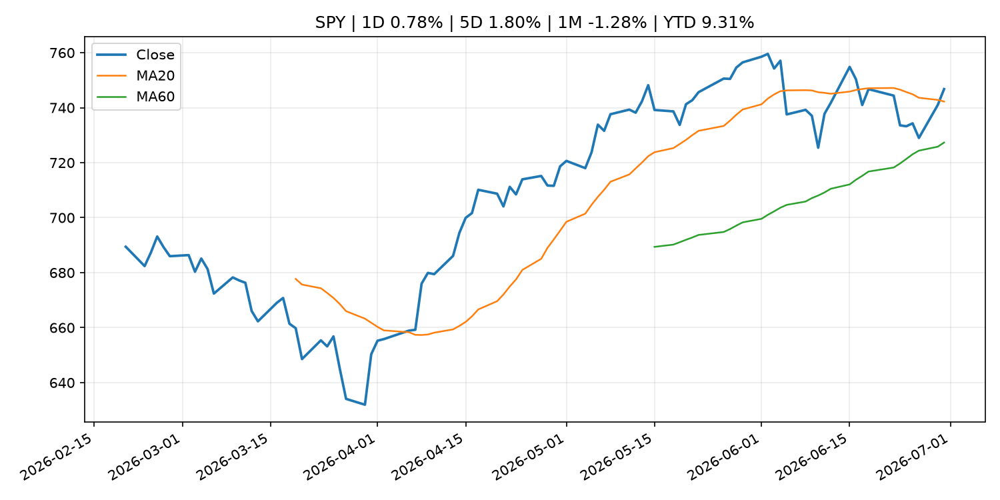
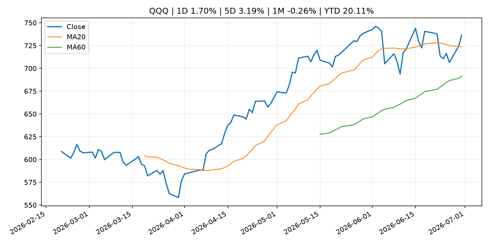
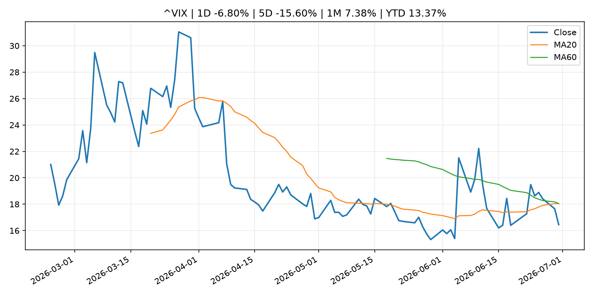
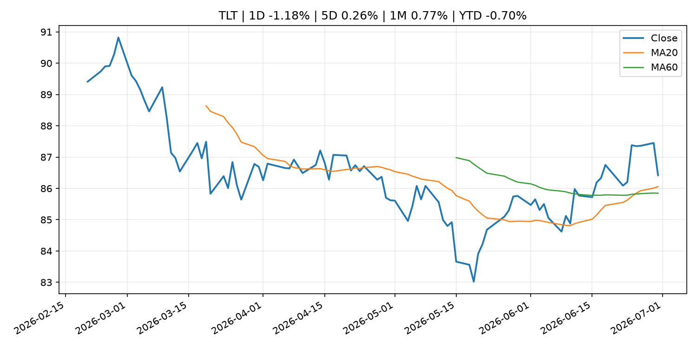
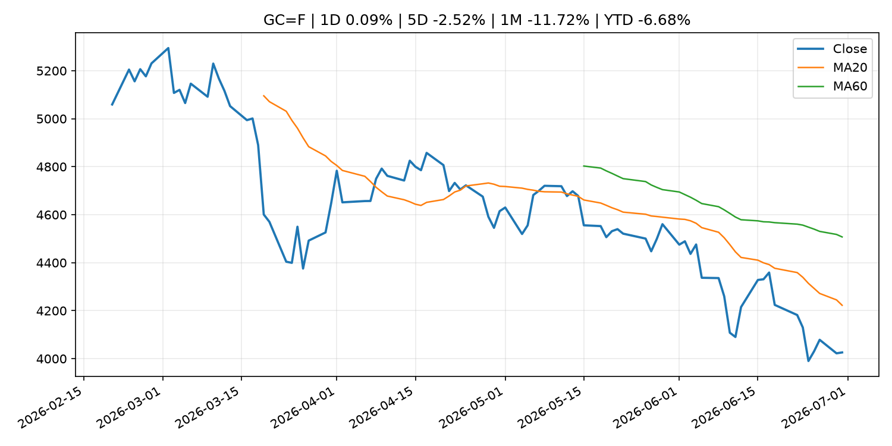
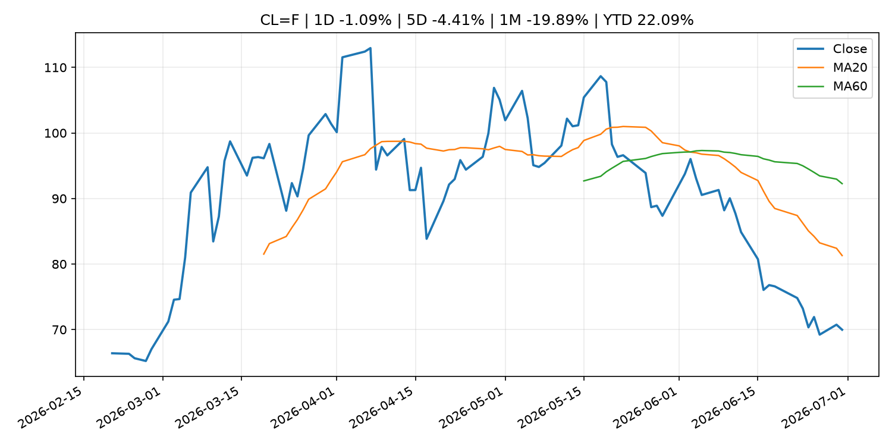
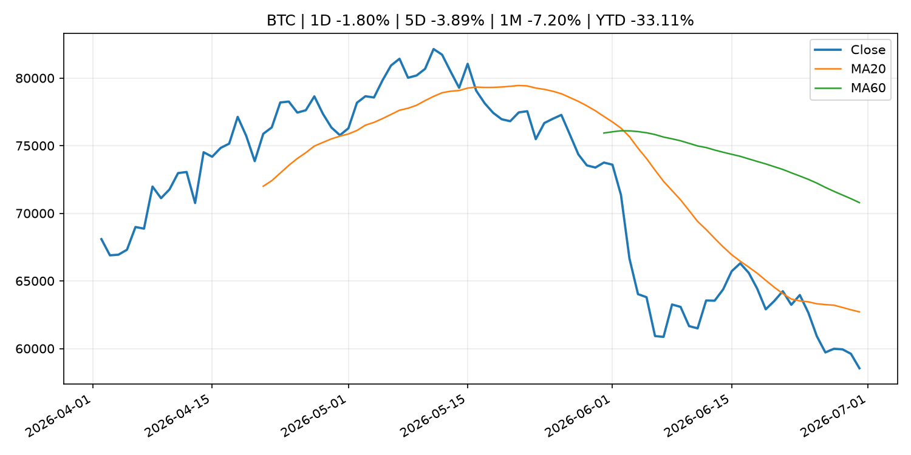
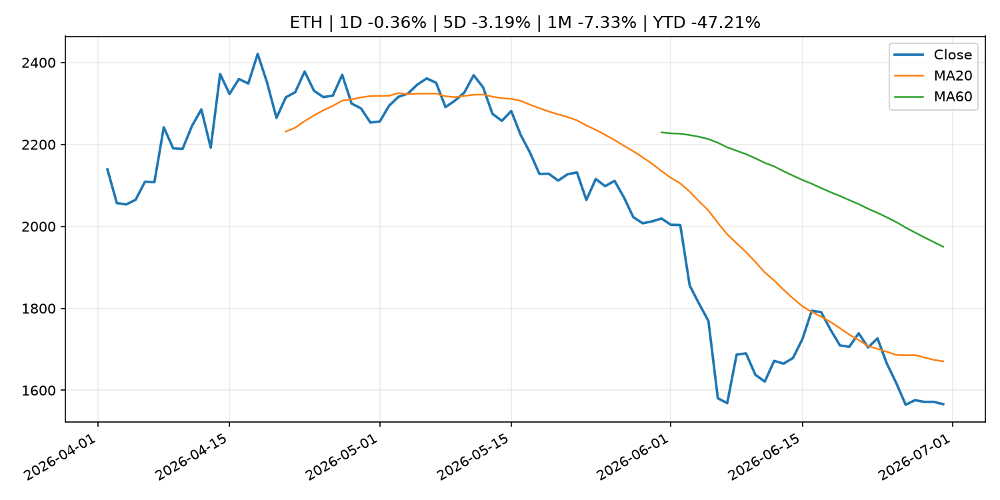
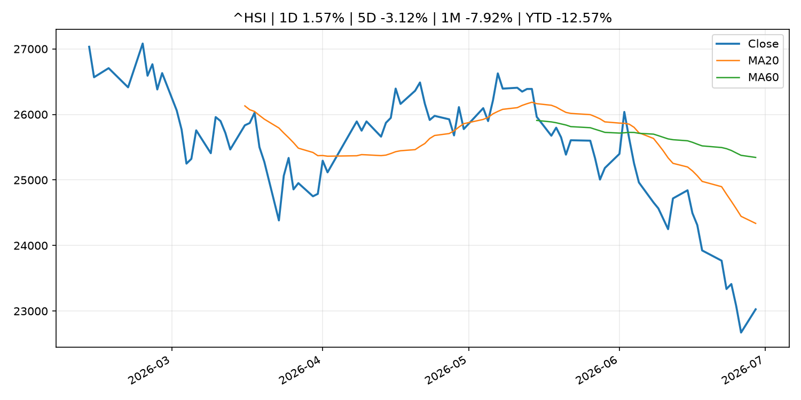

# Global Macro Morning Briefing - 2026-07-01

> Not financial advice / 非投资建议。

## 0. 今日总览
- 市场状态：risk_on。股指上涨、波动率或美元回落，市场更接近风险偏好改善。
- 今日三大主线：
  1. financial_stability: Liquidity Indicators in the JGB Markets (May)
  2. central_bank_speech: Cleveland Fed President Hammack says AI could fuel inflation, rate hikes may be necessary
  3. regulation: SEC Seeks Public Comment on Novel Exchange-Traded Funds
- 一句话结论：今日晨报重点关注：金融稳定信号可能放大跨资产波动，并影响央行反应函数。；央行官员表态可能影响市场对下一次会议的定价。。跨资产方面，SPY 1D 0.78%；QQQ 1D 1.70%；^VIX 1D -6.80%；TLT 1D -1.18%；GC=F 1D 0.09%；CL=F 1D -1.09%；BTC 1D -1.80%；ETH 1D -0.36%；股指上涨、波动率或美元回落，市场更接近风险偏好改善。政策、通胀、利率、美元、美债、能源和加密监管仍是主要观察线索。所有结论仅基于公开数据与短摘要整理，不构成投资建议。

## 1. 隔夜跨资产市场
- 美股：SPY 1D 0.78%，QQQ 1D 1.70%，整体趋势需结合 VIX 和利率确认。
- 美债/美元：TLT 1D -1.18%，美元指数 1D 0.06%，是判断折现率压力的核心线索。
- 黄金/原油：黄金 1D 0.09%，原油 1D -1.09%，用于观察避险、通胀和地缘风险。
- 加密：BTC 1D -1.80%，ETH 1D -0.36%，关注是否独立于纳指走出加密自身行情。
- 港股/A股：恒生 1D 1.57%，沪深300/上证 1D n/a，重点看中国政策预期与人民币线索。
- 风险观察：确认风险偏好是否扩散到小盘股、信用利差和周期品。

### US_EQUITY

| symbol | latest close | 1D | 5D | 1M | YTD | trend |
|---|---:|---:|---:|---:|---:|---|
| SPY | 746.77 | 0.78% | 1.80% | -1.28% | 9.31% | uptrend |
| QQQ | 736.40 | 1.70% | 3.19% | -0.26% | 20.11% | uptrend |
| DIA | 522.39 | 0.14% | 1.12% | 2.27% | 8.01% | uptrend |
| IWM | 300.45 | 0.50% | 1.74% | 3.45% | 20.77% | strong_uptrend |
| VTI | 370.04 | 0.80% | 1.74% | -0.67% | 10.03% | uptrend |

### US_MACRO_MARKET

| symbol | latest close | 1D | 5D | 1M | YTD | trend |
|---|---:|---:|---:|---:|---:|---|
| ^VIX | 16.45 | -6.80% | -15.60% | 7.38% | 13.37% | range_bound |
| DX-Y.NYB | 101.17 | 0.06% | -0.23% | 2.29% | 2.80% | uptrend |
| TLT | 86.42 | -1.18% | 0.26% | 0.77% | -0.70% | uptrend |
| IEF | 94.57 | -0.52% | 0.48% | -0.08% | -1.57% | range_bound |

### COMMODITIES

| symbol | latest close | 1D | 5D | 1M | YTD | trend |
|---|---:|---:|---:|---:|---:|---|
| GC=F | 4,026.00 | 0.09% | -2.52% | -11.72% | -6.68% | strong_downtrend |
| SI=F | 59.14 | 1.66% | -4.64% | -21.79% | -16.18% | strong_downtrend |
| CL=F | 69.98 | -1.09% | -4.41% | -19.89% | 22.09% | strong_downtrend |
| BZ=F | 73.35 | 0.27% | -4.84% | -20.32% | 20.74% | strong_downtrend |
| NG=F | 3.26 | 2.33% | 3.43% | -1.06% | -10.03% | uptrend |
| HG=F | 6.25 | 2.54% | 1.82% | -1.68% | 10.86% | range_bound |

### HK_MARKET

| symbol | latest close | 1D | 5D | 1M | YTD | trend |
|---|---:|---:|---:|---:|---:|---|
| ^HSI | 23,026.68 | 1.57% | -3.12% | -7.92% | -12.57% | strong_downtrend |
| 0700.HK | 429.80 | 2.28% | 3.62% | 0.61% | -31.01% | downtrend |
| 9988.HK | 92.85 | -0.16% | -6.16% | -23.20% | -37.68% | strong_downtrend |
| 3690.HK | 68.50 | 1.26% | -1.58% | -6.74% | -34.51% | strong_downtrend |
| 1810.HK | 21.64 | -1.01% | -4.33% | -22.82% | -46.28% | strong_downtrend |
| 1211.HK | 72.45 | -0.62% | -4.48% | -20.65% | -26.63% | strong_downtrend |

### CRYPTO

| symbol | latest close | 1D | 5D | 1M | YTD | trend |
|---|---:|---:|---:|---:|---:|---|
| BTC | 58,539.37 | -1.80% | -3.89% | -7.20% | -33.11% | strong_downtrend |
| ETH | 1,566.14 | -0.36% | -3.19% | -7.33% | -47.21% | strong_downtrend |
| SOLANA | 73.29 | 2.65% | 7.96% | 9.86% | -41.14% | range_bound |
| BINANCECOIN | 544.63 | -1.15% | -3.34% | -9.47% | -36.90% | strong_downtrend |
| RIPPLE | 1.04 | -0.97% | -3.12% | -11.06% | -43.55% | strong_downtrend |

## 2. 今日最重要的 10 条新闻
### 1. Liquidity Indicators in the JGB Markets (May)
- 来源：Bank of Japan Announcements
- 时间：2026-06-29T16:00:00+09:00
- 地区：Japan
- 事件类型：financial_stability
- 重要性层级：Tier 1
- 一句话摘要：Liquidity Indicators in the JGB Markets (May)
- 为什么重要：金融稳定信号可能放大跨资产波动，并影响央行反应函数。
- 可能影响：可能影响利率、汇率、风险资产或大宗商品预期，但当前公开信息不足以判断明确方向。
  - 资产：暂无明确资产映射
  - 方向：unknown
  - 强度：low
  - 原因：公开信息不足以判断方向。
- 原文链接：[http://www.boj.or.jp/en/paym/bond/ryudo.pdf](http://www.boj.or.jp/en/paym/bond/ryudo.pdf)

### 2. Cleveland Fed President Hammack says AI could fuel inflation, rate hikes may be necessary
- 来源：CNBC Economy
- 时间：2026-06-30T18:27:17+00:00
- 地区：US
- 事件类型：central_bank_speech
- 重要性层级：Tier 2
- 一句话摘要："We've got inflation that's too high, and it's been too high for the past five years," Beth Hammack told CNBC's Sara Eisen.
- 为什么重要：央行官员表态可能影响市场对下一次会议的定价。
- 可能影响：主要影响 DXY，方向为 positive，强度 high；通胀压力可能推高政策利率预期并支撑美元。
  - 资产：DXY
    方向：positive
    强度：high
    原因：通胀压力可能推高政策利率预期并支撑美元。
  - 资产：TLT
    方向：negative
    强度：high
    原因：通胀上行通常推升收益率、压低长债价格。
  - 资产：QQQ
    方向：negative
    强度：high
    原因：更高利率对成长股估值折现率不利。
  - 资产：SPY
    方向：mixed
    强度：medium
    原因：名义增长可能支撑收入，但更高利率压制估值。
  - 资产：GC=F
    方向：mixed
    强度：medium
    原因：通胀对黄金是支撑，但实际利率上行会形成压力。
  - 资产：BTC
    方向：mixed
    强度：medium
    原因：抗通胀叙事和流动性收紧可能相互抵消。
- 原文链接：[https://www.cnbc.com/2026/06/30/cleveland-fed-president-hammack-sees-ai-fueling-inflation-says-rate-hikes-may-be-necessary.html](https://www.cnbc.com/2026/06/30/cleveland-fed-president-hammack-sees-ai-fueling-inflation-says-rate-hikes-may-be-necessary.html)

### 3. SEC Seeks Public Comment on Novel Exchange-Traded Funds
- 来源：SEC Press Releases
- 时间：2026-06-30T10:15:05-04:00
- 地区：US
- 事件类型：regulation
- 重要性层级：Tier 2
- 一句话摘要：The Securities and Exchange Commission today issued a request for public comment on exchange-traded funds (ETFs) seeking to invest in innovative asset classes or engage in novel investment strategies. The request focuses on ways to facilitate innovation…
- 为什么重要：监管变化会改变行业盈利预期和资产风险溢价。
- 可能影响：主要影响 BTC，方向为 mixed，强度 high；加密监管或 ETF 进展会改变 BTC 的资金流和风险溢价。
  - 资产：BTC
    方向：mixed
    强度：high
    原因：加密监管或 ETF 进展会改变 BTC 的资金流和风险溢价。
  - 资产：ETH
    方向：mixed
    强度：high
    原因：监管框架会影响 ETH 产品化和机构参与度。
  - 资产：COIN
    方向：mixed
    强度：medium
    原因：监管清晰度和执法风险会影响交易平台估值。
  - 资产：crypto market
    方向：mixed
    强度：high
    原因：信息影响整个加密市场结构，但方向取决于细节。
- 原文链接：[https://www.sec.gov/newsroom/press-releases/2026-60-sec-seeks-public-comment-novel-exchange-traded-funds](https://www.sec.gov/newsroom/press-releases/2026-60-sec-seeks-public-comment-novel-exchange-traded-funds)

### 4. SEC giving novel ETFs a rethink as it opens comment period on overhauling U.S. rules
- 来源：CoinDesk
- 时间：2026-06-30T17:51:57+00:00
- 地区：global
- 事件类型：regulation
- 重要性层级：Tier 2
- 一句话摘要：SEC giving novel ETFs a rethink as it opens comment period on overhauling U.S. rules
- 为什么重要：监管变化会改变行业盈利预期和资产风险溢价。
- 可能影响：主要影响 BTC，方向为 mixed，强度 high；加密监管或 ETF 进展会改变 BTC 的资金流和风险溢价。
  - 资产：BTC
    方向：mixed
    强度：high
    原因：加密监管或 ETF 进展会改变 BTC 的资金流和风险溢价。
  - 资产：ETH
    方向：mixed
    强度：high
    原因：监管框架会影响 ETH 产品化和机构参与度。
  - 资产：COIN
    方向：mixed
    强度：medium
    原因：监管清晰度和执法风险会影响交易平台估值。
  - 资产：crypto market
    方向：mixed
    强度：high
    原因：信息影响整个加密市场结构，但方向取决于细节。
- 原文链接：[https://www.coindesk.com/policy/2026/06/30/sec-giving-novel-etfs-a-rethink-as-it-opens-comment-period-on-overhauling-u-s-rules](https://www.coindesk.com/policy/2026/06/30/sec-giving-novel-etfs-a-rethink-as-it-opens-comment-period-on-overhauling-u-s-rules)

### 5. Circle craters 17% as Stripe, Coinbase and BlackRock back rival stablecoin network
- 来源：CoinDesk
- 时间：2026-06-30T14:32:33+00:00
- 地区：global
- 事件类型：crypto_market_structure
- 重要性层级：Tier 2
- 一句话摘要：Circle craters 17% as Stripe, Coinbase and BlackRock back rival stablecoin network
- 为什么重要：加密市场结构和监管变化会影响 BTC、ETH 及相关股票的风险溢价。
- 可能影响：主要影响 BTC，方向为 mixed，强度 high；加密监管或 ETF 进展会改变 BTC 的资金流和风险溢价。
  - 资产：BTC
    方向：mixed
    强度：high
    原因：加密监管或 ETF 进展会改变 BTC 的资金流和风险溢价。
  - 资产：ETH
    方向：mixed
    强度：high
    原因：监管框架会影响 ETH 产品化和机构参与度。
  - 资产：COIN
    方向：mixed
    强度：medium
    原因：监管清晰度和执法风险会影响交易平台估值。
  - 资产：crypto market
    方向：mixed
    强度：high
    原因：信息影响整个加密市场结构，但方向取决于细节。
- 原文链接：[https://www.coindesk.com/business/2026/06/30/circle-slides-8-as-stripe-coinbase-and-blackrock-back-rival-stablecoin-network](https://www.coindesk.com/business/2026/06/30/circle-slides-8-as-stripe-coinbase-and-blackrock-back-rival-stablecoin-network)

### 6. MetaMask launches Money Account with stablecoin yield and spending in one wallet
- 来源：CoinDesk
- 时间：2026-06-30T14:00:00+00:00
- 地区：global
- 事件类型：crypto_market_structure
- 重要性层级：Tier 2
- 一句话摘要：MetaMask launches Money Account with stablecoin yield and spending in one wallet
- 为什么重要：加密市场结构和监管变化会影响 BTC、ETH 及相关股票的风险溢价。
- 可能影响：主要影响 BTC，方向为 mixed，强度 high；加密监管或 ETF 进展会改变 BTC 的资金流和风险溢价。
  - 资产：BTC
    方向：mixed
    强度：high
    原因：加密监管或 ETF 进展会改变 BTC 的资金流和风险溢价。
  - 资产：ETH
    方向：mixed
    强度：high
    原因：监管框架会影响 ETH 产品化和机构参与度。
  - 资产：COIN
    方向：mixed
    强度：medium
    原因：监管清晰度和执法风险会影响交易平台估值。
  - 资产：crypto market
    方向：mixed
    强度：high
    原因：信息影响整个加密市场结构，但方向取决于细节。
- 原文链接：[https://www.coindesk.com/tech/2026/06/30/metamask-launches-money-account-with-stablecoin-yield-and-spending-in-one-wallet](https://www.coindesk.com/tech/2026/06/30/metamask-launches-money-account-with-stablecoin-yield-and-spending-in-one-wallet)

### 7. UK to lower stablecoin capital buffers, undercutting EU's MiCA requirements
- 来源：CoinDesk
- 时间：2026-06-30T10:08:48+00:00
- 地区：global
- 事件类型：crypto_market_structure
- 重要性层级：Tier 2
- 一句话摘要：UK to lower stablecoin capital buffers, undercutting EU's MiCA requirements
- 为什么重要：加密市场结构和监管变化会影响 BTC、ETH 及相关股票的风险溢价。
- 可能影响：主要影响 BTC，方向为 mixed，强度 high；加密监管或 ETF 进展会改变 BTC 的资金流和风险溢价。
  - 资产：BTC
    方向：mixed
    强度：high
    原因：加密监管或 ETF 进展会改变 BTC 的资金流和风险溢价。
  - 资产：ETH
    方向：mixed
    强度：high
    原因：监管框架会影响 ETH 产品化和机构参与度。
  - 资产：COIN
    方向：mixed
    强度：medium
    原因：监管清晰度和执法风险会影响交易平台估值。
  - 资产：crypto market
    方向：mixed
    强度：high
    原因：信息影响整个加密市场结构，但方向取决于细节。
- 原文链接：[https://www.coindesk.com/policy/2026/06/30/uk-to-lower-stablecoin-capital-buffers-undercutting-eu-s-mica-requirements](https://www.coindesk.com/policy/2026/06/30/uk-to-lower-stablecoin-capital-buffers-undercutting-eu-s-mica-requirements)

### 8. SEC wins $5.5 million default judgment over alleged fake crypto platform NanoBit
- 来源：CoinDesk
- 时间：2026-06-30T09:54:50+00:00
- 地区：global
- 事件类型：regulation
- 重要性层级：Tier 2
- 一句话摘要：SEC wins $5.5 million default judgment over alleged fake crypto platform NanoBit
- 为什么重要：监管变化会改变行业盈利预期和资产风险溢价。
- 可能影响：主要影响 BTC，方向为 mixed，强度 high；加密监管或 ETF 进展会改变 BTC 的资金流和风险溢价。
  - 资产：BTC
    方向：mixed
    强度：high
    原因：加密监管或 ETF 进展会改变 BTC 的资金流和风险溢价。
  - 资产：ETH
    方向：mixed
    强度：high
    原因：监管框架会影响 ETH 产品化和机构参与度。
  - 资产：COIN
    方向：mixed
    强度：medium
    原因：监管清晰度和执法风险会影响交易平台估值。
  - 资产：crypto market
    方向：mixed
    强度：high
    原因：信息影响整个加密市场结构，但方向取决于细节。
- 原文链接：[https://www.coindesk.com/policy/2026/06/30/sec-wins-usd5-5-million-default-judgment-over-alleged-fake-crypto-platform-nanobit](https://www.coindesk.com/policy/2026/06/30/sec-wins-usd5-5-million-default-judgment-over-alleged-fake-crypto-platform-nanobit)

### 9. SpaceX to join the Nasdaq-100 in a fast-tracked process that will drive huge ETF buying demand
- 来源：CNBC Economy
- 时间：2026-06-29T13:50:19+00:00
- 地区：US
- 事件类型：other
- 重要性层级：Tier 3
- 一句话摘要：Adding SpaceX this quickly would make the Elon Musk company one of the first beneficiaries of Nasdaq's recently adopted fast-track inclusion framework.
- 为什么重要：这条信息暂未匹配到重大宏观、政策或市场事件，更适合作为背景跟踪。
- 可能影响：主要影响 BTC，方向为 mixed，强度 high；加密监管或 ETF 进展会改变 BTC 的资金流和风险溢价。
  - 资产：BTC
    方向：mixed
    强度：high
    原因：加密监管或 ETF 进展会改变 BTC 的资金流和风险溢价。
  - 资产：ETH
    方向：mixed
    强度：high
    原因：监管框架会影响 ETH 产品化和机构参与度。
  - 资产：COIN
    方向：mixed
    强度：medium
    原因：监管清晰度和执法风险会影响交易平台估值。
  - 资产：crypto market
    方向：mixed
    强度：high
    原因：信息影响整个加密市场结构，但方向取决于细节。
- 原文链接：[https://www.cnbc.com/2026/06/26/spacex-added-to-nasdaq-100.html](https://www.cnbc.com/2026/06/26/spacex-added-to-nasdaq-100.html)

### 10. Investors piled into ETFs at a record pace in the first half of 2026. Here’s where their money is flowing.
- 来源：MarketWatch Top Stories
- 时间：2026-06-30T22:12:00+00:00
- 地区：US
- 事件类型：other
- 重要性层级：Tier 3
- 一句话摘要：Investors have poured money into exchange-traded funds at a rapid pace in the first half of 2026, demonstrating an unrelenting appetite for stocks associated with the AI theme.
- 为什么重要：这条信息暂未匹配到重大宏观、政策或市场事件，更适合作为背景跟踪。
- 可能影响：更偏背景信息，短期市场影响可能有限。
  - 资产：暂无明确资产映射
  - 方向：unknown
  - 强度：low
  - 原因：公开信息不足以判断方向。
- 原文链接：[https://www.marketwatch.com/story/investors-piled-into-etfs-at-a-record-pace-in-the-first-half-of-2026-heres-where-their-money-is-flowing-92a50cf5?mod=mw_rss_topstories](https://www.marketwatch.com/story/investors-piled-into-etfs-at-a-record-pace-in-the-first-half-of-2026-heres-where-their-money-is-flowing-92a50cf5?mod=mw_rss_topstories)

## 3. 政策与央行观察
### 1. Liquidity Indicators in the JGB Markets (May)
- 来源：Bank of Japan Announcements
- 时间：2026-06-29T16:00:00+09:00
- 地区：Japan
- 事件类型：financial_stability
- 重要性层级：Tier 1
- 一句话摘要：Liquidity Indicators in the JGB Markets (May)
- 为什么重要：金融稳定信号可能放大跨资产波动，并影响央行反应函数。
- 可能影响：可能影响利率、汇率、风险资产或大宗商品预期，但当前公开信息不足以判断明确方向。
  - 资产：暂无明确资产映射
  - 方向：unknown
  - 强度：low
  - 原因：公开信息不足以判断方向。
- 原文链接：[http://www.boj.or.jp/en/paym/bond/ryudo.pdf](http://www.boj.or.jp/en/paym/bond/ryudo.pdf)

### 2. Cleveland Fed President Hammack says AI could fuel inflation, rate hikes may be necessary
- 来源：CNBC Economy
- 时间：2026-06-30T18:27:17+00:00
- 地区：US
- 事件类型：central_bank_speech
- 重要性层级：Tier 2
- 一句话摘要："We've got inflation that's too high, and it's been too high for the past five years," Beth Hammack told CNBC's Sara Eisen.
- 为什么重要：央行官员表态可能影响市场对下一次会议的定价。
- 可能影响：主要影响 DXY，方向为 positive，强度 high；通胀压力可能推高政策利率预期并支撑美元。
  - 资产：DXY
    方向：positive
    强度：high
    原因：通胀压力可能推高政策利率预期并支撑美元。
  - 资产：TLT
    方向：negative
    强度：high
    原因：通胀上行通常推升收益率、压低长债价格。
  - 资产：QQQ
    方向：negative
    强度：high
    原因：更高利率对成长股估值折现率不利。
  - 资产：SPY
    方向：mixed
    强度：medium
    原因：名义增长可能支撑收入，但更高利率压制估值。
  - 资产：GC=F
    方向：mixed
    强度：medium
    原因：通胀对黄金是支撑，但实际利率上行会形成压力。
  - 资产：BTC
    方向：mixed
    强度：medium
    原因：抗通胀叙事和流动性收紧可能相互抵消。
- 原文链接：[https://www.cnbc.com/2026/06/30/cleveland-fed-president-hammack-sees-ai-fueling-inflation-says-rate-hikes-may-be-necessary.html](https://www.cnbc.com/2026/06/30/cleveland-fed-president-hammack-sees-ai-fueling-inflation-says-rate-hikes-may-be-necessary.html)

### 3. SEC Seeks Public Comment on Novel Exchange-Traded Funds
- 来源：SEC Press Releases
- 时间：2026-06-30T10:15:05-04:00
- 地区：US
- 事件类型：regulation
- 重要性层级：Tier 2
- 一句话摘要：The Securities and Exchange Commission today issued a request for public comment on exchange-traded funds (ETFs) seeking to invest in innovative asset classes or engage in novel investment strategies. The request focuses on ways to facilitate innovation…
- 为什么重要：监管变化会改变行业盈利预期和资产风险溢价。
- 可能影响：主要影响 BTC，方向为 mixed，强度 high；加密监管或 ETF 进展会改变 BTC 的资金流和风险溢价。
  - 资产：BTC
    方向：mixed
    强度：high
    原因：加密监管或 ETF 进展会改变 BTC 的资金流和风险溢价。
  - 资产：ETH
    方向：mixed
    强度：high
    原因：监管框架会影响 ETH 产品化和机构参与度。
  - 资产：COIN
    方向：mixed
    强度：medium
    原因：监管清晰度和执法风险会影响交易平台估值。
  - 资产：crypto market
    方向：mixed
    强度：high
    原因：信息影响整个加密市场结构，但方向取决于细节。
- 原文链接：[https://www.sec.gov/newsroom/press-releases/2026-60-sec-seeks-public-comment-novel-exchange-traded-funds](https://www.sec.gov/newsroom/press-releases/2026-60-sec-seeks-public-comment-novel-exchange-traded-funds)

### 4. SEC giving novel ETFs a rethink as it opens comment period on overhauling U.S. rules
- 来源：CoinDesk
- 时间：2026-06-30T17:51:57+00:00
- 地区：global
- 事件类型：regulation
- 重要性层级：Tier 2
- 一句话摘要：SEC giving novel ETFs a rethink as it opens comment period on overhauling U.S. rules
- 为什么重要：监管变化会改变行业盈利预期和资产风险溢价。
- 可能影响：主要影响 BTC，方向为 mixed，强度 high；加密监管或 ETF 进展会改变 BTC 的资金流和风险溢价。
  - 资产：BTC
    方向：mixed
    强度：high
    原因：加密监管或 ETF 进展会改变 BTC 的资金流和风险溢价。
  - 资产：ETH
    方向：mixed
    强度：high
    原因：监管框架会影响 ETH 产品化和机构参与度。
  - 资产：COIN
    方向：mixed
    强度：medium
    原因：监管清晰度和执法风险会影响交易平台估值。
  - 资产：crypto market
    方向：mixed
    强度：high
    原因：信息影响整个加密市场结构，但方向取决于细节。
- 原文链接：[https://www.coindesk.com/policy/2026/06/30/sec-giving-novel-etfs-a-rethink-as-it-opens-comment-period-on-overhauling-u-s-rules](https://www.coindesk.com/policy/2026/06/30/sec-giving-novel-etfs-a-rethink-as-it-opens-comment-period-on-overhauling-u-s-rules)

### 5. Circle craters 17% as Stripe, Coinbase and BlackRock back rival stablecoin network
- 来源：CoinDesk
- 时间：2026-06-30T14:32:33+00:00
- 地区：global
- 事件类型：crypto_market_structure
- 重要性层级：Tier 2
- 一句话摘要：Circle craters 17% as Stripe, Coinbase and BlackRock back rival stablecoin network
- 为什么重要：加密市场结构和监管变化会影响 BTC、ETH 及相关股票的风险溢价。
- 可能影响：主要影响 BTC，方向为 mixed，强度 high；加密监管或 ETF 进展会改变 BTC 的资金流和风险溢价。
  - 资产：BTC
    方向：mixed
    强度：high
    原因：加密监管或 ETF 进展会改变 BTC 的资金流和风险溢价。
  - 资产：ETH
    方向：mixed
    强度：high
    原因：监管框架会影响 ETH 产品化和机构参与度。
  - 资产：COIN
    方向：mixed
    强度：medium
    原因：监管清晰度和执法风险会影响交易平台估值。
  - 资产：crypto market
    方向：mixed
    强度：high
    原因：信息影响整个加密市场结构，但方向取决于细节。
- 原文链接：[https://www.coindesk.com/business/2026/06/30/circle-slides-8-as-stripe-coinbase-and-blackrock-back-rival-stablecoin-network](https://www.coindesk.com/business/2026/06/30/circle-slides-8-as-stripe-coinbase-and-blackrock-back-rival-stablecoin-network)

### 6. MetaMask launches Money Account with stablecoin yield and spending in one wallet
- 来源：CoinDesk
- 时间：2026-06-30T14:00:00+00:00
- 地区：global
- 事件类型：crypto_market_structure
- 重要性层级：Tier 2
- 一句话摘要：MetaMask launches Money Account with stablecoin yield and spending in one wallet
- 为什么重要：加密市场结构和监管变化会影响 BTC、ETH 及相关股票的风险溢价。
- 可能影响：主要影响 BTC，方向为 mixed，强度 high；加密监管或 ETF 进展会改变 BTC 的资金流和风险溢价。
  - 资产：BTC
    方向：mixed
    强度：high
    原因：加密监管或 ETF 进展会改变 BTC 的资金流和风险溢价。
  - 资产：ETH
    方向：mixed
    强度：high
    原因：监管框架会影响 ETH 产品化和机构参与度。
  - 资产：COIN
    方向：mixed
    强度：medium
    原因：监管清晰度和执法风险会影响交易平台估值。
  - 资产：crypto market
    方向：mixed
    强度：high
    原因：信息影响整个加密市场结构，但方向取决于细节。
- 原文链接：[https://www.coindesk.com/tech/2026/06/30/metamask-launches-money-account-with-stablecoin-yield-and-spending-in-one-wallet](https://www.coindesk.com/tech/2026/06/30/metamask-launches-money-account-with-stablecoin-yield-and-spending-in-one-wallet)

### 7. UK to lower stablecoin capital buffers, undercutting EU's MiCA requirements
- 来源：CoinDesk
- 时间：2026-06-30T10:08:48+00:00
- 地区：global
- 事件类型：crypto_market_structure
- 重要性层级：Tier 2
- 一句话摘要：UK to lower stablecoin capital buffers, undercutting EU's MiCA requirements
- 为什么重要：加密市场结构和监管变化会影响 BTC、ETH 及相关股票的风险溢价。
- 可能影响：主要影响 BTC，方向为 mixed，强度 high；加密监管或 ETF 进展会改变 BTC 的资金流和风险溢价。
  - 资产：BTC
    方向：mixed
    强度：high
    原因：加密监管或 ETF 进展会改变 BTC 的资金流和风险溢价。
  - 资产：ETH
    方向：mixed
    强度：high
    原因：监管框架会影响 ETH 产品化和机构参与度。
  - 资产：COIN
    方向：mixed
    强度：medium
    原因：监管清晰度和执法风险会影响交易平台估值。
  - 资产：crypto market
    方向：mixed
    强度：high
    原因：信息影响整个加密市场结构，但方向取决于细节。
- 原文链接：[https://www.coindesk.com/policy/2026/06/30/uk-to-lower-stablecoin-capital-buffers-undercutting-eu-s-mica-requirements](https://www.coindesk.com/policy/2026/06/30/uk-to-lower-stablecoin-capital-buffers-undercutting-eu-s-mica-requirements)

### 8. SEC wins $5.5 million default judgment over alleged fake crypto platform NanoBit
- 来源：CoinDesk
- 时间：2026-06-30T09:54:50+00:00
- 地区：global
- 事件类型：regulation
- 重要性层级：Tier 2
- 一句话摘要：SEC wins $5.5 million default judgment over alleged fake crypto platform NanoBit
- 为什么重要：监管变化会改变行业盈利预期和资产风险溢价。
- 可能影响：主要影响 BTC，方向为 mixed，强度 high；加密监管或 ETF 进展会改变 BTC 的资金流和风险溢价。
  - 资产：BTC
    方向：mixed
    强度：high
    原因：加密监管或 ETF 进展会改变 BTC 的资金流和风险溢价。
  - 资产：ETH
    方向：mixed
    强度：high
    原因：监管框架会影响 ETH 产品化和机构参与度。
  - 资产：COIN
    方向：mixed
    强度：medium
    原因：监管清晰度和执法风险会影响交易平台估值。
  - 资产：crypto market
    方向：mixed
    强度：high
    原因：信息影响整个加密市场结构，但方向取决于细节。
- 原文链接：[https://www.coindesk.com/policy/2026/06/30/sec-wins-usd5-5-million-default-judgment-over-alleged-fake-crypto-platform-nanobit](https://www.coindesk.com/policy/2026/06/30/sec-wins-usd5-5-million-default-judgment-over-alleged-fake-crypto-platform-nanobit)

## 4. 市场异动与图表
- SPY 上涨 0.78%
- QQQ 上涨 1.70%
- VIX 下跌 -6.80%
- TLT 下跌 -1.18%
- Oil 下跌 -1.09%

### SPY

### QQQ

### ^VIX

### TLT

### GC=F

### CL=F

### BTC

### ETH

### ^HSI

## 5. 华尔街与机构公开观点
- 暂无可靠公开观点。

## 6. 今日重点关注
- 经济数据：经济数据：暂无可靠公开日历数据；如配置经济日历源后可自动填充。
- 央行讲话：央行讲话：暂无可靠公开日历数据；重点跟踪 Fed、ECB、BoJ、PBOC 官网 RSS。
- 财报：财报：暂无可靠数据。
- 政策事件：政策事件：暂无可靠数据。
- 风险提醒：风险提醒：关注数据源失败项、突发地缘风险、利率和美元的二阶反应。

## 7. 英文金融表达与宏观概念
- **inflation expectations**：通胀预期，指家庭、企业或市场对未来通胀的预估。 例句：Inflation expectations can shape wage bargaining and bond yields.
- **real yield**：实际收益率，名义利率扣除通胀预期后的收益率。 例句：Gold often reacts more to real yields than nominal yields.
- **terminal rate**：终端利率，市场预期本轮加息周期的最高政策利率。 例句：A higher terminal rate can pressure growth stocks.
- **market structure**：市场结构，指交易、托管、清算、ETF、监管等制度安排。 例句：Crypto market structure rules can affect institutional participation.
- **soft landing**：软着陆，指通胀回落而经济避免明显衰退。 例句：Markets often rally when data support a soft landing.
- **risk-off**：避险模式，资金偏向美元、国债、黄金等防御资产。 例句：A geopolitical shock can push markets into risk-off mode.

## 8. 背景材料
- [Investors piled into ETFs at a record pace in the first half of 2026. Here’s where their money is flowing.](https://www.marketwatch.com/story/investors-piled-into-etfs-at-a-record-pace-in-the-first-half-of-2026-heres-where-their-money-is-flowing-92a50cf5?mod=mw_rss_topstories)（MarketWatch Top Stories，other）：Investors have poured money into exchange-traded funds at a rapid pace in the first half of 2026, demonstrating an unrelenting appetite for stocks associated with the AI theme.
- [Bitcoin ETFs were supposed to make selloffs less painful. That theory is being put to the test.](https://www.marketwatch.com/story/bitcoin-etfs-were-supposed-to-make-selloffs-less-painful-that-theory-is-being-put-to-the-test-f70ba3c6?mod=mw_rss_topstories)（MarketWatch Top Stories，other）：Crypto investors had hoped that increased institutional adoption and a crypto-friendly administration could help the largest cryptocurrency avoid the painful cycles it once experienced.
- [Trump’s energy secretary says global warming is ‘no big deal.’ Meanwhile, a heat emergency is striking the U.S.](https://www.marketwatch.com/story/trumps-energy-secretary-says-global-warming-is-no-big-deal-meanwhile-a-heat-emergency-is-striking-the-u-s-5f9674c3?mod=mw_rss_topstories)（MarketWatch Top Stories，other）：Government scientists warn people to stay indoors this weekend as temperatures in many areas could reach triple digits
- [Agencies release list of distressed or underserved nonmetropolitan middle-income geographies](https://www.federalreserve.gov/newsevents/pressreleases/bcreg20260630a.htm)（Federal Reserve Press Releases，other）：Agencies release list of distressed or underserved nonmetropolitan middle-income geographies
- [Tokenized securities need competition, not gatekeepers](https://www.coindesk.com/opinion/2026/06/29/tokenized-securities-need-competition-not-gatekeepers)（CoinDesk，other）：Tokenized securities need competition, not gatekeepers
- [Bitcoin’s quiet $59,000-$60,000 range is starting to look dangerous](https://www.coindesk.com/markets/2026/06/30/bitcoin-s-quiet-usd59-000-usd60-000-range-is-starting-to-look-dangerous)（CoinDesk，other）：Bitcoin’s quiet $59,000-$60,000 range is starting to look dangerous
- [Bitcoin $4.4 billion supply overhang emerges as institutional demand wilts](https://www.coindesk.com/daybook-us/2026/06/30/bitcoin-usd4-4-billion-supply-overhang-emerges-as-institutional-demand-wilts)（CoinDesk，other）：Bitcoin $4.4 billion supply overhang emerges as institutional demand wilts
- [Bitcoin nears 2024 lows as options traders pay up for downside protection](https://www.coindesk.com/markets/2026/06/30/bitcoin-nears-2024-lows-as-options-traders-pay-up-for-downside-protection)（CoinDesk，other）：Bitcoin nears 2024 lows as options traders pay up for downside protection
- [Strategy heads for 11th losing month in 12 as bitcoin weakness continues](https://www.coindesk.com/markets/2026/06/30/strategy-heads-for-eleventh-losing-month-in-twelve-as-bitcoin-weakness-continues)（CoinDesk，other）：Strategy heads for 11th losing month in 12 as bitcoin weakness continues
- [ECB publishes indicative operational calendars for 2028](https://www.ecb.europa.eu//press/pr/date/2026/html/ecb.pr260630_1~ff55b9e99a.en.html)（ECB Press Releases，other）：ECB publishes indicative operational calendars for 2028
- [ECB publishes indicative operational calendars for 2027](https://www.ecb.europa.eu//press/pr/date/2026/html/ecb.pr260630~9f54a0a4fb.en.html)（ECB Press Releases，other）：ECB publishes indicative operational calendars for 2027
- [Bitcoin's correlation with dollar-yen rate hits -0.90, undercutting 'carry trade' theory](https://www.coindesk.com/markets/2026/06/30/bitcoin-s-52-week-correlation-with-usd-jpy-hits-0-90-undercutting-carry-trade-theory)（CoinDesk，other）：Bitcoin's correlation with dollar-yen rate hits -0.90, undercutting 'carry trade' theory
- [Live updates: bitcoin closes out weak quarter; Trump reports over $1 billion in crypto proceeds](https://www.coindesk.com/tech/2026/06/30/live-updates-blackrock-s-ibit-sheds-usd300-million-as-bitcoin-demand-dwindles)（CoinDesk，other）：Live updates: bitcoin closes out weak quarter; Trump reports over $1 billion in crypto proceeds
- [Ether, solana and dogecoin slide as Strategy's bitcoin sales plan pressures market](https://www.coindesk.com/markets/2026/06/30/ether-solana-and-dogecoin-slide-as-strategy-s-bitcoin-sales-plan-pressures-market)（CoinDesk，other）：Ether, solana and dogecoin slide as Strategy's bitcoin sales plan pressures market
- [Payment and Settlement Statistics (May)](http://www.boj.or.jp/en/statistics/set/kess/release/2026/kess2605.pdf)（Bank of Japan Announcements，other）：Payment and Settlement Statistics (May)
- [IMES Discussion Paper Series (2026)](http://www.boj.or.jp/en/research/imes/dps/dps26.htm)（Bank of Japan Announcements，research_publication）：IMES Discussion Paper Series (2026)
- [Average Contract Interest Rates on Loans and Discounts (May)](http://www.boj.or.jp/en/statistics/dl/loan/yaku/yaku2605.pdf)（Bank of Japan Announcements，other）：Average Contract Interest Rates on Loans and Discounts (May)
- [Christine Lagarde: Back to basics in an uncertain environment](https://www.ecb.europa.eu//press/key/date/2026/html/ecb.sp260629~cb5a2e2168.en.html)（ECB Press Releases，other）：Christine Lagarde: Back to basics in an uncertain environment
- [SpaceX to join the Nasdaq-100 in a fast-tracked process that will drive huge ETF buying demand](https://www.cnbc.com/2026/06/26/spacex-added-to-nasdaq-100.html)（CNBC Economy，other）：Adding SpaceX this quickly would make the Elon Musk company one of the first beneficiaries of Nasdaq's recently adopted fast-track inclusion framework.

## 9. 数据源、失败项与免责声明
- 采集时间：2026-06-30T23:10:44
- 数据源：公开 RSS、Yahoo Finance、CoinGecko、AKShare、FRED、SEC data.sec.gov，以及用户自有 inputs/reports 文件。
- 合规说明：不绕过 WSJ、Bloomberg、FT、Reuters 等付费墙；对付费媒体只使用公开 RSS 标题、摘要、链接和发布时间。
- 免责声明：Not financial advice / 非投资建议。本项目仅供个人学习、研究和信息整理，不构成投资建议、交易建议或任何收益承诺。
- 失败或跳过的数据源：
  - crypto data failed coin=dogecoin
  - China market data failed symbol=上证指数: empty dataframe
  - China market data failed symbol=深证成指: empty dataframe
  - China market data failed symbol=创业板指: empty dataframe
  - China market data failed symbol=沪深300: empty dataframe
  - China market data failed symbol=中证500: empty dataframe
  - China market data failed symbol=科创50: empty dataframe
  - FRED_API_KEY not set; skipping FRED macro series
  - SEC failed cik=0000320193
  - SEC failed cik=0000789019
  - SEC failed cik=0001045810
  - SEC failed cik=0001318605
  - SEC failed cik=0001577552
