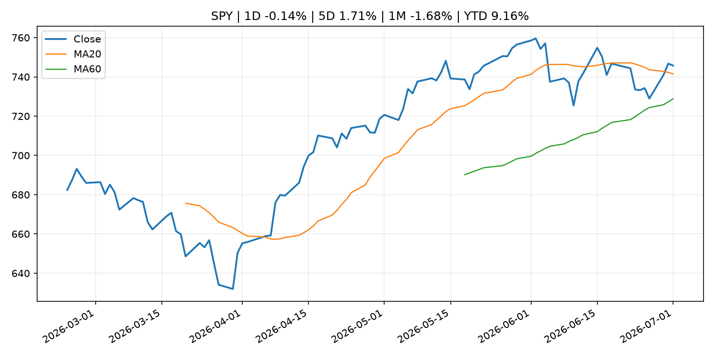
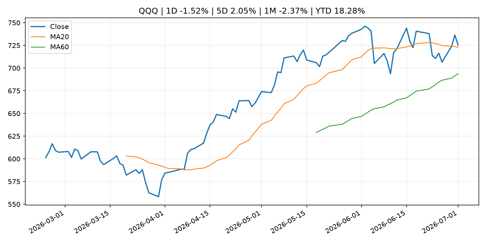
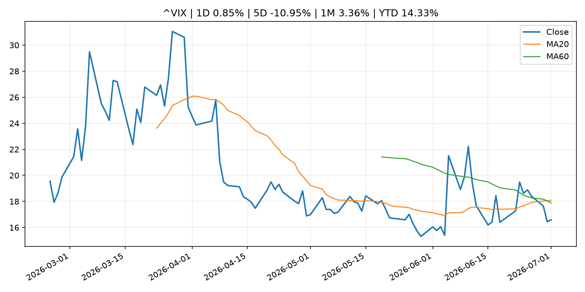
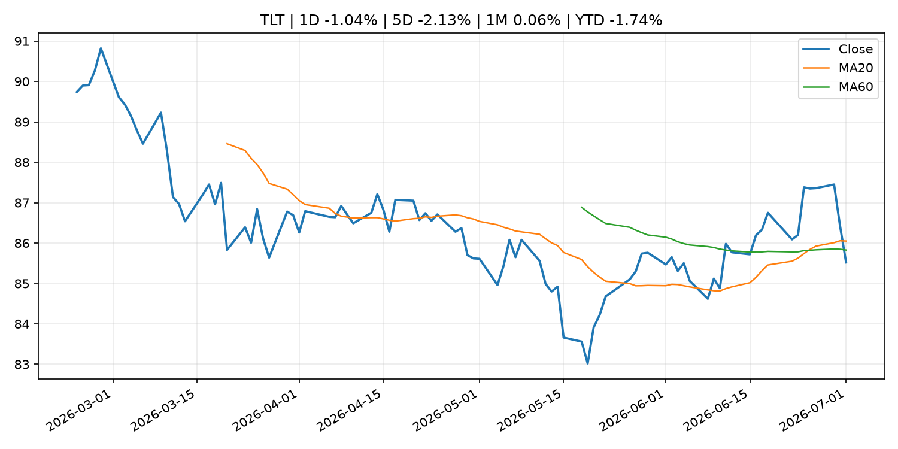
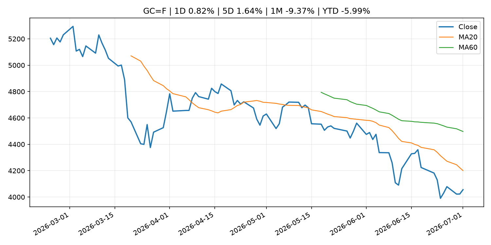
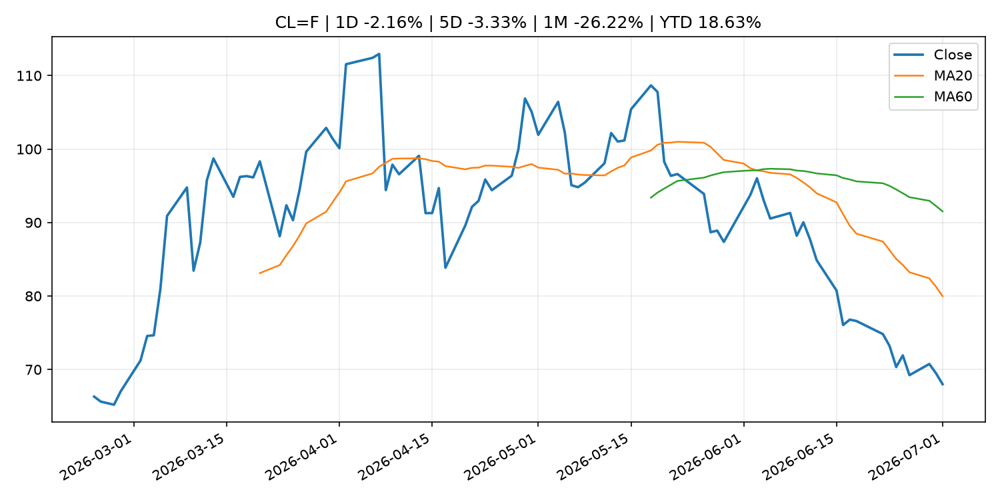
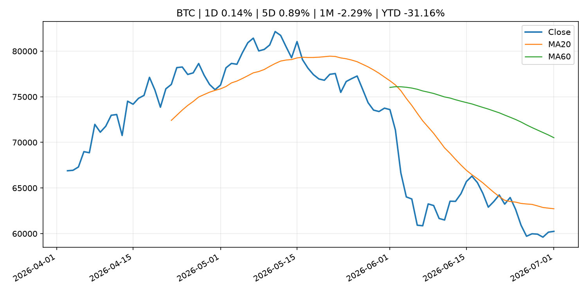
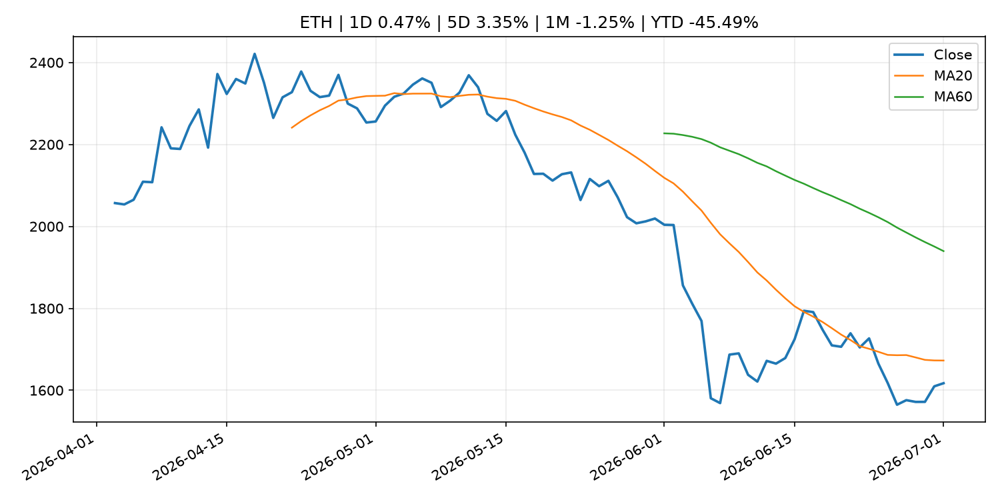
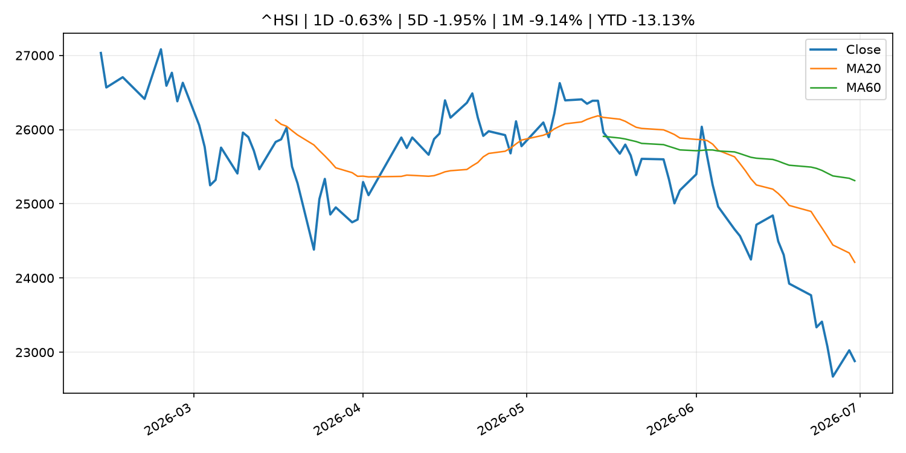

# Global Macro Morning Briefing - 2026-07-02

> Not financial advice / 非投资建议。

## 0. 今日总览
- 市场状态：unknown。市场信号不足，暂不判断明确状态。
- 今日三大主线：
  1. central_bank_speech: Bitcoin breaks above $60,000 after Fed Chair Warsh said inflation risks has come down
  2. central_bank_speech: Cleveland Fed President Hammack says AI could fuel inflation, rate hikes may be necessary
  3. regulation: SEC Publishes Updated Market Statistics, Highlighting Increase in IPOs and Proceeds Raised
- 一句话结论：今日晨报重点关注：央行官员表态可能影响市场对下一次会议的定价。；央行官员表态可能影响市场对下一次会议的定价。。跨资产方面，SPY 1D -0.14%；QQQ 1D -1.52%；^VIX 1D 0.85%；TLT 1D -1.04%；GC=F 1D 0.82%；CL=F 1D -2.16%；BTC 1D 0.14%；ETH 1D 0.47%；市场信号不足，暂不判断明确状态。政策、通胀、利率、美元、美债、能源和加密监管仍是主要观察线索。所有结论仅基于公开数据与短摘要整理，不构成投资建议。

## 1. 隔夜跨资产市场
- 美股：SPY 1D -0.14%，QQQ 1D -1.52%，整体趋势需结合 VIX 和利率确认。
- 美债/美元：TLT 1D -1.04%，美元指数 1D 0.22%，是判断折现率压力的核心线索。
- 黄金/原油：黄金 1D 0.82%，原油 1D -2.16%，用于观察避险、通胀和地缘风险。
- 加密：BTC 1D 0.14%，ETH 1D 0.47%，关注是否独立于纳指走出加密自身行情。
- 港股/A股：恒生 1D -0.63%，沪深300/上证 1D n/a，重点看中国政策预期与人民币线索。
- 风险观察：关注后续数据是否确认当前跨资产信号。

### US_EQUITY

| symbol | latest close | 1D | 5D | 1M | YTD | trend |
|---|---:|---:|---:|---:|---:|---|
| SPY | 745.76 | -0.14% | 1.71% | -1.68% | 9.16% | uptrend |
| QQQ | 725.17 | -1.52% | 2.05% | -2.37% | 18.28% | uptrend |
| DIA | 522.40 | 0.00% | 0.75% | 2.14% | 8.02% | uptrend |
| IWM | 299.32 | -0.38% | 0.89% | 3.58% | 20.32% | strong_uptrend |
| VTI | 369.27 | -0.21% | 1.55% | -1.11% | 9.80% | uptrend |

### US_MACRO_MARKET

| symbol | latest close | 1D | 5D | 1M | YTD | trend |
|---|---:|---:|---:|---:|---:|---|
| ^VIX | 16.59 | 0.85% | -10.95% | 3.36% | 14.33% | range_bound |
| DX-Y.NYB | 101.41 | 0.22% | -0.19% | 2.23% | 3.04% | uptrend |
| TLT | 85.52 | -1.04% | -2.13% | 0.06% | -1.74% | range_bound |
| IEF | 94.03 | -0.57% | -0.74% | -0.15% | -2.13% | downtrend |

### COMMODITIES

| symbol | latest close | 1D | 5D | 1M | YTD | trend |
|---|---:|---:|---:|---:|---:|---|
| GC=F | 4,055.80 | 0.82% | 1.64% | -9.37% | -5.99% | downtrend |
| SI=F | 59.85 | 0.62% | 3.09% | -20.21% | -15.18% | strong_downtrend |
| CL=F | 68.00 | -2.16% | -3.33% | -26.22% | 18.63% | strong_downtrend |
| BZ=F | 71.18 | -2.39% | -3.47% | -25.06% | 17.17% | strong_downtrend |
| NG=F | 3.21 | -2.02% | -0.37% | 0.94% | -11.30% | uptrend |
| HG=F | 6.16 | -0.52% | 3.66% | -5.57% | 9.23% | range_bound |

### HK_MARKET

| symbol | latest close | 1D | 5D | 1M | YTD | trend |
|---|---:|---:|---:|---:|---:|---|
| ^HSI | 22,881.02 | -0.63% | -1.95% | -9.14% | -13.13% | strong_downtrend |
| 0700.HK | 429.80 | 2.28% | 3.62% | 0.61% | -31.01% | downtrend |
| 9988.HK | 92.85 | -0.16% | -6.16% | -23.20% | -37.68% | strong_downtrend |
| 3690.HK | 68.50 | 1.26% | -1.58% | -6.74% | -34.51% | strong_downtrend |
| 1810.HK | 21.64 | -1.01% | -4.33% | -22.82% | -46.28% | strong_downtrend |
| 1211.HK | 72.45 | -0.62% | -4.48% | -20.65% | -26.63% | strong_downtrend |

### CRYPTO

| symbol | latest close | 1D | 5D | 1M | YTD | trend |
|---|---:|---:|---:|---:|---:|---|
| BTC | 60,246.42 | 0.14% | 0.89% | -2.29% | -31.16% | downtrend |
| ETH | 1,617.31 | 0.47% | 3.35% | -1.25% | -45.49% | downtrend |
| SOLANA | 77.60 | 3.48% | 14.74% | 19.45% | -37.68% | range_bound |
| BINANCECOIN | 552.17 | -1.17% | -1.36% | -6.88% | -36.03% | strong_downtrend |
| RIPPLE | 1.06 | -0.14% | 1.34% | -7.14% | -42.58% | strong_downtrend |

## 2. 今日最重要的 10 条新闻
### 1. Bitcoin breaks above $60,000 after Fed Chair Warsh said inflation risks has come down
- 来源：CoinDesk
- 时间：2026-07-01T14:36:00+00:00
- 地区：global
- 事件类型：central_bank_speech
- 重要性层级：Tier 2
- 一句话摘要：Bitcoin breaks above $60,000 after Fed Chair Warsh said inflation risks has come down
- 为什么重要：央行官员表态可能影响市场对下一次会议的定价。
- 可能影响：主要影响 DXY，方向为 positive，强度 high；通胀压力可能推高政策利率预期并支撑美元。
  - 资产：DXY
    方向：positive
    强度：high
    原因：通胀压力可能推高政策利率预期并支撑美元。
  - 资产：TLT
    方向：negative
    强度：high
    原因：通胀上行通常推升收益率、压低长债价格。
  - 资产：QQQ
    方向：negative
    强度：high
    原因：更高利率对成长股估值折现率不利。
  - 资产：SPY
    方向：mixed
    强度：medium
    原因：名义增长可能支撑收入，但更高利率压制估值。
  - 资产：GC=F
    方向：mixed
    强度：medium
    原因：通胀对黄金是支撑，但实际利率上行会形成压力。
  - 资产：BTC
    方向：mixed
    强度：medium
    原因：抗通胀叙事和流动性收紧可能相互抵消。
- 原文链接：[https://www.coindesk.com/markets/2026/07/01/bitcoin-retakes-usd60-000-level-after-fed-chair-warsh-said-inflation-risks-has-come-down](https://www.coindesk.com/markets/2026/07/01/bitcoin-retakes-usd60-000-level-after-fed-chair-warsh-said-inflation-risks-has-come-down)

### 2. Cleveland Fed President Hammack says AI could fuel inflation, rate hikes may be necessary
- 来源：CNBC Economy
- 时间：2026-06-30T18:27:17+00:00
- 地区：US
- 事件类型：central_bank_speech
- 重要性层级：Tier 2
- 一句话摘要："We've got inflation that's too high, and it's been too high for the past five years," Beth Hammack told CNBC's Sara Eisen.
- 为什么重要：央行官员表态可能影响市场对下一次会议的定价。
- 可能影响：主要影响 DXY，方向为 positive，强度 high；通胀压力可能推高政策利率预期并支撑美元。
  - 资产：DXY
    方向：positive
    强度：high
    原因：通胀压力可能推高政策利率预期并支撑美元。
  - 资产：TLT
    方向：negative
    强度：high
    原因：通胀上行通常推升收益率、压低长债价格。
  - 资产：QQQ
    方向：negative
    强度：high
    原因：更高利率对成长股估值折现率不利。
  - 资产：SPY
    方向：mixed
    强度：medium
    原因：名义增长可能支撑收入，但更高利率压制估值。
  - 资产：GC=F
    方向：mixed
    强度：medium
    原因：通胀对黄金是支撑，但实际利率上行会形成压力。
  - 资产：BTC
    方向：mixed
    强度：medium
    原因：抗通胀叙事和流动性收紧可能相互抵消。
- 原文链接：[https://www.cnbc.com/2026/06/30/cleveland-fed-president-hammack-sees-ai-fueling-inflation-says-rate-hikes-may-be-necessary.html](https://www.cnbc.com/2026/06/30/cleveland-fed-president-hammack-sees-ai-fueling-inflation-says-rate-hikes-may-be-necessary.html)

### 3. SEC Publishes Updated Market Statistics, Highlighting Increase in IPOs and Proceeds Raised
- 来源：SEC Press Releases
- 时间：2026-07-01T08:47:58-04:00
- 地区：US
- 事件类型：regulation
- 重要性层级：Tier 2
- 一句话摘要：The Securities and Exchange Commission’s Division of Economic and Risk Analysis (DERA) published updated statistics and data visualizations covering key segments of the U.S. capital markets, including three new asset-backed securities (ABS) issuance data…
- 为什么重要：监管变化会改变行业盈利预期和资产风险溢价。
- 可能影响：主要影响 BTC，方向为 mixed，强度 high；加密监管或 ETF 进展会改变 BTC 的资金流和风险溢价。
  - 资产：BTC
    方向：mixed
    强度：high
    原因：加密监管或 ETF 进展会改变 BTC 的资金流和风险溢价。
  - 资产：ETH
    方向：mixed
    强度：high
    原因：监管框架会影响 ETH 产品化和机构参与度。
  - 资产：COIN
    方向：mixed
    强度：medium
    原因：监管清晰度和执法风险会影响交易平台估值。
  - 资产：crypto market
    方向：mixed
    强度：high
    原因：信息影响整个加密市场结构，但方向取决于细节。
- 原文链接：[https://www.sec.gov/newsroom/press-releases/2026-61-sec-publishes-updated-market-statistics-highlighting-increase-ipos-proceeds-raised](https://www.sec.gov/newsroom/press-releases/2026-61-sec-publishes-updated-market-statistics-highlighting-increase-ipos-proceeds-raised)

### 4. French banking giant Crédit Agricole rolls out euro stablecoin, EURXT
- 来源：CoinDesk
- 时间：2026-07-01T13:50:24+00:00
- 地区：global
- 事件类型：crypto_market_structure
- 重要性层级：Tier 2
- 一句话摘要：French banking giant Crédit Agricole rolls out euro stablecoin, EURXT
- 为什么重要：加密市场结构和监管变化会影响 BTC、ETH 及相关股票的风险溢价。
- 可能影响：主要影响 BTC，方向为 mixed，强度 high；加密监管或 ETF 进展会改变 BTC 的资金流和风险溢价。
  - 资产：BTC
    方向：mixed
    强度：high
    原因：加密监管或 ETF 进展会改变 BTC 的资金流和风险溢价。
  - 资产：ETH
    方向：mixed
    强度：high
    原因：监管框架会影响 ETH 产品化和机构参与度。
  - 资产：COIN
    方向：mixed
    强度：medium
    原因：监管清晰度和执法风险会影响交易平台估值。
  - 资产：crypto market
    方向：mixed
    强度：high
    原因：信息影响整个加密市场结构，但方向取决于细节。
- 原文链接：[https://www.coindesk.com/business/2026/07/01/french-banking-giant-credit-agricole-rolls-out-euro-stablecoin-eurxt](https://www.coindesk.com/business/2026/07/01/french-banking-giant-credit-agricole-rolls-out-euro-stablecoin-eurxt)

### 5. SEC Seeks Public Comment on Novel Exchange-Traded Funds
- 来源：SEC Press Releases
- 时间：2026-06-30T10:15:05-04:00
- 地区：US
- 事件类型：regulation
- 重要性层级：Tier 2
- 一句话摘要：The Securities and Exchange Commission today issued a request for public comment on exchange-traded funds (ETFs) seeking to invest in innovative asset classes or engage in novel investment strategies. The request focuses on ways to facilitate innovation…
- 为什么重要：监管变化会改变行业盈利预期和资产风险溢价。
- 可能影响：主要影响 BTC，方向为 mixed，强度 high；加密监管或 ETF 进展会改变 BTC 的资金流和风险溢价。
  - 资产：BTC
    方向：mixed
    强度：high
    原因：加密监管或 ETF 进展会改变 BTC 的资金流和风险溢价。
  - 资产：ETH
    方向：mixed
    强度：high
    原因：监管框架会影响 ETH 产品化和机构参与度。
  - 资产：COIN
    方向：mixed
    强度：medium
    原因：监管清晰度和执法风险会影响交易平台估值。
  - 资产：crypto market
    方向：mixed
    强度：high
    原因：信息影响整个加密市场结构，但方向取决于细节。
- 原文链接：[https://www.sec.gov/newsroom/press-releases/2026-60-sec-seeks-public-comment-novel-exchange-traded-funds](https://www.sec.gov/newsroom/press-releases/2026-60-sec-seeks-public-comment-novel-exchange-traded-funds)

### 6. Inflation peaked in May as energy prices fell in June, Kalshi traders think
- 来源：CNBC Economy
- 时间：2026-07-01T17:32:16+00:00
- 地区：US
- 事件类型：other
- 重要性层级：Tier 3
- 一句话摘要：Speculators on the prediction market platform give less than 30% odds to inflation peaking above 4.2% in 2026.
- 为什么重要：这条信息暂未匹配到重大宏观、政策或市场事件，更适合作为背景跟踪。
- 可能影响：主要影响 DXY，方向为 positive，强度 high；通胀压力可能推高政策利率预期并支撑美元。
  - 资产：DXY
    方向：positive
    强度：high
    原因：通胀压力可能推高政策利率预期并支撑美元。
  - 资产：TLT
    方向：negative
    强度：high
    原因：通胀上行通常推升收益率、压低长债价格。
  - 资产：QQQ
    方向：negative
    强度：high
    原因：更高利率对成长股估值折现率不利。
  - 资产：SPY
    方向：mixed
    强度：medium
    原因：名义增长可能支撑收入，但更高利率压制估值。
  - 资产：GC=F
    方向：mixed
    强度：medium
    原因：通胀对黄金是支撑，但实际利率上行会形成压力。
  - 资产：BTC
    方向：mixed
    强度：medium
    原因：抗通胀叙事和流动性收紧可能相互抵消。
- 原文链接：[https://www.cnbc.com/2026/07/01/inflation-peaked-in-may-as-energy-prices-fell-in-june-kalshi-traders-think.html](https://www.cnbc.com/2026/07/01/inflation-peaked-in-may-as-energy-prices-fell-in-june-kalshi-traders-think.html)

### 7. Warsh faces multiple alternative inflation signs as Fed charts new course
- 来源：CNBC Economy
- 时间：2026-07-01T17:20:22+00:00
- 地区：US
- 事件类型：other
- 重要性层级：Tier 3
- 一句话摘要：Warsh has said that inflation is a "choice." The same could also be true of how inflation is measured.
- 为什么重要：这条信息暂未匹配到重大宏观、政策或市场事件，更适合作为背景跟踪。
- 可能影响：主要影响 DXY，方向为 positive，强度 high；通胀压力可能推高政策利率预期并支撑美元。
  - 资产：DXY
    方向：positive
    强度：high
    原因：通胀压力可能推高政策利率预期并支撑美元。
  - 资产：TLT
    方向：negative
    强度：high
    原因：通胀上行通常推升收益率、压低长债价格。
  - 资产：QQQ
    方向：negative
    强度：high
    原因：更高利率对成长股估值折现率不利。
  - 资产：SPY
    方向：mixed
    强度：medium
    原因：名义增长可能支撑收入，但更高利率压制估值。
  - 资产：GC=F
    方向：mixed
    强度：medium
    原因：通胀对黄金是支撑，但实际利率上行会形成压力。
  - 资产：BTC
    方向：mixed
    强度：medium
    原因：抗通胀叙事和流动性收紧可能相互抵消。
- 原文链接：[https://www.cnbc.com/2026/07/01/warsh-faces-multiple-alternative-inflation-signs-as-fed-charts-new-course.html](https://www.cnbc.com/2026/07/01/warsh-faces-multiple-alternative-inflation-signs-as-fed-charts-new-course.html)

## 3. 政策与央行观察
### 1. Bitcoin breaks above $60,000 after Fed Chair Warsh said inflation risks has come down
- 来源：CoinDesk
- 时间：2026-07-01T14:36:00+00:00
- 地区：global
- 事件类型：central_bank_speech
- 重要性层级：Tier 2
- 一句话摘要：Bitcoin breaks above $60,000 after Fed Chair Warsh said inflation risks has come down
- 为什么重要：央行官员表态可能影响市场对下一次会议的定价。
- 可能影响：主要影响 DXY，方向为 positive，强度 high；通胀压力可能推高政策利率预期并支撑美元。
  - 资产：DXY
    方向：positive
    强度：high
    原因：通胀压力可能推高政策利率预期并支撑美元。
  - 资产：TLT
    方向：negative
    强度：high
    原因：通胀上行通常推升收益率、压低长债价格。
  - 资产：QQQ
    方向：negative
    强度：high
    原因：更高利率对成长股估值折现率不利。
  - 资产：SPY
    方向：mixed
    强度：medium
    原因：名义增长可能支撑收入，但更高利率压制估值。
  - 资产：GC=F
    方向：mixed
    强度：medium
    原因：通胀对黄金是支撑，但实际利率上行会形成压力。
  - 资产：BTC
    方向：mixed
    强度：medium
    原因：抗通胀叙事和流动性收紧可能相互抵消。
- 原文链接：[https://www.coindesk.com/markets/2026/07/01/bitcoin-retakes-usd60-000-level-after-fed-chair-warsh-said-inflation-risks-has-come-down](https://www.coindesk.com/markets/2026/07/01/bitcoin-retakes-usd60-000-level-after-fed-chair-warsh-said-inflation-risks-has-come-down)

### 2. Cleveland Fed President Hammack says AI could fuel inflation, rate hikes may be necessary
- 来源：CNBC Economy
- 时间：2026-06-30T18:27:17+00:00
- 地区：US
- 事件类型：central_bank_speech
- 重要性层级：Tier 2
- 一句话摘要："We've got inflation that's too high, and it's been too high for the past five years," Beth Hammack told CNBC's Sara Eisen.
- 为什么重要：央行官员表态可能影响市场对下一次会议的定价。
- 可能影响：主要影响 DXY，方向为 positive，强度 high；通胀压力可能推高政策利率预期并支撑美元。
  - 资产：DXY
    方向：positive
    强度：high
    原因：通胀压力可能推高政策利率预期并支撑美元。
  - 资产：TLT
    方向：negative
    强度：high
    原因：通胀上行通常推升收益率、压低长债价格。
  - 资产：QQQ
    方向：negative
    强度：high
    原因：更高利率对成长股估值折现率不利。
  - 资产：SPY
    方向：mixed
    强度：medium
    原因：名义增长可能支撑收入，但更高利率压制估值。
  - 资产：GC=F
    方向：mixed
    强度：medium
    原因：通胀对黄金是支撑，但实际利率上行会形成压力。
  - 资产：BTC
    方向：mixed
    强度：medium
    原因：抗通胀叙事和流动性收紧可能相互抵消。
- 原文链接：[https://www.cnbc.com/2026/06/30/cleveland-fed-president-hammack-sees-ai-fueling-inflation-says-rate-hikes-may-be-necessary.html](https://www.cnbc.com/2026/06/30/cleveland-fed-president-hammack-sees-ai-fueling-inflation-says-rate-hikes-may-be-necessary.html)

### 3. SEC Publishes Updated Market Statistics, Highlighting Increase in IPOs and Proceeds Raised
- 来源：SEC Press Releases
- 时间：2026-07-01T08:47:58-04:00
- 地区：US
- 事件类型：regulation
- 重要性层级：Tier 2
- 一句话摘要：The Securities and Exchange Commission’s Division of Economic and Risk Analysis (DERA) published updated statistics and data visualizations covering key segments of the U.S. capital markets, including three new asset-backed securities (ABS) issuance data…
- 为什么重要：监管变化会改变行业盈利预期和资产风险溢价。
- 可能影响：主要影响 BTC，方向为 mixed，强度 high；加密监管或 ETF 进展会改变 BTC 的资金流和风险溢价。
  - 资产：BTC
    方向：mixed
    强度：high
    原因：加密监管或 ETF 进展会改变 BTC 的资金流和风险溢价。
  - 资产：ETH
    方向：mixed
    强度：high
    原因：监管框架会影响 ETH 产品化和机构参与度。
  - 资产：COIN
    方向：mixed
    强度：medium
    原因：监管清晰度和执法风险会影响交易平台估值。
  - 资产：crypto market
    方向：mixed
    强度：high
    原因：信息影响整个加密市场结构，但方向取决于细节。
- 原文链接：[https://www.sec.gov/newsroom/press-releases/2026-61-sec-publishes-updated-market-statistics-highlighting-increase-ipos-proceeds-raised](https://www.sec.gov/newsroom/press-releases/2026-61-sec-publishes-updated-market-statistics-highlighting-increase-ipos-proceeds-raised)

### 4. French banking giant Crédit Agricole rolls out euro stablecoin, EURXT
- 来源：CoinDesk
- 时间：2026-07-01T13:50:24+00:00
- 地区：global
- 事件类型：crypto_market_structure
- 重要性层级：Tier 2
- 一句话摘要：French banking giant Crédit Agricole rolls out euro stablecoin, EURXT
- 为什么重要：加密市场结构和监管变化会影响 BTC、ETH 及相关股票的风险溢价。
- 可能影响：主要影响 BTC，方向为 mixed，强度 high；加密监管或 ETF 进展会改变 BTC 的资金流和风险溢价。
  - 资产：BTC
    方向：mixed
    强度：high
    原因：加密监管或 ETF 进展会改变 BTC 的资金流和风险溢价。
  - 资产：ETH
    方向：mixed
    强度：high
    原因：监管框架会影响 ETH 产品化和机构参与度。
  - 资产：COIN
    方向：mixed
    强度：medium
    原因：监管清晰度和执法风险会影响交易平台估值。
  - 资产：crypto market
    方向：mixed
    强度：high
    原因：信息影响整个加密市场结构，但方向取决于细节。
- 原文链接：[https://www.coindesk.com/business/2026/07/01/french-banking-giant-credit-agricole-rolls-out-euro-stablecoin-eurxt](https://www.coindesk.com/business/2026/07/01/french-banking-giant-credit-agricole-rolls-out-euro-stablecoin-eurxt)

### 5. SEC Seeks Public Comment on Novel Exchange-Traded Funds
- 来源：SEC Press Releases
- 时间：2026-06-30T10:15:05-04:00
- 地区：US
- 事件类型：regulation
- 重要性层级：Tier 2
- 一句话摘要：The Securities and Exchange Commission today issued a request for public comment on exchange-traded funds (ETFs) seeking to invest in innovative asset classes or engage in novel investment strategies. The request focuses on ways to facilitate innovation…
- 为什么重要：监管变化会改变行业盈利预期和资产风险溢价。
- 可能影响：主要影响 BTC，方向为 mixed，强度 high；加密监管或 ETF 进展会改变 BTC 的资金流和风险溢价。
  - 资产：BTC
    方向：mixed
    强度：high
    原因：加密监管或 ETF 进展会改变 BTC 的资金流和风险溢价。
  - 资产：ETH
    方向：mixed
    强度：high
    原因：监管框架会影响 ETH 产品化和机构参与度。
  - 资产：COIN
    方向：mixed
    强度：medium
    原因：监管清晰度和执法风险会影响交易平台估值。
  - 资产：crypto market
    方向：mixed
    强度：high
    原因：信息影响整个加密市场结构，但方向取决于细节。
- 原文链接：[https://www.sec.gov/newsroom/press-releases/2026-60-sec-seeks-public-comment-novel-exchange-traded-funds](https://www.sec.gov/newsroom/press-releases/2026-60-sec-seeks-public-comment-novel-exchange-traded-funds)

## 4. 市场异动与图表
- QQQ 下跌 -1.52%
- TLT 下跌 -1.04%
- Gold 上涨 0.82%
- Oil 下跌 -2.16%

### SPY

### QQQ

### ^VIX

### TLT

### GC=F

### CL=F

### BTC

### ETH

### ^HSI

## 5. 华尔街与机构公开观点
- 暂无可靠公开观点。

## 6. 今日重点关注
- 经济数据：经济数据：暂无可靠公开日历数据；如配置经济日历源后可自动填充。
- 央行讲话：央行讲话：暂无可靠公开日历数据；重点跟踪 Fed、ECB、BoJ、PBOC 官网 RSS。
- 财报：财报：暂无可靠数据。
- 政策事件：政策事件：暂无可靠数据。
- 风险提醒：风险提醒：关注数据源失败项、突发地缘风险、利率和美元的二阶反应。

## 7. 英文金融表达与宏观概念
- **inflation expectations**：通胀预期，指家庭、企业或市场对未来通胀的预估。 例句：Inflation expectations can shape wage bargaining and bond yields.
- **real yield**：实际收益率，名义利率扣除通胀预期后的收益率。 例句：Gold often reacts more to real yields than nominal yields.
- **terminal rate**：终端利率，市场预期本轮加息周期的最高政策利率。 例句：A higher terminal rate can pressure growth stocks.
- **risk-off**：避险模式，资金偏向美元、国债、黄金等防御资产。 例句：A geopolitical shock can push markets into risk-off mode.
- **market structure**：市场结构，指交易、托管、清算、ETF、监管等制度安排。 例句：Crypto market structure rules can affect institutional participation.
- **soft landing**：软着陆，指通胀回落而经济避免明显衰退。 例句：Markets often rally when data support a soft landing.

## 8. 背景材料
- [This is the best time ‘in a generation’ to buy space and defense stocks, analysts say](https://www.marketwatch.com/story/this-is-the-best-time-in-a-generation-to-buy-space-and-defense-stocks-analysts-say-df4a85a4?mod=mw_rss_topstories)（MarketWatch Top Stories，other）：Wedbush analysts are taking a bullish view of the  space sector, initiating coverage of SpaceX and other stocks.
- [Where can I invest my kid’s ‘Trump account’ money? The Treasury Department just answered that question.](https://www.marketwatch.com/story/where-can-i-invest-my-kids-trump-account-money-the-treasury-department-just-answered-that-question-4f656574?mod=mw_rss_topstories)（MarketWatch Top Stories，routine_announcement）：The money in “Trump accounts” has to be invested in low-cost index funds — and now parents and investors are learning which funds they can actually use.
- [Here’s what’s worth streaming in July 2026 on Netflix, Hulu, HBO Max and more](https://www.marketwatch.com/story/heres-whats-worth-streaming-in-july-2026-on-netflix-hulu-hbo-max-and-more-58d07528?mod=mw_rss_topstories)（MarketWatch Top Stories，other）：Why it’s a good month to save on streaming, despite the return of ‘Enola Holmes’ to Netflix and ‘Silo’ to Apple
- [This unheralded sector may be the one sure thing for bulls in July](https://www.marketwatch.com/story/this-unheralded-sector-may-be-the-one-sure-thing-for-bulls-in-july-e620a01b?mod=mw_rss_topstories)（MarketWatch Top Stories，other）：The Nasdaq-100 is known for almost always rising in July, but REITs have done even better, as they remain undefeated since 2008.
- [Federal Reserve issues initial findings from its 2025 triennial payments study](https://www.federalreserve.gov/newsevents/pressreleases/other20260701a.htm)（Federal Reserve Press Releases，other）：Federal Reserve issues initial findings from its 2025 triennial payments study
- [Inflation peaked in May as energy prices fell in June, Kalshi traders think](https://www.cnbc.com/2026/07/01/inflation-peaked-in-may-as-energy-prices-fell-in-june-kalshi-traders-think.html)（CNBC Economy，other）：Speculators on the prediction market platform give less than 30% odds to inflation peaking above 4.2% in 2026.
- [Warsh faces multiple alternative inflation signs as Fed charts new course](https://www.cnbc.com/2026/07/01/warsh-faces-multiple-alternative-inflation-signs-as-fed-charts-new-course.html)（CNBC Economy，other）：Warsh has said that inflation is a "choice." The same could also be true of how inflation is measured.
- [Cantor says bitcoin bear market may be entering final stretch](https://www.coindesk.com/markets/2026/07/01/cantor-says-bitcoin-bear-market-may-be-entering-final-stretch)（CoinDesk，other）：Cantor says bitcoin bear market may be entering final stretch
- [Citi slashes 12-month bitcoin, ether targets as ETF flows dry up](https://www.coindesk.com/markets/2026/07/01/citi-slashes-12-month-bitcoin-ether-targets-as-etf-flows-dry-up)（CoinDesk，other）：Citi slashes 12-month bitcoin, ether targets as ETF flows dry up
- [What's next for Bitcoin and stocks? Analysts see a volatile second half](https://www.coindesk.com/markets/2026/06/30/what-s-next-for-bitcoin-and-stocks-analysts-see-a-volatile-second-half)（CoinDesk，other）：What's next for Bitcoin and stocks? Analysts see a volatile second half
- [Bitcoin opens the third quarter in an historical red zone after rare losing first half](https://www.coindesk.com/markets/2026/07/01/bitcoin-opens-the-third-quarter-in-a-dangerous-historical-red-zone-after-rare-losing-first-half)（CoinDesk，other）：Bitcoin opens the third quarter in an historical red zone after rare losing first half
- [XRP, HYPE funds are the bright spots as investors flee bitcoin, ether ETFs](https://www.coindesk.com/daybook-us/2026/07/01/xrp-hype-funds-are-the-bright-spots-as-investors-flee-bitcoin-ether-etfs)（CoinDesk，other）：XRP, HYPE funds are the bright spots as investors flee bitcoin, ether ETFs
- [Bitcoin options traders load up on $50,000 puts and gold futures flash a death cross](https://www.coindesk.com/markets/2026/07/01/bitcoin-options-traders-load-up-on-usd50-000-puts-and-gold-futures-flash-a-death-cross)（CoinDesk，other）：Bitcoin options traders load up on $50,000 puts and gold futures flash a death cross
- [Bitcoin’s 20% June crash looks even deadlier on the charts. Here’s why](https://www.coindesk.com/markets/2026/07/01/bitcoin-s-20-june-crash-looks-even-deadlier-on-the-charts-here-s-why)（CoinDesk，other）：Bitcoin’s 20% June crash looks even deadlier on the charts. Here’s why
- [Live markets: bitcoin bounces to $60,000 after Warsh comments, economic data](https://www.coindesk.com/tech/2026/07/01/live-markets-u-s-spot-bitcoin-etfs-had-their-worst-month-ever-in-june-shedding-usd4-5-billion)（CoinDesk，other）：Live markets: bitcoin bounces to $60,000 after Warsh comments, economic data
- [Sources of Changes in Current Account Balances and Market Operations (June)](http://www.boj.or.jp/en/statistics/boj/fm/juqf/juqf06.xlsx)（Bank of Japan Announcements，other）：Sources of Changes in Current Account Balances and Market Operations (June)
- [Tankan (June): Summary and Outline](http://www.boj.or.jp/en/statistics/tk/tankan06a.htm)（Bank of Japan Announcements，other）：Tankan (June): Summary and Outline
- [Agencies release list of distressed or underserved nonmetropolitan middle-income geographies](https://www.federalreserve.gov/newsevents/pressreleases/bcreg20260630a.htm)（Federal Reserve Press Releases，other）：Agencies release list of distressed or underserved nonmetropolitan middle-income geographies
- [ECB publishes indicative operational calendars for 2028](https://www.ecb.europa.eu//press/pr/date/2026/html/ecb.pr260630_1~ff55b9e99a.en.html)（ECB Press Releases，other）：ECB publishes indicative operational calendars for 2028
- [ECB publishes indicative operational calendars for 2027](https://www.ecb.europa.eu//press/pr/date/2026/html/ecb.pr260630~9f54a0a4fb.en.html)（ECB Press Releases，other）：ECB publishes indicative operational calendars for 2027

## 9. 数据源、失败项与免责声明
- 采集时间：2026-07-01T23:13:32
- 数据源：公开 RSS、Yahoo Finance、CoinGecko、AKShare、FRED、SEC data.sec.gov，以及用户自有 inputs/reports 文件。
- 合规说明：不绕过 WSJ、Bloomberg、FT、Reuters 等付费墙；对付费媒体只使用公开 RSS 标题、摘要、链接和发布时间。
- 免责声明：Not financial advice / 非投资建议。本项目仅供个人学习、研究和信息整理，不构成投资建议、交易建议或任何收益承诺。
- 失败或跳过的数据源：
  - crypto data failed coin=dogecoin
  - China market data failed symbol=上证指数: empty dataframe
  - China market data failed symbol=深证成指: empty dataframe
  - China market data failed symbol=创业板指: empty dataframe
  - China market data failed symbol=沪深300: empty dataframe
  - China market data failed symbol=中证500: empty dataframe
  - China market data failed symbol=科创50: empty dataframe
  - FRED_API_KEY not set; skipping FRED macro series
  - SEC failed cik=0000320193
  - SEC failed cik=0000789019
  - SEC failed cik=0001045810
  - SEC failed cik=0001318605
  - SEC failed cik=0001577552
