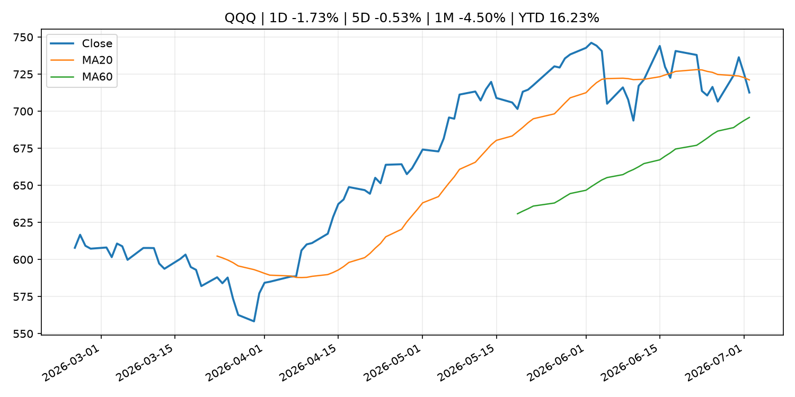
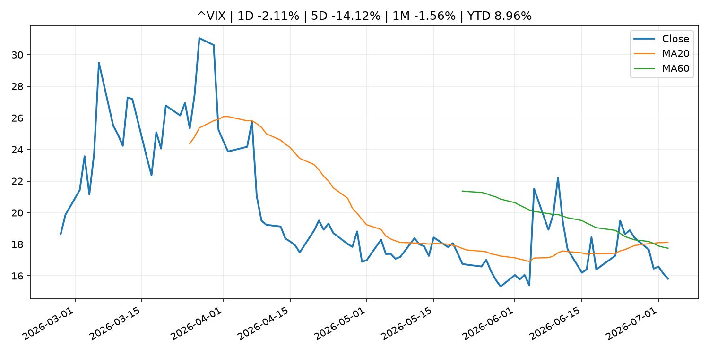
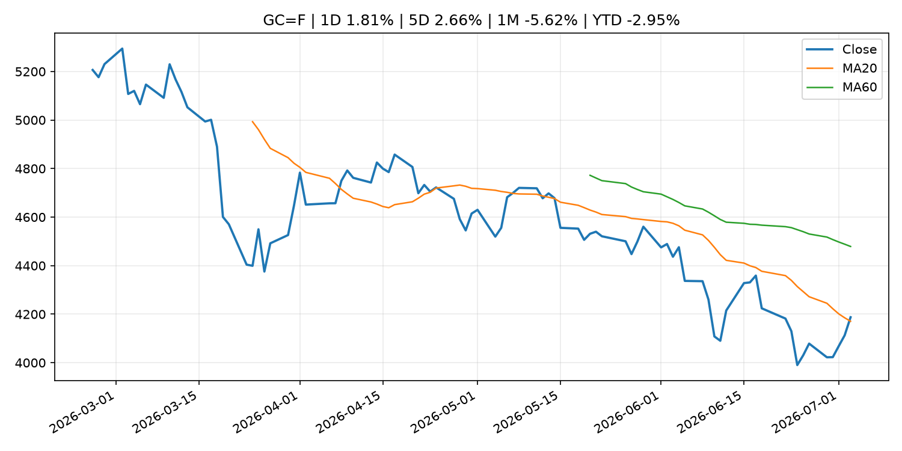
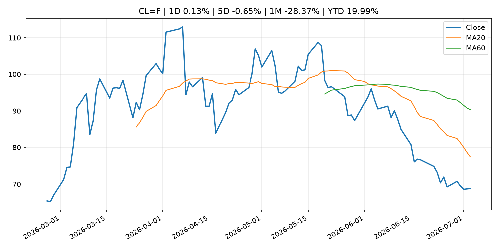
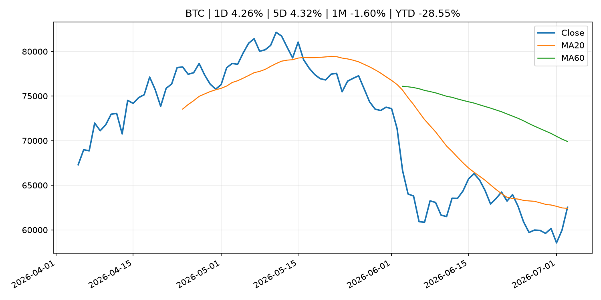
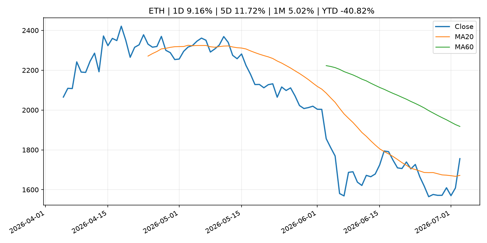
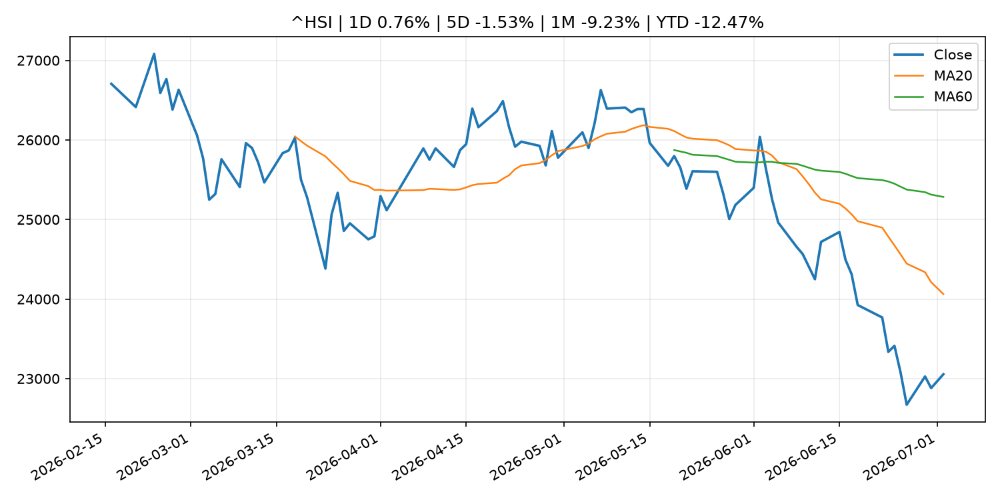

# Global Macro Morning Briefing - 2026-07-04

> Not financial advice / 非投资建议。

## 0. 今日总览
- 市场状态：unknown。市场信号不足，暂不判断明确状态。
- 今日三大主线：
  1. fiscal_policy: US Treasury sanctions over 100 ISIS-K crypto addresses that moved over $1.4 million
  2. crypto_market_structure: This sanctioned Russian stablecoin claims it processes billions, but blockchain analysts disagree
  3. regulation: Ondo Finance debuts SEC-aligned tokenized stock model with BlackRock ETF, Micron shares
- 一句话结论：今日晨报重点关注：财政和贸易政策会影响增长、通胀、企业利润和跨境资本流。；加密市场结构和监管变化会影响 BTC、ETH 及相关股票的风险溢价。。跨资产方面，SPY 1D -0.13%；QQQ 1D -1.73%；^VIX 1D -2.11%；TLT 1D -0.01%；GC=F 1D 1.81%；CL=F 1D 0.13%；BTC 1D 4.26%；ETH 1D 9.16%；市场信号不足，暂不判断明确状态。政策、通胀、利率、美元、美债、能源和加密监管仍是主要观察线索。所有结论仅基于公开数据与短摘要整理，不构成投资建议。

## 1. 隔夜跨资产市场
- 美股：SPY 1D -0.13%，QQQ 1D -1.73%，整体趋势需结合 VIX 和利率确认。
- 美债/美元：TLT 1D -0.01%，美元指数 1D -0.00%，是判断折现率压力的核心线索。
- 黄金/原油：黄金 1D 1.81%，原油 1D 0.13%，用于观察避险、通胀和地缘风险。
- 加密：BTC 1D 4.26%，ETH 1D 9.16%，关注是否独立于纳指走出加密自身行情。
- 港股/A股：恒生 1D 0.76%，沪深300/上证 1D n/a，重点看中国政策预期与人民币线索。
- 风险观察：关注后续数据是否确认当前跨资产信号。

### US_EQUITY

| symbol | latest close | 1D | 5D | 1M | YTD | trend |
|---|---:|---:|---:|---:|---:|---|
| SPY | 744.78 | -0.13% | 1.43% | -1.95% | 9.02% | uptrend |
| QQQ | 712.60 | -1.73% | -0.53% | -4.50% | 16.23% | range_bound |
| DIA | 527.88 | 1.05% | 1.66% | 2.69% | 9.15% | uptrend |
| IWM | 297.58 | -0.58% | -0.44% | 2.03% | 19.62% | uptrend |
| VTI | 368.76 | -0.14% | 1.31% | -1.50% | 9.65% | uptrend |

### US_MACRO_MARKET

| symbol | latest close | 1D | 5D | 1M | YTD | trend |
|---|---:|---:|---:|---:|---:|---|
| ^VIX | 15.81 | -2.11% | -14.12% | -1.56% | 8.96% | range_bound |
| DX-Y.NYB | 100.86 | -0.00% | -0.50% | 1.33% | 2.48% | uptrend |
| TLT | 85.51 | -0.01% | -2.11% | -0.16% | -1.75% | range_bound |
| IEF | 94.12 | 0.10% | -0.71% | -0.13% | -2.04% | downtrend |

### COMMODITIES

| symbol | latest close | 1D | 5D | 1M | YTD | trend |
|---|---:|---:|---:|---:|---:|---|
| GC=F | 4,187.30 | 1.81% | 2.66% | -5.62% | -2.95% | range_bound |
| SI=F | 62.81 | 3.58% | 6.08% | -14.51% | -10.97% | strong_downtrend |
| CL=F | 68.78 | 0.13% | -0.65% | -28.37% | 19.99% | strong_downtrend |
| BZ=F | 72.13 | 0.46% | 0.19% | -26.25% | 18.73% | strong_downtrend |
| NG=F | 3.24 | 1.53% | 0.43% | 0.96% | -10.31% | uptrend |
| HG=F | 6.22 | 1.79% | 1.34% | -3.97% | 10.35% | range_bound |

### HK_MARKET

| symbol | latest close | 1D | 5D | 1M | YTD | trend |
|---|---:|---:|---:|---:|---:|---|
| ^HSI | 23,055.03 | 0.76% | -1.53% | -9.23% | -12.47% | strong_downtrend |
| 0700.HK | 431.20 | 0.23% | 2.33% | -10.47% | -30.79% | strong_downtrend |
| 9988.HK | 94.10 | -0.42% | -0.95% | -28.11% | -36.85% | strong_downtrend |
| 3690.HK | 71.60 | 1.06% | 8.32% | -16.26% | -31.55% | strong_downtrend |
| 1810.HK | 22.96 | 1.59% | 2.96% | -22.48% | -43.00% | strong_downtrend |
| 1211.HK | 84.10 | 7.41% | 10.59% | -13.07% | -14.84% | range_bound |

### CRYPTO

| symbol | latest close | 1D | 5D | 1M | YTD | trend |
|---|---:|---:|---:|---:|---:|---|
| BTC | 62,533.68 | 4.26% | 4.32% | -1.60% | -28.55% | range_bound |
| ETH | 1,755.83 | 9.16% | 11.72% | 5.02% | -40.82% | range_bound |
| SOLANA | 82.25 | 6.34% | 16.72% | 23.24% | -33.94% | range_bound |
| BINANCECOIN | 572.62 | 4.11% | 2.91% | -5.37% | -33.66% | downtrend |
| RIPPLE | 1.13 | 7.27% | 7.79% | -1.06% | -38.64% | range_bound |

## 2. 今日最重要的 10 条新闻
### 1. US Treasury sanctions over 100 ISIS-K crypto addresses that moved over $1.4 million
- 来源：CoinDesk
- 时间：2026-07-02T14:49:05+00:00
- 地区：global
- 事件类型：fiscal_policy
- 重要性层级：Tier 1
- 一句话摘要：US Treasury sanctions over 100 ISIS-K crypto addresses that moved over $1.4 million
- 为什么重要：财政和贸易政策会影响增长、通胀、企业利润和跨境资本流。
- 可能影响：可能影响利率、汇率、风险资产或大宗商品预期，但当前公开信息不足以判断明确方向。
  - 资产：暂无明确资产映射
  - 方向：unknown
  - 强度：low
  - 原因：公开信息不足以判断方向。
- 原文链接：[https://www.coindesk.com/policy/2026/07/02/us-treasury-sanctions-over-100-isis-k-crypto-addresses-in-latest-enforcement-action](https://www.coindesk.com/policy/2026/07/02/us-treasury-sanctions-over-100-isis-k-crypto-addresses-in-latest-enforcement-action)

### 2. This sanctioned Russian stablecoin claims it processes billions, but blockchain analysts disagree
- 来源：CoinDesk
- 时间：2026-07-03T19:18:59+00:00
- 地区：global
- 事件类型：crypto_market_structure
- 重要性层级：Tier 2
- 一句话摘要：This sanctioned Russian stablecoin claims it processes billions, but blockchain analysts disagree
- 为什么重要：加密市场结构和监管变化会影响 BTC、ETH 及相关股票的风险溢价。
- 可能影响：主要影响 BTC，方向为 mixed，强度 high；加密监管或 ETF 进展会改变 BTC 的资金流和风险溢价。
  - 资产：BTC
    方向：mixed
    强度：high
    原因：加密监管或 ETF 进展会改变 BTC 的资金流和风险溢价。
  - 资产：ETH
    方向：mixed
    强度：high
    原因：监管框架会影响 ETH 产品化和机构参与度。
  - 资产：COIN
    方向：mixed
    强度：medium
    原因：监管清晰度和执法风险会影响交易平台估值。
  - 资产：crypto market
    方向：mixed
    强度：high
    原因：信息影响整个加密市场结构，但方向取决于细节。
- 原文链接：[https://www.coindesk.com/business/2026/07/03/this-sanctioned-russian-stablecoin-claims-it-processes-billions-but-blockchain-analysts-disagree](https://www.coindesk.com/business/2026/07/03/this-sanctioned-russian-stablecoin-claims-it-processes-billions-but-blockchain-analysts-disagree)

### 3. Ondo Finance debuts SEC-aligned tokenized stock model with BlackRock ETF, Micron shares
- 来源：CoinDesk
- 时间：2026-07-02T14:16:02+00:00
- 地区：global
- 事件类型：regulation
- 重要性层级：Tier 2
- 一句话摘要：Ondo Finance debuts SEC-aligned tokenized stock model with BlackRock ETF, Micron shares
- 为什么重要：监管变化会改变行业盈利预期和资产风险溢价。
- 可能影响：主要影响 BTC，方向为 mixed，强度 high；加密监管或 ETF 进展会改变 BTC 的资金流和风险溢价。
  - 资产：BTC
    方向：mixed
    强度：high
    原因：加密监管或 ETF 进展会改变 BTC 的资金流和风险溢价。
  - 资产：ETH
    方向：mixed
    强度：high
    原因：监管框架会影响 ETH 产品化和机构参与度。
  - 资产：COIN
    方向：mixed
    强度：medium
    原因：监管清晰度和执法风险会影响交易平台估值。
  - 资产：crypto market
    方向：mixed
    强度：high
    原因：信息影响整个加密市场结构，但方向取决于细节。
- 原文链接：[https://www.coindesk.com/business/2026/07/01/ondo-finance-debuts-sec-aligned-tokenized-stock-model-with-blackrock-etf-micron-shares](https://www.coindesk.com/business/2026/07/01/ondo-finance-debuts-sec-aligned-tokenized-stock-model-with-blackrock-etf-micron-shares)

### 4. Federal Reserve Board issues enforcement action with Small Business Bank and announces termination enforcement actions with BNP Paribas S.A., BNP Paribas USA, Inc., BNP Paribas Securities Corp., and Community Bankshares, Inc.
- 来源：Federal Reserve Press Releases
- 时间：2026-07-02T15:00:00+00:00
- 地区：US
- 事件类型：regulation
- 重要性层级：Tier 2
- 一句话摘要：Federal Reserve Board issues enforcement action with Small Business Bank and announces termination enforcement actions with BNP Paribas S.A., BNP Paribas USA, Inc., BNP Paribas Securities Corp., and Community Bankshares, Inc.
- 为什么重要：监管变化会改变行业盈利预期和资产风险溢价。
- 可能影响：可能影响利率、汇率、风险资产或大宗商品预期，但当前公开信息不足以判断明确方向。
  - 资产：暂无明确资产映射
  - 方向：unknown
  - 强度：low
  - 原因：公开信息不足以判断方向。
- 原文链接：[https://www.federalreserve.gov/newsevents/pressreleases/enforcement20260702a.htm](https://www.federalreserve.gov/newsevents/pressreleases/enforcement20260702a.htm)

### 5. Bitcoin rises 4% to above $61,000 as inflation fears soften
- 来源：CoinDesk
- 时间：2026-07-02T10:30:42+00:00
- 地区：global
- 事件类型：other
- 重要性层级：Tier 3
- 一句话摘要：Bitcoin rises 4% to above $61,000 as inflation fears soften
- 为什么重要：这条信息暂未匹配到重大宏观、政策或市场事件，更适合作为背景跟踪。
- 可能影响：主要影响 DXY，方向为 positive，强度 high；通胀压力可能推高政策利率预期并支撑美元。
  - 资产：DXY
    方向：positive
    强度：high
    原因：通胀压力可能推高政策利率预期并支撑美元。
  - 资产：TLT
    方向：negative
    强度：high
    原因：通胀上行通常推升收益率、压低长债价格。
  - 资产：QQQ
    方向：negative
    强度：high
    原因：更高利率对成长股估值折现率不利。
  - 资产：SPY
    方向：mixed
    强度：medium
    原因：名义增长可能支撑收入，但更高利率压制估值。
  - 资产：GC=F
    方向：mixed
    强度：medium
    原因：通胀对黄金是支撑，但实际利率上行会形成压力。
  - 资产：BTC
    方向：mixed
    强度：medium
    原因：抗通胀叙事和流动性收紧可能相互抵消。
- 原文链接：[https://www.coindesk.com/markets/2026/07/02/bitcoin-zooms-above-usd61-000-as-inflation-fears-soften](https://www.coindesk.com/markets/2026/07/02/bitcoin-zooms-above-usd61-000-as-inflation-fears-soften)

### 6. Here’s what’s worth streaming in July 2026 on Netflix, Hulu, HBO Max and more
- 来源：MarketWatch Top Stories
- 时间：2026-07-03T20:00:00+00:00
- 地区：US
- 事件类型：other
- 重要性层级：Tier 3
- 一句话摘要：Why it’s a good month to save on streaming, despite the return of ‘Enola Holmes’ to Netflix and ‘Silo’ to Apple
- 为什么重要：这条信息暂未匹配到重大宏观、政策或市场事件，更适合作为背景跟踪。
- 可能影响：更偏背景信息，短期市场影响可能有限。
  - 资产：暂无明确资产映射
  - 方向：unknown
  - 强度：low
  - 原因：公开信息不足以判断方向。
- 原文链接：[https://www.marketwatch.com/story/heres-whats-worth-streaming-in-july-2026-on-netflix-hulu-hbo-max-and-more-58d07528?mod=mw_rss_topstories](https://www.marketwatch.com/story/heres-whats-worth-streaming-in-july-2026-on-netflix-hulu-hbo-max-and-more-58d07528?mod=mw_rss_topstories)

## 3. 政策与央行观察
### 1. US Treasury sanctions over 100 ISIS-K crypto addresses that moved over $1.4 million
- 来源：CoinDesk
- 时间：2026-07-02T14:49:05+00:00
- 地区：global
- 事件类型：fiscal_policy
- 重要性层级：Tier 1
- 一句话摘要：US Treasury sanctions over 100 ISIS-K crypto addresses that moved over $1.4 million
- 为什么重要：财政和贸易政策会影响增长、通胀、企业利润和跨境资本流。
- 可能影响：可能影响利率、汇率、风险资产或大宗商品预期，但当前公开信息不足以判断明确方向。
  - 资产：暂无明确资产映射
  - 方向：unknown
  - 强度：low
  - 原因：公开信息不足以判断方向。
- 原文链接：[https://www.coindesk.com/policy/2026/07/02/us-treasury-sanctions-over-100-isis-k-crypto-addresses-in-latest-enforcement-action](https://www.coindesk.com/policy/2026/07/02/us-treasury-sanctions-over-100-isis-k-crypto-addresses-in-latest-enforcement-action)

### 2. This sanctioned Russian stablecoin claims it processes billions, but blockchain analysts disagree
- 来源：CoinDesk
- 时间：2026-07-03T19:18:59+00:00
- 地区：global
- 事件类型：crypto_market_structure
- 重要性层级：Tier 2
- 一句话摘要：This sanctioned Russian stablecoin claims it processes billions, but blockchain analysts disagree
- 为什么重要：加密市场结构和监管变化会影响 BTC、ETH 及相关股票的风险溢价。
- 可能影响：主要影响 BTC，方向为 mixed，强度 high；加密监管或 ETF 进展会改变 BTC 的资金流和风险溢价。
  - 资产：BTC
    方向：mixed
    强度：high
    原因：加密监管或 ETF 进展会改变 BTC 的资金流和风险溢价。
  - 资产：ETH
    方向：mixed
    强度：high
    原因：监管框架会影响 ETH 产品化和机构参与度。
  - 资产：COIN
    方向：mixed
    强度：medium
    原因：监管清晰度和执法风险会影响交易平台估值。
  - 资产：crypto market
    方向：mixed
    强度：high
    原因：信息影响整个加密市场结构，但方向取决于细节。
- 原文链接：[https://www.coindesk.com/business/2026/07/03/this-sanctioned-russian-stablecoin-claims-it-processes-billions-but-blockchain-analysts-disagree](https://www.coindesk.com/business/2026/07/03/this-sanctioned-russian-stablecoin-claims-it-processes-billions-but-blockchain-analysts-disagree)

### 3. Ondo Finance debuts SEC-aligned tokenized stock model with BlackRock ETF, Micron shares
- 来源：CoinDesk
- 时间：2026-07-02T14:16:02+00:00
- 地区：global
- 事件类型：regulation
- 重要性层级：Tier 2
- 一句话摘要：Ondo Finance debuts SEC-aligned tokenized stock model with BlackRock ETF, Micron shares
- 为什么重要：监管变化会改变行业盈利预期和资产风险溢价。
- 可能影响：主要影响 BTC，方向为 mixed，强度 high；加密监管或 ETF 进展会改变 BTC 的资金流和风险溢价。
  - 资产：BTC
    方向：mixed
    强度：high
    原因：加密监管或 ETF 进展会改变 BTC 的资金流和风险溢价。
  - 资产：ETH
    方向：mixed
    强度：high
    原因：监管框架会影响 ETH 产品化和机构参与度。
  - 资产：COIN
    方向：mixed
    强度：medium
    原因：监管清晰度和执法风险会影响交易平台估值。
  - 资产：crypto market
    方向：mixed
    强度：high
    原因：信息影响整个加密市场结构，但方向取决于细节。
- 原文链接：[https://www.coindesk.com/business/2026/07/01/ondo-finance-debuts-sec-aligned-tokenized-stock-model-with-blackrock-etf-micron-shares](https://www.coindesk.com/business/2026/07/01/ondo-finance-debuts-sec-aligned-tokenized-stock-model-with-blackrock-etf-micron-shares)

### 4. Federal Reserve Board issues enforcement action with Small Business Bank and announces termination enforcement actions with BNP Paribas S.A., BNP Paribas USA, Inc., BNP Paribas Securities Corp., and Community Bankshares, Inc.
- 来源：Federal Reserve Press Releases
- 时间：2026-07-02T15:00:00+00:00
- 地区：US
- 事件类型：regulation
- 重要性层级：Tier 2
- 一句话摘要：Federal Reserve Board issues enforcement action with Small Business Bank and announces termination enforcement actions with BNP Paribas S.A., BNP Paribas USA, Inc., BNP Paribas Securities Corp., and Community Bankshares, Inc.
- 为什么重要：监管变化会改变行业盈利预期和资产风险溢价。
- 可能影响：可能影响利率、汇率、风险资产或大宗商品预期，但当前公开信息不足以判断明确方向。
  - 资产：暂无明确资产映射
  - 方向：unknown
  - 强度：low
  - 原因：公开信息不足以判断方向。
- 原文链接：[https://www.federalreserve.gov/newsevents/pressreleases/enforcement20260702a.htm](https://www.federalreserve.gov/newsevents/pressreleases/enforcement20260702a.htm)

## 4. 市场异动与图表
- QQQ 下跌 -1.73%
- Gold 上涨 1.81%
- BTC 上涨 4.26%
- ETH 上涨 9.16%

### SPY

### QQQ

### ^VIX

### TLT

### GC=F

### CL=F

### BTC

### ETH

### ^HSI

## 5. 华尔街与机构公开观点
- 暂无可靠公开观点。

## 6. 今日重点关注
- 经济数据：经济数据：暂无可靠公开日历数据；如配置经济日历源后可自动填充。
- 央行讲话：央行讲话：暂无可靠公开日历数据；重点跟踪 Fed、ECB、BoJ、PBOC 官网 RSS。
- 财报：财报：暂无可靠数据。
- 政策事件：政策事件：暂无可靠数据。
- 风险提醒：风险提醒：关注数据源失败项、突发地缘风险、利率和美元的二阶反应。

## 7. 英文金融表达与宏观概念
- **inflation expectations**：通胀预期，指家庭、企业或市场对未来通胀的预估。 例句：Inflation expectations can shape wage bargaining and bond yields.
- **real yield**：实际收益率，名义利率扣除通胀预期后的收益率。 例句：Gold often reacts more to real yields than nominal yields.
- **risk-off**：避险模式，资金偏向美元、国债、黄金等防御资产。 例句：A geopolitical shock can push markets into risk-off mode.
- **market structure**：市场结构，指交易、托管、清算、ETF、监管等制度安排。 例句：Crypto market structure rules can affect institutional participation.
- **terminal rate**：终端利率，市场预期本轮加息周期的最高政策利率。 例句：A higher terminal rate can pressure growth stocks.
- **soft landing**：软着陆，指通胀回落而经济避免明显衰退。 例句：Markets often rally when data support a soft landing.

## 8. 背景材料
- [Here’s what’s worth streaming in July 2026 on Netflix, Hulu, HBO Max and more](https://www.marketwatch.com/story/heres-whats-worth-streaming-in-july-2026-on-netflix-hulu-hbo-max-and-more-58d07528?mod=mw_rss_topstories)（MarketWatch Top Stories，other）：Why it’s a good month to save on streaming, despite the return of ‘Enola Holmes’ to Netflix and ‘Silo’ to Apple
- [Want to live longer in retirement? This one money move could add years to your life.](https://www.marketwatch.com/story/want-to-live-longer-in-retirement-this-one-money-move-could-add-years-to-your-life-e8f2b4ba?mod=mw_rss_topstories)（MarketWatch Top Stories，other）：A secure retirement portfolio acts like a health shield, calming market anxiety that can actually shorten  life expectancy.
- [‘I claimed Social Security at 62’: At 76, I’m working at Walmart. Why do I still owe payroll taxes?](https://www.marketwatch.com/story/i-claimed-social-security-at-62-at-76-im-working-at-walmart-why-do-i-still-owe-payroll-taxes-8e22a97c?mod=mw_rss_topstories)（MarketWatch Top Stories，other）：“It seems like half of the workforce at our local Walmart is over 65.”
- [Bitcoin whales bought $16.7 billion of bitcoin in 2 weeks even as ETFs bled a record $4 billion](https://www.coindesk.com/markets/2026/07/03/bitcoin-whales-bought-270-000-btc-in-two-weeks-even-as-etfs-bled-a-record-usd4-billion)（CoinDesk，other）：Bitcoin whales bought $16.7 billion of bitcoin in 2 weeks even as ETFs bled a record $4 billion
- [Bitcoin, ether traders aren't fully buying the bounce, options markets show](https://www.coindesk.com/daybook-us/2026/07/03/bitcoin-ether-traders-aren-t-fully-buying-the-bounce-options-markets-show)（CoinDesk，other）：Bitcoin, ether traders aren't fully buying the bounce, options markets show
- [Memory and semiconductor stocks lose momentum, bitcoin rebounds in sign of changing investor focus](https://www.coindesk.com/markets/2026/07/03/memory-and-semiconductor-stocks-lose-momentum-bitcoin-rebounds-in-sign-of-changing-investor-focus)（CoinDesk，other）：Memory and semiconductor stocks lose momentum, bitcoin rebounds in sign of changing investor focus
- [Live updates: Bitcoin rises above $62,000 as the red hot semiconductor trade starts to fade](https://www.coindesk.com/tech/2026/07/03/live-updates-more-bitcoin-is-now-held-at-a-loss-than-at-a-profit)（CoinDesk，other）：Live updates: Bitcoin rises above $62,000 as the red hot semiconductor trade starts to fade
- [Finally. $221 million flow into Bitcoin ETFs, ending a painful 10-day outflow streak](https://www.coindesk.com/markets/2026/07/03/finally-usd221-million-flow-into-bitcoin-etfs-ending-a-painful-10-day-outflow-streak)（CoinDesk，other）：Finally. $221 million flow into Bitcoin ETFs, ending a painful 10-day outflow streak
- [Ether and solana extend gains as a short squeeze lifts bitcoin toward $62,000](https://www.coindesk.com/markets/2026/07/03/ether-and-solana-extend-gains-as-a-short-squeeze-lifts-bitcoin-toward-usd62-000)（CoinDesk，other）：Ether and solana extend gains as a short squeeze lifts bitcoin toward $62,000
- [Output Gap, Potential Growth Rate, and Labor Market Indicators](http://www.boj.or.jp/en/research/research_data/gap/index.htm)（Bank of Japan Announcements，other）：Output Gap, Potential Growth Rate, and Labor Market Indicators
- [Sources of Changes in Current Account Balances (Projections for July)](http://www.boj.or.jp/en/statistics/boj/fm/juqp/juqp2607.xlsx)（Bank of Japan Announcements，other）：Sources of Changes in Current Account Balances (Projections for July)
- [Christine Lagarde: Interview with Les Échos](https://www.ecb.europa.eu//press/inter/date/2026/html/ecb.in260702~c56db179c3.en.html)（ECB Press Releases，other）：Christine Lagarde: Interview with Les Échos
- [Securitize tokenizes $295 million of its own stock on Solana and Avalanche amid NYSE debut](https://www.coindesk.com/business/2026/07/02/securitize-tokenizes-usd295-million-of-its-own-stock-on-solana-and-avalanche-amid-nyse-debut)（CoinDesk，other）：Securitize tokenizes $295 million of its own stock on Solana and Avalanche amid NYSE debut
- [Piero Cipollone: The digital transformation of money, payments and finance](https://www.ecb.europa.eu//press/key/date/2026/html/ecb.sp260702_1~c58dcd8150.en.pdf)（ECB Press Releases，other）：Piero Cipollone: The digital transformation of money, payments and finance
- [SBI Crypto to shut down mining pool that holds roughly 2% of Bitcoin's hashrate](https://www.coindesk.com/business/2026/07/02/sbi-crypto-to-shut-down-mining-pool-that-holds-roughly-2-of-bitcoin-s-hashrate)（CoinDesk，other）：SBI Crypto to shut down mining pool that holds roughly 2% of Bitcoin's hashrate
- [JPMorgan says Strategy's bitcoin sales policy adds 'two-way risk' to crypto markets](https://www.coindesk.com/markets/2026/07/02/jpmorgan-says-strategy-s-bitcoin-sales-policy-adds-two-way-risk-to-crypto-markets)（CoinDesk，other）：JPMorgan says Strategy's bitcoin sales policy adds 'two-way risk' to crypto markets
- [A struggling Nasdaq-listed company that tried to copy Saylor's Bitcoin playbook is completely dumping crypto for AI](https://www.coindesk.com/markets/2026/07/02/a-struggling-nasdaq-listed-company-that-tried-to-copy-saylor-s-bitcoin-playbook-is-completely-dumping-crypto-for-ai)（CoinDesk，other）：A struggling Nasdaq-listed company that tried to copy Saylor's Bitcoin playbook is completely dumping crypto for AI
- [Warsh's comments set the stage for U.S. jobs data to ignite bitcoin, gold rally](https://www.coindesk.com/daybook-us/2026/07/02/warsh-s-comments-set-the-stage-for-u-s-jobs-data-to-ignite-bitcoin-gold-rally)（CoinDesk，other）：Warsh's comments set the stage for U.S. jobs data to ignite bitcoin, gold rally
- [Smaller tokens lead as bitcoin, sol rally in 'first real bounce of the selloff'](https://www.coindesk.com/markets/2026/07/02/smaller-tokens-lead-as-bitcoin-sol-rally-in-first-real-bounce-of-the-selloff)（CoinDesk，other）：Smaller tokens lead as bitcoin, sol rally in 'first real bounce of the selloff'
- [Bitcoin rises 4% to above $61,000 as inflation fears soften](https://www.coindesk.com/markets/2026/07/02/bitcoin-zooms-above-usd61-000-as-inflation-fears-soften)（CoinDesk，other）：Bitcoin rises 4% to above $61,000 as inflation fears soften

## 9. 数据源、失败项与免责声明
- 采集时间：2026-07-03T23:00:39
- 数据源：公开 RSS、Yahoo Finance、CoinGecko、AKShare、FRED、SEC data.sec.gov，以及用户自有 inputs/reports 文件。
- 合规说明：不绕过 WSJ、Bloomberg、FT、Reuters 等付费墙；对付费媒体只使用公开 RSS 标题、摘要、链接和发布时间。
- 免责声明：Not financial advice / 非投资建议。本项目仅供个人学习、研究和信息整理，不构成投资建议、交易建议或任何收益承诺。
- 失败或跳过的数据源：
  - crypto data failed coin=dogecoin
  - China market data failed symbol=上证指数: empty dataframe
  - China market data failed symbol=深证成指: empty dataframe
  - China market data failed symbol=创业板指: empty dataframe
  - China market data failed symbol=沪深300: empty dataframe
  - China market data failed symbol=中证500: empty dataframe
  - China market data failed symbol=科创50: empty dataframe
  - FRED_API_KEY not set; skipping FRED macro series
  - SEC failed cik=0000320193
  - SEC failed cik=0000789019
  - SEC failed cik=0001045810
  - SEC failed cik=0001318605
  - SEC failed cik=0001577552
