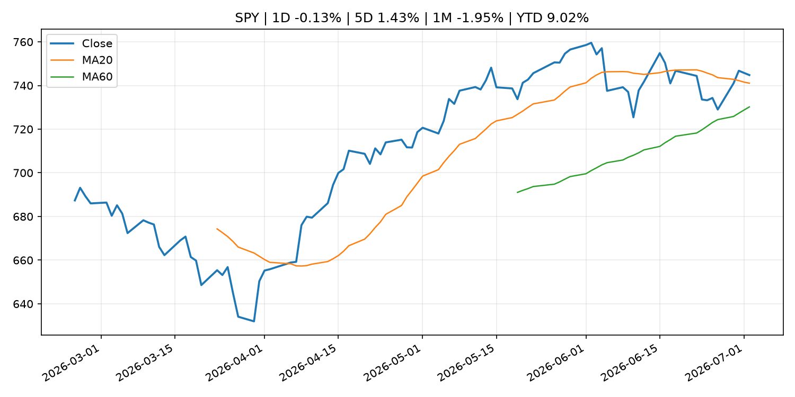
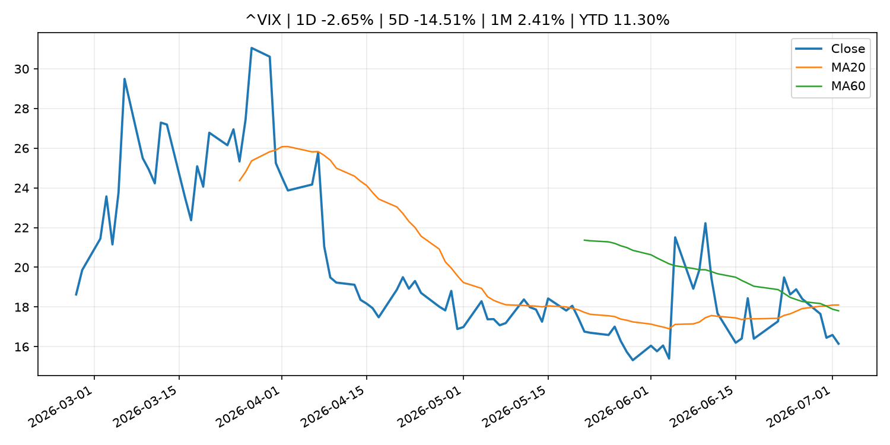
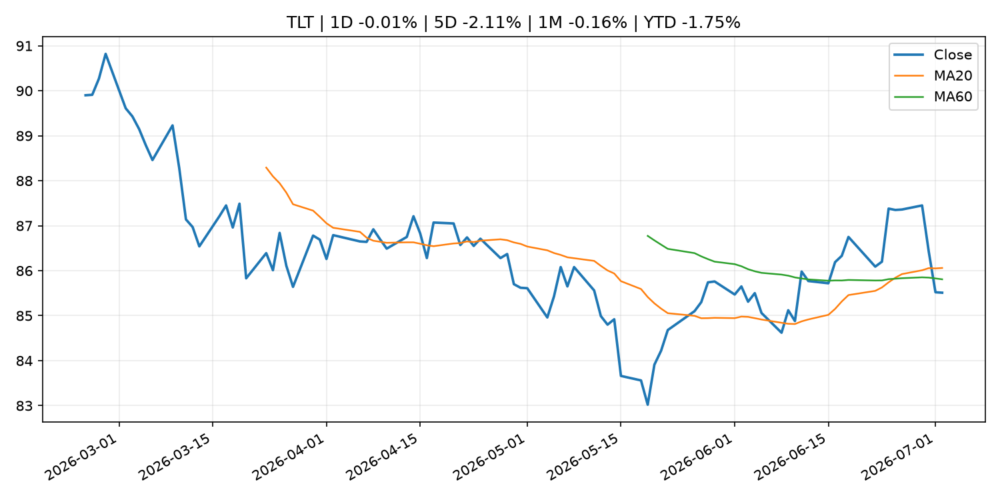
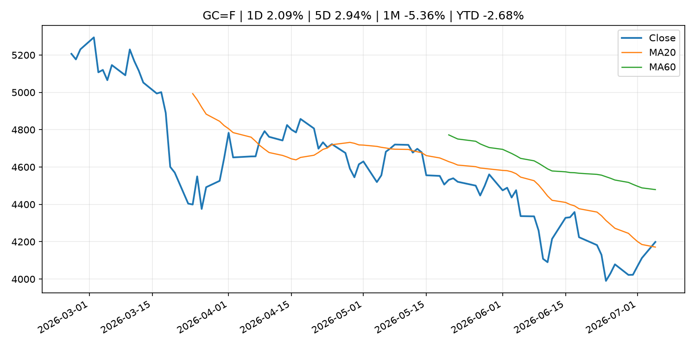
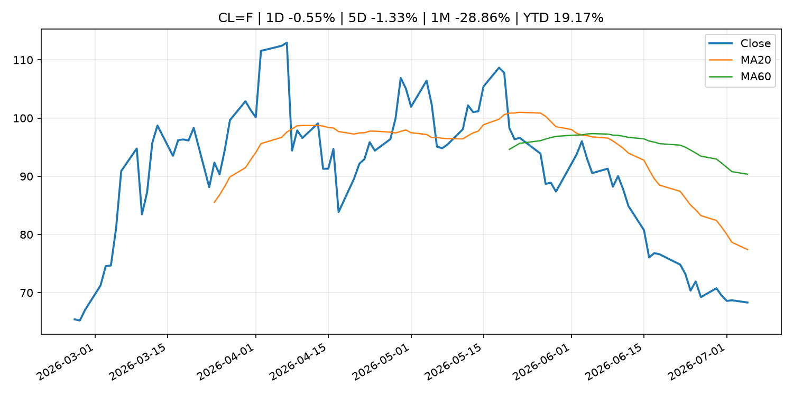
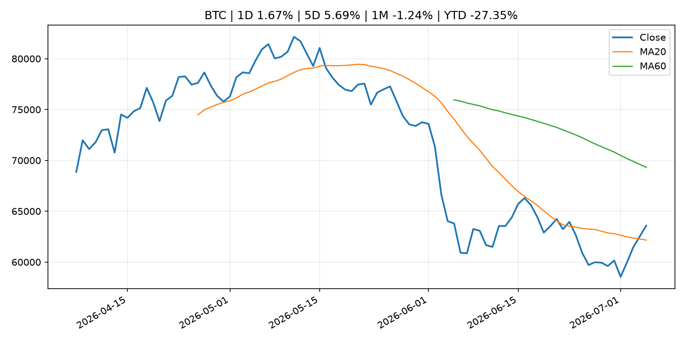
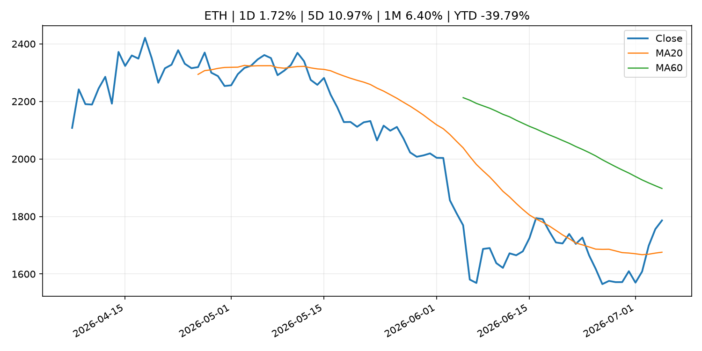
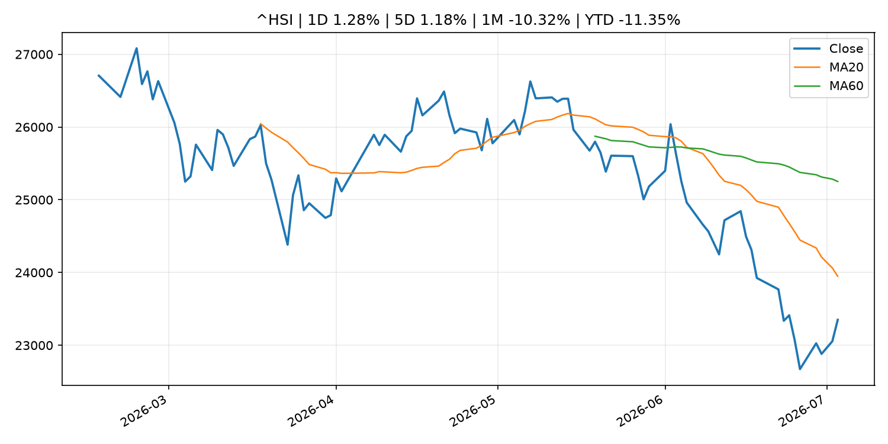

# Global Macro Morning Briefing - 2026-07-06

> Not financial advice / 非投资建议。

## 0. 今日总览
- 市场状态：unknown。市场信号不足，暂不判断明确状态。
- 今日三大主线：
  1. commodity_supply: OPEC+ raises output levels again despite tumbling crude prices
- 一句话结论：今日晨报重点关注：大宗商品供给变化会影响能源价格、通胀预期和资源股。；这条信息暂未匹配到重大宏观、政策或市场事件，更适合作为背景跟踪。。跨资产方面，SPY 1D -0.13%；QQQ 1D -1.73%；^VIX 1D -2.65%；TLT 1D -0.01%；GC=F 1D 2.09%；CL=F 1D -0.55%；BTC 1D 1.67%；ETH 1D 1.72%；市场信号不足，暂不判断明确状态。政策、通胀、利率、美元、美债、能源和加密监管仍是主要观察线索。所有结论仅基于公开数据与短摘要整理，不构成投资建议。

## 1. 隔夜跨资产市场
- 美股：SPY 1D -0.13%，QQQ 1D -1.73%，整体趋势需结合 VIX 和利率确认。
- 美债/美元：TLT 1D -0.01%，美元指数 1D 0.00%，是判断折现率压力的核心线索。
- 黄金/原油：黄金 1D 2.09%，原油 1D -0.55%，用于观察避险、通胀和地缘风险。
- 加密：BTC 1D 1.67%，ETH 1D 1.72%，关注是否独立于纳指走出加密自身行情。
- 港股/A股：恒生 1D 1.28%，沪深300/上证 1D n/a，重点看中国政策预期与人民币线索。
- 风险观察：关注后续数据是否确认当前跨资产信号。

### US_EQUITY

| symbol | latest close | 1D | 5D | 1M | YTD | trend |
|---|---:|---:|---:|---:|---:|---|
| SPY | 744.78 | -0.13% | 1.43% | -1.95% | 9.02% | uptrend |
| QQQ | 712.60 | -1.73% | -0.53% | -4.50% | 16.23% | range_bound |
| DIA | 527.88 | 1.05% | 1.66% | 2.69% | 9.15% | uptrend |
| IWM | 297.58 | -0.58% | -0.44% | 2.03% | 19.62% | uptrend |
| VTI | 368.76 | -0.14% | 1.31% | -1.50% | 9.65% | uptrend |

### US_MACRO_MARKET

| symbol | latest close | 1D | 5D | 1M | YTD | trend |
|---|---:|---:|---:|---:|---:|---|
| ^VIX | 16.15 | -2.65% | -14.51% | 2.41% | 11.30% | range_bound |
| DX-Y.NYB | 100.86 | 0.00% | -0.49% | 1.34% | 2.48% | uptrend |
| TLT | 85.51 | -0.01% | -2.11% | -0.16% | -1.75% | range_bound |
| IEF | 94.12 | 0.10% | -0.71% | -0.13% | -2.04% | downtrend |

### COMMODITIES

| symbol | latest close | 1D | 5D | 1M | YTD | trend |
|---|---:|---:|---:|---:|---:|---|
| GC=F | 4,198.80 | 2.09% | 2.94% | -5.36% | -2.68% | range_bound |
| SI=F | 63.59 | 4.86% | 7.38% | -13.45% | -9.87% | strong_downtrend |
| CL=F | 68.31 | -0.55% | -1.33% | -28.86% | 19.17% | strong_downtrend |
| BZ=F | 71.72 | -0.11% | -0.38% | -26.67% | 18.06% | strong_downtrend |
| NG=F | 3.21 | 0.47% | -0.62% | -0.09% | -11.25% | uptrend |
| HG=F | 6.24 | 2.08% | 1.63% | -3.70% | 10.66% | range_bound |

### HK_MARKET

| symbol | latest close | 1D | 5D | 1M | YTD | trend |
|---|---:|---:|---:|---:|---:|---|
| ^HSI | 23,350.03 | 1.28% | 1.18% | -10.32% | -11.35% | strong_downtrend |
| 0700.HK | 431.20 | 0.23% | 2.33% | -10.47% | -30.79% | strong_downtrend |
| 9988.HK | 94.10 | -0.42% | -0.95% | -28.11% | -36.85% | strong_downtrend |
| 3690.HK | 71.60 | 1.06% | 8.32% | -16.26% | -31.55% | strong_downtrend |
| 1810.HK | 22.96 | 1.59% | 2.96% | -22.48% | -43.00% | strong_downtrend |
| 1211.HK | 84.10 | 7.41% | 10.59% | -13.07% | -14.84% | range_bound |

### CRYPTO

| symbol | latest close | 1D | 5D | 1M | YTD | trend |
|---|---:|---:|---:|---:|---:|---|
| BTC | 63,580.79 | 1.67% | 5.69% | -1.24% | -27.35% | range_bound |
| ETH | 1,786.21 | 1.72% | 10.97% | 6.40% | -39.79% | range_bound |
| SOLANA | 81.66 | -0.74% | 8.90% | 18.68% | -34.42% | range_bound |
| BINANCECOIN | 590.25 | 2.94% | 5.65% | -3.14% | -31.62% | range_bound |
| RIPPLE | 1.15 | 1.82% | 9.15% | 0.46% | -37.25% | range_bound |

## 2. 今日最重要的 10 条新闻
### 1. OPEC+ raises output levels again despite tumbling crude prices
- 来源：MarketWatch Top Stories
- 时间：2026-07-05T22:30:00+00:00
- 地区：US
- 事件类型：commodity_supply
- 重要性层级：Tier 2
- 一句话摘要：Major oil producers on Sunday agreed once again to modestly increase their crude production, although, as in previous months, the hike is largely symbolic until a peace deal between the U.S. and Iran sticks and the Strait of Hormuz is fully reopened to shipping traffic.
- 为什么重要：大宗商品供给变化会影响能源价格、通胀预期和资源股。
- 可能影响：主要影响 CL=F，方向为 positive，强度 high；供给扰动或 OPEC 减产通常推升 WTI 原油。
  - 资产：CL=F
    方向：positive
    强度：high
    原因：供给扰动或 OPEC 减产通常推升 WTI 原油。
  - 资产：BZ=F
    方向：positive
    强度：high
    原因：全球供给风险通常直接影响 Brent 原油。
  - 资产：SPY
    方向：mixed
    强度：medium
    原因：能源股可能受益，但通胀和成本压力不利于宽基风险资产。
- 原文链接：[https://www.marketwatch.com/story/opec-raises-output-levels-again-despite-tumbling-crude-prices-534791c8?mod=mw_rss_topstories](https://www.marketwatch.com/story/opec-raises-output-levels-again-despite-tumbling-crude-prices-534791c8?mod=mw_rss_topstories)

### 2. Banks have stopped asking if stablecoins belong in finance, now they're considering how
- 来源：CoinDesk
- 时间：2026-07-05T14:00:00+00:00
- 地区：global
- 事件类型：other
- 重要性层级：Tier 3
- 一句话摘要：Banks have stopped asking if stablecoins belong in finance, now they're considering how
- 为什么重要：这条信息暂未匹配到重大宏观、政策或市场事件，更适合作为背景跟踪。
- 可能影响：更偏背景信息，短期市场影响可能有限。
  - 资产：暂无明确资产映射
  - 方向：unknown
  - 强度：low
  - 原因：公开信息不足以判断方向。
- 原文链接：[https://www.coindesk.com/business/2026/07/05/banks-have-stopped-asking-if-stablecoins-belong-in-finance-now-they-re-considering-how](https://www.coindesk.com/business/2026/07/05/banks-have-stopped-asking-if-stablecoins-belong-in-finance-now-they-re-considering-how)

### 3. Collateral, not yield, will decide which stablecoins win
- 来源：CoinDesk
- 时间：2026-07-05T13:00:00+00:00
- 地区：global
- 事件类型：other
- 重要性层级：Tier 3
- 一句话摘要：Collateral, not yield, will decide which stablecoins win
- 为什么重要：这条信息暂未匹配到重大宏观、政策或市场事件，更适合作为背景跟踪。
- 可能影响：更偏背景信息，短期市场影响可能有限。
  - 资产：暂无明确资产映射
  - 方向：unknown
  - 强度：low
  - 原因：公开信息不足以判断方向。
- 原文链接：[https://www.coindesk.com/opinion/2026/07/05/collateral-not-yield-will-decide-which-stablecoins-win](https://www.coindesk.com/opinion/2026/07/05/collateral-not-yield-will-decide-which-stablecoins-win)

## 3. 政策与央行观察
暂无可靠数据。

- 为什么重要：没有可靠新闻时，不应为了填充版面编造市场解释。

## 4. 市场异动与图表
- QQQ 下跌 -1.73%
- Gold 上涨 2.09%

### SPY

### QQQ

### ^VIX

### TLT

### GC=F

### CL=F

### BTC

### ETH

### ^HSI

## 5. 华尔街与机构公开观点
- 暂无可靠公开观点。

## 6. 今日重点关注
- 经济数据：经济数据：暂无可靠公开日历数据；如配置经济日历源后可自动填充。
- 央行讲话：央行讲话：暂无可靠公开日历数据；重点跟踪 Fed、ECB、BoJ、PBOC 官网 RSS。
- 财报：财报：暂无可靠数据。
- 政策事件：政策事件：暂无可靠数据。
- 风险提醒：风险提醒：关注数据源失败项、突发地缘风险、利率和美元的二阶反应。

## 7. 英文金融表达与宏观概念
- **supply disruption**：供给扰动，通常指能源或商品供应受冲突、减产或天气影响。 例句：Supply disruption can lift oil prices and inflation expectations.
- **market structure**：市场结构，指交易、托管、清算、ETF、监管等制度安排。 例句：Crypto market structure rules can affect institutional participation.
- **inflation expectations**：通胀预期，指家庭、企业或市场对未来通胀的预估。 例句：Inflation expectations can shape wage bargaining and bond yields.
- **real yield**：实际收益率，名义利率扣除通胀预期后的收益率。 例句：Gold often reacts more to real yields than nominal yields.
- **terminal rate**：终端利率，市场预期本轮加息周期的最高政策利率。 例句：A higher terminal rate can pressure growth stocks.
- **soft landing**：软着陆，指通胀回落而经济避免明显衰退。 例句：Markets often rally when data support a soft landing.

## 8. 背景材料
- [Banks have stopped asking if stablecoins belong in finance, now they're considering how](https://www.coindesk.com/business/2026/07/05/banks-have-stopped-asking-if-stablecoins-belong-in-finance-now-they-re-considering-how)（CoinDesk，other）：Banks have stopped asking if stablecoins belong in finance, now they're considering how
- [Collateral, not yield, will decide which stablecoins win](https://www.coindesk.com/opinion/2026/07/05/collateral-not-yield-will-decide-which-stablecoins-win)（CoinDesk，other）：Collateral, not yield, will decide which stablecoins win
- [Kalshi and prediction market sector embroiled in mixed bag of legal fights across U.S.](https://www.coindesk.com/news-analysis/2026/07/02/kalshi-and-prediction-market-sector-embroiled-in-mixed-bag-of-legal-fights-across-u-s)（CoinDesk，other）：Kalshi and prediction market sector embroiled in mixed bag of legal fights across U.S.
- [Barstool's Portnoy plans to hold bitcoin down to zero after timing it wrong every time](https://www.coindesk.com/markets/2026/07/05/barstool-s-portnoy-plans-to-hold-bitcoin-down-to-zero-after-timing-it-wrong-every-time)（CoinDesk，other）：Barstool's Portnoy plans to hold bitcoin down to zero after timing it wrong every time
- [Here’s what’s worth streaming in July 2026 on Netflix, Hulu, HBO Max and more](https://www.marketwatch.com/story/heres-whats-worth-streaming-in-july-2026-on-netflix-hulu-hbo-max-and-more-58d07528?mod=mw_rss_topstories)（MarketWatch Top Stories，other）：Why it’s a good month to save on streaming, despite the return of ‘Enola Holmes’ to Netflix and ‘Silo’ to Apple
- [Bitcoin jumps above $63,000, reversing end-June losses](https://www.coindesk.com/markets/2026/07/04/bitcoin-jumps-above-usd63-000-reversing-end-june-losses)（CoinDesk，other）：Bitcoin jumps above $63,000, reversing end-June losses
- [Bitcoin experts split over plan to freeze Satoshi's 1.1 million bitcoin as quantum threat grows](https://www.coindesk.com/business/2026/07/04/bitcoin-experts-split-over-plan-to-freeze-satoshi-s-1-1-million-bitcoin-as-quantum-threat-grows)（CoinDesk，other）：Bitcoin experts split over plan to freeze Satoshi's 1.1 million bitcoin as quantum threat grows
- [Why bitcoin's disconnect from record-high stocks won't last](https://www.coindesk.com/markets/2026/07/03/why-bitcoin-s-disconnect-from-record-high-stocks-won-t-last)（CoinDesk，other）：Why bitcoin's disconnect from record-high stocks won't last
- [Bitcoin’s next parabolic run may need $1 trillion in fresh capital](https://www.coindesk.com/markets/2026/07/04/bitcoin-s-next-parabolic-run-may-need-usd1-trillion-in-fresh-capital)（CoinDesk，other）：Bitcoin’s next parabolic run may need $1 trillion in fresh capital

## 9. 数据源、失败项与免责声明
- 采集时间：2026-07-05T23:00:37
- 数据源：公开 RSS、Yahoo Finance、CoinGecko、AKShare、FRED、SEC data.sec.gov，以及用户自有 inputs/reports 文件。
- 合规说明：不绕过 WSJ、Bloomberg、FT、Reuters 等付费墙；对付费媒体只使用公开 RSS 标题、摘要、链接和发布时间。
- 免责声明：Not financial advice / 非投资建议。本项目仅供个人学习、研究和信息整理，不构成投资建议、交易建议或任何收益承诺。
- 失败或跳过的数据源：
  - crypto data failed coin=dogecoin
  - China market data failed symbol=上证指数: empty dataframe
  - China market data failed symbol=深证成指: empty dataframe
  - China market data failed symbol=创业板指: empty dataframe
  - China market data failed symbol=沪深300: empty dataframe
  - China market data failed symbol=中证500: empty dataframe
  - China market data failed symbol=科创50: empty dataframe
  - FRED_API_KEY not set; skipping FRED macro series
  - SEC failed cik=0000320193
  - SEC failed cik=0000789019
  - SEC failed cik=0001045810
  - SEC failed cik=0001318605
  - SEC failed cik=0001577552
