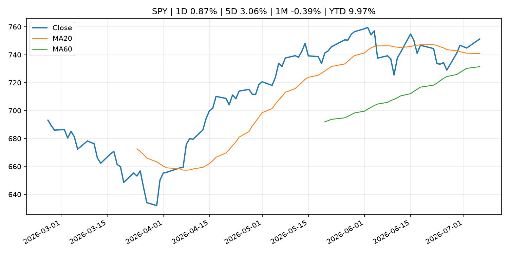
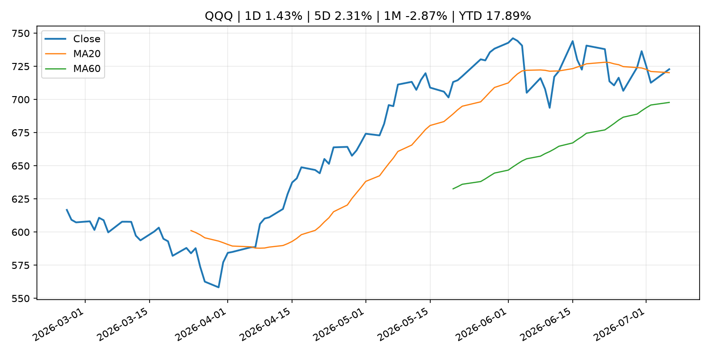
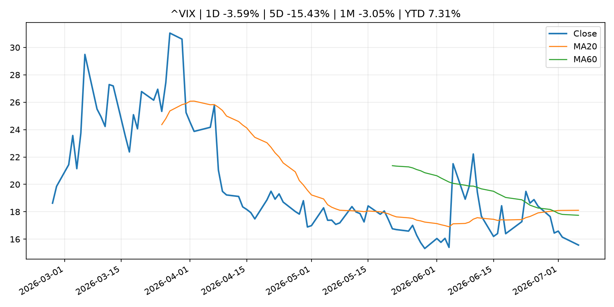
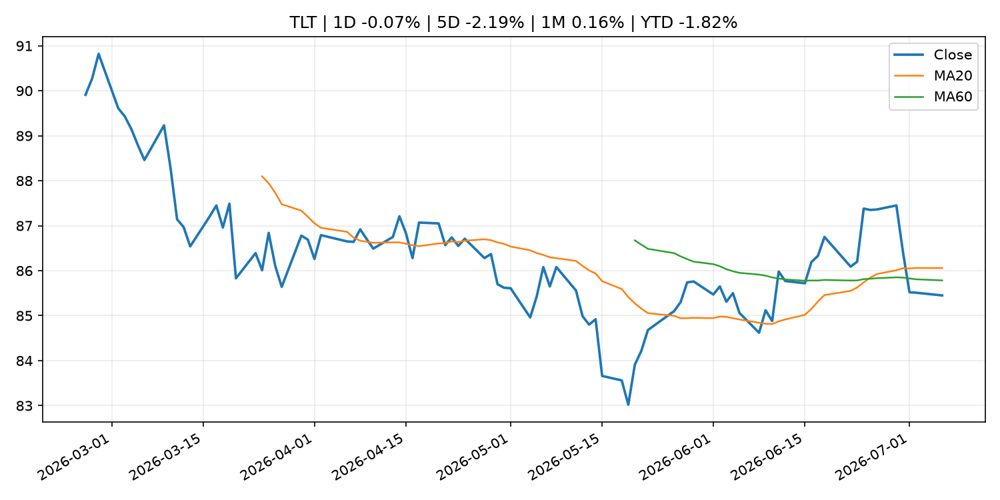
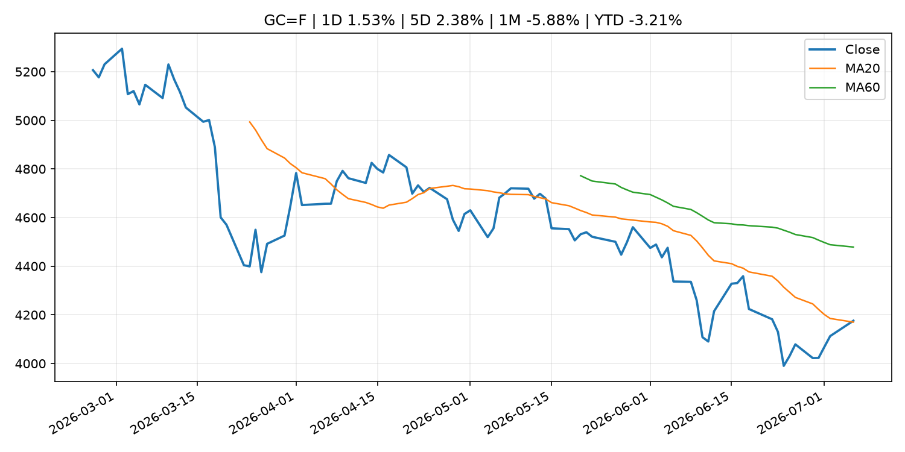
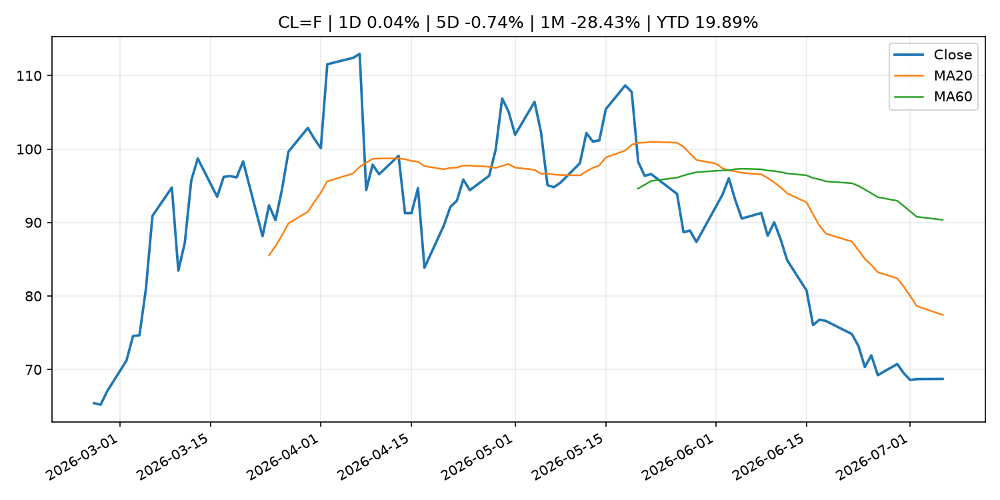
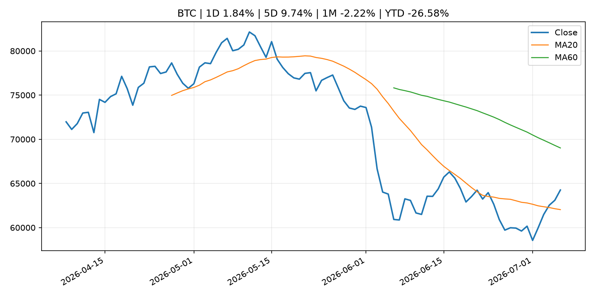
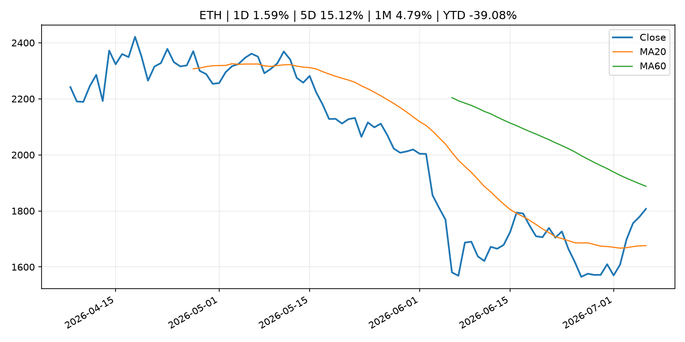
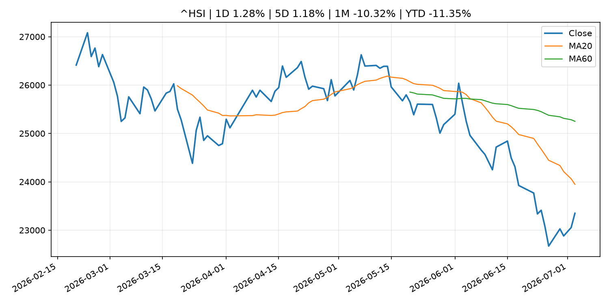

# Global Macro Morning Briefing - 2026-07-07

> Not financial advice / 非投资建议。

## 0. 今日总览
- 市场状态：risk_on。股指上涨、波动率或美元回落，市场更接近风险偏好改善。
- 今日三大主线：
  1. geopolitical_risk: Securitize eyes acquisitions with $400 million war chest after going public, CEO says
  2. central_bank_decision: FOMC minutes, SpaceX joins Nasdaq 100: Crypto Week Ahead
  3. regulation: SEC Names Paul Knight as Chief Operating Officer
- 一句话结论：今日晨报重点关注：地缘风险可能推升避险需求、能源价格和市场波动率。；央行决策会重定价利率、汇率、久期资产和风险资产。。跨资产方面，SPY 1D 0.87%；QQQ 1D 1.43%；^VIX 1D -3.59%；TLT 1D -0.07%；GC=F 1D 1.53%；CL=F 1D 0.04%；BTC 1D 1.84%；ETH 1D 1.59%；股指上涨、波动率或美元回落，市场更接近风险偏好改善。政策、通胀、利率、美元、美债、能源和加密监管仍是主要观察线索。所有结论仅基于公开数据与短摘要整理，不构成投资建议。

## 1. 隔夜跨资产市场
- 美股：SPY 1D 0.87%，QQQ 1D 1.43%，整体趋势需结合 VIX 和利率确认。
- 美债/美元：TLT 1D -0.07%，美元指数 1D -0.00%，是判断折现率压力的核心线索。
- 黄金/原油：黄金 1D 1.53%，原油 1D 0.04%，用于观察避险、通胀和地缘风险。
- 加密：BTC 1D 1.84%，ETH 1D 1.59%，关注是否独立于纳指走出加密自身行情。
- 港股/A股：恒生 1D 1.28%，沪深300/上证 1D n/a，重点看中国政策预期与人民币线索。
- 风险观察：确认风险偏好是否扩散到小盘股、信用利差和周期品。

### US_EQUITY

| symbol | latest close | 1D | 5D | 1M | YTD | trend |
|---|---:|---:|---:|---:|---:|---|
| SPY | 751.28 | 0.87% | 3.06% | -0.39% | 9.97% | uptrend |
| QQQ | 722.82 | 1.43% | 2.31% | -2.87% | 17.89% | uptrend |
| DIA | 530.09 | 0.42% | 2.38% | 4.30% | 9.61% | strong_uptrend |
| IWM | 298.90 | 0.44% | -0.31% | 3.90% | 20.15% | strong_uptrend |
| VTI | 371.67 | 0.79% | 2.61% | 0.01% | 10.51% | uptrend |

### US_MACRO_MARKET

| symbol | latest close | 1D | 5D | 1M | YTD | trend |
|---|---:|---:|---:|---:|---:|---|
| ^VIX | 15.57 | -3.59% | -15.43% | -3.05% | 7.31% | range_bound |
| DX-Y.NYB | 100.86 | -0.00% | -0.50% | 1.33% | 2.47% | uptrend |
| TLT | 85.45 | -0.07% | -2.19% | 0.16% | -1.82% | range_bound |
| IEF | 94.18 | 0.06% | -0.89% | 0.19% | -1.98% | downtrend |

### COMMODITIES

| symbol | latest close | 1D | 5D | 1M | YTD | trend |
|---|---:|---:|---:|---:|---:|---|
| GC=F | 4,175.80 | 1.53% | 2.38% | -5.88% | -3.21% | range_bound |
| SI=F | 62.47 | 3.01% | 5.49% | -14.98% | -11.46% | strong_downtrend |
| CL=F | 68.72 | 0.04% | -0.74% | -28.43% | 19.89% | strong_downtrend |
| BZ=F | 72.12 | 0.45% | 0.18% | -26.27% | 18.72% | strong_downtrend |
| NG=F | 3.25 | 1.78% | 0.68% | 1.21% | -10.09% | uptrend |
| HG=F | 6.25 | 2.27% | 1.82% | -3.51% | 10.88% | range_bound |

### HK_MARKET

| symbol | latest close | 1D | 5D | 1M | YTD | trend |
|---|---:|---:|---:|---:|---:|---|
| ^HSI | 23,350.03 | 1.28% | 1.18% | -10.32% | -11.35% | strong_downtrend |
| 0700.HK | 452.00 | 4.82% | 9.76% | -3.09% | -27.45% | range_bound |
| 9988.HK | 95.95 | 1.97% | 7.21% | -24.21% | -35.60% | strong_downtrend |
| 3690.HK | 74.95 | 4.68% | 16.65% | -6.78% | -28.35% | range_bound |
| 1810.HK | 23.28 | 1.39% | 8.68% | -18.54% | -42.20% | strong_downtrend |
| 1211.HK | 83.80 | -0.36% | 15.35% | -10.13% | -15.14% | range_bound |

### CRYPTO

| symbol | latest close | 1D | 5D | 1M | YTD | trend |
|---|---:|---:|---:|---:|---:|---|
| BTC | 64,255.54 | 1.84% | 9.74% | -2.22% | -26.58% | range_bound |
| ETH | 1,807.32 | 1.59% | 15.12% | 4.79% | -39.08% | range_bound |
| SOLANA | 82.27 | 0.79% | 11.91% | 15.72% | -33.93% | range_bound |
| BINANCECOIN | 587.96 | 2.28% | 7.74% | -4.60% | -31.88% | range_bound |
| RIPPLE | 1.15 | -0.86% | 10.44% | -3.23% | -37.64% | range_bound |

## 2. 今日最重要的 10 条新闻
### 1. Securitize eyes acquisitions with $400 million war chest after going public, CEO says
- 来源：CoinDesk
- 时间：2026-07-06T14:25:32+00:00
- 地区：global
- 事件类型：geopolitical_risk
- 重要性层级：Tier 1
- 一句话摘要：Securitize eyes acquisitions with $400 million war chest after going public, CEO says
- 为什么重要：地缘风险可能推升避险需求、能源价格和市场波动率。
- 可能影响：可能影响利率、汇率、风险资产或大宗商品预期，但当前公开信息不足以判断明确方向。
  - 资产：暂无明确资产映射
  - 方向：unknown
  - 强度：low
  - 原因：公开信息不足以判断方向。
- 原文链接：[https://www.coindesk.com/business/2026/07/06/securitize-eyes-acquisitions-with-usd400-million-war-chest-after-going-public-ceo-says](https://www.coindesk.com/business/2026/07/06/securitize-eyes-acquisitions-with-usd400-million-war-chest-after-going-public-ceo-says)

### 2. FOMC minutes, SpaceX joins Nasdaq 100: Crypto Week Ahead
- 来源：CoinDesk
- 时间：2026-07-06T08:18:05+00:00
- 地区：global
- 事件类型：central_bank_decision
- 重要性层级：Tier 1
- 一句话摘要：FOMC minutes, SpaceX joins Nasdaq 100: Crypto Week Ahead
- 为什么重要：央行决策会重定价利率、汇率、久期资产和风险资产。
- 可能影响：可能影响利率、汇率、风险资产或大宗商品预期，但当前公开信息不足以判断明确方向。
  - 资产：暂无明确资产映射
  - 方向：unknown
  - 强度：low
  - 原因：公开信息不足以判断方向。
- 原文链接：[https://www.coindesk.com/markets/2026/07/06/fomc-minutes-spacex-joins-nasdaq-100-crypto-week-ahead](https://www.coindesk.com/markets/2026/07/06/fomc-minutes-spacex-joins-nasdaq-100-crypto-week-ahead)

### 3. SEC Names Paul Knight as Chief Operating Officer
- 来源：SEC Press Releases
- 时间：2026-07-06T15:10:00-04:00
- 地区：US
- 事件类型：regulation
- 重要性层级：Tier 2
- 一句话摘要：The Securities and Exchange Commission today announced that Paul Knight has been named as the agency’s Chief Operating Officer (COO).As COO, Mr. Knight will oversee the SEC's operational and administrative functions, including the agency's Office of…
- 为什么重要：监管变化会改变行业盈利预期和资产风险溢价。
- 可能影响：主要影响 BTC，方向为 mixed，强度 high；加密监管或 ETF 进展会改变 BTC 的资金流和风险溢价。
  - 资产：BTC
    方向：mixed
    强度：high
    原因：加密监管或 ETF 进展会改变 BTC 的资金流和风险溢价。
  - 资产：ETH
    方向：mixed
    强度：high
    原因：监管框架会影响 ETH 产品化和机构参与度。
  - 资产：COIN
    方向：mixed
    强度：medium
    原因：监管清晰度和执法风险会影响交易平台估值。
  - 资产：crypto market
    方向：mixed
    强度：high
    原因：信息影响整个加密市场结构，但方向取决于细节。
- 原文链接：[https://www.sec.gov/newsroom/press-releases/2026-62-sec-names-paul-knight-chief-operating-officer](https://www.sec.gov/newsroom/press-releases/2026-62-sec-names-paul-knight-chief-operating-officer)

### 4. Circle’s USDC is leaving Tether behind in the stablecoin volume race, new data from Visa shows
- 来源：CoinDesk
- 时间：2026-07-06T16:00:15+00:00
- 地区：global
- 事件类型：crypto_market_structure
- 重要性层级：Tier 2
- 一句话摘要：Circle’s USDC is leaving Tether behind in the stablecoin volume race, new data from Visa shows
- 为什么重要：加密市场结构和监管变化会影响 BTC、ETH 及相关股票的风险溢价。
- 可能影响：主要影响 BTC，方向为 mixed，强度 high；加密监管或 ETF 进展会改变 BTC 的资金流和风险溢价。
  - 资产：BTC
    方向：mixed
    强度：high
    原因：加密监管或 ETF 进展会改变 BTC 的资金流和风险溢价。
  - 资产：ETH
    方向：mixed
    强度：high
    原因：监管框架会影响 ETH 产品化和机构参与度。
  - 资产：COIN
    方向：mixed
    强度：medium
    原因：监管清晰度和执法风险会影响交易平台估值。
  - 资产：crypto market
    方向：mixed
    强度：high
    原因：信息影响整个加密市场结构，但方向取决于细节。
- 原文链接：[https://www.coindesk.com/business/2026/07/06/circle-s-usdc-is-leaving-tether-behind-in-the-stablecoin-volume-race](https://www.coindesk.com/business/2026/07/06/circle-s-usdc-is-leaving-tether-behind-in-the-stablecoin-volume-race)

### 5. If the stock market’s double bubble bursts, it could usher in the next crash
- 来源：MarketWatch Top Stories
- 时间：2026-07-06T21:11:00+00:00
- 地区：US
- 事件类型：earnings
- 重要性层级：Tier 2
- 一句话摘要：While valuations still look extreme relative to history, the recent pace of corporate earnings growth has also meaningfully diverged from the long-term trend.
- 为什么重要：大型科技股盈利和资本开支会影响纳指、半导体和 AI 交易主线。
- 可能影响：可能影响利率、汇率、风险资产或大宗商品预期，但当前公开信息不足以判断明确方向。
  - 资产：暂无明确资产映射
  - 方向：unknown
  - 强度：low
  - 原因：公开信息不足以判断方向。
- 原文链接：[https://www.marketwatch.com/story/if-the-stock-markets-double-bubble-bursts-it-could-usher-in-the-next-crash-de54c1b2?mod=mw_rss_topstories](https://www.marketwatch.com/story/if-the-stock-markets-double-bubble-bursts-it-could-usher-in-the-next-crash-de54c1b2?mod=mw_rss_topstories)

### 6. Micron’s stock gains, signaling a ‘return to optimism’ about the chip sector
- 来源：MarketWatch Top Stories
- 时间：2026-07-06T20:33:00+00:00
- 地区：US
- 事件类型：earnings
- 重要性层级：Tier 2
- 一句话摘要：Investors are looking forward to Samsung’s earnings and SK Hynix’s ADR listing, experts say.
- 为什么重要：大型科技股盈利和资本开支会影响纳指、半导体和 AI 交易主线。
- 可能影响：可能影响利率、汇率、风险资产或大宗商品预期，但当前公开信息不足以判断明确方向。
  - 资产：暂无明确资产映射
  - 方向：unknown
  - 强度：low
  - 原因：公开信息不足以判断方向。
- 原文链接：[https://www.marketwatch.com/story/microns-stock-gains-signaling-a-return-to-optimism-about-the-chip-sector-0b7f6a8c?mod=mw_rss_topstories](https://www.marketwatch.com/story/microns-stock-gains-signaling-a-return-to-optimism-about-the-chip-sector-0b7f6a8c?mod=mw_rss_topstories)

### 7. U.S. inflation outlook underpins bitcoin bulls after best week since March
- 来源：CoinDesk
- 时间：2026-07-06T11:15:00+00:00
- 地区：global
- 事件类型：other
- 重要性层级：Tier 3
- 一句话摘要：U.S. inflation outlook underpins bitcoin bulls after best week since March
- 为什么重要：这条信息暂未匹配到重大宏观、政策或市场事件，更适合作为背景跟踪。
- 可能影响：主要影响 DXY，方向为 positive，强度 high；通胀压力可能推高政策利率预期并支撑美元。
  - 资产：DXY
    方向：positive
    强度：high
    原因：通胀压力可能推高政策利率预期并支撑美元。
  - 资产：TLT
    方向：negative
    强度：high
    原因：通胀上行通常推升收益率、压低长债价格。
  - 资产：QQQ
    方向：negative
    强度：high
    原因：更高利率对成长股估值折现率不利。
  - 资产：SPY
    方向：mixed
    强度：medium
    原因：名义增长可能支撑收入，但更高利率压制估值。
  - 资产：GC=F
    方向：mixed
    强度：medium
    原因：通胀对黄金是支撑，但实际利率上行会形成压力。
  - 资产：BTC
    方向：mixed
    强度：medium
    原因：抗通胀叙事和流动性收紧可能相互抵消。
- 原文链接：[https://www.coindesk.com/daybook-us/2026/07/06/u-s-inflation-outlook-underpins-bitcoin-bulls-after-best-week-since-march](https://www.coindesk.com/daybook-us/2026/07/06/u-s-inflation-outlook-underpins-bitcoin-bulls-after-best-week-since-march)

### 8. Philip R. Lane: AI and monetary policy
- 来源：ECB Press Releases
- 时间：2026-07-06T20:30:00+02:00
- 地区：EU
- 事件类型：other
- 重要性层级：Tier 3
- 一句话摘要：Philip R. Lane: AI and monetary policy
- 为什么重要：这条信息暂未匹配到重大宏观、政策或市场事件，更适合作为背景跟踪。
- 可能影响：更偏背景信息，短期市场影响可能有限。
  - 资产：暂无明确资产映射
  - 方向：unknown
  - 强度：low
  - 原因：公开信息不足以判断方向。
- 原文链接：[https://www.ecb.europa.eu//press/key/date/2026/html/ecb.sp260706~b81aa4e329.en.html](https://www.ecb.europa.eu//press/key/date/2026/html/ecb.sp260706~b81aa4e329.en.html)

## 3. 政策与央行观察
### 1. FOMC minutes, SpaceX joins Nasdaq 100: Crypto Week Ahead
- 来源：CoinDesk
- 时间：2026-07-06T08:18:05+00:00
- 地区：global
- 事件类型：central_bank_decision
- 重要性层级：Tier 1
- 一句话摘要：FOMC minutes, SpaceX joins Nasdaq 100: Crypto Week Ahead
- 为什么重要：央行决策会重定价利率、汇率、久期资产和风险资产。
- 可能影响：可能影响利率、汇率、风险资产或大宗商品预期，但当前公开信息不足以判断明确方向。
  - 资产：暂无明确资产映射
  - 方向：unknown
  - 强度：low
  - 原因：公开信息不足以判断方向。
- 原文链接：[https://www.coindesk.com/markets/2026/07/06/fomc-minutes-spacex-joins-nasdaq-100-crypto-week-ahead](https://www.coindesk.com/markets/2026/07/06/fomc-minutes-spacex-joins-nasdaq-100-crypto-week-ahead)

### 2. SEC Names Paul Knight as Chief Operating Officer
- 来源：SEC Press Releases
- 时间：2026-07-06T15:10:00-04:00
- 地区：US
- 事件类型：regulation
- 重要性层级：Tier 2
- 一句话摘要：The Securities and Exchange Commission today announced that Paul Knight has been named as the agency’s Chief Operating Officer (COO).As COO, Mr. Knight will oversee the SEC's operational and administrative functions, including the agency's Office of…
- 为什么重要：监管变化会改变行业盈利预期和资产风险溢价。
- 可能影响：主要影响 BTC，方向为 mixed，强度 high；加密监管或 ETF 进展会改变 BTC 的资金流和风险溢价。
  - 资产：BTC
    方向：mixed
    强度：high
    原因：加密监管或 ETF 进展会改变 BTC 的资金流和风险溢价。
  - 资产：ETH
    方向：mixed
    强度：high
    原因：监管框架会影响 ETH 产品化和机构参与度。
  - 资产：COIN
    方向：mixed
    强度：medium
    原因：监管清晰度和执法风险会影响交易平台估值。
  - 资产：crypto market
    方向：mixed
    强度：high
    原因：信息影响整个加密市场结构，但方向取决于细节。
- 原文链接：[https://www.sec.gov/newsroom/press-releases/2026-62-sec-names-paul-knight-chief-operating-officer](https://www.sec.gov/newsroom/press-releases/2026-62-sec-names-paul-knight-chief-operating-officer)

### 3. Circle’s USDC is leaving Tether behind in the stablecoin volume race, new data from Visa shows
- 来源：CoinDesk
- 时间：2026-07-06T16:00:15+00:00
- 地区：global
- 事件类型：crypto_market_structure
- 重要性层级：Tier 2
- 一句话摘要：Circle’s USDC is leaving Tether behind in the stablecoin volume race, new data from Visa shows
- 为什么重要：加密市场结构和监管变化会影响 BTC、ETH 及相关股票的风险溢价。
- 可能影响：主要影响 BTC，方向为 mixed，强度 high；加密监管或 ETF 进展会改变 BTC 的资金流和风险溢价。
  - 资产：BTC
    方向：mixed
    强度：high
    原因：加密监管或 ETF 进展会改变 BTC 的资金流和风险溢价。
  - 资产：ETH
    方向：mixed
    强度：high
    原因：监管框架会影响 ETH 产品化和机构参与度。
  - 资产：COIN
    方向：mixed
    强度：medium
    原因：监管清晰度和执法风险会影响交易平台估值。
  - 资产：crypto market
    方向：mixed
    强度：high
    原因：信息影响整个加密市场结构，但方向取决于细节。
- 原文链接：[https://www.coindesk.com/business/2026/07/06/circle-s-usdc-is-leaving-tether-behind-in-the-stablecoin-volume-race](https://www.coindesk.com/business/2026/07/06/circle-s-usdc-is-leaving-tether-behind-in-the-stablecoin-volume-race)

## 4. 市场异动与图表
- SPY 上涨 0.87%
- QQQ 上涨 1.43%
- VIX 下跌 -3.59%
- Gold 上涨 1.53%

### SPY

### QQQ

### ^VIX

### TLT

### GC=F

### CL=F

### BTC

### ETH

### ^HSI

## 5. 华尔街与机构公开观点
- 暂无可靠公开观点。

## 6. 今日重点关注
- 经济数据：经济数据：暂无可靠公开日历数据；如配置经济日历源后可自动填充。
- 央行讲话：央行讲话：暂无可靠公开日历数据；重点跟踪 Fed、ECB、BoJ、PBOC 官网 RSS。
- 财报：财报：暂无可靠数据。
- 政策事件：政策事件：暂无可靠数据。
- 风险提醒：风险提醒：关注数据源失败项、突发地缘风险、利率和美元的二阶反应。

## 7. 英文金融表达与宏观概念
- **inflation expectations**：通胀预期，指家庭、企业或市场对未来通胀的预估。 例句：Inflation expectations can shape wage bargaining and bond yields.
- **real yield**：实际收益率，名义利率扣除通胀预期后的收益率。 例句：Gold often reacts more to real yields than nominal yields.
- **terminal rate**：终端利率，市场预期本轮加息周期的最高政策利率。 例句：A higher terminal rate can pressure growth stocks.
- **risk-off**：避险模式，资金偏向美元、国债、黄金等防御资产。 例句：A geopolitical shock can push markets into risk-off mode.
- **market structure**：市场结构，指交易、托管、清算、ETF、监管等制度安排。 例句：Crypto market structure rules can affect institutional participation.
- **soft landing**：软着陆，指通胀回落而经济避免明显衰退。 例句：Markets often rally when data support a soft landing.

## 8. 背景材料
- [Bitcoin's U.S. reserve still a work-in-progress as federal agencies hash it out](https://www.coindesk.com/policy/2026/07/06/bitcoin-s-u-s-reserve-still-a-work-in-progress-as-federal-agencies-hash-it-out)（CoinDesk，other）：Bitcoin's U.S. reserve still a work-in-progress as federal agencies hash it out
- [Philip R. Lane: AI and monetary policy](https://www.ecb.europa.eu//press/key/date/2026/html/ecb.sp260706~b81aa4e329.en.html)（ECB Press Releases，other）：Philip R. Lane: AI and monetary policy
- [Bitcoin rebounds after Trump says he's become 'a big crypto guy'](https://www.cnbc.com/2026/07/06/bitcoin-rebounds-after-trump-says-hes-become-a-big-crypto-guy.html)（CNBC Economy，other）：Earlier, bitcoin fell toward $60,000 after Strategy disclosed the sale of more of its holdings of the token.
- [Strategy selling hundreds of millions worth of bitcoin raises question about its capital-allocation playbook](https://www.coindesk.com/markets/2026/07/06/one-month-that-shook-the-market-saylor-s-struggles-over-bitcoin-strategy-yields-big-loss)（CoinDesk，other）：Strategy selling hundreds of millions worth of bitcoin raises question about its capital-allocation playbook
- [Michael Saylor's Strategy dramatically ups pace of bitcoin sales, raising $216 million](https://www.coindesk.com/markets/2026/07/06/michael-saylor-s-strategy-dramatically-ups-pace-of-bitcoin-sales-raising-usd216-million)（CoinDesk，other）：Michael Saylor's Strategy dramatically ups pace of bitcoin sales, raising $216 million
- [U.S. inflation outlook underpins bitcoin bulls after best week since March](https://www.coindesk.com/daybook-us/2026/07/06/u-s-inflation-outlook-underpins-bitcoin-bulls-after-best-week-since-march)（CoinDesk，other）：U.S. inflation outlook underpins bitcoin bulls after best week since March
- [Bitcoin's Sharpe Ratio slides to lowest since 2022. Here's what it means.](https://www.coindesk.com/markets/2026/07/06/bitcoin-s-sharpe-ratio-slides-to-lowest-since-2022-here-s-what-it-means)（CoinDesk，other）：Bitcoin's Sharpe Ratio slides to lowest since 2022. Here's what it means.
- [Live markets: Bitcoin recoups early decline, rising back above $63,000](https://www.coindesk.com/tech/2026/07/06/live-markets-bitcoin-pops-to-usd63-900-then-reverses-as-week-begins)（CoinDesk，other）：Live markets: Bitcoin recoups early decline, rising back above $63,000
- [I am contemplating selling some of my bitcoin for gold, veteran trader Peter Brandt says](https://www.coindesk.com/markets/2026/07/06/i-am-contemplating-selling-some-of-my-bitcoin-for-gold-veteran-trader-peter-brandt-says)（CoinDesk，other）：I am contemplating selling some of my bitcoin for gold, veteran trader Peter Brandt says
- [Ether leads crypto's hold above key levels as bitcoin steadies over $63,000](https://www.coindesk.com/markets/2026/07/06/ether-leads-crypto-s-hold-above-key-levels-as-bitcoin-steadies-over-usd63-000)（CoinDesk，other）：Ether leads crypto's hold above key levels as bitcoin steadies over $63,000
- [Banks have stopped asking if stablecoins belong in finance, now they're considering how](https://www.coindesk.com/business/2026/07/05/banks-have-stopped-asking-if-stablecoins-belong-in-finance-now-they-re-considering-how)（CoinDesk，other）：Banks have stopped asking if stablecoins belong in finance, now they're considering how

## 9. 数据源、失败项与免责声明
- 采集时间：2026-07-06T23:05:58
- 数据源：公开 RSS、Yahoo Finance、CoinGecko、AKShare、FRED、SEC data.sec.gov，以及用户自有 inputs/reports 文件。
- 合规说明：不绕过 WSJ、Bloomberg、FT、Reuters 等付费墙；对付费媒体只使用公开 RSS 标题、摘要、链接和发布时间。
- 免责声明：Not financial advice / 非投资建议。本项目仅供个人学习、研究和信息整理，不构成投资建议、交易建议或任何收益承诺。
- 失败或跳过的数据源：
  - crypto data failed coin=dogecoin
  - China market data failed symbol=上证指数: empty dataframe
  - China market data failed symbol=深证成指: empty dataframe
  - China market data failed symbol=创业板指: empty dataframe
  - China market data failed symbol=沪深300: empty dataframe
  - China market data failed symbol=中证500: empty dataframe
  - China market data failed symbol=科创50: empty dataframe
  - FRED_API_KEY not set; skipping FRED macro series
  - SEC failed cik=0000320193
  - SEC failed cik=0000789019
  - SEC failed cik=0001045810
  - SEC failed cik=0001318605
  - SEC failed cik=0001577552
