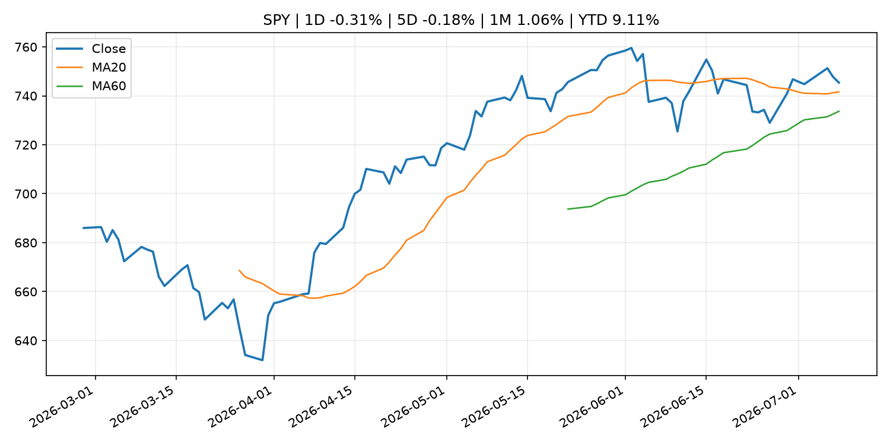
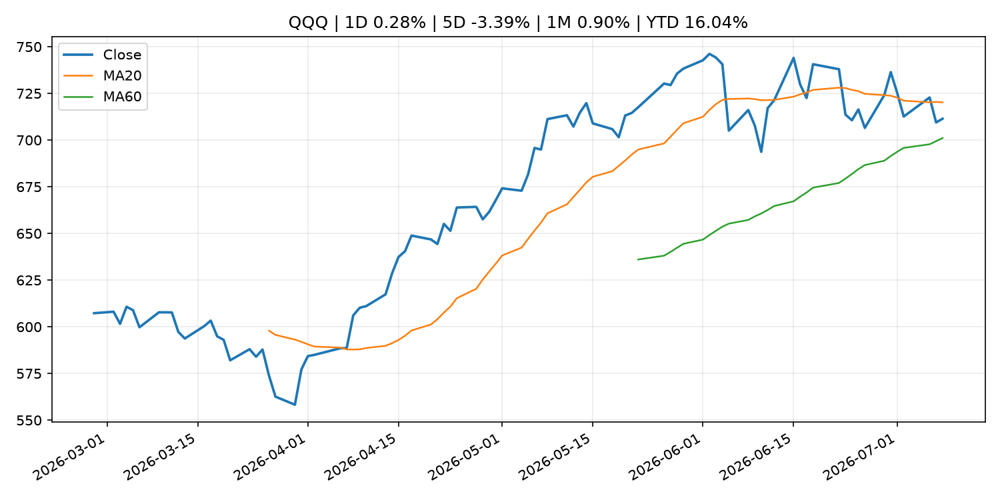
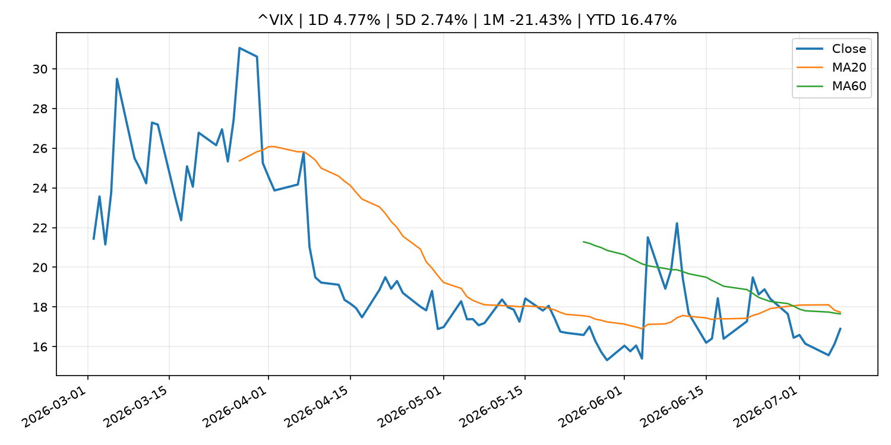
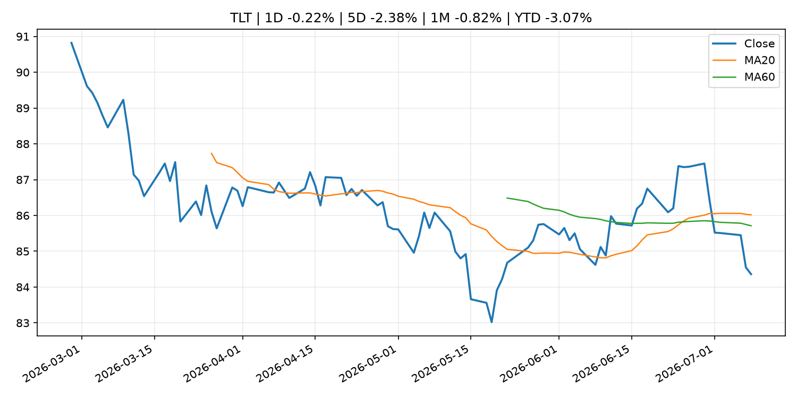
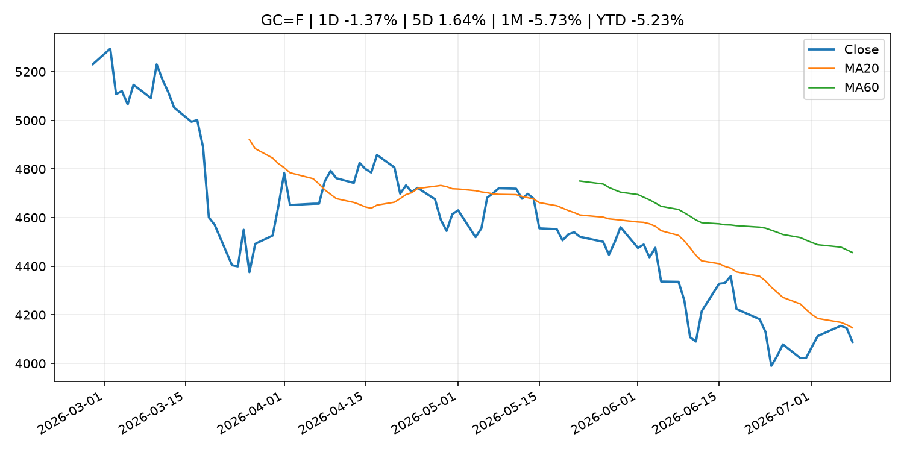
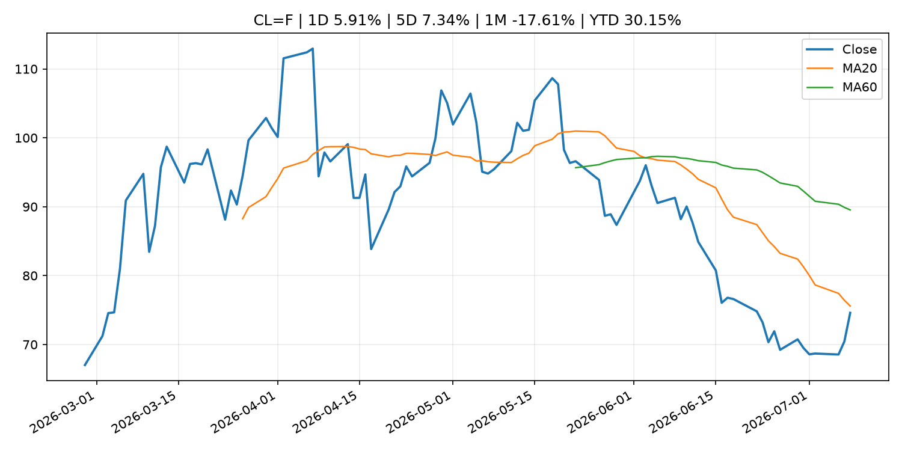
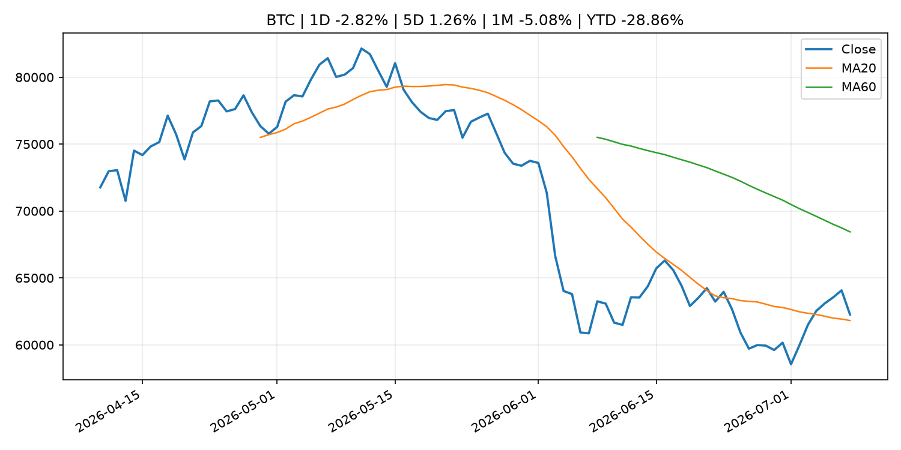
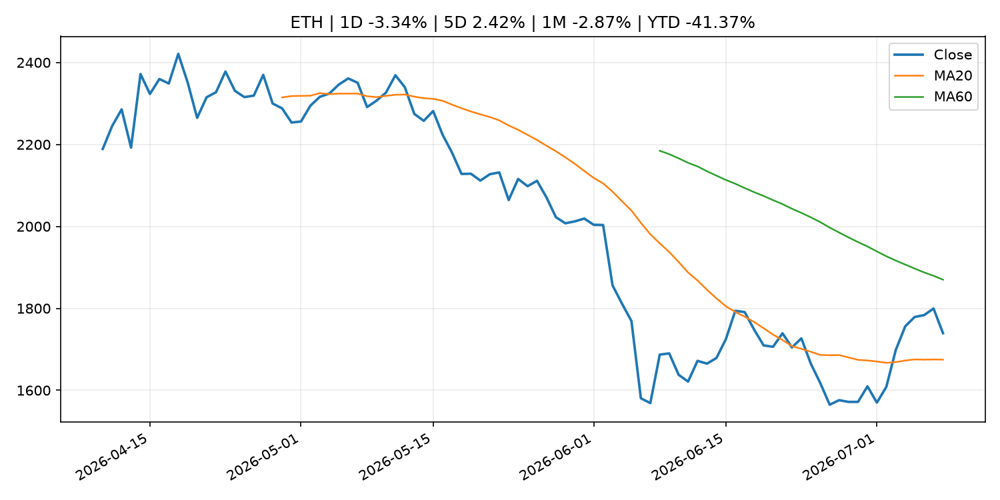
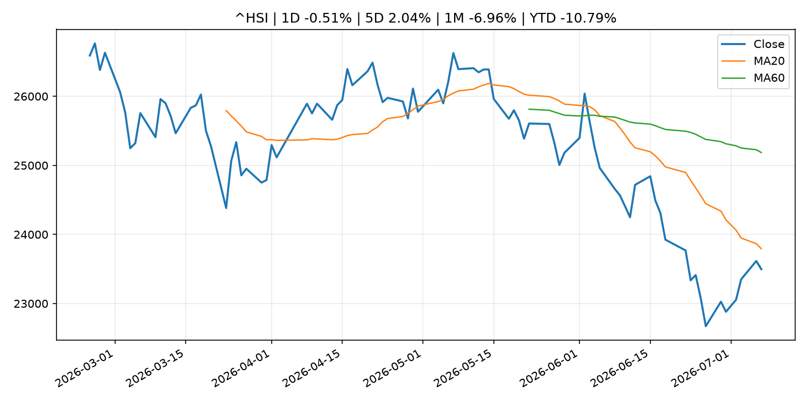

# Global Macro Morning Briefing - 2026-07-09

> Not financial advice / 非投资建议。

## 0. 今日总览
- 市场状态：unknown。市场信号不足，暂不判断明确状态。
- 今日三大主线：
  1. geopolitical_risk: Investors haven’t been this bullish on the dollar in a decade. How the buck can keep climbing.
  2. geopolitical_risk: Bitcoin's inflation quagmire gets stickier as renewed MidEast conflict sends oil price soaring
  3. geopolitical_risk: Traders on Kalshi think the Nasdaq-100 will end 2026 above 30,000, predicting a cooler second half of the year
- 一句话结论：今日晨报重点关注：地缘风险可能推升避险需求、能源价格和市场波动率。；地缘风险可能推升避险需求、能源价格和市场波动率。。跨资产方面，SPY 1D -0.31%；QQQ 1D 0.28%；^VIX 1D 4.77%；TLT 1D -0.22%；GC=F 1D -1.37%；CL=F 1D 5.91%；BTC 1D -2.82%；ETH 1D -3.34%；市场信号不足，暂不判断明确状态。政策、通胀、利率、美元、美债、能源和加密监管仍是主要观察线索。所有结论仅基于公开数据与短摘要整理，不构成投资建议。

## 1. 隔夜跨资产市场
- 美股：SPY 1D -0.31%，QQQ 1D 0.28%，整体趋势需结合 VIX 和利率确认。
- 美债/美元：TLT 1D -0.22%，美元指数 1D -0.07%，是判断折现率压力的核心线索。
- 黄金/原油：黄金 1D -1.37%，原油 1D 5.91%，用于观察避险、通胀和地缘风险。
- 加密：BTC 1D -2.82%，ETH 1D -3.34%，关注是否独立于纳指走出加密自身行情。
- 港股/A股：恒生 1D -0.51%，沪深300/上证 1D n/a，重点看中国政策预期与人民币线索。
- 风险观察：关注后续数据是否确认当前跨资产信号。

### US_EQUITY

| symbol | latest close | 1D | 5D | 1M | YTD | trend |
|---|---:|---:|---:|---:|---:|---|
| SPY | 745.40 | -0.31% | -0.18% | 1.06% | 9.11% | uptrend |
| QQQ | 711.44 | 0.28% | -3.39% | 0.90% | 16.04% | range_bound |
| DIA | 522.77 | -1.07% | 0.07% | 2.56% | 8.09% | uptrend |
| IWM | 293.48 | -0.91% | -2.32% | 4.20% | 17.97% | range_bound |
| VTI | 368.25 | -0.37% | -0.48% | 1.34% | 9.50% | uptrend |

### US_MACRO_MARKET

| symbol | latest close | 1D | 5D | 1M | YTD | trend |
|---|---:|---:|---:|---:|---:|---|
| ^VIX | 16.90 | 4.77% | 2.74% | -21.43% | 16.47% | range_bound |
| DX-Y.NYB | 101.07 | -0.07% | -0.12% | 1.00% | 2.69% | uptrend |
| TLT | 84.36 | -0.22% | -2.38% | -0.82% | -3.07% | range_bound |
| IEF | 93.51 | -0.20% | -1.12% | -0.12% | -2.67% | downtrend |

### COMMODITIES

| symbol | latest close | 1D | 5D | 1M | YTD | trend |
|---|---:|---:|---:|---:|---:|---|
| GC=F | 4,088.70 | -1.37% | 1.64% | -5.73% | -5.23% | strong_downtrend |
| SI=F | 58.83 | -3.45% | -1.09% | -14.67% | -16.62% | strong_downtrend |
| CL=F | 74.60 | 5.91% | 7.34% | -17.61% | 30.15% | downtrend |
| BZ=F | 79.09 | 6.65% | 8.46% | -15.04% | 30.19% | range_bound |
| NG=F | 3.22 | -1.41% | -1.71% | -0.31% | -11.03% | uptrend |
| HG=F | 6.12 | -0.77% | -1.11% | -2.23% | 8.58% | range_bound |

### HK_MARKET

| symbol | latest close | 1D | 5D | 1M | YTD | trend |
|---|---:|---:|---:|---:|---:|---|
| ^HSI | 23,496.89 | -0.51% | 2.04% | -6.96% | -10.79% | strong_downtrend |
| 0700.HK | 478.80 | 3.82% | 11.40% | 5.65% | -23.15% | range_bound |
| 9988.HK | 107.50 | 12.21% | 15.78% | -12.17% | -27.85% | range_bound |
| 3690.HK | 80.90 | 3.25% | 18.10% | 1.19% | -22.66% | range_bound |
| 1810.HK | 25.30 | 9.52% | 16.91% | -8.99% | -37.19% | range_bound |
| 1211.HK | 85.85 | 2.88% | 18.50% | -4.29% | -13.06% | range_bound |

### CRYPTO

| symbol | latest close | 1D | 5D | 1M | YTD | trend |
|---|---:|---:|---:|---:|---:|---|
| BTC | 62,263.75 | -2.82% | 1.26% | -5.08% | -28.86% | range_bound |
| ETH | 1,739.43 | -3.34% | 2.42% | -2.87% | -41.37% | range_bound |
| SOLANA | 77.45 | -5.49% | -3.93% | 5.43% | -37.80% | range_bound |
| BINANCECOIN | 567.70 | -3.05% | 1.73% | -6.09% | -34.23% | downtrend |
| RIPPLE | 1.09 | -4.57% | 0.49% | -10.26% | -40.65% | downtrend |
| DOGECOIN | 0.07 | -5.53% | -2.32% | -17.02% | -38.31% | strong_downtrend |

## 2. 今日最重要的 10 条新闻
### 1. Investors haven’t been this bullish on the dollar in a decade. How the buck can keep climbing.
- 来源：MarketWatch Top Stories
- 时间：2026-07-08T21:01:00+00:00
- 地区：US
- 事件类型：geopolitical_risk
- 重要性层级：Tier 1
- 一句话摘要：A crowded bet on a stronger U.S. dollar may depend on whether Wednesday’s jump in oil prices proves lasting, as renewed Middle East tensions revive inflation concerns and bolster expectations that the Federal Reserve may need to keep policy tight.
- 为什么重要：地缘风险可能推升避险需求、能源价格和市场波动率。
- 可能影响：主要影响 DXY，方向为 positive，强度 high；通胀压力可能推高政策利率预期并支撑美元。
  - 资产：DXY
    方向：positive
    强度：high
    原因：通胀压力可能推高政策利率预期并支撑美元。
  - 资产：TLT
    方向：negative
    强度：high
    原因：通胀上行通常推升收益率、压低长债价格。
  - 资产：QQQ
    方向：negative
    强度：high
    原因：更高利率对成长股估值折现率不利。
  - 资产：SPY
    方向：mixed
    强度：medium
    原因：名义增长可能支撑收入，但更高利率压制估值。
  - 资产：GC=F
    方向：mixed
    强度：medium
    原因：通胀对黄金是支撑，但实际利率上行会形成压力。
  - 资产：BTC
    方向：mixed
    强度：medium
    原因：抗通胀叙事和流动性收紧可能相互抵消。
- 原文链接：[https://www.marketwatch.com/story/traders-havent-been-this-bullish-on-the-dollar-in-a-decade-how-the-buck-can-keep-climbing-2e2bb287?mod=mw_rss_topstories](https://www.marketwatch.com/story/traders-havent-been-this-bullish-on-the-dollar-in-a-decade-how-the-buck-can-keep-climbing-2e2bb287?mod=mw_rss_topstories)

### 2. Bitcoin's inflation quagmire gets stickier as renewed MidEast conflict sends oil price soaring
- 来源：CoinDesk
- 时间：2026-07-08T11:15:42+00:00
- 地区：global
- 事件类型：geopolitical_risk
- 重要性层级：Tier 1
- 一句话摘要：Bitcoin's inflation quagmire gets stickier as renewed MidEast conflict sends oil price soaring
- 为什么重要：地缘风险可能推升避险需求、能源价格和市场波动率。
- 可能影响：主要影响 DXY，方向为 positive，强度 high；通胀压力可能推高政策利率预期并支撑美元。
  - 资产：DXY
    方向：positive
    强度：high
    原因：通胀压力可能推高政策利率预期并支撑美元。
  - 资产：TLT
    方向：negative
    强度：high
    原因：通胀上行通常推升收益率、压低长债价格。
  - 资产：QQQ
    方向：negative
    强度：high
    原因：更高利率对成长股估值折现率不利。
  - 资产：SPY
    方向：mixed
    强度：medium
    原因：名义增长可能支撑收入，但更高利率压制估值。
  - 资产：GC=F
    方向：mixed
    强度：medium
    原因：通胀对黄金是支撑，但实际利率上行会形成压力。
  - 资产：BTC
    方向：mixed
    强度：medium
    原因：抗通胀叙事和流动性收紧可能相互抵消。
- 原文链接：[https://www.coindesk.com/daybook-us/2026/07/08/bitcoin-s-inflation-quagmire-gets-stickier-as-renewed-mideast-conflict-sends-oil-price-soaring](https://www.coindesk.com/daybook-us/2026/07/08/bitcoin-s-inflation-quagmire-gets-stickier-as-renewed-mideast-conflict-sends-oil-price-soaring)

### 3. Traders on Kalshi think the Nasdaq-100 will end 2026 above 30,000, predicting a cooler second half of the year
- 来源：CNBC Economy
- 时间：2026-07-07T21:15:26+00:00
- 地区：US
- 事件类型：geopolitical_risk
- 重要性层级：Tier 1
- 一句话摘要：Speculators think the massive rally in the Nasdaq-100 since the lows following the U.S.-Iran war will be more subdued in the second half of 2026.
- 为什么重要：地缘风险可能推升避险需求、能源价格和市场波动率。
- 可能影响：主要影响 QQQ，方向为 positive，强度 high；通胀低于预期通常压低利率预期，有利于久期较长的成长股。
  - 资产：QQQ
    方向：positive
    强度：high
    原因：通胀低于预期通常压低利率预期，有利于久期较长的成长股。
  - 资产：SPY
    方向：positive
    强度：medium
    原因：通胀降温改善软着陆预期，对宽基股指偏正面。
  - 资产：TLT
    方向：positive
    强度：high
    原因：降息预期升温时长债价格通常受益。
  - 资产：DXY
    方向：negative
    强度：medium
    原因：美元可能随美债收益率和政策利率预期回落。
  - 资产：GC=F
    方向：positive
    强度：medium
    原因：实际利率压力下降时黄金通常受益。
  - 资产：BTC
    方向：positive
    强度：medium
    原因：流动性预期改善通常支持高 beta 加密资产。
- 原文链接：[https://www.cnbc.com/2026/07/07/traders-on-kalshi-think-the-nasdaq-100-will-end-2026-above-30000.html](https://www.cnbc.com/2026/07/07/traders-on-kalshi-think-the-nasdaq-100-will-end-2026-above-30000.html)

### 4. ‘I’d hate to end up with an unexpected tax bill’: I’m 73 and still work full time. Can I avoid paying taxes on my Social Security benefits?
- 来源：MarketWatch Top Stories
- 时间：2026-07-08T20:30:00+00:00
- 地区：US
- 事件类型：fiscal_policy
- 重要性层级：Tier 1
- 一句话摘要：“I’m actually earning more each week than I ever have before.”
- 为什么重要：财政和贸易政策会影响增长、通胀、企业利润和跨境资本流。
- 可能影响：可能影响利率、汇率、风险资产或大宗商品预期，但当前公开信息不足以判断明确方向。
  - 资产：暂无明确资产映射
  - 方向：unknown
  - 强度：low
  - 原因：公开信息不足以判断方向。
- 原文链接：[https://www.marketwatch.com/story/im-73-and-still-work-full-time-can-i-avoid-paying-taxes-on-my-social-security-benefits-06ecc7c2?mod=mw_rss_topstories](https://www.marketwatch.com/story/im-73-and-still-work-full-time-can-i-avoid-paying-taxes-on-my-social-security-benefits-06ecc7c2?mod=mw_rss_topstories)

### 5. SEC to Host Virtual Roundtable on Modernizing IPOs and Expanding Access to Public Markets
- 来源：SEC Press Releases
- 时间：2026-07-08T13:54:26-04:00
- 地区：US
- 事件类型：regulation
- 重要性层级：Tier 2
- 一句话摘要：The Securities and Exchange Commission’s Office of the Advocate for Small Business Capital Formation and the Division of Corporation Finance will co-host a livestreamed discussion on Monday, July 13, 2026, at 2 p.m. to re-examine…
- 为什么重要：监管变化会改变行业盈利预期和资产风险溢价。
- 可能影响：主要影响 BTC，方向为 mixed，强度 high；加密监管或 ETF 进展会改变 BTC 的资金流和风险溢价。
  - 资产：BTC
    方向：mixed
    强度：high
    原因：加密监管或 ETF 进展会改变 BTC 的资金流和风险溢价。
  - 资产：ETH
    方向：mixed
    强度：high
    原因：监管框架会影响 ETH 产品化和机构参与度。
  - 资产：COIN
    方向：mixed
    强度：medium
    原因：监管清晰度和执法风险会影响交易平台估值。
  - 资产：crypto market
    方向：mixed
    强度：high
    原因：信息影响整个加密市场结构，但方向取决于细节。
- 原文链接：[https://www.sec.gov/newsroom/press-releases/2026-65-sec-host-virtual-roundtable-modernizing-ipos-expanding-access-public-markets](https://www.sec.gov/newsroom/press-releases/2026-65-sec-host-virtual-roundtable-modernizing-ipos-expanding-access-public-markets)

### 6. SEC Small Business Advisory Committee to Explore Modernizing Market Access
- 来源：SEC Press Releases
- 时间：2026-07-08T09:01:01-04:00
- 地区：US
- 事件类型：regulation
- 重要性层级：Tier 2
- 一句话摘要：The Securities and Exchange Commission’s Small Business Capital Formation Advisory Committee announced that it will hold a meeting on Tuesday, July 21, 2026 at 10 a.m. to explore ways to modernize public market access and encourage IPOs…
- 为什么重要：监管变化会改变行业盈利预期和资产风险溢价。
- 可能影响：主要影响 BTC，方向为 mixed，强度 high；加密监管或 ETF 进展会改变 BTC 的资金流和风险溢价。
  - 资产：BTC
    方向：mixed
    强度：high
    原因：加密监管或 ETF 进展会改变 BTC 的资金流和风险溢价。
  - 资产：ETH
    方向：mixed
    强度：high
    原因：监管框架会影响 ETH 产品化和机构参与度。
  - 资产：COIN
    方向：mixed
    强度：medium
    原因：监管清晰度和执法风险会影响交易平台估值。
  - 资产：crypto market
    方向：mixed
    强度：high
    原因：信息影响整个加密市场结构，但方向取决于细节。
- 原文链接：[https://www.sec.gov/newsroom/press-releases/2026-64-sec-small-business-advisory-committee-explore-modernizing-market-access](https://www.sec.gov/newsroom/press-releases/2026-64-sec-small-business-advisory-committee-explore-modernizing-market-access)

### 7. SEC Forms New Retail Fraud Working Group
- 来源：SEC Press Releases
- 时间：2026-07-07T10:39:57-04:00
- 地区：US
- 事件类型：regulation
- 重要性层级：Tier 2
- 一句话摘要：The Securities and Exchange Commission today announced the creation of the Retail Fraud Working Group designed to strengthen the Division of Enforcement’s efforts to identify and combat fraud targeting everyday investors.The Retail Fraud Working Group…
- 为什么重要：监管变化会改变行业盈利预期和资产风险溢价。
- 可能影响：主要影响 BTC，方向为 mixed，强度 high；加密监管或 ETF 进展会改变 BTC 的资金流和风险溢价。
  - 资产：BTC
    方向：mixed
    强度：high
    原因：加密监管或 ETF 进展会改变 BTC 的资金流和风险溢价。
  - 资产：ETH
    方向：mixed
    强度：high
    原因：监管框架会影响 ETH 产品化和机构参与度。
  - 资产：COIN
    方向：mixed
    强度：medium
    原因：监管清晰度和执法风险会影响交易平台估值。
  - 资产：crypto market
    方向：mixed
    强度：high
    原因：信息影响整个加密市场结构，但方向取决于细节。
- 原文链接：[https://www.sec.gov/newsroom/press-releases/2026-63-sec-forms-new-retail-fraud-working-group](https://www.sec.gov/newsroom/press-releases/2026-63-sec-forms-new-retail-fraud-working-group)

### 8. U.S. SEC to propose crypto rule as soon as this month to ease startups, fundraising
- 来源：CoinDesk
- 时间：2026-07-07T16:08:19+00:00
- 地区：global
- 事件类型：regulation
- 重要性层级：Tier 2
- 一句话摘要：U.S. SEC to propose crypto rule as soon as this month to ease startups, fundraising
- 为什么重要：监管变化会改变行业盈利预期和资产风险溢价。
- 可能影响：主要影响 BTC，方向为 mixed，强度 high；加密监管或 ETF 进展会改变 BTC 的资金流和风险溢价。
  - 资产：BTC
    方向：mixed
    强度：high
    原因：加密监管或 ETF 进展会改变 BTC 的资金流和风险溢价。
  - 资产：ETH
    方向：mixed
    强度：high
    原因：监管框架会影响 ETH 产品化和机构参与度。
  - 资产：COIN
    方向：mixed
    强度：medium
    原因：监管清晰度和执法风险会影响交易平台估值。
  - 资产：crypto market
    方向：mixed
    强度：high
    原因：信息影响整个加密市场结构，但方向取决于细节。
- 原文链接：[https://www.coindesk.com/policy/2026/07/07/u-s-sec-to-propose-crypto-rule-as-soon-as-this-month-to-ease-startups-fundraising](https://www.coindesk.com/policy/2026/07/07/u-s-sec-to-propose-crypto-rule-as-soon-as-this-month-to-ease-startups-fundraising)

### 9. Former Tether investment chief is looking to sell part of his stake in the stablecoin giant: Bloomberg
- 来源：CoinDesk
- 时间：2026-07-07T13:46:25+00:00
- 地区：global
- 事件类型：crypto_market_structure
- 重要性层级：Tier 2
- 一句话摘要：Former Tether investment chief is looking to sell part of his stake in the stablecoin giant: Bloomberg
- 为什么重要：加密市场结构和监管变化会影响 BTC、ETH 及相关股票的风险溢价。
- 可能影响：主要影响 BTC，方向为 mixed，强度 high；加密监管或 ETF 进展会改变 BTC 的资金流和风险溢价。
  - 资产：BTC
    方向：mixed
    强度：high
    原因：加密监管或 ETF 进展会改变 BTC 的资金流和风险溢价。
  - 资产：ETH
    方向：mixed
    强度：high
    原因：监管框架会影响 ETH 产品化和机构参与度。
  - 资产：COIN
    方向：mixed
    强度：medium
    原因：监管清晰度和执法风险会影响交易平台估值。
  - 资产：crypto market
    方向：mixed
    强度：high
    原因：信息影响整个加密市场结构，但方向取决于细节。
- 原文链接：[https://www.coindesk.com/business/2026/07/07/former-tether-investment-chief-is-looking-to-sell-part-of-his-stake-in-the-stablecoin-giant-bloomberg](https://www.coindesk.com/business/2026/07/07/former-tether-investment-chief-is-looking-to-sell-part-of-his-stake-in-the-stablecoin-giant-bloomberg)

### 10. Live markets: Bitcoin drops to $62,000 as oil and bond yields surge on collapse of Iran ceasefire
- 来源：CoinDesk
- 时间：2026-07-08T05:29:16+00:00
- 地区：global
- 事件类型：other
- 重要性层级：Tier 3
- 一句话摘要：Live markets: Bitcoin drops to $62,000 as oil and bond yields surge on collapse of Iran ceasefire
- 为什么重要：这条信息暂未匹配到重大宏观、政策或市场事件，更适合作为背景跟踪。
- 可能影响：主要影响 CL=F，方向为 positive，强度 high；供给扰动或 OPEC 减产通常推升 WTI 原油。
  - 资产：CL=F
    方向：positive
    强度：high
    原因：供给扰动或 OPEC 减产通常推升 WTI 原油。
  - 资产：BZ=F
    方向：positive
    强度：high
    原因：全球供给风险通常直接影响 Brent 原油。
  - 资产：SPY
    方向：mixed
    强度：medium
    原因：能源股可能受益，但通胀和成本压力不利于宽基风险资产。
- 原文链接：[https://www.coindesk.com/tech/2026/07/08/live-markets-japan-s-collapsing-yen-is-pushing-companies-into-bitcoin-and-xrp](https://www.coindesk.com/tech/2026/07/08/live-markets-japan-s-collapsing-yen-is-pushing-companies-into-bitcoin-and-xrp)

## 3. 政策与央行观察
### 1. ‘I’d hate to end up with an unexpected tax bill’: I’m 73 and still work full time. Can I avoid paying taxes on my Social Security benefits?
- 来源：MarketWatch Top Stories
- 时间：2026-07-08T20:30:00+00:00
- 地区：US
- 事件类型：fiscal_policy
- 重要性层级：Tier 1
- 一句话摘要：“I’m actually earning more each week than I ever have before.”
- 为什么重要：财政和贸易政策会影响增长、通胀、企业利润和跨境资本流。
- 可能影响：可能影响利率、汇率、风险资产或大宗商品预期，但当前公开信息不足以判断明确方向。
  - 资产：暂无明确资产映射
  - 方向：unknown
  - 强度：low
  - 原因：公开信息不足以判断方向。
- 原文链接：[https://www.marketwatch.com/story/im-73-and-still-work-full-time-can-i-avoid-paying-taxes-on-my-social-security-benefits-06ecc7c2?mod=mw_rss_topstories](https://www.marketwatch.com/story/im-73-and-still-work-full-time-can-i-avoid-paying-taxes-on-my-social-security-benefits-06ecc7c2?mod=mw_rss_topstories)

### 2. SEC to Host Virtual Roundtable on Modernizing IPOs and Expanding Access to Public Markets
- 来源：SEC Press Releases
- 时间：2026-07-08T13:54:26-04:00
- 地区：US
- 事件类型：regulation
- 重要性层级：Tier 2
- 一句话摘要：The Securities and Exchange Commission’s Office of the Advocate for Small Business Capital Formation and the Division of Corporation Finance will co-host a livestreamed discussion on Monday, July 13, 2026, at 2 p.m. to re-examine…
- 为什么重要：监管变化会改变行业盈利预期和资产风险溢价。
- 可能影响：主要影响 BTC，方向为 mixed，强度 high；加密监管或 ETF 进展会改变 BTC 的资金流和风险溢价。
  - 资产：BTC
    方向：mixed
    强度：high
    原因：加密监管或 ETF 进展会改变 BTC 的资金流和风险溢价。
  - 资产：ETH
    方向：mixed
    强度：high
    原因：监管框架会影响 ETH 产品化和机构参与度。
  - 资产：COIN
    方向：mixed
    强度：medium
    原因：监管清晰度和执法风险会影响交易平台估值。
  - 资产：crypto market
    方向：mixed
    强度：high
    原因：信息影响整个加密市场结构，但方向取决于细节。
- 原文链接：[https://www.sec.gov/newsroom/press-releases/2026-65-sec-host-virtual-roundtable-modernizing-ipos-expanding-access-public-markets](https://www.sec.gov/newsroom/press-releases/2026-65-sec-host-virtual-roundtable-modernizing-ipos-expanding-access-public-markets)

### 3. SEC Small Business Advisory Committee to Explore Modernizing Market Access
- 来源：SEC Press Releases
- 时间：2026-07-08T09:01:01-04:00
- 地区：US
- 事件类型：regulation
- 重要性层级：Tier 2
- 一句话摘要：The Securities and Exchange Commission’s Small Business Capital Formation Advisory Committee announced that it will hold a meeting on Tuesday, July 21, 2026 at 10 a.m. to explore ways to modernize public market access and encourage IPOs…
- 为什么重要：监管变化会改变行业盈利预期和资产风险溢价。
- 可能影响：主要影响 BTC，方向为 mixed，强度 high；加密监管或 ETF 进展会改变 BTC 的资金流和风险溢价。
  - 资产：BTC
    方向：mixed
    强度：high
    原因：加密监管或 ETF 进展会改变 BTC 的资金流和风险溢价。
  - 资产：ETH
    方向：mixed
    强度：high
    原因：监管框架会影响 ETH 产品化和机构参与度。
  - 资产：COIN
    方向：mixed
    强度：medium
    原因：监管清晰度和执法风险会影响交易平台估值。
  - 资产：crypto market
    方向：mixed
    强度：high
    原因：信息影响整个加密市场结构，但方向取决于细节。
- 原文链接：[https://www.sec.gov/newsroom/press-releases/2026-64-sec-small-business-advisory-committee-explore-modernizing-market-access](https://www.sec.gov/newsroom/press-releases/2026-64-sec-small-business-advisory-committee-explore-modernizing-market-access)

### 4. SEC Forms New Retail Fraud Working Group
- 来源：SEC Press Releases
- 时间：2026-07-07T10:39:57-04:00
- 地区：US
- 事件类型：regulation
- 重要性层级：Tier 2
- 一句话摘要：The Securities and Exchange Commission today announced the creation of the Retail Fraud Working Group designed to strengthen the Division of Enforcement’s efforts to identify and combat fraud targeting everyday investors.The Retail Fraud Working Group…
- 为什么重要：监管变化会改变行业盈利预期和资产风险溢价。
- 可能影响：主要影响 BTC，方向为 mixed，强度 high；加密监管或 ETF 进展会改变 BTC 的资金流和风险溢价。
  - 资产：BTC
    方向：mixed
    强度：high
    原因：加密监管或 ETF 进展会改变 BTC 的资金流和风险溢价。
  - 资产：ETH
    方向：mixed
    强度：high
    原因：监管框架会影响 ETH 产品化和机构参与度。
  - 资产：COIN
    方向：mixed
    强度：medium
    原因：监管清晰度和执法风险会影响交易平台估值。
  - 资产：crypto market
    方向：mixed
    强度：high
    原因：信息影响整个加密市场结构，但方向取决于细节。
- 原文链接：[https://www.sec.gov/newsroom/press-releases/2026-63-sec-forms-new-retail-fraud-working-group](https://www.sec.gov/newsroom/press-releases/2026-63-sec-forms-new-retail-fraud-working-group)

### 5. U.S. SEC to propose crypto rule as soon as this month to ease startups, fundraising
- 来源：CoinDesk
- 时间：2026-07-07T16:08:19+00:00
- 地区：global
- 事件类型：regulation
- 重要性层级：Tier 2
- 一句话摘要：U.S. SEC to propose crypto rule as soon as this month to ease startups, fundraising
- 为什么重要：监管变化会改变行业盈利预期和资产风险溢价。
- 可能影响：主要影响 BTC，方向为 mixed，强度 high；加密监管或 ETF 进展会改变 BTC 的资金流和风险溢价。
  - 资产：BTC
    方向：mixed
    强度：high
    原因：加密监管或 ETF 进展会改变 BTC 的资金流和风险溢价。
  - 资产：ETH
    方向：mixed
    强度：high
    原因：监管框架会影响 ETH 产品化和机构参与度。
  - 资产：COIN
    方向：mixed
    强度：medium
    原因：监管清晰度和执法风险会影响交易平台估值。
  - 资产：crypto market
    方向：mixed
    强度：high
    原因：信息影响整个加密市场结构，但方向取决于细节。
- 原文链接：[https://www.coindesk.com/policy/2026/07/07/u-s-sec-to-propose-crypto-rule-as-soon-as-this-month-to-ease-startups-fundraising](https://www.coindesk.com/policy/2026/07/07/u-s-sec-to-propose-crypto-rule-as-soon-as-this-month-to-ease-startups-fundraising)

### 6. Former Tether investment chief is looking to sell part of his stake in the stablecoin giant: Bloomberg
- 来源：CoinDesk
- 时间：2026-07-07T13:46:25+00:00
- 地区：global
- 事件类型：crypto_market_structure
- 重要性层级：Tier 2
- 一句话摘要：Former Tether investment chief is looking to sell part of his stake in the stablecoin giant: Bloomberg
- 为什么重要：加密市场结构和监管变化会影响 BTC、ETH 及相关股票的风险溢价。
- 可能影响：主要影响 BTC，方向为 mixed，强度 high；加密监管或 ETF 进展会改变 BTC 的资金流和风险溢价。
  - 资产：BTC
    方向：mixed
    强度：high
    原因：加密监管或 ETF 进展会改变 BTC 的资金流和风险溢价。
  - 资产：ETH
    方向：mixed
    强度：high
    原因：监管框架会影响 ETH 产品化和机构参与度。
  - 资产：COIN
    方向：mixed
    强度：medium
    原因：监管清晰度和执法风险会影响交易平台估值。
  - 资产：crypto market
    方向：mixed
    强度：high
    原因：信息影响整个加密市场结构，但方向取决于细节。
- 原文链接：[https://www.coindesk.com/business/2026/07/07/former-tether-investment-chief-is-looking-to-sell-part-of-his-stake-in-the-stablecoin-giant-bloomberg](https://www.coindesk.com/business/2026/07/07/former-tether-investment-chief-is-looking-to-sell-part-of-his-stake-in-the-stablecoin-giant-bloomberg)

## 4. 市场异动与图表
- VIX 上涨 4.77%
- Gold 下跌 -1.37%
- Oil 上涨 5.91%
- BTC 下跌 -2.82%
- ETH 下跌 -3.34%

### SPY

### QQQ

### ^VIX

### TLT

### GC=F

### CL=F

### BTC

### ETH

### ^HSI

## 5. 华尔街与机构公开观点
- 暂无可靠公开观点。

## 6. 今日重点关注
- 经济数据：经济数据：暂无可靠公开日历数据；如配置经济日历源后可自动填充。
- 央行讲话：央行讲话：暂无可靠公开日历数据；重点跟踪 Fed、ECB、BoJ、PBOC 官网 RSS。
- 财报：财报：暂无可靠数据。
- 政策事件：政策事件：暂无可靠数据。
- 风险提醒：风险提醒：关注数据源失败项、突发地缘风险、利率和美元的二阶反应。

## 7. 英文金融表达与宏观概念
- **inflation expectations**：通胀预期，指家庭、企业或市场对未来通胀的预估。 例句：Inflation expectations can shape wage bargaining and bond yields.
- **real yield**：实际收益率，名义利率扣除通胀预期后的收益率。 例句：Gold often reacts more to real yields than nominal yields.
- **risk-off**：避险模式，资金偏向美元、国债、黄金等防御资产。 例句：A geopolitical shock can push markets into risk-off mode.
- **supply disruption**：供给扰动，通常指能源或商品供应受冲突、减产或天气影响。 例句：Supply disruption can lift oil prices and inflation expectations.
- **market structure**：市场结构，指交易、托管、清算、ETF、监管等制度安排。 例句：Crypto market structure rules can affect institutional participation.
- **terminal rate**：终端利率，市场预期本轮加息周期的最高政策利率。 例句：A higher terminal rate can pressure growth stocks.

## 8. 背景材料
- [More than two-thirds of tech stocks are at least 20% off recent highs. What’s happening to the AI trade?](https://www.marketwatch.com/story/more-than-two-thirds-of-tech-stocks-are-at-least-20-off-recent-highs-whats-happening-to-the-ai-trade-4ba6aa28?mod=mw_rss_topstories)（MarketWatch Top Stories，other）：Major semiconductor names have been falling hard as investors take profits following a blockbuster second quarter.
- [Fed officials were split on direction of interest rates at last meeting, minutes show](https://www.cnbc.com/2026/07/08/fed-minutes-june-2026-.html)（CNBC Economy，other）：The Federal Reserve on Wednesday released minutes from its June 16-17 meeting.
- [Minutes of the Federal Open Market Committee, June 16-17, 2026](https://www.federalreserve.gov/newsevents/pressreleases/monetary20260708a.htm)（Federal Reserve Press Releases，other）：Minutes of the Federal Open Market Committee, June 16-17, 2026
- [Adam Back's bitcoin treasury firm scraps SPAC merger, seeks new deal](https://www.coindesk.com/markets/2026/07/08/adam-back-s-bstr-scraps-original-spac-terms-seeks-new-deal)（CoinDesk，other）：Adam Back's bitcoin treasury firm scraps SPAC merger, seeks new deal
- [SpaceX's first bitcoin wallet movements in six months likely don't signal sales](https://www.coindesk.com/markets/2026/07/08/spacex-s-first-bitcoin-wallet-movements-in-six-months-likely-don-t-signal-sales)（CoinDesk，other）：SpaceX's first bitcoin wallet movements in six months likely don't signal sales
- [Live markets: Bitcoin drops to $62,000 as oil and bond yields surge on collapse of Iran ceasefire](https://www.coindesk.com/tech/2026/07/08/live-markets-japan-s-collapsing-yen-is-pushing-companies-into-bitcoin-and-xrp)（CoinDesk，other）：Live markets: Bitcoin drops to $62,000 as oil and bond yields surge on collapse of Iran ceasefire
- [Bitcoin under pressure as Trump says Iran ceasefire is over](https://www.coindesk.com/markets/2026/07/08/bitcoin-under-pressure-as-u-s-iran-escalation-lifts-oil)（CoinDesk，other）：Bitcoin under pressure as Trump says Iran ceasefire is over
- [Loans, Debt Securities, and Deposits by Maturity (End of September 2025)](http://www.boj.or.jp/en/statistics/sj/sjmatu.xlsx)（Bank of Japan Announcements，other）：Loans, Debt Securities, and Deposits by Maturity (End of September 2025)
- [Principal Figures of Financial Institutions (June)](http://www.boj.or.jp/en/statistics/dl/depo/kashi/kasi2606.pdf)（Bank of Japan Announcements，other）：Principal Figures of Financial Institutions (June)
- [Direct Investment by Region and Industry (1st quarter 2026)](http://www.boj.or.jp/en/statistics/br/bop_06/bpdata/diiqcy.htm)（Bank of Japan Announcements，other）：Direct Investment by Region and Industry (1st quarter 2026)
- [BlackRock-backed Securitize slides 40% after SPAC debut despite tokenization boom](https://www.coindesk.com/markets/2026/07/07/blackrock-backed-securitize-slides-40-after-spac-debut-despite-tokenization-boom)（CoinDesk，other）：BlackRock-backed Securitize slides 40% after SPAC debut despite tokenization boom
- [Federal Reserve Board requests comment on a proposal to amend its requirements for banks to maintain anti-money laundering programs](https://www.federalreserve.gov/newsevents/pressreleases/bcreg20260707a.htm)（Federal Reserve Press Releases，other）：Federal Reserve Board requests comment on a proposal to amend its requirements for banks to maintain anti-money laundering programs
- [Bitcoin, XRP draw Japanese firms as weak yen drives treasury diversification](https://www.coindesk.com/markets/2026/07/07/bitcoin-xrp-draw-japanese-firms-as-weak-yen-drives-treasury-diversification)（CoinDesk，other）：Bitcoin, XRP draw Japanese firms as weak yen drives treasury diversification
- [Coinbase secures UK authorization to offer traditional investments alongside crypto](https://www.coindesk.com/business/2026/07/07/coinbase-secures-uk-authorization-to-offer-traditional-investments-alongside-crypto)（CoinDesk，other）：Coinbase secures UK authorization to offer traditional investments alongside crypto
- [Amounts Outstanding in the Call Money Market (June)](http://www.boj.or.jp/en/statistics/market/short/call/call.xlsx)（Bank of Japan Announcements，other）：Amounts Outstanding in the Call Money Market (June)
- [Consumption Activity Index](http://www.boj.or.jp/en/research/research_data/cai/index.htm)（Bank of Japan Announcements，other）：Consumption Activity Index
- [Monetary Base and the Bank of Japan's Transactions (June)](http://www.boj.or.jp/en/statistics/boj/other/mbt/mbt2606.pdf)（Bank of Japan Announcements，other）：Monetary Base and the Bank of Japan's Transactions (June)
- [Bank of Japan's Transactions with the Government (June)](http://www.boj.or.jp/en/statistics/boj/other/tseifu/release/2026/seifu2606.pdf)（Bank of Japan Announcements，other）：Bank of Japan's Transactions with the Government (June)
- [Market Operations by the Bank of Japan (June)](http://www.boj.or.jp/en/statistics/boj/fm/ope/m_release/2026/ope2606.xlsx)（Bank of Japan Announcements，other）：Market Operations by the Bank of Japan (June)

## 9. 数据源、失败项与免责声明
- 采集时间：2026-07-08T23:04:20
- 数据源：公开 RSS、Yahoo Finance、CoinGecko、AKShare、FRED、SEC data.sec.gov，以及用户自有 inputs/reports 文件。
- 合规说明：不绕过 WSJ、Bloomberg、FT、Reuters 等付费墙；对付费媒体只使用公开 RSS 标题、摘要、链接和发布时间。
- 免责声明：Not financial advice / 非投资建议。本项目仅供个人学习、研究和信息整理，不构成投资建议、交易建议或任何收益承诺。
- 失败或跳过的数据源：
  - China market data failed symbol=上证指数: empty dataframe
  - China market data failed symbol=深证成指: empty dataframe
  - China market data failed symbol=创业板指: empty dataframe
  - China market data failed symbol=沪深300: empty dataframe
  - China market data failed symbol=中证500: empty dataframe
  - China market data failed symbol=科创50: empty dataframe
  - FRED_API_KEY not set; skipping FRED macro series
  - SEC failed cik=0000320193
  - SEC failed cik=0000789019
  - SEC failed cik=0001045810
  - SEC failed cik=0001318605
  - SEC failed cik=0001577552
