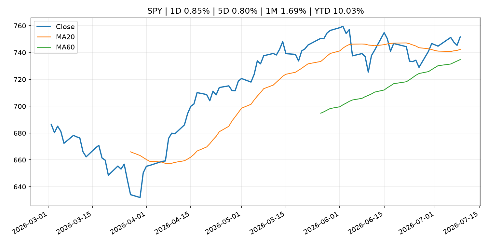
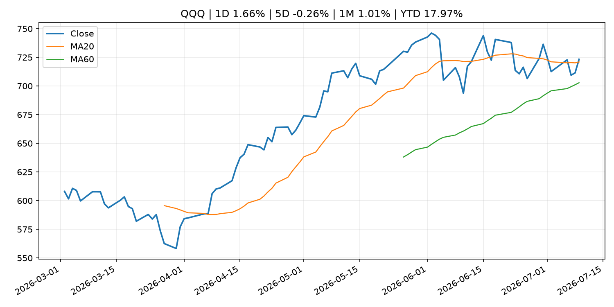
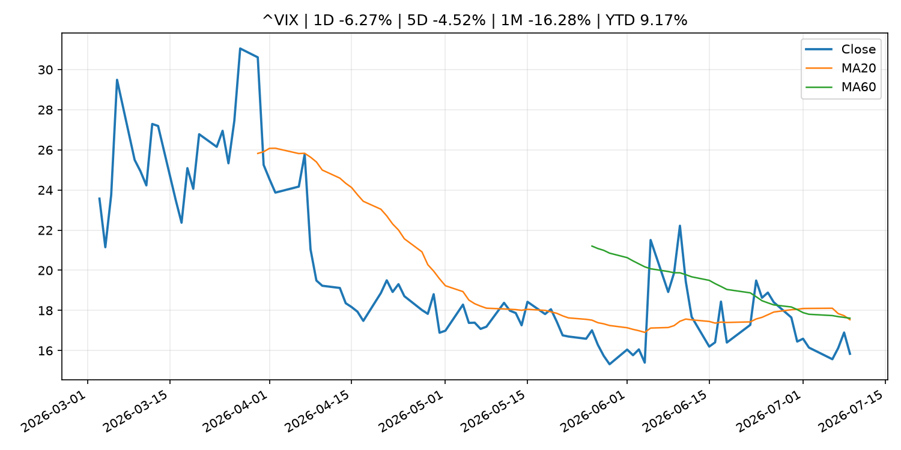
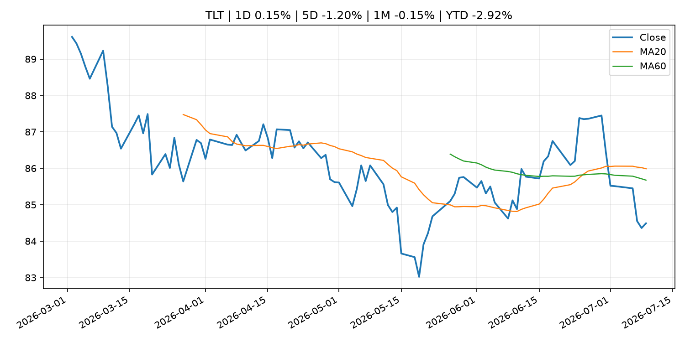
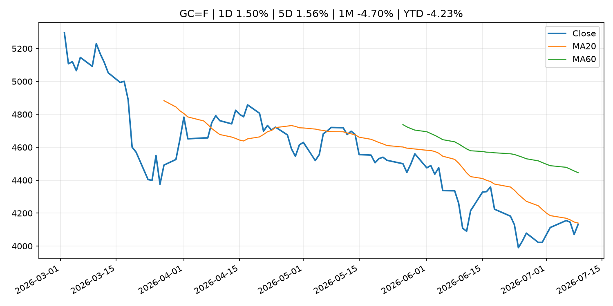
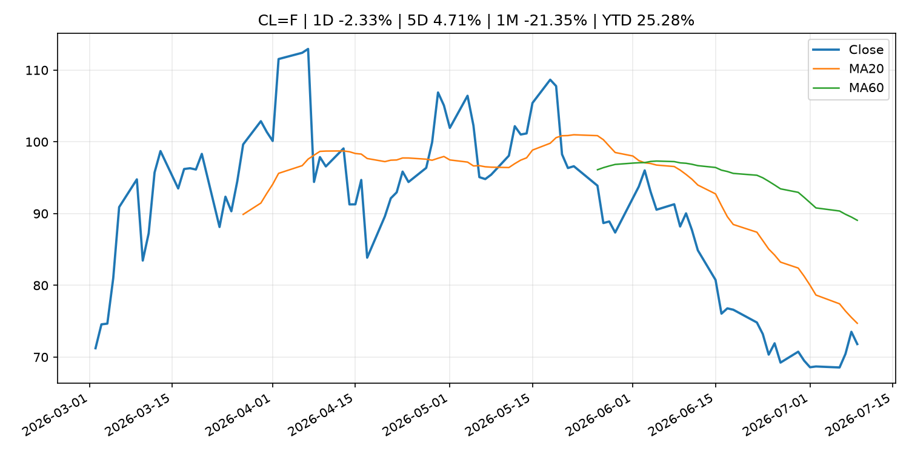
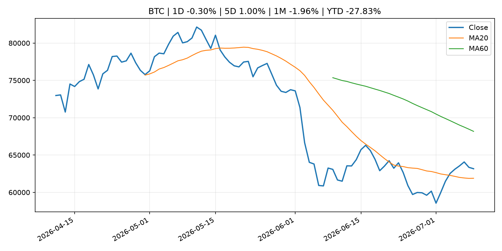
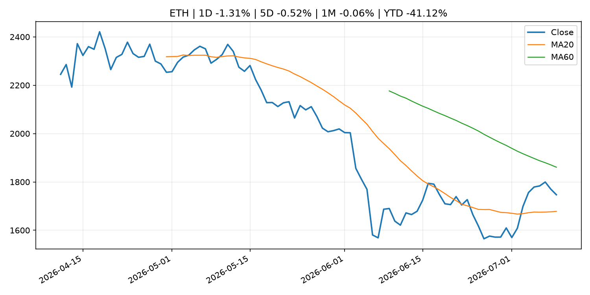
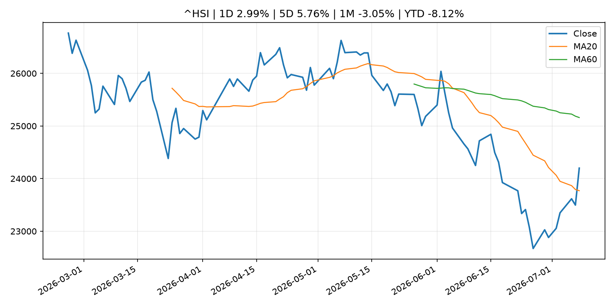

# Global Macro Morning Briefing - 2026-07-10

> Not financial advice / 非投资建议。

## 0. 今日总览
- 市场状态：risk_on。股指上涨、波动率或美元回落，市场更接近风险偏好改善。
- 今日三大主线：
  1. regulation: With SEC fight over, Coinbase's top legal exec Grewal moves on, and others reassigned
  2. crypto_market_structure: Sony secures conditional approval to set up U.S. stablecoin trust bank
  3. regulation: SEC to Host Virtual Roundtable on Modernizing IPOs and Expanding Access to Public Markets
- 一句话结论：今日晨报重点关注：监管变化会改变行业盈利预期和资产风险溢价。；加密市场结构和监管变化会影响 BTC、ETH 及相关股票的风险溢价。。跨资产方面，SPY 1D 0.85%；QQQ 1D 1.66%；^VIX 1D -6.27%；TLT 1D 0.15%；GC=F 1D 1.50%；CL=F 1D -2.33%；BTC 1D -0.30%；ETH 1D -1.31%；股指上涨、波动率或美元回落，市场更接近风险偏好改善。政策、通胀、利率、美元、美债、能源和加密监管仍是主要观察线索。所有结论仅基于公开数据与短摘要整理，不构成投资建议。

## 1. 隔夜跨资产市场
- 美股：SPY 1D 0.85%，QQQ 1D 1.66%，整体趋势需结合 VIX 和利率确认。
- 美债/美元：TLT 1D 0.15%，美元指数 1D -0.11%，是判断折现率压力的核心线索。
- 黄金/原油：黄金 1D 1.50%，原油 1D -2.33%，用于观察避险、通胀和地缘风险。
- 加密：BTC 1D -0.30%，ETH 1D -1.31%，关注是否独立于纳指走出加密自身行情。
- 港股/A股：恒生 1D 2.99%，沪深300/上证 1D n/a，重点看中国政策预期与人民币线索。
- 风险观察：确认风险偏好是否扩散到小盘股、信用利差和周期品。

### US_EQUITY

| symbol | latest close | 1D | 5D | 1M | YTD | trend |
|---|---:|---:|---:|---:|---:|---|
| SPY | 751.71 | 0.85% | 0.80% | 1.69% | 10.03% | uptrend |
| QQQ | 723.28 | 1.66% | -0.26% | 1.01% | 17.97% | uptrend |
| DIA | 524.19 | 0.27% | 0.34% | 3.00% | 8.39% | strong_uptrend |
| IWM | 297.24 | 1.28% | -0.69% | 4.62% | 19.48% | strong_uptrend |
| VTI | 371.45 | 0.87% | 0.59% | 1.92% | 10.45% | uptrend |

### US_MACRO_MARKET

| symbol | latest close | 1D | 5D | 1M | YTD | trend |
|---|---:|---:|---:|---:|---:|---|
| ^VIX | 15.84 | -6.27% | -4.52% | -16.28% | 9.17% | strong_downtrend |
| DX-Y.NYB | 100.94 | -0.11% | -0.45% | 0.89% | 2.56% | uptrend |
| TLT | 84.49 | 0.15% | -1.20% | -0.15% | -2.92% | range_bound |
| IEF | 93.71 | 0.21% | -0.34% | 0.20% | -2.47% | downtrend |

### COMMODITIES

| symbol | latest close | 1D | 5D | 1M | YTD | trend |
|---|---:|---:|---:|---:|---:|---|
| GC=F | 4,131.90 | 1.50% | 1.56% | -4.70% | -4.23% | strong_downtrend |
| SI=F | 60.37 | 3.79% | 0.47% | -11.77% | -14.44% | strong_downtrend |
| CL=F | 71.81 | -2.33% | 4.71% | -21.35% | 25.28% | strong_downtrend |
| BZ=F | 75.98 | -2.61% | 6.16% | -19.38% | 25.07% | strong_downtrend |
| NG=F | 3.01 | -6.32% | -6.55% | -4.39% | -16.83% | range_bound |
| HG=F | 6.25 | 3.16% | 2.00% | -1.32% | 10.74% | uptrend |

### HK_MARKET

| symbol | latest close | 1D | 5D | 1M | YTD | trend |
|---|---:|---:|---:|---:|---:|---|
| ^HSI | 24,199.46 | 2.99% | 5.76% | -3.05% | -8.12% | range_bound |
| 0700.HK | 469.60 | -1.92% | 9.16% | 5.20% | -24.62% | range_bound |
| 9988.HK | 108.00 | 0.47% | 14.29% | -9.09% | -27.52% | range_bound |
| 3690.HK | 78.50 | -2.97% | 10.80% | 2.95% | -24.95% | range_bound |
| 1810.HK | 25.00 | -1.19% | 10.62% | -8.69% | -37.93% | range_bound |
| 1211.HK | 82.65 | -3.73% | 5.56% | -6.13% | -16.30% | range_bound |

### CRYPTO

| symbol | latest close | 1D | 5D | 1M | YTD | trend |
|---|---:|---:|---:|---:|---:|---|
| BTC | 63,162.96 | -0.30% | 1.00% | -1.96% | -27.83% | range_bound |
| ETH | 1,746.98 | -1.31% | -0.52% | -0.06% | -41.12% | range_bound |
| SOLANA | 78.08 | -3.25% | -5.10% | 8.48% | -37.29% | range_bound |
| BINANCECOIN | 569.69 | -1.29% | -0.65% | -5.21% | -34.00% | downtrend |
| RIPPLE | 1.09 | -1.61% | -3.44% | -7.67% | -40.48% | downtrend |

## 2. 今日最重要的 10 条新闻
### 1. With SEC fight over, Coinbase's top legal exec Grewal moves on, and others reassigned
- 来源：CoinDesk
- 时间：2026-07-09T20:31:39+00:00
- 地区：global
- 事件类型：regulation
- 重要性层级：Tier 2
- 一句话摘要：With SEC fight over, Coinbase's top legal exec Grewal moves on, and others reassigned
- 为什么重要：监管变化会改变行业盈利预期和资产风险溢价。
- 可能影响：主要影响 BTC，方向为 mixed，强度 high；加密监管或 ETF 进展会改变 BTC 的资金流和风险溢价。
  - 资产：BTC
    方向：mixed
    强度：high
    原因：加密监管或 ETF 进展会改变 BTC 的资金流和风险溢价。
  - 资产：ETH
    方向：mixed
    强度：high
    原因：监管框架会影响 ETH 产品化和机构参与度。
  - 资产：COIN
    方向：mixed
    强度：medium
    原因：监管清晰度和执法风险会影响交易平台估值。
  - 资产：crypto market
    方向：mixed
    强度：high
    原因：信息影响整个加密市场结构，但方向取决于细节。
- 原文链接：[https://www.coindesk.com/policy/2026/07/09/with-sec-fight-over-coinbase-s-top-legal-exec-grewal-moves-on-and-others-reassigned](https://www.coindesk.com/policy/2026/07/09/with-sec-fight-over-coinbase-s-top-legal-exec-grewal-moves-on-and-others-reassigned)

### 2. Sony secures conditional approval to set up U.S. stablecoin trust bank
- 来源：CoinDesk
- 时间：2026-07-09T09:49:26+00:00
- 地区：global
- 事件类型：crypto_market_structure
- 重要性层级：Tier 2
- 一句话摘要：Sony secures conditional approval to set up U.S. stablecoin trust bank
- 为什么重要：加密市场结构和监管变化会影响 BTC、ETH 及相关股票的风险溢价。
- 可能影响：主要影响 BTC，方向为 mixed，强度 high；加密监管或 ETF 进展会改变 BTC 的资金流和风险溢价。
  - 资产：BTC
    方向：mixed
    强度：high
    原因：加密监管或 ETF 进展会改变 BTC 的资金流和风险溢价。
  - 资产：ETH
    方向：mixed
    强度：high
    原因：监管框架会影响 ETH 产品化和机构参与度。
  - 资产：COIN
    方向：mixed
    强度：medium
    原因：监管清晰度和执法风险会影响交易平台估值。
  - 资产：crypto market
    方向：mixed
    强度：high
    原因：信息影响整个加密市场结构，但方向取决于细节。
- 原文链接：[https://www.coindesk.com/business/2026/07/09/sony-secures-conditional-approval-to-set-up-u-s-stablecoin-trust-bank](https://www.coindesk.com/business/2026/07/09/sony-secures-conditional-approval-to-set-up-u-s-stablecoin-trust-bank)

### 3. SEC to Host Virtual Roundtable on Modernizing IPOs and Expanding Access to Public Markets
- 来源：SEC Press Releases
- 时间：2026-07-08T13:54:26-04:00
- 地区：US
- 事件类型：regulation
- 重要性层级：Tier 2
- 一句话摘要：The Securities and Exchange Commission’s Office of the Advocate for Small Business Capital Formation and the Division of Corporation Finance will co-host a livestreamed discussion on Monday, July 13, 2026, at 2 p.m. to re-examine…
- 为什么重要：监管变化会改变行业盈利预期和资产风险溢价。
- 可能影响：主要影响 BTC，方向为 mixed，强度 high；加密监管或 ETF 进展会改变 BTC 的资金流和风险溢价。
  - 资产：BTC
    方向：mixed
    强度：high
    原因：加密监管或 ETF 进展会改变 BTC 的资金流和风险溢价。
  - 资产：ETH
    方向：mixed
    强度：high
    原因：监管框架会影响 ETH 产品化和机构参与度。
  - 资产：COIN
    方向：mixed
    强度：medium
    原因：监管清晰度和执法风险会影响交易平台估值。
  - 资产：crypto market
    方向：mixed
    强度：high
    原因：信息影响整个加密市场结构，但方向取决于细节。
- 原文链接：[https://www.sec.gov/newsroom/press-releases/2026-65-sec-host-virtual-roundtable-modernizing-ipos-expanding-access-public-markets](https://www.sec.gov/newsroom/press-releases/2026-65-sec-host-virtual-roundtable-modernizing-ipos-expanding-access-public-markets)

### 4. SEC Small Business Advisory Committee to Explore Modernizing Market Access
- 来源：SEC Press Releases
- 时间：2026-07-08T09:01:01-04:00
- 地区：US
- 事件类型：regulation
- 重要性层级：Tier 2
- 一句话摘要：The Securities and Exchange Commission’s Small Business Capital Formation Advisory Committee announced that it will hold a meeting on Tuesday, July 21, 2026 at 10 a.m. to explore ways to modernize public market access and encourage IPOs…
- 为什么重要：监管变化会改变行业盈利预期和资产风险溢价。
- 可能影响：主要影响 BTC，方向为 mixed，强度 high；加密监管或 ETF 进展会改变 BTC 的资金流和风险溢价。
  - 资产：BTC
    方向：mixed
    强度：high
    原因：加密监管或 ETF 进展会改变 BTC 的资金流和风险溢价。
  - 资产：ETH
    方向：mixed
    强度：high
    原因：监管框架会影响 ETH 产品化和机构参与度。
  - 资产：COIN
    方向：mixed
    强度：medium
    原因：监管清晰度和执法风险会影响交易平台估值。
  - 资产：crypto market
    方向：mixed
    强度：high
    原因：信息影响整个加密市场结构，但方向取决于细节。
- 原文链接：[https://www.sec.gov/newsroom/press-releases/2026-64-sec-small-business-advisory-committee-explore-modernizing-market-access](https://www.sec.gov/newsroom/press-releases/2026-64-sec-small-business-advisory-committee-explore-modernizing-market-access)

### 5. Federal Reserve Board issues enforcement action with TS Banking Group, Inc. and TS Contrarian Bancshares, Inc.
- 来源：Federal Reserve Press Releases
- 时间：2026-07-09T15:00:00+00:00
- 地区：US
- 事件类型：regulation
- 重要性层级：Tier 2
- 一句话摘要：Federal Reserve Board issues enforcement action with TS Banking Group, Inc. and TS Contrarian Bancshares, Inc.
- 为什么重要：监管变化会改变行业盈利预期和资产风险溢价。
- 可能影响：可能影响利率、汇率、风险资产或大宗商品预期，但当前公开信息不足以判断明确方向。
  - 资产：暂无明确资产映射
  - 方向：unknown
  - 强度：low
  - 原因：公开信息不足以判断方向。
- 原文链接：[https://www.federalreserve.gov/newsevents/pressreleases/enforcement20260709a.htm](https://www.federalreserve.gov/newsevents/pressreleases/enforcement20260709a.htm)

### 6. Can Walmart help the Fed harness real-time U.S. economic data? We’re about to find out.
- 来源：MarketWatch Top Stories
- 时间：2026-07-09T21:52:00+00:00
- 地区：US
- 事件类型：other
- 重要性层级：Tier 3
- 一句话摘要：The Federal Reserve named a former Walmart CEO to a task force to develop contemporaneous data on spending, inflation and growth.
- 为什么重要：这条信息暂未匹配到重大宏观、政策或市场事件，更适合作为背景跟踪。
- 可能影响：主要影响 DXY，方向为 positive，强度 high；通胀压力可能推高政策利率预期并支撑美元。
  - 资产：DXY
    方向：positive
    强度：high
    原因：通胀压力可能推高政策利率预期并支撑美元。
  - 资产：TLT
    方向：negative
    强度：high
    原因：通胀上行通常推升收益率、压低长债价格。
  - 资产：QQQ
    方向：negative
    强度：high
    原因：更高利率对成长股估值折现率不利。
  - 资产：SPY
    方向：mixed
    强度：medium
    原因：名义增长可能支撑收入，但更高利率压制估值。
  - 资产：GC=F
    方向：mixed
    强度：medium
    原因：通胀对黄金是支撑，但实际利率上行会形成压力。
  - 资产：BTC
    方向：mixed
    强度：medium
    原因：抗通胀叙事和流动性收紧可能相互抵消。
- 原文链接：[https://www.marketwatch.com/story/can-walmart-help-the-fed-harness-real-time-u-s-economic-data-were-about-to-find-out-e625925a?mod=mw_rss_topstories](https://www.marketwatch.com/story/can-walmart-help-the-fed-harness-real-time-u-s-economic-data-were-about-to-find-out-e625925a?mod=mw_rss_topstories)

### 7. Live updates: Bitcoin rises to $63,000, oil and bond yields drop as markets look past latest Iran dustup
- 来源：CoinDesk
- 时间：2026-07-09T06:51:10+00:00
- 地区：global
- 事件类型：other
- 重要性层级：Tier 3
- 一句话摘要：Live updates: Bitcoin rises to $63,000, oil and bond yields drop as markets look past latest Iran dustup
- 为什么重要：这条信息暂未匹配到重大宏观、政策或市场事件，更适合作为背景跟踪。
- 可能影响：主要影响 CL=F，方向为 positive，强度 high；供给扰动或 OPEC 减产通常推升 WTI 原油。
  - 资产：CL=F
    方向：positive
    强度：high
    原因：供给扰动或 OPEC 减产通常推升 WTI 原油。
  - 资产：BZ=F
    方向：positive
    强度：high
    原因：全球供给风险通常直接影响 Brent 原油。
  - 资产：SPY
    方向：mixed
    强度：medium
    原因：能源股可能受益，但通胀和成本压力不利于宽基风险资产。
- 原文链接：[https://www.coindesk.com/markets/2026/07/09/live-markets-bitcoin-etfs-slip-back-to-outflows-while-ether-funds-extend-their-streak](https://www.coindesk.com/markets/2026/07/09/live-markets-bitcoin-etfs-slip-back-to-outflows-while-ether-funds-extend-their-streak)

## 3. 政策与央行观察
### 1. With SEC fight over, Coinbase's top legal exec Grewal moves on, and others reassigned
- 来源：CoinDesk
- 时间：2026-07-09T20:31:39+00:00
- 地区：global
- 事件类型：regulation
- 重要性层级：Tier 2
- 一句话摘要：With SEC fight over, Coinbase's top legal exec Grewal moves on, and others reassigned
- 为什么重要：监管变化会改变行业盈利预期和资产风险溢价。
- 可能影响：主要影响 BTC，方向为 mixed，强度 high；加密监管或 ETF 进展会改变 BTC 的资金流和风险溢价。
  - 资产：BTC
    方向：mixed
    强度：high
    原因：加密监管或 ETF 进展会改变 BTC 的资金流和风险溢价。
  - 资产：ETH
    方向：mixed
    强度：high
    原因：监管框架会影响 ETH 产品化和机构参与度。
  - 资产：COIN
    方向：mixed
    强度：medium
    原因：监管清晰度和执法风险会影响交易平台估值。
  - 资产：crypto market
    方向：mixed
    强度：high
    原因：信息影响整个加密市场结构，但方向取决于细节。
- 原文链接：[https://www.coindesk.com/policy/2026/07/09/with-sec-fight-over-coinbase-s-top-legal-exec-grewal-moves-on-and-others-reassigned](https://www.coindesk.com/policy/2026/07/09/with-sec-fight-over-coinbase-s-top-legal-exec-grewal-moves-on-and-others-reassigned)

### 2. Sony secures conditional approval to set up U.S. stablecoin trust bank
- 来源：CoinDesk
- 时间：2026-07-09T09:49:26+00:00
- 地区：global
- 事件类型：crypto_market_structure
- 重要性层级：Tier 2
- 一句话摘要：Sony secures conditional approval to set up U.S. stablecoin trust bank
- 为什么重要：加密市场结构和监管变化会影响 BTC、ETH 及相关股票的风险溢价。
- 可能影响：主要影响 BTC，方向为 mixed，强度 high；加密监管或 ETF 进展会改变 BTC 的资金流和风险溢价。
  - 资产：BTC
    方向：mixed
    强度：high
    原因：加密监管或 ETF 进展会改变 BTC 的资金流和风险溢价。
  - 资产：ETH
    方向：mixed
    强度：high
    原因：监管框架会影响 ETH 产品化和机构参与度。
  - 资产：COIN
    方向：mixed
    强度：medium
    原因：监管清晰度和执法风险会影响交易平台估值。
  - 资产：crypto market
    方向：mixed
    强度：high
    原因：信息影响整个加密市场结构，但方向取决于细节。
- 原文链接：[https://www.coindesk.com/business/2026/07/09/sony-secures-conditional-approval-to-set-up-u-s-stablecoin-trust-bank](https://www.coindesk.com/business/2026/07/09/sony-secures-conditional-approval-to-set-up-u-s-stablecoin-trust-bank)

### 3. SEC to Host Virtual Roundtable on Modernizing IPOs and Expanding Access to Public Markets
- 来源：SEC Press Releases
- 时间：2026-07-08T13:54:26-04:00
- 地区：US
- 事件类型：regulation
- 重要性层级：Tier 2
- 一句话摘要：The Securities and Exchange Commission’s Office of the Advocate for Small Business Capital Formation and the Division of Corporation Finance will co-host a livestreamed discussion on Monday, July 13, 2026, at 2 p.m. to re-examine…
- 为什么重要：监管变化会改变行业盈利预期和资产风险溢价。
- 可能影响：主要影响 BTC，方向为 mixed，强度 high；加密监管或 ETF 进展会改变 BTC 的资金流和风险溢价。
  - 资产：BTC
    方向：mixed
    强度：high
    原因：加密监管或 ETF 进展会改变 BTC 的资金流和风险溢价。
  - 资产：ETH
    方向：mixed
    强度：high
    原因：监管框架会影响 ETH 产品化和机构参与度。
  - 资产：COIN
    方向：mixed
    强度：medium
    原因：监管清晰度和执法风险会影响交易平台估值。
  - 资产：crypto market
    方向：mixed
    强度：high
    原因：信息影响整个加密市场结构，但方向取决于细节。
- 原文链接：[https://www.sec.gov/newsroom/press-releases/2026-65-sec-host-virtual-roundtable-modernizing-ipos-expanding-access-public-markets](https://www.sec.gov/newsroom/press-releases/2026-65-sec-host-virtual-roundtable-modernizing-ipos-expanding-access-public-markets)

### 4. SEC Small Business Advisory Committee to Explore Modernizing Market Access
- 来源：SEC Press Releases
- 时间：2026-07-08T09:01:01-04:00
- 地区：US
- 事件类型：regulation
- 重要性层级：Tier 2
- 一句话摘要：The Securities and Exchange Commission’s Small Business Capital Formation Advisory Committee announced that it will hold a meeting on Tuesday, July 21, 2026 at 10 a.m. to explore ways to modernize public market access and encourage IPOs…
- 为什么重要：监管变化会改变行业盈利预期和资产风险溢价。
- 可能影响：主要影响 BTC，方向为 mixed，强度 high；加密监管或 ETF 进展会改变 BTC 的资金流和风险溢价。
  - 资产：BTC
    方向：mixed
    强度：high
    原因：加密监管或 ETF 进展会改变 BTC 的资金流和风险溢价。
  - 资产：ETH
    方向：mixed
    强度：high
    原因：监管框架会影响 ETH 产品化和机构参与度。
  - 资产：COIN
    方向：mixed
    强度：medium
    原因：监管清晰度和执法风险会影响交易平台估值。
  - 资产：crypto market
    方向：mixed
    强度：high
    原因：信息影响整个加密市场结构，但方向取决于细节。
- 原文链接：[https://www.sec.gov/newsroom/press-releases/2026-64-sec-small-business-advisory-committee-explore-modernizing-market-access](https://www.sec.gov/newsroom/press-releases/2026-64-sec-small-business-advisory-committee-explore-modernizing-market-access)

### 5. Federal Reserve Board issues enforcement action with TS Banking Group, Inc. and TS Contrarian Bancshares, Inc.
- 来源：Federal Reserve Press Releases
- 时间：2026-07-09T15:00:00+00:00
- 地区：US
- 事件类型：regulation
- 重要性层级：Tier 2
- 一句话摘要：Federal Reserve Board issues enforcement action with TS Banking Group, Inc. and TS Contrarian Bancshares, Inc.
- 为什么重要：监管变化会改变行业盈利预期和资产风险溢价。
- 可能影响：可能影响利率、汇率、风险资产或大宗商品预期，但当前公开信息不足以判断明确方向。
  - 资产：暂无明确资产映射
  - 方向：unknown
  - 强度：low
  - 原因：公开信息不足以判断方向。
- 原文链接：[https://www.federalreserve.gov/newsevents/pressreleases/enforcement20260709a.htm](https://www.federalreserve.gov/newsevents/pressreleases/enforcement20260709a.htm)

## 4. 市场异动与图表
- SPY 上涨 0.85%
- QQQ 上涨 1.66%
- VIX 下跌 -6.27%
- Gold 上涨 1.50%
- Oil 下跌 -2.33%

### SPY

### QQQ

### ^VIX

### TLT

### GC=F

### CL=F

### BTC

### ETH

### ^HSI

## 5. 华尔街与机构公开观点
- 暂无可靠公开观点。

## 6. 今日重点关注
- 经济数据：经济数据：暂无可靠公开日历数据；如配置经济日历源后可自动填充。
- 央行讲话：央行讲话：暂无可靠公开日历数据；重点跟踪 Fed、ECB、BoJ、PBOC 官网 RSS。
- 财报：财报：暂无可靠数据。
- 政策事件：政策事件：暂无可靠数据。
- 风险提醒：风险提醒：关注数据源失败项、突发地缘风险、利率和美元的二阶反应。

## 7. 英文金融表达与宏观概念
- **inflation expectations**：通胀预期，指家庭、企业或市场对未来通胀的预估。 例句：Inflation expectations can shape wage bargaining and bond yields.
- **real yield**：实际收益率，名义利率扣除通胀预期后的收益率。 例句：Gold often reacts more to real yields than nominal yields.
- **supply disruption**：供给扰动，通常指能源或商品供应受冲突、减产或天气影响。 例句：Supply disruption can lift oil prices and inflation expectations.
- **market structure**：市场结构，指交易、托管、清算、ETF、监管等制度安排。 例句：Crypto market structure rules can affect institutional participation.
- **terminal rate**：终端利率，市场预期本轮加息周期的最高政策利率。 例句：A higher terminal rate can pressure growth stocks.
- **soft landing**：软着陆，指通胀回落而经济避免明显衰退。 例句：Markets often rally when data support a soft landing.

## 8. 背景材料
- [New Hampshire snuffs out trailblazing state-government bitcoin bond effort](https://www.coindesk.com/policy/2026/07/09/new-hampshire-snuffs-out-trailblazing-bitcoin-municipal-bond-effort)（CoinDesk，other）：New Hampshire snuffs out trailblazing state-government bitcoin bond effort
- [‘I’ve no idea how they got her number’: My student-loan servicer called a friend after I missed a payment. Is that legal?](https://www.marketwatch.com/story/ive-no-idea-how-they-got-her-number-my-student-loan-servicer-called-a-friend-after-i-missed-a-payment-is-that-legal-28ef698e?mod=mw_rss_topstories)（MarketWatch Top Stories，other）：“She said it’s the second message they have left.”
- [Can Walmart help the Fed harness real-time U.S. economic data? We’re about to find out.](https://www.marketwatch.com/story/can-walmart-help-the-fed-harness-real-time-u-s-economic-data-were-about-to-find-out-e625925a?mod=mw_rss_topstories)（MarketWatch Top Stories，other）：The Federal Reserve named a former Walmart CEO to a task force to develop contemporaneous data on spending, inflation and growth.
- [A slower AI payoff risks tipping the economy into recession, Apollo says](https://www.marketwatch.com/story/a-slower-ai-payoff-risks-tipping-the-economy-into-recession-apollo-says-5d495f6c?mod=mw_rss_topstories)（MarketWatch Top Stories，other）：Growing threats from China and falling token prices may put AI financials at risk.
- [Kevin Warsh names members of his Federal Reserve task forces, including Marc Andreessen, Doug McMillon](https://www.cnbc.com/2026/07/09/kevin-warsh-names-members-of-his-federal-reserve-task-forces-including-marc-andreessen-doug-mcmillon.html)（CNBC Economy，other）：Federal Reserve Chairman Kevin Warsh on Thursday released names of the experts who will comprise five task forces to examine the institution's operations.
- [Federal Reserve announces the leadership and objectives of its task forces to advance the conduct of monetary policy](https://www.federalreserve.gov/newsevents/pressreleases/monetary20260709a.htm)（Federal Reserve Press Releases，other）：Federal Reserve announces the leadership and objectives of its task forces to advance the conduct of monetary policy
- [Prediction markets spark insider trading concerns. Here's how Goldman and other companies are responding](https://www.cnbc.com/2026/07/09/prediction-markets-spark-insider-trading-fears-how-firms-are-responding.html)（CNBC Economy，other）：CNBC reached out to 50 companies about what are their trading policies for employees on prediction markets. A handful had an answer.
- [Billions flowing out of bitcoin ETFs and private credit funds suggest rising market risks](https://www.coindesk.com/markets/2026/07/09/billions-flowing-out-of-bitcoin-etfs-and-private-credit-funds-suggest-rising-market-risks)（CoinDesk，other）：Billions flowing out of bitcoin ETFs and private credit funds suggest rising market risks
- [AI contracts, not bitcoin, now drive miner valuations, and Cipher and TeraWulf look cheap, says analyst](https://www.coindesk.com/markets/2026/07/09/cipher-terawulf-among-ai-infrastructure-stocks-trading-below-contract-value-compass-point-argues)（CoinDesk，other）：AI contracts, not bitcoin, now drive miner valuations, and Cipher and TeraWulf look cheap, says analyst
- [Goldman Sachs wins $70 billion in asset management deals with Verizon, Lockheed Martin](https://www.cnbc.com/2026/07/09/goldman-sachs-asset-management-deals-verizon-lockheed-martin.html)（CNBC Economy，other）：Competition in the multitrillion-dollar market for retirement assets is fierce among managers such as Goldman Sachs, BlackRock, Russell Investments and Mercer.
- [Meeting of 10-11 June 2026](https://www.ecb.europa.eu//press/accounts/2026/html/ecb.mg260709~0e7f8241c9.en.html)（ECB Press Releases，other）：Meeting of 10-11 June 2026
- [Pricing houses in bitcoin exposes dollar's loss of value](https://www.coindesk.com/daybook-us/2026/07/09/pricing-houses-in-bitcoin-exposes-dollar-s-loss-of-value)（CoinDesk，other）：Pricing houses in bitcoin exposes dollar's loss of value
- [Latin America’s biggest stock exchange now offers options on bitcoin, ether and solana futures](https://www.coindesk.com/business/2026/07/09/brazil-s-b3-exchange-introduces-options-on-bitcoin-ether-and-solana-futures)（CoinDesk，other）：Latin America’s biggest stock exchange now offers options on bitcoin, ether and solana futures
- [Bitcoin's dwindling exchange reserves don't pack the same bullish punch anymore](https://www.coindesk.com/markets/2026/07/09/bitcoin-s-dwindling-exchange-reserves-don-t-pack-the-same-bullish-punch-anymore)（CoinDesk，other）：Bitcoin's dwindling exchange reserves don't pack the same bullish punch anymore
- [Live updates: Bitcoin rises to $63,000, oil and bond yields drop as markets look past latest Iran dustup](https://www.coindesk.com/markets/2026/07/09/live-markets-bitcoin-etfs-slip-back-to-outflows-while-ether-funds-extend-their-streak)（CoinDesk，other）：Live updates: Bitcoin rises to $63,000, oil and bond yields drop as markets look past latest Iran dustup
- [Bank of Japan may speed up rate hikes, pushing borrowing costs above 2%, ex-BOJ official warns](https://www.coindesk.com/markets/2026/07/09/bank-of-japan-may-speed-up-rate-hikes-pushing-borrowing-costs-above-2-ex-boj-official-warns)（CoinDesk，other）：Bank of Japan may speed up rate hikes, pushing borrowing costs above 2%, ex-BOJ official warns
- [Regional Economic Report (Summary) (July 2026)](http://www.boj.or.jp/en/research/brp/rer/rer260709.htm)（Bank of Japan Announcements，other）：Regional Economic Report (Summary) (July 2026)
- [Money Stock (June)](http://www.boj.or.jp/en/statistics/money/ms/ms2606.pdf)（Bank of Japan Announcements，other）：Money Stock (June)
- [Fed officials were split on direction of interest rates at last meeting, minutes show](https://www.cnbc.com/2026/07/08/fed-minutes-june-2026-.html)（CNBC Economy，other）：The Federal Reserve on Wednesday released minutes from its June 16-17 meeting.
- [Minutes of the Federal Open Market Committee, June 16-17, 2026](https://www.federalreserve.gov/newsevents/pressreleases/monetary20260708a.htm)（Federal Reserve Press Releases，other）：Minutes of the Federal Open Market Committee, June 16-17, 2026

## 9. 数据源、失败项与免责声明
- 采集时间：2026-07-09T23:10:21
- 数据源：公开 RSS、Yahoo Finance、CoinGecko、AKShare、FRED、SEC data.sec.gov，以及用户自有 inputs/reports 文件。
- 合规说明：不绕过 WSJ、Bloomberg、FT、Reuters 等付费墙；对付费媒体只使用公开 RSS 标题、摘要、链接和发布时间。
- 免责声明：Not financial advice / 非投资建议。本项目仅供个人学习、研究和信息整理，不构成投资建议、交易建议或任何收益承诺。
- 失败或跳过的数据源：
  - crypto data failed coin=dogecoin
  - China market data failed symbol=上证指数: empty dataframe
  - China market data failed symbol=深证成指: empty dataframe
  - China market data failed symbol=创业板指: empty dataframe
  - China market data failed symbol=沪深300: empty dataframe
  - China market data failed symbol=中证500: empty dataframe
  - China market data failed symbol=科创50: empty dataframe
  - FRED_API_KEY not set; skipping FRED macro series
  - SEC failed cik=0000320193
  - SEC failed cik=0000789019
  - SEC failed cik=0001045810
  - SEC failed cik=0001318605
  - SEC failed cik=0001577552
