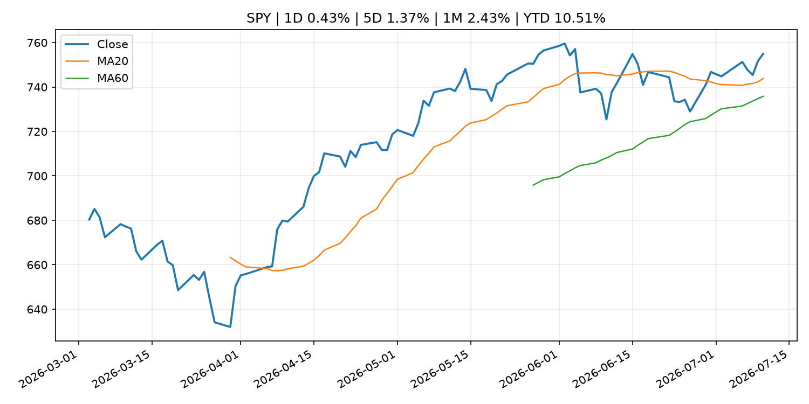
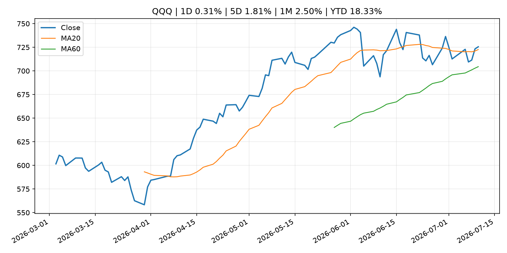
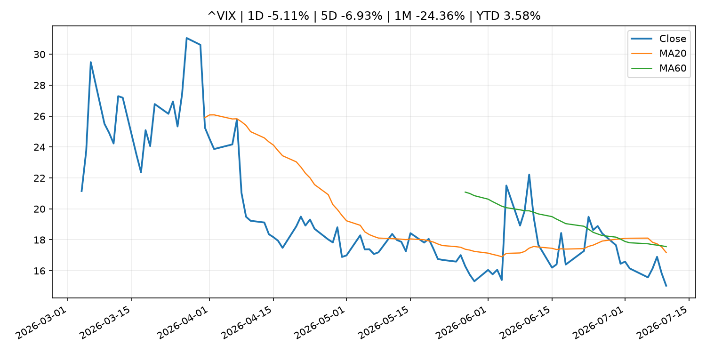
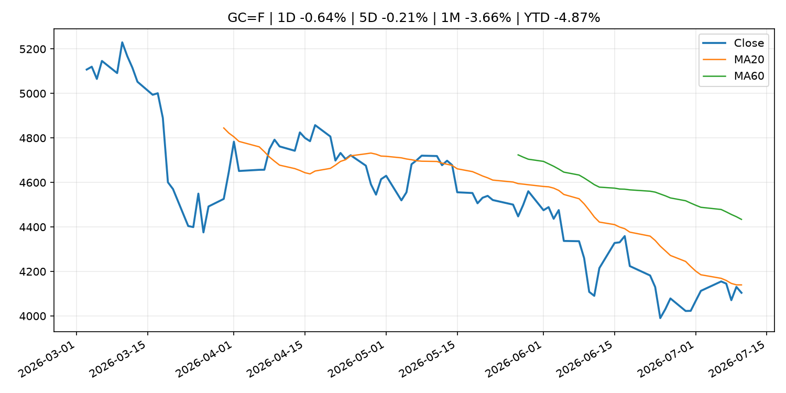
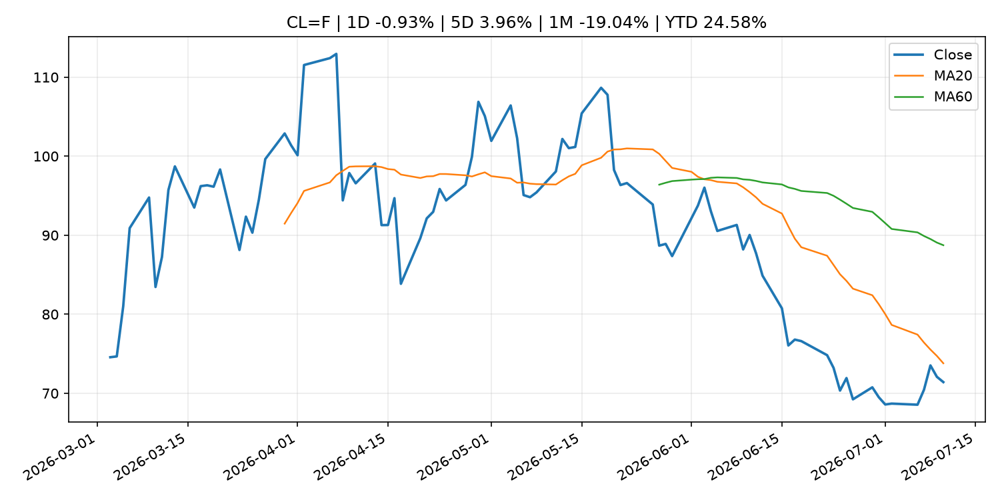
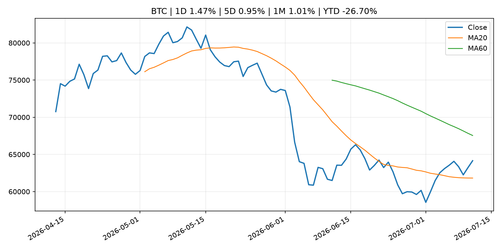
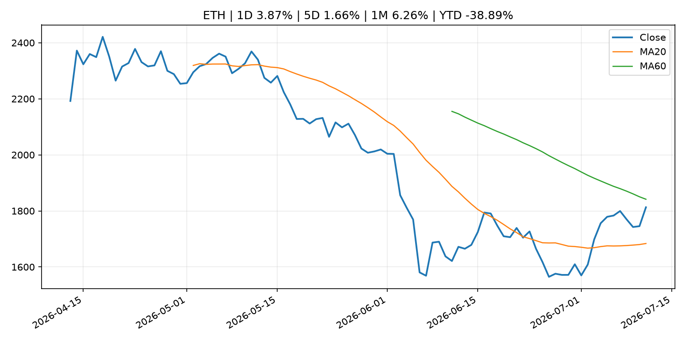
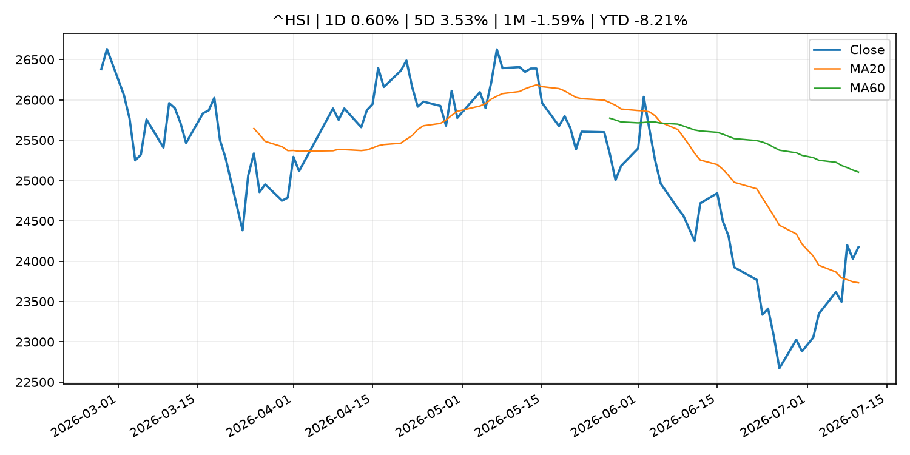

# Global Macro Morning Briefing - 2026-07-12

> Not financial advice / 非投资建议。

## 0. 今日总览
- 市场状态：risk_on。股指上涨、波动率或美元回落，市场更接近风险偏好改善。
- 今日三大主线：
  1. regulation: SEC Office of Municipal Securities Updates FAQs for Registration of Municipal Advisors
  2. crypto_market_structure: Hyundai becomes first major South Korean company to introduce internal stablecoin transfers
- 一句话结论：今日晨报重点关注：监管变化会改变行业盈利预期和资产风险溢价。；加密市场结构和监管变化会影响 BTC、ETH 及相关股票的风险溢价。。跨资产方面，SPY 1D 0.43%；QQQ 1D 0.31%；^VIX 1D -5.11%；TLT 1D -0.02%；GC=F 1D -0.64%；CL=F 1D -0.93%；BTC 1D 1.47%；ETH 1D 3.87%；股指上涨、波动率或美元回落，市场更接近风险偏好改善。政策、通胀、利率、美元、美债、能源和加密监管仍是主要观察线索。所有结论仅基于公开数据与短摘要整理，不构成投资建议。

## 1. 隔夜跨资产市场
- 美股：SPY 1D 0.43%，QQQ 1D 0.31%，整体趋势需结合 VIX 和利率确认。
- 美债/美元：TLT 1D -0.02%，美元指数 1D 0.03%，是判断折现率压力的核心线索。
- 黄金/原油：黄金 1D -0.64%，原油 1D -0.93%，用于观察避险、通胀和地缘风险。
- 加密：BTC 1D 1.47%，ETH 1D 3.87%，关注是否独立于纳指走出加密自身行情。
- 港股/A股：恒生 1D 0.60%，沪深300/上证 1D n/a，重点看中国政策预期与人民币线索。
- 风险观察：确认风险偏好是否扩散到小盘股、信用利差和周期品。

### US_EQUITY

| symbol | latest close | 1D | 5D | 1M | YTD | trend |
|---|---:|---:|---:|---:|---:|---|
| SPY | 754.95 | 0.43% | 1.37% | 2.43% | 10.51% | uptrend |
| QQQ | 725.51 | 0.31% | 1.81% | 2.50% | 18.33% | uptrend |
| DIA | 525.78 | 0.30% | -0.40% | 3.21% | 8.72% | strong_uptrend |
| IWM | 295.99 | -0.42% | -0.53% | 3.85% | 18.98% | range_bound |
| VTI | 372.69 | 0.33% | 1.07% | 2.48% | 10.82% | uptrend |

### US_MACRO_MARKET

| symbol | latest close | 1D | 5D | 1M | YTD | trend |
|---|---:|---:|---:|---:|---:|---|
| ^VIX | 15.03 | -5.11% | -6.93% | -24.36% | 3.58% | strong_downtrend |
| DX-Y.NYB | 100.97 | 0.03% | 0.11% | 1.06% | 2.59% | uptrend |
| TLT | 84.47 | -0.02% | -1.22% | -0.76% | -2.94% | range_bound |
| IEF | 93.63 | -0.09% | -0.52% | -0.16% | -2.55% | downtrend |

### COMMODITIES

| symbol | latest close | 1D | 5D | 1M | YTD | trend |
|---|---:|---:|---:|---:|---:|---|
| GC=F | 4,104.10 | -0.64% | -0.21% | -3.66% | -4.87% | strong_downtrend |
| SI=F | 59.81 | -0.94% | -1.38% | -8.12% | -15.23% | strong_downtrend |
| CL=F | 71.41 | -0.93% | 3.96% | -19.04% | 24.58% | strong_downtrend |
| BZ=F | 76.01 | -0.38% | 5.86% | -16.88% | 25.12% | strong_downtrend |
| NG=F | 2.94 | -2.39% | -8.01% | -6.37% | -18.74% | range_bound |
| HG=F | 6.23 | 0.30% | 1.95% | -1.09% | 10.52% | uptrend |

### HK_MARKET

| symbol | latest close | 1D | 5D | 1M | YTD | trend |
|---|---:|---:|---:|---:|---:|---|
| ^HSI | 24,175.12 | 0.60% | 3.53% | -1.59% | -8.21% | range_bound |
| 0700.HK | 460.20 | -2.00% | 6.73% | 1.54% | -26.13% | range_bound |
| 9988.HK | 110.20 | 2.04% | 17.11% | -5.89% | -26.04% | range_bound |
| 3690.HK | 78.70 | 0.25% | 9.92% | 1.94% | -24.76% | range_bound |
| 1810.HK | 25.84 | 3.36% | 12.54% | -5.00% | -35.85% | range_bound |
| 1211.HK | 84.90 | 2.72% | 0.95% | -3.96% | -14.03% | range_bound |

### CRYPTO

| symbol | latest close | 1D | 5D | 1M | YTD | trend |
|---|---:|---:|---:|---:|---:|---|
| BTC | 64,152.04 | 1.47% | 0.95% | 1.01% | -26.70% | range_bound |
| ETH | 1,813.01 | 3.87% | 1.66% | 6.26% | -38.89% | range_bound |
| SOLANA | 77.90 | -0.16% | -4.36% | 12.24% | -37.44% | range_bound |
| BINANCECOIN | 579.77 | 1.99% | -1.58% | -0.07% | -32.83% | range_bound |
| RIPPLE | 1.11 | 1.44% | -4.18% | -2.10% | -39.71% | range_bound |

## 2. 今日最重要的 10 条新闻
### 1. SEC Office of Municipal Securities Updates FAQs for Registration of Municipal Advisors
- 来源：SEC Press Releases
- 时间：2026-07-10T12:00:32-04:00
- 地区：US
- 事件类型：regulation
- 重要性层级：Tier 2
- 一句话摘要：The Securities and Exchange Commission’s Office of Municipal Securities today announced it has updated its Registration of Municipal Advisors FAQs webpage to offer more clarity on municipal advisor registration and recordkeeping requirements. The…
- 为什么重要：监管变化会改变行业盈利预期和资产风险溢价。
- 可能影响：主要影响 BTC，方向为 mixed，强度 high；加密监管或 ETF 进展会改变 BTC 的资金流和风险溢价。
  - 资产：BTC
    方向：mixed
    强度：high
    原因：加密监管或 ETF 进展会改变 BTC 的资金流和风险溢价。
  - 资产：ETH
    方向：mixed
    强度：high
    原因：监管框架会影响 ETH 产品化和机构参与度。
  - 资产：COIN
    方向：mixed
    强度：medium
    原因：监管清晰度和执法风险会影响交易平台估值。
  - 资产：crypto market
    方向：mixed
    强度：high
    原因：信息影响整个加密市场结构，但方向取决于细节。
- 原文链接：[https://www.sec.gov/newsroom/press-releases/2026-66-sec-office-municipal-securities-updates-faqs-registration-municipal-advisors](https://www.sec.gov/newsroom/press-releases/2026-66-sec-office-municipal-securities-updates-faqs-registration-municipal-advisors)

### 2. Hyundai becomes first major South Korean company to introduce internal stablecoin transfers
- 来源：CoinDesk
- 时间：2026-07-10T15:26:43+00:00
- 地区：global
- 事件类型：crypto_market_structure
- 重要性层级：Tier 2
- 一句话摘要：Hyundai becomes first major South Korean company to introduce internal stablecoin transfers
- 为什么重要：加密市场结构和监管变化会影响 BTC、ETH 及相关股票的风险溢价。
- 可能影响：主要影响 BTC，方向为 mixed，强度 high；加密监管或 ETF 进展会改变 BTC 的资金流和风险溢价。
  - 资产：BTC
    方向：mixed
    强度：high
    原因：加密监管或 ETF 进展会改变 BTC 的资金流和风险溢价。
  - 资产：ETH
    方向：mixed
    强度：high
    原因：监管框架会影响 ETH 产品化和机构参与度。
  - 资产：COIN
    方向：mixed
    强度：medium
    原因：监管清晰度和执法风险会影响交易平台估值。
  - 资产：crypto market
    方向：mixed
    强度：high
    原因：信息影响整个加密市场结构，但方向取决于细节。
- 原文链接：[https://www.coindesk.com/business/2026/07/10/hyundai-becomes-first-major-south-korean-company-to-introduce-internal-stablecoin-transfers](https://www.coindesk.com/business/2026/07/10/hyundai-becomes-first-major-south-korean-company-to-introduce-internal-stablecoin-transfers)

### 3. These underperforming trades could yield big returns over next six months
- 来源：CNBC Economy
- 时间：2026-07-11T15:00:01+00:00
- 地区：US
- 事件类型：other
- 重要性层级：Tier 3
- 一句话摘要：ETF Action's Mike Akins is encouraging investors to boost exposure to groups that underperformed compared with major artificial intelligence stocks.
- 为什么重要：这条信息暂未匹配到重大宏观、政策或市场事件，更适合作为背景跟踪。
- 可能影响：主要影响 BTC，方向为 mixed，强度 high；加密监管或 ETF 进展会改变 BTC 的资金流和风险溢价。
  - 资产：BTC
    方向：mixed
    强度：high
    原因：加密监管或 ETF 进展会改变 BTC 的资金流和风险溢价。
  - 资产：ETH
    方向：mixed
    强度：high
    原因：监管框架会影响 ETH 产品化和机构参与度。
  - 资产：COIN
    方向：mixed
    强度：medium
    原因：监管清晰度和执法风险会影响交易平台估值。
  - 资产：crypto market
    方向：mixed
    强度：high
    原因：信息影响整个加密市场结构，但方向取决于细节。
- 原文链接：[https://www.cnbc.com/2026/07/11/mag-7-and-software-could-boost-portfolio-in-second-half-etf-action.html](https://www.cnbc.com/2026/07/11/mag-7-and-software-could-boost-portfolio-in-second-half-etf-action.html)

### 4. ‘I get $1,460 in Social Security’: My millionaire ex-husband, 74, refuses to pay alimony. What can I do?
- 来源：MarketWatch Top Stories
- 时间：2026-07-11T19:00:00+00:00
- 地区：US
- 事件类型：other
- 重要性层级：Tier 3
- 一句话摘要：“I have very little money, while my ex’s financial statements show assets in the millions.”
- 为什么重要：这条信息暂未匹配到重大宏观、政策或市场事件，更适合作为背景跟踪。
- 可能影响：更偏背景信息，短期市场影响可能有限。
  - 资产：暂无明确资产映射
  - 方向：unknown
  - 强度：low
  - 原因：公开信息不足以判断方向。
- 原文链接：[https://www.marketwatch.com/story/i-get-1-460-in-social-security-my-millionaire-ex-husband-74-refuses-to-pay-alimony-what-can-i-do-c5e60824?mod=mw_rss_topstories](https://www.marketwatch.com/story/i-get-1-460-in-social-security-my-millionaire-ex-husband-74-refuses-to-pay-alimony-what-can-i-do-c5e60824?mod=mw_rss_topstories)

## 3. 政策与央行观察
### 1. SEC Office of Municipal Securities Updates FAQs for Registration of Municipal Advisors
- 来源：SEC Press Releases
- 时间：2026-07-10T12:00:32-04:00
- 地区：US
- 事件类型：regulation
- 重要性层级：Tier 2
- 一句话摘要：The Securities and Exchange Commission’s Office of Municipal Securities today announced it has updated its Registration of Municipal Advisors FAQs webpage to offer more clarity on municipal advisor registration and recordkeeping requirements. The…
- 为什么重要：监管变化会改变行业盈利预期和资产风险溢价。
- 可能影响：主要影响 BTC，方向为 mixed，强度 high；加密监管或 ETF 进展会改变 BTC 的资金流和风险溢价。
  - 资产：BTC
    方向：mixed
    强度：high
    原因：加密监管或 ETF 进展会改变 BTC 的资金流和风险溢价。
  - 资产：ETH
    方向：mixed
    强度：high
    原因：监管框架会影响 ETH 产品化和机构参与度。
  - 资产：COIN
    方向：mixed
    强度：medium
    原因：监管清晰度和执法风险会影响交易平台估值。
  - 资产：crypto market
    方向：mixed
    强度：high
    原因：信息影响整个加密市场结构，但方向取决于细节。
- 原文链接：[https://www.sec.gov/newsroom/press-releases/2026-66-sec-office-municipal-securities-updates-faqs-registration-municipal-advisors](https://www.sec.gov/newsroom/press-releases/2026-66-sec-office-municipal-securities-updates-faqs-registration-municipal-advisors)

### 2. Hyundai becomes first major South Korean company to introduce internal stablecoin transfers
- 来源：CoinDesk
- 时间：2026-07-10T15:26:43+00:00
- 地区：global
- 事件类型：crypto_market_structure
- 重要性层级：Tier 2
- 一句话摘要：Hyundai becomes first major South Korean company to introduce internal stablecoin transfers
- 为什么重要：加密市场结构和监管变化会影响 BTC、ETH 及相关股票的风险溢价。
- 可能影响：主要影响 BTC，方向为 mixed，强度 high；加密监管或 ETF 进展会改变 BTC 的资金流和风险溢价。
  - 资产：BTC
    方向：mixed
    强度：high
    原因：加密监管或 ETF 进展会改变 BTC 的资金流和风险溢价。
  - 资产：ETH
    方向：mixed
    强度：high
    原因：监管框架会影响 ETH 产品化和机构参与度。
  - 资产：COIN
    方向：mixed
    强度：medium
    原因：监管清晰度和执法风险会影响交易平台估值。
  - 资产：crypto market
    方向：mixed
    强度：high
    原因：信息影响整个加密市场结构，但方向取决于细节。
- 原文链接：[https://www.coindesk.com/business/2026/07/10/hyundai-becomes-first-major-south-korean-company-to-introduce-internal-stablecoin-transfers](https://www.coindesk.com/business/2026/07/10/hyundai-becomes-first-major-south-korean-company-to-introduce-internal-stablecoin-transfers)

## 4. 市场异动与图表
- SPY 上涨 0.43%
- VIX 下跌 -5.11%
- Gold 下跌 -0.64%
- ETH 上涨 3.87%

### SPY

### QQQ

### ^VIX

### TLT

### GC=F

### CL=F

### BTC

### ETH

### ^HSI

## 5. 华尔街与机构公开观点
- 暂无可靠公开观点。

## 6. 今日重点关注
- 经济数据：经济数据：暂无可靠公开日历数据；如配置经济日历源后可自动填充。
- 央行讲话：央行讲话：暂无可靠公开日历数据；重点跟踪 Fed、ECB、BoJ、PBOC 官网 RSS。
- 财报：财报：暂无可靠数据。
- 政策事件：政策事件：暂无可靠数据。
- 风险提醒：风险提醒：关注数据源失败项、突发地缘风险、利率和美元的二阶反应。

## 7. 英文金融表达与宏观概念
- **market structure**：市场结构，指交易、托管、清算、ETF、监管等制度安排。 例句：Crypto market structure rules can affect institutional participation.
- **inflation expectations**：通胀预期，指家庭、企业或市场对未来通胀的预估。 例句：Inflation expectations can shape wage bargaining and bond yields.
- **real yield**：实际收益率，名义利率扣除通胀预期后的收益率。 例句：Gold often reacts more to real yields than nominal yields.
- **terminal rate**：终端利率，市场预期本轮加息周期的最高政策利率。 例句：A higher terminal rate can pressure growth stocks.
- **soft landing**：软着陆，指通胀回落而经济避免明显衰退。 例句：Markets often rally when data support a soft landing.
- **risk-off**：避险模式，资金偏向美元、国债、黄金等防御资产。 例句：A geopolitical shock can push markets into risk-off mode.

## 8. 背景材料
- [‘I get $1,460 in Social Security’: My millionaire ex-husband, 74, refuses to pay alimony. What can I do?](https://www.marketwatch.com/story/i-get-1-460-in-social-security-my-millionaire-ex-husband-74-refuses-to-pay-alimony-what-can-i-do-c5e60824?mod=mw_rss_topstories)（MarketWatch Top Stories，other）：“I have very little money, while my ex’s financial statements show assets in the millions.”
- [‘It’s heartbreaking’: My brother claimed Social Security at 70. He died from cancer after one payment. Why wait to claim?](https://www.marketwatch.com/story/its-heartbreaking-my-brother-claimed-social-security-at-70-he-died-from-cancer-after-one-payment-why-wait-to-claim-491669b6?mod=mw_rss_topstories)（MarketWatch Top Stories，other）：“I’ve always been a little skeptical of the government’s encouragement to delay claiming benefits.”
- [Is it better to spend my savings now so I can delay taking Social Security? How do I choose?](https://www.marketwatch.com/story/my-retirement-savings-will-suffer-if-i-delay-social-security-how-do-i-choose-between-the-two-a85273e3?mod=mw_rss_topstories)（MarketWatch Top Stories，other）：“By claiming earlier, I could preserve more of my portfolio and allow those assets to continue compounding.”
- [These underperforming trades could yield big returns over next six months](https://www.cnbc.com/2026/07/11/mag-7-and-software-could-boost-portfolio-in-second-half-etf-action.html)（CNBC Economy，other）：ETF Action's Mike Akins is encouraging investors to boost exposure to groups that underperformed compared with major artificial intelligence stocks.
- [Bitcoin treasury company Empery Digital sold about half of its BTC stack](https://www.coindesk.com/markets/2026/07/11/bitcoin-treasury-company-empery-digital-sold-about-half-of-btc-stack)（CoinDesk，other）：Bitcoin treasury company Empery Digital sold about half of its BTC stack
- [Bitcoin analysts predict $300,000–$500,000 price in 2029. The math says no](https://www.coindesk.com/markets/2026/07/10/bitcoin-analysts-predict-usd300-000-usd500-000-price-in-2029-the-math-says-no)（CoinDesk，other）：Bitcoin analysts predict $300,000–$500,000 price in 2029. The math says no
- [Prediction markets spark insider trading concerns. Here's how Goldman and other companies are responding](https://www.cnbc.com/2026/07/09/prediction-markets-spark-insider-trading-fears-how-firms-are-responding.html)（CNBC Economy，other）：CNBC reached out to 50 companies about what are their trading policies for employees on prediction markets. A handful had an answer.
- [Circle soars after securing U.S. trust bank approval in crypto expansion](https://www.coindesk.com/business/2026/07/10/circle-secures-u-s-trust-bank-approval-in-crypto-expansion)（CoinDesk，other）：Circle soars after securing U.S. trust bank approval in crypto expansion
- [Japan's 'invest locally' plan likely to spur demand for assets like bitcoin, gold](https://www.coindesk.com/daybook-us/2026/07/10/japan-s-invest-locally-plan-likely-to-spur-demand-for-assets-like-bitcoin-gold)（CoinDesk，other）：Japan's 'invest locally' plan likely to spur demand for assets like bitcoin, gold
- [Bitcoin's $60,000-$70,000 range becomes third most traded range in history](https://www.coindesk.com/markets/2026/07/10/bitcoin-s-usd60k-to-usd70k-range-becomes-third-longest-consolidation-in-history)（CoinDesk，other）：Bitcoin's $60,000-$70,000 range becomes third most traded range in history
- [Metaplanet explores bringing bitcoin-backed digital credit to Japan](https://www.coindesk.com/markets/2026/07/10/metaplanet-explores-bringing-bitcoin-backed-digital-credit-to-japan)（CoinDesk，other）：Metaplanet explores bringing bitcoin-backed digital credit to Japan
- [Basic Figures on Fails (June)](http://www.boj.or.jp/en/statistics/set/bffail/sjgb2606.pdf)（Bank of Japan Announcements，other）：Basic Figures on Fails (June)
- [Bitcoin gets a green light from a reliable momentum gauge. Here are key levels to watch](https://www.coindesk.com/markets/2026/07/10/bitcoin-gets-a-green-light-from-a-reliable-momentum-gauge-here-are-key-levels-to-watch)（CoinDesk，other）：Bitcoin gets a green light from a reliable momentum gauge. Here are key levels to watch
- [Live updates: Bitcoin rises to $64,000 as SK Hynix opens for trade after $26.5 billion IPO](https://www.coindesk.com/tech/2026/07/10/live-markets-bitcoin-etfs-bleed-again-while-ether-funds-snap-a-five-day-inflow-streak)（CoinDesk，other）：Live updates: Bitcoin rises to $64,000 as SK Hynix opens for trade after $26.5 billion IPO
- [Bitcoin's quiet split: Strong in USD, lagging in JPY as Yen rises on intervention fears](https://www.coindesk.com/markets/2026/07/10/bitcoin-s-quiet-split-strong-in-usd-lagging-in-jpy-as-yen-rises-on-intervention-fears)（CoinDesk，other）：Bitcoin's quiet split: Strong in USD, lagging in JPY as Yen rises on intervention fears
- [Bitcoin zips higher to nearly $64,000 as chip rally and yen strength drive gains](https://www.coindesk.com/markets/2026/07/10/bitcoin-zips-to-nearly-usd64-000-as-chip-rally-and-yen-strength-drive-gains)（CoinDesk，other）：Bitcoin zips higher to nearly $64,000 as chip rally and yen strength drive gains
- [Corporate Goods Price Index (June)](http://www.boj.or.jp/en/statistics/pi/cgpi_release/cgpi2606.pdf)（Bank of Japan Announcements，other）：Corporate Goods Price Index (June)

## 9. 数据源、失败项与免责声明
- 采集时间：2026-07-11T22:45:16
- 数据源：公开 RSS、Yahoo Finance、CoinGecko、AKShare、FRED、SEC data.sec.gov，以及用户自有 inputs/reports 文件。
- 合规说明：不绕过 WSJ、Bloomberg、FT、Reuters 等付费墙；对付费媒体只使用公开 RSS 标题、摘要、链接和发布时间。
- 免责声明：Not financial advice / 非投资建议。本项目仅供个人学习、研究和信息整理，不构成投资建议、交易建议或任何收益承诺。
- 失败或跳过的数据源：
  - crypto data failed coin=dogecoin
  - China market data failed symbol=上证指数: empty dataframe
  - China market data failed symbol=深证成指: empty dataframe
  - China market data failed symbol=创业板指: empty dataframe
  - China market data failed symbol=沪深300: empty dataframe
  - China market data failed symbol=中证500: empty dataframe
  - China market data failed symbol=科创50: empty dataframe
  - FRED_API_KEY not set; skipping FRED macro series
  - SEC failed cik=0000320193
  - SEC failed cik=0000789019
  - SEC failed cik=0001045810
  - SEC failed cik=0001318605
  - SEC failed cik=0001577552
