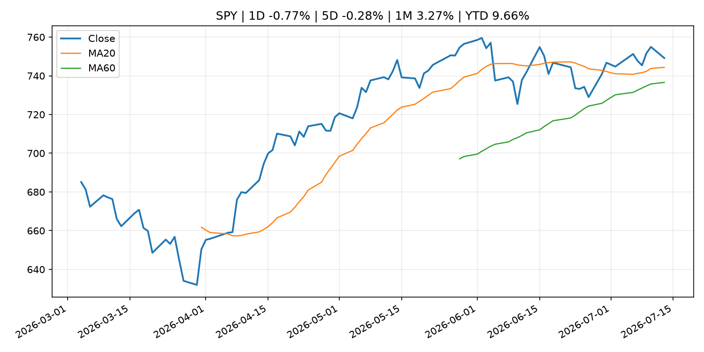
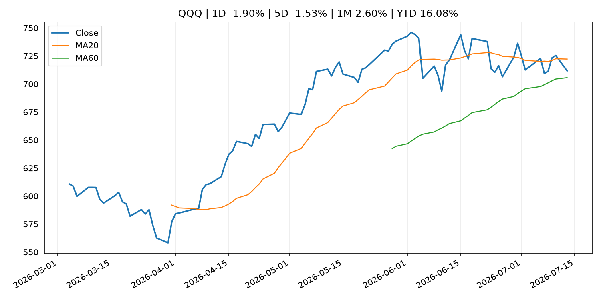
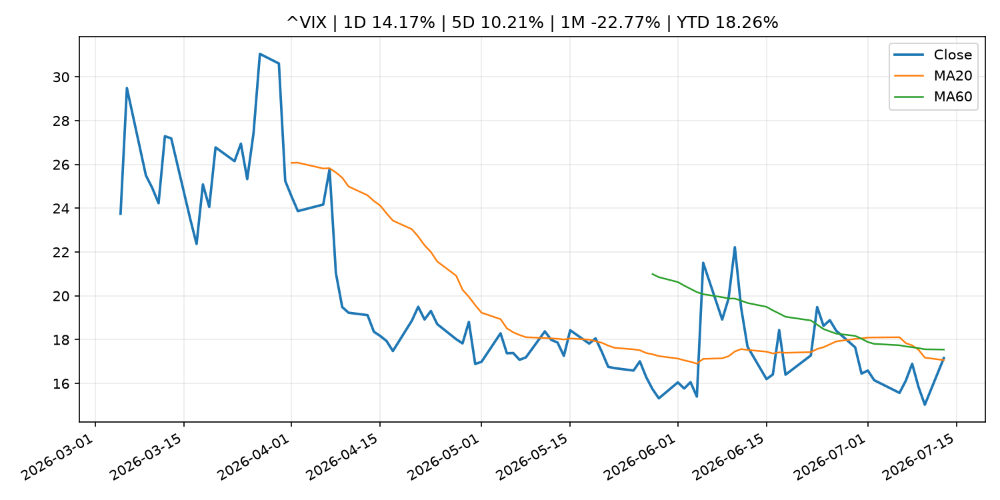
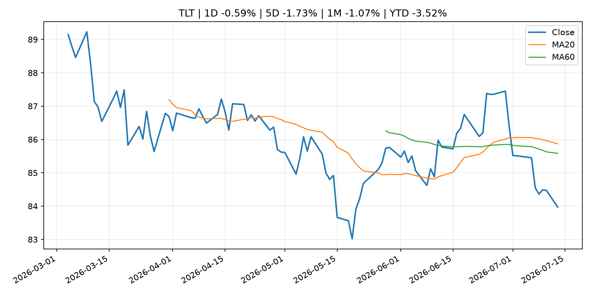
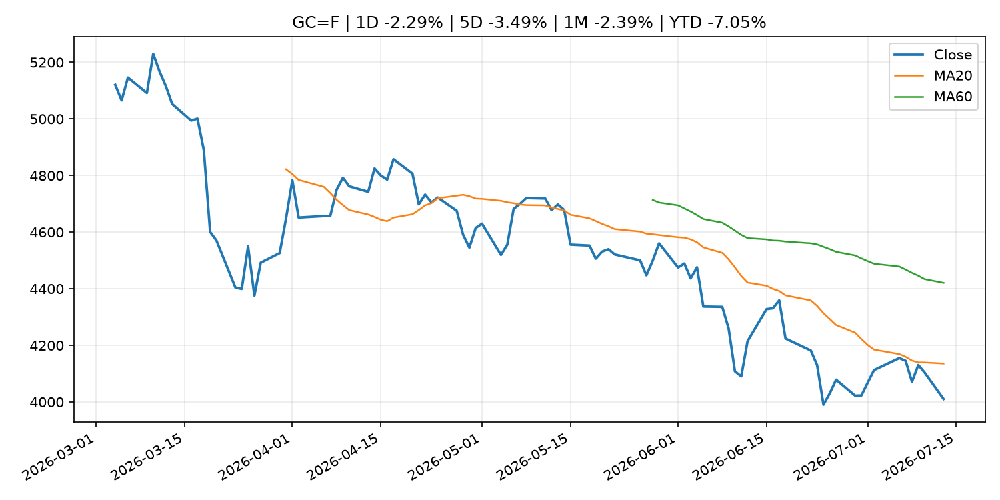
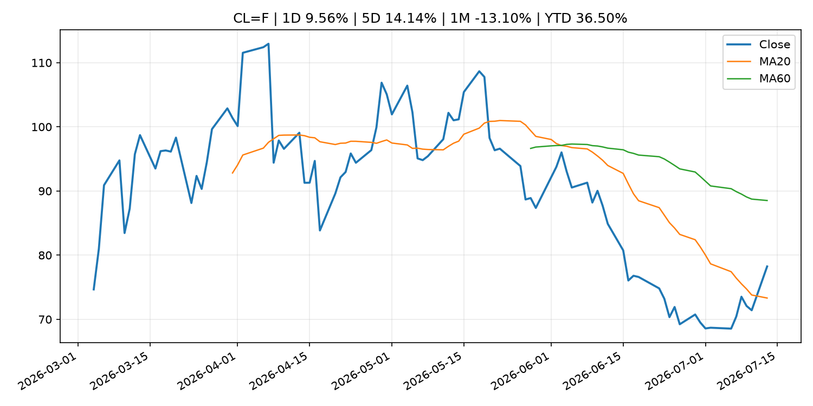
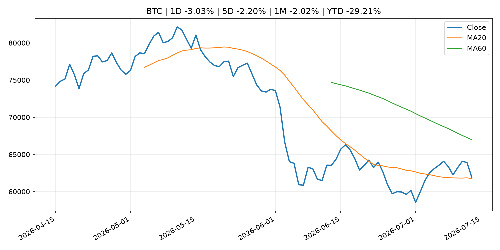
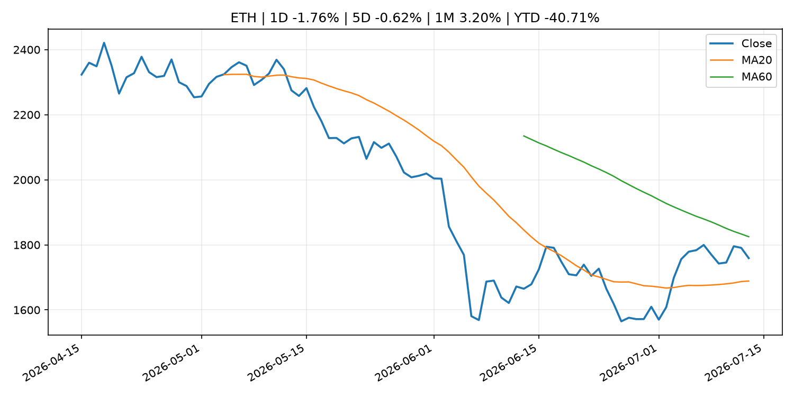
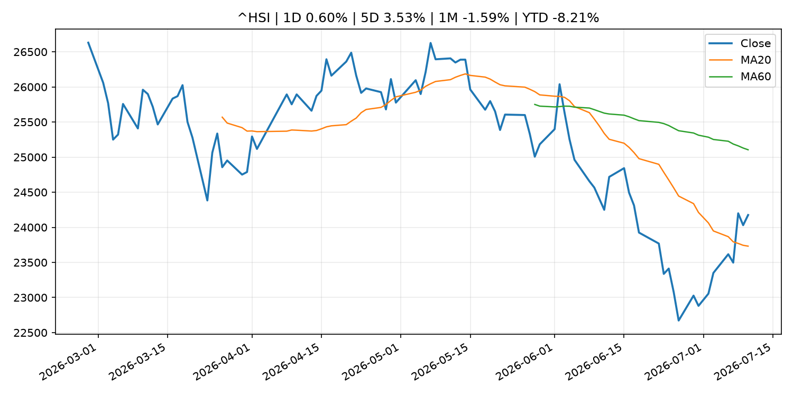

# Global Macro Morning Briefing - 2026-07-14

> Not financial advice / 非投资建议。

## 0. 今日总览
- 市场状态：mixed。长债下跌、美元走强且成长股承压，市场像是在交易利率冲击。 但存在信号冲突，需要降低单一叙事置信度。
- 今日三大主线：
  1. central_bank_decision: A July rate hike from the Fed? The odds are rising
  2. central_bank_decision: Live markets: Bitcoin, stocks, bonds sharply lower as Fed's Waller signals near-term rate hike
  3. geopolitical_risk: Bitcoin holds near $63,800 as war-driven selloff hits everything but crypto
- 一句话结论：今日晨报重点关注：央行决策会重定价利率、汇率、久期资产和风险资产。；央行决策会重定价利率、汇率、久期资产和风险资产。。跨资产方面，SPY 1D -0.77%；QQQ 1D -1.90%；^VIX 1D 14.17%；TLT 1D -0.59%；GC=F 1D -2.29%；CL=F 1D 9.56%；BTC 1D -3.03%；ETH 1D -1.76%；长债下跌、美元走强且成长股承压，市场像是在交易利率冲击。 但存在信号冲突，需要降低单一叙事置信度。政策、通胀、利率、美元、美债、能源和加密监管仍是主要观察线索。所有结论仅基于公开数据与短摘要整理，不构成投资建议。

## 1. 隔夜跨资产市场
- 美股：SPY 1D -0.77%，QQQ 1D -1.90%，整体趋势需结合 VIX 和利率确认。
- 美债/美元：TLT 1D -0.59%，美元指数 1D 0.30%，是判断折现率压力的核心线索。
- 黄金/原油：黄金 1D -2.29%，原油 1D 9.56%，用于观察避险、通胀和地缘风险。
- 加密：BTC 1D -3.03%，ETH 1D -1.76%，关注是否独立于纳指走出加密自身行情。
- 港股/A股：恒生 1D 0.60%，沪深300/上证 1D n/a，重点看中国政策预期与人民币线索。
- 风险观察：关注美债收益率、实际利率和成长股估值压力。

### US_EQUITY

| symbol | latest close | 1D | 5D | 1M | YTD | trend |
|---|---:|---:|---:|---:|---:|---|
| SPY | 749.17 | -0.77% | -0.28% | 3.27% | 9.66% | uptrend |
| QQQ | 711.74 | -1.90% | -1.53% | 2.60% | 16.08% | range_bound |
| DIA | 524.47 | -0.25% | -1.06% | 4.84% | 8.44% | strong_uptrend |
| IWM | 293.48 | -0.85% | -1.81% | 4.05% | 17.97% | range_bound |
| VTI | 369.78 | -0.78% | -0.51% | 3.28% | 9.95% | uptrend |

### US_MACRO_MARKET

| symbol | latest close | 1D | 5D | 1M | YTD | trend |
|---|---:|---:|---:|---:|---:|---|
| ^VIX | 17.16 | 14.17% | 10.21% | -22.77% | 18.26% | range_bound |
| DX-Y.NYB | 101.28 | 0.30% | 0.42% | 1.33% | 2.90% | uptrend |
| TLT | 83.97 | -0.59% | -1.73% | -1.07% | -3.52% | range_bound |
| IEF | 93.29 | -0.36% | -0.94% | -0.43% | -2.90% | downtrend |

### COMMODITIES

| symbol | latest close | 1D | 5D | 1M | YTD | trend |
|---|---:|---:|---:|---:|---:|---|
| GC=F | 4,010.20 | -2.29% | -3.49% | -2.39% | -7.05% | downtrend |
| SI=F | 57.99 | -3.05% | -6.35% | -10.24% | -17.82% | strong_downtrend |
| CL=F | 78.24 | 9.56% | 14.14% | -13.10% | 36.50% | range_bound |
| BZ=F | 83.40 | 9.72% | 15.85% | -10.42% | 37.28% | range_bound |
| NG=F | 2.90 | -1.43% | -10.69% | -9.01% | -19.90% | range_bound |
| HG=F | 6.27 | 0.66% | 1.56% | 0.41% | 11.25% | uptrend |

### HK_MARKET

| symbol | latest close | 1D | 5D | 1M | YTD | trend |
|---|---:|---:|---:|---:|---:|---|
| ^HSI | 24,175.12 | 0.60% | 3.53% | -1.59% | -8.21% | range_bound |
| 0700.HK | 457.60 | -0.56% | 1.24% | -1.72% | -26.55% | range_bound |
| 9988.HK | 110.70 | 0.45% | 15.37% | -2.47% | -25.70% | range_bound |
| 3690.HK | 77.95 | -0.95% | 4.00% | -1.33% | -25.48% | range_bound |
| 1810.HK | 25.84 | 0.00% | 11.00% | -1.82% | -35.85% | range_bound |
| 1211.HK | 83.95 | -1.12% | 0.18% | -3.06% | -14.99% | range_bound |

### CRYPTO

| symbol | latest close | 1D | 5D | 1M | YTD | trend |
|---|---:|---:|---:|---:|---:|---|
| BTC | 61,956.64 | -3.03% | -2.20% | -2.02% | -29.21% | range_bound |
| ETH | 1,759.10 | -1.76% | -0.62% | 3.20% | -40.71% | range_bound |
| SOLANA | 74.51 | -3.21% | -7.67% | 2.84% | -40.16% | downtrend |
| BINANCECOIN | 565.09 | -1.81% | -2.09% | -3.18% | -34.53% | downtrend |
| RIPPLE | 1.06 | -3.60% | -4.80% | -5.80% | -42.41% | downtrend |

## 2. 今日最重要的 10 条新闻
### 1. A July rate hike from the Fed? The odds are rising
- 来源：CNBC Economy
- 时间：2026-07-13T17:07:51+00:00
- 地区：US
- 事件类型：central_bank_decision
- 重要性层级：Tier 1
- 一句话摘要：Chances of a rate hike in July by the Federal Reserve rose as oil prices jumped on the latest developments in the Strait of Hormuz.
- 为什么重要：央行决策会重定价利率、汇率、久期资产和风险资产。
- 可能影响：主要影响 QQQ，方向为 negative，强度 high；鹰派政策提高折现率，压制成长股估值。
  - 资产：QQQ
    方向：negative
    强度：high
    原因：鹰派政策提高折现率，压制成长股估值。
  - 资产：SPY
    方向：negative
    强度：medium
    原因：更紧政策通常削弱风险偏好。
  - 资产：TLT
    方向：negative
    强度：high
    原因：利率上行通常压低长债价格。
  - 资产：DXY
    方向：positive
    强度：high
    原因：更高利率预期通常支撑美元。
  - 资产：BTC
    方向：negative
    强度：high
    原因：流动性收紧通常压制高 beta 加密资产。
  - 资产：CL=F
    方向：positive
    强度：high
    原因：供给扰动或 OPEC 减产通常推升 WTI 原油。
- 原文链接：[https://www.cnbc.com/2026/07/13/-a-july-rate-hike-from-the-fed-the-odds-are-rising.html](https://www.cnbc.com/2026/07/13/-a-july-rate-hike-from-the-fed-the-odds-are-rising.html)

### 2. Live markets: Bitcoin, stocks, bonds sharply lower as Fed's Waller signals near-term rate hike
- 来源：CoinDesk
- 时间：2026-07-13T06:52:28+00:00
- 地区：global
- 事件类型：central_bank_decision
- 重要性层级：Tier 1
- 一句话摘要：Live markets: Bitcoin, stocks, bonds sharply lower as Fed's Waller signals near-term rate hike
- 为什么重要：央行决策会重定价利率、汇率、久期资产和风险资产。
- 可能影响：主要影响 QQQ，方向为 negative，强度 high；鹰派政策提高折现率，压制成长股估值。
  - 资产：QQQ
    方向：negative
    强度：high
    原因：鹰派政策提高折现率，压制成长股估值。
  - 资产：SPY
    方向：negative
    强度：medium
    原因：更紧政策通常削弱风险偏好。
  - 资产：TLT
    方向：negative
    强度：high
    原因：利率上行通常压低长债价格。
  - 资产：DXY
    方向：positive
    强度：high
    原因：更高利率预期通常支撑美元。
  - 资产：BTC
    方向：negative
    强度：high
    原因：流动性收紧通常压制高 beta 加密资产。
- 原文链接：[https://www.coindesk.com/markets/2026/07/13/bitcoin-slips-below-usd63-000-in-an-asian-session-leverage-flush](https://www.coindesk.com/markets/2026/07/13/bitcoin-slips-below-usd63-000-in-an-asian-session-leverage-flush)

### 3. Bitcoin holds near $63,800 as war-driven selloff hits everything but crypto
- 来源：CoinDesk
- 时间：2026-07-13T04:48:11+00:00
- 地区：global
- 事件类型：geopolitical_risk
- 重要性层级：Tier 1
- 一句话摘要：Bitcoin holds near $63,800 as war-driven selloff hits everything but crypto
- 为什么重要：地缘风险可能推升避险需求、能源价格和市场波动率。
- 可能影响：可能影响利率、汇率、风险资产或大宗商品预期，但当前公开信息不足以判断明确方向。
  - 资产：暂无明确资产映射
  - 方向：unknown
  - 强度：low
  - 原因：公开信息不足以判断方向。
- 原文链接：[https://www.coindesk.com/markets/2026/07/13/bitcoin-holds-near-usd63-800-as-war-driven-selloff-hits-everything-but-crypto](https://www.coindesk.com/markets/2026/07/13/bitcoin-holds-near-usd63-800-as-war-driven-selloff-hits-everything-but-crypto)

### 4. Waller says Fed shouldn't 'fight the last war' on inflation but warns hikes still possible
- 来源：CNBC Economy
- 时间：2026-07-13T19:15:25+00:00
- 地区：US
- 事件类型：central_bank_speech
- 重要性层级：Tier 2
- 一句话摘要：The Fed governor said inflation has expanded beyond the often-cited drivers such as the energy price spike in tariffs.
- 为什么重要：央行官员表态可能影响市场对下一次会议的定价。
- 可能影响：主要影响 DXY，方向为 positive，强度 high；通胀压力可能推高政策利率预期并支撑美元。
  - 资产：DXY
    方向：positive
    强度：high
    原因：通胀压力可能推高政策利率预期并支撑美元。
  - 资产：TLT
    方向：negative
    强度：high
    原因：通胀上行通常推升收益率、压低长债价格。
  - 资产：QQQ
    方向：negative
    强度：high
    原因：更高利率对成长股估值折现率不利。
  - 资产：SPY
    方向：mixed
    强度：medium
    原因：名义增长可能支撑收入，但更高利率压制估值。
  - 资产：GC=F
    方向：mixed
    强度：medium
    原因：通胀对黄金是支撑，但实际利率上行会形成压力。
  - 资产：BTC
    方向：mixed
    强度：medium
    原因：抗通胀叙事和流动性收紧可能相互抵消。
- 原文链接：[https://www.cnbc.com/2026/07/13/waller-says-fed-shouldnt-fight-the-last-war-on-inflation-but-warns-hikes-still-possible.html](https://www.cnbc.com/2026/07/13/waller-says-fed-shouldnt-fight-the-last-war-on-inflation-but-warns-hikes-still-possible.html)

### 5. U.S. inflation, second-quarter earnings reports: Crypto Week Ahead
- 来源：CoinDesk
- 时间：2026-07-13T08:55:50+00:00
- 地区：global
- 事件类型：earnings
- 重要性层级：Tier 2
- 一句话摘要：U.S. inflation, second-quarter earnings reports: Crypto Week Ahead
- 为什么重要：大型科技股盈利和资本开支会影响纳指、半导体和 AI 交易主线。
- 可能影响：主要影响 DXY，方向为 positive，强度 high；通胀压力可能推高政策利率预期并支撑美元。
  - 资产：DXY
    方向：positive
    强度：high
    原因：通胀压力可能推高政策利率预期并支撑美元。
  - 资产：TLT
    方向：negative
    强度：high
    原因：通胀上行通常推升收益率、压低长债价格。
  - 资产：QQQ
    方向：negative
    强度：high
    原因：更高利率对成长股估值折现率不利。
  - 资产：SPY
    方向：mixed
    强度：medium
    原因：名义增长可能支撑收入，但更高利率压制估值。
  - 资产：GC=F
    方向：mixed
    强度：medium
    原因：通胀对黄金是支撑，但实际利率上行会形成压力。
  - 资产：BTC
    方向：mixed
    强度：medium
    原因：抗通胀叙事和流动性收紧可能相互抵消。
- 原文链接：[https://www.coindesk.com/markets/2026/07/13/u-s-inflation-second-quarter-earnings-reports-crypto-week-ahead](https://www.coindesk.com/markets/2026/07/13/u-s-inflation-second-quarter-earnings-reports-crypto-week-ahead)

### 6. Mizuho says Circle bank approval doesn't solve USDC growth, stablecoin competition risks
- 来源：CoinDesk
- 时间：2026-07-13T16:34:48+00:00
- 地区：global
- 事件类型：crypto_market_structure
- 重要性层级：Tier 2
- 一句话摘要：Mizuho says Circle bank approval doesn't solve USDC growth, stablecoin competition risks
- 为什么重要：加密市场结构和监管变化会影响 BTC、ETH 及相关股票的风险溢价。
- 可能影响：主要影响 BTC，方向为 mixed，强度 high；加密监管或 ETF 进展会改变 BTC 的资金流和风险溢价。
  - 资产：BTC
    方向：mixed
    强度：high
    原因：加密监管或 ETF 进展会改变 BTC 的资金流和风险溢价。
  - 资产：ETH
    方向：mixed
    强度：high
    原因：监管框架会影响 ETH 产品化和机构参与度。
  - 资产：COIN
    方向：mixed
    强度：medium
    原因：监管清晰度和执法风险会影响交易平台估值。
  - 资产：crypto market
    方向：mixed
    强度：high
    原因：信息影响整个加密市场结构，但方向取决于细节。
- 原文链接：[https://www.coindesk.com/business/2026/07/13/mizuho-says-circle-bank-approval-doesn-t-solve-usdc-growth-stablecoin-competition-risks](https://www.coindesk.com/business/2026/07/13/mizuho-says-circle-bank-approval-doesn-t-solve-usdc-growth-stablecoin-competition-risks)

### 7. Wall Street transfer agents lobby SEC, warning that third-party tokens pose risks to market integrity
- 来源：CoinDesk
- 时间：2026-07-13T13:45:00+00:00
- 地区：global
- 事件类型：regulation
- 重要性层级：Tier 2
- 一句话摘要：Wall Street transfer agents lobby SEC, warning that third-party tokens pose risks to market integrity
- 为什么重要：监管变化会改变行业盈利预期和资产风险溢价。
- 可能影响：主要影响 BTC，方向为 mixed，强度 high；加密监管或 ETF 进展会改变 BTC 的资金流和风险溢价。
  - 资产：BTC
    方向：mixed
    强度：high
    原因：加密监管或 ETF 进展会改变 BTC 的资金流和风险溢价。
  - 资产：ETH
    方向：mixed
    强度：high
    原因：监管框架会影响 ETH 产品化和机构参与度。
  - 资产：COIN
    方向：mixed
    强度：medium
    原因：监管清晰度和执法风险会影响交易平台估值。
  - 资产：crypto market
    方向：mixed
    强度：high
    原因：信息影响整个加密市场结构，但方向取决于细节。
- 原文链接：[https://www.coindesk.com/policy/2026/07/13/wall-street-transfer-agents-lobby-sec-warning-that-third-party-tokens-pose-risks-to-market-integrity](https://www.coindesk.com/policy/2026/07/13/wall-street-transfer-agents-lobby-sec-warning-that-third-party-tokens-pose-risks-to-market-integrity)

### 8. SBI Holdings' blockchain initiative pivots to Solana for tokenization, stablecoin issuance
- 来源：CoinDesk
- 时间：2026-07-13T11:40:51+00:00
- 地区：global
- 事件类型：crypto_market_structure
- 重要性层级：Tier 2
- 一句话摘要：SBI Holdings' blockchain initiative pivots to Solana for tokenization, stablecoin issuance
- 为什么重要：加密市场结构和监管变化会影响 BTC、ETH 及相关股票的风险溢价。
- 可能影响：主要影响 BTC，方向为 mixed，强度 high；加密监管或 ETF 进展会改变 BTC 的资金流和风险溢价。
  - 资产：BTC
    方向：mixed
    强度：high
    原因：加密监管或 ETF 进展会改变 BTC 的资金流和风险溢价。
  - 资产：ETH
    方向：mixed
    强度：high
    原因：监管框架会影响 ETH 产品化和机构参与度。
  - 资产：COIN
    方向：mixed
    强度：medium
    原因：监管清晰度和执法风险会影响交易平台估值。
  - 资产：crypto market
    方向：mixed
    强度：high
    原因：信息影响整个加密市场结构，但方向取决于细节。
- 原文链接：[https://www.coindesk.com/business/2026/07/13/sbi-holdings-blockchain-initiative-pivots-to-solana-for-tokenization-stablecoin-issuance](https://www.coindesk.com/business/2026/07/13/sbi-holdings-blockchain-initiative-pivots-to-solana-for-tokenization-stablecoin-issuance)

### 9. Stablecoin market cap has shrunk by $10 billion since May, but analyst sees no reason to panic
- 来源：CoinDesk
- 时间：2026-07-12T13:00:00+00:00
- 地区：global
- 事件类型：crypto_market_structure
- 重要性层级：Tier 2
- 一句话摘要：Stablecoin market cap has shrunk by $10 billion since May, but analyst sees no reason to panic
- 为什么重要：加密市场结构和监管变化会影响 BTC、ETH 及相关股票的风险溢价。
- 可能影响：主要影响 BTC，方向为 mixed，强度 high；加密监管或 ETF 进展会改变 BTC 的资金流和风险溢价。
  - 资产：BTC
    方向：mixed
    强度：high
    原因：加密监管或 ETF 进展会改变 BTC 的资金流和风险溢价。
  - 资产：ETH
    方向：mixed
    强度：high
    原因：监管框架会影响 ETH 产品化和机构参与度。
  - 资产：COIN
    方向：mixed
    强度：medium
    原因：监管清晰度和执法风险会影响交易平台估值。
  - 资产：crypto market
    方向：mixed
    强度：high
    原因：信息影响整个加密市场结构，但方向取决于细节。
- 原文链接：[https://www.coindesk.com/markets/2026/07/12/stablecoin-market-cap-has-shrunk-by-usd10-billion-since-may-but-analyst-sees-no-reason-to-panic](https://www.coindesk.com/markets/2026/07/12/stablecoin-market-cap-has-shrunk-by-usd10-billion-since-may-but-analyst-sees-no-reason-to-panic)

### 10. Resurgent U.S.-Iran hostilities send bitcoin lower even as ETF flows show demand
- 来源：CoinDesk
- 时间：2026-07-13T11:20:49+00:00
- 地区：global
- 事件类型：other
- 重要性层级：Tier 3
- 一句话摘要：Resurgent U.S.-Iran hostilities send bitcoin lower even as ETF flows show demand
- 为什么重要：这条信息暂未匹配到重大宏观、政策或市场事件，更适合作为背景跟踪。
- 可能影响：主要影响 BTC，方向为 mixed，强度 high；加密监管或 ETF 进展会改变 BTC 的资金流和风险溢价。
  - 资产：BTC
    方向：mixed
    强度：high
    原因：加密监管或 ETF 进展会改变 BTC 的资金流和风险溢价。
  - 资产：ETH
    方向：mixed
    强度：high
    原因：监管框架会影响 ETH 产品化和机构参与度。
  - 资产：COIN
    方向：mixed
    强度：medium
    原因：监管清晰度和执法风险会影响交易平台估值。
  - 资产：crypto market
    方向：mixed
    强度：high
    原因：信息影响整个加密市场结构，但方向取决于细节。
- 原文链接：[https://www.coindesk.com/daybook-us/2026/07/13/resurgent-u-s-iran-hostilities-send-bitcoin-lower-even-as-etf-flows-show-demand](https://www.coindesk.com/daybook-us/2026/07/13/resurgent-u-s-iran-hostilities-send-bitcoin-lower-even-as-etf-flows-show-demand)

## 3. 政策与央行观察
### 1. A July rate hike from the Fed? The odds are rising
- 来源：CNBC Economy
- 时间：2026-07-13T17:07:51+00:00
- 地区：US
- 事件类型：central_bank_decision
- 重要性层级：Tier 1
- 一句话摘要：Chances of a rate hike in July by the Federal Reserve rose as oil prices jumped on the latest developments in the Strait of Hormuz.
- 为什么重要：央行决策会重定价利率、汇率、久期资产和风险资产。
- 可能影响：主要影响 QQQ，方向为 negative，强度 high；鹰派政策提高折现率，压制成长股估值。
  - 资产：QQQ
    方向：negative
    强度：high
    原因：鹰派政策提高折现率，压制成长股估值。
  - 资产：SPY
    方向：negative
    强度：medium
    原因：更紧政策通常削弱风险偏好。
  - 资产：TLT
    方向：negative
    强度：high
    原因：利率上行通常压低长债价格。
  - 资产：DXY
    方向：positive
    强度：high
    原因：更高利率预期通常支撑美元。
  - 资产：BTC
    方向：negative
    强度：high
    原因：流动性收紧通常压制高 beta 加密资产。
  - 资产：CL=F
    方向：positive
    强度：high
    原因：供给扰动或 OPEC 减产通常推升 WTI 原油。
- 原文链接：[https://www.cnbc.com/2026/07/13/-a-july-rate-hike-from-the-fed-the-odds-are-rising.html](https://www.cnbc.com/2026/07/13/-a-july-rate-hike-from-the-fed-the-odds-are-rising.html)

### 2. Live markets: Bitcoin, stocks, bonds sharply lower as Fed's Waller signals near-term rate hike
- 来源：CoinDesk
- 时间：2026-07-13T06:52:28+00:00
- 地区：global
- 事件类型：central_bank_decision
- 重要性层级：Tier 1
- 一句话摘要：Live markets: Bitcoin, stocks, bonds sharply lower as Fed's Waller signals near-term rate hike
- 为什么重要：央行决策会重定价利率、汇率、久期资产和风险资产。
- 可能影响：主要影响 QQQ，方向为 negative，强度 high；鹰派政策提高折现率，压制成长股估值。
  - 资产：QQQ
    方向：negative
    强度：high
    原因：鹰派政策提高折现率，压制成长股估值。
  - 资产：SPY
    方向：negative
    强度：medium
    原因：更紧政策通常削弱风险偏好。
  - 资产：TLT
    方向：negative
    强度：high
    原因：利率上行通常压低长债价格。
  - 资产：DXY
    方向：positive
    强度：high
    原因：更高利率预期通常支撑美元。
  - 资产：BTC
    方向：negative
    强度：high
    原因：流动性收紧通常压制高 beta 加密资产。
- 原文链接：[https://www.coindesk.com/markets/2026/07/13/bitcoin-slips-below-usd63-000-in-an-asian-session-leverage-flush](https://www.coindesk.com/markets/2026/07/13/bitcoin-slips-below-usd63-000-in-an-asian-session-leverage-flush)

### 3. Waller says Fed shouldn't 'fight the last war' on inflation but warns hikes still possible
- 来源：CNBC Economy
- 时间：2026-07-13T19:15:25+00:00
- 地区：US
- 事件类型：central_bank_speech
- 重要性层级：Tier 2
- 一句话摘要：The Fed governor said inflation has expanded beyond the often-cited drivers such as the energy price spike in tariffs.
- 为什么重要：央行官员表态可能影响市场对下一次会议的定价。
- 可能影响：主要影响 DXY，方向为 positive，强度 high；通胀压力可能推高政策利率预期并支撑美元。
  - 资产：DXY
    方向：positive
    强度：high
    原因：通胀压力可能推高政策利率预期并支撑美元。
  - 资产：TLT
    方向：negative
    强度：high
    原因：通胀上行通常推升收益率、压低长债价格。
  - 资产：QQQ
    方向：negative
    强度：high
    原因：更高利率对成长股估值折现率不利。
  - 资产：SPY
    方向：mixed
    强度：medium
    原因：名义增长可能支撑收入，但更高利率压制估值。
  - 资产：GC=F
    方向：mixed
    强度：medium
    原因：通胀对黄金是支撑，但实际利率上行会形成压力。
  - 资产：BTC
    方向：mixed
    强度：medium
    原因：抗通胀叙事和流动性收紧可能相互抵消。
- 原文链接：[https://www.cnbc.com/2026/07/13/waller-says-fed-shouldnt-fight-the-last-war-on-inflation-but-warns-hikes-still-possible.html](https://www.cnbc.com/2026/07/13/waller-says-fed-shouldnt-fight-the-last-war-on-inflation-but-warns-hikes-still-possible.html)

### 4. Mizuho says Circle bank approval doesn't solve USDC growth, stablecoin competition risks
- 来源：CoinDesk
- 时间：2026-07-13T16:34:48+00:00
- 地区：global
- 事件类型：crypto_market_structure
- 重要性层级：Tier 2
- 一句话摘要：Mizuho says Circle bank approval doesn't solve USDC growth, stablecoin competition risks
- 为什么重要：加密市场结构和监管变化会影响 BTC、ETH 及相关股票的风险溢价。
- 可能影响：主要影响 BTC，方向为 mixed，强度 high；加密监管或 ETF 进展会改变 BTC 的资金流和风险溢价。
  - 资产：BTC
    方向：mixed
    强度：high
    原因：加密监管或 ETF 进展会改变 BTC 的资金流和风险溢价。
  - 资产：ETH
    方向：mixed
    强度：high
    原因：监管框架会影响 ETH 产品化和机构参与度。
  - 资产：COIN
    方向：mixed
    强度：medium
    原因：监管清晰度和执法风险会影响交易平台估值。
  - 资产：crypto market
    方向：mixed
    强度：high
    原因：信息影响整个加密市场结构，但方向取决于细节。
- 原文链接：[https://www.coindesk.com/business/2026/07/13/mizuho-says-circle-bank-approval-doesn-t-solve-usdc-growth-stablecoin-competition-risks](https://www.coindesk.com/business/2026/07/13/mizuho-says-circle-bank-approval-doesn-t-solve-usdc-growth-stablecoin-competition-risks)

### 5. Wall Street transfer agents lobby SEC, warning that third-party tokens pose risks to market integrity
- 来源：CoinDesk
- 时间：2026-07-13T13:45:00+00:00
- 地区：global
- 事件类型：regulation
- 重要性层级：Tier 2
- 一句话摘要：Wall Street transfer agents lobby SEC, warning that third-party tokens pose risks to market integrity
- 为什么重要：监管变化会改变行业盈利预期和资产风险溢价。
- 可能影响：主要影响 BTC，方向为 mixed，强度 high；加密监管或 ETF 进展会改变 BTC 的资金流和风险溢价。
  - 资产：BTC
    方向：mixed
    强度：high
    原因：加密监管或 ETF 进展会改变 BTC 的资金流和风险溢价。
  - 资产：ETH
    方向：mixed
    强度：high
    原因：监管框架会影响 ETH 产品化和机构参与度。
  - 资产：COIN
    方向：mixed
    强度：medium
    原因：监管清晰度和执法风险会影响交易平台估值。
  - 资产：crypto market
    方向：mixed
    强度：high
    原因：信息影响整个加密市场结构，但方向取决于细节。
- 原文链接：[https://www.coindesk.com/policy/2026/07/13/wall-street-transfer-agents-lobby-sec-warning-that-third-party-tokens-pose-risks-to-market-integrity](https://www.coindesk.com/policy/2026/07/13/wall-street-transfer-agents-lobby-sec-warning-that-third-party-tokens-pose-risks-to-market-integrity)

### 6. SBI Holdings' blockchain initiative pivots to Solana for tokenization, stablecoin issuance
- 来源：CoinDesk
- 时间：2026-07-13T11:40:51+00:00
- 地区：global
- 事件类型：crypto_market_structure
- 重要性层级：Tier 2
- 一句话摘要：SBI Holdings' blockchain initiative pivots to Solana for tokenization, stablecoin issuance
- 为什么重要：加密市场结构和监管变化会影响 BTC、ETH 及相关股票的风险溢价。
- 可能影响：主要影响 BTC，方向为 mixed，强度 high；加密监管或 ETF 进展会改变 BTC 的资金流和风险溢价。
  - 资产：BTC
    方向：mixed
    强度：high
    原因：加密监管或 ETF 进展会改变 BTC 的资金流和风险溢价。
  - 资产：ETH
    方向：mixed
    强度：high
    原因：监管框架会影响 ETH 产品化和机构参与度。
  - 资产：COIN
    方向：mixed
    强度：medium
    原因：监管清晰度和执法风险会影响交易平台估值。
  - 资产：crypto market
    方向：mixed
    强度：high
    原因：信息影响整个加密市场结构，但方向取决于细节。
- 原文链接：[https://www.coindesk.com/business/2026/07/13/sbi-holdings-blockchain-initiative-pivots-to-solana-for-tokenization-stablecoin-issuance](https://www.coindesk.com/business/2026/07/13/sbi-holdings-blockchain-initiative-pivots-to-solana-for-tokenization-stablecoin-issuance)

### 7. Stablecoin market cap has shrunk by $10 billion since May, but analyst sees no reason to panic
- 来源：CoinDesk
- 时间：2026-07-12T13:00:00+00:00
- 地区：global
- 事件类型：crypto_market_structure
- 重要性层级：Tier 2
- 一句话摘要：Stablecoin market cap has shrunk by $10 billion since May, but analyst sees no reason to panic
- 为什么重要：加密市场结构和监管变化会影响 BTC、ETH 及相关股票的风险溢价。
- 可能影响：主要影响 BTC，方向为 mixed，强度 high；加密监管或 ETF 进展会改变 BTC 的资金流和风险溢价。
  - 资产：BTC
    方向：mixed
    强度：high
    原因：加密监管或 ETF 进展会改变 BTC 的资金流和风险溢价。
  - 资产：ETH
    方向：mixed
    强度：high
    原因：监管框架会影响 ETH 产品化和机构参与度。
  - 资产：COIN
    方向：mixed
    强度：medium
    原因：监管清晰度和执法风险会影响交易平台估值。
  - 资产：crypto market
    方向：mixed
    强度：high
    原因：信息影响整个加密市场结构，但方向取决于细节。
- 原文链接：[https://www.coindesk.com/markets/2026/07/12/stablecoin-market-cap-has-shrunk-by-usd10-billion-since-may-but-analyst-sees-no-reason-to-panic](https://www.coindesk.com/markets/2026/07/12/stablecoin-market-cap-has-shrunk-by-usd10-billion-since-may-but-analyst-sees-no-reason-to-panic)

## 4. 市场异动与图表
- SPY 下跌 -0.77%
- QQQ 下跌 -1.90%
- VIX 上涨 14.17%
- TLT 下跌 -0.59%
- DXY 上涨 0.30%
- Gold 下跌 -2.29%
- Oil 上涨 9.56%
- BTC 下跌 -3.03%

### 信号矛盾
- 股债同时承压，可能是利率或流动性冲击而非传统避险。

### SPY

### QQQ

### ^VIX

### TLT

### GC=F

### CL=F

### BTC

### ETH

### ^HSI

## 5. 华尔街与机构公开观点
- 暂无可靠公开观点。

## 6. 今日重点关注
- 经济数据：经济数据：暂无可靠公开日历数据；如配置经济日历源后可自动填充。
- 央行讲话：央行讲话：暂无可靠公开日历数据；重点跟踪 Fed、ECB、BoJ、PBOC 官网 RSS。
- 财报：财报：暂无可靠数据。
- 政策事件：政策事件：暂无可靠数据。
- 风险提醒：风险提醒：关注数据源失败项、突发地缘风险、利率和美元的二阶反应。

## 7. 英文金融表达与宏观概念
- **inflation expectations**：通胀预期，指家庭、企业或市场对未来通胀的预估。 例句：Inflation expectations can shape wage bargaining and bond yields.
- **real yield**：实际收益率，名义利率扣除通胀预期后的收益率。 例句：Gold often reacts more to real yields than nominal yields.
- **terminal rate**：终端利率，市场预期本轮加息周期的最高政策利率。 例句：A higher terminal rate can pressure growth stocks.
- **risk-off**：避险模式，资金偏向美元、国债、黄金等防御资产。 例句：A geopolitical shock can push markets into risk-off mode.
- **supply disruption**：供给扰动，通常指能源或商品供应受冲突、减产或天气影响。 例句：Supply disruption can lift oil prices and inflation expectations.
- **market structure**：市场结构，指交易、托管、清算、ETF、监管等制度安排。 例句：Crypto market structure rules can affect institutional participation.

## 8. 背景材料
- [Lindsey Graham died from a rare heart condition. Here’s how to know if you’re at risk.](https://www.marketwatch.com/story/lindsey-graham-died-from-a-rare-heart-condition-heres-how-to-know-if-youre-at-risk-8ca5a618?mod=mw_rss_topstories)（MarketWatch Top Stories，other）：Aortic dissections are extremely rare; however, people with a family history or who have been diagnosed with certain genetic syndromes have an elevated risk
- [You don’t have to be rich to be financially independent. Here’s how to take control of your money.](https://www.marketwatch.com/story/you-dont-have-to-be-rich-to-be-financially-independent-heres-how-to-take-control-of-your-money-5345f146?mod=mw_rss_topstories)（MarketWatch Top Stories，other）：Relying on a high salary or a hot stock is a dangerous trap. Why the most secure people plan for sudden crisis.
- [Billionaires are loading up on these superior stocks. Why it pays to follow their money.](https://www.marketwatch.com/story/billionaires-are-loading-up-on-these-superior-stocks-why-it-pays-to-follow-their-money-9120c242?mod=mw_rss_topstories)（MarketWatch Top Stories，other）：The second quarter was a six-year best for U.S. stocks — here are the three sectors poised to lead the next leg higher.
- [Piero Cipollone: Interview with Jornal de Negocios](https://www.ecb.europa.eu//press/inter/date/2026/html/ecb.in260713~d928475792.en.html)（ECB Press Releases，other）：Piero Cipollone: Interview with Jornal de Negocios
- [Isabel Schnabel: How to foster growth and resilience in Europe](https://www.ecb.europa.eu//press/key/date/2026/html/ecb.sp260713~e78632b27a.en.pdf)（ECB Press Releases，other）：Isabel Schnabel: How to foster growth and resilience in Europe
- [Bitcoin panic-selling may be ending as sellers' profit margins disappear](https://www.coindesk.com/markets/2026/07/13/bitcoin-panic-selling-may-be-ending-as-sellers-profit-margins-disappear)（CoinDesk，other）：Bitcoin panic-selling may be ending as sellers' profit margins disappear
- [Strategy pauses its Bitcoin buying spree to hoard a massive $3 billion cash cushion](https://www.coindesk.com/markets/2026/07/13/strategy-pauses-its-bitcoin-buying-spree-to-hoard-a-massive-usd3-billion-cash-cushion)（CoinDesk，other）：Strategy pauses its Bitcoin buying spree to hoard a massive $3 billion cash cushion
- [UK Treasury report on tokenization cites Ripple as convergence model](https://www.coindesk.com/policy/2026/07/13/ripple-lands-inside-uk-plan-for-tokenized-repo-bonds-and-funds)（CoinDesk，other）：UK Treasury report on tokenization cites Ripple as convergence model
- [Michael Saylor’s Strategy added $467 million in cash, made no changes to bitcoin holdings](https://www.coindesk.com/markets/2026/07/13/michael-saylor-s-strategy-added-usd467-million-in-cash-made-no-changes-to-bitcoin-holdings)（CoinDesk，other）：Michael Saylor’s Strategy added $467 million in cash, made no changes to bitcoin holdings
- [BlackRock, Goldman Sachs, JPMorgan, Morgan Stanley join UK government's tokenization taskforce](https://www.coindesk.com/business/2026/07/13/uk-government-unveils-tokenization-taskforce-with-blackrock-goldman-jpmorgan-morgan-stanley)（CoinDesk，other）：BlackRock, Goldman Sachs, JPMorgan, Morgan Stanley join UK government's tokenization taskforce
- [Resurgent U.S.-Iran hostilities send bitcoin lower even as ETF flows show demand](https://www.coindesk.com/daybook-us/2026/07/13/resurgent-u-s-iran-hostilities-send-bitcoin-lower-even-as-etf-flows-show-demand)（CoinDesk，other）：Resurgent U.S.-Iran hostilities send bitcoin lower even as ETF flows show demand
- [Paradigm shifts vs bubbles: AI chips and bitcoin show powerful trends can still produce severe corrections](https://www.coindesk.com/markets/2026/07/13/paradigm-shifts-vs-bubbles-ai-chips-and-bitcoin-show-powerful-trends-can-still-produce-severe-corrections)（CoinDesk，other）：Paradigm shifts vs bubbles: AI chips and bitcoin show powerful trends can still produce severe corrections
- [Bitcoin is nearing a power law support line Fidelity has tracked since 2015](https://www.coindesk.com/markets/2026/07/12/bitcoin-is-nearing-a-power-law-support-line-fidelity-has-tracked-since-2015)（CoinDesk，other）：Bitcoin is nearing a power law support line Fidelity has tracked since 2015

## 9. 数据源、失败项与免责声明
- 采集时间：2026-07-13T22:55:08
- 数据源：公开 RSS、Yahoo Finance、CoinGecko、AKShare、FRED、SEC data.sec.gov，以及用户自有 inputs/reports 文件。
- 合规说明：不绕过 WSJ、Bloomberg、FT、Reuters 等付费墙；对付费媒体只使用公开 RSS 标题、摘要、链接和发布时间。
- 免责声明：Not financial advice / 非投资建议。本项目仅供个人学习、研究和信息整理，不构成投资建议、交易建议或任何收益承诺。
- 失败或跳过的数据源：
  - crypto data failed coin=dogecoin
  - China market data failed symbol=上证指数: empty dataframe
  - China market data failed symbol=深证成指: empty dataframe
  - China market data failed symbol=创业板指: empty dataframe
  - China market data failed symbol=沪深300: empty dataframe
  - China market data failed symbol=中证500: empty dataframe
  - China market data failed symbol=科创50: empty dataframe
  - FRED_API_KEY not set; skipping FRED macro series
  - SEC failed cik=0000320193
  - SEC failed cik=0000789019
  - SEC failed cik=0001045810
  - SEC failed cik=0001318605
  - SEC failed cik=0001577552
