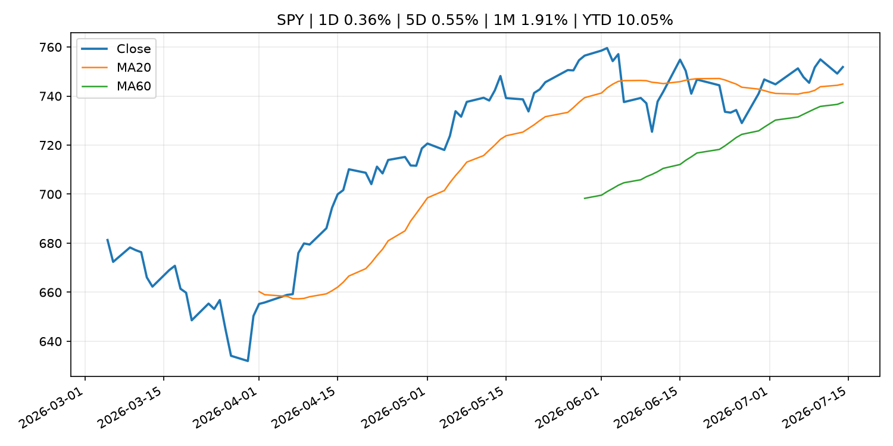
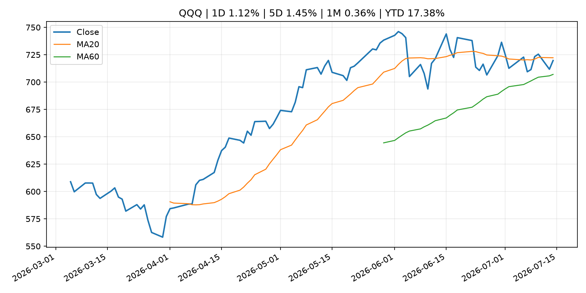
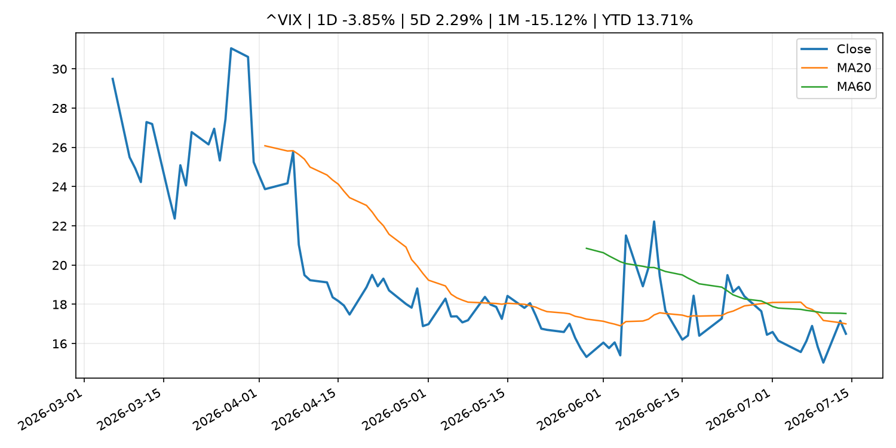
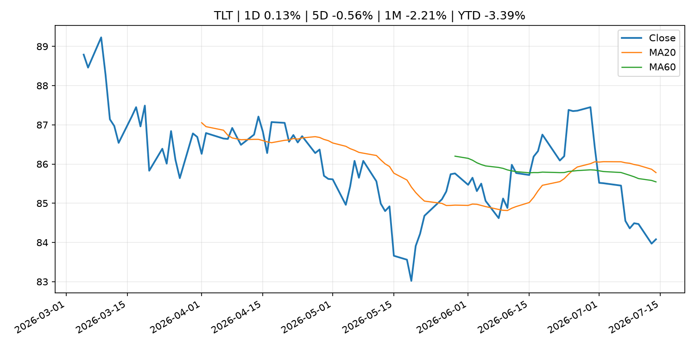
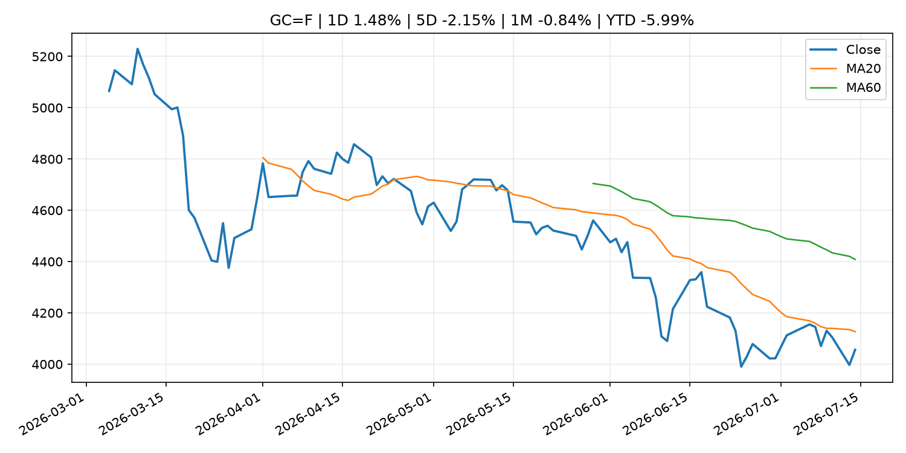
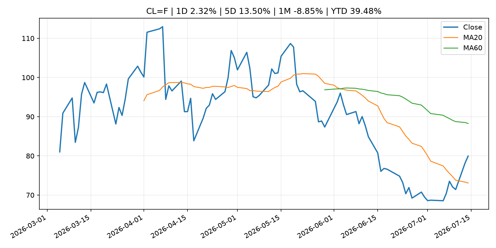
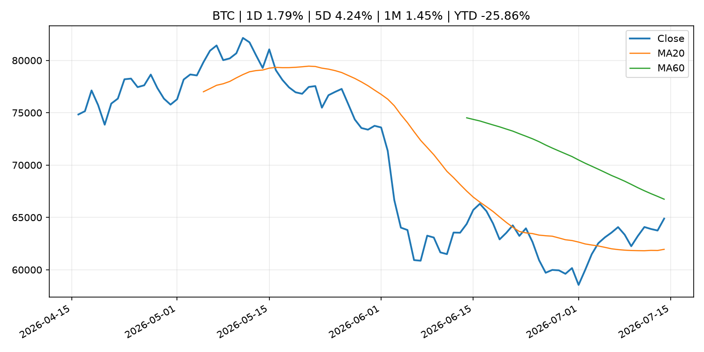
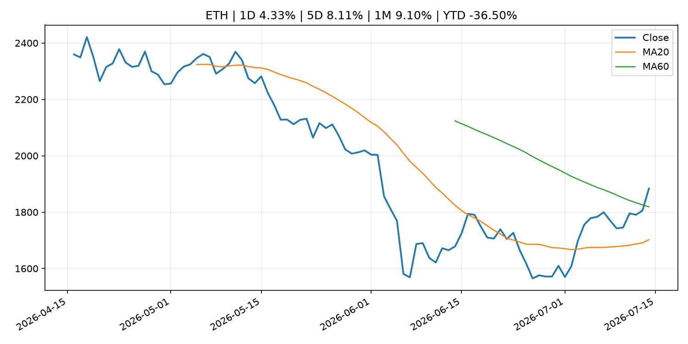
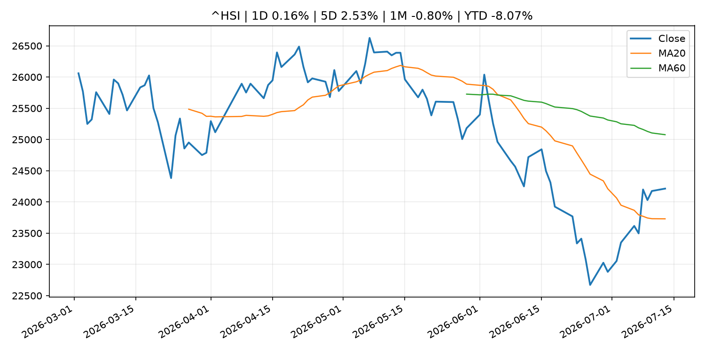

# Global Macro Morning Briefing - 2026-07-15

> Not financial advice / 非投资建议。

## 0. 今日总览
- 市场状态：risk_on。股指上涨、波动率或美元回落，市场更接近风险偏好改善。
- 今日三大主线：
  1. fiscal_policy: Warsh pledges Fed policy 'regime change' to rid inflation 'tax' on American people
  2. macro_data: U.S. June CPI fell 0.4%, likely cooling move toward Fed rate hikes
  3. central_bank_decision: Bitcoin slips as traders lift July Fed rate hike bets ahead of Inflation report
- 一句话结论：今日晨报重点关注：财政和贸易政策会影响增长、通胀、企业利润和跨境资本流。；这类宏观数据会直接改变市场对通胀、增长和政策路径的预期。。跨资产方面，SPY 1D 0.36%；QQQ 1D 1.12%；^VIX 1D -3.85%；TLT 1D 0.13%；GC=F 1D 1.48%；CL=F 1D 2.32%；BTC 1D 1.79%；ETH 1D 4.33%；股指上涨、波动率或美元回落，市场更接近风险偏好改善。政策、通胀、利率、美元、美债、能源和加密监管仍是主要观察线索。所有结论仅基于公开数据与短摘要整理，不构成投资建议。

## 1. 隔夜跨资产市场
- 美股：SPY 1D 0.36%，QQQ 1D 1.12%，整体趋势需结合 VIX 和利率确认。
- 美债/美元：TLT 1D 0.13%，美元指数 1D -0.33%，是判断折现率压力的核心线索。
- 黄金/原油：黄金 1D 1.48%，原油 1D 2.32%，用于观察避险、通胀和地缘风险。
- 加密：BTC 1D 1.79%，ETH 1D 4.33%，关注是否独立于纳指走出加密自身行情。
- 港股/A股：恒生 1D 0.16%，沪深300/上证 1D n/a，重点看中国政策预期与人民币线索。
- 风险观察：确认风险偏好是否扩散到小盘股、信用利差和周期品。

### US_EQUITY

| symbol | latest close | 1D | 5D | 1M | YTD | trend |
|---|---:|---:|---:|---:|---:|---|
| SPY | 751.83 | 0.36% | 0.55% | 1.91% | 10.05% | uptrend |
| QQQ | 719.69 | 1.12% | 1.45% | 0.36% | 17.38% | range_bound |
| DIA | 524.69 | 0.04% | -0.71% | 3.01% | 8.49% | strong_uptrend |
| IWM | 294.51 | 0.35% | -0.57% | 1.41% | 18.38% | range_bound |
| VTI | 371.16 | 0.37% | 0.42% | 1.88% | 10.36% | uptrend |

### US_MACRO_MARKET

| symbol | latest close | 1D | 5D | 1M | YTD | trend |
|---|---:|---:|---:|---:|---:|---|
| ^VIX | 16.50 | -3.85% | 2.29% | -15.12% | 13.71% | strong_downtrend |
| DX-Y.NYB | 100.94 | -0.33% | -0.20% | 1.08% | 2.56% | uptrend |
| TLT | 84.08 | 0.13% | -0.56% | -2.21% | -3.39% | range_bound |
| IEF | 93.55 | 0.28% | -0.16% | -0.84% | -2.63% | downtrend |

### COMMODITIES

| symbol | latest close | 1D | 5D | 1M | YTD | trend |
|---|---:|---:|---:|---:|---:|---|
| GC=F | 4,056.10 | 1.48% | -2.15% | -0.84% | -5.99% | downtrend |
| SI=F | 59.01 | 2.38% | -3.16% | -7.64% | -16.37% | strong_downtrend |
| CL=F | 79.95 | 2.32% | 13.50% | -8.85% | 39.48% | range_bound |
| BZ=F | 85.44 | 2.57% | 15.21% | -5.47% | 40.64% | range_bound |
| NG=F | 2.91 | 0.45% | -10.87% | -5.73% | -19.57% | range_bound |
| HG=F | 6.37 | 2.13% | 3.14% | 1.70% | 12.86% | range_bound |

### HK_MARKET

| symbol | latest close | 1D | 5D | 1M | YTD | trend |
|---|---:|---:|---:|---:|---:|---|
| ^HSI | 24,213.72 | 0.16% | 2.53% | -0.80% | -8.07% | range_bound |
| 0700.HK | 456.20 | -0.31% | -1.08% | -0.22% | -26.77% | range_bound |
| 9988.HK | 110.80 | 0.09% | 15.66% | 3.17% | -25.64% | range_bound |
| 3690.HK | 79.20 | 1.60% | 1.08% | 1.41% | -24.28% | range_bound |
| 1810.HK | 26.04 | 0.77% | 12.73% | 0.77% | -35.35% | range_bound |
| 1211.HK | 86.15 | 2.62% | 3.24% | 1.41% | -12.76% | range_bound |

### CRYPTO

| symbol | latest close | 1D | 5D | 1M | YTD | trend |
|---|---:|---:|---:|---:|---:|---|
| BTC | 64,885.86 | 1.79% | 4.24% | 1.45% | -25.86% | range_bound |
| ETH | 1,883.79 | 4.33% | 8.11% | 9.10% | -36.50% | range_bound |
| SOLANA | 77.69 | 1.17% | 0.02% | 8.15% | -37.60% | strong_uptrend |
| BINANCECOIN | 581.45 | 1.32% | 2.33% | -1.37% | -32.64% | range_bound |
| RIPPLE | 1.11 | 2.25% | 1.97% | -1.63% | -39.64% | range_bound |

## 2. 今日最重要的 10 条新闻
### 1. Warsh pledges Fed policy 'regime change' to rid inflation 'tax' on American people
- 来源：CNBC Economy
- 时间：2026-07-14T17:29:07+00:00
- 地区：US
- 事件类型：fiscal_policy
- 重要性层级：Tier 1
- 一句话摘要：Warsh pledged Tuesday to "get monetary policy right" and defeat the inflation that has bedeviled the central bank for the past five years.
- 为什么重要：财政和贸易政策会影响增长、通胀、企业利润和跨境资本流。
- 可能影响：主要影响 DXY，方向为 positive，强度 high；通胀压力可能推高政策利率预期并支撑美元。
  - 资产：DXY
    方向：positive
    强度：high
    原因：通胀压力可能推高政策利率预期并支撑美元。
  - 资产：TLT
    方向：negative
    强度：high
    原因：通胀上行通常推升收益率、压低长债价格。
  - 资产：QQQ
    方向：negative
    强度：high
    原因：更高利率对成长股估值折现率不利。
  - 资产：SPY
    方向：mixed
    强度：medium
    原因：名义增长可能支撑收入，但更高利率压制估值。
  - 资产：GC=F
    方向：mixed
    强度：medium
    原因：通胀对黄金是支撑，但实际利率上行会形成压力。
  - 资产：BTC
    方向：mixed
    强度：medium
    原因：抗通胀叙事和流动性收紧可能相互抵消。
- 原文链接：[https://www.cnbc.com/2026/07/14/warsh-promises-inflation-will-be-a-thing-of-the-past-cites-benefits-of-ai-investment-boom.html](https://www.cnbc.com/2026/07/14/warsh-promises-inflation-will-be-a-thing-of-the-past-cites-benefits-of-ai-investment-boom.html)

### 2. U.S. June CPI fell 0.4%, likely cooling move toward Fed rate hikes
- 来源：CoinDesk
- 时间：2026-07-14T12:33:24+00:00
- 地区：global
- 事件类型：macro_data
- 重要性层级：Tier 1
- 一句话摘要：U.S. June CPI fell 0.4%, likely cooling move toward Fed rate hikes
- 为什么重要：这类宏观数据会直接改变市场对通胀、增长和政策路径的预期。
- 可能影响：主要影响 DXY，方向为 positive，强度 high；通胀压力可能推高政策利率预期并支撑美元。
  - 资产：DXY
    方向：positive
    强度：high
    原因：通胀压力可能推高政策利率预期并支撑美元。
  - 资产：TLT
    方向：negative
    强度：high
    原因：通胀上行通常推升收益率、压低长债价格。
  - 资产：QQQ
    方向：negative
    强度：high
    原因：更高利率对成长股估值折现率不利。
  - 资产：SPY
    方向：mixed
    强度：medium
    原因：名义增长可能支撑收入，但更高利率压制估值。
  - 资产：GC=F
    方向：mixed
    强度：medium
    原因：通胀对黄金是支撑，但实际利率上行会形成压力。
  - 资产：BTC
    方向：mixed
    强度：medium
    原因：抗通胀叙事和流动性收紧可能相互抵消。
- 原文链接：[https://www.coindesk.com/markets/2026/07/14/u-s-june-cpi-fell-0-4-likely-cooling-move-toward-fed-rate-hikes](https://www.coindesk.com/markets/2026/07/14/u-s-june-cpi-fell-0-4-likely-cooling-move-toward-fed-rate-hikes)

### 3. Bitcoin slips as traders lift July Fed rate hike bets ahead of Inflation report
- 来源：CoinDesk
- 时间：2026-07-14T02:58:36+00:00
- 地区：global
- 事件类型：central_bank_decision
- 重要性层级：Tier 1
- 一句话摘要：Bitcoin slips as traders lift July Fed rate hike bets ahead of Inflation report
- 为什么重要：央行决策会重定价利率、汇率、久期资产和风险资产。
- 可能影响：主要影响 DXY，方向为 positive，强度 high；通胀压力可能推高政策利率预期并支撑美元。
  - 资产：DXY
    方向：positive
    强度：high
    原因：通胀压力可能推高政策利率预期并支撑美元。
  - 资产：TLT
    方向：negative
    强度：high
    原因：通胀上行通常推升收益率、压低长债价格。
  - 资产：QQQ
    方向：negative
    强度：high
    原因：更高利率对成长股估值折现率不利。
  - 资产：SPY
    方向：mixed
    强度：medium
    原因：名义增长可能支撑收入，但更高利率压制估值。
  - 资产：GC=F
    方向：mixed
    强度：medium
    原因：通胀对黄金是支撑，但实际利率上行会形成压力。
  - 资产：BTC
    方向：negative
    强度：high
    原因：流动性收紧通常压制高 beta 加密资产。
- 原文链接：[https://www.coindesk.com/markets/2026/07/14/bitcoin-slips-as-traders-lift-july-fed-rate-hike-bets-ahead-of-inflation-report](https://www.coindesk.com/markets/2026/07/14/bitcoin-slips-as-traders-lift-july-fed-rate-hike-bets-ahead-of-inflation-report)

### 4. A July rate hike from the Fed? The odds are rising
- 来源：CNBC Economy
- 时间：2026-07-13T17:07:51+00:00
- 地区：US
- 事件类型：central_bank_decision
- 重要性层级：Tier 1
- 一句话摘要：Chances of a rate hike in July by the Federal Reserve rose as oil prices jumped on the latest developments in the Strait of Hormuz.
- 为什么重要：央行决策会重定价利率、汇率、久期资产和风险资产。
- 可能影响：主要影响 QQQ，方向为 negative，强度 high；鹰派政策提高折现率，压制成长股估值。
  - 资产：QQQ
    方向：negative
    强度：high
    原因：鹰派政策提高折现率，压制成长股估值。
  - 资产：SPY
    方向：negative
    强度：medium
    原因：更紧政策通常削弱风险偏好。
  - 资产：TLT
    方向：negative
    强度：high
    原因：利率上行通常压低长债价格。
  - 资产：DXY
    方向：positive
    强度：high
    原因：更高利率预期通常支撑美元。
  - 资产：BTC
    方向：negative
    强度：high
    原因：流动性收紧通常压制高 beta 加密资产。
  - 资产：CL=F
    方向：positive
    强度：high
    原因：供给扰动或 OPEC 减产通常推升 WTI 原油。
- 原文链接：[https://www.cnbc.com/2026/07/13/-a-july-rate-hike-from-the-fed-the-odds-are-rising.html](https://www.cnbc.com/2026/07/13/-a-july-rate-hike-from-the-fed-the-odds-are-rising.html)

### 5. U.S.-Iran escalation weighs on bitcoin, stocks as oil climbs
- 来源：CoinDesk
- 时间：2026-07-14T11:15:06+00:00
- 地区：global
- 事件类型：geopolitical_risk
- 重要性层级：Tier 1
- 一句话摘要：U.S.-Iran escalation weighs on bitcoin, stocks as oil climbs
- 为什么重要：地缘风险可能推升避险需求、能源价格和市场波动率。
- 可能影响：主要影响 CL=F，方向为 positive，强度 high；供给扰动或 OPEC 减产通常推升 WTI 原油。
  - 资产：CL=F
    方向：positive
    强度：high
    原因：供给扰动或 OPEC 减产通常推升 WTI 原油。
  - 资产：BZ=F
    方向：positive
    强度：high
    原因：全球供给风险通常直接影响 Brent 原油。
  - 资产：SPY
    方向：mixed
    强度：medium
    原因：能源股可能受益，但通胀和成本压力不利于宽基风险资产。
- 原文链接：[https://www.coindesk.com/daybook-us/2026/07/14/u-s-iran-escalation-weighs-on-bitcoin-stocks-as-oil-climbs](https://www.coindesk.com/daybook-us/2026/07/14/u-s-iran-escalation-weighs-on-bitcoin-stocks-as-oil-climbs)

### 6. The Clarity Act isn't a ticket to sanctions evasion, actually
- 来源：CoinDesk
- 时间：2026-07-14T17:27:48+00:00
- 地区：global
- 事件类型：fiscal_policy
- 重要性层级：Tier 1
- 一句话摘要：The Clarity Act isn't a ticket to sanctions evasion, actually
- 为什么重要：财政和贸易政策会影响增长、通胀、企业利润和跨境资本流。
- 可能影响：可能影响利率、汇率、风险资产或大宗商品预期，但当前公开信息不足以判断明确方向。
  - 资产：暂无明确资产映射
  - 方向：unknown
  - 强度：low
  - 原因：公开信息不足以判断方向。
- 原文链接：[https://www.coindesk.com/opinion/2026/07/14/the-clarity-act-isn-t-a-ticket-to-sanctions-evasion-actually](https://www.coindesk.com/opinion/2026/07/14/the-clarity-act-isn-t-a-ticket-to-sanctions-evasion-actually)

### 7. Watch: Fed Chairman Kevin Warsh testifies to House Financial Services committee
- 来源：CNBC Economy
- 时间：2026-07-14T17:26:37+00:00
- 地区：US
- 事件类型：central_bank_speech
- 重要性层级：Tier 2
- 一句话摘要：In remarks prepared for the appearance, Warsh promised a vigilant fight to return inflation to the Fed's 2% target.
- 为什么重要：央行官员表态可能影响市场对下一次会议的定价。
- 可能影响：主要影响 DXY，方向为 positive，强度 high；通胀压力可能推高政策利率预期并支撑美元。
  - 资产：DXY
    方向：positive
    强度：high
    原因：通胀压力可能推高政策利率预期并支撑美元。
  - 资产：TLT
    方向：negative
    强度：high
    原因：通胀上行通常推升收益率、压低长债价格。
  - 资产：QQQ
    方向：negative
    强度：high
    原因：更高利率对成长股估值折现率不利。
  - 资产：SPY
    方向：mixed
    强度：medium
    原因：名义增长可能支撑收入，但更高利率压制估值。
  - 资产：GC=F
    方向：mixed
    强度：medium
    原因：通胀对黄金是支撑，但实际利率上行会形成压力。
  - 资产：BTC
    方向：mixed
    强度：medium
    原因：抗通胀叙事和流动性收紧可能相互抵消。
- 原文链接：[https://www.cnbc.com/2026/07/14/watch-fed-chairman-kevin-warsh-testify-live-to-house-financial-services-committee.html](https://www.cnbc.com/2026/07/14/watch-fed-chairman-kevin-warsh-testify-live-to-house-financial-services-committee.html)

### 8. Live updates: Bitcoin rises past $64,000 after soft inflation data, Warsh testimony
- 来源：CoinDesk
- 时间：2026-07-14T06:55:24+00:00
- 地区：global
- 事件类型：central_bank_speech
- 重要性层级：Tier 2
- 一句话摘要：Live updates: Bitcoin rises past $64,000 after soft inflation data, Warsh testimony
- 为什么重要：央行官员表态可能影响市场对下一次会议的定价。
- 可能影响：主要影响 DXY，方向为 positive，强度 high；通胀压力可能推高政策利率预期并支撑美元。
  - 资产：DXY
    方向：positive
    强度：high
    原因：通胀压力可能推高政策利率预期并支撑美元。
  - 资产：TLT
    方向：negative
    强度：high
    原因：通胀上行通常推升收益率、压低长债价格。
  - 资产：QQQ
    方向：negative
    强度：high
    原因：更高利率对成长股估值折现率不利。
  - 资产：SPY
    方向：mixed
    强度：medium
    原因：名义增长可能支撑收入，但更高利率压制估值。
  - 资产：GC=F
    方向：mixed
    强度：medium
    原因：通胀对黄金是支撑，但实际利率上行会形成压力。
  - 资产：BTC
    方向：mixed
    强度：medium
    原因：抗通胀叙事和流动性收紧可能相互抵消。
- 原文链接：[https://www.coindesk.com/business/2026/07/14/live-updates-bitcoin-holds-usd62-600-as-the-iran-conflict-reignites-and-cpi-looms](https://www.coindesk.com/business/2026/07/14/live-updates-bitcoin-holds-usd62-600-as-the-iran-conflict-reignites-and-cpi-looms)

### 9. Waller says Fed shouldn't 'fight the last war' on inflation but warns hikes still possible
- 来源：CNBC Economy
- 时间：2026-07-13T19:15:25+00:00
- 地区：US
- 事件类型：central_bank_speech
- 重要性层级：Tier 2
- 一句话摘要：The Fed governor said inflation has expanded beyond the often-cited drivers such as the energy price spike in tariffs.
- 为什么重要：央行官员表态可能影响市场对下一次会议的定价。
- 可能影响：主要影响 DXY，方向为 positive，强度 high；通胀压力可能推高政策利率预期并支撑美元。
  - 资产：DXY
    方向：positive
    强度：high
    原因：通胀压力可能推高政策利率预期并支撑美元。
  - 资产：TLT
    方向：negative
    强度：high
    原因：通胀上行通常推升收益率、压低长债价格。
  - 资产：QQQ
    方向：negative
    强度：high
    原因：更高利率对成长股估值折现率不利。
  - 资产：SPY
    方向：mixed
    强度：medium
    原因：名义增长可能支撑收入，但更高利率压制估值。
  - 资产：GC=F
    方向：mixed
    强度：medium
    原因：通胀对黄金是支撑，但实际利率上行会形成压力。
  - 资产：BTC
    方向：mixed
    强度：medium
    原因：抗通胀叙事和流动性收紧可能相互抵消。
- 原文链接：[https://www.cnbc.com/2026/07/13/waller-says-fed-shouldnt-fight-the-last-war-on-inflation-but-warns-hikes-still-possible.html](https://www.cnbc.com/2026/07/13/waller-says-fed-shouldnt-fight-the-last-war-on-inflation-but-warns-hikes-still-possible.html)

### 10. Wall Street has set a sky-high bar for companies to clear this earnings season. They just might pull it off.
- 来源：MarketWatch Top Stories
- 时间：2026-07-14T21:03:00+00:00
- 地区：US
- 事件类型：earnings
- 重要性层级：Tier 2
- 一句话摘要：Analysts have set a sky-high bar for second-quarter earnings. However, Piper Sandler thinks corporate America can still clear it.
- 为什么重要：大型科技股盈利和资本开支会影响纳指、半导体和 AI 交易主线。
- 可能影响：可能影响利率、汇率、风险资产或大宗商品预期，但当前公开信息不足以判断明确方向。
  - 资产：暂无明确资产映射
  - 方向：unknown
  - 强度：low
  - 原因：公开信息不足以判断方向。
- 原文链接：[https://www.marketwatch.com/story/wall-street-has-set-a-sky-high-bar-for-companies-to-clear-this-earnings-season-they-just-might-pull-it-off-45731862?mod=mw_rss_topstories](https://www.marketwatch.com/story/wall-street-has-set-a-sky-high-bar-for-companies-to-clear-this-earnings-season-they-just-might-pull-it-off-45731862?mod=mw_rss_topstories)

## 3. 政策与央行观察
### 1. Warsh pledges Fed policy 'regime change' to rid inflation 'tax' on American people
- 来源：CNBC Economy
- 时间：2026-07-14T17:29:07+00:00
- 地区：US
- 事件类型：fiscal_policy
- 重要性层级：Tier 1
- 一句话摘要：Warsh pledged Tuesday to "get monetary policy right" and defeat the inflation that has bedeviled the central bank for the past five years.
- 为什么重要：财政和贸易政策会影响增长、通胀、企业利润和跨境资本流。
- 可能影响：主要影响 DXY，方向为 positive，强度 high；通胀压力可能推高政策利率预期并支撑美元。
  - 资产：DXY
    方向：positive
    强度：high
    原因：通胀压力可能推高政策利率预期并支撑美元。
  - 资产：TLT
    方向：negative
    强度：high
    原因：通胀上行通常推升收益率、压低长债价格。
  - 资产：QQQ
    方向：negative
    强度：high
    原因：更高利率对成长股估值折现率不利。
  - 资产：SPY
    方向：mixed
    强度：medium
    原因：名义增长可能支撑收入，但更高利率压制估值。
  - 资产：GC=F
    方向：mixed
    强度：medium
    原因：通胀对黄金是支撑，但实际利率上行会形成压力。
  - 资产：BTC
    方向：mixed
    强度：medium
    原因：抗通胀叙事和流动性收紧可能相互抵消。
- 原文链接：[https://www.cnbc.com/2026/07/14/warsh-promises-inflation-will-be-a-thing-of-the-past-cites-benefits-of-ai-investment-boom.html](https://www.cnbc.com/2026/07/14/warsh-promises-inflation-will-be-a-thing-of-the-past-cites-benefits-of-ai-investment-boom.html)

### 2. Bitcoin slips as traders lift July Fed rate hike bets ahead of Inflation report
- 来源：CoinDesk
- 时间：2026-07-14T02:58:36+00:00
- 地区：global
- 事件类型：central_bank_decision
- 重要性层级：Tier 1
- 一句话摘要：Bitcoin slips as traders lift July Fed rate hike bets ahead of Inflation report
- 为什么重要：央行决策会重定价利率、汇率、久期资产和风险资产。
- 可能影响：主要影响 DXY，方向为 positive，强度 high；通胀压力可能推高政策利率预期并支撑美元。
  - 资产：DXY
    方向：positive
    强度：high
    原因：通胀压力可能推高政策利率预期并支撑美元。
  - 资产：TLT
    方向：negative
    强度：high
    原因：通胀上行通常推升收益率、压低长债价格。
  - 资产：QQQ
    方向：negative
    强度：high
    原因：更高利率对成长股估值折现率不利。
  - 资产：SPY
    方向：mixed
    强度：medium
    原因：名义增长可能支撑收入，但更高利率压制估值。
  - 资产：GC=F
    方向：mixed
    强度：medium
    原因：通胀对黄金是支撑，但实际利率上行会形成压力。
  - 资产：BTC
    方向：negative
    强度：high
    原因：流动性收紧通常压制高 beta 加密资产。
- 原文链接：[https://www.coindesk.com/markets/2026/07/14/bitcoin-slips-as-traders-lift-july-fed-rate-hike-bets-ahead-of-inflation-report](https://www.coindesk.com/markets/2026/07/14/bitcoin-slips-as-traders-lift-july-fed-rate-hike-bets-ahead-of-inflation-report)

### 3. A July rate hike from the Fed? The odds are rising
- 来源：CNBC Economy
- 时间：2026-07-13T17:07:51+00:00
- 地区：US
- 事件类型：central_bank_decision
- 重要性层级：Tier 1
- 一句话摘要：Chances of a rate hike in July by the Federal Reserve rose as oil prices jumped on the latest developments in the Strait of Hormuz.
- 为什么重要：央行决策会重定价利率、汇率、久期资产和风险资产。
- 可能影响：主要影响 QQQ，方向为 negative，强度 high；鹰派政策提高折现率，压制成长股估值。
  - 资产：QQQ
    方向：negative
    强度：high
    原因：鹰派政策提高折现率，压制成长股估值。
  - 资产：SPY
    方向：negative
    强度：medium
    原因：更紧政策通常削弱风险偏好。
  - 资产：TLT
    方向：negative
    强度：high
    原因：利率上行通常压低长债价格。
  - 资产：DXY
    方向：positive
    强度：high
    原因：更高利率预期通常支撑美元。
  - 资产：BTC
    方向：negative
    强度：high
    原因：流动性收紧通常压制高 beta 加密资产。
  - 资产：CL=F
    方向：positive
    强度：high
    原因：供给扰动或 OPEC 减产通常推升 WTI 原油。
- 原文链接：[https://www.cnbc.com/2026/07/13/-a-july-rate-hike-from-the-fed-the-odds-are-rising.html](https://www.cnbc.com/2026/07/13/-a-july-rate-hike-from-the-fed-the-odds-are-rising.html)

### 4. The Clarity Act isn't a ticket to sanctions evasion, actually
- 来源：CoinDesk
- 时间：2026-07-14T17:27:48+00:00
- 地区：global
- 事件类型：fiscal_policy
- 重要性层级：Tier 1
- 一句话摘要：The Clarity Act isn't a ticket to sanctions evasion, actually
- 为什么重要：财政和贸易政策会影响增长、通胀、企业利润和跨境资本流。
- 可能影响：可能影响利率、汇率、风险资产或大宗商品预期，但当前公开信息不足以判断明确方向。
  - 资产：暂无明确资产映射
  - 方向：unknown
  - 强度：low
  - 原因：公开信息不足以判断方向。
- 原文链接：[https://www.coindesk.com/opinion/2026/07/14/the-clarity-act-isn-t-a-ticket-to-sanctions-evasion-actually](https://www.coindesk.com/opinion/2026/07/14/the-clarity-act-isn-t-a-ticket-to-sanctions-evasion-actually)

### 5. Watch: Fed Chairman Kevin Warsh testifies to House Financial Services committee
- 来源：CNBC Economy
- 时间：2026-07-14T17:26:37+00:00
- 地区：US
- 事件类型：central_bank_speech
- 重要性层级：Tier 2
- 一句话摘要：In remarks prepared for the appearance, Warsh promised a vigilant fight to return inflation to the Fed's 2% target.
- 为什么重要：央行官员表态可能影响市场对下一次会议的定价。
- 可能影响：主要影响 DXY，方向为 positive，强度 high；通胀压力可能推高政策利率预期并支撑美元。
  - 资产：DXY
    方向：positive
    强度：high
    原因：通胀压力可能推高政策利率预期并支撑美元。
  - 资产：TLT
    方向：negative
    强度：high
    原因：通胀上行通常推升收益率、压低长债价格。
  - 资产：QQQ
    方向：negative
    强度：high
    原因：更高利率对成长股估值折现率不利。
  - 资产：SPY
    方向：mixed
    强度：medium
    原因：名义增长可能支撑收入，但更高利率压制估值。
  - 资产：GC=F
    方向：mixed
    强度：medium
    原因：通胀对黄金是支撑，但实际利率上行会形成压力。
  - 资产：BTC
    方向：mixed
    强度：medium
    原因：抗通胀叙事和流动性收紧可能相互抵消。
- 原文链接：[https://www.cnbc.com/2026/07/14/watch-fed-chairman-kevin-warsh-testify-live-to-house-financial-services-committee.html](https://www.cnbc.com/2026/07/14/watch-fed-chairman-kevin-warsh-testify-live-to-house-financial-services-committee.html)

### 6. Live updates: Bitcoin rises past $64,000 after soft inflation data, Warsh testimony
- 来源：CoinDesk
- 时间：2026-07-14T06:55:24+00:00
- 地区：global
- 事件类型：central_bank_speech
- 重要性层级：Tier 2
- 一句话摘要：Live updates: Bitcoin rises past $64,000 after soft inflation data, Warsh testimony
- 为什么重要：央行官员表态可能影响市场对下一次会议的定价。
- 可能影响：主要影响 DXY，方向为 positive，强度 high；通胀压力可能推高政策利率预期并支撑美元。
  - 资产：DXY
    方向：positive
    强度：high
    原因：通胀压力可能推高政策利率预期并支撑美元。
  - 资产：TLT
    方向：negative
    强度：high
    原因：通胀上行通常推升收益率、压低长债价格。
  - 资产：QQQ
    方向：negative
    强度：high
    原因：更高利率对成长股估值折现率不利。
  - 资产：SPY
    方向：mixed
    强度：medium
    原因：名义增长可能支撑收入，但更高利率压制估值。
  - 资产：GC=F
    方向：mixed
    强度：medium
    原因：通胀对黄金是支撑，但实际利率上行会形成压力。
  - 资产：BTC
    方向：mixed
    强度：medium
    原因：抗通胀叙事和流动性收紧可能相互抵消。
- 原文链接：[https://www.coindesk.com/business/2026/07/14/live-updates-bitcoin-holds-usd62-600-as-the-iran-conflict-reignites-and-cpi-looms](https://www.coindesk.com/business/2026/07/14/live-updates-bitcoin-holds-usd62-600-as-the-iran-conflict-reignites-and-cpi-looms)

### 7. Waller says Fed shouldn't 'fight the last war' on inflation but warns hikes still possible
- 来源：CNBC Economy
- 时间：2026-07-13T19:15:25+00:00
- 地区：US
- 事件类型：central_bank_speech
- 重要性层级：Tier 2
- 一句话摘要：The Fed governor said inflation has expanded beyond the often-cited drivers such as the energy price spike in tariffs.
- 为什么重要：央行官员表态可能影响市场对下一次会议的定价。
- 可能影响：主要影响 DXY，方向为 positive，强度 high；通胀压力可能推高政策利率预期并支撑美元。
  - 资产：DXY
    方向：positive
    强度：high
    原因：通胀压力可能推高政策利率预期并支撑美元。
  - 资产：TLT
    方向：negative
    强度：high
    原因：通胀上行通常推升收益率、压低长债价格。
  - 资产：QQQ
    方向：negative
    强度：high
    原因：更高利率对成长股估值折现率不利。
  - 资产：SPY
    方向：mixed
    强度：medium
    原因：名义增长可能支撑收入，但更高利率压制估值。
  - 资产：GC=F
    方向：mixed
    强度：medium
    原因：通胀对黄金是支撑，但实际利率上行会形成压力。
  - 资产：BTC
    方向：mixed
    强度：medium
    原因：抗通胀叙事和流动性收紧可能相互抵消。
- 原文链接：[https://www.cnbc.com/2026/07/13/waller-says-fed-shouldnt-fight-the-last-war-on-inflation-but-warns-hikes-still-possible.html](https://www.cnbc.com/2026/07/13/waller-says-fed-shouldnt-fight-the-last-war-on-inflation-but-warns-hikes-still-possible.html)

## 4. 市场异动与图表
- QQQ 上涨 1.12%
- VIX 下跌 -3.85%
- DXY 下跌 -0.33%
- Gold 上涨 1.48%
- Oil 上涨 2.32%
- ETH 上涨 4.33%

### SPY

### QQQ

### ^VIX

### TLT

### GC=F

### CL=F

### BTC

### ETH

### ^HSI

## 5. 华尔街与机构公开观点
- 暂无可靠公开观点。

## 6. 今日重点关注
- 经济数据：经济数据：暂无可靠公开日历数据；如配置经济日历源后可自动填充。
- 央行讲话：央行讲话：暂无可靠公开日历数据；重点跟踪 Fed、ECB、BoJ、PBOC 官网 RSS。
- 财报：财报：暂无可靠数据。
- 政策事件：政策事件：暂无可靠数据。
- 风险提醒：风险提醒：关注数据源失败项、突发地缘风险、利率和美元的二阶反应。

## 7. 英文金融表达与宏观概念
- **inflation expectations**：通胀预期，指家庭、企业或市场对未来通胀的预估。 例句：Inflation expectations can shape wage bargaining and bond yields.
- **real yield**：实际收益率，名义利率扣除通胀预期后的收益率。 例句：Gold often reacts more to real yields than nominal yields.
- **terminal rate**：终端利率，市场预期本轮加息周期的最高政策利率。 例句：A higher terminal rate can pressure growth stocks.
- **risk-off**：避险模式，资金偏向美元、国债、黄金等防御资产。 例句：A geopolitical shock can push markets into risk-off mode.
- **supply disruption**：供给扰动，通常指能源或商品供应受冲突、减产或天气影响。 例句：Supply disruption can lift oil prices and inflation expectations.
- **market structure**：市场结构，指交易、托管、清算、ETF、监管等制度安排。 例句：Crypto market structure rules can affect institutional participation.

## 8. 背景材料
- [‘It’s heartbreaking’: My brother claimed Social Security at 70. He died from cancer after one payment. Why wait to claim?](https://www.marketwatch.com/story/its-heartbreaking-my-brother-claimed-social-security-at-70-he-died-from-cancer-after-one-payment-why-wait-to-claim-491669b6?mod=mw_rss_topstories)（MarketWatch Top Stories，other）：“I’ve always been a little skeptical of the government’s encouragement to delay claiming benefits.”
- [Your monthly Netflix bill is up 29% in just over a year. Critics say Washington needs to fix it.](https://www.marketwatch.com/story/your-monthly-netflix-bill-is-up-29-in-just-over-a-year-critics-say-washington-needs-to-fix-it-bcab6e5b?mod=mw_rss_topstories)（MarketWatch Top Stories，other）：Netflix is still a Wall Street favorite — and a target for government regulators
- [The AI boom just found two new winners: Goldman Sachs and JPMorgan Chase](https://www.cnbc.com/2026/07/14/goldman-sachs-and-jpmorgan-chase-are-emerging-as-ai-winners.html)（CNBC Economy，other）：Goldman Sachs and JPMorgan showed that Wall Street is a major beneficiary of the AI boom, with record revenue driven by surging trading and investment banking.
- [Minutes of the Board's discount rate meetings on June 8 and June 17, 2026](https://www.federalreserve.gov/newsevents/pressreleases/monetary20260714a.htm)（Federal Reserve Press Releases，other）：Minutes of the Board's discount rate meetings on June 8 and June 17, 2026
- [Binance bets on becoming a crypto 'super app' as stablecoins reshape growth](https://www.coindesk.com/business/2026/07/14/binance-bets-on-becoming-a-crypto-super-app-as-stablecoins-reshape-growth)（CoinDesk，other）：Binance bets on becoming a crypto 'super app' as stablecoins reshape growth
- [Japan’s biggest card network taps Circle to bring stablecoins to 40 million merchants](https://www.coindesk.com/business/2026/07/14/circle-signs-mou-with-japan-s-largest-card-network-to-explore-stablecoin-payments)（CoinDesk，other）：Japan’s biggest card network taps Circle to bring stablecoins to 40 million merchants
- [Bitcoin's BIP-110 sparked a fight over who gets to decide the future of Bitcoin](https://www.coindesk.com/tech/2026/07/14/bitcoin-s-bip-110-sparked-a-fight-over-who-gets-to-decide-the-future-of-bitcoin)（CoinDesk，other）：Bitcoin's BIP-110 sparked a fight over who gets to decide the future of Bitcoin
- [Bitcoin’s great rotation: Long-term holders pass supply to a new generation of buyers](https://www.coindesk.com/markets/2026/07/14/bitcoin-s-great-rotation-long-term-holders-pass-supply-to-a-new-generation-of-buyers)（CoinDesk，other）：Bitcoin’s great rotation: Long-term holders pass supply to a new generation of buyers
- [Bitcoin steadies at $62,600 as South Koreans flee stocks rout for crypto](https://www.coindesk.com/markets/2026/07/14/bitcoin-steadies-at-usd62-600-as-south-koreans-flee-stocks-rout-for-crypto)（CoinDesk，other）：Bitcoin steadies at $62,600 as South Koreans flee stocks rout for crypto
- [ECB selects 36 payment service providers to join digital euro pilot](https://www.ecb.europa.eu//press/pr/date/2026/html/ecb.pr260714~8cd07d9d45.en.html)（ECB Press Releases，other）：ECB selects 36 payment service providers to join digital euro pilot
- [Japanese Government Bonds Held by the Bank of Japan](http://www.boj.or.jp/en/statistics/boj/other/mei/release/2026/mei260710.xlsx)（Bank of Japan Announcements，other）：Japanese Government Bonds Held by the Bank of Japan
- [U.S. government moves $288 million in seized bitcoin, ether to Coinbase Prime](https://www.coindesk.com/markets/2026/07/14/u-s-government-moves-usd288-million-in-seized-bitcoin-ether-to-coinbase-prime)（CoinDesk，other）：U.S. government moves $288 million in seized bitcoin, ether to Coinbase Prime
- [Solo bitcoin miner makes $200,000 using $150 equipment](https://www.coindesk.com/markets/2026/07/14/solo-btc-miner-makes-usd200-000-using-usd150-equipment)（CoinDesk，other）：Solo bitcoin miner makes $200,000 using $150 equipment
- [Bank of Japan Accounts (July 10)](http://www.boj.or.jp/en/statistics/boj/other/acmai/release/2026/ac260710.htm)（Bank of Japan Announcements，routine_announcement）：Bank of Japan Accounts (July 10)
- [Piero Cipollone: Interview with Jornal de Negocios](https://www.ecb.europa.eu//press/inter/date/2026/html/ecb.in260713~d928475792.en.html)（ECB Press Releases，other）：Piero Cipollone: Interview with Jornal de Negocios
- [Isabel Schnabel: How to foster growth and resilience in Europe](https://www.ecb.europa.eu//press/key/date/2026/html/ecb.sp260713~e78632b27a.en.pdf)（ECB Press Releases，other）：Isabel Schnabel: How to foster growth and resilience in Europe

## 9. 数据源、失败项与免责声明
- 采集时间：2026-07-14T22:57:01
- 数据源：公开 RSS、Yahoo Finance、CoinGecko、AKShare、FRED、SEC data.sec.gov，以及用户自有 inputs/reports 文件。
- 合规说明：不绕过 WSJ、Bloomberg、FT、Reuters 等付费墙；对付费媒体只使用公开 RSS 标题、摘要、链接和发布时间。
- 免责声明：Not financial advice / 非投资建议。本项目仅供个人学习、研究和信息整理，不构成投资建议、交易建议或任何收益承诺。
- 失败或跳过的数据源：
  - crypto data failed coin=dogecoin
  - China market data failed symbol=上证指数: empty dataframe
  - China market data failed symbol=深证成指: empty dataframe
  - China market data failed symbol=创业板指: empty dataframe
  - China market data failed symbol=沪深300: empty dataframe
  - China market data failed symbol=中证500: empty dataframe
  - China market data failed symbol=科创50: empty dataframe
  - FRED_API_KEY not set; skipping FRED macro series
  - SEC failed cik=0000320193
  - SEC failed cik=0000789019
  - SEC failed cik=0001045810
  - SEC failed cik=0001318605
  - SEC failed cik=0001577552
