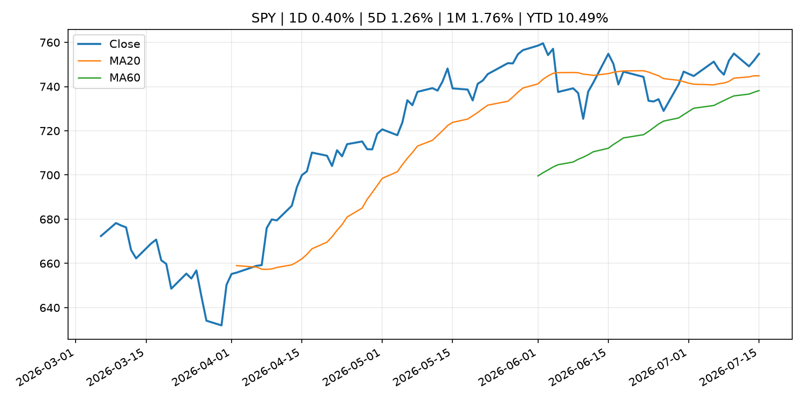
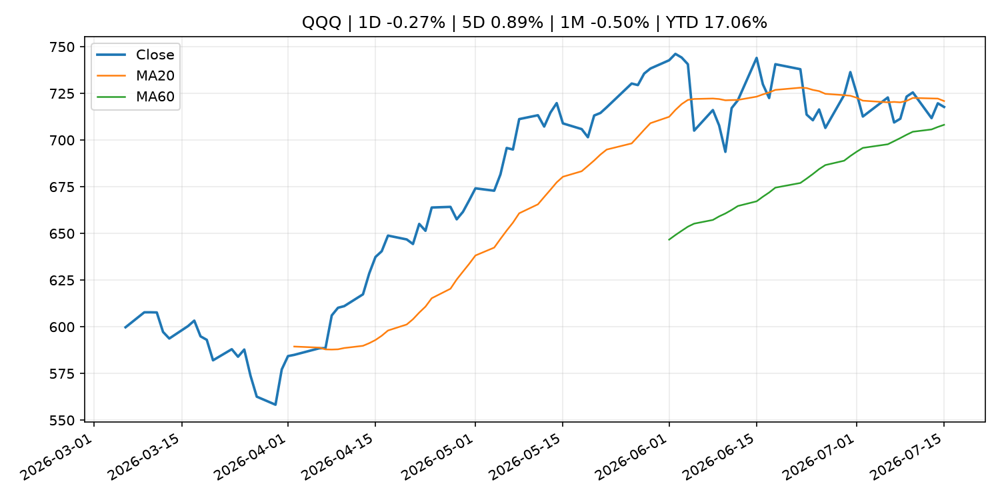
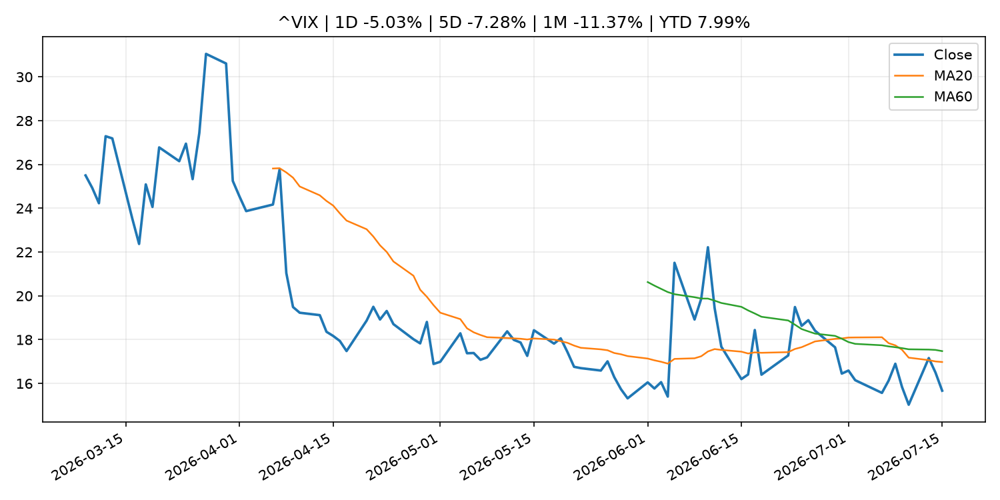
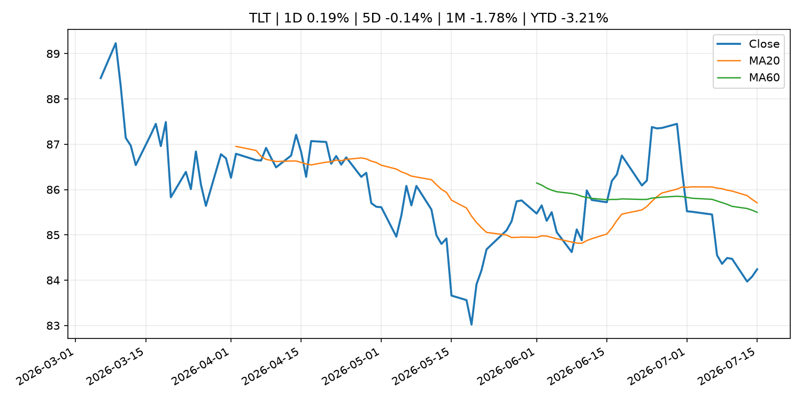
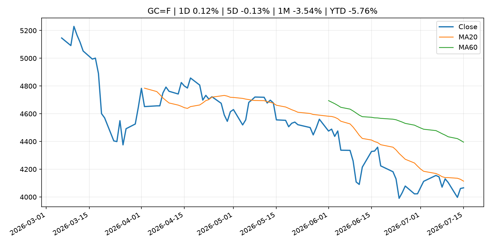
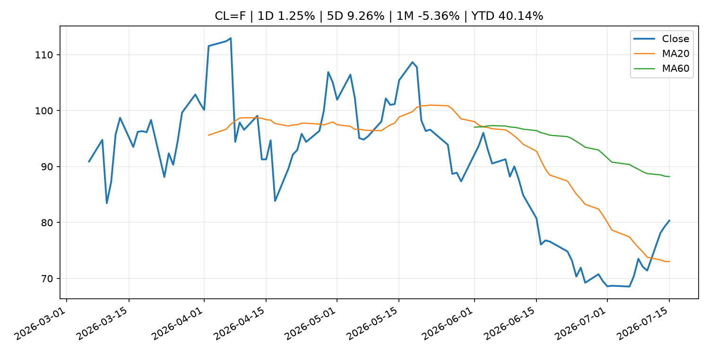
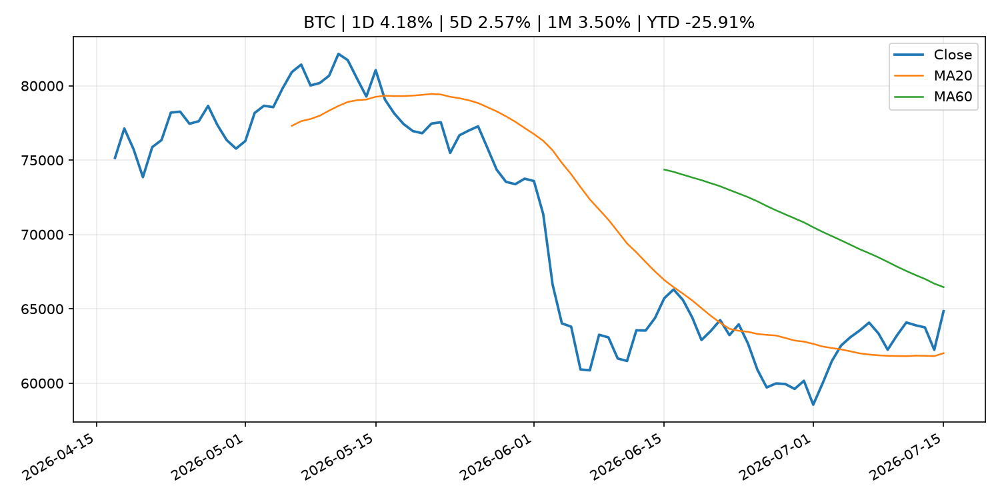
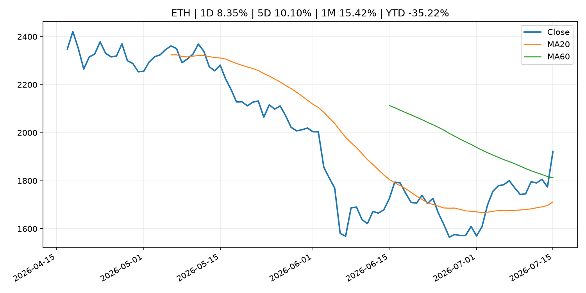
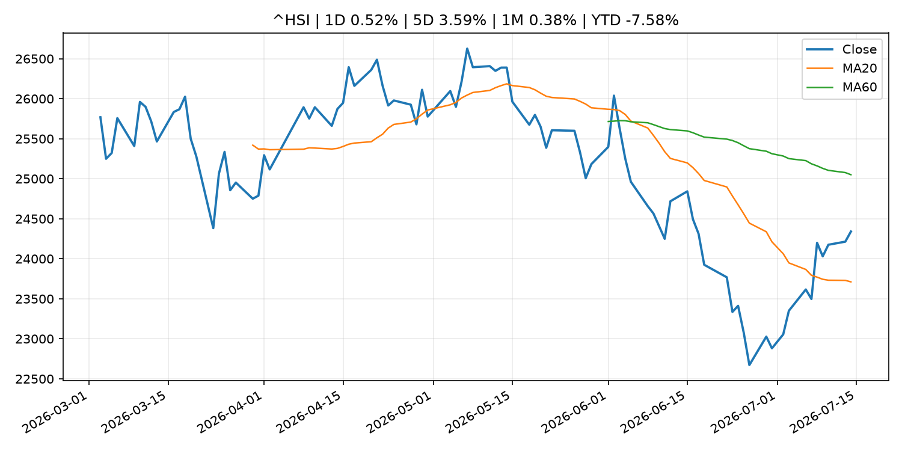

# Global Macro Morning Briefing - 2026-07-16

> Not financial advice / 非投资建议。

## 0. 今日总览
- 市场状态：crypto_specific。BTC/ETH 明显走强但美股平淡，行情更像加密自身事件驱动。
- 今日三大主线：
  1. geopolitical_risk: Crypto steadies as Middle East tensions counter U.S. inflation report boost
  2. fiscal_policy: Warsh pledges Fed policy 'regime change' to rid inflation 'tax' on American people
  3. fiscal_policy: The Clarity Act isn't a ticket to sanctions evasion, actually
- 一句话结论：今日晨报重点关注：地缘风险可能推升避险需求、能源价格和市场波动率。；财政和贸易政策会影响增长、通胀、企业利润和跨境资本流。。跨资产方面，SPY 1D 0.40%；QQQ 1D -0.27%；^VIX 1D -5.03%；TLT 1D 0.19%；GC=F 1D 0.12%；CL=F 1D 1.25%；BTC 1D 4.18%；ETH 1D 8.35%；BTC/ETH 明显走强但美股平淡，行情更像加密自身事件驱动。政策、通胀、利率、美元、美债、能源和加密监管仍是主要观察线索。所有结论仅基于公开数据与短摘要整理，不构成投资建议。

## 1. 隔夜跨资产市场
- 美股：SPY 1D 0.40%，QQQ 1D -0.27%，整体趋势需结合 VIX 和利率确认。
- 美债/美元：TLT 1D 0.19%，美元指数 1D -0.44%，是判断折现率压力的核心线索。
- 黄金/原油：黄金 1D 0.12%，原油 1D 1.25%，用于观察避险、通胀和地缘风险。
- 加密：BTC 1D 4.18%，ETH 1D 8.35%，关注是否独立于纳指走出加密自身行情。
- 港股/A股：恒生 1D 0.52%，沪深300/上证 1D n/a，重点看中国政策预期与人民币线索。
- 风险观察：关注 ETF、监管、稳定币或链上流动性新闻。

### US_EQUITY

| symbol | latest close | 1D | 5D | 1M | YTD | trend |
|---|---:|---:|---:|---:|---:|---|
| SPY | 754.81 | 0.40% | 1.26% | 1.76% | 10.49% | uptrend |
| QQQ | 717.74 | -0.27% | 0.89% | -0.50% | 17.06% | range_bound |
| DIA | 525.95 | 0.24% | 0.61% | 2.51% | 8.75% | uptrend |
| IWM | 295.77 | 0.43% | 0.78% | 0.96% | 18.89% | range_bound |
| VTI | 372.42 | 0.34% | 1.13% | 1.65% | 10.74% | uptrend |

### US_MACRO_MARKET

| symbol | latest close | 1D | 5D | 1M | YTD | trend |
|---|---:|---:|---:|---:|---:|---|
| ^VIX | 15.67 | -5.03% | -7.28% | -11.37% | 7.99% | strong_downtrend |
| DX-Y.NYB | 100.50 | -0.44% | -0.55% | 0.75% | 2.11% | range_bound |
| TLT | 84.24 | 0.19% | -0.14% | -1.78% | -3.21% | range_bound |
| IEF | 93.78 | 0.25% | 0.29% | -0.42% | -2.39% | downtrend |

### COMMODITIES

| symbol | latest close | 1D | 5D | 1M | YTD | trend |
|---|---:|---:|---:|---:|---:|---|
| GC=F | 4,065.80 | 0.12% | -0.13% | -3.54% | -5.76% | downtrend |
| SI=F | 58.12 | -1.11% | -0.08% | -14.35% | -17.63% | downtrend |
| CL=F | 80.33 | 1.25% | 9.26% | -5.36% | 40.14% | range_bound |
| BZ=F | 85.54 | 0.96% | 9.64% | -2.05% | 40.81% | range_bound |
| NG=F | 2.91 | 0.34% | -9.28% | -6.60% | -19.46% | range_bound |
| HG=F | 6.38 | 0.78% | 5.37% | -0.79% | 13.11% | range_bound |

### HK_MARKET

| symbol | latest close | 1D | 5D | 1M | YTD | trend |
|---|---:|---:|---:|---:|---:|---|
| ^HSI | 24,340.73 | 0.52% | 3.59% | 0.38% | -7.58% | range_bound |
| 0700.HK | 474.00 | 3.90% | -1.00% | 2.24% | -23.92% | range_bound |
| 9988.HK | 113.40 | 2.35% | 5.49% | 2.90% | -23.89% | range_bound |
| 3690.HK | 83.40 | 5.30% | 3.09% | 7.06% | -20.27% | range_bound |
| 1810.HK | 25.86 | -0.69% | 2.21% | -1.30% | -35.80% | range_bound |
| 1211.HK | 86.95 | 0.93% | 1.28% | 0.46% | -11.95% | range_bound |

### CRYPTO

| symbol | latest close | 1D | 5D | 1M | YTD | trend |
|---|---:|---:|---:|---:|---:|---|
| BTC | 64,843.91 | 4.18% | 2.57% | 3.50% | -25.91% | range_bound |
| ETH | 1,921.81 | 8.35% | 10.10% | 15.42% | -35.22% | range_bound |
| SOLANA | 77.49 | 3.61% | -0.69% | 11.32% | -37.77% | strong_uptrend |
| BINANCECOIN | 580.65 | 2.47% | 2.15% | 0.55% | -32.73% | range_bound |
| RIPPLE | 1.12 | 4.78% | 2.08% | 0.62% | -39.33% | range_bound |

## 2. 今日最重要的 10 条新闻
### 1. Crypto steadies as Middle East tensions counter U.S. inflation report boost
- 来源：CoinDesk
- 时间：2026-07-15T11:05:49+00:00
- 地区：global
- 事件类型：geopolitical_risk
- 重要性层级：Tier 1
- 一句话摘要：Crypto steadies as Middle East tensions counter U.S. inflation report boost
- 为什么重要：地缘风险可能推升避险需求、能源价格和市场波动率。
- 可能影响：主要影响 DXY，方向为 positive，强度 high；通胀压力可能推高政策利率预期并支撑美元。
  - 资产：DXY
    方向：positive
    强度：high
    原因：通胀压力可能推高政策利率预期并支撑美元。
  - 资产：TLT
    方向：negative
    强度：high
    原因：通胀上行通常推升收益率、压低长债价格。
  - 资产：QQQ
    方向：negative
    强度：high
    原因：更高利率对成长股估值折现率不利。
  - 资产：SPY
    方向：mixed
    强度：medium
    原因：名义增长可能支撑收入，但更高利率压制估值。
  - 资产：GC=F
    方向：mixed
    强度：medium
    原因：通胀对黄金是支撑，但实际利率上行会形成压力。
  - 资产：BTC
    方向：mixed
    强度：medium
    原因：抗通胀叙事和流动性收紧可能相互抵消。
- 原文链接：[https://www.coindesk.com/markets/2026/07/15/crypto-steadies-as-middle-east-tensions-counter-u-s-inflation-report-boost](https://www.coindesk.com/markets/2026/07/15/crypto-steadies-as-middle-east-tensions-counter-u-s-inflation-report-boost)

### 2. Warsh pledges Fed policy 'regime change' to rid inflation 'tax' on American people
- 来源：CNBC Economy
- 时间：2026-07-14T17:29:07+00:00
- 地区：US
- 事件类型：fiscal_policy
- 重要性层级：Tier 1
- 一句话摘要：Warsh pledged Tuesday to "get monetary policy right" and defeat the inflation that has bedeviled the central bank for the past five years.
- 为什么重要：财政和贸易政策会影响增长、通胀、企业利润和跨境资本流。
- 可能影响：主要影响 DXY，方向为 positive，强度 high；通胀压力可能推高政策利率预期并支撑美元。
  - 资产：DXY
    方向：positive
    强度：high
    原因：通胀压力可能推高政策利率预期并支撑美元。
  - 资产：TLT
    方向：negative
    强度：high
    原因：通胀上行通常推升收益率、压低长债价格。
  - 资产：QQQ
    方向：negative
    强度：high
    原因：更高利率对成长股估值折现率不利。
  - 资产：SPY
    方向：mixed
    强度：medium
    原因：名义增长可能支撑收入，但更高利率压制估值。
  - 资产：GC=F
    方向：mixed
    强度：medium
    原因：通胀对黄金是支撑，但实际利率上行会形成压力。
  - 资产：BTC
    方向：mixed
    强度：medium
    原因：抗通胀叙事和流动性收紧可能相互抵消。
- 原文链接：[https://www.cnbc.com/2026/07/14/warsh-promises-inflation-will-be-a-thing-of-the-past-cites-benefits-of-ai-investment-boom.html](https://www.cnbc.com/2026/07/14/warsh-promises-inflation-will-be-a-thing-of-the-past-cites-benefits-of-ai-investment-boom.html)

### 3. The Clarity Act isn't a ticket to sanctions evasion, actually
- 来源：CoinDesk
- 时间：2026-07-14T17:27:48+00:00
- 地区：global
- 事件类型：fiscal_policy
- 重要性层级：Tier 1
- 一句话摘要：The Clarity Act isn't a ticket to sanctions evasion, actually
- 为什么重要：财政和贸易政策会影响增长、通胀、企业利润和跨境资本流。
- 可能影响：可能影响利率、汇率、风险资产或大宗商品预期，但当前公开信息不足以判断明确方向。
  - 资产：暂无明确资产映射
  - 方向：unknown
  - 强度：low
  - 原因：公开信息不足以判断方向。
- 原文链接：[https://www.coindesk.com/opinion/2026/07/14/the-clarity-act-isn-t-a-ticket-to-sanctions-evasion-actually](https://www.coindesk.com/opinion/2026/07/14/the-clarity-act-isn-t-a-ticket-to-sanctions-evasion-actually)

### 4. New York Fed President Williams says inflation has peaked, rates 'well positioned'
- 来源：CNBC Economy
- 时间：2026-07-15T17:31:41+00:00
- 地区：US
- 事件类型：central_bank_speech
- 重要性层级：Tier 2
- 一句话摘要：Williams cited five reasons why he expects the latest price surge has run its course.
- 为什么重要：央行官员表态可能影响市场对下一次会议的定价。
- 可能影响：主要影响 DXY，方向为 positive，强度 high；通胀压力可能推高政策利率预期并支撑美元。
  - 资产：DXY
    方向：positive
    强度：high
    原因：通胀压力可能推高政策利率预期并支撑美元。
  - 资产：TLT
    方向：negative
    强度：high
    原因：通胀上行通常推升收益率、压低长债价格。
  - 资产：QQQ
    方向：negative
    强度：high
    原因：更高利率对成长股估值折现率不利。
  - 资产：SPY
    方向：mixed
    强度：medium
    原因：名义增长可能支撑收入，但更高利率压制估值。
  - 资产：GC=F
    方向：mixed
    强度：medium
    原因：通胀对黄金是支撑，但实际利率上行会形成压力。
  - 资产：BTC
    方向：mixed
    强度：medium
    原因：抗通胀叙事和流动性收紧可能相互抵消。
- 原文链接：[https://www.cnbc.com/2026/07/15/new-york-fed-president-williams-says-inflation-has-peaked-rates-well-positioned.html](https://www.cnbc.com/2026/07/15/new-york-fed-president-williams-says-inflation-has-peaked-rates-well-positioned.html)

### 5. Watch: Fed Chairman Kevin Warsh testifies to House Financial Services committee
- 来源：CNBC Economy
- 时间：2026-07-14T17:26:37+00:00
- 地区：US
- 事件类型：central_bank_speech
- 重要性层级：Tier 2
- 一句话摘要：In remarks prepared for the appearance, Warsh promised a vigilant fight to return inflation to the Fed's 2% target.
- 为什么重要：央行官员表态可能影响市场对下一次会议的定价。
- 可能影响：主要影响 DXY，方向为 positive，强度 high；通胀压力可能推高政策利率预期并支撑美元。
  - 资产：DXY
    方向：positive
    强度：high
    原因：通胀压力可能推高政策利率预期并支撑美元。
  - 资产：TLT
    方向：negative
    强度：high
    原因：通胀上行通常推升收益率、压低长债价格。
  - 资产：QQQ
    方向：negative
    强度：high
    原因：更高利率对成长股估值折现率不利。
  - 资产：SPY
    方向：mixed
    强度：medium
    原因：名义增长可能支撑收入，但更高利率压制估值。
  - 资产：GC=F
    方向：mixed
    强度：medium
    原因：通胀对黄金是支撑，但实际利率上行会形成压力。
  - 资产：BTC
    方向：mixed
    强度：medium
    原因：抗通胀叙事和流动性收紧可能相互抵消。
- 原文链接：[https://www.cnbc.com/2026/07/14/watch-fed-chairman-kevin-warsh-testify-live-to-house-financial-services-committee.html](https://www.cnbc.com/2026/07/14/watch-fed-chairman-kevin-warsh-testify-live-to-house-financial-services-committee.html)

### 6. You are missing the bond deal of the decade — and it is guaranteed to beat inflation
- 来源：MarketWatch Top Stories
- 时间：2026-07-15T22:21:00+00:00
- 地区：US
- 事件类型：other
- 重要性层级：Tier 3
- 一句话摘要：TIPS are offering a rare gift — and it is time to lock in a generous payout.
- 为什么重要：这条信息暂未匹配到重大宏观、政策或市场事件，更适合作为背景跟踪。
- 可能影响：主要影响 DXY，方向为 positive，强度 high；通胀压力可能推高政策利率预期并支撑美元。
  - 资产：DXY
    方向：positive
    强度：high
    原因：通胀压力可能推高政策利率预期并支撑美元。
  - 资产：TLT
    方向：negative
    强度：high
    原因：通胀上行通常推升收益率、压低长债价格。
  - 资产：QQQ
    方向：negative
    强度：high
    原因：更高利率对成长股估值折现率不利。
  - 资产：SPY
    方向：mixed
    强度：medium
    原因：名义增长可能支撑收入，但更高利率压制估值。
  - 资产：GC=F
    方向：mixed
    强度：medium
    原因：通胀对黄金是支撑，但实际利率上行会形成压力。
  - 资产：BTC
    方向：mixed
    强度：medium
    原因：抗通胀叙事和流动性收紧可能相互抵消。
- 原文链接：[https://www.marketwatch.com/story/you-are-missing-the-bond-deal-of-the-decade-and-it-is-guaranteed-to-beat-inflation-0f1d6cf8?mod=mw_rss_topstories](https://www.marketwatch.com/story/you-are-missing-the-bond-deal-of-the-decade-and-it-is-guaranteed-to-beat-inflation-0f1d6cf8?mod=mw_rss_topstories)

### 7. Bitcoin rally cools as investors digest inflation data, oil clouds outlook
- 来源：CoinDesk
- 时间：2026-07-15T11:46:06+00:00
- 地区：global
- 事件类型：other
- 重要性层级：Tier 3
- 一句话摘要：Bitcoin rally cools as investors digest inflation data, oil clouds outlook
- 为什么重要：这条信息暂未匹配到重大宏观、政策或市场事件，更适合作为背景跟踪。
- 可能影响：主要影响 QQQ，方向为 positive，强度 high；通胀低于预期通常压低利率预期，有利于久期较长的成长股。
  - 资产：QQQ
    方向：positive
    强度：high
    原因：通胀低于预期通常压低利率预期，有利于久期较长的成长股。
  - 资产：SPY
    方向：positive
    强度：medium
    原因：通胀降温改善软着陆预期，对宽基股指偏正面。
  - 资产：TLT
    方向：positive
    强度：high
    原因：降息预期升温时长债价格通常受益。
  - 资产：DXY
    方向：positive
    强度：high
    原因：通胀压力可能推高政策利率预期并支撑美元。
  - 资产：GC=F
    方向：positive
    强度：medium
    原因：实际利率压力下降时黄金通常受益。
  - 资产：BTC
    方向：positive
    强度：medium
    原因：流动性预期改善通常支持高 beta 加密资产。
- 原文链接：[https://www.coindesk.com/daybook-us/2026/07/15/bitcoin-rally-cools-as-investors-digest-inflation-data-oil-clouds-outlook](https://www.coindesk.com/daybook-us/2026/07/15/bitcoin-rally-cools-as-investors-digest-inflation-data-oil-clouds-outlook)

## 3. 政策与央行观察
### 1. Warsh pledges Fed policy 'regime change' to rid inflation 'tax' on American people
- 来源：CNBC Economy
- 时间：2026-07-14T17:29:07+00:00
- 地区：US
- 事件类型：fiscal_policy
- 重要性层级：Tier 1
- 一句话摘要：Warsh pledged Tuesday to "get monetary policy right" and defeat the inflation that has bedeviled the central bank for the past five years.
- 为什么重要：财政和贸易政策会影响增长、通胀、企业利润和跨境资本流。
- 可能影响：主要影响 DXY，方向为 positive，强度 high；通胀压力可能推高政策利率预期并支撑美元。
  - 资产：DXY
    方向：positive
    强度：high
    原因：通胀压力可能推高政策利率预期并支撑美元。
  - 资产：TLT
    方向：negative
    强度：high
    原因：通胀上行通常推升收益率、压低长债价格。
  - 资产：QQQ
    方向：negative
    强度：high
    原因：更高利率对成长股估值折现率不利。
  - 资产：SPY
    方向：mixed
    强度：medium
    原因：名义增长可能支撑收入，但更高利率压制估值。
  - 资产：GC=F
    方向：mixed
    强度：medium
    原因：通胀对黄金是支撑，但实际利率上行会形成压力。
  - 资产：BTC
    方向：mixed
    强度：medium
    原因：抗通胀叙事和流动性收紧可能相互抵消。
- 原文链接：[https://www.cnbc.com/2026/07/14/warsh-promises-inflation-will-be-a-thing-of-the-past-cites-benefits-of-ai-investment-boom.html](https://www.cnbc.com/2026/07/14/warsh-promises-inflation-will-be-a-thing-of-the-past-cites-benefits-of-ai-investment-boom.html)

### 2. The Clarity Act isn't a ticket to sanctions evasion, actually
- 来源：CoinDesk
- 时间：2026-07-14T17:27:48+00:00
- 地区：global
- 事件类型：fiscal_policy
- 重要性层级：Tier 1
- 一句话摘要：The Clarity Act isn't a ticket to sanctions evasion, actually
- 为什么重要：财政和贸易政策会影响增长、通胀、企业利润和跨境资本流。
- 可能影响：可能影响利率、汇率、风险资产或大宗商品预期，但当前公开信息不足以判断明确方向。
  - 资产：暂无明确资产映射
  - 方向：unknown
  - 强度：low
  - 原因：公开信息不足以判断方向。
- 原文链接：[https://www.coindesk.com/opinion/2026/07/14/the-clarity-act-isn-t-a-ticket-to-sanctions-evasion-actually](https://www.coindesk.com/opinion/2026/07/14/the-clarity-act-isn-t-a-ticket-to-sanctions-evasion-actually)

### 3. New York Fed President Williams says inflation has peaked, rates 'well positioned'
- 来源：CNBC Economy
- 时间：2026-07-15T17:31:41+00:00
- 地区：US
- 事件类型：central_bank_speech
- 重要性层级：Tier 2
- 一句话摘要：Williams cited five reasons why he expects the latest price surge has run its course.
- 为什么重要：央行官员表态可能影响市场对下一次会议的定价。
- 可能影响：主要影响 DXY，方向为 positive，强度 high；通胀压力可能推高政策利率预期并支撑美元。
  - 资产：DXY
    方向：positive
    强度：high
    原因：通胀压力可能推高政策利率预期并支撑美元。
  - 资产：TLT
    方向：negative
    强度：high
    原因：通胀上行通常推升收益率、压低长债价格。
  - 资产：QQQ
    方向：negative
    强度：high
    原因：更高利率对成长股估值折现率不利。
  - 资产：SPY
    方向：mixed
    强度：medium
    原因：名义增长可能支撑收入，但更高利率压制估值。
  - 资产：GC=F
    方向：mixed
    强度：medium
    原因：通胀对黄金是支撑，但实际利率上行会形成压力。
  - 资产：BTC
    方向：mixed
    强度：medium
    原因：抗通胀叙事和流动性收紧可能相互抵消。
- 原文链接：[https://www.cnbc.com/2026/07/15/new-york-fed-president-williams-says-inflation-has-peaked-rates-well-positioned.html](https://www.cnbc.com/2026/07/15/new-york-fed-president-williams-says-inflation-has-peaked-rates-well-positioned.html)

### 4. Watch: Fed Chairman Kevin Warsh testifies to House Financial Services committee
- 来源：CNBC Economy
- 时间：2026-07-14T17:26:37+00:00
- 地区：US
- 事件类型：central_bank_speech
- 重要性层级：Tier 2
- 一句话摘要：In remarks prepared for the appearance, Warsh promised a vigilant fight to return inflation to the Fed's 2% target.
- 为什么重要：央行官员表态可能影响市场对下一次会议的定价。
- 可能影响：主要影响 DXY，方向为 positive，强度 high；通胀压力可能推高政策利率预期并支撑美元。
  - 资产：DXY
    方向：positive
    强度：high
    原因：通胀压力可能推高政策利率预期并支撑美元。
  - 资产：TLT
    方向：negative
    强度：high
    原因：通胀上行通常推升收益率、压低长债价格。
  - 资产：QQQ
    方向：negative
    强度：high
    原因：更高利率对成长股估值折现率不利。
  - 资产：SPY
    方向：mixed
    强度：medium
    原因：名义增长可能支撑收入，但更高利率压制估值。
  - 资产：GC=F
    方向：mixed
    强度：medium
    原因：通胀对黄金是支撑，但实际利率上行会形成压力。
  - 资产：BTC
    方向：mixed
    强度：medium
    原因：抗通胀叙事和流动性收紧可能相互抵消。
- 原文链接：[https://www.cnbc.com/2026/07/14/watch-fed-chairman-kevin-warsh-testify-live-to-house-financial-services-committee.html](https://www.cnbc.com/2026/07/14/watch-fed-chairman-kevin-warsh-testify-live-to-house-financial-services-committee.html)

## 4. 市场异动与图表
- VIX 下跌 -5.03%
- DXY 下跌 -0.44%
- Oil 上涨 1.25%
- BTC 上涨 4.18%
- ETH 上涨 8.35%

### SPY

### QQQ

### ^VIX

### TLT

### GC=F

### CL=F

### BTC

### ETH

### ^HSI

## 5. 华尔街与机构公开观点
- 暂无可靠公开观点。

## 6. 今日重点关注
- 经济数据：经济数据：暂无可靠公开日历数据；如配置经济日历源后可自动填充。
- 央行讲话：央行讲话：暂无可靠公开日历数据；重点跟踪 Fed、ECB、BoJ、PBOC 官网 RSS。
- 财报：财报：暂无可靠数据。
- 政策事件：政策事件：暂无可靠数据。
- 风险提醒：风险提醒：关注数据源失败项、突发地缘风险、利率和美元的二阶反应。

## 7. 英文金融表达与宏观概念
- **inflation expectations**：通胀预期，指家庭、企业或市场对未来通胀的预估。 例句：Inflation expectations can shape wage bargaining and bond yields.
- **real yield**：实际收益率，名义利率扣除通胀预期后的收益率。 例句：Gold often reacts more to real yields than nominal yields.
- **risk-off**：避险模式，资金偏向美元、国债、黄金等防御资产。 例句：A geopolitical shock can push markets into risk-off mode.
- **supply disruption**：供给扰动，通常指能源或商品供应受冲突、减产或天气影响。 例句：Supply disruption can lift oil prices and inflation expectations.
- **terminal rate**：终端利率，市场预期本轮加息周期的最高政策利率。 例句：A higher terminal rate can pressure growth stocks.
- **soft landing**：软着陆，指通胀回落而经济避免明显衰退。 例句：Markets often rally when data support a soft landing.

## 8. 背景材料
- [Your Netflix bill is up 29% in just over a year. It’s time for Washington to step in.](https://www.marketwatch.com/story/your-monthly-netflix-bill-is-up-29-in-just-over-a-year-critics-say-washington-needs-to-fix-it-bcab6e5b?mod=mw_rss_topstories)（MarketWatch Top Stories，other）：Netflix is still a Wall Street favorite — and a target for government regulators
- [You are missing the bond deal of the decade — and it is guaranteed to beat inflation](https://www.marketwatch.com/story/you-are-missing-the-bond-deal-of-the-decade-and-it-is-guaranteed-to-beat-inflation-0f1d6cf8?mod=mw_rss_topstories)（MarketWatch Top Stories，other）：TIPS are offering a rare gift — and it is time to lock in a generous payout.
- [This powerful stock-market momentum trade has hit a wall after seeing biggest unwind since 2001](https://www.marketwatch.com/story/this-powerful-stock-market-momentum-trade-has-hit-a-wall-after-seeing-biggest-unwind-since-2001-52ad4151?mod=mw_rss_topstories)（MarketWatch Top Stories，other）：So far, the selloff hasn’t done much to dent the S&P 500, as other stocks and sectors have picked up the slack
- [The AI boom just found two new winners: Goldman Sachs and JPMorgan Chase](https://www.cnbc.com/2026/07/14/goldman-sachs-and-jpmorgan-chase-are-emerging-as-ai-winners.html)（CNBC Economy，other）：Goldman Sachs and JPMorgan showed that Wall Street is a major beneficiary of the AI boom, with record revenue driven by surging trading and investment banking.
- [DTCC moves tokenized securities into live trading, marking a milestone for Wall Street's blockchain push](https://www.coindesk.com/business/2026/07/15/dtcc-moves-tokenized-securities-into-live-trading-marking-a-milestone-for-wall-street-s-blockchain-push)（CoinDesk，other）：DTCC moves tokenized securities into live trading, marking a milestone for Wall Street's blockchain push
- [Cantor and Securitize collaborate on blockchain-based IPOs](https://www.coindesk.com/business/2026/07/15/cantor-and-securitize-collaborate-on-blockchain-based-ipos)（CoinDesk，other）：Cantor and Securitize collaborate on blockchain-based IPOs
- [Morgan Stanley posts record quarterly revenue and profit as equities trading surges 69%](https://www.cnbc.com/2026/07/15/morgan-stanley-ms-earnings-q2-2026-.html)（CNBC Economy，other）：Like at peers Goldman Sachs and JPMorgan Chase, a massive beat in equities trading drove the quarter's outsized results.
- [Strategy feels 'very secure' until bitcoin reaches $8,000-$10,000, says CEO](https://www.coindesk.com/markets/2026/07/15/strategy-feels-very-secure-until-bitcoin-reaches-usd8-000-usd10-000-says-ceo)（CoinDesk，other）：Strategy feels 'very secure' until bitcoin reaches $8,000-$10,000, says CEO
- [Bitcoin rally cools as investors digest inflation data, oil clouds outlook](https://www.coindesk.com/daybook-us/2026/07/15/bitcoin-rally-cools-as-investors-digest-inflation-data-oil-clouds-outlook)（CoinDesk，other）：Bitcoin rally cools as investors digest inflation data, oil clouds outlook
- [Live updates: Bitcoin rises near $65,000 as markets get more good inflation news](https://www.coindesk.com/tech/2026/07/15/live-markets-bitcoin-ether-etfs-draw-inflows-as-majors-rise-as-much-as-5)（CoinDesk，other）：Live updates: Bitcoin rises near $65,000 as markets get more good inflation news
- [Piero Cipollone: Interview with Ouest-France](https://www.ecb.europa.eu//press/inter/date/2026/html/ecb.in260715~ab95a43007.en.html)（ECB Press Releases，other）：Piero Cipollone: Interview with Ouest-France
- [Bitcoin nears $65,000 as cooling U.S. inflation guts the Fed rate-hike trade](https://www.coindesk.com/markets/2026/07/15/bitcoin-tops-usd64-000-as-cooling-u-s-inflation-guts-the-fed-rate-hike-trade)（CoinDesk，other）：Bitcoin nears $65,000 as cooling U.S. inflation guts the Fed rate-hike trade
- [Minutes of the Board's discount rate meetings on June 8 and June 17, 2026](https://www.federalreserve.gov/newsevents/pressreleases/monetary20260714a.htm)（Federal Reserve Press Releases，other）：Minutes of the Board's discount rate meetings on June 8 and June 17, 2026
- [Binance bets on becoming a crypto 'super app' as stablecoins reshape growth](https://www.coindesk.com/business/2026/07/14/binance-bets-on-becoming-a-crypto-super-app-as-stablecoins-reshape-growth)（CoinDesk，other）：Binance bets on becoming a crypto 'super app' as stablecoins reshape growth
- [ECB selects 36 payment service providers to join digital euro pilot](https://www.ecb.europa.eu//press/pr/date/2026/html/ecb.pr260714~8cd07d9d45.en.html)（ECB Press Releases，other）：ECB selects 36 payment service providers to join digital euro pilot
- [Japanese Government Bonds Held by the Bank of Japan](http://www.boj.or.jp/en/statistics/boj/other/mei/release/2026/mei260710.xlsx)（Bank of Japan Announcements，other）：Japanese Government Bonds Held by the Bank of Japan
- [Bank of Japan Accounts (July 10)](http://www.boj.or.jp/en/statistics/boj/other/acmai/release/2026/ac260710.htm)（Bank of Japan Announcements，routine_announcement）：Bank of Japan Accounts (July 10)

## 9. 数据源、失败项与免责声明
- 采集时间：2026-07-15T22:57:54
- 数据源：公开 RSS、Yahoo Finance、CoinGecko、AKShare、FRED、SEC data.sec.gov，以及用户自有 inputs/reports 文件。
- 合规说明：不绕过 WSJ、Bloomberg、FT、Reuters 等付费墙；对付费媒体只使用公开 RSS 标题、摘要、链接和发布时间。
- 免责声明：Not financial advice / 非投资建议。本项目仅供个人学习、研究和信息整理，不构成投资建议、交易建议或任何收益承诺。
- 失败或跳过的数据源：
  - crypto data failed coin=dogecoin
  - China market data failed symbol=上证指数: empty dataframe
  - China market data failed symbol=深证成指: empty dataframe
  - China market data failed symbol=创业板指: empty dataframe
  - China market data failed symbol=沪深300: empty dataframe
  - China market data failed symbol=中证500: empty dataframe
  - China market data failed symbol=科创50: empty dataframe
  - FRED_API_KEY not set; skipping FRED macro series
  - SEC failed cik=0000320193
  - SEC failed cik=0000789019
  - SEC failed cik=0001045810
  - SEC failed cik=0001318605
  - SEC failed cik=0001577552
