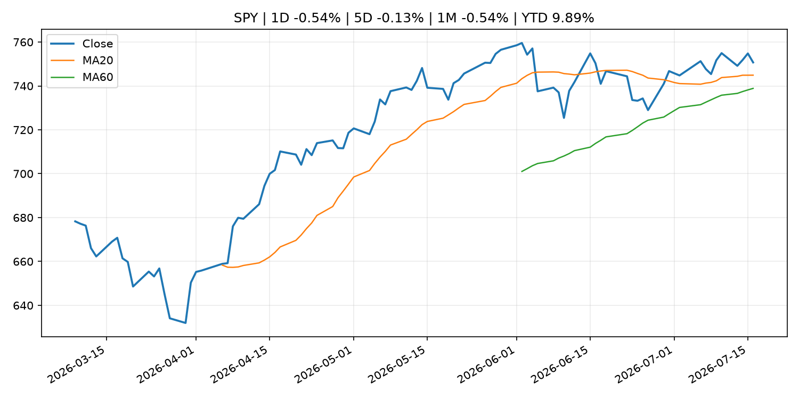
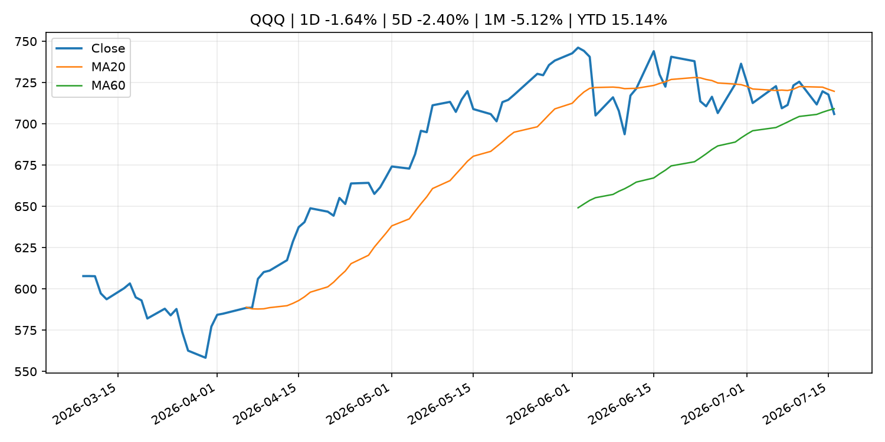
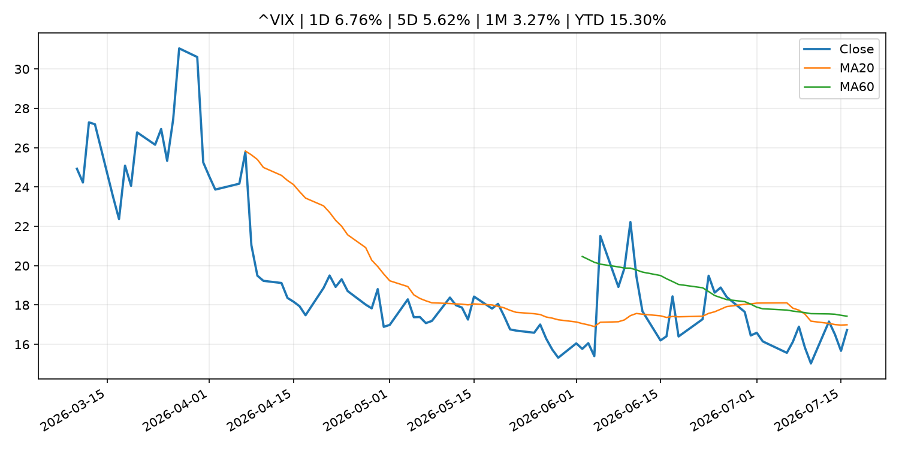
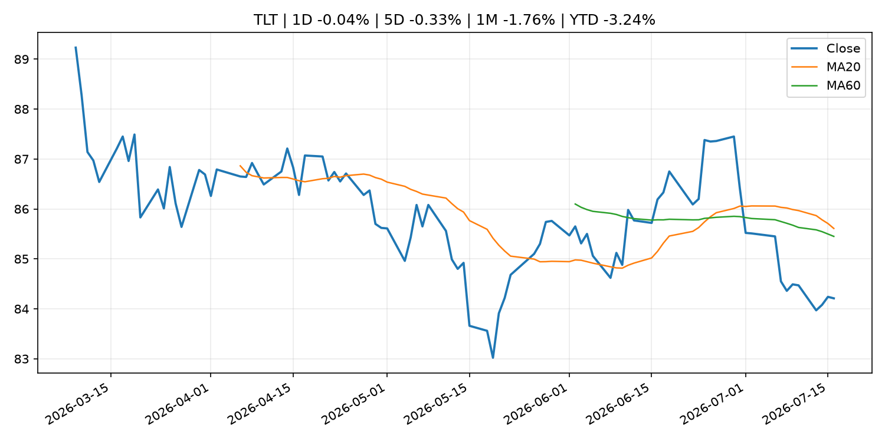
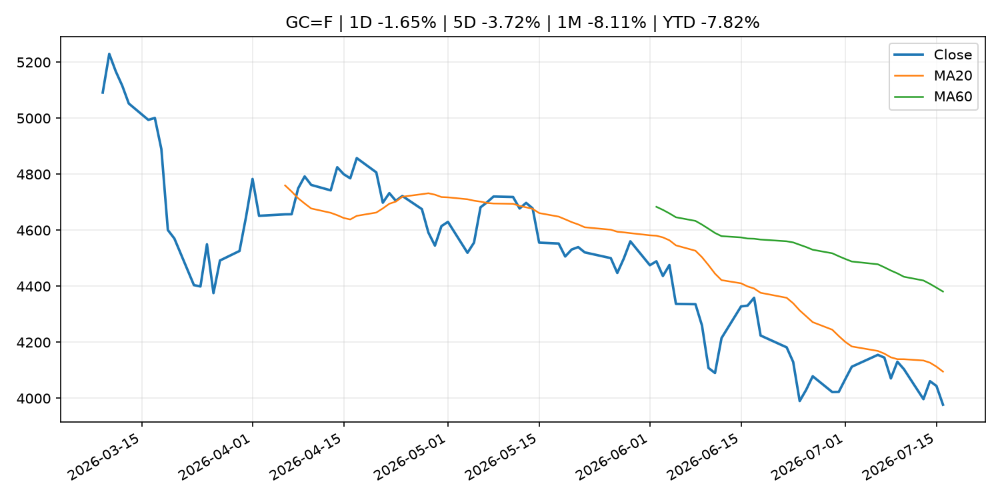
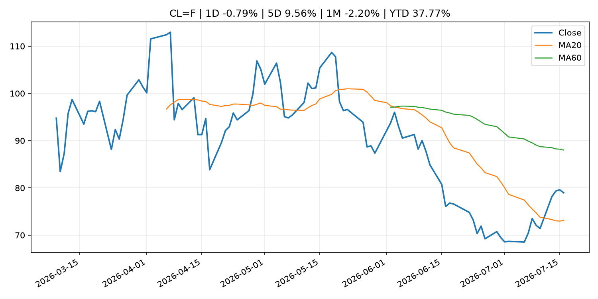
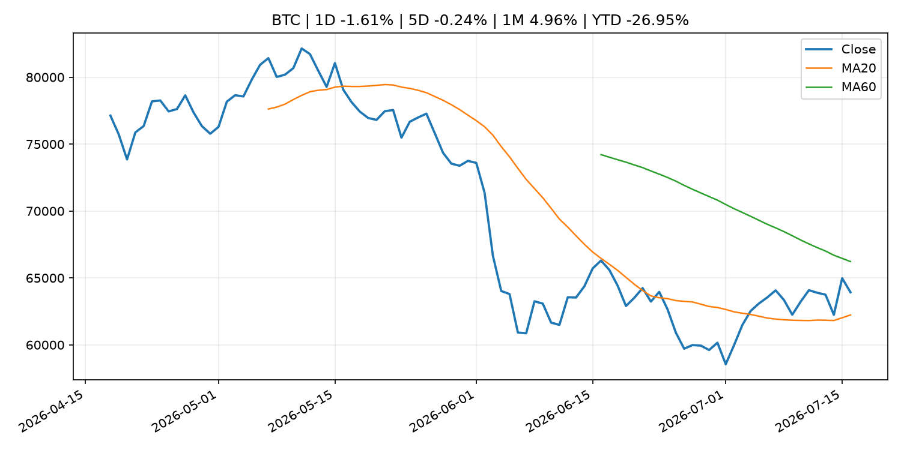
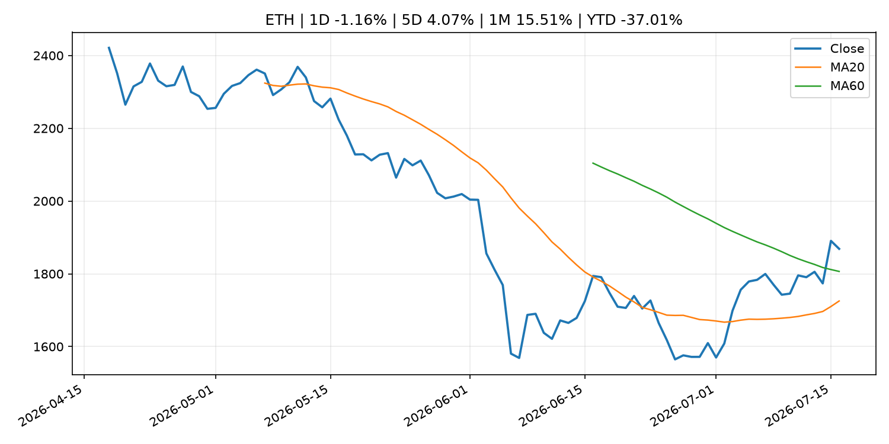
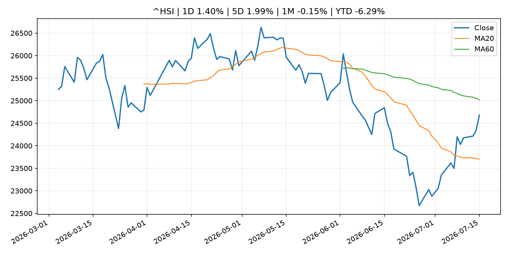

# Global Macro Morning Briefing - 2026-07-17

> Not financial advice / 非投资建议。

## 0. 今日总览
- 市场状态：unknown。市场信号不足，暂不判断明确状态。
- 今日三大主线：
  1. fiscal_policy: U.S. adds four Iran central bank crypto wallets to sanctions, Tether freezes $131 million of contents
  2. central_bank_speech: Dallas Fed President Logan calls for 'modestly' higher interest rates
  3. central_bank_speech: New York Fed President Williams says inflation has peaked, rates 'well positioned'
- 一句话结论：今日晨报重点关注：财政和贸易政策会影响增长、通胀、企业利润和跨境资本流。；央行官员表态可能影响市场对下一次会议的定价。。跨资产方面，SPY 1D -0.54%；QQQ 1D -1.64%；^VIX 1D 6.76%；TLT 1D -0.04%；GC=F 1D -1.65%；CL=F 1D -0.79%；BTC 1D -1.61%；ETH 1D -1.16%；市场信号不足，暂不判断明确状态。政策、通胀、利率、美元、美债、能源和加密监管仍是主要观察线索。所有结论仅基于公开数据与短摘要整理，不构成投资建议。

## 1. 隔夜跨资产市场
- 美股：SPY 1D -0.54%，QQQ 1D -1.64%，整体趋势需结合 VIX 和利率确认。
- 美债/美元：TLT 1D -0.04%，美元指数 1D 0.21%，是判断折现率压力的核心线索。
- 黄金/原油：黄金 1D -1.65%，原油 1D -0.79%，用于观察避险、通胀和地缘风险。
- 加密：BTC 1D -1.61%，ETH 1D -1.16%，关注是否独立于纳指走出加密自身行情。
- 港股/A股：恒生 1D 1.40%，沪深300/上证 1D n/a，重点看中国政策预期与人民币线索。
- 风险观察：关注后续数据是否确认当前跨资产信号。

### US_EQUITY

| symbol | latest close | 1D | 5D | 1M | YTD | trend |
|---|---:|---:|---:|---:|---:|---|
| SPY | 750.72 | -0.54% | -0.13% | -0.54% | 9.89% | uptrend |
| QQQ | 705.94 | -1.64% | -2.40% | -5.12% | 15.14% | range_bound |
| DIA | 524.83 | -0.21% | 0.12% | 1.23% | 8.52% | uptrend |
| IWM | 295.59 | -0.06% | -0.56% | 0.32% | 18.82% | range_bound |
| VTI | 370.58 | -0.49% | -0.23% | -0.52% | 10.19% | uptrend |

### US_MACRO_MARKET

| symbol | latest close | 1D | 5D | 1M | YTD | trend |
|---|---:|---:|---:|---:|---:|---|
| ^VIX | 16.73 | 6.76% | 5.62% | 3.27% | 15.30% | downtrend |
| DX-Y.NYB | 100.71 | 0.21% | -0.23% | 1.08% | 2.32% | range_bound |
| TLT | 84.21 | -0.04% | -0.33% | -1.76% | -3.24% | range_bound |
| IEF | 93.72 | -0.06% | 0.01% | -0.59% | -2.46% | downtrend |

### COMMODITIES

| symbol | latest close | 1D | 5D | 1M | YTD | trend |
|---|---:|---:|---:|---:|---:|---|
| GC=F | 3,977.10 | -1.65% | -3.72% | -8.11% | -7.82% | downtrend |
| SI=F | 55.73 | -2.42% | -7.70% | -20.46% | -21.01% | strong_downtrend |
| CL=F | 78.97 | -0.79% | 9.56% | -2.20% | 37.77% | range_bound |
| BZ=F | 84.93 | -0.02% | 11.31% | 2.12% | 39.80% | range_bound |
| NG=F | 2.90 | -0.92% | -3.82% | -7.94% | -19.93% | range_bound |
| HG=F | 6.29 | -0.13% | 1.13% | -3.04% | 11.45% | range_bound |

### HK_MARKET

| symbol | latest close | 1D | 5D | 1M | YTD | trend |
|---|---:|---:|---:|---:|---:|---|
| ^HSI | 24,681.10 | 1.40% | 1.99% | -0.15% | -6.29% | range_bound |
| 0700.HK | 484.00 | 2.11% | 3.07% | 5.31% | -22.31% | range_bound |
| 9988.HK | 116.90 | 3.09% | 8.24% | 6.95% | -21.54% | range_bound |
| 3690.HK | 87.20 | 4.56% | 11.08% | 11.44% | -16.63% | range_bound |
| 1810.HK | 27.50 | 6.34% | 10.00% | 4.72% | -31.73% | range_bound |
| 1211.HK | 90.95 | 4.60% | 10.04% | 6.25% | -7.90% | range_bound |

### CRYPTO

| symbol | latest close | 1D | 5D | 1M | YTD | trend |
|---|---:|---:|---:|---:|---:|---|
| BTC | 63,930.10 | -1.61% | -0.24% | 4.96% | -26.95% | range_bound |
| ETH | 1,868.63 | -1.16% | 4.07% | 15.51% | -37.01% | range_bound |
| SOLANA | 75.44 | -2.95% | -3.33% | 11.12% | -39.41% | range_bound |
| BINANCECOIN | 573.73 | -1.40% | -0.20% | 1.83% | -33.53% | range_bound |
| RIPPLE | 1.09 | -1.96% | -1.28% | 1.68% | -40.76% | downtrend |

## 2. 今日最重要的 10 条新闻
### 1. U.S. adds four Iran central bank crypto wallets to sanctions, Tether freezes $131 million of contents
- 来源：CoinDesk
- 时间：2026-07-16T10:07:06+00:00
- 地区：global
- 事件类型：fiscal_policy
- 重要性层级：Tier 1
- 一句话摘要：U.S. adds four Iran central bank crypto wallets to sanctions, Tether freezes $131 million of contents
- 为什么重要：财政和贸易政策会影响增长、通胀、企业利润和跨境资本流。
- 可能影响：可能影响利率、汇率、风险资产或大宗商品预期，但当前公开信息不足以判断明确方向。
  - 资产：暂无明确资产映射
  - 方向：unknown
  - 强度：low
  - 原因：公开信息不足以判断方向。
- 原文链接：[https://www.coindesk.com/business/2026/07/16/u-s-adds-four-iran-central-bank-crypto-wallets-to-sanctions-tether-freezes-usd131-million-of-contents](https://www.coindesk.com/business/2026/07/16/u-s-adds-four-iran-central-bank-crypto-wallets-to-sanctions-tether-freezes-usd131-million-of-contents)

### 2. Dallas Fed President Logan calls for 'modestly' higher interest rates
- 来源：CNBC Economy
- 时间：2026-07-16T18:50:42+00:00
- 地区：US
- 事件类型：central_bank_speech
- 重要性层级：Tier 2
- 一句话摘要：The policymaker said this week's good inflation news wasn't good enough.
- 为什么重要：央行官员表态可能影响市场对下一次会议的定价。
- 可能影响：主要影响 DXY，方向为 positive，强度 high；通胀压力可能推高政策利率预期并支撑美元。
  - 资产：DXY
    方向：positive
    强度：high
    原因：通胀压力可能推高政策利率预期并支撑美元。
  - 资产：TLT
    方向：negative
    强度：high
    原因：通胀上行通常推升收益率、压低长债价格。
  - 资产：QQQ
    方向：negative
    强度：high
    原因：更高利率对成长股估值折现率不利。
  - 资产：SPY
    方向：mixed
    强度：medium
    原因：名义增长可能支撑收入，但更高利率压制估值。
  - 资产：GC=F
    方向：mixed
    强度：medium
    原因：通胀对黄金是支撑，但实际利率上行会形成压力。
  - 资产：BTC
    方向：mixed
    强度：medium
    原因：抗通胀叙事和流动性收紧可能相互抵消。
- 原文链接：[https://www.cnbc.com/2026/07/16/dallas-fed-president-logan-calls-for-modestly-higher-interest-rates.html](https://www.cnbc.com/2026/07/16/dallas-fed-president-logan-calls-for-modestly-higher-interest-rates.html)

### 3. New York Fed President Williams says inflation has peaked, rates 'well positioned'
- 来源：CNBC Economy
- 时间：2026-07-15T17:31:41+00:00
- 地区：US
- 事件类型：central_bank_speech
- 重要性层级：Tier 2
- 一句话摘要：Williams cited five reasons why he expects the latest price surge has run its course.
- 为什么重要：央行官员表态可能影响市场对下一次会议的定价。
- 可能影响：主要影响 DXY，方向为 positive，强度 high；通胀压力可能推高政策利率预期并支撑美元。
  - 资产：DXY
    方向：positive
    强度：high
    原因：通胀压力可能推高政策利率预期并支撑美元。
  - 资产：TLT
    方向：negative
    强度：high
    原因：通胀上行通常推升收益率、压低长债价格。
  - 资产：QQQ
    方向：negative
    强度：high
    原因：更高利率对成长股估值折现率不利。
  - 资产：SPY
    方向：mixed
    强度：medium
    原因：名义增长可能支撑收入，但更高利率压制估值。
  - 资产：GC=F
    方向：mixed
    强度：medium
    原因：通胀对黄金是支撑，但实际利率上行会形成压力。
  - 资产：BTC
    方向：mixed
    强度：medium
    原因：抗通胀叙事和流动性收紧可能相互抵消。
- 原文链接：[https://www.cnbc.com/2026/07/15/new-york-fed-president-williams-says-inflation-has-peaked-rates-well-positioned.html](https://www.cnbc.com/2026/07/15/new-york-fed-president-williams-says-inflation-has-peaked-rates-well-positioned.html)

### 4. SEC Proposes New E-Delivery Approach to Make Information More Readily Accessible and Useful for Investors
- 来源：SEC Press Releases
- 时间：2026-07-16T08:57:00-04:00
- 地区：US
- 事件类型：regulation
- 重要性层级：Tier 2
- 一句话摘要：The Securities and Exchange Commission today proposed Regulation E-Delivery, a new rule that would expand the ability of issuers, broker-dealers, investment advisers, and others to use electronic delivery to satisfy information delivery requirements…
- 为什么重要：监管变化会改变行业盈利预期和资产风险溢价。
- 可能影响：主要影响 BTC，方向为 mixed，强度 high；加密监管或 ETF 进展会改变 BTC 的资金流和风险溢价。
  - 资产：BTC
    方向：mixed
    强度：high
    原因：加密监管或 ETF 进展会改变 BTC 的资金流和风险溢价。
  - 资产：ETH
    方向：mixed
    强度：high
    原因：监管框架会影响 ETH 产品化和机构参与度。
  - 资产：COIN
    方向：mixed
    强度：medium
    原因：监管清晰度和执法风险会影响交易平台估值。
  - 资产：crypto market
    方向：mixed
    强度：high
    原因：信息影响整个加密市场结构，但方向取决于细节。
- 原文链接：[https://www.sec.gov/newsroom/press-releases/2026-67-sec-proposes-new-e-delivery-approach-make-information-more-readily-accessible-useful-investors](https://www.sec.gov/newsroom/press-releases/2026-67-sec-proposes-new-e-delivery-approach-make-information-more-readily-accessible-useful-investors)

### 5. Visa backs Open USD with new stablecoin platform as Circle faces fresh competition
- 来源：CoinDesk
- 时间：2026-07-16T16:14:30+00:00
- 地区：global
- 事件类型：crypto_market_structure
- 重要性层级：Tier 2
- 一句话摘要：Visa backs Open USD with new stablecoin platform as Circle faces fresh competition
- 为什么重要：加密市场结构和监管变化会影响 BTC、ETH 及相关股票的风险溢价。
- 可能影响：主要影响 BTC，方向为 mixed，强度 high；加密监管或 ETF 进展会改变 BTC 的资金流和风险溢价。
  - 资产：BTC
    方向：mixed
    强度：high
    原因：加密监管或 ETF 进展会改变 BTC 的资金流和风险溢价。
  - 资产：ETH
    方向：mixed
    强度：high
    原因：监管框架会影响 ETH 产品化和机构参与度。
  - 资产：COIN
    方向：mixed
    强度：medium
    原因：监管清晰度和执法风险会影响交易平台估值。
  - 资产：crypto market
    方向：mixed
    强度：high
    原因：信息影响整个加密市场结构，但方向取决于细节。
- 原文链接：[https://www.coindesk.com/business/2026/07/16/visa-backs-open-usd-with-new-stablecoin-platform-as-circle-faces-fresh-competition](https://www.coindesk.com/business/2026/07/16/visa-backs-open-usd-with-new-stablecoin-platform-as-circle-faces-fresh-competition)

### 6. Galaxy targets institutional stablecoin yield with new DeFi vaults
- 来源：CoinDesk
- 时间：2026-07-16T12:00:00+00:00
- 地区：global
- 事件类型：crypto_market_structure
- 重要性层级：Tier 2
- 一句话摘要：Galaxy targets institutional stablecoin yield with new DeFi vaults
- 为什么重要：加密市场结构和监管变化会影响 BTC、ETH 及相关股票的风险溢价。
- 可能影响：主要影响 BTC，方向为 mixed，强度 high；加密监管或 ETF 进展会改变 BTC 的资金流和风险溢价。
  - 资产：BTC
    方向：mixed
    强度：high
    原因：加密监管或 ETF 进展会改变 BTC 的资金流和风险溢价。
  - 资产：ETH
    方向：mixed
    强度：high
    原因：监管框架会影响 ETH 产品化和机构参与度。
  - 资产：COIN
    方向：mixed
    强度：medium
    原因：监管清晰度和执法风险会影响交易平台估值。
  - 资产：crypto market
    方向：mixed
    强度：high
    原因：信息影响整个加密市场结构，但方向取决于细节。
- 原文链接：[https://www.coindesk.com/tech/2026/07/16/galaxy-targets-institutional-stablecoin-yield-with-new-defi-vaults](https://www.coindesk.com/tech/2026/07/16/galaxy-targets-institutional-stablecoin-yield-with-new-defi-vaults)

### 7. Federal Reserve Board issues enforcement action with former chief lending officer of Heritage State Bank
- 来源：Federal Reserve Press Releases
- 时间：2026-07-16T15:00:00+00:00
- 地区：US
- 事件类型：regulation
- 重要性层级：Tier 2
- 一句话摘要：Federal Reserve Board issues enforcement action with former chief lending officer of Heritage State Bank
- 为什么重要：监管变化会改变行业盈利预期和资产风险溢价。
- 可能影响：可能影响利率、汇率、风险资产或大宗商品预期，但当前公开信息不足以判断明确方向。
  - 资产：暂无明确资产映射
  - 方向：unknown
  - 强度：low
  - 原因：公开信息不足以判断方向。
- 原文链接：[https://www.federalreserve.gov/newsevents/pressreleases/enforcement20260716a.htm](https://www.federalreserve.gov/newsevents/pressreleases/enforcement20260716a.htm)

### 8. Netflix is getting stingier about its viewing data, and Wall Street isn’t happy
- 来源：MarketWatch Top Stories
- 时间：2026-07-16T22:45:00+00:00
- 地区：US
- 事件类型：earnings
- 重要性层级：Tier 2
- 一句话摘要：Netflix’s stock is falling in the wake of mixed earnings and a new plan to cut back on the publication of ‘What We Watched’ reports.
- 为什么重要：大型科技股盈利和资本开支会影响纳指、半导体和 AI 交易主线。
- 可能影响：可能影响利率、汇率、风险资产或大宗商品预期，但当前公开信息不足以判断明确方向。
  - 资产：暂无明确资产映射
  - 方向：unknown
  - 强度：low
  - 原因：公开信息不足以判断方向。
- 原文链接：[https://www.marketwatch.com/story/netflix-is-getting-stingier-about-its-viewing-data-and-wall-street-isnt-happy-15033db1?mod=mw_rss_topstories](https://www.marketwatch.com/story/netflix-is-getting-stingier-about-its-viewing-data-and-wall-street-isnt-happy-15033db1?mod=mw_rss_topstories)

### 9. You are missing the bond deal of the decade — and it is guaranteed to beat inflation
- 来源：MarketWatch Top Stories
- 时间：2026-07-16T21:17:00+00:00
- 地区：US
- 事件类型：other
- 重要性层级：Tier 3
- 一句话摘要：TIPS are offering a rare gift — and it is time to lock in a generous payout.
- 为什么重要：这条信息暂未匹配到重大宏观、政策或市场事件，更适合作为背景跟踪。
- 可能影响：主要影响 DXY，方向为 positive，强度 high；通胀压力可能推高政策利率预期并支撑美元。
  - 资产：DXY
    方向：positive
    强度：high
    原因：通胀压力可能推高政策利率预期并支撑美元。
  - 资产：TLT
    方向：negative
    强度：high
    原因：通胀上行通常推升收益率、压低长债价格。
  - 资产：QQQ
    方向：negative
    强度：high
    原因：更高利率对成长股估值折现率不利。
  - 资产：SPY
    方向：mixed
    强度：medium
    原因：名义增长可能支撑收入，但更高利率压制估值。
  - 资产：GC=F
    方向：mixed
    强度：medium
    原因：通胀对黄金是支撑，但实际利率上行会形成压力。
  - 资产：BTC
    方向：mixed
    强度：medium
    原因：抗通胀叙事和流动性收紧可能相互抵消。
- 原文链接：[https://www.marketwatch.com/story/you-are-missing-the-bond-deal-of-the-decade-and-it-is-guaranteed-to-beat-inflation-0f1d6cf8?mod=mw_rss_topstories](https://www.marketwatch.com/story/you-are-missing-the-bond-deal-of-the-decade-and-it-is-guaranteed-to-beat-inflation-0f1d6cf8?mod=mw_rss_topstories)

### 10. $1.9 trillion asset manager T. Rowe Price bets on active management with first multi-token crypto ETF
- 来源：CoinDesk
- 时间：2026-07-16T18:38:13+00:00
- 地区：global
- 事件类型：other
- 重要性层级：Tier 3
- 一句话摘要：$1.9 trillion asset manager T. Rowe Price bets on active management with first multi-token crypto ETF
- 为什么重要：这条信息暂未匹配到重大宏观、政策或市场事件，更适合作为背景跟踪。
- 可能影响：主要影响 BTC，方向为 mixed，强度 high；加密监管或 ETF 进展会改变 BTC 的资金流和风险溢价。
  - 资产：BTC
    方向：mixed
    强度：high
    原因：加密监管或 ETF 进展会改变 BTC 的资金流和风险溢价。
  - 资产：ETH
    方向：mixed
    强度：high
    原因：监管框架会影响 ETH 产品化和机构参与度。
  - 资产：COIN
    方向：mixed
    强度：medium
    原因：监管清晰度和执法风险会影响交易平台估值。
  - 资产：crypto market
    方向：mixed
    强度：high
    原因：信息影响整个加密市场结构，但方向取决于细节。
- 原文链接：[https://www.coindesk.com/markets/2026/07/16/usd1-9-trillion-asset-manager-t-rowe-price-bets-on-active-management-with-first-multi-token-crypto-etf](https://www.coindesk.com/markets/2026/07/16/usd1-9-trillion-asset-manager-t-rowe-price-bets-on-active-management-with-first-multi-token-crypto-etf)

## 3. 政策与央行观察
### 1. U.S. adds four Iran central bank crypto wallets to sanctions, Tether freezes $131 million of contents
- 来源：CoinDesk
- 时间：2026-07-16T10:07:06+00:00
- 地区：global
- 事件类型：fiscal_policy
- 重要性层级：Tier 1
- 一句话摘要：U.S. adds four Iran central bank crypto wallets to sanctions, Tether freezes $131 million of contents
- 为什么重要：财政和贸易政策会影响增长、通胀、企业利润和跨境资本流。
- 可能影响：可能影响利率、汇率、风险资产或大宗商品预期，但当前公开信息不足以判断明确方向。
  - 资产：暂无明确资产映射
  - 方向：unknown
  - 强度：low
  - 原因：公开信息不足以判断方向。
- 原文链接：[https://www.coindesk.com/business/2026/07/16/u-s-adds-four-iran-central-bank-crypto-wallets-to-sanctions-tether-freezes-usd131-million-of-contents](https://www.coindesk.com/business/2026/07/16/u-s-adds-four-iran-central-bank-crypto-wallets-to-sanctions-tether-freezes-usd131-million-of-contents)

### 2. Dallas Fed President Logan calls for 'modestly' higher interest rates
- 来源：CNBC Economy
- 时间：2026-07-16T18:50:42+00:00
- 地区：US
- 事件类型：central_bank_speech
- 重要性层级：Tier 2
- 一句话摘要：The policymaker said this week's good inflation news wasn't good enough.
- 为什么重要：央行官员表态可能影响市场对下一次会议的定价。
- 可能影响：主要影响 DXY，方向为 positive，强度 high；通胀压力可能推高政策利率预期并支撑美元。
  - 资产：DXY
    方向：positive
    强度：high
    原因：通胀压力可能推高政策利率预期并支撑美元。
  - 资产：TLT
    方向：negative
    强度：high
    原因：通胀上行通常推升收益率、压低长债价格。
  - 资产：QQQ
    方向：negative
    强度：high
    原因：更高利率对成长股估值折现率不利。
  - 资产：SPY
    方向：mixed
    强度：medium
    原因：名义增长可能支撑收入，但更高利率压制估值。
  - 资产：GC=F
    方向：mixed
    强度：medium
    原因：通胀对黄金是支撑，但实际利率上行会形成压力。
  - 资产：BTC
    方向：mixed
    强度：medium
    原因：抗通胀叙事和流动性收紧可能相互抵消。
- 原文链接：[https://www.cnbc.com/2026/07/16/dallas-fed-president-logan-calls-for-modestly-higher-interest-rates.html](https://www.cnbc.com/2026/07/16/dallas-fed-president-logan-calls-for-modestly-higher-interest-rates.html)

### 3. New York Fed President Williams says inflation has peaked, rates 'well positioned'
- 来源：CNBC Economy
- 时间：2026-07-15T17:31:41+00:00
- 地区：US
- 事件类型：central_bank_speech
- 重要性层级：Tier 2
- 一句话摘要：Williams cited five reasons why he expects the latest price surge has run its course.
- 为什么重要：央行官员表态可能影响市场对下一次会议的定价。
- 可能影响：主要影响 DXY，方向为 positive，强度 high；通胀压力可能推高政策利率预期并支撑美元。
  - 资产：DXY
    方向：positive
    强度：high
    原因：通胀压力可能推高政策利率预期并支撑美元。
  - 资产：TLT
    方向：negative
    强度：high
    原因：通胀上行通常推升收益率、压低长债价格。
  - 资产：QQQ
    方向：negative
    强度：high
    原因：更高利率对成长股估值折现率不利。
  - 资产：SPY
    方向：mixed
    强度：medium
    原因：名义增长可能支撑收入，但更高利率压制估值。
  - 资产：GC=F
    方向：mixed
    强度：medium
    原因：通胀对黄金是支撑，但实际利率上行会形成压力。
  - 资产：BTC
    方向：mixed
    强度：medium
    原因：抗通胀叙事和流动性收紧可能相互抵消。
- 原文链接：[https://www.cnbc.com/2026/07/15/new-york-fed-president-williams-says-inflation-has-peaked-rates-well-positioned.html](https://www.cnbc.com/2026/07/15/new-york-fed-president-williams-says-inflation-has-peaked-rates-well-positioned.html)

### 4. SEC Proposes New E-Delivery Approach to Make Information More Readily Accessible and Useful for Investors
- 来源：SEC Press Releases
- 时间：2026-07-16T08:57:00-04:00
- 地区：US
- 事件类型：regulation
- 重要性层级：Tier 2
- 一句话摘要：The Securities and Exchange Commission today proposed Regulation E-Delivery, a new rule that would expand the ability of issuers, broker-dealers, investment advisers, and others to use electronic delivery to satisfy information delivery requirements…
- 为什么重要：监管变化会改变行业盈利预期和资产风险溢价。
- 可能影响：主要影响 BTC，方向为 mixed，强度 high；加密监管或 ETF 进展会改变 BTC 的资金流和风险溢价。
  - 资产：BTC
    方向：mixed
    强度：high
    原因：加密监管或 ETF 进展会改变 BTC 的资金流和风险溢价。
  - 资产：ETH
    方向：mixed
    强度：high
    原因：监管框架会影响 ETH 产品化和机构参与度。
  - 资产：COIN
    方向：mixed
    强度：medium
    原因：监管清晰度和执法风险会影响交易平台估值。
  - 资产：crypto market
    方向：mixed
    强度：high
    原因：信息影响整个加密市场结构，但方向取决于细节。
- 原文链接：[https://www.sec.gov/newsroom/press-releases/2026-67-sec-proposes-new-e-delivery-approach-make-information-more-readily-accessible-useful-investors](https://www.sec.gov/newsroom/press-releases/2026-67-sec-proposes-new-e-delivery-approach-make-information-more-readily-accessible-useful-investors)

### 5. Visa backs Open USD with new stablecoin platform as Circle faces fresh competition
- 来源：CoinDesk
- 时间：2026-07-16T16:14:30+00:00
- 地区：global
- 事件类型：crypto_market_structure
- 重要性层级：Tier 2
- 一句话摘要：Visa backs Open USD with new stablecoin platform as Circle faces fresh competition
- 为什么重要：加密市场结构和监管变化会影响 BTC、ETH 及相关股票的风险溢价。
- 可能影响：主要影响 BTC，方向为 mixed，强度 high；加密监管或 ETF 进展会改变 BTC 的资金流和风险溢价。
  - 资产：BTC
    方向：mixed
    强度：high
    原因：加密监管或 ETF 进展会改变 BTC 的资金流和风险溢价。
  - 资产：ETH
    方向：mixed
    强度：high
    原因：监管框架会影响 ETH 产品化和机构参与度。
  - 资产：COIN
    方向：mixed
    强度：medium
    原因：监管清晰度和执法风险会影响交易平台估值。
  - 资产：crypto market
    方向：mixed
    强度：high
    原因：信息影响整个加密市场结构，但方向取决于细节。
- 原文链接：[https://www.coindesk.com/business/2026/07/16/visa-backs-open-usd-with-new-stablecoin-platform-as-circle-faces-fresh-competition](https://www.coindesk.com/business/2026/07/16/visa-backs-open-usd-with-new-stablecoin-platform-as-circle-faces-fresh-competition)

### 6. Galaxy targets institutional stablecoin yield with new DeFi vaults
- 来源：CoinDesk
- 时间：2026-07-16T12:00:00+00:00
- 地区：global
- 事件类型：crypto_market_structure
- 重要性层级：Tier 2
- 一句话摘要：Galaxy targets institutional stablecoin yield with new DeFi vaults
- 为什么重要：加密市场结构和监管变化会影响 BTC、ETH 及相关股票的风险溢价。
- 可能影响：主要影响 BTC，方向为 mixed，强度 high；加密监管或 ETF 进展会改变 BTC 的资金流和风险溢价。
  - 资产：BTC
    方向：mixed
    强度：high
    原因：加密监管或 ETF 进展会改变 BTC 的资金流和风险溢价。
  - 资产：ETH
    方向：mixed
    强度：high
    原因：监管框架会影响 ETH 产品化和机构参与度。
  - 资产：COIN
    方向：mixed
    强度：medium
    原因：监管清晰度和执法风险会影响交易平台估值。
  - 资产：crypto market
    方向：mixed
    强度：high
    原因：信息影响整个加密市场结构，但方向取决于细节。
- 原文链接：[https://www.coindesk.com/tech/2026/07/16/galaxy-targets-institutional-stablecoin-yield-with-new-defi-vaults](https://www.coindesk.com/tech/2026/07/16/galaxy-targets-institutional-stablecoin-yield-with-new-defi-vaults)

### 7. Federal Reserve Board issues enforcement action with former chief lending officer of Heritage State Bank
- 来源：Federal Reserve Press Releases
- 时间：2026-07-16T15:00:00+00:00
- 地区：US
- 事件类型：regulation
- 重要性层级：Tier 2
- 一句话摘要：Federal Reserve Board issues enforcement action with former chief lending officer of Heritage State Bank
- 为什么重要：监管变化会改变行业盈利预期和资产风险溢价。
- 可能影响：可能影响利率、汇率、风险资产或大宗商品预期，但当前公开信息不足以判断明确方向。
  - 资产：暂无明确资产映射
  - 方向：unknown
  - 强度：low
  - 原因：公开信息不足以判断方向。
- 原文链接：[https://www.federalreserve.gov/newsevents/pressreleases/enforcement20260716a.htm](https://www.federalreserve.gov/newsevents/pressreleases/enforcement20260716a.htm)

## 4. 市场异动与图表
- SPY 下跌 -0.54%
- QQQ 下跌 -1.64%
- VIX 上涨 6.76%
- Gold 下跌 -1.65%

### SPY

### QQQ

### ^VIX

### TLT

### GC=F

### CL=F

### BTC

### ETH

### ^HSI

## 5. 华尔街与机构公开观点
- 暂无可靠公开观点。

## 6. 今日重点关注
- 经济数据：经济数据：暂无可靠公开日历数据；如配置经济日历源后可自动填充。
- 央行讲话：央行讲话：暂无可靠公开日历数据；重点跟踪 Fed、ECB、BoJ、PBOC 官网 RSS。
- 财报：财报：暂无可靠数据。
- 政策事件：政策事件：暂无可靠数据。
- 风险提醒：风险提醒：关注数据源失败项、突发地缘风险、利率和美元的二阶反应。

## 7. 英文金融表达与宏观概念
- **inflation expectations**：通胀预期，指家庭、企业或市场对未来通胀的预估。 例句：Inflation expectations can shape wage bargaining and bond yields.
- **real yield**：实际收益率，名义利率扣除通胀预期后的收益率。 例句：Gold often reacts more to real yields than nominal yields.
- **risk-off**：避险模式，资金偏向美元、国债、黄金等防御资产。 例句：A geopolitical shock can push markets into risk-off mode.
- **market structure**：市场结构，指交易、托管、清算、ETF、监管等制度安排。 例句：Crypto market structure rules can affect institutional participation.
- **terminal rate**：终端利率，市场预期本轮加息周期的最高政策利率。 例句：A higher terminal rate can pressure growth stocks.
- **soft landing**：软着陆，指通胀回落而经济避免明显衰退。 例句：Markets often rally when data support a soft landing.

## 8. 背景材料
- [‘It’s heartbreaking’: My brother claimed Social Security at 70. He died from cancer after one payment. Why wait to claim?](https://www.marketwatch.com/story/its-heartbreaking-my-brother-claimed-social-security-at-70-he-died-from-cancer-after-one-payment-why-wait-to-claim-491669b6?mod=mw_rss_topstories)（MarketWatch Top Stories，other）：“I’ve always been a little skeptical of the government’s encouragement to delay claiming benefits.”
- [You are missing the bond deal of the decade — and it is guaranteed to beat inflation](https://www.marketwatch.com/story/you-are-missing-the-bond-deal-of-the-decade-and-it-is-guaranteed-to-beat-inflation-0f1d6cf8?mod=mw_rss_topstories)（MarketWatch Top Stories，other）：TIPS are offering a rare gift — and it is time to lock in a generous payout.
- [I’m 67 with a $140,000 pension. Should I wait until 70 to claim Social Security so my wife gets more?](https://www.marketwatch.com/story/im-67-with-a-140-000-pension-should-i-wait-until-70-to-claim-social-security-so-my-wife-gets-more-63759d48?mod=mw_rss_topstories)（MarketWatch Top Stories，other）：“When I pass, all my retirement income is reduced to $30,000 a year.”
- [$1.9 trillion asset manager T. Rowe Price bets on active management with first multi-token crypto ETF](https://www.coindesk.com/markets/2026/07/16/usd1-9-trillion-asset-manager-t-rowe-price-bets-on-active-management-with-first-multi-token-crypto-etf)（CoinDesk，other）：$1.9 trillion asset manager T. Rowe Price bets on active management with first multi-token crypto ETF
- [Agencies issue joint statement on handling of highly sensitive information during bank examinations](https://www.federalreserve.gov/newsevents/pressreleases/bcreg20260716a.htm)（Federal Reserve Press Releases，other）：Agencies issue joint statement on handling of highly sensitive information during bank examinations
- [Citadel Securities invests $400 million in Crypto.com, valuing exchange at $20 billion](https://www.coindesk.com/business/2026/07/16/citadel-securities-invests-usd400-million-in-crypto-com-valuing-exchange-at-usd20-billion)（CoinDesk，other）：Citadel Securities invests $400 million in Crypto.com, valuing exchange at $20 billion
- [The most popular bitcoin call option has slipped by $10,000](https://www.coindesk.com/daybook-us/2026/07/16/the-most-popular-bitcoin-call-option-has-slipped-by-usd10-000)（CoinDesk，other）：The most popular bitcoin call option has slipped by $10,000
- [Bitcoin pulls back to $64,000 after hitting monthly high as bears take control](https://www.coindesk.com/markets/2026/07/16/bitcoin-pulls-back-to-usd64-000-after-hitting-monthly-high-as-bears-take-control)（CoinDesk，other）：Bitcoin pulls back to $64,000 after hitting monthly high as bears take control
- [BOJ Current Account Balances by Sector (June)](http://www.boj.or.jp/en/statistics/boj/other/cabs/cabs.xlsx)（Bank of Japan Announcements，other）：BOJ Current Account Balances by Sector (June)
- [Live updates: Bitcoin holding $64,000 as AI momentum stocks continue to tumble](https://www.coindesk.com/markets/2026/07/16/live-updates-zachxbt-calls-hardware-wallets-complete-garbage-btc-steady-near-usd65-000)（CoinDesk，other）：Live updates: Bitcoin holding $64,000 as AI momentum stocks continue to tumble
- [A bitcoin wallet dormant since the 2017 peak just moved $383 million](https://www.coindesk.com/markets/2026/07/16/a-bitcoin-wallet-dormant-since-the-2017-peak-just-moved-usd383-million)（CoinDesk，other）：A bitcoin wallet dormant since the 2017 peak just moved $383 million
- [Ether outruns bitcoin as ETF money returns, almost all of from BlackRock's fund](https://www.coindesk.com/markets/2026/07/16/ether-outruns-bitcoin-as-etf-money-returns-almost-all-of-from-blackrock-s-fund)（CoinDesk，other）：Ether outruns bitcoin as ETF money returns, almost all of from BlackRock's fund
- [Results of the 106th Opinion Survey on the General Public's Views and Behavior](http://www.boj.or.jp/en/research/o_survey/ishiki2607.htm)（Bank of Japan Announcements，other）：Results of the 106th Opinion Survey on the General Public's Views and Behavior
- [Two groups of crypto investors are selling bitcoin to cap its latest price recovery](https://www.coindesk.com/markets/2026/07/16/two-groups-of-bitcoin-investors-sell-on-the-rise-as-inflation-lifts-prices-to-nearly-usd65-000)（CoinDesk，other）：Two groups of crypto investors are selling bitcoin to cap its latest price recovery
- [The AI boom just found two new winners: Goldman Sachs and JPMorgan Chase](https://www.cnbc.com/2026/07/14/goldman-sachs-and-jpmorgan-chase-are-emerging-as-ai-winners.html)（CNBC Economy，other）：Goldman Sachs and JPMorgan showed that Wall Street is a major beneficiary of the AI boom, with record revenue driven by surging trading and investment banking.
- [DTCC moves tokenized securities into live trading, marking a milestone for Wall Street's blockchain push](https://www.coindesk.com/business/2026/07/15/dtcc-moves-tokenized-securities-into-live-trading-marking-a-milestone-for-wall-street-s-blockchain-push)（CoinDesk，other）：DTCC moves tokenized securities into live trading, marking a milestone for Wall Street's blockchain push
- [Cantor and Securitize collaborate on blockchain-based IPOs](https://www.coindesk.com/business/2026/07/15/cantor-and-securitize-collaborate-on-blockchain-based-ipos)（CoinDesk，other）：Cantor and Securitize collaborate on blockchain-based IPOs
- [Morgan Stanley posts record quarterly revenue and profit as equities trading surges 69%](https://www.cnbc.com/2026/07/15/morgan-stanley-ms-earnings-q2-2026-.html)（CNBC Economy，other）：Like at peers Goldman Sachs and JPMorgan Chase, a massive beat in equities trading drove the quarter's outsized results.
- [Piero Cipollone: Interview with Ouest-France](https://www.ecb.europa.eu//press/inter/date/2026/html/ecb.in260715~ab95a43007.en.html)（ECB Press Releases，other）：Piero Cipollone: Interview with Ouest-France

## 9. 数据源、失败项与免责声明
- 采集时间：2026-07-16T22:56:36
- 数据源：公开 RSS、Yahoo Finance、CoinGecko、AKShare、FRED、SEC data.sec.gov，以及用户自有 inputs/reports 文件。
- 合规说明：不绕过 WSJ、Bloomberg、FT、Reuters 等付费墙；对付费媒体只使用公开 RSS 标题、摘要、链接和发布时间。
- 免责声明：Not financial advice / 非投资建议。本项目仅供个人学习、研究和信息整理，不构成投资建议、交易建议或任何收益承诺。
- 失败或跳过的数据源：
  - crypto data failed coin=dogecoin
  - China market data failed symbol=上证指数: empty dataframe
  - China market data failed symbol=深证成指: empty dataframe
  - China market data failed symbol=创业板指: empty dataframe
  - China market data failed symbol=沪深300: empty dataframe
  - China market data failed symbol=中证500: empty dataframe
  - China market data failed symbol=科创50: empty dataframe
  - FRED_API_KEY not set; skipping FRED macro series
  - SEC failed cik=0000320193
  - SEC failed cik=0000789019
  - SEC failed cik=0001045810
  - SEC failed cik=0001318605
  - SEC failed cik=0001577552
