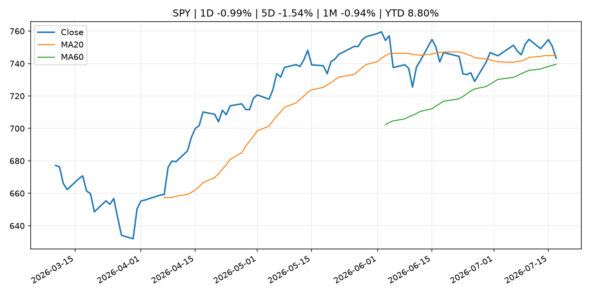
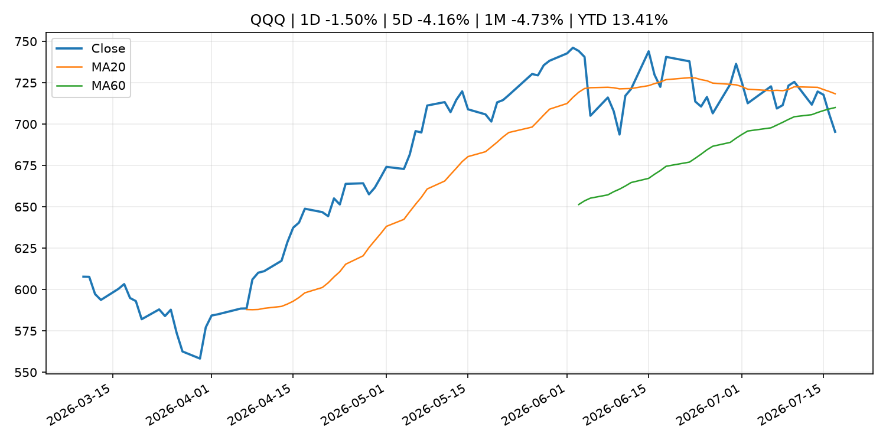
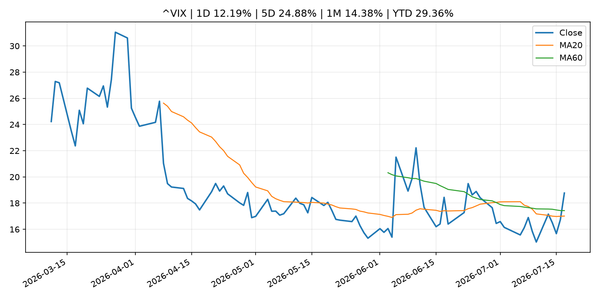
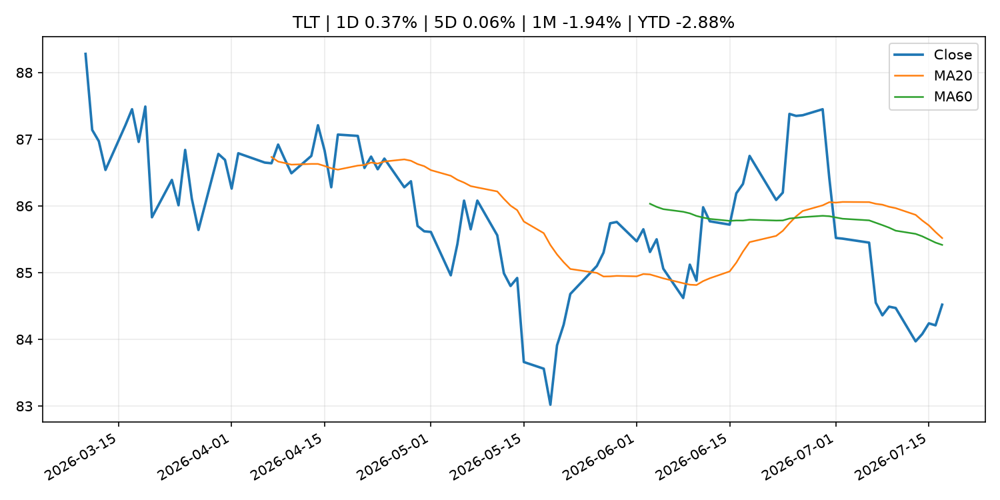
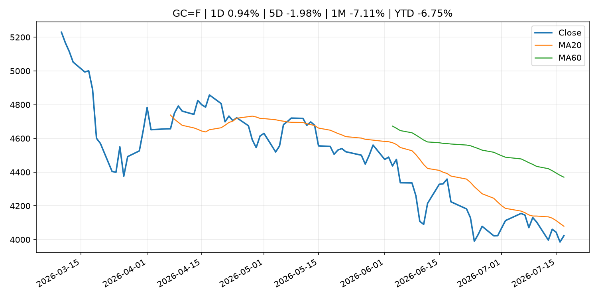
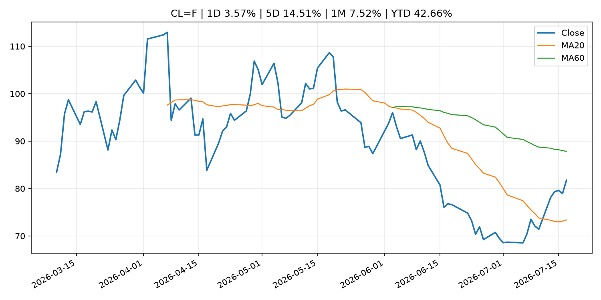
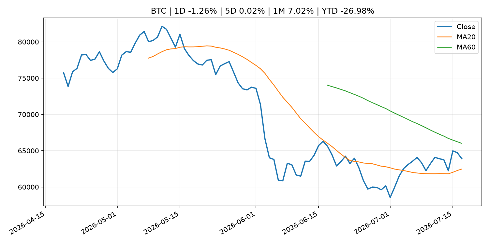
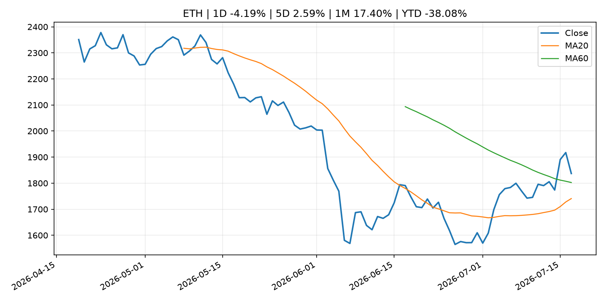
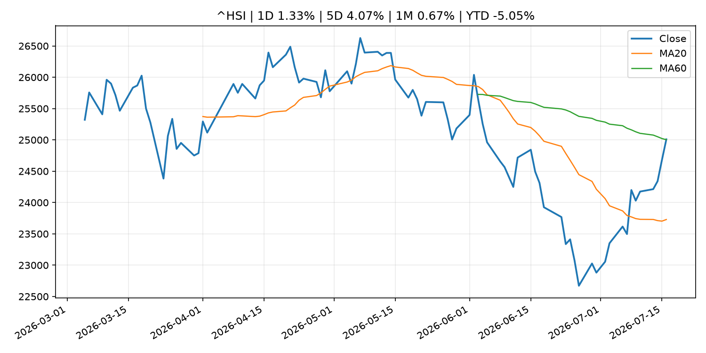

# Global Macro Morning Briefing - 2026-07-18

> Not financial advice / 非投资建议。

## 0. 今日总览
- 市场状态：risk_off。股指回落、VIX 抬升且避险资产走强，市场偏风险规避。
- 今日三大主线：
  1. central_bank_speech: Dallas Fed President Logan calls for 'modestly' higher interest rates
  2. regulation: SEC Proposes New E-Delivery Approach to Make Information More Readily Accessible and Useful for Investors
  3. crypto_market_structure: Visa backs Open USD with new stablecoin platform as Circle faces fresh competition
- 一句话结论：今日晨报重点关注：央行官员表态可能影响市场对下一次会议的定价。；监管变化会改变行业盈利预期和资产风险溢价。。跨资产方面，SPY 1D -0.99%；QQQ 1D -1.50%；^VIX 1D 12.19%；TLT 1D 0.37%；GC=F 1D 0.94%；CL=F 1D 3.57%；BTC 1D -1.26%；ETH 1D -4.19%；股指回落、VIX 抬升且避险资产走强，市场偏风险规避。政策、通胀、利率、美元、美债、能源和加密监管仍是主要观察线索。所有结论仅基于公开数据与短摘要整理，不构成投资建议。

## 1. 隔夜跨资产市场
- 美股：SPY 1D -0.99%，QQQ 1D -1.50%，整体趋势需结合 VIX 和利率确认。
- 美债/美元：TLT 1D 0.37%，美元指数 1D 0.02%，是判断折现率压力的核心线索。
- 黄金/原油：黄金 1D 0.94%，原油 1D 3.57%，用于观察避险、通胀和地缘风险。
- 加密：BTC 1D -1.26%，ETH 1D -4.19%，关注是否独立于纳指走出加密自身行情。
- 港股/A股：恒生 1D 1.33%，沪深300/上证 1D n/a，重点看中国政策预期与人民币线索。
- 风险观察：关注避险是否演变为信用或流动性压力。

### US_EQUITY

| symbol | latest close | 1D | 5D | 1M | YTD | trend |
|---|---:|---:|---:|---:|---:|---|
| SPY | 743.29 | -0.99% | -1.54% | -0.94% | 8.80% | range_bound |
| QQQ | 695.33 | -1.50% | -4.16% | -4.73% | 13.41% | range_bound |
| DIA | 520.81 | -0.77% | -0.95% | -0.12% | 7.69% | range_bound |
| IWM | 294.04 | -0.52% | -0.66% | 0.67% | 18.19% | range_bound |
| VTI | 367.01 | -0.96% | -1.52% | -0.91% | 9.13% | range_bound |

### US_MACRO_MARKET

| symbol | latest close | 1D | 5D | 1M | YTD | trend |
|---|---:|---:|---:|---:|---:|---|
| ^VIX | 18.77 | 12.19% | 24.88% | 14.38% | 29.36% | range_bound |
| DX-Y.NYB | 100.75 | 0.02% | -0.21% | 1.22% | 2.37% | range_bound |
| TLT | 84.52 | 0.37% | 0.06% | -1.94% | -2.88% | range_bound |
| IEF | 93.84 | 0.13% | 0.22% | -0.72% | -2.33% | downtrend |

### COMMODITIES

| symbol | latest close | 1D | 5D | 1M | YTD | trend |
|---|---:|---:|---:|---:|---:|---|
| GC=F | 4,023.00 | 0.94% | -1.98% | -7.11% | -6.75% | downtrend |
| SI=F | 56.22 | 0.58% | -6.00% | -19.57% | -20.32% | strong_downtrend |
| CL=F | 81.77 | 3.57% | 14.51% | 7.52% | 42.66% | range_bound |
| BZ=F | 88.09 | 4.58% | 15.89% | 11.56% | 45.00% | range_bound |
| NG=F | 2.92 | 2.03% | -0.82% | -9.97% | -19.40% | range_bound |
| HG=F | 6.27 | -0.41% | 0.59% | -3.37% | 11.18% | range_bound |

### HK_MARKET

| symbol | latest close | 1D | 5D | 1M | YTD | trend |
|---|---:|---:|---:|---:|---:|---|
| ^HSI | 25,008.60 | 1.33% | 4.07% | 0.67% | -5.05% | range_bound |
| 0700.HK | 461.60 | -4.63% | 0.30% | 3.17% | -25.91% | range_bound |
| 9988.HK | 112.60 | -3.68% | 2.18% | 5.23% | -24.43% | range_bound |
| 3690.HK | 83.65 | -4.07% | 6.29% | 11.09% | -20.03% | range_bound |
| 1810.HK | 26.88 | -2.25% | 4.02% | 4.75% | -33.27% | range_bound |
| 1211.HK | 88.70 | -2.47% | 4.48% | 5.53% | -10.18% | range_bound |

### CRYPTO

| symbol | latest close | 1D | 5D | 1M | YTD | trend |
|---|---:|---:|---:|---:|---:|---|
| BTC | 63,907.30 | -1.26% | 0.02% | 7.02% | -26.98% | range_bound |
| ETH | 1,837.07 | -4.19% | 2.59% | 17.40% | -38.08% | range_bound |
| SOLANA | 74.88 | -3.06% | -2.73% | 10.73% | -39.86% | range_bound |
| BINANCECOIN | 566.96 | -2.25% | -1.48% | 1.28% | -34.32% | downtrend |
| RIPPLE | 1.09 | -2.30% | -1.09% | 4.28% | -40.92% | downtrend |

## 2. 今日最重要的 10 条新闻
### 1. Dallas Fed President Logan calls for 'modestly' higher interest rates
- 来源：CNBC Economy
- 时间：2026-07-16T18:50:42+00:00
- 地区：US
- 事件类型：central_bank_speech
- 重要性层级：Tier 2
- 一句话摘要：The policymaker said this week's good inflation news wasn't good enough.
- 为什么重要：央行官员表态可能影响市场对下一次会议的定价。
- 可能影响：主要影响 DXY，方向为 positive，强度 high；通胀压力可能推高政策利率预期并支撑美元。
  - 资产：DXY
    方向：positive
    强度：high
    原因：通胀压力可能推高政策利率预期并支撑美元。
  - 资产：TLT
    方向：negative
    强度：high
    原因：通胀上行通常推升收益率、压低长债价格。
  - 资产：QQQ
    方向：negative
    强度：high
    原因：更高利率对成长股估值折现率不利。
  - 资产：SPY
    方向：mixed
    强度：medium
    原因：名义增长可能支撑收入，但更高利率压制估值。
  - 资产：GC=F
    方向：mixed
    强度：medium
    原因：通胀对黄金是支撑，但实际利率上行会形成压力。
  - 资产：BTC
    方向：mixed
    强度：medium
    原因：抗通胀叙事和流动性收紧可能相互抵消。
- 原文链接：[https://www.cnbc.com/2026/07/16/dallas-fed-president-logan-calls-for-modestly-higher-interest-rates.html](https://www.cnbc.com/2026/07/16/dallas-fed-president-logan-calls-for-modestly-higher-interest-rates.html)

### 2. SEC Proposes New E-Delivery Approach to Make Information More Readily Accessible and Useful for Investors
- 来源：SEC Press Releases
- 时间：2026-07-16T08:57:00-04:00
- 地区：US
- 事件类型：regulation
- 重要性层级：Tier 2
- 一句话摘要：The Securities and Exchange Commission today proposed Regulation E-Delivery, a new rule that would expand the ability of issuers, broker-dealers, investment advisers, and others to use electronic delivery to satisfy information delivery requirements…
- 为什么重要：监管变化会改变行业盈利预期和资产风险溢价。
- 可能影响：主要影响 BTC，方向为 mixed，强度 high；加密监管或 ETF 进展会改变 BTC 的资金流和风险溢价。
  - 资产：BTC
    方向：mixed
    强度：high
    原因：加密监管或 ETF 进展会改变 BTC 的资金流和风险溢价。
  - 资产：ETH
    方向：mixed
    强度：high
    原因：监管框架会影响 ETH 产品化和机构参与度。
  - 资产：COIN
    方向：mixed
    强度：medium
    原因：监管清晰度和执法风险会影响交易平台估值。
  - 资产：crypto market
    方向：mixed
    强度：high
    原因：信息影响整个加密市场结构，但方向取决于细节。
- 原文链接：[https://www.sec.gov/newsroom/press-releases/2026-67-sec-proposes-new-e-delivery-approach-make-information-more-readily-accessible-useful-investors](https://www.sec.gov/newsroom/press-releases/2026-67-sec-proposes-new-e-delivery-approach-make-information-more-readily-accessible-useful-investors)

### 3. Visa backs Open USD with new stablecoin platform as Circle faces fresh competition
- 来源：CoinDesk
- 时间：2026-07-16T16:14:30+00:00
- 地区：global
- 事件类型：crypto_market_structure
- 重要性层级：Tier 2
- 一句话摘要：Visa backs Open USD with new stablecoin platform as Circle faces fresh competition
- 为什么重要：加密市场结构和监管变化会影响 BTC、ETH 及相关股票的风险溢价。
- 可能影响：主要影响 BTC，方向为 mixed，强度 high；加密监管或 ETF 进展会改变 BTC 的资金流和风险溢价。
  - 资产：BTC
    方向：mixed
    强度：high
    原因：加密监管或 ETF 进展会改变 BTC 的资金流和风险溢价。
  - 资产：ETH
    方向：mixed
    强度：high
    原因：监管框架会影响 ETH 产品化和机构参与度。
  - 资产：COIN
    方向：mixed
    强度：medium
    原因：监管清晰度和执法风险会影响交易平台估值。
  - 资产：crypto market
    方向：mixed
    强度：high
    原因：信息影响整个加密市场结构，但方向取决于细节。
- 原文链接：[https://www.coindesk.com/business/2026/07/16/visa-backs-open-usd-with-new-stablecoin-platform-as-circle-faces-fresh-competition](https://www.coindesk.com/business/2026/07/16/visa-backs-open-usd-with-new-stablecoin-platform-as-circle-faces-fresh-competition)

### 4. Galaxy targets institutional stablecoin yield with new DeFi vaults
- 来源：CoinDesk
- 时间：2026-07-16T12:00:00+00:00
- 地区：global
- 事件类型：crypto_market_structure
- 重要性层级：Tier 2
- 一句话摘要：Galaxy targets institutional stablecoin yield with new DeFi vaults
- 为什么重要：加密市场结构和监管变化会影响 BTC、ETH 及相关股票的风险溢价。
- 可能影响：主要影响 BTC，方向为 mixed，强度 high；加密监管或 ETF 进展会改变 BTC 的资金流和风险溢价。
  - 资产：BTC
    方向：mixed
    强度：high
    原因：加密监管或 ETF 进展会改变 BTC 的资金流和风险溢价。
  - 资产：ETH
    方向：mixed
    强度：high
    原因：监管框架会影响 ETH 产品化和机构参与度。
  - 资产：COIN
    方向：mixed
    强度：medium
    原因：监管清晰度和执法风险会影响交易平台估值。
  - 资产：crypto market
    方向：mixed
    强度：high
    原因：信息影响整个加密市场结构，但方向取决于细节。
- 原文链接：[https://www.coindesk.com/tech/2026/07/16/galaxy-targets-institutional-stablecoin-yield-with-new-defi-vaults](https://www.coindesk.com/tech/2026/07/16/galaxy-targets-institutional-stablecoin-yield-with-new-defi-vaults)

### 5. Federal Reserve Board issues enforcement action with former chief lending officer of Heritage State Bank
- 来源：Federal Reserve Press Releases
- 时间：2026-07-16T15:00:00+00:00
- 地区：US
- 事件类型：regulation
- 重要性层级：Tier 2
- 一句话摘要：Federal Reserve Board issues enforcement action with former chief lending officer of Heritage State Bank
- 为什么重要：监管变化会改变行业盈利预期和资产风险溢价。
- 可能影响：可能影响利率、汇率、风险资产或大宗商品预期，但当前公开信息不足以判断明确方向。
  - 资产：暂无明确资产映射
  - 方向：unknown
  - 强度：low
  - 原因：公开信息不足以判断方向。
- 原文链接：[https://www.federalreserve.gov/newsevents/pressreleases/enforcement20260716a.htm](https://www.federalreserve.gov/newsevents/pressreleases/enforcement20260716a.htm)

### 6. $1.9 trillion asset manager T. Rowe Price bets on active management with first multi-token crypto ETF
- 来源：CoinDesk
- 时间：2026-07-16T18:38:13+00:00
- 地区：global
- 事件类型：other
- 重要性层级：Tier 3
- 一句话摘要：$1.9 trillion asset manager T. Rowe Price bets on active management with first multi-token crypto ETF
- 为什么重要：这条信息暂未匹配到重大宏观、政策或市场事件，更适合作为背景跟踪。
- 可能影响：主要影响 BTC，方向为 mixed，强度 high；加密监管或 ETF 进展会改变 BTC 的资金流和风险溢价。
  - 资产：BTC
    方向：mixed
    强度：high
    原因：加密监管或 ETF 进展会改变 BTC 的资金流和风险溢价。
  - 资产：ETH
    方向：mixed
    强度：high
    原因：监管框架会影响 ETH 产品化和机构参与度。
  - 资产：COIN
    方向：mixed
    强度：medium
    原因：监管清晰度和执法风险会影响交易平台估值。
  - 资产：crypto market
    方向：mixed
    强度：high
    原因：信息影响整个加密市场结构，但方向取决于细节。
- 原文链接：[https://www.coindesk.com/markets/2026/07/16/usd1-9-trillion-asset-manager-t-rowe-price-bets-on-active-management-with-first-multi-token-crypto-etf](https://www.coindesk.com/markets/2026/07/16/usd1-9-trillion-asset-manager-t-rowe-price-bets-on-active-management-with-first-multi-token-crypto-etf)

### 7. Chip stocks have entered a bear market. A BofA analyst says not to panic.
- 来源：MarketWatch Top Stories
- 时间：2026-07-17T20:49:00+00:00
- 地区：US
- 事件类型：other
- 重要性层级：Tier 3
- 一句话摘要：The semiconductor sector is undergoing a reset and has a tendency to underperform in the third quarter.
- 为什么重要：这条信息暂未匹配到重大宏观、政策或市场事件，更适合作为背景跟踪。
- 可能影响：更偏背景信息，短期市场影响可能有限。
  - 资产：暂无明确资产映射
  - 方向：unknown
  - 强度：low
  - 原因：公开信息不足以判断方向。
- 原文链接：[https://www.marketwatch.com/story/chip-stocks-enter-bear-market-territory-a-bofa-analyst-says-not-to-panic-4d34df17?mod=mw_rss_topstories](https://www.marketwatch.com/story/chip-stocks-enter-bear-market-territory-a-bofa-analyst-says-not-to-panic-4d34df17?mod=mw_rss_topstories)

## 3. 政策与央行观察
### 1. Dallas Fed President Logan calls for 'modestly' higher interest rates
- 来源：CNBC Economy
- 时间：2026-07-16T18:50:42+00:00
- 地区：US
- 事件类型：central_bank_speech
- 重要性层级：Tier 2
- 一句话摘要：The policymaker said this week's good inflation news wasn't good enough.
- 为什么重要：央行官员表态可能影响市场对下一次会议的定价。
- 可能影响：主要影响 DXY，方向为 positive，强度 high；通胀压力可能推高政策利率预期并支撑美元。
  - 资产：DXY
    方向：positive
    强度：high
    原因：通胀压力可能推高政策利率预期并支撑美元。
  - 资产：TLT
    方向：negative
    强度：high
    原因：通胀上行通常推升收益率、压低长债价格。
  - 资产：QQQ
    方向：negative
    强度：high
    原因：更高利率对成长股估值折现率不利。
  - 资产：SPY
    方向：mixed
    强度：medium
    原因：名义增长可能支撑收入，但更高利率压制估值。
  - 资产：GC=F
    方向：mixed
    强度：medium
    原因：通胀对黄金是支撑，但实际利率上行会形成压力。
  - 资产：BTC
    方向：mixed
    强度：medium
    原因：抗通胀叙事和流动性收紧可能相互抵消。
- 原文链接：[https://www.cnbc.com/2026/07/16/dallas-fed-president-logan-calls-for-modestly-higher-interest-rates.html](https://www.cnbc.com/2026/07/16/dallas-fed-president-logan-calls-for-modestly-higher-interest-rates.html)

### 2. SEC Proposes New E-Delivery Approach to Make Information More Readily Accessible and Useful for Investors
- 来源：SEC Press Releases
- 时间：2026-07-16T08:57:00-04:00
- 地区：US
- 事件类型：regulation
- 重要性层级：Tier 2
- 一句话摘要：The Securities and Exchange Commission today proposed Regulation E-Delivery, a new rule that would expand the ability of issuers, broker-dealers, investment advisers, and others to use electronic delivery to satisfy information delivery requirements…
- 为什么重要：监管变化会改变行业盈利预期和资产风险溢价。
- 可能影响：主要影响 BTC，方向为 mixed，强度 high；加密监管或 ETF 进展会改变 BTC 的资金流和风险溢价。
  - 资产：BTC
    方向：mixed
    强度：high
    原因：加密监管或 ETF 进展会改变 BTC 的资金流和风险溢价。
  - 资产：ETH
    方向：mixed
    强度：high
    原因：监管框架会影响 ETH 产品化和机构参与度。
  - 资产：COIN
    方向：mixed
    强度：medium
    原因：监管清晰度和执法风险会影响交易平台估值。
  - 资产：crypto market
    方向：mixed
    强度：high
    原因：信息影响整个加密市场结构，但方向取决于细节。
- 原文链接：[https://www.sec.gov/newsroom/press-releases/2026-67-sec-proposes-new-e-delivery-approach-make-information-more-readily-accessible-useful-investors](https://www.sec.gov/newsroom/press-releases/2026-67-sec-proposes-new-e-delivery-approach-make-information-more-readily-accessible-useful-investors)

### 3. Visa backs Open USD with new stablecoin platform as Circle faces fresh competition
- 来源：CoinDesk
- 时间：2026-07-16T16:14:30+00:00
- 地区：global
- 事件类型：crypto_market_structure
- 重要性层级：Tier 2
- 一句话摘要：Visa backs Open USD with new stablecoin platform as Circle faces fresh competition
- 为什么重要：加密市场结构和监管变化会影响 BTC、ETH 及相关股票的风险溢价。
- 可能影响：主要影响 BTC，方向为 mixed，强度 high；加密监管或 ETF 进展会改变 BTC 的资金流和风险溢价。
  - 资产：BTC
    方向：mixed
    强度：high
    原因：加密监管或 ETF 进展会改变 BTC 的资金流和风险溢价。
  - 资产：ETH
    方向：mixed
    强度：high
    原因：监管框架会影响 ETH 产品化和机构参与度。
  - 资产：COIN
    方向：mixed
    强度：medium
    原因：监管清晰度和执法风险会影响交易平台估值。
  - 资产：crypto market
    方向：mixed
    强度：high
    原因：信息影响整个加密市场结构，但方向取决于细节。
- 原文链接：[https://www.coindesk.com/business/2026/07/16/visa-backs-open-usd-with-new-stablecoin-platform-as-circle-faces-fresh-competition](https://www.coindesk.com/business/2026/07/16/visa-backs-open-usd-with-new-stablecoin-platform-as-circle-faces-fresh-competition)

### 4. Galaxy targets institutional stablecoin yield with new DeFi vaults
- 来源：CoinDesk
- 时间：2026-07-16T12:00:00+00:00
- 地区：global
- 事件类型：crypto_market_structure
- 重要性层级：Tier 2
- 一句话摘要：Galaxy targets institutional stablecoin yield with new DeFi vaults
- 为什么重要：加密市场结构和监管变化会影响 BTC、ETH 及相关股票的风险溢价。
- 可能影响：主要影响 BTC，方向为 mixed，强度 high；加密监管或 ETF 进展会改变 BTC 的资金流和风险溢价。
  - 资产：BTC
    方向：mixed
    强度：high
    原因：加密监管或 ETF 进展会改变 BTC 的资金流和风险溢价。
  - 资产：ETH
    方向：mixed
    强度：high
    原因：监管框架会影响 ETH 产品化和机构参与度。
  - 资产：COIN
    方向：mixed
    强度：medium
    原因：监管清晰度和执法风险会影响交易平台估值。
  - 资产：crypto market
    方向：mixed
    强度：high
    原因：信息影响整个加密市场结构，但方向取决于细节。
- 原文链接：[https://www.coindesk.com/tech/2026/07/16/galaxy-targets-institutional-stablecoin-yield-with-new-defi-vaults](https://www.coindesk.com/tech/2026/07/16/galaxy-targets-institutional-stablecoin-yield-with-new-defi-vaults)

### 5. Federal Reserve Board issues enforcement action with former chief lending officer of Heritage State Bank
- 来源：Federal Reserve Press Releases
- 时间：2026-07-16T15:00:00+00:00
- 地区：US
- 事件类型：regulation
- 重要性层级：Tier 2
- 一句话摘要：Federal Reserve Board issues enforcement action with former chief lending officer of Heritage State Bank
- 为什么重要：监管变化会改变行业盈利预期和资产风险溢价。
- 可能影响：可能影响利率、汇率、风险资产或大宗商品预期，但当前公开信息不足以判断明确方向。
  - 资产：暂无明确资产映射
  - 方向：unknown
  - 强度：low
  - 原因：公开信息不足以判断方向。
- 原文链接：[https://www.federalreserve.gov/newsevents/pressreleases/enforcement20260716a.htm](https://www.federalreserve.gov/newsevents/pressreleases/enforcement20260716a.htm)

## 4. 市场异动与图表
- SPY 下跌 -0.99%
- QQQ 下跌 -1.50%
- VIX 上涨 12.19%
- Gold 上涨 0.94%
- Oil 上涨 3.57%
- ETH 下跌 -4.19%

### SPY

### QQQ

### ^VIX

### TLT

### GC=F

### CL=F

### BTC

### ETH

### ^HSI

## 5. 华尔街与机构公开观点
- 暂无可靠公开观点。

## 6. 今日重点关注
- 经济数据：经济数据：暂无可靠公开日历数据；如配置经济日历源后可自动填充。
- 央行讲话：央行讲话：暂无可靠公开日历数据；重点跟踪 Fed、ECB、BoJ、PBOC 官网 RSS。
- 财报：财报：暂无可靠数据。
- 政策事件：政策事件：暂无可靠数据。
- 风险提醒：风险提醒：关注数据源失败项、突发地缘风险、利率和美元的二阶反应。

## 7. 英文金融表达与宏观概念
- **inflation expectations**：通胀预期，指家庭、企业或市场对未来通胀的预估。 例句：Inflation expectations can shape wage bargaining and bond yields.
- **real yield**：实际收益率，名义利率扣除通胀预期后的收益率。 例句：Gold often reacts more to real yields than nominal yields.
- **market structure**：市场结构，指交易、托管、清算、ETF、监管等制度安排。 例句：Crypto market structure rules can affect institutional participation.
- **terminal rate**：终端利率，市场预期本轮加息周期的最高政策利率。 例句：A higher terminal rate can pressure growth stocks.
- **soft landing**：软着陆，指通胀回落而经济避免明显衰退。 例句：Markets often rally when data support a soft landing.
- **risk-off**：避险模式，资金偏向美元、国债、黄金等防御资产。 例句：A geopolitical shock can push markets into risk-off mode.

## 8. 背景材料
- [Chip stocks have entered a bear market. A BofA analyst says not to panic.](https://www.marketwatch.com/story/chip-stocks-enter-bear-market-territory-a-bofa-analyst-says-not-to-panic-4d34df17?mod=mw_rss_topstories)（MarketWatch Top Stories，other）：The semiconductor sector is undergoing a reset and has a tendency to underperform in the third quarter.
- [Bitcoin faces fresh headwinds as China’s Kimi beats Claude, GPT in coding benchmark](https://www.coindesk.com/markets/2026/07/17/bitcoin-faces-fresh-headwinds-as-china-s-kimi-beats-claude-gpt-in-coding-benchmark)（CoinDesk，other）：Bitcoin faces fresh headwinds as China’s Kimi beats Claude, GPT in coding benchmark
- [AI frenzy losing steam leaves bitcoin less volatile than South Korean stocks](https://www.coindesk.com/daybook-us/2026/07/17/ai-frenzy-losing-steam-leaves-bitcoin-less-volatile-than-south-korean-stocks)（CoinDesk，other）：AI frenzy losing steam leaves bitcoin less volatile than South Korean stocks
- [Live markets: Bitcoin returns to $63,000 as Nasdaq trims large early loss](https://www.coindesk.com/markets/2026/07/17/live-markets-bitcoin-slips-to-usd63-000-as-the-chip-rout-goes-global)（CoinDesk，other）：Live markets: Bitcoin returns to $63,000 as Nasdaq trims large early loss
- [Risk-off wave drags bitcoin below $63,000 as AI selloff spreads from stocks to crypto](https://www.coindesk.com/markets/2026/07/17/risk-off-wave-drags-bitcoin-below-usd63-000-as-ai-selloff-spreads-from-stocks-to-crypto)（CoinDesk，other）：Risk-off wave drags bitcoin below $63,000 as AI selloff spreads from stocks to crypto
- [Piero Cipollone: The cooperative spirit at the heart of the digital euro](https://www.ecb.europa.eu//press/key/date/2026/html/ecb.sp260717~b6a156dc40.en.html)（ECB Press Releases，other）：Piero Cipollone: The cooperative spirit at the heart of the digital euro
- [Ether falls twice as hard as bitcoin and HYPE drops 10% as the chip trade unwinds](https://www.coindesk.com/markets/2026/07/17/ether-falls-twice-as-hard-as-bitcoin-and-hype-drops-10-as-the-chip-trade-unwinds)（CoinDesk，other）：Ether falls twice as hard as bitcoin and HYPE drops 10% as the chip trade unwinds
- [Loan Disbursement under the Funds-Supplying Operations to Support Financing for Climate Change Responses](http://www.boj.or.jp/en/mopo/mpmdeci/mpr_2026/mpr260717a.pdf)（Bank of Japan Announcements，other）：Loan Disbursement under the Funds-Supplying Operations to Support Financing for Climate Change Responses
- [DOG Mode vs. BIP-110: Inside the Bitcoin client built to bypass data restrictions](https://www.coindesk.com/tech/2026/07/17/bitcoin-s-anti-spam-fight-gets-a-dog-mode-reply)（CoinDesk，other）：DOG Mode vs. BIP-110: Inside the Bitcoin client built to bypass data restrictions
- [Bitcoin under $63,000 after new U.S. strike on Iran. Trump's China comment adds to uncertainty](https://www.coindesk.com/markets/2026/07/17/bitcoin-under-usd64-000-after-u-s-strike-on-iran-trump-s-china-comment-adds-to-uncertainty)（CoinDesk，other）：Bitcoin under $63,000 after new U.S. strike on Iran. Trump's China comment adds to uncertainty
- [Senior Loan Officer Opinion Survey (July)](http://www.boj.or.jp/en/statistics/dl/loan/loos/release/loos2607.pdf)（Bank of Japan Announcements，other）：Senior Loan Officer Opinion Survey (July)
- [$1.9 trillion asset manager T. Rowe Price bets on active management with first multi-token crypto ETF](https://www.coindesk.com/markets/2026/07/16/usd1-9-trillion-asset-manager-t-rowe-price-bets-on-active-management-with-first-multi-token-crypto-etf)（CoinDesk，other）：$1.9 trillion asset manager T. Rowe Price bets on active management with first multi-token crypto ETF
- [Agencies issue joint statement on handling of highly sensitive information during bank examinations](https://www.federalreserve.gov/newsevents/pressreleases/bcreg20260716a.htm)（Federal Reserve Press Releases，other）：Agencies issue joint statement on handling of highly sensitive information during bank examinations
- [Citadel Securities invests $400 million in Crypto.com, valuing exchange at $20 billion](https://www.coindesk.com/business/2026/07/16/citadel-securities-invests-usd400-million-in-crypto-com-valuing-exchange-at-usd20-billion)（CoinDesk，other）：Citadel Securities invests $400 million in Crypto.com, valuing exchange at $20 billion
- [The most popular bitcoin call option has slipped by $10,000](https://www.coindesk.com/daybook-us/2026/07/16/the-most-popular-bitcoin-call-option-has-slipped-by-usd10-000)（CoinDesk，other）：The most popular bitcoin call option has slipped by $10,000
- [BOJ Current Account Balances by Sector (June)](http://www.boj.or.jp/en/statistics/boj/other/cabs/cabs.xlsx)（Bank of Japan Announcements，other）：BOJ Current Account Balances by Sector (June)
- [Results of the 106th Opinion Survey on the General Public's Views and Behavior](http://www.boj.or.jp/en/research/o_survey/ishiki2607.htm)（Bank of Japan Announcements，other）：Results of the 106th Opinion Survey on the General Public's Views and Behavior

## 9. 数据源、失败项与免责声明
- 采集时间：2026-07-17T22:47:25
- 数据源：公开 RSS、Yahoo Finance、CoinGecko、AKShare、FRED、SEC data.sec.gov，以及用户自有 inputs/reports 文件。
- 合规说明：不绕过 WSJ、Bloomberg、FT、Reuters 等付费墙；对付费媒体只使用公开 RSS 标题、摘要、链接和发布时间。
- 免责声明：Not financial advice / 非投资建议。本项目仅供个人学习、研究和信息整理，不构成投资建议、交易建议或任何收益承诺。
- 失败或跳过的数据源：
  - crypto data failed coin=dogecoin
  - China market data failed symbol=上证指数: empty dataframe
  - China market data failed symbol=深证成指: empty dataframe
  - China market data failed symbol=创业板指: empty dataframe
  - China market data failed symbol=沪深300: empty dataframe
  - China market data failed symbol=中证500: empty dataframe
  - China market data failed symbol=科创50: empty dataframe
  - FRED_API_KEY not set; skipping FRED macro series
  - SEC failed cik=0000320193
  - SEC failed cik=0000789019
  - SEC failed cik=0001045810
  - SEC failed cik=0001318605
  - SEC failed cik=0001577552
