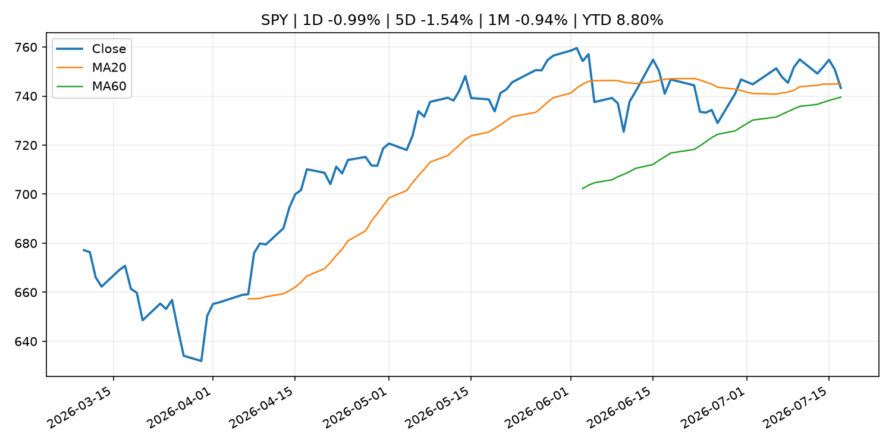
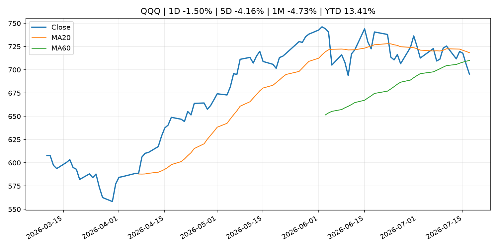
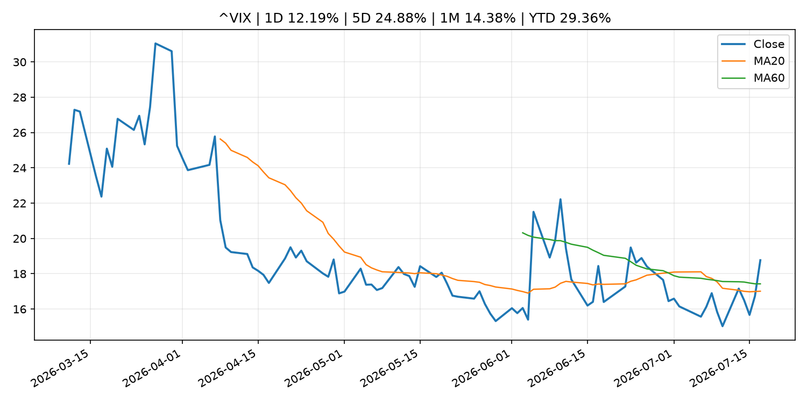
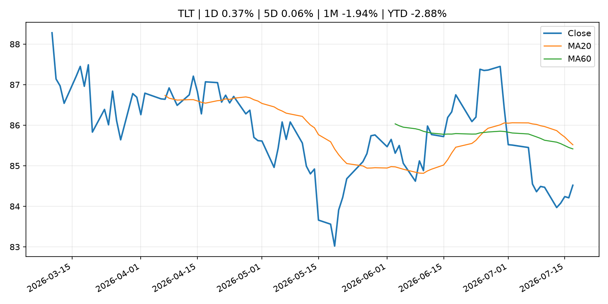
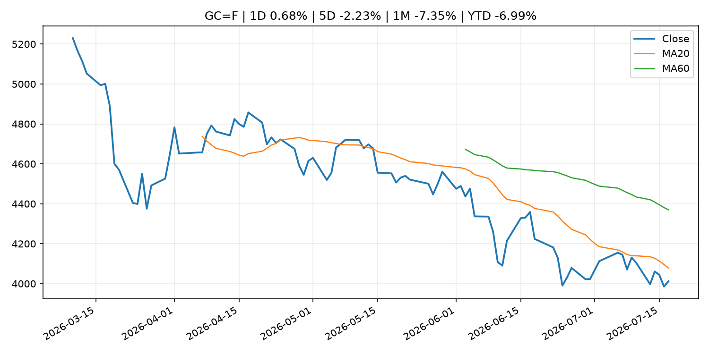
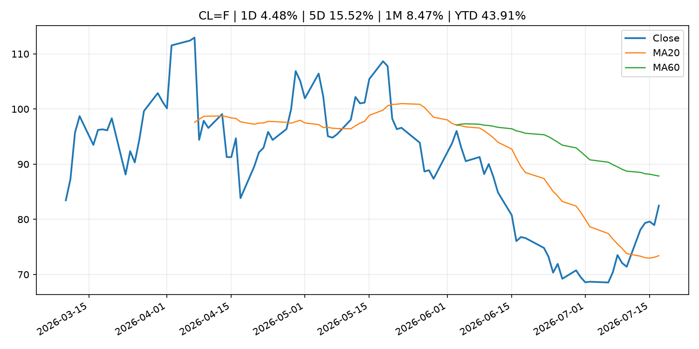
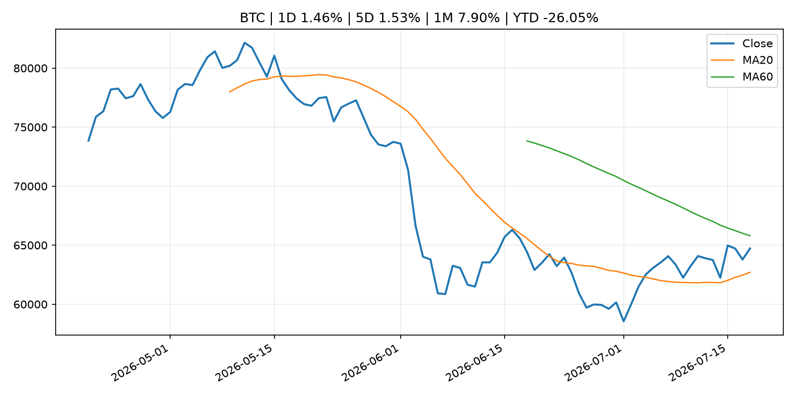
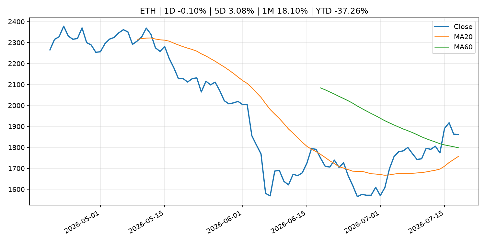
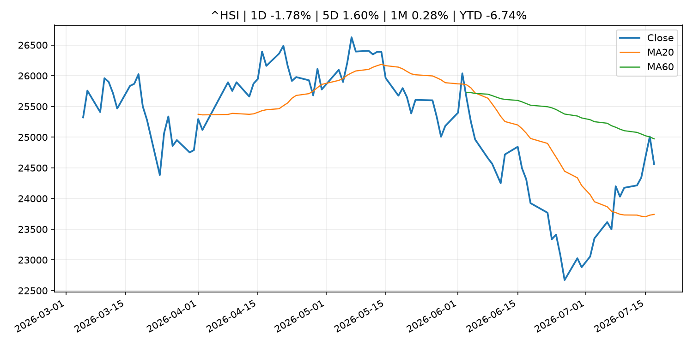

# Global Macro Morning Briefing - 2026-07-19

> Not financial advice / 非投资建议。

## 0. 今日总览
- 市场状态：risk_off。股指回落、VIX 抬升且避险资产走强，市场偏风险规避。
- 今日三大主线：
  1. financial_stability: Here is why a massive $1.6 billion in crypto liquidity is sitting idle and wasting away
- 一句话结论：今日晨报重点关注：金融稳定信号可能放大跨资产波动，并影响央行反应函数。；这条信息暂未匹配到重大宏观、政策或市场事件，更适合作为背景跟踪。。跨资产方面，SPY 1D -0.99%；QQQ 1D -1.50%；^VIX 1D 12.19%；TLT 1D 0.37%；GC=F 1D 0.68%；CL=F 1D 4.48%；BTC 1D 1.46%；ETH 1D -0.10%；股指回落、VIX 抬升且避险资产走强，市场偏风险规避。政策、通胀、利率、美元、美债、能源和加密监管仍是主要观察线索。所有结论仅基于公开数据与短摘要整理，不构成投资建议。

## 1. 隔夜跨资产市场
- 美股：SPY 1D -0.99%，QQQ 1D -1.50%，整体趋势需结合 VIX 和利率确认。
- 美债/美元：TLT 1D 0.37%，美元指数 1D 0.02%，是判断折现率压力的核心线索。
- 黄金/原油：黄金 1D 0.68%，原油 1D 4.48%，用于观察避险、通胀和地缘风险。
- 加密：BTC 1D 1.46%，ETH 1D -0.10%，关注是否独立于纳指走出加密自身行情。
- 港股/A股：恒生 1D -1.78%，沪深300/上证 1D n/a，重点看中国政策预期与人民币线索。
- 风险观察：关注避险是否演变为信用或流动性压力。

### US_EQUITY

| symbol | latest close | 1D | 5D | 1M | YTD | trend |
|---|---:|---:|---:|---:|---:|---|
| SPY | 743.29 | -0.99% | -1.54% | -0.94% | 8.80% | range_bound |
| QQQ | 695.33 | -1.50% | -4.16% | -4.73% | 13.41% | range_bound |
| DIA | 520.81 | -0.77% | -0.95% | -0.12% | 7.69% | range_bound |
| IWM | 294.04 | -0.52% | -0.66% | 0.67% | 18.19% | range_bound |
| VTI | 367.01 | -0.96% | -1.52% | -0.91% | 9.13% | range_bound |

### US_MACRO_MARKET

| symbol | latest close | 1D | 5D | 1M | YTD | trend |
|---|---:|---:|---:|---:|---:|---|
| ^VIX | 18.77 | 12.19% | 24.88% | 14.38% | 29.36% | range_bound |
| DX-Y.NYB | 100.75 | 0.02% | -0.22% | 1.22% | 2.37% | range_bound |
| TLT | 84.52 | 0.37% | 0.06% | -1.94% | -2.88% | range_bound |
| IEF | 93.84 | 0.13% | 0.22% | -0.72% | -2.33% | downtrend |

### COMMODITIES

| symbol | latest close | 1D | 5D | 1M | YTD | trend |
|---|---:|---:|---:|---:|---:|---|
| GC=F | 4,012.70 | 0.68% | -2.23% | -7.35% | -6.99% | strong_downtrend |
| SI=F | 56.04 | 0.25% | -6.31% | -19.83% | -20.58% | strong_downtrend |
| CL=F | 82.49 | 4.48% | 15.52% | 8.47% | 43.91% | range_bound |
| BZ=F | 88.10 | 4.59% | 15.91% | 11.58% | 45.02% | range_bound |
| NG=F | 2.91 | 1.85% | -0.99% | -10.13% | -19.54% | range_bound |
| HG=F | 6.22 | -1.21% | -0.22% | -4.15% | 10.28% | range_bound |

### HK_MARKET

| symbol | latest close | 1D | 5D | 1M | YTD | trend |
|---|---:|---:|---:|---:|---:|---|
| ^HSI | 24,562.24 | -1.78% | 1.60% | 0.28% | -6.74% | range_bound |
| 0700.HK | 461.60 | -4.63% | 0.30% | 3.17% | -25.91% | range_bound |
| 9988.HK | 112.60 | -3.68% | 2.18% | 5.23% | -24.43% | range_bound |
| 3690.HK | 83.65 | -4.07% | 6.29% | 11.09% | -20.03% | range_bound |
| 1810.HK | 26.88 | -2.25% | 4.02% | 4.75% | -33.27% | range_bound |
| 1211.HK | 88.70 | -2.47% | 4.48% | 5.53% | -10.18% | range_bound |

### CRYPTO

| symbol | latest close | 1D | 5D | 1M | YTD | trend |
|---|---:|---:|---:|---:|---:|---|
| BTC | 64,722.45 | 1.46% | 1.53% | 7.90% | -26.05% | range_bound |
| ETH | 1,861.22 | -0.10% | 3.08% | 18.10% | -37.26% | range_bound |
| SOLANA | 75.41 | 0.18% | -1.80% | 4.98% | -39.44% | range_bound |
| BINANCECOIN | 569.71 | -0.41% | -0.72% | 0.50% | -34.00% | downtrend |
| RIPPLE | 1.09 | 0.54% | 0.58% | 4.33% | -40.62% | downtrend |

## 2. 今日最重要的 10 条新闻
### 1. Here is why a massive $1.6 billion in crypto liquidity is sitting idle and wasting away
- 来源：CoinDesk
- 时间：2026-07-18T15:50:31+00:00
- 地区：global
- 事件类型：financial_stability
- 重要性层级：Tier 1
- 一句话摘要：Here is why a massive $1.6 billion in crypto liquidity is sitting idle and wasting away
- 为什么重要：金融稳定信号可能放大跨资产波动，并影响央行反应函数。
- 可能影响：可能影响利率、汇率、风险资产或大宗商品预期，但当前公开信息不足以判断明确方向。
  - 资产：暂无明确资产映射
  - 方向：unknown
  - 强度：low
  - 原因：公开信息不足以判断方向。
- 原文链接：[https://www.coindesk.com/web3/2026/07/18/here-is-why-a-massive-usd1-6-billion-in-crypto-liquidity-is-sitting-idle-and-wasting-away](https://www.coindesk.com/web3/2026/07/18/here-is-why-a-massive-usd1-6-billion-in-crypto-liquidity-is-sitting-idle-and-wasting-away)

### 2. Netflix is spending big money on sports. Is the company making the right bets?
- 来源：MarketWatch Top Stories
- 时间：2026-07-18T18:54:00+00:00
- 地区：US
- 事件类型：other
- 重要性层级：Tier 3
- 一句话摘要：The streaming service says live programming helps draw in new subscribers, but investors have become disillusioned with Netflix’s broader engagement trends.
- 为什么重要：这条信息暂未匹配到重大宏观、政策或市场事件，更适合作为背景跟踪。
- 可能影响：更偏背景信息，短期市场影响可能有限。
  - 资产：暂无明确资产映射
  - 方向：unknown
  - 强度：low
  - 原因：公开信息不足以判断方向。
- 原文链接：[https://www.marketwatch.com/story/netflix-is-paying-up-for-costly-sports-rights-is-the-company-making-the-right-bets-9ce54df7?mod=mw_rss_topstories](https://www.marketwatch.com/story/netflix-is-paying-up-for-costly-sports-rights-is-the-company-making-the-right-bets-9ce54df7?mod=mw_rss_topstories)

### 3. Your Netflix bill is up 29% in just over a year. It’s time for Washington to step in.
- 来源：MarketWatch Top Stories
- 时间：2026-07-18T18:49:00+00:00
- 地区：US
- 事件类型：other
- 重要性层级：Tier 3
- 一句话摘要：Netflix is still a Wall Street favorite — and a target for government regulators
- 为什么重要：这条信息暂未匹配到重大宏观、政策或市场事件，更适合作为背景跟踪。
- 可能影响：更偏背景信息，短期市场影响可能有限。
  - 资产：暂无明确资产映射
  - 方向：unknown
  - 强度：low
  - 原因：公开信息不足以判断方向。
- 原文链接：[https://www.marketwatch.com/story/your-monthly-netflix-bill-is-up-29-in-just-over-a-year-critics-say-washington-needs-to-fix-it-bcab6e5b?mod=mw_rss_topstories](https://www.marketwatch.com/story/your-monthly-netflix-bill-is-up-29-in-just-over-a-year-critics-say-washington-needs-to-fix-it-bcab6e5b?mod=mw_rss_topstories)

## 3. 政策与央行观察
### 1. Here is why a massive $1.6 billion in crypto liquidity is sitting idle and wasting away
- 来源：CoinDesk
- 时间：2026-07-18T15:50:31+00:00
- 地区：global
- 事件类型：financial_stability
- 重要性层级：Tier 1
- 一句话摘要：Here is why a massive $1.6 billion in crypto liquidity is sitting idle and wasting away
- 为什么重要：金融稳定信号可能放大跨资产波动，并影响央行反应函数。
- 可能影响：可能影响利率、汇率、风险资产或大宗商品预期，但当前公开信息不足以判断明确方向。
  - 资产：暂无明确资产映射
  - 方向：unknown
  - 强度：low
  - 原因：公开信息不足以判断方向。
- 原文链接：[https://www.coindesk.com/web3/2026/07/18/here-is-why-a-massive-usd1-6-billion-in-crypto-liquidity-is-sitting-idle-and-wasting-away](https://www.coindesk.com/web3/2026/07/18/here-is-why-a-massive-usd1-6-billion-in-crypto-liquidity-is-sitting-idle-and-wasting-away)

## 4. 市场异动与图表
- SPY 下跌 -0.99%
- QQQ 下跌 -1.50%
- VIX 上涨 12.19%
- Gold 上涨 0.68%
- Oil 上涨 4.48%

### SPY

### QQQ

### ^VIX

### TLT

### GC=F

### CL=F

### BTC

### ETH

### ^HSI

## 5. 华尔街与机构公开观点
- 暂无可靠公开观点。

## 6. 今日重点关注
- 经济数据：经济数据：暂无可靠公开日历数据；如配置经济日历源后可自动填充。
- 央行讲话：央行讲话：暂无可靠公开日历数据；重点跟踪 Fed、ECB、BoJ、PBOC 官网 RSS。
- 财报：财报：暂无可靠数据。
- 政策事件：政策事件：暂无可靠数据。
- 风险提醒：风险提醒：关注数据源失败项、突发地缘风险、利率和美元的二阶反应。

## 7. 英文金融表达与宏观概念
- **market structure**：市场结构，指交易、托管、清算、ETF、监管等制度安排。 例句：Crypto market structure rules can affect institutional participation.
- **inflation expectations**：通胀预期，指家庭、企业或市场对未来通胀的预估。 例句：Inflation expectations can shape wage bargaining and bond yields.
- **real yield**：实际收益率，名义利率扣除通胀预期后的收益率。 例句：Gold often reacts more to real yields than nominal yields.
- **terminal rate**：终端利率，市场预期本轮加息周期的最高政策利率。 例句：A higher terminal rate can pressure growth stocks.
- **soft landing**：软着陆，指通胀回落而经济避免明显衰退。 例句：Markets often rally when data support a soft landing.
- **risk-off**：避险模式，资金偏向美元、国债、黄金等防御资产。 例句：A geopolitical shock can push markets into risk-off mode.

## 8. 背景材料
- [Netflix is spending big money on sports. Is the company making the right bets?](https://www.marketwatch.com/story/netflix-is-paying-up-for-costly-sports-rights-is-the-company-making-the-right-bets-9ce54df7?mod=mw_rss_topstories)（MarketWatch Top Stories，other）：The streaming service says live programming helps draw in new subscribers, but investors have become disillusioned with Netflix’s broader engagement trends.
- [Your Netflix bill is up 29% in just over a year. It’s time for Washington to step in.](https://www.marketwatch.com/story/your-monthly-netflix-bill-is-up-29-in-just-over-a-year-critics-say-washington-needs-to-fix-it-bcab6e5b?mod=mw_rss_topstories)（MarketWatch Top Stories，other）：Netflix is still a Wall Street favorite — and a target for government regulators
- [These are the obstacles still keeping women from retirement security](https://www.marketwatch.com/story/these-are-the-obstacles-still-keeping-women-from-retirement-security-eea48a95?mod=mw_rss_topstories)（MarketWatch Top Stories，other）：Yes, women still need a “retirement security day.” Here’s why.
- [My relative inherited money in her 80s. Will it affect her Social Security taxes or Medicare premiums?](https://www.marketwatch.com/story/my-relative-inherited-money-in-her-80s-will-it-affect-her-social-security-taxes-or-medicare-premiums-0f09a210?mod=mw_rss_topstories)（MarketWatch Top Stories，other）：“She lives a modest lifestyle.”
- [DOG Mode explains Bitcoin's next governance fight](https://www.coindesk.com/tech/2026/07/18/dog-mode-explains-bitcoin-s-next-governance-fight)（CoinDesk，other）：DOG Mode explains Bitcoin's next governance fight
- [Trump targets Brazil's payments system while dollar stablecoins are quietly overtaking country's payments](https://www.coindesk.com/business/2026/07/18/trump-targets-brazil-s-payments-system-while-dollar-stablecoins-quietly-dominate-country-s-payments)（CoinDesk，other）：Trump targets Brazil's payments system while dollar stablecoins are quietly overtaking country's payments
- [Massive bitcoin call spreads target $72,000 by month end, right when the Fed meets](https://www.coindesk.com/markets/2026/07/18/massive-bitcoin-call-spreads-target-usd72-000-by-month-end-right-when-the-fed-meets)（CoinDesk，other）：Massive bitcoin call spreads target $72,000 by month end, right when the Fed meets
- [Bitcoin faces fresh headwinds as China’s Kimi beats Claude, GPT in coding benchmark](https://www.coindesk.com/markets/2026/07/17/bitcoin-faces-fresh-headwinds-as-china-s-kimi-beats-claude-gpt-in-coding-benchmark)（CoinDesk，other）：Bitcoin faces fresh headwinds as China’s Kimi beats Claude, GPT in coding benchmark
- [AI frenzy losing steam leaves bitcoin less volatile than South Korean stocks](https://www.coindesk.com/daybook-us/2026/07/17/ai-frenzy-losing-steam-leaves-bitcoin-less-volatile-than-south-korean-stocks)（CoinDesk，other）：AI frenzy losing steam leaves bitcoin less volatile than South Korean stocks
- [Live markets: Bitcoin returns to $63,000 as Nasdaq trims large early loss](https://www.coindesk.com/markets/2026/07/17/live-markets-bitcoin-slips-to-usd63-000-as-the-chip-rout-goes-global)（CoinDesk，other）：Live markets: Bitcoin returns to $63,000 as Nasdaq trims large early loss
- [Risk-off wave drags bitcoin below $63,000 as AI selloff spreads from stocks to crypto](https://www.coindesk.com/markets/2026/07/17/risk-off-wave-drags-bitcoin-below-usd63-000-as-ai-selloff-spreads-from-stocks-to-crypto)（CoinDesk，other）：Risk-off wave drags bitcoin below $63,000 as AI selloff spreads from stocks to crypto
- [Piero Cipollone: The cooperative spirit at the heart of the digital euro](https://www.ecb.europa.eu//press/key/date/2026/html/ecb.sp260717~b6a156dc40.en.html)（ECB Press Releases，other）：Piero Cipollone: The cooperative spirit at the heart of the digital euro
- [Ether falls twice as hard as bitcoin and HYPE drops 10% as the chip trade unwinds](https://www.coindesk.com/markets/2026/07/17/ether-falls-twice-as-hard-as-bitcoin-and-hype-drops-10-as-the-chip-trade-unwinds)（CoinDesk，other）：Ether falls twice as hard as bitcoin and HYPE drops 10% as the chip trade unwinds
- [Loan Disbursement under the Funds-Supplying Operations to Support Financing for Climate Change Responses](http://www.boj.or.jp/en/mopo/mpmdeci/mpr_2026/mpr260717a.pdf)（Bank of Japan Announcements，other）：Loan Disbursement under the Funds-Supplying Operations to Support Financing for Climate Change Responses
- [DOG Mode vs. BIP-110: Inside the Bitcoin client built to bypass data restrictions](https://www.coindesk.com/tech/2026/07/17/bitcoin-s-anti-spam-fight-gets-a-dog-mode-reply)（CoinDesk，other）：DOG Mode vs. BIP-110: Inside the Bitcoin client built to bypass data restrictions
- [Bitcoin under $63,000 after new U.S. strike on Iran. Trump's China comment adds to uncertainty](https://www.coindesk.com/markets/2026/07/17/bitcoin-under-usd64-000-after-u-s-strike-on-iran-trump-s-china-comment-adds-to-uncertainty)（CoinDesk，other）：Bitcoin under $63,000 after new U.S. strike on Iran. Trump's China comment adds to uncertainty
- [Senior Loan Officer Opinion Survey (July)](http://www.boj.or.jp/en/statistics/dl/loan/loos/release/loos2607.pdf)（Bank of Japan Announcements，other）：Senior Loan Officer Opinion Survey (July)

## 9. 数据源、失败项与免责声明
- 采集时间：2026-07-18T22:46:25
- 数据源：公开 RSS、Yahoo Finance、CoinGecko、AKShare、FRED、SEC data.sec.gov，以及用户自有 inputs/reports 文件。
- 合规说明：不绕过 WSJ、Bloomberg、FT、Reuters 等付费墙；对付费媒体只使用公开 RSS 标题、摘要、链接和发布时间。
- 免责声明：Not financial advice / 非投资建议。本项目仅供个人学习、研究和信息整理，不构成投资建议、交易建议或任何收益承诺。
- 失败或跳过的数据源：
  - crypto data failed coin=dogecoin
  - China market data failed symbol=上证指数: empty dataframe
  - China market data failed symbol=深证成指: empty dataframe
  - China market data failed symbol=创业板指: empty dataframe
  - China market data failed symbol=沪深300: empty dataframe
  - China market data failed symbol=中证500: empty dataframe
  - China market data failed symbol=科创50: empty dataframe
  - FRED_API_KEY not set; skipping FRED macro series
  - SEC failed cik=0000320193
  - SEC failed cik=0000789019
  - SEC failed cik=0001045810
  - SEC failed cik=0001318605
  - SEC failed cik=0001577552
