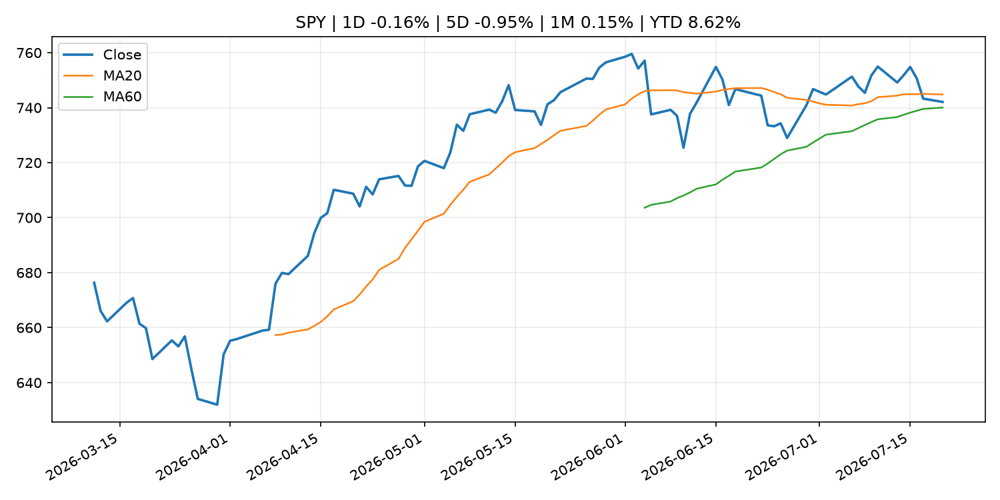
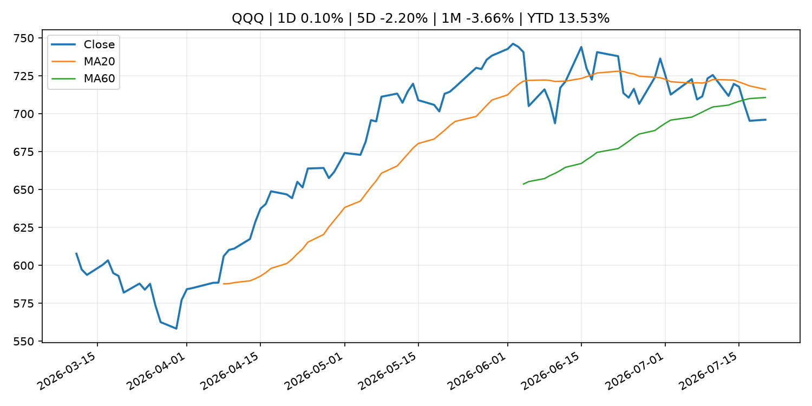
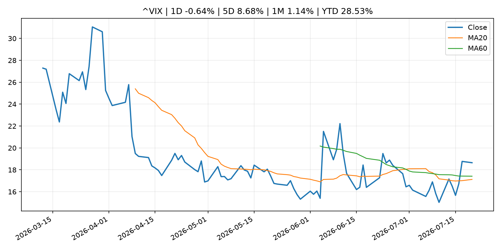
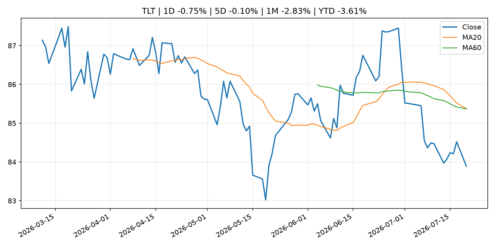
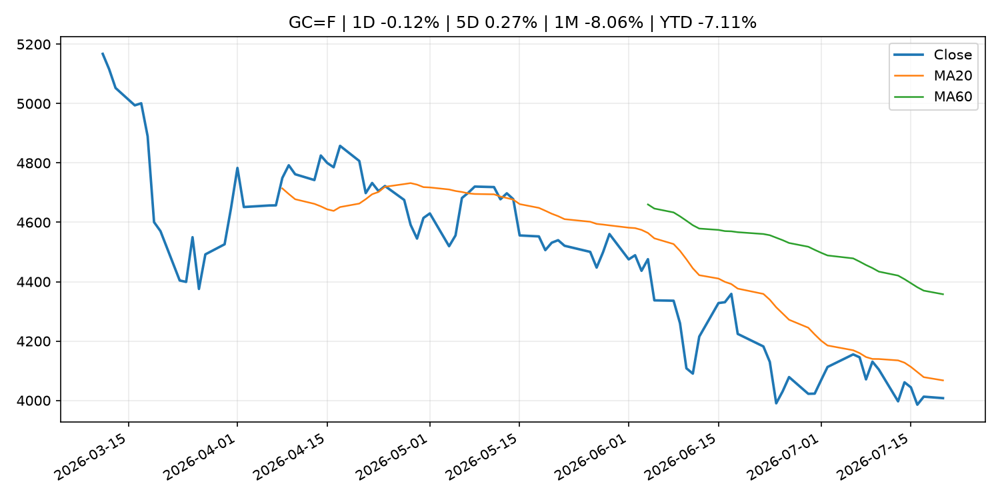
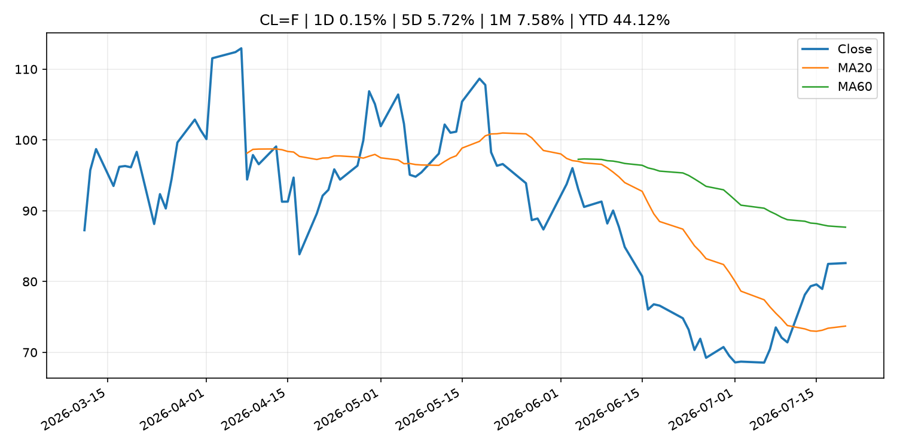
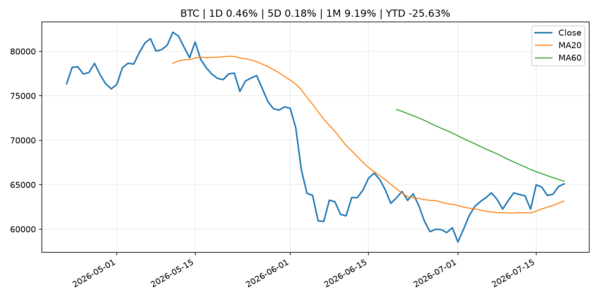
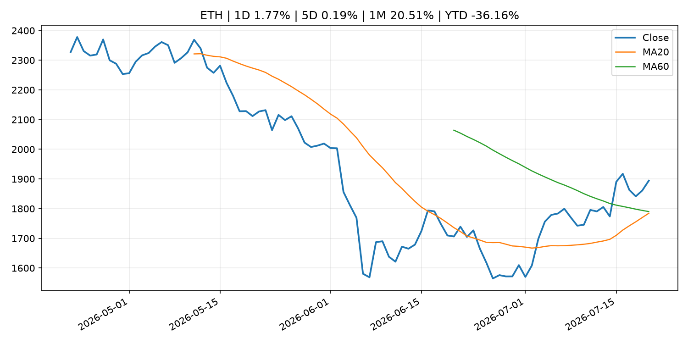
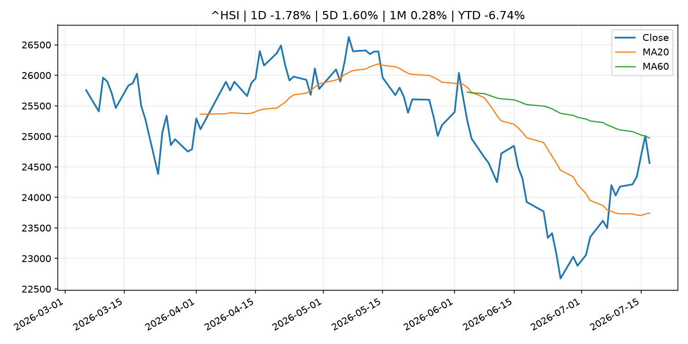

# Global Macro Morning Briefing - 2026-07-21

> Not financial advice / 非投资建议。

## 0. 今日总览
- 市场状态：unknown。市场信号不足，暂不判断明确状态。
- 今日三大主线：
  1. central_bank_decision: U.S. regulatory developments and earnings, ECB rate decision: Crypto Week Ahead
  2. crypto_market_structure: Amazon Japan supplier AZ-Com Maruwa to adopt yen stablecoin JPYC for payments
  3. earnings: Capital One bet big on Discover. Now it must prove the gamble was worth it
- 一句话结论：今日晨报重点关注：央行决策会重定价利率、汇率、久期资产和风险资产。；加密市场结构和监管变化会影响 BTC、ETH 及相关股票的风险溢价。。跨资产方面，SPY 1D -0.16%；QQQ 1D 0.10%；^VIX 1D -0.64%；TLT 1D -0.75%；GC=F 1D -0.12%；CL=F 1D 0.15%；BTC 1D 0.46%；ETH 1D 1.77%；市场信号不足，暂不判断明确状态。政策、通胀、利率、美元、美债、能源和加密监管仍是主要观察线索。所有结论仅基于公开数据与短摘要整理，不构成投资建议。

## 1. 隔夜跨资产市场
- 美股：SPY 1D -0.16%，QQQ 1D 0.10%，整体趋势需结合 VIX 和利率确认。
- 美债/美元：TLT 1D -0.75%，美元指数 1D 0.25%，是判断折现率压力的核心线索。
- 黄金/原油：黄金 1D -0.12%，原油 1D 0.15%，用于观察避险、通胀和地缘风险。
- 加密：BTC 1D 0.46%，ETH 1D 1.77%，关注是否独立于纳指走出加密自身行情。
- 港股/A股：恒生 1D -1.78%，沪深300/上证 1D n/a，重点看中国政策预期与人民币线索。
- 风险观察：关注后续数据是否确认当前跨资产信号。

### US_EQUITY

| symbol | latest close | 1D | 5D | 1M | YTD | trend |
|---|---:|---:|---:|---:|---:|---|
| SPY | 742.09 | -0.16% | -0.95% | 0.15% | 8.62% | range_bound |
| QQQ | 696.06 | 0.10% | -2.20% | -3.66% | 13.53% | range_bound |
| DIA | 517.94 | -0.55% | -1.25% | 0.32% | 7.09% | range_bound |
| IWM | 292.31 | -0.59% | -0.40% | 0.84% | 17.50% | range_bound |
| VTI | 366.25 | -0.21% | -0.95% | 0.13% | 8.90% | range_bound |

### US_MACRO_MARKET

| symbol | latest close | 1D | 5D | 1M | YTD | trend |
|---|---:|---:|---:|---:|---:|---|
| ^VIX | 18.65 | -0.64% | 8.68% | 1.14% | 28.53% | range_bound |
| DX-Y.NYB | 101.00 | 0.25% | -0.28% | 0.91% | 2.62% | range_bound |
| TLT | 83.89 | -0.75% | -0.10% | -2.83% | -3.61% | range_bound |
| IEF | 93.54 | -0.32% | 0.27% | -0.51% | -2.64% | downtrend |

### COMMODITIES

| symbol | latest close | 1D | 5D | 1M | YTD | trend |
|---|---:|---:|---:|---:|---:|---|
| GC=F | 4,007.70 | -0.12% | 0.27% | -8.06% | -7.11% | downtrend |
| SI=F | 56.46 | 0.75% | -2.04% | -20.14% | -19.98% | strong_downtrend |
| CL=F | 82.61 | 0.15% | 5.72% | 7.58% | 44.12% | range_bound |
| BZ=F | 89.07 | 1.10% | 6.93% | 11.97% | 46.62% | range_bound |
| NG=F | 2.84 | -2.37% | -1.90% | -9.63% | -21.45% | range_bound |
| HG=F | 6.33 | 1.84% | 1.63% | -2.27% | 12.31% | range_bound |

### HK_MARKET

| symbol | latest close | 1D | 5D | 1M | YTD | trend |
|---|---:|---:|---:|---:|---:|---|
| ^HSI | 24,562.24 | -1.78% | 1.60% | 0.28% | -6.74% | range_bound |
| 0700.HK | 477.80 | 3.51% | 4.41% | 7.27% | -23.31% | range_bound |
| 9988.HK | 116.80 | 3.73% | 5.51% | 9.26% | -21.61% | range_bound |
| 3690.HK | 86.30 | 3.17% | 10.71% | 15.99% | -17.50% | range_bound |
| 1810.HK | 27.74 | 3.20% | 7.35% | 9.13% | -31.13% | range_bound |
| 1211.HK | 90.15 | 1.63% | 7.39% | 10.07% | -8.71% | range_bound |

### CRYPTO

| symbol | latest close | 1D | 5D | 1M | YTD | trend |
|---|---:|---:|---:|---:|---:|---|
| BTC | 65,092.25 | 0.46% | 0.18% | 9.19% | -25.63% | range_bound |
| ETH | 1,894.09 | 1.77% | 0.19% | 20.51% | -36.16% | range_bound |
| SOLANA | 77.41 | 2.62% | -0.41% | 8.42% | -37.83% | range_bound |
| BINANCECOIN | 569.62 | -0.11% | -2.11% | 3.38% | -34.01% | downtrend |
| RIPPLE | 1.11 | 1.51% | -0.24% | 5.75% | -39.72% | range_bound |

## 2. 今日最重要的 10 条新闻
### 1. U.S. regulatory developments and earnings, ECB rate decision: Crypto Week Ahead
- 来源：CoinDesk
- 时间：2026-07-20T08:57:53+00:00
- 地区：global
- 事件类型：central_bank_decision
- 重要性层级：Tier 1
- 一句话摘要：U.S. regulatory developments and earnings, ECB rate decision: Crypto Week Ahead
- 为什么重要：央行决策会重定价利率、汇率、久期资产和风险资产。
- 可能影响：可能影响利率、汇率、风险资产或大宗商品预期，但当前公开信息不足以判断明确方向。
  - 资产：暂无明确资产映射
  - 方向：unknown
  - 强度：low
  - 原因：公开信息不足以判断方向。
- 原文链接：[https://www.coindesk.com/markets/2026/07/20/u-s-regulatory-developments-and-earnings-ecb-rate-decision-crypto-week-ahead](https://www.coindesk.com/markets/2026/07/20/u-s-regulatory-developments-and-earnings-ecb-rate-decision-crypto-week-ahead)

### 2. Amazon Japan supplier AZ-Com Maruwa to adopt yen stablecoin JPYC for payments
- 来源：CoinDesk
- 时间：2026-07-20T08:10:34+00:00
- 地区：global
- 事件类型：crypto_market_structure
- 重要性层级：Tier 2
- 一句话摘要：Amazon Japan supplier AZ-Com Maruwa to adopt yen stablecoin JPYC for payments
- 为什么重要：加密市场结构和监管变化会影响 BTC、ETH 及相关股票的风险溢价。
- 可能影响：主要影响 BTC，方向为 mixed，强度 high；加密监管或 ETF 进展会改变 BTC 的资金流和风险溢价。
  - 资产：BTC
    方向：mixed
    强度：high
    原因：加密监管或 ETF 进展会改变 BTC 的资金流和风险溢价。
  - 资产：ETH
    方向：mixed
    强度：high
    原因：监管框架会影响 ETH 产品化和机构参与度。
  - 资产：COIN
    方向：mixed
    强度：medium
    原因：监管清晰度和执法风险会影响交易平台估值。
  - 资产：crypto market
    方向：mixed
    强度：high
    原因：信息影响整个加密市场结构，但方向取决于细节。
  - 资产：QQQ
    方向：mixed
    强度：high
    原因：AI 资本开支会影响大型科技股盈利和估值预期。
  - 资产：SMH
    方向：mixed
    强度：high
    原因：AI 投资周期直接影响半导体需求。
- 原文链接：[https://www.coindesk.com/business/2026/07/20/amazon-japan-supplier-az-com-maruwa-to-adopt-yen-stablecoin-jpyc-for-payments](https://www.coindesk.com/business/2026/07/20/amazon-japan-supplier-az-com-maruwa-to-adopt-yen-stablecoin-jpyc-for-payments)

### 3. Capital One bet big on Discover. Now it must prove the gamble was worth it
- 来源：CNBC Economy
- 时间：2026-07-20T18:14:23+00:00
- 地区：US
- 事件类型：earnings
- 重要性层级：Tier 2
- 一句话摘要：Tuesday evening's second-quarter earnings report is the perfect stage to do just that.
- 为什么重要：大型科技股盈利和资本开支会影响纳指、半导体和 AI 交易主线。
- 可能影响：可能影响利率、汇率、风险资产或大宗商品预期，但当前公开信息不足以判断明确方向。
  - 资产：暂无明确资产映射
  - 方向：unknown
  - 强度：low
  - 原因：公开信息不足以判断方向。
- 原文链接：[https://www.cnbc.com/2026/07/20/capital-one-bet-big-on-discover-now-it-must-prove-the-gamble-was-worth-it-.html](https://www.cnbc.com/2026/07/20/capital-one-bet-big-on-discover-now-it-must-prove-the-gamble-was-worth-it-.html)

### 4. Coinbase trading results may fall short of expectations, according to prediction markets
- 来源：CNBC Economy
- 时间：2026-07-20T12:41:50+00:00
- 地区：US
- 事件类型：earnings
- 重要性层级：Tier 2
- 一句话摘要：Speculators think in the company's second quarter earnings report, it will show trading volume fell for a third consecutive quarter.
- 为什么重要：大型科技股盈利和资本开支会影响纳指、半导体和 AI 交易主线。
- 可能影响：可能影响利率、汇率、风险资产或大宗商品预期，但当前公开信息不足以判断明确方向。
  - 资产：暂无明确资产映射
  - 方向：unknown
  - 强度：low
  - 原因：公开信息不足以判断方向。
- 原文链接：[https://www.cnbc.com/2026/07/20/kalshi-traders-think-coinbases-trading-volume-will-fall-again.html](https://www.cnbc.com/2026/07/20/kalshi-traders-think-coinbases-trading-volume-will-fall-again.html)

### 5. Bitcoin flat near $64,000 as oil hits a one-month high and Kimi AI selloff lingers
- 来源：CoinDesk
- 时间：2026-07-20T05:31:43+00:00
- 地区：global
- 事件类型：other
- 重要性层级：Tier 3
- 一句话摘要：Bitcoin flat near $64,000 as oil hits a one-month high and Kimi AI selloff lingers
- 为什么重要：这条信息暂未匹配到重大宏观、政策或市场事件，更适合作为背景跟踪。
- 可能影响：主要影响 CL=F，方向为 positive，强度 high；供给扰动或 OPEC 减产通常推升 WTI 原油。
  - 资产：CL=F
    方向：positive
    强度：high
    原因：供给扰动或 OPEC 减产通常推升 WTI 原油。
  - 资产：BZ=F
    方向：positive
    强度：high
    原因：全球供给风险通常直接影响 Brent 原油。
  - 资产：SPY
    方向：mixed
    强度：medium
    原因：能源股可能受益，但通胀和成本压力不利于宽基风险资产。
- 原文链接：[https://www.coindesk.com/markets/2026/07/20/bitcoin-flat-near-usd64-000-as-oil-hits-a-one-month-high-and-kimi-ai-selloff-lingers](https://www.coindesk.com/markets/2026/07/20/bitcoin-flat-near-usd64-000-as-oil-hits-a-one-month-high-and-kimi-ai-selloff-lingers)

### 6. I will claim Social Security early. Why do so few people talk about the elephant in the room?
- 来源：MarketWatch Top Stories
- 时间：2026-07-20T22:30:00+00:00
- 地区：US
- 事件类型：other
- 重要性层级：Tier 3
- 一句话摘要：“The strongest argument for claiming benefits earlier goes beyond the traditional break-even analyses.”
- 为什么重要：这条信息暂未匹配到重大宏观、政策或市场事件，更适合作为背景跟踪。
- 可能影响：更偏背景信息，短期市场影响可能有限。
  - 资产：暂无明确资产映射
  - 方向：unknown
  - 强度：low
  - 原因：公开信息不足以判断方向。
- 原文链接：[https://www.marketwatch.com/story/i-will-claim-social-security-early-why-do-so-few-people-talk-about-the-elephant-in-the-room-64820675?mod=mw_rss_topstories](https://www.marketwatch.com/story/i-will-claim-social-security-early-why-do-so-few-people-talk-about-the-elephant-in-the-room-64820675?mod=mw_rss_topstories)

## 3. 政策与央行观察
### 1. U.S. regulatory developments and earnings, ECB rate decision: Crypto Week Ahead
- 来源：CoinDesk
- 时间：2026-07-20T08:57:53+00:00
- 地区：global
- 事件类型：central_bank_decision
- 重要性层级：Tier 1
- 一句话摘要：U.S. regulatory developments and earnings, ECB rate decision: Crypto Week Ahead
- 为什么重要：央行决策会重定价利率、汇率、久期资产和风险资产。
- 可能影响：可能影响利率、汇率、风险资产或大宗商品预期，但当前公开信息不足以判断明确方向。
  - 资产：暂无明确资产映射
  - 方向：unknown
  - 强度：low
  - 原因：公开信息不足以判断方向。
- 原文链接：[https://www.coindesk.com/markets/2026/07/20/u-s-regulatory-developments-and-earnings-ecb-rate-decision-crypto-week-ahead](https://www.coindesk.com/markets/2026/07/20/u-s-regulatory-developments-and-earnings-ecb-rate-decision-crypto-week-ahead)

### 2. Amazon Japan supplier AZ-Com Maruwa to adopt yen stablecoin JPYC for payments
- 来源：CoinDesk
- 时间：2026-07-20T08:10:34+00:00
- 地区：global
- 事件类型：crypto_market_structure
- 重要性层级：Tier 2
- 一句话摘要：Amazon Japan supplier AZ-Com Maruwa to adopt yen stablecoin JPYC for payments
- 为什么重要：加密市场结构和监管变化会影响 BTC、ETH 及相关股票的风险溢价。
- 可能影响：主要影响 BTC，方向为 mixed，强度 high；加密监管或 ETF 进展会改变 BTC 的资金流和风险溢价。
  - 资产：BTC
    方向：mixed
    强度：high
    原因：加密监管或 ETF 进展会改变 BTC 的资金流和风险溢价。
  - 资产：ETH
    方向：mixed
    强度：high
    原因：监管框架会影响 ETH 产品化和机构参与度。
  - 资产：COIN
    方向：mixed
    强度：medium
    原因：监管清晰度和执法风险会影响交易平台估值。
  - 资产：crypto market
    方向：mixed
    强度：high
    原因：信息影响整个加密市场结构，但方向取决于细节。
  - 资产：QQQ
    方向：mixed
    强度：high
    原因：AI 资本开支会影响大型科技股盈利和估值预期。
  - 资产：SMH
    方向：mixed
    强度：high
    原因：AI 投资周期直接影响半导体需求。
- 原文链接：[https://www.coindesk.com/business/2026/07/20/amazon-japan-supplier-az-com-maruwa-to-adopt-yen-stablecoin-jpyc-for-payments](https://www.coindesk.com/business/2026/07/20/amazon-japan-supplier-az-com-maruwa-to-adopt-yen-stablecoin-jpyc-for-payments)

## 4. 市场异动与图表
- TLT 下跌 -0.75%

### SPY

### QQQ

### ^VIX

### TLT

### GC=F

### CL=F

### BTC

### ETH

### ^HSI

## 5. 华尔街与机构公开观点
- 暂无可靠公开观点。

## 6. 今日重点关注
- 经济数据：经济数据：暂无可靠公开日历数据；如配置经济日历源后可自动填充。
- 央行讲话：央行讲话：暂无可靠公开日历数据；重点跟踪 Fed、ECB、BoJ、PBOC 官网 RSS。
- 财报：财报：暂无可靠数据。
- 政策事件：政策事件：暂无可靠数据。
- 风险提醒：风险提醒：关注数据源失败项、突发地缘风险、利率和美元的二阶反应。

## 7. 英文金融表达与宏观概念
- **supply disruption**：供给扰动，通常指能源或商品供应受冲突、减产或天气影响。 例句：Supply disruption can lift oil prices and inflation expectations.
- **market structure**：市场结构，指交易、托管、清算、ETF、监管等制度安排。 例句：Crypto market structure rules can affect institutional participation.
- **inflation expectations**：通胀预期，指家庭、企业或市场对未来通胀的预估。 例句：Inflation expectations can shape wage bargaining and bond yields.
- **real yield**：实际收益率，名义利率扣除通胀预期后的收益率。 例句：Gold often reacts more to real yields than nominal yields.
- **terminal rate**：终端利率，市场预期本轮加息周期的最高政策利率。 例句：A higher terminal rate can pressure growth stocks.
- **soft landing**：软着陆，指通胀回落而经济避免明显衰退。 例句：Markets often rally when data support a soft landing.

## 8. 背景材料
- [I will claim Social Security early. Why do so few people talk about the elephant in the room?](https://www.marketwatch.com/story/i-will-claim-social-security-early-why-do-so-few-people-talk-about-the-elephant-in-the-room-64820675?mod=mw_rss_topstories)（MarketWatch Top Stories，other）：“The strongest argument for claiming benefits earlier goes beyond the traditional break-even analyses.”
- [U.S. hits Canada with stiff new tariffs, escalating trade tensions](https://www.marketwatch.com/story/u-s-hits-canada-with-stiff-new-tariffs-escalating-trade-tensions-4a97065f?mod=mw_rss_topstories)（MarketWatch Top Stories，other）：The Trump administration on Monday said it would slap 50% tariffs on some goods imported from Canada, in an effort to end what it sees as discriminatory trade practices by Ottawa against the U.S. automobile, dairy and alcohol industries.
- [Lumentum’s stock just got a lot more interesting — and Barclays has turned bullish](https://www.marketwatch.com/story/lumentums-stock-just-got-a-lot-more-interesting-and-barclays-has-turned-bullish-e00e3395?mod=mw_rss_topstories)（MarketWatch Top Stories，other）：A Barclays analyst now recommends Lumentum’s stock after a period of substantial underperformance relative to the broader chip sector.
- [Saylor's Strategy raises cash reserves to $3.2 billion, leaving bitcoin holdings unchanged](https://www.coindesk.com/business/2026/07/20/saylor-s-strategy-raises-cash-reserves-to-usd3-225-billion-leaving-bitcoin-holdings-unchanged)（CoinDesk，other）：Saylor's Strategy raises cash reserves to $3.2 billion, leaving bitcoin holdings unchanged
- [Brazil’s securities regulator sets up task force with 60-day deadline for tokenization proposal](https://www.coindesk.com/policy/2026/07/20/brazil-s-securities-regulator-sets-up-task-force-with-60-day-deadline-for-tokenization-proposal)（CoinDesk，other）：Brazil’s securities regulator sets up task force with 60-day deadline for tokenization proposal
- [A bitcoin 'volmageddon' may be brewing, key indicator suggests](https://www.coindesk.com/daybook-us/2026/07/20/a-bitcoin-volmageddon-may-be-brewing-key-indicator-suggests)（CoinDesk，other）：A bitcoin 'volmageddon' may be brewing, key indicator suggests
- [Survey on the Access to Finance of Enterprises: lending conditions tightened](https://www.ecb.europa.eu//press/pr/date/2026/html/ecb.pr260720~cafc3874a7.en.html)（ECB Press Releases，other）：Survey on the Access to Finance of Enterprises: lending conditions tightened
- [Live updates: Bitcoin rises to one-month high of $65,700 before pulling back with stocks](https://www.coindesk.com/tech/2026/07/20/live-markets-oil-bounce-and-lingering-ai-selloff-pushes-bitcoin-under-usd64-000)（CoinDesk，other）：Live updates: Bitcoin rises to one-month high of $65,700 before pulling back with stocks
- [Moonshot AI IPO push follows Kimi, Alibaba AI releases that shook bitcoin](https://www.coindesk.com/tech/2026/07/20/moonshot-ai-ipo-push-follows-kimi-alibaba-ai-releases-that-shook-bitcoin)（CoinDesk，other）：Moonshot AI IPO push follows Kimi, Alibaba AI releases that shook bitcoin
- [Bitcoin ETFs see new money again, but inflows remain ‘peanuts’ relative to the recent exodus](https://www.coindesk.com/markets/2026/07/20/bitcoin-etfs-see-new-money-again-but-inflows-remain-peanuts-relative-to-the-recent-exodus)（CoinDesk，other）：Bitcoin ETFs see new money again, but inflows remain ‘peanuts’ relative to the recent exodus
- [Bitcoin flat near $64,000 as oil hits a one-month high and Kimi AI selloff lingers](https://www.coindesk.com/markets/2026/07/20/bitcoin-flat-near-usd64-000-as-oil-hits-a-one-month-high-and-kimi-ai-selloff-lingers)（CoinDesk，other）：Bitcoin flat near $64,000 as oil hits a one-month high and Kimi AI selloff lingers
- [Bitcoin's biggest advocate, Michael Saylor, says new plan to clean up the blockchain is 'a bad idea'](https://www.coindesk.com/tech/2026/07/19/bitcoin-s-biggest-advocate-michael-saylor-says-new-plan-to-clean-up-the-blockchain-is-a-bad-idea)（CoinDesk，other）：Bitcoin's biggest advocate, Michael Saylor, says new plan to clean up the blockchain is 'a bad idea'
- [Bitcoin’s quantum problem gets a recovery tool, but not for Satoshi’s 1.1 million coins](https://www.coindesk.com/tech/2026/07/19/bitcoin-s-quantum-problem-gets-a-recovery-tool-but-not-for-satoshi-s-1-1-million-coin)（CoinDesk，other）：Bitcoin’s quantum problem gets a recovery tool, but not for Satoshi’s 1.1 million coins
- [Inside Zcash's new node that targets Visa-scale privacy at 50,000 transactions per second](https://www.coindesk.com/tech/2026/07/16/inside-zcash-s-new-node-that-targets-visa-scale-privacy-at-50-000-transactions-per-second)（CoinDesk，other）：Inside Zcash's new node that targets Visa-scale privacy at 50,000 transactions per second

## 9. 数据源、失败项与免责声明
- 采集时间：2026-07-20T22:58:54
- 数据源：公开 RSS、Yahoo Finance、CoinGecko、AKShare、FRED、SEC data.sec.gov，以及用户自有 inputs/reports 文件。
- 合规说明：不绕过 WSJ、Bloomberg、FT、Reuters 等付费墙；对付费媒体只使用公开 RSS 标题、摘要、链接和发布时间。
- 免责声明：Not financial advice / 非投资建议。本项目仅供个人学习、研究和信息整理，不构成投资建议、交易建议或任何收益承诺。
- 失败或跳过的数据源：
  - crypto data failed coin=dogecoin
  - China market data failed symbol=上证指数: empty dataframe
  - China market data failed symbol=深证成指: empty dataframe
  - China market data failed symbol=创业板指: empty dataframe
  - China market data failed symbol=沪深300: empty dataframe
  - China market data failed symbol=中证500: empty dataframe
  - China market data failed symbol=科创50: empty dataframe
  - FRED_API_KEY not set; skipping FRED macro series
  - SEC failed cik=0000320193
  - SEC failed cik=0000789019
  - SEC failed cik=0001045810
  - SEC failed cik=0001318605
  - SEC failed cik=0001577552
