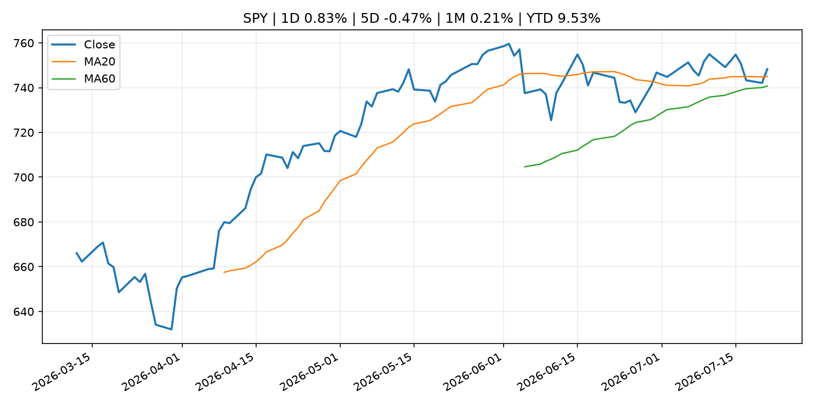
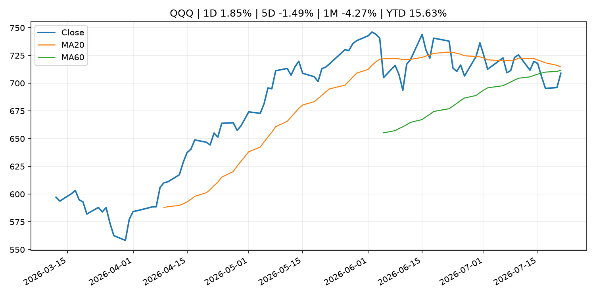
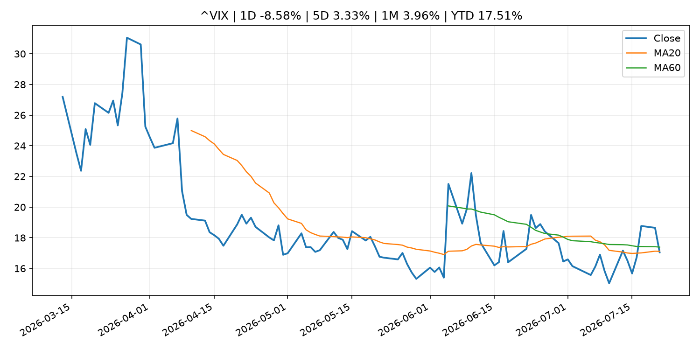
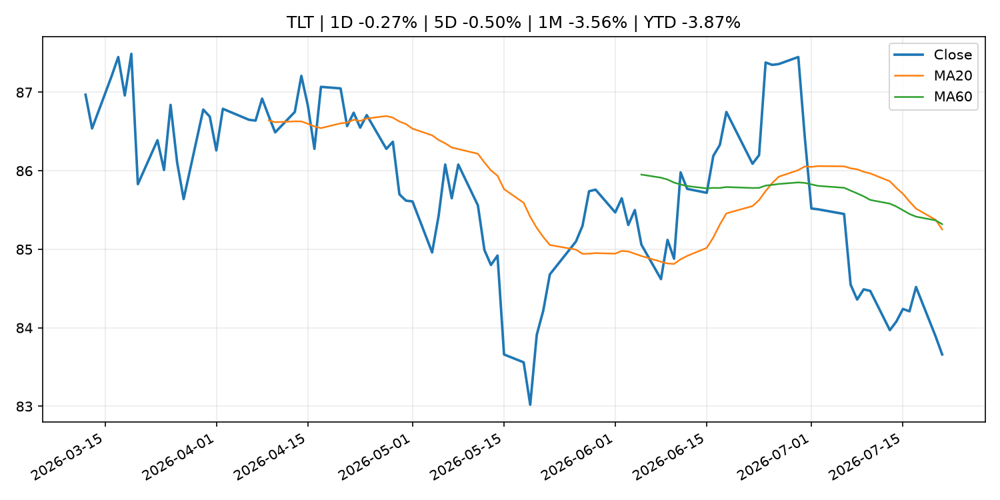
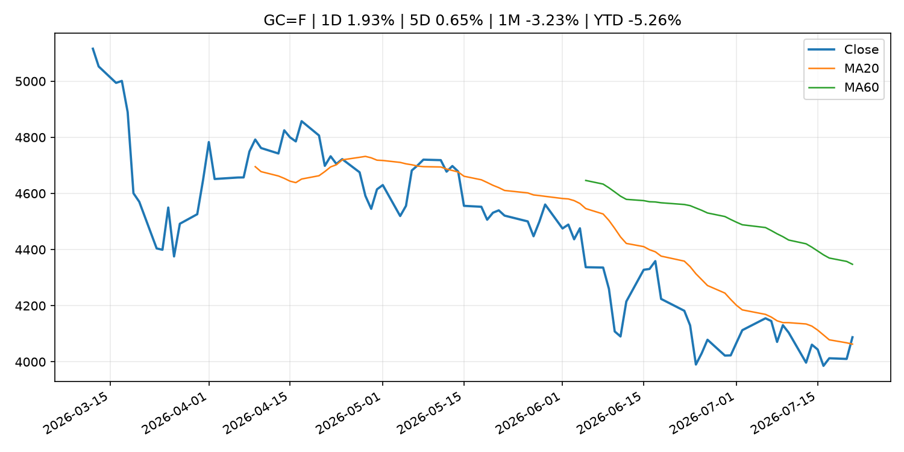
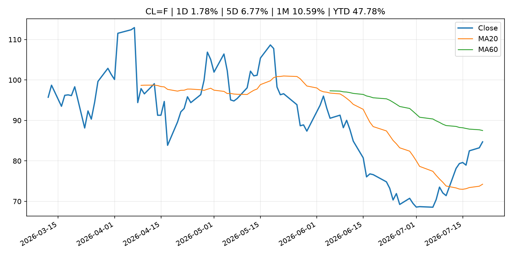
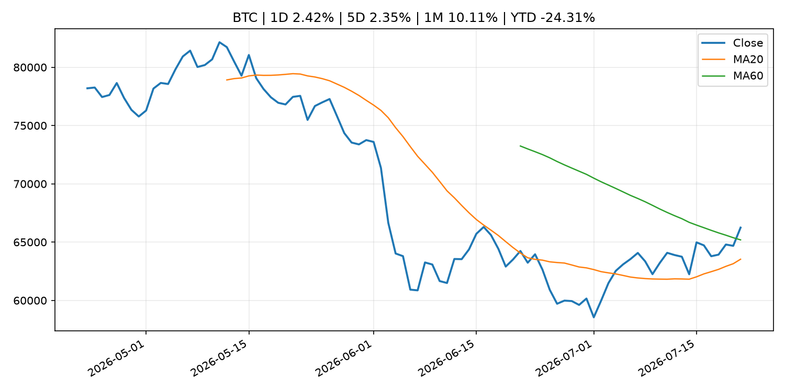
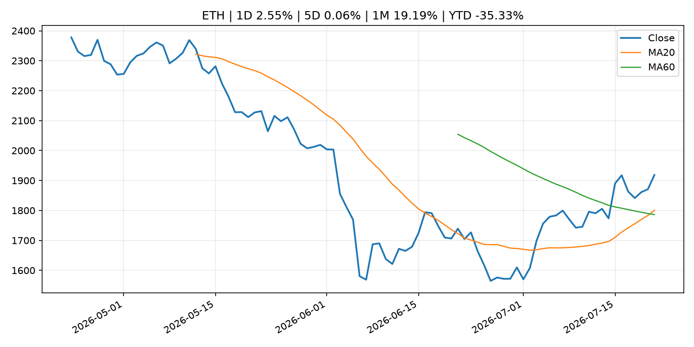
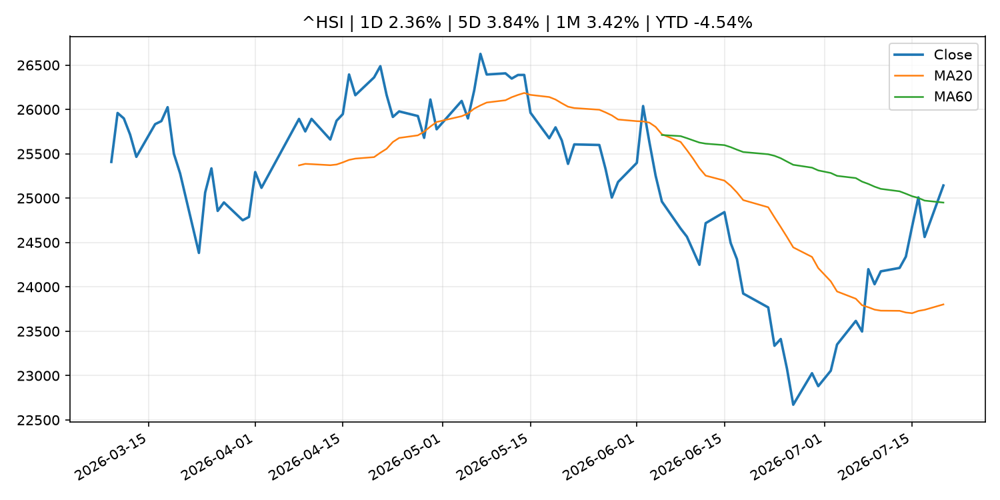

# Global Macro Morning Briefing - 2026-07-22

> Not financial advice / 非投资建议。

## 0. 今日总览
- 市场状态：risk_on。股指上涨、波动率或美元回落，市场更接近风险偏好改善。
- 今日三大主线：
  1. geopolitical_risk: Why energy stocks still look so cheap, even after their big rally this month
  2. crypto_market_structure: Augustus raises $180 million to build a clearing bank for the AI and stablecoin era
  3. earnings: Capital One bet big on Discover. Now it must prove the gamble was worth it
- 一句话结论：今日晨报重点关注：地缘风险可能推升避险需求、能源价格和市场波动率。；加密市场结构和监管变化会影响 BTC、ETH 及相关股票的风险溢价。。跨资产方面，SPY 1D 0.83%；QQQ 1D 1.85%；^VIX 1D -8.58%；TLT 1D -0.27%；GC=F 1D 1.93%；CL=F 1D 1.78%；BTC 1D 2.42%；ETH 1D 2.55%；股指上涨、波动率或美元回落，市场更接近风险偏好改善。政策、通胀、利率、美元、美债、能源和加密监管仍是主要观察线索。所有结论仅基于公开数据与短摘要整理，不构成投资建议。

## 1. 隔夜跨资产市场
- 美股：SPY 1D 0.83%，QQQ 1D 1.85%，整体趋势需结合 VIX 和利率确认。
- 美债/美元：TLT 1D -0.27%，美元指数 1D 0.20%，是判断折现率压力的核心线索。
- 黄金/原油：黄金 1D 1.93%，原油 1D 1.78%，用于观察避险、通胀和地缘风险。
- 加密：BTC 1D 2.42%，ETH 1D 2.55%，关注是否独立于纳指走出加密自身行情。
- 港股/A股：恒生 1D 2.36%，沪深300/上证 1D n/a，重点看中国政策预期与人民币线索。
- 风险观察：确认风险偏好是否扩散到小盘股、信用利差和周期品。

### US_EQUITY

| symbol | latest close | 1D | 5D | 1M | YTD | trend |
|---|---:|---:|---:|---:|---:|---|
| SPY | 748.28 | 0.83% | -0.47% | 0.21% | 9.53% | uptrend |
| QQQ | 708.97 | 1.85% | -1.49% | -4.27% | 15.63% | range_bound |
| DIA | 521.51 | 0.69% | -0.61% | 1.16% | 7.83% | range_bound |
| IWM | 296.54 | 1.45% | 0.69% | 0.32% | 19.20% | range_bound |
| VTI | 369.45 | 0.87% | -0.46% | -0.15% | 9.85% | uptrend |

### US_MACRO_MARKET

| symbol | latest close | 1D | 5D | 1M | YTD | trend |
|---|---:|---:|---:|---:|---:|---|
| ^VIX | 17.05 | -8.58% | 3.33% | 3.96% | 17.51% | downtrend |
| DX-Y.NYB | 101.19 | 0.20% | 0.25% | 0.34% | 2.82% | uptrend |
| TLT | 83.66 | -0.27% | -0.50% | -3.56% | -3.87% | strong_downtrend |
| IEF | 93.31 | -0.25% | -0.26% | -1.11% | -2.88% | downtrend |

### COMMODITIES

| symbol | latest close | 1D | 5D | 1M | YTD | trend |
|---|---:|---:|---:|---:|---:|---|
| GC=F | 4,087.60 | 1.93% | 0.65% | -3.23% | -5.26% | range_bound |
| SI=F | 59.17 | 4.16% | 0.67% | -10.70% | -16.14% | range_bound |
| CL=F | 84.71 | 1.78% | 6.77% | 10.59% | 47.78% | range_bound |
| BZ=F | 91.64 | 2.71% | 8.16% | 14.77% | 50.85% | range_bound |
| NG=F | 2.88 | 0.87% | -0.65% | -10.76% | -20.26% | range_bound |
| HG=F | 6.53 | 3.68% | 3.18% | 2.46% | 15.80% | range_bound |

### HK_MARKET

| symbol | latest close | 1D | 5D | 1M | YTD | trend |
|---|---:|---:|---:|---:|---:|---|
| ^HSI | 25,143.05 | 2.36% | 3.84% | 3.42% | -4.54% | range_bound |
| 0700.HK | 474.00 | -0.80% | 3.90% | 7.68% | -23.92% | range_bound |
| 9988.HK | 117.00 | 0.17% | 5.60% | 11.53% | -21.48% | range_bound |
| 3690.HK | 85.20 | -1.27% | 7.58% | 18.66% | -18.55% | range_bound |
| 1810.HK | 27.42 | -1.15% | 5.30% | 11.55% | -31.93% | range_bound |
| 1211.HK | 89.80 | -0.39% | 4.24% | 11.07% | -9.06% | range_bound |

### CRYPTO

| symbol | latest close | 1D | 5D | 1M | YTD | trend |
|---|---:|---:|---:|---:|---:|---|
| BTC | 66,244.43 | 2.42% | 2.35% | 10.11% | -24.31% | range_bound |
| ETH | 1,918.52 | 2.55% | 0.06% | 19.19% | -35.33% | strong_uptrend |
| SOLANA | 77.86 | 2.03% | 0.79% | 3.84% | -37.47% | range_bound |
| BINANCECOIN | 572.22 | 0.29% | -1.34% | 2.42% | -33.71% | downtrend |
| RIPPLE | 1.14 | 4.14% | 2.55% | 7.87% | -37.98% | range_bound |

## 2. 今日最重要的 10 条新闻
### 1. Why energy stocks still look so cheap, even after their big rally this month
- 来源：MarketWatch Top Stories
- 时间：2026-07-21T20:27:00+00:00
- 地区：US
- 事件类型：geopolitical_risk
- 重要性层级：Tier 1
- 一句话摘要：Energy stocks are having a big month as oil prices surge on Iran war fears — but it’s not solely the conflict in the Middle East that makes the sector appear attractive.
- 为什么重要：地缘风险可能推升避险需求、能源价格和市场波动率。
- 可能影响：主要影响 CL=F，方向为 positive，强度 high；供给扰动或 OPEC 减产通常推升 WTI 原油。
  - 资产：CL=F
    方向：positive
    强度：high
    原因：供给扰动或 OPEC 减产通常推升 WTI 原油。
  - 资产：BZ=F
    方向：positive
    强度：high
    原因：全球供给风险通常直接影响 Brent 原油。
  - 资产：SPY
    方向：mixed
    强度：medium
    原因：能源股可能受益，但通胀和成本压力不利于宽基风险资产。
- 原文链接：[https://www.marketwatch.com/story/why-energy-stocks-still-look-so-cheap-even-after-their-big-rally-this-month-7f1a298b?mod=mw_rss_topstories](https://www.marketwatch.com/story/why-energy-stocks-still-look-so-cheap-even-after-their-big-rally-this-month-7f1a298b?mod=mw_rss_topstories)

### 2. Augustus raises $180 million to build a clearing bank for the AI and stablecoin era
- 来源：CoinDesk
- 时间：2026-07-21T14:27:03+00:00
- 地区：global
- 事件类型：crypto_market_structure
- 重要性层级：Tier 2
- 一句话摘要：Augustus raises $180 million to build a clearing bank for the AI and stablecoin era
- 为什么重要：加密市场结构和监管变化会影响 BTC、ETH 及相关股票的风险溢价。
- 可能影响：主要影响 BTC，方向为 mixed，强度 high；加密监管或 ETF 进展会改变 BTC 的资金流和风险溢价。
  - 资产：BTC
    方向：mixed
    强度：high
    原因：加密监管或 ETF 进展会改变 BTC 的资金流和风险溢价。
  - 资产：ETH
    方向：mixed
    强度：high
    原因：监管框架会影响 ETH 产品化和机构参与度。
  - 资产：COIN
    方向：mixed
    强度：medium
    原因：监管清晰度和执法风险会影响交易平台估值。
  - 资产：crypto market
    方向：mixed
    强度：high
    原因：信息影响整个加密市场结构，但方向取决于细节。
- 原文链接：[https://www.coindesk.com/business/2026/07/21/augustus-raises-usd180-million-to-build-a-clearing-bank-for-the-ai-and-stablecoin-era](https://www.coindesk.com/business/2026/07/21/augustus-raises-usd180-million-to-build-a-clearing-bank-for-the-ai-and-stablecoin-era)

### 3. Capital One bet big on Discover. Now it must prove the gamble was worth it
- 来源：CNBC Economy
- 时间：2026-07-20T18:14:23+00:00
- 地区：US
- 事件类型：earnings
- 重要性层级：Tier 2
- 一句话摘要：Tuesday evening's second-quarter earnings report is the perfect stage to do just that.
- 为什么重要：大型科技股盈利和资本开支会影响纳指、半导体和 AI 交易主线。
- 可能影响：可能影响利率、汇率、风险资产或大宗商品预期，但当前公开信息不足以判断明确方向。
  - 资产：暂无明确资产映射
  - 方向：unknown
  - 强度：low
  - 原因：公开信息不足以判断方向。
- 原文链接：[https://www.cnbc.com/2026/07/20/capital-one-bet-big-on-discover-now-it-must-prove-the-gamble-was-worth-it-.html](https://www.cnbc.com/2026/07/20/capital-one-bet-big-on-discover-now-it-must-prove-the-gamble-was-worth-it-.html)

### 4. Coinbase trading results may fall short of expectations, according to prediction markets
- 来源：CNBC Economy
- 时间：2026-07-20T12:41:50+00:00
- 地区：US
- 事件类型：earnings
- 重要性层级：Tier 2
- 一句话摘要：Speculators think in the company's second quarter earnings report, it will show trading volume fell for a third consecutive quarter.
- 为什么重要：大型科技股盈利和资本开支会影响纳指、半导体和 AI 交易主线。
- 可能影响：可能影响利率、汇率、风险资产或大宗商品预期，但当前公开信息不足以判断明确方向。
  - 资产：暂无明确资产映射
  - 方向：unknown
  - 强度：low
  - 原因：公开信息不足以判断方向。
- 原文链接：[https://www.cnbc.com/2026/07/20/kalshi-traders-think-coinbases-trading-volume-will-fall-again.html](https://www.cnbc.com/2026/07/20/kalshi-traders-think-coinbases-trading-volume-will-fall-again.html)

### 5. Goldman Sachs creates private markets platform as rich investors seek the next SpaceX and Stripe
- 来源：CNBC Economy
- 时间：2026-07-21T20:51:34+00:00
- 地区：US
- 事件类型：other
- 重要性层级：Tier 3
- 一句话摘要：Goldman Sachs is launching a new alternative investments platform aimed at giving wealthy clients and family offices direct stakes in private companies.
- 为什么重要：这条信息暂未匹配到重大宏观、政策或市场事件，更适合作为背景跟踪。
- 可能影响：更偏背景信息，短期市场影响可能有限。
  - 资产：暂无明确资产映射
  - 方向：unknown
  - 强度：low
  - 原因：公开信息不足以判断方向。
- 原文链接：[https://www.cnbc.com/2026/07/21/goldman-sachs-private-markets-platform.html](https://www.cnbc.com/2026/07/21/goldman-sachs-private-markets-platform.html)

### 6. ECB appoints Boris Kisselevsky as Director General Secretariat
- 来源：ECB Press Releases
- 时间：2026-07-21T16:00:00+02:00
- 地区：EU
- 事件类型：other
- 重要性层级：Tier 3
- 一句话摘要：ECB appoints Boris Kisselevsky as Director General Secretariat
- 为什么重要：这条信息暂未匹配到重大宏观、政策或市场事件，更适合作为背景跟踪。
- 可能影响：更偏背景信息，短期市场影响可能有限。
  - 资产：暂无明确资产映射
  - 方向：unknown
  - 强度：low
  - 原因：公开信息不足以判断方向。
- 原文链接：[https://www.ecb.europa.eu//press/pr/date/2026/html/ecb.pr260721_1~8c6ba4c5fb.en.html](https://www.ecb.europa.eu//press/pr/date/2026/html/ecb.pr260721_1~8c6ba4c5fb.en.html)

## 3. 政策与央行观察
### 1. Augustus raises $180 million to build a clearing bank for the AI and stablecoin era
- 来源：CoinDesk
- 时间：2026-07-21T14:27:03+00:00
- 地区：global
- 事件类型：crypto_market_structure
- 重要性层级：Tier 2
- 一句话摘要：Augustus raises $180 million to build a clearing bank for the AI and stablecoin era
- 为什么重要：加密市场结构和监管变化会影响 BTC、ETH 及相关股票的风险溢价。
- 可能影响：主要影响 BTC，方向为 mixed，强度 high；加密监管或 ETF 进展会改变 BTC 的资金流和风险溢价。
  - 资产：BTC
    方向：mixed
    强度：high
    原因：加密监管或 ETF 进展会改变 BTC 的资金流和风险溢价。
  - 资产：ETH
    方向：mixed
    强度：high
    原因：监管框架会影响 ETH 产品化和机构参与度。
  - 资产：COIN
    方向：mixed
    强度：medium
    原因：监管清晰度和执法风险会影响交易平台估值。
  - 资产：crypto market
    方向：mixed
    强度：high
    原因：信息影响整个加密市场结构，但方向取决于细节。
- 原文链接：[https://www.coindesk.com/business/2026/07/21/augustus-raises-usd180-million-to-build-a-clearing-bank-for-the-ai-and-stablecoin-era](https://www.coindesk.com/business/2026/07/21/augustus-raises-usd180-million-to-build-a-clearing-bank-for-the-ai-and-stablecoin-era)

## 4. 市场异动与图表
- SPY 上涨 0.83%
- QQQ 上涨 1.85%
- VIX 下跌 -8.58%
- Gold 上涨 1.93%
- Oil 上涨 1.78%
- BTC 上涨 2.42%
- ETH 上涨 2.55%

### SPY

### QQQ

### ^VIX

### TLT

### GC=F

### CL=F

### BTC

### ETH

### ^HSI

## 5. 华尔街与机构公开观点
- 暂无可靠公开观点。

## 6. 今日重点关注
- 经济数据：经济数据：暂无可靠公开日历数据；如配置经济日历源后可自动填充。
- 央行讲话：央行讲话：暂无可靠公开日历数据；重点跟踪 Fed、ECB、BoJ、PBOC 官网 RSS。
- 财报：财报：暂无可靠数据。
- 政策事件：政策事件：暂无可靠数据。
- 风险提醒：风险提醒：关注数据源失败项、突发地缘风险、利率和美元的二阶反应。

## 7. 英文金融表达与宏观概念
- **real yield**：实际收益率，名义利率扣除通胀预期后的收益率。 例句：Gold often reacts more to real yields than nominal yields.
- **risk-off**：避险模式，资金偏向美元、国债、黄金等防御资产。 例句：A geopolitical shock can push markets into risk-off mode.
- **supply disruption**：供给扰动，通常指能源或商品供应受冲突、减产或天气影响。 例句：Supply disruption can lift oil prices and inflation expectations.
- **market structure**：市场结构，指交易、托管、清算、ETF、监管等制度安排。 例句：Crypto market structure rules can affect institutional participation.
- **inflation expectations**：通胀预期，指家庭、企业或市场对未来通胀的预估。 例句：Inflation expectations can shape wage bargaining and bond yields.
- **terminal rate**：终端利率，市场预期本轮加息周期的最高政策利率。 例句：A higher terminal rate can pressure growth stocks.

## 8. 背景材料
- [Crypto Clarity Act still at mercy of ethics section as Democrats balk at Trump deal](https://www.coindesk.com/policy/2026/07/21/crypto-clarity-act-still-at-mercy-of-ethics-section-as-democrats-balk-at-trump-deal)（CoinDesk，other）：Crypto Clarity Act still at mercy of ethics section as Democrats balk at Trump deal
- [Goldman Sachs creates private markets platform as rich investors seek the next SpaceX and Stripe](https://www.cnbc.com/2026/07/21/goldman-sachs-private-markets-platform.html)（CNBC Economy，other）：Goldman Sachs is launching a new alternative investments platform aimed at giving wealthy clients and family offices direct stakes in private companies.
- [I will definitely claim Social Security early. Why do so few people talk about the elephant in the room?](https://www.marketwatch.com/story/i-will-claim-social-security-early-why-do-so-few-people-talk-about-the-elephant-in-the-room-64820675?mod=mw_rss_topstories)（MarketWatch Top Stories，other）：“The strongest argument for claiming benefits earlier goes beyond the traditional break-even analyses.”
- [Bitcoin rally faces key test at $68,000 as 'summer slumber' grips crypto, analysts say](https://www.coindesk.com/markets/2026/07/21/bitcoin-rally-faces-key-test-at-usd68-000-as-summer-slumber-grips-crypto-analysts-say)（CoinDesk，other）：Bitcoin rally faces key test at $68,000 as 'summer slumber' grips crypto, analysts say
- [Claude's Fable 5 just solved an 87-year-old math problem, and it matters for bitcoin](https://www.coindesk.com/tech/2026/07/21/claude-s-fable-5-just-solved-an-87-year-old-math-problem-and-it-matters-for-bitcoin)（CoinDesk，other）：Claude's Fable 5 just solved an 87-year-old math problem, and it matters for bitcoin
- [Galaxy sets up $5 million fund to help shield Bitcoin against quantum computing threats](https://www.coindesk.com/tech/2026/07/21/galaxy-sets-up-usd5-million-fund-to-help-shield-bitcoin-against-quantum-computing-threats)（CoinDesk，other）：Galaxy sets up $5 million fund to help shield Bitcoin against quantum computing threats
- [ECB appoints Boris Kisselevsky as Director General Secretariat](https://www.ecb.europa.eu//press/pr/date/2026/html/ecb.pr260721_1~8c6ba4c5fb.en.html)（ECB Press Releases，other）：ECB appoints Boris Kisselevsky as Director General Secretariat
- [Jack Mallers steps down as XXI Capital CEO as Tether's plans to merge three bitcoin firms falls](https://www.coindesk.com/business/2026/07/21/jack-mallers-steps-down-as-xxi-capital-ceo-as-tether-s-plans-to-merge-three-bitcoin-firms-falls)（CoinDesk，other）：Jack Mallers steps down as XXI Capital CEO as Tether's plans to merge three bitcoin firms falls
- [Bitcoin rally has broad-based support as institutions, whales, options traders pile in](https://www.coindesk.com/daybook-us/2026/07/21/bitcoin-rally-has-broad-based-support-as-institutions-whales-options-traders-pile-in)（CoinDesk，other）：Bitcoin rally has broad-based support as institutions, whales, options traders pile in
- [Jamie Dimon says markets underestimate risks and he wouldn't buy stocks or Treasurys at current prices](https://www.cnbc.com/2026/07/21/jpmorgan-chase-ceo-jamie-dimon-market-risk.html)（CNBC Economy，other）：Comments from JPMorgan Chase CEO Jamie Dimon contrast with investors' recent willingness to look past wars, tariffs and other shocks.
- [July 2026 euro area bank lending survey](https://www.ecb.europa.eu//press/pr/date/2026/html/ecb.pr260721~44ee50f75c.en.html)（ECB Press Releases，other）：July 2026 euro area bank lending survey
- [Live markets: Bitcoin pulls back from five-week high on new Trump threats over Iran](https://www.coindesk.com/business/2026/07/21/live-markets-bitcoin-etfs-post-a-fifth-straight-day-of-inflows-in-a-first-since-april)（CoinDesk，other）：Live markets: Bitcoin pulls back from five-week high on new Trump threats over Iran
- [Bitcoin hits one-month high above $66,000 as the chip trade turns back into a tailwind](https://www.coindesk.com/markets/2026/07/21/bitcoin-hits-a-two-week-high-near-usd65-500-as-the-chip-trade-turns-back-into-a-tailwind)（CoinDesk，other）：Bitcoin hits one-month high above $66,000 as the chip trade turns back into a tailwind
- [Saylor's Strategy raises cash reserves to $3.2 billion, leaving bitcoin holdings unchanged](https://www.coindesk.com/business/2026/07/20/saylor-s-strategy-raises-cash-reserves-to-usd3-225-billion-leaving-bitcoin-holdings-unchanged)（CoinDesk，other）：Saylor's Strategy raises cash reserves to $3.2 billion, leaving bitcoin holdings unchanged
- [Brazil’s securities regulator sets up task force with 60-day deadline for tokenization proposal](https://www.coindesk.com/policy/2026/07/20/brazil-s-securities-regulator-sets-up-task-force-with-60-day-deadline-for-tokenization-proposal)（CoinDesk，other）：Brazil’s securities regulator sets up task force with 60-day deadline for tokenization proposal
- [A bitcoin 'volmageddon' may be brewing, key indicator suggests](https://www.coindesk.com/daybook-us/2026/07/20/a-bitcoin-volmageddon-may-be-brewing-key-indicator-suggests)（CoinDesk，other）：A bitcoin 'volmageddon' may be brewing, key indicator suggests
- [Survey on the Access to Finance of Enterprises: lending conditions tightened](https://www.ecb.europa.eu//press/pr/date/2026/html/ecb.pr260720~cafc3874a7.en.html)（ECB Press Releases，other）：Survey on the Access to Finance of Enterprises: lending conditions tightened

## 9. 数据源、失败项与免责声明
- 采集时间：2026-07-21T22:55:35
- 数据源：公开 RSS、Yahoo Finance、CoinGecko、AKShare、FRED、SEC data.sec.gov，以及用户自有 inputs/reports 文件。
- 合规说明：不绕过 WSJ、Bloomberg、FT、Reuters 等付费墙；对付费媒体只使用公开 RSS 标题、摘要、链接和发布时间。
- 免责声明：Not financial advice / 非投资建议。本项目仅供个人学习、研究和信息整理，不构成投资建议、交易建议或任何收益承诺。
- 失败或跳过的数据源：
  - crypto data failed coin=dogecoin
  - China market data failed symbol=上证指数: empty dataframe
  - China market data failed symbol=深证成指: empty dataframe
  - China market data failed symbol=创业板指: empty dataframe
  - China market data failed symbol=沪深300: empty dataframe
  - China market data failed symbol=中证500: empty dataframe
  - China market data failed symbol=科创50: empty dataframe
  - FRED_API_KEY not set; skipping FRED macro series
  - SEC failed cik=0000320193
  - SEC failed cik=0000789019
  - SEC failed cik=0001045810
  - SEC failed cik=0001318605
  - SEC failed cik=0001577552
