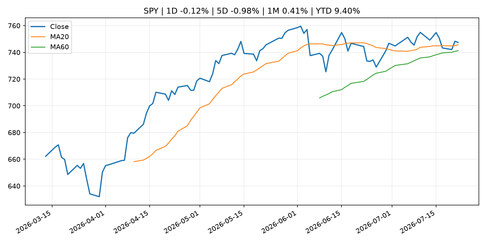
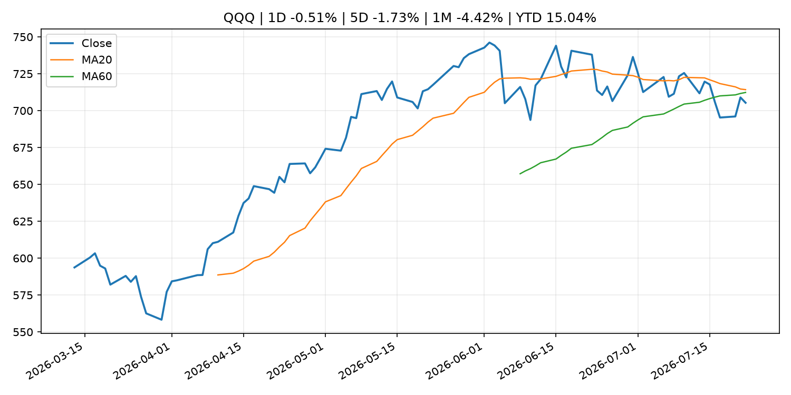
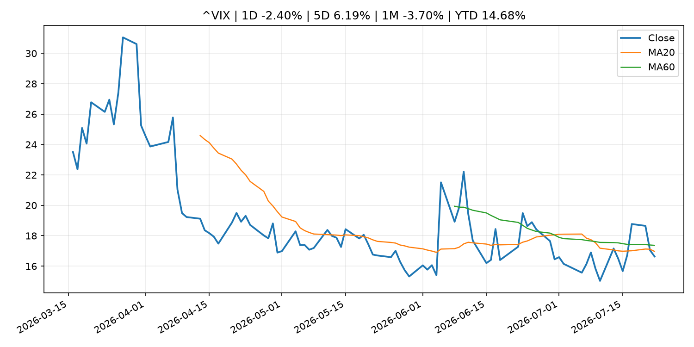
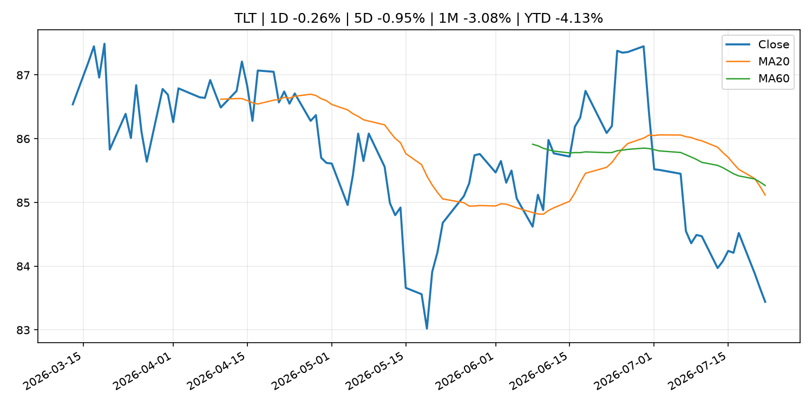
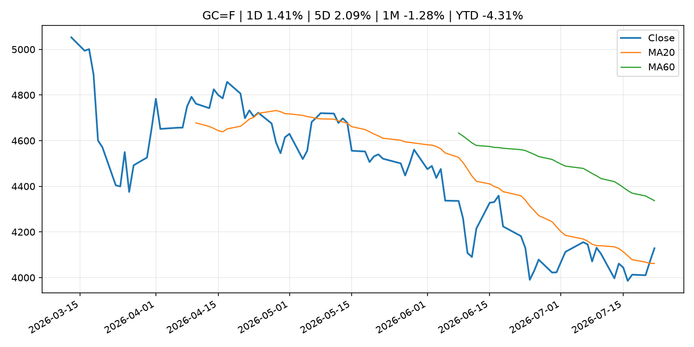
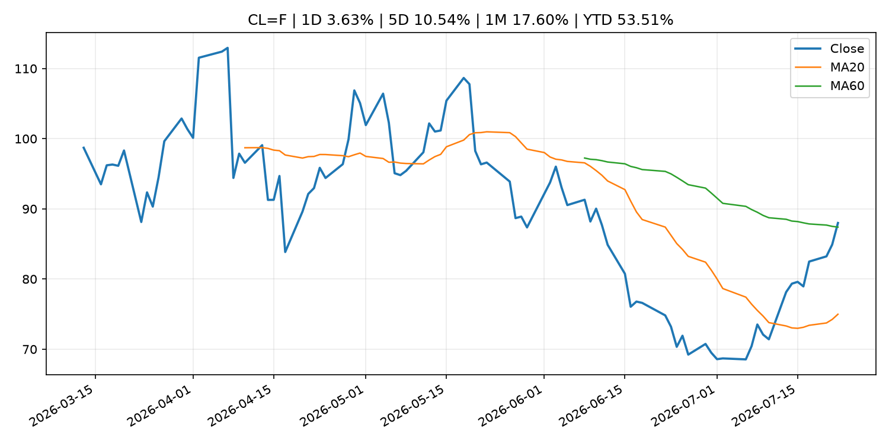
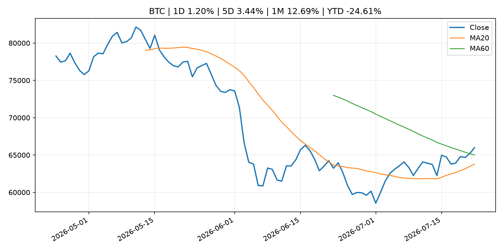
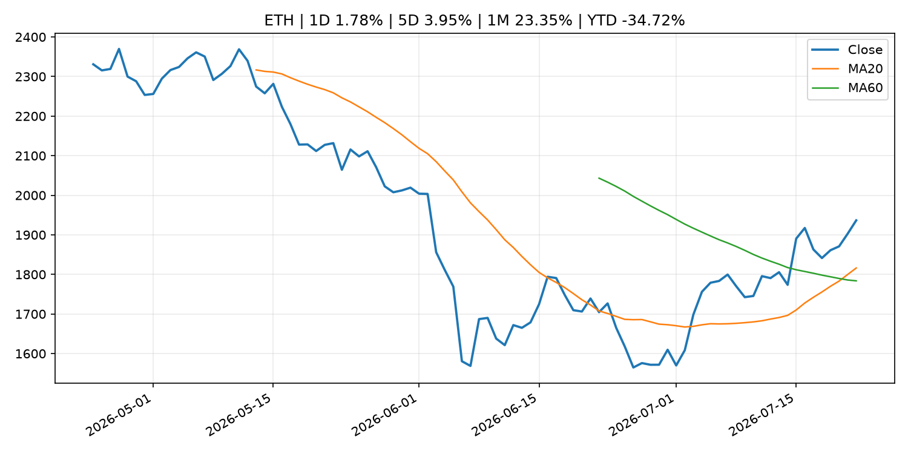
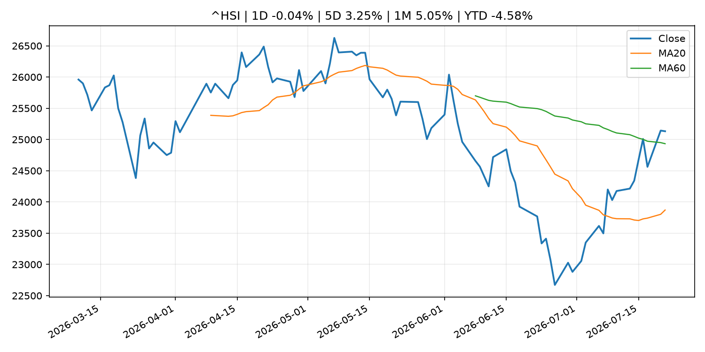

# Global Macro Morning Briefing - 2026-07-23

> Not financial advice / 非投资建议。

## 0. 今日总览
- 市场状态：unknown。市场信号不足，暂不判断明确状态。
- 今日三大主线：
  1. regulation: SEC Announces Departure of Principal Deputy Director of Enforcement Sam Waldon
  2. regulation: SEC's Peirce warns some DeFi vaults, onchain lending may fall under securities laws
  3. crypto_market_structure: Balance stablecoin collapses 99% after $1 million exploit drains its bitcoin vaults
- 一句话结论：今日晨报重点关注：监管变化会改变行业盈利预期和资产风险溢价。；监管变化会改变行业盈利预期和资产风险溢价。。跨资产方面，SPY 1D -0.12%；QQQ 1D -0.51%；^VIX 1D -2.40%；TLT 1D -0.26%；GC=F 1D 1.41%；CL=F 1D 3.63%；BTC 1D 1.20%；ETH 1D 1.78%；市场信号不足，暂不判断明确状态。政策、通胀、利率、美元、美债、能源和加密监管仍是主要观察线索。所有结论仅基于公开数据与短摘要整理，不构成投资建议。

## 1. 隔夜跨资产市场
- 美股：SPY 1D -0.12%，QQQ 1D -0.51%，整体趋势需结合 VIX 和利率确认。
- 美债/美元：TLT 1D -0.26%，美元指数 1D -0.04%，是判断折现率压力的核心线索。
- 黄金/原油：黄金 1D 1.41%，原油 1D 3.63%，用于观察避险、通胀和地缘风险。
- 加密：BTC 1D 1.20%，ETH 1D 1.78%，关注是否独立于纳指走出加密自身行情。
- 港股/A股：恒生 1D -0.04%，沪深300/上证 1D n/a，重点看中国政策预期与人民币线索。
- 风险观察：关注后续数据是否确认当前跨资产信号。

### US_EQUITY

| symbol | latest close | 1D | 5D | 1M | YTD | trend |
|---|---:|---:|---:|---:|---:|---|
| SPY | 747.41 | -0.12% | -0.98% | 0.41% | 9.40% | uptrend |
| QQQ | 705.35 | -0.51% | -1.73% | -4.42% | 15.04% | range_bound |
| DIA | 521.47 | -0.01% | -0.85% | 0.85% | 7.82% | range_bound |
| IWM | 293.79 | -0.93% | -0.67% | -1.47% | 18.09% | range_bound |
| VTI | 368.87 | -0.16% | -0.95% | 0.02% | 9.68% | uptrend |

### US_MACRO_MARKET

| symbol | latest close | 1D | 5D | 1M | YTD | trend |
|---|---:|---:|---:|---:|---:|---|
| ^VIX | 16.64 | -2.40% | 6.19% | -3.70% | 14.68% | downtrend |
| DX-Y.NYB | 101.14 | -0.04% | 0.64% | 0.12% | 2.76% | uptrend |
| TLT | 83.44 | -0.26% | -0.95% | -3.08% | -4.13% | strong_downtrend |
| IEF | 93.10 | -0.23% | -0.73% | -0.96% | -3.10% | downtrend |

### COMMODITIES

| symbol | latest close | 1D | 5D | 1M | YTD | trend |
|---|---:|---:|---:|---:|---:|---|
| GC=F | 4,128.40 | 1.41% | 2.09% | -1.28% | -4.31% | range_bound |
| SI=F | 59.67 | 1.41% | 4.47% | -8.95% | -15.44% | range_bound |
| CL=F | 87.99 | 3.63% | 10.54% | 17.60% | 53.51% | range_bound |
| BZ=F | 95.58 | 5.02% | 12.51% | 22.70% | 57.33% | range_bound |
| NG=F | 2.94 | 2.55% | 0.48% | -9.68% | -18.79% | range_bound |
| HG=F | 6.48 | -0.54% | 2.90% | 1.88% | 14.82% | range_bound |

### HK_MARKET

| symbol | latest close | 1D | 5D | 1M | YTD | trend |
|---|---:|---:|---:|---:|---:|---|
| ^HSI | 25,132.29 | -0.04% | 3.25% | 5.05% | -4.58% | range_bound |
| 0700.HK | 440.60 | -7.05% | -7.05% | 1.76% | -29.28% | downtrend |
| 9988.HK | 113.60 | -2.91% | 0.18% | 10.40% | -23.76% | range_bound |
| 3690.HK | 83.65 | -1.82% | 0.30% | 16.18% | -20.03% | range_bound |
| 1810.HK | 26.68 | -2.70% | 3.17% | 12.48% | -33.76% | range_bound |
| 1211.HK | 87.85 | -2.17% | 1.04% | 12.13% | -11.04% | range_bound |

### CRYPTO

| symbol | latest close | 1D | 5D | 1M | YTD | trend |
|---|---:|---:|---:|---:|---:|---|
| BTC | 65,982.78 | 1.20% | 3.44% | 12.69% | -24.61% | range_bound |
| ETH | 1,936.59 | 1.78% | 3.95% | 23.35% | -34.72% | strong_uptrend |
| SOLANA | 77.94 | 0.32% | 3.54% | 6.01% | -37.41% | range_bound |
| BINANCECOIN | 570.96 | 0.04% | -0.19% | 4.63% | -33.85% | downtrend |
| RIPPLE | 1.14 | 2.65% | 5.06% | 9.88% | -37.95% | range_bound |

## 2. 今日最重要的 10 条新闻
### 1. SEC Announces Departure of Principal Deputy Director of Enforcement Sam Waldon
- 来源：SEC Press Releases
- 时间：2026-07-22T09:45:25-04:00
- 地区：US
- 事件类型：regulation
- 重要性层级：Tier 2
- 一句话摘要：The Securities and Exchange Commission today announced that Sam Waldon, Principal Deputy Director of the Division of Enforcement, will depart the agency on July 31, 2026, after more than 14 years at the SEC. He will be succeeded as Principal Deputy…
- 为什么重要：监管变化会改变行业盈利预期和资产风险溢价。
- 可能影响：主要影响 BTC，方向为 mixed，强度 high；加密监管或 ETF 进展会改变 BTC 的资金流和风险溢价。
  - 资产：BTC
    方向：mixed
    强度：high
    原因：加密监管或 ETF 进展会改变 BTC 的资金流和风险溢价。
  - 资产：ETH
    方向：mixed
    强度：high
    原因：监管框架会影响 ETH 产品化和机构参与度。
  - 资产：COIN
    方向：mixed
    强度：medium
    原因：监管清晰度和执法风险会影响交易平台估值。
  - 资产：crypto market
    方向：mixed
    强度：high
    原因：信息影响整个加密市场结构，但方向取决于细节。
- 原文链接：[https://www.sec.gov/newsroom/press-releases/2026-68-sec-announces-departure-principal-deputy-director-enforcement-sam-waldon](https://www.sec.gov/newsroom/press-releases/2026-68-sec-announces-departure-principal-deputy-director-enforcement-sam-waldon)

### 2. SEC's Peirce warns some DeFi vaults, onchain lending may fall under securities laws
- 来源：CoinDesk
- 时间：2026-07-22T15:37:36+00:00
- 地区：global
- 事件类型：regulation
- 重要性层级：Tier 2
- 一句话摘要：SEC's Peirce warns some DeFi vaults, onchain lending may fall under securities laws
- 为什么重要：监管变化会改变行业盈利预期和资产风险溢价。
- 可能影响：主要影响 BTC，方向为 mixed，强度 high；加密监管或 ETF 进展会改变 BTC 的资金流和风险溢价。
  - 资产：BTC
    方向：mixed
    强度：high
    原因：加密监管或 ETF 进展会改变 BTC 的资金流和风险溢价。
  - 资产：ETH
    方向：mixed
    强度：high
    原因：监管框架会影响 ETH 产品化和机构参与度。
  - 资产：COIN
    方向：mixed
    强度：medium
    原因：监管清晰度和执法风险会影响交易平台估值。
  - 资产：crypto market
    方向：mixed
    强度：high
    原因：信息影响整个加密市场结构，但方向取决于细节。
- 原文链接：[https://www.coindesk.com/policy/2026/07/22/sec-s-peirce-warns-some-defi-vaults-onchain-lending-may-fall-under-securities-laws](https://www.coindesk.com/policy/2026/07/22/sec-s-peirce-warns-some-defi-vaults-onchain-lending-may-fall-under-securities-laws)

### 3. Balance stablecoin collapses 99% after $1 million exploit drains its bitcoin vaults
- 来源：CoinDesk
- 时间：2026-07-22T09:01:54+00:00
- 地区：global
- 事件类型：crypto_market_structure
- 重要性层级：Tier 2
- 一句话摘要：Balance stablecoin collapses 99% after $1 million exploit drains its bitcoin vaults
- 为什么重要：加密市场结构和监管变化会影响 BTC、ETH 及相关股票的风险溢价。
- 可能影响：主要影响 BTC，方向为 mixed，强度 high；加密监管或 ETF 进展会改变 BTC 的资金流和风险溢价。
  - 资产：BTC
    方向：mixed
    强度：high
    原因：加密监管或 ETF 进展会改变 BTC 的资金流和风险溢价。
  - 资产：ETH
    方向：mixed
    强度：high
    原因：监管框架会影响 ETH 产品化和机构参与度。
  - 资产：COIN
    方向：mixed
    强度：medium
    原因：监管清晰度和执法风险会影响交易平台估值。
  - 资产：crypto market
    方向：mixed
    强度：high
    原因：信息影响整个加密市场结构，但方向取决于细节。
- 原文链接：[https://www.coindesk.com/tech/2026/07/22/balance-stablecoin-collapses-99-after-usd1-million-exploit-drains-its-bitcoin-vaults](https://www.coindesk.com/tech/2026/07/22/balance-stablecoin-collapses-99-after-usd1-million-exploit-drains-its-bitcoin-vaults)

### 4. IBM just cut its outlook, but not by as much as investors feared
- 来源：MarketWatch Top Stories
- 时间：2026-07-22T21:39:00+00:00
- 地区：US
- 事件类型：earnings
- 重要性层级：Tier 2
- 一句话摘要：IBM’s official earnings report comes after a bruising profit warning last week.
- 为什么重要：大型科技股盈利和资本开支会影响纳指、半导体和 AI 交易主线。
- 可能影响：可能影响利率、汇率、风险资产或大宗商品预期，但当前公开信息不足以判断明确方向。
  - 资产：暂无明确资产映射
  - 方向：unknown
  - 强度：low
  - 原因：公开信息不足以判断方向。
- 原文链接：[https://www.marketwatch.com/story/ibm-just-cut-its-outlook-why-its-stock-is-bouncing-anyway-9d36e22a?mod=mw_rss_topstories](https://www.marketwatch.com/story/ibm-just-cut-its-outlook-why-its-stock-is-bouncing-anyway-9d36e22a?mod=mw_rss_topstories)

### 5. ServiceNow’s stock rises as earnings show momentum in cybersecurity
- 来源：MarketWatch Top Stories
- 时间：2026-07-22T20:19:00+00:00
- 地区：US
- 事件类型：earnings
- 重要性层级：Tier 2
- 一句话摘要：Against a gloomy backdrop for software sentiment, ServiceNow just topped revenue expectations.
- 为什么重要：大型科技股盈利和资本开支会影响纳指、半导体和 AI 交易主线。
- 可能影响：可能影响利率、汇率、风险资产或大宗商品预期，但当前公开信息不足以判断明确方向。
  - 资产：暂无明确资产映射
  - 方向：unknown
  - 强度：low
  - 原因：公开信息不足以判断方向。
- 原文链接：[https://www.marketwatch.com/story/servicenows-stock-gains-as-earnings-show-momentum-in-cybersecurity-86e7a038?mod=mw_rss_topstories](https://www.marketwatch.com/story/servicenows-stock-gains-as-earnings-show-momentum-in-cybersecurity-86e7a038?mod=mw_rss_topstories)

### 6. Bitcoin retreats from one-month high as oil tops $85, inflation concerns resurface
- 来源：CoinDesk
- 时间：2026-07-22T10:33:33+00:00
- 地区：global
- 事件类型：other
- 重要性层级：Tier 3
- 一句话摘要：Bitcoin retreats from one-month high as oil tops $85, inflation concerns resurface
- 为什么重要：这条信息暂未匹配到重大宏观、政策或市场事件，更适合作为背景跟踪。
- 可能影响：主要影响 DXY，方向为 positive，强度 high；通胀压力可能推高政策利率预期并支撑美元。
  - 资产：DXY
    方向：positive
    强度：high
    原因：通胀压力可能推高政策利率预期并支撑美元。
  - 资产：TLT
    方向：negative
    强度：high
    原因：通胀上行通常推升收益率、压低长债价格。
  - 资产：QQQ
    方向：negative
    强度：high
    原因：更高利率对成长股估值折现率不利。
  - 资产：SPY
    方向：mixed
    强度：medium
    原因：名义增长可能支撑收入，但更高利率压制估值。
  - 资产：GC=F
    方向：mixed
    强度：medium
    原因：通胀对黄金是支撑，但实际利率上行会形成压力。
  - 资产：BTC
    方向：mixed
    强度：medium
    原因：抗通胀叙事和流动性收紧可能相互抵消。
- 原文链接：[https://www.coindesk.com/markets/2026/07/22/bitcoin-retreats-from-one-month-high-as-oil-tops-usd85-inflation-concerns-resurface](https://www.coindesk.com/markets/2026/07/22/bitcoin-retreats-from-one-month-high-as-oil-tops-usd85-inflation-concerns-resurface)

### 7. John Paulson says we are in the early stages of a long-term bull market for gold
- 来源：CNBC Economy
- 时间：2026-07-22T22:06:49+00:00
- 地区：US
- 事件类型：other
- 重要性层级：Tier 3
- 一句话摘要：He said demand for bullion continues to broaden, led by central banks that have been adding to their reserves alongside growing private-sector interest.
- 为什么重要：这条信息暂未匹配到重大宏观、政策或市场事件，更适合作为背景跟踪。
- 可能影响：更偏背景信息，短期市场影响可能有限。
  - 资产：暂无明确资产映射
  - 方向：unknown
  - 强度：low
  - 原因：公开信息不足以判断方向。
- 原文链接：[https://www.cnbc.com/2026/07/22/john-paulson-says-we-are-in-early-stages-of-a-long-term-bull-market-for-gold.html](https://www.cnbc.com/2026/07/22/john-paulson-says-we-are-in-early-stages-of-a-long-term-bull-market-for-gold.html)

## 3. 政策与央行观察
### 1. SEC Announces Departure of Principal Deputy Director of Enforcement Sam Waldon
- 来源：SEC Press Releases
- 时间：2026-07-22T09:45:25-04:00
- 地区：US
- 事件类型：regulation
- 重要性层级：Tier 2
- 一句话摘要：The Securities and Exchange Commission today announced that Sam Waldon, Principal Deputy Director of the Division of Enforcement, will depart the agency on July 31, 2026, after more than 14 years at the SEC. He will be succeeded as Principal Deputy…
- 为什么重要：监管变化会改变行业盈利预期和资产风险溢价。
- 可能影响：主要影响 BTC，方向为 mixed，强度 high；加密监管或 ETF 进展会改变 BTC 的资金流和风险溢价。
  - 资产：BTC
    方向：mixed
    强度：high
    原因：加密监管或 ETF 进展会改变 BTC 的资金流和风险溢价。
  - 资产：ETH
    方向：mixed
    强度：high
    原因：监管框架会影响 ETH 产品化和机构参与度。
  - 资产：COIN
    方向：mixed
    强度：medium
    原因：监管清晰度和执法风险会影响交易平台估值。
  - 资产：crypto market
    方向：mixed
    强度：high
    原因：信息影响整个加密市场结构，但方向取决于细节。
- 原文链接：[https://www.sec.gov/newsroom/press-releases/2026-68-sec-announces-departure-principal-deputy-director-enforcement-sam-waldon](https://www.sec.gov/newsroom/press-releases/2026-68-sec-announces-departure-principal-deputy-director-enforcement-sam-waldon)

### 2. SEC's Peirce warns some DeFi vaults, onchain lending may fall under securities laws
- 来源：CoinDesk
- 时间：2026-07-22T15:37:36+00:00
- 地区：global
- 事件类型：regulation
- 重要性层级：Tier 2
- 一句话摘要：SEC's Peirce warns some DeFi vaults, onchain lending may fall under securities laws
- 为什么重要：监管变化会改变行业盈利预期和资产风险溢价。
- 可能影响：主要影响 BTC，方向为 mixed，强度 high；加密监管或 ETF 进展会改变 BTC 的资金流和风险溢价。
  - 资产：BTC
    方向：mixed
    强度：high
    原因：加密监管或 ETF 进展会改变 BTC 的资金流和风险溢价。
  - 资产：ETH
    方向：mixed
    强度：high
    原因：监管框架会影响 ETH 产品化和机构参与度。
  - 资产：COIN
    方向：mixed
    强度：medium
    原因：监管清晰度和执法风险会影响交易平台估值。
  - 资产：crypto market
    方向：mixed
    强度：high
    原因：信息影响整个加密市场结构，但方向取决于细节。
- 原文链接：[https://www.coindesk.com/policy/2026/07/22/sec-s-peirce-warns-some-defi-vaults-onchain-lending-may-fall-under-securities-laws](https://www.coindesk.com/policy/2026/07/22/sec-s-peirce-warns-some-defi-vaults-onchain-lending-may-fall-under-securities-laws)

### 3. Balance stablecoin collapses 99% after $1 million exploit drains its bitcoin vaults
- 来源：CoinDesk
- 时间：2026-07-22T09:01:54+00:00
- 地区：global
- 事件类型：crypto_market_structure
- 重要性层级：Tier 2
- 一句话摘要：Balance stablecoin collapses 99% after $1 million exploit drains its bitcoin vaults
- 为什么重要：加密市场结构和监管变化会影响 BTC、ETH 及相关股票的风险溢价。
- 可能影响：主要影响 BTC，方向为 mixed，强度 high；加密监管或 ETF 进展会改变 BTC 的资金流和风险溢价。
  - 资产：BTC
    方向：mixed
    强度：high
    原因：加密监管或 ETF 进展会改变 BTC 的资金流和风险溢价。
  - 资产：ETH
    方向：mixed
    强度：high
    原因：监管框架会影响 ETH 产品化和机构参与度。
  - 资产：COIN
    方向：mixed
    强度：medium
    原因：监管清晰度和执法风险会影响交易平台估值。
  - 资产：crypto market
    方向：mixed
    强度：high
    原因：信息影响整个加密市场结构，但方向取决于细节。
- 原文链接：[https://www.coindesk.com/tech/2026/07/22/balance-stablecoin-collapses-99-after-usd1-million-exploit-drains-its-bitcoin-vaults](https://www.coindesk.com/tech/2026/07/22/balance-stablecoin-collapses-99-after-usd1-million-exploit-drains-its-bitcoin-vaults)

## 4. 市场异动与图表
- QQQ 下跌 -0.51%
- Gold 上涨 1.41%
- Oil 上涨 3.63%

### SPY

### QQQ

### ^VIX

### TLT

### GC=F

### CL=F

### BTC

### ETH

### ^HSI

## 5. 华尔街与机构公开观点
- 暂无可靠公开观点。

## 6. 今日重点关注
- 经济数据：经济数据：暂无可靠公开日历数据；如配置经济日历源后可自动填充。
- 央行讲话：央行讲话：暂无可靠公开日历数据；重点跟踪 Fed、ECB、BoJ、PBOC 官网 RSS。
- 财报：财报：暂无可靠数据。
- 政策事件：政策事件：暂无可靠数据。
- 风险提醒：风险提醒：关注数据源失败项、突发地缘风险、利率和美元的二阶反应。

## 7. 英文金融表达与宏观概念
- **inflation expectations**：通胀预期，指家庭、企业或市场对未来通胀的预估。 例句：Inflation expectations can shape wage bargaining and bond yields.
- **real yield**：实际收益率，名义利率扣除通胀预期后的收益率。 例句：Gold often reacts more to real yields than nominal yields.
- **risk-off**：避险模式，资金偏向美元、国债、黄金等防御资产。 例句：A geopolitical shock can push markets into risk-off mode.
- **supply disruption**：供给扰动，通常指能源或商品供应受冲突、减产或天气影响。 例句：Supply disruption can lift oil prices and inflation expectations.
- **market structure**：市场结构，指交易、托管、清算、ETF、监管等制度安排。 例句：Crypto market structure rules can affect institutional participation.
- **terminal rate**：终端利率，市场预期本轮加息周期的最高政策利率。 例句：A higher terminal rate can pressure growth stocks.

## 8. 背景材料
- [My second husband and I have kids from previous relationships. Should my house go to him or my children if I die first?](https://www.marketwatch.com/story/i-have-children-from-my-first-marriage-should-my-second-husband-inherit-my-house-if-i-die-d9bd8687?mod=mw_rss_topstories)（MarketWatch Top Stories，other）：“We live in a house that I purchased entirely with money I had before we were married.”
- [John Paulson says we are in the early stages of a long-term bull market for gold](https://www.cnbc.com/2026/07/22/john-paulson-says-we-are-in-early-stages-of-a-long-term-bull-market-for-gold.html)（CNBC Economy，other）：He said demand for bullion continues to broaden, led by central banks that have been adding to their reserves alongside growing private-sector interest.
- [Tesla holds bitcoin treasury steady, reports $112M impairment loss](https://www.coindesk.com/markets/2026/07/22/tesla-holds-bitcoin-steady-reports-usd112m-impairment-loss)（CoinDesk，other）：Tesla holds bitcoin treasury steady, reports $112M impairment loss
- [The Treasury market touches a worrying milestone not seen since 2007](https://www.marketwatch.com/story/the-treasury-market-is-on-the-verge-of-a-worrying-milestone-not-seen-since-2007-81158082?mod=mw_rss_topstories)（MarketWatch Top Stories，other）：There are a host of challenges at work as the ‘long’ 30-year Treasury yield logs its longest stretch above 5% in 19 years
- [Here's why bitcoin bulls should take a closer look at interest rates](https://www.coindesk.com/daybook-us/2026/07/22/here-s-why-bitcoin-bulls-should-take-a-closer-look-at-interest-rates)（CoinDesk，other）：Here's why bitcoin bulls should take a closer look at interest rates
- [SecondFi to shut down after $2.4 million ADA wallet theft](https://www.coindesk.com/web3/2026/07/22/secondfi-to-shut-down-after-usd2-4-million-ada-wallet-theft)（CoinDesk，other）：SecondFi to shut down after $2.4 million ADA wallet theft
- [Bitcoin retreats from one-month high as oil tops $85, inflation concerns resurface](https://www.coindesk.com/markets/2026/07/22/bitcoin-retreats-from-one-month-high-as-oil-tops-usd85-inflation-concerns-resurface)（CoinDesk，other）：Bitcoin retreats from one-month high as oil tops $85, inflation concerns resurface
- [Kraken parent expands tokenized stocks to Hong Kong, UK and South Korea equities](https://www.coindesk.com/business/2026/07/22/kraken-parent-expands-tokenized-stocks-to-hong-kong-uk-and-south-korea-equities)（CoinDesk，other）：Kraken parent expands tokenized stocks to Hong Kong, UK and South Korea equities
- [Live updates: Bitcoin holds near $66,000 as stocks claw back from big early decline](https://www.coindesk.com/tech/2026/07/22/live-updates-bitcoin-under-usd66-000-as-traders-await-alphabet-earnings-to-gauge-ai-trade)（CoinDesk，other）：Live updates: Bitcoin holds near $66,000 as stocks claw back from big early decline
- [Japanese Government Bonds Held by the Bank of Japan](http://www.boj.or.jp/en/statistics/boj/other/mei/release/2026/mei260717.xlsx)（Bank of Japan Announcements，other）：Japanese Government Bonds Held by the Bank of Japan
- [(BOJ Review) The Development and Strengthening of International Forums in Asia with the Participation of the Bank of Japan](http://www.boj.or.jp/en/research/wps_rev/rev_2026/rev26e09.htm)（Bank of Japan Announcements，other）：(BOJ Review) The Development and Strengthening of International Forums in Asia with the Participation of the Bank of Japan
- [Bitcoin holds near $66,300 as chips extend their rally and the yen hits a 40-year low](https://www.coindesk.com/markets/2026/07/22/bitcoin-holds-near-usd66-300-as-chips-extend-their-rally-and-the-yen-hits-a-40-year-low)（CoinDesk，other）：Bitcoin holds near $66,300 as chips extend their rally and the yen hits a 40-year low
- [Meeting on the Fifth Market Functioning Survey concerning Climate Change](http://www.boj.or.jp/en/paym/m-climate/mcli260722a.htm)（Bank of Japan Announcements，other）：Meeting on the Fifth Market Functioning Survey concerning Climate Change
- [Bank of Japan Accounts (July 20)](http://www.boj.or.jp/en/statistics/boj/other/acmai/release/2026/ac260720.htm)（Bank of Japan Announcements，routine_announcement）：Bank of Japan Accounts (July 20)
- [Statistics on Securities Financing Transactions in Japan](http://www.boj.or.jp/en/statistics/bis/repo/index.htm)（Bank of Japan Announcements，other）：Statistics on Securities Financing Transactions in Japan
- [Crypto Clarity Act still at mercy of ethics section as Democrats balk at Trump deal](https://www.coindesk.com/policy/2026/07/21/crypto-clarity-act-still-at-mercy-of-ethics-section-as-democrats-balk-at-trump-deal)（CoinDesk，other）：Crypto Clarity Act still at mercy of ethics section as Democrats balk at Trump deal
- [Goldman Sachs creates private markets platform as rich investors seek the next SpaceX and Stripe](https://www.cnbc.com/2026/07/21/goldman-sachs-private-markets-platform.html)（CNBC Economy，other）：Goldman Sachs is launching a new alternative investments platform aimed at giving wealthy clients and family offices direct stakes in private companies.
- [Bitcoin rally faces key test at $68,000 as 'summer slumber' grips crypto, analysts say](https://www.coindesk.com/markets/2026/07/21/bitcoin-rally-faces-key-test-at-usd68-000-as-summer-slumber-grips-crypto-analysts-say)（CoinDesk，other）：Bitcoin rally faces key test at $68,000 as 'summer slumber' grips crypto, analysts say
- [Claude's Fable 5 just solved an 87-year-old math problem, and it matters for bitcoin](https://www.coindesk.com/tech/2026/07/21/claude-s-fable-5-just-solved-an-87-year-old-math-problem-and-it-matters-for-bitcoin)（CoinDesk，other）：Claude's Fable 5 just solved an 87-year-old math problem, and it matters for bitcoin
- [ECB appoints Boris Kisselevsky as Director General Secretariat](https://www.ecb.europa.eu//press/pr/date/2026/html/ecb.pr260721_1~8c6ba4c5fb.en.html)（ECB Press Releases，other）：ECB appoints Boris Kisselevsky as Director General Secretariat

## 9. 数据源、失败项与免责声明
- 采集时间：2026-07-22T23:00:51
- 数据源：公开 RSS、Yahoo Finance、CoinGecko、AKShare、FRED、SEC data.sec.gov，以及用户自有 inputs/reports 文件。
- 合规说明：不绕过 WSJ、Bloomberg、FT、Reuters 等付费墙；对付费媒体只使用公开 RSS 标题、摘要、链接和发布时间。
- 免责声明：Not financial advice / 非投资建议。本项目仅供个人学习、研究和信息整理，不构成投资建议、交易建议或任何收益承诺。
- 失败或跳过的数据源：
  - crypto data failed coin=dogecoin
  - China market data failed symbol=上证指数: empty dataframe
  - China market data failed symbol=深证成指: empty dataframe
  - China market data failed symbol=创业板指: empty dataframe
  - China market data failed symbol=沪深300: empty dataframe
  - China market data failed symbol=中证500: empty dataframe
  - China market data failed symbol=科创50: empty dataframe
  - FRED_API_KEY not set; skipping FRED macro series
  - SEC failed cik=0000320193
  - SEC failed cik=0000789019
  - SEC failed cik=0001045810
  - SEC failed cik=0001318605
  - SEC failed cik=0001577552
